cola Report for GDS4971
==================

**Date**: 2019-12-25 21:54:38 CET, **cola version**: 1.3.2

----------------------------------------------------------------

<style type='text/css'>

body, td, th {
   font-family: Arial,Helvetica,sans-serif;
   background-color: white;
   font-size: 13px;
  max-width: 800px;
  margin: auto;
  margin-left:210px;
  padding: 0px 10px 0px 10px;
  border-left: 1px solid #EEEEEE;
  line-height: 150%;
}

tt, code, pre {
   font-family: 'DejaVu Sans Mono', 'Droid Sans Mono', 'Lucida Console', Consolas, Monaco, 

monospace;
}

h1 {
   font-size:2.2em;
}

h2 {
   font-size:1.8em;
}

h3 {
   font-size:1.4em;
}

h4 {
   font-size:1.0em;
}

h5 {
   font-size:0.9em;
}

h6 {
   font-size:0.8em;
}

a {
  text-decoration: none;
  color: #0366d6;
}

a:hover {
  text-decoration: underline;
}

a:visited {
   color: #0366d6;
}

pre, img {
  max-width: 100%;
}
pre {
  overflow-x: auto;
}
pre code {
   display: block; padding: 0.5em;
}

code {
  font-size: 92%;
  border: 1px solid #ccc;
}

code[class] {
  background-color: #F8F8F8;
}

table, td, th {
  border: 1px solid #ccc;
}

blockquote {
   color:#666666;
   margin:0;
   padding-left: 1em;
   border-left: 0.5em #EEE solid;
}

hr {
   height: 0px;
   border-bottom: none;
   border-top-width: thin;
   border-top-style: dotted;
   border-top-color: #999999;
}

@media print {
   * {
      background: transparent !important;
      color: black !important;
      filter:none !important;
      -ms-filter: none !important;
   }

   body {
      font-size:12pt;
      max-width:100%;
   }

   a, a:visited {
      text-decoration: underline;
   }

   hr {
      visibility: hidden;
      page-break-before: always;
   }

   pre, blockquote {
      padding-right: 1em;
      page-break-inside: avoid;
   }

   tr, img {
      page-break-inside: avoid;
   }

   img {
      max-width: 100% !important;
   }

   @page :left {
      margin: 15mm 20mm 15mm 10mm;
   }

   @page :right {
      margin: 15mm 10mm 15mm 20mm;
   }

   p, h2, h3 {
      orphans: 3; widows: 3;
   }

   h2, h3 {
      page-break-after: avoid;
   }
}
</style>


## Summary


All available functions which can be applied to this `res_list` object:


```r
res_list
```

```
#> A 'ConsensusPartitionList' object with 24 methods.
#>   On a matrix with 23598 rows and 163 columns.
#>   Top rows are extracted by 'SD, CV, MAD, ATC' methods.
#>   Subgroups are detected by 'hclust, kmeans, skmeans, pam, mclust, NMF' method.
#>   Number of partitions are tried for k = 2, 3, 4, 5, 6.
#>   Performed in total 30000 partitions by row resampling.
#> 
#> Following methods can be applied to this 'ConsensusPartitionList' object:
#>  [1] "cola_report"           "collect_classes"       "collect_plots"         "collect_stats"        
#>  [5] "colnames"              "functional_enrichment" "get_anno_col"          "get_anno"             
#>  [9] "get_classes"           "get_matrix"            "get_membership"        "get_stats"            
#> [13] "is_best_k"             "is_stable_k"           "ncol"                  "nrow"                 
#> [17] "rownames"              "show"                  "suggest_best_k"        "test_to_known_factors"
#> [21] "top_rows_heatmap"      "top_rows_overlap"     
#> 
#> You can get result for a single method by, e.g. object["SD", "hclust"] or object["SD:hclust"]
#> or a subset of methods by object[c("SD", "CV")], c("hclust", "kmeans")]
```

The call of `run_all_consensus_partition_methods()` was:


```
#> run_all_consensus_partition_methods(data = mat, mc.cores = 4, anno = anno)
```

Dimension of the input matrix:


```r
mat = get_matrix(res_list)
dim(mat)
```

```
#> [1] 23598   163
```

### Density distribution

The density distribution for each sample is visualized as in one column in the
following heatmap. The clustering is based on the distance which is the
Kolmogorov-Smirnov statistic between two distributions.


```r
library(ComplexHeatmap)
densityHeatmap(mat, top_annotation = HeatmapAnnotation(df = get_anno(res_list), 
    col = get_anno_col(res_list)), ylab = "value", cluster_columns = TRUE, show_column_names = FALSE,
    mc.cores = 4)
```


### Suggest the best k


Folowing table shows the best `k` (number of partitions) for each combination
of top-value methods and partition methods. Clicking on the method name in
the table goes to the section for a single combination of methods.

[The cola vignette](http://bioconductor.org/packages/devel/bioc/vignettes/cola/inst/doc/cola.html#toc_13)
explains the definition of the metrics used for determining the best
number of partitions.


```r
suggest_best_k(res_list)
```


|                            | The best k| 1-PAC| Mean silhouette| Concordance|   |Optional k |
|:---------------------------|----------:|-----:|---------------:|-----------:|:--|:----------|
|[ATC:kmeans](#ATC-kmeans)   |          2| 1.000|           0.959|       0.980|** |           |
|[ATC:mclust](#ATC-mclust)   |          3| 0.996|           0.961|       0.977|** |           |
|[MAD:pam](#MAD-pam)         |          2| 0.967|           0.946|       0.973|** |           |
|[CV:skmeans](#CV-skmeans)   |          4| 0.961|           0.937|       0.968|** |3          |
|[SD:skmeans](#SD-skmeans)   |          4| 0.952|           0.933|       0.960|** |3          |
|[MAD:skmeans](#MAD-skmeans) |          4| 0.948|           0.925|       0.964|*  |3          |
|[ATC:skmeans](#ATC-skmeans) |          4| 0.948|           0.917|       0.954|*  |2          |
|[CV:kmeans](#CV-kmeans)     |          3| 0.932|           0.933|       0.960|*  |           |
|[MAD:kmeans](#MAD-kmeans)   |          3| 0.927|           0.940|       0.958|*  |           |
|[SD:NMF](#SD-NMF)           |          3| 0.915|           0.924|       0.966|*  |           |
|[SD:kmeans](#SD-kmeans)     |          3| 0.910|           0.933|       0.954|*  |           |
|[MAD:NMF](#MAD-NMF)         |          3| 0.907|           0.913|       0.962|*  |           |
|[CV:mclust](#CV-mclust)     |          3| 0.906|           0.926|       0.967|*  |           |
|[CV:NMF](#CV-NMF)           |          3| 0.899|           0.921|       0.966|   |           |
|[MAD:mclust](#MAD-mclust)   |          3| 0.885|           0.933|       0.966|   |           |
|[SD:mclust](#SD-mclust)     |          3| 0.826|           0.923|       0.961|   |           |
|[ATC:NMF](#ATC-NMF)         |          2| 0.762|           0.877|       0.948|   |           |
|[ATC:pam](#ATC-pam)         |          4| 0.742|           0.811|       0.901|   |           |
|[CV:pam](#CV-pam)           |          3| 0.638|           0.771|       0.886|   |           |
|[SD:pam](#SD-pam)           |          2| 0.546|           0.884|       0.929|   |           |
|[ATC:hclust](#ATC-hclust)   |          4| 0.527|           0.663|       0.761|   |           |
|[MAD:hclust](#MAD-hclust)   |          2| 0.504|           0.753|       0.889|   |           |
|[SD:hclust](#SD-hclust)     |          2| 0.484|           0.766|       0.882|   |           |
|[CV:hclust](#CV-hclust)     |          2| 0.474|           0.721|       0.880|   |           |

\*\*: 1-PAC > 0.95, \*: 1-PAC > 0.9


### CDF of consensus matrices

Cumulative distribution function curves of consensus matrix for all methods.


```r
collect_plots(res_list, fun = plot_ecdf)
```


### Consensus heatmap

Consensus heatmaps for all methods. ([What is a consensus heatmap?](http://bioconductor.org/packages/devel/bioc/vignettes/cola/inst/doc/cola.html#toc_9))


<style type='text/css'>


.ui-helper-hidden {
	display: none;
}
.ui-helper-hidden-accessible {
	border: 0;
	clip: rect(0 0 0 0);
	height: 1px;
	margin: -1px;
	overflow: hidden;
	padding: 0;
	position: absolute;
	width: 1px;
}
.ui-helper-reset {
	margin: 0;
	padding: 0;
	border: 0;
	outline: 0;
	line-height: 1.3;
	text-decoration: none;
	font-size: 100%;
	list-style: none;
}
.ui-helper-clearfix:before,
.ui-helper-clearfix:after {
	content: "";
	display: table;
	border-collapse: collapse;
}
.ui-helper-clearfix:after {
	clear: both;
}
.ui-helper-zfix {
	width: 100%;
	height: 100%;
	top: 0;
	left: 0;
	position: absolute;
	opacity: 0;
	filter:Alpha(Opacity=0); 
}

.ui-front {
	z-index: 100;
}


.ui-state-disabled {
	cursor: default !important;
	pointer-events: none;
}


.ui-icon {
	display: inline-block;
	vertical-align: middle;
	margin-top: -.25em;
	position: relative;
	text-indent: -99999px;
	overflow: hidden;
	background-repeat: no-repeat;
}

.ui-widget-icon-block {
	left: 50%;
	margin-left: -8px;
	display: block;
}


.ui-widget-overlay {
	position: fixed;
	top: 0;
	left: 0;
	width: 100%;
	height: 100%;
}
.ui-accordion .ui-accordion-header {
	display: block;
	cursor: pointer;
	position: relative;
	margin: 2px 0 0 0;
	padding: .5em .5em .5em .7em;
	font-size: 100%;
}
.ui-accordion .ui-accordion-content {
	padding: 1em 2.2em;
	border-top: 0;
	overflow: auto;
}
.ui-autocomplete {
	position: absolute;
	top: 0;
	left: 0;
	cursor: default;
}
.ui-menu {
	list-style: none;
	padding: 0;
	margin: 0;
	display: block;
	outline: 0;
}
.ui-menu .ui-menu {
	position: absolute;
}
.ui-menu .ui-menu-item {
	margin: 0;
	cursor: pointer;
	
	list-style-image: url("data:image/gif;base64,R0lGODlhAQABAIAAAAAAAP///yH5BAEAAAAALAAAAAABAAEAAAIBRAA7");
}
.ui-menu .ui-menu-item-wrapper {
	position: relative;
	padding: 3px 1em 3px .4em;
}
.ui-menu .ui-menu-divider {
	margin: 5px 0;
	height: 0;
	font-size: 0;
	line-height: 0;
	border-width: 1px 0 0 0;
}
.ui-menu .ui-state-focus,
.ui-menu .ui-state-active {
	margin: -1px;
}


.ui-menu-icons {
	position: relative;
}
.ui-menu-icons .ui-menu-item-wrapper {
	padding-left: 2em;
}


.ui-menu .ui-icon {
	position: absolute;
	top: 0;
	bottom: 0;
	left: .2em;
	margin: auto 0;
}


.ui-menu .ui-menu-icon {
	left: auto;
	right: 0;
}
.ui-button {
	padding: .4em 1em;
	display: inline-block;
	position: relative;
	line-height: normal;
	margin-right: .1em;
	cursor: pointer;
	vertical-align: middle;
	text-align: center;
	-webkit-user-select: none;
	-moz-user-select: none;
	-ms-user-select: none;
	user-select: none;

	
	overflow: visible;
}

.ui-button,
.ui-button:link,
.ui-button:visited,
.ui-button:hover,
.ui-button:active {
	text-decoration: none;
}


.ui-button-icon-only {
	width: 2em;
	box-sizing: border-box;
	text-indent: -9999px;
	white-space: nowrap;
}


input.ui-button.ui-button-icon-only {
	text-indent: 0;
}


.ui-button-icon-only .ui-icon {
	position: absolute;
	top: 50%;
	left: 50%;
	margin-top: -8px;
	margin-left: -8px;
}

.ui-button.ui-icon-notext .ui-icon {
	padding: 0;
	width: 2.1em;
	height: 2.1em;
	text-indent: -9999px;
	white-space: nowrap;

}

input.ui-button.ui-icon-notext .ui-icon {
	width: auto;
	height: auto;
	text-indent: 0;
	white-space: normal;
	padding: .4em 1em;
}


input.ui-button::-moz-focus-inner,
button.ui-button::-moz-focus-inner {
	border: 0;
	padding: 0;
}
.ui-controlgroup {
	vertical-align: middle;
	display: inline-block;
}
.ui-controlgroup > .ui-controlgroup-item {
	float: left;
	margin-left: 0;
	margin-right: 0;
}
.ui-controlgroup > .ui-controlgroup-item:focus,
.ui-controlgroup > .ui-controlgroup-item.ui-visual-focus {
	z-index: 9999;
}
.ui-controlgroup-vertical > .ui-controlgroup-item {
	display: block;
	float: none;
	width: 100%;
	margin-top: 0;
	margin-bottom: 0;
	text-align: left;
}
.ui-controlgroup-vertical .ui-controlgroup-item {
	box-sizing: border-box;
}
.ui-controlgroup .ui-controlgroup-label {
	padding: .4em 1em;
}
.ui-controlgroup .ui-controlgroup-label span {
	font-size: 80%;
}
.ui-controlgroup-horizontal .ui-controlgroup-label + .ui-controlgroup-item {
	border-left: none;
}
.ui-controlgroup-vertical .ui-controlgroup-label + .ui-controlgroup-item {
	border-top: none;
}
.ui-controlgroup-horizontal .ui-controlgroup-label.ui-widget-content {
	border-right: none;
}
.ui-controlgroup-vertical .ui-controlgroup-label.ui-widget-content {
	border-bottom: none;
}


.ui-controlgroup-vertical .ui-spinner-input {

	
	width: 75%;
	width: calc( 100% - 2.4em );
}
.ui-controlgroup-vertical .ui-spinner .ui-spinner-up {
	border-top-style: solid;
}

.ui-checkboxradio-label .ui-icon-background {
	box-shadow: inset 1px 1px 1px #ccc;
	border-radius: .12em;
	border: none;
}
.ui-checkboxradio-radio-label .ui-icon-background {
	width: 16px;
	height: 16px;
	border-radius: 1em;
	overflow: visible;
	border: none;
}
.ui-checkboxradio-radio-label.ui-checkboxradio-checked .ui-icon,
.ui-checkboxradio-radio-label.ui-checkboxradio-checked:hover .ui-icon {
	background-image: none;
	width: 8px;
	height: 8px;
	border-width: 4px;
	border-style: solid;
}
.ui-checkboxradio-disabled {
	pointer-events: none;
}
.ui-datepicker {
	width: 17em;
	padding: .2em .2em 0;
	display: none;
}
.ui-datepicker .ui-datepicker-header {
	position: relative;
	padding: .2em 0;
}
.ui-datepicker .ui-datepicker-prev,
.ui-datepicker .ui-datepicker-next {
	position: absolute;
	top: 2px;
	width: 1.8em;
	height: 1.8em;
}
.ui-datepicker .ui-datepicker-prev-hover,
.ui-datepicker .ui-datepicker-next-hover {
	top: 1px;
}
.ui-datepicker .ui-datepicker-prev {
	left: 2px;
}
.ui-datepicker .ui-datepicker-next {
	right: 2px;
}
.ui-datepicker .ui-datepicker-prev-hover {
	left: 1px;
}
.ui-datepicker .ui-datepicker-next-hover {
	right: 1px;
}
.ui-datepicker .ui-datepicker-prev span,
.ui-datepicker .ui-datepicker-next span {
	display: block;
	position: absolute;
	left: 50%;
	margin-left: -8px;
	top: 50%;
	margin-top: -8px;
}
.ui-datepicker .ui-datepicker-title {
	margin: 0 2.3em;
	line-height: 1.8em;
	text-align: center;
}
.ui-datepicker .ui-datepicker-title select {
	font-size: 1em;
	margin: 1px 0;
}
.ui-datepicker select.ui-datepicker-month,
.ui-datepicker select.ui-datepicker-year {
	width: 45%;
}
.ui-datepicker table {
	width: 100%;
	font-size: .9em;
	border-collapse: collapse;
	margin: 0 0 .4em;
}
.ui-datepicker th {
	padding: .7em .3em;
	text-align: center;
	font-weight: bold;
	border: 0;
}
.ui-datepicker td {
	border: 0;
	padding: 1px;
}
.ui-datepicker td span,
.ui-datepicker td a {
	display: block;
	padding: .2em;
	text-align: right;
	text-decoration: none;
}
.ui-datepicker .ui-datepicker-buttonpane {
	background-image: none;
	margin: .7em 0 0 0;
	padding: 0 .2em;
	border-left: 0;
	border-right: 0;
	border-bottom: 0;
}
.ui-datepicker .ui-datepicker-buttonpane button {
	float: right;
	margin: .5em .2em .4em;
	cursor: pointer;
	padding: .2em .6em .3em .6em;
	width: auto;
	overflow: visible;
}
.ui-datepicker .ui-datepicker-buttonpane button.ui-datepicker-current {
	float: left;
}


.ui-datepicker.ui-datepicker-multi {
	width: auto;
}
.ui-datepicker-multi .ui-datepicker-group {
	float: left;
}
.ui-datepicker-multi .ui-datepicker-group table {
	width: 95%;
	margin: 0 auto .4em;
}
.ui-datepicker-multi-2 .ui-datepicker-group {
	width: 50%;
}
.ui-datepicker-multi-3 .ui-datepicker-group {
	width: 33.3%;
}
.ui-datepicker-multi-4 .ui-datepicker-group {
	width: 25%;
}
.ui-datepicker-multi .ui-datepicker-group-last .ui-datepicker-header,
.ui-datepicker-multi .ui-datepicker-group-middle .ui-datepicker-header {
	border-left-width: 0;
}
.ui-datepicker-multi .ui-datepicker-buttonpane {
	clear: left;
}
.ui-datepicker-row-break {
	clear: both;
	width: 100%;
	font-size: 0;
}


.ui-datepicker-rtl {
	direction: rtl;
}
.ui-datepicker-rtl .ui-datepicker-prev {
	right: 2px;
	left: auto;
}
.ui-datepicker-rtl .ui-datepicker-next {
	left: 2px;
	right: auto;
}
.ui-datepicker-rtl .ui-datepicker-prev:hover {
	right: 1px;
	left: auto;
}
.ui-datepicker-rtl .ui-datepicker-next:hover {
	left: 1px;
	right: auto;
}
.ui-datepicker-rtl .ui-datepicker-buttonpane {
	clear: right;
}
.ui-datepicker-rtl .ui-datepicker-buttonpane button {
	float: left;
}
.ui-datepicker-rtl .ui-datepicker-buttonpane button.ui-datepicker-current,
.ui-datepicker-rtl .ui-datepicker-group {
	float: right;
}
.ui-datepicker-rtl .ui-datepicker-group-last .ui-datepicker-header,
.ui-datepicker-rtl .ui-datepicker-group-middle .ui-datepicker-header {
	border-right-width: 0;
	border-left-width: 1px;
}


.ui-datepicker .ui-icon {
	display: block;
	text-indent: -99999px;
	overflow: hidden;
	background-repeat: no-repeat;
	left: .5em;
	top: .3em;
}
.ui-dialog {
	position: absolute;
	top: 0;
	left: 0;
	padding: .2em;
	outline: 0;
}
.ui-dialog .ui-dialog-titlebar {
	padding: .4em 1em;
	position: relative;
}
.ui-dialog .ui-dialog-title {
	float: left;
	margin: .1em 0;
	white-space: nowrap;
	width: 90%;
	overflow: hidden;
	text-overflow: ellipsis;
}
.ui-dialog .ui-dialog-titlebar-close {
	position: absolute;
	right: .3em;
	top: 50%;
	width: 20px;
	margin: -10px 0 0 0;
	padding: 1px;
	height: 20px;
}
.ui-dialog .ui-dialog-content {
	position: relative;
	border: 0;
	padding: .5em 1em;
	background: none;
	overflow: auto;
}
.ui-dialog .ui-dialog-buttonpane {
	text-align: left;
	border-width: 1px 0 0 0;
	background-image: none;
	margin-top: .5em;
	padding: .3em 1em .5em .4em;
}
.ui-dialog .ui-dialog-buttonpane .ui-dialog-buttonset {
	float: right;
}
.ui-dialog .ui-dialog-buttonpane button {
	margin: .5em .4em .5em 0;
	cursor: pointer;
}
.ui-dialog .ui-resizable-n {
	height: 2px;
	top: 0;
}
.ui-dialog .ui-resizable-e {
	width: 2px;
	right: 0;
}
.ui-dialog .ui-resizable-s {
	height: 2px;
	bottom: 0;
}
.ui-dialog .ui-resizable-w {
	width: 2px;
	left: 0;
}
.ui-dialog .ui-resizable-se,
.ui-dialog .ui-resizable-sw,
.ui-dialog .ui-resizable-ne,
.ui-dialog .ui-resizable-nw {
	width: 7px;
	height: 7px;
}
.ui-dialog .ui-resizable-se {
	right: 0;
	bottom: 0;
}
.ui-dialog .ui-resizable-sw {
	left: 0;
	bottom: 0;
}
.ui-dialog .ui-resizable-ne {
	right: 0;
	top: 0;
}
.ui-dialog .ui-resizable-nw {
	left: 0;
	top: 0;
}
.ui-draggable .ui-dialog-titlebar {
	cursor: move;
}
.ui-draggable-handle {
	-ms-touch-action: none;
	touch-action: none;
}
.ui-resizable {
	position: relative;
}
.ui-resizable-handle {
	position: absolute;
	font-size: 0.1px;
	display: block;
	-ms-touch-action: none;
	touch-action: none;
}
.ui-resizable-disabled .ui-resizable-handle,
.ui-resizable-autohide .ui-resizable-handle {
	display: none;
}
.ui-resizable-n {
	cursor: n-resize;
	height: 7px;
	width: 100%;
	top: -5px;
	left: 0;
}
.ui-resizable-s {
	cursor: s-resize;
	height: 7px;
	width: 100%;
	bottom: -5px;
	left: 0;
}
.ui-resizable-e {
	cursor: e-resize;
	width: 7px;
	right: -5px;
	top: 0;
	height: 100%;
}
.ui-resizable-w {
	cursor: w-resize;
	width: 7px;
	left: -5px;
	top: 0;
	height: 100%;
}
.ui-resizable-se {
	cursor: se-resize;
	width: 12px;
	height: 12px;
	right: 1px;
	bottom: 1px;
}
.ui-resizable-sw {
	cursor: sw-resize;
	width: 9px;
	height: 9px;
	left: -5px;
	bottom: -5px;
}
.ui-resizable-nw {
	cursor: nw-resize;
	width: 9px;
	height: 9px;
	left: -5px;
	top: -5px;
}
.ui-resizable-ne {
	cursor: ne-resize;
	width: 9px;
	height: 9px;
	right: -5px;
	top: -5px;
}
.ui-progressbar {
	height: 2em;
	text-align: left;
	overflow: hidden;
}
.ui-progressbar .ui-progressbar-value {
	margin: -1px;
	height: 100%;
}
.ui-progressbar .ui-progressbar-overlay {
	background: url("data:image/gif;base64,R0lGODlhKAAoAIABAAAAAP///yH/C05FVFNDQVBFMi4wAwEAAAAh+QQJAQABACwAAAAAKAAoAAACkYwNqXrdC52DS06a7MFZI+4FHBCKoDeWKXqymPqGqxvJrXZbMx7Ttc+w9XgU2FB3lOyQRWET2IFGiU9m1frDVpxZZc6bfHwv4c1YXP6k1Vdy292Fb6UkuvFtXpvWSzA+HycXJHUXiGYIiMg2R6W459gnWGfHNdjIqDWVqemH2ekpObkpOlppWUqZiqr6edqqWQAAIfkECQEAAQAsAAAAACgAKAAAApSMgZnGfaqcg1E2uuzDmmHUBR8Qil95hiPKqWn3aqtLsS18y7G1SzNeowWBENtQd+T1JktP05nzPTdJZlR6vUxNWWjV+vUWhWNkWFwxl9VpZRedYcflIOLafaa28XdsH/ynlcc1uPVDZxQIR0K25+cICCmoqCe5mGhZOfeYSUh5yJcJyrkZWWpaR8doJ2o4NYq62lAAACH5BAkBAAEALAAAAAAoACgAAAKVDI4Yy22ZnINRNqosw0Bv7i1gyHUkFj7oSaWlu3ovC8GxNso5fluz3qLVhBVeT/Lz7ZTHyxL5dDalQWPVOsQWtRnuwXaFTj9jVVh8pma9JjZ4zYSj5ZOyma7uuolffh+IR5aW97cHuBUXKGKXlKjn+DiHWMcYJah4N0lYCMlJOXipGRr5qdgoSTrqWSq6WFl2ypoaUAAAIfkECQEAAQAsAAAAACgAKAAAApaEb6HLgd/iO7FNWtcFWe+ufODGjRfoiJ2akShbueb0wtI50zm02pbvwfWEMWBQ1zKGlLIhskiEPm9R6vRXxV4ZzWT2yHOGpWMyorblKlNp8HmHEb/lCXjcW7bmtXP8Xt229OVWR1fod2eWqNfHuMjXCPkIGNileOiImVmCOEmoSfn3yXlJWmoHGhqp6ilYuWYpmTqKUgAAIfkECQEAAQAsAAAAACgAKAAAApiEH6kb58biQ3FNWtMFWW3eNVcojuFGfqnZqSebuS06w5V80/X02pKe8zFwP6EFWOT1lDFk8rGERh1TTNOocQ61Hm4Xm2VexUHpzjymViHrFbiELsefVrn6XKfnt2Q9G/+Xdie499XHd2g4h7ioOGhXGJboGAnXSBnoBwKYyfioubZJ2Hn0RuRZaflZOil56Zp6iioKSXpUAAAh+QQJAQABACwAAAAAKAAoAAACkoQRqRvnxuI7kU1a1UU5bd5tnSeOZXhmn5lWK3qNTWvRdQxP8qvaC+/yaYQzXO7BMvaUEmJRd3TsiMAgswmNYrSgZdYrTX6tSHGZO73ezuAw2uxuQ+BbeZfMxsexY35+/Qe4J1inV0g4x3WHuMhIl2jXOKT2Q+VU5fgoSUI52VfZyfkJGkha6jmY+aaYdirq+lQAACH5BAkBAAEALAAAAAAoACgAAAKWBIKpYe0L3YNKToqswUlvznigd4wiR4KhZrKt9Upqip61i9E3vMvxRdHlbEFiEXfk9YARYxOZZD6VQ2pUunBmtRXo1Lf8hMVVcNl8JafV38aM2/Fu5V16Bn63r6xt97j09+MXSFi4BniGFae3hzbH9+hYBzkpuUh5aZmHuanZOZgIuvbGiNeomCnaxxap2upaCZsq+1kAACH5BAkBAAEALAAAAAAoACgAAAKXjI8By5zf4kOxTVrXNVlv1X0d8IGZGKLnNpYtm8Lr9cqVeuOSvfOW79D9aDHizNhDJidFZhNydEahOaDH6nomtJjp1tutKoNWkvA6JqfRVLHU/QUfau9l2x7G54d1fl995xcIGAdXqMfBNadoYrhH+Mg2KBlpVpbluCiXmMnZ2Sh4GBqJ+ckIOqqJ6LmKSllZmsoq6wpQAAAh+QQJAQABACwAAAAAKAAoAAAClYx/oLvoxuJDkU1a1YUZbJ59nSd2ZXhWqbRa2/gF8Gu2DY3iqs7yrq+xBYEkYvFSM8aSSObE+ZgRl1BHFZNr7pRCavZ5BW2142hY3AN/zWtsmf12p9XxxFl2lpLn1rseztfXZjdIWIf2s5dItwjYKBgo9yg5pHgzJXTEeGlZuenpyPmpGQoKOWkYmSpaSnqKileI2FAAACH5BAkBAAEALAAAAAAoACgAAAKVjB+gu+jG4kORTVrVhRlsnn2dJ3ZleFaptFrb+CXmO9OozeL5VfP99HvAWhpiUdcwkpBH3825AwYdU8xTqlLGhtCosArKMpvfa1mMRae9VvWZfeB2XfPkeLmm18lUcBj+p5dnN8jXZ3YIGEhYuOUn45aoCDkp16hl5IjYJvjWKcnoGQpqyPlpOhr3aElaqrq56Bq7VAAAOw==");
	height: 100%;
	filter: alpha(opacity=25); 
	opacity: 0.25;
}
.ui-progressbar-indeterminate .ui-progressbar-value {
	background-image: none;
}
.ui-selectable {
	-ms-touch-action: none;
	touch-action: none;
}
.ui-selectable-helper {
	position: absolute;
	z-index: 100;
	border: 1px dotted black;
}
.ui-selectmenu-menu {
	padding: 0;
	margin: 0;
	position: absolute;
	top: 0;
	left: 0;
	display: none;
}
.ui-selectmenu-menu .ui-menu {
	overflow: auto;
	overflow-x: hidden;
	padding-bottom: 1px;
}
.ui-selectmenu-menu .ui-menu .ui-selectmenu-optgroup {
	font-size: 1em;
	font-weight: bold;
	line-height: 1.5;
	padding: 2px 0.4em;
	margin: 0.5em 0 0 0;
	height: auto;
	border: 0;
}
.ui-selectmenu-open {
	display: block;
}
.ui-selectmenu-text {
	display: block;
	margin-right: 20px;
	overflow: hidden;
	text-overflow: ellipsis;
}
.ui-selectmenu-button.ui-button {
	text-align: left;
	white-space: nowrap;
	width: 14em;
}
.ui-selectmenu-icon.ui-icon {
	float: right;
	margin-top: 0;
}
.ui-slider {
	position: relative;
	text-align: left;
}
.ui-slider .ui-slider-handle {
	position: absolute;
	z-index: 2;
	width: 1.2em;
	height: 1.2em;
	cursor: default;
	-ms-touch-action: none;
	touch-action: none;
}
.ui-slider .ui-slider-range {
	position: absolute;
	z-index: 1;
	font-size: .7em;
	display: block;
	border: 0;
	background-position: 0 0;
}


.ui-slider.ui-state-disabled .ui-slider-handle,
.ui-slider.ui-state-disabled .ui-slider-range {
	filter: inherit;
}

.ui-slider-horizontal {
	height: .8em;
}
.ui-slider-horizontal .ui-slider-handle {
	top: -.3em;
	margin-left: -.6em;
}
.ui-slider-horizontal .ui-slider-range {
	top: 0;
	height: 100%;
}
.ui-slider-horizontal .ui-slider-range-min {
	left: 0;
}
.ui-slider-horizontal .ui-slider-range-max {
	right: 0;
}

.ui-slider-vertical {
	width: .8em;
	height: 100px;
}
.ui-slider-vertical .ui-slider-handle {
	left: -.3em;
	margin-left: 0;
	margin-bottom: -.6em;
}
.ui-slider-vertical .ui-slider-range {
	left: 0;
	width: 100%;
}
.ui-slider-vertical .ui-slider-range-min {
	bottom: 0;
}
.ui-slider-vertical .ui-slider-range-max {
	top: 0;
}
.ui-sortable-handle {
	-ms-touch-action: none;
	touch-action: none;
}
.ui-spinner {
	position: relative;
	display: inline-block;
	overflow: hidden;
	padding: 0;
	vertical-align: middle;
}
.ui-spinner-input {
	border: none;
	background: none;
	color: inherit;
	padding: .222em 0;
	margin: .2em 0;
	vertical-align: middle;
	margin-left: .4em;
	margin-right: 2em;
}
.ui-spinner-button {
	width: 1.6em;
	height: 50%;
	font-size: .5em;
	padding: 0;
	margin: 0;
	text-align: center;
	position: absolute;
	cursor: default;
	display: block;
	overflow: hidden;
	right: 0;
}

.ui-spinner a.ui-spinner-button {
	border-top-style: none;
	border-bottom-style: none;
	border-right-style: none;
}
.ui-spinner-up {
	top: 0;
}
.ui-spinner-down {
	bottom: 0;
}
.ui-tabs {
	position: relative;
	padding: .2em;
}
.ui-tabs .ui-tabs-nav {
	margin: 0;
	padding: .2em .2em 0;
}
.ui-tabs .ui-tabs-nav li {
	list-style: none;
	float: left;
	position: relative;
	top: 0;
	margin: 1px .2em 0 0;
	border-bottom-width: 0;
	padding: 0;
	white-space: nowrap;
}
.ui-tabs .ui-tabs-nav .ui-tabs-anchor {
	float: left;
	padding: .5em 1em;
	text-decoration: none;
}
.ui-tabs .ui-tabs-nav li.ui-tabs-active {
	margin-bottom: -1px;
	padding-bottom: 1px;
}
.ui-tabs .ui-tabs-nav li.ui-tabs-active .ui-tabs-anchor,
.ui-tabs .ui-tabs-nav li.ui-state-disabled .ui-tabs-anchor,
.ui-tabs .ui-tabs-nav li.ui-tabs-loading .ui-tabs-anchor {
	cursor: text;
}
.ui-tabs-collapsible .ui-tabs-nav li.ui-tabs-active .ui-tabs-anchor {
	cursor: pointer;
}
.ui-tabs .ui-tabs-panel {
	display: block;
	border-width: 0;
	padding: 1em 1.4em;
	background: none;
}
.ui-tooltip {
	padding: 8px;
	position: absolute;
	z-index: 9999;
	max-width: 300px;
}
body .ui-tooltip {
	border-width: 2px;
}

.ui-widget {
	font-family: Arial,Helvetica,sans-serif;
	font-size: 1em;
}
.ui-widget .ui-widget {
	font-size: 1em;
}
.ui-widget input,
.ui-widget select,
.ui-widget textarea,
.ui-widget button {
	font-family: Arial,Helvetica,sans-serif;
	font-size: 1em;
}
.ui-widget.ui-widget-content {
	border: 1px solid #c5c5c5;
}
.ui-widget-content {
	border: 1px solid #dddddd;
	background: #ffffff;
	color: #333333;
}
.ui-widget-content a {
	color: #333333;
}
.ui-widget-header {
	border: 1px solid #dddddd;
	background: #e9e9e9;
	color: #333333;
	font-weight: bold;
}
.ui-widget-header a {
	color: #333333;
}


.ui-state-default,
.ui-widget-content .ui-state-default,
.ui-widget-header .ui-state-default,
.ui-button,


html .ui-button.ui-state-disabled:hover,
html .ui-button.ui-state-disabled:active {
	border: 1px solid #c5c5c5;
	background: #f6f6f6;
	font-weight: normal;
	color: #454545;
}
.ui-state-default a,
.ui-state-default a:link,
.ui-state-default a:visited,
a.ui-button,
a:link.ui-button,
a:visited.ui-button,
.ui-button {
	color: #454545;
	text-decoration: none;
}
.ui-state-hover,
.ui-widget-content .ui-state-hover,
.ui-widget-header .ui-state-hover,
.ui-state-focus,
.ui-widget-content .ui-state-focus,
.ui-widget-header .ui-state-focus,
.ui-button:hover,
.ui-button:focus {
	border: 1px solid #cccccc;
	background: #ededed;
	font-weight: normal;
	color: #2b2b2b;
}
.ui-state-hover a,
.ui-state-hover a:hover,
.ui-state-hover a:link,
.ui-state-hover a:visited,
.ui-state-focus a,
.ui-state-focus a:hover,
.ui-state-focus a:link,
.ui-state-focus a:visited,
a.ui-button:hover,
a.ui-button:focus {
	color: #2b2b2b;
	text-decoration: none;
}

.ui-visual-focus {
	box-shadow: 0 0 3px 1px rgb(94, 158, 214);
}
.ui-state-active,
.ui-widget-content .ui-state-active,
.ui-widget-header .ui-state-active,
a.ui-button:active,
.ui-button:active,
.ui-button.ui-state-active:hover {
	border: 1px solid #003eff;
	background: #007fff;
	font-weight: normal;
	color: #ffffff;
}
.ui-icon-background,
.ui-state-active .ui-icon-background {
	border: #003eff;
	background-color: #ffffff;
}
.ui-state-active a,
.ui-state-active a:link,
.ui-state-active a:visited {
	color: #ffffff;
	text-decoration: none;
}


.ui-state-highlight,
.ui-widget-content .ui-state-highlight,
.ui-widget-header .ui-state-highlight {
	border: 1px solid #dad55e;
	background: #fffa90;
	color: #777620;
}
.ui-state-checked {
	border: 1px solid #dad55e;
	background: #fffa90;
}
.ui-state-highlight a,
.ui-widget-content .ui-state-highlight a,
.ui-widget-header .ui-state-highlight a {
	color: #777620;
}
.ui-state-error,
.ui-widget-content .ui-state-error,
.ui-widget-header .ui-state-error {
	border: 1px solid #f1a899;
	background: #fddfdf;
	color: #5f3f3f;
}
.ui-state-error a,
.ui-widget-content .ui-state-error a,
.ui-widget-header .ui-state-error a {
	color: #5f3f3f;
}
.ui-state-error-text,
.ui-widget-content .ui-state-error-text,
.ui-widget-header .ui-state-error-text {
	color: #5f3f3f;
}
.ui-priority-primary,
.ui-widget-content .ui-priority-primary,
.ui-widget-header .ui-priority-primary {
	font-weight: bold;
}
.ui-priority-secondary,
.ui-widget-content .ui-priority-secondary,
.ui-widget-header .ui-priority-secondary {
	opacity: .7;
	filter:Alpha(Opacity=70); 
	font-weight: normal;
}
.ui-state-disabled,
.ui-widget-content .ui-state-disabled,
.ui-widget-header .ui-state-disabled {
	opacity: .35;
	filter:Alpha(Opacity=35); 
	background-image: none;
}
.ui-state-disabled .ui-icon {
	filter:Alpha(Opacity=35); 
}


.ui-icon {
	width: 16px;
	height: 16px;
}
.ui-icon,
.ui-widget-content .ui-icon {
	background-image: url("images/ui-icons_444444_256x240.png");
}
.ui-widget-header .ui-icon {
	background-image: url("images/ui-icons_444444_256x240.png");
}
.ui-state-hover .ui-icon,
.ui-state-focus .ui-icon,
.ui-button:hover .ui-icon,
.ui-button:focus .ui-icon {
	background-image: url("images/ui-icons_555555_256x240.png");
}
.ui-state-active .ui-icon,
.ui-button:active .ui-icon {
	background-image: url("images/ui-icons_ffffff_256x240.png");
}
.ui-state-highlight .ui-icon,
.ui-button .ui-state-highlight.ui-icon {
	background-image: url("images/ui-icons_777620_256x240.png");
}
.ui-state-error .ui-icon,
.ui-state-error-text .ui-icon {
	background-image: url("images/ui-icons_cc0000_256x240.png");
}
.ui-button .ui-icon {
	background-image: url("images/ui-icons_777777_256x240.png");
}


.ui-icon-blank { background-position: 16px 16px; }
.ui-icon-caret-1-n { background-position: 0 0; }
.ui-icon-caret-1-ne { background-position: -16px 0; }
.ui-icon-caret-1-e { background-position: -32px 0; }
.ui-icon-caret-1-se { background-position: -48px 0; }
.ui-icon-caret-1-s { background-position: -65px 0; }
.ui-icon-caret-1-sw { background-position: -80px 0; }
.ui-icon-caret-1-w { background-position: -96px 0; }
.ui-icon-caret-1-nw { background-position: -112px 0; }
.ui-icon-caret-2-n-s { background-position: -128px 0; }
.ui-icon-caret-2-e-w { background-position: -144px 0; }
.ui-icon-triangle-1-n { background-position: 0 -16px; }
.ui-icon-triangle-1-ne { background-position: -16px -16px; }
.ui-icon-triangle-1-e { background-position: -32px -16px; }
.ui-icon-triangle-1-se { background-position: -48px -16px; }
.ui-icon-triangle-1-s { background-position: -65px -16px; }
.ui-icon-triangle-1-sw { background-position: -80px -16px; }
.ui-icon-triangle-1-w { background-position: -96px -16px; }
.ui-icon-triangle-1-nw { background-position: -112px -16px; }
.ui-icon-triangle-2-n-s { background-position: -128px -16px; }
.ui-icon-triangle-2-e-w { background-position: -144px -16px; }
.ui-icon-arrow-1-n { background-position: 0 -32px; }
.ui-icon-arrow-1-ne { background-position: -16px -32px; }
.ui-icon-arrow-1-e { background-position: -32px -32px; }
.ui-icon-arrow-1-se { background-position: -48px -32px; }
.ui-icon-arrow-1-s { background-position: -65px -32px; }
.ui-icon-arrow-1-sw { background-position: -80px -32px; }
.ui-icon-arrow-1-w { background-position: -96px -32px; }
.ui-icon-arrow-1-nw { background-position: -112px -32px; }
.ui-icon-arrow-2-n-s { background-position: -128px -32px; }
.ui-icon-arrow-2-ne-sw { background-position: -144px -32px; }
.ui-icon-arrow-2-e-w { background-position: -160px -32px; }
.ui-icon-arrow-2-se-nw { background-position: -176px -32px; }
.ui-icon-arrowstop-1-n { background-position: -192px -32px; }
.ui-icon-arrowstop-1-e { background-position: -208px -32px; }
.ui-icon-arrowstop-1-s { background-position: -224px -32px; }
.ui-icon-arrowstop-1-w { background-position: -240px -32px; }
.ui-icon-arrowthick-1-n { background-position: 1px -48px; }
.ui-icon-arrowthick-1-ne { background-position: -16px -48px; }
.ui-icon-arrowthick-1-e { background-position: -32px -48px; }
.ui-icon-arrowthick-1-se { background-position: -48px -48px; }
.ui-icon-arrowthick-1-s { background-position: -64px -48px; }
.ui-icon-arrowthick-1-sw { background-position: -80px -48px; }
.ui-icon-arrowthick-1-w { background-position: -96px -48px; }
.ui-icon-arrowthick-1-nw { background-position: -112px -48px; }
.ui-icon-arrowthick-2-n-s { background-position: -128px -48px; }
.ui-icon-arrowthick-2-ne-sw { background-position: -144px -48px; }
.ui-icon-arrowthick-2-e-w { background-position: -160px -48px; }
.ui-icon-arrowthick-2-se-nw { background-position: -176px -48px; }
.ui-icon-arrowthickstop-1-n { background-position: -192px -48px; }
.ui-icon-arrowthickstop-1-e { background-position: -208px -48px; }
.ui-icon-arrowthickstop-1-s { background-position: -224px -48px; }
.ui-icon-arrowthickstop-1-w { background-position: -240px -48px; }
.ui-icon-arrowreturnthick-1-w { background-position: 0 -64px; }
.ui-icon-arrowreturnthick-1-n { background-position: -16px -64px; }
.ui-icon-arrowreturnthick-1-e { background-position: -32px -64px; }
.ui-icon-arrowreturnthick-1-s { background-position: -48px -64px; }
.ui-icon-arrowreturn-1-w { background-position: -64px -64px; }
.ui-icon-arrowreturn-1-n { background-position: -80px -64px; }
.ui-icon-arrowreturn-1-e { background-position: -96px -64px; }
.ui-icon-arrowreturn-1-s { background-position: -112px -64px; }
.ui-icon-arrowrefresh-1-w { background-position: -128px -64px; }
.ui-icon-arrowrefresh-1-n { background-position: -144px -64px; }
.ui-icon-arrowrefresh-1-e { background-position: -160px -64px; }
.ui-icon-arrowrefresh-1-s { background-position: -176px -64px; }
.ui-icon-arrow-4 { background-position: 0 -80px; }
.ui-icon-arrow-4-diag { background-position: -16px -80px; }
.ui-icon-extlink { background-position: -32px -80px; }
.ui-icon-newwin { background-position: -48px -80px; }
.ui-icon-refresh { background-position: -64px -80px; }
.ui-icon-shuffle { background-position: -80px -80px; }
.ui-icon-transfer-e-w { background-position: -96px -80px; }
.ui-icon-transferthick-e-w { background-position: -112px -80px; }
.ui-icon-folder-collapsed { background-position: 0 -96px; }
.ui-icon-folder-open { background-position: -16px -96px; }
.ui-icon-document { background-position: -32px -96px; }
.ui-icon-document-b { background-position: -48px -96px; }
.ui-icon-note { background-position: -64px -96px; }
.ui-icon-mail-closed { background-position: -80px -96px; }
.ui-icon-mail-open { background-position: -96px -96px; }
.ui-icon-suitcase { background-position: -112px -96px; }
.ui-icon-comment { background-position: -128px -96px; }
.ui-icon-person { background-position: -144px -96px; }
.ui-icon-print { background-position: -160px -96px; }
.ui-icon-trash { background-position: -176px -96px; }
.ui-icon-locked { background-position: -192px -96px; }
.ui-icon-unlocked { background-position: -208px -96px; }
.ui-icon-bookmark { background-position: -224px -96px; }
.ui-icon-tag { background-position: -240px -96px; }
.ui-icon-home { background-position: 0 -112px; }
.ui-icon-flag { background-position: -16px -112px; }
.ui-icon-calendar { background-position: -32px -112px; }
.ui-icon-cart { background-position: -48px -112px; }
.ui-icon-pencil { background-position: -64px -112px; }
.ui-icon-clock { background-position: -80px -112px; }
.ui-icon-disk { background-position: -96px -112px; }
.ui-icon-calculator { background-position: -112px -112px; }
.ui-icon-zoomin { background-position: -128px -112px; }
.ui-icon-zoomout { background-position: -144px -112px; }
.ui-icon-search { background-position: -160px -112px; }
.ui-icon-wrench { background-position: -176px -112px; }
.ui-icon-gear { background-position: -192px -112px; }
.ui-icon-heart { background-position: -208px -112px; }
.ui-icon-star { background-position: -224px -112px; }
.ui-icon-link { background-position: -240px -112px; }
.ui-icon-cancel { background-position: 0 -128px; }
.ui-icon-plus { background-position: -16px -128px; }
.ui-icon-plusthick { background-position: -32px -128px; }
.ui-icon-minus { background-position: -48px -128px; }
.ui-icon-minusthick { background-position: -64px -128px; }
.ui-icon-close { background-position: -80px -128px; }
.ui-icon-closethick { background-position: -96px -128px; }
.ui-icon-key { background-position: -112px -128px; }
.ui-icon-lightbulb { background-position: -128px -128px; }
.ui-icon-scissors { background-position: -144px -128px; }
.ui-icon-clipboard { background-position: -160px -128px; }
.ui-icon-copy { background-position: -176px -128px; }
.ui-icon-contact { background-position: -192px -128px; }
.ui-icon-image { background-position: -208px -128px; }
.ui-icon-video { background-position: -224px -128px; }
.ui-icon-script { background-position: -240px -128px; }
.ui-icon-alert { background-position: 0 -144px; }
.ui-icon-info { background-position: -16px -144px; }
.ui-icon-notice { background-position: -32px -144px; }
.ui-icon-help { background-position: -48px -144px; }
.ui-icon-check { background-position: -64px -144px; }
.ui-icon-bullet { background-position: -80px -144px; }
.ui-icon-radio-on { background-position: -96px -144px; }
.ui-icon-radio-off { background-position: -112px -144px; }
.ui-icon-pin-w { background-position: -128px -144px; }
.ui-icon-pin-s { background-position: -144px -144px; }
.ui-icon-play { background-position: 0 -160px; }
.ui-icon-pause { background-position: -16px -160px; }
.ui-icon-seek-next { background-position: -32px -160px; }
.ui-icon-seek-prev { background-position: -48px -160px; }
.ui-icon-seek-end { background-position: -64px -160px; }
.ui-icon-seek-start { background-position: -80px -160px; }

.ui-icon-seek-first { background-position: -80px -160px; }
.ui-icon-stop { background-position: -96px -160px; }
.ui-icon-eject { background-position: -112px -160px; }
.ui-icon-volume-off { background-position: -128px -160px; }
.ui-icon-volume-on { background-position: -144px -160px; }
.ui-icon-power { background-position: 0 -176px; }
.ui-icon-signal-diag { background-position: -16px -176px; }
.ui-icon-signal { background-position: -32px -176px; }
.ui-icon-battery-0 { background-position: -48px -176px; }
.ui-icon-battery-1 { background-position: -64px -176px; }
.ui-icon-battery-2 { background-position: -80px -176px; }
.ui-icon-battery-3 { background-position: -96px -176px; }
.ui-icon-circle-plus { background-position: 0 -192px; }
.ui-icon-circle-minus { background-position: -16px -192px; }
.ui-icon-circle-close { background-position: -32px -192px; }
.ui-icon-circle-triangle-e { background-position: -48px -192px; }
.ui-icon-circle-triangle-s { background-position: -64px -192px; }
.ui-icon-circle-triangle-w { background-position: -80px -192px; }
.ui-icon-circle-triangle-n { background-position: -96px -192px; }
.ui-icon-circle-arrow-e { background-position: -112px -192px; }
.ui-icon-circle-arrow-s { background-position: -128px -192px; }
.ui-icon-circle-arrow-w { background-position: -144px -192px; }
.ui-icon-circle-arrow-n { background-position: -160px -192px; }
.ui-icon-circle-zoomin { background-position: -176px -192px; }
.ui-icon-circle-zoomout { background-position: -192px -192px; }
.ui-icon-circle-check { background-position: -208px -192px; }
.ui-icon-circlesmall-plus { background-position: 0 -208px; }
.ui-icon-circlesmall-minus { background-position: -16px -208px; }
.ui-icon-circlesmall-close { background-position: -32px -208px; }
.ui-icon-squaresmall-plus { background-position: -48px -208px; }
.ui-icon-squaresmall-minus { background-position: -64px -208px; }
.ui-icon-squaresmall-close { background-position: -80px -208px; }
.ui-icon-grip-dotted-vertical { background-position: 0 -224px; }
.ui-icon-grip-dotted-horizontal { background-position: -16px -224px; }
.ui-icon-grip-solid-vertical { background-position: -32px -224px; }
.ui-icon-grip-solid-horizontal { background-position: -48px -224px; }
.ui-icon-gripsmall-diagonal-se { background-position: -64px -224px; }
.ui-icon-grip-diagonal-se { background-position: -80px -224px; }


.ui-corner-all,
.ui-corner-top,
.ui-corner-left,
.ui-corner-tl {
	border-top-left-radius: 3px;
}
.ui-corner-all,
.ui-corner-top,
.ui-corner-right,
.ui-corner-tr {
	border-top-right-radius: 3px;
}
.ui-corner-all,
.ui-corner-bottom,
.ui-corner-left,
.ui-corner-bl {
	border-bottom-left-radius: 3px;
}
.ui-corner-all,
.ui-corner-bottom,
.ui-corner-right,
.ui-corner-br {
	border-bottom-right-radius: 3px;
}


.ui-widget-overlay {
	background: #aaaaaa;
	opacity: .3;
	filter: Alpha(Opacity=30); 
}
.ui-widget-shadow {
	-webkit-box-shadow: 0px 0px 5px #666666;
	box-shadow: 0px 0px 5px #666666;
} 
</style>
<script src='js/jquery-1.12.4.js'></script>
<script src='js/jquery-ui.js'></script>

<script>
$( function() {
	$( '#tabs-collect-consensus-heatmap' ).tabs();
} );
</script>
<div id='tabs-collect-consensus-heatmap'>
<ul>
<li><a href='#tab-collect-consensus-heatmap-1'>k = 2</a></li>
<li><a href='#tab-collect-consensus-heatmap-2'>k = 3</a></li>
<li><a href='#tab-collect-consensus-heatmap-3'>k = 4</a></li>
<li><a href='#tab-collect-consensus-heatmap-4'>k = 5</a></li>
<li><a href='#tab-collect-consensus-heatmap-5'>k = 6</a></li>
</ul>
<div id='tab-collect-consensus-heatmap-1'>
<pre><code class="r">collect_plots(res_list, k = 2, fun = consensus_heatmap, mc.cores = 4)
</code></pre>

<p></p>

</div>
<div id='tab-collect-consensus-heatmap-2'>
<pre><code class="r">collect_plots(res_list, k = 3, fun = consensus_heatmap, mc.cores = 4)
</code></pre>

<p></p>

</div>
<div id='tab-collect-consensus-heatmap-3'>
<pre><code class="r">collect_plots(res_list, k = 4, fun = consensus_heatmap, mc.cores = 4)
</code></pre>

<p></p>

</div>
<div id='tab-collect-consensus-heatmap-4'>
<pre><code class="r">collect_plots(res_list, k = 5, fun = consensus_heatmap, mc.cores = 4)
</code></pre>

<p></p>

</div>
<div id='tab-collect-consensus-heatmap-5'>
<pre><code class="r">collect_plots(res_list, k = 6, fun = consensus_heatmap, mc.cores = 4)
</code></pre>

<p></p>

</div>
</div>


### Membership heatmap

Membership heatmaps for all methods. ([What is a membership heatmap?](http://bioconductor.org/packages/devel/bioc/vignettes/cola/inst/doc/cola.html#toc_12))


<script>
$( function() {
	$( '#tabs-collect-membership-heatmap' ).tabs();
} );
</script>
<div id='tabs-collect-membership-heatmap'>
<ul>
<li><a href='#tab-collect-membership-heatmap-1'>k = 2</a></li>
<li><a href='#tab-collect-membership-heatmap-2'>k = 3</a></li>
<li><a href='#tab-collect-membership-heatmap-3'>k = 4</a></li>
<li><a href='#tab-collect-membership-heatmap-4'>k = 5</a></li>
<li><a href='#tab-collect-membership-heatmap-5'>k = 6</a></li>
</ul>
<div id='tab-collect-membership-heatmap-1'>
<pre><code class="r">collect_plots(res_list, k = 2, fun = membership_heatmap, mc.cores = 4)
</code></pre>

<p></p>

</div>
<div id='tab-collect-membership-heatmap-2'>
<pre><code class="r">collect_plots(res_list, k = 3, fun = membership_heatmap, mc.cores = 4)
</code></pre>

<p></p>

</div>
<div id='tab-collect-membership-heatmap-3'>
<pre><code class="r">collect_plots(res_list, k = 4, fun = membership_heatmap, mc.cores = 4)
</code></pre>

<p></p>

</div>
<div id='tab-collect-membership-heatmap-4'>
<pre><code class="r">collect_plots(res_list, k = 5, fun = membership_heatmap, mc.cores = 4)
</code></pre>

<p></p>

</div>
<div id='tab-collect-membership-heatmap-5'>
<pre><code class="r">collect_plots(res_list, k = 6, fun = membership_heatmap, mc.cores = 4)
</code></pre>

<p></p>

</div>
</div>


### Signature heatmap

Signature heatmaps for all methods. ([What is a signature heatmap?](http://bioconductor.org/packages/devel/bioc/vignettes/cola/inst/doc/cola.html#toc_22))


Note in following heatmaps, rows are scaled.


<script>
$( function() {
	$( '#tabs-collect-get-signatures' ).tabs();
} );
</script>
<div id='tabs-collect-get-signatures'>
<ul>
<li><a href='#tab-collect-get-signatures-1'>k = 2</a></li>
<li><a href='#tab-collect-get-signatures-2'>k = 3</a></li>
<li><a href='#tab-collect-get-signatures-3'>k = 4</a></li>
<li><a href='#tab-collect-get-signatures-4'>k = 5</a></li>
<li><a href='#tab-collect-get-signatures-5'>k = 6</a></li>
</ul>
<div id='tab-collect-get-signatures-1'>
<pre><code class="r">collect_plots(res_list, k = 2, fun = get_signatures, mc.cores = 4)
</code></pre>

<p></p>

</div>
<div id='tab-collect-get-signatures-2'>
<pre><code class="r">collect_plots(res_list, k = 3, fun = get_signatures, mc.cores = 4)
</code></pre>

<p></p>

</div>
<div id='tab-collect-get-signatures-3'>
<pre><code class="r">collect_plots(res_list, k = 4, fun = get_signatures, mc.cores = 4)
</code></pre>

<p></p>

</div>
<div id='tab-collect-get-signatures-4'>
<pre><code class="r">collect_plots(res_list, k = 5, fun = get_signatures, mc.cores = 4)
</code></pre>

<p></p>

</div>
<div id='tab-collect-get-signatures-5'>
<pre><code class="r">collect_plots(res_list, k = 6, fun = get_signatures, mc.cores = 4)
</code></pre>

<p></p>

</div>
</div>


### Statistics table

The statistics used for measuring the stability of consensus partitioning.
([How are they
defined?](http://bioconductor.org/packages/devel/bioc/vignettes/cola/inst/doc/cola.html#toc_13))


<script>
$( function() {
	$( '#tabs-get-stats-from-consensus-partition-list' ).tabs();
} );
</script>
<div id='tabs-get-stats-from-consensus-partition-list'>
<ul>
<li><a href='#tab-get-stats-from-consensus-partition-list-1'>k = 2</a></li>
<li><a href='#tab-get-stats-from-consensus-partition-list-2'>k = 3</a></li>
<li><a href='#tab-get-stats-from-consensus-partition-list-3'>k = 4</a></li>
<li><a href='#tab-get-stats-from-consensus-partition-list-4'>k = 5</a></li>
<li><a href='#tab-get-stats-from-consensus-partition-list-5'>k = 6</a></li>
</ul>
<div id='tab-get-stats-from-consensus-partition-list-1'>
<pre><code class="r">get_stats(res_list, k = 2)
</code></pre>

<pre><code>#&gt;             k 1-PAC mean_silhouette concordance area_increased  Rand Jaccard
#&gt; SD:NMF      2 0.810           0.912       0.961          0.474 0.526   0.526
#&gt; CV:NMF      2 0.778           0.903       0.957          0.475 0.529   0.529
#&gt; MAD:NMF     2 0.864           0.933       0.971          0.470 0.532   0.532
#&gt; ATC:NMF     2 0.762           0.877       0.948          0.473 0.529   0.529
#&gt; SD:skmeans  2 0.619           0.863       0.933          0.495 0.509   0.509
#&gt; CV:skmeans  2 0.614           0.866       0.935          0.494 0.513   0.513
#&gt; MAD:skmeans 2 0.669           0.861       0.936          0.495 0.505   0.505
#&gt; ATC:skmeans 2 1.000           0.970       0.987          0.493 0.509   0.509
#&gt; SD:mclust   2 0.314           0.770       0.821          0.373 0.577   0.577
#&gt; CV:mclust   2 0.185           0.653       0.722          0.359 0.572   0.572
#&gt; MAD:mclust  2 0.286           0.559       0.767          0.315 0.884   0.884
#&gt; ATC:mclust  2 0.351           0.564       0.805          0.435 0.582   0.582
#&gt; SD:kmeans   2 0.722           0.921       0.956          0.475 0.529   0.529
#&gt; CV:kmeans   2 0.684           0.900       0.948          0.478 0.529   0.529
#&gt; MAD:kmeans  2 0.858           0.946       0.969          0.472 0.529   0.529
#&gt; ATC:kmeans  2 1.000           0.959       0.980          0.414 0.592   0.592
#&gt; SD:pam      2 0.546           0.884       0.929          0.459 0.539   0.539
#&gt; CV:pam      2 0.519           0.877       0.926          0.456 0.539   0.539
#&gt; MAD:pam     2 0.967           0.946       0.973          0.460 0.539   0.539
#&gt; ATC:pam     2 0.443           0.747       0.817          0.398 0.603   0.603
#&gt; SD:hclust   2 0.484           0.766       0.882          0.444 0.532   0.532
#&gt; CV:hclust   2 0.474           0.721       0.880          0.437 0.546   0.546
#&gt; MAD:hclust  2 0.504           0.753       0.889          0.441 0.546   0.546
#&gt; ATC:hclust  2 0.602           0.843       0.930          0.349 0.682   0.682
</code></pre>

</div>
<div id='tab-get-stats-from-consensus-partition-list-2'>
<pre><code class="r">get_stats(res_list, k = 3)
</code></pre>

<pre><code>#&gt;             k 1-PAC mean_silhouette concordance area_increased  Rand Jaccard
#&gt; SD:NMF      3 0.915           0.924       0.966          0.411 0.758   0.559
#&gt; CV:NMF      3 0.899           0.921       0.966          0.407 0.762   0.566
#&gt; MAD:NMF     3 0.907           0.913       0.962          0.422 0.767   0.575
#&gt; ATC:NMF     3 0.763           0.846       0.932          0.399 0.695   0.477
#&gt; SD:skmeans  3 0.960           0.957       0.979          0.352 0.740   0.527
#&gt; CV:skmeans  3 0.924           0.953       0.979          0.355 0.747   0.538
#&gt; MAD:skmeans 3 0.992           0.964       0.983          0.354 0.738   0.522
#&gt; ATC:skmeans 3 0.892           0.896       0.957          0.355 0.712   0.488
#&gt; SD:mclust   3 0.826           0.923       0.961          0.781 0.672   0.470
#&gt; CV:mclust   3 0.906           0.926       0.967          0.856 0.677   0.474
#&gt; MAD:mclust  3 0.885           0.933       0.966          1.111 0.389   0.331
#&gt; ATC:mclust  3 0.996           0.961       0.977          0.503 0.695   0.503
#&gt; SD:kmeans   3 0.910           0.933       0.954          0.395 0.773   0.581
#&gt; CV:kmeans   3 0.932           0.933       0.960          0.390 0.773   0.581
#&gt; MAD:kmeans  3 0.927           0.940       0.958          0.407 0.773   0.581
#&gt; ATC:kmeans  3 0.664           0.854       0.893          0.568 0.704   0.518
#&gt; SD:pam      3 0.660           0.765       0.890          0.452 0.731   0.527
#&gt; CV:pam      3 0.638           0.771       0.886          0.458 0.686   0.472
#&gt; MAD:pam     3 0.658           0.620       0.830          0.451 0.736   0.535
#&gt; ATC:pam     3 0.580           0.340       0.682          0.611 0.621   0.427
#&gt; SD:hclust   3 0.348           0.671       0.791          0.401 0.806   0.635
#&gt; CV:hclust   3 0.355           0.615       0.783          0.413 0.785   0.611
#&gt; MAD:hclust  3 0.381           0.618       0.795          0.423 0.786   0.612
#&gt; ATC:hclust  3 0.413           0.591       0.747          0.631 0.712   0.586
</code></pre>

</div>
<div id='tab-get-stats-from-consensus-partition-list-3'>
<pre><code class="r">get_stats(res_list, k = 4)
</code></pre>

<pre><code>#&gt;             k 1-PAC mean_silhouette concordance area_increased  Rand Jaccard
#&gt; SD:NMF      4 0.631           0.597       0.804         0.1108 0.869   0.637
#&gt; CV:NMF      4 0.646           0.595       0.765         0.1115 0.863   0.621
#&gt; MAD:NMF     4 0.646           0.624       0.810         0.1153 0.860   0.613
#&gt; ATC:NMF     4 0.725           0.760       0.885         0.1237 0.869   0.636
#&gt; SD:skmeans  4 0.952           0.933       0.960         0.0981 0.920   0.764
#&gt; CV:skmeans  4 0.961           0.937       0.968         0.0980 0.920   0.764
#&gt; MAD:skmeans 4 0.948           0.925       0.964         0.0987 0.914   0.749
#&gt; ATC:skmeans 4 0.948           0.917       0.954         0.1005 0.899   0.710
#&gt; SD:mclust   4 0.644           0.540       0.804         0.0785 0.960   0.884
#&gt; CV:mclust   4 0.732           0.726       0.824         0.0737 0.870   0.648
#&gt; MAD:mclust  4 0.849           0.828       0.916         0.0850 0.911   0.743
#&gt; ATC:mclust  4 0.683           0.665       0.792         0.1030 0.997   0.991
#&gt; SD:kmeans   4 0.698           0.666       0.796         0.1083 0.972   0.915
#&gt; CV:kmeans   4 0.703           0.779       0.808         0.1038 0.984   0.953
#&gt; MAD:kmeans  4 0.660           0.626       0.728         0.1054 0.940   0.824
#&gt; ATC:kmeans  4 0.737           0.753       0.843         0.1275 0.820   0.534
#&gt; SD:pam      4 0.696           0.739       0.837         0.1090 0.842   0.578
#&gt; CV:pam      4 0.671           0.741       0.853         0.1129 0.854   0.604
#&gt; MAD:pam     4 0.741           0.796       0.875         0.1119 0.772   0.439
#&gt; ATC:pam     4 0.742           0.811       0.901         0.1646 0.755   0.416
#&gt; SD:hclust   4 0.504           0.677       0.808         0.1386 0.893   0.700
#&gt; CV:hclust   4 0.519           0.642       0.801         0.1421 0.881   0.674
#&gt; MAD:hclust  4 0.468           0.596       0.737         0.1315 0.885   0.685
#&gt; ATC:hclust  4 0.527           0.663       0.761         0.2373 0.811   0.561
</code></pre>

</div>
<div id='tab-get-stats-from-consensus-partition-list-4'>
<pre><code class="r">get_stats(res_list, k = 5)
</code></pre>

<pre><code>#&gt;             k 1-PAC mean_silhouette concordance area_increased  Rand Jaccard
#&gt; SD:NMF      5 0.715           0.708       0.845         0.0661 0.869   0.563
#&gt; CV:NMF      5 0.758           0.754       0.863         0.0671 0.891   0.617
#&gt; MAD:NMF     5 0.677           0.651       0.811         0.0626 0.886   0.603
#&gt; ATC:NMF     5 0.661           0.618       0.795         0.0521 0.949   0.809
#&gt; SD:skmeans  5 0.874           0.855       0.917         0.0833 0.902   0.654
#&gt; CV:skmeans  5 0.884           0.869       0.926         0.0832 0.902   0.654
#&gt; MAD:skmeans 5 0.883           0.844       0.913         0.0824 0.908   0.669
#&gt; ATC:skmeans 5 0.832           0.800       0.852         0.0608 0.940   0.782
#&gt; SD:mclust   5 0.700           0.730       0.793         0.0848 0.864   0.592
#&gt; CV:mclust   5 0.677           0.701       0.801         0.0852 0.887   0.626
#&gt; MAD:mclust  5 0.704           0.621       0.789         0.0813 0.933   0.765
#&gt; ATC:mclust  5 0.790           0.785       0.869         0.0976 0.858   0.589
#&gt; SD:kmeans   5 0.666           0.628       0.739         0.0678 0.856   0.559
#&gt; CV:kmeans   5 0.663           0.631       0.736         0.0697 0.868   0.609
#&gt; MAD:kmeans  5 0.658           0.627       0.699         0.0691 0.836   0.502
#&gt; ATC:kmeans  5 0.673           0.650       0.755         0.0653 0.952   0.815
#&gt; SD:pam      5 0.739           0.715       0.841         0.0619 0.905   0.665
#&gt; CV:pam      5 0.678           0.690       0.802         0.0627 0.904   0.663
#&gt; MAD:pam     5 0.757           0.733       0.841         0.0613 0.903   0.657
#&gt; ATC:pam     5 0.766           0.759       0.854         0.0373 0.979   0.920
#&gt; SD:hclust   5 0.567           0.624       0.739         0.0844 0.970   0.894
#&gt; CV:hclust   5 0.525           0.526       0.708         0.0844 0.942   0.799
#&gt; MAD:hclust  5 0.521           0.531       0.695         0.0729 0.921   0.740
#&gt; ATC:hclust  5 0.556           0.550       0.737         0.0374 0.916   0.719
</code></pre>

</div>
<div id='tab-get-stats-from-consensus-partition-list-5'>
<pre><code class="r">get_stats(res_list, k = 6)
</code></pre>

<pre><code>#&gt;             k 1-PAC mean_silhouette concordance area_increased  Rand Jaccard
#&gt; SD:NMF      6 0.798           0.729       0.860         0.0371 0.935   0.710
#&gt; CV:NMF      6 0.789           0.703       0.847         0.0353 0.934   0.708
#&gt; MAD:NMF     6 0.796           0.749       0.854         0.0378 0.919   0.650
#&gt; ATC:NMF     6 0.638           0.510       0.712         0.0421 0.882   0.564
#&gt; SD:skmeans  6 0.831           0.803       0.897         0.0429 0.938   0.712
#&gt; CV:skmeans  6 0.819           0.796       0.888         0.0409 0.947   0.754
#&gt; MAD:skmeans 6 0.825           0.777       0.884         0.0408 0.947   0.752
#&gt; ATC:skmeans 6 0.832           0.713       0.804         0.0356 0.924   0.694
#&gt; SD:mclust   6 0.726           0.666       0.825         0.0610 0.884   0.535
#&gt; CV:mclust   6 0.728           0.713       0.820         0.0577 0.879   0.520
#&gt; MAD:mclust  6 0.757           0.751       0.839         0.0547 0.851   0.452
#&gt; ATC:mclust  6 0.806           0.789       0.868         0.0371 0.953   0.783
#&gt; SD:kmeans   6 0.729           0.668       0.788         0.0494 0.932   0.697
#&gt; CV:kmeans   6 0.731           0.654       0.784         0.0474 0.913   0.632
#&gt; MAD:kmeans  6 0.703           0.655       0.777         0.0463 0.928   0.684
#&gt; ATC:kmeans  6 0.719           0.599       0.727         0.0509 0.934   0.714
#&gt; SD:pam      6 0.720           0.564       0.796         0.0418 0.927   0.690
#&gt; CV:pam      6 0.699           0.593       0.788         0.0431 0.912   0.637
#&gt; MAD:pam     6 0.723           0.569       0.769         0.0434 0.879   0.521
#&gt; ATC:pam     6 0.715           0.636       0.790         0.0459 0.901   0.624
#&gt; SD:hclust   6 0.616           0.595       0.721         0.0390 0.922   0.712
#&gt; CV:hclust   6 0.615           0.481       0.682         0.0430 0.924   0.720
#&gt; MAD:hclust  6 0.582           0.467       0.660         0.0454 0.899   0.640
#&gt; ATC:hclust  6 0.598           0.677       0.750         0.0344 0.865   0.546
</code></pre>

</div>
</div>

Following heatmap plots the partition for each combination of methods and the
lightness correspond to the silhouette scores for samples in each method. On
top the consensus subgroup is inferred from all methods by taking the mean
silhouette scores as weight.


<script>
$( function() {
	$( '#tabs-collect-stats-from-consensus-partition-list' ).tabs();
} );
</script>
<div id='tabs-collect-stats-from-consensus-partition-list'>
<ul>
<li><a href='#tab-collect-stats-from-consensus-partition-list-1'>k = 2</a></li>
<li><a href='#tab-collect-stats-from-consensus-partition-list-2'>k = 3</a></li>
<li><a href='#tab-collect-stats-from-consensus-partition-list-3'>k = 4</a></li>
<li><a href='#tab-collect-stats-from-consensus-partition-list-4'>k = 5</a></li>
<li><a href='#tab-collect-stats-from-consensus-partition-list-5'>k = 6</a></li>
</ul>
<div id='tab-collect-stats-from-consensus-partition-list-1'>
<pre><code class="r">collect_stats(res_list, k = 2)
</code></pre>

<p></p>

</div>
<div id='tab-collect-stats-from-consensus-partition-list-2'>
<pre><code class="r">collect_stats(res_list, k = 3)
</code></pre>

<p></p>

</div>
<div id='tab-collect-stats-from-consensus-partition-list-3'>
<pre><code class="r">collect_stats(res_list, k = 4)
</code></pre>

<p>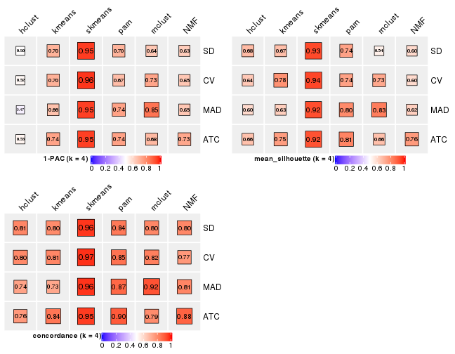</p>

</div>
<div id='tab-collect-stats-from-consensus-partition-list-4'>
<pre><code class="r">collect_stats(res_list, k = 5)
</code></pre>

<p></p>

</div>
<div id='tab-collect-stats-from-consensus-partition-list-5'>
<pre><code class="r">collect_stats(res_list, k = 6)
</code></pre>

<p></p>

</div>
</div>

### Partition from all methods


Collect partitions from all methods:


<script>
$( function() {
	$( '#tabs-collect-classes-from-consensus-partition-list' ).tabs();
} );
</script>
<div id='tabs-collect-classes-from-consensus-partition-list'>
<ul>
<li><a href='#tab-collect-classes-from-consensus-partition-list-1'>k = 2</a></li>
<li><a href='#tab-collect-classes-from-consensus-partition-list-2'>k = 3</a></li>
<li><a href='#tab-collect-classes-from-consensus-partition-list-3'>k = 4</a></li>
<li><a href='#tab-collect-classes-from-consensus-partition-list-4'>k = 5</a></li>
<li><a href='#tab-collect-classes-from-consensus-partition-list-5'>k = 6</a></li>
</ul>
<div id='tab-collect-classes-from-consensus-partition-list-1'>
<pre><code class="r">collect_classes(res_list, k = 2)
</code></pre>

<p></p>

</div>
<div id='tab-collect-classes-from-consensus-partition-list-2'>
<pre><code class="r">collect_classes(res_list, k = 3)
</code></pre>

<p></p>

</div>
<div id='tab-collect-classes-from-consensus-partition-list-3'>
<pre><code class="r">collect_classes(res_list, k = 4)
</code></pre>

<p></p>

</div>
<div id='tab-collect-classes-from-consensus-partition-list-4'>
<pre><code class="r">collect_classes(res_list, k = 5)
</code></pre>

<p></p>

</div>
<div id='tab-collect-classes-from-consensus-partition-list-5'>
<pre><code class="r">collect_classes(res_list, k = 6)
</code></pre>

<p></p>

</div>
</div>


### Top rows overlap


Overlap of top rows from different top-row methods:


<script>
$( function() {
	$( '#tabs-top-rows-overlap-by-euler' ).tabs();
} );
</script>
<div id='tabs-top-rows-overlap-by-euler'>
<ul>
<li><a href='#tab-top-rows-overlap-by-euler-1'>top_n = 1000</a></li>
<li><a href='#tab-top-rows-overlap-by-euler-2'>top_n = 2000</a></li>
<li><a href='#tab-top-rows-overlap-by-euler-3'>top_n = 3000</a></li>
<li><a href='#tab-top-rows-overlap-by-euler-4'>top_n = 4000</a></li>
<li><a href='#tab-top-rows-overlap-by-euler-5'>top_n = 5000</a></li>
</ul>
<div id='tab-top-rows-overlap-by-euler-1'>
<pre><code class="r">top_rows_overlap(res_list, top_n = 1000, method = &quot;euler&quot;)
</code></pre>

<p></p>

</div>
<div id='tab-top-rows-overlap-by-euler-2'>
<pre><code class="r">top_rows_overlap(res_list, top_n = 2000, method = &quot;euler&quot;)
</code></pre>

<p></p>

</div>
<div id='tab-top-rows-overlap-by-euler-3'>
<pre><code class="r">top_rows_overlap(res_list, top_n = 3000, method = &quot;euler&quot;)
</code></pre>

<p></p>

</div>
<div id='tab-top-rows-overlap-by-euler-4'>
<pre><code class="r">top_rows_overlap(res_list, top_n = 4000, method = &quot;euler&quot;)
</code></pre>

<p></p>

</div>
<div id='tab-top-rows-overlap-by-euler-5'>
<pre><code class="r">top_rows_overlap(res_list, top_n = 5000, method = &quot;euler&quot;)
</code></pre>

<p></p>

</div>
</div>

Also visualize the correspondance of rankings between different top-row methods:


<script>
$( function() {
	$( '#tabs-top-rows-overlap-by-correspondance' ).tabs();
} );
</script>
<div id='tabs-top-rows-overlap-by-correspondance'>
<ul>
<li><a href='#tab-top-rows-overlap-by-correspondance-1'>top_n = 1000</a></li>
<li><a href='#tab-top-rows-overlap-by-correspondance-2'>top_n = 2000</a></li>
<li><a href='#tab-top-rows-overlap-by-correspondance-3'>top_n = 3000</a></li>
<li><a href='#tab-top-rows-overlap-by-correspondance-4'>top_n = 4000</a></li>
<li><a href='#tab-top-rows-overlap-by-correspondance-5'>top_n = 5000</a></li>
</ul>
<div id='tab-top-rows-overlap-by-correspondance-1'>
<pre><code class="r">top_rows_overlap(res_list, top_n = 1000, method = &quot;correspondance&quot;)
</code></pre>

<p></p>

</div>
<div id='tab-top-rows-overlap-by-correspondance-2'>
<pre><code class="r">top_rows_overlap(res_list, top_n = 2000, method = &quot;correspondance&quot;)
</code></pre>

<p></p>

</div>
<div id='tab-top-rows-overlap-by-correspondance-3'>
<pre><code class="r">top_rows_overlap(res_list, top_n = 3000, method = &quot;correspondance&quot;)
</code></pre>

<p></p>

</div>
<div id='tab-top-rows-overlap-by-correspondance-4'>
<pre><code class="r">top_rows_overlap(res_list, top_n = 4000, method = &quot;correspondance&quot;)
</code></pre>

<p></p>

</div>
<div id='tab-top-rows-overlap-by-correspondance-5'>
<pre><code class="r">top_rows_overlap(res_list, top_n = 5000, method = &quot;correspondance&quot;)
</code></pre>

<p></p>

</div>
</div>


Heatmaps of the top rows:


<script>
$( function() {
	$( '#tabs-top-rows-heatmap' ).tabs();
} );
</script>
<div id='tabs-top-rows-heatmap'>
<ul>
<li><a href='#tab-top-rows-heatmap-1'>top_n = 1000</a></li>
<li><a href='#tab-top-rows-heatmap-2'>top_n = 2000</a></li>
<li><a href='#tab-top-rows-heatmap-3'>top_n = 3000</a></li>
<li><a href='#tab-top-rows-heatmap-4'>top_n = 4000</a></li>
<li><a href='#tab-top-rows-heatmap-5'>top_n = 5000</a></li>
</ul>
<div id='tab-top-rows-heatmap-1'>
<pre><code class="r">top_rows_heatmap(res_list, top_n = 1000)
</code></pre>

<p></p>

</div>
<div id='tab-top-rows-heatmap-2'>
<pre><code class="r">top_rows_heatmap(res_list, top_n = 2000)
</code></pre>

<p></p>

</div>
<div id='tab-top-rows-heatmap-3'>
<pre><code class="r">top_rows_heatmap(res_list, top_n = 3000)
</code></pre>

<p></p>

</div>
<div id='tab-top-rows-heatmap-4'>
<pre><code class="r">top_rows_heatmap(res_list, top_n = 4000)
</code></pre>

<p>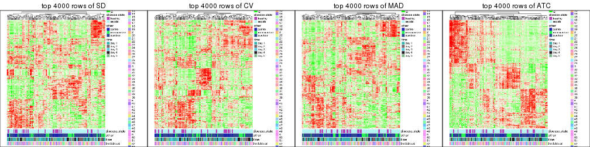</p>

</div>
<div id='tab-top-rows-heatmap-5'>
<pre><code class="r">top_rows_heatmap(res_list, top_n = 5000)
</code></pre>

<p></p>

</div>
</div>


### Test to known annotations


Test correlation between subgroups and known annotations. If the known
annotation is numeric, one-way ANOVA test is applied, and if the known
annotation is discrete, chi-squared contingency table test is applied.


<script>
$( function() {
	$( '#tabs-test-to-known-factors-from-consensus-partition-list' ).tabs();
} );
</script>
<div id='tabs-test-to-known-factors-from-consensus-partition-list'>
<ul>
<li><a href='#tab-test-to-known-factors-from-consensus-partition-list-1'>k = 2</a></li>
<li><a href='#tab-test-to-known-factors-from-consensus-partition-list-2'>k = 3</a></li>
<li><a href='#tab-test-to-known-factors-from-consensus-partition-list-3'>k = 4</a></li>
<li><a href='#tab-test-to-known-factors-from-consensus-partition-list-4'>k = 5</a></li>
<li><a href='#tab-test-to-known-factors-from-consensus-partition-list-5'>k = 6</a></li>
</ul>
<div id='tab-test-to-known-factors-from-consensus-partition-list-1'>
<pre><code class="r">test_to_known_factors(res_list, k = 2)
</code></pre>

<pre><code>#&gt;               n disease.state(p) other(p) time(p) individual(p) k
#&gt; SD:NMF      159            0.610   0.1893 0.01227        0.1615 2
#&gt; CV:NMF      156            0.495   0.1346 0.01204        0.0923 2
#&gt; MAD:NMF     159            0.549   0.0727 0.01049        0.1741 2
#&gt; ATC:NMF     153            0.806   0.2420 0.67525        0.2815 2
#&gt; SD:skmeans  159            0.554   0.0568 0.00393        0.2485 2
#&gt; CV:skmeans  158            0.465   0.0707 0.00727        0.2200 2
#&gt; MAD:skmeans 156            0.511   0.0462 0.00155        0.4391 2
#&gt; ATC:skmeans 161            0.429   0.1740 0.34136        0.1739 2
#&gt; SD:mclust   152            0.715   0.7758 0.00186        0.9893 2
#&gt; CV:mclust   146            0.698   0.8337 0.00769        0.9793 2
#&gt; MAD:mclust  127            1.000   0.8917 0.04375        0.6568 2
#&gt; ATC:mclust  106            0.909   0.7424 0.75567        0.6499 2
#&gt; SD:kmeans   163            0.429   0.0639 0.01253        0.3769 2
#&gt; CV:kmeans   161            0.415   0.0656 0.01186        0.3103 2
#&gt; MAD:kmeans  162            0.448   0.0609 0.01450        0.3779 2
#&gt; ATC:kmeans  161            1.000   0.6180 0.69198        0.4854 2
#&gt; SD:pam      159            0.225   0.0507 0.01137        0.3597 2
#&gt; CV:pam      160            0.213   0.0518 0.01008        0.4064 2
#&gt; MAD:pam     162            0.262   0.0874 0.00475        0.4955 2
#&gt; ATC:pam     160            0.324   0.0754 0.05546        0.1887 2
#&gt; SD:hclust   144            0.222   0.1322 0.00286        0.6194 2
#&gt; CV:hclust   133            0.143   0.1857 0.00161        0.5586 2
#&gt; MAD:hclust  138            0.150   0.1212 0.00479        0.5851 2
#&gt; ATC:hclust  154            0.515   0.1561 0.93880        0.4689 2
</code></pre>

</div>
<div id='tab-test-to-known-factors-from-consensus-partition-list-2'>
<pre><code class="r">test_to_known_factors(res_list, k = 3)
</code></pre>

<pre><code>#&gt;               n disease.state(p) other(p) time(p) individual(p) k
#&gt; SD:NMF      159            0.747   0.1715 0.04513         0.566 3
#&gt; CV:NMF      158            0.829   0.2011 0.03829         0.593 3
#&gt; MAD:NMF     157            0.675   0.2515 0.05162         0.488 3
#&gt; ATC:NMF     147            0.738   0.2667 0.11197         0.577 3
#&gt; SD:skmeans  161            0.672   0.0638 0.04165         0.596 3
#&gt; CV:skmeans  160            0.681   0.0658 0.04819         0.653 3
#&gt; MAD:skmeans 161            0.672   0.0638 0.04165         0.596 3
#&gt; ATC:skmeans 152            0.646   0.2315 0.08051         0.414 3
#&gt; SD:mclust   160            0.567   0.0492 0.16352         0.410 3
#&gt; CV:mclust   159            0.517   0.0388 0.15703         0.438 3
#&gt; MAD:mclust  161            0.431   0.0539 0.11822         0.453 3
#&gt; ATC:mclust  162            0.356   0.3245 0.13238         0.432 3
#&gt; SD:kmeans   162            0.636   0.0597 0.05995         0.539 3
#&gt; CV:kmeans   160            0.546   0.0516 0.07056         0.480 3
#&gt; MAD:kmeans  160            0.746   0.0690 0.05503         0.565 3
#&gt; ATC:kmeans  162            0.431   0.3072 0.13016         0.458 3
#&gt; SD:pam      146            0.166   0.0974 0.03662         0.549 3
#&gt; CV:pam      150            0.118   0.0583 0.03526         0.611 3
#&gt; MAD:pam     112            0.451   0.1507 0.06484         0.505 3
#&gt; ATC:pam      75            0.112   0.0859 0.00714         0.641 3
#&gt; SD:hclust   135            0.134   0.1153 0.03728         0.721 3
#&gt; CV:hclust   121            0.199   0.2844 0.05839         0.760 3
#&gt; MAD:hclust  128            0.307   0.1339 0.01550         0.835 3
#&gt; ATC:hclust  137            0.219   0.1236 0.73307         0.206 3
</code></pre>

</div>
<div id='tab-test-to-known-factors-from-consensus-partition-list-3'>
<pre><code class="r">test_to_known_factors(res_list, k = 4)
</code></pre>

<pre><code>#&gt;               n disease.state(p) other(p)  time(p) individual(p) k
#&gt; SD:NMF      121         0.435568 8.94e-02 0.521680         0.268 4
#&gt; CV:NMF      109         0.105220 8.87e-03 0.248579         0.217 4
#&gt; MAD:NMF     118         0.229939 6.52e-02 0.000424         0.583 4
#&gt; ATC:NMF     143         0.037818 5.74e-02 0.013150         0.561 4
#&gt; SD:skmeans  161         0.000262 1.49e-05 0.004237         0.149 4
#&gt; CV:skmeans  161         0.000262 1.49e-05 0.004237         0.149 4
#&gt; MAD:skmeans 157         0.000129 4.01e-06 0.001005         0.170 4
#&gt; ATC:skmeans 158         0.236362 1.72e-01 0.207718         0.475 4
#&gt; SD:mclust   101         0.705174 3.63e-01 0.356912         0.992 4
#&gt; CV:mclust   141         0.030171 3.85e-03 0.019410         0.552 4
#&gt; MAD:mclust  151         0.033936 3.01e-03 0.010772         0.728 4
#&gt; ATC:mclust  137         0.785266 7.18e-01 0.111967         0.501 4
#&gt; SD:kmeans   140         0.399973 5.49e-02 0.020018         0.558 4
#&gt; CV:kmeans   158         0.668884 6.09e-02 0.068448         0.432 4
#&gt; MAD:kmeans  137         0.898377 6.12e-01 0.010334         0.599 4
#&gt; ATC:kmeans  135         0.368345 2.04e-01 0.124009         0.514 4
#&gt; SD:pam      141         0.023859 4.09e-03 0.001187         0.528 4
#&gt; CV:pam      149         0.010991 3.52e-03 0.002945         0.389 4
#&gt; MAD:pam     151         0.009100 9.07e-03 0.002190         0.513 4
#&gt; ATC:pam     151         0.114053 2.77e-01 0.405471         0.634 4
#&gt; SD:hclust   137         0.370822 1.10e-01 0.059508         0.751 4
#&gt; CV:hclust   124         0.492527 1.04e-01 0.037841         0.665 4
#&gt; MAD:hclust  122         0.494797 1.87e-01 0.104147         0.694 4
#&gt; ATC:hclust  129         0.217215 2.86e-01 0.276186         0.364 4
</code></pre>

</div>
<div id='tab-test-to-known-factors-from-consensus-partition-list-4'>
<pre><code class="r">test_to_known_factors(res_list, k = 5)
</code></pre>

<pre><code>#&gt;               n disease.state(p) other(p)  time(p) individual(p) k
#&gt; SD:NMF      141         2.69e-03 1.19e-04 0.011063        0.4286 5
#&gt; CV:NMF      141         1.12e-03 3.82e-05 0.011241        0.4446 5
#&gt; MAD:NMF     130         4.28e-03 4.50e-04 0.008573        0.3861 5
#&gt; ATC:NMF     121         1.06e-01 1.15e-05 0.010499        0.3022 5
#&gt; SD:skmeans  153         1.58e-05 7.62e-07 0.000555        0.1269 5
#&gt; CV:skmeans  156         3.24e-05 1.01e-06 0.002232        0.0963 5
#&gt; MAD:skmeans 152         3.53e-06 9.55e-08 0.001132        0.1136 5
#&gt; ATC:skmeans 156         2.42e-01 3.60e-01 0.187148        0.5308 5
#&gt; SD:mclust   146         5.97e-04 2.46e-04 0.004524        0.3898 5
#&gt; CV:mclust   143         1.51e-03 5.53e-04 0.002316        0.5518 5
#&gt; MAD:mclust  124         1.11e-02 1.52e-02 0.010071        0.7989 5
#&gt; ATC:mclust  154         2.58e-04 1.10e-03 0.003229        0.2469 5
#&gt; SD:kmeans   130         3.23e-04 2.86e-05 0.007163        0.3018 5
#&gt; CV:kmeans   128         2.17e-04 9.63e-05 0.010246        0.3091 5
#&gt; MAD:kmeans  131         1.75e-04 2.03e-05 0.004209        0.3892 5
#&gt; ATC:kmeans  133         5.53e-02 4.64e-02 0.241606        0.2274 5
#&gt; SD:pam      143         6.80e-04 6.45e-04 0.007226        0.4414 5
#&gt; CV:pam      142         5.73e-04 8.18e-04 0.001220        0.3205 5
#&gt; MAD:pam     147         4.20e-04 3.56e-04 0.007787        0.2818 5
#&gt; ATC:pam     149         1.90e-01 4.23e-01 0.238996        0.6540 5
#&gt; SD:hclust   132         1.67e-01 4.39e-02 0.010329        0.9349 5
#&gt; CV:hclust   106         5.24e-01 2.89e-01 0.108168        0.9228 5
#&gt; MAD:hclust   92         4.65e-01 5.51e-01 0.011718        0.9996 5
#&gt; ATC:hclust  108         3.70e-02 1.18e-01 0.026090        0.5771 5
</code></pre>

</div>
<div id='tab-test-to-known-factors-from-consensus-partition-list-5'>
<pre><code class="r">test_to_known_factors(res_list, k = 6)
</code></pre>

<pre><code>#&gt;               n disease.state(p) other(p)  time(p) individual(p) k
#&gt; SD:NMF      141         7.92e-04 2.26e-10 3.50e-03        0.3397 6
#&gt; CV:NMF      140         7.89e-04 1.59e-09 8.10e-03        0.1609 6
#&gt; MAD:NMF     144         7.53e-04 4.73e-11 1.20e-03        0.3551 6
#&gt; ATC:NMF     100         8.84e-04 8.68e-08 9.33e-03        0.3226 6
#&gt; SD:skmeans  149         5.13e-05 4.47e-08 9.48e-04        0.1058 6
#&gt; CV:skmeans  151         2.55e-05 4.90e-08 1.07e-03        0.0741 6
#&gt; MAD:skmeans 148         4.76e-05 1.72e-07 2.01e-03        0.2215 6
#&gt; ATC:skmeans 145         3.64e-03 7.66e-04 1.04e-02        0.3446 6
#&gt; SD:mclust   130         5.46e-04 9.06e-05 6.10e-02        0.4800 6
#&gt; CV:mclust   149         1.60e-04 1.96e-05 2.70e-02        0.3641 6
#&gt; MAD:mclust  148         1.01e-03 1.31e-03 6.38e-03        0.3978 6
#&gt; ATC:mclust  154         1.70e-03 8.19e-03 3.43e-03        0.5399 6
#&gt; SD:kmeans   135         1.22e-04 5.55e-09 4.51e-04        0.2149 6
#&gt; CV:kmeans   127         3.19e-04 5.41e-08 2.68e-03        0.2383 6
#&gt; MAD:kmeans  133         2.03e-04 5.47e-08 1.47e-03        0.4062 6
#&gt; ATC:kmeans  114         1.95e-01 1.79e-01 5.06e-01        0.5894 6
#&gt; SD:pam      109         2.22e-02 1.04e-01 6.39e-04        0.7672 6
#&gt; CV:pam      121         1.14e-02 5.78e-05 2.44e-04        0.4005 6
#&gt; MAD:pam     108         1.70e-02 1.18e-01 9.73e-05        0.6616 6
#&gt; ATC:pam     127         5.98e-01 6.76e-01 2.54e-01        0.8372 6
#&gt; SD:hclust   126         1.33e-01 4.56e-02 4.62e-02        0.9241 6
#&gt; CV:hclust    97         2.27e-01 3.02e-02 5.33e-03        0.3525 6
#&gt; MAD:hclust   99         9.19e-02 3.28e-01 1.09e-03        0.9826 6
#&gt; ATC:hclust  127         1.35e-02 3.17e-02 5.03e-02        0.6680 6
</code></pre>

</div>
</div>


 
## Results for each method


---------------------------------------------------


### SD:hclust


The object with results only for a single top-value method and a single partition method 
can be extracted as:

```r
res = res_list["SD", "hclust"]
# you can also extract it by
# res = res_list["SD:hclust"]
```

A summary of `res` and all the functions that can be applied to it:

```r
res
```

```
#> A 'ConsensusPartition' object with k = 2, 3, 4, 5, 6.
#>   On a matrix with 23598 rows and 163 columns.
#>   Top rows (1000, 2000, 3000, 4000, 5000) are extracted by 'SD' method.
#>   Subgroups are detected by 'hclust' method.
#>   Performed in total 1250 partitions by row resampling.
#>   Best k for subgroups seems to be 2.
#> 
#> Following methods can be applied to this 'ConsensusPartition' object:
#>  [1] "cola_report"             "collect_classes"         "collect_plots"          
#>  [4] "collect_stats"           "colnames"                "compare_signatures"     
#>  [7] "consensus_heatmap"       "dimension_reduction"     "functional_enrichment"  
#> [10] "get_anno_col"            "get_anno"                "get_classes"            
#> [13] "get_consensus"           "get_matrix"              "get_membership"         
#> [16] "get_param"               "get_signatures"          "get_stats"              
#> [19] "is_best_k"               "is_stable_k"             "membership_heatmap"     
#> [22] "ncol"                    "nrow"                    "plot_ecdf"              
#> [25] "rownames"                "select_partition_number" "show"                   
#> [28] "suggest_best_k"          "test_to_known_factors"
```

`collect_plots()` function collects all the plots made from `res` for all `k` (number of partitions)
into one single page to provide an easy and fast comparison between different `k`.

```r
collect_plots(res)
```


The plots are:

- The first row: a plot of the ECDF (empirical cumulative distribution
  function) curves of the consensus matrix for each `k` and the heatmap of
  predicted classes for each `k`.
- The second row: heatmaps of the consensus matrix for each `k`.
- The third row: heatmaps of the membership matrix for each `k`.
- The fouth row: heatmaps of the signatures for each `k`.

All the plots in panels can be made by individual functions and they are
plotted later in this section.

`select_partition_number()` produces several plots showing different
statistics for choosing "optimized" `k`. There are following statistics:

- ECDF curves of the consensus matrix for each `k`;
- 1-PAC. [The PAC
  score](https://en.wikipedia.org/wiki/Consensus_clustering#Over-interpretation_potential_of_consensus_clustering)
  measures the proportion of the ambiguous subgrouping.
- Mean silhouette score.
- Concordance. The mean probability of fiting the consensus class ids in all
  partitions.
- Area increased. Denote $A_k$ as the area under the ECDF curve for current
  `k`, the area increased is defined as $A_k - A_{k-1}$.
- Rand index. The percent of pairs of samples that are both in a same cluster
  or both are not in a same cluster in the partition of k and k-1.
- Jaccard index. The ratio of pairs of samples are both in a same cluster in
  the partition of k and k-1 and the pairs of samples are both in a same
  cluster in the partition k or k-1.

The detailed explanations of these statistics can be found in [the _cola_
vignette](http://bioconductor.org/packages/devel/bioc/vignettes/cola/inst/doc/cola.html#toc_13).

Generally speaking, lower PAC score, higher mean silhouette score or higher
concordance corresponds to better partition. Rand index and Jaccard index
measure how similar the current partition is compared to partition with `k-1`.
If they are too similar, we won't accept `k` is better than `k-1`.

```r
select_partition_number(res)
```


The numeric values for all these statistics can be obtained by `get_stats()`.

```r
get_stats(res)
```

```
#>   k 1-PAC mean_silhouette concordance area_increased  Rand Jaccard
#> 2 2 0.484           0.766       0.882         0.4440 0.532   0.532
#> 3 3 0.348           0.671       0.791         0.4008 0.806   0.635
#> 4 4 0.504           0.677       0.808         0.1386 0.893   0.700
#> 5 5 0.567           0.624       0.739         0.0844 0.970   0.894
#> 6 6 0.616           0.595       0.721         0.0390 0.922   0.712
```

`suggest_best_k()` suggests the best $k$ based on these statistics. The rules are as follows:

- All $k$ with Jaccard index larger than 0.95 are removed because increasing
  $k$ does not provide enough extra information. If all $k$ are removed, it is
  marked as no subgroup is detected.
- For all $k$ with 1-PAC score larger than 0.9, the maximal $k$ is taken as
  the best $k$, and other $k$ are marked as optional $k$.
- If it does not fit the second rule. The $k$ with the maximal vote of the
  highest 1-PAC score, highest mean silhouette, and highest concordance is
  taken as the best $k$.

```r
suggest_best_k(res)
```

```
#> [1] 2
```


Following shows the table of the partitions (You need to click the **show/hide
code output** link to see it). The membership matrix (columns with name `p*`)
is inferred by
[`clue::cl_consensus()`](https://www.rdocumentation.org/link/cl_consensus?package=clue)
function with the `SE` method. Basically the value in the membership matrix
represents the probability to belong to a certain group. The finall class
label for an item is determined with the group with highest probability it
belongs to.

In `get_classes()` function, the entropy is calculated from the membership
matrix and the silhouette score is calculated from the consensus matrix.


<script>
$( function() {
	$( '#tabs-SD-hclust-get-classes' ).tabs();
} );
</script>
<div id='tabs-SD-hclust-get-classes'>
<ul>
<li><a href='#tab-SD-hclust-get-classes-1'>k = 2</a></li>
<li><a href='#tab-SD-hclust-get-classes-2'>k = 3</a></li>
<li><a href='#tab-SD-hclust-get-classes-3'>k = 4</a></li>
<li><a href='#tab-SD-hclust-get-classes-4'>k = 5</a></li>
<li><a href='#tab-SD-hclust-get-classes-5'>k = 6</a></li>
</ul>

<div id='tab-SD-hclust-get-classes-1'>
<p><a id='tab-SD-hclust-get-classes-1-a' style='color:#0366d6' href='#'>show/hide code output</a></p>
<pre><code class="r">cbind(get_classes(res, k = 2), get_membership(res, k = 2))
</code></pre>

<pre><code>#&gt;            class entropy silhouette    p1    p2
#&gt; GSM1317945     2  0.3584      0.852 0.068 0.932
#&gt; GSM1317946     2  0.9686      0.311 0.396 0.604
#&gt; GSM1317947     1  0.8661      0.719 0.712 0.288
#&gt; GSM1317948     1  0.9850      0.521 0.572 0.428
#&gt; GSM1317949     1  0.8661      0.719 0.712 0.288
#&gt; GSM1317950     1  0.0000      0.789 1.000 0.000
#&gt; GSM1317953     1  0.0000      0.789 1.000 0.000
#&gt; GSM1317954     1  0.7815      0.674 0.768 0.232
#&gt; GSM1317955     1  0.7815      0.674 0.768 0.232
#&gt; GSM1317956     1  0.0000      0.789 1.000 0.000
#&gt; GSM1317957     2  0.1184      0.899 0.016 0.984
#&gt; GSM1317958     1  0.2236      0.792 0.964 0.036
#&gt; GSM1317959     2  0.2423      0.893 0.040 0.960
#&gt; GSM1317960     1  0.9795      0.545 0.584 0.416
#&gt; GSM1317961     2  0.6048      0.761 0.148 0.852
#&gt; GSM1317962     2  0.9608      0.373 0.384 0.616
#&gt; GSM1317963     1  0.9754      0.560 0.592 0.408
#&gt; GSM1317964     1  0.0000      0.789 1.000 0.000
#&gt; GSM1317965     2  0.2236      0.882 0.036 0.964
#&gt; GSM1317966     2  0.6048      0.761 0.148 0.852
#&gt; GSM1317967     2  0.0000      0.899 0.000 1.000
#&gt; GSM1317968     2  0.9608      0.373 0.384 0.616
#&gt; GSM1317969     2  0.2236      0.882 0.036 0.964
#&gt; GSM1317970     2  0.1184      0.899 0.016 0.984
#&gt; GSM1317952     1  0.9850      0.521 0.572 0.428
#&gt; GSM1317951     1  0.7815      0.674 0.768 0.232
#&gt; GSM1317971     2  0.1843      0.887 0.028 0.972
#&gt; GSM1317972     2  0.9608      0.373 0.384 0.616
#&gt; GSM1317973     2  0.2236      0.894 0.036 0.964
#&gt; GSM1317974     2  0.9608      0.373 0.384 0.616
#&gt; GSM1317975     2  0.2423      0.893 0.040 0.960
#&gt; GSM1317978     2  0.9323      0.451 0.348 0.652
#&gt; GSM1317979     2  0.9580      0.147 0.380 0.620
#&gt; GSM1317980     2  0.9580      0.147 0.380 0.620
#&gt; GSM1317981     2  0.2423      0.893 0.040 0.960
#&gt; GSM1317982     2  0.9580      0.147 0.380 0.620
#&gt; GSM1317983     1  0.0000      0.789 1.000 0.000
#&gt; GSM1317984     2  0.0000      0.899 0.000 1.000
#&gt; GSM1317985     2  0.0000      0.899 0.000 1.000
#&gt; GSM1317986     1  0.0000      0.789 1.000 0.000
#&gt; GSM1317987     2  0.2423      0.893 0.040 0.960
#&gt; GSM1317988     2  0.2236      0.894 0.036 0.964
#&gt; GSM1317989     1  0.8016      0.745 0.756 0.244
#&gt; GSM1317990     2  0.2423      0.893 0.040 0.960
#&gt; GSM1317991     2  0.1843      0.887 0.028 0.972
#&gt; GSM1317992     2  0.1843      0.887 0.028 0.972
#&gt; GSM1317993     2  0.2423      0.893 0.040 0.960
#&gt; GSM1317994     2  0.0000      0.899 0.000 1.000
#&gt; GSM1317977     1  0.8016      0.745 0.756 0.244
#&gt; GSM1317976     2  0.9608      0.373 0.384 0.616
#&gt; GSM1317995     2  0.0000      0.899 0.000 1.000
#&gt; GSM1317996     2  0.5059      0.826 0.112 0.888
#&gt; GSM1317997     2  0.0000      0.899 0.000 1.000
#&gt; GSM1317998     1  0.0376      0.790 0.996 0.004
#&gt; GSM1317999     1  0.3114      0.791 0.944 0.056
#&gt; GSM1318002     2  0.1633      0.897 0.024 0.976
#&gt; GSM1318003     2  0.1633      0.897 0.024 0.976
#&gt; GSM1318004     2  0.2423      0.894 0.040 0.960
#&gt; GSM1318005     2  0.2423      0.894 0.040 0.960
#&gt; GSM1318006     1  0.1843      0.791 0.972 0.028
#&gt; GSM1318007     2  0.2423      0.894 0.040 0.960
#&gt; GSM1318008     1  0.3114      0.791 0.944 0.056
#&gt; GSM1318009     2  0.2423      0.893 0.040 0.960
#&gt; GSM1318010     2  0.0000      0.899 0.000 1.000
#&gt; GSM1318011     1  0.9635      0.593 0.612 0.388
#&gt; GSM1318012     1  0.9635      0.593 0.612 0.388
#&gt; GSM1318013     2  0.2423      0.894 0.040 0.960
#&gt; GSM1318014     1  0.9635      0.593 0.612 0.388
#&gt; GSM1318015     2  0.1633      0.897 0.024 0.976
#&gt; GSM1318001     2  0.0000      0.899 0.000 1.000
#&gt; GSM1318000     2  0.2423      0.893 0.040 0.960
#&gt; GSM1318016     2  0.2423      0.893 0.040 0.960
#&gt; GSM1318017     1  0.0000      0.789 1.000 0.000
#&gt; GSM1318019     2  0.2236      0.894 0.036 0.964
#&gt; GSM1318020     2  0.9044      0.396 0.320 0.680
#&gt; GSM1318021     2  0.2423      0.893 0.040 0.960
#&gt; GSM1318022     2  0.0000      0.899 0.000 1.000
#&gt; GSM1318023     1  0.0000      0.789 1.000 0.000
#&gt; GSM1318024     2  0.2423      0.893 0.040 0.960
#&gt; GSM1318025     2  0.0000      0.899 0.000 1.000
#&gt; GSM1318026     2  0.0000      0.899 0.000 1.000
#&gt; GSM1318027     2  0.0000      0.899 0.000 1.000
#&gt; GSM1318028     1  0.9850      0.337 0.572 0.428
#&gt; GSM1318029     2  0.0376      0.898 0.004 0.996
#&gt; GSM1318018     1  0.0000      0.789 1.000 0.000
#&gt; GSM1318030     1  0.9993      0.375 0.516 0.484
#&gt; GSM1318031     2  0.0000      0.899 0.000 1.000
#&gt; GSM1318033     1  0.9580      0.531 0.620 0.380
#&gt; GSM1318034     1  0.8763      0.712 0.704 0.296
#&gt; GSM1318035     2  0.2423      0.893 0.040 0.960
#&gt; GSM1318036     1  0.9580      0.531 0.620 0.380
#&gt; GSM1318037     1  0.9993      0.375 0.516 0.484
#&gt; GSM1318038     1  0.8713      0.719 0.708 0.292
#&gt; GSM1318039     1  0.0000      0.789 1.000 0.000
#&gt; GSM1318040     2  0.0000      0.899 0.000 1.000
#&gt; GSM1318032     2  0.0000      0.899 0.000 1.000
#&gt; GSM1317914     2  0.0000      0.899 0.000 1.000
#&gt; GSM1317915     1  0.0000      0.789 1.000 0.000
#&gt; GSM1317916     1  0.0672      0.790 0.992 0.008
#&gt; GSM1317917     1  0.8713      0.719 0.708 0.292
#&gt; GSM1317918     1  0.0000      0.789 1.000 0.000
#&gt; GSM1317919     2  0.0000      0.899 0.000 1.000
#&gt; GSM1317920     2  0.0376      0.898 0.004 0.996
#&gt; GSM1317921     2  0.0000      0.899 0.000 1.000
#&gt; GSM1317922     1  0.7674      0.750 0.776 0.224
#&gt; GSM1317923     2  0.0000      0.899 0.000 1.000
#&gt; GSM1317924     2  0.0000      0.899 0.000 1.000
#&gt; GSM1317925     2  0.2423      0.893 0.040 0.960
#&gt; GSM1317926     2  0.0000      0.899 0.000 1.000
#&gt; GSM1317927     2  0.2423      0.893 0.040 0.960
#&gt; GSM1317928     2  0.0000      0.899 0.000 1.000
#&gt; GSM1317929     2  0.0376      0.898 0.004 0.996
#&gt; GSM1317930     2  0.0000      0.899 0.000 1.000
#&gt; GSM1317931     2  0.0000      0.899 0.000 1.000
#&gt; GSM1317932     2  0.9044      0.396 0.320 0.680
#&gt; GSM1317933     2  0.2423      0.893 0.040 0.960
#&gt; GSM1317934     2  0.9044      0.396 0.320 0.680
#&gt; GSM1317935     2  0.9044      0.396 0.320 0.680
#&gt; GSM1317936     2  0.0000      0.899 0.000 1.000
#&gt; GSM1317937     1  0.0000      0.789 1.000 0.000
#&gt; GSM1317938     2  0.2423      0.893 0.040 0.960
#&gt; GSM1317939     2  0.2423      0.893 0.040 0.960
#&gt; GSM1317940     1  0.4431      0.787 0.908 0.092
#&gt; GSM1317941     2  0.6801      0.753 0.180 0.820
#&gt; GSM1317942     2  0.2423      0.893 0.040 0.960
#&gt; GSM1317943     2  0.2423      0.893 0.040 0.960
#&gt; GSM1317944     2  0.2423      0.893 0.040 0.960
#&gt; GSM1317896     2  0.9044      0.399 0.320 0.680
#&gt; GSM1317897     1  0.0000      0.789 1.000 0.000
#&gt; GSM1317898     1  0.6048      0.777 0.852 0.148
#&gt; GSM1317899     1  0.1843      0.791 0.972 0.028
#&gt; GSM1317900     2  0.9044      0.399 0.320 0.680
#&gt; GSM1317901     1  0.8661      0.719 0.712 0.288
#&gt; GSM1317902     1  0.0376      0.790 0.996 0.004
#&gt; GSM1317903     1  0.0376      0.790 0.996 0.004
#&gt; GSM1317904     2  0.2423      0.893 0.040 0.960
#&gt; GSM1317905     2  0.0376      0.898 0.004 0.996
#&gt; GSM1317906     2  0.0376      0.898 0.004 0.996
#&gt; GSM1317907     2  0.3584      0.852 0.068 0.932
#&gt; GSM1317908     1  0.8661      0.719 0.712 0.288
#&gt; GSM1317909     1  0.9286      0.656 0.656 0.344
#&gt; GSM1317910     1  0.9286      0.656 0.656 0.344
#&gt; GSM1317911     1  0.9286      0.656 0.656 0.344
#&gt; GSM1317912     2  0.3584      0.852 0.068 0.932
#&gt; GSM1317913     2  0.3584      0.852 0.068 0.932
#&gt; GSM1318041     1  0.8763      0.714 0.704 0.296
#&gt; GSM1318042     2  0.0000      0.899 0.000 1.000
#&gt; GSM1318043     2  0.0000      0.899 0.000 1.000
#&gt; GSM1318044     1  0.0000      0.789 1.000 0.000
#&gt; GSM1318045     1  0.0000      0.789 1.000 0.000
#&gt; GSM1318046     1  0.0000      0.789 1.000 0.000
#&gt; GSM1318047     1  0.9833      0.530 0.576 0.424
#&gt; GSM1318048     1  0.8713      0.716 0.708 0.292
#&gt; GSM1318049     1  0.8713      0.716 0.708 0.292
#&gt; GSM1318050     2  0.2423      0.893 0.040 0.960
#&gt; GSM1318051     2  0.2423      0.893 0.040 0.960
#&gt; GSM1318052     2  0.0000      0.899 0.000 1.000
#&gt; GSM1318053     2  0.0000      0.899 0.000 1.000
#&gt; GSM1318054     2  0.0000      0.899 0.000 1.000
#&gt; GSM1318055     2  0.0000      0.899 0.000 1.000
#&gt; GSM1318056     2  0.0000      0.899 0.000 1.000
#&gt; GSM1318057     2  0.0000      0.899 0.000 1.000
#&gt; GSM1318058     2  0.0000      0.899 0.000 1.000
</code></pre>

<script>
$('#tab-SD-hclust-get-classes-1-a').parent().next().next().hide();
$('#tab-SD-hclust-get-classes-1-a').click(function(){
  $('#tab-SD-hclust-get-classes-1-a').parent().next().next().toggle();
  return(false);
});
</script>
</div>

<div id='tab-SD-hclust-get-classes-2'>
<p><a id='tab-SD-hclust-get-classes-2-a' style='color:#0366d6' href='#'>show/hide code output</a></p>
<pre><code class="r">cbind(get_classes(res, k = 3), get_membership(res, k = 3))
</code></pre>

<pre><code>#&gt;            class entropy silhouette    p1    p2    p3
#&gt; GSM1317945     2  0.5901     0.6721 0.048 0.776 0.176
#&gt; GSM1317946     2  0.6126     0.4198 0.352 0.644 0.004
#&gt; GSM1317947     1  0.8445     0.5944 0.580 0.116 0.304
#&gt; GSM1317948     1  0.9437     0.4916 0.492 0.300 0.208
#&gt; GSM1317949     1  0.8445     0.5944 0.580 0.116 0.304
#&gt; GSM1317950     1  0.0000     0.7327 1.000 0.000 0.000
#&gt; GSM1317953     1  0.0000     0.7327 1.000 0.000 0.000
#&gt; GSM1317954     1  0.4931     0.5931 0.768 0.232 0.000
#&gt; GSM1317955     1  0.4931     0.5931 0.768 0.232 0.000
#&gt; GSM1317956     1  0.0000     0.7327 1.000 0.000 0.000
#&gt; GSM1317957     2  0.2280     0.8423 0.008 0.940 0.052
#&gt; GSM1317958     1  0.2050     0.7375 0.952 0.028 0.020
#&gt; GSM1317959     2  0.1289     0.8512 0.000 0.968 0.032
#&gt; GSM1317960     1  0.9353     0.5065 0.504 0.296 0.200
#&gt; GSM1317961     3  0.8547     0.4668 0.104 0.364 0.532
#&gt; GSM1317962     2  0.6416     0.4039 0.376 0.616 0.008
#&gt; GSM1317963     1  0.9231     0.5176 0.516 0.300 0.184
#&gt; GSM1317964     1  0.0000     0.7327 1.000 0.000 0.000
#&gt; GSM1317965     3  0.6169     0.5740 0.004 0.360 0.636
#&gt; GSM1317966     3  0.8547     0.4668 0.104 0.364 0.532
#&gt; GSM1317967     2  0.3412     0.7880 0.000 0.876 0.124
#&gt; GSM1317968     2  0.6416     0.4039 0.376 0.616 0.008
#&gt; GSM1317969     3  0.6169     0.5740 0.004 0.360 0.636
#&gt; GSM1317970     2  0.2280     0.8423 0.008 0.940 0.052
#&gt; GSM1317952     1  0.9437     0.4916 0.492 0.300 0.208
#&gt; GSM1317951     1  0.4931     0.5931 0.768 0.232 0.000
#&gt; GSM1317971     3  0.6398     0.4963 0.004 0.416 0.580
#&gt; GSM1317972     2  0.6416     0.4039 0.376 0.616 0.008
#&gt; GSM1317973     2  0.1411     0.8515 0.000 0.964 0.036
#&gt; GSM1317974     2  0.6416     0.4039 0.376 0.616 0.008
#&gt; GSM1317975     2  0.0592     0.8521 0.000 0.988 0.012
#&gt; GSM1317978     2  0.5815     0.5262 0.304 0.692 0.004
#&gt; GSM1317979     3  0.9970    -0.0783 0.296 0.348 0.356
#&gt; GSM1317980     3  0.9970    -0.0783 0.296 0.348 0.356
#&gt; GSM1317981     2  0.0592     0.8521 0.000 0.988 0.012
#&gt; GSM1317982     3  0.9970    -0.0783 0.296 0.348 0.356
#&gt; GSM1317983     1  0.0000     0.7327 1.000 0.000 0.000
#&gt; GSM1317984     3  0.3686     0.7664 0.000 0.140 0.860
#&gt; GSM1317985     3  0.3686     0.7664 0.000 0.140 0.860
#&gt; GSM1317986     1  0.0000     0.7327 1.000 0.000 0.000
#&gt; GSM1317987     2  0.0592     0.8521 0.000 0.988 0.012
#&gt; GSM1317988     2  0.1411     0.8515 0.000 0.964 0.036
#&gt; GSM1317989     1  0.7966     0.6503 0.652 0.128 0.220
#&gt; GSM1317990     2  0.0592     0.8521 0.000 0.988 0.012
#&gt; GSM1317991     3  0.6398     0.4963 0.004 0.416 0.580
#&gt; GSM1317992     3  0.6398     0.4963 0.004 0.416 0.580
#&gt; GSM1317993     2  0.0592     0.8521 0.000 0.988 0.012
#&gt; GSM1317994     3  0.3686     0.7664 0.000 0.140 0.860
#&gt; GSM1317977     1  0.7966     0.6503 0.652 0.128 0.220
#&gt; GSM1317976     2  0.6416     0.4039 0.376 0.616 0.008
#&gt; GSM1317995     3  0.3686     0.7664 0.000 0.140 0.860
#&gt; GSM1317996     2  0.2939     0.7984 0.072 0.916 0.012
#&gt; GSM1317997     3  0.3686     0.7664 0.000 0.140 0.860
#&gt; GSM1317998     1  0.0829     0.7346 0.984 0.004 0.012
#&gt; GSM1317999     1  0.2663     0.7368 0.932 0.044 0.024
#&gt; GSM1318002     2  0.1163     0.8524 0.000 0.972 0.028
#&gt; GSM1318003     2  0.1163     0.8524 0.000 0.972 0.028
#&gt; GSM1318004     2  0.1878     0.8508 0.004 0.952 0.044
#&gt; GSM1318005     2  0.1878     0.8508 0.004 0.952 0.044
#&gt; GSM1318006     1  0.2773     0.7361 0.928 0.024 0.048
#&gt; GSM1318007     2  0.1878     0.8508 0.004 0.952 0.044
#&gt; GSM1318008     1  0.2663     0.7368 0.932 0.044 0.024
#&gt; GSM1318009     2  0.1411     0.8517 0.000 0.964 0.036
#&gt; GSM1318010     3  0.3686     0.7664 0.000 0.140 0.860
#&gt; GSM1318011     1  0.9174     0.5410 0.532 0.276 0.192
#&gt; GSM1318012     1  0.9174     0.5410 0.532 0.276 0.192
#&gt; GSM1318013     2  0.1878     0.8508 0.004 0.952 0.044
#&gt; GSM1318014     1  0.9174     0.5410 0.532 0.276 0.192
#&gt; GSM1318015     2  0.1163     0.8524 0.000 0.972 0.028
#&gt; GSM1318001     3  0.3686     0.7664 0.000 0.140 0.860
#&gt; GSM1318000     2  0.1411     0.8517 0.000 0.964 0.036
#&gt; GSM1318016     2  0.0592     0.8521 0.000 0.988 0.012
#&gt; GSM1318017     1  0.0000     0.7327 1.000 0.000 0.000
#&gt; GSM1318019     2  0.1411     0.8515 0.000 0.964 0.036
#&gt; GSM1318020     3  0.8681     0.4187 0.216 0.188 0.596
#&gt; GSM1318021     2  0.0592     0.8521 0.000 0.988 0.012
#&gt; GSM1318022     3  0.4555     0.7444 0.000 0.200 0.800
#&gt; GSM1318023     1  0.0000     0.7327 1.000 0.000 0.000
#&gt; GSM1318024     2  0.0592     0.8521 0.000 0.988 0.012
#&gt; GSM1318025     3  0.4002     0.7658 0.000 0.160 0.840
#&gt; GSM1318026     2  0.1860     0.8414 0.000 0.948 0.052
#&gt; GSM1318027     2  0.2537     0.8269 0.000 0.920 0.080
#&gt; GSM1318028     1  0.7213     0.2728 0.552 0.420 0.028
#&gt; GSM1318029     3  0.6247     0.5945 0.004 0.376 0.620
#&gt; GSM1318018     1  0.0000     0.7327 1.000 0.000 0.000
#&gt; GSM1318030     1  0.9614     0.3971 0.436 0.356 0.208
#&gt; GSM1318031     3  0.4002     0.7658 0.000 0.160 0.840
#&gt; GSM1318033     1  0.8519     0.4328 0.508 0.396 0.096
#&gt; GSM1318034     1  0.7920     0.5485 0.572 0.068 0.360
#&gt; GSM1318035     2  0.0747     0.8523 0.000 0.984 0.016
#&gt; GSM1318036     1  0.8519     0.4328 0.508 0.396 0.096
#&gt; GSM1318037     1  0.9614     0.3971 0.436 0.356 0.208
#&gt; GSM1318038     1  0.6421     0.5175 0.572 0.004 0.424
#&gt; GSM1318039     1  0.0592     0.7336 0.988 0.000 0.012
#&gt; GSM1318040     3  0.4002     0.7658 0.000 0.160 0.840
#&gt; GSM1318032     3  0.4002     0.7658 0.000 0.160 0.840
#&gt; GSM1317914     3  0.4750     0.7385 0.000 0.216 0.784
#&gt; GSM1317915     1  0.0592     0.7336 0.988 0.000 0.012
#&gt; GSM1317916     1  0.3752     0.7190 0.856 0.000 0.144
#&gt; GSM1317917     1  0.6421     0.5175 0.572 0.004 0.424
#&gt; GSM1317918     1  0.0592     0.7336 0.988 0.000 0.012
#&gt; GSM1317919     3  0.4796     0.7378 0.000 0.220 0.780
#&gt; GSM1317920     3  0.6247     0.5945 0.004 0.376 0.620
#&gt; GSM1317921     3  0.4796     0.7378 0.000 0.220 0.780
#&gt; GSM1317922     1  0.6148     0.5923 0.640 0.004 0.356
#&gt; GSM1317923     3  0.4555     0.7444 0.000 0.200 0.800
#&gt; GSM1317924     3  0.4002     0.7658 0.000 0.160 0.840
#&gt; GSM1317925     2  0.0592     0.8521 0.000 0.988 0.012
#&gt; GSM1317926     3  0.4555     0.7444 0.000 0.200 0.800
#&gt; GSM1317927     2  0.0747     0.8523 0.000 0.984 0.016
#&gt; GSM1317928     2  0.4750     0.6369 0.000 0.784 0.216
#&gt; GSM1317929     3  0.6247     0.5945 0.004 0.376 0.620
#&gt; GSM1317930     2  0.4750     0.6369 0.000 0.784 0.216
#&gt; GSM1317931     3  0.3686     0.7664 0.000 0.140 0.860
#&gt; GSM1317932     3  0.8722     0.4164 0.216 0.192 0.592
#&gt; GSM1317933     2  0.0747     0.8523 0.000 0.984 0.016
#&gt; GSM1317934     3  0.8722     0.4164 0.216 0.192 0.592
#&gt; GSM1317935     3  0.8722     0.4164 0.216 0.192 0.592
#&gt; GSM1317936     3  0.3686     0.7664 0.000 0.140 0.860
#&gt; GSM1317937     1  0.0000     0.7327 1.000 0.000 0.000
#&gt; GSM1317938     2  0.1031     0.8524 0.000 0.976 0.024
#&gt; GSM1317939     2  0.1031     0.8524 0.000 0.976 0.024
#&gt; GSM1317940     1  0.3802     0.7304 0.888 0.080 0.032
#&gt; GSM1317941     2  0.4897     0.7000 0.172 0.812 0.016
#&gt; GSM1317942     2  0.1031     0.8524 0.000 0.976 0.024
#&gt; GSM1317943     2  0.1031     0.8524 0.000 0.976 0.024
#&gt; GSM1317944     2  0.0747     0.8523 0.000 0.984 0.016
#&gt; GSM1317896     3  0.6954     0.4237 0.196 0.084 0.720
#&gt; GSM1317897     1  0.0000     0.7327 1.000 0.000 0.000
#&gt; GSM1317898     1  0.5650     0.7134 0.808 0.084 0.108
#&gt; GSM1317899     1  0.2773     0.7361 0.928 0.024 0.048
#&gt; GSM1317900     3  0.8569     0.4128 0.196 0.196 0.608
#&gt; GSM1317901     1  0.8445     0.5944 0.580 0.116 0.304
#&gt; GSM1317902     1  0.0829     0.7344 0.984 0.004 0.012
#&gt; GSM1317903     1  0.0829     0.7344 0.984 0.004 0.012
#&gt; GSM1317904     2  0.1289     0.8512 0.000 0.968 0.032
#&gt; GSM1317905     2  0.5365     0.5701 0.004 0.744 0.252
#&gt; GSM1317906     2  0.5365     0.5701 0.004 0.744 0.252
#&gt; GSM1317907     2  0.5901     0.6721 0.048 0.776 0.176
#&gt; GSM1317908     1  0.8445     0.5944 0.580 0.116 0.304
#&gt; GSM1317909     1  0.8813     0.5826 0.580 0.236 0.184
#&gt; GSM1317910     1  0.8813     0.5826 0.580 0.236 0.184
#&gt; GSM1317911     1  0.8813     0.5826 0.580 0.236 0.184
#&gt; GSM1317912     2  0.5901     0.6721 0.048 0.776 0.176
#&gt; GSM1317913     2  0.5901     0.6721 0.048 0.776 0.176
#&gt; GSM1318041     1  0.7980     0.5568 0.572 0.072 0.356
#&gt; GSM1318042     3  0.3686     0.7664 0.000 0.140 0.860
#&gt; GSM1318043     3  0.3686     0.7664 0.000 0.140 0.860
#&gt; GSM1318044     1  0.0000     0.7327 1.000 0.000 0.000
#&gt; GSM1318045     1  0.0000     0.7327 1.000 0.000 0.000
#&gt; GSM1318046     1  0.0000     0.7327 1.000 0.000 0.000
#&gt; GSM1318047     1  0.9442     0.4983 0.496 0.288 0.216
#&gt; GSM1318048     1  0.8468     0.5901 0.576 0.116 0.308
#&gt; GSM1318049     1  0.8468     0.5901 0.576 0.116 0.308
#&gt; GSM1318050     2  0.1289     0.8512 0.000 0.968 0.032
#&gt; GSM1318051     2  0.1289     0.8512 0.000 0.968 0.032
#&gt; GSM1318052     2  0.3412     0.7880 0.000 0.876 0.124
#&gt; GSM1318053     2  0.3412     0.7880 0.000 0.876 0.124
#&gt; GSM1318054     2  0.3412     0.7880 0.000 0.876 0.124
#&gt; GSM1318055     3  0.3816     0.7665 0.000 0.148 0.852
#&gt; GSM1318056     2  0.3412     0.7880 0.000 0.876 0.124
#&gt; GSM1318057     2  0.3412     0.7880 0.000 0.876 0.124
#&gt; GSM1318058     2  0.3412     0.7880 0.000 0.876 0.124
</code></pre>

<script>
$('#tab-SD-hclust-get-classes-2-a').parent().next().next().hide();
$('#tab-SD-hclust-get-classes-2-a').click(function(){
  $('#tab-SD-hclust-get-classes-2-a').parent().next().next().toggle();
  return(false);
});
</script>
</div>

<div id='tab-SD-hclust-get-classes-3'>
<p><a id='tab-SD-hclust-get-classes-3-a' style='color:#0366d6' href='#'>show/hide code output</a></p>
<pre><code class="r">cbind(get_classes(res, k = 4), get_membership(res, k = 4))
</code></pre>

<pre><code>#&gt;            class entropy silhouette    p1    p2    p3    p4
#&gt; GSM1317945     2  0.5510     0.5899 0.008 0.684 0.032 0.276
#&gt; GSM1317946     2  0.5639     0.4611 0.324 0.636 0.000 0.040
#&gt; GSM1317947     4  0.3833     0.6260 0.076 0.036 0.024 0.864
#&gt; GSM1317948     4  0.6587     0.6454 0.136 0.204 0.008 0.652
#&gt; GSM1317949     4  0.3833     0.6260 0.076 0.036 0.024 0.864
#&gt; GSM1317950     1  0.0188     0.8494 0.996 0.000 0.000 0.004
#&gt; GSM1317953     1  0.0188     0.8494 0.996 0.000 0.000 0.004
#&gt; GSM1317954     1  0.4194     0.6053 0.764 0.228 0.000 0.008
#&gt; GSM1317955     1  0.4194     0.6053 0.764 0.228 0.000 0.008
#&gt; GSM1317956     1  0.0188     0.8494 0.996 0.000 0.000 0.004
#&gt; GSM1317957     2  0.2131     0.8524 0.008 0.936 0.016 0.040
#&gt; GSM1317958     1  0.2345     0.8242 0.900 0.000 0.000 0.100
#&gt; GSM1317959     2  0.1733     0.8572 0.000 0.948 0.024 0.028
#&gt; GSM1317960     4  0.6598     0.6455 0.140 0.200 0.008 0.652
#&gt; GSM1317961     3  0.8747     0.2553 0.048 0.300 0.416 0.236
#&gt; GSM1317962     2  0.5937     0.4358 0.340 0.608 0.000 0.052
#&gt; GSM1317963     4  0.6948     0.6129 0.204 0.208 0.000 0.588
#&gt; GSM1317964     1  0.0188     0.8494 0.996 0.000 0.000 0.004
#&gt; GSM1317965     3  0.6956     0.4719 0.000 0.288 0.564 0.148
#&gt; GSM1317966     3  0.8747     0.2553 0.048 0.300 0.416 0.236
#&gt; GSM1317967     2  0.3764     0.8142 0.000 0.852 0.072 0.076
#&gt; GSM1317968     2  0.5937     0.4358 0.340 0.608 0.000 0.052
#&gt; GSM1317969     3  0.6956     0.4719 0.000 0.288 0.564 0.148
#&gt; GSM1317970     2  0.2131     0.8524 0.008 0.936 0.016 0.040
#&gt; GSM1317952     4  0.6587     0.6454 0.136 0.204 0.008 0.652
#&gt; GSM1317951     1  0.4194     0.6053 0.764 0.228 0.000 0.008
#&gt; GSM1317971     3  0.6937     0.4356 0.000 0.344 0.532 0.124
#&gt; GSM1317972     2  0.5937     0.4358 0.340 0.608 0.000 0.052
#&gt; GSM1317973     2  0.1833     0.8574 0.000 0.944 0.024 0.032
#&gt; GSM1317974     2  0.5937     0.4358 0.340 0.608 0.000 0.052
#&gt; GSM1317975     2  0.0188     0.8592 0.000 0.996 0.000 0.004
#&gt; GSM1317978     2  0.5366     0.5475 0.276 0.684 0.000 0.040
#&gt; GSM1317979     4  0.8264     0.5711 0.068 0.248 0.148 0.536
#&gt; GSM1317980     4  0.8264     0.5711 0.068 0.248 0.148 0.536
#&gt; GSM1317981     2  0.0188     0.8592 0.000 0.996 0.000 0.004
#&gt; GSM1317982     4  0.8264     0.5711 0.068 0.248 0.148 0.536
#&gt; GSM1317983     1  0.0188     0.8494 0.996 0.000 0.000 0.004
#&gt; GSM1317984     3  0.0336     0.7674 0.000 0.000 0.992 0.008
#&gt; GSM1317985     3  0.0336     0.7674 0.000 0.000 0.992 0.008
#&gt; GSM1317986     1  0.0188     0.8494 0.996 0.000 0.000 0.004
#&gt; GSM1317987     2  0.0188     0.8592 0.000 0.996 0.000 0.004
#&gt; GSM1317988     2  0.1833     0.8574 0.000 0.944 0.024 0.032
#&gt; GSM1317989     4  0.6046     0.5596 0.180 0.068 0.032 0.720
#&gt; GSM1317990     2  0.0188     0.8592 0.000 0.996 0.000 0.004
#&gt; GSM1317991     3  0.6937     0.4356 0.000 0.344 0.532 0.124
#&gt; GSM1317992     3  0.6937     0.4356 0.000 0.344 0.532 0.124
#&gt; GSM1317993     2  0.0188     0.8592 0.000 0.996 0.000 0.004
#&gt; GSM1317994     3  0.0336     0.7674 0.000 0.000 0.992 0.008
#&gt; GSM1317977     4  0.6046     0.5596 0.180 0.068 0.032 0.720
#&gt; GSM1317976     2  0.5937     0.4358 0.340 0.608 0.000 0.052
#&gt; GSM1317995     3  0.0336     0.7674 0.000 0.000 0.992 0.008
#&gt; GSM1317996     2  0.2329     0.8207 0.072 0.916 0.000 0.012
#&gt; GSM1317997     3  0.0336     0.7674 0.000 0.000 0.992 0.008
#&gt; GSM1317998     1  0.1792     0.8408 0.932 0.000 0.000 0.068
#&gt; GSM1317999     1  0.2647     0.8044 0.880 0.000 0.000 0.120
#&gt; GSM1318002     2  0.0895     0.8591 0.000 0.976 0.004 0.020
#&gt; GSM1318003     2  0.0895     0.8591 0.000 0.976 0.004 0.020
#&gt; GSM1318004     2  0.2197     0.8546 0.000 0.928 0.024 0.048
#&gt; GSM1318005     2  0.2197     0.8546 0.000 0.928 0.024 0.048
#&gt; GSM1318006     1  0.5320     0.2971 0.572 0.012 0.000 0.416
#&gt; GSM1318007     2  0.2197     0.8546 0.000 0.928 0.024 0.048
#&gt; GSM1318008     1  0.2647     0.8044 0.880 0.000 0.000 0.120
#&gt; GSM1318009     2  0.1629     0.8580 0.000 0.952 0.024 0.024
#&gt; GSM1318010     3  0.0336     0.7674 0.000 0.000 0.992 0.008
#&gt; GSM1318011     4  0.6856     0.6343 0.172 0.192 0.008 0.628
#&gt; GSM1318012     4  0.6856     0.6343 0.172 0.192 0.008 0.628
#&gt; GSM1318013     2  0.2197     0.8546 0.000 0.928 0.024 0.048
#&gt; GSM1318014     4  0.6856     0.6343 0.172 0.192 0.008 0.628
#&gt; GSM1318015     2  0.0895     0.8591 0.000 0.976 0.004 0.020
#&gt; GSM1318001     3  0.0336     0.7674 0.000 0.000 0.992 0.008
#&gt; GSM1318000     2  0.1629     0.8580 0.000 0.952 0.024 0.024
#&gt; GSM1318016     2  0.0188     0.8592 0.000 0.996 0.000 0.004
#&gt; GSM1318017     1  0.0921     0.8526 0.972 0.000 0.000 0.028
#&gt; GSM1318019     2  0.1733     0.8583 0.000 0.948 0.024 0.028
#&gt; GSM1318020     4  0.7609     0.0223 0.016 0.128 0.408 0.448
#&gt; GSM1318021     2  0.0188     0.8592 0.000 0.996 0.000 0.004
#&gt; GSM1318022     3  0.4104     0.7214 0.000 0.080 0.832 0.088
#&gt; GSM1318023     1  0.0921     0.8526 0.972 0.000 0.000 0.028
#&gt; GSM1318024     2  0.0188     0.8592 0.000 0.996 0.000 0.004
#&gt; GSM1318025     3  0.1733     0.7698 0.000 0.028 0.948 0.024
#&gt; GSM1318026     2  0.1520     0.8558 0.000 0.956 0.024 0.020
#&gt; GSM1318027     2  0.2816     0.8440 0.000 0.900 0.036 0.064
#&gt; GSM1318028     1  0.7003     0.1913 0.508 0.368 0.000 0.124
#&gt; GSM1318029     3  0.6399     0.5833 0.000 0.276 0.620 0.104
#&gt; GSM1318018     1  0.0921     0.8526 0.972 0.000 0.000 0.028
#&gt; GSM1318030     4  0.6879     0.6219 0.124 0.264 0.008 0.604
#&gt; GSM1318031     3  0.1733     0.7698 0.000 0.028 0.948 0.024
#&gt; GSM1318033     4  0.7745     0.4787 0.200 0.360 0.004 0.436
#&gt; GSM1318034     4  0.5589     0.5965 0.076 0.032 0.128 0.764
#&gt; GSM1318035     2  0.0188     0.8593 0.000 0.996 0.000 0.004
#&gt; GSM1318036     4  0.7745     0.4787 0.200 0.360 0.004 0.436
#&gt; GSM1318037     4  0.6879     0.6219 0.124 0.264 0.008 0.604
#&gt; GSM1318038     4  0.4669     0.5030 0.036 0.000 0.200 0.764
#&gt; GSM1318039     1  0.3486     0.7441 0.812 0.000 0.000 0.188
#&gt; GSM1318040     3  0.1733     0.7698 0.000 0.028 0.948 0.024
#&gt; GSM1318032     3  0.1733     0.7698 0.000 0.028 0.948 0.024
#&gt; GSM1317914     3  0.3754     0.7282 0.000 0.084 0.852 0.064
#&gt; GSM1317915     1  0.3486     0.7441 0.812 0.000 0.000 0.188
#&gt; GSM1317916     4  0.4454     0.3006 0.308 0.000 0.000 0.692
#&gt; GSM1317917     4  0.4669     0.5030 0.036 0.000 0.200 0.764
#&gt; GSM1317918     1  0.3486     0.7441 0.812 0.000 0.000 0.188
#&gt; GSM1317919     3  0.4483     0.7243 0.000 0.104 0.808 0.088
#&gt; GSM1317920     3  0.6399     0.5833 0.000 0.276 0.620 0.104
#&gt; GSM1317921     3  0.4483     0.7243 0.000 0.104 0.808 0.088
#&gt; GSM1317922     4  0.5174     0.5514 0.092 0.000 0.152 0.756
#&gt; GSM1317923     3  0.4104     0.7214 0.000 0.080 0.832 0.088
#&gt; GSM1317924     3  0.1733     0.7698 0.000 0.028 0.948 0.024
#&gt; GSM1317925     2  0.0188     0.8592 0.000 0.996 0.000 0.004
#&gt; GSM1317926     3  0.4104     0.7214 0.000 0.080 0.832 0.088
#&gt; GSM1317927     2  0.0188     0.8593 0.000 0.996 0.000 0.004
#&gt; GSM1317928     2  0.5143     0.5531 0.000 0.708 0.256 0.036
#&gt; GSM1317929     3  0.6399     0.5833 0.000 0.276 0.620 0.104
#&gt; GSM1317930     2  0.5143     0.5531 0.000 0.708 0.256 0.036
#&gt; GSM1317931     3  0.0336     0.7674 0.000 0.000 0.992 0.008
#&gt; GSM1317932     4  0.7642     0.0326 0.016 0.132 0.404 0.448
#&gt; GSM1317933     2  0.0188     0.8593 0.000 0.996 0.000 0.004
#&gt; GSM1317934     4  0.7642     0.0326 0.016 0.132 0.404 0.448
#&gt; GSM1317935     4  0.7642     0.0326 0.016 0.132 0.404 0.448
#&gt; GSM1317936     3  0.0336     0.7674 0.000 0.000 0.992 0.008
#&gt; GSM1317937     1  0.1118     0.8524 0.964 0.000 0.000 0.036
#&gt; GSM1317938     2  0.0524     0.8598 0.000 0.988 0.008 0.004
#&gt; GSM1317939     2  0.0524     0.8598 0.000 0.988 0.008 0.004
#&gt; GSM1317940     1  0.3812     0.7192 0.832 0.028 0.000 0.140
#&gt; GSM1317941     2  0.4274     0.7243 0.148 0.808 0.000 0.044
#&gt; GSM1317942     2  0.0524     0.8598 0.000 0.988 0.008 0.004
#&gt; GSM1317943     2  0.0524     0.8598 0.000 0.988 0.008 0.004
#&gt; GSM1317944     2  0.0188     0.8593 0.000 0.996 0.000 0.004
#&gt; GSM1317896     3  0.6140     0.1916 0.008 0.036 0.556 0.400
#&gt; GSM1317897     1  0.0188     0.8494 0.996 0.000 0.000 0.004
#&gt; GSM1317898     4  0.5488     0.0588 0.452 0.016 0.000 0.532
#&gt; GSM1317899     1  0.5320     0.2971 0.572 0.012 0.000 0.416
#&gt; GSM1317900     4  0.7601    -0.0410 0.008 0.152 0.420 0.420
#&gt; GSM1317901     4  0.3833     0.6260 0.076 0.036 0.024 0.864
#&gt; GSM1317902     1  0.1867     0.8404 0.928 0.000 0.000 0.072
#&gt; GSM1317903     1  0.1867     0.8404 0.928 0.000 0.000 0.072
#&gt; GSM1317904     2  0.1733     0.8572 0.000 0.948 0.024 0.028
#&gt; GSM1317905     2  0.5345     0.6703 0.004 0.748 0.168 0.080
#&gt; GSM1317906     2  0.5345     0.6703 0.004 0.748 0.168 0.080
#&gt; GSM1317907     2  0.5510     0.5899 0.008 0.684 0.032 0.276
#&gt; GSM1317908     4  0.3833     0.6260 0.076 0.036 0.024 0.864
#&gt; GSM1317909     4  0.6895     0.5759 0.276 0.148 0.000 0.576
#&gt; GSM1317910     4  0.6895     0.5759 0.276 0.148 0.000 0.576
#&gt; GSM1317911     4  0.6895     0.5759 0.276 0.148 0.000 0.576
#&gt; GSM1317912     2  0.5510     0.5899 0.008 0.684 0.032 0.276
#&gt; GSM1317913     2  0.5510     0.5899 0.008 0.684 0.032 0.276
#&gt; GSM1318041     4  0.5940     0.6115 0.096 0.036 0.124 0.744
#&gt; GSM1318042     3  0.0336     0.7674 0.000 0.000 0.992 0.008
#&gt; GSM1318043     3  0.0336     0.7674 0.000 0.000 0.992 0.008
#&gt; GSM1318044     1  0.1118     0.8524 0.964 0.000 0.000 0.036
#&gt; GSM1318045     1  0.1118     0.8524 0.964 0.000 0.000 0.036
#&gt; GSM1318046     1  0.1118     0.8524 0.964 0.000 0.000 0.036
#&gt; GSM1318047     4  0.6436     0.6488 0.132 0.192 0.008 0.668
#&gt; GSM1318048     4  0.4031     0.6287 0.076 0.036 0.032 0.856
#&gt; GSM1318049     4  0.4031     0.6287 0.076 0.036 0.032 0.856
#&gt; GSM1318050     2  0.1733     0.8572 0.000 0.948 0.024 0.028
#&gt; GSM1318051     2  0.1733     0.8572 0.000 0.948 0.024 0.028
#&gt; GSM1318052     2  0.3764     0.8142 0.000 0.852 0.072 0.076
#&gt; GSM1318053     2  0.3764     0.8142 0.000 0.852 0.072 0.076
#&gt; GSM1318054     2  0.3764     0.8142 0.000 0.852 0.072 0.076
#&gt; GSM1318055     3  0.0937     0.7692 0.000 0.012 0.976 0.012
#&gt; GSM1318056     2  0.3764     0.8142 0.000 0.852 0.072 0.076
#&gt; GSM1318057     2  0.3764     0.8142 0.000 0.852 0.072 0.076
#&gt; GSM1318058     2  0.3764     0.8142 0.000 0.852 0.072 0.076
</code></pre>

<script>
$('#tab-SD-hclust-get-classes-3-a').parent().next().next().hide();
$('#tab-SD-hclust-get-classes-3-a').click(function(){
  $('#tab-SD-hclust-get-classes-3-a').parent().next().next().toggle();
  return(false);
});
</script>
</div>

<div id='tab-SD-hclust-get-classes-4'>
<p><a id='tab-SD-hclust-get-classes-4-a' style='color:#0366d6' href='#'>show/hide code output</a></p>
<pre><code class="r">cbind(get_classes(res, k = 5), get_membership(res, k = 5))
</code></pre>

<pre><code>#&gt;            class entropy silhouette    p1 p2    p3    p4    p5
#&gt; GSM1317945     4  0.4884     0.4273 0.000 NA 0.020 0.572 0.404
#&gt; GSM1317946     4  0.7637     0.3067 0.272 NA 0.000 0.436 0.064
#&gt; GSM1317947     5  0.5274     0.5974 0.040 NA 0.012 0.000 0.612
#&gt; GSM1317948     5  0.3984     0.6763 0.112 NA 0.004 0.068 0.812
#&gt; GSM1317949     5  0.5274     0.5974 0.040 NA 0.012 0.000 0.612
#&gt; GSM1317950     1  0.0771     0.8326 0.976 NA 0.000 0.000 0.004
#&gt; GSM1317953     1  0.0771     0.8326 0.976 NA 0.000 0.000 0.004
#&gt; GSM1317954     1  0.4986     0.6499 0.716 NA 0.000 0.104 0.004
#&gt; GSM1317955     1  0.4986     0.6499 0.716 NA 0.000 0.104 0.004
#&gt; GSM1317956     1  0.0771     0.8326 0.976 NA 0.000 0.000 0.004
#&gt; GSM1317957     4  0.4654     0.6126 0.000 NA 0.000 0.628 0.024
#&gt; GSM1317958     1  0.2270     0.8090 0.904 NA 0.000 0.000 0.076
#&gt; GSM1317959     4  0.4084     0.7146 0.000 NA 0.016 0.800 0.140
#&gt; GSM1317960     5  0.4081     0.6760 0.120 NA 0.004 0.068 0.804
#&gt; GSM1317961     3  0.8789     0.3869 0.044 NA 0.400 0.108 0.228
#&gt; GSM1317962     4  0.7931     0.0922 0.288 NA 0.000 0.336 0.072
#&gt; GSM1317963     5  0.5305     0.6410 0.172 NA 0.000 0.060 0.720
#&gt; GSM1317964     1  0.0771     0.8326 0.976 NA 0.000 0.000 0.004
#&gt; GSM1317965     3  0.7319     0.5509 0.000 NA 0.548 0.140 0.124
#&gt; GSM1317966     3  0.8789     0.3869 0.044 NA 0.400 0.108 0.228
#&gt; GSM1317967     4  0.5964     0.6690 0.000 NA 0.032 0.660 0.144
#&gt; GSM1317968     4  0.7931     0.0922 0.288 NA 0.000 0.336 0.072
#&gt; GSM1317969     3  0.7319     0.5509 0.000 NA 0.548 0.140 0.124
#&gt; GSM1317970     4  0.4654     0.6126 0.000 NA 0.000 0.628 0.024
#&gt; GSM1317952     5  0.3984     0.6763 0.112 NA 0.004 0.068 0.812
#&gt; GSM1317951     1  0.4986     0.6499 0.716 NA 0.000 0.104 0.004
#&gt; GSM1317971     3  0.7427     0.5280 0.000 NA 0.512 0.168 0.088
#&gt; GSM1317972     4  0.7931     0.0922 0.288 NA 0.000 0.336 0.072
#&gt; GSM1317973     4  0.4022     0.7201 0.000 NA 0.016 0.808 0.128
#&gt; GSM1317974     4  0.7931     0.0922 0.288 NA 0.000 0.336 0.072
#&gt; GSM1317975     4  0.1557     0.7491 0.000 NA 0.000 0.940 0.008
#&gt; GSM1317978     4  0.7632     0.3370 0.224 NA 0.000 0.436 0.064
#&gt; GSM1317979     5  0.6294     0.5879 0.056 NA 0.124 0.104 0.688
#&gt; GSM1317980     5  0.6294     0.5879 0.056 NA 0.124 0.104 0.688
#&gt; GSM1317981     4  0.1557     0.7491 0.000 NA 0.000 0.940 0.008
#&gt; GSM1317982     5  0.6294     0.5879 0.056 NA 0.124 0.104 0.688
#&gt; GSM1317983     1  0.0771     0.8326 0.976 NA 0.000 0.000 0.004
#&gt; GSM1317984     3  0.0290     0.7385 0.000 NA 0.992 0.000 0.008
#&gt; GSM1317985     3  0.0290     0.7385 0.000 NA 0.992 0.000 0.008
#&gt; GSM1317986     1  0.0771     0.8326 0.976 NA 0.000 0.000 0.004
#&gt; GSM1317987     4  0.1557     0.7491 0.000 NA 0.000 0.940 0.008
#&gt; GSM1317988     4  0.4022     0.7201 0.000 NA 0.016 0.808 0.128
#&gt; GSM1317989     5  0.6933     0.5189 0.156 NA 0.012 0.020 0.528
#&gt; GSM1317990     4  0.1557     0.7491 0.000 NA 0.000 0.940 0.008
#&gt; GSM1317991     3  0.7427     0.5280 0.000 NA 0.512 0.168 0.088
#&gt; GSM1317992     3  0.7427     0.5280 0.000 NA 0.512 0.168 0.088
#&gt; GSM1317993     4  0.1557     0.7491 0.000 NA 0.000 0.940 0.008
#&gt; GSM1317994     3  0.0290     0.7385 0.000 NA 0.992 0.000 0.008
#&gt; GSM1317977     5  0.6933     0.5189 0.156 NA 0.012 0.020 0.528
#&gt; GSM1317976     4  0.7931     0.0922 0.288 NA 0.000 0.336 0.072
#&gt; GSM1317995     3  0.0290     0.7385 0.000 NA 0.992 0.000 0.008
#&gt; GSM1317996     4  0.5439     0.5658 0.032 NA 0.000 0.596 0.024
#&gt; GSM1317997     3  0.0290     0.7385 0.000 NA 0.992 0.000 0.008
#&gt; GSM1317998     1  0.1668     0.8261 0.940 NA 0.000 0.000 0.032
#&gt; GSM1317999     1  0.2628     0.7920 0.884 NA 0.000 0.000 0.088
#&gt; GSM1318002     4  0.1830     0.7478 0.000 NA 0.000 0.924 0.008
#&gt; GSM1318003     4  0.1830     0.7478 0.000 NA 0.000 0.924 0.008
#&gt; GSM1318004     4  0.4291     0.7079 0.000 NA 0.016 0.780 0.160
#&gt; GSM1318005     4  0.4291     0.7079 0.000 NA 0.016 0.780 0.160
#&gt; GSM1318006     1  0.6191     0.3141 0.552 NA 0.000 0.000 0.244
#&gt; GSM1318007     4  0.4291     0.7079 0.000 NA 0.016 0.780 0.160
#&gt; GSM1318008     1  0.2628     0.7920 0.884 NA 0.000 0.000 0.088
#&gt; GSM1318009     4  0.3584     0.7309 0.000 NA 0.016 0.840 0.104
#&gt; GSM1318010     3  0.0290     0.7385 0.000 NA 0.992 0.000 0.008
#&gt; GSM1318011     5  0.4468     0.6649 0.156 NA 0.004 0.060 0.772
#&gt; GSM1318012     5  0.4468     0.6649 0.156 NA 0.004 0.060 0.772
#&gt; GSM1318013     4  0.4291     0.7079 0.000 NA 0.016 0.780 0.160
#&gt; GSM1318014     5  0.4468     0.6649 0.156 NA 0.004 0.060 0.772
#&gt; GSM1318015     4  0.1830     0.7478 0.000 NA 0.000 0.924 0.008
#&gt; GSM1318001     3  0.0290     0.7385 0.000 NA 0.992 0.000 0.008
#&gt; GSM1318000     4  0.3584     0.7309 0.000 NA 0.016 0.840 0.104
#&gt; GSM1318016     4  0.1557     0.7491 0.000 NA 0.000 0.940 0.008
#&gt; GSM1318017     1  0.0693     0.8357 0.980 NA 0.000 0.000 0.012
#&gt; GSM1318019     4  0.3748     0.7329 0.000 NA 0.016 0.832 0.100
#&gt; GSM1318020     3  0.7818     0.2082 0.012 NA 0.392 0.052 0.352
#&gt; GSM1318021     4  0.1557     0.7491 0.000 NA 0.000 0.940 0.008
#&gt; GSM1318022     3  0.4656     0.6752 0.000 NA 0.788 0.068 0.072
#&gt; GSM1318023     1  0.0693     0.8357 0.980 NA 0.000 0.000 0.012
#&gt; GSM1318024     4  0.1557     0.7491 0.000 NA 0.000 0.940 0.008
#&gt; GSM1318025     3  0.1644     0.7389 0.000 NA 0.940 0.004 0.008
#&gt; GSM1318026     4  0.2395     0.7453 0.000 NA 0.016 0.904 0.008
#&gt; GSM1318027     4  0.4070     0.7286 0.000 NA 0.016 0.812 0.100
#&gt; GSM1318028     1  0.7852     0.3342 0.476 NA 0.000 0.176 0.148
#&gt; GSM1318029     3  0.7004     0.6127 0.000 NA 0.564 0.096 0.108
#&gt; GSM1318018     1  0.0693     0.8357 0.980 NA 0.000 0.000 0.012
#&gt; GSM1318030     5  0.4605     0.6530 0.108 NA 0.004 0.132 0.756
#&gt; GSM1318031     3  0.1644     0.7389 0.000 NA 0.940 0.004 0.008
#&gt; GSM1318033     5  0.6803     0.5343 0.156 NA 0.000 0.192 0.588
#&gt; GSM1318034     5  0.6782     0.4976 0.048 NA 0.112 0.000 0.528
#&gt; GSM1318035     4  0.0324     0.7507 0.000 NA 0.000 0.992 0.004
#&gt; GSM1318036     5  0.6803     0.5343 0.156 NA 0.000 0.192 0.588
#&gt; GSM1318037     5  0.4605     0.6530 0.108 NA 0.004 0.132 0.756
#&gt; GSM1318038     5  0.6419     0.4277 0.000 NA 0.156 0.004 0.476
#&gt; GSM1318039     1  0.4334     0.7094 0.768 NA 0.000 0.000 0.140
#&gt; GSM1318040     3  0.1644     0.7389 0.000 NA 0.940 0.004 0.008
#&gt; GSM1318032     3  0.1644     0.7389 0.000 NA 0.940 0.004 0.008
#&gt; GSM1317914     3  0.4188     0.6791 0.000 NA 0.800 0.080 0.012
#&gt; GSM1317915     1  0.4334     0.7094 0.768 NA 0.000 0.000 0.140
#&gt; GSM1317916     5  0.6698     0.3213 0.260 NA 0.000 0.000 0.424
#&gt; GSM1317917     5  0.6419     0.4277 0.000 NA 0.156 0.004 0.476
#&gt; GSM1317918     1  0.4334     0.7094 0.768 NA 0.000 0.000 0.140
#&gt; GSM1317919     3  0.4994     0.6863 0.000 NA 0.764 0.068 0.076
#&gt; GSM1317920     3  0.7004     0.6127 0.000 NA 0.564 0.096 0.108
#&gt; GSM1317921     3  0.4994     0.6863 0.000 NA 0.764 0.068 0.076
#&gt; GSM1317922     5  0.6959     0.4891 0.052 NA 0.112 0.000 0.476
#&gt; GSM1317923     3  0.4656     0.6752 0.000 NA 0.788 0.068 0.072
#&gt; GSM1317924     3  0.1644     0.7389 0.000 NA 0.940 0.004 0.008
#&gt; GSM1317925     4  0.1484     0.7496 0.000 NA 0.000 0.944 0.008
#&gt; GSM1317926     3  0.4656     0.6752 0.000 NA 0.788 0.068 0.072
#&gt; GSM1317927     4  0.0162     0.7505 0.000 NA 0.000 0.996 0.000
#&gt; GSM1317928     4  0.4629     0.5164 0.000 NA 0.244 0.704 0.000
#&gt; GSM1317929     3  0.7004     0.6127 0.000 NA 0.564 0.096 0.108
#&gt; GSM1317930     4  0.4629     0.5164 0.000 NA 0.244 0.704 0.000
#&gt; GSM1317931     3  0.0290     0.7385 0.000 NA 0.992 0.000 0.008
#&gt; GSM1317932     3  0.7867     0.2045 0.012 NA 0.388 0.056 0.352
#&gt; GSM1317933     4  0.0162     0.7505 0.000 NA 0.000 0.996 0.000
#&gt; GSM1317934     3  0.7867     0.2045 0.012 NA 0.388 0.056 0.352
#&gt; GSM1317935     3  0.7867     0.2045 0.012 NA 0.388 0.056 0.352
#&gt; GSM1317936     3  0.0290     0.7385 0.000 NA 0.992 0.000 0.008
#&gt; GSM1317937     1  0.0898     0.8358 0.972 NA 0.000 0.000 0.020
#&gt; GSM1317938     4  0.1731     0.7491 0.000 NA 0.008 0.940 0.012
#&gt; GSM1317939     4  0.0693     0.7510 0.000 NA 0.008 0.980 0.000
#&gt; GSM1317940     1  0.3495     0.7013 0.812 NA 0.000 0.000 0.160
#&gt; GSM1317941     4  0.7223     0.4469 0.124 NA 0.000 0.488 0.072
#&gt; GSM1317942     4  0.0693     0.7510 0.000 NA 0.008 0.980 0.000
#&gt; GSM1317943     4  0.0693     0.7510 0.000 NA 0.008 0.980 0.000
#&gt; GSM1317944     4  0.0324     0.7507 0.000 NA 0.000 0.992 0.004
#&gt; GSM1317896     3  0.6233     0.3474 0.000 NA 0.540 0.004 0.304
#&gt; GSM1317897     1  0.0771     0.8326 0.976 NA 0.000 0.000 0.004
#&gt; GSM1317898     1  0.6557    -0.0753 0.428 NA 0.000 0.000 0.368
#&gt; GSM1317899     1  0.6191     0.3141 0.552 NA 0.000 0.000 0.244
#&gt; GSM1317900     3  0.7537     0.2525 0.000 NA 0.404 0.052 0.336
#&gt; GSM1317901     5  0.5274     0.5974 0.040 NA 0.012 0.000 0.612
#&gt; GSM1317902     1  0.1725     0.8257 0.936 NA 0.000 0.000 0.044
#&gt; GSM1317903     1  0.1725     0.8257 0.936 NA 0.000 0.000 0.044
#&gt; GSM1317904     4  0.4084     0.7146 0.000 NA 0.016 0.800 0.140
#&gt; GSM1317905     4  0.6803     0.4998 0.000 NA 0.144 0.568 0.052
#&gt; GSM1317906     4  0.6803     0.4998 0.000 NA 0.144 0.568 0.052
#&gt; GSM1317907     4  0.4884     0.4273 0.000 NA 0.020 0.572 0.404
#&gt; GSM1317908     5  0.5274     0.5974 0.040 NA 0.012 0.000 0.612
#&gt; GSM1317909     5  0.4602     0.5973 0.240 NA 0.000 0.000 0.708
#&gt; GSM1317910     5  0.4602     0.5973 0.240 NA 0.000 0.000 0.708
#&gt; GSM1317911     5  0.4602     0.5973 0.240 NA 0.000 0.000 0.708
#&gt; GSM1317912     4  0.4884     0.4273 0.000 NA 0.020 0.572 0.404
#&gt; GSM1317913     4  0.4884     0.4273 0.000 NA 0.020 0.572 0.404
#&gt; GSM1318041     5  0.7175     0.5239 0.068 NA 0.112 0.004 0.512
#&gt; GSM1318042     3  0.0290     0.7385 0.000 NA 0.992 0.000 0.008
#&gt; GSM1318043     3  0.0290     0.7385 0.000 NA 0.992 0.000 0.008
#&gt; GSM1318044     1  0.0898     0.8358 0.972 NA 0.000 0.000 0.020
#&gt; GSM1318045     1  0.0898     0.8358 0.972 NA 0.000 0.000 0.020
#&gt; GSM1318046     1  0.0898     0.8358 0.972 NA 0.000 0.000 0.020
#&gt; GSM1318047     5  0.4338     0.6795 0.112 NA 0.008 0.068 0.800
#&gt; GSM1318048     5  0.5437     0.5968 0.048 NA 0.016 0.000 0.616
#&gt; GSM1318049     5  0.5437     0.5968 0.048 NA 0.016 0.000 0.616
#&gt; GSM1318050     4  0.4084     0.7146 0.000 NA 0.016 0.800 0.140
#&gt; GSM1318051     4  0.4084     0.7146 0.000 NA 0.016 0.800 0.140
#&gt; GSM1318052     4  0.5964     0.6690 0.000 NA 0.032 0.660 0.144
#&gt; GSM1318053     4  0.5964     0.6690 0.000 NA 0.032 0.660 0.144
#&gt; GSM1318054     4  0.5964     0.6690 0.000 NA 0.032 0.660 0.144
#&gt; GSM1318055     3  0.1588     0.7361 0.000 NA 0.948 0.008 0.028
#&gt; GSM1318056     4  0.5964     0.6690 0.000 NA 0.032 0.660 0.144
#&gt; GSM1318057     4  0.5964     0.6690 0.000 NA 0.032 0.660 0.144
#&gt; GSM1318058     4  0.5964     0.6690 0.000 NA 0.032 0.660 0.144
</code></pre>

<script>
$('#tab-SD-hclust-get-classes-4-a').parent().next().next().hide();
$('#tab-SD-hclust-get-classes-4-a').click(function(){
  $('#tab-SD-hclust-get-classes-4-a').parent().next().next().toggle();
  return(false);
});
</script>
</div>

<div id='tab-SD-hclust-get-classes-5'>
<p><a id='tab-SD-hclust-get-classes-5-a' style='color:#0366d6' href='#'>show/hide code output</a></p>
<pre><code class="r">cbind(get_classes(res, k = 6), get_membership(res, k = 6))
</code></pre>

<pre><code>#&gt;            class entropy silhouette    p1    p2    p3    p4    p5    p6
#&gt; GSM1317945     4  0.5573     0.4080 0.000 0.200 0.004 0.572 0.000 0.224
#&gt; GSM1317946     1  0.7285     0.6087 0.376 0.024 0.000 0.324 0.228 0.048
#&gt; GSM1317947     2  0.0862     0.6396 0.004 0.972 0.000 0.000 0.008 0.016
#&gt; GSM1317948     6  0.6135     0.7085 0.000 0.296 0.000 0.064 0.100 0.540
#&gt; GSM1317949     2  0.0862     0.6396 0.004 0.972 0.000 0.000 0.008 0.016
#&gt; GSM1317950     5  0.1951     0.8028 0.076 0.000 0.000 0.000 0.908 0.016
#&gt; GSM1317953     5  0.1951     0.8028 0.076 0.000 0.000 0.000 0.908 0.016
#&gt; GSM1317954     5  0.4219     0.4989 0.360 0.000 0.000 0.012 0.620 0.008
#&gt; GSM1317955     5  0.4219     0.4989 0.360 0.000 0.000 0.012 0.620 0.008
#&gt; GSM1317956     5  0.1951     0.8028 0.076 0.000 0.000 0.000 0.908 0.016
#&gt; GSM1317957     1  0.4798     0.4413 0.548 0.012 0.004 0.412 0.000 0.024
#&gt; GSM1317958     5  0.1956     0.7883 0.004 0.080 0.000 0.000 0.908 0.008
#&gt; GSM1317959     4  0.3647     0.6779 0.052 0.000 0.004 0.788 0.000 0.156
#&gt; GSM1317960     6  0.6208     0.7089 0.000 0.296 0.000 0.064 0.108 0.532
#&gt; GSM1317961     3  0.8682     0.1744 0.176 0.228 0.376 0.064 0.032 0.124
#&gt; GSM1317962     1  0.7198     0.7217 0.476 0.040 0.000 0.196 0.240 0.048
#&gt; GSM1317963     6  0.6349     0.7016 0.020 0.188 0.000 0.056 0.140 0.596
#&gt; GSM1317964     5  0.1951     0.8028 0.076 0.000 0.000 0.000 0.908 0.016
#&gt; GSM1317965     3  0.7493     0.3753 0.156 0.156 0.516 0.092 0.000 0.080
#&gt; GSM1317966     3  0.8682     0.1744 0.176 0.228 0.376 0.064 0.032 0.124
#&gt; GSM1317967     4  0.6035     0.5181 0.160 0.040 0.012 0.612 0.000 0.176
#&gt; GSM1317968     1  0.7198     0.7217 0.476 0.040 0.000 0.196 0.240 0.048
#&gt; GSM1317969     3  0.7493     0.3753 0.156 0.156 0.516 0.092 0.000 0.080
#&gt; GSM1317970     1  0.4798     0.4413 0.548 0.012 0.004 0.412 0.000 0.024
#&gt; GSM1317952     6  0.6135     0.7085 0.000 0.296 0.000 0.064 0.100 0.540
#&gt; GSM1317951     5  0.4219     0.4989 0.360 0.000 0.000 0.012 0.620 0.008
#&gt; GSM1317971     3  0.7525     0.3937 0.200 0.104 0.504 0.116 0.000 0.076
#&gt; GSM1317972     1  0.7198     0.7217 0.476 0.040 0.000 0.196 0.240 0.048
#&gt; GSM1317973     4  0.3710     0.6819 0.064 0.000 0.004 0.788 0.000 0.144
#&gt; GSM1317974     1  0.7198     0.7217 0.476 0.040 0.000 0.196 0.240 0.048
#&gt; GSM1317975     4  0.1787     0.6808 0.068 0.008 0.000 0.920 0.000 0.004
#&gt; GSM1317978     1  0.7040     0.6940 0.456 0.024 0.000 0.292 0.180 0.048
#&gt; GSM1317979     6  0.7528     0.5905 0.016 0.248 0.104 0.096 0.040 0.496
#&gt; GSM1317980     6  0.7528     0.5905 0.016 0.248 0.104 0.096 0.040 0.496
#&gt; GSM1317981     4  0.1787     0.6808 0.068 0.008 0.000 0.920 0.000 0.004
#&gt; GSM1317982     6  0.7528     0.5905 0.016 0.248 0.104 0.096 0.040 0.496
#&gt; GSM1317983     5  0.1951     0.8028 0.076 0.000 0.000 0.000 0.908 0.016
#&gt; GSM1317984     3  0.0363     0.7161 0.000 0.012 0.988 0.000 0.000 0.000
#&gt; GSM1317985     3  0.0363     0.7161 0.000 0.012 0.988 0.000 0.000 0.000
#&gt; GSM1317986     5  0.1951     0.8028 0.076 0.000 0.000 0.000 0.908 0.016
#&gt; GSM1317987     4  0.1787     0.6808 0.068 0.008 0.000 0.920 0.000 0.004
#&gt; GSM1317988     4  0.3710     0.6819 0.064 0.000 0.004 0.788 0.000 0.144
#&gt; GSM1317989     2  0.3849     0.5631 0.004 0.804 0.004 0.020 0.128 0.040
#&gt; GSM1317990     4  0.1787     0.6808 0.068 0.008 0.000 0.920 0.000 0.004
#&gt; GSM1317991     3  0.7525     0.3937 0.200 0.104 0.504 0.116 0.000 0.076
#&gt; GSM1317992     3  0.7525     0.3937 0.200 0.104 0.504 0.116 0.000 0.076
#&gt; GSM1317993     4  0.1787     0.6808 0.068 0.008 0.000 0.920 0.000 0.004
#&gt; GSM1317994     3  0.0363     0.7161 0.000 0.012 0.988 0.000 0.000 0.000
#&gt; GSM1317977     2  0.3849     0.5631 0.004 0.804 0.004 0.020 0.128 0.040
#&gt; GSM1317976     1  0.7198     0.7217 0.476 0.040 0.000 0.196 0.240 0.048
#&gt; GSM1317995     3  0.0363     0.7161 0.000 0.012 0.988 0.000 0.000 0.000
#&gt; GSM1317996     1  0.4178     0.5465 0.608 0.000 0.000 0.372 0.000 0.020
#&gt; GSM1317997     3  0.0363     0.7161 0.000 0.012 0.988 0.000 0.000 0.000
#&gt; GSM1317998     5  0.1285     0.8026 0.004 0.052 0.000 0.000 0.944 0.000
#&gt; GSM1317999     5  0.2149     0.7736 0.004 0.104 0.000 0.000 0.888 0.004
#&gt; GSM1318002     4  0.2009     0.6763 0.084 0.008 0.000 0.904 0.000 0.004
#&gt; GSM1318003     4  0.2009     0.6763 0.084 0.008 0.000 0.904 0.000 0.004
#&gt; GSM1318004     4  0.3936     0.6663 0.060 0.000 0.004 0.760 0.000 0.176
#&gt; GSM1318005     4  0.3936     0.6663 0.060 0.000 0.004 0.760 0.000 0.176
#&gt; GSM1318006     5  0.4214     0.2016 0.004 0.460 0.000 0.000 0.528 0.008
#&gt; GSM1318007     4  0.3936     0.6663 0.060 0.000 0.004 0.760 0.000 0.176
#&gt; GSM1318008     5  0.2149     0.7736 0.004 0.104 0.000 0.000 0.888 0.004
#&gt; GSM1318009     4  0.3121     0.6930 0.044 0.000 0.004 0.836 0.000 0.116
#&gt; GSM1318010     3  0.0363     0.7161 0.000 0.012 0.988 0.000 0.000 0.000
#&gt; GSM1318011     6  0.6330     0.7061 0.000 0.284 0.000 0.056 0.140 0.520
#&gt; GSM1318012     6  0.6330     0.7061 0.000 0.284 0.000 0.056 0.140 0.520
#&gt; GSM1318013     4  0.3936     0.6663 0.060 0.000 0.004 0.760 0.000 0.176
#&gt; GSM1318014     6  0.6330     0.7061 0.000 0.284 0.000 0.056 0.140 0.520
#&gt; GSM1318015     4  0.2009     0.6763 0.084 0.008 0.000 0.904 0.000 0.004
#&gt; GSM1318001     3  0.0363     0.7161 0.000 0.012 0.988 0.000 0.000 0.000
#&gt; GSM1318000     4  0.3121     0.6930 0.044 0.000 0.004 0.836 0.000 0.116
#&gt; GSM1318016     4  0.1787     0.6808 0.068 0.008 0.000 0.920 0.000 0.004
#&gt; GSM1318017     5  0.0363     0.8127 0.000 0.012 0.000 0.000 0.988 0.000
#&gt; GSM1318019     4  0.3642     0.6901 0.080 0.000 0.004 0.800 0.000 0.116
#&gt; GSM1318020     2  0.5659     0.2949 0.072 0.520 0.380 0.008 0.000 0.020
#&gt; GSM1318021     4  0.1787     0.6808 0.068 0.008 0.000 0.920 0.000 0.004
#&gt; GSM1318022     3  0.5220     0.5905 0.128 0.016 0.676 0.008 0.000 0.172
#&gt; GSM1318023     5  0.0363     0.8127 0.000 0.012 0.000 0.000 0.988 0.000
#&gt; GSM1318024     4  0.1787     0.6808 0.068 0.008 0.000 0.920 0.000 0.004
#&gt; GSM1318025     3  0.1716     0.7119 0.028 0.004 0.932 0.000 0.000 0.036
#&gt; GSM1318026     4  0.2597     0.6697 0.088 0.008 0.020 0.880 0.000 0.004
#&gt; GSM1318027     4  0.3758     0.6805 0.068 0.000 0.008 0.792 0.000 0.132
#&gt; GSM1318028     5  0.7395    -0.0538 0.328 0.112 0.000 0.068 0.432 0.060
#&gt; GSM1318029     3  0.7299     0.4805 0.248 0.072 0.440 0.020 0.000 0.220
#&gt; GSM1318018     5  0.0363     0.8127 0.000 0.012 0.000 0.000 0.988 0.000
#&gt; GSM1318030     6  0.6497     0.6968 0.000 0.248 0.000 0.128 0.092 0.532
#&gt; GSM1318031     3  0.1716     0.7119 0.028 0.004 0.932 0.000 0.000 0.036
#&gt; GSM1318033     6  0.7541     0.5741 0.096 0.096 0.000 0.180 0.116 0.512
#&gt; GSM1318034     2  0.2492     0.6487 0.000 0.876 0.100 0.000 0.020 0.004
#&gt; GSM1318035     4  0.0603     0.6974 0.016 0.004 0.000 0.980 0.000 0.000
#&gt; GSM1318036     6  0.7541     0.5741 0.096 0.096 0.000 0.180 0.116 0.512
#&gt; GSM1318037     6  0.6497     0.6968 0.000 0.248 0.000 0.128 0.092 0.532
#&gt; GSM1318038     6  0.5610     0.2495 0.168 0.108 0.060 0.004 0.000 0.660
#&gt; GSM1318039     5  0.5191     0.6838 0.072 0.072 0.000 0.000 0.692 0.164
#&gt; GSM1318040     3  0.1716     0.7119 0.028 0.004 0.932 0.000 0.000 0.036
#&gt; GSM1318032     3  0.1716     0.7119 0.028 0.004 0.932 0.000 0.000 0.036
#&gt; GSM1317914     3  0.5333     0.5731 0.204 0.008 0.656 0.016 0.000 0.116
#&gt; GSM1317915     5  0.5191     0.6838 0.072 0.072 0.000 0.000 0.692 0.164
#&gt; GSM1317916     6  0.6790     0.2320 0.128 0.132 0.000 0.000 0.236 0.504
#&gt; GSM1317917     6  0.5610     0.2495 0.168 0.108 0.060 0.004 0.000 0.660
#&gt; GSM1317918     5  0.5191     0.6838 0.072 0.072 0.000 0.000 0.692 0.164
#&gt; GSM1317919     3  0.5487     0.6015 0.136 0.024 0.644 0.004 0.000 0.192
#&gt; GSM1317920     3  0.7299     0.4805 0.248 0.072 0.440 0.020 0.000 0.220
#&gt; GSM1317921     3  0.5487     0.6015 0.136 0.024 0.644 0.004 0.000 0.192
#&gt; GSM1317922     6  0.5678     0.2540 0.160 0.144 0.016 0.000 0.028 0.652
#&gt; GSM1317923     3  0.5220     0.5905 0.128 0.016 0.676 0.008 0.000 0.172
#&gt; GSM1317924     3  0.1716     0.7119 0.028 0.004 0.932 0.000 0.000 0.036
#&gt; GSM1317925     4  0.1728     0.6826 0.064 0.008 0.000 0.924 0.000 0.004
#&gt; GSM1317926     3  0.5220     0.5905 0.128 0.016 0.676 0.008 0.000 0.172
#&gt; GSM1317927     4  0.0363     0.6976 0.012 0.000 0.000 0.988 0.000 0.000
#&gt; GSM1317928     4  0.4980     0.3386 0.168 0.000 0.184 0.648 0.000 0.000
#&gt; GSM1317929     3  0.7299     0.4805 0.248 0.072 0.440 0.020 0.000 0.220
#&gt; GSM1317930     4  0.4980     0.3386 0.168 0.000 0.184 0.648 0.000 0.000
#&gt; GSM1317931     3  0.0363     0.7161 0.000 0.012 0.988 0.000 0.000 0.000
#&gt; GSM1317932     2  0.5741     0.3005 0.072 0.520 0.376 0.012 0.000 0.020
#&gt; GSM1317933     4  0.0363     0.6976 0.012 0.000 0.000 0.988 0.000 0.000
#&gt; GSM1317934     2  0.5741     0.3005 0.072 0.520 0.376 0.012 0.000 0.020
#&gt; GSM1317935     2  0.5741     0.3005 0.072 0.520 0.376 0.012 0.000 0.020
#&gt; GSM1317936     3  0.0363     0.7161 0.000 0.012 0.988 0.000 0.000 0.000
#&gt; GSM1317937     5  0.0603     0.8128 0.000 0.016 0.000 0.000 0.980 0.004
#&gt; GSM1317938     4  0.1461     0.6924 0.044 0.000 0.000 0.940 0.000 0.016
#&gt; GSM1317939     4  0.0458     0.6986 0.016 0.000 0.000 0.984 0.000 0.000
#&gt; GSM1317940     5  0.4315     0.6853 0.040 0.124 0.000 0.000 0.768 0.068
#&gt; GSM1317941     1  0.6918     0.6666 0.460 0.028 0.000 0.336 0.120 0.056
#&gt; GSM1317942     4  0.0458     0.6986 0.016 0.000 0.000 0.984 0.000 0.000
#&gt; GSM1317943     4  0.0458     0.6986 0.016 0.000 0.000 0.984 0.000 0.000
#&gt; GSM1317944     4  0.0603     0.6974 0.016 0.004 0.000 0.980 0.000 0.000
#&gt; GSM1317896     3  0.3986    -0.0608 0.004 0.464 0.532 0.000 0.000 0.000
#&gt; GSM1317897     5  0.1951     0.8028 0.076 0.000 0.000 0.000 0.908 0.016
#&gt; GSM1317898     2  0.4226     0.1049 0.004 0.580 0.000 0.000 0.404 0.012
#&gt; GSM1317899     5  0.4214     0.2016 0.004 0.460 0.000 0.000 0.528 0.008
#&gt; GSM1317900     2  0.6052     0.2241 0.080 0.480 0.396 0.012 0.000 0.032
#&gt; GSM1317901     2  0.0862     0.6396 0.004 0.972 0.000 0.000 0.008 0.016
#&gt; GSM1317902     5  0.1493     0.8015 0.004 0.056 0.000 0.000 0.936 0.004
#&gt; GSM1317903     5  0.1493     0.8015 0.004 0.056 0.000 0.000 0.936 0.004
#&gt; GSM1317904     4  0.3647     0.6779 0.052 0.000 0.004 0.788 0.000 0.156
#&gt; GSM1317905     4  0.7234    -0.2496 0.356 0.040 0.124 0.416 0.000 0.064
#&gt; GSM1317906     4  0.7234    -0.2496 0.356 0.040 0.124 0.416 0.000 0.064
#&gt; GSM1317907     4  0.5573     0.4080 0.000 0.200 0.004 0.572 0.000 0.224
#&gt; GSM1317908     2  0.0862     0.6396 0.004 0.972 0.000 0.000 0.008 0.016
#&gt; GSM1317909     6  0.5836     0.6526 0.028 0.184 0.000 0.000 0.200 0.588
#&gt; GSM1317910     6  0.5836     0.6526 0.028 0.184 0.000 0.000 0.200 0.588
#&gt; GSM1317911     6  0.5836     0.6526 0.028 0.184 0.000 0.000 0.200 0.588
#&gt; GSM1317912     4  0.5573     0.4080 0.000 0.200 0.004 0.572 0.000 0.224
#&gt; GSM1317913     4  0.5573     0.4080 0.000 0.200 0.004 0.572 0.000 0.224
#&gt; GSM1318041     2  0.3481     0.6337 0.000 0.832 0.100 0.004 0.040 0.024
#&gt; GSM1318042     3  0.0363     0.7161 0.000 0.012 0.988 0.000 0.000 0.000
#&gt; GSM1318043     3  0.0363     0.7161 0.000 0.012 0.988 0.000 0.000 0.000
#&gt; GSM1318044     5  0.0603     0.8128 0.000 0.016 0.000 0.000 0.980 0.004
#&gt; GSM1318045     5  0.0603     0.8128 0.000 0.016 0.000 0.000 0.980 0.004
#&gt; GSM1318046     5  0.0603     0.8128 0.000 0.016 0.000 0.000 0.980 0.004
#&gt; GSM1318047     6  0.6228     0.7003 0.000 0.328 0.000 0.064 0.100 0.508
#&gt; GSM1318048     2  0.1053     0.6359 0.000 0.964 0.004 0.000 0.020 0.012
#&gt; GSM1318049     2  0.1053     0.6359 0.000 0.964 0.004 0.000 0.020 0.012
#&gt; GSM1318050     4  0.3647     0.6779 0.052 0.000 0.004 0.788 0.000 0.156
#&gt; GSM1318051     4  0.3647     0.6779 0.052 0.000 0.004 0.788 0.000 0.156
#&gt; GSM1318052     4  0.6035     0.5181 0.160 0.040 0.012 0.612 0.000 0.176
#&gt; GSM1318053     4  0.6035     0.5181 0.160 0.040 0.012 0.612 0.000 0.176
#&gt; GSM1318054     4  0.6035     0.5181 0.160 0.040 0.012 0.612 0.000 0.176
#&gt; GSM1318055     3  0.1774     0.7012 0.004 0.024 0.936 0.016 0.000 0.020
#&gt; GSM1318056     4  0.6035     0.5181 0.160 0.040 0.012 0.612 0.000 0.176
#&gt; GSM1318057     4  0.6035     0.5181 0.160 0.040 0.012 0.612 0.000 0.176
#&gt; GSM1318058     4  0.6035     0.5181 0.160 0.040 0.012 0.612 0.000 0.176
</code></pre>

<script>
$('#tab-SD-hclust-get-classes-5-a').parent().next().next().hide();
$('#tab-SD-hclust-get-classes-5-a').click(function(){
  $('#tab-SD-hclust-get-classes-5-a').parent().next().next().toggle();
  return(false);
});
</script>
</div>
</div>

Heatmaps for the consensus matrix. It visualizes the probability of two
samples to be in a same group.


<script>
$( function() {
	$( '#tabs-SD-hclust-consensus-heatmap' ).tabs();
} );
</script>
<div id='tabs-SD-hclust-consensus-heatmap'>
<ul>
<li><a href='#tab-SD-hclust-consensus-heatmap-1'>k = 2</a></li>
<li><a href='#tab-SD-hclust-consensus-heatmap-2'>k = 3</a></li>
<li><a href='#tab-SD-hclust-consensus-heatmap-3'>k = 4</a></li>
<li><a href='#tab-SD-hclust-consensus-heatmap-4'>k = 5</a></li>
<li><a href='#tab-SD-hclust-consensus-heatmap-5'>k = 6</a></li>
</ul>
<div id='tab-SD-hclust-consensus-heatmap-1'>
<pre><code class="r">consensus_heatmap(res, k = 2)
</code></pre>

<p></p>

</div>
<div id='tab-SD-hclust-consensus-heatmap-2'>
<pre><code class="r">consensus_heatmap(res, k = 3)
</code></pre>

<p></p>

</div>
<div id='tab-SD-hclust-consensus-heatmap-3'>
<pre><code class="r">consensus_heatmap(res, k = 4)
</code></pre>

<p></p>

</div>
<div id='tab-SD-hclust-consensus-heatmap-4'>
<pre><code class="r">consensus_heatmap(res, k = 5)
</code></pre>

<p>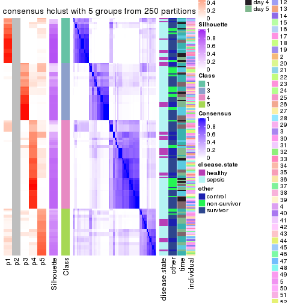</p>

</div>
<div id='tab-SD-hclust-consensus-heatmap-5'>
<pre><code class="r">consensus_heatmap(res, k = 6)
</code></pre>

<p></p>

</div>
</div>

Heatmaps for the membership of samples in all partitions to see how consistent they are:


<script>
$( function() {
	$( '#tabs-SD-hclust-membership-heatmap' ).tabs();
} );
</script>
<div id='tabs-SD-hclust-membership-heatmap'>
<ul>
<li><a href='#tab-SD-hclust-membership-heatmap-1'>k = 2</a></li>
<li><a href='#tab-SD-hclust-membership-heatmap-2'>k = 3</a></li>
<li><a href='#tab-SD-hclust-membership-heatmap-3'>k = 4</a></li>
<li><a href='#tab-SD-hclust-membership-heatmap-4'>k = 5</a></li>
<li><a href='#tab-SD-hclust-membership-heatmap-5'>k = 6</a></li>
</ul>
<div id='tab-SD-hclust-membership-heatmap-1'>
<pre><code class="r">membership_heatmap(res, k = 2)
</code></pre>

<p></p>

</div>
<div id='tab-SD-hclust-membership-heatmap-2'>
<pre><code class="r">membership_heatmap(res, k = 3)
</code></pre>

<p></p>

</div>
<div id='tab-SD-hclust-membership-heatmap-3'>
<pre><code class="r">membership_heatmap(res, k = 4)
</code></pre>

<p></p>

</div>
<div id='tab-SD-hclust-membership-heatmap-4'>
<pre><code class="r">membership_heatmap(res, k = 5)
</code></pre>

<p></p>

</div>
<div id='tab-SD-hclust-membership-heatmap-5'>
<pre><code class="r">membership_heatmap(res, k = 6)
</code></pre>

<p></p>

</div>
</div>

As soon as we have had the classes for columns, we can look for signatures
which are significantly different between classes which can be candidate marks
for certain classes. Following are the heatmaps for signatures.


Signature heatmaps where rows are scaled:


<script>
$( function() {
	$( '#tabs-SD-hclust-get-signatures' ).tabs();
} );
</script>
<div id='tabs-SD-hclust-get-signatures'>
<ul>
<li><a href='#tab-SD-hclust-get-signatures-1'>k = 2</a></li>
<li><a href='#tab-SD-hclust-get-signatures-2'>k = 3</a></li>
<li><a href='#tab-SD-hclust-get-signatures-3'>k = 4</a></li>
<li><a href='#tab-SD-hclust-get-signatures-4'>k = 5</a></li>
<li><a href='#tab-SD-hclust-get-signatures-5'>k = 6</a></li>
</ul>
<div id='tab-SD-hclust-get-signatures-1'>
<pre><code class="r">get_signatures(res, k = 2)
</code></pre>

<p></p>

</div>
<div id='tab-SD-hclust-get-signatures-2'>
<pre><code class="r">get_signatures(res, k = 3)
</code></pre>

<p></p>

</div>
<div id='tab-SD-hclust-get-signatures-3'>
<pre><code class="r">get_signatures(res, k = 4)
</code></pre>

<p></p>

</div>
<div id='tab-SD-hclust-get-signatures-4'>
<pre><code class="r">get_signatures(res, k = 5)
</code></pre>

<p></p>

</div>
<div id='tab-SD-hclust-get-signatures-5'>
<pre><code class="r">get_signatures(res, k = 6)
</code></pre>

<p></p>

</div>
</div>


Signature heatmaps where rows are not scaled:


<script>
$( function() {
	$( '#tabs-SD-hclust-get-signatures-no-scale' ).tabs();
} );
</script>
<div id='tabs-SD-hclust-get-signatures-no-scale'>
<ul>
<li><a href='#tab-SD-hclust-get-signatures-no-scale-1'>k = 2</a></li>
<li><a href='#tab-SD-hclust-get-signatures-no-scale-2'>k = 3</a></li>
<li><a href='#tab-SD-hclust-get-signatures-no-scale-3'>k = 4</a></li>
<li><a href='#tab-SD-hclust-get-signatures-no-scale-4'>k = 5</a></li>
<li><a href='#tab-SD-hclust-get-signatures-no-scale-5'>k = 6</a></li>
</ul>
<div id='tab-SD-hclust-get-signatures-no-scale-1'>
<pre><code class="r">get_signatures(res, k = 2, scale_rows = FALSE)
</code></pre>

<p></p>

</div>
<div id='tab-SD-hclust-get-signatures-no-scale-2'>
<pre><code class="r">get_signatures(res, k = 3, scale_rows = FALSE)
</code></pre>

<p></p>

</div>
<div id='tab-SD-hclust-get-signatures-no-scale-3'>
<pre><code class="r">get_signatures(res, k = 4, scale_rows = FALSE)
</code></pre>

<p></p>

</div>
<div id='tab-SD-hclust-get-signatures-no-scale-4'>
<pre><code class="r">get_signatures(res, k = 5, scale_rows = FALSE)
</code></pre>

<p></p>

</div>
<div id='tab-SD-hclust-get-signatures-no-scale-5'>
<pre><code class="r">get_signatures(res, k = 6, scale_rows = FALSE)
</code></pre>

<p></p>

</div>
</div>


Compare the overlap of signatures from different k:

```r
compare_signatures(res)
```


`get_signature()` returns a data frame invisibly. TO get the list of signatures, the function
call should be assigned to a variable explicitly. In following code, if `plot` argument is set
to `FALSE`, no heatmap is plotted while only the differential analysis is performed.

```r
# code only for demonstration
tb = get_signature(res, k = ..., plot = FALSE)
```

An example of the output of `tb` is:

```
#>   which_row         fdr    mean_1    mean_2 scaled_mean_1 scaled_mean_2 km
#> 1        38 0.042760348  8.373488  9.131774    -0.5533452     0.5164555  1
#> 2        40 0.018707592  7.106213  8.469186    -0.6173731     0.5762149  1
#> 3        55 0.019134737 10.221463 11.207825    -0.6159697     0.5749050  1
#> 4        59 0.006059896  5.921854  7.869574    -0.6899429     0.6439467  1
#> 5        60 0.018055526  8.928898 10.211722    -0.6204761     0.5791110  1
#> 6        98 0.009384629 15.714769 14.887706     0.6635654    -0.6193277  2
...
```

The columns in `tb` are:

1. `which_row`: row indices corresponding to the input matrix.
2. `fdr`: FDR for the differential test. 
3. `mean_x`: The mean value in group x.
4. `scaled_mean_x`: The mean value in group x after rows are scaled.
5. `km`: Row groups if k-means clustering is applied to rows.


UMAP plot which shows how samples are separated.


<script>
$( function() {
	$( '#tabs-SD-hclust-dimension-reduction' ).tabs();
} );
</script>
<div id='tabs-SD-hclust-dimension-reduction'>
<ul>
<li><a href='#tab-SD-hclust-dimension-reduction-1'>k = 2</a></li>
<li><a href='#tab-SD-hclust-dimension-reduction-2'>k = 3</a></li>
<li><a href='#tab-SD-hclust-dimension-reduction-3'>k = 4</a></li>
<li><a href='#tab-SD-hclust-dimension-reduction-4'>k = 5</a></li>
<li><a href='#tab-SD-hclust-dimension-reduction-5'>k = 6</a></li>
</ul>
<div id='tab-SD-hclust-dimension-reduction-1'>
<pre><code class="r">dimension_reduction(res, k = 2, method = &quot;UMAP&quot;)
</code></pre>

<p></p>

</div>
<div id='tab-SD-hclust-dimension-reduction-2'>
<pre><code class="r">dimension_reduction(res, k = 3, method = &quot;UMAP&quot;)
</code></pre>

<p></p>

</div>
<div id='tab-SD-hclust-dimension-reduction-3'>
<pre><code class="r">dimension_reduction(res, k = 4, method = &quot;UMAP&quot;)
</code></pre>

<p></p>

</div>
<div id='tab-SD-hclust-dimension-reduction-4'>
<pre><code class="r">dimension_reduction(res, k = 5, method = &quot;UMAP&quot;)
</code></pre>

<p></p>

</div>
<div id='tab-SD-hclust-dimension-reduction-5'>
<pre><code class="r">dimension_reduction(res, k = 6, method = &quot;UMAP&quot;)
</code></pre>

<p></p>

</div>
</div>


Following heatmap shows how subgroups are split when increasing `k`:

```r
collect_classes(res)
```


Test correlation between subgroups and known annotations. If the known
annotation is numeric, one-way ANOVA test is applied, and if the known
annotation is discrete, chi-squared contingency table test is applied.

```r
test_to_known_factors(res)
```

```
#>             n disease.state(p) other(p) time(p) individual(p) k
#> SD:hclust 144            0.222   0.1322 0.00286         0.619 2
#> SD:hclust 135            0.134   0.1153 0.03728         0.721 3
#> SD:hclust 137            0.371   0.1098 0.05951         0.751 4
#> SD:hclust 132            0.167   0.0439 0.01033         0.935 5
#> SD:hclust 126            0.133   0.0456 0.04619         0.924 6
```


If matrix rows can be associated to genes, consider to use `functional_enrichment(res,
...)` to perform function enrichment for the signature genes. See [this vignette](http://bioconductor.org/packages/devel/bioc/vignettes/cola/inst/doc/functional_enrichment.html) for more detailed explanations.


 

---------------------------------------------------


### SD:kmeans*


The object with results only for a single top-value method and a single partition method 
can be extracted as:

```r
res = res_list["SD", "kmeans"]
# you can also extract it by
# res = res_list["SD:kmeans"]
```

A summary of `res` and all the functions that can be applied to it:

```r
res
```

```
#> A 'ConsensusPartition' object with k = 2, 3, 4, 5, 6.
#>   On a matrix with 23598 rows and 163 columns.
#>   Top rows (1000, 2000, 3000, 4000, 5000) are extracted by 'SD' method.
#>   Subgroups are detected by 'kmeans' method.
#>   Performed in total 1250 partitions by row resampling.
#>   Best k for subgroups seems to be 3.
#> 
#> Following methods can be applied to this 'ConsensusPartition' object:
#>  [1] "cola_report"             "collect_classes"         "collect_plots"          
#>  [4] "collect_stats"           "colnames"                "compare_signatures"     
#>  [7] "consensus_heatmap"       "dimension_reduction"     "functional_enrichment"  
#> [10] "get_anno_col"            "get_anno"                "get_classes"            
#> [13] "get_consensus"           "get_matrix"              "get_membership"         
#> [16] "get_param"               "get_signatures"          "get_stats"              
#> [19] "is_best_k"               "is_stable_k"             "membership_heatmap"     
#> [22] "ncol"                    "nrow"                    "plot_ecdf"              
#> [25] "rownames"                "select_partition_number" "show"                   
#> [28] "suggest_best_k"          "test_to_known_factors"
```

`collect_plots()` function collects all the plots made from `res` for all `k` (number of partitions)
into one single page to provide an easy and fast comparison between different `k`.

```r
collect_plots(res)
```


The plots are:

- The first row: a plot of the ECDF (empirical cumulative distribution
  function) curves of the consensus matrix for each `k` and the heatmap of
  predicted classes for each `k`.
- The second row: heatmaps of the consensus matrix for each `k`.
- The third row: heatmaps of the membership matrix for each `k`.
- The fouth row: heatmaps of the signatures for each `k`.

All the plots in panels can be made by individual functions and they are
plotted later in this section.

`select_partition_number()` produces several plots showing different
statistics for choosing "optimized" `k`. There are following statistics:

- ECDF curves of the consensus matrix for each `k`;
- 1-PAC. [The PAC
  score](https://en.wikipedia.org/wiki/Consensus_clustering#Over-interpretation_potential_of_consensus_clustering)
  measures the proportion of the ambiguous subgrouping.
- Mean silhouette score.
- Concordance. The mean probability of fiting the consensus class ids in all
  partitions.
- Area increased. Denote $A_k$ as the area under the ECDF curve for current
  `k`, the area increased is defined as $A_k - A_{k-1}$.
- Rand index. The percent of pairs of samples that are both in a same cluster
  or both are not in a same cluster in the partition of k and k-1.
- Jaccard index. The ratio of pairs of samples are both in a same cluster in
  the partition of k and k-1 and the pairs of samples are both in a same
  cluster in the partition k or k-1.

The detailed explanations of these statistics can be found in [the _cola_
vignette](http://bioconductor.org/packages/devel/bioc/vignettes/cola/inst/doc/cola.html#toc_13).

Generally speaking, lower PAC score, higher mean silhouette score or higher
concordance corresponds to better partition. Rand index and Jaccard index
measure how similar the current partition is compared to partition with `k-1`.
If they are too similar, we won't accept `k` is better than `k-1`.

```r
select_partition_number(res)
```


The numeric values for all these statistics can be obtained by `get_stats()`.

```r
get_stats(res)
```

```
#>   k 1-PAC mean_silhouette concordance area_increased  Rand Jaccard
#> 2 2 0.722           0.921       0.956         0.4749 0.529   0.529
#> 3 3 0.910           0.933       0.954         0.3948 0.773   0.581
#> 4 4 0.698           0.666       0.796         0.1083 0.972   0.915
#> 5 5 0.666           0.628       0.739         0.0678 0.856   0.559
#> 6 6 0.729           0.668       0.788         0.0494 0.932   0.697
```

`suggest_best_k()` suggests the best $k$ based on these statistics. The rules are as follows:

- All $k$ with Jaccard index larger than 0.95 are removed because increasing
  $k$ does not provide enough extra information. If all $k$ are removed, it is
  marked as no subgroup is detected.
- For all $k$ with 1-PAC score larger than 0.9, the maximal $k$ is taken as
  the best $k$, and other $k$ are marked as optional $k$.
- If it does not fit the second rule. The $k$ with the maximal vote of the
  highest 1-PAC score, highest mean silhouette, and highest concordance is
  taken as the best $k$.

```r
suggest_best_k(res)
```

```
#> [1] 3
```


Following shows the table of the partitions (You need to click the **show/hide
code output** link to see it). The membership matrix (columns with name `p*`)
is inferred by
[`clue::cl_consensus()`](https://www.rdocumentation.org/link/cl_consensus?package=clue)
function with the `SE` method. Basically the value in the membership matrix
represents the probability to belong to a certain group. The finall class
label for an item is determined with the group with highest probability it
belongs to.

In `get_classes()` function, the entropy is calculated from the membership
matrix and the silhouette score is calculated from the consensus matrix.


<script>
$( function() {
	$( '#tabs-SD-kmeans-get-classes' ).tabs();
} );
</script>
<div id='tabs-SD-kmeans-get-classes'>
<ul>
<li><a href='#tab-SD-kmeans-get-classes-1'>k = 2</a></li>
<li><a href='#tab-SD-kmeans-get-classes-2'>k = 3</a></li>
<li><a href='#tab-SD-kmeans-get-classes-3'>k = 4</a></li>
<li><a href='#tab-SD-kmeans-get-classes-4'>k = 5</a></li>
<li><a href='#tab-SD-kmeans-get-classes-5'>k = 6</a></li>
</ul>

<div id='tab-SD-kmeans-get-classes-1'>
<p><a id='tab-SD-kmeans-get-classes-1-a' style='color:#0366d6' href='#'>show/hide code output</a></p>
<pre><code class="r">cbind(get_classes(res, k = 2), get_membership(res, k = 2))
</code></pre>

<pre><code>#&gt;            class entropy silhouette    p1    p2
#&gt; GSM1317945     2  0.0000      0.950 0.000 1.000
#&gt; GSM1317946     1  0.0376      0.960 0.996 0.004
#&gt; GSM1317947     2  0.0376      0.948 0.004 0.996
#&gt; GSM1317948     1  0.7299      0.787 0.796 0.204
#&gt; GSM1317949     1  0.0376      0.960 0.996 0.004
#&gt; GSM1317950     1  0.0376      0.960 0.996 0.004
#&gt; GSM1317953     1  0.0376      0.960 0.996 0.004
#&gt; GSM1317954     1  0.0376      0.960 0.996 0.004
#&gt; GSM1317955     1  0.0376      0.960 0.996 0.004
#&gt; GSM1317956     1  0.0376      0.960 0.996 0.004
#&gt; GSM1317957     2  0.0000      0.950 0.000 1.000
#&gt; GSM1317958     1  0.0376      0.960 0.996 0.004
#&gt; GSM1317959     2  0.4431      0.898 0.092 0.908
#&gt; GSM1317960     1  0.6247      0.835 0.844 0.156
#&gt; GSM1317961     2  0.0000      0.950 0.000 1.000
#&gt; GSM1317962     1  0.0376      0.960 0.996 0.004
#&gt; GSM1317963     1  0.0376      0.960 0.996 0.004
#&gt; GSM1317964     1  0.0376      0.960 0.996 0.004
#&gt; GSM1317965     2  0.0000      0.950 0.000 1.000
#&gt; GSM1317966     2  0.0000      0.950 0.000 1.000
#&gt; GSM1317967     2  0.0000      0.950 0.000 1.000
#&gt; GSM1317968     1  0.0376      0.960 0.996 0.004
#&gt; GSM1317969     2  0.0000      0.950 0.000 1.000
#&gt; GSM1317970     2  0.0000      0.950 0.000 1.000
#&gt; GSM1317952     1  0.7139      0.795 0.804 0.196
#&gt; GSM1317951     1  0.0376      0.960 0.996 0.004
#&gt; GSM1317971     2  0.0000      0.950 0.000 1.000
#&gt; GSM1317972     1  0.0376      0.960 0.996 0.004
#&gt; GSM1317973     2  0.0000      0.950 0.000 1.000
#&gt; GSM1317974     1  0.0376      0.960 0.996 0.004
#&gt; GSM1317975     2  0.7219      0.805 0.200 0.800
#&gt; GSM1317978     1  0.0376      0.960 0.996 0.004
#&gt; GSM1317979     2  0.7815      0.672 0.232 0.768
#&gt; GSM1317980     2  0.0000      0.950 0.000 1.000
#&gt; GSM1317981     2  0.7056      0.815 0.192 0.808
#&gt; GSM1317982     2  0.0000      0.950 0.000 1.000
#&gt; GSM1317983     1  0.0376      0.960 0.996 0.004
#&gt; GSM1317984     2  0.0000      0.950 0.000 1.000
#&gt; GSM1317985     2  0.0000      0.950 0.000 1.000
#&gt; GSM1317986     1  0.0376      0.960 0.996 0.004
#&gt; GSM1317987     2  0.7056      0.815 0.192 0.808
#&gt; GSM1317988     2  0.0000      0.950 0.000 1.000
#&gt; GSM1317989     1  0.4690      0.886 0.900 0.100
#&gt; GSM1317990     2  0.7056      0.815 0.192 0.808
#&gt; GSM1317991     2  0.0000      0.950 0.000 1.000
#&gt; GSM1317992     2  0.0000      0.950 0.000 1.000
#&gt; GSM1317993     2  0.6148      0.855 0.152 0.848
#&gt; GSM1317994     2  0.0000      0.950 0.000 1.000
#&gt; GSM1317977     1  0.1633      0.945 0.976 0.024
#&gt; GSM1317976     1  0.0376      0.960 0.996 0.004
#&gt; GSM1317995     2  0.0000      0.950 0.000 1.000
#&gt; GSM1317996     2  0.7056      0.815 0.192 0.808
#&gt; GSM1317997     2  0.0000      0.950 0.000 1.000
#&gt; GSM1317998     1  0.0376      0.960 0.996 0.004
#&gt; GSM1317999     1  0.0376      0.960 0.996 0.004
#&gt; GSM1318002     2  0.0000      0.950 0.000 1.000
#&gt; GSM1318003     2  0.3584      0.913 0.068 0.932
#&gt; GSM1318004     2  0.5946      0.861 0.144 0.856
#&gt; GSM1318005     2  0.6148      0.855 0.152 0.848
#&gt; GSM1318006     1  0.0376      0.960 0.996 0.004
#&gt; GSM1318007     2  0.0000      0.950 0.000 1.000
#&gt; GSM1318008     1  0.0376      0.960 0.996 0.004
#&gt; GSM1318009     2  0.6712      0.832 0.176 0.824
#&gt; GSM1318010     2  0.0000      0.950 0.000 1.000
#&gt; GSM1318011     1  0.0376      0.960 0.996 0.004
#&gt; GSM1318012     1  0.0376      0.960 0.996 0.004
#&gt; GSM1318013     2  0.0000      0.950 0.000 1.000
#&gt; GSM1318014     1  0.0938      0.954 0.988 0.012
#&gt; GSM1318015     2  0.0000      0.950 0.000 1.000
#&gt; GSM1318001     2  0.0000      0.950 0.000 1.000
#&gt; GSM1318000     2  0.6148      0.855 0.152 0.848
#&gt; GSM1318016     2  0.4562      0.896 0.096 0.904
#&gt; GSM1318017     1  0.0376      0.960 0.996 0.004
#&gt; GSM1318019     2  0.0000      0.950 0.000 1.000
#&gt; GSM1318020     2  0.0000      0.950 0.000 1.000
#&gt; GSM1318021     2  0.6712      0.832 0.176 0.824
#&gt; GSM1318022     2  0.0376      0.948 0.004 0.996
#&gt; GSM1318023     1  0.0376      0.960 0.996 0.004
#&gt; GSM1318024     2  0.6148      0.855 0.152 0.848
#&gt; GSM1318025     2  0.0000      0.950 0.000 1.000
#&gt; GSM1318026     2  0.0000      0.950 0.000 1.000
#&gt; GSM1318027     2  0.0000      0.950 0.000 1.000
#&gt; GSM1318028     1  0.0376      0.960 0.996 0.004
#&gt; GSM1318029     2  0.0376      0.948 0.004 0.996
#&gt; GSM1318018     1  0.0376      0.960 0.996 0.004
#&gt; GSM1318030     2  0.0000      0.950 0.000 1.000
#&gt; GSM1318031     2  0.0000      0.950 0.000 1.000
#&gt; GSM1318033     1  0.0376      0.960 0.996 0.004
#&gt; GSM1318034     1  0.9522      0.504 0.628 0.372
#&gt; GSM1318035     2  0.6148      0.855 0.152 0.848
#&gt; GSM1318036     1  0.0376      0.960 0.996 0.004
#&gt; GSM1318037     2  0.0000      0.950 0.000 1.000
#&gt; GSM1318038     2  0.0376      0.948 0.004 0.996
#&gt; GSM1318039     1  0.0000      0.957 1.000 0.000
#&gt; GSM1318040     2  0.0000      0.950 0.000 1.000
#&gt; GSM1318032     2  0.0000      0.950 0.000 1.000
#&gt; GSM1317914     2  0.0376      0.948 0.004 0.996
#&gt; GSM1317915     1  0.0000      0.957 1.000 0.000
#&gt; GSM1317916     1  0.0000      0.957 1.000 0.000
#&gt; GSM1317917     2  0.0376      0.948 0.004 0.996
#&gt; GSM1317918     1  0.0000      0.957 1.000 0.000
#&gt; GSM1317919     2  0.0376      0.948 0.004 0.996
#&gt; GSM1317920     2  0.0376      0.948 0.004 0.996
#&gt; GSM1317921     2  0.0376      0.948 0.004 0.996
#&gt; GSM1317922     1  0.7745      0.754 0.772 0.228
#&gt; GSM1317923     2  0.0376      0.948 0.004 0.996
#&gt; GSM1317924     2  0.0000      0.950 0.000 1.000
#&gt; GSM1317925     2  0.6148      0.855 0.152 0.848
#&gt; GSM1317926     2  0.0376      0.948 0.004 0.996
#&gt; GSM1317927     2  0.6148      0.855 0.152 0.848
#&gt; GSM1317928     2  0.0000      0.950 0.000 1.000
#&gt; GSM1317929     2  0.0376      0.948 0.004 0.996
#&gt; GSM1317930     2  0.0000      0.950 0.000 1.000
#&gt; GSM1317931     2  0.0000      0.950 0.000 1.000
#&gt; GSM1317932     2  0.0000      0.950 0.000 1.000
#&gt; GSM1317933     2  0.6148      0.855 0.152 0.848
#&gt; GSM1317934     2  0.0000      0.950 0.000 1.000
#&gt; GSM1317935     2  0.0000      0.950 0.000 1.000
#&gt; GSM1317936     2  0.0000      0.950 0.000 1.000
#&gt; GSM1317937     1  0.0376      0.960 0.996 0.004
#&gt; GSM1317938     2  0.6148      0.855 0.152 0.848
#&gt; GSM1317939     2  0.6148      0.855 0.152 0.848
#&gt; GSM1317940     1  0.0376      0.960 0.996 0.004
#&gt; GSM1317941     2  0.7056      0.815 0.192 0.808
#&gt; GSM1317942     2  0.7219      0.805 0.200 0.800
#&gt; GSM1317943     2  0.7056      0.815 0.192 0.808
#&gt; GSM1317944     2  0.6148      0.855 0.152 0.848
#&gt; GSM1317896     2  0.0000      0.950 0.000 1.000
#&gt; GSM1317897     1  0.0376      0.960 0.996 0.004
#&gt; GSM1317898     1  0.0376      0.960 0.996 0.004
#&gt; GSM1317899     1  0.0376      0.960 0.996 0.004
#&gt; GSM1317900     2  0.0000      0.950 0.000 1.000
#&gt; GSM1317901     1  0.0376      0.960 0.996 0.004
#&gt; GSM1317902     1  0.0376      0.960 0.996 0.004
#&gt; GSM1317903     1  0.0376      0.960 0.996 0.004
#&gt; GSM1317904     2  0.7219      0.805 0.200 0.800
#&gt; GSM1317905     2  0.0000      0.950 0.000 1.000
#&gt; GSM1317906     2  0.0000      0.950 0.000 1.000
#&gt; GSM1317907     2  0.0000      0.950 0.000 1.000
#&gt; GSM1317908     1  0.8267      0.715 0.740 0.260
#&gt; GSM1317909     1  0.7299      0.787 0.796 0.204
#&gt; GSM1317910     1  0.7219      0.786 0.800 0.200
#&gt; GSM1317911     1  0.0376      0.960 0.996 0.004
#&gt; GSM1317912     2  0.0000      0.950 0.000 1.000
#&gt; GSM1317913     2  0.0000      0.950 0.000 1.000
#&gt; GSM1318041     2  0.0376      0.948 0.004 0.996
#&gt; GSM1318042     2  0.0000      0.950 0.000 1.000
#&gt; GSM1318043     2  0.0000      0.950 0.000 1.000
#&gt; GSM1318044     1  0.0376      0.960 0.996 0.004
#&gt; GSM1318045     1  0.0376      0.960 0.996 0.004
#&gt; GSM1318046     1  0.0376      0.960 0.996 0.004
#&gt; GSM1318047     1  0.0376      0.960 0.996 0.004
#&gt; GSM1318048     1  0.7299      0.787 0.796 0.204
#&gt; GSM1318049     1  0.7056      0.799 0.808 0.192
#&gt; GSM1318050     2  0.4431      0.898 0.092 0.908
#&gt; GSM1318051     2  0.4431      0.898 0.092 0.908
#&gt; GSM1318052     2  0.0000      0.950 0.000 1.000
#&gt; GSM1318053     2  0.0000      0.950 0.000 1.000
#&gt; GSM1318054     2  0.0000      0.950 0.000 1.000
#&gt; GSM1318055     2  0.0000      0.950 0.000 1.000
#&gt; GSM1318056     2  0.0000      0.950 0.000 1.000
#&gt; GSM1318057     2  0.0000      0.950 0.000 1.000
#&gt; GSM1318058     2  0.0000      0.950 0.000 1.000
</code></pre>

<script>
$('#tab-SD-kmeans-get-classes-1-a').parent().next().next().hide();
$('#tab-SD-kmeans-get-classes-1-a').click(function(){
  $('#tab-SD-kmeans-get-classes-1-a').parent().next().next().toggle();
  return(false);
});
</script>
</div>

<div id='tab-SD-kmeans-get-classes-2'>
<p><a id='tab-SD-kmeans-get-classes-2-a' style='color:#0366d6' href='#'>show/hide code output</a></p>
<pre><code class="r">cbind(get_classes(res, k = 3), get_membership(res, k = 3))
</code></pre>

<pre><code>#&gt;            class entropy silhouette    p1    p2    p3
#&gt; GSM1317945     2  0.0237      0.954 0.000 0.996 0.004
#&gt; GSM1317946     1  0.0661      0.963 0.988 0.004 0.008
#&gt; GSM1317947     3  0.2297      0.958 0.020 0.036 0.944
#&gt; GSM1317948     1  0.4784      0.764 0.796 0.004 0.200
#&gt; GSM1317949     1  0.0829      0.964 0.984 0.004 0.012
#&gt; GSM1317950     1  0.0424      0.964 0.992 0.000 0.008
#&gt; GSM1317953     1  0.0661      0.963 0.988 0.004 0.008
#&gt; GSM1317954     1  0.0829      0.963 0.984 0.004 0.012
#&gt; GSM1317955     1  0.0829      0.963 0.984 0.004 0.012
#&gt; GSM1317956     1  0.0424      0.964 0.992 0.000 0.008
#&gt; GSM1317957     2  0.0000      0.954 0.000 1.000 0.000
#&gt; GSM1317958     1  0.0424      0.964 0.992 0.000 0.008
#&gt; GSM1317959     2  0.0237      0.954 0.000 0.996 0.004
#&gt; GSM1317960     1  0.4733      0.770 0.800 0.004 0.196
#&gt; GSM1317961     3  0.1964      0.966 0.000 0.056 0.944
#&gt; GSM1317962     1  0.1585      0.948 0.964 0.028 0.008
#&gt; GSM1317963     1  0.0424      0.964 0.992 0.000 0.008
#&gt; GSM1317964     1  0.0829      0.963 0.984 0.004 0.012
#&gt; GSM1317965     3  0.2066      0.971 0.000 0.060 0.940
#&gt; GSM1317966     3  0.1964      0.966 0.000 0.056 0.944
#&gt; GSM1317967     2  0.2796      0.887 0.000 0.908 0.092
#&gt; GSM1317968     1  0.0661      0.963 0.988 0.004 0.008
#&gt; GSM1317969     3  0.2537      0.954 0.000 0.080 0.920
#&gt; GSM1317970     2  0.0237      0.954 0.000 0.996 0.004
#&gt; GSM1317952     1  0.4733      0.770 0.800 0.004 0.196
#&gt; GSM1317951     1  0.0829      0.963 0.984 0.004 0.012
#&gt; GSM1317971     3  0.2066      0.971 0.000 0.060 0.940
#&gt; GSM1317972     1  0.0661      0.963 0.988 0.004 0.008
#&gt; GSM1317973     2  0.0237      0.954 0.000 0.996 0.004
#&gt; GSM1317974     1  0.1585      0.948 0.964 0.028 0.008
#&gt; GSM1317975     2  0.0848      0.944 0.008 0.984 0.008
#&gt; GSM1317978     1  0.0661      0.963 0.988 0.004 0.008
#&gt; GSM1317979     3  0.2434      0.948 0.036 0.024 0.940
#&gt; GSM1317980     3  0.2066      0.971 0.000 0.060 0.940
#&gt; GSM1317981     2  0.0848      0.944 0.008 0.984 0.008
#&gt; GSM1317982     3  0.4887      0.757 0.000 0.228 0.772
#&gt; GSM1317983     1  0.0424      0.964 0.992 0.000 0.008
#&gt; GSM1317984     3  0.2066      0.971 0.000 0.060 0.940
#&gt; GSM1317985     3  0.2066      0.971 0.000 0.060 0.940
#&gt; GSM1317986     1  0.0424      0.964 0.992 0.000 0.008
#&gt; GSM1317987     2  0.0848      0.944 0.008 0.984 0.008
#&gt; GSM1317988     2  0.0237      0.954 0.000 0.996 0.004
#&gt; GSM1317989     1  0.4228      0.829 0.844 0.008 0.148
#&gt; GSM1317990     2  0.0424      0.950 0.008 0.992 0.000
#&gt; GSM1317991     3  0.2066      0.971 0.000 0.060 0.940
#&gt; GSM1317992     2  0.1753      0.924 0.000 0.952 0.048
#&gt; GSM1317993     2  0.0237      0.953 0.004 0.996 0.000
#&gt; GSM1317994     3  0.2066      0.971 0.000 0.060 0.940
#&gt; GSM1317977     1  0.0424      0.964 0.992 0.000 0.008
#&gt; GSM1317976     1  0.0661      0.963 0.988 0.004 0.008
#&gt; GSM1317995     3  0.2066      0.971 0.000 0.060 0.940
#&gt; GSM1317996     2  0.0424      0.950 0.008 0.992 0.000
#&gt; GSM1317997     3  0.2066      0.971 0.000 0.060 0.940
#&gt; GSM1317998     1  0.0424      0.964 0.992 0.000 0.008
#&gt; GSM1317999     1  0.0424      0.964 0.992 0.000 0.008
#&gt; GSM1318002     2  0.0237      0.954 0.000 0.996 0.004
#&gt; GSM1318003     2  0.0237      0.954 0.000 0.996 0.004
#&gt; GSM1318004     2  0.0237      0.954 0.000 0.996 0.004
#&gt; GSM1318005     2  0.0475      0.954 0.004 0.992 0.004
#&gt; GSM1318006     1  0.0424      0.964 0.992 0.000 0.008
#&gt; GSM1318007     2  0.4555      0.760 0.000 0.800 0.200
#&gt; GSM1318008     1  0.0424      0.964 0.992 0.000 0.008
#&gt; GSM1318009     2  0.0661      0.952 0.008 0.988 0.004
#&gt; GSM1318010     3  0.2066      0.971 0.000 0.060 0.940
#&gt; GSM1318011     1  0.0424      0.964 0.992 0.000 0.008
#&gt; GSM1318012     1  0.0424      0.964 0.992 0.000 0.008
#&gt; GSM1318013     2  0.3116      0.873 0.000 0.892 0.108
#&gt; GSM1318014     1  0.0424      0.964 0.992 0.000 0.008
#&gt; GSM1318015     2  0.0237      0.954 0.000 0.996 0.004
#&gt; GSM1318001     3  0.2066      0.971 0.000 0.060 0.940
#&gt; GSM1318000     2  0.0475      0.954 0.004 0.992 0.004
#&gt; GSM1318016     2  0.0237      0.954 0.000 0.996 0.004
#&gt; GSM1318017     1  0.0237      0.965 0.996 0.000 0.004
#&gt; GSM1318019     2  0.0237      0.954 0.000 0.996 0.004
#&gt; GSM1318020     3  0.2066      0.971 0.000 0.060 0.940
#&gt; GSM1318021     2  0.0424      0.950 0.008 0.992 0.000
#&gt; GSM1318022     3  0.0892      0.956 0.000 0.020 0.980
#&gt; GSM1318023     1  0.0237      0.965 0.996 0.000 0.004
#&gt; GSM1318024     2  0.0237      0.953 0.004 0.996 0.000
#&gt; GSM1318025     3  0.2066      0.971 0.000 0.060 0.940
#&gt; GSM1318026     2  0.0237      0.954 0.000 0.996 0.004
#&gt; GSM1318027     2  0.0237      0.954 0.000 0.996 0.004
#&gt; GSM1318028     1  0.0661      0.963 0.988 0.004 0.008
#&gt; GSM1318029     3  0.0892      0.956 0.000 0.020 0.980
#&gt; GSM1318018     1  0.0237      0.965 0.996 0.000 0.004
#&gt; GSM1318030     2  0.6180      0.279 0.000 0.584 0.416
#&gt; GSM1318031     3  0.2066      0.971 0.000 0.060 0.940
#&gt; GSM1318033     1  0.0237      0.965 0.996 0.000 0.004
#&gt; GSM1318034     3  0.2173      0.933 0.048 0.008 0.944
#&gt; GSM1318035     2  0.0475      0.954 0.004 0.992 0.004
#&gt; GSM1318036     1  0.0475      0.965 0.992 0.004 0.004
#&gt; GSM1318037     2  0.4504      0.765 0.000 0.804 0.196
#&gt; GSM1318038     3  0.0892      0.956 0.000 0.020 0.980
#&gt; GSM1318039     1  0.1529      0.950 0.960 0.000 0.040
#&gt; GSM1318040     3  0.2066      0.971 0.000 0.060 0.940
#&gt; GSM1318032     3  0.2066      0.971 0.000 0.060 0.940
#&gt; GSM1317914     3  0.1529      0.965 0.000 0.040 0.960
#&gt; GSM1317915     1  0.1529      0.950 0.960 0.000 0.040
#&gt; GSM1317916     1  0.1411      0.952 0.964 0.000 0.036
#&gt; GSM1317917     3  0.1015      0.945 0.012 0.008 0.980
#&gt; GSM1317918     1  0.1643      0.948 0.956 0.000 0.044
#&gt; GSM1317919     3  0.0892      0.956 0.000 0.020 0.980
#&gt; GSM1317920     3  0.0892      0.956 0.000 0.020 0.980
#&gt; GSM1317921     3  0.0892      0.956 0.000 0.020 0.980
#&gt; GSM1317922     3  0.0592      0.938 0.012 0.000 0.988
#&gt; GSM1317923     3  0.0892      0.956 0.000 0.020 0.980
#&gt; GSM1317924     3  0.2066      0.971 0.000 0.060 0.940
#&gt; GSM1317925     2  0.0475      0.954 0.004 0.992 0.004
#&gt; GSM1317926     3  0.0892      0.956 0.000 0.020 0.980
#&gt; GSM1317927     2  0.0475      0.954 0.004 0.992 0.004
#&gt; GSM1317928     3  0.2066      0.971 0.000 0.060 0.940
#&gt; GSM1317929     3  0.0892      0.956 0.000 0.020 0.980
#&gt; GSM1317930     2  0.0237      0.954 0.000 0.996 0.004
#&gt; GSM1317931     3  0.2066      0.971 0.000 0.060 0.940
#&gt; GSM1317932     3  0.2066      0.971 0.000 0.060 0.940
#&gt; GSM1317933     2  0.0475      0.954 0.004 0.992 0.004
#&gt; GSM1317934     3  0.2066      0.971 0.000 0.060 0.940
#&gt; GSM1317935     3  0.2066      0.971 0.000 0.060 0.940
#&gt; GSM1317936     3  0.2066      0.971 0.000 0.060 0.940
#&gt; GSM1317937     1  0.0237      0.965 0.996 0.000 0.004
#&gt; GSM1317938     2  0.0475      0.954 0.004 0.992 0.004
#&gt; GSM1317939     2  0.0475      0.954 0.004 0.992 0.004
#&gt; GSM1317940     1  0.0661      0.963 0.988 0.004 0.008
#&gt; GSM1317941     2  0.0848      0.944 0.008 0.984 0.008
#&gt; GSM1317942     2  0.0424      0.950 0.008 0.992 0.000
#&gt; GSM1317943     2  0.0661      0.952 0.008 0.988 0.004
#&gt; GSM1317944     2  0.0475      0.954 0.004 0.992 0.004
#&gt; GSM1317896     3  0.2066      0.971 0.000 0.060 0.940
#&gt; GSM1317897     1  0.0829      0.963 0.984 0.004 0.012
#&gt; GSM1317898     1  0.0424      0.964 0.992 0.000 0.008
#&gt; GSM1317899     1  0.0424      0.964 0.992 0.000 0.008
#&gt; GSM1317900     3  0.2066      0.971 0.000 0.060 0.940
#&gt; GSM1317901     1  0.0424      0.964 0.992 0.000 0.008
#&gt; GSM1317902     1  0.0424      0.964 0.992 0.000 0.008
#&gt; GSM1317903     1  0.0237      0.965 0.996 0.000 0.004
#&gt; GSM1317904     2  0.0661      0.952 0.008 0.988 0.004
#&gt; GSM1317905     2  0.3192      0.869 0.000 0.888 0.112
#&gt; GSM1317906     2  0.3192      0.869 0.000 0.888 0.112
#&gt; GSM1317907     2  0.4887      0.717 0.000 0.772 0.228
#&gt; GSM1317908     3  0.1031      0.936 0.024 0.000 0.976
#&gt; GSM1317909     1  0.4605      0.766 0.796 0.000 0.204
#&gt; GSM1317910     1  0.5815      0.608 0.692 0.004 0.304
#&gt; GSM1317911     1  0.0000      0.965 1.000 0.000 0.000
#&gt; GSM1317912     3  0.5785      0.553 0.000 0.332 0.668
#&gt; GSM1317913     2  0.0237      0.954 0.000 0.996 0.004
#&gt; GSM1318041     3  0.2443      0.951 0.032 0.028 0.940
#&gt; GSM1318042     3  0.2066      0.971 0.000 0.060 0.940
#&gt; GSM1318043     3  0.2066      0.971 0.000 0.060 0.940
#&gt; GSM1318044     1  0.0237      0.965 0.996 0.000 0.004
#&gt; GSM1318045     1  0.0424      0.964 0.992 0.000 0.008
#&gt; GSM1318046     1  0.0237      0.965 0.996 0.000 0.004
#&gt; GSM1318047     1  0.0424      0.964 0.992 0.000 0.008
#&gt; GSM1318048     3  0.2096      0.928 0.052 0.004 0.944
#&gt; GSM1318049     1  0.4733      0.770 0.800 0.004 0.196
#&gt; GSM1318050     2  0.0237      0.954 0.000 0.996 0.004
#&gt; GSM1318051     2  0.0237      0.954 0.000 0.996 0.004
#&gt; GSM1318052     2  0.0237      0.954 0.000 0.996 0.004
#&gt; GSM1318053     2  0.0237      0.954 0.000 0.996 0.004
#&gt; GSM1318054     2  0.4555      0.760 0.000 0.800 0.200
#&gt; GSM1318055     3  0.2066      0.971 0.000 0.060 0.940
#&gt; GSM1318056     2  0.3116      0.873 0.000 0.892 0.108
#&gt; GSM1318057     2  0.0237      0.954 0.000 0.996 0.004
#&gt; GSM1318058     2  0.4842      0.724 0.000 0.776 0.224
</code></pre>

<script>
$('#tab-SD-kmeans-get-classes-2-a').parent().next().next().hide();
$('#tab-SD-kmeans-get-classes-2-a').click(function(){
  $('#tab-SD-kmeans-get-classes-2-a').parent().next().next().toggle();
  return(false);
});
</script>
</div>

<div id='tab-SD-kmeans-get-classes-3'>
<p><a id='tab-SD-kmeans-get-classes-3-a' style='color:#0366d6' href='#'>show/hide code output</a></p>
<pre><code class="r">cbind(get_classes(res, k = 4), get_membership(res, k = 4))
</code></pre>

<pre><code>#&gt;            class entropy silhouette    p1    p2    p3    p4
#&gt; GSM1317945     2  0.4356     0.5943 0.000 0.708 0.000 0.292
#&gt; GSM1317946     1  0.3873     0.7783 0.772 0.000 0.000 0.228
#&gt; GSM1317947     3  0.4436     0.6717 0.020 0.000 0.764 0.216
#&gt; GSM1317948     1  0.6488     0.5545 0.604 0.000 0.104 0.292
#&gt; GSM1317949     1  0.4635     0.7594 0.720 0.000 0.012 0.268
#&gt; GSM1317950     1  0.2704     0.7976 0.876 0.000 0.000 0.124
#&gt; GSM1317953     1  0.3486     0.7830 0.812 0.000 0.000 0.188
#&gt; GSM1317954     1  0.3486     0.7830 0.812 0.000 0.000 0.188
#&gt; GSM1317955     1  0.3486     0.7830 0.812 0.000 0.000 0.188
#&gt; GSM1317956     1  0.2704     0.7976 0.876 0.000 0.000 0.124
#&gt; GSM1317957     2  0.4830     0.5524 0.000 0.608 0.000 0.392
#&gt; GSM1317958     1  0.2469     0.7931 0.892 0.000 0.000 0.108
#&gt; GSM1317959     2  0.4843     0.4857 0.000 0.604 0.000 0.396
#&gt; GSM1317960     1  0.6371     0.5606 0.608 0.000 0.092 0.300
#&gt; GSM1317961     3  0.3626     0.7688 0.000 0.004 0.812 0.184
#&gt; GSM1317962     1  0.5184     0.7589 0.736 0.060 0.000 0.204
#&gt; GSM1317963     1  0.4304     0.7432 0.716 0.000 0.000 0.284
#&gt; GSM1317964     1  0.3486     0.7830 0.812 0.000 0.000 0.188
#&gt; GSM1317965     3  0.0817     0.8384 0.000 0.000 0.976 0.024
#&gt; GSM1317966     3  0.3626     0.7688 0.000 0.004 0.812 0.184
#&gt; GSM1317967     2  0.7072     0.2534 0.000 0.524 0.140 0.336
#&gt; GSM1317968     1  0.3444     0.7840 0.816 0.000 0.000 0.184
#&gt; GSM1317969     3  0.6139     0.2894 0.000 0.100 0.656 0.244
#&gt; GSM1317970     2  0.4605     0.5860 0.000 0.664 0.000 0.336
#&gt; GSM1317952     1  0.6488     0.5545 0.604 0.000 0.104 0.292
#&gt; GSM1317951     1  0.3486     0.7830 0.812 0.000 0.000 0.188
#&gt; GSM1317971     3  0.2300     0.8242 0.000 0.016 0.920 0.064
#&gt; GSM1317972     1  0.3626     0.7823 0.812 0.004 0.000 0.184
#&gt; GSM1317973     2  0.4624     0.5742 0.000 0.660 0.000 0.340
#&gt; GSM1317974     1  0.4121     0.7726 0.796 0.020 0.000 0.184
#&gt; GSM1317975     2  0.1792     0.6202 0.000 0.932 0.000 0.068
#&gt; GSM1317978     1  0.3444     0.7840 0.816 0.000 0.000 0.184
#&gt; GSM1317979     3  0.7012     0.3569 0.156 0.000 0.560 0.284
#&gt; GSM1317980     3  0.1557     0.8333 0.000 0.000 0.944 0.056
#&gt; GSM1317981     2  0.1792     0.6202 0.000 0.932 0.000 0.068
#&gt; GSM1317982     4  0.7314     0.3423 0.000 0.152 0.420 0.428
#&gt; GSM1317983     1  0.2704     0.7976 0.876 0.000 0.000 0.124
#&gt; GSM1317984     3  0.0336     0.8419 0.000 0.000 0.992 0.008
#&gt; GSM1317985     3  0.0707     0.8414 0.000 0.000 0.980 0.020
#&gt; GSM1317986     1  0.2704     0.7976 0.876 0.000 0.000 0.124
#&gt; GSM1317987     2  0.1792     0.6202 0.000 0.932 0.000 0.068
#&gt; GSM1317988     2  0.4522     0.5942 0.000 0.680 0.000 0.320
#&gt; GSM1317989     1  0.6277     0.5780 0.572 0.000 0.068 0.360
#&gt; GSM1317990     2  0.1716     0.6243 0.000 0.936 0.000 0.064
#&gt; GSM1317991     3  0.1398     0.8393 0.000 0.004 0.956 0.040
#&gt; GSM1317992     2  0.5167     0.5035 0.000 0.760 0.108 0.132
#&gt; GSM1317993     2  0.0000     0.6786 0.000 1.000 0.000 0.000
#&gt; GSM1317994     3  0.0000     0.8413 0.000 0.000 1.000 0.000
#&gt; GSM1317977     1  0.5152     0.6388 0.664 0.000 0.020 0.316
#&gt; GSM1317976     1  0.3668     0.7805 0.808 0.004 0.000 0.188
#&gt; GSM1317995     3  0.0707     0.8414 0.000 0.000 0.980 0.020
#&gt; GSM1317996     2  0.4008     0.6415 0.000 0.756 0.000 0.244
#&gt; GSM1317997     3  0.0707     0.8414 0.000 0.000 0.980 0.020
#&gt; GSM1317998     1  0.2345     0.7956 0.900 0.000 0.000 0.100
#&gt; GSM1317999     1  0.3123     0.7749 0.844 0.000 0.000 0.156
#&gt; GSM1318002     2  0.0000     0.6786 0.000 1.000 0.000 0.000
#&gt; GSM1318003     2  0.0000     0.6786 0.000 1.000 0.000 0.000
#&gt; GSM1318004     2  0.5060     0.4427 0.004 0.584 0.000 0.412
#&gt; GSM1318005     2  0.4730     0.5415 0.000 0.636 0.000 0.364
#&gt; GSM1318006     1  0.2011     0.8005 0.920 0.000 0.000 0.080
#&gt; GSM1318007     4  0.7021     0.1688 0.000 0.400 0.120 0.480
#&gt; GSM1318008     1  0.2647     0.7904 0.880 0.000 0.000 0.120
#&gt; GSM1318009     2  0.4103     0.6337 0.000 0.744 0.000 0.256
#&gt; GSM1318010     3  0.0707     0.8414 0.000 0.000 0.980 0.020
#&gt; GSM1318011     1  0.4936     0.6768 0.700 0.000 0.020 0.280
#&gt; GSM1318012     1  0.4988     0.6693 0.692 0.000 0.020 0.288
#&gt; GSM1318013     2  0.6750     0.0498 0.000 0.472 0.092 0.436
#&gt; GSM1318014     1  0.5036     0.6732 0.696 0.000 0.024 0.280
#&gt; GSM1318015     2  0.0000     0.6786 0.000 1.000 0.000 0.000
#&gt; GSM1318001     3  0.0707     0.8414 0.000 0.000 0.980 0.020
#&gt; GSM1318000     2  0.3486     0.6567 0.000 0.812 0.000 0.188
#&gt; GSM1318016     2  0.0000     0.6786 0.000 1.000 0.000 0.000
#&gt; GSM1318017     1  0.0188     0.8108 0.996 0.000 0.000 0.004
#&gt; GSM1318019     2  0.4277     0.6213 0.000 0.720 0.000 0.280
#&gt; GSM1318020     3  0.0469     0.8410 0.000 0.000 0.988 0.012
#&gt; GSM1318021     2  0.0000     0.6786 0.000 1.000 0.000 0.000
#&gt; GSM1318022     3  0.4103     0.7520 0.000 0.000 0.744 0.256
#&gt; GSM1318023     1  0.0188     0.8108 0.996 0.000 0.000 0.004
#&gt; GSM1318024     2  0.0000     0.6786 0.000 1.000 0.000 0.000
#&gt; GSM1318025     3  0.1118     0.8353 0.000 0.000 0.964 0.036
#&gt; GSM1318026     2  0.1151     0.6655 0.000 0.968 0.008 0.024
#&gt; GSM1318027     2  0.4585     0.5875 0.000 0.668 0.000 0.332
#&gt; GSM1318028     1  0.3486     0.7830 0.812 0.000 0.000 0.188
#&gt; GSM1318029     3  0.3907     0.7635 0.000 0.000 0.768 0.232
#&gt; GSM1318018     1  0.0188     0.8108 0.996 0.000 0.000 0.004
#&gt; GSM1318030     4  0.7782     0.3214 0.000 0.312 0.264 0.424
#&gt; GSM1318031     3  0.1118     0.8353 0.000 0.000 0.964 0.036
#&gt; GSM1318033     1  0.3528     0.7560 0.808 0.000 0.000 0.192
#&gt; GSM1318034     3  0.5609     0.5977 0.088 0.000 0.712 0.200
#&gt; GSM1318035     2  0.0000     0.6786 0.000 1.000 0.000 0.000
#&gt; GSM1318036     1  0.4730     0.6598 0.636 0.000 0.000 0.364
#&gt; GSM1318037     4  0.6659     0.1779 0.000 0.400 0.088 0.512
#&gt; GSM1318038     3  0.3942     0.7596 0.000 0.000 0.764 0.236
#&gt; GSM1318039     1  0.2868     0.7956 0.864 0.000 0.000 0.136
#&gt; GSM1318040     3  0.1118     0.8353 0.000 0.000 0.964 0.036
#&gt; GSM1318032     3  0.1118     0.8353 0.000 0.000 0.964 0.036
#&gt; GSM1317914     3  0.2973     0.8012 0.000 0.000 0.856 0.144
#&gt; GSM1317915     1  0.2868     0.7956 0.864 0.000 0.000 0.136
#&gt; GSM1317916     1  0.1474     0.8092 0.948 0.000 0.000 0.052
#&gt; GSM1317917     3  0.3975     0.7585 0.000 0.000 0.760 0.240
#&gt; GSM1317918     1  0.4103     0.7393 0.744 0.000 0.000 0.256
#&gt; GSM1317919     3  0.3975     0.7543 0.000 0.000 0.760 0.240
#&gt; GSM1317920     3  0.4134     0.7509 0.000 0.000 0.740 0.260
#&gt; GSM1317921     3  0.3942     0.7556 0.000 0.000 0.764 0.236
#&gt; GSM1317922     3  0.4134     0.7484 0.000 0.000 0.740 0.260
#&gt; GSM1317923     3  0.4072     0.7542 0.000 0.000 0.748 0.252
#&gt; GSM1317924     3  0.1118     0.8353 0.000 0.000 0.964 0.036
#&gt; GSM1317925     2  0.0000     0.6786 0.000 1.000 0.000 0.000
#&gt; GSM1317926     3  0.4134     0.7509 0.000 0.000 0.740 0.260
#&gt; GSM1317927     2  0.0000     0.6786 0.000 1.000 0.000 0.000
#&gt; GSM1317928     3  0.0336     0.8416 0.000 0.000 0.992 0.008
#&gt; GSM1317929     3  0.4072     0.7512 0.000 0.000 0.748 0.252
#&gt; GSM1317930     2  0.0188     0.6790 0.000 0.996 0.000 0.004
#&gt; GSM1317931     3  0.0707     0.8414 0.000 0.000 0.980 0.020
#&gt; GSM1317932     3  0.5720     0.4564 0.000 0.296 0.652 0.052
#&gt; GSM1317933     2  0.0188     0.6790 0.000 0.996 0.000 0.004
#&gt; GSM1317934     3  0.5742     0.4502 0.000 0.300 0.648 0.052
#&gt; GSM1317935     3  0.2216     0.8216 0.000 0.000 0.908 0.092
#&gt; GSM1317936     3  0.0707     0.8414 0.000 0.000 0.980 0.020
#&gt; GSM1317937     1  0.0188     0.8108 0.996 0.000 0.000 0.004
#&gt; GSM1317938     2  0.1867     0.6781 0.000 0.928 0.000 0.072
#&gt; GSM1317939     2  0.0000     0.6786 0.000 1.000 0.000 0.000
#&gt; GSM1317940     1  0.3444     0.7840 0.816 0.000 0.000 0.184
#&gt; GSM1317941     2  0.4679     0.5881 0.000 0.648 0.000 0.352
#&gt; GSM1317942     2  0.0188     0.6790 0.000 0.996 0.000 0.004
#&gt; GSM1317943     2  0.0188     0.6790 0.000 0.996 0.000 0.004
#&gt; GSM1317944     2  0.0000     0.6786 0.000 1.000 0.000 0.000
#&gt; GSM1317896     3  0.0469     0.8410 0.000 0.000 0.988 0.012
#&gt; GSM1317897     1  0.3486     0.7830 0.812 0.000 0.000 0.188
#&gt; GSM1317898     1  0.3528     0.7554 0.808 0.000 0.000 0.192
#&gt; GSM1317899     1  0.2814     0.7857 0.868 0.000 0.000 0.132
#&gt; GSM1317900     3  0.1118     0.8380 0.000 0.000 0.964 0.036
#&gt; GSM1317901     1  0.3356     0.7643 0.824 0.000 0.000 0.176
#&gt; GSM1317902     1  0.1940     0.8012 0.924 0.000 0.000 0.076
#&gt; GSM1317903     1  0.1557     0.8049 0.944 0.000 0.000 0.056
#&gt; GSM1317904     2  0.4730     0.5415 0.000 0.636 0.000 0.364
#&gt; GSM1317905     2  0.6930     0.2912 0.000 0.524 0.120 0.356
#&gt; GSM1317906     2  0.7013     0.2659 0.000 0.516 0.128 0.356
#&gt; GSM1317907     4  0.6894     0.2574 0.000 0.376 0.112 0.512
#&gt; GSM1317908     3  0.3024     0.7834 0.000 0.000 0.852 0.148
#&gt; GSM1317909     1  0.6548     0.5252 0.592 0.000 0.104 0.304
#&gt; GSM1317910     4  0.7154    -0.3568 0.428 0.000 0.132 0.440
#&gt; GSM1317911     1  0.2589     0.8028 0.884 0.000 0.000 0.116
#&gt; GSM1317912     4  0.8067     0.4156 0.108 0.104 0.208 0.580
#&gt; GSM1317913     2  0.4855     0.4887 0.000 0.600 0.000 0.400
#&gt; GSM1318041     3  0.6167     0.4922 0.096 0.000 0.648 0.256
#&gt; GSM1318042     3  0.0707     0.8414 0.000 0.000 0.980 0.020
#&gt; GSM1318043     3  0.0707     0.8414 0.000 0.000 0.980 0.020
#&gt; GSM1318044     1  0.0188     0.8108 0.996 0.000 0.000 0.004
#&gt; GSM1318045     1  0.2011     0.8005 0.920 0.000 0.000 0.080
#&gt; GSM1318046     1  0.1637     0.8059 0.940 0.000 0.000 0.060
#&gt; GSM1318047     1  0.4988     0.6699 0.692 0.000 0.020 0.288
#&gt; GSM1318048     3  0.6374     0.4939 0.128 0.000 0.644 0.228
#&gt; GSM1318049     1  0.6375     0.5789 0.624 0.000 0.104 0.272
#&gt; GSM1318050     2  0.4730     0.5415 0.000 0.636 0.000 0.364
#&gt; GSM1318051     2  0.4500     0.5976 0.000 0.684 0.000 0.316
#&gt; GSM1318052     2  0.4585     0.5875 0.000 0.668 0.000 0.332
#&gt; GSM1318053     2  0.4585     0.5875 0.000 0.668 0.000 0.332
#&gt; GSM1318054     2  0.7393     0.1301 0.000 0.488 0.180 0.332
#&gt; GSM1318055     3  0.1022     0.8357 0.000 0.000 0.968 0.032
#&gt; GSM1318056     2  0.7363     0.1474 0.000 0.492 0.176 0.332
#&gt; GSM1318057     2  0.4605     0.5838 0.000 0.664 0.000 0.336
#&gt; GSM1318058     2  0.7770    -0.1411 0.000 0.416 0.248 0.336
</code></pre>

<script>
$('#tab-SD-kmeans-get-classes-3-a').parent().next().next().hide();
$('#tab-SD-kmeans-get-classes-3-a').click(function(){
  $('#tab-SD-kmeans-get-classes-3-a').parent().next().next().toggle();
  return(false);
});
</script>
</div>

<div id='tab-SD-kmeans-get-classes-4'>
<p><a id='tab-SD-kmeans-get-classes-4-a' style='color:#0366d6' href='#'>show/hide code output</a></p>
<pre><code class="r">cbind(get_classes(res, k = 5), get_membership(res, k = 5))
</code></pre>

<pre><code>#&gt;            class entropy silhouette    p1    p2    p3    p4    p5
#&gt; GSM1317945     4  0.5073     0.5492 0.000 0.212 0.000 0.688 0.100
#&gt; GSM1317946     1  0.2142     0.6644 0.920 0.028 0.000 0.004 0.048
#&gt; GSM1317947     3  0.3932     0.5089 0.000 0.000 0.672 0.000 0.328
#&gt; GSM1317948     5  0.5029     0.6467 0.200 0.000 0.056 0.024 0.720
#&gt; GSM1317949     1  0.4971    -0.2483 0.504 0.020 0.004 0.000 0.472
#&gt; GSM1317950     1  0.1831     0.6822 0.920 0.004 0.000 0.000 0.076
#&gt; GSM1317953     1  0.0404     0.6970 0.988 0.012 0.000 0.000 0.000
#&gt; GSM1317954     1  0.1251     0.6917 0.956 0.036 0.000 0.000 0.008
#&gt; GSM1317955     1  0.1331     0.6905 0.952 0.040 0.000 0.000 0.008
#&gt; GSM1317956     1  0.1831     0.6822 0.920 0.004 0.000 0.000 0.076
#&gt; GSM1317957     4  0.3546     0.7342 0.060 0.064 0.000 0.852 0.024
#&gt; GSM1317958     5  0.4658     0.1836 0.484 0.012 0.000 0.000 0.504
#&gt; GSM1317959     4  0.2740     0.7797 0.000 0.028 0.000 0.876 0.096
#&gt; GSM1317960     5  0.5012     0.6485 0.204 0.000 0.048 0.028 0.720
#&gt; GSM1317961     3  0.7381     0.6525 0.088 0.084 0.600 0.052 0.176
#&gt; GSM1317962     1  0.4499     0.5403 0.792 0.036 0.000 0.072 0.100
#&gt; GSM1317963     1  0.5270     0.0655 0.584 0.016 0.000 0.028 0.372
#&gt; GSM1317964     1  0.0290     0.6968 0.992 0.008 0.000 0.000 0.000
#&gt; GSM1317965     3  0.2072     0.7903 0.000 0.016 0.928 0.020 0.036
#&gt; GSM1317966     3  0.7381     0.6525 0.088 0.084 0.600 0.052 0.176
#&gt; GSM1317967     4  0.2630     0.7609 0.000 0.016 0.080 0.892 0.012
#&gt; GSM1317968     1  0.1106     0.6958 0.964 0.024 0.000 0.000 0.012
#&gt; GSM1317969     4  0.4686     0.2856 0.000 0.004 0.396 0.588 0.012
#&gt; GSM1317970     4  0.1597     0.7735 0.000 0.048 0.000 0.940 0.012
#&gt; GSM1317952     5  0.5029     0.6467 0.200 0.000 0.056 0.024 0.720
#&gt; GSM1317951     1  0.1251     0.6917 0.956 0.036 0.000 0.000 0.008
#&gt; GSM1317971     3  0.5280     0.7419 0.000 0.048 0.736 0.124 0.092
#&gt; GSM1317972     1  0.1300     0.6931 0.956 0.028 0.000 0.000 0.016
#&gt; GSM1317973     4  0.2221     0.7792 0.000 0.036 0.000 0.912 0.052
#&gt; GSM1317974     1  0.1386     0.6910 0.952 0.032 0.000 0.000 0.016
#&gt; GSM1317975     2  0.4675     0.8265 0.060 0.736 0.000 0.196 0.008
#&gt; GSM1317978     1  0.1106     0.6958 0.964 0.024 0.000 0.000 0.012
#&gt; GSM1317979     5  0.6479     0.1781 0.012 0.004 0.320 0.132 0.532
#&gt; GSM1317980     3  0.1732     0.7729 0.000 0.000 0.920 0.000 0.080
#&gt; GSM1317981     2  0.4675     0.8265 0.060 0.736 0.000 0.196 0.008
#&gt; GSM1317982     4  0.4435     0.7199 0.000 0.012 0.124 0.780 0.084
#&gt; GSM1317983     1  0.1892     0.6806 0.916 0.004 0.000 0.000 0.080
#&gt; GSM1317984     3  0.0290     0.7923 0.000 0.000 0.992 0.000 0.008
#&gt; GSM1317985     3  0.0404     0.7917 0.000 0.000 0.988 0.000 0.012
#&gt; GSM1317986     1  0.1892     0.6806 0.916 0.004 0.000 0.000 0.080
#&gt; GSM1317987     2  0.4612     0.8303 0.056 0.740 0.000 0.196 0.008
#&gt; GSM1317988     4  0.2304     0.7758 0.000 0.044 0.000 0.908 0.048
#&gt; GSM1317989     5  0.5146     0.5891 0.316 0.004 0.020 0.020 0.640
#&gt; GSM1317990     2  0.4362     0.8486 0.036 0.748 0.000 0.208 0.008
#&gt; GSM1317991     3  0.4310     0.7753 0.000 0.052 0.808 0.052 0.088
#&gt; GSM1317992     4  0.6126    -0.2271 0.000 0.408 0.044 0.504 0.044
#&gt; GSM1317993     2  0.3741     0.8977 0.000 0.732 0.000 0.264 0.004
#&gt; GSM1317994     3  0.0290     0.7923 0.000 0.000 0.992 0.000 0.008
#&gt; GSM1317977     5  0.5092     0.6485 0.232 0.008 0.016 0.040 0.704
#&gt; GSM1317976     1  0.1300     0.6931 0.956 0.028 0.000 0.000 0.016
#&gt; GSM1317995     3  0.0404     0.7917 0.000 0.000 0.988 0.000 0.012
#&gt; GSM1317996     4  0.5281     0.2231 0.044 0.348 0.000 0.600 0.008
#&gt; GSM1317997     3  0.0404     0.7917 0.000 0.000 0.988 0.000 0.012
#&gt; GSM1317998     5  0.4656     0.1980 0.480 0.012 0.000 0.000 0.508
#&gt; GSM1317999     5  0.4597     0.3775 0.424 0.012 0.000 0.000 0.564
#&gt; GSM1318002     2  0.3992     0.8973 0.000 0.720 0.000 0.268 0.012
#&gt; GSM1318003     2  0.3766     0.8988 0.000 0.728 0.000 0.268 0.004
#&gt; GSM1318004     4  0.3085     0.7728 0.000 0.032 0.000 0.852 0.116
#&gt; GSM1318005     4  0.2694     0.7784 0.000 0.040 0.000 0.884 0.076
#&gt; GSM1318006     1  0.4659    -0.1734 0.500 0.012 0.000 0.000 0.488
#&gt; GSM1318007     4  0.3567     0.7650 0.000 0.004 0.052 0.832 0.112
#&gt; GSM1318008     5  0.4653     0.2229 0.472 0.012 0.000 0.000 0.516
#&gt; GSM1318009     4  0.4221     0.5301 0.000 0.236 0.000 0.732 0.032
#&gt; GSM1318010     3  0.0404     0.7917 0.000 0.000 0.988 0.000 0.012
#&gt; GSM1318011     5  0.4532     0.6482 0.248 0.000 0.016 0.020 0.716
#&gt; GSM1318012     5  0.4880     0.6495 0.240 0.004 0.016 0.032 0.708
#&gt; GSM1318013     4  0.3289     0.7754 0.000 0.004 0.048 0.852 0.096
#&gt; GSM1318014     5  0.4532     0.6496 0.248 0.000 0.020 0.016 0.716
#&gt; GSM1318015     2  0.3992     0.8973 0.000 0.720 0.000 0.268 0.012
#&gt; GSM1318001     3  0.0404     0.7917 0.000 0.000 0.988 0.000 0.012
#&gt; GSM1318000     4  0.4135     0.2613 0.000 0.340 0.000 0.656 0.004
#&gt; GSM1318016     2  0.3766     0.8988 0.000 0.728 0.000 0.268 0.004
#&gt; GSM1318017     1  0.4218     0.3647 0.660 0.008 0.000 0.000 0.332
#&gt; GSM1318019     4  0.2806     0.6788 0.000 0.152 0.000 0.844 0.004
#&gt; GSM1318020     3  0.0510     0.7915 0.000 0.000 0.984 0.000 0.016
#&gt; GSM1318021     2  0.3612     0.8992 0.000 0.732 0.000 0.268 0.000
#&gt; GSM1318022     3  0.7392     0.6327 0.000 0.208 0.488 0.060 0.244
#&gt; GSM1318023     1  0.4218     0.3647 0.660 0.008 0.000 0.000 0.332
#&gt; GSM1318024     2  0.3766     0.8987 0.000 0.728 0.000 0.268 0.004
#&gt; GSM1318025     3  0.2359     0.7824 0.000 0.008 0.912 0.044 0.036
#&gt; GSM1318026     2  0.4400     0.8442 0.000 0.672 0.000 0.308 0.020
#&gt; GSM1318027     4  0.1281     0.7694 0.000 0.032 0.000 0.956 0.012
#&gt; GSM1318028     1  0.0703     0.6961 0.976 0.024 0.000 0.000 0.000
#&gt; GSM1318029     3  0.7077     0.6408 0.000 0.208 0.504 0.036 0.252
#&gt; GSM1318018     1  0.4218     0.3647 0.660 0.008 0.000 0.000 0.332
#&gt; GSM1318030     4  0.3759     0.7545 0.000 0.000 0.092 0.816 0.092
#&gt; GSM1318031     3  0.3027     0.7732 0.000 0.012 0.876 0.072 0.040
#&gt; GSM1318033     5  0.5129     0.5042 0.356 0.012 0.000 0.028 0.604
#&gt; GSM1318034     3  0.4088     0.3893 0.000 0.000 0.632 0.000 0.368
#&gt; GSM1318035     2  0.3766     0.8993 0.000 0.728 0.000 0.268 0.004
#&gt; GSM1318036     5  0.6987     0.2954 0.292 0.008 0.000 0.296 0.404
#&gt; GSM1318037     4  0.3678     0.7444 0.000 0.008 0.020 0.804 0.168
#&gt; GSM1318038     3  0.7148     0.6386 0.000 0.204 0.516 0.048 0.232
#&gt; GSM1318039     1  0.2669     0.6736 0.876 0.020 0.000 0.000 0.104
#&gt; GSM1318040     3  0.3310     0.7673 0.000 0.016 0.860 0.084 0.040
#&gt; GSM1318032     3  0.3310     0.7673 0.000 0.016 0.860 0.084 0.040
#&gt; GSM1317914     3  0.6335     0.6889 0.000 0.180 0.604 0.024 0.192
#&gt; GSM1317915     1  0.2669     0.6736 0.876 0.020 0.000 0.000 0.104
#&gt; GSM1317916     1  0.4558     0.4263 0.652 0.024 0.000 0.000 0.324
#&gt; GSM1317917     3  0.7127     0.6363 0.000 0.204 0.512 0.044 0.240
#&gt; GSM1317918     1  0.3075     0.5945 0.860 0.048 0.000 0.000 0.092
#&gt; GSM1317919     3  0.7496     0.6328 0.000 0.212 0.480 0.068 0.240
#&gt; GSM1317920     3  0.7409     0.6316 0.000 0.208 0.484 0.060 0.248
#&gt; GSM1317921     3  0.7378     0.6359 0.000 0.212 0.492 0.060 0.236
#&gt; GSM1317922     3  0.6830     0.6198 0.000 0.208 0.492 0.016 0.284
#&gt; GSM1317923     3  0.7388     0.6321 0.000 0.204 0.488 0.060 0.248
#&gt; GSM1317924     3  0.3027     0.7732 0.000 0.012 0.876 0.072 0.040
#&gt; GSM1317925     2  0.3766     0.8987 0.000 0.728 0.000 0.268 0.004
#&gt; GSM1317926     3  0.7409     0.6316 0.000 0.208 0.484 0.060 0.248
#&gt; GSM1317927     2  0.3766     0.8993 0.000 0.728 0.000 0.268 0.004
#&gt; GSM1317928     3  0.0671     0.7927 0.000 0.004 0.980 0.000 0.016
#&gt; GSM1317929     3  0.7545     0.6250 0.000 0.212 0.468 0.068 0.252
#&gt; GSM1317930     2  0.3910     0.8961 0.000 0.720 0.000 0.272 0.008
#&gt; GSM1317931     3  0.0510     0.7916 0.000 0.000 0.984 0.000 0.016
#&gt; GSM1317932     2  0.6239     0.2896 0.000 0.548 0.348 0.048 0.056
#&gt; GSM1317933     2  0.3790     0.8969 0.000 0.724 0.000 0.272 0.004
#&gt; GSM1317934     2  0.6170     0.3153 0.000 0.556 0.344 0.052 0.048
#&gt; GSM1317935     3  0.4112     0.7541 0.000 0.056 0.804 0.016 0.124
#&gt; GSM1317936     3  0.0510     0.7914 0.000 0.000 0.984 0.000 0.016
#&gt; GSM1317937     1  0.4218     0.3647 0.660 0.008 0.000 0.000 0.332
#&gt; GSM1317938     2  0.4504     0.6019 0.000 0.564 0.000 0.428 0.008
#&gt; GSM1317939     2  0.3766     0.8993 0.000 0.728 0.000 0.268 0.004
#&gt; GSM1317940     1  0.1106     0.6958 0.964 0.024 0.000 0.000 0.012
#&gt; GSM1317941     4  0.4516     0.7290 0.080 0.072 0.000 0.796 0.052
#&gt; GSM1317942     2  0.3790     0.8969 0.000 0.724 0.000 0.272 0.004
#&gt; GSM1317943     2  0.3790     0.8969 0.000 0.724 0.000 0.272 0.004
#&gt; GSM1317944     2  0.3766     0.8993 0.000 0.728 0.000 0.268 0.004
#&gt; GSM1317896     3  0.0609     0.7909 0.000 0.000 0.980 0.000 0.020
#&gt; GSM1317897     1  0.0404     0.6970 0.988 0.012 0.000 0.000 0.000
#&gt; GSM1317898     5  0.4449     0.5290 0.352 0.008 0.000 0.004 0.636
#&gt; GSM1317899     5  0.4871     0.3497 0.432 0.012 0.000 0.008 0.548
#&gt; GSM1317900     3  0.2993     0.7872 0.000 0.024 0.884 0.048 0.044
#&gt; GSM1317901     5  0.4264     0.4940 0.376 0.000 0.004 0.000 0.620
#&gt; GSM1317902     1  0.4656    -0.1407 0.508 0.012 0.000 0.000 0.480
#&gt; GSM1317903     1  0.4610     0.0570 0.556 0.012 0.000 0.000 0.432
#&gt; GSM1317904     4  0.2754     0.7775 0.000 0.040 0.000 0.880 0.080
#&gt; GSM1317905     4  0.2722     0.7688 0.000 0.056 0.020 0.896 0.028
#&gt; GSM1317906     4  0.2727     0.7657 0.000 0.056 0.024 0.896 0.024
#&gt; GSM1317907     4  0.4181     0.7338 0.000 0.008 0.052 0.784 0.156
#&gt; GSM1317908     3  0.4184     0.7086 0.000 0.048 0.772 0.004 0.176
#&gt; GSM1317909     5  0.6702     0.5465 0.204 0.036 0.108 0.028 0.624
#&gt; GSM1317910     5  0.8233     0.2158 0.172 0.132 0.108 0.064 0.524
#&gt; GSM1317911     1  0.4423     0.4348 0.684 0.008 0.000 0.012 0.296
#&gt; GSM1317912     4  0.5925     0.2575 0.000 0.000 0.104 0.472 0.424
#&gt; GSM1317913     4  0.2423     0.7834 0.000 0.024 0.000 0.896 0.080
#&gt; GSM1318041     3  0.5114     0.0935 0.000 0.000 0.488 0.036 0.476
#&gt; GSM1318042     3  0.0609     0.7903 0.000 0.000 0.980 0.000 0.020
#&gt; GSM1318043     3  0.0404     0.7917 0.000 0.000 0.988 0.000 0.012
#&gt; GSM1318044     1  0.4218     0.3647 0.660 0.008 0.000 0.000 0.332
#&gt; GSM1318045     1  0.4659    -0.1734 0.500 0.012 0.000 0.000 0.488
#&gt; GSM1318046     1  0.4590     0.1067 0.568 0.012 0.000 0.000 0.420
#&gt; GSM1318047     5  0.4712     0.6530 0.236 0.000 0.028 0.020 0.716
#&gt; GSM1318048     5  0.4278     0.0694 0.000 0.000 0.452 0.000 0.548
#&gt; GSM1318049     5  0.5059     0.6307 0.232 0.000 0.076 0.004 0.688
#&gt; GSM1318050     4  0.2694     0.7784 0.000 0.040 0.000 0.884 0.076
#&gt; GSM1318051     4  0.2300     0.7713 0.000 0.052 0.000 0.908 0.040
#&gt; GSM1318052     4  0.0992     0.7741 0.000 0.024 0.000 0.968 0.008
#&gt; GSM1318053     4  0.1168     0.7717 0.000 0.032 0.000 0.960 0.008
#&gt; GSM1318054     4  0.2727     0.7592 0.000 0.020 0.080 0.888 0.012
#&gt; GSM1318055     3  0.2144     0.7780 0.000 0.000 0.912 0.068 0.020
#&gt; GSM1318056     4  0.2819     0.7581 0.000 0.024 0.080 0.884 0.012
#&gt; GSM1318057     4  0.0898     0.7765 0.000 0.020 0.000 0.972 0.008
#&gt; GSM1318058     4  0.3642     0.7042 0.000 0.020 0.144 0.820 0.016
</code></pre>

<script>
$('#tab-SD-kmeans-get-classes-4-a').parent().next().next().hide();
$('#tab-SD-kmeans-get-classes-4-a').click(function(){
  $('#tab-SD-kmeans-get-classes-4-a').parent().next().next().toggle();
  return(false);
});
</script>
</div>

<div id='tab-SD-kmeans-get-classes-5'>
<p><a id='tab-SD-kmeans-get-classes-5-a' style='color:#0366d6' href='#'>show/hide code output</a></p>
<pre><code class="r">cbind(get_classes(res, k = 6), get_membership(res, k = 6))
</code></pre>

<pre><code>#&gt;            class entropy silhouette    p1    p2    p3    p4    p5    p6
#&gt; GSM1317945     4  0.5057     0.4904 0.000 0.288 0.000 0.612 0.096 0.004
#&gt; GSM1317946     1  0.4311     0.6831 0.800 0.048 0.000 0.036 0.068 0.048
#&gt; GSM1317947     3  0.4818     0.3435 0.000 0.000 0.572 0.004 0.372 0.052
#&gt; GSM1317948     5  0.2940     0.7003 0.024 0.000 0.024 0.048 0.880 0.024
#&gt; GSM1317949     5  0.5242     0.4992 0.284 0.024 0.000 0.004 0.624 0.064
#&gt; GSM1317950     1  0.2066     0.7182 0.908 0.000 0.000 0.000 0.052 0.040
#&gt; GSM1317953     1  0.0862     0.7406 0.972 0.016 0.000 0.000 0.004 0.008
#&gt; GSM1317954     1  0.1970     0.7385 0.920 0.044 0.000 0.000 0.008 0.028
#&gt; GSM1317955     1  0.1713     0.7374 0.928 0.044 0.000 0.000 0.000 0.028
#&gt; GSM1317956     1  0.2066     0.7182 0.908 0.000 0.000 0.000 0.052 0.040
#&gt; GSM1317957     4  0.5259     0.7200 0.056 0.100 0.000 0.716 0.016 0.112
#&gt; GSM1317958     5  0.4577     0.5718 0.272 0.000 0.000 0.000 0.656 0.072
#&gt; GSM1317959     4  0.2501     0.8162 0.000 0.028 0.000 0.888 0.072 0.012
#&gt; GSM1317960     5  0.2728     0.7017 0.024 0.000 0.016 0.056 0.888 0.016
#&gt; GSM1317961     3  0.8547     0.0776 0.116 0.044 0.376 0.048 0.140 0.276
#&gt; GSM1317962     1  0.5972     0.5763 0.676 0.052 0.000 0.084 0.104 0.084
#&gt; GSM1317963     1  0.6620     0.1325 0.456 0.008 0.000 0.080 0.364 0.092
#&gt; GSM1317964     1  0.1148     0.7388 0.960 0.016 0.000 0.000 0.004 0.020
#&gt; GSM1317965     3  0.2123     0.7216 0.000 0.000 0.912 0.012 0.024 0.052
#&gt; GSM1317966     3  0.8547     0.0776 0.116 0.044 0.376 0.048 0.140 0.276
#&gt; GSM1317967     4  0.3519     0.7870 0.000 0.028 0.040 0.840 0.012 0.080
#&gt; GSM1317968     1  0.3039     0.7254 0.868 0.048 0.000 0.004 0.028 0.052
#&gt; GSM1317969     4  0.4436     0.6029 0.000 0.000 0.220 0.712 0.016 0.052
#&gt; GSM1317970     4  0.3121     0.7969 0.004 0.056 0.000 0.848 0.004 0.088
#&gt; GSM1317952     5  0.2940     0.7003 0.024 0.000 0.024 0.048 0.880 0.024
#&gt; GSM1317951     1  0.1970     0.7385 0.920 0.044 0.000 0.000 0.008 0.028
#&gt; GSM1317971     3  0.6544     0.2583 0.000 0.024 0.536 0.184 0.028 0.228
#&gt; GSM1317972     1  0.3525     0.7126 0.836 0.052 0.000 0.004 0.032 0.076
#&gt; GSM1317973     4  0.2257     0.8200 0.000 0.040 0.000 0.904 0.048 0.008
#&gt; GSM1317974     1  0.3825     0.7054 0.824 0.052 0.000 0.016 0.032 0.076
#&gt; GSM1317975     2  0.1251     0.8761 0.008 0.956 0.000 0.012 0.000 0.024
#&gt; GSM1317978     1  0.2985     0.7269 0.872 0.048 0.000 0.004 0.032 0.044
#&gt; GSM1317979     5  0.5543     0.4421 0.000 0.000 0.212 0.096 0.640 0.052
#&gt; GSM1317980     3  0.3219     0.6620 0.000 0.000 0.836 0.012 0.112 0.040
#&gt; GSM1317981     2  0.1251     0.8761 0.008 0.956 0.000 0.012 0.000 0.024
#&gt; GSM1317982     4  0.2123     0.8173 0.000 0.000 0.024 0.912 0.052 0.012
#&gt; GSM1317983     1  0.2209     0.7173 0.904 0.004 0.000 0.000 0.052 0.040
#&gt; GSM1317984     3  0.0820     0.7534 0.000 0.000 0.972 0.000 0.012 0.016
#&gt; GSM1317985     3  0.0914     0.7534 0.000 0.000 0.968 0.000 0.016 0.016
#&gt; GSM1317986     1  0.2209     0.7173 0.904 0.004 0.000 0.000 0.052 0.040
#&gt; GSM1317987     2  0.1251     0.8761 0.008 0.956 0.000 0.012 0.000 0.024
#&gt; GSM1317988     4  0.2325     0.8196 0.000 0.044 0.000 0.900 0.048 0.008
#&gt; GSM1317989     5  0.3466     0.6908 0.100 0.000 0.004 0.020 0.832 0.044
#&gt; GSM1317990     2  0.1346     0.8786 0.008 0.952 0.000 0.016 0.000 0.024
#&gt; GSM1317991     3  0.4927     0.5250 0.004 0.012 0.700 0.044 0.024 0.216
#&gt; GSM1317992     4  0.6860    -0.0360 0.000 0.400 0.040 0.400 0.028 0.132
#&gt; GSM1317993     2  0.0865     0.8998 0.000 0.964 0.000 0.036 0.000 0.000
#&gt; GSM1317994     3  0.0820     0.7534 0.000 0.000 0.972 0.000 0.012 0.016
#&gt; GSM1317977     5  0.2696     0.7124 0.032 0.000 0.000 0.052 0.884 0.032
#&gt; GSM1317976     1  0.3396     0.7162 0.844 0.052 0.000 0.004 0.028 0.072
#&gt; GSM1317995     3  0.0914     0.7534 0.000 0.000 0.968 0.000 0.016 0.016
#&gt; GSM1317996     2  0.6151    -0.0889 0.052 0.452 0.000 0.412 0.004 0.080
#&gt; GSM1317997     3  0.0914     0.7534 0.000 0.000 0.968 0.000 0.016 0.016
#&gt; GSM1317998     5  0.4476     0.5718 0.272 0.000 0.000 0.000 0.664 0.064
#&gt; GSM1317999     5  0.4024     0.6568 0.184 0.000 0.000 0.000 0.744 0.072
#&gt; GSM1318002     2  0.2250     0.8996 0.000 0.896 0.000 0.064 0.000 0.040
#&gt; GSM1318003     2  0.2030     0.9038 0.000 0.908 0.000 0.064 0.000 0.028
#&gt; GSM1318004     4  0.2323     0.8147 0.000 0.012 0.000 0.892 0.084 0.012
#&gt; GSM1318005     4  0.2434     0.8172 0.000 0.036 0.000 0.892 0.064 0.008
#&gt; GSM1318006     5  0.4547     0.5709 0.276 0.000 0.000 0.000 0.656 0.068
#&gt; GSM1318007     4  0.2089     0.8174 0.000 0.004 0.012 0.908 0.072 0.004
#&gt; GSM1318008     5  0.4392     0.5889 0.256 0.000 0.000 0.000 0.680 0.064
#&gt; GSM1318009     4  0.4561     0.6200 0.000 0.244 0.000 0.692 0.040 0.024
#&gt; GSM1318010     3  0.0914     0.7534 0.000 0.000 0.968 0.000 0.016 0.016
#&gt; GSM1318011     5  0.2222     0.7155 0.040 0.000 0.004 0.032 0.912 0.012
#&gt; GSM1318012     5  0.2476     0.7013 0.032 0.000 0.000 0.072 0.888 0.008
#&gt; GSM1318013     4  0.2089     0.8179 0.000 0.012 0.004 0.908 0.072 0.004
#&gt; GSM1318014     5  0.2239     0.7158 0.040 0.000 0.004 0.028 0.912 0.016
#&gt; GSM1318015     2  0.2250     0.8996 0.000 0.896 0.000 0.064 0.000 0.040
#&gt; GSM1318001     3  0.0914     0.7534 0.000 0.000 0.968 0.000 0.016 0.016
#&gt; GSM1318000     4  0.4644     0.1780 0.000 0.440 0.000 0.524 0.004 0.032
#&gt; GSM1318016     2  0.2009     0.9032 0.000 0.908 0.000 0.068 0.000 0.024
#&gt; GSM1318017     1  0.5102     0.0179 0.492 0.000 0.000 0.000 0.428 0.080
#&gt; GSM1318019     4  0.3053     0.7482 0.000 0.168 0.000 0.812 0.000 0.020
#&gt; GSM1318020     3  0.1262     0.7530 0.000 0.000 0.956 0.008 0.020 0.016
#&gt; GSM1318021     2  0.1267     0.9071 0.000 0.940 0.000 0.060 0.000 0.000
#&gt; GSM1318022     6  0.4284     0.8903 0.000 0.004 0.304 0.024 0.004 0.664
#&gt; GSM1318023     1  0.5102     0.0179 0.492 0.000 0.000 0.000 0.428 0.080
#&gt; GSM1318024     2  0.1625     0.9061 0.000 0.928 0.000 0.060 0.000 0.012
#&gt; GSM1318025     3  0.2774     0.7054 0.000 0.000 0.872 0.012 0.040 0.076
#&gt; GSM1318026     2  0.3474     0.8574 0.000 0.840 0.024 0.080 0.008 0.048
#&gt; GSM1318027     4  0.3175     0.7944 0.000 0.056 0.004 0.852 0.012 0.076
#&gt; GSM1318028     1  0.2400     0.7324 0.900 0.048 0.000 0.004 0.008 0.040
#&gt; GSM1318029     6  0.4091     0.8768 0.000 0.004 0.292 0.012 0.008 0.684
#&gt; GSM1318018     1  0.5102     0.0179 0.492 0.000 0.000 0.000 0.428 0.080
#&gt; GSM1318030     4  0.2177     0.8184 0.000 0.004 0.024 0.908 0.060 0.004
#&gt; GSM1318031     3  0.3833     0.6611 0.000 0.000 0.804 0.044 0.040 0.112
#&gt; GSM1318033     5  0.5175     0.6212 0.136 0.000 0.000 0.100 0.700 0.064
#&gt; GSM1318034     3  0.4798     0.2942 0.000 0.000 0.532 0.004 0.420 0.044
#&gt; GSM1318035     2  0.1411     0.9071 0.000 0.936 0.000 0.060 0.004 0.000
#&gt; GSM1318036     4  0.6245     0.2521 0.096 0.008 0.000 0.488 0.364 0.044
#&gt; GSM1318037     4  0.2051     0.8074 0.000 0.004 0.000 0.896 0.096 0.004
#&gt; GSM1318038     6  0.4214     0.8751 0.000 0.004 0.320 0.012 0.008 0.656
#&gt; GSM1318039     1  0.3430     0.6993 0.832 0.012 0.000 0.004 0.056 0.096
#&gt; GSM1318040     3  0.4044     0.6478 0.000 0.000 0.788 0.052 0.040 0.120
#&gt; GSM1318032     3  0.4044     0.6478 0.000 0.000 0.788 0.052 0.040 0.120
#&gt; GSM1317914     6  0.4403     0.6431 0.000 0.000 0.460 0.012 0.008 0.520
#&gt; GSM1317915     1  0.3430     0.6993 0.832 0.012 0.000 0.004 0.056 0.096
#&gt; GSM1317916     1  0.5809     0.2278 0.520 0.012 0.000 0.004 0.340 0.124
#&gt; GSM1317917     6  0.4214     0.8751 0.000 0.004 0.320 0.012 0.008 0.656
#&gt; GSM1317918     1  0.2822     0.7005 0.852 0.016 0.000 0.004 0.004 0.124
#&gt; GSM1317919     6  0.4317     0.8695 0.000 0.004 0.288 0.024 0.008 0.676
#&gt; GSM1317920     6  0.4172     0.8907 0.000 0.004 0.296 0.020 0.004 0.676
#&gt; GSM1317921     6  0.4147     0.8878 0.000 0.004 0.304 0.024 0.000 0.668
#&gt; GSM1317922     6  0.4072     0.8506 0.000 0.004 0.292 0.004 0.016 0.684
#&gt; GSM1317923     6  0.4284     0.8903 0.000 0.004 0.304 0.024 0.004 0.664
#&gt; GSM1317924     3  0.3833     0.6611 0.000 0.000 0.804 0.044 0.040 0.112
#&gt; GSM1317925     2  0.1411     0.9071 0.000 0.936 0.000 0.060 0.004 0.000
#&gt; GSM1317926     6  0.4248     0.8901 0.000 0.004 0.296 0.024 0.004 0.672
#&gt; GSM1317927     2  0.1471     0.9065 0.000 0.932 0.000 0.064 0.004 0.000
#&gt; GSM1317928     3  0.1129     0.7460 0.000 0.012 0.964 0.004 0.012 0.008
#&gt; GSM1317929     6  0.3993     0.8707 0.000 0.004 0.272 0.024 0.000 0.700
#&gt; GSM1317930     2  0.1674     0.9052 0.000 0.924 0.000 0.068 0.004 0.004
#&gt; GSM1317931     3  0.0922     0.7532 0.000 0.000 0.968 0.004 0.024 0.004
#&gt; GSM1317932     2  0.5045     0.5952 0.000 0.688 0.220 0.020 0.048 0.024
#&gt; GSM1317933     2  0.1531     0.9053 0.000 0.928 0.000 0.068 0.004 0.000
#&gt; GSM1317934     2  0.4615     0.6290 0.000 0.716 0.216 0.020 0.028 0.020
#&gt; GSM1317935     3  0.5242     0.4078 0.000 0.004 0.664 0.020 0.112 0.200
#&gt; GSM1317936     3  0.1059     0.7528 0.000 0.000 0.964 0.004 0.016 0.016
#&gt; GSM1317937     1  0.5102     0.0179 0.492 0.000 0.000 0.000 0.428 0.080
#&gt; GSM1317938     2  0.3895     0.5927 0.000 0.700 0.000 0.280 0.008 0.012
#&gt; GSM1317939     2  0.1531     0.9053 0.000 0.928 0.000 0.068 0.004 0.000
#&gt; GSM1317940     1  0.3087     0.7263 0.868 0.048 0.000 0.008 0.028 0.048
#&gt; GSM1317941     4  0.5675     0.7166 0.084 0.092 0.000 0.700 0.044 0.080
#&gt; GSM1317942     2  0.1787     0.9038 0.000 0.920 0.000 0.068 0.008 0.004
#&gt; GSM1317943     2  0.1674     0.9049 0.000 0.924 0.000 0.068 0.004 0.004
#&gt; GSM1317944     2  0.1411     0.9071 0.000 0.936 0.000 0.060 0.004 0.000
#&gt; GSM1317896     3  0.0363     0.7540 0.000 0.000 0.988 0.000 0.012 0.000
#&gt; GSM1317897     1  0.0748     0.7403 0.976 0.016 0.000 0.000 0.004 0.004
#&gt; GSM1317898     5  0.3213     0.6949 0.132 0.000 0.000 0.000 0.820 0.048
#&gt; GSM1317899     5  0.4253     0.6197 0.232 0.000 0.000 0.000 0.704 0.064
#&gt; GSM1317900     3  0.3387     0.6945 0.000 0.004 0.836 0.032 0.024 0.104
#&gt; GSM1317901     5  0.3447     0.6912 0.148 0.000 0.000 0.004 0.804 0.044
#&gt; GSM1317902     5  0.4634     0.5538 0.284 0.000 0.000 0.000 0.644 0.072
#&gt; GSM1317903     5  0.4766     0.4946 0.316 0.000 0.000 0.000 0.612 0.072
#&gt; GSM1317904     4  0.2772     0.8143 0.000 0.036 0.000 0.876 0.068 0.020
#&gt; GSM1317905     4  0.3142     0.7972 0.000 0.044 0.004 0.848 0.008 0.096
#&gt; GSM1317906     4  0.3192     0.7950 0.000 0.044 0.004 0.848 0.012 0.092
#&gt; GSM1317907     4  0.2317     0.8123 0.000 0.008 0.004 0.892 0.088 0.008
#&gt; GSM1317908     3  0.5151     0.4463 0.000 0.000 0.656 0.012 0.188 0.144
#&gt; GSM1317909     5  0.5897     0.5440 0.048 0.000 0.056 0.052 0.652 0.192
#&gt; GSM1317910     6  0.6647     0.3283 0.068 0.000 0.048 0.064 0.276 0.544
#&gt; GSM1317911     1  0.5592     0.2040 0.504 0.000 0.000 0.040 0.400 0.056
#&gt; GSM1317912     4  0.5399     0.1928 0.000 0.004 0.052 0.472 0.452 0.020
#&gt; GSM1317913     4  0.2065     0.8196 0.000 0.032 0.000 0.912 0.052 0.004
#&gt; GSM1318041     5  0.5241     0.3533 0.000 0.000 0.292 0.056 0.616 0.036
#&gt; GSM1318042     3  0.1421     0.7475 0.000 0.000 0.944 0.000 0.028 0.028
#&gt; GSM1318043     3  0.0820     0.7534 0.000 0.000 0.972 0.000 0.012 0.016
#&gt; GSM1318044     1  0.5108    -0.0146 0.484 0.000 0.000 0.000 0.436 0.080
#&gt; GSM1318045     5  0.4597     0.5669 0.276 0.000 0.000 0.000 0.652 0.072
#&gt; GSM1318046     5  0.4783     0.4944 0.308 0.000 0.000 0.000 0.616 0.076
#&gt; GSM1318047     5  0.2384     0.7134 0.032 0.000 0.012 0.032 0.908 0.016
#&gt; GSM1318048     5  0.4721     0.3273 0.000 0.000 0.324 0.008 0.620 0.048
#&gt; GSM1318049     5  0.3287     0.7047 0.060 0.000 0.040 0.008 0.856 0.036
#&gt; GSM1318050     4  0.2414     0.8181 0.000 0.036 0.000 0.896 0.056 0.012
#&gt; GSM1318051     4  0.2360     0.8193 0.000 0.044 0.000 0.900 0.044 0.012
#&gt; GSM1318052     4  0.3120     0.7953 0.000 0.056 0.004 0.856 0.012 0.072
#&gt; GSM1318053     4  0.3113     0.7951 0.000 0.052 0.004 0.856 0.012 0.076
#&gt; GSM1318054     4  0.3519     0.7870 0.000 0.028 0.040 0.840 0.012 0.080
#&gt; GSM1318055     3  0.2965     0.6939 0.000 0.000 0.864 0.036 0.024 0.076
#&gt; GSM1318056     4  0.3571     0.7853 0.000 0.028 0.040 0.836 0.012 0.084
#&gt; GSM1318057     4  0.3120     0.7953 0.000 0.056 0.004 0.856 0.012 0.072
#&gt; GSM1318058     4  0.4578     0.7434 0.000 0.024 0.068 0.768 0.028 0.112
</code></pre>

<script>
$('#tab-SD-kmeans-get-classes-5-a').parent().next().next().hide();
$('#tab-SD-kmeans-get-classes-5-a').click(function(){
  $('#tab-SD-kmeans-get-classes-5-a').parent().next().next().toggle();
  return(false);
});
</script>
</div>
</div>

Heatmaps for the consensus matrix. It visualizes the probability of two
samples to be in a same group.


<script>
$( function() {
	$( '#tabs-SD-kmeans-consensus-heatmap' ).tabs();
} );
</script>
<div id='tabs-SD-kmeans-consensus-heatmap'>
<ul>
<li><a href='#tab-SD-kmeans-consensus-heatmap-1'>k = 2</a></li>
<li><a href='#tab-SD-kmeans-consensus-heatmap-2'>k = 3</a></li>
<li><a href='#tab-SD-kmeans-consensus-heatmap-3'>k = 4</a></li>
<li><a href='#tab-SD-kmeans-consensus-heatmap-4'>k = 5</a></li>
<li><a href='#tab-SD-kmeans-consensus-heatmap-5'>k = 6</a></li>
</ul>
<div id='tab-SD-kmeans-consensus-heatmap-1'>
<pre><code class="r">consensus_heatmap(res, k = 2)
</code></pre>

<p></p>

</div>
<div id='tab-SD-kmeans-consensus-heatmap-2'>
<pre><code class="r">consensus_heatmap(res, k = 3)
</code></pre>

<p></p>

</div>
<div id='tab-SD-kmeans-consensus-heatmap-3'>
<pre><code class="r">consensus_heatmap(res, k = 4)
</code></pre>

<p></p>

</div>
<div id='tab-SD-kmeans-consensus-heatmap-4'>
<pre><code class="r">consensus_heatmap(res, k = 5)
</code></pre>

<p></p>

</div>
<div id='tab-SD-kmeans-consensus-heatmap-5'>
<pre><code class="r">consensus_heatmap(res, k = 6)
</code></pre>

<p></p>

</div>
</div>

Heatmaps for the membership of samples in all partitions to see how consistent they are:


<script>
$( function() {
	$( '#tabs-SD-kmeans-membership-heatmap' ).tabs();
} );
</script>
<div id='tabs-SD-kmeans-membership-heatmap'>
<ul>
<li><a href='#tab-SD-kmeans-membership-heatmap-1'>k = 2</a></li>
<li><a href='#tab-SD-kmeans-membership-heatmap-2'>k = 3</a></li>
<li><a href='#tab-SD-kmeans-membership-heatmap-3'>k = 4</a></li>
<li><a href='#tab-SD-kmeans-membership-heatmap-4'>k = 5</a></li>
<li><a href='#tab-SD-kmeans-membership-heatmap-5'>k = 6</a></li>
</ul>
<div id='tab-SD-kmeans-membership-heatmap-1'>
<pre><code class="r">membership_heatmap(res, k = 2)
</code></pre>

<p></p>

</div>
<div id='tab-SD-kmeans-membership-heatmap-2'>
<pre><code class="r">membership_heatmap(res, k = 3)
</code></pre>

<p></p>

</div>
<div id='tab-SD-kmeans-membership-heatmap-3'>
<pre><code class="r">membership_heatmap(res, k = 4)
</code></pre>

<p></p>

</div>
<div id='tab-SD-kmeans-membership-heatmap-4'>
<pre><code class="r">membership_heatmap(res, k = 5)
</code></pre>

<p></p>

</div>
<div id='tab-SD-kmeans-membership-heatmap-5'>
<pre><code class="r">membership_heatmap(res, k = 6)
</code></pre>

<p></p>

</div>
</div>

As soon as we have had the classes for columns, we can look for signatures
which are significantly different between classes which can be candidate marks
for certain classes. Following are the heatmaps for signatures.


Signature heatmaps where rows are scaled:


<script>
$( function() {
	$( '#tabs-SD-kmeans-get-signatures' ).tabs();
} );
</script>
<div id='tabs-SD-kmeans-get-signatures'>
<ul>
<li><a href='#tab-SD-kmeans-get-signatures-1'>k = 2</a></li>
<li><a href='#tab-SD-kmeans-get-signatures-2'>k = 3</a></li>
<li><a href='#tab-SD-kmeans-get-signatures-3'>k = 4</a></li>
<li><a href='#tab-SD-kmeans-get-signatures-4'>k = 5</a></li>
<li><a href='#tab-SD-kmeans-get-signatures-5'>k = 6</a></li>
</ul>
<div id='tab-SD-kmeans-get-signatures-1'>
<pre><code class="r">get_signatures(res, k = 2)
</code></pre>

<p></p>

</div>
<div id='tab-SD-kmeans-get-signatures-2'>
<pre><code class="r">get_signatures(res, k = 3)
</code></pre>

<p></p>

</div>
<div id='tab-SD-kmeans-get-signatures-3'>
<pre><code class="r">get_signatures(res, k = 4)
</code></pre>

<p></p>

</div>
<div id='tab-SD-kmeans-get-signatures-4'>
<pre><code class="r">get_signatures(res, k = 5)
</code></pre>

<p></p>

</div>
<div id='tab-SD-kmeans-get-signatures-5'>
<pre><code class="r">get_signatures(res, k = 6)
</code></pre>

<p></p>

</div>
</div>


Signature heatmaps where rows are not scaled:


<script>
$( function() {
	$( '#tabs-SD-kmeans-get-signatures-no-scale' ).tabs();
} );
</script>
<div id='tabs-SD-kmeans-get-signatures-no-scale'>
<ul>
<li><a href='#tab-SD-kmeans-get-signatures-no-scale-1'>k = 2</a></li>
<li><a href='#tab-SD-kmeans-get-signatures-no-scale-2'>k = 3</a></li>
<li><a href='#tab-SD-kmeans-get-signatures-no-scale-3'>k = 4</a></li>
<li><a href='#tab-SD-kmeans-get-signatures-no-scale-4'>k = 5</a></li>
<li><a href='#tab-SD-kmeans-get-signatures-no-scale-5'>k = 6</a></li>
</ul>
<div id='tab-SD-kmeans-get-signatures-no-scale-1'>
<pre><code class="r">get_signatures(res, k = 2, scale_rows = FALSE)
</code></pre>

<p></p>

</div>
<div id='tab-SD-kmeans-get-signatures-no-scale-2'>
<pre><code class="r">get_signatures(res, k = 3, scale_rows = FALSE)
</code></pre>

<p></p>

</div>
<div id='tab-SD-kmeans-get-signatures-no-scale-3'>
<pre><code class="r">get_signatures(res, k = 4, scale_rows = FALSE)
</code></pre>

<p></p>

</div>
<div id='tab-SD-kmeans-get-signatures-no-scale-4'>
<pre><code class="r">get_signatures(res, k = 5, scale_rows = FALSE)
</code></pre>

<p></p>

</div>
<div id='tab-SD-kmeans-get-signatures-no-scale-5'>
<pre><code class="r">get_signatures(res, k = 6, scale_rows = FALSE)
</code></pre>

<p></p>

</div>
</div>


Compare the overlap of signatures from different k:

```r
compare_signatures(res)
```


`get_signature()` returns a data frame invisibly. TO get the list of signatures, the function
call should be assigned to a variable explicitly. In following code, if `plot` argument is set
to `FALSE`, no heatmap is plotted while only the differential analysis is performed.

```r
# code only for demonstration
tb = get_signature(res, k = ..., plot = FALSE)
```

An example of the output of `tb` is:

```
#>   which_row         fdr    mean_1    mean_2 scaled_mean_1 scaled_mean_2 km
#> 1        38 0.042760348  8.373488  9.131774    -0.5533452     0.5164555  1
#> 2        40 0.018707592  7.106213  8.469186    -0.6173731     0.5762149  1
#> 3        55 0.019134737 10.221463 11.207825    -0.6159697     0.5749050  1
#> 4        59 0.006059896  5.921854  7.869574    -0.6899429     0.6439467  1
#> 5        60 0.018055526  8.928898 10.211722    -0.6204761     0.5791110  1
#> 6        98 0.009384629 15.714769 14.887706     0.6635654    -0.6193277  2
...
```

The columns in `tb` are:

1. `which_row`: row indices corresponding to the input matrix.
2. `fdr`: FDR for the differential test. 
3. `mean_x`: The mean value in group x.
4. `scaled_mean_x`: The mean value in group x after rows are scaled.
5. `km`: Row groups if k-means clustering is applied to rows.


UMAP plot which shows how samples are separated.


<script>
$( function() {
	$( '#tabs-SD-kmeans-dimension-reduction' ).tabs();
} );
</script>
<div id='tabs-SD-kmeans-dimension-reduction'>
<ul>
<li><a href='#tab-SD-kmeans-dimension-reduction-1'>k = 2</a></li>
<li><a href='#tab-SD-kmeans-dimension-reduction-2'>k = 3</a></li>
<li><a href='#tab-SD-kmeans-dimension-reduction-3'>k = 4</a></li>
<li><a href='#tab-SD-kmeans-dimension-reduction-4'>k = 5</a></li>
<li><a href='#tab-SD-kmeans-dimension-reduction-5'>k = 6</a></li>
</ul>
<div id='tab-SD-kmeans-dimension-reduction-1'>
<pre><code class="r">dimension_reduction(res, k = 2, method = &quot;UMAP&quot;)
</code></pre>

<p></p>

</div>
<div id='tab-SD-kmeans-dimension-reduction-2'>
<pre><code class="r">dimension_reduction(res, k = 3, method = &quot;UMAP&quot;)
</code></pre>

<p></p>

</div>
<div id='tab-SD-kmeans-dimension-reduction-3'>
<pre><code class="r">dimension_reduction(res, k = 4, method = &quot;UMAP&quot;)
</code></pre>

<p></p>

</div>
<div id='tab-SD-kmeans-dimension-reduction-4'>
<pre><code class="r">dimension_reduction(res, k = 5, method = &quot;UMAP&quot;)
</code></pre>

<p></p>

</div>
<div id='tab-SD-kmeans-dimension-reduction-5'>
<pre><code class="r">dimension_reduction(res, k = 6, method = &quot;UMAP&quot;)
</code></pre>

<p></p>

</div>
</div>


Following heatmap shows how subgroups are split when increasing `k`:

```r
collect_classes(res)
```


Test correlation between subgroups and known annotations. If the known
annotation is numeric, one-way ANOVA test is applied, and if the known
annotation is discrete, chi-squared contingency table test is applied.

```r
test_to_known_factors(res)
```

```
#>             n disease.state(p) other(p)  time(p) individual(p) k
#> SD:kmeans 163         0.428869 6.39e-02 0.012533         0.377 2
#> SD:kmeans 162         0.635959 5.97e-02 0.059951         0.539 3
#> SD:kmeans 140         0.399973 5.49e-02 0.020018         0.558 4
#> SD:kmeans 130         0.000323 2.86e-05 0.007163         0.302 5
#> SD:kmeans 135         0.000122 5.55e-09 0.000451         0.215 6
```


If matrix rows can be associated to genes, consider to use `functional_enrichment(res,
...)` to perform function enrichment for the signature genes. See [this vignette](http://bioconductor.org/packages/devel/bioc/vignettes/cola/inst/doc/functional_enrichment.html) for more detailed explanations.


 

---------------------------------------------------


### SD:skmeans**


The object with results only for a single top-value method and a single partition method 
can be extracted as:

```r
res = res_list["SD", "skmeans"]
# you can also extract it by
# res = res_list["SD:skmeans"]
```

A summary of `res` and all the functions that can be applied to it:

```r
res
```

```
#> A 'ConsensusPartition' object with k = 2, 3, 4, 5, 6.
#>   On a matrix with 23598 rows and 163 columns.
#>   Top rows (1000, 2000, 3000, 4000, 5000) are extracted by 'SD' method.
#>   Subgroups are detected by 'skmeans' method.
#>   Performed in total 1250 partitions by row resampling.
#>   Best k for subgroups seems to be 4.
#> 
#> Following methods can be applied to this 'ConsensusPartition' object:
#>  [1] "cola_report"             "collect_classes"         "collect_plots"          
#>  [4] "collect_stats"           "colnames"                "compare_signatures"     
#>  [7] "consensus_heatmap"       "dimension_reduction"     "functional_enrichment"  
#> [10] "get_anno_col"            "get_anno"                "get_classes"            
#> [13] "get_consensus"           "get_matrix"              "get_membership"         
#> [16] "get_param"               "get_signatures"          "get_stats"              
#> [19] "is_best_k"               "is_stable_k"             "membership_heatmap"     
#> [22] "ncol"                    "nrow"                    "plot_ecdf"              
#> [25] "rownames"                "select_partition_number" "show"                   
#> [28] "suggest_best_k"          "test_to_known_factors"
```

`collect_plots()` function collects all the plots made from `res` for all `k` (number of partitions)
into one single page to provide an easy and fast comparison between different `k`.

```r
collect_plots(res)
```


The plots are:

- The first row: a plot of the ECDF (empirical cumulative distribution
  function) curves of the consensus matrix for each `k` and the heatmap of
  predicted classes for each `k`.
- The second row: heatmaps of the consensus matrix for each `k`.
- The third row: heatmaps of the membership matrix for each `k`.
- The fouth row: heatmaps of the signatures for each `k`.

All the plots in panels can be made by individual functions and they are
plotted later in this section.

`select_partition_number()` produces several plots showing different
statistics for choosing "optimized" `k`. There are following statistics:

- ECDF curves of the consensus matrix for each `k`;
- 1-PAC. [The PAC
  score](https://en.wikipedia.org/wiki/Consensus_clustering#Over-interpretation_potential_of_consensus_clustering)
  measures the proportion of the ambiguous subgrouping.
- Mean silhouette score.
- Concordance. The mean probability of fiting the consensus class ids in all
  partitions.
- Area increased. Denote $A_k$ as the area under the ECDF curve for current
  `k`, the area increased is defined as $A_k - A_{k-1}$.
- Rand index. The percent of pairs of samples that are both in a same cluster
  or both are not in a same cluster in the partition of k and k-1.
- Jaccard index. The ratio of pairs of samples are both in a same cluster in
  the partition of k and k-1 and the pairs of samples are both in a same
  cluster in the partition k or k-1.

The detailed explanations of these statistics can be found in [the _cola_
vignette](http://bioconductor.org/packages/devel/bioc/vignettes/cola/inst/doc/cola.html#toc_13).

Generally speaking, lower PAC score, higher mean silhouette score or higher
concordance corresponds to better partition. Rand index and Jaccard index
measure how similar the current partition is compared to partition with `k-1`.
If they are too similar, we won't accept `k` is better than `k-1`.

```r
select_partition_number(res)
```


The numeric values for all these statistics can be obtained by `get_stats()`.

```r
get_stats(res)
```

```
#>   k 1-PAC mean_silhouette concordance area_increased  Rand Jaccard
#> 2 2 0.619           0.863       0.933         0.4948 0.509   0.509
#> 3 3 0.960           0.957       0.979         0.3519 0.740   0.527
#> 4 4 0.952           0.933       0.960         0.0981 0.920   0.764
#> 5 5 0.874           0.855       0.917         0.0833 0.902   0.654
#> 6 6 0.831           0.803       0.897         0.0429 0.938   0.712
```

`suggest_best_k()` suggests the best $k$ based on these statistics. The rules are as follows:

- All $k$ with Jaccard index larger than 0.95 are removed because increasing
  $k$ does not provide enough extra information. If all $k$ are removed, it is
  marked as no subgroup is detected.
- For all $k$ with 1-PAC score larger than 0.9, the maximal $k$ is taken as
  the best $k$, and other $k$ are marked as optional $k$.
- If it does not fit the second rule. The $k$ with the maximal vote of the
  highest 1-PAC score, highest mean silhouette, and highest concordance is
  taken as the best $k$.

```r
suggest_best_k(res)
```

```
#> [1] 4
#> attr(,"optional")
#> [1] 3
```

There is also optional best $k$ = 3 that is worth to check.

Following shows the table of the partitions (You need to click the **show/hide
code output** link to see it). The membership matrix (columns with name `p*`)
is inferred by
[`clue::cl_consensus()`](https://www.rdocumentation.org/link/cl_consensus?package=clue)
function with the `SE` method. Basically the value in the membership matrix
represents the probability to belong to a certain group. The finall class
label for an item is determined with the group with highest probability it
belongs to.

In `get_classes()` function, the entropy is calculated from the membership
matrix and the silhouette score is calculated from the consensus matrix.


<script>
$( function() {
	$( '#tabs-SD-skmeans-get-classes' ).tabs();
} );
</script>
<div id='tabs-SD-skmeans-get-classes'>
<ul>
<li><a href='#tab-SD-skmeans-get-classes-1'>k = 2</a></li>
<li><a href='#tab-SD-skmeans-get-classes-2'>k = 3</a></li>
<li><a href='#tab-SD-skmeans-get-classes-3'>k = 4</a></li>
<li><a href='#tab-SD-skmeans-get-classes-4'>k = 5</a></li>
<li><a href='#tab-SD-skmeans-get-classes-5'>k = 6</a></li>
</ul>

<div id='tab-SD-skmeans-get-classes-1'>
<p><a id='tab-SD-skmeans-get-classes-1-a' style='color:#0366d6' href='#'>show/hide code output</a></p>
<pre><code class="r">cbind(get_classes(res, k = 2), get_membership(res, k = 2))
</code></pre>

<pre><code>#&gt;            class entropy silhouette    p1    p2
#&gt; GSM1317945     2  0.0376      0.915 0.004 0.996
#&gt; GSM1317946     1  0.0000      0.931 1.000 0.000
#&gt; GSM1317947     1  0.7219      0.766 0.800 0.200
#&gt; GSM1317948     1  0.7219      0.766 0.800 0.200
#&gt; GSM1317949     1  0.0000      0.931 1.000 0.000
#&gt; GSM1317950     1  0.0000      0.931 1.000 0.000
#&gt; GSM1317953     1  0.0000      0.931 1.000 0.000
#&gt; GSM1317954     1  0.0000      0.931 1.000 0.000
#&gt; GSM1317955     1  0.0000      0.931 1.000 0.000
#&gt; GSM1317956     1  0.0000      0.931 1.000 0.000
#&gt; GSM1317957     2  0.0000      0.917 0.000 1.000
#&gt; GSM1317958     1  0.0000      0.931 1.000 0.000
#&gt; GSM1317959     2  0.7745      0.756 0.228 0.772
#&gt; GSM1317960     1  0.0672      0.926 0.992 0.008
#&gt; GSM1317961     1  0.8661      0.656 0.712 0.288
#&gt; GSM1317962     1  0.0000      0.931 1.000 0.000
#&gt; GSM1317963     1  0.0000      0.931 1.000 0.000
#&gt; GSM1317964     1  0.0000      0.931 1.000 0.000
#&gt; GSM1317965     2  0.0000      0.917 0.000 1.000
#&gt; GSM1317966     1  0.9427      0.524 0.640 0.360
#&gt; GSM1317967     2  0.0000      0.917 0.000 1.000
#&gt; GSM1317968     1  0.0000      0.931 1.000 0.000
#&gt; GSM1317969     2  0.0000      0.917 0.000 1.000
#&gt; GSM1317970     2  0.0000      0.917 0.000 1.000
#&gt; GSM1317952     1  0.7139      0.770 0.804 0.196
#&gt; GSM1317951     1  0.0000      0.931 1.000 0.000
#&gt; GSM1317971     2  0.0000      0.917 0.000 1.000
#&gt; GSM1317972     1  0.0000      0.931 1.000 0.000
#&gt; GSM1317973     2  0.0000      0.917 0.000 1.000
#&gt; GSM1317974     1  0.0000      0.931 1.000 0.000
#&gt; GSM1317975     2  0.9710      0.452 0.400 0.600
#&gt; GSM1317978     1  0.0000      0.931 1.000 0.000
#&gt; GSM1317979     1  0.9248      0.561 0.660 0.340
#&gt; GSM1317980     2  0.7883      0.643 0.236 0.764
#&gt; GSM1317981     2  0.9248      0.582 0.340 0.660
#&gt; GSM1317982     2  0.0000      0.917 0.000 1.000
#&gt; GSM1317983     1  0.0000      0.931 1.000 0.000
#&gt; GSM1317984     2  0.0000      0.917 0.000 1.000
#&gt; GSM1317985     2  0.0000      0.917 0.000 1.000
#&gt; GSM1317986     1  0.0000      0.931 1.000 0.000
#&gt; GSM1317987     2  0.9248      0.582 0.340 0.660
#&gt; GSM1317988     2  0.0000      0.917 0.000 1.000
#&gt; GSM1317989     1  0.0000      0.931 1.000 0.000
#&gt; GSM1317990     2  0.7219      0.786 0.200 0.800
#&gt; GSM1317991     2  0.0000      0.917 0.000 1.000
#&gt; GSM1317992     2  0.0000      0.917 0.000 1.000
#&gt; GSM1317993     2  0.7219      0.786 0.200 0.800
#&gt; GSM1317994     2  0.0000      0.917 0.000 1.000
#&gt; GSM1317977     1  0.0000      0.931 1.000 0.000
#&gt; GSM1317976     1  0.0000      0.931 1.000 0.000
#&gt; GSM1317995     2  0.0000      0.917 0.000 1.000
#&gt; GSM1317996     2  0.7219      0.786 0.200 0.800
#&gt; GSM1317997     2  0.0000      0.917 0.000 1.000
#&gt; GSM1317998     1  0.0000      0.931 1.000 0.000
#&gt; GSM1317999     1  0.0000      0.931 1.000 0.000
#&gt; GSM1318002     2  0.0000      0.917 0.000 1.000
#&gt; GSM1318003     2  0.7139      0.789 0.196 0.804
#&gt; GSM1318004     1  0.8443      0.574 0.728 0.272
#&gt; GSM1318005     2  0.7219      0.786 0.200 0.800
#&gt; GSM1318006     1  0.0000      0.931 1.000 0.000
#&gt; GSM1318007     2  0.0000      0.917 0.000 1.000
#&gt; GSM1318008     1  0.0000      0.931 1.000 0.000
#&gt; GSM1318009     2  0.7219      0.786 0.200 0.800
#&gt; GSM1318010     2  0.0000      0.917 0.000 1.000
#&gt; GSM1318011     1  0.0000      0.931 1.000 0.000
#&gt; GSM1318012     1  0.0000      0.931 1.000 0.000
#&gt; GSM1318013     2  0.0000      0.917 0.000 1.000
#&gt; GSM1318014     1  0.0000      0.931 1.000 0.000
#&gt; GSM1318015     2  0.0000      0.917 0.000 1.000
#&gt; GSM1318001     2  0.0000      0.917 0.000 1.000
#&gt; GSM1318000     2  0.7219      0.786 0.200 0.800
#&gt; GSM1318016     2  0.7219      0.786 0.200 0.800
#&gt; GSM1318017     1  0.0000      0.931 1.000 0.000
#&gt; GSM1318019     2  0.0000      0.917 0.000 1.000
#&gt; GSM1318020     2  0.0000      0.917 0.000 1.000
#&gt; GSM1318021     2  0.7219      0.786 0.200 0.800
#&gt; GSM1318022     2  0.0000      0.917 0.000 1.000
#&gt; GSM1318023     1  0.0000      0.931 1.000 0.000
#&gt; GSM1318024     2  0.7219      0.786 0.200 0.800
#&gt; GSM1318025     2  0.0000      0.917 0.000 1.000
#&gt; GSM1318026     2  0.0000      0.917 0.000 1.000
#&gt; GSM1318027     2  0.0000      0.917 0.000 1.000
#&gt; GSM1318028     1  0.0000      0.931 1.000 0.000
#&gt; GSM1318029     2  0.9323      0.397 0.348 0.652
#&gt; GSM1318018     1  0.0000      0.931 1.000 0.000
#&gt; GSM1318030     2  0.0000      0.917 0.000 1.000
#&gt; GSM1318031     2  0.0000      0.917 0.000 1.000
#&gt; GSM1318033     1  0.0000      0.931 1.000 0.000
#&gt; GSM1318034     1  0.7219      0.766 0.800 0.200
#&gt; GSM1318035     2  0.7219      0.786 0.200 0.800
#&gt; GSM1318036     1  0.0000      0.931 1.000 0.000
#&gt; GSM1318037     2  0.0000      0.917 0.000 1.000
#&gt; GSM1318038     2  0.0000      0.917 0.000 1.000
#&gt; GSM1318039     1  0.0000      0.931 1.000 0.000
#&gt; GSM1318040     2  0.0000      0.917 0.000 1.000
#&gt; GSM1318032     2  0.0000      0.917 0.000 1.000
#&gt; GSM1317914     2  0.0000      0.917 0.000 1.000
#&gt; GSM1317915     1  0.0000      0.931 1.000 0.000
#&gt; GSM1317916     1  0.0000      0.931 1.000 0.000
#&gt; GSM1317917     2  0.7950      0.637 0.240 0.760
#&gt; GSM1317918     1  0.0000      0.931 1.000 0.000
#&gt; GSM1317919     2  0.0000      0.917 0.000 1.000
#&gt; GSM1317920     2  0.7674      0.663 0.224 0.776
#&gt; GSM1317921     2  0.0000      0.917 0.000 1.000
#&gt; GSM1317922     1  0.7219      0.766 0.800 0.200
#&gt; GSM1317923     2  0.0000      0.917 0.000 1.000
#&gt; GSM1317924     2  0.0000      0.917 0.000 1.000
#&gt; GSM1317925     2  0.7219      0.786 0.200 0.800
#&gt; GSM1317926     2  0.0000      0.917 0.000 1.000
#&gt; GSM1317927     2  0.7219      0.786 0.200 0.800
#&gt; GSM1317928     2  0.0000      0.917 0.000 1.000
#&gt; GSM1317929     2  0.0000      0.917 0.000 1.000
#&gt; GSM1317930     2  0.0000      0.917 0.000 1.000
#&gt; GSM1317931     2  0.0000      0.917 0.000 1.000
#&gt; GSM1317932     2  0.0000      0.917 0.000 1.000
#&gt; GSM1317933     2  0.7219      0.786 0.200 0.800
#&gt; GSM1317934     2  0.0000      0.917 0.000 1.000
#&gt; GSM1317935     2  0.0000      0.917 0.000 1.000
#&gt; GSM1317936     2  0.0000      0.917 0.000 1.000
#&gt; GSM1317937     1  0.0000      0.931 1.000 0.000
#&gt; GSM1317938     2  0.7219      0.786 0.200 0.800
#&gt; GSM1317939     2  0.7219      0.786 0.200 0.800
#&gt; GSM1317940     1  0.0000      0.931 1.000 0.000
#&gt; GSM1317941     1  0.7950      0.632 0.760 0.240
#&gt; GSM1317942     2  0.9732      0.443 0.404 0.596
#&gt; GSM1317943     2  0.7219      0.786 0.200 0.800
#&gt; GSM1317944     2  0.7219      0.786 0.200 0.800
#&gt; GSM1317896     2  0.0000      0.917 0.000 1.000
#&gt; GSM1317897     1  0.0000      0.931 1.000 0.000
#&gt; GSM1317898     1  0.0000      0.931 1.000 0.000
#&gt; GSM1317899     1  0.0000      0.931 1.000 0.000
#&gt; GSM1317900     2  0.0000      0.917 0.000 1.000
#&gt; GSM1317901     1  0.0000      0.931 1.000 0.000
#&gt; GSM1317902     1  0.0000      0.931 1.000 0.000
#&gt; GSM1317903     1  0.0000      0.931 1.000 0.000
#&gt; GSM1317904     1  0.7602      0.667 0.780 0.220
#&gt; GSM1317905     2  0.0000      0.917 0.000 1.000
#&gt; GSM1317906     2  0.0000      0.917 0.000 1.000
#&gt; GSM1317907     2  0.0000      0.917 0.000 1.000
#&gt; GSM1317908     1  0.7219      0.766 0.800 0.200
#&gt; GSM1317909     1  0.7219      0.766 0.800 0.200
#&gt; GSM1317910     1  0.7219      0.766 0.800 0.200
#&gt; GSM1317911     1  0.0000      0.931 1.000 0.000
#&gt; GSM1317912     2  0.0000      0.917 0.000 1.000
#&gt; GSM1317913     2  0.0000      0.917 0.000 1.000
#&gt; GSM1318041     1  0.9710      0.430 0.600 0.400
#&gt; GSM1318042     2  0.0000      0.917 0.000 1.000
#&gt; GSM1318043     2  0.0000      0.917 0.000 1.000
#&gt; GSM1318044     1  0.0000      0.931 1.000 0.000
#&gt; GSM1318045     1  0.0000      0.931 1.000 0.000
#&gt; GSM1318046     1  0.0000      0.931 1.000 0.000
#&gt; GSM1318047     1  0.0000      0.931 1.000 0.000
#&gt; GSM1318048     1  0.7219      0.766 0.800 0.200
#&gt; GSM1318049     1  0.7219      0.766 0.800 0.200
#&gt; GSM1318050     2  0.7219      0.786 0.200 0.800
#&gt; GSM1318051     2  0.7219      0.786 0.200 0.800
#&gt; GSM1318052     2  0.0000      0.917 0.000 1.000
#&gt; GSM1318053     2  0.0000      0.917 0.000 1.000
#&gt; GSM1318054     2  0.0000      0.917 0.000 1.000
#&gt; GSM1318055     2  0.0000      0.917 0.000 1.000
#&gt; GSM1318056     2  0.0000      0.917 0.000 1.000
#&gt; GSM1318057     2  0.0000      0.917 0.000 1.000
#&gt; GSM1318058     2  0.0000      0.917 0.000 1.000
</code></pre>

<script>
$('#tab-SD-skmeans-get-classes-1-a').parent().next().next().hide();
$('#tab-SD-skmeans-get-classes-1-a').click(function(){
  $('#tab-SD-skmeans-get-classes-1-a').parent().next().next().toggle();
  return(false);
});
</script>
</div>

<div id='tab-SD-skmeans-get-classes-2'>
<p><a id='tab-SD-skmeans-get-classes-2-a' style='color:#0366d6' href='#'>show/hide code output</a></p>
<pre><code class="r">cbind(get_classes(res, k = 3), get_membership(res, k = 3))
</code></pre>

<pre><code>#&gt;            class entropy silhouette    p1    p2    p3
#&gt; GSM1317945     2  0.0000      0.947 0.000 1.000 0.000
#&gt; GSM1317946     1  0.0000      0.991 1.000 0.000 0.000
#&gt; GSM1317947     3  0.0000      0.998 0.000 0.000 1.000
#&gt; GSM1317948     1  0.2356      0.916 0.928 0.000 0.072
#&gt; GSM1317949     1  0.0000      0.991 1.000 0.000 0.000
#&gt; GSM1317950     1  0.0000      0.991 1.000 0.000 0.000
#&gt; GSM1317953     1  0.0000      0.991 1.000 0.000 0.000
#&gt; GSM1317954     1  0.0000      0.991 1.000 0.000 0.000
#&gt; GSM1317955     1  0.0000      0.991 1.000 0.000 0.000
#&gt; GSM1317956     1  0.0000      0.991 1.000 0.000 0.000
#&gt; GSM1317957     2  0.0000      0.947 0.000 1.000 0.000
#&gt; GSM1317958     1  0.0000      0.991 1.000 0.000 0.000
#&gt; GSM1317959     2  0.0000      0.947 0.000 1.000 0.000
#&gt; GSM1317960     1  0.0000      0.991 1.000 0.000 0.000
#&gt; GSM1317961     3  0.0000      0.998 0.000 0.000 1.000
#&gt; GSM1317962     1  0.0000      0.991 1.000 0.000 0.000
#&gt; GSM1317963     1  0.0000      0.991 1.000 0.000 0.000
#&gt; GSM1317964     1  0.0000      0.991 1.000 0.000 0.000
#&gt; GSM1317965     3  0.0000      0.998 0.000 0.000 1.000
#&gt; GSM1317966     3  0.0000      0.998 0.000 0.000 1.000
#&gt; GSM1317967     2  0.3752      0.838 0.000 0.856 0.144
#&gt; GSM1317968     1  0.0000      0.991 1.000 0.000 0.000
#&gt; GSM1317969     3  0.0000      0.998 0.000 0.000 1.000
#&gt; GSM1317970     2  0.0000      0.947 0.000 1.000 0.000
#&gt; GSM1317952     1  0.0237      0.987 0.996 0.000 0.004
#&gt; GSM1317951     1  0.0000      0.991 1.000 0.000 0.000
#&gt; GSM1317971     3  0.0000      0.998 0.000 0.000 1.000
#&gt; GSM1317972     1  0.0000      0.991 1.000 0.000 0.000
#&gt; GSM1317973     2  0.0000      0.947 0.000 1.000 0.000
#&gt; GSM1317974     1  0.0000      0.991 1.000 0.000 0.000
#&gt; GSM1317975     2  0.0000      0.947 0.000 1.000 0.000
#&gt; GSM1317978     1  0.0000      0.991 1.000 0.000 0.000
#&gt; GSM1317979     3  0.0000      0.998 0.000 0.000 1.000
#&gt; GSM1317980     3  0.0000      0.998 0.000 0.000 1.000
#&gt; GSM1317981     2  0.0000      0.947 0.000 1.000 0.000
#&gt; GSM1317982     3  0.0237      0.994 0.000 0.004 0.996
#&gt; GSM1317983     1  0.0000      0.991 1.000 0.000 0.000
#&gt; GSM1317984     3  0.0000      0.998 0.000 0.000 1.000
#&gt; GSM1317985     3  0.0000      0.998 0.000 0.000 1.000
#&gt; GSM1317986     1  0.0000      0.991 1.000 0.000 0.000
#&gt; GSM1317987     2  0.0000      0.947 0.000 1.000 0.000
#&gt; GSM1317988     2  0.0000      0.947 0.000 1.000 0.000
#&gt; GSM1317989     1  0.0000      0.991 1.000 0.000 0.000
#&gt; GSM1317990     2  0.0000      0.947 0.000 1.000 0.000
#&gt; GSM1317991     3  0.0000      0.998 0.000 0.000 1.000
#&gt; GSM1317992     2  0.3267      0.862 0.000 0.884 0.116
#&gt; GSM1317993     2  0.0000      0.947 0.000 1.000 0.000
#&gt; GSM1317994     3  0.0000      0.998 0.000 0.000 1.000
#&gt; GSM1317977     1  0.0000      0.991 1.000 0.000 0.000
#&gt; GSM1317976     1  0.0000      0.991 1.000 0.000 0.000
#&gt; GSM1317995     3  0.0000      0.998 0.000 0.000 1.000
#&gt; GSM1317996     2  0.0000      0.947 0.000 1.000 0.000
#&gt; GSM1317997     3  0.0000      0.998 0.000 0.000 1.000
#&gt; GSM1317998     1  0.0000      0.991 1.000 0.000 0.000
#&gt; GSM1317999     1  0.0000      0.991 1.000 0.000 0.000
#&gt; GSM1318002     2  0.0000      0.947 0.000 1.000 0.000
#&gt; GSM1318003     2  0.0000      0.947 0.000 1.000 0.000
#&gt; GSM1318004     2  0.0000      0.947 0.000 1.000 0.000
#&gt; GSM1318005     2  0.0000      0.947 0.000 1.000 0.000
#&gt; GSM1318006     1  0.0000      0.991 1.000 0.000 0.000
#&gt; GSM1318007     2  0.4555      0.780 0.000 0.800 0.200
#&gt; GSM1318008     1  0.0000      0.991 1.000 0.000 0.000
#&gt; GSM1318009     2  0.0000      0.947 0.000 1.000 0.000
#&gt; GSM1318010     3  0.0000      0.998 0.000 0.000 1.000
#&gt; GSM1318011     1  0.0000      0.991 1.000 0.000 0.000
#&gt; GSM1318012     1  0.0000      0.991 1.000 0.000 0.000
#&gt; GSM1318013     2  0.3686      0.842 0.000 0.860 0.140
#&gt; GSM1318014     1  0.0000      0.991 1.000 0.000 0.000
#&gt; GSM1318015     2  0.0000      0.947 0.000 1.000 0.000
#&gt; GSM1318001     3  0.0000      0.998 0.000 0.000 1.000
#&gt; GSM1318000     2  0.0000      0.947 0.000 1.000 0.000
#&gt; GSM1318016     2  0.0000      0.947 0.000 1.000 0.000
#&gt; GSM1318017     1  0.0000      0.991 1.000 0.000 0.000
#&gt; GSM1318019     2  0.0000      0.947 0.000 1.000 0.000
#&gt; GSM1318020     3  0.0000      0.998 0.000 0.000 1.000
#&gt; GSM1318021     2  0.0000      0.947 0.000 1.000 0.000
#&gt; GSM1318022     3  0.0000      0.998 0.000 0.000 1.000
#&gt; GSM1318023     1  0.0000      0.991 1.000 0.000 0.000
#&gt; GSM1318024     2  0.0000      0.947 0.000 1.000 0.000
#&gt; GSM1318025     3  0.0000      0.998 0.000 0.000 1.000
#&gt; GSM1318026     2  0.0000      0.947 0.000 1.000 0.000
#&gt; GSM1318027     2  0.0000      0.947 0.000 1.000 0.000
#&gt; GSM1318028     1  0.0000      0.991 1.000 0.000 0.000
#&gt; GSM1318029     3  0.0000      0.998 0.000 0.000 1.000
#&gt; GSM1318018     1  0.0000      0.991 1.000 0.000 0.000
#&gt; GSM1318030     2  0.6235      0.328 0.000 0.564 0.436
#&gt; GSM1318031     3  0.0000      0.998 0.000 0.000 1.000
#&gt; GSM1318033     1  0.0000      0.991 1.000 0.000 0.000
#&gt; GSM1318034     3  0.0000      0.998 0.000 0.000 1.000
#&gt; GSM1318035     2  0.0000      0.947 0.000 1.000 0.000
#&gt; GSM1318036     1  0.0000      0.991 1.000 0.000 0.000
#&gt; GSM1318037     2  0.4555      0.780 0.000 0.800 0.200
#&gt; GSM1318038     3  0.0000      0.998 0.000 0.000 1.000
#&gt; GSM1318039     1  0.0000      0.991 1.000 0.000 0.000
#&gt; GSM1318040     3  0.0000      0.998 0.000 0.000 1.000
#&gt; GSM1318032     3  0.0000      0.998 0.000 0.000 1.000
#&gt; GSM1317914     3  0.0000      0.998 0.000 0.000 1.000
#&gt; GSM1317915     1  0.0000      0.991 1.000 0.000 0.000
#&gt; GSM1317916     1  0.0000      0.991 1.000 0.000 0.000
#&gt; GSM1317917     3  0.0000      0.998 0.000 0.000 1.000
#&gt; GSM1317918     1  0.0000      0.991 1.000 0.000 0.000
#&gt; GSM1317919     3  0.0000      0.998 0.000 0.000 1.000
#&gt; GSM1317920     3  0.0000      0.998 0.000 0.000 1.000
#&gt; GSM1317921     3  0.0000      0.998 0.000 0.000 1.000
#&gt; GSM1317922     3  0.0000      0.998 0.000 0.000 1.000
#&gt; GSM1317923     3  0.0000      0.998 0.000 0.000 1.000
#&gt; GSM1317924     3  0.0000      0.998 0.000 0.000 1.000
#&gt; GSM1317925     2  0.0000      0.947 0.000 1.000 0.000
#&gt; GSM1317926     3  0.0000      0.998 0.000 0.000 1.000
#&gt; GSM1317927     2  0.0000      0.947 0.000 1.000 0.000
#&gt; GSM1317928     3  0.0000      0.998 0.000 0.000 1.000
#&gt; GSM1317929     3  0.0000      0.998 0.000 0.000 1.000
#&gt; GSM1317930     2  0.0000      0.947 0.000 1.000 0.000
#&gt; GSM1317931     3  0.0000      0.998 0.000 0.000 1.000
#&gt; GSM1317932     3  0.0000      0.998 0.000 0.000 1.000
#&gt; GSM1317933     2  0.0000      0.947 0.000 1.000 0.000
#&gt; GSM1317934     3  0.0000      0.998 0.000 0.000 1.000
#&gt; GSM1317935     3  0.0000      0.998 0.000 0.000 1.000
#&gt; GSM1317936     3  0.0000      0.998 0.000 0.000 1.000
#&gt; GSM1317937     1  0.0000      0.991 1.000 0.000 0.000
#&gt; GSM1317938     2  0.0000      0.947 0.000 1.000 0.000
#&gt; GSM1317939     2  0.0000      0.947 0.000 1.000 0.000
#&gt; GSM1317940     1  0.0000      0.991 1.000 0.000 0.000
#&gt; GSM1317941     2  0.0000      0.947 0.000 1.000 0.000
#&gt; GSM1317942     2  0.0000      0.947 0.000 1.000 0.000
#&gt; GSM1317943     2  0.0000      0.947 0.000 1.000 0.000
#&gt; GSM1317944     2  0.0000      0.947 0.000 1.000 0.000
#&gt; GSM1317896     3  0.0000      0.998 0.000 0.000 1.000
#&gt; GSM1317897     1  0.0000      0.991 1.000 0.000 0.000
#&gt; GSM1317898     1  0.0000      0.991 1.000 0.000 0.000
#&gt; GSM1317899     1  0.0000      0.991 1.000 0.000 0.000
#&gt; GSM1317900     3  0.0000      0.998 0.000 0.000 1.000
#&gt; GSM1317901     1  0.0000      0.991 1.000 0.000 0.000
#&gt; GSM1317902     1  0.0000      0.991 1.000 0.000 0.000
#&gt; GSM1317903     1  0.0000      0.991 1.000 0.000 0.000
#&gt; GSM1317904     2  0.0000      0.947 0.000 1.000 0.000
#&gt; GSM1317905     2  0.4654      0.770 0.000 0.792 0.208
#&gt; GSM1317906     2  0.4654      0.770 0.000 0.792 0.208
#&gt; GSM1317907     2  0.6111      0.434 0.000 0.604 0.396
#&gt; GSM1317908     3  0.0000      0.998 0.000 0.000 1.000
#&gt; GSM1317909     1  0.4555      0.746 0.800 0.000 0.200
#&gt; GSM1317910     1  0.4750      0.721 0.784 0.000 0.216
#&gt; GSM1317911     1  0.0000      0.991 1.000 0.000 0.000
#&gt; GSM1317912     3  0.2448      0.910 0.000 0.076 0.924
#&gt; GSM1317913     2  0.0000      0.947 0.000 1.000 0.000
#&gt; GSM1318041     3  0.0000      0.998 0.000 0.000 1.000
#&gt; GSM1318042     3  0.0000      0.998 0.000 0.000 1.000
#&gt; GSM1318043     3  0.0000      0.998 0.000 0.000 1.000
#&gt; GSM1318044     1  0.0000      0.991 1.000 0.000 0.000
#&gt; GSM1318045     1  0.0000      0.991 1.000 0.000 0.000
#&gt; GSM1318046     1  0.0000      0.991 1.000 0.000 0.000
#&gt; GSM1318047     1  0.0000      0.991 1.000 0.000 0.000
#&gt; GSM1318048     3  0.0000      0.998 0.000 0.000 1.000
#&gt; GSM1318049     1  0.0237      0.987 0.996 0.000 0.004
#&gt; GSM1318050     2  0.0000      0.947 0.000 1.000 0.000
#&gt; GSM1318051     2  0.0000      0.947 0.000 1.000 0.000
#&gt; GSM1318052     2  0.0000      0.947 0.000 1.000 0.000
#&gt; GSM1318053     2  0.0000      0.947 0.000 1.000 0.000
#&gt; GSM1318054     2  0.4504      0.785 0.000 0.804 0.196
#&gt; GSM1318055     3  0.0000      0.998 0.000 0.000 1.000
#&gt; GSM1318056     2  0.4399      0.793 0.000 0.812 0.188
#&gt; GSM1318057     2  0.0000      0.947 0.000 1.000 0.000
#&gt; GSM1318058     2  0.5859      0.549 0.000 0.656 0.344
</code></pre>

<script>
$('#tab-SD-skmeans-get-classes-2-a').parent().next().next().hide();
$('#tab-SD-skmeans-get-classes-2-a').click(function(){
  $('#tab-SD-skmeans-get-classes-2-a').parent().next().next().toggle();
  return(false);
});
</script>
</div>

<div id='tab-SD-skmeans-get-classes-3'>
<p><a id='tab-SD-skmeans-get-classes-3-a' style='color:#0366d6' href='#'>show/hide code output</a></p>
<pre><code class="r">cbind(get_classes(res, k = 4), get_membership(res, k = 4))
</code></pre>

<pre><code>#&gt;            class entropy silhouette    p1    p2    p3    p4
#&gt; GSM1317945     2  0.4522      0.528 0.000 0.680 0.000 0.320
#&gt; GSM1317946     1  0.1022      0.960 0.968 0.032 0.000 0.000
#&gt; GSM1317947     3  0.0895      0.968 0.004 0.000 0.976 0.020
#&gt; GSM1317948     1  0.4050      0.788 0.808 0.000 0.168 0.024
#&gt; GSM1317949     1  0.1411      0.959 0.960 0.020 0.000 0.020
#&gt; GSM1317950     1  0.0592      0.964 0.984 0.016 0.000 0.000
#&gt; GSM1317953     1  0.1022      0.960 0.968 0.032 0.000 0.000
#&gt; GSM1317954     1  0.1022      0.960 0.968 0.032 0.000 0.000
#&gt; GSM1317955     1  0.1022      0.960 0.968 0.032 0.000 0.000
#&gt; GSM1317956     1  0.0592      0.964 0.984 0.016 0.000 0.000
#&gt; GSM1317957     4  0.4564      0.544 0.000 0.328 0.000 0.672
#&gt; GSM1317958     1  0.0336      0.963 0.992 0.000 0.000 0.008
#&gt; GSM1317959     4  0.0817      0.933 0.000 0.024 0.000 0.976
#&gt; GSM1317960     1  0.0817      0.958 0.976 0.000 0.000 0.024
#&gt; GSM1317961     3  0.1004      0.967 0.000 0.024 0.972 0.004
#&gt; GSM1317962     1  0.1022      0.960 0.968 0.032 0.000 0.000
#&gt; GSM1317963     1  0.0592      0.964 0.984 0.016 0.000 0.000
#&gt; GSM1317964     1  0.1022      0.960 0.968 0.032 0.000 0.000
#&gt; GSM1317965     3  0.0000      0.984 0.000 0.000 1.000 0.000
#&gt; GSM1317966     3  0.1004      0.967 0.000 0.024 0.972 0.004
#&gt; GSM1317967     4  0.1042      0.931 0.000 0.008 0.020 0.972
#&gt; GSM1317968     1  0.1022      0.960 0.968 0.032 0.000 0.000
#&gt; GSM1317969     3  0.4804      0.345 0.000 0.000 0.616 0.384
#&gt; GSM1317970     4  0.0921      0.933 0.000 0.028 0.000 0.972
#&gt; GSM1317952     1  0.3384      0.850 0.860 0.000 0.116 0.024
#&gt; GSM1317951     1  0.1022      0.960 0.968 0.032 0.000 0.000
#&gt; GSM1317971     3  0.0188      0.984 0.000 0.000 0.996 0.004
#&gt; GSM1317972     1  0.1118      0.958 0.964 0.036 0.000 0.000
#&gt; GSM1317973     4  0.0921      0.933 0.000 0.028 0.000 0.972
#&gt; GSM1317974     1  0.4008      0.709 0.756 0.244 0.000 0.000
#&gt; GSM1317975     2  0.0000      0.938 0.000 1.000 0.000 0.000
#&gt; GSM1317978     1  0.1022      0.960 0.968 0.032 0.000 0.000
#&gt; GSM1317979     3  0.1624      0.948 0.028 0.000 0.952 0.020
#&gt; GSM1317980     3  0.0000      0.984 0.000 0.000 1.000 0.000
#&gt; GSM1317981     2  0.0000      0.938 0.000 1.000 0.000 0.000
#&gt; GSM1317982     4  0.1867      0.887 0.000 0.000 0.072 0.928
#&gt; GSM1317983     1  0.0592      0.964 0.984 0.016 0.000 0.000
#&gt; GSM1317984     3  0.0000      0.984 0.000 0.000 1.000 0.000
#&gt; GSM1317985     3  0.0000      0.984 0.000 0.000 1.000 0.000
#&gt; GSM1317986     1  0.0592      0.964 0.984 0.016 0.000 0.000
#&gt; GSM1317987     2  0.0000      0.938 0.000 1.000 0.000 0.000
#&gt; GSM1317988     4  0.0921      0.933 0.000 0.028 0.000 0.972
#&gt; GSM1317989     1  0.0707      0.959 0.980 0.000 0.000 0.020
#&gt; GSM1317990     2  0.0592      0.951 0.000 0.984 0.000 0.016
#&gt; GSM1317991     3  0.0188      0.984 0.000 0.000 0.996 0.004
#&gt; GSM1317992     2  0.4327      0.731 0.000 0.768 0.016 0.216
#&gt; GSM1317993     2  0.1022      0.962 0.000 0.968 0.000 0.032
#&gt; GSM1317994     3  0.0000      0.984 0.000 0.000 1.000 0.000
#&gt; GSM1317977     1  0.0817      0.958 0.976 0.000 0.000 0.024
#&gt; GSM1317976     1  0.1118      0.958 0.964 0.036 0.000 0.000
#&gt; GSM1317995     3  0.0000      0.984 0.000 0.000 1.000 0.000
#&gt; GSM1317996     2  0.0592      0.951 0.000 0.984 0.000 0.016
#&gt; GSM1317997     3  0.0000      0.984 0.000 0.000 1.000 0.000
#&gt; GSM1317998     1  0.0188      0.964 0.996 0.000 0.000 0.004
#&gt; GSM1317999     1  0.0336      0.963 0.992 0.000 0.000 0.008
#&gt; GSM1318002     2  0.1022      0.962 0.000 0.968 0.000 0.032
#&gt; GSM1318003     2  0.1022      0.962 0.000 0.968 0.000 0.032
#&gt; GSM1318004     4  0.0817      0.933 0.000 0.024 0.000 0.976
#&gt; GSM1318005     4  0.0817      0.933 0.000 0.024 0.000 0.976
#&gt; GSM1318006     1  0.0336      0.963 0.992 0.000 0.000 0.008
#&gt; GSM1318007     4  0.0895      0.931 0.000 0.004 0.020 0.976
#&gt; GSM1318008     1  0.0188      0.964 0.996 0.000 0.000 0.004
#&gt; GSM1318009     4  0.4933      0.255 0.000 0.432 0.000 0.568
#&gt; GSM1318010     3  0.0000      0.984 0.000 0.000 1.000 0.000
#&gt; GSM1318011     1  0.0817      0.958 0.976 0.000 0.000 0.024
#&gt; GSM1318012     1  0.0817      0.958 0.976 0.000 0.000 0.024
#&gt; GSM1318013     4  0.0895      0.931 0.000 0.004 0.020 0.976
#&gt; GSM1318014     1  0.0817      0.958 0.976 0.000 0.000 0.024
#&gt; GSM1318015     2  0.1022      0.962 0.000 0.968 0.000 0.032
#&gt; GSM1318001     3  0.0000      0.984 0.000 0.000 1.000 0.000
#&gt; GSM1318000     2  0.1022      0.962 0.000 0.968 0.000 0.032
#&gt; GSM1318016     2  0.1022      0.962 0.000 0.968 0.000 0.032
#&gt; GSM1318017     1  0.0000      0.964 1.000 0.000 0.000 0.000
#&gt; GSM1318019     4  0.2760      0.843 0.000 0.128 0.000 0.872
#&gt; GSM1318020     3  0.0000      0.984 0.000 0.000 1.000 0.000
#&gt; GSM1318021     2  0.1022      0.962 0.000 0.968 0.000 0.032
#&gt; GSM1318022     3  0.0188      0.984 0.000 0.000 0.996 0.004
#&gt; GSM1318023     1  0.0000      0.964 1.000 0.000 0.000 0.000
#&gt; GSM1318024     2  0.1022      0.962 0.000 0.968 0.000 0.032
#&gt; GSM1318025     3  0.0000      0.984 0.000 0.000 1.000 0.000
#&gt; GSM1318026     2  0.1022      0.962 0.000 0.968 0.000 0.032
#&gt; GSM1318027     4  0.0921      0.933 0.000 0.028 0.000 0.972
#&gt; GSM1318028     1  0.1022      0.960 0.968 0.032 0.000 0.000
#&gt; GSM1318029     3  0.0188      0.984 0.000 0.000 0.996 0.004
#&gt; GSM1318018     1  0.0000      0.964 1.000 0.000 0.000 0.000
#&gt; GSM1318030     4  0.1389      0.911 0.000 0.000 0.048 0.952
#&gt; GSM1318031     3  0.0000      0.984 0.000 0.000 1.000 0.000
#&gt; GSM1318033     1  0.0188      0.964 0.996 0.000 0.000 0.004
#&gt; GSM1318034     3  0.1174      0.962 0.012 0.000 0.968 0.020
#&gt; GSM1318035     2  0.1022      0.962 0.000 0.968 0.000 0.032
#&gt; GSM1318036     1  0.0779      0.964 0.980 0.016 0.000 0.004
#&gt; GSM1318037     4  0.0895      0.931 0.000 0.004 0.020 0.976
#&gt; GSM1318038     3  0.0188      0.984 0.000 0.000 0.996 0.004
#&gt; GSM1318039     1  0.0592      0.964 0.984 0.016 0.000 0.000
#&gt; GSM1318040     3  0.0000      0.984 0.000 0.000 1.000 0.000
#&gt; GSM1318032     3  0.0000      0.984 0.000 0.000 1.000 0.000
#&gt; GSM1317914     3  0.0188      0.984 0.000 0.000 0.996 0.004
#&gt; GSM1317915     1  0.0592      0.964 0.984 0.016 0.000 0.000
#&gt; GSM1317916     1  0.0000      0.964 1.000 0.000 0.000 0.000
#&gt; GSM1317917     3  0.0188      0.984 0.000 0.000 0.996 0.004
#&gt; GSM1317918     1  0.1022      0.960 0.968 0.032 0.000 0.000
#&gt; GSM1317919     3  0.0188      0.984 0.000 0.000 0.996 0.004
#&gt; GSM1317920     3  0.0188      0.984 0.000 0.000 0.996 0.004
#&gt; GSM1317921     3  0.0188      0.984 0.000 0.000 0.996 0.004
#&gt; GSM1317922     3  0.0188      0.984 0.000 0.000 0.996 0.004
#&gt; GSM1317923     3  0.0188      0.984 0.000 0.000 0.996 0.004
#&gt; GSM1317924     3  0.0000      0.984 0.000 0.000 1.000 0.000
#&gt; GSM1317925     2  0.1022      0.962 0.000 0.968 0.000 0.032
#&gt; GSM1317926     3  0.0188      0.984 0.000 0.000 0.996 0.004
#&gt; GSM1317927     2  0.1022      0.962 0.000 0.968 0.000 0.032
#&gt; GSM1317928     3  0.0000      0.984 0.000 0.000 1.000 0.000
#&gt; GSM1317929     3  0.0188      0.984 0.000 0.000 0.996 0.004
#&gt; GSM1317930     2  0.1022      0.962 0.000 0.968 0.000 0.032
#&gt; GSM1317931     3  0.0000      0.984 0.000 0.000 1.000 0.000
#&gt; GSM1317932     2  0.2868      0.819 0.000 0.864 0.136 0.000
#&gt; GSM1317933     2  0.1022      0.962 0.000 0.968 0.000 0.032
#&gt; GSM1317934     2  0.2469      0.853 0.000 0.892 0.108 0.000
#&gt; GSM1317935     3  0.0188      0.984 0.000 0.000 0.996 0.004
#&gt; GSM1317936     3  0.0000      0.984 0.000 0.000 1.000 0.000
#&gt; GSM1317937     1  0.0000      0.964 1.000 0.000 0.000 0.000
#&gt; GSM1317938     2  0.1022      0.962 0.000 0.968 0.000 0.032
#&gt; GSM1317939     2  0.1022      0.962 0.000 0.968 0.000 0.032
#&gt; GSM1317940     1  0.1022      0.960 0.968 0.032 0.000 0.000
#&gt; GSM1317941     4  0.4643      0.541 0.000 0.344 0.000 0.656
#&gt; GSM1317942     2  0.1022      0.962 0.000 0.968 0.000 0.032
#&gt; GSM1317943     2  0.1022      0.962 0.000 0.968 0.000 0.032
#&gt; GSM1317944     2  0.1022      0.962 0.000 0.968 0.000 0.032
#&gt; GSM1317896     3  0.0000      0.984 0.000 0.000 1.000 0.000
#&gt; GSM1317897     1  0.1022      0.960 0.968 0.032 0.000 0.000
#&gt; GSM1317898     1  0.0707      0.959 0.980 0.000 0.000 0.020
#&gt; GSM1317899     1  0.0336      0.963 0.992 0.000 0.000 0.008
#&gt; GSM1317900     3  0.0000      0.984 0.000 0.000 1.000 0.000
#&gt; GSM1317901     1  0.0707      0.959 0.980 0.000 0.000 0.020
#&gt; GSM1317902     1  0.0188      0.964 0.996 0.000 0.000 0.004
#&gt; GSM1317903     1  0.0000      0.964 1.000 0.000 0.000 0.000
#&gt; GSM1317904     4  0.0817      0.933 0.000 0.024 0.000 0.976
#&gt; GSM1317905     4  0.0895      0.930 0.000 0.004 0.020 0.976
#&gt; GSM1317906     4  0.0895      0.930 0.000 0.004 0.020 0.976
#&gt; GSM1317907     4  0.1211      0.917 0.000 0.000 0.040 0.960
#&gt; GSM1317908     3  0.0707      0.973 0.000 0.000 0.980 0.020
#&gt; GSM1317909     1  0.4054      0.765 0.796 0.000 0.188 0.016
#&gt; GSM1317910     1  0.4695      0.674 0.732 0.012 0.252 0.004
#&gt; GSM1317911     1  0.0336      0.964 0.992 0.008 0.000 0.000
#&gt; GSM1317912     4  0.3978      0.713 0.012 0.000 0.192 0.796
#&gt; GSM1317913     4  0.0817      0.933 0.000 0.024 0.000 0.976
#&gt; GSM1318041     3  0.1624      0.948 0.028 0.000 0.952 0.020
#&gt; GSM1318042     3  0.0000      0.984 0.000 0.000 1.000 0.000
#&gt; GSM1318043     3  0.0000      0.984 0.000 0.000 1.000 0.000
#&gt; GSM1318044     1  0.0000      0.964 1.000 0.000 0.000 0.000
#&gt; GSM1318045     1  0.0336      0.963 0.992 0.000 0.000 0.008
#&gt; GSM1318046     1  0.0000      0.964 1.000 0.000 0.000 0.000
#&gt; GSM1318047     1  0.0817      0.958 0.976 0.000 0.000 0.024
#&gt; GSM1318048     3  0.1724      0.944 0.032 0.000 0.948 0.020
#&gt; GSM1318049     1  0.3335      0.847 0.860 0.000 0.120 0.020
#&gt; GSM1318050     4  0.0817      0.933 0.000 0.024 0.000 0.976
#&gt; GSM1318051     4  0.0921      0.933 0.000 0.028 0.000 0.972
#&gt; GSM1318052     4  0.0921      0.933 0.000 0.028 0.000 0.972
#&gt; GSM1318053     4  0.0921      0.933 0.000 0.028 0.000 0.972
#&gt; GSM1318054     4  0.1004      0.929 0.000 0.004 0.024 0.972
#&gt; GSM1318055     3  0.0000      0.984 0.000 0.000 1.000 0.000
#&gt; GSM1318056     4  0.1042      0.931 0.000 0.008 0.020 0.972
#&gt; GSM1318057     4  0.0921      0.933 0.000 0.028 0.000 0.972
#&gt; GSM1318058     4  0.1004      0.929 0.000 0.004 0.024 0.972
</code></pre>

<script>
$('#tab-SD-skmeans-get-classes-3-a').parent().next().next().hide();
$('#tab-SD-skmeans-get-classes-3-a').click(function(){
  $('#tab-SD-skmeans-get-classes-3-a').parent().next().next().toggle();
  return(false);
});
</script>
</div>

<div id='tab-SD-skmeans-get-classes-4'>
<p><a id='tab-SD-skmeans-get-classes-4-a' style='color:#0366d6' href='#'>show/hide code output</a></p>
<pre><code class="r">cbind(get_classes(res, k = 5), get_membership(res, k = 5))
</code></pre>

<pre><code>#&gt;            class entropy silhouette    p1    p2    p3    p4    p5
#&gt; GSM1317945     2  0.4088      0.370 0.000 0.632 0.000 0.368 0.000
#&gt; GSM1317946     1  0.0000      0.939 1.000 0.000 0.000 0.000 0.000
#&gt; GSM1317947     5  0.4192      0.291 0.000 0.000 0.404 0.000 0.596
#&gt; GSM1317948     5  0.1701      0.779 0.048 0.000 0.016 0.000 0.936
#&gt; GSM1317949     5  0.3796      0.623 0.300 0.000 0.000 0.000 0.700
#&gt; GSM1317950     1  0.0880      0.923 0.968 0.000 0.000 0.000 0.032
#&gt; GSM1317953     1  0.0000      0.939 1.000 0.000 0.000 0.000 0.000
#&gt; GSM1317954     1  0.0000      0.939 1.000 0.000 0.000 0.000 0.000
#&gt; GSM1317955     1  0.0000      0.939 1.000 0.000 0.000 0.000 0.000
#&gt; GSM1317956     1  0.0880      0.923 0.968 0.000 0.000 0.000 0.032
#&gt; GSM1317957     4  0.4929      0.414 0.032 0.340 0.004 0.624 0.000
#&gt; GSM1317958     5  0.3336      0.771 0.228 0.000 0.000 0.000 0.772
#&gt; GSM1317959     4  0.0000      0.956 0.000 0.000 0.000 1.000 0.000
#&gt; GSM1317960     5  0.1701      0.779 0.048 0.000 0.016 0.000 0.936
#&gt; GSM1317961     3  0.5119      0.427 0.360 0.000 0.592 0.000 0.048
#&gt; GSM1317962     1  0.0162      0.937 0.996 0.004 0.000 0.000 0.000
#&gt; GSM1317963     1  0.1544      0.898 0.932 0.000 0.000 0.000 0.068
#&gt; GSM1317964     1  0.0000      0.939 1.000 0.000 0.000 0.000 0.000
#&gt; GSM1317965     3  0.0000      0.946 0.000 0.000 1.000 0.000 0.000
#&gt; GSM1317966     3  0.5119      0.427 0.360 0.000 0.592 0.000 0.048
#&gt; GSM1317967     4  0.0000      0.956 0.000 0.000 0.000 1.000 0.000
#&gt; GSM1317968     1  0.0000      0.939 1.000 0.000 0.000 0.000 0.000
#&gt; GSM1317969     3  0.4219      0.271 0.000 0.000 0.584 0.416 0.000
#&gt; GSM1317970     4  0.0000      0.956 0.000 0.000 0.000 1.000 0.000
#&gt; GSM1317952     5  0.1701      0.779 0.048 0.000 0.016 0.000 0.936
#&gt; GSM1317951     1  0.0000      0.939 1.000 0.000 0.000 0.000 0.000
#&gt; GSM1317971     3  0.0794      0.941 0.000 0.000 0.972 0.000 0.028
#&gt; GSM1317972     1  0.0162      0.937 0.996 0.004 0.000 0.000 0.000
#&gt; GSM1317973     4  0.0000      0.956 0.000 0.000 0.000 1.000 0.000
#&gt; GSM1317974     1  0.0290      0.934 0.992 0.008 0.000 0.000 0.000
#&gt; GSM1317975     2  0.0000      0.971 0.000 1.000 0.000 0.000 0.000
#&gt; GSM1317978     1  0.0000      0.939 1.000 0.000 0.000 0.000 0.000
#&gt; GSM1317979     5  0.4045      0.432 0.000 0.000 0.356 0.000 0.644
#&gt; GSM1317980     3  0.0290      0.945 0.000 0.000 0.992 0.000 0.008
#&gt; GSM1317981     2  0.0000      0.971 0.000 1.000 0.000 0.000 0.000
#&gt; GSM1317982     4  0.2074      0.855 0.000 0.000 0.104 0.896 0.000
#&gt; GSM1317983     1  0.0880      0.923 0.968 0.000 0.000 0.000 0.032
#&gt; GSM1317984     3  0.0290      0.945 0.000 0.000 0.992 0.000 0.008
#&gt; GSM1317985     3  0.0290      0.945 0.000 0.000 0.992 0.000 0.008
#&gt; GSM1317986     1  0.0880      0.923 0.968 0.000 0.000 0.000 0.032
#&gt; GSM1317987     2  0.0000      0.971 0.000 1.000 0.000 0.000 0.000
#&gt; GSM1317988     4  0.0000      0.956 0.000 0.000 0.000 1.000 0.000
#&gt; GSM1317989     5  0.2424      0.781 0.132 0.000 0.000 0.000 0.868
#&gt; GSM1317990     2  0.0000      0.971 0.000 1.000 0.000 0.000 0.000
#&gt; GSM1317991     3  0.0794      0.941 0.000 0.000 0.972 0.000 0.028
#&gt; GSM1317992     2  0.3550      0.747 0.000 0.796 0.020 0.184 0.000
#&gt; GSM1317993     2  0.0000      0.971 0.000 1.000 0.000 0.000 0.000
#&gt; GSM1317994     3  0.0290      0.945 0.000 0.000 0.992 0.000 0.008
#&gt; GSM1317977     5  0.1608      0.786 0.072 0.000 0.000 0.000 0.928
#&gt; GSM1317976     1  0.0162      0.937 0.996 0.004 0.000 0.000 0.000
#&gt; GSM1317995     3  0.0290      0.945 0.000 0.000 0.992 0.000 0.008
#&gt; GSM1317996     2  0.0290      0.964 0.000 0.992 0.000 0.008 0.000
#&gt; GSM1317997     3  0.0290      0.945 0.000 0.000 0.992 0.000 0.008
#&gt; GSM1317998     5  0.3210      0.775 0.212 0.000 0.000 0.000 0.788
#&gt; GSM1317999     5  0.2773      0.786 0.164 0.000 0.000 0.000 0.836
#&gt; GSM1318002     2  0.0000      0.971 0.000 1.000 0.000 0.000 0.000
#&gt; GSM1318003     2  0.0000      0.971 0.000 1.000 0.000 0.000 0.000
#&gt; GSM1318004     4  0.0000      0.956 0.000 0.000 0.000 1.000 0.000
#&gt; GSM1318005     4  0.0000      0.956 0.000 0.000 0.000 1.000 0.000
#&gt; GSM1318006     5  0.3336      0.771 0.228 0.000 0.000 0.000 0.772
#&gt; GSM1318007     4  0.0000      0.956 0.000 0.000 0.000 1.000 0.000
#&gt; GSM1318008     5  0.3210      0.775 0.212 0.000 0.000 0.000 0.788
#&gt; GSM1318009     4  0.4262      0.226 0.000 0.440 0.000 0.560 0.000
#&gt; GSM1318010     3  0.0290      0.945 0.000 0.000 0.992 0.000 0.008
#&gt; GSM1318011     5  0.1608      0.786 0.072 0.000 0.000 0.000 0.928
#&gt; GSM1318012     5  0.1608      0.786 0.072 0.000 0.000 0.000 0.928
#&gt; GSM1318013     4  0.0000      0.956 0.000 0.000 0.000 1.000 0.000
#&gt; GSM1318014     5  0.1544      0.785 0.068 0.000 0.000 0.000 0.932
#&gt; GSM1318015     2  0.0000      0.971 0.000 1.000 0.000 0.000 0.000
#&gt; GSM1318001     3  0.0290      0.945 0.000 0.000 0.992 0.000 0.008
#&gt; GSM1318000     2  0.0000      0.971 0.000 1.000 0.000 0.000 0.000
#&gt; GSM1318016     2  0.0000      0.971 0.000 1.000 0.000 0.000 0.000
#&gt; GSM1318017     5  0.4101      0.646 0.372 0.000 0.000 0.000 0.628
#&gt; GSM1318019     4  0.2424      0.825 0.000 0.132 0.000 0.868 0.000
#&gt; GSM1318020     3  0.0290      0.945 0.000 0.000 0.992 0.000 0.008
#&gt; GSM1318021     2  0.0000      0.971 0.000 1.000 0.000 0.000 0.000
#&gt; GSM1318022     3  0.1478      0.930 0.000 0.000 0.936 0.000 0.064
#&gt; GSM1318023     5  0.4101      0.646 0.372 0.000 0.000 0.000 0.628
#&gt; GSM1318024     2  0.0000      0.971 0.000 1.000 0.000 0.000 0.000
#&gt; GSM1318025     3  0.0000      0.946 0.000 0.000 1.000 0.000 0.000
#&gt; GSM1318026     2  0.0000      0.971 0.000 1.000 0.000 0.000 0.000
#&gt; GSM1318027     4  0.0000      0.956 0.000 0.000 0.000 1.000 0.000
#&gt; GSM1318028     1  0.0000      0.939 1.000 0.000 0.000 0.000 0.000
#&gt; GSM1318029     3  0.1478      0.930 0.000 0.000 0.936 0.000 0.064
#&gt; GSM1318018     5  0.4101      0.646 0.372 0.000 0.000 0.000 0.628
#&gt; GSM1318030     4  0.1608      0.891 0.000 0.000 0.072 0.928 0.000
#&gt; GSM1318031     3  0.0000      0.946 0.000 0.000 1.000 0.000 0.000
#&gt; GSM1318033     5  0.3949      0.674 0.332 0.000 0.000 0.000 0.668
#&gt; GSM1318034     5  0.3452      0.619 0.000 0.000 0.244 0.000 0.756
#&gt; GSM1318035     2  0.0000      0.971 0.000 1.000 0.000 0.000 0.000
#&gt; GSM1318036     1  0.0963      0.913 0.964 0.000 0.000 0.000 0.036
#&gt; GSM1318037     4  0.0000      0.956 0.000 0.000 0.000 1.000 0.000
#&gt; GSM1318038     3  0.1544      0.930 0.000 0.000 0.932 0.000 0.068
#&gt; GSM1318039     1  0.0963      0.923 0.964 0.000 0.000 0.000 0.036
#&gt; GSM1318040     3  0.0000      0.946 0.000 0.000 1.000 0.000 0.000
#&gt; GSM1318032     3  0.0000      0.946 0.000 0.000 1.000 0.000 0.000
#&gt; GSM1317914     3  0.0703      0.942 0.000 0.000 0.976 0.000 0.024
#&gt; GSM1317915     1  0.0963      0.923 0.964 0.000 0.000 0.000 0.036
#&gt; GSM1317916     5  0.4088      0.647 0.368 0.000 0.000 0.000 0.632
#&gt; GSM1317917     3  0.1544      0.930 0.000 0.000 0.932 0.000 0.068
#&gt; GSM1317918     1  0.0703      0.920 0.976 0.000 0.000 0.000 0.024
#&gt; GSM1317919     3  0.1478      0.930 0.000 0.000 0.936 0.000 0.064
#&gt; GSM1317920     3  0.1478      0.930 0.000 0.000 0.936 0.000 0.064
#&gt; GSM1317921     3  0.1478      0.930 0.000 0.000 0.936 0.000 0.064
#&gt; GSM1317922     3  0.1544      0.930 0.000 0.000 0.932 0.000 0.068
#&gt; GSM1317923     3  0.1478      0.930 0.000 0.000 0.936 0.000 0.064
#&gt; GSM1317924     3  0.0000      0.946 0.000 0.000 1.000 0.000 0.000
#&gt; GSM1317925     2  0.0000      0.971 0.000 1.000 0.000 0.000 0.000
#&gt; GSM1317926     3  0.1478      0.930 0.000 0.000 0.936 0.000 0.064
#&gt; GSM1317927     2  0.0000      0.971 0.000 1.000 0.000 0.000 0.000
#&gt; GSM1317928     3  0.0324      0.945 0.000 0.004 0.992 0.000 0.004
#&gt; GSM1317929     3  0.1478      0.930 0.000 0.000 0.936 0.000 0.064
#&gt; GSM1317930     2  0.0000      0.971 0.000 1.000 0.000 0.000 0.000
#&gt; GSM1317931     3  0.0290      0.945 0.000 0.000 0.992 0.000 0.008
#&gt; GSM1317932     2  0.1732      0.893 0.000 0.920 0.080 0.000 0.000
#&gt; GSM1317933     2  0.0000      0.971 0.000 1.000 0.000 0.000 0.000
#&gt; GSM1317934     2  0.1544      0.906 0.000 0.932 0.068 0.000 0.000
#&gt; GSM1317935     3  0.1043      0.941 0.000 0.000 0.960 0.000 0.040
#&gt; GSM1317936     3  0.0290      0.945 0.000 0.000 0.992 0.000 0.008
#&gt; GSM1317937     5  0.4101      0.646 0.372 0.000 0.000 0.000 0.628
#&gt; GSM1317938     2  0.0000      0.971 0.000 1.000 0.000 0.000 0.000
#&gt; GSM1317939     2  0.0000      0.971 0.000 1.000 0.000 0.000 0.000
#&gt; GSM1317940     1  0.0000      0.939 1.000 0.000 0.000 0.000 0.000
#&gt; GSM1317941     1  0.3809      0.601 0.736 0.008 0.000 0.256 0.000
#&gt; GSM1317942     2  0.0000      0.971 0.000 1.000 0.000 0.000 0.000
#&gt; GSM1317943     2  0.0000      0.971 0.000 1.000 0.000 0.000 0.000
#&gt; GSM1317944     2  0.0000      0.971 0.000 1.000 0.000 0.000 0.000
#&gt; GSM1317896     3  0.0290      0.945 0.000 0.000 0.992 0.000 0.008
#&gt; GSM1317897     1  0.0000      0.939 1.000 0.000 0.000 0.000 0.000
#&gt; GSM1317898     5  0.2127      0.788 0.108 0.000 0.000 0.000 0.892
#&gt; GSM1317899     5  0.3274      0.774 0.220 0.000 0.000 0.000 0.780
#&gt; GSM1317900     3  0.0000      0.946 0.000 0.000 1.000 0.000 0.000
#&gt; GSM1317901     5  0.2127      0.788 0.108 0.000 0.000 0.000 0.892
#&gt; GSM1317902     5  0.3336      0.771 0.228 0.000 0.000 0.000 0.772
#&gt; GSM1317903     5  0.3949      0.693 0.332 0.000 0.000 0.000 0.668
#&gt; GSM1317904     4  0.0000      0.956 0.000 0.000 0.000 1.000 0.000
#&gt; GSM1317905     4  0.0451      0.949 0.000 0.000 0.008 0.988 0.004
#&gt; GSM1317906     4  0.0451      0.949 0.000 0.000 0.008 0.988 0.004
#&gt; GSM1317907     4  0.0671      0.942 0.000 0.000 0.016 0.980 0.004
#&gt; GSM1317908     3  0.2424      0.833 0.000 0.000 0.868 0.000 0.132
#&gt; GSM1317909     5  0.4926      0.606 0.132 0.000 0.152 0.000 0.716
#&gt; GSM1317910     1  0.6139      0.423 0.556 0.000 0.184 0.000 0.260
#&gt; GSM1317911     1  0.3336      0.632 0.772 0.000 0.000 0.000 0.228
#&gt; GSM1317912     5  0.5351     -0.095 0.000 0.000 0.052 0.464 0.484
#&gt; GSM1317913     4  0.0000      0.956 0.000 0.000 0.000 1.000 0.000
#&gt; GSM1318041     5  0.3895      0.530 0.000 0.000 0.320 0.000 0.680
#&gt; GSM1318042     3  0.0290      0.945 0.000 0.000 0.992 0.000 0.008
#&gt; GSM1318043     3  0.0290      0.945 0.000 0.000 0.992 0.000 0.008
#&gt; GSM1318044     5  0.4030      0.671 0.352 0.000 0.000 0.000 0.648
#&gt; GSM1318045     5  0.3336      0.771 0.228 0.000 0.000 0.000 0.772
#&gt; GSM1318046     5  0.3932      0.687 0.328 0.000 0.000 0.000 0.672
#&gt; GSM1318047     5  0.1478      0.784 0.064 0.000 0.000 0.000 0.936
#&gt; GSM1318048     5  0.1478      0.748 0.000 0.000 0.064 0.000 0.936
#&gt; GSM1318049     5  0.1701      0.779 0.048 0.000 0.016 0.000 0.936
#&gt; GSM1318050     4  0.0000      0.956 0.000 0.000 0.000 1.000 0.000
#&gt; GSM1318051     4  0.0000      0.956 0.000 0.000 0.000 1.000 0.000
#&gt; GSM1318052     4  0.0000      0.956 0.000 0.000 0.000 1.000 0.000
#&gt; GSM1318053     4  0.0000      0.956 0.000 0.000 0.000 1.000 0.000
#&gt; GSM1318054     4  0.0000      0.956 0.000 0.000 0.000 1.000 0.000
#&gt; GSM1318055     3  0.0162      0.946 0.000 0.000 0.996 0.000 0.004
#&gt; GSM1318056     4  0.0000      0.956 0.000 0.000 0.000 1.000 0.000
#&gt; GSM1318057     4  0.0000      0.956 0.000 0.000 0.000 1.000 0.000
#&gt; GSM1318058     4  0.0000      0.956 0.000 0.000 0.000 1.000 0.000
</code></pre>

<script>
$('#tab-SD-skmeans-get-classes-4-a').parent().next().next().hide();
$('#tab-SD-skmeans-get-classes-4-a').click(function(){
  $('#tab-SD-skmeans-get-classes-4-a').parent().next().next().toggle();
  return(false);
});
</script>
</div>

<div id='tab-SD-skmeans-get-classes-5'>
<p><a id='tab-SD-skmeans-get-classes-5-a' style='color:#0366d6' href='#'>show/hide code output</a></p>
<pre><code class="r">cbind(get_classes(res, k = 6), get_membership(res, k = 6))
</code></pre>

<pre><code>#&gt;            class entropy silhouette    p1    p2    p3    p4    p5    p6
#&gt; GSM1317945     2  0.3634     0.3997 0.000 0.644 0.000 0.356 0.000 0.000
#&gt; GSM1317946     1  0.0000     0.9211 1.000 0.000 0.000 0.000 0.000 0.000
#&gt; GSM1317947     3  0.3431     0.6524 0.000 0.000 0.756 0.000 0.228 0.016
#&gt; GSM1317948     5  0.0909     0.8283 0.000 0.000 0.012 0.000 0.968 0.020
#&gt; GSM1317949     5  0.3758     0.5201 0.324 0.000 0.000 0.000 0.668 0.008
#&gt; GSM1317950     1  0.1700     0.8759 0.916 0.000 0.000 0.000 0.080 0.004
#&gt; GSM1317953     1  0.0000     0.9211 1.000 0.000 0.000 0.000 0.000 0.000
#&gt; GSM1317954     1  0.0000     0.9211 1.000 0.000 0.000 0.000 0.000 0.000
#&gt; GSM1317955     1  0.0000     0.9211 1.000 0.000 0.000 0.000 0.000 0.000
#&gt; GSM1317956     1  0.1700     0.8759 0.916 0.000 0.000 0.000 0.080 0.004
#&gt; GSM1317957     4  0.6087     0.4993 0.116 0.204 0.000 0.596 0.000 0.084
#&gt; GSM1317958     5  0.2178     0.8566 0.132 0.000 0.000 0.000 0.868 0.000
#&gt; GSM1317959     4  0.0146     0.9037 0.000 0.000 0.000 0.996 0.004 0.000
#&gt; GSM1317960     5  0.0806     0.8301 0.000 0.000 0.008 0.000 0.972 0.020
#&gt; GSM1317961     6  0.5846     0.4442 0.256 0.000 0.224 0.004 0.000 0.516
#&gt; GSM1317962     1  0.0000     0.9211 1.000 0.000 0.000 0.000 0.000 0.000
#&gt; GSM1317963     1  0.2214     0.8639 0.888 0.000 0.000 0.000 0.096 0.016
#&gt; GSM1317964     1  0.0146     0.9206 0.996 0.000 0.000 0.000 0.000 0.004
#&gt; GSM1317965     3  0.1897     0.8071 0.000 0.000 0.908 0.004 0.004 0.084
#&gt; GSM1317966     6  0.5827     0.4513 0.256 0.000 0.220 0.004 0.000 0.520
#&gt; GSM1317967     4  0.0748     0.9003 0.000 0.000 0.004 0.976 0.004 0.016
#&gt; GSM1317968     1  0.0000     0.9211 1.000 0.000 0.000 0.000 0.000 0.000
#&gt; GSM1317969     3  0.4415     0.2023 0.000 0.000 0.556 0.420 0.004 0.020
#&gt; GSM1317970     4  0.1327     0.8764 0.000 0.000 0.000 0.936 0.000 0.064
#&gt; GSM1317952     5  0.0909     0.8283 0.000 0.000 0.012 0.000 0.968 0.020
#&gt; GSM1317951     1  0.0000     0.9211 1.000 0.000 0.000 0.000 0.000 0.000
#&gt; GSM1317971     3  0.3864     0.4874 0.000 0.000 0.648 0.004 0.004 0.344
#&gt; GSM1317972     1  0.0000     0.9211 1.000 0.000 0.000 0.000 0.000 0.000
#&gt; GSM1317973     4  0.0146     0.9037 0.000 0.000 0.000 0.996 0.004 0.000
#&gt; GSM1317974     1  0.0000     0.9211 1.000 0.000 0.000 0.000 0.000 0.000
#&gt; GSM1317975     2  0.0000     0.9460 0.000 1.000 0.000 0.000 0.000 0.000
#&gt; GSM1317978     1  0.0000     0.9211 1.000 0.000 0.000 0.000 0.000 0.000
#&gt; GSM1317979     3  0.5123     0.2643 0.000 0.000 0.508 0.000 0.408 0.084
#&gt; GSM1317980     3  0.0717     0.8339 0.000 0.000 0.976 0.000 0.008 0.016
#&gt; GSM1317981     2  0.0000     0.9460 0.000 1.000 0.000 0.000 0.000 0.000
#&gt; GSM1317982     4  0.2056     0.8522 0.000 0.000 0.080 0.904 0.004 0.012
#&gt; GSM1317983     1  0.2320     0.8188 0.864 0.000 0.000 0.000 0.132 0.004
#&gt; GSM1317984     3  0.0146     0.8415 0.000 0.000 0.996 0.000 0.004 0.000
#&gt; GSM1317985     3  0.0146     0.8415 0.000 0.000 0.996 0.000 0.004 0.000
#&gt; GSM1317986     1  0.1806     0.8689 0.908 0.000 0.000 0.000 0.088 0.004
#&gt; GSM1317987     2  0.0000     0.9460 0.000 1.000 0.000 0.000 0.000 0.000
#&gt; GSM1317988     4  0.0146     0.9037 0.000 0.000 0.000 0.996 0.004 0.000
#&gt; GSM1317989     5  0.2191     0.8003 0.120 0.000 0.000 0.000 0.876 0.004
#&gt; GSM1317990     2  0.0000     0.9460 0.000 1.000 0.000 0.000 0.000 0.000
#&gt; GSM1317991     3  0.3805     0.5035 0.000 0.000 0.664 0.004 0.004 0.328
#&gt; GSM1317992     2  0.5252     0.6202 0.000 0.692 0.164 0.052 0.004 0.088
#&gt; GSM1317993     2  0.0000     0.9460 0.000 1.000 0.000 0.000 0.000 0.000
#&gt; GSM1317994     3  0.0146     0.8415 0.000 0.000 0.996 0.000 0.004 0.000
#&gt; GSM1317977     5  0.0260     0.8391 0.008 0.000 0.000 0.000 0.992 0.000
#&gt; GSM1317976     1  0.0146     0.9189 0.996 0.000 0.000 0.000 0.000 0.004
#&gt; GSM1317995     3  0.0146     0.8415 0.000 0.000 0.996 0.000 0.004 0.000
#&gt; GSM1317996     2  0.0520     0.9345 0.008 0.984 0.000 0.008 0.000 0.000
#&gt; GSM1317997     3  0.0146     0.8415 0.000 0.000 0.996 0.000 0.004 0.000
#&gt; GSM1317998     5  0.1957     0.8591 0.112 0.000 0.000 0.000 0.888 0.000
#&gt; GSM1317999     5  0.1556     0.8578 0.080 0.000 0.000 0.000 0.920 0.000
#&gt; GSM1318002     2  0.0000     0.9460 0.000 1.000 0.000 0.000 0.000 0.000
#&gt; GSM1318003     2  0.0000     0.9460 0.000 1.000 0.000 0.000 0.000 0.000
#&gt; GSM1318004     4  0.0146     0.9037 0.000 0.000 0.000 0.996 0.004 0.000
#&gt; GSM1318005     4  0.0146     0.9037 0.000 0.000 0.000 0.996 0.004 0.000
#&gt; GSM1318006     5  0.2178     0.8566 0.132 0.000 0.000 0.000 0.868 0.000
#&gt; GSM1318007     4  0.0146     0.9037 0.000 0.000 0.000 0.996 0.004 0.000
#&gt; GSM1318008     5  0.1957     0.8591 0.112 0.000 0.000 0.000 0.888 0.000
#&gt; GSM1318009     4  0.3950     0.2383 0.000 0.432 0.000 0.564 0.004 0.000
#&gt; GSM1318010     3  0.0146     0.8415 0.000 0.000 0.996 0.000 0.004 0.000
#&gt; GSM1318011     5  0.0951     0.8327 0.004 0.000 0.008 0.000 0.968 0.020
#&gt; GSM1318012     5  0.0717     0.8361 0.008 0.000 0.000 0.000 0.976 0.016
#&gt; GSM1318013     4  0.0146     0.9037 0.000 0.000 0.000 0.996 0.004 0.000
#&gt; GSM1318014     5  0.0806     0.8301 0.000 0.000 0.008 0.000 0.972 0.020
#&gt; GSM1318015     2  0.0000     0.9460 0.000 1.000 0.000 0.000 0.000 0.000
#&gt; GSM1318001     3  0.0146     0.8415 0.000 0.000 0.996 0.000 0.004 0.000
#&gt; GSM1318000     2  0.0000     0.9460 0.000 1.000 0.000 0.000 0.000 0.000
#&gt; GSM1318016     2  0.0000     0.9460 0.000 1.000 0.000 0.000 0.000 0.000
#&gt; GSM1318017     5  0.3360     0.7638 0.264 0.000 0.000 0.000 0.732 0.004
#&gt; GSM1318019     4  0.2664     0.7455 0.000 0.184 0.000 0.816 0.000 0.000
#&gt; GSM1318020     3  0.0291     0.8407 0.000 0.000 0.992 0.000 0.004 0.004
#&gt; GSM1318021     2  0.0000     0.9460 0.000 1.000 0.000 0.000 0.000 0.000
#&gt; GSM1318022     6  0.1327     0.8587 0.000 0.000 0.064 0.000 0.000 0.936
#&gt; GSM1318023     5  0.3360     0.7638 0.264 0.000 0.000 0.000 0.732 0.004
#&gt; GSM1318024     2  0.0000     0.9460 0.000 1.000 0.000 0.000 0.000 0.000
#&gt; GSM1318025     3  0.0837     0.8342 0.000 0.000 0.972 0.004 0.004 0.020
#&gt; GSM1318026     2  0.0405     0.9370 0.000 0.988 0.008 0.000 0.004 0.000
#&gt; GSM1318027     4  0.0603     0.9011 0.000 0.000 0.000 0.980 0.004 0.016
#&gt; GSM1318028     1  0.0146     0.9206 0.996 0.000 0.000 0.000 0.000 0.004
#&gt; GSM1318029     6  0.1141     0.8591 0.000 0.000 0.052 0.000 0.000 0.948
#&gt; GSM1318018     5  0.3360     0.7638 0.264 0.000 0.000 0.000 0.732 0.004
#&gt; GSM1318030     4  0.2389     0.8056 0.000 0.000 0.128 0.864 0.008 0.000
#&gt; GSM1318031     3  0.1897     0.8076 0.000 0.000 0.908 0.004 0.004 0.084
#&gt; GSM1318033     5  0.3678     0.7756 0.228 0.000 0.000 0.016 0.748 0.008
#&gt; GSM1318034     3  0.2145     0.7930 0.000 0.000 0.900 0.000 0.072 0.028
#&gt; GSM1318035     2  0.0000     0.9460 0.000 1.000 0.000 0.000 0.000 0.000
#&gt; GSM1318036     1  0.1408     0.8940 0.944 0.000 0.000 0.020 0.036 0.000
#&gt; GSM1318037     4  0.0146     0.9037 0.000 0.000 0.000 0.996 0.004 0.000
#&gt; GSM1318038     6  0.2003     0.8327 0.000 0.000 0.116 0.000 0.000 0.884
#&gt; GSM1318039     1  0.3229     0.8059 0.816 0.000 0.000 0.000 0.044 0.140
#&gt; GSM1318040     3  0.1949     0.8063 0.000 0.000 0.904 0.004 0.004 0.088
#&gt; GSM1318032     3  0.1949     0.8063 0.000 0.000 0.904 0.004 0.004 0.088
#&gt; GSM1317914     3  0.3864     0.0094 0.000 0.000 0.520 0.000 0.000 0.480
#&gt; GSM1317915     1  0.3229     0.8059 0.816 0.000 0.000 0.000 0.044 0.140
#&gt; GSM1317916     5  0.5270     0.6161 0.268 0.000 0.000 0.000 0.588 0.144
#&gt; GSM1317917     6  0.1957     0.8330 0.000 0.000 0.112 0.000 0.000 0.888
#&gt; GSM1317918     1  0.2948     0.7724 0.804 0.000 0.000 0.000 0.008 0.188
#&gt; GSM1317919     6  0.1007     0.8552 0.000 0.000 0.044 0.000 0.000 0.956
#&gt; GSM1317920     6  0.1204     0.8596 0.000 0.000 0.056 0.000 0.000 0.944
#&gt; GSM1317921     6  0.1141     0.8584 0.000 0.000 0.052 0.000 0.000 0.948
#&gt; GSM1317922     6  0.1957     0.8336 0.000 0.000 0.112 0.000 0.000 0.888
#&gt; GSM1317923     6  0.1556     0.8534 0.000 0.000 0.080 0.000 0.000 0.920
#&gt; GSM1317924     3  0.1843     0.8084 0.000 0.000 0.912 0.004 0.004 0.080
#&gt; GSM1317925     2  0.0000     0.9460 0.000 1.000 0.000 0.000 0.000 0.000
#&gt; GSM1317926     6  0.1204     0.8596 0.000 0.000 0.056 0.000 0.000 0.944
#&gt; GSM1317927     2  0.0000     0.9460 0.000 1.000 0.000 0.000 0.000 0.000
#&gt; GSM1317928     3  0.0146     0.8401 0.000 0.004 0.996 0.000 0.000 0.000
#&gt; GSM1317929     6  0.1007     0.8552 0.000 0.000 0.044 0.000 0.000 0.956
#&gt; GSM1317930     2  0.0000     0.9460 0.000 1.000 0.000 0.000 0.000 0.000
#&gt; GSM1317931     3  0.0146     0.8415 0.000 0.000 0.996 0.000 0.004 0.000
#&gt; GSM1317932     2  0.3508     0.5808 0.000 0.704 0.292 0.000 0.000 0.004
#&gt; GSM1317933     2  0.0000     0.9460 0.000 1.000 0.000 0.000 0.000 0.000
#&gt; GSM1317934     2  0.3405     0.6164 0.000 0.724 0.272 0.000 0.000 0.004
#&gt; GSM1317935     3  0.3819     0.3204 0.000 0.000 0.624 0.000 0.004 0.372
#&gt; GSM1317936     3  0.0291     0.8407 0.000 0.000 0.992 0.000 0.004 0.004
#&gt; GSM1317937     5  0.3383     0.7587 0.268 0.000 0.000 0.000 0.728 0.004
#&gt; GSM1317938     2  0.0000     0.9460 0.000 1.000 0.000 0.000 0.000 0.000
#&gt; GSM1317939     2  0.0000     0.9460 0.000 1.000 0.000 0.000 0.000 0.000
#&gt; GSM1317940     1  0.0146     0.9206 0.996 0.000 0.000 0.000 0.000 0.004
#&gt; GSM1317941     1  0.3154     0.6778 0.800 0.012 0.000 0.184 0.004 0.000
#&gt; GSM1317942     2  0.0000     0.9460 0.000 1.000 0.000 0.000 0.000 0.000
#&gt; GSM1317943     2  0.0000     0.9460 0.000 1.000 0.000 0.000 0.000 0.000
#&gt; GSM1317944     2  0.0000     0.9460 0.000 1.000 0.000 0.000 0.000 0.000
#&gt; GSM1317896     3  0.0000     0.8409 0.000 0.000 1.000 0.000 0.000 0.000
#&gt; GSM1317897     1  0.0146     0.9206 0.996 0.000 0.000 0.000 0.000 0.004
#&gt; GSM1317898     5  0.0935     0.8451 0.032 0.000 0.000 0.000 0.964 0.004
#&gt; GSM1317899     5  0.2092     0.8586 0.124 0.000 0.000 0.000 0.876 0.000
#&gt; GSM1317900     3  0.2101     0.8015 0.000 0.000 0.892 0.004 0.004 0.100
#&gt; GSM1317901     5  0.1049     0.8447 0.032 0.000 0.000 0.000 0.960 0.008
#&gt; GSM1317902     5  0.2178     0.8566 0.132 0.000 0.000 0.000 0.868 0.000
#&gt; GSM1317903     5  0.3163     0.7946 0.232 0.000 0.000 0.000 0.764 0.004
#&gt; GSM1317904     4  0.0146     0.9037 0.000 0.000 0.000 0.996 0.004 0.000
#&gt; GSM1317905     4  0.2913     0.7691 0.000 0.000 0.004 0.812 0.004 0.180
#&gt; GSM1317906     4  0.2913     0.7691 0.000 0.000 0.004 0.812 0.004 0.180
#&gt; GSM1317907     4  0.1812     0.8524 0.000 0.000 0.080 0.912 0.008 0.000
#&gt; GSM1317908     3  0.3518     0.7125 0.000 0.000 0.804 0.000 0.104 0.092
#&gt; GSM1317909     6  0.4659    -0.0297 0.032 0.000 0.004 0.000 0.460 0.504
#&gt; GSM1317910     6  0.2813     0.7754 0.092 0.000 0.008 0.000 0.036 0.864
#&gt; GSM1317911     1  0.4039     0.3544 0.632 0.000 0.000 0.000 0.352 0.016
#&gt; GSM1317912     4  0.6232    -0.0398 0.000 0.000 0.396 0.408 0.176 0.020
#&gt; GSM1317913     4  0.0146     0.9037 0.000 0.000 0.000 0.996 0.004 0.000
#&gt; GSM1318041     3  0.3859     0.5460 0.000 0.000 0.692 0.000 0.288 0.020
#&gt; GSM1318042     3  0.0291     0.8405 0.000 0.000 0.992 0.000 0.004 0.004
#&gt; GSM1318043     3  0.0146     0.8415 0.000 0.000 0.996 0.000 0.004 0.000
#&gt; GSM1318044     5  0.3314     0.7723 0.256 0.000 0.000 0.000 0.740 0.004
#&gt; GSM1318045     5  0.2178     0.8566 0.132 0.000 0.000 0.000 0.868 0.000
#&gt; GSM1318046     5  0.3163     0.7864 0.232 0.000 0.000 0.000 0.764 0.004
#&gt; GSM1318047     5  0.0806     0.8301 0.000 0.000 0.008 0.000 0.972 0.020
#&gt; GSM1318048     3  0.4417     0.3594 0.000 0.000 0.556 0.000 0.416 0.028
#&gt; GSM1318049     5  0.0909     0.8283 0.000 0.000 0.012 0.000 0.968 0.020
#&gt; GSM1318050     4  0.0146     0.9037 0.000 0.000 0.000 0.996 0.004 0.000
#&gt; GSM1318051     4  0.0146     0.9037 0.000 0.000 0.000 0.996 0.004 0.000
#&gt; GSM1318052     4  0.0603     0.9011 0.000 0.000 0.000 0.980 0.004 0.016
#&gt; GSM1318053     4  0.0603     0.9011 0.000 0.000 0.000 0.980 0.004 0.016
#&gt; GSM1318054     4  0.0748     0.9003 0.000 0.000 0.004 0.976 0.004 0.016
#&gt; GSM1318055     3  0.0748     0.8354 0.000 0.000 0.976 0.004 0.004 0.016
#&gt; GSM1318056     4  0.0748     0.9003 0.000 0.000 0.004 0.976 0.004 0.016
#&gt; GSM1318057     4  0.0363     0.9020 0.000 0.000 0.000 0.988 0.000 0.012
#&gt; GSM1318058     4  0.1888     0.8682 0.000 0.000 0.012 0.916 0.004 0.068
</code></pre>

<script>
$('#tab-SD-skmeans-get-classes-5-a').parent().next().next().hide();
$('#tab-SD-skmeans-get-classes-5-a').click(function(){
  $('#tab-SD-skmeans-get-classes-5-a').parent().next().next().toggle();
  return(false);
});
</script>
</div>
</div>

Heatmaps for the consensus matrix. It visualizes the probability of two
samples to be in a same group.


<script>
$( function() {
	$( '#tabs-SD-skmeans-consensus-heatmap' ).tabs();
} );
</script>
<div id='tabs-SD-skmeans-consensus-heatmap'>
<ul>
<li><a href='#tab-SD-skmeans-consensus-heatmap-1'>k = 2</a></li>
<li><a href='#tab-SD-skmeans-consensus-heatmap-2'>k = 3</a></li>
<li><a href='#tab-SD-skmeans-consensus-heatmap-3'>k = 4</a></li>
<li><a href='#tab-SD-skmeans-consensus-heatmap-4'>k = 5</a></li>
<li><a href='#tab-SD-skmeans-consensus-heatmap-5'>k = 6</a></li>
</ul>
<div id='tab-SD-skmeans-consensus-heatmap-1'>
<pre><code class="r">consensus_heatmap(res, k = 2)
</code></pre>

<p></p>

</div>
<div id='tab-SD-skmeans-consensus-heatmap-2'>
<pre><code class="r">consensus_heatmap(res, k = 3)
</code></pre>

<p></p>

</div>
<div id='tab-SD-skmeans-consensus-heatmap-3'>
<pre><code class="r">consensus_heatmap(res, k = 4)
</code></pre>

<p></p>

</div>
<div id='tab-SD-skmeans-consensus-heatmap-4'>
<pre><code class="r">consensus_heatmap(res, k = 5)
</code></pre>

<p></p>

</div>
<div id='tab-SD-skmeans-consensus-heatmap-5'>
<pre><code class="r">consensus_heatmap(res, k = 6)
</code></pre>

<p></p>

</div>
</div>

Heatmaps for the membership of samples in all partitions to see how consistent they are:


<script>
$( function() {
	$( '#tabs-SD-skmeans-membership-heatmap' ).tabs();
} );
</script>
<div id='tabs-SD-skmeans-membership-heatmap'>
<ul>
<li><a href='#tab-SD-skmeans-membership-heatmap-1'>k = 2</a></li>
<li><a href='#tab-SD-skmeans-membership-heatmap-2'>k = 3</a></li>
<li><a href='#tab-SD-skmeans-membership-heatmap-3'>k = 4</a></li>
<li><a href='#tab-SD-skmeans-membership-heatmap-4'>k = 5</a></li>
<li><a href='#tab-SD-skmeans-membership-heatmap-5'>k = 6</a></li>
</ul>
<div id='tab-SD-skmeans-membership-heatmap-1'>
<pre><code class="r">membership_heatmap(res, k = 2)
</code></pre>

<p></p>

</div>
<div id='tab-SD-skmeans-membership-heatmap-2'>
<pre><code class="r">membership_heatmap(res, k = 3)
</code></pre>

<p></p>

</div>
<div id='tab-SD-skmeans-membership-heatmap-3'>
<pre><code class="r">membership_heatmap(res, k = 4)
</code></pre>

<p></p>

</div>
<div id='tab-SD-skmeans-membership-heatmap-4'>
<pre><code class="r">membership_heatmap(res, k = 5)
</code></pre>

<p></p>

</div>
<div id='tab-SD-skmeans-membership-heatmap-5'>
<pre><code class="r">membership_heatmap(res, k = 6)
</code></pre>

<p></p>

</div>
</div>

As soon as we have had the classes for columns, we can look for signatures
which are significantly different between classes which can be candidate marks
for certain classes. Following are the heatmaps for signatures.


Signature heatmaps where rows are scaled:


<script>
$( function() {
	$( '#tabs-SD-skmeans-get-signatures' ).tabs();
} );
</script>
<div id='tabs-SD-skmeans-get-signatures'>
<ul>
<li><a href='#tab-SD-skmeans-get-signatures-1'>k = 2</a></li>
<li><a href='#tab-SD-skmeans-get-signatures-2'>k = 3</a></li>
<li><a href='#tab-SD-skmeans-get-signatures-3'>k = 4</a></li>
<li><a href='#tab-SD-skmeans-get-signatures-4'>k = 5</a></li>
<li><a href='#tab-SD-skmeans-get-signatures-5'>k = 6</a></li>
</ul>
<div id='tab-SD-skmeans-get-signatures-1'>
<pre><code class="r">get_signatures(res, k = 2)
</code></pre>

<p></p>

</div>
<div id='tab-SD-skmeans-get-signatures-2'>
<pre><code class="r">get_signatures(res, k = 3)
</code></pre>

<p></p>

</div>
<div id='tab-SD-skmeans-get-signatures-3'>
<pre><code class="r">get_signatures(res, k = 4)
</code></pre>

<p></p>

</div>
<div id='tab-SD-skmeans-get-signatures-4'>
<pre><code class="r">get_signatures(res, k = 5)
</code></pre>

<p></p>

</div>
<div id='tab-SD-skmeans-get-signatures-5'>
<pre><code class="r">get_signatures(res, k = 6)
</code></pre>

<p></p>

</div>
</div>


Signature heatmaps where rows are not scaled:


<script>
$( function() {
	$( '#tabs-SD-skmeans-get-signatures-no-scale' ).tabs();
} );
</script>
<div id='tabs-SD-skmeans-get-signatures-no-scale'>
<ul>
<li><a href='#tab-SD-skmeans-get-signatures-no-scale-1'>k = 2</a></li>
<li><a href='#tab-SD-skmeans-get-signatures-no-scale-2'>k = 3</a></li>
<li><a href='#tab-SD-skmeans-get-signatures-no-scale-3'>k = 4</a></li>
<li><a href='#tab-SD-skmeans-get-signatures-no-scale-4'>k = 5</a></li>
<li><a href='#tab-SD-skmeans-get-signatures-no-scale-5'>k = 6</a></li>
</ul>
<div id='tab-SD-skmeans-get-signatures-no-scale-1'>
<pre><code class="r">get_signatures(res, k = 2, scale_rows = FALSE)
</code></pre>

<p></p>

</div>
<div id='tab-SD-skmeans-get-signatures-no-scale-2'>
<pre><code class="r">get_signatures(res, k = 3, scale_rows = FALSE)
</code></pre>

<p></p>

</div>
<div id='tab-SD-skmeans-get-signatures-no-scale-3'>
<pre><code class="r">get_signatures(res, k = 4, scale_rows = FALSE)
</code></pre>

<p></p>

</div>
<div id='tab-SD-skmeans-get-signatures-no-scale-4'>
<pre><code class="r">get_signatures(res, k = 5, scale_rows = FALSE)
</code></pre>

<p></p>

</div>
<div id='tab-SD-skmeans-get-signatures-no-scale-5'>
<pre><code class="r">get_signatures(res, k = 6, scale_rows = FALSE)
</code></pre>

<p></p>

</div>
</div>


Compare the overlap of signatures from different k:

```r
compare_signatures(res)
```


`get_signature()` returns a data frame invisibly. TO get the list of signatures, the function
call should be assigned to a variable explicitly. In following code, if `plot` argument is set
to `FALSE`, no heatmap is plotted while only the differential analysis is performed.

```r
# code only for demonstration
tb = get_signature(res, k = ..., plot = FALSE)
```

An example of the output of `tb` is:

```
#>   which_row         fdr    mean_1    mean_2 scaled_mean_1 scaled_mean_2 km
#> 1        38 0.042760348  8.373488  9.131774    -0.5533452     0.5164555  1
#> 2        40 0.018707592  7.106213  8.469186    -0.6173731     0.5762149  1
#> 3        55 0.019134737 10.221463 11.207825    -0.6159697     0.5749050  1
#> 4        59 0.006059896  5.921854  7.869574    -0.6899429     0.6439467  1
#> 5        60 0.018055526  8.928898 10.211722    -0.6204761     0.5791110  1
#> 6        98 0.009384629 15.714769 14.887706     0.6635654    -0.6193277  2
...
```

The columns in `tb` are:

1. `which_row`: row indices corresponding to the input matrix.
2. `fdr`: FDR for the differential test. 
3. `mean_x`: The mean value in group x.
4. `scaled_mean_x`: The mean value in group x after rows are scaled.
5. `km`: Row groups if k-means clustering is applied to rows.


UMAP plot which shows how samples are separated.


<script>
$( function() {
	$( '#tabs-SD-skmeans-dimension-reduction' ).tabs();
} );
</script>
<div id='tabs-SD-skmeans-dimension-reduction'>
<ul>
<li><a href='#tab-SD-skmeans-dimension-reduction-1'>k = 2</a></li>
<li><a href='#tab-SD-skmeans-dimension-reduction-2'>k = 3</a></li>
<li><a href='#tab-SD-skmeans-dimension-reduction-3'>k = 4</a></li>
<li><a href='#tab-SD-skmeans-dimension-reduction-4'>k = 5</a></li>
<li><a href='#tab-SD-skmeans-dimension-reduction-5'>k = 6</a></li>
</ul>
<div id='tab-SD-skmeans-dimension-reduction-1'>
<pre><code class="r">dimension_reduction(res, k = 2, method = &quot;UMAP&quot;)
</code></pre>

<p></p>

</div>
<div id='tab-SD-skmeans-dimension-reduction-2'>
<pre><code class="r">dimension_reduction(res, k = 3, method = &quot;UMAP&quot;)
</code></pre>

<p></p>

</div>
<div id='tab-SD-skmeans-dimension-reduction-3'>
<pre><code class="r">dimension_reduction(res, k = 4, method = &quot;UMAP&quot;)
</code></pre>

<p></p>

</div>
<div id='tab-SD-skmeans-dimension-reduction-4'>
<pre><code class="r">dimension_reduction(res, k = 5, method = &quot;UMAP&quot;)
</code></pre>

<p></p>

</div>
<div id='tab-SD-skmeans-dimension-reduction-5'>
<pre><code class="r">dimension_reduction(res, k = 6, method = &quot;UMAP&quot;)
</code></pre>

<p></p>

</div>
</div>


Following heatmap shows how subgroups are split when increasing `k`:

```r
collect_classes(res)
```


Test correlation between subgroups and known annotations. If the known
annotation is numeric, one-way ANOVA test is applied, and if the known
annotation is discrete, chi-squared contingency table test is applied.

```r
test_to_known_factors(res)
```

```
#>              n disease.state(p) other(p)  time(p) individual(p) k
#> SD:skmeans 159         5.54e-01 5.68e-02 0.003930         0.249 2
#> SD:skmeans 161         6.72e-01 6.38e-02 0.041650         0.596 3
#> SD:skmeans 161         2.62e-04 1.49e-05 0.004237         0.149 4
#> SD:skmeans 153         1.58e-05 7.62e-07 0.000555         0.127 5
#> SD:skmeans 149         5.13e-05 4.47e-08 0.000948         0.106 6
```


If matrix rows can be associated to genes, consider to use `functional_enrichment(res,
...)` to perform function enrichment for the signature genes. See [this vignette](http://bioconductor.org/packages/devel/bioc/vignettes/cola/inst/doc/functional_enrichment.html) for more detailed explanations.


 

---------------------------------------------------


### SD:pam


The object with results only for a single top-value method and a single partition method 
can be extracted as:

```r
res = res_list["SD", "pam"]
# you can also extract it by
# res = res_list["SD:pam"]
```

A summary of `res` and all the functions that can be applied to it:

```r
res
```

```
#> A 'ConsensusPartition' object with k = 2, 3, 4, 5, 6.
#>   On a matrix with 23598 rows and 163 columns.
#>   Top rows (1000, 2000, 3000, 4000, 5000) are extracted by 'SD' method.
#>   Subgroups are detected by 'pam' method.
#>   Performed in total 1250 partitions by row resampling.
#>   Best k for subgroups seems to be 2.
#> 
#> Following methods can be applied to this 'ConsensusPartition' object:
#>  [1] "cola_report"             "collect_classes"         "collect_plots"          
#>  [4] "collect_stats"           "colnames"                "compare_signatures"     
#>  [7] "consensus_heatmap"       "dimension_reduction"     "functional_enrichment"  
#> [10] "get_anno_col"            "get_anno"                "get_classes"            
#> [13] "get_consensus"           "get_matrix"              "get_membership"         
#> [16] "get_param"               "get_signatures"          "get_stats"              
#> [19] "is_best_k"               "is_stable_k"             "membership_heatmap"     
#> [22] "ncol"                    "nrow"                    "plot_ecdf"              
#> [25] "rownames"                "select_partition_number" "show"                   
#> [28] "suggest_best_k"          "test_to_known_factors"
```

`collect_plots()` function collects all the plots made from `res` for all `k` (number of partitions)
into one single page to provide an easy and fast comparison between different `k`.

```r
collect_plots(res)
```


The plots are:

- The first row: a plot of the ECDF (empirical cumulative distribution
  function) curves of the consensus matrix for each `k` and the heatmap of
  predicted classes for each `k`.
- The second row: heatmaps of the consensus matrix for each `k`.
- The third row: heatmaps of the membership matrix for each `k`.
- The fouth row: heatmaps of the signatures for each `k`.

All the plots in panels can be made by individual functions and they are
plotted later in this section.

`select_partition_number()` produces several plots showing different
statistics for choosing "optimized" `k`. There are following statistics:

- ECDF curves of the consensus matrix for each `k`;
- 1-PAC. [The PAC
  score](https://en.wikipedia.org/wiki/Consensus_clustering#Over-interpretation_potential_of_consensus_clustering)
  measures the proportion of the ambiguous subgrouping.
- Mean silhouette score.
- Concordance. The mean probability of fiting the consensus class ids in all
  partitions.
- Area increased. Denote $A_k$ as the area under the ECDF curve for current
  `k`, the area increased is defined as $A_k - A_{k-1}$.
- Rand index. The percent of pairs of samples that are both in a same cluster
  or both are not in a same cluster in the partition of k and k-1.
- Jaccard index. The ratio of pairs of samples are both in a same cluster in
  the partition of k and k-1 and the pairs of samples are both in a same
  cluster in the partition k or k-1.

The detailed explanations of these statistics can be found in [the _cola_
vignette](http://bioconductor.org/packages/devel/bioc/vignettes/cola/inst/doc/cola.html#toc_13).

Generally speaking, lower PAC score, higher mean silhouette score or higher
concordance corresponds to better partition. Rand index and Jaccard index
measure how similar the current partition is compared to partition with `k-1`.
If they are too similar, we won't accept `k` is better than `k-1`.

```r
select_partition_number(res)
```


The numeric values for all these statistics can be obtained by `get_stats()`.

```r
get_stats(res)
```

```
#>   k 1-PAC mean_silhouette concordance area_increased  Rand Jaccard
#> 2 2 0.546           0.884       0.929         0.4594 0.539   0.539
#> 3 3 0.660           0.765       0.890         0.4517 0.731   0.527
#> 4 4 0.696           0.739       0.837         0.1090 0.842   0.578
#> 5 5 0.739           0.715       0.841         0.0619 0.905   0.665
#> 6 6 0.720           0.564       0.796         0.0418 0.927   0.690
```

`suggest_best_k()` suggests the best $k$ based on these statistics. The rules are as follows:

- All $k$ with Jaccard index larger than 0.95 are removed because increasing
  $k$ does not provide enough extra information. If all $k$ are removed, it is
  marked as no subgroup is detected.
- For all $k$ with 1-PAC score larger than 0.9, the maximal $k$ is taken as
  the best $k$, and other $k$ are marked as optional $k$.
- If it does not fit the second rule. The $k$ with the maximal vote of the
  highest 1-PAC score, highest mean silhouette, and highest concordance is
  taken as the best $k$.

```r
suggest_best_k(res)
```

```
#> [1] 2
```


Following shows the table of the partitions (You need to click the **show/hide
code output** link to see it). The membership matrix (columns with name `p*`)
is inferred by
[`clue::cl_consensus()`](https://www.rdocumentation.org/link/cl_consensus?package=clue)
function with the `SE` method. Basically the value in the membership matrix
represents the probability to belong to a certain group. The finall class
label for an item is determined with the group with highest probability it
belongs to.

In `get_classes()` function, the entropy is calculated from the membership
matrix and the silhouette score is calculated from the consensus matrix.


<script>
$( function() {
	$( '#tabs-SD-pam-get-classes' ).tabs();
} );
</script>
<div id='tabs-SD-pam-get-classes'>
<ul>
<li><a href='#tab-SD-pam-get-classes-1'>k = 2</a></li>
<li><a href='#tab-SD-pam-get-classes-2'>k = 3</a></li>
<li><a href='#tab-SD-pam-get-classes-3'>k = 4</a></li>
<li><a href='#tab-SD-pam-get-classes-4'>k = 5</a></li>
<li><a href='#tab-SD-pam-get-classes-5'>k = 6</a></li>
</ul>

<div id='tab-SD-pam-get-classes-1'>
<p><a id='tab-SD-pam-get-classes-1-a' style='color:#0366d6' href='#'>show/hide code output</a></p>
<pre><code class="r">cbind(get_classes(res, k = 2), get_membership(res, k = 2))
</code></pre>

<pre><code>#&gt;            class entropy silhouette    p1    p2
#&gt; GSM1317945     2  0.0376      0.931 0.004 0.996
#&gt; GSM1317946     2  0.8661      0.707 0.288 0.712
#&gt; GSM1317947     1  0.7602      0.811 0.780 0.220
#&gt; GSM1317948     1  0.7602      0.811 0.780 0.220
#&gt; GSM1317949     1  0.6623      0.835 0.828 0.172
#&gt; GSM1317950     1  0.0000      0.908 1.000 0.000
#&gt; GSM1317953     1  0.0000      0.908 1.000 0.000
#&gt; GSM1317954     1  0.0000      0.908 1.000 0.000
#&gt; GSM1317955     1  0.0000      0.908 1.000 0.000
#&gt; GSM1317956     1  0.0000      0.908 1.000 0.000
#&gt; GSM1317957     2  0.5519      0.885 0.128 0.872
#&gt; GSM1317958     1  0.0000      0.908 1.000 0.000
#&gt; GSM1317959     1  0.9460      0.438 0.636 0.364
#&gt; GSM1317960     1  0.7602      0.811 0.780 0.220
#&gt; GSM1317961     2  0.0376      0.930 0.004 0.996
#&gt; GSM1317962     1  0.2778      0.890 0.952 0.048
#&gt; GSM1317963     2  0.5946      0.875 0.144 0.856
#&gt; GSM1317964     1  0.0000      0.908 1.000 0.000
#&gt; GSM1317965     2  0.0000      0.931 0.000 1.000
#&gt; GSM1317966     2  0.0376      0.930 0.004 0.996
#&gt; GSM1317967     2  0.0000      0.931 0.000 1.000
#&gt; GSM1317968     1  0.0000      0.908 1.000 0.000
#&gt; GSM1317969     2  0.0000      0.931 0.000 1.000
#&gt; GSM1317970     2  0.5408      0.886 0.124 0.876
#&gt; GSM1317952     1  0.7602      0.811 0.780 0.220
#&gt; GSM1317951     1  0.0000      0.908 1.000 0.000
#&gt; GSM1317971     2  0.0000      0.931 0.000 1.000
#&gt; GSM1317972     1  0.9000      0.474 0.684 0.316
#&gt; GSM1317973     2  0.5408      0.886 0.124 0.876
#&gt; GSM1317974     2  0.7950      0.774 0.240 0.760
#&gt; GSM1317975     2  0.6343      0.863 0.160 0.840
#&gt; GSM1317978     1  0.0000      0.908 1.000 0.000
#&gt; GSM1317979     2  0.1843      0.916 0.028 0.972
#&gt; GSM1317980     2  0.0000      0.931 0.000 1.000
#&gt; GSM1317981     2  0.6247      0.867 0.156 0.844
#&gt; GSM1317982     2  0.0000      0.931 0.000 1.000
#&gt; GSM1317983     1  0.0000      0.908 1.000 0.000
#&gt; GSM1317984     2  0.0000      0.931 0.000 1.000
#&gt; GSM1317985     2  0.0000      0.931 0.000 1.000
#&gt; GSM1317986     1  0.0000      0.908 1.000 0.000
#&gt; GSM1317987     2  0.6247      0.867 0.156 0.844
#&gt; GSM1317988     2  0.5408      0.886 0.124 0.876
#&gt; GSM1317989     1  0.5519      0.862 0.872 0.128
#&gt; GSM1317990     2  0.6247      0.867 0.156 0.844
#&gt; GSM1317991     2  0.0376      0.930 0.004 0.996
#&gt; GSM1317992     2  0.0376      0.930 0.004 0.996
#&gt; GSM1317993     2  0.6247      0.867 0.156 0.844
#&gt; GSM1317994     2  0.0000      0.931 0.000 1.000
#&gt; GSM1317977     1  0.4562      0.872 0.904 0.096
#&gt; GSM1317976     2  0.9044      0.651 0.320 0.680
#&gt; GSM1317995     2  0.0000      0.931 0.000 1.000
#&gt; GSM1317996     2  0.6247      0.867 0.156 0.844
#&gt; GSM1317997     2  0.0000      0.931 0.000 1.000
#&gt; GSM1317998     1  0.0376      0.907 0.996 0.004
#&gt; GSM1317999     1  0.0000      0.908 1.000 0.000
#&gt; GSM1318002     2  0.5629      0.883 0.132 0.868
#&gt; GSM1318003     2  0.5519      0.885 0.128 0.872
#&gt; GSM1318004     2  0.9552      0.488 0.376 0.624
#&gt; GSM1318005     2  0.5946      0.875 0.144 0.856
#&gt; GSM1318006     1  0.0000      0.908 1.000 0.000
#&gt; GSM1318007     2  0.0000      0.931 0.000 1.000
#&gt; GSM1318008     1  0.0000      0.908 1.000 0.000
#&gt; GSM1318009     2  0.6247      0.867 0.156 0.844
#&gt; GSM1318010     2  0.0000      0.931 0.000 1.000
#&gt; GSM1318011     1  0.7602      0.811 0.780 0.220
#&gt; GSM1318012     1  0.6438      0.844 0.836 0.164
#&gt; GSM1318013     2  0.0376      0.931 0.004 0.996
#&gt; GSM1318014     1  0.7602      0.811 0.780 0.220
#&gt; GSM1318015     2  0.2778      0.917 0.048 0.952
#&gt; GSM1318001     2  0.0000      0.931 0.000 1.000
#&gt; GSM1318000     2  0.6148      0.869 0.152 0.848
#&gt; GSM1318016     2  0.5519      0.885 0.128 0.872
#&gt; GSM1318017     1  0.0000      0.908 1.000 0.000
#&gt; GSM1318019     2  0.5408      0.886 0.124 0.876
#&gt; GSM1318020     2  0.0000      0.931 0.000 1.000
#&gt; GSM1318021     2  0.6247      0.867 0.156 0.844
#&gt; GSM1318022     2  0.0000      0.931 0.000 1.000
#&gt; GSM1318023     1  0.0000      0.908 1.000 0.000
#&gt; GSM1318024     2  0.6247      0.867 0.156 0.844
#&gt; GSM1318025     2  0.0000      0.931 0.000 1.000
#&gt; GSM1318026     2  0.0000      0.931 0.000 1.000
#&gt; GSM1318027     2  0.0376      0.931 0.004 0.996
#&gt; GSM1318028     1  0.0000      0.908 1.000 0.000
#&gt; GSM1318029     2  0.0000      0.931 0.000 1.000
#&gt; GSM1318018     1  0.0000      0.908 1.000 0.000
#&gt; GSM1318030     2  0.0000      0.931 0.000 1.000
#&gt; GSM1318031     2  0.0000      0.931 0.000 1.000
#&gt; GSM1318033     1  0.2423      0.896 0.960 0.040
#&gt; GSM1318034     1  0.7815      0.800 0.768 0.232
#&gt; GSM1318035     2  0.6148      0.869 0.152 0.848
#&gt; GSM1318036     2  0.6048      0.873 0.148 0.852
#&gt; GSM1318037     2  0.0376      0.931 0.004 0.996
#&gt; GSM1318038     2  0.0000      0.931 0.000 1.000
#&gt; GSM1318039     1  0.0000      0.908 1.000 0.000
#&gt; GSM1318040     2  0.0000      0.931 0.000 1.000
#&gt; GSM1318032     2  0.0000      0.931 0.000 1.000
#&gt; GSM1317914     2  0.0000      0.931 0.000 1.000
#&gt; GSM1317915     1  0.0000      0.908 1.000 0.000
#&gt; GSM1317916     1  0.0376      0.907 0.996 0.004
#&gt; GSM1317917     2  0.0376      0.929 0.004 0.996
#&gt; GSM1317918     1  0.8955      0.484 0.688 0.312
#&gt; GSM1317919     2  0.0000      0.931 0.000 1.000
#&gt; GSM1317920     2  0.0000      0.931 0.000 1.000
#&gt; GSM1317921     2  0.0000      0.931 0.000 1.000
#&gt; GSM1317922     1  0.7950      0.792 0.760 0.240
#&gt; GSM1317923     2  0.0000      0.931 0.000 1.000
#&gt; GSM1317924     2  0.0000      0.931 0.000 1.000
#&gt; GSM1317925     2  0.6148      0.869 0.152 0.848
#&gt; GSM1317926     2  0.0000      0.931 0.000 1.000
#&gt; GSM1317927     2  0.6247      0.867 0.156 0.844
#&gt; GSM1317928     2  0.0000      0.931 0.000 1.000
#&gt; GSM1317929     2  0.0376      0.930 0.004 0.996
#&gt; GSM1317930     2  0.0376      0.931 0.004 0.996
#&gt; GSM1317931     2  0.0000      0.931 0.000 1.000
#&gt; GSM1317932     2  0.0000      0.931 0.000 1.000
#&gt; GSM1317933     2  0.5408      0.886 0.124 0.876
#&gt; GSM1317934     2  0.0000      0.931 0.000 1.000
#&gt; GSM1317935     2  0.0000      0.931 0.000 1.000
#&gt; GSM1317936     2  0.0000      0.931 0.000 1.000
#&gt; GSM1317937     1  0.0000      0.908 1.000 0.000
#&gt; GSM1317938     2  0.5842      0.877 0.140 0.860
#&gt; GSM1317939     2  0.5408      0.886 0.124 0.876
#&gt; GSM1317940     1  0.0000      0.908 1.000 0.000
#&gt; GSM1317941     2  0.6247      0.867 0.156 0.844
#&gt; GSM1317942     2  0.6438      0.860 0.164 0.836
#&gt; GSM1317943     2  0.6148      0.870 0.152 0.848
#&gt; GSM1317944     2  0.5946      0.874 0.144 0.856
#&gt; GSM1317896     2  0.0000      0.931 0.000 1.000
#&gt; GSM1317897     1  0.0000      0.908 1.000 0.000
#&gt; GSM1317898     1  0.3114      0.890 0.944 0.056
#&gt; GSM1317899     1  0.2043      0.898 0.968 0.032
#&gt; GSM1317900     2  0.0376      0.930 0.004 0.996
#&gt; GSM1317901     1  0.4562      0.875 0.904 0.096
#&gt; GSM1317902     1  0.0000      0.908 1.000 0.000
#&gt; GSM1317903     1  0.0000      0.908 1.000 0.000
#&gt; GSM1317904     2  0.6438      0.860 0.164 0.836
#&gt; GSM1317905     2  0.0376      0.931 0.004 0.996
#&gt; GSM1317906     2  0.0376      0.931 0.004 0.996
#&gt; GSM1317907     2  0.0376      0.931 0.004 0.996
#&gt; GSM1317908     2  0.1414      0.921 0.020 0.980
#&gt; GSM1317909     1  0.7815      0.800 0.768 0.232
#&gt; GSM1317910     2  0.0672      0.928 0.008 0.992
#&gt; GSM1317911     1  0.0672      0.906 0.992 0.008
#&gt; GSM1317912     1  0.9129      0.671 0.672 0.328
#&gt; GSM1317913     2  0.0376      0.931 0.004 0.996
#&gt; GSM1318041     1  0.8267      0.770 0.740 0.260
#&gt; GSM1318042     2  0.0000      0.931 0.000 1.000
#&gt; GSM1318043     2  0.0000      0.931 0.000 1.000
#&gt; GSM1318044     1  0.0000      0.908 1.000 0.000
#&gt; GSM1318045     1  0.0000      0.908 1.000 0.000
#&gt; GSM1318046     1  0.0376      0.907 0.996 0.004
#&gt; GSM1318047     1  0.7528      0.813 0.784 0.216
#&gt; GSM1318048     1  0.7602      0.811 0.780 0.220
#&gt; GSM1318049     1  0.7602      0.811 0.780 0.220
#&gt; GSM1318050     2  0.5408      0.886 0.124 0.876
#&gt; GSM1318051     2  0.5408      0.886 0.124 0.876
#&gt; GSM1318052     2  0.0376      0.931 0.004 0.996
#&gt; GSM1318053     2  0.5178      0.890 0.116 0.884
#&gt; GSM1318054     2  0.0000      0.931 0.000 1.000
#&gt; GSM1318055     2  0.0000      0.931 0.000 1.000
#&gt; GSM1318056     2  0.0000      0.931 0.000 1.000
#&gt; GSM1318057     2  0.0376      0.931 0.004 0.996
#&gt; GSM1318058     2  0.0000      0.931 0.000 1.000
</code></pre>

<script>
$('#tab-SD-pam-get-classes-1-a').parent().next().next().hide();
$('#tab-SD-pam-get-classes-1-a').click(function(){
  $('#tab-SD-pam-get-classes-1-a').parent().next().next().toggle();
  return(false);
});
</script>
</div>

<div id='tab-SD-pam-get-classes-2'>
<p><a id='tab-SD-pam-get-classes-2-a' style='color:#0366d6' href='#'>show/hide code output</a></p>
<pre><code class="r">cbind(get_classes(res, k = 3), get_membership(res, k = 3))
</code></pre>

<pre><code>#&gt;            class entropy silhouette    p1    p2    p3
#&gt; GSM1317945     2  0.0000     0.8363 0.000 1.000 0.000
#&gt; GSM1317946     2  0.2066     0.7957 0.060 0.940 0.000
#&gt; GSM1317947     3  0.6209     0.4288 0.368 0.004 0.628
#&gt; GSM1317948     3  0.9447     0.2498 0.348 0.188 0.464
#&gt; GSM1317949     1  0.0237     0.8946 0.996 0.004 0.000
#&gt; GSM1317950     1  0.0000     0.8966 1.000 0.000 0.000
#&gt; GSM1317953     1  0.0000     0.8966 1.000 0.000 0.000
#&gt; GSM1317954     1  0.0000     0.8966 1.000 0.000 0.000
#&gt; GSM1317955     1  0.0000     0.8966 1.000 0.000 0.000
#&gt; GSM1317956     1  0.0000     0.8966 1.000 0.000 0.000
#&gt; GSM1317957     2  0.5098     0.7445 0.000 0.752 0.248
#&gt; GSM1317958     1  0.0000     0.8966 1.000 0.000 0.000
#&gt; GSM1317959     2  0.0000     0.8363 0.000 1.000 0.000
#&gt; GSM1317960     1  0.8907     0.4273 0.568 0.248 0.184
#&gt; GSM1317961     3  0.0000     0.8761 0.000 0.000 1.000
#&gt; GSM1317962     1  0.6111     0.3581 0.604 0.396 0.000
#&gt; GSM1317963     2  0.5465     0.4452 0.288 0.712 0.000
#&gt; GSM1317964     1  0.0000     0.8966 1.000 0.000 0.000
#&gt; GSM1317965     3  0.0000     0.8761 0.000 0.000 1.000
#&gt; GSM1317966     3  0.0000     0.8761 0.000 0.000 1.000
#&gt; GSM1317967     2  0.0424     0.8329 0.000 0.992 0.008
#&gt; GSM1317968     1  0.5138     0.6280 0.748 0.252 0.000
#&gt; GSM1317969     3  0.4702     0.7481 0.000 0.212 0.788
#&gt; GSM1317970     2  0.5098     0.7445 0.000 0.752 0.248
#&gt; GSM1317952     1  0.9756     0.0987 0.436 0.248 0.316
#&gt; GSM1317951     1  0.0000     0.8966 1.000 0.000 0.000
#&gt; GSM1317971     3  0.3816     0.7246 0.000 0.148 0.852
#&gt; GSM1317972     1  0.6280     0.1756 0.540 0.460 0.000
#&gt; GSM1317973     2  0.4346     0.7744 0.000 0.816 0.184
#&gt; GSM1317974     2  0.6302     0.0109 0.480 0.520 0.000
#&gt; GSM1317975     2  0.5098     0.7445 0.000 0.752 0.248
#&gt; GSM1317978     1  0.5882     0.4562 0.652 0.348 0.000
#&gt; GSM1317979     3  0.5098     0.7197 0.000 0.248 0.752
#&gt; GSM1317980     3  0.5098     0.7197 0.000 0.248 0.752
#&gt; GSM1317981     2  0.5098     0.7445 0.000 0.752 0.248
#&gt; GSM1317982     3  0.5098     0.7197 0.000 0.248 0.752
#&gt; GSM1317983     1  0.0000     0.8966 1.000 0.000 0.000
#&gt; GSM1317984     3  0.0237     0.8755 0.000 0.004 0.996
#&gt; GSM1317985     3  0.0237     0.8755 0.000 0.004 0.996
#&gt; GSM1317986     1  0.0000     0.8966 1.000 0.000 0.000
#&gt; GSM1317987     2  0.5098     0.7445 0.000 0.752 0.248
#&gt; GSM1317988     2  0.5098     0.7445 0.000 0.752 0.248
#&gt; GSM1317989     1  0.6617     0.3614 0.600 0.388 0.012
#&gt; GSM1317990     2  0.5098     0.7445 0.000 0.752 0.248
#&gt; GSM1317991     3  0.0000     0.8761 0.000 0.000 1.000
#&gt; GSM1317992     2  0.5098     0.7445 0.000 0.752 0.248
#&gt; GSM1317993     2  0.5098     0.7445 0.000 0.752 0.248
#&gt; GSM1317994     3  0.0000     0.8761 0.000 0.000 1.000
#&gt; GSM1317977     1  0.5327     0.6109 0.728 0.272 0.000
#&gt; GSM1317976     2  0.8929     0.1162 0.416 0.460 0.124
#&gt; GSM1317995     3  0.0000     0.8761 0.000 0.000 1.000
#&gt; GSM1317996     2  0.2537     0.8148 0.000 0.920 0.080
#&gt; GSM1317997     3  0.0000     0.8761 0.000 0.000 1.000
#&gt; GSM1317998     1  0.0000     0.8966 1.000 0.000 0.000
#&gt; GSM1317999     1  0.0000     0.8966 1.000 0.000 0.000
#&gt; GSM1318002     2  0.5098     0.7445 0.000 0.752 0.248
#&gt; GSM1318003     2  0.0237     0.8361 0.000 0.996 0.004
#&gt; GSM1318004     2  0.0000     0.8363 0.000 1.000 0.000
#&gt; GSM1318005     2  0.0000     0.8363 0.000 1.000 0.000
#&gt; GSM1318006     1  0.0000     0.8966 1.000 0.000 0.000
#&gt; GSM1318007     2  0.4887     0.5848 0.000 0.772 0.228
#&gt; GSM1318008     1  0.0000     0.8966 1.000 0.000 0.000
#&gt; GSM1318009     2  0.0000     0.8363 0.000 1.000 0.000
#&gt; GSM1318010     3  0.0000     0.8761 0.000 0.000 1.000
#&gt; GSM1318011     1  0.0661     0.8900 0.988 0.004 0.008
#&gt; GSM1318012     1  0.4172     0.7571 0.840 0.156 0.004
#&gt; GSM1318013     2  0.0424     0.8329 0.000 0.992 0.008
#&gt; GSM1318014     1  0.2496     0.8415 0.928 0.004 0.068
#&gt; GSM1318015     2  0.5098     0.7445 0.000 0.752 0.248
#&gt; GSM1318001     3  0.0000     0.8761 0.000 0.000 1.000
#&gt; GSM1318000     2  0.0237     0.8361 0.000 0.996 0.004
#&gt; GSM1318016     2  0.5098     0.7445 0.000 0.752 0.248
#&gt; GSM1318017     1  0.0000     0.8966 1.000 0.000 0.000
#&gt; GSM1318019     2  0.0237     0.8361 0.000 0.996 0.004
#&gt; GSM1318020     3  0.0000     0.8761 0.000 0.000 1.000
#&gt; GSM1318021     2  0.5098     0.7445 0.000 0.752 0.248
#&gt; GSM1318022     3  0.0237     0.8741 0.000 0.004 0.996
#&gt; GSM1318023     1  0.0000     0.8966 1.000 0.000 0.000
#&gt; GSM1318024     2  0.5098     0.7445 0.000 0.752 0.248
#&gt; GSM1318025     3  0.0000     0.8761 0.000 0.000 1.000
#&gt; GSM1318026     2  0.5098     0.7445 0.000 0.752 0.248
#&gt; GSM1318027     2  0.0237     0.8361 0.000 0.996 0.004
#&gt; GSM1318028     1  0.0237     0.8943 0.996 0.004 0.000
#&gt; GSM1318029     3  0.0000     0.8761 0.000 0.000 1.000
#&gt; GSM1318018     1  0.0000     0.8966 1.000 0.000 0.000
#&gt; GSM1318030     2  0.5529     0.4435 0.000 0.704 0.296
#&gt; GSM1318031     3  0.0000     0.8761 0.000 0.000 1.000
#&gt; GSM1318033     1  0.5098     0.6415 0.752 0.248 0.000
#&gt; GSM1318034     3  0.5285     0.6590 0.244 0.004 0.752
#&gt; GSM1318035     2  0.5098     0.7445 0.000 0.752 0.248
#&gt; GSM1318036     2  0.0000     0.8363 0.000 1.000 0.000
#&gt; GSM1318037     2  0.0592     0.8307 0.000 0.988 0.012
#&gt; GSM1318038     3  0.5098     0.7197 0.000 0.248 0.752
#&gt; GSM1318039     1  0.0000     0.8966 1.000 0.000 0.000
#&gt; GSM1318040     3  0.0424     0.8720 0.000 0.008 0.992
#&gt; GSM1318032     3  0.0000     0.8761 0.000 0.000 1.000
#&gt; GSM1317914     3  0.0237     0.8755 0.000 0.004 0.996
#&gt; GSM1317915     1  0.0000     0.8966 1.000 0.000 0.000
#&gt; GSM1317916     1  0.0000     0.8966 1.000 0.000 0.000
#&gt; GSM1317917     3  0.5098     0.7197 0.000 0.248 0.752
#&gt; GSM1317918     1  0.0000     0.8966 1.000 0.000 0.000
#&gt; GSM1317919     3  0.0000     0.8761 0.000 0.000 1.000
#&gt; GSM1317920     3  0.0000     0.8761 0.000 0.000 1.000
#&gt; GSM1317921     3  0.0000     0.8761 0.000 0.000 1.000
#&gt; GSM1317922     3  0.4178     0.7521 0.172 0.000 0.828
#&gt; GSM1317923     3  0.0237     0.8755 0.000 0.004 0.996
#&gt; GSM1317924     3  0.0000     0.8761 0.000 0.000 1.000
#&gt; GSM1317925     2  0.5098     0.7445 0.000 0.752 0.248
#&gt; GSM1317926     3  0.0000     0.8761 0.000 0.000 1.000
#&gt; GSM1317927     2  0.0237     0.8361 0.000 0.996 0.004
#&gt; GSM1317928     3  0.5098     0.7197 0.000 0.248 0.752
#&gt; GSM1317929     3  0.0237     0.8741 0.000 0.004 0.996
#&gt; GSM1317930     2  0.0000     0.8363 0.000 1.000 0.000
#&gt; GSM1317931     3  0.3551     0.8071 0.000 0.132 0.868
#&gt; GSM1317932     3  0.5497     0.4121 0.000 0.292 0.708
#&gt; GSM1317933     2  0.0000     0.8363 0.000 1.000 0.000
#&gt; GSM1317934     2  0.5810     0.6430 0.000 0.664 0.336
#&gt; GSM1317935     3  0.0000     0.8761 0.000 0.000 1.000
#&gt; GSM1317936     3  0.0000     0.8761 0.000 0.000 1.000
#&gt; GSM1317937     1  0.0000     0.8966 1.000 0.000 0.000
#&gt; GSM1317938     2  0.0000     0.8363 0.000 1.000 0.000
#&gt; GSM1317939     2  0.0000     0.8363 0.000 1.000 0.000
#&gt; GSM1317940     1  0.7250     0.3000 0.572 0.396 0.032
#&gt; GSM1317941     2  0.0000     0.8363 0.000 1.000 0.000
#&gt; GSM1317942     2  0.0000     0.8363 0.000 1.000 0.000
#&gt; GSM1317943     2  0.0000     0.8363 0.000 1.000 0.000
#&gt; GSM1317944     2  0.0000     0.8363 0.000 1.000 0.000
#&gt; GSM1317896     3  0.0237     0.8755 0.000 0.004 0.996
#&gt; GSM1317897     1  0.0000     0.8966 1.000 0.000 0.000
#&gt; GSM1317898     1  0.0237     0.8946 0.996 0.004 0.000
#&gt; GSM1317899     1  0.0237     0.8946 0.996 0.004 0.000
#&gt; GSM1317900     3  0.0000     0.8761 0.000 0.000 1.000
#&gt; GSM1317901     1  0.0000     0.8966 1.000 0.000 0.000
#&gt; GSM1317902     1  0.0000     0.8966 1.000 0.000 0.000
#&gt; GSM1317903     1  0.0000     0.8966 1.000 0.000 0.000
#&gt; GSM1317904     2  0.0000     0.8363 0.000 1.000 0.000
#&gt; GSM1317905     3  0.1860     0.8404 0.000 0.052 0.948
#&gt; GSM1317906     3  0.1163     0.8614 0.000 0.028 0.972
#&gt; GSM1317907     3  0.5098     0.7197 0.000 0.248 0.752
#&gt; GSM1317908     3  0.5285     0.6590 0.244 0.004 0.752
#&gt; GSM1317909     1  0.6386     0.2365 0.584 0.004 0.412
#&gt; GSM1317910     3  0.5098     0.7197 0.000 0.248 0.752
#&gt; GSM1317911     1  0.0000     0.8966 1.000 0.000 0.000
#&gt; GSM1317912     3  0.5098     0.7197 0.000 0.248 0.752
#&gt; GSM1317913     2  0.0747     0.8285 0.000 0.984 0.016
#&gt; GSM1318041     3  0.5098     0.7197 0.000 0.248 0.752
#&gt; GSM1318042     3  0.0237     0.8755 0.000 0.004 0.996
#&gt; GSM1318043     3  0.0237     0.8755 0.000 0.004 0.996
#&gt; GSM1318044     1  0.0000     0.8966 1.000 0.000 0.000
#&gt; GSM1318045     1  0.0000     0.8966 1.000 0.000 0.000
#&gt; GSM1318046     1  0.0000     0.8966 1.000 0.000 0.000
#&gt; GSM1318047     1  0.0237     0.8946 0.996 0.004 0.000
#&gt; GSM1318048     3  0.5325     0.6534 0.248 0.004 0.748
#&gt; GSM1318049     1  0.4351     0.7281 0.828 0.004 0.168
#&gt; GSM1318050     2  0.0000     0.8363 0.000 1.000 0.000
#&gt; GSM1318051     2  0.0000     0.8363 0.000 1.000 0.000
#&gt; GSM1318052     2  0.0000     0.8363 0.000 1.000 0.000
#&gt; GSM1318053     2  0.0237     0.8361 0.000 0.996 0.004
#&gt; GSM1318054     2  0.6280    -0.1287 0.000 0.540 0.460
#&gt; GSM1318055     3  0.5098     0.7197 0.000 0.248 0.752
#&gt; GSM1318056     2  0.6280    -0.1287 0.000 0.540 0.460
#&gt; GSM1318057     2  0.0000     0.8363 0.000 1.000 0.000
#&gt; GSM1318058     3  0.2796     0.7988 0.000 0.092 0.908
</code></pre>

<script>
$('#tab-SD-pam-get-classes-2-a').parent().next().next().hide();
$('#tab-SD-pam-get-classes-2-a').click(function(){
  $('#tab-SD-pam-get-classes-2-a').parent().next().next().toggle();
  return(false);
});
</script>
</div>

<div id='tab-SD-pam-get-classes-3'>
<p><a id='tab-SD-pam-get-classes-3-a' style='color:#0366d6' href='#'>show/hide code output</a></p>
<pre><code class="r">cbind(get_classes(res, k = 4), get_membership(res, k = 4))
</code></pre>

<pre><code>#&gt;            class entropy silhouette    p1    p2    p3    p4
#&gt; GSM1317945     4  0.2921   0.679124 0.000 0.140 0.000 0.860
#&gt; GSM1317946     4  0.5689   0.559575 0.184 0.104 0.000 0.712
#&gt; GSM1317947     3  0.3117   0.827042 0.092 0.000 0.880 0.028
#&gt; GSM1317948     4  0.5351   0.595513 0.104 0.000 0.152 0.744
#&gt; GSM1317949     1  0.2918   0.850814 0.876 0.000 0.008 0.116
#&gt; GSM1317950     1  0.1867   0.862913 0.928 0.072 0.000 0.000
#&gt; GSM1317953     1  0.2081   0.858124 0.916 0.084 0.000 0.000
#&gt; GSM1317954     1  0.1867   0.862913 0.928 0.072 0.000 0.000
#&gt; GSM1317955     1  0.4304   0.647895 0.716 0.284 0.000 0.000
#&gt; GSM1317956     1  0.1867   0.862913 0.928 0.072 0.000 0.000
#&gt; GSM1317957     2  0.4888   0.483373 0.000 0.588 0.000 0.412
#&gt; GSM1317958     1  0.2345   0.859248 0.900 0.000 0.000 0.100
#&gt; GSM1317959     4  0.2089   0.708176 0.020 0.048 0.000 0.932
#&gt; GSM1317960     4  0.4605   0.624178 0.108 0.000 0.092 0.800
#&gt; GSM1317961     3  0.1624   0.915334 0.000 0.028 0.952 0.020
#&gt; GSM1317962     4  0.6885   0.313440 0.164 0.248 0.000 0.588
#&gt; GSM1317963     4  0.3402   0.641308 0.004 0.164 0.000 0.832
#&gt; GSM1317964     1  0.2081   0.858124 0.916 0.084 0.000 0.000
#&gt; GSM1317965     3  0.0376   0.923382 0.000 0.004 0.992 0.004
#&gt; GSM1317966     3  0.1624   0.915334 0.000 0.028 0.952 0.020
#&gt; GSM1317967     4  0.3996   0.698029 0.000 0.104 0.060 0.836
#&gt; GSM1317968     1  0.3354   0.838920 0.872 0.084 0.000 0.044
#&gt; GSM1317969     3  0.0336   0.923407 0.000 0.000 0.992 0.008
#&gt; GSM1317970     4  0.4406   0.406206 0.000 0.300 0.000 0.700
#&gt; GSM1317952     4  0.5031   0.611905 0.092 0.000 0.140 0.768
#&gt; GSM1317951     1  0.4040   0.699912 0.752 0.248 0.000 0.000
#&gt; GSM1317971     3  0.3247   0.840954 0.000 0.060 0.880 0.060
#&gt; GSM1317972     2  0.6810   0.486233 0.156 0.596 0.000 0.248
#&gt; GSM1317973     4  0.2469   0.702676 0.000 0.108 0.000 0.892
#&gt; GSM1317974     2  0.6338   0.537270 0.120 0.644 0.000 0.236
#&gt; GSM1317975     2  0.2281   0.838666 0.000 0.904 0.000 0.096
#&gt; GSM1317978     1  0.6275   0.559854 0.640 0.104 0.000 0.256
#&gt; GSM1317979     3  0.0188   0.923426 0.000 0.000 0.996 0.004
#&gt; GSM1317980     3  0.0000   0.923717 0.000 0.000 1.000 0.000
#&gt; GSM1317981     2  0.2281   0.838666 0.000 0.904 0.000 0.096
#&gt; GSM1317982     3  0.1284   0.918239 0.000 0.012 0.964 0.024
#&gt; GSM1317983     1  0.1867   0.862913 0.928 0.072 0.000 0.000
#&gt; GSM1317984     3  0.0188   0.923774 0.000 0.004 0.996 0.000
#&gt; GSM1317985     3  0.0000   0.923717 0.000 0.000 1.000 0.000
#&gt; GSM1317986     1  0.1867   0.862913 0.928 0.072 0.000 0.000
#&gt; GSM1317987     2  0.2281   0.838666 0.000 0.904 0.000 0.096
#&gt; GSM1317988     4  0.2589   0.700353 0.000 0.116 0.000 0.884
#&gt; GSM1317989     4  0.7646   0.130075 0.148 0.012 0.376 0.464
#&gt; GSM1317990     2  0.2281   0.838666 0.000 0.904 0.000 0.096
#&gt; GSM1317991     3  0.5256   0.347889 0.000 0.392 0.596 0.012
#&gt; GSM1317992     2  0.4730   0.573136 0.000 0.636 0.000 0.364
#&gt; GSM1317993     2  0.2469   0.839768 0.000 0.892 0.000 0.108
#&gt; GSM1317994     3  0.0188   0.923774 0.000 0.004 0.996 0.000
#&gt; GSM1317977     4  0.4991   0.368701 0.316 0.004 0.008 0.672
#&gt; GSM1317976     2  0.6083   0.568703 0.112 0.672 0.000 0.216
#&gt; GSM1317995     3  0.0000   0.923717 0.000 0.000 1.000 0.000
#&gt; GSM1317996     2  0.4790   0.538418 0.000 0.620 0.000 0.380
#&gt; GSM1317997     3  0.0000   0.923717 0.000 0.000 1.000 0.000
#&gt; GSM1317998     1  0.2345   0.859248 0.900 0.000 0.000 0.100
#&gt; GSM1317999     1  0.2714   0.852574 0.884 0.000 0.004 0.112
#&gt; GSM1318002     2  0.3356   0.801837 0.000 0.824 0.000 0.176
#&gt; GSM1318003     2  0.2647   0.839256 0.000 0.880 0.000 0.120
#&gt; GSM1318004     4  0.1022   0.702718 0.000 0.032 0.000 0.968
#&gt; GSM1318005     4  0.2011   0.707864 0.000 0.080 0.000 0.920
#&gt; GSM1318006     1  0.2530   0.858071 0.896 0.000 0.004 0.100
#&gt; GSM1318007     4  0.1890   0.698734 0.000 0.008 0.056 0.936
#&gt; GSM1318008     1  0.2408   0.858063 0.896 0.000 0.000 0.104
#&gt; GSM1318009     4  0.2814   0.690505 0.000 0.132 0.000 0.868
#&gt; GSM1318010     3  0.0000   0.923717 0.000 0.000 1.000 0.000
#&gt; GSM1318011     1  0.5548   0.542986 0.628 0.000 0.032 0.340
#&gt; GSM1318012     4  0.4098   0.579669 0.204 0.000 0.012 0.784
#&gt; GSM1318013     4  0.2443   0.710986 0.000 0.060 0.024 0.916
#&gt; GSM1318014     1  0.6265   0.488707 0.588 0.000 0.072 0.340
#&gt; GSM1318015     2  0.2704   0.837976 0.000 0.876 0.000 0.124
#&gt; GSM1318001     3  0.0000   0.923717 0.000 0.000 1.000 0.000
#&gt; GSM1318000     4  0.2814   0.690505 0.000 0.132 0.000 0.868
#&gt; GSM1318016     2  0.2589   0.840369 0.000 0.884 0.000 0.116
#&gt; GSM1318017     1  0.0000   0.873758 1.000 0.000 0.000 0.000
#&gt; GSM1318019     4  0.2589   0.698563 0.000 0.116 0.000 0.884
#&gt; GSM1318020     3  0.0188   0.923774 0.000 0.004 0.996 0.000
#&gt; GSM1318021     2  0.2469   0.839768 0.000 0.892 0.000 0.108
#&gt; GSM1318022     3  0.1624   0.913701 0.000 0.028 0.952 0.020
#&gt; GSM1318023     1  0.0000   0.873758 1.000 0.000 0.000 0.000
#&gt; GSM1318024     2  0.2589   0.840369 0.000 0.884 0.000 0.116
#&gt; GSM1318025     3  0.0188   0.923774 0.000 0.004 0.996 0.000
#&gt; GSM1318026     2  0.3266   0.810083 0.000 0.832 0.000 0.168
#&gt; GSM1318027     4  0.2589   0.698563 0.000 0.116 0.000 0.884
#&gt; GSM1318028     1  0.4516   0.632964 0.736 0.252 0.000 0.012
#&gt; GSM1318029     3  0.2546   0.885792 0.000 0.028 0.912 0.060
#&gt; GSM1318018     1  0.0000   0.873758 1.000 0.000 0.000 0.000
#&gt; GSM1318030     4  0.4327   0.629169 0.000 0.016 0.216 0.768
#&gt; GSM1318031     3  0.0188   0.923774 0.000 0.004 0.996 0.000
#&gt; GSM1318033     4  0.3528   0.594303 0.192 0.000 0.000 0.808
#&gt; GSM1318034     3  0.1042   0.910337 0.020 0.000 0.972 0.008
#&gt; GSM1318035     2  0.2469   0.839768 0.000 0.892 0.000 0.108
#&gt; GSM1318036     4  0.1940   0.674368 0.000 0.076 0.000 0.924
#&gt; GSM1318037     4  0.1174   0.706555 0.000 0.020 0.012 0.968
#&gt; GSM1318038     3  0.1004   0.919026 0.000 0.024 0.972 0.004
#&gt; GSM1318039     1  0.1867   0.862913 0.928 0.072 0.000 0.000
#&gt; GSM1318040     3  0.0779   0.921131 0.000 0.004 0.980 0.016
#&gt; GSM1318032     3  0.0779   0.921131 0.000 0.004 0.980 0.016
#&gt; GSM1317914     3  0.1256   0.917540 0.000 0.028 0.964 0.008
#&gt; GSM1317915     1  0.1867   0.862913 0.928 0.072 0.000 0.000
#&gt; GSM1317916     1  0.0000   0.873758 1.000 0.000 0.000 0.000
#&gt; GSM1317917     3  0.1985   0.909935 0.020 0.024 0.944 0.012
#&gt; GSM1317918     1  0.2081   0.858124 0.916 0.084 0.000 0.000
#&gt; GSM1317919     3  0.1837   0.910762 0.000 0.028 0.944 0.028
#&gt; GSM1317920     3  0.3245   0.843641 0.000 0.028 0.872 0.100
#&gt; GSM1317921     3  0.1837   0.910762 0.000 0.028 0.944 0.028
#&gt; GSM1317922     3  0.1520   0.913668 0.000 0.024 0.956 0.020
#&gt; GSM1317923     3  0.1256   0.917540 0.000 0.028 0.964 0.008
#&gt; GSM1317924     3  0.0188   0.923774 0.000 0.004 0.996 0.000
#&gt; GSM1317925     2  0.2647   0.836348 0.000 0.880 0.000 0.120
#&gt; GSM1317926     3  0.1510   0.915811 0.000 0.028 0.956 0.016
#&gt; GSM1317927     2  0.2530   0.839268 0.000 0.888 0.000 0.112
#&gt; GSM1317928     3  0.2124   0.882157 0.000 0.068 0.924 0.008
#&gt; GSM1317929     3  0.5207   0.540124 0.000 0.028 0.680 0.292
#&gt; GSM1317930     4  0.4977   0.178673 0.000 0.460 0.000 0.540
#&gt; GSM1317931     3  0.0000   0.923717 0.000 0.000 1.000 0.000
#&gt; GSM1317932     3  0.6383   0.344184 0.000 0.356 0.568 0.076
#&gt; GSM1317933     2  0.4382   0.572407 0.000 0.704 0.000 0.296
#&gt; GSM1317934     2  0.3587   0.791652 0.000 0.860 0.052 0.088
#&gt; GSM1317935     3  0.1059   0.921442 0.000 0.012 0.972 0.016
#&gt; GSM1317936     3  0.0000   0.923717 0.000 0.000 1.000 0.000
#&gt; GSM1317937     1  0.0000   0.873758 1.000 0.000 0.000 0.000
#&gt; GSM1317938     4  0.4356   0.494010 0.000 0.292 0.000 0.708
#&gt; GSM1317939     4  0.4992   0.126657 0.000 0.476 0.000 0.524
#&gt; GSM1317940     2  0.7478   0.353395 0.240 0.504 0.000 0.256
#&gt; GSM1317941     4  0.2530   0.704608 0.000 0.112 0.000 0.888
#&gt; GSM1317942     4  0.4761   0.389693 0.000 0.372 0.000 0.628
#&gt; GSM1317943     4  0.4948   0.222569 0.000 0.440 0.000 0.560
#&gt; GSM1317944     2  0.2530   0.839268 0.000 0.888 0.000 0.112
#&gt; GSM1317896     3  0.0000   0.923717 0.000 0.000 1.000 0.000
#&gt; GSM1317897     1  0.1940   0.861447 0.924 0.076 0.000 0.000
#&gt; GSM1317898     1  0.4699   0.620311 0.676 0.000 0.004 0.320
#&gt; GSM1317899     1  0.3109   0.851706 0.880 0.016 0.004 0.100
#&gt; GSM1317900     3  0.1305   0.913262 0.000 0.004 0.960 0.036
#&gt; GSM1317901     1  0.2714   0.852574 0.884 0.000 0.004 0.112
#&gt; GSM1317902     1  0.2530   0.858071 0.896 0.000 0.004 0.100
#&gt; GSM1317903     1  0.0336   0.873562 0.992 0.000 0.000 0.008
#&gt; GSM1317904     4  0.2530   0.704091 0.000 0.112 0.000 0.888
#&gt; GSM1317905     4  0.5416   0.564902 0.000 0.048 0.260 0.692
#&gt; GSM1317906     4  0.5821   0.238640 0.000 0.032 0.432 0.536
#&gt; GSM1317907     4  0.4679   0.497992 0.000 0.000 0.352 0.648
#&gt; GSM1317908     3  0.0817   0.918900 0.000 0.024 0.976 0.000
#&gt; GSM1317909     3  0.7830   0.000463 0.324 0.000 0.404 0.272
#&gt; GSM1317910     4  0.5716   0.553110 0.020 0.024 0.284 0.672
#&gt; GSM1317911     1  0.3667   0.860614 0.856 0.056 0.000 0.088
#&gt; GSM1317912     4  0.5606   0.148695 0.020 0.000 0.480 0.500
#&gt; GSM1317913     4  0.1940   0.709859 0.000 0.076 0.000 0.924
#&gt; GSM1318041     3  0.5498   0.115304 0.020 0.000 0.576 0.404
#&gt; GSM1318042     3  0.0000   0.923717 0.000 0.000 1.000 0.000
#&gt; GSM1318043     3  0.0000   0.923717 0.000 0.000 1.000 0.000
#&gt; GSM1318044     1  0.0000   0.873758 1.000 0.000 0.000 0.000
#&gt; GSM1318045     1  0.2530   0.858071 0.896 0.000 0.004 0.100
#&gt; GSM1318046     1  0.2125   0.865988 0.920 0.004 0.000 0.076
#&gt; GSM1318047     1  0.3335   0.837771 0.856 0.000 0.016 0.128
#&gt; GSM1318048     3  0.2002   0.884801 0.020 0.000 0.936 0.044
#&gt; GSM1318049     1  0.5012   0.762562 0.772 0.000 0.116 0.112
#&gt; GSM1318050     4  0.2345   0.704442 0.000 0.100 0.000 0.900
#&gt; GSM1318051     4  0.2345   0.704442 0.000 0.100 0.000 0.900
#&gt; GSM1318052     4  0.2345   0.704442 0.000 0.100 0.000 0.900
#&gt; GSM1318053     4  0.2345   0.704442 0.000 0.100 0.000 0.900
#&gt; GSM1318054     4  0.6249   0.453407 0.000 0.072 0.336 0.592
#&gt; GSM1318055     3  0.0188   0.923426 0.000 0.000 0.996 0.004
#&gt; GSM1318056     4  0.6249   0.453407 0.000 0.072 0.336 0.592
#&gt; GSM1318057     4  0.2345   0.704442 0.000 0.100 0.000 0.900
#&gt; GSM1318058     3  0.3597   0.780464 0.000 0.016 0.836 0.148
</code></pre>

<script>
$('#tab-SD-pam-get-classes-3-a').parent().next().next().hide();
$('#tab-SD-pam-get-classes-3-a').click(function(){
  $('#tab-SD-pam-get-classes-3-a').parent().next().next().toggle();
  return(false);
});
</script>
</div>

<div id='tab-SD-pam-get-classes-4'>
<p><a id='tab-SD-pam-get-classes-4-a' style='color:#0366d6' href='#'>show/hide code output</a></p>
<pre><code class="r">cbind(get_classes(res, k = 5), get_membership(res, k = 5))
</code></pre>

<pre><code>#&gt;            class entropy silhouette    p1    p2    p3    p4    p5
#&gt; GSM1317945     4  0.5901     0.6724 0.040 0.064 0.000 0.628 0.268
#&gt; GSM1317946     1  0.2517     0.7346 0.884 0.004 0.000 0.008 0.104
#&gt; GSM1317947     3  0.4268     0.1821 0.000 0.000 0.556 0.000 0.444
#&gt; GSM1317948     5  0.6553    -0.3345 0.052 0.000 0.068 0.396 0.484
#&gt; GSM1317949     5  0.3231     0.7320 0.196 0.000 0.004 0.000 0.800
#&gt; GSM1317950     1  0.2561     0.7786 0.856 0.000 0.000 0.000 0.144
#&gt; GSM1317953     1  0.0566     0.8115 0.984 0.004 0.000 0.000 0.012
#&gt; GSM1317954     1  0.1792     0.8106 0.916 0.000 0.000 0.000 0.084
#&gt; GSM1317955     1  0.1502     0.8176 0.940 0.004 0.000 0.000 0.056
#&gt; GSM1317956     1  0.2561     0.7786 0.856 0.000 0.000 0.000 0.144
#&gt; GSM1317957     2  0.5532     0.5390 0.036 0.604 0.000 0.332 0.028
#&gt; GSM1317958     5  0.2280     0.7694 0.120 0.000 0.000 0.000 0.880
#&gt; GSM1317959     4  0.1965     0.7403 0.000 0.000 0.000 0.904 0.096
#&gt; GSM1317960     4  0.5861     0.4616 0.052 0.000 0.020 0.488 0.440
#&gt; GSM1317961     3  0.2122     0.9018 0.016 0.008 0.928 0.040 0.008
#&gt; GSM1317962     5  0.5612     0.4932 0.156 0.012 0.000 0.160 0.672
#&gt; GSM1317963     1  0.5946     0.4266 0.588 0.004 0.000 0.132 0.276
#&gt; GSM1317964     1  0.1502     0.8176 0.940 0.004 0.000 0.000 0.056
#&gt; GSM1317965     3  0.0324     0.9169 0.004 0.000 0.992 0.000 0.004
#&gt; GSM1317966     3  0.2985     0.8813 0.048 0.008 0.888 0.044 0.012
#&gt; GSM1317967     4  0.0451     0.7402 0.000 0.000 0.008 0.988 0.004
#&gt; GSM1317968     1  0.0932     0.8019 0.972 0.004 0.000 0.004 0.020
#&gt; GSM1317969     3  0.0324     0.9172 0.000 0.000 0.992 0.004 0.004
#&gt; GSM1317970     4  0.3596     0.4480 0.012 0.212 0.000 0.776 0.000
#&gt; GSM1317952     4  0.6117     0.5066 0.052 0.000 0.036 0.504 0.408
#&gt; GSM1317951     1  0.1502     0.8176 0.940 0.004 0.000 0.000 0.056
#&gt; GSM1317971     3  0.3456     0.7504 0.004 0.000 0.788 0.204 0.004
#&gt; GSM1317972     1  0.2756     0.7536 0.880 0.092 0.000 0.004 0.024
#&gt; GSM1317973     4  0.3059     0.7543 0.028 0.004 0.000 0.860 0.108
#&gt; GSM1317974     1  0.2753     0.7486 0.876 0.104 0.000 0.008 0.012
#&gt; GSM1317975     2  0.0794     0.8119 0.000 0.972 0.000 0.028 0.000
#&gt; GSM1317978     1  0.2389     0.7368 0.880 0.004 0.000 0.000 0.116
#&gt; GSM1317979     3  0.0162     0.9171 0.000 0.000 0.996 0.000 0.004
#&gt; GSM1317980     3  0.0000     0.9176 0.000 0.000 1.000 0.000 0.000
#&gt; GSM1317981     2  0.0794     0.8119 0.000 0.972 0.000 0.028 0.000
#&gt; GSM1317982     3  0.1403     0.9112 0.000 0.024 0.952 0.024 0.000
#&gt; GSM1317983     1  0.2561     0.7786 0.856 0.000 0.000 0.000 0.144
#&gt; GSM1317984     3  0.0000     0.9176 0.000 0.000 1.000 0.000 0.000
#&gt; GSM1317985     3  0.0000     0.9176 0.000 0.000 1.000 0.000 0.000
#&gt; GSM1317986     1  0.2561     0.7786 0.856 0.000 0.000 0.000 0.144
#&gt; GSM1317987     2  0.0794     0.8119 0.000 0.972 0.000 0.028 0.000
#&gt; GSM1317988     4  0.2880     0.7550 0.020 0.004 0.000 0.868 0.108
#&gt; GSM1317989     5  0.2953     0.6202 0.144 0.000 0.000 0.012 0.844
#&gt; GSM1317990     2  0.0794     0.8119 0.000 0.972 0.000 0.028 0.000
#&gt; GSM1317991     3  0.5267     0.0133 0.004 0.476 0.488 0.028 0.004
#&gt; GSM1317992     2  0.5633     0.5647 0.004 0.612 0.052 0.316 0.016
#&gt; GSM1317993     2  0.0880     0.8128 0.000 0.968 0.000 0.032 0.000
#&gt; GSM1317994     3  0.0000     0.9176 0.000 0.000 1.000 0.000 0.000
#&gt; GSM1317977     5  0.2522     0.6517 0.052 0.000 0.000 0.052 0.896
#&gt; GSM1317976     1  0.3216     0.7332 0.852 0.116 0.000 0.020 0.012
#&gt; GSM1317995     3  0.0000     0.9176 0.000 0.000 1.000 0.000 0.000
#&gt; GSM1317996     2  0.5465     0.5470 0.056 0.612 0.000 0.320 0.012
#&gt; GSM1317997     3  0.0000     0.9176 0.000 0.000 1.000 0.000 0.000
#&gt; GSM1317998     5  0.2230     0.7694 0.116 0.000 0.000 0.000 0.884
#&gt; GSM1317999     5  0.2230     0.7694 0.116 0.000 0.000 0.000 0.884
#&gt; GSM1318002     2  0.3906     0.6546 0.000 0.704 0.000 0.292 0.004
#&gt; GSM1318003     2  0.2471     0.7858 0.000 0.864 0.000 0.136 0.000
#&gt; GSM1318004     4  0.4269     0.7425 0.056 0.000 0.000 0.756 0.188
#&gt; GSM1318005     4  0.4059     0.7464 0.052 0.000 0.000 0.776 0.172
#&gt; GSM1318006     5  0.2280     0.7694 0.120 0.000 0.000 0.000 0.880
#&gt; GSM1318007     4  0.4948     0.7414 0.052 0.000 0.028 0.732 0.188
#&gt; GSM1318008     5  0.2230     0.7694 0.116 0.000 0.000 0.000 0.884
#&gt; GSM1318009     4  0.3936     0.7485 0.052 0.004 0.000 0.800 0.144
#&gt; GSM1318010     3  0.0000     0.9176 0.000 0.000 1.000 0.000 0.000
#&gt; GSM1318011     5  0.1628     0.6847 0.056 0.000 0.008 0.000 0.936
#&gt; GSM1318012     5  0.5009     0.1569 0.060 0.000 0.000 0.288 0.652
#&gt; GSM1318013     4  0.4168     0.7437 0.052 0.000 0.000 0.764 0.184
#&gt; GSM1318014     5  0.1809     0.6896 0.060 0.000 0.012 0.000 0.928
#&gt; GSM1318015     2  0.2806     0.7764 0.000 0.844 0.000 0.152 0.004
#&gt; GSM1318001     3  0.0000     0.9176 0.000 0.000 1.000 0.000 0.000
#&gt; GSM1318000     4  0.4642     0.7126 0.140 0.004 0.000 0.752 0.104
#&gt; GSM1318016     2  0.2329     0.7905 0.000 0.876 0.000 0.124 0.000
#&gt; GSM1318017     5  0.3913     0.6012 0.324 0.000 0.000 0.000 0.676
#&gt; GSM1318019     4  0.2011     0.7555 0.000 0.004 0.000 0.908 0.088
#&gt; GSM1318020     3  0.0000     0.9176 0.000 0.000 1.000 0.000 0.000
#&gt; GSM1318021     2  0.0880     0.8128 0.000 0.968 0.000 0.032 0.000
#&gt; GSM1318022     3  0.1960     0.9057 0.004 0.028 0.936 0.020 0.012
#&gt; GSM1318023     5  0.3913     0.6012 0.324 0.000 0.000 0.000 0.676
#&gt; GSM1318024     2  0.2074     0.7971 0.000 0.896 0.000 0.104 0.000
#&gt; GSM1318025     3  0.0000     0.9176 0.000 0.000 1.000 0.000 0.000
#&gt; GSM1318026     2  0.3554     0.7264 0.004 0.776 0.000 0.216 0.004
#&gt; GSM1318027     4  0.0324     0.7389 0.000 0.004 0.000 0.992 0.004
#&gt; GSM1318028     1  0.4229     0.3978 0.704 0.020 0.000 0.000 0.276
#&gt; GSM1318029     3  0.3437     0.8650 0.004 0.028 0.864 0.040 0.064
#&gt; GSM1318018     5  0.3913     0.6012 0.324 0.000 0.000 0.000 0.676
#&gt; GSM1318030     4  0.6519     0.6386 0.052 0.008 0.204 0.628 0.108
#&gt; GSM1318031     3  0.0162     0.9174 0.004 0.000 0.996 0.000 0.000
#&gt; GSM1318033     4  0.5458     0.4157 0.060 0.000 0.000 0.476 0.464
#&gt; GSM1318034     3  0.0794     0.9050 0.000 0.000 0.972 0.000 0.028
#&gt; GSM1318035     2  0.0880     0.8128 0.000 0.968 0.000 0.032 0.000
#&gt; GSM1318036     4  0.6808     0.3310 0.308 0.000 0.000 0.368 0.324
#&gt; GSM1318037     4  0.4655     0.7153 0.052 0.000 0.000 0.700 0.248
#&gt; GSM1318038     3  0.1483     0.9092 0.000 0.028 0.952 0.008 0.012
#&gt; GSM1318039     1  0.2561     0.7786 0.856 0.000 0.000 0.000 0.144
#&gt; GSM1318040     3  0.1116     0.9115 0.004 0.000 0.964 0.028 0.004
#&gt; GSM1318032     3  0.1365     0.9062 0.004 0.000 0.952 0.040 0.004
#&gt; GSM1317914     3  0.1862     0.9067 0.004 0.028 0.940 0.016 0.012
#&gt; GSM1317915     1  0.3913     0.4602 0.676 0.000 0.000 0.000 0.324
#&gt; GSM1317916     5  0.3895     0.6065 0.320 0.000 0.000 0.000 0.680
#&gt; GSM1317917     3  0.2379     0.8952 0.000 0.028 0.912 0.012 0.048
#&gt; GSM1317918     1  0.1638     0.8168 0.932 0.004 0.000 0.000 0.064
#&gt; GSM1317919     3  0.2465     0.8956 0.004 0.028 0.912 0.044 0.012
#&gt; GSM1317920     3  0.3928     0.8347 0.004 0.028 0.832 0.044 0.092
#&gt; GSM1317921     3  0.2227     0.9016 0.004 0.028 0.924 0.032 0.012
#&gt; GSM1317922     3  0.1989     0.9043 0.004 0.028 0.932 0.004 0.032
#&gt; GSM1317923     3  0.1862     0.9067 0.004 0.028 0.940 0.016 0.012
#&gt; GSM1317924     3  0.0162     0.9174 0.004 0.000 0.996 0.000 0.000
#&gt; GSM1317925     2  0.0880     0.8128 0.000 0.968 0.000 0.032 0.000
#&gt; GSM1317926     3  0.2465     0.8956 0.004 0.028 0.912 0.044 0.012
#&gt; GSM1317927     2  0.0963     0.8123 0.000 0.964 0.000 0.036 0.000
#&gt; GSM1317928     3  0.1991     0.8750 0.000 0.076 0.916 0.004 0.004
#&gt; GSM1317929     3  0.6176     0.6351 0.024 0.028 0.676 0.156 0.116
#&gt; GSM1317930     4  0.4074     0.3730 0.000 0.364 0.000 0.636 0.000
#&gt; GSM1317931     3  0.0000     0.9176 0.000 0.000 1.000 0.000 0.000
#&gt; GSM1317932     2  0.5954     0.1762 0.004 0.508 0.392 0.000 0.096
#&gt; GSM1317933     2  0.3366     0.6220 0.000 0.768 0.000 0.232 0.000
#&gt; GSM1317934     2  0.1490     0.7896 0.004 0.952 0.032 0.004 0.008
#&gt; GSM1317935     3  0.1329     0.9091 0.004 0.000 0.956 0.032 0.008
#&gt; GSM1317936     3  0.0000     0.9176 0.000 0.000 1.000 0.000 0.000
#&gt; GSM1317937     5  0.3913     0.6012 0.324 0.000 0.000 0.000 0.676
#&gt; GSM1317938     4  0.4914     0.6194 0.000 0.204 0.000 0.704 0.092
#&gt; GSM1317939     2  0.4307    -0.0923 0.000 0.504 0.000 0.496 0.000
#&gt; GSM1317940     1  0.3875     0.6910 0.792 0.048 0.000 0.000 0.160
#&gt; GSM1317941     4  0.4883     0.7024 0.152 0.008 0.000 0.736 0.104
#&gt; GSM1317942     4  0.5946     0.4077 0.008 0.356 0.000 0.544 0.092
#&gt; GSM1317943     2  0.4307    -0.1015 0.000 0.500 0.000 0.500 0.000
#&gt; GSM1317944     2  0.0880     0.8128 0.000 0.968 0.000 0.032 0.000
#&gt; GSM1317896     3  0.0000     0.9176 0.000 0.000 1.000 0.000 0.000
#&gt; GSM1317897     1  0.1638     0.8168 0.932 0.004 0.000 0.000 0.064
#&gt; GSM1317898     5  0.3300     0.6864 0.204 0.000 0.000 0.004 0.792
#&gt; GSM1317899     5  0.3214     0.7578 0.120 0.036 0.000 0.000 0.844
#&gt; GSM1317900     3  0.2235     0.8924 0.004 0.004 0.920 0.040 0.032
#&gt; GSM1317901     5  0.2516     0.7616 0.140 0.000 0.000 0.000 0.860
#&gt; GSM1317902     5  0.2329     0.7688 0.124 0.000 0.000 0.000 0.876
#&gt; GSM1317903     5  0.3752     0.6411 0.292 0.000 0.000 0.000 0.708
#&gt; GSM1317904     4  0.3465     0.7481 0.052 0.004 0.000 0.840 0.104
#&gt; GSM1317905     4  0.3702     0.6891 0.004 0.028 0.120 0.832 0.016
#&gt; GSM1317906     4  0.3025     0.6859 0.004 0.024 0.100 0.868 0.004
#&gt; GSM1317907     4  0.5364     0.4436 0.000 0.000 0.364 0.572 0.064
#&gt; GSM1317908     3  0.0451     0.9167 0.000 0.008 0.988 0.000 0.004
#&gt; GSM1317909     5  0.4096     0.5651 0.052 0.000 0.176 0.000 0.772
#&gt; GSM1317910     4  0.7479     0.5154 0.052 0.028 0.288 0.516 0.116
#&gt; GSM1317911     1  0.2719     0.7560 0.852 0.000 0.000 0.004 0.144
#&gt; GSM1317912     4  0.6011     0.4676 0.000 0.000 0.344 0.528 0.128
#&gt; GSM1317913     4  0.1732     0.7558 0.000 0.000 0.000 0.920 0.080
#&gt; GSM1318041     3  0.5009    -0.0110 0.000 0.000 0.540 0.428 0.032
#&gt; GSM1318042     3  0.0000     0.9176 0.000 0.000 1.000 0.000 0.000
#&gt; GSM1318043     3  0.0000     0.9176 0.000 0.000 1.000 0.000 0.000
#&gt; GSM1318044     5  0.3913     0.6012 0.324 0.000 0.000 0.000 0.676
#&gt; GSM1318045     5  0.2280     0.7694 0.120 0.000 0.000 0.000 0.880
#&gt; GSM1318046     5  0.3480     0.6897 0.248 0.000 0.000 0.000 0.752
#&gt; GSM1318047     5  0.2230     0.7694 0.116 0.000 0.000 0.000 0.884
#&gt; GSM1318048     3  0.2561     0.8045 0.000 0.000 0.856 0.000 0.144
#&gt; GSM1318049     5  0.3375     0.7466 0.104 0.000 0.056 0.000 0.840
#&gt; GSM1318050     4  0.0865     0.7423 0.000 0.004 0.000 0.972 0.024
#&gt; GSM1318051     4  0.0162     0.7398 0.000 0.004 0.000 0.996 0.000
#&gt; GSM1318052     4  0.0162     0.7398 0.000 0.004 0.000 0.996 0.000
#&gt; GSM1318053     4  0.0162     0.7398 0.000 0.004 0.000 0.996 0.000
#&gt; GSM1318054     4  0.0324     0.7399 0.000 0.000 0.004 0.992 0.004
#&gt; GSM1318055     3  0.0000     0.9176 0.000 0.000 1.000 0.000 0.000
#&gt; GSM1318056     4  0.0324     0.7399 0.000 0.000 0.004 0.992 0.004
#&gt; GSM1318057     4  0.0162     0.7398 0.000 0.004 0.000 0.996 0.000
#&gt; GSM1318058     3  0.4347     0.5284 0.004 0.000 0.636 0.356 0.004
</code></pre>

<script>
$('#tab-SD-pam-get-classes-4-a').parent().next().next().hide();
$('#tab-SD-pam-get-classes-4-a').click(function(){
  $('#tab-SD-pam-get-classes-4-a').parent().next().next().toggle();
  return(false);
});
</script>
</div>

<div id='tab-SD-pam-get-classes-5'>
<p><a id='tab-SD-pam-get-classes-5-a' style='color:#0366d6' href='#'>show/hide code output</a></p>
<pre><code class="r">cbind(get_classes(res, k = 6), get_membership(res, k = 6))
</code></pre>

<pre><code>#&gt;            class entropy silhouette    p1    p2    p3    p4    p5    p6
#&gt; GSM1317945     4  0.3622    0.55745 0.000 0.024 0.000 0.820 0.088 0.068
#&gt; GSM1317946     1  0.0000    0.91054 1.000 0.000 0.000 0.000 0.000 0.000
#&gt; GSM1317947     5  0.4837    0.16931 0.000 0.000 0.432 0.000 0.512 0.056
#&gt; GSM1317948     4  0.6626    0.11730 0.000 0.000 0.320 0.472 0.120 0.088
#&gt; GSM1317949     5  0.2594    0.83785 0.028 0.000 0.000 0.016 0.884 0.072
#&gt; GSM1317950     1  0.1327    0.89935 0.936 0.000 0.000 0.000 0.064 0.000
#&gt; GSM1317953     1  0.0000    0.91054 1.000 0.000 0.000 0.000 0.000 0.000
#&gt; GSM1317954     1  0.2631    0.81662 0.820 0.000 0.000 0.000 0.180 0.000
#&gt; GSM1317955     1  0.0000    0.91054 1.000 0.000 0.000 0.000 0.000 0.000
#&gt; GSM1317956     1  0.1327    0.89935 0.936 0.000 0.000 0.000 0.064 0.000
#&gt; GSM1317957     4  0.5999    0.07154 0.004 0.320 0.000 0.460 0.000 0.216
#&gt; GSM1317958     5  0.1643    0.84436 0.000 0.000 0.000 0.008 0.924 0.068
#&gt; GSM1317959     4  0.3934    0.48556 0.000 0.000 0.000 0.616 0.008 0.376
#&gt; GSM1317960     4  0.4165    0.52513 0.000 0.000 0.020 0.772 0.120 0.088
#&gt; GSM1317961     3  0.3455    0.58757 0.020 0.000 0.776 0.004 0.000 0.200
#&gt; GSM1317962     5  0.5021    0.64789 0.096 0.000 0.000 0.172 0.696 0.036
#&gt; GSM1317963     1  0.4087    0.74838 0.788 0.000 0.000 0.072 0.104 0.036
#&gt; GSM1317964     1  0.0000    0.91054 1.000 0.000 0.000 0.000 0.000 0.000
#&gt; GSM1317965     3  0.1957    0.67036 0.000 0.000 0.888 0.000 0.000 0.112
#&gt; GSM1317966     3  0.3354    0.56274 0.004 0.000 0.752 0.004 0.000 0.240
#&gt; GSM1317967     4  0.4006    0.47486 0.000 0.004 0.004 0.600 0.000 0.392
#&gt; GSM1317968     1  0.0000    0.91054 1.000 0.000 0.000 0.000 0.000 0.000
#&gt; GSM1317969     3  0.4315    0.24751 0.000 0.000 0.636 0.328 0.000 0.036
#&gt; GSM1317970     6  0.5901   -0.06486 0.024 0.156 0.000 0.264 0.000 0.556
#&gt; GSM1317952     4  0.4203    0.52496 0.000 0.000 0.024 0.772 0.116 0.088
#&gt; GSM1317951     1  0.1556    0.88337 0.920 0.000 0.000 0.000 0.080 0.000
#&gt; GSM1317971     3  0.5509    0.38971 0.000 0.052 0.648 0.100 0.000 0.200
#&gt; GSM1317972     1  0.0000    0.91054 1.000 0.000 0.000 0.000 0.000 0.000
#&gt; GSM1317973     4  0.2772    0.47080 0.000 0.004 0.000 0.816 0.000 0.180
#&gt; GSM1317974     1  0.0000    0.91054 1.000 0.000 0.000 0.000 0.000 0.000
#&gt; GSM1317975     2  0.0146    0.77923 0.004 0.996 0.000 0.000 0.000 0.000
#&gt; GSM1317978     1  0.0000    0.91054 1.000 0.000 0.000 0.000 0.000 0.000
#&gt; GSM1317979     3  0.1434    0.69483 0.000 0.000 0.940 0.048 0.012 0.000
#&gt; GSM1317980     3  0.0000    0.71982 0.000 0.000 1.000 0.000 0.000 0.000
#&gt; GSM1317981     2  0.0146    0.77923 0.004 0.996 0.000 0.000 0.000 0.000
#&gt; GSM1317982     3  0.4147    0.06797 0.000 0.000 0.552 0.436 0.000 0.012
#&gt; GSM1317983     1  0.2135    0.86164 0.872 0.000 0.000 0.000 0.128 0.000
#&gt; GSM1317984     3  0.0000    0.71982 0.000 0.000 1.000 0.000 0.000 0.000
#&gt; GSM1317985     3  0.0000    0.71982 0.000 0.000 1.000 0.000 0.000 0.000
#&gt; GSM1317986     1  0.1444    0.89667 0.928 0.000 0.000 0.000 0.072 0.000
#&gt; GSM1317987     2  0.0146    0.77923 0.004 0.996 0.000 0.000 0.000 0.000
#&gt; GSM1317988     4  0.2994    0.43915 0.000 0.004 0.000 0.788 0.000 0.208
#&gt; GSM1317989     5  0.5993    0.51274 0.020 0.000 0.024 0.264 0.584 0.108
#&gt; GSM1317990     2  0.0146    0.77923 0.004 0.996 0.000 0.000 0.000 0.000
#&gt; GSM1317991     3  0.5714    0.14245 0.000 0.296 0.508 0.000 0.000 0.196
#&gt; GSM1317992     4  0.6016    0.07097 0.000 0.316 0.008 0.476 0.000 0.200
#&gt; GSM1317993     2  0.0000    0.78055 0.000 1.000 0.000 0.000 0.000 0.000
#&gt; GSM1317994     3  0.0000    0.71982 0.000 0.000 1.000 0.000 0.000 0.000
#&gt; GSM1317977     5  0.2956    0.82399 0.000 0.000 0.000 0.064 0.848 0.088
#&gt; GSM1317976     1  0.0405    0.90605 0.988 0.008 0.000 0.004 0.000 0.000
#&gt; GSM1317995     3  0.0000    0.71982 0.000 0.000 1.000 0.000 0.000 0.000
#&gt; GSM1317996     2  0.5422    0.04577 0.044 0.464 0.000 0.456 0.000 0.036
#&gt; GSM1317997     3  0.0000    0.71982 0.000 0.000 1.000 0.000 0.000 0.000
#&gt; GSM1317998     5  0.1245    0.84603 0.000 0.000 0.000 0.032 0.952 0.016
#&gt; GSM1317999     5  0.2647    0.83278 0.000 0.000 0.000 0.044 0.868 0.088
#&gt; GSM1318002     2  0.3388    0.63275 0.000 0.792 0.000 0.172 0.000 0.036
#&gt; GSM1318003     2  0.1007    0.77278 0.000 0.956 0.000 0.044 0.000 0.000
#&gt; GSM1318004     4  0.1635    0.60109 0.020 0.000 0.000 0.940 0.020 0.020
#&gt; GSM1318005     4  0.0806    0.60346 0.000 0.000 0.000 0.972 0.008 0.020
#&gt; GSM1318006     5  0.0000    0.84448 0.000 0.000 0.000 0.000 1.000 0.000
#&gt; GSM1318007     4  0.2252    0.58949 0.000 0.000 0.044 0.908 0.028 0.020
#&gt; GSM1318008     5  0.2136    0.84227 0.000 0.000 0.000 0.048 0.904 0.048
#&gt; GSM1318009     4  0.0665    0.60331 0.008 0.008 0.000 0.980 0.000 0.004
#&gt; GSM1318010     3  0.0000    0.71982 0.000 0.000 1.000 0.000 0.000 0.000
#&gt; GSM1318011     5  0.2837    0.82889 0.000 0.000 0.000 0.056 0.856 0.088
#&gt; GSM1318012     4  0.5036    0.25401 0.000 0.000 0.000 0.568 0.344 0.088
#&gt; GSM1318013     4  0.0972    0.60420 0.000 0.000 0.000 0.964 0.008 0.028
#&gt; GSM1318014     5  0.2897    0.82737 0.000 0.000 0.000 0.060 0.852 0.088
#&gt; GSM1318015     2  0.1421    0.76359 0.000 0.944 0.000 0.028 0.000 0.028
#&gt; GSM1318001     3  0.0000    0.71982 0.000 0.000 1.000 0.000 0.000 0.000
#&gt; GSM1318000     4  0.2492    0.57978 0.068 0.008 0.000 0.888 0.000 0.036
#&gt; GSM1318016     2  0.0865    0.77539 0.000 0.964 0.000 0.036 0.000 0.000
#&gt; GSM1318017     5  0.1910    0.79688 0.108 0.000 0.000 0.000 0.892 0.000
#&gt; GSM1318019     4  0.2053    0.58936 0.000 0.004 0.000 0.888 0.000 0.108
#&gt; GSM1318020     3  0.1814    0.67972 0.000 0.000 0.900 0.000 0.000 0.100
#&gt; GSM1318021     2  0.0000    0.78055 0.000 1.000 0.000 0.000 0.000 0.000
#&gt; GSM1318022     6  0.3868   -0.11192 0.000 0.000 0.492 0.000 0.000 0.508
#&gt; GSM1318023     5  0.1910    0.79688 0.108 0.000 0.000 0.000 0.892 0.000
#&gt; GSM1318024     2  0.0632    0.77835 0.000 0.976 0.000 0.024 0.000 0.000
#&gt; GSM1318025     3  0.0000    0.71982 0.000 0.000 1.000 0.000 0.000 0.000
#&gt; GSM1318026     2  0.4589    0.56294 0.000 0.696 0.000 0.132 0.000 0.172
#&gt; GSM1318027     4  0.3881    0.47588 0.000 0.004 0.000 0.600 0.000 0.396
#&gt; GSM1318028     1  0.3727    0.26510 0.612 0.000 0.000 0.000 0.388 0.000
#&gt; GSM1318029     6  0.5219    0.19966 0.000 0.000 0.340 0.108 0.000 0.552
#&gt; GSM1318018     5  0.1910    0.79688 0.108 0.000 0.000 0.000 0.892 0.000
#&gt; GSM1318030     4  0.3564    0.43997 0.000 0.004 0.204 0.768 0.000 0.024
#&gt; GSM1318031     3  0.2135    0.66164 0.000 0.000 0.872 0.000 0.000 0.128
#&gt; GSM1318033     4  0.3796    0.52645 0.000 0.000 0.000 0.776 0.140 0.084
#&gt; GSM1318034     3  0.0790    0.70805 0.000 0.000 0.968 0.000 0.032 0.000
#&gt; GSM1318035     2  0.0000    0.78055 0.000 1.000 0.000 0.000 0.000 0.000
#&gt; GSM1318036     4  0.6323    0.32084 0.248 0.000 0.000 0.552 0.112 0.088
#&gt; GSM1318037     4  0.2801    0.57374 0.000 0.000 0.000 0.860 0.068 0.072
#&gt; GSM1318038     3  0.5223    0.13609 0.000 0.000 0.540 0.104 0.000 0.356
#&gt; GSM1318039     1  0.1444    0.89667 0.928 0.000 0.000 0.000 0.072 0.000
#&gt; GSM1318040     3  0.2664    0.61770 0.000 0.000 0.816 0.000 0.000 0.184
#&gt; GSM1318032     3  0.2762    0.60610 0.000 0.000 0.804 0.000 0.000 0.196
#&gt; GSM1317914     3  0.3847    0.12347 0.000 0.000 0.544 0.000 0.000 0.456
#&gt; GSM1317915     1  0.3620    0.50378 0.648 0.000 0.000 0.000 0.352 0.000
#&gt; GSM1317916     5  0.1814    0.80281 0.100 0.000 0.000 0.000 0.900 0.000
#&gt; GSM1317917     3  0.5426    0.12115 0.000 0.000 0.528 0.112 0.004 0.356
#&gt; GSM1317918     1  0.1333    0.89666 0.944 0.000 0.000 0.000 0.008 0.048
#&gt; GSM1317919     6  0.3838   -0.01116 0.000 0.000 0.448 0.000 0.000 0.552
#&gt; GSM1317920     6  0.5523    0.27995 0.000 0.000 0.268 0.180 0.000 0.552
#&gt; GSM1317921     6  0.3851   -0.03831 0.000 0.000 0.460 0.000 0.000 0.540
#&gt; GSM1317922     3  0.4889    0.07911 0.000 0.000 0.504 0.000 0.060 0.436
#&gt; GSM1317923     3  0.3860    0.08461 0.000 0.000 0.528 0.000 0.000 0.472
#&gt; GSM1317924     3  0.1267    0.69747 0.000 0.000 0.940 0.000 0.000 0.060
#&gt; GSM1317925     2  0.0000    0.78055 0.000 1.000 0.000 0.000 0.000 0.000
#&gt; GSM1317926     3  0.3869    0.00569 0.000 0.000 0.500 0.000 0.000 0.500
#&gt; GSM1317927     2  0.0458    0.77897 0.000 0.984 0.000 0.016 0.000 0.000
#&gt; GSM1317928     3  0.5440    0.07293 0.000 0.132 0.520 0.348 0.000 0.000
#&gt; GSM1317929     6  0.4690    0.14107 0.000 0.000 0.048 0.400 0.000 0.552
#&gt; GSM1317930     2  0.4791    0.14742 0.000 0.512 0.000 0.436 0.000 0.052
#&gt; GSM1317931     3  0.0000    0.71982 0.000 0.000 1.000 0.000 0.000 0.000
#&gt; GSM1317932     2  0.6630    0.18780 0.000 0.472 0.300 0.064 0.000 0.164
#&gt; GSM1317933     2  0.2912    0.60839 0.000 0.784 0.000 0.216 0.000 0.000
#&gt; GSM1317934     2  0.5442    0.35422 0.000 0.588 0.244 0.004 0.000 0.164
#&gt; GSM1317935     3  0.3074    0.59865 0.000 0.000 0.792 0.004 0.004 0.200
#&gt; GSM1317936     3  0.0000    0.71982 0.000 0.000 1.000 0.000 0.000 0.000
#&gt; GSM1317937     5  0.1910    0.79688 0.108 0.000 0.000 0.000 0.892 0.000
#&gt; GSM1317938     4  0.4282    0.04889 0.000 0.420 0.000 0.560 0.000 0.020
#&gt; GSM1317939     2  0.3789    0.27678 0.000 0.584 0.000 0.416 0.000 0.000
#&gt; GSM1317940     1  0.1789    0.88081 0.924 0.044 0.000 0.000 0.032 0.000
#&gt; GSM1317941     4  0.2509    0.57111 0.088 0.000 0.000 0.876 0.000 0.036
#&gt; GSM1317942     2  0.3866    0.12825 0.000 0.516 0.000 0.484 0.000 0.000
#&gt; GSM1317943     2  0.3789    0.27678 0.000 0.584 0.000 0.416 0.000 0.000
#&gt; GSM1317944     2  0.0000    0.78055 0.000 1.000 0.000 0.000 0.000 0.000
#&gt; GSM1317896     3  0.0000    0.71982 0.000 0.000 1.000 0.000 0.000 0.000
#&gt; GSM1317897     1  0.0632    0.90974 0.976 0.000 0.000 0.000 0.024 0.000
#&gt; GSM1317898     5  0.3337    0.82401 0.028 0.000 0.000 0.044 0.840 0.088
#&gt; GSM1317899     5  0.0909    0.84332 0.000 0.020 0.000 0.012 0.968 0.000
#&gt; GSM1317900     3  0.3982    0.54081 0.000 0.000 0.740 0.060 0.000 0.200
#&gt; GSM1317901     5  0.1643    0.84404 0.000 0.000 0.000 0.008 0.924 0.068
#&gt; GSM1317902     5  0.0000    0.84448 0.000 0.000 0.000 0.000 1.000 0.000
#&gt; GSM1317903     5  0.1814    0.80302 0.100 0.000 0.000 0.000 0.900 0.000
#&gt; GSM1317904     4  0.1413    0.59251 0.008 0.004 0.000 0.948 0.004 0.036
#&gt; GSM1317905     6  0.4850   -0.22368 0.000 0.000 0.056 0.448 0.000 0.496
#&gt; GSM1317906     6  0.4341   -0.23487 0.000 0.000 0.024 0.412 0.000 0.564
#&gt; GSM1317907     4  0.4871    0.20624 0.000 0.000 0.324 0.616 0.024 0.036
#&gt; GSM1317908     3  0.0632    0.70843 0.000 0.000 0.976 0.000 0.024 0.000
#&gt; GSM1317909     3  0.6443   -0.07451 0.000 0.000 0.456 0.132 0.356 0.056
#&gt; GSM1317910     4  0.5781   -0.11750 0.000 0.000 0.404 0.440 0.004 0.152
#&gt; GSM1317911     1  0.1866    0.88786 0.908 0.000 0.000 0.008 0.084 0.000
#&gt; GSM1317912     3  0.5195    0.00991 0.000 0.000 0.476 0.460 0.032 0.032
#&gt; GSM1317913     4  0.2504    0.58949 0.000 0.004 0.000 0.856 0.004 0.136
#&gt; GSM1318041     3  0.2118    0.65029 0.000 0.000 0.888 0.104 0.008 0.000
#&gt; GSM1318042     3  0.0000    0.71982 0.000 0.000 1.000 0.000 0.000 0.000
#&gt; GSM1318043     3  0.0000    0.71982 0.000 0.000 1.000 0.000 0.000 0.000
#&gt; GSM1318044     5  0.1910    0.79688 0.108 0.000 0.000 0.000 0.892 0.000
#&gt; GSM1318045     5  0.0000    0.84448 0.000 0.000 0.000 0.000 1.000 0.000
#&gt; GSM1318046     5  0.1858    0.81120 0.092 0.000 0.000 0.004 0.904 0.000
#&gt; GSM1318047     5  0.2712    0.83172 0.000 0.000 0.000 0.048 0.864 0.088
#&gt; GSM1318048     3  0.2801    0.61087 0.000 0.000 0.860 0.000 0.072 0.068
#&gt; GSM1318049     5  0.5345    0.43078 0.000 0.000 0.344 0.020 0.564 0.072
#&gt; GSM1318050     4  0.3819    0.48114 0.000 0.004 0.000 0.624 0.000 0.372
#&gt; GSM1318051     4  0.3881    0.47588 0.000 0.004 0.000 0.600 0.000 0.396
#&gt; GSM1318052     4  0.3881    0.47588 0.000 0.004 0.000 0.600 0.000 0.396
#&gt; GSM1318053     4  0.3881    0.47588 0.000 0.004 0.000 0.600 0.000 0.396
#&gt; GSM1318054     4  0.3881    0.47588 0.000 0.004 0.000 0.600 0.000 0.396
#&gt; GSM1318055     3  0.0000    0.71982 0.000 0.000 1.000 0.000 0.000 0.000
#&gt; GSM1318056     4  0.3881    0.47588 0.000 0.004 0.000 0.600 0.000 0.396
#&gt; GSM1318057     4  0.3881    0.47588 0.000 0.004 0.000 0.600 0.000 0.396
#&gt; GSM1318058     6  0.5604    0.17790 0.000 0.004 0.268 0.172 0.000 0.556
</code></pre>

<script>
$('#tab-SD-pam-get-classes-5-a').parent().next().next().hide();
$('#tab-SD-pam-get-classes-5-a').click(function(){
  $('#tab-SD-pam-get-classes-5-a').parent().next().next().toggle();
  return(false);
});
</script>
</div>
</div>

Heatmaps for the consensus matrix. It visualizes the probability of two
samples to be in a same group.


<script>
$( function() {
	$( '#tabs-SD-pam-consensus-heatmap' ).tabs();
} );
</script>
<div id='tabs-SD-pam-consensus-heatmap'>
<ul>
<li><a href='#tab-SD-pam-consensus-heatmap-1'>k = 2</a></li>
<li><a href='#tab-SD-pam-consensus-heatmap-2'>k = 3</a></li>
<li><a href='#tab-SD-pam-consensus-heatmap-3'>k = 4</a></li>
<li><a href='#tab-SD-pam-consensus-heatmap-4'>k = 5</a></li>
<li><a href='#tab-SD-pam-consensus-heatmap-5'>k = 6</a></li>
</ul>
<div id='tab-SD-pam-consensus-heatmap-1'>
<pre><code class="r">consensus_heatmap(res, k = 2)
</code></pre>

<p></p>

</div>
<div id='tab-SD-pam-consensus-heatmap-2'>
<pre><code class="r">consensus_heatmap(res, k = 3)
</code></pre>

<p></p>

</div>
<div id='tab-SD-pam-consensus-heatmap-3'>
<pre><code class="r">consensus_heatmap(res, k = 4)
</code></pre>

<p></p>

</div>
<div id='tab-SD-pam-consensus-heatmap-4'>
<pre><code class="r">consensus_heatmap(res, k = 5)
</code></pre>

<p></p>

</div>
<div id='tab-SD-pam-consensus-heatmap-5'>
<pre><code class="r">consensus_heatmap(res, k = 6)
</code></pre>

<p></p>

</div>
</div>

Heatmaps for the membership of samples in all partitions to see how consistent they are:


<script>
$( function() {
	$( '#tabs-SD-pam-membership-heatmap' ).tabs();
} );
</script>
<div id='tabs-SD-pam-membership-heatmap'>
<ul>
<li><a href='#tab-SD-pam-membership-heatmap-1'>k = 2</a></li>
<li><a href='#tab-SD-pam-membership-heatmap-2'>k = 3</a></li>
<li><a href='#tab-SD-pam-membership-heatmap-3'>k = 4</a></li>
<li><a href='#tab-SD-pam-membership-heatmap-4'>k = 5</a></li>
<li><a href='#tab-SD-pam-membership-heatmap-5'>k = 6</a></li>
</ul>
<div id='tab-SD-pam-membership-heatmap-1'>
<pre><code class="r">membership_heatmap(res, k = 2)
</code></pre>

<p></p>

</div>
<div id='tab-SD-pam-membership-heatmap-2'>
<pre><code class="r">membership_heatmap(res, k = 3)
</code></pre>

<p></p>

</div>
<div id='tab-SD-pam-membership-heatmap-3'>
<pre><code class="r">membership_heatmap(res, k = 4)
</code></pre>

<p>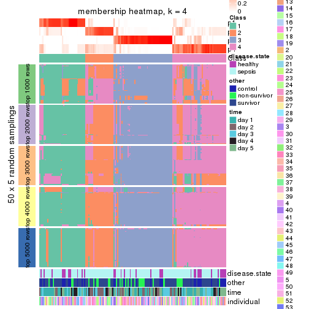</p>

</div>
<div id='tab-SD-pam-membership-heatmap-4'>
<pre><code class="r">membership_heatmap(res, k = 5)
</code></pre>

<p></p>

</div>
<div id='tab-SD-pam-membership-heatmap-5'>
<pre><code class="r">membership_heatmap(res, k = 6)
</code></pre>

<p></p>

</div>
</div>

As soon as we have had the classes for columns, we can look for signatures
which are significantly different between classes which can be candidate marks
for certain classes. Following are the heatmaps for signatures.


Signature heatmaps where rows are scaled:


<script>
$( function() {
	$( '#tabs-SD-pam-get-signatures' ).tabs();
} );
</script>
<div id='tabs-SD-pam-get-signatures'>
<ul>
<li><a href='#tab-SD-pam-get-signatures-1'>k = 2</a></li>
<li><a href='#tab-SD-pam-get-signatures-2'>k = 3</a></li>
<li><a href='#tab-SD-pam-get-signatures-3'>k = 4</a></li>
<li><a href='#tab-SD-pam-get-signatures-4'>k = 5</a></li>
<li><a href='#tab-SD-pam-get-signatures-5'>k = 6</a></li>
</ul>
<div id='tab-SD-pam-get-signatures-1'>
<pre><code class="r">get_signatures(res, k = 2)
</code></pre>

<p></p>

</div>
<div id='tab-SD-pam-get-signatures-2'>
<pre><code class="r">get_signatures(res, k = 3)
</code></pre>

<p></p>

</div>
<div id='tab-SD-pam-get-signatures-3'>
<pre><code class="r">get_signatures(res, k = 4)
</code></pre>

<p></p>

</div>
<div id='tab-SD-pam-get-signatures-4'>
<pre><code class="r">get_signatures(res, k = 5)
</code></pre>

<p></p>

</div>
<div id='tab-SD-pam-get-signatures-5'>
<pre><code class="r">get_signatures(res, k = 6)
</code></pre>

<p></p>

</div>
</div>


Signature heatmaps where rows are not scaled:


<script>
$( function() {
	$( '#tabs-SD-pam-get-signatures-no-scale' ).tabs();
} );
</script>
<div id='tabs-SD-pam-get-signatures-no-scale'>
<ul>
<li><a href='#tab-SD-pam-get-signatures-no-scale-1'>k = 2</a></li>
<li><a href='#tab-SD-pam-get-signatures-no-scale-2'>k = 3</a></li>
<li><a href='#tab-SD-pam-get-signatures-no-scale-3'>k = 4</a></li>
<li><a href='#tab-SD-pam-get-signatures-no-scale-4'>k = 5</a></li>
<li><a href='#tab-SD-pam-get-signatures-no-scale-5'>k = 6</a></li>
</ul>
<div id='tab-SD-pam-get-signatures-no-scale-1'>
<pre><code class="r">get_signatures(res, k = 2, scale_rows = FALSE)
</code></pre>

<p></p>

</div>
<div id='tab-SD-pam-get-signatures-no-scale-2'>
<pre><code class="r">get_signatures(res, k = 3, scale_rows = FALSE)
</code></pre>

<p></p>

</div>
<div id='tab-SD-pam-get-signatures-no-scale-3'>
<pre><code class="r">get_signatures(res, k = 4, scale_rows = FALSE)
</code></pre>

<p></p>

</div>
<div id='tab-SD-pam-get-signatures-no-scale-4'>
<pre><code class="r">get_signatures(res, k = 5, scale_rows = FALSE)
</code></pre>

<p>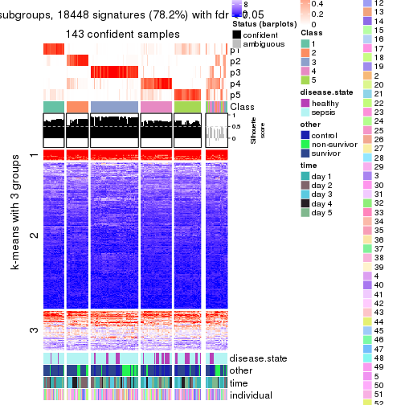</p>

</div>
<div id='tab-SD-pam-get-signatures-no-scale-5'>
<pre><code class="r">get_signatures(res, k = 6, scale_rows = FALSE)
</code></pre>

<p></p>

</div>
</div>


Compare the overlap of signatures from different k:

```r
compare_signatures(res)
```


`get_signature()` returns a data frame invisibly. TO get the list of signatures, the function
call should be assigned to a variable explicitly. In following code, if `plot` argument is set
to `FALSE`, no heatmap is plotted while only the differential analysis is performed.

```r
# code only for demonstration
tb = get_signature(res, k = ..., plot = FALSE)
```

An example of the output of `tb` is:

```
#>   which_row         fdr    mean_1    mean_2 scaled_mean_1 scaled_mean_2 km
#> 1        38 0.042760348  8.373488  9.131774    -0.5533452     0.5164555  1
#> 2        40 0.018707592  7.106213  8.469186    -0.6173731     0.5762149  1
#> 3        55 0.019134737 10.221463 11.207825    -0.6159697     0.5749050  1
#> 4        59 0.006059896  5.921854  7.869574    -0.6899429     0.6439467  1
#> 5        60 0.018055526  8.928898 10.211722    -0.6204761     0.5791110  1
#> 6        98 0.009384629 15.714769 14.887706     0.6635654    -0.6193277  2
...
```

The columns in `tb` are:

1. `which_row`: row indices corresponding to the input matrix.
2. `fdr`: FDR for the differential test. 
3. `mean_x`: The mean value in group x.
4. `scaled_mean_x`: The mean value in group x after rows are scaled.
5. `km`: Row groups if k-means clustering is applied to rows.


UMAP plot which shows how samples are separated.


<script>
$( function() {
	$( '#tabs-SD-pam-dimension-reduction' ).tabs();
} );
</script>
<div id='tabs-SD-pam-dimension-reduction'>
<ul>
<li><a href='#tab-SD-pam-dimension-reduction-1'>k = 2</a></li>
<li><a href='#tab-SD-pam-dimension-reduction-2'>k = 3</a></li>
<li><a href='#tab-SD-pam-dimension-reduction-3'>k = 4</a></li>
<li><a href='#tab-SD-pam-dimension-reduction-4'>k = 5</a></li>
<li><a href='#tab-SD-pam-dimension-reduction-5'>k = 6</a></li>
</ul>
<div id='tab-SD-pam-dimension-reduction-1'>
<pre><code class="r">dimension_reduction(res, k = 2, method = &quot;UMAP&quot;)
</code></pre>

<p></p>

</div>
<div id='tab-SD-pam-dimension-reduction-2'>
<pre><code class="r">dimension_reduction(res, k = 3, method = &quot;UMAP&quot;)
</code></pre>

<p></p>

</div>
<div id='tab-SD-pam-dimension-reduction-3'>
<pre><code class="r">dimension_reduction(res, k = 4, method = &quot;UMAP&quot;)
</code></pre>

<p></p>

</div>
<div id='tab-SD-pam-dimension-reduction-4'>
<pre><code class="r">dimension_reduction(res, k = 5, method = &quot;UMAP&quot;)
</code></pre>

<p></p>

</div>
<div id='tab-SD-pam-dimension-reduction-5'>
<pre><code class="r">dimension_reduction(res, k = 6, method = &quot;UMAP&quot;)
</code></pre>

<p></p>

</div>
</div>


Following heatmap shows how subgroups are split when increasing `k`:

```r
collect_classes(res)
```


Test correlation between subgroups and known annotations. If the known
annotation is numeric, one-way ANOVA test is applied, and if the known
annotation is discrete, chi-squared contingency table test is applied.

```r
test_to_known_factors(res)
```

```
#>          n disease.state(p) other(p)  time(p) individual(p) k
#> SD:pam 159          0.22478 0.050691 0.011373         0.360 2
#> SD:pam 146          0.16587 0.097371 0.036616         0.549 3
#> SD:pam 141          0.02386 0.004089 0.001187         0.528 4
#> SD:pam 143          0.00068 0.000645 0.007226         0.441 5
#> SD:pam 109          0.02225 0.103942 0.000639         0.767 6
```


If matrix rows can be associated to genes, consider to use `functional_enrichment(res,
...)` to perform function enrichment for the signature genes. See [this vignette](http://bioconductor.org/packages/devel/bioc/vignettes/cola/inst/doc/functional_enrichment.html) for more detailed explanations.


 

---------------------------------------------------


### SD:mclust


The object with results only for a single top-value method and a single partition method 
can be extracted as:

```r
res = res_list["SD", "mclust"]
# you can also extract it by
# res = res_list["SD:mclust"]
```

A summary of `res` and all the functions that can be applied to it:

```r
res
```

```
#> A 'ConsensusPartition' object with k = 2, 3, 4, 5, 6.
#>   On a matrix with 23598 rows and 163 columns.
#>   Top rows (1000, 2000, 3000, 4000, 5000) are extracted by 'SD' method.
#>   Subgroups are detected by 'mclust' method.
#>   Performed in total 1250 partitions by row resampling.
#>   Best k for subgroups seems to be 3.
#> 
#> Following methods can be applied to this 'ConsensusPartition' object:
#>  [1] "cola_report"             "collect_classes"         "collect_plots"          
#>  [4] "collect_stats"           "colnames"                "compare_signatures"     
#>  [7] "consensus_heatmap"       "dimension_reduction"     "functional_enrichment"  
#> [10] "get_anno_col"            "get_anno"                "get_classes"            
#> [13] "get_consensus"           "get_matrix"              "get_membership"         
#> [16] "get_param"               "get_signatures"          "get_stats"              
#> [19] "is_best_k"               "is_stable_k"             "membership_heatmap"     
#> [22] "ncol"                    "nrow"                    "plot_ecdf"              
#> [25] "rownames"                "select_partition_number" "show"                   
#> [28] "suggest_best_k"          "test_to_known_factors"
```

`collect_plots()` function collects all the plots made from `res` for all `k` (number of partitions)
into one single page to provide an easy and fast comparison between different `k`.

```r
collect_plots(res)
```


The plots are:

- The first row: a plot of the ECDF (empirical cumulative distribution
  function) curves of the consensus matrix for each `k` and the heatmap of
  predicted classes for each `k`.
- The second row: heatmaps of the consensus matrix for each `k`.
- The third row: heatmaps of the membership matrix for each `k`.
- The fouth row: heatmaps of the signatures for each `k`.

All the plots in panels can be made by individual functions and they are
plotted later in this section.

`select_partition_number()` produces several plots showing different
statistics for choosing "optimized" `k`. There are following statistics:

- ECDF curves of the consensus matrix for each `k`;
- 1-PAC. [The PAC
  score](https://en.wikipedia.org/wiki/Consensus_clustering#Over-interpretation_potential_of_consensus_clustering)
  measures the proportion of the ambiguous subgrouping.
- Mean silhouette score.
- Concordance. The mean probability of fiting the consensus class ids in all
  partitions.
- Area increased. Denote $A_k$ as the area under the ECDF curve for current
  `k`, the area increased is defined as $A_k - A_{k-1}$.
- Rand index. The percent of pairs of samples that are both in a same cluster
  or both are not in a same cluster in the partition of k and k-1.
- Jaccard index. The ratio of pairs of samples are both in a same cluster in
  the partition of k and k-1 and the pairs of samples are both in a same
  cluster in the partition k or k-1.

The detailed explanations of these statistics can be found in [the _cola_
vignette](http://bioconductor.org/packages/devel/bioc/vignettes/cola/inst/doc/cola.html#toc_13).

Generally speaking, lower PAC score, higher mean silhouette score or higher
concordance corresponds to better partition. Rand index and Jaccard index
measure how similar the current partition is compared to partition with `k-1`.
If they are too similar, we won't accept `k` is better than `k-1`.

```r
select_partition_number(res)
```


The numeric values for all these statistics can be obtained by `get_stats()`.

```r
get_stats(res)
```

```
#>   k 1-PAC mean_silhouette concordance area_increased  Rand Jaccard
#> 2 2 0.314           0.770       0.821         0.3733 0.577   0.577
#> 3 3 0.826           0.923       0.961         0.7812 0.672   0.470
#> 4 4 0.644           0.540       0.804         0.0785 0.960   0.884
#> 5 5 0.700           0.730       0.793         0.0848 0.864   0.592
#> 6 6 0.726           0.666       0.825         0.0610 0.884   0.535
```

`suggest_best_k()` suggests the best $k$ based on these statistics. The rules are as follows:

- All $k$ with Jaccard index larger than 0.95 are removed because increasing
  $k$ does not provide enough extra information. If all $k$ are removed, it is
  marked as no subgroup is detected.
- For all $k$ with 1-PAC score larger than 0.9, the maximal $k$ is taken as
  the best $k$, and other $k$ are marked as optional $k$.
- If it does not fit the second rule. The $k$ with the maximal vote of the
  highest 1-PAC score, highest mean silhouette, and highest concordance is
  taken as the best $k$.

```r
suggest_best_k(res)
```

```
#> [1] 3
```


Following shows the table of the partitions (You need to click the **show/hide
code output** link to see it). The membership matrix (columns with name `p*`)
is inferred by
[`clue::cl_consensus()`](https://www.rdocumentation.org/link/cl_consensus?package=clue)
function with the `SE` method. Basically the value in the membership matrix
represents the probability to belong to a certain group. The finall class
label for an item is determined with the group with highest probability it
belongs to.

In `get_classes()` function, the entropy is calculated from the membership
matrix and the silhouette score is calculated from the consensus matrix.


<script>
$( function() {
	$( '#tabs-SD-mclust-get-classes' ).tabs();
} );
</script>
<div id='tabs-SD-mclust-get-classes'>
<ul>
<li><a href='#tab-SD-mclust-get-classes-1'>k = 2</a></li>
<li><a href='#tab-SD-mclust-get-classes-2'>k = 3</a></li>
<li><a href='#tab-SD-mclust-get-classes-3'>k = 4</a></li>
<li><a href='#tab-SD-mclust-get-classes-4'>k = 5</a></li>
<li><a href='#tab-SD-mclust-get-classes-5'>k = 6</a></li>
</ul>

<div id='tab-SD-mclust-get-classes-1'>
<p><a id='tab-SD-mclust-get-classes-1-a' style='color:#0366d6' href='#'>show/hide code output</a></p>
<pre><code class="r">cbind(get_classes(res, k = 2), get_membership(res, k = 2))
</code></pre>

<pre><code>#&gt;            class entropy silhouette    p1    p2
#&gt; GSM1317945     2  0.9996     0.1164 0.488 0.512
#&gt; GSM1317946     2  0.9732     0.4968 0.404 0.596
#&gt; GSM1317947     1  0.0376     0.7817 0.996 0.004
#&gt; GSM1317948     1  0.6712     0.8140 0.824 0.176
#&gt; GSM1317949     1  0.6712     0.8140 0.824 0.176
#&gt; GSM1317950     1  0.7528     0.8124 0.784 0.216
#&gt; GSM1317953     1  0.7528     0.8124 0.784 0.216
#&gt; GSM1317954     1  0.7528     0.8124 0.784 0.216
#&gt; GSM1317955     1  0.7139     0.8169 0.804 0.196
#&gt; GSM1317956     1  0.7528     0.8124 0.784 0.216
#&gt; GSM1317957     2  0.6343     0.9130 0.160 0.840
#&gt; GSM1317958     1  0.7528     0.8136 0.784 0.216
#&gt; GSM1317959     1  1.0000    -0.1129 0.504 0.496
#&gt; GSM1317960     1  0.6801     0.8119 0.820 0.180
#&gt; GSM1317961     1  0.1843     0.7783 0.972 0.028
#&gt; GSM1317962     1  0.7674     0.7706 0.776 0.224
#&gt; GSM1317963     1  0.6801     0.8147 0.820 0.180
#&gt; GSM1317964     1  0.7602     0.8113 0.780 0.220
#&gt; GSM1317965     1  0.2043     0.7783 0.968 0.032
#&gt; GSM1317966     1  0.2043     0.7770 0.968 0.032
#&gt; GSM1317967     2  0.9754     0.4471 0.408 0.592
#&gt; GSM1317968     1  0.7299     0.8156 0.796 0.204
#&gt; GSM1317969     1  0.7602     0.7889 0.780 0.220
#&gt; GSM1317970     2  0.6343     0.9130 0.160 0.840
#&gt; GSM1317952     1  0.6712     0.8140 0.824 0.176
#&gt; GSM1317951     1  0.7056     0.8163 0.808 0.192
#&gt; GSM1317971     1  0.2948     0.7704 0.948 0.052
#&gt; GSM1317972     2  0.9963     0.2839 0.464 0.536
#&gt; GSM1317973     2  0.6623     0.9040 0.172 0.828
#&gt; GSM1317974     2  0.9170     0.6753 0.332 0.668
#&gt; GSM1317975     2  0.6247     0.9097 0.156 0.844
#&gt; GSM1317978     1  0.7528     0.8094 0.784 0.216
#&gt; GSM1317979     1  0.6712     0.8140 0.824 0.176
#&gt; GSM1317980     1  0.1633     0.7809 0.976 0.024
#&gt; GSM1317981     2  0.6247     0.9097 0.156 0.844
#&gt; GSM1317982     1  0.7453     0.7957 0.788 0.212
#&gt; GSM1317983     1  0.7528     0.8124 0.784 0.216
#&gt; GSM1317984     1  0.5178     0.7011 0.884 0.116
#&gt; GSM1317985     1  0.6048     0.6639 0.852 0.148
#&gt; GSM1317986     1  0.7528     0.8124 0.784 0.216
#&gt; GSM1317987     2  0.6247     0.9097 0.156 0.844
#&gt; GSM1317988     2  0.6438     0.9111 0.164 0.836
#&gt; GSM1317989     1  0.6801     0.8119 0.820 0.180
#&gt; GSM1317990     2  0.6247     0.9097 0.156 0.844
#&gt; GSM1317991     1  0.2236     0.7772 0.964 0.036
#&gt; GSM1317992     2  0.9248     0.6348 0.340 0.660
#&gt; GSM1317993     2  0.6343     0.9130 0.160 0.840
#&gt; GSM1317994     1  0.4690     0.7181 0.900 0.100
#&gt; GSM1317977     1  0.6801     0.8119 0.820 0.180
#&gt; GSM1317976     1  0.6887     0.8097 0.816 0.184
#&gt; GSM1317995     1  0.6048     0.6639 0.852 0.148
#&gt; GSM1317996     2  0.6343     0.9130 0.160 0.840
#&gt; GSM1317997     1  0.6048     0.6639 0.852 0.148
#&gt; GSM1317998     1  0.7528     0.8124 0.784 0.216
#&gt; GSM1317999     1  0.7528     0.8136 0.784 0.216
#&gt; GSM1318002     2  0.6343     0.9130 0.160 0.840
#&gt; GSM1318003     2  0.6343     0.9130 0.160 0.840
#&gt; GSM1318004     1  0.9993    -0.0779 0.516 0.484
#&gt; GSM1318005     2  0.6801     0.8965 0.180 0.820
#&gt; GSM1318006     1  0.7602     0.8125 0.780 0.220
#&gt; GSM1318007     1  0.9661     0.3749 0.608 0.392
#&gt; GSM1318008     1  0.7528     0.8124 0.784 0.216
#&gt; GSM1318009     2  0.6343     0.9130 0.160 0.840
#&gt; GSM1318010     1  0.5178     0.7011 0.884 0.116
#&gt; GSM1318011     1  0.7299     0.8155 0.796 0.204
#&gt; GSM1318012     1  0.6801     0.8119 0.820 0.180
#&gt; GSM1318013     1  1.0000    -0.1062 0.500 0.500
#&gt; GSM1318014     1  0.7376     0.8167 0.792 0.208
#&gt; GSM1318015     2  0.6343     0.9130 0.160 0.840
#&gt; GSM1318001     1  0.6048     0.6639 0.852 0.148
#&gt; GSM1318000     2  0.6343     0.9130 0.160 0.840
#&gt; GSM1318016     2  0.6343     0.9130 0.160 0.840
#&gt; GSM1318017     1  0.7528     0.8124 0.784 0.216
#&gt; GSM1318019     2  0.6343     0.9130 0.160 0.840
#&gt; GSM1318020     1  0.2043     0.7783 0.968 0.032
#&gt; GSM1318021     2  0.6343     0.9130 0.160 0.840
#&gt; GSM1318022     1  0.2043     0.7770 0.968 0.032
#&gt; GSM1318023     1  0.7528     0.8124 0.784 0.216
#&gt; GSM1318024     2  0.6343     0.9130 0.160 0.840
#&gt; GSM1318025     1  0.2043     0.7783 0.968 0.032
#&gt; GSM1318026     2  0.6438     0.9111 0.164 0.836
#&gt; GSM1318027     2  0.6343     0.9130 0.160 0.840
#&gt; GSM1318028     1  0.7056     0.8163 0.808 0.192
#&gt; GSM1318029     1  0.2043     0.7770 0.968 0.032
#&gt; GSM1318018     1  0.7528     0.8124 0.784 0.216
#&gt; GSM1318030     1  0.7674     0.7863 0.776 0.224
#&gt; GSM1318031     1  0.2423     0.7763 0.960 0.040
#&gt; GSM1318033     1  0.7219     0.8157 0.800 0.200
#&gt; GSM1318034     1  0.0376     0.7817 0.996 0.004
#&gt; GSM1318035     2  0.6343     0.9130 0.160 0.840
#&gt; GSM1318036     1  0.7139     0.8006 0.804 0.196
#&gt; GSM1318037     1  0.7453     0.7933 0.788 0.212
#&gt; GSM1318038     1  0.2043     0.7770 0.968 0.032
#&gt; GSM1318039     1  0.7602     0.8113 0.780 0.220
#&gt; GSM1318040     1  0.3431     0.7621 0.936 0.064
#&gt; GSM1318032     1  0.3431     0.7621 0.936 0.064
#&gt; GSM1317914     1  0.2423     0.7766 0.960 0.040
#&gt; GSM1317915     1  0.7528     0.8128 0.784 0.216
#&gt; GSM1317916     1  0.7528     0.8128 0.784 0.216
#&gt; GSM1317917     1  0.3114     0.7874 0.944 0.056
#&gt; GSM1317918     1  0.7602     0.8113 0.780 0.220
#&gt; GSM1317919     1  0.2043     0.7770 0.968 0.032
#&gt; GSM1317920     1  0.2043     0.7770 0.968 0.032
#&gt; GSM1317921     1  0.2043     0.7770 0.968 0.032
#&gt; GSM1317922     1  0.2043     0.7770 0.968 0.032
#&gt; GSM1317923     1  0.2043     0.7770 0.968 0.032
#&gt; GSM1317924     1  0.2423     0.7763 0.960 0.040
#&gt; GSM1317925     2  0.6247     0.9097 0.156 0.844
#&gt; GSM1317926     1  0.2043     0.7770 0.968 0.032
#&gt; GSM1317927     2  0.6343     0.9130 0.160 0.840
#&gt; GSM1317928     1  0.2948     0.7704 0.948 0.052
#&gt; GSM1317929     1  0.2236     0.7762 0.964 0.036
#&gt; GSM1317930     2  0.6438     0.9111 0.164 0.836
#&gt; GSM1317931     1  0.2043     0.7783 0.968 0.032
#&gt; GSM1317932     1  0.7376     0.7926 0.792 0.208
#&gt; GSM1317933     2  0.6343     0.9130 0.160 0.840
#&gt; GSM1317934     1  0.7674     0.7851 0.776 0.224
#&gt; GSM1317935     1  0.2043     0.7770 0.968 0.032
#&gt; GSM1317936     1  0.6048     0.6639 0.852 0.148
#&gt; GSM1317937     1  0.7528     0.8124 0.784 0.216
#&gt; GSM1317938     2  0.6343     0.9130 0.160 0.840
#&gt; GSM1317939     2  0.6343     0.9130 0.160 0.840
#&gt; GSM1317940     1  0.7056     0.8168 0.808 0.192
#&gt; GSM1317941     2  0.6438     0.9111 0.164 0.836
#&gt; GSM1317942     2  0.6343     0.9130 0.160 0.840
#&gt; GSM1317943     2  0.6343     0.9130 0.160 0.840
#&gt; GSM1317944     2  0.6247     0.9097 0.156 0.844
#&gt; GSM1317896     1  0.5178     0.7011 0.884 0.116
#&gt; GSM1317897     1  0.7602     0.8113 0.780 0.220
#&gt; GSM1317898     1  0.6801     0.8119 0.820 0.180
#&gt; GSM1317899     1  0.6801     0.8119 0.820 0.180
#&gt; GSM1317900     1  0.2043     0.7783 0.968 0.032
#&gt; GSM1317901     1  0.7376     0.8167 0.792 0.208
#&gt; GSM1317902     1  0.7528     0.8124 0.784 0.216
#&gt; GSM1317903     1  0.7528     0.8124 0.784 0.216
#&gt; GSM1317904     2  0.6801     0.8965 0.180 0.820
#&gt; GSM1317905     1  0.8443     0.7229 0.728 0.272
#&gt; GSM1317906     2  0.9970     0.2210 0.468 0.532
#&gt; GSM1317907     1  0.7602     0.7901 0.780 0.220
#&gt; GSM1317908     1  0.1414     0.7802 0.980 0.020
#&gt; GSM1317909     1  0.6801     0.8154 0.820 0.180
#&gt; GSM1317910     1  0.7139     0.8094 0.804 0.196
#&gt; GSM1317911     1  0.7528     0.8136 0.784 0.216
#&gt; GSM1317912     1  0.7139     0.8038 0.804 0.196
#&gt; GSM1317913     2  0.9996     0.1164 0.488 0.512
#&gt; GSM1318041     1  0.6973     0.8094 0.812 0.188
#&gt; GSM1318042     1  0.2043     0.7783 0.968 0.032
#&gt; GSM1318043     1  0.5178     0.7011 0.884 0.116
#&gt; GSM1318044     1  0.7528     0.8124 0.784 0.216
#&gt; GSM1318045     1  0.7602     0.8125 0.780 0.220
#&gt; GSM1318046     1  0.7528     0.8124 0.784 0.216
#&gt; GSM1318047     1  0.6801     0.8119 0.820 0.180
#&gt; GSM1318048     1  0.0376     0.7817 0.996 0.004
#&gt; GSM1318049     1  0.7139     0.8177 0.804 0.196
#&gt; GSM1318050     2  0.6438     0.9111 0.164 0.836
#&gt; GSM1318051     2  0.6343     0.9130 0.160 0.840
#&gt; GSM1318052     2  0.6438     0.9111 0.164 0.836
#&gt; GSM1318053     2  0.6343     0.9130 0.160 0.840
#&gt; GSM1318054     2  0.9580     0.5329 0.380 0.620
#&gt; GSM1318055     1  0.2236     0.7775 0.964 0.036
#&gt; GSM1318056     2  0.9323     0.6163 0.348 0.652
#&gt; GSM1318057     2  0.6623     0.9040 0.172 0.828
#&gt; GSM1318058     1  0.9996    -0.0147 0.512 0.488
</code></pre>

<script>
$('#tab-SD-mclust-get-classes-1-a').parent().next().next().hide();
$('#tab-SD-mclust-get-classes-1-a').click(function(){
  $('#tab-SD-mclust-get-classes-1-a').parent().next().next().toggle();
  return(false);
});
</script>
</div>

<div id='tab-SD-mclust-get-classes-2'>
<p><a id='tab-SD-mclust-get-classes-2-a' style='color:#0366d6' href='#'>show/hide code output</a></p>
<pre><code class="r">cbind(get_classes(res, k = 3), get_membership(res, k = 3))
</code></pre>

<pre><code>#&gt;            class entropy silhouette    p1    p2    p3
#&gt; GSM1317945     2  0.2356     0.9186 0.000 0.928 0.072
#&gt; GSM1317946     2  0.3192     0.8805 0.112 0.888 0.000
#&gt; GSM1317947     3  0.0000     0.9594 0.000 0.000 1.000
#&gt; GSM1317948     1  0.3192     0.8782 0.888 0.000 0.112
#&gt; GSM1317949     1  0.0424     0.9689 0.992 0.000 0.008
#&gt; GSM1317950     1  0.0000     0.9730 1.000 0.000 0.000
#&gt; GSM1317953     1  0.0000     0.9730 1.000 0.000 0.000
#&gt; GSM1317954     1  0.0000     0.9730 1.000 0.000 0.000
#&gt; GSM1317955     1  0.0000     0.9730 1.000 0.000 0.000
#&gt; GSM1317956     1  0.0000     0.9730 1.000 0.000 0.000
#&gt; GSM1317957     2  0.0000     0.9448 0.000 1.000 0.000
#&gt; GSM1317958     1  0.0237     0.9717 0.996 0.000 0.004
#&gt; GSM1317959     2  0.3038     0.9025 0.000 0.896 0.104
#&gt; GSM1317960     1  0.3116     0.8823 0.892 0.000 0.108
#&gt; GSM1317961     3  0.0237     0.9592 0.004 0.000 0.996
#&gt; GSM1317962     2  0.5216     0.6941 0.260 0.740 0.000
#&gt; GSM1317963     1  0.0000     0.9730 1.000 0.000 0.000
#&gt; GSM1317964     1  0.0000     0.9730 1.000 0.000 0.000
#&gt; GSM1317965     3  0.0237     0.9592 0.004 0.000 0.996
#&gt; GSM1317966     3  0.0237     0.9592 0.004 0.000 0.996
#&gt; GSM1317967     2  0.3116     0.8999 0.000 0.892 0.108
#&gt; GSM1317968     1  0.0000     0.9730 1.000 0.000 0.000
#&gt; GSM1317969     3  0.5882     0.4205 0.000 0.348 0.652
#&gt; GSM1317970     2  0.0000     0.9448 0.000 1.000 0.000
#&gt; GSM1317952     1  0.3192     0.8782 0.888 0.000 0.112
#&gt; GSM1317951     1  0.0000     0.9730 1.000 0.000 0.000
#&gt; GSM1317971     3  0.0237     0.9592 0.004 0.000 0.996
#&gt; GSM1317972     2  0.5560     0.6136 0.300 0.700 0.000
#&gt; GSM1317973     2  0.0000     0.9448 0.000 1.000 0.000
#&gt; GSM1317974     2  0.3038     0.8873 0.104 0.896 0.000
#&gt; GSM1317975     2  0.0000     0.9448 0.000 1.000 0.000
#&gt; GSM1317978     1  0.0000     0.9730 1.000 0.000 0.000
#&gt; GSM1317979     3  0.5178     0.6340 0.256 0.000 0.744
#&gt; GSM1317980     3  0.0000     0.9594 0.000 0.000 1.000
#&gt; GSM1317981     2  0.0000     0.9448 0.000 1.000 0.000
#&gt; GSM1317982     3  0.6045     0.3333 0.000 0.380 0.620
#&gt; GSM1317983     1  0.0000     0.9730 1.000 0.000 0.000
#&gt; GSM1317984     3  0.0000     0.9594 0.000 0.000 1.000
#&gt; GSM1317985     3  0.0000     0.9594 0.000 0.000 1.000
#&gt; GSM1317986     1  0.0000     0.9730 1.000 0.000 0.000
#&gt; GSM1317987     2  0.0000     0.9448 0.000 1.000 0.000
#&gt; GSM1317988     2  0.0000     0.9448 0.000 1.000 0.000
#&gt; GSM1317989     1  0.3116     0.8823 0.892 0.000 0.108
#&gt; GSM1317990     2  0.0000     0.9448 0.000 1.000 0.000
#&gt; GSM1317991     3  0.0237     0.9592 0.004 0.000 0.996
#&gt; GSM1317992     2  0.3038     0.9018 0.000 0.896 0.104
#&gt; GSM1317993     2  0.0000     0.9448 0.000 1.000 0.000
#&gt; GSM1317994     3  0.0000     0.9594 0.000 0.000 1.000
#&gt; GSM1317977     1  0.2878     0.8957 0.904 0.000 0.096
#&gt; GSM1317976     1  0.0000     0.9730 1.000 0.000 0.000
#&gt; GSM1317995     3  0.0000     0.9594 0.000 0.000 1.000
#&gt; GSM1317996     2  0.0000     0.9448 0.000 1.000 0.000
#&gt; GSM1317997     3  0.0000     0.9594 0.000 0.000 1.000
#&gt; GSM1317998     1  0.0237     0.9717 0.996 0.000 0.004
#&gt; GSM1317999     1  0.0237     0.9717 0.996 0.000 0.004
#&gt; GSM1318002     2  0.0000     0.9448 0.000 1.000 0.000
#&gt; GSM1318003     2  0.0000     0.9448 0.000 1.000 0.000
#&gt; GSM1318004     2  0.3116     0.8999 0.000 0.892 0.108
#&gt; GSM1318005     2  0.0237     0.9435 0.000 0.996 0.004
#&gt; GSM1318006     1  0.0000     0.9730 1.000 0.000 0.000
#&gt; GSM1318007     2  0.3116     0.8999 0.000 0.892 0.108
#&gt; GSM1318008     1  0.0237     0.9717 0.996 0.000 0.004
#&gt; GSM1318009     2  0.0000     0.9448 0.000 1.000 0.000
#&gt; GSM1318010     3  0.0000     0.9594 0.000 0.000 1.000
#&gt; GSM1318011     1  0.1643     0.9449 0.956 0.000 0.044
#&gt; GSM1318012     1  0.1753     0.9417 0.952 0.000 0.048
#&gt; GSM1318013     2  0.3116     0.8999 0.000 0.892 0.108
#&gt; GSM1318014     1  0.1643     0.9449 0.956 0.000 0.044
#&gt; GSM1318015     2  0.0000     0.9448 0.000 1.000 0.000
#&gt; GSM1318001     3  0.0000     0.9594 0.000 0.000 1.000
#&gt; GSM1318000     2  0.0000     0.9448 0.000 1.000 0.000
#&gt; GSM1318016     2  0.0000     0.9448 0.000 1.000 0.000
#&gt; GSM1318017     1  0.0000     0.9730 1.000 0.000 0.000
#&gt; GSM1318019     2  0.0000     0.9448 0.000 1.000 0.000
#&gt; GSM1318020     3  0.0000     0.9594 0.000 0.000 1.000
#&gt; GSM1318021     2  0.0000     0.9448 0.000 1.000 0.000
#&gt; GSM1318022     3  0.0237     0.9592 0.004 0.000 0.996
#&gt; GSM1318023     1  0.0000     0.9730 1.000 0.000 0.000
#&gt; GSM1318024     2  0.0000     0.9448 0.000 1.000 0.000
#&gt; GSM1318025     3  0.0000     0.9594 0.000 0.000 1.000
#&gt; GSM1318026     2  0.3116     0.8999 0.000 0.892 0.108
#&gt; GSM1318027     2  0.1411     0.9330 0.000 0.964 0.036
#&gt; GSM1318028     1  0.0000     0.9730 1.000 0.000 0.000
#&gt; GSM1318029     3  0.0237     0.9592 0.004 0.000 0.996
#&gt; GSM1318018     1  0.0000     0.9730 1.000 0.000 0.000
#&gt; GSM1318030     2  0.4887     0.7527 0.000 0.772 0.228
#&gt; GSM1318031     3  0.0000     0.9594 0.000 0.000 1.000
#&gt; GSM1318033     1  0.0237     0.9717 0.996 0.000 0.004
#&gt; GSM1318034     3  0.0000     0.9594 0.000 0.000 1.000
#&gt; GSM1318035     2  0.0000     0.9448 0.000 1.000 0.000
#&gt; GSM1318036     1  0.3589     0.9035 0.900 0.052 0.048
#&gt; GSM1318037     2  0.3116     0.8999 0.000 0.892 0.108
#&gt; GSM1318038     3  0.0237     0.9592 0.004 0.000 0.996
#&gt; GSM1318039     1  0.0000     0.9730 1.000 0.000 0.000
#&gt; GSM1318040     3  0.1529     0.9259 0.000 0.040 0.960
#&gt; GSM1318032     3  0.0000     0.9594 0.000 0.000 1.000
#&gt; GSM1317914     3  0.0237     0.9592 0.004 0.000 0.996
#&gt; GSM1317915     1  0.0000     0.9730 1.000 0.000 0.000
#&gt; GSM1317916     1  0.0000     0.9730 1.000 0.000 0.000
#&gt; GSM1317917     3  0.0237     0.9592 0.004 0.000 0.996
#&gt; GSM1317918     1  0.0000     0.9730 1.000 0.000 0.000
#&gt; GSM1317919     3  0.0237     0.9592 0.004 0.000 0.996
#&gt; GSM1317920     3  0.0237     0.9592 0.004 0.000 0.996
#&gt; GSM1317921     3  0.0237     0.9592 0.004 0.000 0.996
#&gt; GSM1317922     3  0.0237     0.9592 0.004 0.000 0.996
#&gt; GSM1317923     3  0.0237     0.9592 0.004 0.000 0.996
#&gt; GSM1317924     3  0.0000     0.9594 0.000 0.000 1.000
#&gt; GSM1317925     2  0.0000     0.9448 0.000 1.000 0.000
#&gt; GSM1317926     3  0.0237     0.9592 0.004 0.000 0.996
#&gt; GSM1317927     2  0.0000     0.9448 0.000 1.000 0.000
#&gt; GSM1317928     3  0.0000     0.9594 0.000 0.000 1.000
#&gt; GSM1317929     3  0.0237     0.9592 0.004 0.000 0.996
#&gt; GSM1317930     2  0.0000     0.9448 0.000 1.000 0.000
#&gt; GSM1317931     3  0.0000     0.9594 0.000 0.000 1.000
#&gt; GSM1317932     3  0.3193     0.8618 0.004 0.100 0.896
#&gt; GSM1317933     2  0.0000     0.9448 0.000 1.000 0.000
#&gt; GSM1317934     3  0.3918     0.8114 0.004 0.140 0.856
#&gt; GSM1317935     3  0.0237     0.9592 0.004 0.000 0.996
#&gt; GSM1317936     3  0.0000     0.9594 0.000 0.000 1.000
#&gt; GSM1317937     1  0.0000     0.9730 1.000 0.000 0.000
#&gt; GSM1317938     2  0.0000     0.9448 0.000 1.000 0.000
#&gt; GSM1317939     2  0.0000     0.9448 0.000 1.000 0.000
#&gt; GSM1317940     1  0.0000     0.9730 1.000 0.000 0.000
#&gt; GSM1317941     2  0.0000     0.9448 0.000 1.000 0.000
#&gt; GSM1317942     2  0.0000     0.9448 0.000 1.000 0.000
#&gt; GSM1317943     2  0.0000     0.9448 0.000 1.000 0.000
#&gt; GSM1317944     2  0.0000     0.9448 0.000 1.000 0.000
#&gt; GSM1317896     3  0.0000     0.9594 0.000 0.000 1.000
#&gt; GSM1317897     1  0.0000     0.9730 1.000 0.000 0.000
#&gt; GSM1317898     1  0.0237     0.9717 0.996 0.000 0.004
#&gt; GSM1317899     1  0.0237     0.9717 0.996 0.000 0.004
#&gt; GSM1317900     3  0.0237     0.9592 0.004 0.000 0.996
#&gt; GSM1317901     1  0.0000     0.9730 1.000 0.000 0.000
#&gt; GSM1317902     1  0.0237     0.9717 0.996 0.000 0.004
#&gt; GSM1317903     1  0.0000     0.9730 1.000 0.000 0.000
#&gt; GSM1317904     2  0.0000     0.9448 0.000 1.000 0.000
#&gt; GSM1317905     2  0.3038     0.9018 0.000 0.896 0.104
#&gt; GSM1317906     2  0.3116     0.8994 0.000 0.892 0.108
#&gt; GSM1317907     2  0.3267     0.8928 0.000 0.884 0.116
#&gt; GSM1317908     3  0.0237     0.9592 0.004 0.000 0.996
#&gt; GSM1317909     1  0.5706     0.5386 0.680 0.000 0.320
#&gt; GSM1317910     3  0.6305     0.0305 0.484 0.000 0.516
#&gt; GSM1317911     1  0.0000     0.9730 1.000 0.000 0.000
#&gt; GSM1317912     2  0.7670     0.6898 0.152 0.684 0.164
#&gt; GSM1317913     2  0.3116     0.8999 0.000 0.892 0.108
#&gt; GSM1318041     3  0.1031     0.9418 0.024 0.000 0.976
#&gt; GSM1318042     3  0.0000     0.9594 0.000 0.000 1.000
#&gt; GSM1318043     3  0.0000     0.9594 0.000 0.000 1.000
#&gt; GSM1318044     1  0.0000     0.9730 1.000 0.000 0.000
#&gt; GSM1318045     1  0.0237     0.9717 0.996 0.000 0.004
#&gt; GSM1318046     1  0.0237     0.9717 0.996 0.000 0.004
#&gt; GSM1318047     1  0.1753     0.9417 0.952 0.000 0.048
#&gt; GSM1318048     3  0.1529     0.9270 0.040 0.000 0.960
#&gt; GSM1318049     1  0.2625     0.9090 0.916 0.000 0.084
#&gt; GSM1318050     2  0.0000     0.9448 0.000 1.000 0.000
#&gt; GSM1318051     2  0.0000     0.9448 0.000 1.000 0.000
#&gt; GSM1318052     2  0.1031     0.9374 0.000 0.976 0.024
#&gt; GSM1318053     2  0.0000     0.9448 0.000 1.000 0.000
#&gt; GSM1318054     2  0.3116     0.8999 0.000 0.892 0.108
#&gt; GSM1318055     3  0.0000     0.9594 0.000 0.000 1.000
#&gt; GSM1318056     2  0.3116     0.8999 0.000 0.892 0.108
#&gt; GSM1318057     2  0.2711     0.9110 0.000 0.912 0.088
#&gt; GSM1318058     2  0.3116     0.8999 0.000 0.892 0.108
</code></pre>

<script>
$('#tab-SD-mclust-get-classes-2-a').parent().next().next().hide();
$('#tab-SD-mclust-get-classes-2-a').click(function(){
  $('#tab-SD-mclust-get-classes-2-a').parent().next().next().toggle();
  return(false);
});
</script>
</div>

<div id='tab-SD-mclust-get-classes-3'>
<p><a id='tab-SD-mclust-get-classes-3-a' style='color:#0366d6' href='#'>show/hide code output</a></p>
<pre><code class="r">cbind(get_classes(res, k = 4), get_membership(res, k = 4))
</code></pre>

<pre><code>#&gt;            class entropy silhouette    p1    p2    p3    p4
#&gt; GSM1317945     2  0.1109    0.78023 0.004 0.968 0.028 0.000
#&gt; GSM1317946     2  0.6820    0.08096 0.364 0.528 0.000 0.108
#&gt; GSM1317947     3  0.1798    0.91174 0.040 0.000 0.944 0.016
#&gt; GSM1317948     1  0.2843    0.47210 0.892 0.000 0.088 0.020
#&gt; GSM1317949     1  0.4136    0.33569 0.788 0.000 0.016 0.196
#&gt; GSM1317950     1  0.4961   -0.61358 0.552 0.000 0.000 0.448
#&gt; GSM1317953     1  0.4989   -0.64366 0.528 0.000 0.000 0.472
#&gt; GSM1317954     1  0.4989   -0.64366 0.528 0.000 0.000 0.472
#&gt; GSM1317955     1  0.4994   -0.66438 0.520 0.000 0.000 0.480
#&gt; GSM1317956     1  0.4961   -0.61358 0.552 0.000 0.000 0.448
#&gt; GSM1317957     2  0.4661    0.71678 0.000 0.652 0.000 0.348
#&gt; GSM1317958     1  0.0188    0.49627 0.996 0.000 0.004 0.000
#&gt; GSM1317959     2  0.2317    0.76535 0.032 0.928 0.036 0.004
#&gt; GSM1317960     1  0.2593    0.48093 0.904 0.000 0.080 0.016
#&gt; GSM1317961     3  0.1792    0.91181 0.000 0.000 0.932 0.068
#&gt; GSM1317962     2  0.5856   -0.00303 0.464 0.504 0.000 0.032
#&gt; GSM1317963     1  0.3790    0.36544 0.840 0.004 0.024 0.132
#&gt; GSM1317964     1  0.4992   -0.65265 0.524 0.000 0.000 0.476
#&gt; GSM1317965     3  0.1661    0.91239 0.000 0.004 0.944 0.052
#&gt; GSM1317966     3  0.1792    0.91111 0.000 0.000 0.932 0.068
#&gt; GSM1317967     2  0.3402    0.72010 0.004 0.832 0.164 0.000
#&gt; GSM1317968     1  0.4989   -0.64366 0.528 0.000 0.000 0.472
#&gt; GSM1317969     3  0.2189    0.90356 0.020 0.044 0.932 0.004
#&gt; GSM1317970     2  0.4543    0.72703 0.000 0.676 0.000 0.324
#&gt; GSM1317952     1  0.2882    0.47134 0.892 0.000 0.084 0.024
#&gt; GSM1317951     1  0.4992   -0.65265 0.524 0.000 0.000 0.476
#&gt; GSM1317971     3  0.2224    0.90637 0.000 0.032 0.928 0.040
#&gt; GSM1317972     4  0.7589    0.43891 0.396 0.196 0.000 0.408
#&gt; GSM1317973     2  0.0000    0.78503 0.000 1.000 0.000 0.000
#&gt; GSM1317974     2  0.7181    0.08182 0.336 0.512 0.000 0.152
#&gt; GSM1317975     2  0.4925    0.67896 0.000 0.572 0.000 0.428
#&gt; GSM1317978     1  0.5498   -0.55441 0.576 0.020 0.000 0.404
#&gt; GSM1317979     3  0.5408    0.32757 0.408 0.000 0.576 0.016
#&gt; GSM1317980     3  0.1584    0.91424 0.036 0.000 0.952 0.012
#&gt; GSM1317981     2  0.4907    0.68502 0.000 0.580 0.000 0.420
#&gt; GSM1317982     3  0.3622    0.88563 0.028 0.064 0.876 0.032
#&gt; GSM1317983     1  0.4967   -0.62381 0.548 0.000 0.000 0.452
#&gt; GSM1317984     3  0.1488    0.91541 0.032 0.000 0.956 0.012
#&gt; GSM1317985     3  0.1610    0.91525 0.032 0.000 0.952 0.016
#&gt; GSM1317986     1  0.4967   -0.62381 0.548 0.000 0.000 0.452
#&gt; GSM1317987     2  0.4907    0.68502 0.000 0.580 0.000 0.420
#&gt; GSM1317988     2  0.0000    0.78503 0.000 1.000 0.000 0.000
#&gt; GSM1317989     1  0.2593    0.48093 0.904 0.000 0.080 0.016
#&gt; GSM1317990     2  0.4830    0.70222 0.000 0.608 0.000 0.392
#&gt; GSM1317991     3  0.1557    0.91087 0.000 0.000 0.944 0.056
#&gt; GSM1317992     2  0.7319    0.61401 0.000 0.532 0.220 0.248
#&gt; GSM1317993     2  0.4746    0.71493 0.000 0.632 0.000 0.368
#&gt; GSM1317994     3  0.1488    0.91541 0.032 0.000 0.956 0.012
#&gt; GSM1317977     1  0.2124    0.49082 0.924 0.000 0.068 0.008
#&gt; GSM1317976     1  0.4989   -0.64366 0.528 0.000 0.000 0.472
#&gt; GSM1317995     3  0.1610    0.91525 0.032 0.000 0.952 0.016
#&gt; GSM1317996     2  0.4830    0.70222 0.000 0.608 0.000 0.392
#&gt; GSM1317997     3  0.1610    0.91525 0.032 0.000 0.952 0.016
#&gt; GSM1317998     1  0.0817    0.47960 0.976 0.000 0.000 0.024
#&gt; GSM1317999     1  0.0937    0.49835 0.976 0.000 0.012 0.012
#&gt; GSM1318002     2  0.4585    0.72459 0.000 0.668 0.000 0.332
#&gt; GSM1318003     2  0.2704    0.77712 0.000 0.876 0.000 0.124
#&gt; GSM1318004     2  0.2500    0.76114 0.040 0.916 0.044 0.000
#&gt; GSM1318005     2  0.0469    0.78188 0.000 0.988 0.000 0.012
#&gt; GSM1318006     1  0.0657    0.49344 0.984 0.000 0.004 0.012
#&gt; GSM1318007     2  0.4776    0.68874 0.060 0.776 0.164 0.000
#&gt; GSM1318008     1  0.0000    0.49495 1.000 0.000 0.000 0.000
#&gt; GSM1318009     2  0.0000    0.78503 0.000 1.000 0.000 0.000
#&gt; GSM1318010     3  0.1488    0.91541 0.032 0.000 0.956 0.012
#&gt; GSM1318011     1  0.2300    0.49099 0.920 0.000 0.064 0.016
#&gt; GSM1318012     1  0.1854    0.49646 0.940 0.000 0.048 0.012
#&gt; GSM1318013     2  0.4197    0.70637 0.036 0.808 0.156 0.000
#&gt; GSM1318014     1  0.2376    0.48908 0.916 0.000 0.068 0.016
#&gt; GSM1318015     2  0.4605    0.72342 0.000 0.664 0.000 0.336
#&gt; GSM1318001     3  0.1610    0.91525 0.032 0.000 0.952 0.016
#&gt; GSM1318000     2  0.0000    0.78503 0.000 1.000 0.000 0.000
#&gt; GSM1318016     2  0.4454    0.73365 0.000 0.692 0.000 0.308
#&gt; GSM1318017     1  0.4040    0.07317 0.752 0.000 0.000 0.248
#&gt; GSM1318019     2  0.0000    0.78503 0.000 1.000 0.000 0.000
#&gt; GSM1318020     3  0.1584    0.91479 0.036 0.000 0.952 0.012
#&gt; GSM1318021     2  0.4643    0.72579 0.000 0.656 0.000 0.344
#&gt; GSM1318022     3  0.2281    0.90113 0.000 0.000 0.904 0.096
#&gt; GSM1318023     1  0.4222   -0.02306 0.728 0.000 0.000 0.272
#&gt; GSM1318024     2  0.4746    0.71493 0.000 0.632 0.000 0.368
#&gt; GSM1318025     3  0.1022    0.91596 0.032 0.000 0.968 0.000
#&gt; GSM1318026     2  0.6953    0.49876 0.000 0.536 0.336 0.128
#&gt; GSM1318027     2  0.0592    0.78388 0.000 0.984 0.016 0.000
#&gt; GSM1318028     1  0.4992   -0.65265 0.524 0.000 0.000 0.476
#&gt; GSM1318029     3  0.1716    0.91107 0.000 0.000 0.936 0.064
#&gt; GSM1318018     1  0.4585   -0.25902 0.668 0.000 0.000 0.332
#&gt; GSM1318030     2  0.5659    0.39326 0.032 0.600 0.368 0.000
#&gt; GSM1318031     3  0.2094    0.91516 0.024 0.012 0.940 0.024
#&gt; GSM1318033     1  0.0921    0.47593 0.972 0.000 0.000 0.028
#&gt; GSM1318034     3  0.1888    0.91032 0.044 0.000 0.940 0.016
#&gt; GSM1318035     2  0.4643    0.72579 0.000 0.656 0.000 0.344
#&gt; GSM1318036     1  0.3030    0.43921 0.892 0.076 0.028 0.004
#&gt; GSM1318037     2  0.4290    0.69975 0.036 0.800 0.164 0.000
#&gt; GSM1318038     3  0.2281    0.90113 0.000 0.000 0.904 0.096
#&gt; GSM1318039     4  0.4998    0.74967 0.488 0.000 0.000 0.512
#&gt; GSM1318040     3  0.3134    0.86435 0.024 0.088 0.884 0.004
#&gt; GSM1318032     3  0.2297    0.90964 0.024 0.032 0.932 0.012
#&gt; GSM1317914     3  0.1824    0.91115 0.000 0.004 0.936 0.060
#&gt; GSM1317915     4  0.4998    0.74967 0.488 0.000 0.000 0.512
#&gt; GSM1317916     1  0.4955   -0.47084 0.556 0.000 0.000 0.444
#&gt; GSM1317917     3  0.2281    0.90113 0.000 0.000 0.904 0.096
#&gt; GSM1317918     4  0.4994    0.74644 0.480 0.000 0.000 0.520
#&gt; GSM1317919     3  0.2281    0.90113 0.000 0.000 0.904 0.096
#&gt; GSM1317920     3  0.2149    0.90354 0.000 0.000 0.912 0.088
#&gt; GSM1317921     3  0.2281    0.90113 0.000 0.000 0.904 0.096
#&gt; GSM1317922     3  0.2469    0.90223 0.000 0.000 0.892 0.108
#&gt; GSM1317923     3  0.1637    0.91055 0.000 0.000 0.940 0.060
#&gt; GSM1317924     3  0.1962    0.91600 0.024 0.008 0.944 0.024
#&gt; GSM1317925     2  0.4746    0.71493 0.000 0.632 0.000 0.368
#&gt; GSM1317926     3  0.2281    0.90113 0.000 0.000 0.904 0.096
#&gt; GSM1317927     2  0.3486    0.76924 0.000 0.812 0.000 0.188
#&gt; GSM1317928     3  0.1624    0.91201 0.000 0.028 0.952 0.020
#&gt; GSM1317929     3  0.2281    0.90113 0.000 0.000 0.904 0.096
#&gt; GSM1317930     2  0.0188    0.78530 0.000 0.996 0.000 0.004
#&gt; GSM1317931     3  0.0921    0.91678 0.028 0.000 0.972 0.000
#&gt; GSM1317932     3  0.2741    0.86267 0.000 0.096 0.892 0.012
#&gt; GSM1317933     2  0.1792    0.78467 0.000 0.932 0.000 0.068
#&gt; GSM1317934     3  0.4453    0.62713 0.000 0.244 0.744 0.012
#&gt; GSM1317935     3  0.1557    0.91087 0.000 0.000 0.944 0.056
#&gt; GSM1317936     3  0.1510    0.91612 0.028 0.000 0.956 0.016
#&gt; GSM1317937     1  0.4431   -0.14932 0.696 0.000 0.000 0.304
#&gt; GSM1317938     2  0.0188    0.78408 0.000 0.996 0.000 0.004
#&gt; GSM1317939     2  0.0469    0.78480 0.000 0.988 0.000 0.012
#&gt; GSM1317940     1  0.4989   -0.64366 0.528 0.000 0.000 0.472
#&gt; GSM1317941     2  0.4994    0.60510 0.208 0.744 0.000 0.048
#&gt; GSM1317942     2  0.1118    0.78477 0.000 0.964 0.000 0.036
#&gt; GSM1317943     2  0.1211    0.78504 0.000 0.960 0.000 0.040
#&gt; GSM1317944     2  0.4585    0.73038 0.000 0.668 0.000 0.332
#&gt; GSM1317896     3  0.1488    0.91541 0.032 0.000 0.956 0.012
#&gt; GSM1317897     1  0.4992   -0.65265 0.524 0.000 0.000 0.476
#&gt; GSM1317898     1  0.1488    0.49775 0.956 0.000 0.032 0.012
#&gt; GSM1317899     1  0.1109    0.49915 0.968 0.000 0.028 0.004
#&gt; GSM1317900     3  0.2048    0.91450 0.008 0.000 0.928 0.064
#&gt; GSM1317901     1  0.2271    0.48549 0.916 0.000 0.008 0.076
#&gt; GSM1317902     1  0.0469    0.49102 0.988 0.000 0.000 0.012
#&gt; GSM1317903     1  0.1557    0.45509 0.944 0.000 0.000 0.056
#&gt; GSM1317904     2  0.0469    0.78188 0.000 0.988 0.000 0.012
#&gt; GSM1317905     2  0.6305    0.28449 0.000 0.516 0.424 0.060
#&gt; GSM1317906     2  0.6330    0.21526 0.000 0.492 0.448 0.060
#&gt; GSM1317907     2  0.5648    0.48166 0.032 0.640 0.324 0.004
#&gt; GSM1317908     3  0.2345    0.90495 0.000 0.000 0.900 0.100
#&gt; GSM1317909     1  0.5693    0.25024 0.688 0.000 0.240 0.072
#&gt; GSM1317910     1  0.6457    0.16324 0.604 0.000 0.296 0.100
#&gt; GSM1317911     1  0.2814    0.36195 0.868 0.000 0.000 0.132
#&gt; GSM1317912     1  0.8144   -0.09277 0.388 0.236 0.364 0.012
#&gt; GSM1317913     2  0.2943    0.75144 0.032 0.892 0.076 0.000
#&gt; GSM1318041     3  0.4857    0.64560 0.284 0.000 0.700 0.016
#&gt; GSM1318042     3  0.1488    0.91541 0.032 0.000 0.956 0.012
#&gt; GSM1318043     3  0.1488    0.91541 0.032 0.000 0.956 0.012
#&gt; GSM1318044     1  0.4008    0.08712 0.756 0.000 0.000 0.244
#&gt; GSM1318045     1  0.0657    0.49344 0.984 0.000 0.004 0.012
#&gt; GSM1318046     1  0.1118    0.47096 0.964 0.000 0.000 0.036
#&gt; GSM1318047     1  0.2376    0.48908 0.916 0.000 0.068 0.016
#&gt; GSM1318048     3  0.3695    0.82549 0.156 0.000 0.828 0.016
#&gt; GSM1318049     1  0.2706    0.47884 0.900 0.000 0.080 0.020
#&gt; GSM1318050     2  0.0000    0.78503 0.000 1.000 0.000 0.000
#&gt; GSM1318051     2  0.0000    0.78503 0.000 1.000 0.000 0.000
#&gt; GSM1318052     2  0.0817    0.78204 0.000 0.976 0.024 0.000
#&gt; GSM1318053     2  0.0188    0.78561 0.000 0.996 0.000 0.004
#&gt; GSM1318054     2  0.4501    0.65937 0.024 0.764 0.212 0.000
#&gt; GSM1318055     3  0.1575    0.91405 0.028 0.012 0.956 0.004
#&gt; GSM1318056     2  0.4754    0.65574 0.024 0.752 0.220 0.004
#&gt; GSM1318057     2  0.1743    0.77310 0.004 0.940 0.056 0.000
#&gt; GSM1318058     3  0.6497    0.05499 0.024 0.412 0.532 0.032
</code></pre>

<script>
$('#tab-SD-mclust-get-classes-3-a').parent().next().next().hide();
$('#tab-SD-mclust-get-classes-3-a').click(function(){
  $('#tab-SD-mclust-get-classes-3-a').parent().next().next().toggle();
  return(false);
});
</script>
</div>

<div id='tab-SD-mclust-get-classes-4'>
<p><a id='tab-SD-mclust-get-classes-4-a' style='color:#0366d6' href='#'>show/hide code output</a></p>
<pre><code class="r">cbind(get_classes(res, k = 5), get_membership(res, k = 5))
</code></pre>

<pre><code>#&gt;            class entropy silhouette    p1    p2    p3    p4    p5
#&gt; GSM1317945     4  0.0932     0.7621 0.000 0.004 0.020 0.972 0.004
#&gt; GSM1317946     1  0.6520     0.1832 0.528 0.060 0.000 0.348 0.064
#&gt; GSM1317947     3  0.2732     0.7931 0.000 0.000 0.840 0.000 0.160
#&gt; GSM1317948     5  0.0290     0.8195 0.000 0.000 0.008 0.000 0.992
#&gt; GSM1317949     5  0.4592     0.3650 0.332 0.000 0.024 0.000 0.644
#&gt; GSM1317950     1  0.2230     0.8495 0.884 0.000 0.000 0.000 0.116
#&gt; GSM1317953     1  0.1965     0.8573 0.904 0.000 0.000 0.000 0.096
#&gt; GSM1317954     1  0.1851     0.8577 0.912 0.000 0.000 0.000 0.088
#&gt; GSM1317955     1  0.1952     0.8569 0.912 0.004 0.000 0.000 0.084
#&gt; GSM1317956     1  0.2179     0.8519 0.888 0.000 0.000 0.000 0.112
#&gt; GSM1317957     2  0.4210     0.8825 0.000 0.588 0.000 0.412 0.000
#&gt; GSM1317958     5  0.1478     0.8292 0.064 0.000 0.000 0.000 0.936
#&gt; GSM1317959     4  0.2512     0.7287 0.008 0.008 0.012 0.904 0.068
#&gt; GSM1317960     5  0.0162     0.8208 0.000 0.000 0.004 0.000 0.996
#&gt; GSM1317961     3  0.4607     0.7999 0.020 0.276 0.692 0.000 0.012
#&gt; GSM1317962     1  0.8256    -0.3247 0.308 0.272 0.000 0.304 0.116
#&gt; GSM1317963     5  0.4470     0.5144 0.328 0.008 0.008 0.000 0.656
#&gt; GSM1317964     1  0.1851     0.8580 0.912 0.000 0.000 0.000 0.088
#&gt; GSM1317965     3  0.1554     0.8388 0.012 0.024 0.952 0.004 0.008
#&gt; GSM1317966     3  0.4252     0.7969 0.020 0.280 0.700 0.000 0.000
#&gt; GSM1317967     4  0.1768     0.7404 0.000 0.004 0.072 0.924 0.000
#&gt; GSM1317968     1  0.2648     0.8094 0.848 0.000 0.000 0.000 0.152
#&gt; GSM1317969     3  0.3216     0.7972 0.048 0.016 0.868 0.068 0.000
#&gt; GSM1317970     2  0.4227     0.8741 0.000 0.580 0.000 0.420 0.000
#&gt; GSM1317952     5  0.0290     0.8195 0.000 0.000 0.008 0.000 0.992
#&gt; GSM1317951     1  0.1851     0.8577 0.912 0.000 0.000 0.000 0.088
#&gt; GSM1317971     3  0.6512     0.7371 0.072 0.200 0.620 0.108 0.000
#&gt; GSM1317972     1  0.5826     0.4811 0.636 0.032 0.000 0.260 0.072
#&gt; GSM1317973     4  0.0162     0.7591 0.000 0.004 0.000 0.996 0.000
#&gt; GSM1317974     2  0.7170     0.4995 0.300 0.392 0.000 0.292 0.016
#&gt; GSM1317975     2  0.4201     0.9102 0.008 0.664 0.000 0.328 0.000
#&gt; GSM1317978     1  0.5337     0.6389 0.684 0.004 0.000 0.136 0.176
#&gt; GSM1317979     5  0.3942     0.5903 0.000 0.012 0.260 0.000 0.728
#&gt; GSM1317980     3  0.1544     0.8296 0.000 0.000 0.932 0.000 0.068
#&gt; GSM1317981     2  0.4201     0.9102 0.008 0.664 0.000 0.328 0.000
#&gt; GSM1317982     3  0.5017     0.5654 0.000 0.048 0.684 0.256 0.012
#&gt; GSM1317983     1  0.2230     0.8495 0.884 0.000 0.000 0.000 0.116
#&gt; GSM1317984     3  0.1197     0.8305 0.000 0.000 0.952 0.000 0.048
#&gt; GSM1317985     3  0.2544     0.8213 0.008 0.028 0.900 0.000 0.064
#&gt; GSM1317986     1  0.2230     0.8495 0.884 0.000 0.000 0.000 0.116
#&gt; GSM1317987     2  0.4201     0.9102 0.008 0.664 0.000 0.328 0.000
#&gt; GSM1317988     4  0.0162     0.7606 0.000 0.000 0.004 0.996 0.000
#&gt; GSM1317989     5  0.0579     0.8243 0.008 0.000 0.008 0.000 0.984
#&gt; GSM1317990     2  0.4118     0.9162 0.004 0.660 0.000 0.336 0.000
#&gt; GSM1317991     3  0.4949     0.7870 0.056 0.288 0.656 0.000 0.000
#&gt; GSM1317992     2  0.5470     0.6963 0.000 0.564 0.072 0.364 0.000
#&gt; GSM1317993     2  0.4015     0.9209 0.000 0.652 0.000 0.348 0.000
#&gt; GSM1317994     3  0.1638     0.8295 0.000 0.004 0.932 0.000 0.064
#&gt; GSM1317977     5  0.1605     0.8283 0.040 0.000 0.004 0.012 0.944
#&gt; GSM1317976     1  0.2589     0.8460 0.888 0.012 0.000 0.008 0.092
#&gt; GSM1317995     3  0.2544     0.8213 0.008 0.028 0.900 0.000 0.064
#&gt; GSM1317996     2  0.3999     0.9197 0.000 0.656 0.000 0.344 0.000
#&gt; GSM1317997     3  0.2544     0.8213 0.008 0.028 0.900 0.000 0.064
#&gt; GSM1317998     5  0.1544     0.8286 0.068 0.000 0.000 0.000 0.932
#&gt; GSM1317999     5  0.0880     0.8297 0.032 0.000 0.000 0.000 0.968
#&gt; GSM1318002     2  0.4171     0.8969 0.000 0.604 0.000 0.396 0.000
#&gt; GSM1318003     4  0.4126    -0.3223 0.000 0.380 0.000 0.620 0.000
#&gt; GSM1318004     4  0.2873     0.7103 0.008 0.008 0.012 0.880 0.092
#&gt; GSM1318005     4  0.0740     0.7594 0.008 0.008 0.004 0.980 0.000
#&gt; GSM1318006     5  0.1792     0.8238 0.084 0.000 0.000 0.000 0.916
#&gt; GSM1318007     4  0.5451     0.4952 0.008 0.012 0.060 0.668 0.252
#&gt; GSM1318008     5  0.1478     0.8297 0.064 0.000 0.000 0.000 0.936
#&gt; GSM1318009     4  0.0955     0.7538 0.000 0.028 0.004 0.968 0.000
#&gt; GSM1318010     3  0.1638     0.8295 0.000 0.004 0.932 0.000 0.064
#&gt; GSM1318011     5  0.0162     0.8241 0.004 0.000 0.000 0.000 0.996
#&gt; GSM1318012     5  0.0880     0.8297 0.032 0.000 0.000 0.000 0.968
#&gt; GSM1318013     4  0.3667     0.7062 0.008 0.012 0.064 0.848 0.068
#&gt; GSM1318014     5  0.0162     0.8208 0.000 0.000 0.004 0.000 0.996
#&gt; GSM1318015     2  0.4150     0.9038 0.000 0.612 0.000 0.388 0.000
#&gt; GSM1318001     3  0.2544     0.8213 0.008 0.028 0.900 0.000 0.064
#&gt; GSM1318000     4  0.1124     0.7483 0.000 0.036 0.004 0.960 0.000
#&gt; GSM1318016     2  0.4088     0.9142 0.000 0.632 0.000 0.368 0.000
#&gt; GSM1318017     5  0.3796     0.5959 0.300 0.000 0.000 0.000 0.700
#&gt; GSM1318019     4  0.0794     0.7499 0.000 0.028 0.000 0.972 0.000
#&gt; GSM1318020     3  0.1270     0.8306 0.000 0.000 0.948 0.000 0.052
#&gt; GSM1318021     2  0.4015     0.9209 0.000 0.652 0.000 0.348 0.000
#&gt; GSM1318022     3  0.3884     0.7963 0.004 0.288 0.708 0.000 0.000
#&gt; GSM1318023     5  0.4030     0.4935 0.352 0.000 0.000 0.000 0.648
#&gt; GSM1318024     2  0.4030     0.9203 0.000 0.648 0.000 0.352 0.000
#&gt; GSM1318025     3  0.2889     0.8217 0.056 0.008 0.888 0.004 0.044
#&gt; GSM1318026     4  0.5226    -0.3225 0.000 0.376 0.052 0.572 0.000
#&gt; GSM1318027     4  0.1012     0.7609 0.000 0.012 0.020 0.968 0.000
#&gt; GSM1318028     1  0.2193     0.8576 0.900 0.008 0.000 0.000 0.092
#&gt; GSM1318029     3  0.3730     0.7975 0.000 0.288 0.712 0.000 0.000
#&gt; GSM1318018     5  0.4307     0.0482 0.500 0.000 0.000 0.000 0.500
#&gt; GSM1318030     4  0.4470     0.5677 0.000 0.028 0.244 0.720 0.008
#&gt; GSM1318031     3  0.2700     0.8183 0.068 0.012 0.896 0.020 0.004
#&gt; GSM1318033     5  0.1965     0.8144 0.096 0.000 0.000 0.000 0.904
#&gt; GSM1318034     3  0.2929     0.7806 0.000 0.000 0.820 0.000 0.180
#&gt; GSM1318035     2  0.4015     0.9209 0.000 0.652 0.000 0.348 0.000
#&gt; GSM1318036     5  0.3931     0.6767 0.032 0.004 0.008 0.152 0.804
#&gt; GSM1318037     4  0.3867     0.6880 0.000 0.012 0.076 0.824 0.088
#&gt; GSM1318038     3  0.3884     0.7963 0.004 0.288 0.708 0.000 0.000
#&gt; GSM1318039     1  0.2358     0.8523 0.888 0.008 0.000 0.000 0.104
#&gt; GSM1318040     3  0.3312     0.8028 0.068 0.020 0.864 0.048 0.000
#&gt; GSM1318032     3  0.3239     0.8043 0.068 0.020 0.868 0.044 0.000
#&gt; GSM1317914     3  0.4538     0.8189 0.060 0.180 0.752 0.008 0.000
#&gt; GSM1317915     1  0.2411     0.8501 0.884 0.008 0.000 0.000 0.108
#&gt; GSM1317916     1  0.4235     0.4264 0.656 0.008 0.000 0.000 0.336
#&gt; GSM1317917     3  0.4974     0.7694 0.004 0.288 0.660 0.000 0.048
#&gt; GSM1317918     1  0.2136     0.8559 0.904 0.008 0.000 0.000 0.088
#&gt; GSM1317919     3  0.5107     0.7802 0.064 0.296 0.640 0.000 0.000
#&gt; GSM1317920     3  0.3730     0.7975 0.000 0.288 0.712 0.000 0.000
#&gt; GSM1317921     3  0.4206     0.7940 0.016 0.288 0.696 0.000 0.000
#&gt; GSM1317922     3  0.3884     0.7978 0.000 0.288 0.708 0.000 0.004
#&gt; GSM1317923     3  0.3730     0.7975 0.000 0.288 0.712 0.000 0.000
#&gt; GSM1317924     3  0.3040     0.8176 0.068 0.012 0.884 0.020 0.016
#&gt; GSM1317925     2  0.4015     0.9209 0.000 0.652 0.000 0.348 0.000
#&gt; GSM1317926     3  0.3884     0.7963 0.004 0.288 0.708 0.000 0.000
#&gt; GSM1317927     2  0.4161     0.8810 0.000 0.608 0.000 0.392 0.000
#&gt; GSM1317928     3  0.2703     0.8223 0.060 0.024 0.896 0.020 0.000
#&gt; GSM1317929     3  0.4249     0.7921 0.016 0.296 0.688 0.000 0.000
#&gt; GSM1317930     4  0.0794     0.7524 0.000 0.028 0.000 0.972 0.000
#&gt; GSM1317931     3  0.1043     0.8319 0.000 0.000 0.960 0.000 0.040
#&gt; GSM1317932     3  0.6394     0.6625 0.072 0.108 0.636 0.184 0.000
#&gt; GSM1317933     4  0.2966     0.5312 0.000 0.184 0.000 0.816 0.000
#&gt; GSM1317934     3  0.6468     0.6368 0.072 0.104 0.624 0.200 0.000
#&gt; GSM1317935     3  0.4206     0.7940 0.016 0.288 0.696 0.000 0.000
#&gt; GSM1317936     3  0.2544     0.8213 0.008 0.028 0.900 0.000 0.064
#&gt; GSM1317937     5  0.4278     0.2430 0.452 0.000 0.000 0.000 0.548
#&gt; GSM1317938     4  0.1041     0.7513 0.000 0.032 0.004 0.964 0.000
#&gt; GSM1317939     4  0.1357     0.7400 0.000 0.048 0.004 0.948 0.000
#&gt; GSM1317940     1  0.2193     0.8576 0.900 0.008 0.000 0.000 0.092
#&gt; GSM1317941     2  0.4796     0.7978 0.008 0.532 0.000 0.452 0.008
#&gt; GSM1317942     4  0.1831     0.7152 0.004 0.076 0.000 0.920 0.000
#&gt; GSM1317943     4  0.2074     0.6809 0.000 0.104 0.000 0.896 0.000
#&gt; GSM1317944     2  0.4045     0.9181 0.000 0.644 0.000 0.356 0.000
#&gt; GSM1317896     3  0.1638     0.8295 0.000 0.004 0.932 0.000 0.064
#&gt; GSM1317897     1  0.2077     0.8555 0.908 0.008 0.000 0.000 0.084
#&gt; GSM1317898     5  0.0880     0.8297 0.032 0.000 0.000 0.000 0.968
#&gt; GSM1317899     5  0.1544     0.8286 0.068 0.000 0.000 0.000 0.932
#&gt; GSM1317900     3  0.3504     0.8381 0.012 0.100 0.844 0.000 0.044
#&gt; GSM1317901     5  0.2798     0.7508 0.140 0.000 0.008 0.000 0.852
#&gt; GSM1317902     5  0.1608     0.8279 0.072 0.000 0.000 0.000 0.928
#&gt; GSM1317903     5  0.1965     0.8184 0.096 0.000 0.000 0.000 0.904
#&gt; GSM1317904     4  0.1074     0.7566 0.012 0.016 0.000 0.968 0.004
#&gt; GSM1317905     4  0.5781     0.1114 0.000 0.308 0.116 0.576 0.000
#&gt; GSM1317906     4  0.6759    -0.2506 0.008 0.360 0.196 0.436 0.000
#&gt; GSM1317907     4  0.4461     0.6585 0.000 0.068 0.108 0.792 0.032
#&gt; GSM1317908     3  0.4520     0.8024 0.000 0.284 0.684 0.000 0.032
#&gt; GSM1317909     5  0.4171     0.6819 0.000 0.112 0.104 0.000 0.784
#&gt; GSM1317910     5  0.5678     0.4809 0.000 0.284 0.116 0.000 0.600
#&gt; GSM1317911     5  0.2966     0.7468 0.184 0.000 0.000 0.000 0.816
#&gt; GSM1317912     4  0.5778     0.3972 0.000 0.004 0.096 0.576 0.324
#&gt; GSM1317913     4  0.2283     0.7451 0.000 0.008 0.036 0.916 0.040
#&gt; GSM1318041     5  0.3607     0.6123 0.000 0.004 0.244 0.000 0.752
#&gt; GSM1318042     3  0.1478     0.8298 0.000 0.000 0.936 0.000 0.064
#&gt; GSM1318043     3  0.1638     0.8295 0.000 0.004 0.932 0.000 0.064
#&gt; GSM1318044     5  0.3684     0.6214 0.280 0.000 0.000 0.000 0.720
#&gt; GSM1318045     5  0.1608     0.8279 0.072 0.000 0.000 0.000 0.928
#&gt; GSM1318046     5  0.1608     0.8284 0.072 0.000 0.000 0.000 0.928
#&gt; GSM1318047     5  0.0000     0.8226 0.000 0.000 0.000 0.000 1.000
#&gt; GSM1318048     3  0.4114     0.5374 0.000 0.000 0.624 0.000 0.376
#&gt; GSM1318049     5  0.0609     0.8116 0.000 0.000 0.020 0.000 0.980
#&gt; GSM1318050     4  0.0566     0.7587 0.000 0.012 0.004 0.984 0.000
#&gt; GSM1318051     4  0.0609     0.7555 0.000 0.020 0.000 0.980 0.000
#&gt; GSM1318052     4  0.0609     0.7610 0.000 0.000 0.020 0.980 0.000
#&gt; GSM1318053     4  0.1197     0.7295 0.000 0.048 0.000 0.952 0.000
#&gt; GSM1318054     4  0.3013     0.6774 0.000 0.008 0.160 0.832 0.000
#&gt; GSM1318055     3  0.2933     0.8168 0.056 0.012 0.892 0.024 0.016
#&gt; GSM1318056     4  0.2848     0.6845 0.000 0.004 0.156 0.840 0.000
#&gt; GSM1318057     4  0.0771     0.7605 0.000 0.004 0.020 0.976 0.000
#&gt; GSM1318058     4  0.5818     0.3170 0.068 0.012 0.380 0.540 0.000
</code></pre>

<script>
$('#tab-SD-mclust-get-classes-4-a').parent().next().next().hide();
$('#tab-SD-mclust-get-classes-4-a').click(function(){
  $('#tab-SD-mclust-get-classes-4-a').parent().next().next().toggle();
  return(false);
});
</script>
</div>

<div id='tab-SD-mclust-get-classes-5'>
<p><a id='tab-SD-mclust-get-classes-5-a' style='color:#0366d6' href='#'>show/hide code output</a></p>
<pre><code class="r">cbind(get_classes(res, k = 6), get_membership(res, k = 6))
</code></pre>

<pre><code>#&gt;            class entropy silhouette    p1    p2    p3    p4    p5    p6
#&gt; GSM1317945     4  0.0603     0.7734 0.000 0.004 0.016 0.980 0.000 0.000
#&gt; GSM1317946     2  0.3683     0.7151 0.184 0.768 0.000 0.048 0.000 0.000
#&gt; GSM1317947     3  0.3727     0.7925 0.000 0.000 0.784 0.000 0.088 0.128
#&gt; GSM1317948     5  0.1910     0.8218 0.000 0.000 0.108 0.000 0.892 0.000
#&gt; GSM1317949     5  0.5022     0.4711 0.156 0.000 0.000 0.000 0.640 0.204
#&gt; GSM1317950     1  0.2404     0.8043 0.872 0.016 0.000 0.000 0.112 0.000
#&gt; GSM1317953     1  0.0458     0.8305 0.984 0.016 0.000 0.000 0.000 0.000
#&gt; GSM1317954     1  0.0000     0.8309 1.000 0.000 0.000 0.000 0.000 0.000
#&gt; GSM1317955     1  0.0458     0.8305 0.984 0.016 0.000 0.000 0.000 0.000
#&gt; GSM1317956     1  0.2404     0.8043 0.872 0.016 0.000 0.000 0.112 0.000
#&gt; GSM1317957     2  0.2450     0.7726 0.000 0.868 0.016 0.116 0.000 0.000
#&gt; GSM1317958     5  0.1682     0.8273 0.052 0.000 0.020 0.000 0.928 0.000
#&gt; GSM1317959     4  0.0914     0.7735 0.000 0.016 0.016 0.968 0.000 0.000
#&gt; GSM1317960     5  0.1910     0.8218 0.000 0.000 0.108 0.000 0.892 0.000
#&gt; GSM1317961     6  0.0146     0.6595 0.000 0.000 0.000 0.000 0.004 0.996
#&gt; GSM1317962     2  0.4993     0.6171 0.184 0.684 0.000 0.020 0.112 0.000
#&gt; GSM1317963     5  0.5907     0.2588 0.376 0.000 0.108 0.000 0.488 0.028
#&gt; GSM1317964     1  0.0458     0.8305 0.984 0.016 0.000 0.000 0.000 0.000
#&gt; GSM1317965     6  0.2793     0.5749 0.000 0.000 0.200 0.000 0.000 0.800
#&gt; GSM1317966     6  0.0000     0.6599 0.000 0.000 0.000 0.000 0.000 1.000
#&gt; GSM1317967     4  0.0146     0.7703 0.000 0.000 0.000 0.996 0.000 0.004
#&gt; GSM1317968     1  0.1910     0.7747 0.892 0.000 0.000 0.000 0.108 0.000
#&gt; GSM1317969     4  0.3094     0.5934 0.000 0.000 0.036 0.824 0.000 0.140
#&gt; GSM1317970     2  0.2744     0.7450 0.000 0.840 0.016 0.144 0.000 0.000
#&gt; GSM1317952     5  0.1910     0.8218 0.000 0.000 0.108 0.000 0.892 0.000
#&gt; GSM1317951     1  0.0000     0.8309 1.000 0.000 0.000 0.000 0.000 0.000
#&gt; GSM1317971     6  0.3606     0.5878 0.000 0.000 0.016 0.256 0.000 0.728
#&gt; GSM1317972     2  0.3684     0.4566 0.372 0.628 0.000 0.000 0.000 0.000
#&gt; GSM1317973     4  0.3348     0.6429 0.000 0.216 0.016 0.768 0.000 0.000
#&gt; GSM1317974     2  0.2300     0.7607 0.144 0.856 0.000 0.000 0.000 0.000
#&gt; GSM1317975     2  0.0146     0.8263 0.000 0.996 0.000 0.004 0.000 0.000
#&gt; GSM1317978     1  0.4148     0.6331 0.744 0.148 0.000 0.000 0.108 0.000
#&gt; GSM1317979     3  0.3859     0.4556 0.000 0.000 0.692 0.000 0.288 0.020
#&gt; GSM1317980     3  0.2489     0.8473 0.000 0.000 0.860 0.000 0.012 0.128
#&gt; GSM1317981     2  0.0146     0.8263 0.000 0.996 0.000 0.004 0.000 0.000
#&gt; GSM1317982     4  0.2384     0.6930 0.000 0.000 0.048 0.888 0.000 0.064
#&gt; GSM1317983     1  0.3938     0.6259 0.660 0.016 0.000 0.000 0.324 0.000
#&gt; GSM1317984     3  0.2135     0.8516 0.000 0.000 0.872 0.000 0.000 0.128
#&gt; GSM1317985     3  0.1910     0.8479 0.000 0.000 0.892 0.000 0.000 0.108
#&gt; GSM1317986     1  0.3853     0.6530 0.680 0.016 0.000 0.000 0.304 0.000
#&gt; GSM1317987     2  0.0146     0.8263 0.000 0.996 0.000 0.004 0.000 0.000
#&gt; GSM1317988     4  0.2783     0.7009 0.000 0.148 0.016 0.836 0.000 0.000
#&gt; GSM1317989     5  0.2501     0.8116 0.004 0.000 0.108 0.000 0.872 0.016
#&gt; GSM1317990     2  0.0146     0.8263 0.000 0.996 0.000 0.004 0.000 0.000
#&gt; GSM1317991     6  0.0717     0.6598 0.000 0.000 0.016 0.008 0.000 0.976
#&gt; GSM1317992     2  0.3984     0.3116 0.000 0.596 0.000 0.396 0.000 0.008
#&gt; GSM1317993     2  0.0363     0.8258 0.000 0.988 0.012 0.000 0.000 0.000
#&gt; GSM1317994     3  0.2135     0.8516 0.000 0.000 0.872 0.000 0.000 0.128
#&gt; GSM1317977     5  0.1910     0.8218 0.000 0.000 0.108 0.000 0.892 0.000
#&gt; GSM1317976     1  0.1610     0.7942 0.916 0.000 0.000 0.000 0.084 0.000
#&gt; GSM1317995     3  0.1910     0.8479 0.000 0.000 0.892 0.000 0.000 0.108
#&gt; GSM1317996     2  0.0146     0.8263 0.000 0.996 0.000 0.004 0.000 0.000
#&gt; GSM1317997     3  0.1910     0.8479 0.000 0.000 0.892 0.000 0.000 0.108
#&gt; GSM1317998     5  0.1444     0.8164 0.072 0.000 0.000 0.000 0.928 0.000
#&gt; GSM1317999     5  0.0547     0.8274 0.000 0.000 0.020 0.000 0.980 0.000
#&gt; GSM1318002     2  0.1910     0.7924 0.000 0.892 0.000 0.108 0.000 0.000
#&gt; GSM1318003     2  0.1814     0.8026 0.000 0.900 0.000 0.100 0.000 0.000
#&gt; GSM1318004     4  0.1059     0.7716 0.000 0.004 0.016 0.964 0.016 0.000
#&gt; GSM1318005     4  0.3348     0.6445 0.000 0.216 0.016 0.768 0.000 0.000
#&gt; GSM1318006     5  0.1444     0.8164 0.072 0.000 0.000 0.000 0.928 0.000
#&gt; GSM1318007     4  0.0603     0.7720 0.000 0.000 0.016 0.980 0.000 0.004
#&gt; GSM1318008     5  0.1983     0.8220 0.072 0.000 0.020 0.000 0.908 0.000
#&gt; GSM1318009     4  0.4110     0.4076 0.000 0.376 0.016 0.608 0.000 0.000
#&gt; GSM1318010     3  0.2135     0.8516 0.000 0.000 0.872 0.000 0.000 0.128
#&gt; GSM1318011     5  0.1910     0.8218 0.000 0.000 0.108 0.000 0.892 0.000
#&gt; GSM1318012     5  0.1910     0.8218 0.000 0.000 0.108 0.000 0.892 0.000
#&gt; GSM1318013     4  0.0603     0.7720 0.000 0.000 0.016 0.980 0.000 0.004
#&gt; GSM1318014     5  0.1910     0.8218 0.000 0.000 0.108 0.000 0.892 0.000
#&gt; GSM1318015     2  0.1957     0.7896 0.000 0.888 0.000 0.112 0.000 0.000
#&gt; GSM1318001     3  0.1910     0.8479 0.000 0.000 0.892 0.000 0.000 0.108
#&gt; GSM1318000     2  0.4052     0.4275 0.000 0.628 0.016 0.356 0.000 0.000
#&gt; GSM1318016     2  0.0458     0.8261 0.000 0.984 0.000 0.016 0.000 0.000
#&gt; GSM1318017     5  0.1556     0.8123 0.080 0.000 0.000 0.000 0.920 0.000
#&gt; GSM1318019     2  0.3797     0.3499 0.000 0.580 0.000 0.420 0.000 0.000
#&gt; GSM1318020     6  0.3854     0.0812 0.000 0.000 0.464 0.000 0.000 0.536
#&gt; GSM1318021     2  0.0458     0.8261 0.000 0.984 0.000 0.016 0.000 0.000
#&gt; GSM1318022     6  0.2697     0.5587 0.000 0.000 0.188 0.000 0.000 0.812
#&gt; GSM1318023     5  0.1556     0.8123 0.080 0.000 0.000 0.000 0.920 0.000
#&gt; GSM1318024     2  0.0363     0.8257 0.000 0.988 0.012 0.000 0.000 0.000
#&gt; GSM1318025     3  0.2623     0.8390 0.000 0.000 0.852 0.016 0.000 0.132
#&gt; GSM1318026     4  0.3847     0.0326 0.000 0.456 0.000 0.544 0.000 0.000
#&gt; GSM1318027     4  0.3756     0.2461 0.000 0.400 0.000 0.600 0.000 0.000
#&gt; GSM1318028     1  0.0000     0.8309 1.000 0.000 0.000 0.000 0.000 0.000
#&gt; GSM1318029     6  0.1863     0.6234 0.000 0.000 0.104 0.000 0.000 0.896
#&gt; GSM1318018     5  0.2912     0.6618 0.216 0.000 0.000 0.000 0.784 0.000
#&gt; GSM1318030     4  0.1003     0.7627 0.000 0.000 0.016 0.964 0.000 0.020
#&gt; GSM1318031     6  0.5259     0.4679 0.000 0.000 0.240 0.160 0.000 0.600
#&gt; GSM1318033     5  0.3514     0.8216 0.088 0.000 0.108 0.000 0.804 0.000
#&gt; GSM1318034     3  0.2361     0.6986 0.000 0.000 0.884 0.000 0.088 0.028
#&gt; GSM1318035     2  0.0146     0.8271 0.000 0.996 0.000 0.004 0.000 0.000
#&gt; GSM1318036     4  0.5320     0.3765 0.012 0.000 0.108 0.604 0.276 0.000
#&gt; GSM1318037     4  0.0603     0.7720 0.000 0.000 0.016 0.980 0.000 0.004
#&gt; GSM1318038     6  0.3817     0.0588 0.000 0.000 0.432 0.000 0.000 0.568
#&gt; GSM1318039     1  0.3998     0.6001 0.644 0.016 0.000 0.000 0.340 0.000
#&gt; GSM1318040     6  0.5045     0.4447 0.000 0.000 0.084 0.364 0.000 0.552
#&gt; GSM1318032     6  0.5070     0.5087 0.000 0.000 0.100 0.316 0.000 0.584
#&gt; GSM1317914     6  0.3879     0.4279 0.000 0.000 0.292 0.020 0.000 0.688
#&gt; GSM1317915     1  0.3647     0.5589 0.640 0.000 0.000 0.000 0.360 0.000
#&gt; GSM1317916     1  0.3765     0.4558 0.596 0.000 0.000 0.000 0.404 0.000
#&gt; GSM1317917     3  0.3789     0.1031 0.000 0.000 0.584 0.000 0.000 0.416
#&gt; GSM1317918     1  0.2968     0.7494 0.816 0.016 0.000 0.000 0.168 0.000
#&gt; GSM1317919     6  0.0000     0.6599 0.000 0.000 0.000 0.000 0.000 1.000
#&gt; GSM1317920     6  0.2491     0.5814 0.000 0.000 0.164 0.000 0.000 0.836
#&gt; GSM1317921     6  0.0000     0.6599 0.000 0.000 0.000 0.000 0.000 1.000
#&gt; GSM1317922     6  0.3515     0.3539 0.000 0.000 0.324 0.000 0.000 0.676
#&gt; GSM1317923     6  0.3499     0.3815 0.000 0.000 0.320 0.000 0.000 0.680
#&gt; GSM1317924     6  0.5173     0.4894 0.000 0.000 0.224 0.160 0.000 0.616
#&gt; GSM1317925     2  0.0260     0.8271 0.000 0.992 0.000 0.008 0.000 0.000
#&gt; GSM1317926     6  0.2883     0.5323 0.000 0.000 0.212 0.000 0.000 0.788
#&gt; GSM1317927     2  0.0458     0.8261 0.000 0.984 0.000 0.016 0.000 0.000
#&gt; GSM1317928     6  0.5912     0.3869 0.000 0.000 0.216 0.344 0.000 0.440
#&gt; GSM1317929     6  0.0000     0.6599 0.000 0.000 0.000 0.000 0.000 1.000
#&gt; GSM1317930     4  0.3266     0.5668 0.000 0.272 0.000 0.728 0.000 0.000
#&gt; GSM1317931     3  0.2135     0.8516 0.000 0.000 0.872 0.000 0.000 0.128
#&gt; GSM1317932     6  0.3935     0.5502 0.000 0.004 0.016 0.292 0.000 0.688
#&gt; GSM1317933     2  0.2178     0.7593 0.000 0.868 0.000 0.132 0.000 0.000
#&gt; GSM1317934     6  0.3990     0.5352 0.000 0.004 0.016 0.304 0.000 0.676
#&gt; GSM1317935     6  0.0000     0.6599 0.000 0.000 0.000 0.000 0.000 1.000
#&gt; GSM1317936     3  0.1910     0.8479 0.000 0.000 0.892 0.000 0.000 0.108
#&gt; GSM1317937     5  0.3330     0.5407 0.284 0.000 0.000 0.000 0.716 0.000
#&gt; GSM1317938     4  0.4250     0.1374 0.000 0.456 0.016 0.528 0.000 0.000
#&gt; GSM1317939     2  0.3969     0.4572 0.000 0.652 0.016 0.332 0.000 0.000
#&gt; GSM1317940     1  0.0000     0.8309 1.000 0.000 0.000 0.000 0.000 0.000
#&gt; GSM1317941     2  0.1391     0.8199 0.016 0.944 0.000 0.040 0.000 0.000
#&gt; GSM1317942     2  0.3390     0.5407 0.000 0.704 0.000 0.296 0.000 0.000
#&gt; GSM1317943     2  0.3109     0.6556 0.000 0.772 0.004 0.224 0.000 0.000
#&gt; GSM1317944     2  0.0000     0.8265 0.000 1.000 0.000 0.000 0.000 0.000
#&gt; GSM1317896     3  0.2135     0.8516 0.000 0.000 0.872 0.000 0.000 0.128
#&gt; GSM1317897     1  0.0458     0.8305 0.984 0.016 0.000 0.000 0.000 0.000
#&gt; GSM1317898     5  0.1910     0.8218 0.000 0.000 0.108 0.000 0.892 0.000
#&gt; GSM1317899     5  0.3307     0.8248 0.072 0.000 0.108 0.000 0.820 0.000
#&gt; GSM1317900     6  0.2902     0.5781 0.000 0.000 0.196 0.004 0.000 0.800
#&gt; GSM1317901     5  0.1350     0.8200 0.020 0.000 0.008 0.000 0.952 0.020
#&gt; GSM1317902     5  0.1444     0.8164 0.072 0.000 0.000 0.000 0.928 0.000
#&gt; GSM1317903     5  0.1556     0.8123 0.080 0.000 0.000 0.000 0.920 0.000
#&gt; GSM1317904     4  0.3871     0.5142 0.016 0.308 0.000 0.676 0.000 0.000
#&gt; GSM1317905     4  0.5773    -0.1465 0.000 0.112 0.016 0.456 0.000 0.416
#&gt; GSM1317906     6  0.5436     0.2330 0.000 0.120 0.000 0.404 0.000 0.476
#&gt; GSM1317907     4  0.1003     0.7627 0.000 0.000 0.016 0.964 0.000 0.020
#&gt; GSM1317908     6  0.3428     0.4122 0.000 0.000 0.304 0.000 0.000 0.696
#&gt; GSM1317909     5  0.4704     0.6599 0.000 0.000 0.156 0.000 0.684 0.160
#&gt; GSM1317910     6  0.5285    -0.0214 0.000 0.000 0.108 0.000 0.368 0.524
#&gt; GSM1317911     5  0.2260     0.7646 0.140 0.000 0.000 0.000 0.860 0.000
#&gt; GSM1317912     5  0.5568     0.4279 0.000 0.000 0.104 0.308 0.568 0.020
#&gt; GSM1317913     4  0.0603     0.7734 0.000 0.004 0.016 0.980 0.000 0.000
#&gt; GSM1318041     3  0.3916     0.4321 0.000 0.000 0.680 0.000 0.300 0.020
#&gt; GSM1318042     3  0.2135     0.8516 0.000 0.000 0.872 0.000 0.000 0.128
#&gt; GSM1318043     3  0.2135     0.8516 0.000 0.000 0.872 0.000 0.000 0.128
#&gt; GSM1318044     5  0.1556     0.8123 0.080 0.000 0.000 0.000 0.920 0.000
#&gt; GSM1318045     5  0.1444     0.8164 0.072 0.000 0.000 0.000 0.928 0.000
#&gt; GSM1318046     5  0.1501     0.8143 0.076 0.000 0.000 0.000 0.924 0.000
#&gt; GSM1318047     5  0.1910     0.8218 0.000 0.000 0.108 0.000 0.892 0.000
#&gt; GSM1318048     3  0.2250     0.6857 0.000 0.000 0.888 0.000 0.092 0.020
#&gt; GSM1318049     5  0.3528     0.6119 0.000 0.000 0.296 0.000 0.700 0.004
#&gt; GSM1318050     4  0.3606     0.5991 0.000 0.256 0.016 0.728 0.000 0.000
#&gt; GSM1318051     4  0.3499     0.4898 0.000 0.320 0.000 0.680 0.000 0.000
#&gt; GSM1318052     4  0.1610     0.7437 0.000 0.084 0.000 0.916 0.000 0.000
#&gt; GSM1318053     2  0.3727     0.4431 0.000 0.612 0.000 0.388 0.000 0.000
#&gt; GSM1318054     4  0.0146     0.7703 0.000 0.000 0.000 0.996 0.000 0.004
#&gt; GSM1318055     3  0.2972     0.8261 0.000 0.000 0.836 0.036 0.000 0.128
#&gt; GSM1318056     4  0.0146     0.7703 0.000 0.000 0.000 0.996 0.000 0.004
#&gt; GSM1318057     4  0.0458     0.7713 0.000 0.016 0.000 0.984 0.000 0.000
#&gt; GSM1318058     4  0.3126     0.4918 0.000 0.000 0.000 0.752 0.000 0.248
</code></pre>

<script>
$('#tab-SD-mclust-get-classes-5-a').parent().next().next().hide();
$('#tab-SD-mclust-get-classes-5-a').click(function(){
  $('#tab-SD-mclust-get-classes-5-a').parent().next().next().toggle();
  return(false);
});
</script>
</div>
</div>

Heatmaps for the consensus matrix. It visualizes the probability of two
samples to be in a same group.


<script>
$( function() {
	$( '#tabs-SD-mclust-consensus-heatmap' ).tabs();
} );
</script>
<div id='tabs-SD-mclust-consensus-heatmap'>
<ul>
<li><a href='#tab-SD-mclust-consensus-heatmap-1'>k = 2</a></li>
<li><a href='#tab-SD-mclust-consensus-heatmap-2'>k = 3</a></li>
<li><a href='#tab-SD-mclust-consensus-heatmap-3'>k = 4</a></li>
<li><a href='#tab-SD-mclust-consensus-heatmap-4'>k = 5</a></li>
<li><a href='#tab-SD-mclust-consensus-heatmap-5'>k = 6</a></li>
</ul>
<div id='tab-SD-mclust-consensus-heatmap-1'>
<pre><code class="r">consensus_heatmap(res, k = 2)
</code></pre>

<p></p>

</div>
<div id='tab-SD-mclust-consensus-heatmap-2'>
<pre><code class="r">consensus_heatmap(res, k = 3)
</code></pre>

<p></p>

</div>
<div id='tab-SD-mclust-consensus-heatmap-3'>
<pre><code class="r">consensus_heatmap(res, k = 4)
</code></pre>

<p></p>

</div>
<div id='tab-SD-mclust-consensus-heatmap-4'>
<pre><code class="r">consensus_heatmap(res, k = 5)
</code></pre>

<p></p>

</div>
<div id='tab-SD-mclust-consensus-heatmap-5'>
<pre><code class="r">consensus_heatmap(res, k = 6)
</code></pre>

<p></p>

</div>
</div>

Heatmaps for the membership of samples in all partitions to see how consistent they are:


<script>
$( function() {
	$( '#tabs-SD-mclust-membership-heatmap' ).tabs();
} );
</script>
<div id='tabs-SD-mclust-membership-heatmap'>
<ul>
<li><a href='#tab-SD-mclust-membership-heatmap-1'>k = 2</a></li>
<li><a href='#tab-SD-mclust-membership-heatmap-2'>k = 3</a></li>
<li><a href='#tab-SD-mclust-membership-heatmap-3'>k = 4</a></li>
<li><a href='#tab-SD-mclust-membership-heatmap-4'>k = 5</a></li>
<li><a href='#tab-SD-mclust-membership-heatmap-5'>k = 6</a></li>
</ul>
<div id='tab-SD-mclust-membership-heatmap-1'>
<pre><code class="r">membership_heatmap(res, k = 2)
</code></pre>

<p></p>

</div>
<div id='tab-SD-mclust-membership-heatmap-2'>
<pre><code class="r">membership_heatmap(res, k = 3)
</code></pre>

<p></p>

</div>
<div id='tab-SD-mclust-membership-heatmap-3'>
<pre><code class="r">membership_heatmap(res, k = 4)
</code></pre>

<p></p>

</div>
<div id='tab-SD-mclust-membership-heatmap-4'>
<pre><code class="r">membership_heatmap(res, k = 5)
</code></pre>

<p></p>

</div>
<div id='tab-SD-mclust-membership-heatmap-5'>
<pre><code class="r">membership_heatmap(res, k = 6)
</code></pre>

<p></p>

</div>
</div>

As soon as we have had the classes for columns, we can look for signatures
which are significantly different between classes which can be candidate marks
for certain classes. Following are the heatmaps for signatures.


Signature heatmaps where rows are scaled:


<script>
$( function() {
	$( '#tabs-SD-mclust-get-signatures' ).tabs();
} );
</script>
<div id='tabs-SD-mclust-get-signatures'>
<ul>
<li><a href='#tab-SD-mclust-get-signatures-1'>k = 2</a></li>
<li><a href='#tab-SD-mclust-get-signatures-2'>k = 3</a></li>
<li><a href='#tab-SD-mclust-get-signatures-3'>k = 4</a></li>
<li><a href='#tab-SD-mclust-get-signatures-4'>k = 5</a></li>
<li><a href='#tab-SD-mclust-get-signatures-5'>k = 6</a></li>
</ul>
<div id='tab-SD-mclust-get-signatures-1'>
<pre><code class="r">get_signatures(res, k = 2)
</code></pre>

<p></p>

</div>
<div id='tab-SD-mclust-get-signatures-2'>
<pre><code class="r">get_signatures(res, k = 3)
</code></pre>

<p></p>

</div>
<div id='tab-SD-mclust-get-signatures-3'>
<pre><code class="r">get_signatures(res, k = 4)
</code></pre>

<p></p>

</div>
<div id='tab-SD-mclust-get-signatures-4'>
<pre><code class="r">get_signatures(res, k = 5)
</code></pre>

<p></p>

</div>
<div id='tab-SD-mclust-get-signatures-5'>
<pre><code class="r">get_signatures(res, k = 6)
</code></pre>

<p></p>

</div>
</div>


Signature heatmaps where rows are not scaled:


<script>
$( function() {
	$( '#tabs-SD-mclust-get-signatures-no-scale' ).tabs();
} );
</script>
<div id='tabs-SD-mclust-get-signatures-no-scale'>
<ul>
<li><a href='#tab-SD-mclust-get-signatures-no-scale-1'>k = 2</a></li>
<li><a href='#tab-SD-mclust-get-signatures-no-scale-2'>k = 3</a></li>
<li><a href='#tab-SD-mclust-get-signatures-no-scale-3'>k = 4</a></li>
<li><a href='#tab-SD-mclust-get-signatures-no-scale-4'>k = 5</a></li>
<li><a href='#tab-SD-mclust-get-signatures-no-scale-5'>k = 6</a></li>
</ul>
<div id='tab-SD-mclust-get-signatures-no-scale-1'>
<pre><code class="r">get_signatures(res, k = 2, scale_rows = FALSE)
</code></pre>

<p></p>

</div>
<div id='tab-SD-mclust-get-signatures-no-scale-2'>
<pre><code class="r">get_signatures(res, k = 3, scale_rows = FALSE)
</code></pre>

<p></p>

</div>
<div id='tab-SD-mclust-get-signatures-no-scale-3'>
<pre><code class="r">get_signatures(res, k = 4, scale_rows = FALSE)
</code></pre>

<p></p>

</div>
<div id='tab-SD-mclust-get-signatures-no-scale-4'>
<pre><code class="r">get_signatures(res, k = 5, scale_rows = FALSE)
</code></pre>

<p></p>

</div>
<div id='tab-SD-mclust-get-signatures-no-scale-5'>
<pre><code class="r">get_signatures(res, k = 6, scale_rows = FALSE)
</code></pre>

<p></p>

</div>
</div>


Compare the overlap of signatures from different k:

```r
compare_signatures(res)
```


`get_signature()` returns a data frame invisibly. TO get the list of signatures, the function
call should be assigned to a variable explicitly. In following code, if `plot` argument is set
to `FALSE`, no heatmap is plotted while only the differential analysis is performed.

```r
# code only for demonstration
tb = get_signature(res, k = ..., plot = FALSE)
```

An example of the output of `tb` is:

```
#>   which_row         fdr    mean_1    mean_2 scaled_mean_1 scaled_mean_2 km
#> 1        38 0.042760348  8.373488  9.131774    -0.5533452     0.5164555  1
#> 2        40 0.018707592  7.106213  8.469186    -0.6173731     0.5762149  1
#> 3        55 0.019134737 10.221463 11.207825    -0.6159697     0.5749050  1
#> 4        59 0.006059896  5.921854  7.869574    -0.6899429     0.6439467  1
#> 5        60 0.018055526  8.928898 10.211722    -0.6204761     0.5791110  1
#> 6        98 0.009384629 15.714769 14.887706     0.6635654    -0.6193277  2
...
```

The columns in `tb` are:

1. `which_row`: row indices corresponding to the input matrix.
2. `fdr`: FDR for the differential test. 
3. `mean_x`: The mean value in group x.
4. `scaled_mean_x`: The mean value in group x after rows are scaled.
5. `km`: Row groups if k-means clustering is applied to rows.


UMAP plot which shows how samples are separated.


<script>
$( function() {
	$( '#tabs-SD-mclust-dimension-reduction' ).tabs();
} );
</script>
<div id='tabs-SD-mclust-dimension-reduction'>
<ul>
<li><a href='#tab-SD-mclust-dimension-reduction-1'>k = 2</a></li>
<li><a href='#tab-SD-mclust-dimension-reduction-2'>k = 3</a></li>
<li><a href='#tab-SD-mclust-dimension-reduction-3'>k = 4</a></li>
<li><a href='#tab-SD-mclust-dimension-reduction-4'>k = 5</a></li>
<li><a href='#tab-SD-mclust-dimension-reduction-5'>k = 6</a></li>
</ul>
<div id='tab-SD-mclust-dimension-reduction-1'>
<pre><code class="r">dimension_reduction(res, k = 2, method = &quot;UMAP&quot;)
</code></pre>

<p></p>

</div>
<div id='tab-SD-mclust-dimension-reduction-2'>
<pre><code class="r">dimension_reduction(res, k = 3, method = &quot;UMAP&quot;)
</code></pre>

<p></p>

</div>
<div id='tab-SD-mclust-dimension-reduction-3'>
<pre><code class="r">dimension_reduction(res, k = 4, method = &quot;UMAP&quot;)
</code></pre>

<p></p>

</div>
<div id='tab-SD-mclust-dimension-reduction-4'>
<pre><code class="r">dimension_reduction(res, k = 5, method = &quot;UMAP&quot;)
</code></pre>

<p></p>

</div>
<div id='tab-SD-mclust-dimension-reduction-5'>
<pre><code class="r">dimension_reduction(res, k = 6, method = &quot;UMAP&quot;)
</code></pre>

<p></p>

</div>
</div>


Following heatmap shows how subgroups are split when increasing `k`:

```r
collect_classes(res)
```


Test correlation between subgroups and known annotations. If the known
annotation is numeric, one-way ANOVA test is applied, and if the known
annotation is discrete, chi-squared contingency table test is applied.

```r
test_to_known_factors(res)
```

```
#>             n disease.state(p) other(p) time(p) individual(p) k
#> SD:mclust 152         0.715140 7.76e-01 0.00186         0.989 2
#> SD:mclust 160         0.567306 4.92e-02 0.16352         0.410 3
#> SD:mclust 101         0.705174 3.63e-01 0.35691         0.992 4
#> SD:mclust 146         0.000597 2.46e-04 0.00452         0.390 5
#> SD:mclust 130         0.000546 9.06e-05 0.06099         0.480 6
```


If matrix rows can be associated to genes, consider to use `functional_enrichment(res,
...)` to perform function enrichment for the signature genes. See [this vignette](http://bioconductor.org/packages/devel/bioc/vignettes/cola/inst/doc/functional_enrichment.html) for more detailed explanations.


 

---------------------------------------------------


### SD:NMF*


The object with results only for a single top-value method and a single partition method 
can be extracted as:

```r
res = res_list["SD", "NMF"]
# you can also extract it by
# res = res_list["SD:NMF"]
```

A summary of `res` and all the functions that can be applied to it:

```r
res
```

```
#> A 'ConsensusPartition' object with k = 2, 3, 4, 5, 6.
#>   On a matrix with 23598 rows and 163 columns.
#>   Top rows (1000, 2000, 3000, 4000, 5000) are extracted by 'SD' method.
#>   Subgroups are detected by 'NMF' method.
#>   Performed in total 1250 partitions by row resampling.
#>   Best k for subgroups seems to be 3.
#> 
#> Following methods can be applied to this 'ConsensusPartition' object:
#>  [1] "cola_report"             "collect_classes"         "collect_plots"          
#>  [4] "collect_stats"           "colnames"                "compare_signatures"     
#>  [7] "consensus_heatmap"       "dimension_reduction"     "functional_enrichment"  
#> [10] "get_anno_col"            "get_anno"                "get_classes"            
#> [13] "get_consensus"           "get_matrix"              "get_membership"         
#> [16] "get_param"               "get_signatures"          "get_stats"              
#> [19] "is_best_k"               "is_stable_k"             "membership_heatmap"     
#> [22] "ncol"                    "nrow"                    "plot_ecdf"              
#> [25] "rownames"                "select_partition_number" "show"                   
#> [28] "suggest_best_k"          "test_to_known_factors"
```

`collect_plots()` function collects all the plots made from `res` for all `k` (number of partitions)
into one single page to provide an easy and fast comparison between different `k`.

```r
collect_plots(res)
```


The plots are:

- The first row: a plot of the ECDF (empirical cumulative distribution
  function) curves of the consensus matrix for each `k` and the heatmap of
  predicted classes for each `k`.
- The second row: heatmaps of the consensus matrix for each `k`.
- The third row: heatmaps of the membership matrix for each `k`.
- The fouth row: heatmaps of the signatures for each `k`.

All the plots in panels can be made by individual functions and they are
plotted later in this section.

`select_partition_number()` produces several plots showing different
statistics for choosing "optimized" `k`. There are following statistics:

- ECDF curves of the consensus matrix for each `k`;
- 1-PAC. [The PAC
  score](https://en.wikipedia.org/wiki/Consensus_clustering#Over-interpretation_potential_of_consensus_clustering)
  measures the proportion of the ambiguous subgrouping.
- Mean silhouette score.
- Concordance. The mean probability of fiting the consensus class ids in all
  partitions.
- Area increased. Denote $A_k$ as the area under the ECDF curve for current
  `k`, the area increased is defined as $A_k - A_{k-1}$.
- Rand index. The percent of pairs of samples that are both in a same cluster
  or both are not in a same cluster in the partition of k and k-1.
- Jaccard index. The ratio of pairs of samples are both in a same cluster in
  the partition of k and k-1 and the pairs of samples are both in a same
  cluster in the partition k or k-1.

The detailed explanations of these statistics can be found in [the _cola_
vignette](http://bioconductor.org/packages/devel/bioc/vignettes/cola/inst/doc/cola.html#toc_13).

Generally speaking, lower PAC score, higher mean silhouette score or higher
concordance corresponds to better partition. Rand index and Jaccard index
measure how similar the current partition is compared to partition with `k-1`.
If they are too similar, we won't accept `k` is better than `k-1`.

```r
select_partition_number(res)
```


The numeric values for all these statistics can be obtained by `get_stats()`.

```r
get_stats(res)
```

```
#>   k 1-PAC mean_silhouette concordance area_increased  Rand Jaccard
#> 2 2 0.810           0.912       0.961         0.4739 0.526   0.526
#> 3 3 0.915           0.924       0.966         0.4109 0.758   0.559
#> 4 4 0.631           0.597       0.804         0.1108 0.869   0.637
#> 5 5 0.715           0.708       0.845         0.0661 0.869   0.563
#> 6 6 0.798           0.729       0.860         0.0371 0.935   0.710
```

`suggest_best_k()` suggests the best $k$ based on these statistics. The rules are as follows:

- All $k$ with Jaccard index larger than 0.95 are removed because increasing
  $k$ does not provide enough extra information. If all $k$ are removed, it is
  marked as no subgroup is detected.
- For all $k$ with 1-PAC score larger than 0.9, the maximal $k$ is taken as
  the best $k$, and other $k$ are marked as optional $k$.
- If it does not fit the second rule. The $k$ with the maximal vote of the
  highest 1-PAC score, highest mean silhouette, and highest concordance is
  taken as the best $k$.

```r
suggest_best_k(res)
```

```
#> [1] 3
```


Following shows the table of the partitions (You need to click the **show/hide
code output** link to see it). The membership matrix (columns with name `p*`)
is inferred by
[`clue::cl_consensus()`](https://www.rdocumentation.org/link/cl_consensus?package=clue)
function with the `SE` method. Basically the value in the membership matrix
represents the probability to belong to a certain group. The finall class
label for an item is determined with the group with highest probability it
belongs to.

In `get_classes()` function, the entropy is calculated from the membership
matrix and the silhouette score is calculated from the consensus matrix.


<script>
$( function() {
	$( '#tabs-SD-NMF-get-classes' ).tabs();
} );
</script>
<div id='tabs-SD-NMF-get-classes'>
<ul>
<li><a href='#tab-SD-NMF-get-classes-1'>k = 2</a></li>
<li><a href='#tab-SD-NMF-get-classes-2'>k = 3</a></li>
<li><a href='#tab-SD-NMF-get-classes-3'>k = 4</a></li>
<li><a href='#tab-SD-NMF-get-classes-4'>k = 5</a></li>
<li><a href='#tab-SD-NMF-get-classes-5'>k = 6</a></li>
</ul>

<div id='tab-SD-NMF-get-classes-1'>
<p><a id='tab-SD-NMF-get-classes-1-a' style='color:#0366d6' href='#'>show/hide code output</a></p>
<pre><code class="r">cbind(get_classes(res, k = 2), get_membership(res, k = 2))
</code></pre>

<pre><code>#&gt;            class entropy silhouette    p1    p2
#&gt; GSM1317945     2  0.0000      0.967 0.000 1.000
#&gt; GSM1317946     1  0.0000      0.944 1.000 0.000
#&gt; GSM1317947     2  0.0000      0.967 0.000 1.000
#&gt; GSM1317948     1  0.9209      0.546 0.664 0.336
#&gt; GSM1317949     1  0.0000      0.944 1.000 0.000
#&gt; GSM1317950     1  0.0000      0.944 1.000 0.000
#&gt; GSM1317953     1  0.0000      0.944 1.000 0.000
#&gt; GSM1317954     1  0.0000      0.944 1.000 0.000
#&gt; GSM1317955     1  0.0000      0.944 1.000 0.000
#&gt; GSM1317956     1  0.0000      0.944 1.000 0.000
#&gt; GSM1317957     2  0.0000      0.967 0.000 1.000
#&gt; GSM1317958     1  0.0000      0.944 1.000 0.000
#&gt; GSM1317959     2  0.6247      0.800 0.156 0.844
#&gt; GSM1317960     1  0.7376      0.752 0.792 0.208
#&gt; GSM1317961     2  0.0000      0.967 0.000 1.000
#&gt; GSM1317962     1  0.0000      0.944 1.000 0.000
#&gt; GSM1317963     1  0.0000      0.944 1.000 0.000
#&gt; GSM1317964     1  0.0000      0.944 1.000 0.000
#&gt; GSM1317965     2  0.0000      0.967 0.000 1.000
#&gt; GSM1317966     2  0.0000      0.967 0.000 1.000
#&gt; GSM1317967     2  0.0000      0.967 0.000 1.000
#&gt; GSM1317968     1  0.0000      0.944 1.000 0.000
#&gt; GSM1317969     2  0.0000      0.967 0.000 1.000
#&gt; GSM1317970     2  0.0000      0.967 0.000 1.000
#&gt; GSM1317952     1  0.7602      0.737 0.780 0.220
#&gt; GSM1317951     1  0.0000      0.944 1.000 0.000
#&gt; GSM1317971     2  0.0000      0.967 0.000 1.000
#&gt; GSM1317972     1  0.0000      0.944 1.000 0.000
#&gt; GSM1317973     2  0.0000      0.967 0.000 1.000
#&gt; GSM1317974     1  0.0000      0.944 1.000 0.000
#&gt; GSM1317975     1  0.9922      0.169 0.552 0.448
#&gt; GSM1317978     1  0.0000      0.944 1.000 0.000
#&gt; GSM1317979     2  0.8267      0.627 0.260 0.740
#&gt; GSM1317980     2  0.0000      0.967 0.000 1.000
#&gt; GSM1317981     2  0.9491      0.436 0.368 0.632
#&gt; GSM1317982     2  0.0000      0.967 0.000 1.000
#&gt; GSM1317983     1  0.0000      0.944 1.000 0.000
#&gt; GSM1317984     2  0.0000      0.967 0.000 1.000
#&gt; GSM1317985     2  0.0000      0.967 0.000 1.000
#&gt; GSM1317986     1  0.0000      0.944 1.000 0.000
#&gt; GSM1317987     2  0.8661      0.611 0.288 0.712
#&gt; GSM1317988     2  0.0000      0.967 0.000 1.000
#&gt; GSM1317989     1  0.9129      0.562 0.672 0.328
#&gt; GSM1317990     2  0.7219      0.754 0.200 0.800
#&gt; GSM1317991     2  0.0000      0.967 0.000 1.000
#&gt; GSM1317992     2  0.0000      0.967 0.000 1.000
#&gt; GSM1317993     2  0.5408      0.850 0.124 0.876
#&gt; GSM1317994     2  0.0000      0.967 0.000 1.000
#&gt; GSM1317977     1  0.7219      0.763 0.800 0.200
#&gt; GSM1317976     1  0.0000      0.944 1.000 0.000
#&gt; GSM1317995     2  0.0000      0.967 0.000 1.000
#&gt; GSM1317996     2  0.7219      0.754 0.200 0.800
#&gt; GSM1317997     2  0.0000      0.967 0.000 1.000
#&gt; GSM1317998     1  0.0000      0.944 1.000 0.000
#&gt; GSM1317999     1  0.0000      0.944 1.000 0.000
#&gt; GSM1318002     2  0.0000      0.967 0.000 1.000
#&gt; GSM1318003     2  0.0000      0.967 0.000 1.000
#&gt; GSM1318004     2  0.4022      0.894 0.080 0.920
#&gt; GSM1318005     2  0.0376      0.964 0.004 0.996
#&gt; GSM1318006     1  0.0000      0.944 1.000 0.000
#&gt; GSM1318007     2  0.0000      0.967 0.000 1.000
#&gt; GSM1318008     1  0.0000      0.944 1.000 0.000
#&gt; GSM1318009     2  0.7139      0.762 0.196 0.804
#&gt; GSM1318010     2  0.0000      0.967 0.000 1.000
#&gt; GSM1318011     1  0.0000      0.944 1.000 0.000
#&gt; GSM1318012     1  0.0000      0.944 1.000 0.000
#&gt; GSM1318013     2  0.0000      0.967 0.000 1.000
#&gt; GSM1318014     1  0.0376      0.941 0.996 0.004
#&gt; GSM1318015     2  0.0000      0.967 0.000 1.000
#&gt; GSM1318001     2  0.0000      0.967 0.000 1.000
#&gt; GSM1318000     2  0.0000      0.967 0.000 1.000
#&gt; GSM1318016     2  0.0000      0.967 0.000 1.000
#&gt; GSM1318017     1  0.0000      0.944 1.000 0.000
#&gt; GSM1318019     2  0.0000      0.967 0.000 1.000
#&gt; GSM1318020     2  0.0000      0.967 0.000 1.000
#&gt; GSM1318021     2  0.7139      0.759 0.196 0.804
#&gt; GSM1318022     2  0.0000      0.967 0.000 1.000
#&gt; GSM1318023     1  0.0000      0.944 1.000 0.000
#&gt; GSM1318024     2  0.1184      0.954 0.016 0.984
#&gt; GSM1318025     2  0.0000      0.967 0.000 1.000
#&gt; GSM1318026     2  0.0000      0.967 0.000 1.000
#&gt; GSM1318027     2  0.0000      0.967 0.000 1.000
#&gt; GSM1318028     1  0.0000      0.944 1.000 0.000
#&gt; GSM1318029     2  0.0000      0.967 0.000 1.000
#&gt; GSM1318018     1  0.0000      0.944 1.000 0.000
#&gt; GSM1318030     2  0.0000      0.967 0.000 1.000
#&gt; GSM1318031     2  0.0000      0.967 0.000 1.000
#&gt; GSM1318033     1  0.0000      0.944 1.000 0.000
#&gt; GSM1318034     2  0.2236      0.937 0.036 0.964
#&gt; GSM1318035     2  0.2778      0.927 0.048 0.952
#&gt; GSM1318036     1  0.0000      0.944 1.000 0.000
#&gt; GSM1318037     2  0.0000      0.967 0.000 1.000
#&gt; GSM1318038     2  0.0000      0.967 0.000 1.000
#&gt; GSM1318039     1  0.0000      0.944 1.000 0.000
#&gt; GSM1318040     2  0.0000      0.967 0.000 1.000
#&gt; GSM1318032     2  0.0000      0.967 0.000 1.000
#&gt; GSM1317914     2  0.0000      0.967 0.000 1.000
#&gt; GSM1317915     1  0.0000      0.944 1.000 0.000
#&gt; GSM1317916     1  0.0000      0.944 1.000 0.000
#&gt; GSM1317917     2  0.2423      0.933 0.040 0.960
#&gt; GSM1317918     1  0.0000      0.944 1.000 0.000
#&gt; GSM1317919     2  0.0000      0.967 0.000 1.000
#&gt; GSM1317920     2  0.0000      0.967 0.000 1.000
#&gt; GSM1317921     2  0.0000      0.967 0.000 1.000
#&gt; GSM1317922     1  0.8909      0.601 0.692 0.308
#&gt; GSM1317923     2  0.0000      0.967 0.000 1.000
#&gt; GSM1317924     2  0.0000      0.967 0.000 1.000
#&gt; GSM1317925     2  0.0000      0.967 0.000 1.000
#&gt; GSM1317926     2  0.0000      0.967 0.000 1.000
#&gt; GSM1317927     2  0.5629      0.841 0.132 0.868
#&gt; GSM1317928     2  0.0000      0.967 0.000 1.000
#&gt; GSM1317929     2  0.0000      0.967 0.000 1.000
#&gt; GSM1317930     2  0.0000      0.967 0.000 1.000
#&gt; GSM1317931     2  0.0000      0.967 0.000 1.000
#&gt; GSM1317932     2  0.0000      0.967 0.000 1.000
#&gt; GSM1317933     2  0.0000      0.967 0.000 1.000
#&gt; GSM1317934     2  0.0000      0.967 0.000 1.000
#&gt; GSM1317935     2  0.0000      0.967 0.000 1.000
#&gt; GSM1317936     2  0.0000      0.967 0.000 1.000
#&gt; GSM1317937     1  0.0000      0.944 1.000 0.000
#&gt; GSM1317938     2  0.0000      0.967 0.000 1.000
#&gt; GSM1317939     2  0.4939      0.868 0.108 0.892
#&gt; GSM1317940     1  0.0000      0.944 1.000 0.000
#&gt; GSM1317941     1  0.5294      0.840 0.880 0.120
#&gt; GSM1317942     1  0.9850      0.236 0.572 0.428
#&gt; GSM1317943     2  0.7219      0.754 0.200 0.800
#&gt; GSM1317944     2  0.3114      0.920 0.056 0.944
#&gt; GSM1317896     2  0.0000      0.967 0.000 1.000
#&gt; GSM1317897     1  0.0000      0.944 1.000 0.000
#&gt; GSM1317898     1  0.0000      0.944 1.000 0.000
#&gt; GSM1317899     1  0.0000      0.944 1.000 0.000
#&gt; GSM1317900     2  0.0000      0.967 0.000 1.000
#&gt; GSM1317901     1  0.0000      0.944 1.000 0.000
#&gt; GSM1317902     1  0.0000      0.944 1.000 0.000
#&gt; GSM1317903     1  0.0000      0.944 1.000 0.000
#&gt; GSM1317904     1  0.1184      0.932 0.984 0.016
#&gt; GSM1317905     2  0.0000      0.967 0.000 1.000
#&gt; GSM1317906     2  0.0000      0.967 0.000 1.000
#&gt; GSM1317907     2  0.0000      0.967 0.000 1.000
#&gt; GSM1317908     2  0.0000      0.967 0.000 1.000
#&gt; GSM1317909     1  0.7219      0.761 0.800 0.200
#&gt; GSM1317910     1  0.7453      0.748 0.788 0.212
#&gt; GSM1317911     1  0.0000      0.944 1.000 0.000
#&gt; GSM1317912     2  0.0000      0.967 0.000 1.000
#&gt; GSM1317913     2  0.0000      0.967 0.000 1.000
#&gt; GSM1318041     2  0.0672      0.961 0.008 0.992
#&gt; GSM1318042     2  0.0000      0.967 0.000 1.000
#&gt; GSM1318043     2  0.0000      0.967 0.000 1.000
#&gt; GSM1318044     1  0.0000      0.944 1.000 0.000
#&gt; GSM1318045     1  0.0000      0.944 1.000 0.000
#&gt; GSM1318046     1  0.0000      0.944 1.000 0.000
#&gt; GSM1318047     1  0.0000      0.944 1.000 0.000
#&gt; GSM1318048     2  0.9286      0.438 0.344 0.656
#&gt; GSM1318049     1  0.7219      0.761 0.800 0.200
#&gt; GSM1318050     2  0.0000      0.967 0.000 1.000
#&gt; GSM1318051     2  0.0000      0.967 0.000 1.000
#&gt; GSM1318052     2  0.0000      0.967 0.000 1.000
#&gt; GSM1318053     2  0.0000      0.967 0.000 1.000
#&gt; GSM1318054     2  0.0000      0.967 0.000 1.000
#&gt; GSM1318055     2  0.0000      0.967 0.000 1.000
#&gt; GSM1318056     2  0.0000      0.967 0.000 1.000
#&gt; GSM1318057     2  0.0000      0.967 0.000 1.000
#&gt; GSM1318058     2  0.0000      0.967 0.000 1.000
</code></pre>

<script>
$('#tab-SD-NMF-get-classes-1-a').parent().next().next().hide();
$('#tab-SD-NMF-get-classes-1-a').click(function(){
  $('#tab-SD-NMF-get-classes-1-a').parent().next().next().toggle();
  return(false);
});
</script>
</div>

<div id='tab-SD-NMF-get-classes-2'>
<p><a id='tab-SD-NMF-get-classes-2-a' style='color:#0366d6' href='#'>show/hide code output</a></p>
<pre><code class="r">cbind(get_classes(res, k = 3), get_membership(res, k = 3))
</code></pre>

<pre><code>#&gt;            class entropy silhouette    p1    p2    p3
#&gt; GSM1317945     2  0.0000      0.954 0.000 1.000 0.000
#&gt; GSM1317946     1  0.3038      0.865 0.896 0.104 0.000
#&gt; GSM1317947     3  0.0000      0.986 0.000 0.000 1.000
#&gt; GSM1317948     1  0.6079      0.410 0.612 0.000 0.388
#&gt; GSM1317949     1  0.0000      0.953 1.000 0.000 0.000
#&gt; GSM1317950     1  0.0000      0.953 1.000 0.000 0.000
#&gt; GSM1317953     1  0.0000      0.953 1.000 0.000 0.000
#&gt; GSM1317954     1  0.0000      0.953 1.000 0.000 0.000
#&gt; GSM1317955     1  0.0000      0.953 1.000 0.000 0.000
#&gt; GSM1317956     1  0.0000      0.953 1.000 0.000 0.000
#&gt; GSM1317957     2  0.0000      0.954 0.000 1.000 0.000
#&gt; GSM1317958     1  0.0000      0.953 1.000 0.000 0.000
#&gt; GSM1317959     2  0.1964      0.904 0.056 0.944 0.000
#&gt; GSM1317960     1  0.5058      0.699 0.756 0.000 0.244
#&gt; GSM1317961     3  0.0000      0.986 0.000 0.000 1.000
#&gt; GSM1317962     1  0.5591      0.549 0.696 0.304 0.000
#&gt; GSM1317963     1  0.0000      0.953 1.000 0.000 0.000
#&gt; GSM1317964     1  0.0000      0.953 1.000 0.000 0.000
#&gt; GSM1317965     3  0.0000      0.986 0.000 0.000 1.000
#&gt; GSM1317966     3  0.0000      0.986 0.000 0.000 1.000
#&gt; GSM1317967     2  0.3879      0.810 0.000 0.848 0.152
#&gt; GSM1317968     1  0.0000      0.953 1.000 0.000 0.000
#&gt; GSM1317969     3  0.0000      0.986 0.000 0.000 1.000
#&gt; GSM1317970     2  0.0000      0.954 0.000 1.000 0.000
#&gt; GSM1317952     1  0.4931      0.717 0.768 0.000 0.232
#&gt; GSM1317951     1  0.0000      0.953 1.000 0.000 0.000
#&gt; GSM1317971     2  0.5882      0.501 0.000 0.652 0.348
#&gt; GSM1317972     1  0.4796      0.717 0.780 0.220 0.000
#&gt; GSM1317973     2  0.0000      0.954 0.000 1.000 0.000
#&gt; GSM1317974     2  0.0592      0.946 0.012 0.988 0.000
#&gt; GSM1317975     2  0.0000      0.954 0.000 1.000 0.000
#&gt; GSM1317978     1  0.0000      0.953 1.000 0.000 0.000
#&gt; GSM1317979     3  0.1411      0.954 0.036 0.000 0.964
#&gt; GSM1317980     3  0.0000      0.986 0.000 0.000 1.000
#&gt; GSM1317981     2  0.0000      0.954 0.000 1.000 0.000
#&gt; GSM1317982     3  0.0000      0.986 0.000 0.000 1.000
#&gt; GSM1317983     1  0.0000      0.953 1.000 0.000 0.000
#&gt; GSM1317984     3  0.0000      0.986 0.000 0.000 1.000
#&gt; GSM1317985     3  0.0000      0.986 0.000 0.000 1.000
#&gt; GSM1317986     1  0.0000      0.953 1.000 0.000 0.000
#&gt; GSM1317987     2  0.0000      0.954 0.000 1.000 0.000
#&gt; GSM1317988     2  0.0000      0.954 0.000 1.000 0.000
#&gt; GSM1317989     1  0.4654      0.750 0.792 0.000 0.208
#&gt; GSM1317990     2  0.0000      0.954 0.000 1.000 0.000
#&gt; GSM1317991     3  0.1289      0.959 0.000 0.032 0.968
#&gt; GSM1317992     2  0.0000      0.954 0.000 1.000 0.000
#&gt; GSM1317993     2  0.0000      0.954 0.000 1.000 0.000
#&gt; GSM1317994     3  0.0000      0.986 0.000 0.000 1.000
#&gt; GSM1317977     1  0.1163      0.934 0.972 0.000 0.028
#&gt; GSM1317976     1  0.0237      0.951 0.996 0.004 0.000
#&gt; GSM1317995     3  0.0000      0.986 0.000 0.000 1.000
#&gt; GSM1317996     2  0.0000      0.954 0.000 1.000 0.000
#&gt; GSM1317997     3  0.0000      0.986 0.000 0.000 1.000
#&gt; GSM1317998     1  0.0000      0.953 1.000 0.000 0.000
#&gt; GSM1317999     1  0.0000      0.953 1.000 0.000 0.000
#&gt; GSM1318002     2  0.0000      0.954 0.000 1.000 0.000
#&gt; GSM1318003     2  0.0000      0.954 0.000 1.000 0.000
#&gt; GSM1318004     2  0.0661      0.947 0.004 0.988 0.008
#&gt; GSM1318005     2  0.0000      0.954 0.000 1.000 0.000
#&gt; GSM1318006     1  0.0000      0.953 1.000 0.000 0.000
#&gt; GSM1318007     3  0.5733      0.485 0.000 0.324 0.676
#&gt; GSM1318008     1  0.0000      0.953 1.000 0.000 0.000
#&gt; GSM1318009     2  0.0000      0.954 0.000 1.000 0.000
#&gt; GSM1318010     3  0.0000      0.986 0.000 0.000 1.000
#&gt; GSM1318011     1  0.0592      0.946 0.988 0.000 0.012
#&gt; GSM1318012     1  0.0000      0.953 1.000 0.000 0.000
#&gt; GSM1318013     2  0.5397      0.629 0.000 0.720 0.280
#&gt; GSM1318014     1  0.1411      0.928 0.964 0.000 0.036
#&gt; GSM1318015     2  0.0000      0.954 0.000 1.000 0.000
#&gt; GSM1318001     3  0.0000      0.986 0.000 0.000 1.000
#&gt; GSM1318000     2  0.0000      0.954 0.000 1.000 0.000
#&gt; GSM1318016     2  0.0000      0.954 0.000 1.000 0.000
#&gt; GSM1318017     1  0.0000      0.953 1.000 0.000 0.000
#&gt; GSM1318019     2  0.0000      0.954 0.000 1.000 0.000
#&gt; GSM1318020     3  0.0000      0.986 0.000 0.000 1.000
#&gt; GSM1318021     2  0.0000      0.954 0.000 1.000 0.000
#&gt; GSM1318022     3  0.0424      0.980 0.000 0.008 0.992
#&gt; GSM1318023     1  0.0000      0.953 1.000 0.000 0.000
#&gt; GSM1318024     2  0.0000      0.954 0.000 1.000 0.000
#&gt; GSM1318025     3  0.0000      0.986 0.000 0.000 1.000
#&gt; GSM1318026     2  0.0000      0.954 0.000 1.000 0.000
#&gt; GSM1318027     2  0.0000      0.954 0.000 1.000 0.000
#&gt; GSM1318028     1  0.0000      0.953 1.000 0.000 0.000
#&gt; GSM1318029     3  0.0000      0.986 0.000 0.000 1.000
#&gt; GSM1318018     1  0.0000      0.953 1.000 0.000 0.000
#&gt; GSM1318030     3  0.1753      0.942 0.000 0.048 0.952
#&gt; GSM1318031     3  0.0000      0.986 0.000 0.000 1.000
#&gt; GSM1318033     1  0.0000      0.953 1.000 0.000 0.000
#&gt; GSM1318034     3  0.0000      0.986 0.000 0.000 1.000
#&gt; GSM1318035     2  0.0000      0.954 0.000 1.000 0.000
#&gt; GSM1318036     1  0.0000      0.953 1.000 0.000 0.000
#&gt; GSM1318037     2  0.7475      0.382 0.044 0.580 0.376
#&gt; GSM1318038     3  0.0000      0.986 0.000 0.000 1.000
#&gt; GSM1318039     1  0.0000      0.953 1.000 0.000 0.000
#&gt; GSM1318040     3  0.0000      0.986 0.000 0.000 1.000
#&gt; GSM1318032     3  0.0237      0.983 0.000 0.004 0.996
#&gt; GSM1317914     3  0.0000      0.986 0.000 0.000 1.000
#&gt; GSM1317915     1  0.0000      0.953 1.000 0.000 0.000
#&gt; GSM1317916     1  0.0000      0.953 1.000 0.000 0.000
#&gt; GSM1317917     3  0.0000      0.986 0.000 0.000 1.000
#&gt; GSM1317918     1  0.0000      0.953 1.000 0.000 0.000
#&gt; GSM1317919     3  0.1964      0.934 0.000 0.056 0.944
#&gt; GSM1317920     3  0.0000      0.986 0.000 0.000 1.000
#&gt; GSM1317921     3  0.0000      0.986 0.000 0.000 1.000
#&gt; GSM1317922     3  0.1289      0.958 0.032 0.000 0.968
#&gt; GSM1317923     3  0.0000      0.986 0.000 0.000 1.000
#&gt; GSM1317924     3  0.0000      0.986 0.000 0.000 1.000
#&gt; GSM1317925     2  0.0000      0.954 0.000 1.000 0.000
#&gt; GSM1317926     3  0.0000      0.986 0.000 0.000 1.000
#&gt; GSM1317927     2  0.0000      0.954 0.000 1.000 0.000
#&gt; GSM1317928     3  0.0000      0.986 0.000 0.000 1.000
#&gt; GSM1317929     3  0.0237      0.983 0.000 0.004 0.996
#&gt; GSM1317930     2  0.0000      0.954 0.000 1.000 0.000
#&gt; GSM1317931     3  0.0000      0.986 0.000 0.000 1.000
#&gt; GSM1317932     2  0.4750      0.727 0.000 0.784 0.216
#&gt; GSM1317933     2  0.0000      0.954 0.000 1.000 0.000
#&gt; GSM1317934     2  0.3267      0.851 0.000 0.884 0.116
#&gt; GSM1317935     3  0.0000      0.986 0.000 0.000 1.000
#&gt; GSM1317936     3  0.0000      0.986 0.000 0.000 1.000
#&gt; GSM1317937     1  0.0000      0.953 1.000 0.000 0.000
#&gt; GSM1317938     2  0.0000      0.954 0.000 1.000 0.000
#&gt; GSM1317939     2  0.0000      0.954 0.000 1.000 0.000
#&gt; GSM1317940     1  0.0000      0.953 1.000 0.000 0.000
#&gt; GSM1317941     2  0.0000      0.954 0.000 1.000 0.000
#&gt; GSM1317942     2  0.0000      0.954 0.000 1.000 0.000
#&gt; GSM1317943     2  0.0000      0.954 0.000 1.000 0.000
#&gt; GSM1317944     2  0.0000      0.954 0.000 1.000 0.000
#&gt; GSM1317896     3  0.0000      0.986 0.000 0.000 1.000
#&gt; GSM1317897     1  0.0000      0.953 1.000 0.000 0.000
#&gt; GSM1317898     1  0.0000      0.953 1.000 0.000 0.000
#&gt; GSM1317899     1  0.0000      0.953 1.000 0.000 0.000
#&gt; GSM1317900     3  0.0000      0.986 0.000 0.000 1.000
#&gt; GSM1317901     1  0.0000      0.953 1.000 0.000 0.000
#&gt; GSM1317902     1  0.0000      0.953 1.000 0.000 0.000
#&gt; GSM1317903     1  0.0000      0.953 1.000 0.000 0.000
#&gt; GSM1317904     2  0.0000      0.954 0.000 1.000 0.000
#&gt; GSM1317905     2  0.0000      0.954 0.000 1.000 0.000
#&gt; GSM1317906     2  0.0000      0.954 0.000 1.000 0.000
#&gt; GSM1317907     3  0.2796      0.892 0.000 0.092 0.908
#&gt; GSM1317908     3  0.0000      0.986 0.000 0.000 1.000
#&gt; GSM1317909     1  0.4555      0.760 0.800 0.000 0.200
#&gt; GSM1317910     1  0.4555      0.760 0.800 0.000 0.200
#&gt; GSM1317911     1  0.0000      0.953 1.000 0.000 0.000
#&gt; GSM1317912     3  0.0000      0.986 0.000 0.000 1.000
#&gt; GSM1317913     2  0.0000      0.954 0.000 1.000 0.000
#&gt; GSM1318041     3  0.0000      0.986 0.000 0.000 1.000
#&gt; GSM1318042     3  0.0000      0.986 0.000 0.000 1.000
#&gt; GSM1318043     3  0.0000      0.986 0.000 0.000 1.000
#&gt; GSM1318044     1  0.0000      0.953 1.000 0.000 0.000
#&gt; GSM1318045     1  0.0000      0.953 1.000 0.000 0.000
#&gt; GSM1318046     1  0.0000      0.953 1.000 0.000 0.000
#&gt; GSM1318047     1  0.0747      0.943 0.984 0.000 0.016
#&gt; GSM1318048     3  0.0000      0.986 0.000 0.000 1.000
#&gt; GSM1318049     1  0.5327      0.653 0.728 0.000 0.272
#&gt; GSM1318050     2  0.0000      0.954 0.000 1.000 0.000
#&gt; GSM1318051     2  0.0000      0.954 0.000 1.000 0.000
#&gt; GSM1318052     2  0.0000      0.954 0.000 1.000 0.000
#&gt; GSM1318053     2  0.0000      0.954 0.000 1.000 0.000
#&gt; GSM1318054     2  0.5835      0.520 0.000 0.660 0.340
#&gt; GSM1318055     3  0.0000      0.986 0.000 0.000 1.000
#&gt; GSM1318056     2  0.1753      0.916 0.000 0.952 0.048
#&gt; GSM1318057     2  0.0000      0.954 0.000 1.000 0.000
#&gt; GSM1318058     2  0.6235      0.279 0.000 0.564 0.436
</code></pre>

<script>
$('#tab-SD-NMF-get-classes-2-a').parent().next().next().hide();
$('#tab-SD-NMF-get-classes-2-a').click(function(){
  $('#tab-SD-NMF-get-classes-2-a').parent().next().next().toggle();
  return(false);
});
</script>
</div>

<div id='tab-SD-NMF-get-classes-3'>
<p><a id='tab-SD-NMF-get-classes-3-a' style='color:#0366d6' href='#'>show/hide code output</a></p>
<pre><code class="r">cbind(get_classes(res, k = 4), get_membership(res, k = 4))
</code></pre>

<pre><code>#&gt;            class entropy silhouette    p1    p2    p3    p4
#&gt; GSM1317945     4  0.3300    0.70258 0.008 0.144 0.000 0.848
#&gt; GSM1317946     1  0.6400    0.05071 0.524 0.068 0.000 0.408
#&gt; GSM1317947     3  0.0000    0.90155 0.000 0.000 1.000 0.000
#&gt; GSM1317948     1  0.4074    0.57722 0.792 0.004 0.196 0.008
#&gt; GSM1317949     1  0.4543    0.40463 0.676 0.324 0.000 0.000
#&gt; GSM1317950     1  0.2704    0.70000 0.876 0.124 0.000 0.000
#&gt; GSM1317953     1  0.4998    0.00132 0.512 0.488 0.000 0.000
#&gt; GSM1317954     1  0.4933    0.15397 0.568 0.432 0.000 0.000
#&gt; GSM1317955     2  0.4967    0.09145 0.452 0.548 0.000 0.000
#&gt; GSM1317956     1  0.4277    0.50515 0.720 0.280 0.000 0.000
#&gt; GSM1317957     2  0.4605    0.07344 0.000 0.664 0.000 0.336
#&gt; GSM1317958     1  0.0188    0.76411 0.996 0.004 0.000 0.000
#&gt; GSM1317959     4  0.4456    0.40179 0.280 0.004 0.000 0.716
#&gt; GSM1317960     1  0.5290    0.57666 0.760 0.004 0.104 0.132
#&gt; GSM1317961     2  0.4843    0.19439 0.000 0.604 0.396 0.000
#&gt; GSM1317962     2  0.7721    0.30690 0.276 0.448 0.000 0.276
#&gt; GSM1317963     1  0.4843    0.27549 0.604 0.396 0.000 0.000
#&gt; GSM1317964     2  0.4999   -0.01404 0.492 0.508 0.000 0.000
#&gt; GSM1317965     3  0.0000    0.90155 0.000 0.000 1.000 0.000
#&gt; GSM1317966     2  0.4500    0.34225 0.000 0.684 0.316 0.000
#&gt; GSM1317967     4  0.0336    0.72370 0.000 0.008 0.000 0.992
#&gt; GSM1317968     1  0.4996    0.00143 0.516 0.484 0.000 0.000
#&gt; GSM1317969     3  0.3649    0.71549 0.000 0.000 0.796 0.204
#&gt; GSM1317970     4  0.4134    0.67383 0.000 0.260 0.000 0.740
#&gt; GSM1317952     1  0.3995    0.62732 0.824 0.004 0.148 0.024
#&gt; GSM1317951     2  0.5000   -0.01659 0.500 0.500 0.000 0.000
#&gt; GSM1317971     3  0.5004    0.39763 0.000 0.392 0.604 0.004
#&gt; GSM1317972     2  0.5809    0.43919 0.216 0.692 0.000 0.092
#&gt; GSM1317973     4  0.0469    0.72508 0.000 0.012 0.000 0.988
#&gt; GSM1317974     2  0.5772    0.40400 0.116 0.708 0.000 0.176
#&gt; GSM1317975     2  0.1389    0.40276 0.000 0.952 0.000 0.048
#&gt; GSM1317978     1  0.4164    0.51972 0.736 0.264 0.000 0.000
#&gt; GSM1317979     3  0.6083    0.32150 0.372 0.004 0.580 0.044
#&gt; GSM1317980     3  0.0000    0.90155 0.000 0.000 1.000 0.000
#&gt; GSM1317981     2  0.1867    0.37389 0.000 0.928 0.000 0.072
#&gt; GSM1317982     3  0.5039    0.43152 0.000 0.004 0.592 0.404
#&gt; GSM1317983     1  0.2973    0.68436 0.856 0.144 0.000 0.000
#&gt; GSM1317984     3  0.0000    0.90155 0.000 0.000 1.000 0.000
#&gt; GSM1317985     3  0.0000    0.90155 0.000 0.000 1.000 0.000
#&gt; GSM1317986     1  0.3400    0.64898 0.820 0.180 0.000 0.000
#&gt; GSM1317987     2  0.1474    0.39677 0.000 0.948 0.000 0.052
#&gt; GSM1317988     4  0.0469    0.72456 0.000 0.012 0.000 0.988
#&gt; GSM1317989     1  0.4640    0.67712 0.804 0.116 0.076 0.004
#&gt; GSM1317990     2  0.4941   -0.47432 0.000 0.564 0.000 0.436
#&gt; GSM1317991     2  0.4981   -0.10326 0.000 0.536 0.464 0.000
#&gt; GSM1317992     4  0.5372    0.58832 0.000 0.444 0.012 0.544
#&gt; GSM1317993     4  0.4996    0.56338 0.000 0.484 0.000 0.516
#&gt; GSM1317994     3  0.0000    0.90155 0.000 0.000 1.000 0.000
#&gt; GSM1317977     1  0.3494    0.63038 0.824 0.004 0.000 0.172
#&gt; GSM1317976     2  0.3837    0.42713 0.224 0.776 0.000 0.000
#&gt; GSM1317995     3  0.0000    0.90155 0.000 0.000 1.000 0.000
#&gt; GSM1317996     4  0.4605    0.64271 0.000 0.336 0.000 0.664
#&gt; GSM1317997     3  0.0000    0.90155 0.000 0.000 1.000 0.000
#&gt; GSM1317998     1  0.0524    0.76226 0.988 0.004 0.000 0.008
#&gt; GSM1317999     1  0.0469    0.76360 0.988 0.012 0.000 0.000
#&gt; GSM1318002     4  0.4866    0.61837 0.000 0.404 0.000 0.596
#&gt; GSM1318003     4  0.4843    0.62752 0.000 0.396 0.000 0.604
#&gt; GSM1318004     4  0.1743    0.69095 0.056 0.004 0.000 0.940
#&gt; GSM1318005     4  0.0376    0.71827 0.004 0.004 0.000 0.992
#&gt; GSM1318006     1  0.1118    0.75461 0.964 0.036 0.000 0.000
#&gt; GSM1318007     4  0.7674    0.12275 0.288 0.004 0.220 0.488
#&gt; GSM1318008     1  0.0524    0.76226 0.988 0.004 0.000 0.008
#&gt; GSM1318009     4  0.0336    0.72370 0.000 0.008 0.000 0.992
#&gt; GSM1318010     3  0.0000    0.90155 0.000 0.000 1.000 0.000
#&gt; GSM1318011     1  0.0657    0.76083 0.984 0.004 0.000 0.012
#&gt; GSM1318012     1  0.3539    0.61884 0.820 0.004 0.000 0.176
#&gt; GSM1318013     4  0.2007    0.69052 0.036 0.004 0.020 0.940
#&gt; GSM1318014     1  0.0376    0.76288 0.992 0.004 0.000 0.004
#&gt; GSM1318015     4  0.4933    0.60479 0.000 0.432 0.000 0.568
#&gt; GSM1318001     3  0.0000    0.90155 0.000 0.000 1.000 0.000
#&gt; GSM1318000     4  0.3172    0.71321 0.000 0.160 0.000 0.840
#&gt; GSM1318016     4  0.4916    0.61065 0.000 0.424 0.000 0.576
#&gt; GSM1318017     1  0.0336    0.76412 0.992 0.008 0.000 0.000
#&gt; GSM1318019     4  0.2011    0.72716 0.000 0.080 0.000 0.920
#&gt; GSM1318020     3  0.0000    0.90155 0.000 0.000 1.000 0.000
#&gt; GSM1318021     4  0.4994    0.56821 0.000 0.480 0.000 0.520
#&gt; GSM1318022     3  0.4643    0.54152 0.000 0.344 0.656 0.000
#&gt; GSM1318023     1  0.0469    0.76360 0.988 0.012 0.000 0.000
#&gt; GSM1318024     4  0.4994    0.56821 0.000 0.480 0.000 0.520
#&gt; GSM1318025     3  0.0000    0.90155 0.000 0.000 1.000 0.000
#&gt; GSM1318026     4  0.4907    0.61273 0.000 0.420 0.000 0.580
#&gt; GSM1318027     4  0.0817    0.72611 0.000 0.024 0.000 0.976
#&gt; GSM1318028     2  0.4941    0.13229 0.436 0.564 0.000 0.000
#&gt; GSM1318029     3  0.0000    0.90155 0.000 0.000 1.000 0.000
#&gt; GSM1318018     1  0.0469    0.76360 0.988 0.012 0.000 0.000
#&gt; GSM1318030     4  0.5047    0.30676 0.004 0.004 0.356 0.636
#&gt; GSM1318031     3  0.0000    0.90155 0.000 0.000 1.000 0.000
#&gt; GSM1318033     1  0.3355    0.63854 0.836 0.004 0.000 0.160
#&gt; GSM1318034     3  0.0000    0.90155 0.000 0.000 1.000 0.000
#&gt; GSM1318035     4  0.4992    0.57268 0.000 0.476 0.000 0.524
#&gt; GSM1318036     1  0.3384    0.69110 0.860 0.024 0.000 0.116
#&gt; GSM1318037     4  0.5162    0.54310 0.092 0.004 0.136 0.768
#&gt; GSM1318038     3  0.3043    0.81217 0.004 0.112 0.876 0.008
#&gt; GSM1318039     2  0.5000   -0.02918 0.496 0.504 0.000 0.000
#&gt; GSM1318040     3  0.0188    0.89947 0.000 0.000 0.996 0.004
#&gt; GSM1318032     3  0.0000    0.90155 0.000 0.000 1.000 0.000
#&gt; GSM1317914     3  0.0188    0.89966 0.000 0.004 0.996 0.000
#&gt; GSM1317915     2  0.5000   -0.04211 0.500 0.500 0.000 0.000
#&gt; GSM1317916     1  0.4304    0.51703 0.716 0.284 0.000 0.000
#&gt; GSM1317917     3  0.7073    0.60315 0.132 0.160 0.660 0.048
#&gt; GSM1317918     2  0.4925    0.11153 0.428 0.572 0.000 0.000
#&gt; GSM1317919     3  0.4916    0.35913 0.000 0.424 0.576 0.000
#&gt; GSM1317920     3  0.0188    0.89958 0.000 0.004 0.996 0.000
#&gt; GSM1317921     3  0.1389    0.87115 0.000 0.048 0.952 0.000
#&gt; GSM1317922     3  0.3587    0.79614 0.052 0.088 0.860 0.000
#&gt; GSM1317923     3  0.0188    0.89966 0.000 0.000 0.996 0.004
#&gt; GSM1317924     3  0.0000    0.90155 0.000 0.000 1.000 0.000
#&gt; GSM1317925     4  0.4994    0.56821 0.000 0.480 0.000 0.520
#&gt; GSM1317926     3  0.0817    0.88739 0.000 0.024 0.976 0.000
#&gt; GSM1317927     4  0.4985    0.58063 0.000 0.468 0.000 0.532
#&gt; GSM1317928     3  0.5042    0.70080 0.000 0.136 0.768 0.096
#&gt; GSM1317929     2  0.4134    0.38057 0.000 0.740 0.260 0.000
#&gt; GSM1317930     4  0.3907    0.68523 0.000 0.232 0.000 0.768
#&gt; GSM1317931     3  0.0000    0.90155 0.000 0.000 1.000 0.000
#&gt; GSM1317932     2  0.7606   -0.16707 0.000 0.476 0.276 0.248
#&gt; GSM1317933     4  0.4761    0.64441 0.000 0.372 0.000 0.628
#&gt; GSM1317934     2  0.7578   -0.14381 0.000 0.480 0.284 0.236
#&gt; GSM1317935     3  0.3942    0.68109 0.000 0.236 0.764 0.000
#&gt; GSM1317936     3  0.0000    0.90155 0.000 0.000 1.000 0.000
#&gt; GSM1317937     1  0.0817    0.76200 0.976 0.024 0.000 0.000
#&gt; GSM1317938     4  0.1716    0.73045 0.000 0.064 0.000 0.936
#&gt; GSM1317939     4  0.4941    0.60790 0.000 0.436 0.000 0.564
#&gt; GSM1317940     2  0.4643    0.24786 0.344 0.656 0.000 0.000
#&gt; GSM1317941     4  0.4134    0.67370 0.000 0.260 0.000 0.740
#&gt; GSM1317942     4  0.3311    0.71437 0.000 0.172 0.000 0.828
#&gt; GSM1317943     4  0.3688    0.70683 0.000 0.208 0.000 0.792
#&gt; GSM1317944     4  0.4992    0.57268 0.000 0.476 0.000 0.524
#&gt; GSM1317896     3  0.0000    0.90155 0.000 0.000 1.000 0.000
#&gt; GSM1317897     2  0.4992    0.02564 0.476 0.524 0.000 0.000
#&gt; GSM1317898     1  0.0707    0.76122 0.980 0.020 0.000 0.000
#&gt; GSM1317899     1  0.0657    0.76083 0.984 0.004 0.000 0.012
#&gt; GSM1317900     3  0.0188    0.89960 0.000 0.004 0.996 0.000
#&gt; GSM1317901     1  0.2647    0.69967 0.880 0.120 0.000 0.000
#&gt; GSM1317902     1  0.0000    0.76374 1.000 0.000 0.000 0.000
#&gt; GSM1317903     1  0.0592    0.76259 0.984 0.016 0.000 0.000
#&gt; GSM1317904     4  0.0779    0.71321 0.016 0.004 0.000 0.980
#&gt; GSM1317905     4  0.4697    0.65888 0.000 0.296 0.008 0.696
#&gt; GSM1317906     4  0.4744    0.66479 0.000 0.284 0.012 0.704
#&gt; GSM1317907     4  0.6565    0.38990 0.132 0.004 0.224 0.640
#&gt; GSM1317908     3  0.0000    0.90155 0.000 0.000 1.000 0.000
#&gt; GSM1317909     1  0.5284    0.33439 0.616 0.016 0.368 0.000
#&gt; GSM1317910     1  0.7605    0.11540 0.452 0.336 0.212 0.000
#&gt; GSM1317911     1  0.0672    0.76278 0.984 0.008 0.000 0.008
#&gt; GSM1317912     1  0.7677    0.19046 0.464 0.004 0.196 0.336
#&gt; GSM1317913     4  0.0895    0.71087 0.020 0.004 0.000 0.976
#&gt; GSM1318041     3  0.6682    0.43194 0.296 0.004 0.596 0.104
#&gt; GSM1318042     3  0.0000    0.90155 0.000 0.000 1.000 0.000
#&gt; GSM1318043     3  0.0000    0.90155 0.000 0.000 1.000 0.000
#&gt; GSM1318044     1  0.0336    0.76412 0.992 0.008 0.000 0.000
#&gt; GSM1318045     1  0.0336    0.76412 0.992 0.008 0.000 0.000
#&gt; GSM1318046     1  0.0524    0.76226 0.988 0.004 0.000 0.008
#&gt; GSM1318047     1  0.1109    0.75294 0.968 0.004 0.000 0.028
#&gt; GSM1318048     3  0.0336    0.89633 0.008 0.000 0.992 0.000
#&gt; GSM1318049     1  0.3172    0.62767 0.840 0.000 0.160 0.000
#&gt; GSM1318050     4  0.0895    0.71087 0.020 0.004 0.000 0.976
#&gt; GSM1318051     4  0.0188    0.71981 0.000 0.004 0.000 0.996
#&gt; GSM1318052     4  0.0336    0.72370 0.000 0.008 0.000 0.992
#&gt; GSM1318053     4  0.1474    0.72792 0.000 0.052 0.000 0.948
#&gt; GSM1318054     4  0.0336    0.71957 0.000 0.000 0.008 0.992
#&gt; GSM1318055     3  0.0592    0.89250 0.000 0.000 0.984 0.016
#&gt; GSM1318056     4  0.0469    0.72456 0.000 0.012 0.000 0.988
#&gt; GSM1318057     4  0.0000    0.72120 0.000 0.000 0.000 1.000
#&gt; GSM1318058     4  0.4636    0.59211 0.000 0.040 0.188 0.772
</code></pre>

<script>
$('#tab-SD-NMF-get-classes-3-a').parent().next().next().hide();
$('#tab-SD-NMF-get-classes-3-a').click(function(){
  $('#tab-SD-NMF-get-classes-3-a').parent().next().next().toggle();
  return(false);
});
</script>
</div>

<div id='tab-SD-NMF-get-classes-4'>
<p><a id='tab-SD-NMF-get-classes-4-a' style='color:#0366d6' href='#'>show/hide code output</a></p>
<pre><code class="r">cbind(get_classes(res, k = 5), get_membership(res, k = 5))
</code></pre>

<pre><code>#&gt;            class entropy silhouette    p1    p2    p3    p4    p5
#&gt; GSM1317945     4  0.4748     0.1939 0.004 0.384 0.000 0.596 0.016
#&gt; GSM1317946     4  0.7256     0.2272 0.120 0.076 0.000 0.480 0.324
#&gt; GSM1317947     3  0.0880     0.8340 0.000 0.000 0.968 0.000 0.032
#&gt; GSM1317948     5  0.3197     0.7118 0.004 0.000 0.152 0.012 0.832
#&gt; GSM1317949     5  0.3608     0.7505 0.064 0.112 0.000 0.000 0.824
#&gt; GSM1317950     5  0.2260     0.8449 0.064 0.028 0.000 0.000 0.908
#&gt; GSM1317953     1  0.5006     0.6986 0.704 0.116 0.000 0.000 0.180
#&gt; GSM1317954     5  0.5732     0.2632 0.296 0.116 0.000 0.000 0.588
#&gt; GSM1317955     1  0.4149     0.7380 0.784 0.128 0.000 0.000 0.088
#&gt; GSM1317956     5  0.3359     0.7804 0.108 0.052 0.000 0.000 0.840
#&gt; GSM1317957     1  0.6725     0.2094 0.400 0.256 0.000 0.344 0.000
#&gt; GSM1317958     5  0.0566     0.8899 0.012 0.000 0.000 0.004 0.984
#&gt; GSM1317959     4  0.2017     0.7876 0.008 0.000 0.000 0.912 0.080
#&gt; GSM1317960     5  0.2074     0.8479 0.008 0.004 0.008 0.056 0.924
#&gt; GSM1317961     3  0.6361    -0.1900 0.424 0.140 0.432 0.000 0.004
#&gt; GSM1317962     2  0.8161    -0.1219 0.136 0.404 0.000 0.228 0.232
#&gt; GSM1317963     1  0.3807     0.7020 0.792 0.028 0.000 0.004 0.176
#&gt; GSM1317964     1  0.4411     0.7344 0.764 0.116 0.000 0.000 0.120
#&gt; GSM1317965     3  0.0000     0.8495 0.000 0.000 1.000 0.000 0.000
#&gt; GSM1317966     1  0.6460     0.3289 0.476 0.164 0.356 0.000 0.004
#&gt; GSM1317967     4  0.0794     0.8256 0.000 0.028 0.000 0.972 0.000
#&gt; GSM1317968     5  0.6132    -0.1056 0.388 0.132 0.000 0.000 0.480
#&gt; GSM1317969     3  0.4182     0.3473 0.000 0.000 0.600 0.400 0.000
#&gt; GSM1317970     4  0.3055     0.7380 0.016 0.144 0.000 0.840 0.000
#&gt; GSM1317952     5  0.2022     0.8492 0.004 0.004 0.048 0.016 0.928
#&gt; GSM1317951     1  0.5843     0.5291 0.572 0.124 0.000 0.000 0.304
#&gt; GSM1317971     3  0.3365     0.6987 0.008 0.180 0.808 0.004 0.000
#&gt; GSM1317972     2  0.7243    -0.1309 0.300 0.496 0.000 0.072 0.132
#&gt; GSM1317973     4  0.2629     0.7487 0.136 0.004 0.000 0.860 0.000
#&gt; GSM1317974     1  0.6441     0.5173 0.560 0.304 0.000 0.100 0.036
#&gt; GSM1317975     2  0.0404     0.7443 0.012 0.988 0.000 0.000 0.000
#&gt; GSM1317978     5  0.4169     0.6944 0.100 0.116 0.000 0.000 0.784
#&gt; GSM1317979     3  0.5453     0.6066 0.020 0.004 0.692 0.076 0.208
#&gt; GSM1317980     3  0.0000     0.8495 0.000 0.000 1.000 0.000 0.000
#&gt; GSM1317981     2  0.0404     0.7443 0.012 0.988 0.000 0.000 0.000
#&gt; GSM1317982     4  0.3593     0.7239 0.116 0.000 0.060 0.824 0.000
#&gt; GSM1317983     5  0.2260     0.8464 0.064 0.028 0.000 0.000 0.908
#&gt; GSM1317984     3  0.0000     0.8495 0.000 0.000 1.000 0.000 0.000
#&gt; GSM1317985     3  0.0000     0.8495 0.000 0.000 1.000 0.000 0.000
#&gt; GSM1317986     5  0.3035     0.8031 0.112 0.032 0.000 0.000 0.856
#&gt; GSM1317987     2  0.0404     0.7443 0.012 0.988 0.000 0.000 0.000
#&gt; GSM1317988     4  0.0510     0.8279 0.000 0.016 0.000 0.984 0.000
#&gt; GSM1317989     5  0.2677     0.8581 0.036 0.020 0.036 0.004 0.904
#&gt; GSM1317990     2  0.1484     0.7891 0.008 0.944 0.000 0.048 0.000
#&gt; GSM1317991     2  0.5201     0.1301 0.044 0.532 0.424 0.000 0.000
#&gt; GSM1317992     2  0.3035     0.8239 0.008 0.848 0.008 0.136 0.000
#&gt; GSM1317993     2  0.2286     0.8280 0.004 0.888 0.000 0.108 0.000
#&gt; GSM1317994     3  0.0000     0.8495 0.000 0.000 1.000 0.000 0.000
#&gt; GSM1317977     5  0.1124     0.8740 0.000 0.000 0.004 0.036 0.960
#&gt; GSM1317976     2  0.6072     0.0247 0.252 0.568 0.000 0.000 0.180
#&gt; GSM1317995     3  0.0000     0.8495 0.000 0.000 1.000 0.000 0.000
#&gt; GSM1317996     4  0.5607     0.5025 0.228 0.140 0.000 0.632 0.000
#&gt; GSM1317997     3  0.0000     0.8495 0.000 0.000 1.000 0.000 0.000
#&gt; GSM1317998     5  0.0404     0.8871 0.000 0.000 0.000 0.012 0.988
#&gt; GSM1317999     5  0.0671     0.8895 0.016 0.000 0.000 0.004 0.980
#&gt; GSM1318002     2  0.2605     0.8212 0.000 0.852 0.000 0.148 0.000
#&gt; GSM1318003     2  0.2516     0.8260 0.000 0.860 0.000 0.140 0.000
#&gt; GSM1318004     4  0.1568     0.8228 0.000 0.020 0.000 0.944 0.036
#&gt; GSM1318005     4  0.0510     0.8280 0.000 0.016 0.000 0.984 0.000
#&gt; GSM1318006     5  0.0510     0.8888 0.016 0.000 0.000 0.000 0.984
#&gt; GSM1318007     4  0.2746     0.7625 0.000 0.008 0.008 0.872 0.112
#&gt; GSM1318008     5  0.0404     0.8871 0.000 0.000 0.000 0.012 0.988
#&gt; GSM1318009     4  0.0794     0.8256 0.000 0.028 0.000 0.972 0.000
#&gt; GSM1318010     3  0.0000     0.8495 0.000 0.000 1.000 0.000 0.000
#&gt; GSM1318011     5  0.0404     0.8871 0.000 0.000 0.000 0.012 0.988
#&gt; GSM1318012     5  0.1502     0.8573 0.004 0.000 0.000 0.056 0.940
#&gt; GSM1318013     4  0.0771     0.8252 0.000 0.004 0.000 0.976 0.020
#&gt; GSM1318014     5  0.0404     0.8871 0.000 0.000 0.000 0.012 0.988
#&gt; GSM1318015     2  0.2329     0.8317 0.000 0.876 0.000 0.124 0.000
#&gt; GSM1318001     3  0.0000     0.8495 0.000 0.000 1.000 0.000 0.000
#&gt; GSM1318000     4  0.4297    -0.0672 0.000 0.472 0.000 0.528 0.000
#&gt; GSM1318016     2  0.2377     0.8310 0.000 0.872 0.000 0.128 0.000
#&gt; GSM1318017     5  0.0798     0.8901 0.016 0.000 0.000 0.008 0.976
#&gt; GSM1318019     4  0.1608     0.8035 0.000 0.072 0.000 0.928 0.000
#&gt; GSM1318020     3  0.0162     0.8484 0.000 0.004 0.996 0.000 0.000
#&gt; GSM1318021     2  0.2329     0.8317 0.000 0.876 0.000 0.124 0.000
#&gt; GSM1318022     1  0.3693     0.5505 0.804 0.012 0.168 0.016 0.000
#&gt; GSM1318023     5  0.0671     0.8896 0.016 0.000 0.000 0.004 0.980
#&gt; GSM1318024     2  0.2329     0.8317 0.000 0.876 0.000 0.124 0.000
#&gt; GSM1318025     3  0.0000     0.8495 0.000 0.000 1.000 0.000 0.000
#&gt; GSM1318026     2  0.2329     0.8317 0.000 0.876 0.000 0.124 0.000
#&gt; GSM1318027     4  0.1270     0.8156 0.000 0.052 0.000 0.948 0.000
#&gt; GSM1318028     1  0.5159     0.7049 0.692 0.144 0.000 0.000 0.164
#&gt; GSM1318029     3  0.1478     0.8238 0.064 0.000 0.936 0.000 0.000
#&gt; GSM1318018     5  0.0609     0.8873 0.020 0.000 0.000 0.000 0.980
#&gt; GSM1318030     4  0.3308     0.7257 0.004 0.020 0.144 0.832 0.000
#&gt; GSM1318031     3  0.0000     0.8495 0.000 0.000 1.000 0.000 0.000
#&gt; GSM1318033     4  0.4283     0.2258 0.000 0.000 0.000 0.544 0.456
#&gt; GSM1318034     3  0.1341     0.8182 0.000 0.000 0.944 0.000 0.056
#&gt; GSM1318035     2  0.2280     0.8314 0.000 0.880 0.000 0.120 0.000
#&gt; GSM1318036     4  0.3752     0.5777 0.000 0.000 0.000 0.708 0.292
#&gt; GSM1318037     4  0.3251     0.7811 0.000 0.016 0.040 0.864 0.080
#&gt; GSM1318038     3  0.5004     0.6355 0.276 0.004 0.676 0.032 0.012
#&gt; GSM1318039     1  0.1469     0.7331 0.948 0.016 0.000 0.000 0.036
#&gt; GSM1318040     3  0.1671     0.8041 0.000 0.076 0.924 0.000 0.000
#&gt; GSM1318032     3  0.0162     0.8482 0.000 0.004 0.996 0.000 0.000
#&gt; GSM1317914     3  0.3972     0.7267 0.188 0.020 0.780 0.012 0.000
#&gt; GSM1317915     1  0.1408     0.7295 0.948 0.008 0.000 0.000 0.044
#&gt; GSM1317916     1  0.4481     0.1640 0.576 0.000 0.000 0.008 0.416
#&gt; GSM1317917     3  0.6467     0.5232 0.304 0.008 0.576 0.052 0.060
#&gt; GSM1317918     1  0.0510     0.7219 0.984 0.000 0.000 0.000 0.016
#&gt; GSM1317919     3  0.4718     0.4697 0.404 0.008 0.580 0.008 0.000
#&gt; GSM1317920     3  0.4264     0.5371 0.376 0.000 0.620 0.004 0.000
#&gt; GSM1317921     3  0.4318     0.6389 0.296 0.008 0.688 0.008 0.000
#&gt; GSM1317922     3  0.4539     0.6063 0.320 0.000 0.660 0.012 0.008
#&gt; GSM1317923     3  0.4756     0.6664 0.240 0.004 0.704 0.052 0.000
#&gt; GSM1317924     3  0.0000     0.8495 0.000 0.000 1.000 0.000 0.000
#&gt; GSM1317925     2  0.2389     0.8305 0.004 0.880 0.000 0.116 0.000
#&gt; GSM1317926     1  0.4194     0.3722 0.708 0.004 0.276 0.012 0.000
#&gt; GSM1317927     2  0.2280     0.8314 0.000 0.880 0.000 0.120 0.000
#&gt; GSM1317928     2  0.6062     0.4292 0.132 0.600 0.256 0.012 0.000
#&gt; GSM1317929     1  0.2875     0.7119 0.884 0.056 0.052 0.008 0.000
#&gt; GSM1317930     2  0.3983     0.5695 0.000 0.660 0.000 0.340 0.000
#&gt; GSM1317931     3  0.0579     0.8459 0.008 0.008 0.984 0.000 0.000
#&gt; GSM1317932     2  0.2329     0.7376 0.000 0.876 0.124 0.000 0.000
#&gt; GSM1317933     2  0.2471     0.8265 0.000 0.864 0.000 0.136 0.000
#&gt; GSM1317934     2  0.2389     0.7461 0.000 0.880 0.116 0.004 0.000
#&gt; GSM1317935     3  0.4445     0.4858 0.024 0.300 0.676 0.000 0.000
#&gt; GSM1317936     3  0.0324     0.8475 0.004 0.004 0.992 0.000 0.000
#&gt; GSM1317937     5  0.0404     0.8898 0.012 0.000 0.000 0.000 0.988
#&gt; GSM1317938     2  0.4030     0.5574 0.000 0.648 0.000 0.352 0.000
#&gt; GSM1317939     2  0.2329     0.8311 0.000 0.876 0.000 0.124 0.000
#&gt; GSM1317940     1  0.4849     0.7234 0.724 0.140 0.000 0.000 0.136
#&gt; GSM1317941     4  0.3944     0.7030 0.032 0.200 0.000 0.768 0.000
#&gt; GSM1317942     2  0.3109     0.7744 0.000 0.800 0.000 0.200 0.000
#&gt; GSM1317943     2  0.2966     0.7904 0.000 0.816 0.000 0.184 0.000
#&gt; GSM1317944     2  0.2280     0.8314 0.000 0.880 0.000 0.120 0.000
#&gt; GSM1317896     3  0.0000     0.8495 0.000 0.000 1.000 0.000 0.000
#&gt; GSM1317897     1  0.5167     0.6805 0.684 0.116 0.000 0.000 0.200
#&gt; GSM1317898     5  0.0451     0.8900 0.008 0.004 0.000 0.000 0.988
#&gt; GSM1317899     5  0.1830     0.8493 0.000 0.068 0.000 0.008 0.924
#&gt; GSM1317900     3  0.0000     0.8495 0.000 0.000 1.000 0.000 0.000
#&gt; GSM1317901     5  0.1830     0.8612 0.040 0.028 0.000 0.000 0.932
#&gt; GSM1317902     5  0.0162     0.8887 0.000 0.000 0.000 0.004 0.996
#&gt; GSM1317903     5  0.0510     0.8888 0.016 0.000 0.000 0.000 0.984
#&gt; GSM1317904     4  0.0290     0.8280 0.000 0.008 0.000 0.992 0.000
#&gt; GSM1317905     4  0.2304     0.7813 0.008 0.100 0.000 0.892 0.000
#&gt; GSM1317906     4  0.2388     0.8015 0.028 0.072 0.000 0.900 0.000
#&gt; GSM1317907     4  0.5350     0.6136 0.112 0.004 0.144 0.720 0.020
#&gt; GSM1317908     3  0.0162     0.8482 0.004 0.000 0.996 0.000 0.000
#&gt; GSM1317909     5  0.5689     0.2395 0.068 0.000 0.368 0.008 0.556
#&gt; GSM1317910     1  0.1413     0.7146 0.956 0.000 0.020 0.012 0.012
#&gt; GSM1317911     5  0.2540     0.8271 0.024 0.000 0.000 0.088 0.888
#&gt; GSM1317912     4  0.6198     0.4607 0.004 0.004 0.188 0.592 0.212
#&gt; GSM1317913     4  0.0290     0.8275 0.000 0.000 0.000 0.992 0.008
#&gt; GSM1318041     3  0.4953     0.5371 0.000 0.004 0.664 0.048 0.284
#&gt; GSM1318042     3  0.0000     0.8495 0.000 0.000 1.000 0.000 0.000
#&gt; GSM1318043     3  0.0000     0.8495 0.000 0.000 1.000 0.000 0.000
#&gt; GSM1318044     5  0.0566     0.8899 0.012 0.000 0.000 0.004 0.984
#&gt; GSM1318045     5  0.0324     0.8893 0.004 0.000 0.000 0.004 0.992
#&gt; GSM1318046     5  0.0404     0.8871 0.000 0.000 0.000 0.012 0.988
#&gt; GSM1318047     5  0.0671     0.8841 0.004 0.000 0.000 0.016 0.980
#&gt; GSM1318048     3  0.4030     0.4391 0.000 0.000 0.648 0.000 0.352
#&gt; GSM1318049     5  0.1492     0.8703 0.008 0.000 0.040 0.004 0.948
#&gt; GSM1318050     4  0.0771     0.8236 0.020 0.000 0.000 0.976 0.004
#&gt; GSM1318051     4  0.0290     0.8280 0.000 0.008 0.000 0.992 0.000
#&gt; GSM1318052     4  0.0703     0.8264 0.000 0.024 0.000 0.976 0.000
#&gt; GSM1318053     4  0.1502     0.8134 0.004 0.056 0.000 0.940 0.000
#&gt; GSM1318054     4  0.0510     0.8276 0.000 0.016 0.000 0.984 0.000
#&gt; GSM1318055     3  0.0794     0.8370 0.000 0.000 0.972 0.028 0.000
#&gt; GSM1318056     4  0.0703     0.8264 0.000 0.024 0.000 0.976 0.000
#&gt; GSM1318057     4  0.0510     0.8276 0.000 0.016 0.000 0.984 0.000
#&gt; GSM1318058     4  0.3890     0.7200 0.004 0.036 0.168 0.792 0.000
</code></pre>

<script>
$('#tab-SD-NMF-get-classes-4-a').parent().next().next().hide();
$('#tab-SD-NMF-get-classes-4-a').click(function(){
  $('#tab-SD-NMF-get-classes-4-a').parent().next().next().toggle();
  return(false);
});
</script>
</div>

<div id='tab-SD-NMF-get-classes-5'>
<p><a id='tab-SD-NMF-get-classes-5-a' style='color:#0366d6' href='#'>show/hide code output</a></p>
<pre><code class="r">cbind(get_classes(res, k = 6), get_membership(res, k = 6))
</code></pre>

<pre><code>#&gt;            class entropy silhouette    p1    p2    p3    p4    p5    p6
#&gt; GSM1317945     2  0.6793     0.1196 0.044 0.416 0.000 0.352 0.008 0.180
#&gt; GSM1317946     4  0.6228     0.1992 0.276 0.012 0.000 0.524 0.172 0.016
#&gt; GSM1317947     3  0.3780     0.6142 0.008 0.000 0.732 0.000 0.244 0.016
#&gt; GSM1317948     5  0.3324     0.7582 0.024 0.000 0.088 0.000 0.840 0.048
#&gt; GSM1317949     5  0.1556     0.8391 0.080 0.000 0.000 0.000 0.920 0.000
#&gt; GSM1317950     5  0.2340     0.7739 0.148 0.000 0.000 0.000 0.852 0.000
#&gt; GSM1317953     1  0.3287     0.6604 0.768 0.000 0.000 0.000 0.220 0.012
#&gt; GSM1317954     5  0.4114    -0.0651 0.460 0.004 0.000 0.000 0.532 0.004
#&gt; GSM1317955     1  0.2390     0.6057 0.888 0.000 0.000 0.000 0.056 0.056
#&gt; GSM1317956     5  0.3221     0.6089 0.264 0.000 0.000 0.000 0.736 0.000
#&gt; GSM1317957     1  0.4738     0.1324 0.544 0.004 0.012 0.420 0.000 0.020
#&gt; GSM1317958     5  0.0458     0.8599 0.016 0.000 0.000 0.000 0.984 0.000
#&gt; GSM1317959     4  0.1401     0.8488 0.020 0.000 0.000 0.948 0.004 0.028
#&gt; GSM1317960     5  0.3976     0.6684 0.052 0.000 0.004 0.000 0.748 0.196
#&gt; GSM1317961     1  0.4749     0.1796 0.536 0.004 0.428 0.012 0.000 0.020
#&gt; GSM1317962     4  0.6055    -0.0653 0.388 0.004 0.000 0.448 0.148 0.012
#&gt; GSM1317963     1  0.2908     0.5877 0.864 0.000 0.000 0.012 0.048 0.076
#&gt; GSM1317964     1  0.2581     0.6495 0.860 0.000 0.000 0.000 0.120 0.020
#&gt; GSM1317965     3  0.0603     0.8680 0.000 0.000 0.980 0.004 0.000 0.016
#&gt; GSM1317966     1  0.4712     0.3464 0.600 0.008 0.360 0.012 0.000 0.020
#&gt; GSM1317967     4  0.1053     0.8541 0.004 0.000 0.012 0.964 0.000 0.020
#&gt; GSM1317968     1  0.3756     0.4952 0.644 0.004 0.000 0.000 0.352 0.000
#&gt; GSM1317969     4  0.4328     0.1156 0.000 0.000 0.460 0.520 0.000 0.020
#&gt; GSM1317970     4  0.1745     0.8366 0.056 0.000 0.000 0.924 0.000 0.020
#&gt; GSM1317952     5  0.3044     0.7833 0.036 0.000 0.028 0.000 0.860 0.076
#&gt; GSM1317951     1  0.4338     0.5977 0.660 0.004 0.000 0.000 0.300 0.036
#&gt; GSM1317971     3  0.2905     0.8019 0.048 0.012 0.880 0.036 0.000 0.024
#&gt; GSM1317972     1  0.5509     0.6152 0.648 0.100 0.000 0.052 0.200 0.000
#&gt; GSM1317973     4  0.2912     0.6914 0.000 0.000 0.000 0.784 0.000 0.216
#&gt; GSM1317974     1  0.4158     0.5817 0.768 0.024 0.000 0.160 0.044 0.004
#&gt; GSM1317975     2  0.1007     0.9018 0.044 0.956 0.000 0.000 0.000 0.000
#&gt; GSM1317978     5  0.3769     0.3638 0.356 0.000 0.000 0.000 0.640 0.004
#&gt; GSM1317979     3  0.5938     0.5416 0.036 0.000 0.640 0.036 0.196 0.092
#&gt; GSM1317980     3  0.0806     0.8723 0.008 0.000 0.972 0.000 0.000 0.020
#&gt; GSM1317981     2  0.1007     0.9018 0.044 0.956 0.000 0.000 0.000 0.000
#&gt; GSM1317982     4  0.0806     0.8568 0.000 0.000 0.008 0.972 0.000 0.020
#&gt; GSM1317983     5  0.2320     0.7862 0.132 0.000 0.000 0.000 0.864 0.004
#&gt; GSM1317984     3  0.0547     0.8739 0.000 0.000 0.980 0.000 0.000 0.020
#&gt; GSM1317985     3  0.0891     0.8709 0.008 0.000 0.968 0.000 0.000 0.024
#&gt; GSM1317986     5  0.2994     0.7024 0.208 0.000 0.000 0.000 0.788 0.004
#&gt; GSM1317987     2  0.0865     0.9044 0.036 0.964 0.000 0.000 0.000 0.000
#&gt; GSM1317988     4  0.0363     0.8559 0.000 0.000 0.000 0.988 0.000 0.012
#&gt; GSM1317989     5  0.4614     0.6609 0.052 0.000 0.164 0.020 0.744 0.020
#&gt; GSM1317990     2  0.0937     0.9032 0.040 0.960 0.000 0.000 0.000 0.000
#&gt; GSM1317991     3  0.4476     0.6325 0.196 0.044 0.732 0.008 0.000 0.020
#&gt; GSM1317992     2  0.4417     0.7678 0.052 0.788 0.076 0.064 0.000 0.020
#&gt; GSM1317993     2  0.0146     0.9084 0.004 0.996 0.000 0.000 0.000 0.000
#&gt; GSM1317994     3  0.0146     0.8745 0.000 0.000 0.996 0.000 0.000 0.004
#&gt; GSM1317977     5  0.0964     0.8507 0.016 0.000 0.000 0.012 0.968 0.004
#&gt; GSM1317976     1  0.4580     0.6567 0.728 0.040 0.008 0.004 0.200 0.020
#&gt; GSM1317995     3  0.0806     0.8723 0.008 0.000 0.972 0.000 0.000 0.020
#&gt; GSM1317996     4  0.5004     0.1132 0.420 0.004 0.000 0.516 0.000 0.060
#&gt; GSM1317997     3  0.0405     0.8753 0.004 0.000 0.988 0.000 0.000 0.008
#&gt; GSM1317998     5  0.0146     0.8595 0.004 0.000 0.000 0.000 0.996 0.000
#&gt; GSM1317999     5  0.0790     0.8571 0.032 0.000 0.000 0.000 0.968 0.000
#&gt; GSM1318002     2  0.2731     0.8506 0.044 0.876 0.000 0.068 0.000 0.012
#&gt; GSM1318003     2  0.1749     0.8948 0.024 0.932 0.000 0.036 0.000 0.008
#&gt; GSM1318004     4  0.0820     0.8552 0.012 0.000 0.000 0.972 0.000 0.016
#&gt; GSM1318005     4  0.0405     0.8557 0.004 0.000 0.000 0.988 0.000 0.008
#&gt; GSM1318006     5  0.0632     0.8596 0.024 0.000 0.000 0.000 0.976 0.000
#&gt; GSM1318007     4  0.0964     0.8582 0.016 0.000 0.000 0.968 0.004 0.012
#&gt; GSM1318008     5  0.0363     0.8607 0.012 0.000 0.000 0.000 0.988 0.000
#&gt; GSM1318009     4  0.0508     0.8560 0.000 0.004 0.000 0.984 0.000 0.012
#&gt; GSM1318010     3  0.0891     0.8709 0.008 0.000 0.968 0.000 0.000 0.024
#&gt; GSM1318011     5  0.0547     0.8539 0.020 0.000 0.000 0.000 0.980 0.000
#&gt; GSM1318012     5  0.2444     0.8091 0.052 0.000 0.000 0.016 0.896 0.036
#&gt; GSM1318013     4  0.0458     0.8568 0.016 0.000 0.000 0.984 0.000 0.000
#&gt; GSM1318014     5  0.0964     0.8516 0.012 0.000 0.004 0.000 0.968 0.016
#&gt; GSM1318015     2  0.1320     0.9015 0.036 0.948 0.000 0.016 0.000 0.000
#&gt; GSM1318001     3  0.0891     0.8709 0.008 0.000 0.968 0.000 0.000 0.024
#&gt; GSM1318000     4  0.2007     0.8357 0.032 0.036 0.000 0.920 0.000 0.012
#&gt; GSM1318016     2  0.1421     0.8990 0.028 0.944 0.000 0.028 0.000 0.000
#&gt; GSM1318017     5  0.0865     0.8561 0.036 0.000 0.000 0.000 0.964 0.000
#&gt; GSM1318019     4  0.0405     0.8565 0.000 0.008 0.000 0.988 0.000 0.004
#&gt; GSM1318020     3  0.0000     0.8742 0.000 0.000 1.000 0.000 0.000 0.000
#&gt; GSM1318021     2  0.0405     0.9084 0.000 0.988 0.000 0.008 0.000 0.004
#&gt; GSM1318022     6  0.2250     0.7714 0.092 0.000 0.020 0.000 0.000 0.888
#&gt; GSM1318023     5  0.0713     0.8584 0.028 0.000 0.000 0.000 0.972 0.000
#&gt; GSM1318024     2  0.1124     0.9039 0.036 0.956 0.000 0.008 0.000 0.000
#&gt; GSM1318025     3  0.0260     0.8747 0.000 0.000 0.992 0.000 0.000 0.008
#&gt; GSM1318026     2  0.1149     0.9059 0.024 0.960 0.000 0.008 0.000 0.008
#&gt; GSM1318027     4  0.1262     0.8519 0.016 0.000 0.008 0.956 0.000 0.020
#&gt; GSM1318028     1  0.2915     0.6721 0.808 0.008 0.000 0.000 0.184 0.000
#&gt; GSM1318029     3  0.1806     0.8156 0.004 0.000 0.908 0.000 0.000 0.088
#&gt; GSM1318018     5  0.0790     0.8573 0.032 0.000 0.000 0.000 0.968 0.000
#&gt; GSM1318030     4  0.3054     0.7934 0.028 0.000 0.028 0.856 0.000 0.088
#&gt; GSM1318031     3  0.0603     0.8689 0.004 0.000 0.980 0.000 0.000 0.016
#&gt; GSM1318033     4  0.6023     0.1890 0.044 0.000 0.000 0.468 0.396 0.092
#&gt; GSM1318034     3  0.2333     0.7794 0.004 0.000 0.872 0.000 0.120 0.004
#&gt; GSM1318035     2  0.0146     0.9076 0.000 0.996 0.000 0.000 0.000 0.004
#&gt; GSM1318036     4  0.1692     0.8408 0.012 0.000 0.000 0.932 0.048 0.008
#&gt; GSM1318037     4  0.1570     0.8529 0.016 0.000 0.008 0.944 0.004 0.028
#&gt; GSM1318038     6  0.1668     0.7691 0.008 0.004 0.060 0.000 0.000 0.928
#&gt; GSM1318039     1  0.3706    -0.0815 0.620 0.000 0.000 0.000 0.000 0.380
#&gt; GSM1318040     3  0.1680     0.8506 0.004 0.024 0.940 0.012 0.000 0.020
#&gt; GSM1318032     3  0.1053     0.8595 0.004 0.000 0.964 0.012 0.000 0.020
#&gt; GSM1317914     6  0.3387     0.7271 0.000 0.040 0.164 0.000 0.000 0.796
#&gt; GSM1317915     6  0.4080     0.4231 0.456 0.000 0.000 0.000 0.008 0.536
#&gt; GSM1317916     6  0.2901     0.7342 0.128 0.000 0.000 0.000 0.032 0.840
#&gt; GSM1317917     6  0.1672     0.7538 0.016 0.012 0.028 0.000 0.004 0.940
#&gt; GSM1317918     6  0.3765     0.5285 0.404 0.000 0.000 0.000 0.000 0.596
#&gt; GSM1317919     6  0.5464     0.6069 0.204 0.000 0.224 0.000 0.000 0.572
#&gt; GSM1317920     6  0.5428     0.5266 0.140 0.000 0.320 0.000 0.000 0.540
#&gt; GSM1317921     6  0.3732     0.7631 0.076 0.000 0.144 0.000 0.000 0.780
#&gt; GSM1317922     6  0.2457     0.7861 0.036 0.000 0.084 0.000 0.000 0.880
#&gt; GSM1317923     6  0.2255     0.7806 0.016 0.000 0.088 0.004 0.000 0.892
#&gt; GSM1317924     3  0.0508     0.8706 0.004 0.000 0.984 0.000 0.000 0.012
#&gt; GSM1317925     2  0.0146     0.9076 0.000 0.996 0.000 0.000 0.000 0.004
#&gt; GSM1317926     6  0.3649     0.7412 0.196 0.000 0.040 0.000 0.000 0.764
#&gt; GSM1317927     2  0.0291     0.9083 0.000 0.992 0.000 0.004 0.000 0.004
#&gt; GSM1317928     2  0.3043     0.7301 0.000 0.792 0.008 0.000 0.000 0.200
#&gt; GSM1317929     1  0.3529     0.3654 0.764 0.000 0.028 0.000 0.000 0.208
#&gt; GSM1317930     2  0.1918     0.8566 0.000 0.904 0.000 0.008 0.000 0.088
#&gt; GSM1317931     3  0.4613     0.5419 0.008 0.064 0.676 0.000 0.000 0.252
#&gt; GSM1317932     2  0.0146     0.9076 0.000 0.996 0.000 0.000 0.000 0.004
#&gt; GSM1317933     2  0.0520     0.9075 0.000 0.984 0.000 0.008 0.000 0.008
#&gt; GSM1317934     2  0.0000     0.9082 0.000 1.000 0.000 0.000 0.000 0.000
#&gt; GSM1317935     2  0.4735     0.4029 0.008 0.616 0.328 0.000 0.000 0.048
#&gt; GSM1317936     3  0.1643     0.8421 0.008 0.000 0.924 0.000 0.000 0.068
#&gt; GSM1317937     5  0.0748     0.8606 0.016 0.004 0.000 0.000 0.976 0.004
#&gt; GSM1317938     2  0.2730     0.7418 0.000 0.808 0.000 0.192 0.000 0.000
#&gt; GSM1317939     2  0.0363     0.9067 0.000 0.988 0.000 0.000 0.000 0.012
#&gt; GSM1317940     1  0.2921     0.6725 0.828 0.008 0.000 0.000 0.156 0.008
#&gt; GSM1317941     4  0.2199     0.8137 0.088 0.000 0.000 0.892 0.000 0.020
#&gt; GSM1317942     2  0.1148     0.9033 0.004 0.960 0.000 0.020 0.000 0.016
#&gt; GSM1317943     2  0.1003     0.9044 0.000 0.964 0.000 0.020 0.000 0.016
#&gt; GSM1317944     2  0.0146     0.9076 0.000 0.996 0.000 0.000 0.000 0.004
#&gt; GSM1317896     3  0.0000     0.8742 0.000 0.000 1.000 0.000 0.000 0.000
#&gt; GSM1317897     1  0.3109     0.6548 0.772 0.000 0.000 0.000 0.224 0.004
#&gt; GSM1317898     5  0.0632     0.8596 0.024 0.000 0.000 0.000 0.976 0.000
#&gt; GSM1317899     5  0.4665     0.3534 0.016 0.372 0.000 0.000 0.588 0.024
#&gt; GSM1317900     3  0.1536     0.8492 0.024 0.000 0.944 0.012 0.000 0.020
#&gt; GSM1317901     5  0.1500     0.8466 0.052 0.000 0.012 0.000 0.936 0.000
#&gt; GSM1317902     5  0.0363     0.8582 0.012 0.000 0.000 0.000 0.988 0.000
#&gt; GSM1317903     5  0.0547     0.8598 0.020 0.000 0.000 0.000 0.980 0.000
#&gt; GSM1317904     4  0.0820     0.8540 0.016 0.000 0.000 0.972 0.000 0.012
#&gt; GSM1317905     4  0.2188     0.8358 0.036 0.000 0.032 0.912 0.000 0.020
#&gt; GSM1317906     4  0.1679     0.8507 0.016 0.000 0.012 0.936 0.000 0.036
#&gt; GSM1317907     4  0.4554     0.6848 0.036 0.000 0.020 0.736 0.020 0.188
#&gt; GSM1317908     3  0.0508     0.8747 0.004 0.000 0.984 0.000 0.000 0.012
#&gt; GSM1317909     5  0.5384     0.3625 0.044 0.000 0.328 0.000 0.580 0.048
#&gt; GSM1317910     1  0.4004    -0.0631 0.620 0.000 0.012 0.000 0.000 0.368
#&gt; GSM1317911     5  0.3740     0.7530 0.064 0.000 0.000 0.096 0.812 0.028
#&gt; GSM1317912     4  0.7604     0.2102 0.052 0.000 0.064 0.428 0.260 0.196
#&gt; GSM1317913     4  0.1485     0.8464 0.024 0.000 0.000 0.944 0.004 0.028
#&gt; GSM1318041     3  0.5925     0.2400 0.048 0.000 0.492 0.008 0.396 0.056
#&gt; GSM1318042     3  0.0717     0.8734 0.008 0.000 0.976 0.000 0.000 0.016
#&gt; GSM1318043     3  0.0405     0.8749 0.004 0.000 0.988 0.000 0.000 0.008
#&gt; GSM1318044     5  0.0458     0.8599 0.016 0.000 0.000 0.000 0.984 0.000
#&gt; GSM1318045     5  0.0260     0.8598 0.008 0.000 0.000 0.000 0.992 0.000
#&gt; GSM1318046     5  0.0993     0.8484 0.024 0.000 0.000 0.000 0.964 0.012
#&gt; GSM1318047     5  0.1934     0.8213 0.044 0.000 0.000 0.000 0.916 0.040
#&gt; GSM1318048     3  0.4195     0.2019 0.008 0.000 0.548 0.000 0.440 0.004
#&gt; GSM1318049     5  0.1168     0.8528 0.016 0.000 0.028 0.000 0.956 0.000
#&gt; GSM1318050     4  0.1844     0.8396 0.024 0.000 0.000 0.924 0.004 0.048
#&gt; GSM1318051     4  0.1074     0.8523 0.012 0.000 0.000 0.960 0.000 0.028
#&gt; GSM1318052     4  0.0458     0.8563 0.000 0.000 0.000 0.984 0.000 0.016
#&gt; GSM1318053     4  0.1262     0.8519 0.016 0.000 0.008 0.956 0.000 0.020
#&gt; GSM1318054     4  0.0820     0.8566 0.000 0.000 0.016 0.972 0.000 0.012
#&gt; GSM1318055     3  0.0891     0.8638 0.000 0.000 0.968 0.024 0.000 0.008
#&gt; GSM1318056     4  0.0806     0.8556 0.000 0.000 0.008 0.972 0.000 0.020
#&gt; GSM1318057     4  0.0000     0.8561 0.000 0.000 0.000 1.000 0.000 0.000
#&gt; GSM1318058     4  0.2964     0.7896 0.024 0.000 0.100 0.856 0.000 0.020
</code></pre>

<script>
$('#tab-SD-NMF-get-classes-5-a').parent().next().next().hide();
$('#tab-SD-NMF-get-classes-5-a').click(function(){
  $('#tab-SD-NMF-get-classes-5-a').parent().next().next().toggle();
  return(false);
});
</script>
</div>
</div>

Heatmaps for the consensus matrix. It visualizes the probability of two
samples to be in a same group.


<script>
$( function() {
	$( '#tabs-SD-NMF-consensus-heatmap' ).tabs();
} );
</script>
<div id='tabs-SD-NMF-consensus-heatmap'>
<ul>
<li><a href='#tab-SD-NMF-consensus-heatmap-1'>k = 2</a></li>
<li><a href='#tab-SD-NMF-consensus-heatmap-2'>k = 3</a></li>
<li><a href='#tab-SD-NMF-consensus-heatmap-3'>k = 4</a></li>
<li><a href='#tab-SD-NMF-consensus-heatmap-4'>k = 5</a></li>
<li><a href='#tab-SD-NMF-consensus-heatmap-5'>k = 6</a></li>
</ul>
<div id='tab-SD-NMF-consensus-heatmap-1'>
<pre><code class="r">consensus_heatmap(res, k = 2)
</code></pre>

<p></p>

</div>
<div id='tab-SD-NMF-consensus-heatmap-2'>
<pre><code class="r">consensus_heatmap(res, k = 3)
</code></pre>

<p></p>

</div>
<div id='tab-SD-NMF-consensus-heatmap-3'>
<pre><code class="r">consensus_heatmap(res, k = 4)
</code></pre>

<p></p>

</div>
<div id='tab-SD-NMF-consensus-heatmap-4'>
<pre><code class="r">consensus_heatmap(res, k = 5)
</code></pre>

<p></p>

</div>
<div id='tab-SD-NMF-consensus-heatmap-5'>
<pre><code class="r">consensus_heatmap(res, k = 6)
</code></pre>

<p></p>

</div>
</div>

Heatmaps for the membership of samples in all partitions to see how consistent they are:


<script>
$( function() {
	$( '#tabs-SD-NMF-membership-heatmap' ).tabs();
} );
</script>
<div id='tabs-SD-NMF-membership-heatmap'>
<ul>
<li><a href='#tab-SD-NMF-membership-heatmap-1'>k = 2</a></li>
<li><a href='#tab-SD-NMF-membership-heatmap-2'>k = 3</a></li>
<li><a href='#tab-SD-NMF-membership-heatmap-3'>k = 4</a></li>
<li><a href='#tab-SD-NMF-membership-heatmap-4'>k = 5</a></li>
<li><a href='#tab-SD-NMF-membership-heatmap-5'>k = 6</a></li>
</ul>
<div id='tab-SD-NMF-membership-heatmap-1'>
<pre><code class="r">membership_heatmap(res, k = 2)
</code></pre>

<p></p>

</div>
<div id='tab-SD-NMF-membership-heatmap-2'>
<pre><code class="r">membership_heatmap(res, k = 3)
</code></pre>

<p></p>

</div>
<div id='tab-SD-NMF-membership-heatmap-3'>
<pre><code class="r">membership_heatmap(res, k = 4)
</code></pre>

<p></p>

</div>
<div id='tab-SD-NMF-membership-heatmap-4'>
<pre><code class="r">membership_heatmap(res, k = 5)
</code></pre>

<p></p>

</div>
<div id='tab-SD-NMF-membership-heatmap-5'>
<pre><code class="r">membership_heatmap(res, k = 6)
</code></pre>

<p></p>

</div>
</div>

As soon as we have had the classes for columns, we can look for signatures
which are significantly different between classes which can be candidate marks
for certain classes. Following are the heatmaps for signatures.


Signature heatmaps where rows are scaled:


<script>
$( function() {
	$( '#tabs-SD-NMF-get-signatures' ).tabs();
} );
</script>
<div id='tabs-SD-NMF-get-signatures'>
<ul>
<li><a href='#tab-SD-NMF-get-signatures-1'>k = 2</a></li>
<li><a href='#tab-SD-NMF-get-signatures-2'>k = 3</a></li>
<li><a href='#tab-SD-NMF-get-signatures-3'>k = 4</a></li>
<li><a href='#tab-SD-NMF-get-signatures-4'>k = 5</a></li>
<li><a href='#tab-SD-NMF-get-signatures-5'>k = 6</a></li>
</ul>
<div id='tab-SD-NMF-get-signatures-1'>
<pre><code class="r">get_signatures(res, k = 2)
</code></pre>

<p>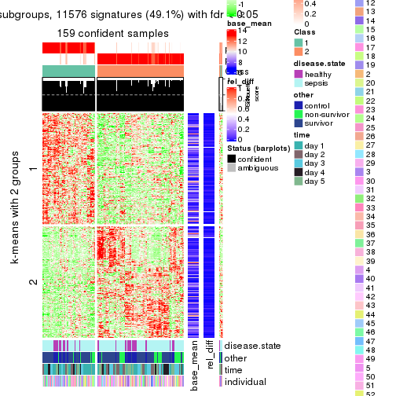</p>

</div>
<div id='tab-SD-NMF-get-signatures-2'>
<pre><code class="r">get_signatures(res, k = 3)
</code></pre>

<p></p>

</div>
<div id='tab-SD-NMF-get-signatures-3'>
<pre><code class="r">get_signatures(res, k = 4)
</code></pre>

<p></p>

</div>
<div id='tab-SD-NMF-get-signatures-4'>
<pre><code class="r">get_signatures(res, k = 5)
</code></pre>

<p></p>

</div>
<div id='tab-SD-NMF-get-signatures-5'>
<pre><code class="r">get_signatures(res, k = 6)
</code></pre>

<p></p>

</div>
</div>


Signature heatmaps where rows are not scaled:


<script>
$( function() {
	$( '#tabs-SD-NMF-get-signatures-no-scale' ).tabs();
} );
</script>
<div id='tabs-SD-NMF-get-signatures-no-scale'>
<ul>
<li><a href='#tab-SD-NMF-get-signatures-no-scale-1'>k = 2</a></li>
<li><a href='#tab-SD-NMF-get-signatures-no-scale-2'>k = 3</a></li>
<li><a href='#tab-SD-NMF-get-signatures-no-scale-3'>k = 4</a></li>
<li><a href='#tab-SD-NMF-get-signatures-no-scale-4'>k = 5</a></li>
<li><a href='#tab-SD-NMF-get-signatures-no-scale-5'>k = 6</a></li>
</ul>
<div id='tab-SD-NMF-get-signatures-no-scale-1'>
<pre><code class="r">get_signatures(res, k = 2, scale_rows = FALSE)
</code></pre>

<p></p>

</div>
<div id='tab-SD-NMF-get-signatures-no-scale-2'>
<pre><code class="r">get_signatures(res, k = 3, scale_rows = FALSE)
</code></pre>

<p></p>

</div>
<div id='tab-SD-NMF-get-signatures-no-scale-3'>
<pre><code class="r">get_signatures(res, k = 4, scale_rows = FALSE)
</code></pre>

<p></p>

</div>
<div id='tab-SD-NMF-get-signatures-no-scale-4'>
<pre><code class="r">get_signatures(res, k = 5, scale_rows = FALSE)
</code></pre>

<p>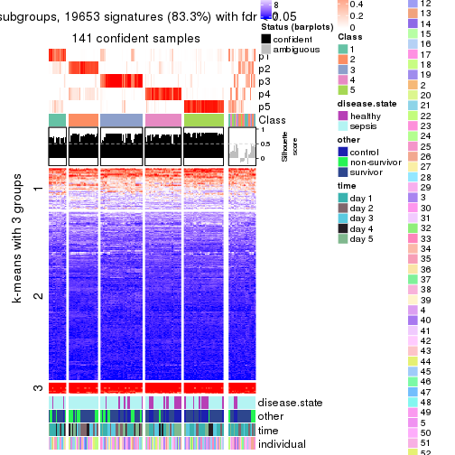</p>

</div>
<div id='tab-SD-NMF-get-signatures-no-scale-5'>
<pre><code class="r">get_signatures(res, k = 6, scale_rows = FALSE)
</code></pre>

<p></p>

</div>
</div>


Compare the overlap of signatures from different k:

```r
compare_signatures(res)
```


`get_signature()` returns a data frame invisibly. TO get the list of signatures, the function
call should be assigned to a variable explicitly. In following code, if `plot` argument is set
to `FALSE`, no heatmap is plotted while only the differential analysis is performed.

```r
# code only for demonstration
tb = get_signature(res, k = ..., plot = FALSE)
```

An example of the output of `tb` is:

```
#>   which_row         fdr    mean_1    mean_2 scaled_mean_1 scaled_mean_2 km
#> 1        38 0.042760348  8.373488  9.131774    -0.5533452     0.5164555  1
#> 2        40 0.018707592  7.106213  8.469186    -0.6173731     0.5762149  1
#> 3        55 0.019134737 10.221463 11.207825    -0.6159697     0.5749050  1
#> 4        59 0.006059896  5.921854  7.869574    -0.6899429     0.6439467  1
#> 5        60 0.018055526  8.928898 10.211722    -0.6204761     0.5791110  1
#> 6        98 0.009384629 15.714769 14.887706     0.6635654    -0.6193277  2
...
```

The columns in `tb` are:

1. `which_row`: row indices corresponding to the input matrix.
2. `fdr`: FDR for the differential test. 
3. `mean_x`: The mean value in group x.
4. `scaled_mean_x`: The mean value in group x after rows are scaled.
5. `km`: Row groups if k-means clustering is applied to rows.


UMAP plot which shows how samples are separated.


<script>
$( function() {
	$( '#tabs-SD-NMF-dimension-reduction' ).tabs();
} );
</script>
<div id='tabs-SD-NMF-dimension-reduction'>
<ul>
<li><a href='#tab-SD-NMF-dimension-reduction-1'>k = 2</a></li>
<li><a href='#tab-SD-NMF-dimension-reduction-2'>k = 3</a></li>
<li><a href='#tab-SD-NMF-dimension-reduction-3'>k = 4</a></li>
<li><a href='#tab-SD-NMF-dimension-reduction-4'>k = 5</a></li>
<li><a href='#tab-SD-NMF-dimension-reduction-5'>k = 6</a></li>
</ul>
<div id='tab-SD-NMF-dimension-reduction-1'>
<pre><code class="r">dimension_reduction(res, k = 2, method = &quot;UMAP&quot;)
</code></pre>

<p></p>

</div>
<div id='tab-SD-NMF-dimension-reduction-2'>
<pre><code class="r">dimension_reduction(res, k = 3, method = &quot;UMAP&quot;)
</code></pre>

<p></p>

</div>
<div id='tab-SD-NMF-dimension-reduction-3'>
<pre><code class="r">dimension_reduction(res, k = 4, method = &quot;UMAP&quot;)
</code></pre>

<p></p>

</div>
<div id='tab-SD-NMF-dimension-reduction-4'>
<pre><code class="r">dimension_reduction(res, k = 5, method = &quot;UMAP&quot;)
</code></pre>

<p></p>

</div>
<div id='tab-SD-NMF-dimension-reduction-5'>
<pre><code class="r">dimension_reduction(res, k = 6, method = &quot;UMAP&quot;)
</code></pre>

<p></p>

</div>
</div>


Following heatmap shows how subgroups are split when increasing `k`:

```r
collect_classes(res)
```


Test correlation between subgroups and known annotations. If the known
annotation is numeric, one-way ANOVA test is applied, and if the known
annotation is discrete, chi-squared contingency table test is applied.

```r
test_to_known_factors(res)
```

```
#>          n disease.state(p) other(p) time(p) individual(p) k
#> SD:NMF 159         0.609803 1.89e-01  0.0123         0.161 2
#> SD:NMF 159         0.747380 1.71e-01  0.0451         0.566 3
#> SD:NMF 121         0.435568 8.94e-02  0.5217         0.268 4
#> SD:NMF 141         0.002690 1.19e-04  0.0111         0.429 5
#> SD:NMF 141         0.000792 2.26e-10  0.0035         0.340 6
```


If matrix rows can be associated to genes, consider to use `functional_enrichment(res,
...)` to perform function enrichment for the signature genes. See [this vignette](http://bioconductor.org/packages/devel/bioc/vignettes/cola/inst/doc/functional_enrichment.html) for more detailed explanations.


 

---------------------------------------------------


### CV:hclust


The object with results only for a single top-value method and a single partition method 
can be extracted as:

```r
res = res_list["CV", "hclust"]
# you can also extract it by
# res = res_list["CV:hclust"]
```

A summary of `res` and all the functions that can be applied to it:

```r
res
```

```
#> A 'ConsensusPartition' object with k = 2, 3, 4, 5, 6.
#>   On a matrix with 23598 rows and 163 columns.
#>   Top rows (1000, 2000, 3000, 4000, 5000) are extracted by 'CV' method.
#>   Subgroups are detected by 'hclust' method.
#>   Performed in total 1250 partitions by row resampling.
#>   Best k for subgroups seems to be 2.
#> 
#> Following methods can be applied to this 'ConsensusPartition' object:
#>  [1] "cola_report"             "collect_classes"         "collect_plots"          
#>  [4] "collect_stats"           "colnames"                "compare_signatures"     
#>  [7] "consensus_heatmap"       "dimension_reduction"     "functional_enrichment"  
#> [10] "get_anno_col"            "get_anno"                "get_classes"            
#> [13] "get_consensus"           "get_matrix"              "get_membership"         
#> [16] "get_param"               "get_signatures"          "get_stats"              
#> [19] "is_best_k"               "is_stable_k"             "membership_heatmap"     
#> [22] "ncol"                    "nrow"                    "plot_ecdf"              
#> [25] "rownames"                "select_partition_number" "show"                   
#> [28] "suggest_best_k"          "test_to_known_factors"
```

`collect_plots()` function collects all the plots made from `res` for all `k` (number of partitions)
into one single page to provide an easy and fast comparison between different `k`.

```r
collect_plots(res)
```


The plots are:

- The first row: a plot of the ECDF (empirical cumulative distribution
  function) curves of the consensus matrix for each `k` and the heatmap of
  predicted classes for each `k`.
- The second row: heatmaps of the consensus matrix for each `k`.
- The third row: heatmaps of the membership matrix for each `k`.
- The fouth row: heatmaps of the signatures for each `k`.

All the plots in panels can be made by individual functions and they are
plotted later in this section.

`select_partition_number()` produces several plots showing different
statistics for choosing "optimized" `k`. There are following statistics:

- ECDF curves of the consensus matrix for each `k`;
- 1-PAC. [The PAC
  score](https://en.wikipedia.org/wiki/Consensus_clustering#Over-interpretation_potential_of_consensus_clustering)
  measures the proportion of the ambiguous subgrouping.
- Mean silhouette score.
- Concordance. The mean probability of fiting the consensus class ids in all
  partitions.
- Area increased. Denote $A_k$ as the area under the ECDF curve for current
  `k`, the area increased is defined as $A_k - A_{k-1}$.
- Rand index. The percent of pairs of samples that are both in a same cluster
  or both are not in a same cluster in the partition of k and k-1.
- Jaccard index. The ratio of pairs of samples are both in a same cluster in
  the partition of k and k-1 and the pairs of samples are both in a same
  cluster in the partition k or k-1.

The detailed explanations of these statistics can be found in [the _cola_
vignette](http://bioconductor.org/packages/devel/bioc/vignettes/cola/inst/doc/cola.html#toc_13).

Generally speaking, lower PAC score, higher mean silhouette score or higher
concordance corresponds to better partition. Rand index and Jaccard index
measure how similar the current partition is compared to partition with `k-1`.
If they are too similar, we won't accept `k` is better than `k-1`.

```r
select_partition_number(res)
```


The numeric values for all these statistics can be obtained by `get_stats()`.

```r
get_stats(res)
```

```
#>   k 1-PAC mean_silhouette concordance area_increased  Rand Jaccard
#> 2 2 0.474           0.721       0.880         0.4367 0.546   0.546
#> 3 3 0.355           0.615       0.783         0.4126 0.785   0.611
#> 4 4 0.519           0.642       0.801         0.1421 0.881   0.674
#> 5 5 0.525           0.526       0.708         0.0844 0.942   0.799
#> 6 6 0.615           0.481       0.682         0.0430 0.924   0.720
```

`suggest_best_k()` suggests the best $k$ based on these statistics. The rules are as follows:

- All $k$ with Jaccard index larger than 0.95 are removed because increasing
  $k$ does not provide enough extra information. If all $k$ are removed, it is
  marked as no subgroup is detected.
- For all $k$ with 1-PAC score larger than 0.9, the maximal $k$ is taken as
  the best $k$, and other $k$ are marked as optional $k$.
- If it does not fit the second rule. The $k$ with the maximal vote of the
  highest 1-PAC score, highest mean silhouette, and highest concordance is
  taken as the best $k$.

```r
suggest_best_k(res)
```

```
#> [1] 2
```


Following shows the table of the partitions (You need to click the **show/hide
code output** link to see it). The membership matrix (columns with name `p*`)
is inferred by
[`clue::cl_consensus()`](https://www.rdocumentation.org/link/cl_consensus?package=clue)
function with the `SE` method. Basically the value in the membership matrix
represents the probability to belong to a certain group. The finall class
label for an item is determined with the group with highest probability it
belongs to.

In `get_classes()` function, the entropy is calculated from the membership
matrix and the silhouette score is calculated from the consensus matrix.


<script>
$( function() {
	$( '#tabs-CV-hclust-get-classes' ).tabs();
} );
</script>
<div id='tabs-CV-hclust-get-classes'>
<ul>
<li><a href='#tab-CV-hclust-get-classes-1'>k = 2</a></li>
<li><a href='#tab-CV-hclust-get-classes-2'>k = 3</a></li>
<li><a href='#tab-CV-hclust-get-classes-3'>k = 4</a></li>
<li><a href='#tab-CV-hclust-get-classes-4'>k = 5</a></li>
<li><a href='#tab-CV-hclust-get-classes-5'>k = 6</a></li>
</ul>

<div id='tab-CV-hclust-get-classes-1'>
<p><a id='tab-CV-hclust-get-classes-1-a' style='color:#0366d6' href='#'>show/hide code output</a></p>
<pre><code class="r">cbind(get_classes(res, k = 2), get_membership(res, k = 2))
</code></pre>

<pre><code>#&gt;            class entropy silhouette    p1    p2
#&gt; GSM1317945     2  0.5842     0.7585 0.140 0.860
#&gt; GSM1317946     2  0.9977     0.0251 0.472 0.528
#&gt; GSM1317947     1  0.9323     0.6064 0.652 0.348
#&gt; GSM1317948     1  0.9954     0.3566 0.540 0.460
#&gt; GSM1317949     1  0.9323     0.6064 0.652 0.348
#&gt; GSM1317950     1  0.0000     0.7869 1.000 0.000
#&gt; GSM1317953     1  0.0000     0.7869 1.000 0.000
#&gt; GSM1317954     1  0.6712     0.7114 0.824 0.176
#&gt; GSM1317955     1  0.6712     0.7114 0.824 0.176
#&gt; GSM1317956     1  0.0000     0.7869 1.000 0.000
#&gt; GSM1317957     2  0.0672     0.8838 0.008 0.992
#&gt; GSM1317958     1  0.0000     0.7869 1.000 0.000
#&gt; GSM1317959     2  0.0938     0.8839 0.012 0.988
#&gt; GSM1317960     1  0.9944     0.3674 0.544 0.456
#&gt; GSM1317961     2  0.5178     0.7895 0.116 0.884
#&gt; GSM1317962     2  0.9866     0.1874 0.432 0.568
#&gt; GSM1317963     1  0.9661     0.5174 0.608 0.392
#&gt; GSM1317964     1  0.0000     0.7869 1.000 0.000
#&gt; GSM1317965     2  0.2236     0.8642 0.036 0.964
#&gt; GSM1317966     2  0.5178     0.7895 0.116 0.884
#&gt; GSM1317967     2  0.0000     0.8859 0.000 1.000
#&gt; GSM1317968     2  0.9866     0.1874 0.432 0.568
#&gt; GSM1317969     2  0.2236     0.8642 0.036 0.964
#&gt; GSM1317970     2  0.0672     0.8838 0.008 0.992
#&gt; GSM1317952     1  0.9954     0.3566 0.540 0.460
#&gt; GSM1317951     1  0.6712     0.7114 0.824 0.176
#&gt; GSM1317971     2  0.1843     0.8705 0.028 0.972
#&gt; GSM1317972     2  0.9866     0.1874 0.432 0.568
#&gt; GSM1317973     2  0.0938     0.8839 0.012 0.988
#&gt; GSM1317974     2  0.9866     0.1874 0.432 0.568
#&gt; GSM1317975     2  0.0672     0.8849 0.008 0.992
#&gt; GSM1317978     2  0.9754     0.2525 0.408 0.592
#&gt; GSM1317979     2  0.9850     0.0546 0.428 0.572
#&gt; GSM1317980     2  0.9850     0.0546 0.428 0.572
#&gt; GSM1317981     2  0.0672     0.8849 0.008 0.992
#&gt; GSM1317982     2  0.9850     0.0546 0.428 0.572
#&gt; GSM1317983     1  0.0000     0.7869 1.000 0.000
#&gt; GSM1317984     2  0.0000     0.8859 0.000 1.000
#&gt; GSM1317985     2  0.0000     0.8859 0.000 1.000
#&gt; GSM1317986     1  0.0000     0.7869 1.000 0.000
#&gt; GSM1317987     2  0.0672     0.8849 0.008 0.992
#&gt; GSM1317988     2  0.0938     0.8839 0.012 0.988
#&gt; GSM1317989     1  0.9000     0.6439 0.684 0.316
#&gt; GSM1317990     2  0.0672     0.8849 0.008 0.992
#&gt; GSM1317991     2  0.1843     0.8705 0.028 0.972
#&gt; GSM1317992     2  0.1843     0.8705 0.028 0.972
#&gt; GSM1317993     2  0.0672     0.8849 0.008 0.992
#&gt; GSM1317994     2  0.0000     0.8859 0.000 1.000
#&gt; GSM1317977     1  0.9000     0.6439 0.684 0.316
#&gt; GSM1317976     2  0.9866     0.1874 0.432 0.568
#&gt; GSM1317995     2  0.0000     0.8859 0.000 1.000
#&gt; GSM1317996     2  0.6712     0.7007 0.176 0.824
#&gt; GSM1317997     2  0.0000     0.8859 0.000 1.000
#&gt; GSM1317998     1  0.0000     0.7869 1.000 0.000
#&gt; GSM1317999     1  0.0672     0.7872 0.992 0.008
#&gt; GSM1318002     2  0.0000     0.8859 0.000 1.000
#&gt; GSM1318003     2  0.0000     0.8859 0.000 1.000
#&gt; GSM1318004     2  0.0938     0.8839 0.012 0.988
#&gt; GSM1318005     2  0.0938     0.8839 0.012 0.988
#&gt; GSM1318006     1  0.0938     0.7868 0.988 0.012
#&gt; GSM1318007     2  0.0938     0.8839 0.012 0.988
#&gt; GSM1318008     1  0.0672     0.7872 0.992 0.008
#&gt; GSM1318009     2  0.0938     0.8839 0.012 0.988
#&gt; GSM1318010     2  0.0000     0.8859 0.000 1.000
#&gt; GSM1318011     1  0.9775     0.4755 0.588 0.412
#&gt; GSM1318012     1  0.9775     0.4755 0.588 0.412
#&gt; GSM1318013     2  0.0938     0.8839 0.012 0.988
#&gt; GSM1318014     1  0.9775     0.4755 0.588 0.412
#&gt; GSM1318015     2  0.0000     0.8859 0.000 1.000
#&gt; GSM1318001     2  0.0000     0.8859 0.000 1.000
#&gt; GSM1318000     2  0.0938     0.8839 0.012 0.988
#&gt; GSM1318016     2  0.0672     0.8849 0.008 0.992
#&gt; GSM1318017     1  0.0000     0.7869 1.000 0.000
#&gt; GSM1318019     2  0.0938     0.8839 0.012 0.988
#&gt; GSM1318020     2  0.8955     0.4384 0.312 0.688
#&gt; GSM1318021     2  0.0672     0.8849 0.008 0.992
#&gt; GSM1318022     2  0.0000     0.8859 0.000 1.000
#&gt; GSM1318023     1  0.0000     0.7869 1.000 0.000
#&gt; GSM1318024     2  0.0672     0.8849 0.008 0.992
#&gt; GSM1318025     2  0.0000     0.8859 0.000 1.000
#&gt; GSM1318026     2  0.0000     0.8859 0.000 1.000
#&gt; GSM1318027     2  0.0000     0.8859 0.000 1.000
#&gt; GSM1318028     1  0.9775     0.4330 0.588 0.412
#&gt; GSM1318029     2  0.0672     0.8832 0.008 0.992
#&gt; GSM1318018     1  0.0000     0.7869 1.000 0.000
#&gt; GSM1318030     2  0.9710     0.1669 0.400 0.600
#&gt; GSM1318031     2  0.0000     0.8859 0.000 1.000
#&gt; GSM1318033     2  0.9988    -0.1300 0.480 0.520
#&gt; GSM1318034     1  0.9977     0.3255 0.528 0.472
#&gt; GSM1318035     2  0.0672     0.8849 0.008 0.992
#&gt; GSM1318036     2  0.9944    -0.0278 0.456 0.544
#&gt; GSM1318037     2  0.9710     0.1669 0.400 0.600
#&gt; GSM1318038     1  0.7815     0.7127 0.768 0.232
#&gt; GSM1318039     1  0.0376     0.7873 0.996 0.004
#&gt; GSM1318040     2  0.0000     0.8859 0.000 1.000
#&gt; GSM1318032     2  0.0000     0.8859 0.000 1.000
#&gt; GSM1317914     2  0.0000     0.8859 0.000 1.000
#&gt; GSM1317915     1  0.0376     0.7873 0.996 0.004
#&gt; GSM1317916     1  0.0376     0.7873 0.996 0.004
#&gt; GSM1317917     1  0.7815     0.7127 0.768 0.232
#&gt; GSM1317918     1  0.0376     0.7873 0.996 0.004
#&gt; GSM1317919     2  0.0000     0.8859 0.000 1.000
#&gt; GSM1317920     2  0.0672     0.8832 0.008 0.992
#&gt; GSM1317921     2  0.0000     0.8859 0.000 1.000
#&gt; GSM1317922     1  0.7602     0.7177 0.780 0.220
#&gt; GSM1317923     2  0.0000     0.8859 0.000 1.000
#&gt; GSM1317924     2  0.0000     0.8859 0.000 1.000
#&gt; GSM1317925     2  0.0672     0.8849 0.008 0.992
#&gt; GSM1317926     2  0.0000     0.8859 0.000 1.000
#&gt; GSM1317927     2  0.0672     0.8849 0.008 0.992
#&gt; GSM1317928     2  0.0000     0.8859 0.000 1.000
#&gt; GSM1317929     2  0.0672     0.8832 0.008 0.992
#&gt; GSM1317930     2  0.0000     0.8859 0.000 1.000
#&gt; GSM1317931     2  0.0000     0.8859 0.000 1.000
#&gt; GSM1317932     2  0.8955     0.4384 0.312 0.688
#&gt; GSM1317933     2  0.0672     0.8849 0.008 0.992
#&gt; GSM1317934     2  0.8955     0.4384 0.312 0.688
#&gt; GSM1317935     2  0.8955     0.4384 0.312 0.688
#&gt; GSM1317936     2  0.0000     0.8859 0.000 1.000
#&gt; GSM1317937     1  0.0000     0.7869 1.000 0.000
#&gt; GSM1317938     2  0.0938     0.8839 0.012 0.988
#&gt; GSM1317939     2  0.0672     0.8849 0.008 0.992
#&gt; GSM1317940     1  0.7056     0.7347 0.808 0.192
#&gt; GSM1317941     2  0.4431     0.8189 0.092 0.908
#&gt; GSM1317942     2  0.0672     0.8849 0.008 0.992
#&gt; GSM1317943     2  0.0672     0.8849 0.008 0.992
#&gt; GSM1317944     2  0.0672     0.8849 0.008 0.992
#&gt; GSM1317896     2  0.9000     0.4258 0.316 0.684
#&gt; GSM1317897     1  0.0000     0.7869 1.000 0.000
#&gt; GSM1317898     1  0.5059     0.7647 0.888 0.112
#&gt; GSM1317899     1  0.0938     0.7868 0.988 0.012
#&gt; GSM1317900     2  0.9087     0.4074 0.324 0.676
#&gt; GSM1317901     1  0.9323     0.6064 0.652 0.348
#&gt; GSM1317902     1  0.0000     0.7869 1.000 0.000
#&gt; GSM1317903     1  0.0000     0.7869 1.000 0.000
#&gt; GSM1317904     2  0.0938     0.8839 0.012 0.988
#&gt; GSM1317905     2  0.0672     0.8838 0.008 0.992
#&gt; GSM1317906     2  0.0672     0.8838 0.008 0.992
#&gt; GSM1317907     2  0.5946     0.7535 0.144 0.856
#&gt; GSM1317908     1  0.9323     0.6064 0.652 0.348
#&gt; GSM1317909     1  0.9129     0.6207 0.672 0.328
#&gt; GSM1317910     1  0.9129     0.6207 0.672 0.328
#&gt; GSM1317911     1  0.8763     0.6511 0.704 0.296
#&gt; GSM1317912     2  0.5946     0.7535 0.144 0.856
#&gt; GSM1317913     2  0.5946     0.7535 0.144 0.856
#&gt; GSM1318041     1  0.9970     0.3382 0.532 0.468
#&gt; GSM1318042     2  0.0000     0.8859 0.000 1.000
#&gt; GSM1318043     2  0.0000     0.8859 0.000 1.000
#&gt; GSM1318044     1  0.0000     0.7869 1.000 0.000
#&gt; GSM1318045     1  0.0000     0.7869 1.000 0.000
#&gt; GSM1318046     1  0.0000     0.7869 1.000 0.000
#&gt; GSM1318047     1  0.9977     0.3306 0.528 0.472
#&gt; GSM1318048     1  0.9427     0.5883 0.640 0.360
#&gt; GSM1318049     1  0.9427     0.5883 0.640 0.360
#&gt; GSM1318050     2  0.0938     0.8839 0.012 0.988
#&gt; GSM1318051     2  0.0938     0.8839 0.012 0.988
#&gt; GSM1318052     2  0.0000     0.8859 0.000 1.000
#&gt; GSM1318053     2  0.0000     0.8859 0.000 1.000
#&gt; GSM1318054     2  0.0000     0.8859 0.000 1.000
#&gt; GSM1318055     2  0.0000     0.8859 0.000 1.000
#&gt; GSM1318056     2  0.0000     0.8859 0.000 1.000
#&gt; GSM1318057     2  0.0000     0.8859 0.000 1.000
#&gt; GSM1318058     2  0.0000     0.8859 0.000 1.000
</code></pre>

<script>
$('#tab-CV-hclust-get-classes-1-a').parent().next().next().hide();
$('#tab-CV-hclust-get-classes-1-a').click(function(){
  $('#tab-CV-hclust-get-classes-1-a').parent().next().next().toggle();
  return(false);
});
</script>
</div>

<div id='tab-CV-hclust-get-classes-2'>
<p><a id='tab-CV-hclust-get-classes-2-a' style='color:#0366d6' href='#'>show/hide code output</a></p>
<pre><code class="r">cbind(get_classes(res, k = 3), get_membership(res, k = 3))
</code></pre>

<pre><code>#&gt;            class entropy silhouette    p1    p2    p3
#&gt; GSM1317945     2  0.6754     0.5549 0.092 0.740 0.168
#&gt; GSM1317946     2  0.6291     0.1561 0.468 0.532 0.000
#&gt; GSM1317947     1  0.9059     0.4576 0.480 0.140 0.380
#&gt; GSM1317948     1  0.9520     0.3508 0.452 0.352 0.196
#&gt; GSM1317949     1  0.9059     0.4576 0.480 0.140 0.380
#&gt; GSM1317950     1  0.0237     0.7465 0.996 0.000 0.004
#&gt; GSM1317953     1  0.0237     0.7465 0.996 0.000 0.004
#&gt; GSM1317954     1  0.4465     0.6478 0.820 0.176 0.004
#&gt; GSM1317955     1  0.4465     0.6478 0.820 0.176 0.004
#&gt; GSM1317956     1  0.0237     0.7465 0.996 0.000 0.004
#&gt; GSM1317957     2  0.0983     0.7830 0.004 0.980 0.016
#&gt; GSM1317958     1  0.0424     0.7491 0.992 0.000 0.008
#&gt; GSM1317959     2  0.0983     0.7844 0.004 0.980 0.016
#&gt; GSM1317960     1  0.9510     0.3596 0.456 0.348 0.196
#&gt; GSM1317961     3  0.8045     0.3963 0.064 0.432 0.504
#&gt; GSM1317962     2  0.6587     0.2779 0.424 0.568 0.008
#&gt; GSM1317963     1  0.9111     0.4854 0.532 0.292 0.176
#&gt; GSM1317964     1  0.0237     0.7465 0.996 0.000 0.004
#&gt; GSM1317965     3  0.6314     0.5704 0.004 0.392 0.604
#&gt; GSM1317966     3  0.8045     0.3963 0.064 0.432 0.504
#&gt; GSM1317967     2  0.3686     0.6564 0.000 0.860 0.140
#&gt; GSM1317968     2  0.6587     0.2779 0.424 0.568 0.008
#&gt; GSM1317969     3  0.6314     0.5704 0.004 0.392 0.604
#&gt; GSM1317970     2  0.0983     0.7830 0.004 0.980 0.016
#&gt; GSM1317952     1  0.9520     0.3508 0.452 0.352 0.196
#&gt; GSM1317951     1  0.4465     0.6478 0.820 0.176 0.004
#&gt; GSM1317971     3  0.6495     0.4610 0.004 0.460 0.536
#&gt; GSM1317972     2  0.6587     0.2779 0.424 0.568 0.008
#&gt; GSM1317973     2  0.0983     0.7844 0.004 0.980 0.016
#&gt; GSM1317974     2  0.6587     0.2779 0.424 0.568 0.008
#&gt; GSM1317975     2  0.0000     0.7852 0.000 1.000 0.000
#&gt; GSM1317978     2  0.6140     0.3303 0.404 0.596 0.000
#&gt; GSM1317979     2  0.9999    -0.1942 0.332 0.340 0.328
#&gt; GSM1317980     2  0.9999    -0.1942 0.332 0.340 0.328
#&gt; GSM1317981     2  0.0000     0.7852 0.000 1.000 0.000
#&gt; GSM1317982     2  0.9999    -0.1942 0.332 0.340 0.328
#&gt; GSM1317983     1  0.0237     0.7465 0.996 0.000 0.004
#&gt; GSM1317984     3  0.4452     0.7820 0.000 0.192 0.808
#&gt; GSM1317985     3  0.4452     0.7820 0.000 0.192 0.808
#&gt; GSM1317986     1  0.0237     0.7465 0.996 0.000 0.004
#&gt; GSM1317987     2  0.0000     0.7852 0.000 1.000 0.000
#&gt; GSM1317988     2  0.0983     0.7844 0.004 0.980 0.016
#&gt; GSM1317989     1  0.9257     0.5374 0.520 0.196 0.284
#&gt; GSM1317990     2  0.0000     0.7852 0.000 1.000 0.000
#&gt; GSM1317991     3  0.6495     0.4610 0.004 0.460 0.536
#&gt; GSM1317992     3  0.6495     0.4610 0.004 0.460 0.536
#&gt; GSM1317993     2  0.0000     0.7852 0.000 1.000 0.000
#&gt; GSM1317994     3  0.4452     0.7820 0.000 0.192 0.808
#&gt; GSM1317977     1  0.9257     0.5374 0.520 0.196 0.284
#&gt; GSM1317976     2  0.6587     0.2779 0.424 0.568 0.008
#&gt; GSM1317995     3  0.4452     0.7820 0.000 0.192 0.808
#&gt; GSM1317996     2  0.4351     0.6513 0.168 0.828 0.004
#&gt; GSM1317997     3  0.4452     0.7820 0.000 0.192 0.808
#&gt; GSM1317998     1  0.0424     0.7491 0.992 0.000 0.008
#&gt; GSM1317999     1  0.0747     0.7494 0.984 0.000 0.016
#&gt; GSM1318002     2  0.1289     0.7732 0.000 0.968 0.032
#&gt; GSM1318003     2  0.1289     0.7732 0.000 0.968 0.032
#&gt; GSM1318004     2  0.0983     0.7844 0.004 0.980 0.016
#&gt; GSM1318005     2  0.0983     0.7844 0.004 0.980 0.016
#&gt; GSM1318006     1  0.1711     0.7493 0.960 0.008 0.032
#&gt; GSM1318007     2  0.0983     0.7844 0.004 0.980 0.016
#&gt; GSM1318008     1  0.0747     0.7494 0.984 0.000 0.016
#&gt; GSM1318009     2  0.0983     0.7844 0.004 0.980 0.016
#&gt; GSM1318010     3  0.4452     0.7820 0.000 0.192 0.808
#&gt; GSM1318011     1  0.9207     0.4434 0.508 0.320 0.172
#&gt; GSM1318012     1  0.9207     0.4434 0.508 0.320 0.172
#&gt; GSM1318013     2  0.0983     0.7844 0.004 0.980 0.016
#&gt; GSM1318014     1  0.9207     0.4434 0.508 0.320 0.172
#&gt; GSM1318015     2  0.1289     0.7732 0.000 0.968 0.032
#&gt; GSM1318001     3  0.4452     0.7820 0.000 0.192 0.808
#&gt; GSM1318000     2  0.0983     0.7844 0.004 0.980 0.016
#&gt; GSM1318016     2  0.0000     0.7852 0.000 1.000 0.000
#&gt; GSM1318017     1  0.0000     0.7474 1.000 0.000 0.000
#&gt; GSM1318019     2  0.1129     0.7827 0.004 0.976 0.020
#&gt; GSM1318020     3  0.8655     0.4136 0.156 0.256 0.588
#&gt; GSM1318021     2  0.0000     0.7852 0.000 1.000 0.000
#&gt; GSM1318022     3  0.4887     0.7730 0.000 0.228 0.772
#&gt; GSM1318023     1  0.0000     0.7474 1.000 0.000 0.000
#&gt; GSM1318024     2  0.0000     0.7852 0.000 1.000 0.000
#&gt; GSM1318025     3  0.4555     0.7823 0.000 0.200 0.800
#&gt; GSM1318026     2  0.1411     0.7708 0.000 0.964 0.036
#&gt; GSM1318027     2  0.1289     0.7765 0.000 0.968 0.032
#&gt; GSM1318028     1  0.7919     0.3533 0.556 0.380 0.064
#&gt; GSM1318029     3  0.6081     0.6810 0.004 0.344 0.652
#&gt; GSM1318018     1  0.0000     0.7474 1.000 0.000 0.000
#&gt; GSM1318030     2  0.9527     0.0113 0.332 0.464 0.204
#&gt; GSM1318031     3  0.4555     0.7823 0.000 0.200 0.800
#&gt; GSM1318033     2  0.9098    -0.1163 0.404 0.456 0.140
#&gt; GSM1318034     3  0.8798    -0.1268 0.356 0.124 0.520
#&gt; GSM1318035     2  0.0000     0.7852 0.000 1.000 0.000
#&gt; GSM1318036     2  0.8943    -0.0361 0.392 0.480 0.128
#&gt; GSM1318037     2  0.9527     0.0113 0.332 0.464 0.204
#&gt; GSM1318038     1  0.6798     0.5373 0.584 0.016 0.400
#&gt; GSM1318039     1  0.2165     0.7371 0.936 0.000 0.064
#&gt; GSM1318040     3  0.4555     0.7823 0.000 0.200 0.800
#&gt; GSM1318032     3  0.4555     0.7823 0.000 0.200 0.800
#&gt; GSM1317914     3  0.4605     0.7758 0.000 0.204 0.796
#&gt; GSM1317915     1  0.2165     0.7371 0.936 0.000 0.064
#&gt; GSM1317916     1  0.4399     0.7087 0.812 0.000 0.188
#&gt; GSM1317917     1  0.6798     0.5373 0.584 0.016 0.400
#&gt; GSM1317918     1  0.2165     0.7371 0.936 0.000 0.064
#&gt; GSM1317919     3  0.5016     0.7679 0.000 0.240 0.760
#&gt; GSM1317920     3  0.6081     0.6810 0.004 0.344 0.652
#&gt; GSM1317921     3  0.5016     0.7679 0.000 0.240 0.760
#&gt; GSM1317922     1  0.6865     0.5522 0.596 0.020 0.384
#&gt; GSM1317923     3  0.5016     0.7679 0.000 0.240 0.760
#&gt; GSM1317924     3  0.4555     0.7823 0.000 0.200 0.800
#&gt; GSM1317925     2  0.0000     0.7852 0.000 1.000 0.000
#&gt; GSM1317926     3  0.5016     0.7679 0.000 0.240 0.760
#&gt; GSM1317927     2  0.0000     0.7852 0.000 1.000 0.000
#&gt; GSM1317928     2  0.1411     0.7711 0.000 0.964 0.036
#&gt; GSM1317929     3  0.6081     0.6810 0.004 0.344 0.652
#&gt; GSM1317930     2  0.1411     0.7711 0.000 0.964 0.036
#&gt; GSM1317931     3  0.4452     0.7820 0.000 0.192 0.808
#&gt; GSM1317932     3  0.8655     0.4136 0.156 0.256 0.588
#&gt; GSM1317933     2  0.0000     0.7852 0.000 1.000 0.000
#&gt; GSM1317934     3  0.8655     0.4136 0.156 0.256 0.588
#&gt; GSM1317935     3  0.8655     0.4136 0.156 0.256 0.588
#&gt; GSM1317936     3  0.4452     0.7820 0.000 0.192 0.808
#&gt; GSM1317937     1  0.0592     0.7494 0.988 0.000 0.012
#&gt; GSM1317938     2  0.0237     0.7849 0.004 0.996 0.000
#&gt; GSM1317939     2  0.0000     0.7852 0.000 1.000 0.000
#&gt; GSM1317940     1  0.6252     0.6878 0.772 0.144 0.084
#&gt; GSM1317941     2  0.2866     0.7376 0.076 0.916 0.008
#&gt; GSM1317942     2  0.0000     0.7852 0.000 1.000 0.000
#&gt; GSM1317943     2  0.0000     0.7852 0.000 1.000 0.000
#&gt; GSM1317944     2  0.0000     0.7852 0.000 1.000 0.000
#&gt; GSM1317896     3  0.7026     0.4426 0.152 0.120 0.728
#&gt; GSM1317897     1  0.0237     0.7465 0.996 0.000 0.004
#&gt; GSM1317898     1  0.4527     0.7233 0.860 0.052 0.088
#&gt; GSM1317899     1  0.1711     0.7493 0.960 0.008 0.032
#&gt; GSM1317900     3  0.8528     0.3990 0.156 0.240 0.604
#&gt; GSM1317901     1  0.9059     0.4576 0.480 0.140 0.380
#&gt; GSM1317902     1  0.0424     0.7491 0.992 0.000 0.008
#&gt; GSM1317903     1  0.0424     0.7491 0.992 0.000 0.008
#&gt; GSM1317904     2  0.0983     0.7844 0.004 0.980 0.016
#&gt; GSM1317905     2  0.1765     0.7708 0.004 0.956 0.040
#&gt; GSM1317906     2  0.1765     0.7708 0.004 0.956 0.040
#&gt; GSM1317907     2  0.6829     0.5496 0.096 0.736 0.168
#&gt; GSM1317908     1  0.9022     0.4530 0.480 0.136 0.384
#&gt; GSM1317909     1  0.8753     0.5627 0.588 0.224 0.188
#&gt; GSM1317910     1  0.8753     0.5627 0.588 0.224 0.188
#&gt; GSM1317911     1  0.8423     0.5893 0.616 0.228 0.156
#&gt; GSM1317912     2  0.6829     0.5496 0.096 0.736 0.168
#&gt; GSM1317913     2  0.6829     0.5496 0.096 0.736 0.168
#&gt; GSM1318041     3  0.8784    -0.1509 0.368 0.120 0.512
#&gt; GSM1318042     3  0.4452     0.7820 0.000 0.192 0.808
#&gt; GSM1318043     3  0.4452     0.7820 0.000 0.192 0.808
#&gt; GSM1318044     1  0.0592     0.7494 0.988 0.000 0.012
#&gt; GSM1318045     1  0.0592     0.7494 0.988 0.000 0.012
#&gt; GSM1318046     1  0.0592     0.7494 0.988 0.000 0.012
#&gt; GSM1318047     1  0.9746     0.3710 0.436 0.320 0.244
#&gt; GSM1318048     1  0.9273     0.4560 0.472 0.164 0.364
#&gt; GSM1318049     1  0.9273     0.4560 0.472 0.164 0.364
#&gt; GSM1318050     2  0.0983     0.7844 0.004 0.980 0.016
#&gt; GSM1318051     2  0.0983     0.7844 0.004 0.980 0.016
#&gt; GSM1318052     2  0.3686     0.6564 0.000 0.860 0.140
#&gt; GSM1318053     2  0.3686     0.6564 0.000 0.860 0.140
#&gt; GSM1318054     2  0.4654     0.5423 0.000 0.792 0.208
#&gt; GSM1318055     3  0.4555     0.7819 0.000 0.200 0.800
#&gt; GSM1318056     2  0.3686     0.6564 0.000 0.860 0.140
#&gt; GSM1318057     2  0.3686     0.6564 0.000 0.860 0.140
#&gt; GSM1318058     2  0.4654     0.5423 0.000 0.792 0.208
</code></pre>

<script>
$('#tab-CV-hclust-get-classes-2-a').parent().next().next().hide();
$('#tab-CV-hclust-get-classes-2-a').click(function(){
  $('#tab-CV-hclust-get-classes-2-a').parent().next().next().toggle();
  return(false);
});
</script>
</div>

<div id='tab-CV-hclust-get-classes-3'>
<p><a id='tab-CV-hclust-get-classes-3-a' style='color:#0366d6' href='#'>show/hide code output</a></p>
<pre><code class="r">cbind(get_classes(res, k = 4), get_membership(res, k = 4))
</code></pre>

<pre><code>#&gt;            class entropy silhouette    p1    p2    p3    p4
#&gt; GSM1317945     2  0.5290     0.4669 0.004 0.680 0.024 0.292
#&gt; GSM1317946     2  0.6376     0.1539 0.432 0.504 0.000 0.064
#&gt; GSM1317947     4  0.4363     0.6023 0.028 0.060 0.072 0.840
#&gt; GSM1317948     4  0.7198     0.5638 0.180 0.280 0.000 0.540
#&gt; GSM1317949     4  0.4363     0.6023 0.028 0.060 0.072 0.840
#&gt; GSM1317950     1  0.0000     0.8315 1.000 0.000 0.000 0.000
#&gt; GSM1317953     1  0.0000     0.8315 1.000 0.000 0.000 0.000
#&gt; GSM1317954     1  0.4199     0.6615 0.804 0.164 0.000 0.032
#&gt; GSM1317955     1  0.4199     0.6615 0.804 0.164 0.000 0.032
#&gt; GSM1317956     1  0.0000     0.8315 1.000 0.000 0.000 0.000
#&gt; GSM1317957     2  0.1486     0.8264 0.008 0.960 0.008 0.024
#&gt; GSM1317958     1  0.2469     0.8341 0.892 0.000 0.000 0.108
#&gt; GSM1317959     2  0.1406     0.8299 0.000 0.960 0.024 0.016
#&gt; GSM1317960     4  0.7179     0.5652 0.180 0.276 0.000 0.544
#&gt; GSM1317961     3  0.8141     0.1558 0.020 0.312 0.456 0.212
#&gt; GSM1317962     2  0.6285     0.2584 0.412 0.528 0.000 0.060
#&gt; GSM1317963     4  0.7563     0.4877 0.304 0.220 0.000 0.476
#&gt; GSM1317964     1  0.0000     0.8315 1.000 0.000 0.000 0.000
#&gt; GSM1317965     3  0.6685     0.4046 0.000 0.284 0.592 0.124
#&gt; GSM1317966     3  0.8141     0.1558 0.020 0.312 0.456 0.212
#&gt; GSM1317967     2  0.3763     0.7215 0.000 0.832 0.144 0.024
#&gt; GSM1317968     2  0.6285     0.2584 0.412 0.528 0.000 0.060
#&gt; GSM1317969     3  0.6685     0.4046 0.000 0.284 0.592 0.124
#&gt; GSM1317970     2  0.1486     0.8264 0.008 0.960 0.008 0.024
#&gt; GSM1317952     4  0.7198     0.5638 0.180 0.280 0.000 0.540
#&gt; GSM1317951     1  0.4199     0.6615 0.804 0.164 0.000 0.032
#&gt; GSM1317971     3  0.6508     0.3578 0.000 0.360 0.556 0.084
#&gt; GSM1317972     2  0.6285     0.2584 0.412 0.528 0.000 0.060
#&gt; GSM1317973     2  0.1406     0.8299 0.000 0.960 0.024 0.016
#&gt; GSM1317974     2  0.6285     0.2584 0.412 0.528 0.000 0.060
#&gt; GSM1317975     2  0.0000     0.8327 0.000 1.000 0.000 0.000
#&gt; GSM1317978     2  0.6240     0.2962 0.368 0.568 0.000 0.064
#&gt; GSM1317979     4  0.8610     0.5907 0.108 0.252 0.128 0.512
#&gt; GSM1317980     4  0.8610     0.5907 0.108 0.252 0.128 0.512
#&gt; GSM1317981     2  0.0000     0.8327 0.000 1.000 0.000 0.000
#&gt; GSM1317982     4  0.8610     0.5907 0.108 0.252 0.128 0.512
#&gt; GSM1317983     1  0.0000     0.8315 1.000 0.000 0.000 0.000
#&gt; GSM1317984     3  0.0817     0.7870 0.000 0.000 0.976 0.024
#&gt; GSM1317985     3  0.0817     0.7870 0.000 0.000 0.976 0.024
#&gt; GSM1317986     1  0.0000     0.8315 1.000 0.000 0.000 0.000
#&gt; GSM1317987     2  0.0000     0.8327 0.000 1.000 0.000 0.000
#&gt; GSM1317988     2  0.1406     0.8299 0.000 0.960 0.024 0.016
#&gt; GSM1317989     4  0.5400     0.5903 0.100 0.108 0.020 0.772
#&gt; GSM1317990     2  0.0000     0.8327 0.000 1.000 0.000 0.000
#&gt; GSM1317991     3  0.6508     0.3578 0.000 0.360 0.556 0.084
#&gt; GSM1317992     3  0.6508     0.3578 0.000 0.360 0.556 0.084
#&gt; GSM1317993     2  0.0000     0.8327 0.000 1.000 0.000 0.000
#&gt; GSM1317994     3  0.0817     0.7870 0.000 0.000 0.976 0.024
#&gt; GSM1317977     4  0.5400     0.5903 0.100 0.108 0.020 0.772
#&gt; GSM1317976     2  0.6285     0.2584 0.412 0.528 0.000 0.060
#&gt; GSM1317995     3  0.0817     0.7870 0.000 0.000 0.976 0.024
#&gt; GSM1317996     2  0.4057     0.6849 0.160 0.812 0.000 0.028
#&gt; GSM1317997     3  0.0817     0.7870 0.000 0.000 0.976 0.024
#&gt; GSM1317998     1  0.2149     0.8372 0.912 0.000 0.000 0.088
#&gt; GSM1317999     1  0.2281     0.8351 0.904 0.000 0.000 0.096
#&gt; GSM1318002     2  0.1174     0.8268 0.000 0.968 0.020 0.012
#&gt; GSM1318003     2  0.1174     0.8268 0.000 0.968 0.020 0.012
#&gt; GSM1318004     2  0.1406     0.8299 0.000 0.960 0.024 0.016
#&gt; GSM1318005     2  0.1406     0.8299 0.000 0.960 0.024 0.016
#&gt; GSM1318006     1  0.4222     0.6938 0.728 0.000 0.000 0.272
#&gt; GSM1318007     2  0.1406     0.8299 0.000 0.960 0.024 0.016
#&gt; GSM1318008     1  0.2281     0.8351 0.904 0.000 0.000 0.096
#&gt; GSM1318009     2  0.1406     0.8299 0.000 0.960 0.024 0.016
#&gt; GSM1318010     3  0.0817     0.7870 0.000 0.000 0.976 0.024
#&gt; GSM1318011     4  0.7458     0.5306 0.240 0.252 0.000 0.508
#&gt; GSM1318012     4  0.7458     0.5306 0.240 0.252 0.000 0.508
#&gt; GSM1318013     2  0.1406     0.8299 0.000 0.960 0.024 0.016
#&gt; GSM1318014     4  0.7458     0.5306 0.240 0.252 0.000 0.508
#&gt; GSM1318015     2  0.1174     0.8268 0.000 0.968 0.020 0.012
#&gt; GSM1318001     3  0.0817     0.7870 0.000 0.000 0.976 0.024
#&gt; GSM1318000     2  0.1406     0.8299 0.000 0.960 0.024 0.016
#&gt; GSM1318016     2  0.0000     0.8327 0.000 1.000 0.000 0.000
#&gt; GSM1318017     1  0.1302     0.8404 0.956 0.000 0.000 0.044
#&gt; GSM1318019     2  0.1406     0.8296 0.000 0.960 0.024 0.016
#&gt; GSM1318020     4  0.7506     0.1443 0.000 0.184 0.376 0.440
#&gt; GSM1318021     2  0.0000     0.8327 0.000 1.000 0.000 0.000
#&gt; GSM1318022     3  0.3308     0.7527 0.000 0.036 0.872 0.092
#&gt; GSM1318023     1  0.1302     0.8404 0.956 0.000 0.000 0.044
#&gt; GSM1318024     2  0.0000     0.8327 0.000 1.000 0.000 0.000
#&gt; GSM1318025     3  0.1545     0.7732 0.000 0.008 0.952 0.040
#&gt; GSM1318026     2  0.1297     0.8260 0.000 0.964 0.020 0.016
#&gt; GSM1318027     2  0.1488     0.8275 0.000 0.956 0.032 0.012
#&gt; GSM1318028     1  0.7439     0.0903 0.500 0.296 0.000 0.204
#&gt; GSM1318029     3  0.5462     0.6462 0.000 0.152 0.736 0.112
#&gt; GSM1318018     1  0.1302     0.8404 0.956 0.000 0.000 0.044
#&gt; GSM1318030     4  0.7965     0.3982 0.140 0.396 0.028 0.436
#&gt; GSM1318031     3  0.1545     0.7732 0.000 0.008 0.952 0.040
#&gt; GSM1318033     2  0.7700    -0.3855 0.220 0.396 0.000 0.384
#&gt; GSM1318034     4  0.6510     0.3926 0.028 0.056 0.276 0.640
#&gt; GSM1318035     2  0.0000     0.8327 0.000 1.000 0.000 0.000
#&gt; GSM1318036     2  0.7638    -0.3342 0.208 0.420 0.000 0.372
#&gt; GSM1318037     4  0.7965     0.3982 0.140 0.396 0.028 0.436
#&gt; GSM1318038     4  0.4656     0.4979 0.072 0.000 0.136 0.792
#&gt; GSM1318039     1  0.3649     0.7235 0.796 0.000 0.000 0.204
#&gt; GSM1318040     3  0.1545     0.7732 0.000 0.008 0.952 0.040
#&gt; GSM1318032     3  0.1545     0.7732 0.000 0.008 0.952 0.040
#&gt; GSM1317914     3  0.1820     0.7807 0.000 0.020 0.944 0.036
#&gt; GSM1317915     1  0.3649     0.7235 0.796 0.000 0.000 0.204
#&gt; GSM1317916     4  0.4382     0.1620 0.296 0.000 0.000 0.704
#&gt; GSM1317917     4  0.4656     0.4979 0.072 0.000 0.136 0.792
#&gt; GSM1317918     1  0.3649     0.7235 0.796 0.000 0.000 0.204
#&gt; GSM1317919     3  0.3286     0.7551 0.000 0.044 0.876 0.080
#&gt; GSM1317920     3  0.5462     0.6462 0.000 0.152 0.736 0.112
#&gt; GSM1317921     3  0.3286     0.7551 0.000 0.044 0.876 0.080
#&gt; GSM1317922     4  0.4688     0.5006 0.080 0.000 0.128 0.792
#&gt; GSM1317923     3  0.3286     0.7551 0.000 0.044 0.876 0.080
#&gt; GSM1317924     3  0.1545     0.7732 0.000 0.008 0.952 0.040
#&gt; GSM1317925     2  0.0000     0.8327 0.000 1.000 0.000 0.000
#&gt; GSM1317926     3  0.3286     0.7551 0.000 0.044 0.876 0.080
#&gt; GSM1317927     2  0.0000     0.8327 0.000 1.000 0.000 0.000
#&gt; GSM1317928     2  0.1510     0.8226 0.000 0.956 0.028 0.016
#&gt; GSM1317929     3  0.5462     0.6462 0.000 0.152 0.736 0.112
#&gt; GSM1317930     2  0.1510     0.8226 0.000 0.956 0.028 0.016
#&gt; GSM1317931     3  0.0817     0.7870 0.000 0.000 0.976 0.024
#&gt; GSM1317932     4  0.7510     0.1361 0.000 0.184 0.380 0.436
#&gt; GSM1317933     2  0.0000     0.8327 0.000 1.000 0.000 0.000
#&gt; GSM1317934     4  0.7510     0.1361 0.000 0.184 0.380 0.436
#&gt; GSM1317935     4  0.7510     0.1361 0.000 0.184 0.380 0.436
#&gt; GSM1317936     3  0.0817     0.7870 0.000 0.000 0.976 0.024
#&gt; GSM1317937     1  0.2760     0.8247 0.872 0.000 0.000 0.128
#&gt; GSM1317938     2  0.0469     0.8308 0.000 0.988 0.000 0.012
#&gt; GSM1317939     2  0.0000     0.8327 0.000 1.000 0.000 0.000
#&gt; GSM1317940     1  0.5644     0.4803 0.708 0.068 0.004 0.220
#&gt; GSM1317941     2  0.3383     0.7598 0.076 0.872 0.000 0.052
#&gt; GSM1317942     2  0.0000     0.8327 0.000 1.000 0.000 0.000
#&gt; GSM1317943     2  0.0000     0.8327 0.000 1.000 0.000 0.000
#&gt; GSM1317944     2  0.0000     0.8327 0.000 1.000 0.000 0.000
#&gt; GSM1317896     3  0.6310     0.1479 0.000 0.060 0.512 0.428
#&gt; GSM1317897     1  0.0000     0.8315 1.000 0.000 0.000 0.000
#&gt; GSM1317898     1  0.5323     0.5110 0.628 0.020 0.000 0.352
#&gt; GSM1317899     1  0.4222     0.6938 0.728 0.000 0.000 0.272
#&gt; GSM1317900     4  0.7526     0.1075 0.000 0.188 0.372 0.440
#&gt; GSM1317901     4  0.4363     0.6023 0.028 0.060 0.072 0.840
#&gt; GSM1317902     1  0.2469     0.8341 0.892 0.000 0.000 0.108
#&gt; GSM1317903     1  0.2469     0.8341 0.892 0.000 0.000 0.108
#&gt; GSM1317904     2  0.1406     0.8299 0.000 0.960 0.024 0.016
#&gt; GSM1317905     2  0.2353     0.8133 0.008 0.928 0.040 0.024
#&gt; GSM1317906     2  0.2353     0.8133 0.008 0.928 0.040 0.024
#&gt; GSM1317907     2  0.5314     0.4583 0.004 0.676 0.024 0.296
#&gt; GSM1317908     4  0.4356     0.5989 0.028 0.056 0.076 0.840
#&gt; GSM1317909     4  0.7261     0.4269 0.368 0.152 0.000 0.480
#&gt; GSM1317910     4  0.7261     0.4269 0.368 0.152 0.000 0.480
#&gt; GSM1317911     4  0.7332     0.3723 0.396 0.156 0.000 0.448
#&gt; GSM1317912     2  0.5314     0.4583 0.004 0.676 0.024 0.296
#&gt; GSM1317913     2  0.5314     0.4583 0.004 0.676 0.024 0.296
#&gt; GSM1318041     4  0.6846     0.4097 0.048 0.052 0.276 0.624
#&gt; GSM1318042     3  0.0817     0.7870 0.000 0.000 0.976 0.024
#&gt; GSM1318043     3  0.0817     0.7870 0.000 0.000 0.976 0.024
#&gt; GSM1318044     1  0.2760     0.8247 0.872 0.000 0.000 0.128
#&gt; GSM1318045     1  0.2760     0.8247 0.872 0.000 0.000 0.128
#&gt; GSM1318046     1  0.2760     0.8247 0.872 0.000 0.000 0.128
#&gt; GSM1318047     4  0.8040     0.5882 0.176 0.248 0.040 0.536
#&gt; GSM1318048     4  0.5400     0.6057 0.064 0.080 0.068 0.788
#&gt; GSM1318049     4  0.5400     0.6057 0.064 0.080 0.068 0.788
#&gt; GSM1318050     2  0.1406     0.8299 0.000 0.960 0.024 0.016
#&gt; GSM1318051     2  0.1406     0.8299 0.000 0.960 0.024 0.016
#&gt; GSM1318052     2  0.3763     0.7215 0.000 0.832 0.144 0.024
#&gt; GSM1318053     2  0.3763     0.7215 0.000 0.832 0.144 0.024
#&gt; GSM1318054     2  0.4832     0.6590 0.000 0.768 0.176 0.056
#&gt; GSM1318055     3  0.1722     0.7729 0.000 0.008 0.944 0.048
#&gt; GSM1318056     2  0.3763     0.7215 0.000 0.832 0.144 0.024
#&gt; GSM1318057     2  0.3763     0.7215 0.000 0.832 0.144 0.024
#&gt; GSM1318058     2  0.4832     0.6590 0.000 0.768 0.176 0.056
</code></pre>

<script>
$('#tab-CV-hclust-get-classes-3-a').parent().next().next().hide();
$('#tab-CV-hclust-get-classes-3-a').click(function(){
  $('#tab-CV-hclust-get-classes-3-a').parent().next().next().toggle();
  return(false);
});
</script>
</div>

<div id='tab-CV-hclust-get-classes-4'>
<p><a id='tab-CV-hclust-get-classes-4-a' style='color:#0366d6' href='#'>show/hide code output</a></p>
<pre><code class="r">cbind(get_classes(res, k = 5), get_membership(res, k = 5))
</code></pre>

<pre><code>#&gt;            class entropy silhouette    p1    p2    p3    p4    p5
#&gt; GSM1317945     4  0.5071     0.3518 0.000 0.036 0.000 0.540 0.424
#&gt; GSM1317946     1  0.7751     0.1747 0.416 0.152 0.000 0.332 0.100
#&gt; GSM1317947     5  0.4876    -0.2669 0.012 0.216 0.056 0.000 0.716
#&gt; GSM1317948     5  0.5380     0.3810 0.160 0.012 0.000 0.132 0.696
#&gt; GSM1317949     5  0.4876    -0.2669 0.012 0.216 0.056 0.000 0.716
#&gt; GSM1317950     1  0.0290     0.7305 0.992 0.008 0.000 0.000 0.000
#&gt; GSM1317953     1  0.0290     0.7305 0.992 0.008 0.000 0.000 0.000
#&gt; GSM1317954     1  0.4451     0.6346 0.784 0.060 0.000 0.132 0.024
#&gt; GSM1317955     1  0.4451     0.6346 0.784 0.060 0.000 0.132 0.024
#&gt; GSM1317956     1  0.0290     0.7305 0.992 0.008 0.000 0.000 0.000
#&gt; GSM1317957     4  0.4873     0.7090 0.000 0.244 0.000 0.688 0.068
#&gt; GSM1317958     1  0.2914     0.7243 0.872 0.052 0.000 0.000 0.076
#&gt; GSM1317959     4  0.3994     0.7566 0.000 0.068 0.000 0.792 0.140
#&gt; GSM1317960     5  0.5380     0.3803 0.160 0.012 0.000 0.132 0.696
#&gt; GSM1317961     3  0.8713     0.2435 0.020 0.224 0.368 0.140 0.248
#&gt; GSM1317962     1  0.7930     0.2207 0.388 0.196 0.000 0.320 0.096
#&gt; GSM1317963     5  0.5682     0.3151 0.296 0.016 0.000 0.072 0.616
#&gt; GSM1317964     1  0.0290     0.7305 0.992 0.008 0.000 0.000 0.000
#&gt; GSM1317965     3  0.7603     0.4405 0.000 0.208 0.508 0.156 0.128
#&gt; GSM1317966     3  0.8713     0.2435 0.020 0.224 0.368 0.140 0.248
#&gt; GSM1317967     4  0.5929     0.6531 0.000 0.236 0.020 0.632 0.112
#&gt; GSM1317968     1  0.7930     0.2207 0.388 0.196 0.000 0.320 0.096
#&gt; GSM1317969     3  0.7603     0.4405 0.000 0.208 0.508 0.156 0.128
#&gt; GSM1317970     4  0.4873     0.7090 0.000 0.244 0.000 0.688 0.068
#&gt; GSM1317952     5  0.5380     0.3810 0.160 0.012 0.000 0.132 0.696
#&gt; GSM1317951     1  0.4451     0.6346 0.784 0.060 0.000 0.132 0.024
#&gt; GSM1317971     3  0.7716     0.4064 0.000 0.244 0.460 0.208 0.088
#&gt; GSM1317972     1  0.7930     0.2207 0.388 0.196 0.000 0.320 0.096
#&gt; GSM1317973     4  0.3994     0.7566 0.000 0.068 0.000 0.792 0.140
#&gt; GSM1317974     1  0.7930     0.2207 0.388 0.196 0.000 0.320 0.096
#&gt; GSM1317975     4  0.1331     0.7968 0.000 0.040 0.000 0.952 0.008
#&gt; GSM1317978     4  0.7840    -0.0728 0.352 0.164 0.000 0.384 0.100
#&gt; GSM1317979     5  0.6735     0.3426 0.100 0.032 0.092 0.116 0.660
#&gt; GSM1317980     5  0.6735     0.3426 0.100 0.032 0.092 0.116 0.660
#&gt; GSM1317981     4  0.1331     0.7968 0.000 0.040 0.000 0.952 0.008
#&gt; GSM1317982     5  0.6735     0.3426 0.100 0.032 0.092 0.116 0.660
#&gt; GSM1317983     1  0.0290     0.7305 0.992 0.008 0.000 0.000 0.000
#&gt; GSM1317984     3  0.0510     0.7388 0.000 0.000 0.984 0.000 0.016
#&gt; GSM1317985     3  0.0510     0.7388 0.000 0.000 0.984 0.000 0.016
#&gt; GSM1317986     1  0.0290     0.7305 0.992 0.008 0.000 0.000 0.000
#&gt; GSM1317987     4  0.1331     0.7968 0.000 0.040 0.000 0.952 0.008
#&gt; GSM1317988     4  0.3994     0.7566 0.000 0.068 0.000 0.792 0.140
#&gt; GSM1317989     5  0.4709    -0.0442 0.076 0.144 0.008 0.008 0.764
#&gt; GSM1317990     4  0.1331     0.7968 0.000 0.040 0.000 0.952 0.008
#&gt; GSM1317991     3  0.7716     0.4064 0.000 0.244 0.460 0.208 0.088
#&gt; GSM1317992     3  0.7716     0.4064 0.000 0.244 0.460 0.208 0.088
#&gt; GSM1317993     4  0.1331     0.7968 0.000 0.040 0.000 0.952 0.008
#&gt; GSM1317994     3  0.0510     0.7388 0.000 0.000 0.984 0.000 0.016
#&gt; GSM1317977     5  0.4709    -0.0442 0.076 0.144 0.008 0.008 0.764
#&gt; GSM1317976     1  0.7930     0.2207 0.388 0.196 0.000 0.320 0.096
#&gt; GSM1317995     3  0.0510     0.7388 0.000 0.000 0.984 0.000 0.016
#&gt; GSM1317996     4  0.6533     0.5445 0.140 0.228 0.000 0.592 0.040
#&gt; GSM1317997     3  0.0510     0.7388 0.000 0.000 0.984 0.000 0.016
#&gt; GSM1317998     1  0.2446     0.7296 0.900 0.044 0.000 0.000 0.056
#&gt; GSM1317999     1  0.2580     0.7278 0.892 0.044 0.000 0.000 0.064
#&gt; GSM1318002     4  0.2054     0.7935 0.000 0.072 0.004 0.916 0.008
#&gt; GSM1318003     4  0.2054     0.7935 0.000 0.072 0.004 0.916 0.008
#&gt; GSM1318004     4  0.4054     0.7557 0.000 0.072 0.000 0.788 0.140
#&gt; GSM1318005     4  0.4054     0.7557 0.000 0.072 0.000 0.788 0.140
#&gt; GSM1318006     1  0.5116     0.5766 0.692 0.120 0.000 0.000 0.188
#&gt; GSM1318007     4  0.4054     0.7557 0.000 0.072 0.000 0.788 0.140
#&gt; GSM1318008     1  0.2580     0.7278 0.892 0.044 0.000 0.000 0.064
#&gt; GSM1318009     4  0.4054     0.7557 0.000 0.072 0.000 0.788 0.140
#&gt; GSM1318010     3  0.0510     0.7388 0.000 0.000 0.984 0.000 0.016
#&gt; GSM1318011     5  0.5990     0.3679 0.220 0.028 0.000 0.112 0.640
#&gt; GSM1318012     5  0.5990     0.3679 0.220 0.028 0.000 0.112 0.640
#&gt; GSM1318013     4  0.4054     0.7557 0.000 0.072 0.000 0.788 0.140
#&gt; GSM1318014     5  0.5990     0.3679 0.220 0.028 0.000 0.112 0.640
#&gt; GSM1318015     4  0.2054     0.7935 0.000 0.072 0.004 0.916 0.008
#&gt; GSM1318001     3  0.0510     0.7388 0.000 0.000 0.984 0.000 0.016
#&gt; GSM1318000     4  0.4054     0.7557 0.000 0.072 0.000 0.788 0.140
#&gt; GSM1318016     4  0.1331     0.7968 0.000 0.040 0.000 0.952 0.008
#&gt; GSM1318017     1  0.1364     0.7349 0.952 0.012 0.000 0.000 0.036
#&gt; GSM1318019     4  0.3526     0.7857 0.000 0.096 0.000 0.832 0.072
#&gt; GSM1318020     5  0.7443    -0.0509 0.000 0.156 0.360 0.064 0.420
#&gt; GSM1318021     4  0.1331     0.7968 0.000 0.040 0.000 0.952 0.008
#&gt; GSM1318022     3  0.4249     0.6602 0.000 0.120 0.800 0.024 0.056
#&gt; GSM1318023     1  0.1364     0.7349 0.952 0.012 0.000 0.000 0.036
#&gt; GSM1318024     4  0.1331     0.7968 0.000 0.040 0.000 0.952 0.008
#&gt; GSM1318025     3  0.2629     0.7161 0.000 0.136 0.860 0.004 0.000
#&gt; GSM1318026     4  0.2733     0.7776 0.000 0.112 0.004 0.872 0.012
#&gt; GSM1318027     4  0.3620     0.7826 0.000 0.108 0.000 0.824 0.068
#&gt; GSM1318028     1  0.7618     0.2461 0.480 0.100 0.000 0.160 0.260
#&gt; GSM1318029     3  0.6643     0.5608 0.000 0.240 0.584 0.052 0.124
#&gt; GSM1318018     1  0.1364     0.7349 0.952 0.012 0.000 0.000 0.036
#&gt; GSM1318030     5  0.6643     0.3464 0.128 0.012 0.028 0.240 0.592
#&gt; GSM1318031     3  0.2629     0.7161 0.000 0.136 0.860 0.004 0.000
#&gt; GSM1318033     5  0.6880     0.3310 0.204 0.028 0.000 0.244 0.524
#&gt; GSM1318034     5  0.6243    -0.2087 0.008 0.160 0.264 0.000 0.568
#&gt; GSM1318035     4  0.0404     0.7994 0.000 0.012 0.000 0.988 0.000
#&gt; GSM1318036     5  0.6760     0.3195 0.192 0.020 0.000 0.268 0.520
#&gt; GSM1318037     5  0.6643     0.3464 0.128 0.012 0.028 0.240 0.592
#&gt; GSM1318038     2  0.5557     1.0000 0.000 0.468 0.068 0.000 0.464
#&gt; GSM1318039     1  0.4376     0.5872 0.764 0.092 0.000 0.000 0.144
#&gt; GSM1318040     3  0.2629     0.7161 0.000 0.136 0.860 0.004 0.000
#&gt; GSM1318032     3  0.2629     0.7161 0.000 0.136 0.860 0.004 0.000
#&gt; GSM1317914     3  0.2914     0.7053 0.000 0.100 0.872 0.012 0.016
#&gt; GSM1317915     1  0.4376     0.5872 0.764 0.092 0.000 0.000 0.144
#&gt; GSM1317916     5  0.6638    -0.4810 0.224 0.364 0.000 0.000 0.412
#&gt; GSM1317917     2  0.5557     1.0000 0.000 0.468 0.068 0.000 0.464
#&gt; GSM1317918     1  0.4376     0.5872 0.764 0.092 0.000 0.000 0.144
#&gt; GSM1317919     3  0.4271     0.6663 0.000 0.108 0.804 0.032 0.056
#&gt; GSM1317920     3  0.6643     0.5608 0.000 0.240 0.584 0.052 0.124
#&gt; GSM1317921     3  0.4271     0.6663 0.000 0.108 0.804 0.032 0.056
#&gt; GSM1317922     5  0.5710    -0.9573 0.008 0.460 0.060 0.000 0.472
#&gt; GSM1317923     3  0.4271     0.6663 0.000 0.108 0.804 0.032 0.056
#&gt; GSM1317924     3  0.2629     0.7161 0.000 0.136 0.860 0.004 0.000
#&gt; GSM1317925     4  0.1082     0.7988 0.000 0.028 0.000 0.964 0.008
#&gt; GSM1317926     3  0.4271     0.6663 0.000 0.108 0.804 0.032 0.056
#&gt; GSM1317927     4  0.0290     0.7994 0.000 0.008 0.000 0.992 0.000
#&gt; GSM1317928     4  0.1579     0.7977 0.000 0.032 0.024 0.944 0.000
#&gt; GSM1317929     3  0.6643     0.5608 0.000 0.240 0.584 0.052 0.124
#&gt; GSM1317930     4  0.1579     0.7977 0.000 0.032 0.024 0.944 0.000
#&gt; GSM1317931     3  0.0510     0.7388 0.000 0.000 0.984 0.000 0.016
#&gt; GSM1317932     5  0.7447    -0.0506 0.000 0.156 0.364 0.064 0.416
#&gt; GSM1317933     4  0.0290     0.7994 0.000 0.008 0.000 0.992 0.000
#&gt; GSM1317934     5  0.7447    -0.0506 0.000 0.156 0.364 0.064 0.416
#&gt; GSM1317935     5  0.7447    -0.0506 0.000 0.156 0.364 0.064 0.416
#&gt; GSM1317936     3  0.0510     0.7388 0.000 0.000 0.984 0.000 0.016
#&gt; GSM1317937     1  0.3226     0.7152 0.852 0.060 0.000 0.000 0.088
#&gt; GSM1317938     4  0.2782     0.7891 0.000 0.048 0.000 0.880 0.072
#&gt; GSM1317939     4  0.0290     0.7996 0.000 0.008 0.000 0.992 0.000
#&gt; GSM1317940     1  0.4262     0.4027 0.696 0.012 0.000 0.004 0.288
#&gt; GSM1317941     4  0.6585     0.6168 0.064 0.228 0.000 0.600 0.108
#&gt; GSM1317942     4  0.0290     0.7996 0.000 0.008 0.000 0.992 0.000
#&gt; GSM1317943     4  0.0290     0.7996 0.000 0.008 0.000 0.992 0.000
#&gt; GSM1317944     4  0.0404     0.7994 0.000 0.012 0.000 0.988 0.000
#&gt; GSM1317896     3  0.6249     0.0847 0.000 0.128 0.476 0.004 0.392
#&gt; GSM1317897     1  0.0290     0.7305 0.992 0.008 0.000 0.000 0.000
#&gt; GSM1317898     1  0.5737     0.4170 0.592 0.120 0.000 0.000 0.288
#&gt; GSM1317899     1  0.5116     0.5766 0.692 0.120 0.000 0.000 0.188
#&gt; GSM1317900     5  0.7704    -0.0760 0.000 0.204 0.332 0.068 0.396
#&gt; GSM1317901     5  0.4876    -0.2669 0.012 0.216 0.056 0.000 0.716
#&gt; GSM1317902     1  0.2914     0.7243 0.872 0.052 0.000 0.000 0.076
#&gt; GSM1317903     1  0.2914     0.7243 0.872 0.052 0.000 0.000 0.076
#&gt; GSM1317904     4  0.3994     0.7566 0.000 0.068 0.000 0.792 0.140
#&gt; GSM1317905     4  0.5322     0.6941 0.000 0.256 0.012 0.664 0.068
#&gt; GSM1317906     4  0.5322     0.6941 0.000 0.256 0.012 0.664 0.068
#&gt; GSM1317907     4  0.4942     0.3464 0.000 0.028 0.000 0.540 0.432
#&gt; GSM1317908     5  0.4999    -0.2817 0.012 0.216 0.064 0.000 0.708
#&gt; GSM1317909     5  0.4934     0.2486 0.352 0.024 0.000 0.008 0.616
#&gt; GSM1317910     5  0.4934     0.2486 0.352 0.024 0.000 0.008 0.616
#&gt; GSM1317911     5  0.5122     0.2400 0.380 0.024 0.000 0.012 0.584
#&gt; GSM1317912     4  0.4942     0.3464 0.000 0.028 0.000 0.540 0.432
#&gt; GSM1317913     4  0.4942     0.3464 0.000 0.028 0.000 0.540 0.432
#&gt; GSM1318041     5  0.6793    -0.1944 0.028 0.156 0.264 0.004 0.548
#&gt; GSM1318042     3  0.0510     0.7388 0.000 0.000 0.984 0.000 0.016
#&gt; GSM1318043     3  0.0510     0.7388 0.000 0.000 0.984 0.000 0.016
#&gt; GSM1318044     1  0.3226     0.7152 0.852 0.060 0.000 0.000 0.088
#&gt; GSM1318045     1  0.3226     0.7152 0.852 0.060 0.000 0.000 0.088
#&gt; GSM1318046     1  0.3226     0.7152 0.852 0.060 0.000 0.000 0.088
#&gt; GSM1318047     5  0.6219     0.3601 0.160 0.012 0.036 0.128 0.664
#&gt; GSM1318048     5  0.4808    -0.1470 0.040 0.148 0.052 0.000 0.760
#&gt; GSM1318049     5  0.4808    -0.1470 0.040 0.148 0.052 0.000 0.760
#&gt; GSM1318050     4  0.3994     0.7566 0.000 0.068 0.000 0.792 0.140
#&gt; GSM1318051     4  0.3994     0.7566 0.000 0.068 0.000 0.792 0.140
#&gt; GSM1318052     4  0.5929     0.6531 0.000 0.236 0.020 0.632 0.112
#&gt; GSM1318053     4  0.5929     0.6531 0.000 0.236 0.020 0.632 0.112
#&gt; GSM1318054     4  0.6022     0.6095 0.000 0.284 0.036 0.608 0.072
#&gt; GSM1318055     3  0.2664     0.7097 0.000 0.092 0.884 0.004 0.020
#&gt; GSM1318056     4  0.5929     0.6531 0.000 0.236 0.020 0.632 0.112
#&gt; GSM1318057     4  0.5929     0.6531 0.000 0.236 0.020 0.632 0.112
#&gt; GSM1318058     4  0.6022     0.6095 0.000 0.284 0.036 0.608 0.072
</code></pre>

<script>
$('#tab-CV-hclust-get-classes-4-a').parent().next().next().hide();
$('#tab-CV-hclust-get-classes-4-a').click(function(){
  $('#tab-CV-hclust-get-classes-4-a').parent().next().next().toggle();
  return(false);
});
</script>
</div>

<div id='tab-CV-hclust-get-classes-5'>
<p><a id='tab-CV-hclust-get-classes-5-a' style='color:#0366d6' href='#'>show/hide code output</a></p>
<pre><code class="r">cbind(get_classes(res, k = 6), get_membership(res, k = 6))
</code></pre>

<pre><code>#&gt;            class entropy silhouette    p1    p2    p3    p4    p5    p6
#&gt; GSM1317945     4  0.4467    0.36838 0.016 0.248 0.000 0.700 0.008 0.028
#&gt; GSM1317946     1  0.7167    0.41302 0.384 0.060 0.000 0.188 0.352 0.016
#&gt; GSM1317947     2  0.2244    0.18831 0.036 0.912 0.032 0.000 0.004 0.016
#&gt; GSM1317948     2  0.7901    0.33777 0.024 0.368 0.000 0.260 0.184 0.164
#&gt; GSM1317949     2  0.2244    0.18831 0.036 0.912 0.032 0.000 0.004 0.016
#&gt; GSM1317950     5  0.2320    0.75762 0.080 0.004 0.000 0.000 0.892 0.024
#&gt; GSM1317953     5  0.2320    0.75762 0.080 0.004 0.000 0.000 0.892 0.024
#&gt; GSM1317954     5  0.4096    0.53677 0.268 0.012 0.000 0.020 0.700 0.000
#&gt; GSM1317955     5  0.4096    0.53677 0.268 0.012 0.000 0.020 0.700 0.000
#&gt; GSM1317956     5  0.2320    0.75762 0.080 0.004 0.000 0.000 0.892 0.024
#&gt; GSM1317957     1  0.4397    0.34520 0.528 0.012 0.000 0.452 0.000 0.008
#&gt; GSM1317958     5  0.2094    0.76745 0.016 0.068 0.000 0.000 0.908 0.008
#&gt; GSM1317959     4  0.0790    0.58679 0.032 0.000 0.000 0.968 0.000 0.000
#&gt; GSM1317960     2  0.7901    0.33703 0.024 0.368 0.000 0.260 0.184 0.164
#&gt; GSM1317961     3  0.7872    0.18858 0.272 0.280 0.336 0.020 0.012 0.080
#&gt; GSM1317962     1  0.5950    0.52252 0.544 0.060 0.000 0.080 0.316 0.000
#&gt; GSM1317963     2  0.8375    0.24406 0.060 0.320 0.000 0.208 0.252 0.160
#&gt; GSM1317964     5  0.2320    0.75762 0.080 0.004 0.000 0.000 0.892 0.024
#&gt; GSM1317965     3  0.7382    0.40836 0.252 0.168 0.468 0.044 0.000 0.068
#&gt; GSM1317966     3  0.7872    0.18858 0.272 0.280 0.336 0.020 0.012 0.080
#&gt; GSM1317967     4  0.5837    0.21197 0.252 0.056 0.008 0.608 0.000 0.076
#&gt; GSM1317968     1  0.5950    0.52252 0.544 0.060 0.000 0.080 0.316 0.000
#&gt; GSM1317969     3  0.7382    0.40836 0.252 0.168 0.468 0.044 0.000 0.068
#&gt; GSM1317970     1  0.4397    0.34520 0.528 0.012 0.000 0.452 0.000 0.008
#&gt; GSM1317952     2  0.7901    0.33777 0.024 0.368 0.000 0.260 0.184 0.164
#&gt; GSM1317951     5  0.4096    0.53677 0.268 0.012 0.000 0.020 0.700 0.000
#&gt; GSM1317971     3  0.7734    0.38750 0.296 0.128 0.420 0.076 0.000 0.080
#&gt; GSM1317972     1  0.5950    0.52252 0.544 0.060 0.000 0.080 0.316 0.000
#&gt; GSM1317973     4  0.0790    0.58679 0.032 0.000 0.000 0.968 0.000 0.000
#&gt; GSM1317974     1  0.5950    0.52252 0.544 0.060 0.000 0.080 0.316 0.000
#&gt; GSM1317975     4  0.4720    0.60213 0.076 0.008 0.000 0.672 0.000 0.244
#&gt; GSM1317978     1  0.7025    0.52977 0.464 0.064 0.000 0.172 0.284 0.016
#&gt; GSM1317979     2  0.8432    0.32987 0.012 0.368 0.080 0.272 0.108 0.160
#&gt; GSM1317980     2  0.8432    0.32987 0.012 0.368 0.080 0.272 0.108 0.160
#&gt; GSM1317981     4  0.4720    0.60213 0.076 0.008 0.000 0.672 0.000 0.244
#&gt; GSM1317982     2  0.8432    0.32987 0.012 0.368 0.080 0.272 0.108 0.160
#&gt; GSM1317983     5  0.2320    0.75762 0.080 0.004 0.000 0.000 0.892 0.024
#&gt; GSM1317984     3  0.0790    0.71473 0.000 0.032 0.968 0.000 0.000 0.000
#&gt; GSM1317985     3  0.0790    0.71473 0.000 0.032 0.968 0.000 0.000 0.000
#&gt; GSM1317986     5  0.2320    0.75762 0.080 0.004 0.000 0.000 0.892 0.024
#&gt; GSM1317987     4  0.4720    0.60213 0.076 0.008 0.000 0.672 0.000 0.244
#&gt; GSM1317988     4  0.0790    0.58679 0.032 0.000 0.000 0.968 0.000 0.000
#&gt; GSM1317989     2  0.3478    0.23258 0.000 0.828 0.004 0.056 0.100 0.012
#&gt; GSM1317990     4  0.4720    0.60213 0.076 0.008 0.000 0.672 0.000 0.244
#&gt; GSM1317991     3  0.7734    0.38750 0.296 0.128 0.420 0.076 0.000 0.080
#&gt; GSM1317992     3  0.7734    0.38750 0.296 0.128 0.420 0.076 0.000 0.080
#&gt; GSM1317993     4  0.4720    0.60213 0.076 0.008 0.000 0.672 0.000 0.244
#&gt; GSM1317994     3  0.0790    0.71473 0.000 0.032 0.968 0.000 0.000 0.000
#&gt; GSM1317977     2  0.3478    0.23258 0.000 0.828 0.004 0.056 0.100 0.012
#&gt; GSM1317976     1  0.5950    0.52252 0.544 0.060 0.000 0.080 0.316 0.000
#&gt; GSM1317995     3  0.0790    0.71473 0.000 0.032 0.968 0.000 0.000 0.000
#&gt; GSM1317996     1  0.5564    0.52215 0.588 0.008 0.000 0.296 0.092 0.016
#&gt; GSM1317997     3  0.0790    0.71473 0.000 0.032 0.968 0.000 0.000 0.000
#&gt; GSM1317998     5  0.1552    0.77373 0.020 0.036 0.000 0.000 0.940 0.004
#&gt; GSM1317999     5  0.1693    0.77278 0.020 0.044 0.000 0.000 0.932 0.004
#&gt; GSM1318002     4  0.5121    0.59632 0.108 0.016 0.004 0.672 0.000 0.200
#&gt; GSM1318003     4  0.5121    0.59632 0.108 0.016 0.004 0.672 0.000 0.200
#&gt; GSM1318004     4  0.0865    0.58555 0.036 0.000 0.000 0.964 0.000 0.000
#&gt; GSM1318005     4  0.0865    0.58555 0.036 0.000 0.000 0.964 0.000 0.000
#&gt; GSM1318006     5  0.4012    0.60913 0.024 0.240 0.000 0.000 0.724 0.012
#&gt; GSM1318007     4  0.0865    0.58555 0.036 0.000 0.000 0.964 0.000 0.000
#&gt; GSM1318008     5  0.1693    0.77278 0.020 0.044 0.000 0.000 0.932 0.004
#&gt; GSM1318009     4  0.0865    0.58555 0.036 0.000 0.000 0.964 0.000 0.000
#&gt; GSM1318010     3  0.0790    0.71473 0.000 0.032 0.968 0.000 0.000 0.000
#&gt; GSM1318011     2  0.7951    0.32210 0.024 0.348 0.000 0.236 0.244 0.148
#&gt; GSM1318012     2  0.7951    0.32210 0.024 0.348 0.000 0.236 0.244 0.148
#&gt; GSM1318013     4  0.0865    0.58555 0.036 0.000 0.000 0.964 0.000 0.000
#&gt; GSM1318014     2  0.7951    0.32210 0.024 0.348 0.000 0.236 0.244 0.148
#&gt; GSM1318015     4  0.5121    0.59632 0.108 0.016 0.004 0.672 0.000 0.200
#&gt; GSM1318001     3  0.0790    0.71473 0.000 0.032 0.968 0.000 0.000 0.000
#&gt; GSM1318000     4  0.0865    0.58555 0.036 0.000 0.000 0.964 0.000 0.000
#&gt; GSM1318016     4  0.4720    0.60213 0.076 0.008 0.000 0.672 0.000 0.244
#&gt; GSM1318017     5  0.0146    0.77680 0.000 0.004 0.000 0.000 0.996 0.000
#&gt; GSM1318019     4  0.2402    0.50967 0.140 0.004 0.000 0.856 0.000 0.000
#&gt; GSM1318020     2  0.5968    0.05259 0.124 0.524 0.328 0.012 0.000 0.012
#&gt; GSM1318021     4  0.4720    0.60213 0.076 0.008 0.000 0.672 0.000 0.244
#&gt; GSM1318022     3  0.4696    0.58461 0.172 0.028 0.720 0.000 0.000 0.080
#&gt; GSM1318023     5  0.0146    0.77680 0.000 0.004 0.000 0.000 0.996 0.000
#&gt; GSM1318024     4  0.4720    0.60213 0.076 0.008 0.000 0.672 0.000 0.244
#&gt; GSM1318025     3  0.3127    0.69446 0.060 0.020 0.860 0.004 0.000 0.056
#&gt; GSM1318026     4  0.5654    0.48653 0.232 0.020 0.004 0.608 0.000 0.136
#&gt; GSM1318027     4  0.2955    0.49348 0.172 0.008 0.000 0.816 0.000 0.004
#&gt; GSM1318028     5  0.7446    0.03649 0.288 0.204 0.000 0.064 0.412 0.032
#&gt; GSM1318029     3  0.6988    0.48623 0.260 0.116 0.488 0.008 0.000 0.128
#&gt; GSM1318018     5  0.0146    0.77680 0.000 0.004 0.000 0.000 0.996 0.000
#&gt; GSM1318030     4  0.8372   -0.37006 0.036 0.292 0.028 0.360 0.128 0.156
#&gt; GSM1318031     3  0.3127    0.69446 0.060 0.020 0.860 0.004 0.000 0.056
#&gt; GSM1318033     4  0.8361   -0.35927 0.068 0.224 0.000 0.352 0.196 0.160
#&gt; GSM1318034     2  0.3627    0.16139 0.004 0.740 0.244 0.000 0.004 0.008
#&gt; GSM1318035     4  0.4038    0.61390 0.044 0.000 0.000 0.712 0.000 0.244
#&gt; GSM1318036     4  0.8250   -0.31586 0.064 0.220 0.000 0.376 0.184 0.156
#&gt; GSM1318037     4  0.8372   -0.37006 0.036 0.292 0.028 0.360 0.128 0.156
#&gt; GSM1318038     6  0.5528    0.83972 0.100 0.244 0.036 0.000 0.000 0.620
#&gt; GSM1318039     5  0.4812    0.60493 0.044 0.068 0.000 0.000 0.716 0.172
#&gt; GSM1318040     3  0.3127    0.69446 0.060 0.020 0.860 0.004 0.000 0.056
#&gt; GSM1318032     3  0.3127    0.69446 0.060 0.020 0.860 0.004 0.000 0.056
#&gt; GSM1317914     3  0.3610    0.63748 0.152 0.004 0.792 0.000 0.000 0.052
#&gt; GSM1317915     5  0.4812    0.60493 0.044 0.068 0.000 0.000 0.716 0.172
#&gt; GSM1317916     6  0.5764    0.56994 0.008 0.220 0.000 0.000 0.220 0.552
#&gt; GSM1317917     6  0.5528    0.83972 0.100 0.244 0.036 0.000 0.000 0.620
#&gt; GSM1317918     5  0.4812    0.60493 0.044 0.068 0.000 0.000 0.716 0.172
#&gt; GSM1317919     3  0.4763    0.59067 0.180 0.032 0.720 0.004 0.000 0.064
#&gt; GSM1317920     3  0.6988    0.48623 0.260 0.116 0.488 0.008 0.000 0.128
#&gt; GSM1317921     3  0.4763    0.59067 0.180 0.032 0.720 0.004 0.000 0.064
#&gt; GSM1317922     6  0.5845    0.82706 0.100 0.260 0.036 0.000 0.008 0.596
#&gt; GSM1317923     3  0.4763    0.59067 0.180 0.032 0.720 0.004 0.000 0.064
#&gt; GSM1317924     3  0.3127    0.69446 0.060 0.020 0.860 0.004 0.000 0.056
#&gt; GSM1317925     4  0.4515    0.60911 0.060 0.008 0.000 0.688 0.000 0.244
#&gt; GSM1317926     3  0.4763    0.59067 0.180 0.032 0.720 0.004 0.000 0.064
#&gt; GSM1317927     4  0.3975    0.61456 0.040 0.000 0.000 0.716 0.000 0.244
#&gt; GSM1317928     4  0.4540    0.61493 0.052 0.008 0.012 0.716 0.000 0.212
#&gt; GSM1317929     3  0.6988    0.48623 0.260 0.116 0.488 0.008 0.000 0.128
#&gt; GSM1317930     4  0.4540    0.61493 0.052 0.008 0.012 0.716 0.000 0.212
#&gt; GSM1317931     3  0.0790    0.71473 0.000 0.032 0.968 0.000 0.000 0.000
#&gt; GSM1317932     2  0.5978    0.04278 0.124 0.520 0.332 0.012 0.000 0.012
#&gt; GSM1317933     4  0.3975    0.61456 0.040 0.000 0.000 0.716 0.000 0.244
#&gt; GSM1317934     2  0.5978    0.04278 0.124 0.520 0.332 0.012 0.000 0.012
#&gt; GSM1317935     2  0.5978    0.04278 0.124 0.520 0.332 0.012 0.000 0.012
#&gt; GSM1317936     3  0.0790    0.71473 0.000 0.032 0.968 0.000 0.000 0.000
#&gt; GSM1317937     5  0.2415    0.75855 0.016 0.084 0.000 0.000 0.888 0.012
#&gt; GSM1317938     4  0.2563    0.60296 0.052 0.000 0.000 0.876 0.000 0.072
#&gt; GSM1317939     4  0.3770    0.61863 0.028 0.000 0.000 0.728 0.000 0.244
#&gt; GSM1317940     5  0.6145    0.43036 0.080 0.232 0.000 0.040 0.608 0.040
#&gt; GSM1317941     1  0.5340    0.44769 0.496 0.028 0.000 0.428 0.048 0.000
#&gt; GSM1317942     4  0.3770    0.61863 0.028 0.000 0.000 0.728 0.000 0.244
#&gt; GSM1317943     4  0.3770    0.61863 0.028 0.000 0.000 0.728 0.000 0.244
#&gt; GSM1317944     4  0.4038    0.61390 0.044 0.000 0.000 0.712 0.000 0.244
#&gt; GSM1317896     3  0.4666    0.17476 0.024 0.480 0.488 0.004 0.000 0.004
#&gt; GSM1317897     5  0.2320    0.75762 0.080 0.004 0.000 0.000 0.892 0.024
#&gt; GSM1317898     5  0.5025    0.44996 0.024 0.312 0.000 0.028 0.624 0.012
#&gt; GSM1317899     5  0.4012    0.60913 0.024 0.240 0.000 0.000 0.724 0.012
#&gt; GSM1317900     2  0.6196   -0.00435 0.140 0.492 0.340 0.012 0.000 0.016
#&gt; GSM1317901     2  0.2244    0.18831 0.036 0.912 0.032 0.000 0.004 0.016
#&gt; GSM1317902     5  0.2094    0.76745 0.016 0.068 0.000 0.000 0.908 0.008
#&gt; GSM1317903     5  0.2094    0.76745 0.016 0.068 0.000 0.000 0.908 0.008
#&gt; GSM1317904     4  0.0790    0.58679 0.032 0.000 0.000 0.968 0.000 0.000
#&gt; GSM1317905     1  0.4981    0.32836 0.504 0.008 0.008 0.448 0.000 0.032
#&gt; GSM1317906     1  0.4981    0.32836 0.504 0.008 0.008 0.448 0.000 0.032
#&gt; GSM1317907     4  0.4352    0.36738 0.012 0.256 0.000 0.700 0.008 0.024
#&gt; GSM1317908     2  0.2388    0.17975 0.036 0.904 0.040 0.000 0.004 0.016
#&gt; GSM1317909     2  0.8554    0.15666 0.096 0.308 0.000 0.140 0.260 0.196
#&gt; GSM1317910     2  0.8554    0.15666 0.096 0.308 0.000 0.140 0.260 0.196
#&gt; GSM1317911     5  0.8555   -0.31365 0.092 0.280 0.000 0.144 0.288 0.196
#&gt; GSM1317912     4  0.4352    0.36738 0.012 0.256 0.000 0.700 0.008 0.024
#&gt; GSM1317913     4  0.4352    0.36738 0.012 0.256 0.000 0.700 0.008 0.024
#&gt; GSM1318041     2  0.4401    0.16828 0.004 0.708 0.244 0.004 0.024 0.016
#&gt; GSM1318042     3  0.0790    0.71473 0.000 0.032 0.968 0.000 0.000 0.000
#&gt; GSM1318043     3  0.0790    0.71473 0.000 0.032 0.968 0.000 0.000 0.000
#&gt; GSM1318044     5  0.2415    0.75855 0.016 0.084 0.000 0.000 0.888 0.012
#&gt; GSM1318045     5  0.2415    0.75855 0.016 0.084 0.000 0.000 0.888 0.012
#&gt; GSM1318046     5  0.2415    0.75855 0.016 0.084 0.000 0.000 0.888 0.012
#&gt; GSM1318047     2  0.7954    0.33988 0.012 0.404 0.016 0.224 0.184 0.160
#&gt; GSM1318048     2  0.2834    0.23250 0.000 0.880 0.028 0.016 0.064 0.012
#&gt; GSM1318049     2  0.2834    0.23250 0.000 0.880 0.028 0.016 0.064 0.012
#&gt; GSM1318050     4  0.0790    0.58679 0.032 0.000 0.000 0.968 0.000 0.000
#&gt; GSM1318051     4  0.0790    0.58679 0.032 0.000 0.000 0.968 0.000 0.000
#&gt; GSM1318052     4  0.5837    0.21197 0.252 0.056 0.008 0.608 0.000 0.076
#&gt; GSM1318053     4  0.5837    0.21197 0.252 0.056 0.008 0.608 0.000 0.076
#&gt; GSM1318054     4  0.6731    0.15621 0.268 0.076 0.040 0.540 0.000 0.076
#&gt; GSM1318055     3  0.2875    0.68816 0.036 0.032 0.884 0.032 0.000 0.016
#&gt; GSM1318056     4  0.5837    0.21197 0.252 0.056 0.008 0.608 0.000 0.076
#&gt; GSM1318057     4  0.5837    0.21197 0.252 0.056 0.008 0.608 0.000 0.076
#&gt; GSM1318058     4  0.6731    0.15621 0.268 0.076 0.040 0.540 0.000 0.076
</code></pre>

<script>
$('#tab-CV-hclust-get-classes-5-a').parent().next().next().hide();
$('#tab-CV-hclust-get-classes-5-a').click(function(){
  $('#tab-CV-hclust-get-classes-5-a').parent().next().next().toggle();
  return(false);
});
</script>
</div>
</div>

Heatmaps for the consensus matrix. It visualizes the probability of two
samples to be in a same group.


<script>
$( function() {
	$( '#tabs-CV-hclust-consensus-heatmap' ).tabs();
} );
</script>
<div id='tabs-CV-hclust-consensus-heatmap'>
<ul>
<li><a href='#tab-CV-hclust-consensus-heatmap-1'>k = 2</a></li>
<li><a href='#tab-CV-hclust-consensus-heatmap-2'>k = 3</a></li>
<li><a href='#tab-CV-hclust-consensus-heatmap-3'>k = 4</a></li>
<li><a href='#tab-CV-hclust-consensus-heatmap-4'>k = 5</a></li>
<li><a href='#tab-CV-hclust-consensus-heatmap-5'>k = 6</a></li>
</ul>
<div id='tab-CV-hclust-consensus-heatmap-1'>
<pre><code class="r">consensus_heatmap(res, k = 2)
</code></pre>

<p></p>

</div>
<div id='tab-CV-hclust-consensus-heatmap-2'>
<pre><code class="r">consensus_heatmap(res, k = 3)
</code></pre>

<p></p>

</div>
<div id='tab-CV-hclust-consensus-heatmap-3'>
<pre><code class="r">consensus_heatmap(res, k = 4)
</code></pre>

<p></p>

</div>
<div id='tab-CV-hclust-consensus-heatmap-4'>
<pre><code class="r">consensus_heatmap(res, k = 5)
</code></pre>

<p>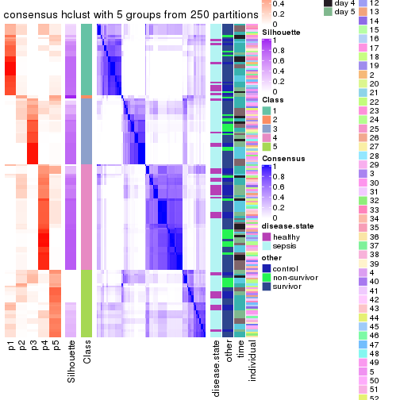</p>

</div>
<div id='tab-CV-hclust-consensus-heatmap-5'>
<pre><code class="r">consensus_heatmap(res, k = 6)
</code></pre>

<p></p>

</div>
</div>

Heatmaps for the membership of samples in all partitions to see how consistent they are:


<script>
$( function() {
	$( '#tabs-CV-hclust-membership-heatmap' ).tabs();
} );
</script>
<div id='tabs-CV-hclust-membership-heatmap'>
<ul>
<li><a href='#tab-CV-hclust-membership-heatmap-1'>k = 2</a></li>
<li><a href='#tab-CV-hclust-membership-heatmap-2'>k = 3</a></li>
<li><a href='#tab-CV-hclust-membership-heatmap-3'>k = 4</a></li>
<li><a href='#tab-CV-hclust-membership-heatmap-4'>k = 5</a></li>
<li><a href='#tab-CV-hclust-membership-heatmap-5'>k = 6</a></li>
</ul>
<div id='tab-CV-hclust-membership-heatmap-1'>
<pre><code class="r">membership_heatmap(res, k = 2)
</code></pre>

<p></p>

</div>
<div id='tab-CV-hclust-membership-heatmap-2'>
<pre><code class="r">membership_heatmap(res, k = 3)
</code></pre>

<p></p>

</div>
<div id='tab-CV-hclust-membership-heatmap-3'>
<pre><code class="r">membership_heatmap(res, k = 4)
</code></pre>

<p></p>

</div>
<div id='tab-CV-hclust-membership-heatmap-4'>
<pre><code class="r">membership_heatmap(res, k = 5)
</code></pre>

<p></p>

</div>
<div id='tab-CV-hclust-membership-heatmap-5'>
<pre><code class="r">membership_heatmap(res, k = 6)
</code></pre>

<p></p>

</div>
</div>

As soon as we have had the classes for columns, we can look for signatures
which are significantly different between classes which can be candidate marks
for certain classes. Following are the heatmaps for signatures.


Signature heatmaps where rows are scaled:


<script>
$( function() {
	$( '#tabs-CV-hclust-get-signatures' ).tabs();
} );
</script>
<div id='tabs-CV-hclust-get-signatures'>
<ul>
<li><a href='#tab-CV-hclust-get-signatures-1'>k = 2</a></li>
<li><a href='#tab-CV-hclust-get-signatures-2'>k = 3</a></li>
<li><a href='#tab-CV-hclust-get-signatures-3'>k = 4</a></li>
<li><a href='#tab-CV-hclust-get-signatures-4'>k = 5</a></li>
<li><a href='#tab-CV-hclust-get-signatures-5'>k = 6</a></li>
</ul>
<div id='tab-CV-hclust-get-signatures-1'>
<pre><code class="r">get_signatures(res, k = 2)
</code></pre>

<p></p>

</div>
<div id='tab-CV-hclust-get-signatures-2'>
<pre><code class="r">get_signatures(res, k = 3)
</code></pre>

<p></p>

</div>
<div id='tab-CV-hclust-get-signatures-3'>
<pre><code class="r">get_signatures(res, k = 4)
</code></pre>

<p></p>

</div>
<div id='tab-CV-hclust-get-signatures-4'>
<pre><code class="r">get_signatures(res, k = 5)
</code></pre>

<p></p>

</div>
<div id='tab-CV-hclust-get-signatures-5'>
<pre><code class="r">get_signatures(res, k = 6)
</code></pre>

<p></p>

</div>
</div>


Signature heatmaps where rows are not scaled:


<script>
$( function() {
	$( '#tabs-CV-hclust-get-signatures-no-scale' ).tabs();
} );
</script>
<div id='tabs-CV-hclust-get-signatures-no-scale'>
<ul>
<li><a href='#tab-CV-hclust-get-signatures-no-scale-1'>k = 2</a></li>
<li><a href='#tab-CV-hclust-get-signatures-no-scale-2'>k = 3</a></li>
<li><a href='#tab-CV-hclust-get-signatures-no-scale-3'>k = 4</a></li>
<li><a href='#tab-CV-hclust-get-signatures-no-scale-4'>k = 5</a></li>
<li><a href='#tab-CV-hclust-get-signatures-no-scale-5'>k = 6</a></li>
</ul>
<div id='tab-CV-hclust-get-signatures-no-scale-1'>
<pre><code class="r">get_signatures(res, k = 2, scale_rows = FALSE)
</code></pre>

<p></p>

</div>
<div id='tab-CV-hclust-get-signatures-no-scale-2'>
<pre><code class="r">get_signatures(res, k = 3, scale_rows = FALSE)
</code></pre>

<p>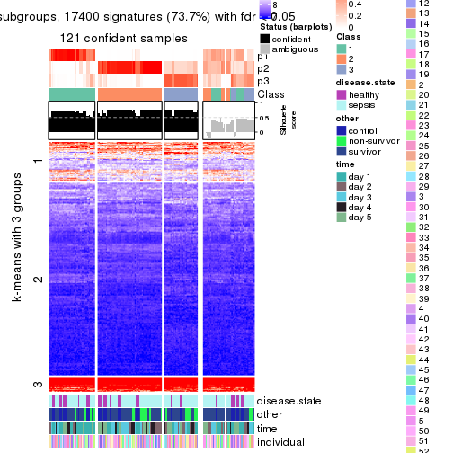</p>

</div>
<div id='tab-CV-hclust-get-signatures-no-scale-3'>
<pre><code class="r">get_signatures(res, k = 4, scale_rows = FALSE)
</code></pre>

<p></p>

</div>
<div id='tab-CV-hclust-get-signatures-no-scale-4'>
<pre><code class="r">get_signatures(res, k = 5, scale_rows = FALSE)
</code></pre>

<p></p>

</div>
<div id='tab-CV-hclust-get-signatures-no-scale-5'>
<pre><code class="r">get_signatures(res, k = 6, scale_rows = FALSE)
</code></pre>

<p></p>

</div>
</div>


Compare the overlap of signatures from different k:

```r
compare_signatures(res)
```


`get_signature()` returns a data frame invisibly. TO get the list of signatures, the function
call should be assigned to a variable explicitly. In following code, if `plot` argument is set
to `FALSE`, no heatmap is plotted while only the differential analysis is performed.

```r
# code only for demonstration
tb = get_signature(res, k = ..., plot = FALSE)
```

An example of the output of `tb` is:

```
#>   which_row         fdr    mean_1    mean_2 scaled_mean_1 scaled_mean_2 km
#> 1        38 0.042760348  8.373488  9.131774    -0.5533452     0.5164555  1
#> 2        40 0.018707592  7.106213  8.469186    -0.6173731     0.5762149  1
#> 3        55 0.019134737 10.221463 11.207825    -0.6159697     0.5749050  1
#> 4        59 0.006059896  5.921854  7.869574    -0.6899429     0.6439467  1
#> 5        60 0.018055526  8.928898 10.211722    -0.6204761     0.5791110  1
#> 6        98 0.009384629 15.714769 14.887706     0.6635654    -0.6193277  2
...
```

The columns in `tb` are:

1. `which_row`: row indices corresponding to the input matrix.
2. `fdr`: FDR for the differential test. 
3. `mean_x`: The mean value in group x.
4. `scaled_mean_x`: The mean value in group x after rows are scaled.
5. `km`: Row groups if k-means clustering is applied to rows.


UMAP plot which shows how samples are separated.


<script>
$( function() {
	$( '#tabs-CV-hclust-dimension-reduction' ).tabs();
} );
</script>
<div id='tabs-CV-hclust-dimension-reduction'>
<ul>
<li><a href='#tab-CV-hclust-dimension-reduction-1'>k = 2</a></li>
<li><a href='#tab-CV-hclust-dimension-reduction-2'>k = 3</a></li>
<li><a href='#tab-CV-hclust-dimension-reduction-3'>k = 4</a></li>
<li><a href='#tab-CV-hclust-dimension-reduction-4'>k = 5</a></li>
<li><a href='#tab-CV-hclust-dimension-reduction-5'>k = 6</a></li>
</ul>
<div id='tab-CV-hclust-dimension-reduction-1'>
<pre><code class="r">dimension_reduction(res, k = 2, method = &quot;UMAP&quot;)
</code></pre>

<p></p>

</div>
<div id='tab-CV-hclust-dimension-reduction-2'>
<pre><code class="r">dimension_reduction(res, k = 3, method = &quot;UMAP&quot;)
</code></pre>

<p></p>

</div>
<div id='tab-CV-hclust-dimension-reduction-3'>
<pre><code class="r">dimension_reduction(res, k = 4, method = &quot;UMAP&quot;)
</code></pre>

<p></p>

</div>
<div id='tab-CV-hclust-dimension-reduction-4'>
<pre><code class="r">dimension_reduction(res, k = 5, method = &quot;UMAP&quot;)
</code></pre>

<p></p>

</div>
<div id='tab-CV-hclust-dimension-reduction-5'>
<pre><code class="r">dimension_reduction(res, k = 6, method = &quot;UMAP&quot;)
</code></pre>

<p>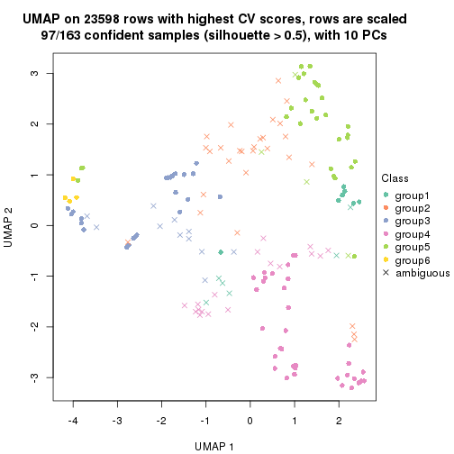</p>

</div>
</div>


Following heatmap shows how subgroups are split when increasing `k`:

```r
collect_classes(res)
```

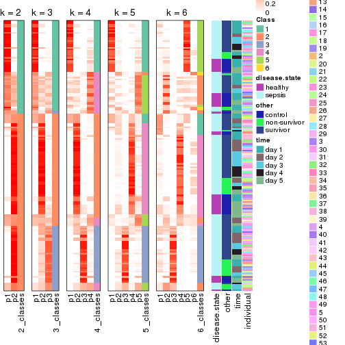


Test correlation between subgroups and known annotations. If the known
annotation is numeric, one-way ANOVA test is applied, and if the known
annotation is discrete, chi-squared contingency table test is applied.

```r
test_to_known_factors(res)
```

```
#>             n disease.state(p) other(p) time(p) individual(p) k
#> CV:hclust 133            0.143   0.1857 0.00161         0.559 2
#> CV:hclust 121            0.199   0.2844 0.05839         0.760 3
#> CV:hclust 124            0.493   0.1043 0.03784         0.665 4
#> CV:hclust 106            0.524   0.2890 0.10817         0.923 5
#> CV:hclust  97            0.227   0.0302 0.00533         0.352 6
```


If matrix rows can be associated to genes, consider to use `functional_enrichment(res,
...)` to perform function enrichment for the signature genes. See [this vignette](http://bioconductor.org/packages/devel/bioc/vignettes/cola/inst/doc/functional_enrichment.html) for more detailed explanations.


 

---------------------------------------------------


### CV:kmeans*


The object with results only for a single top-value method and a single partition method 
can be extracted as:

```r
res = res_list["CV", "kmeans"]
# you can also extract it by
# res = res_list["CV:kmeans"]
```

A summary of `res` and all the functions that can be applied to it:

```r
res
```

```
#> A 'ConsensusPartition' object with k = 2, 3, 4, 5, 6.
#>   On a matrix with 23598 rows and 163 columns.
#>   Top rows (1000, 2000, 3000, 4000, 5000) are extracted by 'CV' method.
#>   Subgroups are detected by 'kmeans' method.
#>   Performed in total 1250 partitions by row resampling.
#>   Best k for subgroups seems to be 3.
#> 
#> Following methods can be applied to this 'ConsensusPartition' object:
#>  [1] "cola_report"             "collect_classes"         "collect_plots"          
#>  [4] "collect_stats"           "colnames"                "compare_signatures"     
#>  [7] "consensus_heatmap"       "dimension_reduction"     "functional_enrichment"  
#> [10] "get_anno_col"            "get_anno"                "get_classes"            
#> [13] "get_consensus"           "get_matrix"              "get_membership"         
#> [16] "get_param"               "get_signatures"          "get_stats"              
#> [19] "is_best_k"               "is_stable_k"             "membership_heatmap"     
#> [22] "ncol"                    "nrow"                    "plot_ecdf"              
#> [25] "rownames"                "select_partition_number" "show"                   
#> [28] "suggest_best_k"          "test_to_known_factors"
```

`collect_plots()` function collects all the plots made from `res` for all `k` (number of partitions)
into one single page to provide an easy and fast comparison between different `k`.

```r
collect_plots(res)
```


The plots are:

- The first row: a plot of the ECDF (empirical cumulative distribution
  function) curves of the consensus matrix for each `k` and the heatmap of
  predicted classes for each `k`.
- The second row: heatmaps of the consensus matrix for each `k`.
- The third row: heatmaps of the membership matrix for each `k`.
- The fouth row: heatmaps of the signatures for each `k`.

All the plots in panels can be made by individual functions and they are
plotted later in this section.

`select_partition_number()` produces several plots showing different
statistics for choosing "optimized" `k`. There are following statistics:

- ECDF curves of the consensus matrix for each `k`;
- 1-PAC. [The PAC
  score](https://en.wikipedia.org/wiki/Consensus_clustering#Over-interpretation_potential_of_consensus_clustering)
  measures the proportion of the ambiguous subgrouping.
- Mean silhouette score.
- Concordance. The mean probability of fiting the consensus class ids in all
  partitions.
- Area increased. Denote $A_k$ as the area under the ECDF curve for current
  `k`, the area increased is defined as $A_k - A_{k-1}$.
- Rand index. The percent of pairs of samples that are both in a same cluster
  or both are not in a same cluster in the partition of k and k-1.
- Jaccard index. The ratio of pairs of samples are both in a same cluster in
  the partition of k and k-1 and the pairs of samples are both in a same
  cluster in the partition k or k-1.

The detailed explanations of these statistics can be found in [the _cola_
vignette](http://bioconductor.org/packages/devel/bioc/vignettes/cola/inst/doc/cola.html#toc_13).

Generally speaking, lower PAC score, higher mean silhouette score or higher
concordance corresponds to better partition. Rand index and Jaccard index
measure how similar the current partition is compared to partition with `k-1`.
If they are too similar, we won't accept `k` is better than `k-1`.

```r
select_partition_number(res)
```


The numeric values for all these statistics can be obtained by `get_stats()`.

```r
get_stats(res)
```

```
#>   k 1-PAC mean_silhouette concordance area_increased  Rand Jaccard
#> 2 2 0.684           0.900       0.948         0.4785 0.529   0.529
#> 3 3 0.932           0.933       0.960         0.3899 0.773   0.581
#> 4 4 0.703           0.779       0.808         0.1038 0.984   0.953
#> 5 5 0.663           0.631       0.736         0.0697 0.868   0.609
#> 6 6 0.731           0.654       0.784         0.0474 0.913   0.632
```

`suggest_best_k()` suggests the best $k$ based on these statistics. The rules are as follows:

- All $k$ with Jaccard index larger than 0.95 are removed because increasing
  $k$ does not provide enough extra information. If all $k$ are removed, it is
  marked as no subgroup is detected.
- For all $k$ with 1-PAC score larger than 0.9, the maximal $k$ is taken as
  the best $k$, and other $k$ are marked as optional $k$.
- If it does not fit the second rule. The $k$ with the maximal vote of the
  highest 1-PAC score, highest mean silhouette, and highest concordance is
  taken as the best $k$.

```r
suggest_best_k(res)
```

```
#> [1] 3
```


Following shows the table of the partitions (You need to click the **show/hide
code output** link to see it). The membership matrix (columns with name `p*`)
is inferred by
[`clue::cl_consensus()`](https://www.rdocumentation.org/link/cl_consensus?package=clue)
function with the `SE` method. Basically the value in the membership matrix
represents the probability to belong to a certain group. The finall class
label for an item is determined with the group with highest probability it
belongs to.

In `get_classes()` function, the entropy is calculated from the membership
matrix and the silhouette score is calculated from the consensus matrix.


<script>
$( function() {
	$( '#tabs-CV-kmeans-get-classes' ).tabs();
} );
</script>
<div id='tabs-CV-kmeans-get-classes'>
<ul>
<li><a href='#tab-CV-kmeans-get-classes-1'>k = 2</a></li>
<li><a href='#tab-CV-kmeans-get-classes-2'>k = 3</a></li>
<li><a href='#tab-CV-kmeans-get-classes-3'>k = 4</a></li>
<li><a href='#tab-CV-kmeans-get-classes-4'>k = 5</a></li>
<li><a href='#tab-CV-kmeans-get-classes-5'>k = 6</a></li>
</ul>

<div id='tab-CV-kmeans-get-classes-1'>
<p><a id='tab-CV-kmeans-get-classes-1-a' style='color:#0366d6' href='#'>show/hide code output</a></p>
<pre><code class="r">cbind(get_classes(res, k = 2), get_membership(res, k = 2))
</code></pre>

<pre><code>#&gt;            class entropy silhouette    p1    p2
#&gt; GSM1317945     2  0.7219      0.809 0.200 0.800
#&gt; GSM1317946     1  0.0000      0.961 1.000 0.000
#&gt; GSM1317947     2  0.0376      0.927 0.004 0.996
#&gt; GSM1317948     1  0.7219      0.763 0.800 0.200
#&gt; GSM1317949     1  0.0000      0.961 1.000 0.000
#&gt; GSM1317950     1  0.0000      0.961 1.000 0.000
#&gt; GSM1317953     1  0.0000      0.961 1.000 0.000
#&gt; GSM1317954     1  0.0000      0.961 1.000 0.000
#&gt; GSM1317955     1  0.0000      0.961 1.000 0.000
#&gt; GSM1317956     1  0.0000      0.961 1.000 0.000
#&gt; GSM1317957     2  0.0000      0.929 0.000 1.000
#&gt; GSM1317958     1  0.0000      0.961 1.000 0.000
#&gt; GSM1317959     2  0.7219      0.809 0.200 0.800
#&gt; GSM1317960     1  0.0000      0.961 1.000 0.000
#&gt; GSM1317961     2  0.0000      0.929 0.000 1.000
#&gt; GSM1317962     1  0.0000      0.961 1.000 0.000
#&gt; GSM1317963     1  0.0000      0.961 1.000 0.000
#&gt; GSM1317964     1  0.0000      0.961 1.000 0.000
#&gt; GSM1317965     2  0.0000      0.929 0.000 1.000
#&gt; GSM1317966     2  0.0000      0.929 0.000 1.000
#&gt; GSM1317967     2  0.0000      0.929 0.000 1.000
#&gt; GSM1317968     1  0.0000      0.961 1.000 0.000
#&gt; GSM1317969     2  0.0000      0.929 0.000 1.000
#&gt; GSM1317970     2  0.0000      0.929 0.000 1.000
#&gt; GSM1317952     1  0.5842      0.829 0.860 0.140
#&gt; GSM1317951     1  0.0000      0.961 1.000 0.000
#&gt; GSM1317971     2  0.0000      0.929 0.000 1.000
#&gt; GSM1317972     1  0.0000      0.961 1.000 0.000
#&gt; GSM1317973     2  0.0000      0.929 0.000 1.000
#&gt; GSM1317974     1  0.0000      0.961 1.000 0.000
#&gt; GSM1317975     2  0.7453      0.799 0.212 0.788
#&gt; GSM1317978     1  0.0000      0.961 1.000 0.000
#&gt; GSM1317979     2  0.9323      0.403 0.348 0.652
#&gt; GSM1317980     2  0.0000      0.929 0.000 1.000
#&gt; GSM1317981     2  0.7453      0.799 0.212 0.788
#&gt; GSM1317982     2  0.0000      0.929 0.000 1.000
#&gt; GSM1317983     1  0.0000      0.961 1.000 0.000
#&gt; GSM1317984     2  0.0000      0.929 0.000 1.000
#&gt; GSM1317985     2  0.0000      0.929 0.000 1.000
#&gt; GSM1317986     1  0.0000      0.961 1.000 0.000
#&gt; GSM1317987     2  0.7453      0.799 0.212 0.788
#&gt; GSM1317988     2  0.0000      0.929 0.000 1.000
#&gt; GSM1317989     1  0.0376      0.957 0.996 0.004
#&gt; GSM1317990     2  0.7453      0.799 0.212 0.788
#&gt; GSM1317991     2  0.0000      0.929 0.000 1.000
#&gt; GSM1317992     2  0.0000      0.929 0.000 1.000
#&gt; GSM1317993     2  0.7453      0.799 0.212 0.788
#&gt; GSM1317994     2  0.0000      0.929 0.000 1.000
#&gt; GSM1317977     1  0.0000      0.961 1.000 0.000
#&gt; GSM1317976     1  0.0000      0.961 1.000 0.000
#&gt; GSM1317995     2  0.0000      0.929 0.000 1.000
#&gt; GSM1317996     2  0.7453      0.799 0.212 0.788
#&gt; GSM1317997     2  0.0000      0.929 0.000 1.000
#&gt; GSM1317998     1  0.0000      0.961 1.000 0.000
#&gt; GSM1317999     1  0.0000      0.961 1.000 0.000
#&gt; GSM1318002     2  0.0000      0.929 0.000 1.000
#&gt; GSM1318003     2  0.7219      0.809 0.200 0.800
#&gt; GSM1318004     2  0.7453      0.799 0.212 0.788
#&gt; GSM1318005     2  0.7453      0.799 0.212 0.788
#&gt; GSM1318006     1  0.0000      0.961 1.000 0.000
#&gt; GSM1318007     2  0.0000      0.929 0.000 1.000
#&gt; GSM1318008     1  0.0000      0.961 1.000 0.000
#&gt; GSM1318009     2  0.7453      0.799 0.212 0.788
#&gt; GSM1318010     2  0.0000      0.929 0.000 1.000
#&gt; GSM1318011     1  0.0000      0.961 1.000 0.000
#&gt; GSM1318012     1  0.0000      0.961 1.000 0.000
#&gt; GSM1318013     2  0.0000      0.929 0.000 1.000
#&gt; GSM1318014     1  0.0000      0.961 1.000 0.000
#&gt; GSM1318015     2  0.0000      0.929 0.000 1.000
#&gt; GSM1318001     2  0.0000      0.929 0.000 1.000
#&gt; GSM1318000     2  0.7453      0.799 0.212 0.788
#&gt; GSM1318016     2  0.7219      0.809 0.200 0.800
#&gt; GSM1318017     1  0.0000      0.961 1.000 0.000
#&gt; GSM1318019     2  0.0000      0.929 0.000 1.000
#&gt; GSM1318020     2  0.0000      0.929 0.000 1.000
#&gt; GSM1318021     2  0.7453      0.799 0.212 0.788
#&gt; GSM1318022     2  0.0000      0.929 0.000 1.000
#&gt; GSM1318023     1  0.0000      0.961 1.000 0.000
#&gt; GSM1318024     2  0.7376      0.802 0.208 0.792
#&gt; GSM1318025     2  0.0000      0.929 0.000 1.000
#&gt; GSM1318026     2  0.0000      0.929 0.000 1.000
#&gt; GSM1318027     2  0.0000      0.929 0.000 1.000
#&gt; GSM1318028     1  0.0000      0.961 1.000 0.000
#&gt; GSM1318029     2  0.0000      0.929 0.000 1.000
#&gt; GSM1318018     1  0.0000      0.961 1.000 0.000
#&gt; GSM1318030     2  0.0000      0.929 0.000 1.000
#&gt; GSM1318031     2  0.0000      0.929 0.000 1.000
#&gt; GSM1318033     1  0.0000      0.961 1.000 0.000
#&gt; GSM1318034     1  0.9996      0.155 0.512 0.488
#&gt; GSM1318035     2  0.7453      0.799 0.212 0.788
#&gt; GSM1318036     1  0.0000      0.961 1.000 0.000
#&gt; GSM1318037     2  0.0000      0.929 0.000 1.000
#&gt; GSM1318038     2  0.0000      0.929 0.000 1.000
#&gt; GSM1318039     1  0.0000      0.961 1.000 0.000
#&gt; GSM1318040     2  0.0000      0.929 0.000 1.000
#&gt; GSM1318032     2  0.0000      0.929 0.000 1.000
#&gt; GSM1317914     2  0.0000      0.929 0.000 1.000
#&gt; GSM1317915     1  0.0000      0.961 1.000 0.000
#&gt; GSM1317916     1  0.0000      0.961 1.000 0.000
#&gt; GSM1317917     2  0.0000      0.929 0.000 1.000
#&gt; GSM1317918     1  0.0000      0.961 1.000 0.000
#&gt; GSM1317919     2  0.0000      0.929 0.000 1.000
#&gt; GSM1317920     2  0.0000      0.929 0.000 1.000
#&gt; GSM1317921     2  0.0000      0.929 0.000 1.000
#&gt; GSM1317922     1  0.7453      0.749 0.788 0.212
#&gt; GSM1317923     2  0.0000      0.929 0.000 1.000
#&gt; GSM1317924     2  0.0000      0.929 0.000 1.000
#&gt; GSM1317925     2  0.7219      0.809 0.200 0.800
#&gt; GSM1317926     2  0.0000      0.929 0.000 1.000
#&gt; GSM1317927     2  0.7453      0.799 0.212 0.788
#&gt; GSM1317928     2  0.0000      0.929 0.000 1.000
#&gt; GSM1317929     2  0.0000      0.929 0.000 1.000
#&gt; GSM1317930     2  0.0000      0.929 0.000 1.000
#&gt; GSM1317931     2  0.0000      0.929 0.000 1.000
#&gt; GSM1317932     2  0.0000      0.929 0.000 1.000
#&gt; GSM1317933     2  0.7219      0.809 0.200 0.800
#&gt; GSM1317934     2  0.0000      0.929 0.000 1.000
#&gt; GSM1317935     2  0.0000      0.929 0.000 1.000
#&gt; GSM1317936     2  0.0000      0.929 0.000 1.000
#&gt; GSM1317937     1  0.0000      0.961 1.000 0.000
#&gt; GSM1317938     2  0.7453      0.799 0.212 0.788
#&gt; GSM1317939     2  0.7453      0.799 0.212 0.788
#&gt; GSM1317940     1  0.0000      0.961 1.000 0.000
#&gt; GSM1317941     2  0.7453      0.799 0.212 0.788
#&gt; GSM1317942     2  0.7453      0.799 0.212 0.788
#&gt; GSM1317943     2  0.7453      0.799 0.212 0.788
#&gt; GSM1317944     2  0.7453      0.799 0.212 0.788
#&gt; GSM1317896     2  0.0000      0.929 0.000 1.000
#&gt; GSM1317897     1  0.0000      0.961 1.000 0.000
#&gt; GSM1317898     1  0.0000      0.961 1.000 0.000
#&gt; GSM1317899     1  0.0000      0.961 1.000 0.000
#&gt; GSM1317900     2  0.0000      0.929 0.000 1.000
#&gt; GSM1317901     1  0.0000      0.961 1.000 0.000
#&gt; GSM1317902     1  0.0000      0.961 1.000 0.000
#&gt; GSM1317903     1  0.0000      0.961 1.000 0.000
#&gt; GSM1317904     2  0.7453      0.799 0.212 0.788
#&gt; GSM1317905     2  0.0000      0.929 0.000 1.000
#&gt; GSM1317906     2  0.0000      0.929 0.000 1.000
#&gt; GSM1317907     2  0.0000      0.929 0.000 1.000
#&gt; GSM1317908     1  0.8386      0.679 0.732 0.268
#&gt; GSM1317909     1  0.7299      0.758 0.796 0.204
#&gt; GSM1317910     1  0.7453      0.749 0.788 0.212
#&gt; GSM1317911     1  0.0000      0.961 1.000 0.000
#&gt; GSM1317912     2  0.0000      0.929 0.000 1.000
#&gt; GSM1317913     2  0.0000      0.929 0.000 1.000
#&gt; GSM1318041     2  0.0376      0.927 0.004 0.996
#&gt; GSM1318042     2  0.0000      0.929 0.000 1.000
#&gt; GSM1318043     2  0.0000      0.929 0.000 1.000
#&gt; GSM1318044     1  0.0000      0.961 1.000 0.000
#&gt; GSM1318045     1  0.0000      0.961 1.000 0.000
#&gt; GSM1318046     1  0.0000      0.961 1.000 0.000
#&gt; GSM1318047     1  0.0000      0.961 1.000 0.000
#&gt; GSM1318048     1  0.7602      0.740 0.780 0.220
#&gt; GSM1318049     1  0.7219      0.763 0.800 0.200
#&gt; GSM1318050     2  0.7219      0.809 0.200 0.800
#&gt; GSM1318051     2  0.7219      0.809 0.200 0.800
#&gt; GSM1318052     2  0.0000      0.929 0.000 1.000
#&gt; GSM1318053     2  0.0000      0.929 0.000 1.000
#&gt; GSM1318054     2  0.0000      0.929 0.000 1.000
#&gt; GSM1318055     2  0.0000      0.929 0.000 1.000
#&gt; GSM1318056     2  0.0000      0.929 0.000 1.000
#&gt; GSM1318057     2  0.0000      0.929 0.000 1.000
#&gt; GSM1318058     2  0.0000      0.929 0.000 1.000
</code></pre>

<script>
$('#tab-CV-kmeans-get-classes-1-a').parent().next().next().hide();
$('#tab-CV-kmeans-get-classes-1-a').click(function(){
  $('#tab-CV-kmeans-get-classes-1-a').parent().next().next().toggle();
  return(false);
});
</script>
</div>

<div id='tab-CV-kmeans-get-classes-2'>
<p><a id='tab-CV-kmeans-get-classes-2-a' style='color:#0366d6' href='#'>show/hide code output</a></p>
<pre><code class="r">cbind(get_classes(res, k = 3), get_membership(res, k = 3))
</code></pre>

<pre><code>#&gt;            class entropy silhouette    p1    p2    p3
#&gt; GSM1317945     2  0.0661      0.950 0.004 0.988 0.008
#&gt; GSM1317946     1  0.0424      0.970 0.992 0.008 0.000
#&gt; GSM1317947     3  0.1620      0.966 0.012 0.024 0.964
#&gt; GSM1317948     1  0.4834      0.744 0.792 0.004 0.204
#&gt; GSM1317949     1  0.0475      0.970 0.992 0.004 0.004
#&gt; GSM1317950     1  0.0237      0.971 0.996 0.004 0.000
#&gt; GSM1317953     1  0.0424      0.970 0.992 0.008 0.000
#&gt; GSM1317954     1  0.0424      0.970 0.992 0.008 0.000
#&gt; GSM1317955     1  0.0424      0.970 0.992 0.008 0.000
#&gt; GSM1317956     1  0.0237      0.971 0.996 0.004 0.000
#&gt; GSM1317957     2  0.0424      0.948 0.000 0.992 0.008
#&gt; GSM1317958     1  0.0237      0.971 0.996 0.000 0.004
#&gt; GSM1317959     2  0.0848      0.951 0.008 0.984 0.008
#&gt; GSM1317960     1  0.0661      0.968 0.988 0.004 0.008
#&gt; GSM1317961     3  0.1411      0.971 0.000 0.036 0.964
#&gt; GSM1317962     1  0.0747      0.966 0.984 0.016 0.000
#&gt; GSM1317963     1  0.0661      0.970 0.988 0.008 0.004
#&gt; GSM1317964     1  0.0424      0.970 0.992 0.008 0.000
#&gt; GSM1317965     3  0.1163      0.973 0.000 0.028 0.972
#&gt; GSM1317966     3  0.1411      0.971 0.000 0.036 0.964
#&gt; GSM1317967     2  0.2959      0.888 0.000 0.900 0.100
#&gt; GSM1317968     1  0.0424      0.970 0.992 0.008 0.000
#&gt; GSM1317969     3  0.2878      0.904 0.000 0.096 0.904
#&gt; GSM1317970     2  0.0747      0.950 0.000 0.984 0.016
#&gt; GSM1317952     1  0.4351      0.794 0.828 0.004 0.168
#&gt; GSM1317951     1  0.0424      0.970 0.992 0.008 0.000
#&gt; GSM1317971     3  0.1163      0.973 0.000 0.028 0.972
#&gt; GSM1317972     1  0.0424      0.970 0.992 0.008 0.000
#&gt; GSM1317973     2  0.0747      0.950 0.000 0.984 0.016
#&gt; GSM1317974     1  0.0747      0.966 0.984 0.016 0.000
#&gt; GSM1317975     2  0.0424      0.947 0.008 0.992 0.000
#&gt; GSM1317978     1  0.0424      0.970 0.992 0.008 0.000
#&gt; GSM1317979     3  0.1711      0.950 0.032 0.008 0.960
#&gt; GSM1317980     3  0.1031      0.973 0.000 0.024 0.976
#&gt; GSM1317981     2  0.0424      0.947 0.008 0.992 0.000
#&gt; GSM1317982     3  0.5098      0.675 0.000 0.248 0.752
#&gt; GSM1317983     1  0.0000      0.971 1.000 0.000 0.000
#&gt; GSM1317984     3  0.1163      0.973 0.000 0.028 0.972
#&gt; GSM1317985     3  0.1163      0.973 0.000 0.028 0.972
#&gt; GSM1317986     1  0.0000      0.971 1.000 0.000 0.000
#&gt; GSM1317987     2  0.0424      0.947 0.008 0.992 0.000
#&gt; GSM1317988     2  0.0747      0.950 0.000 0.984 0.016
#&gt; GSM1317989     1  0.1129      0.959 0.976 0.004 0.020
#&gt; GSM1317990     2  0.0424      0.947 0.008 0.992 0.000
#&gt; GSM1317991     3  0.1163      0.973 0.000 0.028 0.972
#&gt; GSM1317992     2  0.2165      0.917 0.000 0.936 0.064
#&gt; GSM1317993     2  0.0661      0.949 0.008 0.988 0.004
#&gt; GSM1317994     3  0.1163      0.973 0.000 0.028 0.972
#&gt; GSM1317977     1  0.0237      0.971 0.996 0.000 0.004
#&gt; GSM1317976     1  0.0424      0.970 0.992 0.008 0.000
#&gt; GSM1317995     3  0.1163      0.973 0.000 0.028 0.972
#&gt; GSM1317996     2  0.0424      0.947 0.008 0.992 0.000
#&gt; GSM1317997     3  0.1163      0.973 0.000 0.028 0.972
#&gt; GSM1317998     1  0.0237      0.971 0.996 0.000 0.004
#&gt; GSM1317999     1  0.0237      0.971 0.996 0.000 0.004
#&gt; GSM1318002     2  0.0747      0.950 0.000 0.984 0.016
#&gt; GSM1318003     2  0.0848      0.951 0.008 0.984 0.008
#&gt; GSM1318004     2  0.0848      0.951 0.008 0.984 0.008
#&gt; GSM1318005     2  0.0848      0.951 0.008 0.984 0.008
#&gt; GSM1318006     1  0.0237      0.971 0.996 0.000 0.004
#&gt; GSM1318007     2  0.4654      0.769 0.000 0.792 0.208
#&gt; GSM1318008     1  0.0237      0.971 0.996 0.000 0.004
#&gt; GSM1318009     2  0.0848      0.951 0.008 0.984 0.008
#&gt; GSM1318010     3  0.1163      0.973 0.000 0.028 0.972
#&gt; GSM1318011     1  0.0475      0.970 0.992 0.004 0.004
#&gt; GSM1318012     1  0.0475      0.970 0.992 0.004 0.004
#&gt; GSM1318013     2  0.2878      0.891 0.000 0.904 0.096
#&gt; GSM1318014     1  0.0475      0.970 0.992 0.004 0.004
#&gt; GSM1318015     2  0.0747      0.950 0.000 0.984 0.016
#&gt; GSM1318001     3  0.1163      0.973 0.000 0.028 0.972
#&gt; GSM1318000     2  0.0848      0.951 0.008 0.984 0.008
#&gt; GSM1318016     2  0.0848      0.951 0.008 0.984 0.008
#&gt; GSM1318017     1  0.0000      0.971 1.000 0.000 0.000
#&gt; GSM1318019     2  0.0747      0.950 0.000 0.984 0.016
#&gt; GSM1318020     3  0.1163      0.973 0.000 0.028 0.972
#&gt; GSM1318021     2  0.0661      0.949 0.008 0.988 0.004
#&gt; GSM1318022     3  0.0424      0.963 0.000 0.008 0.992
#&gt; GSM1318023     1  0.0000      0.971 1.000 0.000 0.000
#&gt; GSM1318024     2  0.0661      0.949 0.008 0.988 0.004
#&gt; GSM1318025     3  0.1163      0.973 0.000 0.028 0.972
#&gt; GSM1318026     2  0.0747      0.950 0.000 0.984 0.016
#&gt; GSM1318027     2  0.0747      0.950 0.000 0.984 0.016
#&gt; GSM1318028     1  0.0424      0.970 0.992 0.008 0.000
#&gt; GSM1318029     3  0.0424      0.963 0.000 0.008 0.992
#&gt; GSM1318018     1  0.0000      0.971 1.000 0.000 0.000
#&gt; GSM1318030     2  0.6215      0.302 0.000 0.572 0.428
#&gt; GSM1318031     3  0.1163      0.973 0.000 0.028 0.972
#&gt; GSM1318033     1  0.0237      0.971 0.996 0.000 0.004
#&gt; GSM1318034     3  0.1525      0.949 0.032 0.004 0.964
#&gt; GSM1318035     2  0.0848      0.951 0.008 0.984 0.008
#&gt; GSM1318036     1  0.0661      0.970 0.988 0.008 0.004
#&gt; GSM1318037     2  0.4605      0.770 0.000 0.796 0.204
#&gt; GSM1318038     3  0.0592      0.962 0.000 0.012 0.988
#&gt; GSM1318039     1  0.1031      0.960 0.976 0.000 0.024
#&gt; GSM1318040     3  0.1163      0.973 0.000 0.028 0.972
#&gt; GSM1318032     3  0.1163      0.973 0.000 0.028 0.972
#&gt; GSM1317914     3  0.1031      0.973 0.000 0.024 0.976
#&gt; GSM1317915     1  0.1031      0.960 0.976 0.000 0.024
#&gt; GSM1317916     1  0.1031      0.960 0.976 0.000 0.024
#&gt; GSM1317917     3  0.0661      0.957 0.004 0.008 0.988
#&gt; GSM1317918     1  0.1453      0.958 0.968 0.008 0.024
#&gt; GSM1317919     3  0.0424      0.963 0.000 0.008 0.992
#&gt; GSM1317920     3  0.0424      0.963 0.000 0.008 0.992
#&gt; GSM1317921     3  0.0424      0.963 0.000 0.008 0.992
#&gt; GSM1317922     3  0.0848      0.954 0.008 0.008 0.984
#&gt; GSM1317923     3  0.0424      0.963 0.000 0.008 0.992
#&gt; GSM1317924     3  0.1163      0.973 0.000 0.028 0.972
#&gt; GSM1317925     2  0.0848      0.951 0.008 0.984 0.008
#&gt; GSM1317926     3  0.0424      0.963 0.000 0.008 0.992
#&gt; GSM1317927     2  0.0848      0.951 0.008 0.984 0.008
#&gt; GSM1317928     3  0.1289      0.973 0.000 0.032 0.968
#&gt; GSM1317929     3  0.0424      0.963 0.000 0.008 0.992
#&gt; GSM1317930     2  0.0592      0.949 0.000 0.988 0.012
#&gt; GSM1317931     3  0.1289      0.973 0.000 0.032 0.968
#&gt; GSM1317932     3  0.1289      0.973 0.000 0.032 0.968
#&gt; GSM1317933     2  0.0848      0.951 0.008 0.984 0.008
#&gt; GSM1317934     3  0.1289      0.973 0.000 0.032 0.968
#&gt; GSM1317935     3  0.1289      0.973 0.000 0.032 0.968
#&gt; GSM1317936     3  0.1289      0.973 0.000 0.032 0.968
#&gt; GSM1317937     1  0.0000      0.971 1.000 0.000 0.000
#&gt; GSM1317938     2  0.0848      0.951 0.008 0.984 0.008
#&gt; GSM1317939     2  0.0848      0.951 0.008 0.984 0.008
#&gt; GSM1317940     1  0.0424      0.970 0.992 0.008 0.000
#&gt; GSM1317941     2  0.0424      0.947 0.008 0.992 0.000
#&gt; GSM1317942     2  0.0661      0.949 0.008 0.988 0.004
#&gt; GSM1317943     2  0.0848      0.951 0.008 0.984 0.008
#&gt; GSM1317944     2  0.0848      0.951 0.008 0.984 0.008
#&gt; GSM1317896     3  0.1163      0.973 0.000 0.028 0.972
#&gt; GSM1317897     1  0.0424      0.970 0.992 0.008 0.000
#&gt; GSM1317898     1  0.0237      0.971 0.996 0.000 0.004
#&gt; GSM1317899     1  0.0237      0.971 0.996 0.000 0.004
#&gt; GSM1317900     3  0.1163      0.973 0.000 0.028 0.972
#&gt; GSM1317901     1  0.0475      0.970 0.992 0.004 0.004
#&gt; GSM1317902     1  0.0237      0.971 0.996 0.000 0.004
#&gt; GSM1317903     1  0.0000      0.971 1.000 0.000 0.000
#&gt; GSM1317904     2  0.0848      0.951 0.008 0.984 0.008
#&gt; GSM1317905     2  0.4178      0.815 0.000 0.828 0.172
#&gt; GSM1317906     2  0.4178      0.815 0.000 0.828 0.172
#&gt; GSM1317907     2  0.4931      0.729 0.000 0.768 0.232
#&gt; GSM1317908     3  0.0983      0.955 0.016 0.004 0.980
#&gt; GSM1317909     1  0.6075      0.543 0.676 0.008 0.316
#&gt; GSM1317910     1  0.6297      0.490 0.640 0.008 0.352
#&gt; GSM1317911     1  0.0000      0.971 1.000 0.000 0.000
#&gt; GSM1317912     3  0.5948      0.425 0.000 0.360 0.640
#&gt; GSM1317913     2  0.0592      0.949 0.000 0.988 0.012
#&gt; GSM1318041     3  0.1491      0.963 0.016 0.016 0.968
#&gt; GSM1318042     3  0.1031      0.973 0.000 0.024 0.976
#&gt; GSM1318043     3  0.1163      0.973 0.000 0.028 0.972
#&gt; GSM1318044     1  0.0000      0.971 1.000 0.000 0.000
#&gt; GSM1318045     1  0.0237      0.971 0.996 0.000 0.004
#&gt; GSM1318046     1  0.0237      0.971 0.996 0.000 0.004
#&gt; GSM1318047     1  0.0475      0.970 0.992 0.004 0.004
#&gt; GSM1318048     3  0.1525      0.949 0.032 0.004 0.964
#&gt; GSM1318049     1  0.4733      0.756 0.800 0.004 0.196
#&gt; GSM1318050     2  0.0848      0.951 0.008 0.984 0.008
#&gt; GSM1318051     2  0.0848      0.951 0.008 0.984 0.008
#&gt; GSM1318052     2  0.0747      0.950 0.000 0.984 0.016
#&gt; GSM1318053     2  0.0747      0.950 0.000 0.984 0.016
#&gt; GSM1318054     2  0.4654      0.769 0.000 0.792 0.208
#&gt; GSM1318055     3  0.1163      0.973 0.000 0.028 0.972
#&gt; GSM1318056     2  0.4178      0.815 0.000 0.828 0.172
#&gt; GSM1318057     2  0.0747      0.950 0.000 0.984 0.016
#&gt; GSM1318058     2  0.5591      0.610 0.000 0.696 0.304
</code></pre>

<script>
$('#tab-CV-kmeans-get-classes-2-a').parent().next().next().hide();
$('#tab-CV-kmeans-get-classes-2-a').click(function(){
  $('#tab-CV-kmeans-get-classes-2-a').parent().next().next().toggle();
  return(false);
});
</script>
</div>

<div id='tab-CV-kmeans-get-classes-3'>
<p><a id='tab-CV-kmeans-get-classes-3-a' style='color:#0366d6' href='#'>show/hide code output</a></p>
<pre><code class="r">cbind(get_classes(res, k = 4), get_membership(res, k = 4))
</code></pre>

<pre><code>#&gt;            class entropy silhouette    p1    p2    p3 p4
#&gt; GSM1317945     2  0.3610      0.780 0.000 0.800 0.000 NA
#&gt; GSM1317946     1  0.3893      0.830 0.796 0.008 0.000 NA
#&gt; GSM1317947     3  0.3401      0.809 0.008 0.000 0.840 NA
#&gt; GSM1317948     1  0.6954      0.619 0.600 0.004 0.164 NA
#&gt; GSM1317949     1  0.4327      0.836 0.768 0.000 0.016 NA
#&gt; GSM1317950     1  0.2081      0.850 0.916 0.000 0.000 NA
#&gt; GSM1317953     1  0.3311      0.832 0.828 0.000 0.000 NA
#&gt; GSM1317954     1  0.3356      0.831 0.824 0.000 0.000 NA
#&gt; GSM1317955     1  0.3356      0.831 0.824 0.000 0.000 NA
#&gt; GSM1317956     1  0.2081      0.850 0.916 0.000 0.000 NA
#&gt; GSM1317957     2  0.3266      0.746 0.000 0.832 0.000 NA
#&gt; GSM1317958     1  0.1867      0.853 0.928 0.000 0.000 NA
#&gt; GSM1317959     2  0.2216      0.763 0.000 0.908 0.000 NA
#&gt; GSM1317960     1  0.5848      0.740 0.696 0.008 0.068 NA
#&gt; GSM1317961     3  0.3528      0.833 0.000 0.000 0.808 NA
#&gt; GSM1317962     1  0.4121      0.829 0.796 0.020 0.000 NA
#&gt; GSM1317963     1  0.4234      0.812 0.764 0.004 0.004 NA
#&gt; GSM1317964     1  0.3311      0.832 0.828 0.000 0.000 NA
#&gt; GSM1317965     3  0.1978      0.870 0.000 0.004 0.928 NA
#&gt; GSM1317966     3  0.3528      0.833 0.000 0.000 0.808 NA
#&gt; GSM1317967     2  0.3900      0.721 0.000 0.844 0.084 NA
#&gt; GSM1317968     1  0.3266      0.833 0.832 0.000 0.000 NA
#&gt; GSM1317969     3  0.6614      0.359 0.000 0.360 0.548 NA
#&gt; GSM1317970     2  0.1792      0.772 0.000 0.932 0.000 NA
#&gt; GSM1317952     1  0.6849      0.637 0.612 0.004 0.156 NA
#&gt; GSM1317951     1  0.3356      0.831 0.824 0.000 0.000 NA
#&gt; GSM1317971     3  0.3581      0.854 0.000 0.032 0.852 NA
#&gt; GSM1317972     1  0.3494      0.830 0.824 0.004 0.000 NA
#&gt; GSM1317973     2  0.0707      0.780 0.000 0.980 0.000 NA
#&gt; GSM1317974     1  0.3991      0.822 0.808 0.020 0.000 NA
#&gt; GSM1317975     2  0.4925      0.712 0.000 0.572 0.000 NA
#&gt; GSM1317978     1  0.3266      0.833 0.832 0.000 0.000 NA
#&gt; GSM1317979     3  0.7415      0.527 0.180 0.020 0.588 NA
#&gt; GSM1317980     3  0.1209      0.874 0.000 0.004 0.964 NA
#&gt; GSM1317981     2  0.4925      0.712 0.000 0.572 0.000 NA
#&gt; GSM1317982     2  0.7155      0.283 0.000 0.536 0.300 NA
#&gt; GSM1317983     1  0.2081      0.850 0.916 0.000 0.000 NA
#&gt; GSM1317984     3  0.0376      0.877 0.000 0.004 0.992 NA
#&gt; GSM1317985     3  0.0376      0.877 0.000 0.004 0.992 NA
#&gt; GSM1317986     1  0.2081      0.850 0.916 0.000 0.000 NA
#&gt; GSM1317987     2  0.4925      0.712 0.000 0.572 0.000 NA
#&gt; GSM1317988     2  0.0707      0.780 0.000 0.980 0.000 NA
#&gt; GSM1317989     1  0.6536      0.746 0.632 0.040 0.040 NA
#&gt; GSM1317990     2  0.4916      0.714 0.000 0.576 0.000 NA
#&gt; GSM1317991     3  0.2469      0.868 0.000 0.000 0.892 NA
#&gt; GSM1317992     2  0.5972      0.725 0.000 0.640 0.068 NA
#&gt; GSM1317993     2  0.4643      0.756 0.000 0.656 0.000 NA
#&gt; GSM1317994     3  0.0376      0.877 0.000 0.004 0.992 NA
#&gt; GSM1317977     1  0.5463      0.767 0.724 0.032 0.020 NA
#&gt; GSM1317976     1  0.3311      0.832 0.828 0.000 0.000 NA
#&gt; GSM1317995     3  0.0376      0.877 0.000 0.004 0.992 NA
#&gt; GSM1317996     2  0.4072      0.770 0.000 0.748 0.000 NA
#&gt; GSM1317997     3  0.0376      0.877 0.000 0.004 0.992 NA
#&gt; GSM1317998     1  0.1792      0.854 0.932 0.000 0.000 NA
#&gt; GSM1317999     1  0.2589      0.843 0.884 0.000 0.000 NA
#&gt; GSM1318002     2  0.4624      0.757 0.000 0.660 0.000 NA
#&gt; GSM1318003     2  0.4624      0.757 0.000 0.660 0.000 NA
#&gt; GSM1318004     2  0.2714      0.753 0.004 0.884 0.000 NA
#&gt; GSM1318005     2  0.1867      0.770 0.000 0.928 0.000 NA
#&gt; GSM1318006     1  0.1637      0.855 0.940 0.000 0.000 NA
#&gt; GSM1318007     2  0.5073      0.671 0.000 0.744 0.056 NA
#&gt; GSM1318008     1  0.2081      0.852 0.916 0.000 0.000 NA
#&gt; GSM1318009     2  0.2647      0.788 0.000 0.880 0.000 NA
#&gt; GSM1318010     3  0.0376      0.877 0.000 0.004 0.992 NA
#&gt; GSM1318011     1  0.4764      0.780 0.748 0.000 0.032 NA
#&gt; GSM1318012     1  0.4652      0.785 0.756 0.004 0.020 NA
#&gt; GSM1318013     2  0.4467      0.707 0.000 0.788 0.040 NA
#&gt; GSM1318014     1  0.4764      0.780 0.748 0.000 0.032 NA
#&gt; GSM1318015     2  0.4624      0.757 0.000 0.660 0.000 NA
#&gt; GSM1318001     3  0.0376      0.877 0.000 0.004 0.992 NA
#&gt; GSM1318000     2  0.3172      0.785 0.000 0.840 0.000 NA
#&gt; GSM1318016     2  0.4624      0.757 0.000 0.660 0.000 NA
#&gt; GSM1318017     1  0.0188      0.859 0.996 0.000 0.000 NA
#&gt; GSM1318019     2  0.0707      0.784 0.000 0.980 0.000 NA
#&gt; GSM1318020     3  0.0376      0.877 0.000 0.004 0.992 NA
#&gt; GSM1318021     2  0.4643      0.756 0.000 0.656 0.000 NA
#&gt; GSM1318022     3  0.4741      0.814 0.000 0.028 0.744 NA
#&gt; GSM1318023     1  0.0188      0.859 0.996 0.000 0.000 NA
#&gt; GSM1318024     2  0.4643      0.756 0.000 0.656 0.000 NA
#&gt; GSM1318025     3  0.2266      0.864 0.000 0.004 0.912 NA
#&gt; GSM1318026     2  0.4855      0.749 0.000 0.600 0.000 NA
#&gt; GSM1318027     2  0.1792      0.770 0.000 0.932 0.000 NA
#&gt; GSM1318028     1  0.3311      0.832 0.828 0.000 0.000 NA
#&gt; GSM1318029     3  0.3688      0.832 0.000 0.000 0.792 NA
#&gt; GSM1318018     1  0.0188      0.859 0.996 0.000 0.000 NA
#&gt; GSM1318030     2  0.6162      0.571 0.000 0.676 0.168 NA
#&gt; GSM1318031     3  0.2401      0.864 0.000 0.004 0.904 NA
#&gt; GSM1318033     1  0.3024      0.832 0.852 0.000 0.000 NA
#&gt; GSM1318034     3  0.4205      0.792 0.056 0.000 0.820 NA
#&gt; GSM1318035     2  0.4624      0.757 0.000 0.660 0.000 NA
#&gt; GSM1318036     1  0.6607      0.698 0.592 0.112 0.000 NA
#&gt; GSM1318037     2  0.5166      0.662 0.004 0.736 0.044 NA
#&gt; GSM1318038     3  0.4446      0.821 0.000 0.028 0.776 NA
#&gt; GSM1318039     1  0.2714      0.846 0.884 0.000 0.004 NA
#&gt; GSM1318040     3  0.2401      0.864 0.000 0.004 0.904 NA
#&gt; GSM1318032     3  0.2401      0.864 0.000 0.004 0.904 NA
#&gt; GSM1317914     3  0.2944      0.864 0.000 0.004 0.868 NA
#&gt; GSM1317915     1  0.2714      0.846 0.884 0.000 0.004 NA
#&gt; GSM1317916     1  0.1661      0.857 0.944 0.000 0.004 NA
#&gt; GSM1317917     3  0.4446      0.821 0.000 0.028 0.776 NA
#&gt; GSM1317918     1  0.4220      0.792 0.748 0.000 0.004 NA
#&gt; GSM1317919     3  0.4964      0.804 0.000 0.028 0.716 NA
#&gt; GSM1317920     3  0.4711      0.815 0.000 0.024 0.740 NA
#&gt; GSM1317921     3  0.4775      0.813 0.000 0.028 0.740 NA
#&gt; GSM1317922     3  0.3837      0.825 0.000 0.000 0.776 NA
#&gt; GSM1317923     3  0.4741      0.814 0.000 0.028 0.744 NA
#&gt; GSM1317924     3  0.2401      0.864 0.000 0.004 0.904 NA
#&gt; GSM1317925     2  0.4624      0.757 0.000 0.660 0.000 NA
#&gt; GSM1317926     3  0.4808      0.812 0.000 0.028 0.736 NA
#&gt; GSM1317927     2  0.4624      0.757 0.000 0.660 0.000 NA
#&gt; GSM1317928     3  0.0376      0.877 0.000 0.004 0.992 NA
#&gt; GSM1317929     3  0.4993      0.804 0.000 0.028 0.712 NA
#&gt; GSM1317930     2  0.4605      0.758 0.000 0.664 0.000 NA
#&gt; GSM1317931     3  0.0524      0.876 0.000 0.004 0.988 NA
#&gt; GSM1317932     3  0.5903      0.538 0.000 0.052 0.616 NA
#&gt; GSM1317933     2  0.4605      0.758 0.000 0.664 0.000 NA
#&gt; GSM1317934     3  0.6426      0.438 0.000 0.080 0.568 NA
#&gt; GSM1317935     3  0.1661      0.872 0.000 0.004 0.944 NA
#&gt; GSM1317936     3  0.0524      0.876 0.000 0.004 0.988 NA
#&gt; GSM1317937     1  0.0188      0.859 0.996 0.000 0.000 NA
#&gt; GSM1317938     2  0.3356      0.784 0.000 0.824 0.000 NA
#&gt; GSM1317939     2  0.4624      0.757 0.000 0.660 0.000 NA
#&gt; GSM1317940     1  0.3266      0.833 0.832 0.000 0.000 NA
#&gt; GSM1317941     2  0.2216      0.767 0.000 0.908 0.000 NA
#&gt; GSM1317942     2  0.4605      0.758 0.000 0.664 0.000 NA
#&gt; GSM1317943     2  0.4605      0.758 0.000 0.664 0.000 NA
#&gt; GSM1317944     2  0.4624      0.757 0.000 0.660 0.000 NA
#&gt; GSM1317896     3  0.0376      0.877 0.000 0.004 0.992 NA
#&gt; GSM1317897     1  0.3311      0.832 0.828 0.000 0.000 NA
#&gt; GSM1317898     1  0.2760      0.839 0.872 0.000 0.000 NA
#&gt; GSM1317899     1  0.2081      0.852 0.916 0.000 0.000 NA
#&gt; GSM1317900     3  0.2334      0.869 0.000 0.004 0.908 NA
#&gt; GSM1317901     1  0.3217      0.834 0.860 0.000 0.012 NA
#&gt; GSM1317902     1  0.1118      0.858 0.964 0.000 0.000 NA
#&gt; GSM1317903     1  0.1118      0.858 0.964 0.000 0.000 NA
#&gt; GSM1317904     2  0.1867      0.770 0.000 0.928 0.000 NA
#&gt; GSM1317905     2  0.4231      0.709 0.000 0.824 0.080 NA
#&gt; GSM1317906     2  0.4359      0.703 0.000 0.816 0.084 NA
#&gt; GSM1317907     2  0.5823      0.611 0.000 0.704 0.120 NA
#&gt; GSM1317908     3  0.2530      0.845 0.004 0.000 0.896 NA
#&gt; GSM1317909     1  0.7308      0.535 0.552 0.004 0.188 NA
#&gt; GSM1317910     1  0.8388      0.337 0.444 0.032 0.212 NA
#&gt; GSM1317911     1  0.2281      0.850 0.904 0.000 0.000 NA
#&gt; GSM1317912     2  0.8847      0.260 0.080 0.472 0.216 NA
#&gt; GSM1317913     2  0.2149      0.765 0.000 0.912 0.000 NA
#&gt; GSM1318041     3  0.5775      0.695 0.076 0.008 0.712 NA
#&gt; GSM1318042     3  0.0524      0.876 0.000 0.004 0.988 NA
#&gt; GSM1318043     3  0.0524      0.876 0.000 0.004 0.988 NA
#&gt; GSM1318044     1  0.0188      0.859 0.996 0.000 0.000 NA
#&gt; GSM1318045     1  0.1637      0.855 0.940 0.000 0.000 NA
#&gt; GSM1318046     1  0.1389      0.858 0.952 0.000 0.000 NA
#&gt; GSM1318047     1  0.4888      0.775 0.740 0.000 0.036 NA
#&gt; GSM1318048     3  0.5280      0.720 0.096 0.000 0.748 NA
#&gt; GSM1318049     1  0.6634      0.642 0.624 0.000 0.164 NA
#&gt; GSM1318050     2  0.1867      0.770 0.000 0.928 0.000 NA
#&gt; GSM1318051     2  0.0592      0.780 0.000 0.984 0.000 NA
#&gt; GSM1318052     2  0.1792      0.770 0.000 0.932 0.000 NA
#&gt; GSM1318053     2  0.1792      0.770 0.000 0.932 0.000 NA
#&gt; GSM1318054     2  0.4168      0.711 0.000 0.828 0.092 NA
#&gt; GSM1318055     3  0.2053      0.867 0.000 0.004 0.924 NA
#&gt; GSM1318056     2  0.4036      0.715 0.000 0.836 0.088 NA
#&gt; GSM1318057     2  0.1940      0.768 0.000 0.924 0.000 NA
#&gt; GSM1318058     2  0.5907      0.525 0.000 0.680 0.228 NA
</code></pre>

<script>
$('#tab-CV-kmeans-get-classes-3-a').parent().next().next().hide();
$('#tab-CV-kmeans-get-classes-3-a').click(function(){
  $('#tab-CV-kmeans-get-classes-3-a').parent().next().next().toggle();
  return(false);
});
</script>
</div>

<div id='tab-CV-kmeans-get-classes-4'>
<p><a id='tab-CV-kmeans-get-classes-4-a' style='color:#0366d6' href='#'>show/hide code output</a></p>
<pre><code class="r">cbind(get_classes(res, k = 5), get_membership(res, k = 5))
</code></pre>

<pre><code>#&gt;            class entropy silhouette    p1    p2    p3    p4    p5
#&gt; GSM1317945     4  0.5551     0.4783 0.000 0.284 0.000 0.612 0.104
#&gt; GSM1317946     1  0.3530     0.5764 0.856 0.044 0.000 0.040 0.060
#&gt; GSM1317947     3  0.4037     0.5553 0.000 0.004 0.704 0.004 0.288
#&gt; GSM1317948     5  0.6041     0.6723 0.164 0.004 0.080 0.072 0.680
#&gt; GSM1317949     1  0.5277    -0.0815 0.528 0.024 0.008 0.004 0.436
#&gt; GSM1317950     1  0.1990     0.6743 0.920 0.004 0.000 0.008 0.068
#&gt; GSM1317953     1  0.0898     0.6774 0.972 0.020 0.000 0.008 0.000
#&gt; GSM1317954     1  0.1442     0.6768 0.952 0.032 0.000 0.012 0.004
#&gt; GSM1317955     1  0.1364     0.6745 0.952 0.036 0.000 0.012 0.000
#&gt; GSM1317956     1  0.1990     0.6743 0.920 0.004 0.000 0.008 0.068
#&gt; GSM1317957     4  0.4722     0.7059 0.056 0.156 0.000 0.760 0.028
#&gt; GSM1317958     1  0.4420     0.1949 0.548 0.000 0.000 0.004 0.448
#&gt; GSM1317959     4  0.3689     0.7699 0.000 0.076 0.004 0.828 0.092
#&gt; GSM1317960     5  0.5801     0.6836 0.196 0.000 0.052 0.076 0.676
#&gt; GSM1317961     3  0.7335     0.6604 0.064 0.056 0.588 0.080 0.212
#&gt; GSM1317962     1  0.3016     0.6470 0.884 0.044 0.000 0.032 0.040
#&gt; GSM1317963     1  0.5849    -0.2053 0.520 0.008 0.000 0.076 0.396
#&gt; GSM1317964     1  0.0898     0.6774 0.972 0.020 0.000 0.008 0.000
#&gt; GSM1317965     3  0.2278     0.7803 0.000 0.008 0.916 0.032 0.044
#&gt; GSM1317966     3  0.7335     0.6604 0.064 0.056 0.588 0.080 0.212
#&gt; GSM1317967     4  0.3191     0.7568 0.000 0.064 0.040 0.872 0.024
#&gt; GSM1317968     1  0.1251     0.6778 0.956 0.036 0.000 0.000 0.008
#&gt; GSM1317969     4  0.4701     0.2734 0.000 0.004 0.368 0.612 0.016
#&gt; GSM1317970     4  0.2674     0.7646 0.000 0.120 0.000 0.868 0.012
#&gt; GSM1317952     5  0.6054     0.6757 0.172 0.004 0.080 0.068 0.676
#&gt; GSM1317951     1  0.1525     0.6757 0.948 0.036 0.000 0.012 0.004
#&gt; GSM1317971     3  0.5916     0.6975 0.000 0.040 0.668 0.180 0.112
#&gt; GSM1317972     1  0.1522     0.6727 0.944 0.044 0.000 0.000 0.012
#&gt; GSM1317973     4  0.3888     0.7626 0.000 0.148 0.000 0.796 0.056
#&gt; GSM1317974     1  0.1757     0.6673 0.936 0.048 0.000 0.004 0.012
#&gt; GSM1317975     2  0.2871     0.8301 0.040 0.872 0.000 0.088 0.000
#&gt; GSM1317978     1  0.1251     0.6778 0.956 0.036 0.000 0.000 0.008
#&gt; GSM1317979     5  0.6647     0.2445 0.008 0.008 0.308 0.156 0.520
#&gt; GSM1317980     3  0.2177     0.7584 0.000 0.004 0.908 0.008 0.080
#&gt; GSM1317981     2  0.2871     0.8301 0.040 0.872 0.000 0.088 0.000
#&gt; GSM1317982     4  0.3997     0.7112 0.000 0.004 0.116 0.804 0.076
#&gt; GSM1317983     1  0.2115     0.6734 0.916 0.008 0.000 0.008 0.068
#&gt; GSM1317984     3  0.0404     0.7822 0.000 0.000 0.988 0.000 0.012
#&gt; GSM1317985     3  0.0404     0.7822 0.000 0.000 0.988 0.000 0.012
#&gt; GSM1317986     1  0.2115     0.6734 0.916 0.008 0.000 0.008 0.068
#&gt; GSM1317987     2  0.2793     0.8333 0.036 0.876 0.000 0.088 0.000
#&gt; GSM1317988     4  0.3970     0.7586 0.000 0.156 0.000 0.788 0.056
#&gt; GSM1317989     5  0.5886     0.6419 0.272 0.004 0.024 0.072 0.628
#&gt; GSM1317990     2  0.2769     0.8366 0.032 0.876 0.000 0.092 0.000
#&gt; GSM1317991     3  0.4275     0.7652 0.000 0.020 0.800 0.076 0.104
#&gt; GSM1317992     4  0.5928     0.0526 0.000 0.388 0.024 0.532 0.056
#&gt; GSM1317993     2  0.2516     0.8761 0.000 0.860 0.000 0.140 0.000
#&gt; GSM1317994     3  0.0290     0.7828 0.000 0.000 0.992 0.000 0.008
#&gt; GSM1317977     5  0.5585     0.6704 0.232 0.000 0.016 0.092 0.660
#&gt; GSM1317976     1  0.1444     0.6751 0.948 0.040 0.000 0.000 0.012
#&gt; GSM1317995     3  0.0404     0.7822 0.000 0.000 0.988 0.000 0.012
#&gt; GSM1317996     2  0.5427     0.1779 0.044 0.544 0.000 0.404 0.008
#&gt; GSM1317997     3  0.0404     0.7822 0.000 0.000 0.988 0.000 0.012
#&gt; GSM1317998     1  0.4415     0.2083 0.552 0.000 0.000 0.004 0.444
#&gt; GSM1317999     5  0.4443     0.1010 0.472 0.000 0.000 0.004 0.524
#&gt; GSM1318002     2  0.2890     0.8874 0.000 0.836 0.000 0.160 0.004
#&gt; GSM1318003     2  0.2890     0.8874 0.000 0.836 0.000 0.160 0.004
#&gt; GSM1318004     4  0.3683     0.7691 0.000 0.072 0.004 0.828 0.096
#&gt; GSM1318005     4  0.3639     0.7684 0.000 0.100 0.000 0.824 0.076
#&gt; GSM1318006     1  0.4390     0.2508 0.568 0.000 0.000 0.004 0.428
#&gt; GSM1318007     4  0.3142     0.7596 0.000 0.004 0.032 0.856 0.108
#&gt; GSM1318008     1  0.4727     0.1366 0.532 0.000 0.000 0.016 0.452
#&gt; GSM1318009     4  0.5069     0.5083 0.000 0.328 0.000 0.620 0.052
#&gt; GSM1318010     3  0.0404     0.7822 0.000 0.000 0.988 0.000 0.012
#&gt; GSM1318011     5  0.5268     0.6648 0.256 0.000 0.020 0.052 0.672
#&gt; GSM1318012     5  0.5360     0.6680 0.244 0.000 0.012 0.076 0.668
#&gt; GSM1318013     4  0.3163     0.7724 0.000 0.032 0.012 0.864 0.092
#&gt; GSM1318014     5  0.5228     0.6608 0.260 0.000 0.020 0.048 0.672
#&gt; GSM1318015     2  0.2890     0.8874 0.000 0.836 0.000 0.160 0.004
#&gt; GSM1318001     3  0.0404     0.7822 0.000 0.000 0.988 0.000 0.012
#&gt; GSM1318000     4  0.4446     0.0389 0.000 0.476 0.000 0.520 0.004
#&gt; GSM1318016     2  0.2890     0.8874 0.000 0.836 0.000 0.160 0.004
#&gt; GSM1318017     1  0.3969     0.4948 0.692 0.000 0.000 0.004 0.304
#&gt; GSM1318019     4  0.3715     0.6491 0.000 0.260 0.000 0.736 0.004
#&gt; GSM1318020     3  0.0794     0.7822 0.000 0.000 0.972 0.000 0.028
#&gt; GSM1318021     2  0.2732     0.8881 0.000 0.840 0.000 0.160 0.000
#&gt; GSM1318022     3  0.7261     0.6353 0.000 0.108 0.520 0.104 0.268
#&gt; GSM1318023     1  0.3969     0.4948 0.692 0.000 0.000 0.004 0.304
#&gt; GSM1318024     2  0.2732     0.8881 0.000 0.840 0.000 0.160 0.000
#&gt; GSM1318025     3  0.2954     0.7663 0.000 0.004 0.876 0.056 0.064
#&gt; GSM1318026     2  0.3877     0.8139 0.000 0.764 0.000 0.212 0.024
#&gt; GSM1318027     4  0.2574     0.7637 0.000 0.112 0.000 0.876 0.012
#&gt; GSM1318028     1  0.0963     0.6775 0.964 0.036 0.000 0.000 0.000
#&gt; GSM1318029     3  0.6926     0.6447 0.000 0.108 0.528 0.064 0.300
#&gt; GSM1318018     1  0.3990     0.4922 0.688 0.000 0.000 0.004 0.308
#&gt; GSM1318030     4  0.3281     0.7538 0.000 0.000 0.060 0.848 0.092
#&gt; GSM1318031     3  0.3936     0.7446 0.000 0.008 0.812 0.116 0.064
#&gt; GSM1318033     5  0.5476     0.3763 0.388 0.000 0.000 0.068 0.544
#&gt; GSM1318034     3  0.4200     0.4759 0.000 0.004 0.672 0.004 0.320
#&gt; GSM1318035     2  0.2732     0.8881 0.000 0.840 0.000 0.160 0.000
#&gt; GSM1318036     5  0.6912     0.3880 0.212 0.012 0.000 0.348 0.428
#&gt; GSM1318037     4  0.3403     0.7353 0.000 0.012 0.008 0.820 0.160
#&gt; GSM1318038     3  0.7074     0.6391 0.000 0.108 0.540 0.088 0.264
#&gt; GSM1318039     1  0.2507     0.6686 0.900 0.016 0.000 0.012 0.072
#&gt; GSM1318040     3  0.3984     0.7438 0.000 0.008 0.808 0.120 0.064
#&gt; GSM1318032     3  0.3984     0.7438 0.000 0.008 0.808 0.120 0.064
#&gt; GSM1317914     3  0.5760     0.7156 0.000 0.076 0.672 0.044 0.208
#&gt; GSM1317915     1  0.2507     0.6686 0.900 0.016 0.000 0.012 0.072
#&gt; GSM1317916     1  0.4342     0.5568 0.724 0.016 0.000 0.012 0.248
#&gt; GSM1317917     3  0.7033     0.6344 0.000 0.108 0.536 0.080 0.276
#&gt; GSM1317918     1  0.2618     0.6261 0.900 0.036 0.000 0.012 0.052
#&gt; GSM1317919     3  0.7534     0.6263 0.000 0.112 0.488 0.128 0.272
#&gt; GSM1317920     3  0.7311     0.6309 0.000 0.108 0.500 0.100 0.292
#&gt; GSM1317921     3  0.7237     0.6372 0.000 0.108 0.520 0.100 0.272
#&gt; GSM1317922     3  0.6684     0.6208 0.000 0.112 0.528 0.040 0.320
#&gt; GSM1317923     3  0.7221     0.6370 0.000 0.108 0.524 0.100 0.268
#&gt; GSM1317924     3  0.3936     0.7446 0.000 0.008 0.812 0.116 0.064
#&gt; GSM1317925     2  0.2732     0.8881 0.000 0.840 0.000 0.160 0.000
#&gt; GSM1317926     3  0.7253     0.6347 0.000 0.108 0.516 0.100 0.276
#&gt; GSM1317927     2  0.2732     0.8881 0.000 0.840 0.000 0.160 0.000
#&gt; GSM1317928     3  0.0798     0.7842 0.000 0.000 0.976 0.008 0.016
#&gt; GSM1317929     3  0.7600     0.6185 0.000 0.112 0.468 0.128 0.292
#&gt; GSM1317930     2  0.2773     0.8858 0.000 0.836 0.000 0.164 0.000
#&gt; GSM1317931     3  0.0510     0.7819 0.000 0.000 0.984 0.000 0.016
#&gt; GSM1317932     2  0.5482     0.4141 0.000 0.632 0.296 0.020 0.052
#&gt; GSM1317933     2  0.2773     0.8858 0.000 0.836 0.000 0.164 0.000
#&gt; GSM1317934     2  0.4983     0.4840 0.000 0.672 0.280 0.020 0.028
#&gt; GSM1317935     3  0.3731     0.7461 0.000 0.012 0.800 0.016 0.172
#&gt; GSM1317936     3  0.0510     0.7819 0.000 0.000 0.984 0.000 0.016
#&gt; GSM1317937     1  0.3928     0.5034 0.700 0.000 0.000 0.004 0.296
#&gt; GSM1317938     2  0.4383     0.3212 0.000 0.572 0.000 0.424 0.004
#&gt; GSM1317939     2  0.2732     0.8881 0.000 0.840 0.000 0.160 0.000
#&gt; GSM1317940     1  0.1251     0.6764 0.956 0.036 0.000 0.000 0.008
#&gt; GSM1317941     4  0.5695     0.7207 0.056 0.196 0.000 0.684 0.064
#&gt; GSM1317942     2  0.2773     0.8858 0.000 0.836 0.000 0.164 0.000
#&gt; GSM1317943     2  0.2773     0.8858 0.000 0.836 0.000 0.164 0.000
#&gt; GSM1317944     2  0.2732     0.8881 0.000 0.840 0.000 0.160 0.000
#&gt; GSM1317896     3  0.0510     0.7819 0.000 0.000 0.984 0.000 0.016
#&gt; GSM1317897     1  0.0898     0.6774 0.972 0.020 0.000 0.008 0.000
#&gt; GSM1317898     5  0.4390     0.2674 0.428 0.000 0.000 0.004 0.568
#&gt; GSM1317899     1  0.4434     0.1465 0.536 0.000 0.000 0.004 0.460
#&gt; GSM1317900     3  0.3191     0.7746 0.000 0.012 0.868 0.060 0.060
#&gt; GSM1317901     5  0.4630     0.3093 0.416 0.004 0.008 0.000 0.572
#&gt; GSM1317902     1  0.4331     0.3220 0.596 0.000 0.000 0.004 0.400
#&gt; GSM1317903     1  0.4299     0.3491 0.608 0.000 0.000 0.004 0.388
#&gt; GSM1317904     4  0.3631     0.7680 0.000 0.104 0.000 0.824 0.072
#&gt; GSM1317905     4  0.3023     0.7618 0.000 0.088 0.012 0.872 0.028
#&gt; GSM1317906     4  0.3248     0.7576 0.000 0.084 0.020 0.864 0.032
#&gt; GSM1317907     4  0.3813     0.7193 0.000 0.008 0.028 0.800 0.164
#&gt; GSM1317908     3  0.3450     0.7119 0.000 0.008 0.808 0.008 0.176
#&gt; GSM1317909     5  0.6686     0.5667 0.136 0.028 0.112 0.068 0.656
#&gt; GSM1317910     5  0.8128     0.3206 0.124 0.080 0.124 0.124 0.548
#&gt; GSM1317911     1  0.5140     0.2901 0.624 0.004 0.000 0.048 0.324
#&gt; GSM1317912     4  0.5984     0.1601 0.000 0.004 0.096 0.484 0.416
#&gt; GSM1317913     4  0.3512     0.7727 0.000 0.068 0.004 0.840 0.088
#&gt; GSM1318041     3  0.5897     0.0758 0.000 0.008 0.476 0.076 0.440
#&gt; GSM1318042     3  0.0865     0.7797 0.000 0.004 0.972 0.000 0.024
#&gt; GSM1318043     3  0.0510     0.7819 0.000 0.000 0.984 0.000 0.016
#&gt; GSM1318044     1  0.4009     0.4861 0.684 0.000 0.000 0.004 0.312
#&gt; GSM1318045     1  0.4403     0.2279 0.560 0.000 0.000 0.004 0.436
#&gt; GSM1318046     1  0.4658     0.2738 0.576 0.000 0.000 0.016 0.408
#&gt; GSM1318047     5  0.5367     0.6713 0.248 0.000 0.024 0.056 0.672
#&gt; GSM1318048     3  0.4596     0.0291 0.000 0.004 0.500 0.004 0.492
#&gt; GSM1318049     5  0.6273     0.6357 0.224 0.004 0.096 0.044 0.632
#&gt; GSM1318050     4  0.3631     0.7680 0.000 0.104 0.000 0.824 0.072
#&gt; GSM1318051     4  0.4098     0.7581 0.000 0.156 0.000 0.780 0.064
#&gt; GSM1318052     4  0.2522     0.7644 0.000 0.108 0.000 0.880 0.012
#&gt; GSM1318053     4  0.2625     0.7631 0.000 0.108 0.000 0.876 0.016
#&gt; GSM1318054     4  0.3134     0.7568 0.000 0.056 0.044 0.876 0.024
#&gt; GSM1318055     3  0.2879     0.7554 0.000 0.000 0.868 0.100 0.032
#&gt; GSM1318056     4  0.3288     0.7526 0.000 0.060 0.044 0.868 0.028
#&gt; GSM1318057     4  0.2416     0.7676 0.000 0.100 0.000 0.888 0.012
#&gt; GSM1318058     4  0.4361     0.6648 0.000 0.032 0.140 0.788 0.040
</code></pre>

<script>
$('#tab-CV-kmeans-get-classes-4-a').parent().next().next().hide();
$('#tab-CV-kmeans-get-classes-4-a').click(function(){
  $('#tab-CV-kmeans-get-classes-4-a').parent().next().next().toggle();
  return(false);
});
</script>
</div>

<div id='tab-CV-kmeans-get-classes-5'>
<p><a id='tab-CV-kmeans-get-classes-5-a' style='color:#0366d6' href='#'>show/hide code output</a></p>
<pre><code class="r">cbind(get_classes(res, k = 6), get_membership(res, k = 6))
</code></pre>

<pre><code>#&gt;            class entropy silhouette    p1    p2    p3    p4    p5    p6
#&gt; GSM1317945     4  0.5457     0.5712 0.000 0.216 0.000 0.612 0.160 0.012
#&gt; GSM1317946     1  0.3109     0.6947 0.864 0.040 0.000 0.016 0.068 0.012
#&gt; GSM1317947     3  0.4325     0.3717 0.000 0.004 0.592 0.004 0.388 0.012
#&gt; GSM1317948     5  0.2691     0.6574 0.024 0.000 0.028 0.044 0.892 0.012
#&gt; GSM1317949     5  0.4737     0.4600 0.308 0.028 0.004 0.000 0.640 0.020
#&gt; GSM1317950     1  0.3052     0.7239 0.852 0.000 0.000 0.008 0.064 0.076
#&gt; GSM1317953     1  0.1406     0.7596 0.952 0.016 0.000 0.008 0.004 0.020
#&gt; GSM1317954     1  0.1842     0.7590 0.932 0.036 0.000 0.008 0.012 0.012
#&gt; GSM1317955     1  0.1711     0.7566 0.936 0.040 0.000 0.008 0.008 0.008
#&gt; GSM1317956     1  0.3052     0.7239 0.852 0.000 0.000 0.008 0.064 0.076
#&gt; GSM1317957     4  0.5109     0.7280 0.080 0.092 0.004 0.740 0.016 0.068
#&gt; GSM1317958     5  0.5063     0.4932 0.288 0.004 0.000 0.004 0.620 0.084
#&gt; GSM1317959     4  0.2361     0.8201 0.000 0.028 0.000 0.884 0.088 0.000
#&gt; GSM1317960     5  0.2554     0.6618 0.032 0.000 0.024 0.044 0.896 0.004
#&gt; GSM1317961     3  0.8086    -0.0843 0.120 0.036 0.400 0.032 0.104 0.308
#&gt; GSM1317962     1  0.4292     0.6564 0.800 0.040 0.000 0.068 0.060 0.032
#&gt; GSM1317963     5  0.5915     0.1012 0.412 0.008 0.000 0.068 0.476 0.036
#&gt; GSM1317964     1  0.1684     0.7573 0.940 0.016 0.000 0.008 0.008 0.028
#&gt; GSM1317965     3  0.2245     0.7138 0.000 0.004 0.904 0.012 0.012 0.068
#&gt; GSM1317966     3  0.8086    -0.0843 0.120 0.036 0.400 0.032 0.104 0.308
#&gt; GSM1317967     4  0.3266     0.7857 0.000 0.028 0.024 0.844 0.004 0.100
#&gt; GSM1317968     1  0.1750     0.7509 0.932 0.040 0.000 0.000 0.016 0.012
#&gt; GSM1317969     4  0.4193     0.6313 0.000 0.004 0.188 0.736 0.000 0.072
#&gt; GSM1317970     4  0.2356     0.8044 0.004 0.048 0.004 0.900 0.000 0.044
#&gt; GSM1317952     5  0.2552     0.6602 0.024 0.000 0.028 0.036 0.900 0.012
#&gt; GSM1317951     1  0.1812     0.7575 0.932 0.040 0.000 0.008 0.008 0.012
#&gt; GSM1317971     3  0.6830     0.0308 0.004 0.020 0.472 0.180 0.028 0.296
#&gt; GSM1317972     1  0.1988     0.7487 0.924 0.040 0.000 0.004 0.016 0.016
#&gt; GSM1317973     4  0.2506     0.8206 0.000 0.052 0.000 0.880 0.068 0.000
#&gt; GSM1317974     1  0.2057     0.7473 0.920 0.044 0.000 0.004 0.016 0.016
#&gt; GSM1317975     2  0.1406     0.8743 0.016 0.952 0.000 0.020 0.004 0.008
#&gt; GSM1317978     1  0.1838     0.7520 0.928 0.040 0.000 0.000 0.020 0.012
#&gt; GSM1317979     5  0.4886     0.4677 0.000 0.000 0.188 0.092 0.696 0.024
#&gt; GSM1317980     3  0.2699     0.6733 0.000 0.000 0.856 0.008 0.124 0.012
#&gt; GSM1317981     2  0.1406     0.8743 0.016 0.952 0.000 0.020 0.004 0.008
#&gt; GSM1317982     4  0.3026     0.8106 0.000 0.004 0.036 0.864 0.076 0.020
#&gt; GSM1317983     1  0.3194     0.7221 0.848 0.004 0.000 0.008 0.064 0.076
#&gt; GSM1317984     3  0.0508     0.7599 0.000 0.000 0.984 0.000 0.012 0.004
#&gt; GSM1317985     3  0.0508     0.7599 0.000 0.000 0.984 0.000 0.012 0.004
#&gt; GSM1317986     1  0.3194     0.7221 0.848 0.004 0.000 0.008 0.064 0.076
#&gt; GSM1317987     2  0.1406     0.8743 0.016 0.952 0.000 0.020 0.004 0.008
#&gt; GSM1317988     4  0.2448     0.8209 0.000 0.052 0.000 0.884 0.064 0.000
#&gt; GSM1317989     5  0.3165     0.6435 0.104 0.000 0.012 0.028 0.848 0.008
#&gt; GSM1317990     2  0.1251     0.8807 0.012 0.956 0.000 0.024 0.000 0.008
#&gt; GSM1317991     3  0.5361     0.3293 0.004 0.020 0.648 0.040 0.028 0.260
#&gt; GSM1317992     4  0.6317    -0.0538 0.004 0.424 0.016 0.424 0.016 0.116
#&gt; GSM1317993     2  0.1152     0.8995 0.000 0.952 0.000 0.044 0.000 0.004
#&gt; GSM1317994     3  0.0508     0.7599 0.000 0.000 0.984 0.000 0.012 0.004
#&gt; GSM1317977     5  0.3023     0.6633 0.048 0.000 0.004 0.056 0.868 0.024
#&gt; GSM1317976     1  0.2388     0.7398 0.904 0.040 0.000 0.004 0.036 0.016
#&gt; GSM1317995     3  0.0508     0.7599 0.000 0.000 0.984 0.000 0.012 0.004
#&gt; GSM1317996     2  0.5411     0.0120 0.072 0.488 0.000 0.424 0.000 0.016
#&gt; GSM1317997     3  0.0508     0.7599 0.000 0.000 0.984 0.000 0.012 0.004
#&gt; GSM1317998     5  0.5213     0.4648 0.304 0.004 0.000 0.004 0.596 0.092
#&gt; GSM1317999     5  0.4705     0.5621 0.228 0.004 0.000 0.004 0.684 0.080
#&gt; GSM1318002     2  0.1644     0.9030 0.000 0.920 0.000 0.076 0.000 0.004
#&gt; GSM1318003     2  0.1588     0.9044 0.000 0.924 0.000 0.072 0.000 0.004
#&gt; GSM1318004     4  0.2361     0.8201 0.000 0.028 0.000 0.884 0.088 0.000
#&gt; GSM1318005     4  0.2436     0.8201 0.000 0.032 0.000 0.880 0.088 0.000
#&gt; GSM1318006     5  0.5242     0.4493 0.312 0.004 0.000 0.004 0.588 0.092
#&gt; GSM1318007     4  0.2264     0.8185 0.000 0.012 0.004 0.888 0.096 0.000
#&gt; GSM1318008     5  0.5080     0.4868 0.292 0.004 0.000 0.004 0.616 0.084
#&gt; GSM1318009     4  0.4227     0.6289 0.000 0.256 0.000 0.692 0.052 0.000
#&gt; GSM1318010     3  0.0508     0.7599 0.000 0.000 0.984 0.000 0.012 0.004
#&gt; GSM1318011     5  0.2214     0.6679 0.044 0.000 0.012 0.028 0.912 0.004
#&gt; GSM1318012     5  0.2722     0.6610 0.048 0.000 0.004 0.060 0.880 0.008
#&gt; GSM1318013     4  0.2290     0.8217 0.000 0.020 0.004 0.892 0.084 0.000
#&gt; GSM1318014     5  0.2281     0.6684 0.048 0.000 0.012 0.028 0.908 0.004
#&gt; GSM1318015     2  0.1644     0.9030 0.000 0.920 0.000 0.076 0.000 0.004
#&gt; GSM1318001     3  0.0508     0.7599 0.000 0.000 0.984 0.000 0.012 0.004
#&gt; GSM1318000     4  0.3975     0.1708 0.000 0.452 0.000 0.544 0.000 0.004
#&gt; GSM1318016     2  0.1387     0.9058 0.000 0.932 0.000 0.068 0.000 0.000
#&gt; GSM1318017     1  0.5672     0.1448 0.504 0.004 0.000 0.004 0.364 0.124
#&gt; GSM1318019     4  0.2454     0.7600 0.000 0.160 0.000 0.840 0.000 0.000
#&gt; GSM1318020     3  0.0862     0.7592 0.000 0.008 0.972 0.000 0.016 0.004
#&gt; GSM1318021     2  0.1327     0.9061 0.000 0.936 0.000 0.064 0.000 0.000
#&gt; GSM1318022     6  0.4043     0.8972 0.000 0.000 0.276 0.020 0.008 0.696
#&gt; GSM1318023     1  0.5672     0.1448 0.504 0.004 0.000 0.004 0.364 0.124
#&gt; GSM1318024     2  0.1387     0.9058 0.000 0.932 0.000 0.068 0.000 0.000
#&gt; GSM1318025     3  0.2933     0.7037 0.000 0.004 0.860 0.008 0.032 0.096
#&gt; GSM1318026     2  0.3680     0.8150 0.000 0.816 0.012 0.108 0.008 0.056
#&gt; GSM1318027     4  0.2933     0.7939 0.000 0.040 0.008 0.856 0.000 0.096
#&gt; GSM1318028     1  0.1268     0.7558 0.952 0.036 0.000 0.000 0.004 0.008
#&gt; GSM1318029     6  0.4289     0.8809 0.000 0.004 0.264 0.012 0.024 0.696
#&gt; GSM1318018     1  0.5672     0.1448 0.504 0.004 0.000 0.004 0.364 0.124
#&gt; GSM1318030     4  0.2728     0.8189 0.000 0.012 0.024 0.876 0.084 0.004
#&gt; GSM1318031     3  0.4451     0.6329 0.000 0.004 0.760 0.072 0.032 0.132
#&gt; GSM1318033     5  0.5692     0.5655 0.160 0.004 0.000 0.112 0.656 0.068
#&gt; GSM1318034     3  0.4226     0.4386 0.000 0.004 0.648 0.004 0.328 0.016
#&gt; GSM1318035     2  0.1728     0.9065 0.000 0.924 0.000 0.064 0.004 0.008
#&gt; GSM1318036     4  0.5886     0.1928 0.112 0.004 0.000 0.472 0.396 0.016
#&gt; GSM1318037     4  0.2884     0.7778 0.000 0.008 0.000 0.824 0.164 0.004
#&gt; GSM1318038     6  0.4303     0.8839 0.000 0.000 0.292 0.020 0.016 0.672
#&gt; GSM1318039     1  0.3501     0.7208 0.828 0.008 0.000 0.008 0.060 0.096
#&gt; GSM1318040     3  0.4592     0.6213 0.000 0.004 0.748 0.080 0.032 0.136
#&gt; GSM1318032     3  0.4592     0.6213 0.000 0.004 0.748 0.080 0.032 0.136
#&gt; GSM1317914     6  0.4025     0.6791 0.000 0.000 0.416 0.008 0.000 0.576
#&gt; GSM1317915     1  0.3501     0.7208 0.828 0.008 0.000 0.008 0.060 0.096
#&gt; GSM1317916     1  0.6030     0.2598 0.516 0.012 0.000 0.012 0.328 0.132
#&gt; GSM1317917     6  0.4303     0.8839 0.000 0.000 0.292 0.020 0.016 0.672
#&gt; GSM1317918     1  0.2964     0.7247 0.852 0.012 0.000 0.008 0.012 0.116
#&gt; GSM1317919     6  0.3834     0.8919 0.000 0.000 0.268 0.024 0.000 0.708
#&gt; GSM1317920     6  0.4331     0.8947 0.000 0.004 0.272 0.024 0.012 0.688
#&gt; GSM1317921     6  0.3876     0.8955 0.000 0.000 0.276 0.024 0.000 0.700
#&gt; GSM1317922     6  0.4334     0.8617 0.000 0.004 0.284 0.004 0.032 0.676
#&gt; GSM1317923     6  0.4087     0.8974 0.000 0.000 0.276 0.028 0.004 0.692
#&gt; GSM1317924     3  0.4451     0.6329 0.000 0.004 0.760 0.072 0.032 0.132
#&gt; GSM1317925     2  0.1769     0.9058 0.000 0.924 0.000 0.060 0.004 0.012
#&gt; GSM1317926     6  0.3993     0.8971 0.000 0.000 0.272 0.024 0.004 0.700
#&gt; GSM1317927     2  0.1728     0.9065 0.000 0.924 0.000 0.064 0.004 0.008
#&gt; GSM1317928     3  0.1167     0.7496 0.000 0.012 0.960 0.000 0.008 0.020
#&gt; GSM1317929     6  0.4289     0.8899 0.000 0.004 0.264 0.024 0.012 0.696
#&gt; GSM1317930     2  0.1787     0.9054 0.000 0.920 0.000 0.068 0.004 0.008
#&gt; GSM1317931     3  0.0508     0.7595 0.000 0.004 0.984 0.000 0.012 0.000
#&gt; GSM1317932     2  0.4898     0.6319 0.000 0.716 0.180 0.008 0.044 0.052
#&gt; GSM1317933     2  0.1728     0.9065 0.000 0.924 0.000 0.064 0.004 0.008
#&gt; GSM1317934     2  0.4499     0.6749 0.000 0.748 0.164 0.008 0.028 0.052
#&gt; GSM1317935     3  0.4960     0.2718 0.000 0.008 0.636 0.000 0.084 0.272
#&gt; GSM1317936     3  0.0653     0.7588 0.000 0.004 0.980 0.000 0.012 0.004
#&gt; GSM1317937     1  0.5702     0.1480 0.500 0.004 0.000 0.004 0.364 0.128
#&gt; GSM1317938     2  0.4165     0.2410 0.000 0.568 0.000 0.420 0.004 0.008
#&gt; GSM1317939     2  0.1728     0.9065 0.000 0.924 0.000 0.064 0.004 0.008
#&gt; GSM1317940     1  0.2164     0.7446 0.912 0.044 0.000 0.000 0.028 0.016
#&gt; GSM1317941     4  0.5055     0.7591 0.088 0.084 0.000 0.740 0.068 0.020
#&gt; GSM1317942     2  0.2062     0.8938 0.000 0.900 0.000 0.088 0.004 0.008
#&gt; GSM1317943     2  0.1787     0.9054 0.000 0.920 0.000 0.068 0.004 0.008
#&gt; GSM1317944     2  0.1728     0.9065 0.000 0.924 0.000 0.064 0.004 0.008
#&gt; GSM1317896     3  0.0260     0.7588 0.000 0.000 0.992 0.000 0.008 0.000
#&gt; GSM1317897     1  0.1337     0.7590 0.956 0.016 0.000 0.008 0.008 0.012
#&gt; GSM1317898     5  0.3620     0.6102 0.184 0.000 0.000 0.000 0.772 0.044
#&gt; GSM1317899     5  0.4925     0.5162 0.268 0.004 0.000 0.004 0.644 0.080
#&gt; GSM1317900     3  0.3513     0.6956 0.004 0.008 0.844 0.036 0.032 0.076
#&gt; GSM1317901     5  0.3389     0.6236 0.164 0.000 0.004 0.000 0.800 0.032
#&gt; GSM1317902     5  0.5440     0.3658 0.352 0.004 0.000 0.004 0.540 0.100
#&gt; GSM1317903     5  0.5490     0.3057 0.376 0.004 0.000 0.004 0.516 0.100
#&gt; GSM1317904     4  0.2600     0.8198 0.000 0.036 0.000 0.876 0.084 0.004
#&gt; GSM1317905     4  0.3000     0.7970 0.004 0.028 0.004 0.864 0.012 0.088
#&gt; GSM1317906     4  0.3075     0.7939 0.004 0.032 0.008 0.856 0.004 0.096
#&gt; GSM1317907     4  0.3228     0.7669 0.000 0.012 0.004 0.804 0.176 0.004
#&gt; GSM1317908     3  0.4601     0.4961 0.000 0.008 0.692 0.000 0.224 0.076
#&gt; GSM1317909     5  0.5959     0.4560 0.040 0.004 0.068 0.036 0.640 0.212
#&gt; GSM1317910     6  0.6678     0.2889 0.032 0.004 0.084 0.044 0.352 0.484
#&gt; GSM1317911     1  0.5667     0.0141 0.468 0.004 0.000 0.028 0.436 0.064
#&gt; GSM1317912     5  0.4928    -0.1018 0.000 0.008 0.036 0.432 0.520 0.004
#&gt; GSM1317913     4  0.2309     0.8211 0.000 0.028 0.000 0.888 0.084 0.000
#&gt; GSM1318041     5  0.5102     0.2787 0.000 0.004 0.328 0.052 0.600 0.016
#&gt; GSM1318042     3  0.1363     0.7492 0.000 0.004 0.952 0.004 0.028 0.012
#&gt; GSM1318043     3  0.0653     0.7588 0.000 0.004 0.980 0.000 0.012 0.004
#&gt; GSM1318044     1  0.5703     0.0726 0.484 0.004 0.000 0.004 0.384 0.124
#&gt; GSM1318045     5  0.5297     0.4440 0.316 0.004 0.000 0.004 0.580 0.096
#&gt; GSM1318046     5  0.5399     0.3418 0.368 0.004 0.000 0.004 0.532 0.092
#&gt; GSM1318047     5  0.2214     0.6689 0.044 0.000 0.012 0.028 0.912 0.004
#&gt; GSM1318048     5  0.4211     0.2867 0.000 0.004 0.348 0.004 0.632 0.012
#&gt; GSM1318049     5  0.3125     0.6508 0.060 0.000 0.068 0.004 0.856 0.012
#&gt; GSM1318050     4  0.2457     0.8199 0.000 0.036 0.000 0.880 0.084 0.000
#&gt; GSM1318051     4  0.2532     0.8211 0.000 0.052 0.000 0.884 0.060 0.004
#&gt; GSM1318052     4  0.2933     0.7939 0.000 0.040 0.008 0.856 0.000 0.096
#&gt; GSM1318053     4  0.3075     0.7926 0.004 0.040 0.008 0.852 0.000 0.096
#&gt; GSM1318054     4  0.3376     0.7841 0.000 0.028 0.024 0.840 0.008 0.100
#&gt; GSM1318055     3  0.3579     0.6636 0.000 0.000 0.816 0.060 0.016 0.108
#&gt; GSM1318056     4  0.3376     0.7841 0.000 0.028 0.024 0.840 0.008 0.100
#&gt; GSM1318057     4  0.2933     0.7939 0.000 0.040 0.008 0.856 0.000 0.096
#&gt; GSM1318058     4  0.4528     0.7341 0.004 0.016 0.060 0.772 0.028 0.120
</code></pre>

<script>
$('#tab-CV-kmeans-get-classes-5-a').parent().next().next().hide();
$('#tab-CV-kmeans-get-classes-5-a').click(function(){
  $('#tab-CV-kmeans-get-classes-5-a').parent().next().next().toggle();
  return(false);
});
</script>
</div>
</div>

Heatmaps for the consensus matrix. It visualizes the probability of two
samples to be in a same group.


<script>
$( function() {
	$( '#tabs-CV-kmeans-consensus-heatmap' ).tabs();
} );
</script>
<div id='tabs-CV-kmeans-consensus-heatmap'>
<ul>
<li><a href='#tab-CV-kmeans-consensus-heatmap-1'>k = 2</a></li>
<li><a href='#tab-CV-kmeans-consensus-heatmap-2'>k = 3</a></li>
<li><a href='#tab-CV-kmeans-consensus-heatmap-3'>k = 4</a></li>
<li><a href='#tab-CV-kmeans-consensus-heatmap-4'>k = 5</a></li>
<li><a href='#tab-CV-kmeans-consensus-heatmap-5'>k = 6</a></li>
</ul>
<div id='tab-CV-kmeans-consensus-heatmap-1'>
<pre><code class="r">consensus_heatmap(res, k = 2)
</code></pre>

<p></p>

</div>
<div id='tab-CV-kmeans-consensus-heatmap-2'>
<pre><code class="r">consensus_heatmap(res, k = 3)
</code></pre>

<p></p>

</div>
<div id='tab-CV-kmeans-consensus-heatmap-3'>
<pre><code class="r">consensus_heatmap(res, k = 4)
</code></pre>

<p></p>

</div>
<div id='tab-CV-kmeans-consensus-heatmap-4'>
<pre><code class="r">consensus_heatmap(res, k = 5)
</code></pre>

<p></p>

</div>
<div id='tab-CV-kmeans-consensus-heatmap-5'>
<pre><code class="r">consensus_heatmap(res, k = 6)
</code></pre>

<p></p>

</div>
</div>

Heatmaps for the membership of samples in all partitions to see how consistent they are:


<script>
$( function() {
	$( '#tabs-CV-kmeans-membership-heatmap' ).tabs();
} );
</script>
<div id='tabs-CV-kmeans-membership-heatmap'>
<ul>
<li><a href='#tab-CV-kmeans-membership-heatmap-1'>k = 2</a></li>
<li><a href='#tab-CV-kmeans-membership-heatmap-2'>k = 3</a></li>
<li><a href='#tab-CV-kmeans-membership-heatmap-3'>k = 4</a></li>
<li><a href='#tab-CV-kmeans-membership-heatmap-4'>k = 5</a></li>
<li><a href='#tab-CV-kmeans-membership-heatmap-5'>k = 6</a></li>
</ul>
<div id='tab-CV-kmeans-membership-heatmap-1'>
<pre><code class="r">membership_heatmap(res, k = 2)
</code></pre>

<p></p>

</div>
<div id='tab-CV-kmeans-membership-heatmap-2'>
<pre><code class="r">membership_heatmap(res, k = 3)
</code></pre>

<p></p>

</div>
<div id='tab-CV-kmeans-membership-heatmap-3'>
<pre><code class="r">membership_heatmap(res, k = 4)
</code></pre>

<p></p>

</div>
<div id='tab-CV-kmeans-membership-heatmap-4'>
<pre><code class="r">membership_heatmap(res, k = 5)
</code></pre>

<p></p>

</div>
<div id='tab-CV-kmeans-membership-heatmap-5'>
<pre><code class="r">membership_heatmap(res, k = 6)
</code></pre>

<p></p>

</div>
</div>

As soon as we have had the classes for columns, we can look for signatures
which are significantly different between classes which can be candidate marks
for certain classes. Following are the heatmaps for signatures.


Signature heatmaps where rows are scaled:


<script>
$( function() {
	$( '#tabs-CV-kmeans-get-signatures' ).tabs();
} );
</script>
<div id='tabs-CV-kmeans-get-signatures'>
<ul>
<li><a href='#tab-CV-kmeans-get-signatures-1'>k = 2</a></li>
<li><a href='#tab-CV-kmeans-get-signatures-2'>k = 3</a></li>
<li><a href='#tab-CV-kmeans-get-signatures-3'>k = 4</a></li>
<li><a href='#tab-CV-kmeans-get-signatures-4'>k = 5</a></li>
<li><a href='#tab-CV-kmeans-get-signatures-5'>k = 6</a></li>
</ul>
<div id='tab-CV-kmeans-get-signatures-1'>
<pre><code class="r">get_signatures(res, k = 2)
</code></pre>

<p></p>

</div>
<div id='tab-CV-kmeans-get-signatures-2'>
<pre><code class="r">get_signatures(res, k = 3)
</code></pre>

<p></p>

</div>
<div id='tab-CV-kmeans-get-signatures-3'>
<pre><code class="r">get_signatures(res, k = 4)
</code></pre>

<p></p>

</div>
<div id='tab-CV-kmeans-get-signatures-4'>
<pre><code class="r">get_signatures(res, k = 5)
</code></pre>

<p></p>

</div>
<div id='tab-CV-kmeans-get-signatures-5'>
<pre><code class="r">get_signatures(res, k = 6)
</code></pre>

<p></p>

</div>
</div>


Signature heatmaps where rows are not scaled:


<script>
$( function() {
	$( '#tabs-CV-kmeans-get-signatures-no-scale' ).tabs();
} );
</script>
<div id='tabs-CV-kmeans-get-signatures-no-scale'>
<ul>
<li><a href='#tab-CV-kmeans-get-signatures-no-scale-1'>k = 2</a></li>
<li><a href='#tab-CV-kmeans-get-signatures-no-scale-2'>k = 3</a></li>
<li><a href='#tab-CV-kmeans-get-signatures-no-scale-3'>k = 4</a></li>
<li><a href='#tab-CV-kmeans-get-signatures-no-scale-4'>k = 5</a></li>
<li><a href='#tab-CV-kmeans-get-signatures-no-scale-5'>k = 6</a></li>
</ul>
<div id='tab-CV-kmeans-get-signatures-no-scale-1'>
<pre><code class="r">get_signatures(res, k = 2, scale_rows = FALSE)
</code></pre>

<p></p>

</div>
<div id='tab-CV-kmeans-get-signatures-no-scale-2'>
<pre><code class="r">get_signatures(res, k = 3, scale_rows = FALSE)
</code></pre>

<p></p>

</div>
<div id='tab-CV-kmeans-get-signatures-no-scale-3'>
<pre><code class="r">get_signatures(res, k = 4, scale_rows = FALSE)
</code></pre>

<p></p>

</div>
<div id='tab-CV-kmeans-get-signatures-no-scale-4'>
<pre><code class="r">get_signatures(res, k = 5, scale_rows = FALSE)
</code></pre>

<p></p>

</div>
<div id='tab-CV-kmeans-get-signatures-no-scale-5'>
<pre><code class="r">get_signatures(res, k = 6, scale_rows = FALSE)
</code></pre>

<p></p>

</div>
</div>


Compare the overlap of signatures from different k:

```r
compare_signatures(res)
```


`get_signature()` returns a data frame invisibly. TO get the list of signatures, the function
call should be assigned to a variable explicitly. In following code, if `plot` argument is set
to `FALSE`, no heatmap is plotted while only the differential analysis is performed.

```r
# code only for demonstration
tb = get_signature(res, k = ..., plot = FALSE)
```

An example of the output of `tb` is:

```
#>   which_row         fdr    mean_1    mean_2 scaled_mean_1 scaled_mean_2 km
#> 1        38 0.042760348  8.373488  9.131774    -0.5533452     0.5164555  1
#> 2        40 0.018707592  7.106213  8.469186    -0.6173731     0.5762149  1
#> 3        55 0.019134737 10.221463 11.207825    -0.6159697     0.5749050  1
#> 4        59 0.006059896  5.921854  7.869574    -0.6899429     0.6439467  1
#> 5        60 0.018055526  8.928898 10.211722    -0.6204761     0.5791110  1
#> 6        98 0.009384629 15.714769 14.887706     0.6635654    -0.6193277  2
...
```

The columns in `tb` are:

1. `which_row`: row indices corresponding to the input matrix.
2. `fdr`: FDR for the differential test. 
3. `mean_x`: The mean value in group x.
4. `scaled_mean_x`: The mean value in group x after rows are scaled.
5. `km`: Row groups if k-means clustering is applied to rows.


UMAP plot which shows how samples are separated.


<script>
$( function() {
	$( '#tabs-CV-kmeans-dimension-reduction' ).tabs();
} );
</script>
<div id='tabs-CV-kmeans-dimension-reduction'>
<ul>
<li><a href='#tab-CV-kmeans-dimension-reduction-1'>k = 2</a></li>
<li><a href='#tab-CV-kmeans-dimension-reduction-2'>k = 3</a></li>
<li><a href='#tab-CV-kmeans-dimension-reduction-3'>k = 4</a></li>
<li><a href='#tab-CV-kmeans-dimension-reduction-4'>k = 5</a></li>
<li><a href='#tab-CV-kmeans-dimension-reduction-5'>k = 6</a></li>
</ul>
<div id='tab-CV-kmeans-dimension-reduction-1'>
<pre><code class="r">dimension_reduction(res, k = 2, method = &quot;UMAP&quot;)
</code></pre>

<p></p>

</div>
<div id='tab-CV-kmeans-dimension-reduction-2'>
<pre><code class="r">dimension_reduction(res, k = 3, method = &quot;UMAP&quot;)
</code></pre>

<p></p>

</div>
<div id='tab-CV-kmeans-dimension-reduction-3'>
<pre><code class="r">dimension_reduction(res, k = 4, method = &quot;UMAP&quot;)
</code></pre>

<p></p>

</div>
<div id='tab-CV-kmeans-dimension-reduction-4'>
<pre><code class="r">dimension_reduction(res, k = 5, method = &quot;UMAP&quot;)
</code></pre>

<p></p>

</div>
<div id='tab-CV-kmeans-dimension-reduction-5'>
<pre><code class="r">dimension_reduction(res, k = 6, method = &quot;UMAP&quot;)
</code></pre>

<p></p>

</div>
</div>


Following heatmap shows how subgroups are split when increasing `k`:

```r
collect_classes(res)
```


Test correlation between subgroups and known annotations. If the known
annotation is numeric, one-way ANOVA test is applied, and if the known
annotation is discrete, chi-squared contingency table test is applied.

```r
test_to_known_factors(res)
```

```
#>             n disease.state(p) other(p) time(p) individual(p) k
#> CV:kmeans 161         0.414959 6.56e-02 0.01186         0.310 2
#> CV:kmeans 160         0.546073 5.16e-02 0.07056         0.480 3
#> CV:kmeans 158         0.668884 6.09e-02 0.06845         0.432 4
#> CV:kmeans 128         0.000217 9.63e-05 0.01025         0.309 5
#> CV:kmeans 127         0.000319 5.41e-08 0.00268         0.238 6
```


If matrix rows can be associated to genes, consider to use `functional_enrichment(res,
...)` to perform function enrichment for the signature genes. See [this vignette](http://bioconductor.org/packages/devel/bioc/vignettes/cola/inst/doc/functional_enrichment.html) for more detailed explanations.


 

---------------------------------------------------


### CV:skmeans**


The object with results only for a single top-value method and a single partition method 
can be extracted as:

```r
res = res_list["CV", "skmeans"]
# you can also extract it by
# res = res_list["CV:skmeans"]
```

A summary of `res` and all the functions that can be applied to it:

```r
res
```

```
#> A 'ConsensusPartition' object with k = 2, 3, 4, 5, 6.
#>   On a matrix with 23598 rows and 163 columns.
#>   Top rows (1000, 2000, 3000, 4000, 5000) are extracted by 'CV' method.
#>   Subgroups are detected by 'skmeans' method.
#>   Performed in total 1250 partitions by row resampling.
#>   Best k for subgroups seems to be 4.
#> 
#> Following methods can be applied to this 'ConsensusPartition' object:
#>  [1] "cola_report"             "collect_classes"         "collect_plots"          
#>  [4] "collect_stats"           "colnames"                "compare_signatures"     
#>  [7] "consensus_heatmap"       "dimension_reduction"     "functional_enrichment"  
#> [10] "get_anno_col"            "get_anno"                "get_classes"            
#> [13] "get_consensus"           "get_matrix"              "get_membership"         
#> [16] "get_param"               "get_signatures"          "get_stats"              
#> [19] "is_best_k"               "is_stable_k"             "membership_heatmap"     
#> [22] "ncol"                    "nrow"                    "plot_ecdf"              
#> [25] "rownames"                "select_partition_number" "show"                   
#> [28] "suggest_best_k"          "test_to_known_factors"
```

`collect_plots()` function collects all the plots made from `res` for all `k` (number of partitions)
into one single page to provide an easy and fast comparison between different `k`.

```r
collect_plots(res)
```


The plots are:

- The first row: a plot of the ECDF (empirical cumulative distribution
  function) curves of the consensus matrix for each `k` and the heatmap of
  predicted classes for each `k`.
- The second row: heatmaps of the consensus matrix for each `k`.
- The third row: heatmaps of the membership matrix for each `k`.
- The fouth row: heatmaps of the signatures for each `k`.

All the plots in panels can be made by individual functions and they are
plotted later in this section.

`select_partition_number()` produces several plots showing different
statistics for choosing "optimized" `k`. There are following statistics:

- ECDF curves of the consensus matrix for each `k`;
- 1-PAC. [The PAC
  score](https://en.wikipedia.org/wiki/Consensus_clustering#Over-interpretation_potential_of_consensus_clustering)
  measures the proportion of the ambiguous subgrouping.
- Mean silhouette score.
- Concordance. The mean probability of fiting the consensus class ids in all
  partitions.
- Area increased. Denote $A_k$ as the area under the ECDF curve for current
  `k`, the area increased is defined as $A_k - A_{k-1}$.
- Rand index. The percent of pairs of samples that are both in a same cluster
  or both are not in a same cluster in the partition of k and k-1.
- Jaccard index. The ratio of pairs of samples are both in a same cluster in
  the partition of k and k-1 and the pairs of samples are both in a same
  cluster in the partition k or k-1.

The detailed explanations of these statistics can be found in [the _cola_
vignette](http://bioconductor.org/packages/devel/bioc/vignettes/cola/inst/doc/cola.html#toc_13).

Generally speaking, lower PAC score, higher mean silhouette score or higher
concordance corresponds to better partition. Rand index and Jaccard index
measure how similar the current partition is compared to partition with `k-1`.
If they are too similar, we won't accept `k` is better than `k-1`.

```r
select_partition_number(res)
```


The numeric values for all these statistics can be obtained by `get_stats()`.

```r
get_stats(res)
```

```
#>   k 1-PAC mean_silhouette concordance area_increased  Rand Jaccard
#> 2 2 0.614           0.866       0.935         0.4939 0.513   0.513
#> 3 3 0.924           0.953       0.979         0.3547 0.747   0.538
#> 4 4 0.961           0.937       0.968         0.0980 0.920   0.764
#> 5 5 0.884           0.869       0.926         0.0832 0.902   0.654
#> 6 6 0.819           0.796       0.888         0.0409 0.947   0.754
```

`suggest_best_k()` suggests the best $k$ based on these statistics. The rules are as follows:

- All $k$ with Jaccard index larger than 0.95 are removed because increasing
  $k$ does not provide enough extra information. If all $k$ are removed, it is
  marked as no subgroup is detected.
- For all $k$ with 1-PAC score larger than 0.9, the maximal $k$ is taken as
  the best $k$, and other $k$ are marked as optional $k$.
- If it does not fit the second rule. The $k$ with the maximal vote of the
  highest 1-PAC score, highest mean silhouette, and highest concordance is
  taken as the best $k$.

```r
suggest_best_k(res)
```

```
#> [1] 4
#> attr(,"optional")
#> [1] 3
```

There is also optional best $k$ = 3 that is worth to check.

Following shows the table of the partitions (You need to click the **show/hide
code output** link to see it). The membership matrix (columns with name `p*`)
is inferred by
[`clue::cl_consensus()`](https://www.rdocumentation.org/link/cl_consensus?package=clue)
function with the `SE` method. Basically the value in the membership matrix
represents the probability to belong to a certain group. The finall class
label for an item is determined with the group with highest probability it
belongs to.

In `get_classes()` function, the entropy is calculated from the membership
matrix and the silhouette score is calculated from the consensus matrix.


<script>
$( function() {
	$( '#tabs-CV-skmeans-get-classes' ).tabs();
} );
</script>
<div id='tabs-CV-skmeans-get-classes'>
<ul>
<li><a href='#tab-CV-skmeans-get-classes-1'>k = 2</a></li>
<li><a href='#tab-CV-skmeans-get-classes-2'>k = 3</a></li>
<li><a href='#tab-CV-skmeans-get-classes-3'>k = 4</a></li>
<li><a href='#tab-CV-skmeans-get-classes-4'>k = 5</a></li>
<li><a href='#tab-CV-skmeans-get-classes-5'>k = 6</a></li>
</ul>

<div id='tab-CV-skmeans-get-classes-1'>
<p><a id='tab-CV-skmeans-get-classes-1-a' style='color:#0366d6' href='#'>show/hide code output</a></p>
<pre><code class="r">cbind(get_classes(res, k = 2), get_membership(res, k = 2))
</code></pre>

<pre><code>#&gt;            class entropy silhouette    p1    p2
#&gt; GSM1317945     2   0.706      0.795 0.192 0.808
#&gt; GSM1317946     1   0.000      0.945 1.000 0.000
#&gt; GSM1317947     1   0.722      0.765 0.800 0.200
#&gt; GSM1317948     1   0.722      0.765 0.800 0.200
#&gt; GSM1317949     1   0.000      0.945 1.000 0.000
#&gt; GSM1317950     1   0.000      0.945 1.000 0.000
#&gt; GSM1317953     1   0.000      0.945 1.000 0.000
#&gt; GSM1317954     1   0.000      0.945 1.000 0.000
#&gt; GSM1317955     1   0.000      0.945 1.000 0.000
#&gt; GSM1317956     1   0.000      0.945 1.000 0.000
#&gt; GSM1317957     2   0.000      0.911 0.000 1.000
#&gt; GSM1317958     1   0.000      0.945 1.000 0.000
#&gt; GSM1317959     2   0.936      0.569 0.352 0.648
#&gt; GSM1317960     1   0.000      0.945 1.000 0.000
#&gt; GSM1317961     2   0.980      0.224 0.416 0.584
#&gt; GSM1317962     1   0.000      0.945 1.000 0.000
#&gt; GSM1317963     1   0.000      0.945 1.000 0.000
#&gt; GSM1317964     1   0.000      0.945 1.000 0.000
#&gt; GSM1317965     2   0.000      0.911 0.000 1.000
#&gt; GSM1317966     2   0.978      0.237 0.412 0.588
#&gt; GSM1317967     2   0.000      0.911 0.000 1.000
#&gt; GSM1317968     1   0.000      0.945 1.000 0.000
#&gt; GSM1317969     2   0.000      0.911 0.000 1.000
#&gt; GSM1317970     2   0.000      0.911 0.000 1.000
#&gt; GSM1317952     1   0.494      0.857 0.892 0.108
#&gt; GSM1317951     1   0.000      0.945 1.000 0.000
#&gt; GSM1317971     2   0.000      0.911 0.000 1.000
#&gt; GSM1317972     1   0.000      0.945 1.000 0.000
#&gt; GSM1317973     2   0.000      0.911 0.000 1.000
#&gt; GSM1317974     1   0.000      0.945 1.000 0.000
#&gt; GSM1317975     2   0.969      0.470 0.396 0.604
#&gt; GSM1317978     1   0.000      0.945 1.000 0.000
#&gt; GSM1317979     1   0.760      0.742 0.780 0.220
#&gt; GSM1317980     2   0.730      0.706 0.204 0.796
#&gt; GSM1317981     2   0.767      0.764 0.224 0.776
#&gt; GSM1317982     2   0.000      0.911 0.000 1.000
#&gt; GSM1317983     1   0.000      0.945 1.000 0.000
#&gt; GSM1317984     2   0.000      0.911 0.000 1.000
#&gt; GSM1317985     2   0.000      0.911 0.000 1.000
#&gt; GSM1317986     1   0.000      0.945 1.000 0.000
#&gt; GSM1317987     2   0.767      0.764 0.224 0.776
#&gt; GSM1317988     2   0.000      0.911 0.000 1.000
#&gt; GSM1317989     1   0.000      0.945 1.000 0.000
#&gt; GSM1317990     2   0.722      0.789 0.200 0.800
#&gt; GSM1317991     2   0.000      0.911 0.000 1.000
#&gt; GSM1317992     2   0.000      0.911 0.000 1.000
#&gt; GSM1317993     2   0.722      0.789 0.200 0.800
#&gt; GSM1317994     2   0.000      0.911 0.000 1.000
#&gt; GSM1317977     1   0.000      0.945 1.000 0.000
#&gt; GSM1317976     1   0.000      0.945 1.000 0.000
#&gt; GSM1317995     2   0.000      0.911 0.000 1.000
#&gt; GSM1317996     2   0.722      0.789 0.200 0.800
#&gt; GSM1317997     2   0.000      0.911 0.000 1.000
#&gt; GSM1317998     1   0.000      0.945 1.000 0.000
#&gt; GSM1317999     1   0.000      0.945 1.000 0.000
#&gt; GSM1318002     2   0.000      0.911 0.000 1.000
#&gt; GSM1318003     2   0.722      0.789 0.200 0.800
#&gt; GSM1318004     1   0.760      0.672 0.780 0.220
#&gt; GSM1318005     2   0.722      0.789 0.200 0.800
#&gt; GSM1318006     1   0.000      0.945 1.000 0.000
#&gt; GSM1318007     2   0.000      0.911 0.000 1.000
#&gt; GSM1318008     1   0.000      0.945 1.000 0.000
#&gt; GSM1318009     2   0.722      0.789 0.200 0.800
#&gt; GSM1318010     2   0.000      0.911 0.000 1.000
#&gt; GSM1318011     1   0.000      0.945 1.000 0.000
#&gt; GSM1318012     1   0.000      0.945 1.000 0.000
#&gt; GSM1318013     2   0.000      0.911 0.000 1.000
#&gt; GSM1318014     1   0.000      0.945 1.000 0.000
#&gt; GSM1318015     2   0.000      0.911 0.000 1.000
#&gt; GSM1318001     2   0.000      0.911 0.000 1.000
#&gt; GSM1318000     2   0.722      0.789 0.200 0.800
#&gt; GSM1318016     2   0.722      0.789 0.200 0.800
#&gt; GSM1318017     1   0.000      0.945 1.000 0.000
#&gt; GSM1318019     2   0.000      0.911 0.000 1.000
#&gt; GSM1318020     2   0.000      0.911 0.000 1.000
#&gt; GSM1318021     2   0.722      0.789 0.200 0.800
#&gt; GSM1318022     2   0.000      0.911 0.000 1.000
#&gt; GSM1318023     1   0.000      0.945 1.000 0.000
#&gt; GSM1318024     2   0.722      0.789 0.200 0.800
#&gt; GSM1318025     2   0.000      0.911 0.000 1.000
#&gt; GSM1318026     2   0.000      0.911 0.000 1.000
#&gt; GSM1318027     2   0.000      0.911 0.000 1.000
#&gt; GSM1318028     1   0.000      0.945 1.000 0.000
#&gt; GSM1318029     2   0.827      0.613 0.260 0.740
#&gt; GSM1318018     1   0.000      0.945 1.000 0.000
#&gt; GSM1318030     2   0.000      0.911 0.000 1.000
#&gt; GSM1318031     2   0.000      0.911 0.000 1.000
#&gt; GSM1318033     1   0.000      0.945 1.000 0.000
#&gt; GSM1318034     1   0.738      0.756 0.792 0.208
#&gt; GSM1318035     2   0.722      0.789 0.200 0.800
#&gt; GSM1318036     1   0.000      0.945 1.000 0.000
#&gt; GSM1318037     2   0.000      0.911 0.000 1.000
#&gt; GSM1318038     2   0.000      0.911 0.000 1.000
#&gt; GSM1318039     1   0.000      0.945 1.000 0.000
#&gt; GSM1318040     2   0.000      0.911 0.000 1.000
#&gt; GSM1318032     2   0.000      0.911 0.000 1.000
#&gt; GSM1317914     2   0.000      0.911 0.000 1.000
#&gt; GSM1317915     1   0.000      0.945 1.000 0.000
#&gt; GSM1317916     1   0.000      0.945 1.000 0.000
#&gt; GSM1317917     2   0.850      0.587 0.276 0.724
#&gt; GSM1317918     1   0.000      0.945 1.000 0.000
#&gt; GSM1317919     2   0.000      0.911 0.000 1.000
#&gt; GSM1317920     2   0.574      0.792 0.136 0.864
#&gt; GSM1317921     2   0.000      0.911 0.000 1.000
#&gt; GSM1317922     1   0.722      0.765 0.800 0.200
#&gt; GSM1317923     2   0.000      0.911 0.000 1.000
#&gt; GSM1317924     2   0.000      0.911 0.000 1.000
#&gt; GSM1317925     2   0.722      0.789 0.200 0.800
#&gt; GSM1317926     2   0.000      0.911 0.000 1.000
#&gt; GSM1317927     2   0.722      0.789 0.200 0.800
#&gt; GSM1317928     2   0.000      0.911 0.000 1.000
#&gt; GSM1317929     2   0.000      0.911 0.000 1.000
#&gt; GSM1317930     2   0.000      0.911 0.000 1.000
#&gt; GSM1317931     2   0.000      0.911 0.000 1.000
#&gt; GSM1317932     2   0.000      0.911 0.000 1.000
#&gt; GSM1317933     2   0.722      0.789 0.200 0.800
#&gt; GSM1317934     2   0.000      0.911 0.000 1.000
#&gt; GSM1317935     2   0.000      0.911 0.000 1.000
#&gt; GSM1317936     2   0.000      0.911 0.000 1.000
#&gt; GSM1317937     1   0.000      0.945 1.000 0.000
#&gt; GSM1317938     2   0.722      0.789 0.200 0.800
#&gt; GSM1317939     2   0.722      0.789 0.200 0.800
#&gt; GSM1317940     1   0.000      0.945 1.000 0.000
#&gt; GSM1317941     1   0.767      0.665 0.776 0.224
#&gt; GSM1317942     2   0.980      0.421 0.416 0.584
#&gt; GSM1317943     2   0.738      0.781 0.208 0.792
#&gt; GSM1317944     2   0.722      0.789 0.200 0.800
#&gt; GSM1317896     2   0.000      0.911 0.000 1.000
#&gt; GSM1317897     1   0.000      0.945 1.000 0.000
#&gt; GSM1317898     1   0.000      0.945 1.000 0.000
#&gt; GSM1317899     1   0.000      0.945 1.000 0.000
#&gt; GSM1317900     2   0.000      0.911 0.000 1.000
#&gt; GSM1317901     1   0.000      0.945 1.000 0.000
#&gt; GSM1317902     1   0.000      0.945 1.000 0.000
#&gt; GSM1317903     1   0.000      0.945 1.000 0.000
#&gt; GSM1317904     1   0.605      0.783 0.852 0.148
#&gt; GSM1317905     2   0.000      0.911 0.000 1.000
#&gt; GSM1317906     2   0.000      0.911 0.000 1.000
#&gt; GSM1317907     2   0.000      0.911 0.000 1.000
#&gt; GSM1317908     1   0.722      0.765 0.800 0.200
#&gt; GSM1317909     1   0.722      0.765 0.800 0.200
#&gt; GSM1317910     1   0.722      0.765 0.800 0.200
#&gt; GSM1317911     1   0.000      0.945 1.000 0.000
#&gt; GSM1317912     2   0.000      0.911 0.000 1.000
#&gt; GSM1317913     2   0.000      0.911 0.000 1.000
#&gt; GSM1318041     1   0.971      0.403 0.600 0.400
#&gt; GSM1318042     2   0.000      0.911 0.000 1.000
#&gt; GSM1318043     2   0.000      0.911 0.000 1.000
#&gt; GSM1318044     1   0.000      0.945 1.000 0.000
#&gt; GSM1318045     1   0.000      0.945 1.000 0.000
#&gt; GSM1318046     1   0.000      0.945 1.000 0.000
#&gt; GSM1318047     1   0.000      0.945 1.000 0.000
#&gt; GSM1318048     1   0.722      0.765 0.800 0.200
#&gt; GSM1318049     1   0.722      0.765 0.800 0.200
#&gt; GSM1318050     2   0.722      0.789 0.200 0.800
#&gt; GSM1318051     2   0.722      0.789 0.200 0.800
#&gt; GSM1318052     2   0.000      0.911 0.000 1.000
#&gt; GSM1318053     2   0.000      0.911 0.000 1.000
#&gt; GSM1318054     2   0.000      0.911 0.000 1.000
#&gt; GSM1318055     2   0.000      0.911 0.000 1.000
#&gt; GSM1318056     2   0.000      0.911 0.000 1.000
#&gt; GSM1318057     2   0.000      0.911 0.000 1.000
#&gt; GSM1318058     2   0.000      0.911 0.000 1.000
</code></pre>

<script>
$('#tab-CV-skmeans-get-classes-1-a').parent().next().next().hide();
$('#tab-CV-skmeans-get-classes-1-a').click(function(){
  $('#tab-CV-skmeans-get-classes-1-a').parent().next().next().toggle();
  return(false);
});
</script>
</div>

<div id='tab-CV-skmeans-get-classes-2'>
<p><a id='tab-CV-skmeans-get-classes-2-a' style='color:#0366d6' href='#'>show/hide code output</a></p>
<pre><code class="r">cbind(get_classes(res, k = 3), get_membership(res, k = 3))
</code></pre>

<pre><code>#&gt;            class entropy silhouette    p1    p2    p3
#&gt; GSM1317945     2  0.0000      0.946 0.000 1.000 0.000
#&gt; GSM1317946     1  0.0000      0.991 1.000 0.000 0.000
#&gt; GSM1317947     3  0.0000      0.997 0.000 0.000 1.000
#&gt; GSM1317948     1  0.1411      0.955 0.964 0.000 0.036
#&gt; GSM1317949     1  0.0000      0.991 1.000 0.000 0.000
#&gt; GSM1317950     1  0.0000      0.991 1.000 0.000 0.000
#&gt; GSM1317953     1  0.0000      0.991 1.000 0.000 0.000
#&gt; GSM1317954     1  0.0000      0.991 1.000 0.000 0.000
#&gt; GSM1317955     1  0.0000      0.991 1.000 0.000 0.000
#&gt; GSM1317956     1  0.0000      0.991 1.000 0.000 0.000
#&gt; GSM1317957     2  0.0000      0.946 0.000 1.000 0.000
#&gt; GSM1317958     1  0.0000      0.991 1.000 0.000 0.000
#&gt; GSM1317959     2  0.0000      0.946 0.000 1.000 0.000
#&gt; GSM1317960     1  0.0000      0.991 1.000 0.000 0.000
#&gt; GSM1317961     3  0.0000      0.997 0.000 0.000 1.000
#&gt; GSM1317962     1  0.0000      0.991 1.000 0.000 0.000
#&gt; GSM1317963     1  0.0000      0.991 1.000 0.000 0.000
#&gt; GSM1317964     1  0.0000      0.991 1.000 0.000 0.000
#&gt; GSM1317965     3  0.0000      0.997 0.000 0.000 1.000
#&gt; GSM1317966     3  0.0000      0.997 0.000 0.000 1.000
#&gt; GSM1317967     2  0.3619      0.842 0.000 0.864 0.136
#&gt; GSM1317968     1  0.0000      0.991 1.000 0.000 0.000
#&gt; GSM1317969     3  0.0000      0.997 0.000 0.000 1.000
#&gt; GSM1317970     2  0.0000      0.946 0.000 1.000 0.000
#&gt; GSM1317952     1  0.0000      0.991 1.000 0.000 0.000
#&gt; GSM1317951     1  0.0000      0.991 1.000 0.000 0.000
#&gt; GSM1317971     3  0.0000      0.997 0.000 0.000 1.000
#&gt; GSM1317972     1  0.0000      0.991 1.000 0.000 0.000
#&gt; GSM1317973     2  0.0000      0.946 0.000 1.000 0.000
#&gt; GSM1317974     1  0.0000      0.991 1.000 0.000 0.000
#&gt; GSM1317975     2  0.0000      0.946 0.000 1.000 0.000
#&gt; GSM1317978     1  0.0000      0.991 1.000 0.000 0.000
#&gt; GSM1317979     3  0.0592      0.984 0.012 0.000 0.988
#&gt; GSM1317980     3  0.0000      0.997 0.000 0.000 1.000
#&gt; GSM1317981     2  0.0000      0.946 0.000 1.000 0.000
#&gt; GSM1317982     3  0.0747      0.980 0.000 0.016 0.984
#&gt; GSM1317983     1  0.0000      0.991 1.000 0.000 0.000
#&gt; GSM1317984     3  0.0000      0.997 0.000 0.000 1.000
#&gt; GSM1317985     3  0.0000      0.997 0.000 0.000 1.000
#&gt; GSM1317986     1  0.0000      0.991 1.000 0.000 0.000
#&gt; GSM1317987     2  0.0000      0.946 0.000 1.000 0.000
#&gt; GSM1317988     2  0.0000      0.946 0.000 1.000 0.000
#&gt; GSM1317989     1  0.0000      0.991 1.000 0.000 0.000
#&gt; GSM1317990     2  0.0000      0.946 0.000 1.000 0.000
#&gt; GSM1317991     3  0.0000      0.997 0.000 0.000 1.000
#&gt; GSM1317992     2  0.3482      0.850 0.000 0.872 0.128
#&gt; GSM1317993     2  0.0000      0.946 0.000 1.000 0.000
#&gt; GSM1317994     3  0.0000      0.997 0.000 0.000 1.000
#&gt; GSM1317977     1  0.0000      0.991 1.000 0.000 0.000
#&gt; GSM1317976     1  0.0000      0.991 1.000 0.000 0.000
#&gt; GSM1317995     3  0.0000      0.997 0.000 0.000 1.000
#&gt; GSM1317996     2  0.0000      0.946 0.000 1.000 0.000
#&gt; GSM1317997     3  0.0000      0.997 0.000 0.000 1.000
#&gt; GSM1317998     1  0.0000      0.991 1.000 0.000 0.000
#&gt; GSM1317999     1  0.0000      0.991 1.000 0.000 0.000
#&gt; GSM1318002     2  0.0000      0.946 0.000 1.000 0.000
#&gt; GSM1318003     2  0.0000      0.946 0.000 1.000 0.000
#&gt; GSM1318004     2  0.0000      0.946 0.000 1.000 0.000
#&gt; GSM1318005     2  0.0000      0.946 0.000 1.000 0.000
#&gt; GSM1318006     1  0.0000      0.991 1.000 0.000 0.000
#&gt; GSM1318007     2  0.4555      0.777 0.000 0.800 0.200
#&gt; GSM1318008     1  0.0000      0.991 1.000 0.000 0.000
#&gt; GSM1318009     2  0.0000      0.946 0.000 1.000 0.000
#&gt; GSM1318010     3  0.0000      0.997 0.000 0.000 1.000
#&gt; GSM1318011     1  0.0000      0.991 1.000 0.000 0.000
#&gt; GSM1318012     1  0.0000      0.991 1.000 0.000 0.000
#&gt; GSM1318013     2  0.3116      0.867 0.000 0.892 0.108
#&gt; GSM1318014     1  0.0000      0.991 1.000 0.000 0.000
#&gt; GSM1318015     2  0.0000      0.946 0.000 1.000 0.000
#&gt; GSM1318001     3  0.0000      0.997 0.000 0.000 1.000
#&gt; GSM1318000     2  0.0000      0.946 0.000 1.000 0.000
#&gt; GSM1318016     2  0.0000      0.946 0.000 1.000 0.000
#&gt; GSM1318017     1  0.0000      0.991 1.000 0.000 0.000
#&gt; GSM1318019     2  0.0000      0.946 0.000 1.000 0.000
#&gt; GSM1318020     3  0.0000      0.997 0.000 0.000 1.000
#&gt; GSM1318021     2  0.0000      0.946 0.000 1.000 0.000
#&gt; GSM1318022     3  0.0000      0.997 0.000 0.000 1.000
#&gt; GSM1318023     1  0.0000      0.991 1.000 0.000 0.000
#&gt; GSM1318024     2  0.0000      0.946 0.000 1.000 0.000
#&gt; GSM1318025     3  0.0000      0.997 0.000 0.000 1.000
#&gt; GSM1318026     2  0.0000      0.946 0.000 1.000 0.000
#&gt; GSM1318027     2  0.0000      0.946 0.000 1.000 0.000
#&gt; GSM1318028     1  0.0000      0.991 1.000 0.000 0.000
#&gt; GSM1318029     3  0.0000      0.997 0.000 0.000 1.000
#&gt; GSM1318018     1  0.0000      0.991 1.000 0.000 0.000
#&gt; GSM1318030     2  0.6305      0.172 0.000 0.516 0.484
#&gt; GSM1318031     3  0.0000      0.997 0.000 0.000 1.000
#&gt; GSM1318033     1  0.0000      0.991 1.000 0.000 0.000
#&gt; GSM1318034     3  0.0000      0.997 0.000 0.000 1.000
#&gt; GSM1318035     2  0.0000      0.946 0.000 1.000 0.000
#&gt; GSM1318036     1  0.0000      0.991 1.000 0.000 0.000
#&gt; GSM1318037     2  0.4555      0.777 0.000 0.800 0.200
#&gt; GSM1318038     3  0.0000      0.997 0.000 0.000 1.000
#&gt; GSM1318039     1  0.0000      0.991 1.000 0.000 0.000
#&gt; GSM1318040     3  0.0000      0.997 0.000 0.000 1.000
#&gt; GSM1318032     3  0.0000      0.997 0.000 0.000 1.000
#&gt; GSM1317914     3  0.0000      0.997 0.000 0.000 1.000
#&gt; GSM1317915     1  0.0000      0.991 1.000 0.000 0.000
#&gt; GSM1317916     1  0.0000      0.991 1.000 0.000 0.000
#&gt; GSM1317917     3  0.0000      0.997 0.000 0.000 1.000
#&gt; GSM1317918     1  0.0000      0.991 1.000 0.000 0.000
#&gt; GSM1317919     3  0.0000      0.997 0.000 0.000 1.000
#&gt; GSM1317920     3  0.0000      0.997 0.000 0.000 1.000
#&gt; GSM1317921     3  0.0000      0.997 0.000 0.000 1.000
#&gt; GSM1317922     3  0.0000      0.997 0.000 0.000 1.000
#&gt; GSM1317923     3  0.0000      0.997 0.000 0.000 1.000
#&gt; GSM1317924     3  0.0000      0.997 0.000 0.000 1.000
#&gt; GSM1317925     2  0.0000      0.946 0.000 1.000 0.000
#&gt; GSM1317926     3  0.0000      0.997 0.000 0.000 1.000
#&gt; GSM1317927     2  0.0000      0.946 0.000 1.000 0.000
#&gt; GSM1317928     3  0.0000      0.997 0.000 0.000 1.000
#&gt; GSM1317929     3  0.0000      0.997 0.000 0.000 1.000
#&gt; GSM1317930     2  0.0000      0.946 0.000 1.000 0.000
#&gt; GSM1317931     3  0.0000      0.997 0.000 0.000 1.000
#&gt; GSM1317932     3  0.0000      0.997 0.000 0.000 1.000
#&gt; GSM1317933     2  0.0000      0.946 0.000 1.000 0.000
#&gt; GSM1317934     3  0.0000      0.997 0.000 0.000 1.000
#&gt; GSM1317935     3  0.0000      0.997 0.000 0.000 1.000
#&gt; GSM1317936     3  0.0000      0.997 0.000 0.000 1.000
#&gt; GSM1317937     1  0.0000      0.991 1.000 0.000 0.000
#&gt; GSM1317938     2  0.0000      0.946 0.000 1.000 0.000
#&gt; GSM1317939     2  0.0000      0.946 0.000 1.000 0.000
#&gt; GSM1317940     1  0.0000      0.991 1.000 0.000 0.000
#&gt; GSM1317941     2  0.0000      0.946 0.000 1.000 0.000
#&gt; GSM1317942     2  0.0000      0.946 0.000 1.000 0.000
#&gt; GSM1317943     2  0.0000      0.946 0.000 1.000 0.000
#&gt; GSM1317944     2  0.0000      0.946 0.000 1.000 0.000
#&gt; GSM1317896     3  0.0000      0.997 0.000 0.000 1.000
#&gt; GSM1317897     1  0.0000      0.991 1.000 0.000 0.000
#&gt; GSM1317898     1  0.0000      0.991 1.000 0.000 0.000
#&gt; GSM1317899     1  0.0000      0.991 1.000 0.000 0.000
#&gt; GSM1317900     3  0.0000      0.997 0.000 0.000 1.000
#&gt; GSM1317901     1  0.0000      0.991 1.000 0.000 0.000
#&gt; GSM1317902     1  0.0000      0.991 1.000 0.000 0.000
#&gt; GSM1317903     1  0.0000      0.991 1.000 0.000 0.000
#&gt; GSM1317904     2  0.0000      0.946 0.000 1.000 0.000
#&gt; GSM1317905     2  0.4555      0.777 0.000 0.800 0.200
#&gt; GSM1317906     2  0.4555      0.777 0.000 0.800 0.200
#&gt; GSM1317907     2  0.6126      0.419 0.000 0.600 0.400
#&gt; GSM1317908     3  0.0000      0.997 0.000 0.000 1.000
#&gt; GSM1317909     1  0.4842      0.706 0.776 0.000 0.224
#&gt; GSM1317910     1  0.5016      0.679 0.760 0.000 0.240
#&gt; GSM1317911     1  0.0000      0.991 1.000 0.000 0.000
#&gt; GSM1317912     3  0.3412      0.845 0.000 0.124 0.876
#&gt; GSM1317913     2  0.0000      0.946 0.000 1.000 0.000
#&gt; GSM1318041     3  0.0000      0.997 0.000 0.000 1.000
#&gt; GSM1318042     3  0.0000      0.997 0.000 0.000 1.000
#&gt; GSM1318043     3  0.0000      0.997 0.000 0.000 1.000
#&gt; GSM1318044     1  0.0000      0.991 1.000 0.000 0.000
#&gt; GSM1318045     1  0.0000      0.991 1.000 0.000 0.000
#&gt; GSM1318046     1  0.0000      0.991 1.000 0.000 0.000
#&gt; GSM1318047     1  0.0000      0.991 1.000 0.000 0.000
#&gt; GSM1318048     3  0.0000      0.997 0.000 0.000 1.000
#&gt; GSM1318049     1  0.0000      0.991 1.000 0.000 0.000
#&gt; GSM1318050     2  0.0000      0.946 0.000 1.000 0.000
#&gt; GSM1318051     2  0.0000      0.946 0.000 1.000 0.000
#&gt; GSM1318052     2  0.0000      0.946 0.000 1.000 0.000
#&gt; GSM1318053     2  0.0000      0.946 0.000 1.000 0.000
#&gt; GSM1318054     2  0.4555      0.777 0.000 0.800 0.200
#&gt; GSM1318055     3  0.0000      0.997 0.000 0.000 1.000
#&gt; GSM1318056     2  0.4555      0.777 0.000 0.800 0.200
#&gt; GSM1318057     2  0.0000      0.946 0.000 1.000 0.000
#&gt; GSM1318058     2  0.6111      0.428 0.000 0.604 0.396
</code></pre>

<script>
$('#tab-CV-skmeans-get-classes-2-a').parent().next().next().hide();
$('#tab-CV-skmeans-get-classes-2-a').click(function(){
  $('#tab-CV-skmeans-get-classes-2-a').parent().next().next().toggle();
  return(false);
});
</script>
</div>

<div id='tab-CV-skmeans-get-classes-3'>
<p><a id='tab-CV-skmeans-get-classes-3-a' style='color:#0366d6' href='#'>show/hide code output</a></p>
<pre><code class="r">cbind(get_classes(res, k = 4), get_membership(res, k = 4))
</code></pre>

<pre><code>#&gt;            class entropy silhouette    p1    p2    p3    p4
#&gt; GSM1317945     2  0.4164      0.630 0.000 0.736 0.000 0.264
#&gt; GSM1317946     1  0.0469      0.968 0.988 0.012 0.000 0.000
#&gt; GSM1317947     3  0.0672      0.974 0.008 0.000 0.984 0.008
#&gt; GSM1317948     1  0.3925      0.779 0.808 0.000 0.176 0.016
#&gt; GSM1317949     1  0.0524      0.967 0.988 0.004 0.000 0.008
#&gt; GSM1317950     1  0.0336      0.969 0.992 0.008 0.000 0.000
#&gt; GSM1317953     1  0.0469      0.968 0.988 0.012 0.000 0.000
#&gt; GSM1317954     1  0.0469      0.968 0.988 0.012 0.000 0.000
#&gt; GSM1317955     1  0.0469      0.968 0.988 0.012 0.000 0.000
#&gt; GSM1317956     1  0.0336      0.969 0.992 0.008 0.000 0.000
#&gt; GSM1317957     4  0.4193      0.643 0.000 0.268 0.000 0.732
#&gt; GSM1317958     1  0.0188      0.968 0.996 0.000 0.000 0.004
#&gt; GSM1317959     4  0.0592      0.932 0.000 0.016 0.000 0.984
#&gt; GSM1317960     1  0.0927      0.960 0.976 0.000 0.008 0.016
#&gt; GSM1317961     3  0.0524      0.982 0.000 0.004 0.988 0.008
#&gt; GSM1317962     1  0.0469      0.968 0.988 0.012 0.000 0.000
#&gt; GSM1317963     1  0.0524      0.968 0.988 0.008 0.000 0.004
#&gt; GSM1317964     1  0.0469      0.968 0.988 0.012 0.000 0.000
#&gt; GSM1317965     3  0.0336      0.984 0.000 0.000 0.992 0.008
#&gt; GSM1317966     3  0.0524      0.982 0.000 0.004 0.988 0.008
#&gt; GSM1317967     4  0.0657      0.933 0.000 0.012 0.004 0.984
#&gt; GSM1317968     1  0.0469      0.968 0.988 0.012 0.000 0.000
#&gt; GSM1317969     3  0.4961      0.156 0.000 0.000 0.552 0.448
#&gt; GSM1317970     4  0.0592      0.933 0.000 0.016 0.000 0.984
#&gt; GSM1317952     1  0.2450      0.899 0.912 0.000 0.072 0.016
#&gt; GSM1317951     1  0.0469      0.968 0.988 0.012 0.000 0.000
#&gt; GSM1317971     3  0.0336      0.984 0.000 0.000 0.992 0.008
#&gt; GSM1317972     1  0.0469      0.968 0.988 0.012 0.000 0.000
#&gt; GSM1317973     4  0.0817      0.930 0.000 0.024 0.000 0.976
#&gt; GSM1317974     1  0.3610      0.754 0.800 0.200 0.000 0.000
#&gt; GSM1317975     2  0.0000      0.967 0.000 1.000 0.000 0.000
#&gt; GSM1317978     1  0.0469      0.968 0.988 0.012 0.000 0.000
#&gt; GSM1317979     3  0.0927      0.968 0.008 0.000 0.976 0.016
#&gt; GSM1317980     3  0.0000      0.984 0.000 0.000 1.000 0.000
#&gt; GSM1317981     2  0.0000      0.967 0.000 1.000 0.000 0.000
#&gt; GSM1317982     4  0.3649      0.732 0.000 0.000 0.204 0.796
#&gt; GSM1317983     1  0.0336      0.969 0.992 0.008 0.000 0.000
#&gt; GSM1317984     3  0.0000      0.984 0.000 0.000 1.000 0.000
#&gt; GSM1317985     3  0.0000      0.984 0.000 0.000 1.000 0.000
#&gt; GSM1317986     1  0.0336      0.969 0.992 0.008 0.000 0.000
#&gt; GSM1317987     2  0.0000      0.967 0.000 1.000 0.000 0.000
#&gt; GSM1317988     4  0.0817      0.930 0.000 0.024 0.000 0.976
#&gt; GSM1317989     1  0.0336      0.967 0.992 0.000 0.000 0.008
#&gt; GSM1317990     2  0.0336      0.973 0.000 0.992 0.000 0.008
#&gt; GSM1317991     3  0.0336      0.984 0.000 0.000 0.992 0.008
#&gt; GSM1317992     2  0.3945      0.724 0.000 0.780 0.004 0.216
#&gt; GSM1317993     2  0.0469      0.976 0.000 0.988 0.000 0.012
#&gt; GSM1317994     3  0.0000      0.984 0.000 0.000 1.000 0.000
#&gt; GSM1317977     1  0.0592      0.964 0.984 0.000 0.000 0.016
#&gt; GSM1317976     1  0.0469      0.968 0.988 0.012 0.000 0.000
#&gt; GSM1317995     3  0.0000      0.984 0.000 0.000 1.000 0.000
#&gt; GSM1317996     2  0.0336      0.973 0.000 0.992 0.000 0.008
#&gt; GSM1317997     3  0.0000      0.984 0.000 0.000 1.000 0.000
#&gt; GSM1317998     1  0.0188      0.968 0.996 0.000 0.000 0.004
#&gt; GSM1317999     1  0.0188      0.968 0.996 0.000 0.000 0.004
#&gt; GSM1318002     2  0.0469      0.976 0.000 0.988 0.000 0.012
#&gt; GSM1318003     2  0.0469      0.976 0.000 0.988 0.000 0.012
#&gt; GSM1318004     4  0.0592      0.932 0.000 0.016 0.000 0.984
#&gt; GSM1318005     4  0.0592      0.932 0.000 0.016 0.000 0.984
#&gt; GSM1318006     1  0.0188      0.968 0.996 0.000 0.000 0.004
#&gt; GSM1318007     4  0.0376      0.931 0.000 0.004 0.004 0.992
#&gt; GSM1318008     1  0.0188      0.968 0.996 0.000 0.000 0.004
#&gt; GSM1318009     4  0.4925      0.292 0.000 0.428 0.000 0.572
#&gt; GSM1318010     3  0.0000      0.984 0.000 0.000 1.000 0.000
#&gt; GSM1318011     1  0.0592      0.964 0.984 0.000 0.000 0.016
#&gt; GSM1318012     1  0.0592      0.964 0.984 0.000 0.000 0.016
#&gt; GSM1318013     4  0.0376      0.931 0.000 0.004 0.004 0.992
#&gt; GSM1318014     1  0.0469      0.966 0.988 0.000 0.000 0.012
#&gt; GSM1318015     2  0.0469      0.976 0.000 0.988 0.000 0.012
#&gt; GSM1318001     3  0.0000      0.984 0.000 0.000 1.000 0.000
#&gt; GSM1318000     2  0.0469      0.976 0.000 0.988 0.000 0.012
#&gt; GSM1318016     2  0.0469      0.976 0.000 0.988 0.000 0.012
#&gt; GSM1318017     1  0.0000      0.969 1.000 0.000 0.000 0.000
#&gt; GSM1318019     4  0.3311      0.788 0.000 0.172 0.000 0.828
#&gt; GSM1318020     3  0.0000      0.984 0.000 0.000 1.000 0.000
#&gt; GSM1318021     2  0.0469      0.976 0.000 0.988 0.000 0.012
#&gt; GSM1318022     3  0.0336      0.984 0.000 0.000 0.992 0.008
#&gt; GSM1318023     1  0.0000      0.969 1.000 0.000 0.000 0.000
#&gt; GSM1318024     2  0.0469      0.976 0.000 0.988 0.000 0.012
#&gt; GSM1318025     3  0.0336      0.984 0.000 0.000 0.992 0.008
#&gt; GSM1318026     2  0.0469      0.976 0.000 0.988 0.000 0.012
#&gt; GSM1318027     4  0.0592      0.933 0.000 0.016 0.000 0.984
#&gt; GSM1318028     1  0.0469      0.968 0.988 0.012 0.000 0.000
#&gt; GSM1318029     3  0.0000      0.984 0.000 0.000 1.000 0.000
#&gt; GSM1318018     1  0.0000      0.969 1.000 0.000 0.000 0.000
#&gt; GSM1318030     4  0.0921      0.916 0.000 0.000 0.028 0.972
#&gt; GSM1318031     3  0.0336      0.984 0.000 0.000 0.992 0.008
#&gt; GSM1318033     1  0.0336      0.967 0.992 0.000 0.000 0.008
#&gt; GSM1318034     3  0.0524      0.977 0.004 0.000 0.988 0.008
#&gt; GSM1318035     2  0.0469      0.976 0.000 0.988 0.000 0.012
#&gt; GSM1318036     1  0.0672      0.967 0.984 0.008 0.000 0.008
#&gt; GSM1318037     4  0.0376      0.931 0.000 0.004 0.004 0.992
#&gt; GSM1318038     3  0.0000      0.984 0.000 0.000 1.000 0.000
#&gt; GSM1318039     1  0.0336      0.969 0.992 0.008 0.000 0.000
#&gt; GSM1318040     3  0.0336      0.984 0.000 0.000 0.992 0.008
#&gt; GSM1318032     3  0.0336      0.984 0.000 0.000 0.992 0.008
#&gt; GSM1317914     3  0.0336      0.984 0.000 0.000 0.992 0.008
#&gt; GSM1317915     1  0.0336      0.969 0.992 0.008 0.000 0.000
#&gt; GSM1317916     1  0.0000      0.969 1.000 0.000 0.000 0.000
#&gt; GSM1317917     3  0.0000      0.984 0.000 0.000 1.000 0.000
#&gt; GSM1317918     1  0.0469      0.968 0.988 0.012 0.000 0.000
#&gt; GSM1317919     3  0.0336      0.984 0.000 0.000 0.992 0.008
#&gt; GSM1317920     3  0.0336      0.984 0.000 0.000 0.992 0.008
#&gt; GSM1317921     3  0.0336      0.984 0.000 0.000 0.992 0.008
#&gt; GSM1317922     3  0.0000      0.984 0.000 0.000 1.000 0.000
#&gt; GSM1317923     3  0.0336      0.984 0.000 0.000 0.992 0.008
#&gt; GSM1317924     3  0.0336      0.984 0.000 0.000 0.992 0.008
#&gt; GSM1317925     2  0.0469      0.976 0.000 0.988 0.000 0.012
#&gt; GSM1317926     3  0.0336      0.984 0.000 0.000 0.992 0.008
#&gt; GSM1317927     2  0.0469      0.976 0.000 0.988 0.000 0.012
#&gt; GSM1317928     3  0.0000      0.984 0.000 0.000 1.000 0.000
#&gt; GSM1317929     3  0.0336      0.984 0.000 0.000 0.992 0.008
#&gt; GSM1317930     2  0.0469      0.976 0.000 0.988 0.000 0.012
#&gt; GSM1317931     3  0.0000      0.984 0.000 0.000 1.000 0.000
#&gt; GSM1317932     2  0.1118      0.942 0.000 0.964 0.036 0.000
#&gt; GSM1317933     2  0.0469      0.976 0.000 0.988 0.000 0.012
#&gt; GSM1317934     2  0.1118      0.942 0.000 0.964 0.036 0.000
#&gt; GSM1317935     3  0.0000      0.984 0.000 0.000 1.000 0.000
#&gt; GSM1317936     3  0.0000      0.984 0.000 0.000 1.000 0.000
#&gt; GSM1317937     1  0.0000      0.969 1.000 0.000 0.000 0.000
#&gt; GSM1317938     2  0.0469      0.976 0.000 0.988 0.000 0.012
#&gt; GSM1317939     2  0.0469      0.976 0.000 0.988 0.000 0.012
#&gt; GSM1317940     1  0.0469      0.968 0.988 0.012 0.000 0.000
#&gt; GSM1317941     4  0.4134      0.674 0.000 0.260 0.000 0.740
#&gt; GSM1317942     2  0.0469      0.976 0.000 0.988 0.000 0.012
#&gt; GSM1317943     2  0.0469      0.976 0.000 0.988 0.000 0.012
#&gt; GSM1317944     2  0.0469      0.976 0.000 0.988 0.000 0.012
#&gt; GSM1317896     3  0.0000      0.984 0.000 0.000 1.000 0.000
#&gt; GSM1317897     1  0.0469      0.968 0.988 0.012 0.000 0.000
#&gt; GSM1317898     1  0.0336      0.967 0.992 0.000 0.000 0.008
#&gt; GSM1317899     1  0.0188      0.968 0.996 0.000 0.000 0.004
#&gt; GSM1317900     3  0.0336      0.984 0.000 0.000 0.992 0.008
#&gt; GSM1317901     1  0.0336      0.967 0.992 0.000 0.000 0.008
#&gt; GSM1317902     1  0.0188      0.968 0.996 0.000 0.000 0.004
#&gt; GSM1317903     1  0.0000      0.969 1.000 0.000 0.000 0.000
#&gt; GSM1317904     4  0.0592      0.932 0.000 0.016 0.000 0.984
#&gt; GSM1317905     4  0.0672      0.931 0.000 0.008 0.008 0.984
#&gt; GSM1317906     4  0.0672      0.931 0.000 0.008 0.008 0.984
#&gt; GSM1317907     4  0.2345      0.854 0.000 0.000 0.100 0.900
#&gt; GSM1317908     3  0.0188      0.982 0.000 0.000 0.996 0.004
#&gt; GSM1317909     1  0.4594      0.624 0.712 0.000 0.280 0.008
#&gt; GSM1317910     1  0.5074      0.522 0.656 0.008 0.332 0.004
#&gt; GSM1317911     1  0.0524      0.968 0.988 0.008 0.000 0.004
#&gt; GSM1317912     4  0.3972      0.726 0.008 0.000 0.204 0.788
#&gt; GSM1317913     4  0.0592      0.932 0.000 0.016 0.000 0.984
#&gt; GSM1318041     3  0.0804      0.971 0.008 0.000 0.980 0.012
#&gt; GSM1318042     3  0.0000      0.984 0.000 0.000 1.000 0.000
#&gt; GSM1318043     3  0.0000      0.984 0.000 0.000 1.000 0.000
#&gt; GSM1318044     1  0.0000      0.969 1.000 0.000 0.000 0.000
#&gt; GSM1318045     1  0.0188      0.968 0.996 0.000 0.000 0.004
#&gt; GSM1318046     1  0.0000      0.969 1.000 0.000 0.000 0.000
#&gt; GSM1318047     1  0.0592      0.964 0.984 0.000 0.000 0.016
#&gt; GSM1318048     3  0.0804      0.970 0.012 0.000 0.980 0.008
#&gt; GSM1318049     1  0.3725      0.778 0.812 0.000 0.180 0.008
#&gt; GSM1318050     4  0.0592      0.932 0.000 0.016 0.000 0.984
#&gt; GSM1318051     4  0.0707      0.931 0.000 0.020 0.000 0.980
#&gt; GSM1318052     4  0.0592      0.933 0.000 0.016 0.000 0.984
#&gt; GSM1318053     4  0.0592      0.933 0.000 0.016 0.000 0.984
#&gt; GSM1318054     4  0.0657      0.933 0.000 0.012 0.004 0.984
#&gt; GSM1318055     3  0.0336      0.984 0.000 0.000 0.992 0.008
#&gt; GSM1318056     4  0.0657      0.933 0.000 0.012 0.004 0.984
#&gt; GSM1318057     4  0.0592      0.933 0.000 0.016 0.000 0.984
#&gt; GSM1318058     4  0.0672      0.931 0.000 0.008 0.008 0.984
</code></pre>

<script>
$('#tab-CV-skmeans-get-classes-3-a').parent().next().next().hide();
$('#tab-CV-skmeans-get-classes-3-a').click(function(){
  $('#tab-CV-skmeans-get-classes-3-a').parent().next().next().toggle();
  return(false);
});
</script>
</div>

<div id='tab-CV-skmeans-get-classes-4'>
<p><a id='tab-CV-skmeans-get-classes-4-a' style='color:#0366d6' href='#'>show/hide code output</a></p>
<pre><code class="r">cbind(get_classes(res, k = 5), get_membership(res, k = 5))
</code></pre>

<pre><code>#&gt;            class entropy silhouette    p1    p2    p3    p4    p5
#&gt; GSM1317945     2  0.3816      0.529 0.000 0.696 0.000 0.304 0.000
#&gt; GSM1317946     1  0.0000      0.943 1.000 0.000 0.000 0.000 0.000
#&gt; GSM1317947     5  0.3857      0.484 0.000 0.000 0.312 0.000 0.688
#&gt; GSM1317948     5  0.1018      0.773 0.016 0.000 0.016 0.000 0.968
#&gt; GSM1317949     5  0.3508      0.643 0.252 0.000 0.000 0.000 0.748
#&gt; GSM1317950     1  0.0510      0.935 0.984 0.000 0.000 0.000 0.016
#&gt; GSM1317953     1  0.0000      0.943 1.000 0.000 0.000 0.000 0.000
#&gt; GSM1317954     1  0.0000      0.943 1.000 0.000 0.000 0.000 0.000
#&gt; GSM1317955     1  0.0000      0.943 1.000 0.000 0.000 0.000 0.000
#&gt; GSM1317956     1  0.0510      0.935 0.984 0.000 0.000 0.000 0.016
#&gt; GSM1317957     4  0.4442      0.525 0.016 0.304 0.004 0.676 0.000
#&gt; GSM1317958     5  0.3508      0.756 0.252 0.000 0.000 0.000 0.748
#&gt; GSM1317959     4  0.0000      0.953 0.000 0.000 0.000 1.000 0.000
#&gt; GSM1317960     5  0.0955      0.778 0.028 0.000 0.004 0.000 0.968
#&gt; GSM1317961     3  0.3039      0.815 0.152 0.000 0.836 0.000 0.012
#&gt; GSM1317962     1  0.0000      0.943 1.000 0.000 0.000 0.000 0.000
#&gt; GSM1317963     1  0.1197      0.911 0.952 0.000 0.000 0.000 0.048
#&gt; GSM1317964     1  0.0000      0.943 1.000 0.000 0.000 0.000 0.000
#&gt; GSM1317965     3  0.0000      0.964 0.000 0.000 1.000 0.000 0.000
#&gt; GSM1317966     3  0.3039      0.815 0.152 0.000 0.836 0.000 0.012
#&gt; GSM1317967     4  0.0000      0.953 0.000 0.000 0.000 1.000 0.000
#&gt; GSM1317968     1  0.0000      0.943 1.000 0.000 0.000 0.000 0.000
#&gt; GSM1317969     3  0.4287      0.129 0.000 0.000 0.540 0.460 0.000
#&gt; GSM1317970     4  0.0000      0.953 0.000 0.000 0.000 1.000 0.000
#&gt; GSM1317952     5  0.0992      0.777 0.024 0.000 0.008 0.000 0.968
#&gt; GSM1317951     1  0.0000      0.943 1.000 0.000 0.000 0.000 0.000
#&gt; GSM1317971     3  0.0404      0.962 0.000 0.000 0.988 0.000 0.012
#&gt; GSM1317972     1  0.0000      0.943 1.000 0.000 0.000 0.000 0.000
#&gt; GSM1317973     4  0.0000      0.953 0.000 0.000 0.000 1.000 0.000
#&gt; GSM1317974     1  0.0162      0.940 0.996 0.004 0.000 0.000 0.000
#&gt; GSM1317975     2  0.0000      0.979 0.000 1.000 0.000 0.000 0.000
#&gt; GSM1317978     1  0.0000      0.943 1.000 0.000 0.000 0.000 0.000
#&gt; GSM1317979     5  0.3661      0.589 0.000 0.000 0.276 0.000 0.724
#&gt; GSM1317980     3  0.0404      0.962 0.000 0.000 0.988 0.000 0.012
#&gt; GSM1317981     2  0.0000      0.979 0.000 1.000 0.000 0.000 0.000
#&gt; GSM1317982     4  0.3039      0.740 0.000 0.000 0.192 0.808 0.000
#&gt; GSM1317983     1  0.0609      0.931 0.980 0.000 0.000 0.000 0.020
#&gt; GSM1317984     3  0.0162      0.964 0.000 0.000 0.996 0.000 0.004
#&gt; GSM1317985     3  0.0290      0.963 0.000 0.000 0.992 0.000 0.008
#&gt; GSM1317986     1  0.0510      0.935 0.984 0.000 0.000 0.000 0.016
#&gt; GSM1317987     2  0.0000      0.979 0.000 1.000 0.000 0.000 0.000
#&gt; GSM1317988     4  0.0000      0.953 0.000 0.000 0.000 1.000 0.000
#&gt; GSM1317989     5  0.1792      0.780 0.084 0.000 0.000 0.000 0.916
#&gt; GSM1317990     2  0.0000      0.979 0.000 1.000 0.000 0.000 0.000
#&gt; GSM1317991     3  0.0290      0.963 0.000 0.000 0.992 0.000 0.008
#&gt; GSM1317992     2  0.3427      0.736 0.000 0.796 0.012 0.192 0.000
#&gt; GSM1317993     2  0.0000      0.979 0.000 1.000 0.000 0.000 0.000
#&gt; GSM1317994     3  0.0162      0.964 0.000 0.000 0.996 0.000 0.004
#&gt; GSM1317977     5  0.1043      0.781 0.040 0.000 0.000 0.000 0.960
#&gt; GSM1317976     1  0.0000      0.943 1.000 0.000 0.000 0.000 0.000
#&gt; GSM1317995     3  0.0290      0.963 0.000 0.000 0.992 0.000 0.008
#&gt; GSM1317996     2  0.0000      0.979 0.000 1.000 0.000 0.000 0.000
#&gt; GSM1317997     3  0.0290      0.963 0.000 0.000 0.992 0.000 0.008
#&gt; GSM1317998     5  0.3480      0.756 0.248 0.000 0.000 0.000 0.752
#&gt; GSM1317999     5  0.2471      0.780 0.136 0.000 0.000 0.000 0.864
#&gt; GSM1318002     2  0.0000      0.979 0.000 1.000 0.000 0.000 0.000
#&gt; GSM1318003     2  0.0000      0.979 0.000 1.000 0.000 0.000 0.000
#&gt; GSM1318004     4  0.0000      0.953 0.000 0.000 0.000 1.000 0.000
#&gt; GSM1318005     4  0.0000      0.953 0.000 0.000 0.000 1.000 0.000
#&gt; GSM1318006     5  0.3561      0.751 0.260 0.000 0.000 0.000 0.740
#&gt; GSM1318007     4  0.0000      0.953 0.000 0.000 0.000 1.000 0.000
#&gt; GSM1318008     5  0.3480      0.756 0.248 0.000 0.000 0.000 0.752
#&gt; GSM1318009     4  0.4249      0.255 0.000 0.432 0.000 0.568 0.000
#&gt; GSM1318010     3  0.0290      0.963 0.000 0.000 0.992 0.000 0.008
#&gt; GSM1318011     5  0.0963      0.780 0.036 0.000 0.000 0.000 0.964
#&gt; GSM1318012     5  0.1043      0.781 0.040 0.000 0.000 0.000 0.960
#&gt; GSM1318013     4  0.0000      0.953 0.000 0.000 0.000 1.000 0.000
#&gt; GSM1318014     5  0.0963      0.780 0.036 0.000 0.000 0.000 0.964
#&gt; GSM1318015     2  0.0000      0.979 0.000 1.000 0.000 0.000 0.000
#&gt; GSM1318001     3  0.0290      0.963 0.000 0.000 0.992 0.000 0.008
#&gt; GSM1318000     2  0.0000      0.979 0.000 1.000 0.000 0.000 0.000
#&gt; GSM1318016     2  0.0000      0.979 0.000 1.000 0.000 0.000 0.000
#&gt; GSM1318017     5  0.4060      0.662 0.360 0.000 0.000 0.000 0.640
#&gt; GSM1318019     4  0.2891      0.771 0.000 0.176 0.000 0.824 0.000
#&gt; GSM1318020     3  0.0162      0.964 0.000 0.000 0.996 0.000 0.004
#&gt; GSM1318021     2  0.0000      0.979 0.000 1.000 0.000 0.000 0.000
#&gt; GSM1318022     3  0.0880      0.957 0.000 0.000 0.968 0.000 0.032
#&gt; GSM1318023     5  0.4060      0.662 0.360 0.000 0.000 0.000 0.640
#&gt; GSM1318024     2  0.0000      0.979 0.000 1.000 0.000 0.000 0.000
#&gt; GSM1318025     3  0.0000      0.964 0.000 0.000 1.000 0.000 0.000
#&gt; GSM1318026     2  0.0000      0.979 0.000 1.000 0.000 0.000 0.000
#&gt; GSM1318027     4  0.0000      0.953 0.000 0.000 0.000 1.000 0.000
#&gt; GSM1318028     1  0.0000      0.943 1.000 0.000 0.000 0.000 0.000
#&gt; GSM1318029     3  0.0880      0.957 0.000 0.000 0.968 0.000 0.032
#&gt; GSM1318018     5  0.4060      0.662 0.360 0.000 0.000 0.000 0.640
#&gt; GSM1318030     4  0.1341      0.904 0.000 0.000 0.056 0.944 0.000
#&gt; GSM1318031     3  0.0000      0.964 0.000 0.000 1.000 0.000 0.000
#&gt; GSM1318033     5  0.3913      0.687 0.324 0.000 0.000 0.000 0.676
#&gt; GSM1318034     5  0.3586      0.604 0.000 0.000 0.264 0.000 0.736
#&gt; GSM1318035     2  0.0000      0.979 0.000 1.000 0.000 0.000 0.000
#&gt; GSM1318036     1  0.0880      0.917 0.968 0.000 0.000 0.000 0.032
#&gt; GSM1318037     4  0.0000      0.953 0.000 0.000 0.000 1.000 0.000
#&gt; GSM1318038     3  0.0963      0.957 0.000 0.000 0.964 0.000 0.036
#&gt; GSM1318039     1  0.0609      0.935 0.980 0.000 0.000 0.000 0.020
#&gt; GSM1318040     3  0.0000      0.964 0.000 0.000 1.000 0.000 0.000
#&gt; GSM1318032     3  0.0000      0.964 0.000 0.000 1.000 0.000 0.000
#&gt; GSM1317914     3  0.0510      0.961 0.000 0.000 0.984 0.000 0.016
#&gt; GSM1317915     1  0.0609      0.935 0.980 0.000 0.000 0.000 0.020
#&gt; GSM1317916     5  0.4060      0.658 0.360 0.000 0.000 0.000 0.640
#&gt; GSM1317917     3  0.0963      0.957 0.000 0.000 0.964 0.000 0.036
#&gt; GSM1317918     1  0.0404      0.933 0.988 0.000 0.000 0.000 0.012
#&gt; GSM1317919     3  0.0880      0.957 0.000 0.000 0.968 0.000 0.032
#&gt; GSM1317920     3  0.0880      0.957 0.000 0.000 0.968 0.000 0.032
#&gt; GSM1317921     3  0.0880      0.957 0.000 0.000 0.968 0.000 0.032
#&gt; GSM1317922     3  0.0963      0.957 0.000 0.000 0.964 0.000 0.036
#&gt; GSM1317923     3  0.0880      0.957 0.000 0.000 0.968 0.000 0.032
#&gt; GSM1317924     3  0.0000      0.964 0.000 0.000 1.000 0.000 0.000
#&gt; GSM1317925     2  0.0000      0.979 0.000 1.000 0.000 0.000 0.000
#&gt; GSM1317926     3  0.0880      0.957 0.000 0.000 0.968 0.000 0.032
#&gt; GSM1317927     2  0.0000      0.979 0.000 1.000 0.000 0.000 0.000
#&gt; GSM1317928     3  0.0162      0.964 0.000 0.000 0.996 0.000 0.004
#&gt; GSM1317929     3  0.0880      0.957 0.000 0.000 0.968 0.000 0.032
#&gt; GSM1317930     2  0.0000      0.979 0.000 1.000 0.000 0.000 0.000
#&gt; GSM1317931     3  0.0290      0.963 0.000 0.000 0.992 0.000 0.008
#&gt; GSM1317932     2  0.0404      0.968 0.000 0.988 0.012 0.000 0.000
#&gt; GSM1317933     2  0.0000      0.979 0.000 1.000 0.000 0.000 0.000
#&gt; GSM1317934     2  0.0290      0.972 0.000 0.992 0.008 0.000 0.000
#&gt; GSM1317935     3  0.0404      0.964 0.000 0.000 0.988 0.000 0.012
#&gt; GSM1317936     3  0.0290      0.963 0.000 0.000 0.992 0.000 0.008
#&gt; GSM1317937     5  0.4074      0.657 0.364 0.000 0.000 0.000 0.636
#&gt; GSM1317938     2  0.0000      0.979 0.000 1.000 0.000 0.000 0.000
#&gt; GSM1317939     2  0.0000      0.979 0.000 1.000 0.000 0.000 0.000
#&gt; GSM1317940     1  0.0000      0.943 1.000 0.000 0.000 0.000 0.000
#&gt; GSM1317941     1  0.4283      0.399 0.644 0.008 0.000 0.348 0.000
#&gt; GSM1317942     2  0.0000      0.979 0.000 1.000 0.000 0.000 0.000
#&gt; GSM1317943     2  0.0000      0.979 0.000 1.000 0.000 0.000 0.000
#&gt; GSM1317944     2  0.0000      0.979 0.000 1.000 0.000 0.000 0.000
#&gt; GSM1317896     3  0.0162      0.964 0.000 0.000 0.996 0.000 0.004
#&gt; GSM1317897     1  0.0000      0.943 1.000 0.000 0.000 0.000 0.000
#&gt; GSM1317898     5  0.1671      0.783 0.076 0.000 0.000 0.000 0.924
#&gt; GSM1317899     5  0.3534      0.754 0.256 0.000 0.000 0.000 0.744
#&gt; GSM1317900     3  0.0000      0.964 0.000 0.000 1.000 0.000 0.000
#&gt; GSM1317901     5  0.1608      0.783 0.072 0.000 0.000 0.000 0.928
#&gt; GSM1317902     5  0.3561      0.751 0.260 0.000 0.000 0.000 0.740
#&gt; GSM1317903     5  0.3949      0.694 0.332 0.000 0.000 0.000 0.668
#&gt; GSM1317904     4  0.0000      0.953 0.000 0.000 0.000 1.000 0.000
#&gt; GSM1317905     4  0.0404      0.946 0.000 0.000 0.012 0.988 0.000
#&gt; GSM1317906     4  0.0404      0.946 0.000 0.000 0.012 0.988 0.000
#&gt; GSM1317907     4  0.0898      0.934 0.000 0.000 0.020 0.972 0.008
#&gt; GSM1317908     3  0.3074      0.763 0.000 0.000 0.804 0.000 0.196
#&gt; GSM1317909     5  0.4066      0.664 0.044 0.000 0.188 0.000 0.768
#&gt; GSM1317910     1  0.6135      0.395 0.560 0.000 0.192 0.000 0.248
#&gt; GSM1317911     1  0.3242      0.647 0.784 0.000 0.000 0.000 0.216
#&gt; GSM1317912     5  0.4736      0.132 0.000 0.000 0.020 0.404 0.576
#&gt; GSM1317913     4  0.0000      0.953 0.000 0.000 0.000 1.000 0.000
#&gt; GSM1318041     5  0.3999      0.500 0.000 0.000 0.344 0.000 0.656
#&gt; GSM1318042     3  0.0290      0.963 0.000 0.000 0.992 0.000 0.008
#&gt; GSM1318043     3  0.0290      0.963 0.000 0.000 0.992 0.000 0.008
#&gt; GSM1318044     5  0.3983      0.685 0.340 0.000 0.000 0.000 0.660
#&gt; GSM1318045     5  0.3534      0.754 0.256 0.000 0.000 0.000 0.744
#&gt; GSM1318046     5  0.3913      0.696 0.324 0.000 0.000 0.000 0.676
#&gt; GSM1318047     5  0.0880      0.779 0.032 0.000 0.000 0.000 0.968
#&gt; GSM1318048     5  0.0880      0.763 0.000 0.000 0.032 0.000 0.968
#&gt; GSM1318049     5  0.0992      0.777 0.024 0.000 0.008 0.000 0.968
#&gt; GSM1318050     4  0.0000      0.953 0.000 0.000 0.000 1.000 0.000
#&gt; GSM1318051     4  0.0000      0.953 0.000 0.000 0.000 1.000 0.000
#&gt; GSM1318052     4  0.0000      0.953 0.000 0.000 0.000 1.000 0.000
#&gt; GSM1318053     4  0.0000      0.953 0.000 0.000 0.000 1.000 0.000
#&gt; GSM1318054     4  0.0000      0.953 0.000 0.000 0.000 1.000 0.000
#&gt; GSM1318055     3  0.0162      0.964 0.000 0.000 0.996 0.000 0.004
#&gt; GSM1318056     4  0.0000      0.953 0.000 0.000 0.000 1.000 0.000
#&gt; GSM1318057     4  0.0000      0.953 0.000 0.000 0.000 1.000 0.000
#&gt; GSM1318058     4  0.0290      0.948 0.000 0.000 0.008 0.992 0.000
</code></pre>

<script>
$('#tab-CV-skmeans-get-classes-4-a').parent().next().next().hide();
$('#tab-CV-skmeans-get-classes-4-a').click(function(){
  $('#tab-CV-skmeans-get-classes-4-a').parent().next().next().toggle();
  return(false);
});
</script>
</div>

<div id='tab-CV-skmeans-get-classes-5'>
<p><a id='tab-CV-skmeans-get-classes-5-a' style='color:#0366d6' href='#'>show/hide code output</a></p>
<pre><code class="r">cbind(get_classes(res, k = 6), get_membership(res, k = 6))
</code></pre>

<pre><code>#&gt;            class entropy silhouette    p1    p2    p3    p4    p5    p6
#&gt; GSM1317945     2  0.3828     0.5299 0.000 0.696 0.000 0.288 0.012 0.004
#&gt; GSM1317946     1  0.0000     0.9247 1.000 0.000 0.000 0.000 0.000 0.000
#&gt; GSM1317947     3  0.3190     0.6653 0.000 0.000 0.772 0.000 0.220 0.008
#&gt; GSM1317948     5  0.0717     0.7871 0.000 0.000 0.016 0.000 0.976 0.008
#&gt; GSM1317949     5  0.3584     0.5527 0.308 0.000 0.000 0.000 0.688 0.004
#&gt; GSM1317950     1  0.1327     0.8867 0.936 0.000 0.000 0.000 0.064 0.000
#&gt; GSM1317953     1  0.0000     0.9247 1.000 0.000 0.000 0.000 0.000 0.000
#&gt; GSM1317954     1  0.0146     0.9232 0.996 0.000 0.000 0.000 0.004 0.000
#&gt; GSM1317955     1  0.0000     0.9247 1.000 0.000 0.000 0.000 0.000 0.000
#&gt; GSM1317956     1  0.1327     0.8867 0.936 0.000 0.000 0.000 0.064 0.000
#&gt; GSM1317957     4  0.6357     0.4783 0.088 0.220 0.000 0.560 0.000 0.132
#&gt; GSM1317958     5  0.2793     0.8101 0.200 0.000 0.000 0.000 0.800 0.000
#&gt; GSM1317959     4  0.0291     0.8750 0.000 0.000 0.000 0.992 0.004 0.004
#&gt; GSM1317960     5  0.0508     0.7908 0.000 0.000 0.004 0.000 0.984 0.012
#&gt; GSM1317961     3  0.5576     0.2235 0.144 0.000 0.480 0.000 0.000 0.376
#&gt; GSM1317962     1  0.0000     0.9247 1.000 0.000 0.000 0.000 0.000 0.000
#&gt; GSM1317963     1  0.1863     0.8678 0.896 0.000 0.000 0.000 0.104 0.000
#&gt; GSM1317964     1  0.0000     0.9247 1.000 0.000 0.000 0.000 0.000 0.000
#&gt; GSM1317965     3  0.2146     0.7914 0.000 0.000 0.880 0.000 0.004 0.116
#&gt; GSM1317966     3  0.5549     0.2324 0.140 0.000 0.484 0.000 0.000 0.376
#&gt; GSM1317967     4  0.1219     0.8705 0.000 0.000 0.000 0.948 0.004 0.048
#&gt; GSM1317968     1  0.0000     0.9247 1.000 0.000 0.000 0.000 0.000 0.000
#&gt; GSM1317969     3  0.5097     0.1134 0.000 0.000 0.508 0.420 0.004 0.068
#&gt; GSM1317970     4  0.1204     0.8658 0.000 0.000 0.000 0.944 0.000 0.056
#&gt; GSM1317952     5  0.0717     0.7871 0.000 0.000 0.016 0.000 0.976 0.008
#&gt; GSM1317951     1  0.0146     0.9232 0.996 0.000 0.000 0.000 0.004 0.000
#&gt; GSM1317971     3  0.3772     0.6017 0.000 0.000 0.672 0.004 0.004 0.320
#&gt; GSM1317972     1  0.0000     0.9247 1.000 0.000 0.000 0.000 0.000 0.000
#&gt; GSM1317973     4  0.0000     0.8752 0.000 0.000 0.000 1.000 0.000 0.000
#&gt; GSM1317974     1  0.0000     0.9247 1.000 0.000 0.000 0.000 0.000 0.000
#&gt; GSM1317975     2  0.0000     0.9444 0.000 1.000 0.000 0.000 0.000 0.000
#&gt; GSM1317978     1  0.0000     0.9247 1.000 0.000 0.000 0.000 0.000 0.000
#&gt; GSM1317979     5  0.4897    -0.0395 0.000 0.000 0.448 0.000 0.492 0.060
#&gt; GSM1317980     3  0.0508     0.8327 0.000 0.000 0.984 0.000 0.012 0.004
#&gt; GSM1317981     2  0.0000     0.9444 0.000 1.000 0.000 0.000 0.000 0.000
#&gt; GSM1317982     4  0.3043     0.7741 0.000 0.000 0.140 0.832 0.008 0.020
#&gt; GSM1317983     1  0.1814     0.8499 0.900 0.000 0.000 0.000 0.100 0.000
#&gt; GSM1317984     3  0.0146     0.8354 0.000 0.000 0.996 0.000 0.004 0.000
#&gt; GSM1317985     3  0.0260     0.8352 0.000 0.000 0.992 0.000 0.008 0.000
#&gt; GSM1317986     1  0.1610     0.8680 0.916 0.000 0.000 0.000 0.084 0.000
#&gt; GSM1317987     2  0.0000     0.9444 0.000 1.000 0.000 0.000 0.000 0.000
#&gt; GSM1317988     4  0.0000     0.8752 0.000 0.000 0.000 1.000 0.000 0.000
#&gt; GSM1317989     5  0.2191     0.7761 0.120 0.000 0.000 0.000 0.876 0.004
#&gt; GSM1317990     2  0.0000     0.9444 0.000 1.000 0.000 0.000 0.000 0.000
#&gt; GSM1317991     3  0.3528     0.6166 0.000 0.000 0.700 0.000 0.004 0.296
#&gt; GSM1317992     2  0.5867     0.5318 0.000 0.636 0.144 0.064 0.004 0.152
#&gt; GSM1317993     2  0.0000     0.9444 0.000 1.000 0.000 0.000 0.000 0.000
#&gt; GSM1317994     3  0.0146     0.8354 0.000 0.000 0.996 0.000 0.004 0.000
#&gt; GSM1317977     5  0.0547     0.8044 0.020 0.000 0.000 0.000 0.980 0.000
#&gt; GSM1317976     1  0.0000     0.9247 1.000 0.000 0.000 0.000 0.000 0.000
#&gt; GSM1317995     3  0.0260     0.8352 0.000 0.000 0.992 0.000 0.008 0.000
#&gt; GSM1317996     2  0.0891     0.9219 0.008 0.968 0.000 0.024 0.000 0.000
#&gt; GSM1317997     3  0.0260     0.8352 0.000 0.000 0.992 0.000 0.008 0.000
#&gt; GSM1317998     5  0.2664     0.8125 0.184 0.000 0.000 0.000 0.816 0.000
#&gt; GSM1317999     5  0.1863     0.8181 0.104 0.000 0.000 0.000 0.896 0.000
#&gt; GSM1318002     2  0.0000     0.9444 0.000 1.000 0.000 0.000 0.000 0.000
#&gt; GSM1318003     2  0.0000     0.9444 0.000 1.000 0.000 0.000 0.000 0.000
#&gt; GSM1318004     4  0.0291     0.8750 0.000 0.000 0.000 0.992 0.004 0.004
#&gt; GSM1318005     4  0.0291     0.8750 0.000 0.000 0.000 0.992 0.004 0.004
#&gt; GSM1318006     5  0.2793     0.8101 0.200 0.000 0.000 0.000 0.800 0.000
#&gt; GSM1318007     4  0.0291     0.8750 0.000 0.000 0.000 0.992 0.004 0.004
#&gt; GSM1318008     5  0.2631     0.8135 0.180 0.000 0.000 0.000 0.820 0.000
#&gt; GSM1318009     4  0.3860     0.1223 0.000 0.472 0.000 0.528 0.000 0.000
#&gt; GSM1318010     3  0.0260     0.8352 0.000 0.000 0.992 0.000 0.008 0.000
#&gt; GSM1318011     5  0.0405     0.7978 0.008 0.000 0.000 0.000 0.988 0.004
#&gt; GSM1318012     5  0.0622     0.7996 0.012 0.000 0.000 0.000 0.980 0.008
#&gt; GSM1318013     4  0.0291     0.8750 0.000 0.000 0.000 0.992 0.004 0.004
#&gt; GSM1318014     5  0.0291     0.7955 0.004 0.000 0.000 0.000 0.992 0.004
#&gt; GSM1318015     2  0.0000     0.9444 0.000 1.000 0.000 0.000 0.000 0.000
#&gt; GSM1318001     3  0.0260     0.8352 0.000 0.000 0.992 0.000 0.008 0.000
#&gt; GSM1318000     2  0.0363     0.9360 0.000 0.988 0.000 0.012 0.000 0.000
#&gt; GSM1318016     2  0.0000     0.9444 0.000 1.000 0.000 0.000 0.000 0.000
#&gt; GSM1318017     5  0.3288     0.7562 0.276 0.000 0.000 0.000 0.724 0.000
#&gt; GSM1318019     4  0.3742     0.4639 0.000 0.348 0.000 0.648 0.000 0.004
#&gt; GSM1318020     3  0.0000     0.8348 0.000 0.000 1.000 0.000 0.000 0.000
#&gt; GSM1318021     2  0.0000     0.9444 0.000 1.000 0.000 0.000 0.000 0.000
#&gt; GSM1318022     6  0.1267     0.9496 0.000 0.000 0.060 0.000 0.000 0.940
#&gt; GSM1318023     5  0.3288     0.7562 0.276 0.000 0.000 0.000 0.724 0.000
#&gt; GSM1318024     2  0.0000     0.9444 0.000 1.000 0.000 0.000 0.000 0.000
#&gt; GSM1318025     3  0.1219     0.8216 0.000 0.000 0.948 0.000 0.004 0.048
#&gt; GSM1318026     2  0.0748     0.9274 0.000 0.976 0.004 0.000 0.004 0.016
#&gt; GSM1318027     4  0.1219     0.8705 0.000 0.000 0.000 0.948 0.004 0.048
#&gt; GSM1318028     1  0.0000     0.9247 1.000 0.000 0.000 0.000 0.000 0.000
#&gt; GSM1318029     6  0.1267     0.9496 0.000 0.000 0.060 0.000 0.000 0.940
#&gt; GSM1318018     5  0.3288     0.7562 0.276 0.000 0.000 0.000 0.724 0.000
#&gt; GSM1318030     4  0.2825     0.7856 0.000 0.000 0.136 0.844 0.012 0.008
#&gt; GSM1318031     3  0.2278     0.7887 0.000 0.000 0.868 0.000 0.004 0.128
#&gt; GSM1318033     5  0.3979     0.7536 0.244 0.000 0.000 0.032 0.720 0.004
#&gt; GSM1318034     3  0.1462     0.8093 0.000 0.000 0.936 0.000 0.056 0.008
#&gt; GSM1318035     2  0.0000     0.9444 0.000 1.000 0.000 0.000 0.000 0.000
#&gt; GSM1318036     1  0.2340     0.8638 0.896 0.000 0.000 0.044 0.056 0.004
#&gt; GSM1318037     4  0.0551     0.8736 0.000 0.000 0.004 0.984 0.008 0.004
#&gt; GSM1318038     6  0.2300     0.8950 0.000 0.000 0.144 0.000 0.000 0.856
#&gt; GSM1318039     1  0.2357     0.8503 0.872 0.000 0.000 0.000 0.012 0.116
#&gt; GSM1318040     3  0.2584     0.7808 0.000 0.000 0.848 0.004 0.004 0.144
#&gt; GSM1318032     3  0.2584     0.7808 0.000 0.000 0.848 0.004 0.004 0.144
#&gt; GSM1317914     3  0.3756     0.3305 0.000 0.000 0.600 0.000 0.000 0.400
#&gt; GSM1317915     1  0.2450     0.8485 0.868 0.000 0.000 0.000 0.016 0.116
#&gt; GSM1317916     5  0.5133     0.6388 0.292 0.000 0.000 0.000 0.592 0.116
#&gt; GSM1317917     6  0.2300     0.8950 0.000 0.000 0.144 0.000 0.000 0.856
#&gt; GSM1317918     1  0.2260     0.8333 0.860 0.000 0.000 0.000 0.000 0.140
#&gt; GSM1317919     6  0.1075     0.9402 0.000 0.000 0.048 0.000 0.000 0.952
#&gt; GSM1317920     6  0.1267     0.9496 0.000 0.000 0.060 0.000 0.000 0.940
#&gt; GSM1317921     6  0.1267     0.9496 0.000 0.000 0.060 0.000 0.000 0.940
#&gt; GSM1317922     6  0.2300     0.8950 0.000 0.000 0.144 0.000 0.000 0.856
#&gt; GSM1317923     6  0.1387     0.9467 0.000 0.000 0.068 0.000 0.000 0.932
#&gt; GSM1317924     3  0.2278     0.7887 0.000 0.000 0.868 0.000 0.004 0.128
#&gt; GSM1317925     2  0.0000     0.9444 0.000 1.000 0.000 0.000 0.000 0.000
#&gt; GSM1317926     6  0.1267     0.9496 0.000 0.000 0.060 0.000 0.000 0.940
#&gt; GSM1317927     2  0.0000     0.9444 0.000 1.000 0.000 0.000 0.000 0.000
#&gt; GSM1317928     3  0.0000     0.8348 0.000 0.000 1.000 0.000 0.000 0.000
#&gt; GSM1317929     6  0.1075     0.9402 0.000 0.000 0.048 0.000 0.000 0.952
#&gt; GSM1317930     2  0.0000     0.9444 0.000 1.000 0.000 0.000 0.000 0.000
#&gt; GSM1317931     3  0.0260     0.8352 0.000 0.000 0.992 0.000 0.008 0.000
#&gt; GSM1317932     2  0.3515     0.5066 0.000 0.676 0.324 0.000 0.000 0.000
#&gt; GSM1317933     2  0.0000     0.9444 0.000 1.000 0.000 0.000 0.000 0.000
#&gt; GSM1317934     2  0.3175     0.6356 0.000 0.744 0.256 0.000 0.000 0.000
#&gt; GSM1317935     3  0.3012     0.6809 0.000 0.000 0.796 0.000 0.008 0.196
#&gt; GSM1317936     3  0.0260     0.8352 0.000 0.000 0.992 0.000 0.008 0.000
#&gt; GSM1317937     5  0.3351     0.7440 0.288 0.000 0.000 0.000 0.712 0.000
#&gt; GSM1317938     2  0.0000     0.9444 0.000 1.000 0.000 0.000 0.000 0.000
#&gt; GSM1317939     2  0.0000     0.9444 0.000 1.000 0.000 0.000 0.000 0.000
#&gt; GSM1317940     1  0.0000     0.9247 1.000 0.000 0.000 0.000 0.000 0.000
#&gt; GSM1317941     1  0.3840     0.5134 0.696 0.008 0.000 0.288 0.000 0.008
#&gt; GSM1317942     2  0.0000     0.9444 0.000 1.000 0.000 0.000 0.000 0.000
#&gt; GSM1317943     2  0.0000     0.9444 0.000 1.000 0.000 0.000 0.000 0.000
#&gt; GSM1317944     2  0.0000     0.9444 0.000 1.000 0.000 0.000 0.000 0.000
#&gt; GSM1317896     3  0.0146     0.8354 0.000 0.000 0.996 0.000 0.004 0.000
#&gt; GSM1317897     1  0.0000     0.9247 1.000 0.000 0.000 0.000 0.000 0.000
#&gt; GSM1317898     5  0.1204     0.8127 0.056 0.000 0.000 0.000 0.944 0.000
#&gt; GSM1317899     5  0.2697     0.8138 0.188 0.000 0.000 0.000 0.812 0.000
#&gt; GSM1317900     3  0.2191     0.7908 0.000 0.000 0.876 0.000 0.004 0.120
#&gt; GSM1317901     5  0.1285     0.8114 0.052 0.000 0.000 0.000 0.944 0.004
#&gt; GSM1317902     5  0.2793     0.8101 0.200 0.000 0.000 0.000 0.800 0.000
#&gt; GSM1317903     5  0.3151     0.7783 0.252 0.000 0.000 0.000 0.748 0.000
#&gt; GSM1317904     4  0.0291     0.8750 0.000 0.000 0.000 0.992 0.004 0.004
#&gt; GSM1317905     4  0.3459     0.7322 0.000 0.000 0.016 0.768 0.004 0.212
#&gt; GSM1317906     4  0.3459     0.7322 0.000 0.000 0.016 0.768 0.004 0.212
#&gt; GSM1317907     4  0.3395     0.7640 0.000 0.000 0.148 0.812 0.020 0.020
#&gt; GSM1317908     3  0.3139     0.7202 0.000 0.000 0.816 0.000 0.152 0.032
#&gt; GSM1317909     5  0.4921     0.1353 0.004 0.000 0.052 0.000 0.508 0.436
#&gt; GSM1317910     6  0.3282     0.8331 0.108 0.000 0.020 0.000 0.036 0.836
#&gt; GSM1317911     1  0.3620     0.3471 0.648 0.000 0.000 0.000 0.352 0.000
#&gt; GSM1317912     4  0.6295     0.1407 0.000 0.000 0.320 0.420 0.248 0.012
#&gt; GSM1317913     4  0.0291     0.8750 0.000 0.000 0.000 0.992 0.004 0.004
#&gt; GSM1318041     3  0.3741     0.5004 0.000 0.000 0.672 0.000 0.320 0.008
#&gt; GSM1318042     3  0.0405     0.8341 0.000 0.000 0.988 0.000 0.008 0.004
#&gt; GSM1318043     3  0.0146     0.8354 0.000 0.000 0.996 0.000 0.004 0.000
#&gt; GSM1318044     5  0.3221     0.7680 0.264 0.000 0.000 0.000 0.736 0.000
#&gt; GSM1318045     5  0.2793     0.8101 0.200 0.000 0.000 0.000 0.800 0.000
#&gt; GSM1318046     5  0.3101     0.7780 0.244 0.000 0.000 0.000 0.756 0.000
#&gt; GSM1318047     5  0.0405     0.7945 0.004 0.000 0.000 0.000 0.988 0.008
#&gt; GSM1318048     3  0.4039     0.3417 0.000 0.000 0.568 0.000 0.424 0.008
#&gt; GSM1318049     5  0.0806     0.7864 0.000 0.000 0.020 0.000 0.972 0.008
#&gt; GSM1318050     4  0.0291     0.8750 0.000 0.000 0.000 0.992 0.004 0.004
#&gt; GSM1318051     4  0.0000     0.8752 0.000 0.000 0.000 1.000 0.000 0.000
#&gt; GSM1318052     4  0.1219     0.8705 0.000 0.000 0.000 0.948 0.004 0.048
#&gt; GSM1318053     4  0.1219     0.8705 0.000 0.000 0.000 0.948 0.004 0.048
#&gt; GSM1318054     4  0.1364     0.8697 0.000 0.000 0.004 0.944 0.004 0.048
#&gt; GSM1318055     3  0.1296     0.8224 0.000 0.000 0.948 0.004 0.004 0.044
#&gt; GSM1318056     4  0.1364     0.8697 0.000 0.000 0.004 0.944 0.004 0.048
#&gt; GSM1318057     4  0.1082     0.8718 0.000 0.000 0.000 0.956 0.004 0.040
#&gt; GSM1318058     4  0.3516     0.7888 0.000 0.000 0.088 0.812 0.004 0.096
</code></pre>

<script>
$('#tab-CV-skmeans-get-classes-5-a').parent().next().next().hide();
$('#tab-CV-skmeans-get-classes-5-a').click(function(){
  $('#tab-CV-skmeans-get-classes-5-a').parent().next().next().toggle();
  return(false);
});
</script>
</div>
</div>

Heatmaps for the consensus matrix. It visualizes the probability of two
samples to be in a same group.


<script>
$( function() {
	$( '#tabs-CV-skmeans-consensus-heatmap' ).tabs();
} );
</script>
<div id='tabs-CV-skmeans-consensus-heatmap'>
<ul>
<li><a href='#tab-CV-skmeans-consensus-heatmap-1'>k = 2</a></li>
<li><a href='#tab-CV-skmeans-consensus-heatmap-2'>k = 3</a></li>
<li><a href='#tab-CV-skmeans-consensus-heatmap-3'>k = 4</a></li>
<li><a href='#tab-CV-skmeans-consensus-heatmap-4'>k = 5</a></li>
<li><a href='#tab-CV-skmeans-consensus-heatmap-5'>k = 6</a></li>
</ul>
<div id='tab-CV-skmeans-consensus-heatmap-1'>
<pre><code class="r">consensus_heatmap(res, k = 2)
</code></pre>

<p></p>

</div>
<div id='tab-CV-skmeans-consensus-heatmap-2'>
<pre><code class="r">consensus_heatmap(res, k = 3)
</code></pre>

<p></p>

</div>
<div id='tab-CV-skmeans-consensus-heatmap-3'>
<pre><code class="r">consensus_heatmap(res, k = 4)
</code></pre>

<p></p>

</div>
<div id='tab-CV-skmeans-consensus-heatmap-4'>
<pre><code class="r">consensus_heatmap(res, k = 5)
</code></pre>

<p></p>

</div>
<div id='tab-CV-skmeans-consensus-heatmap-5'>
<pre><code class="r">consensus_heatmap(res, k = 6)
</code></pre>

<p></p>

</div>
</div>

Heatmaps for the membership of samples in all partitions to see how consistent they are:


<script>
$( function() {
	$( '#tabs-CV-skmeans-membership-heatmap' ).tabs();
} );
</script>
<div id='tabs-CV-skmeans-membership-heatmap'>
<ul>
<li><a href='#tab-CV-skmeans-membership-heatmap-1'>k = 2</a></li>
<li><a href='#tab-CV-skmeans-membership-heatmap-2'>k = 3</a></li>
<li><a href='#tab-CV-skmeans-membership-heatmap-3'>k = 4</a></li>
<li><a href='#tab-CV-skmeans-membership-heatmap-4'>k = 5</a></li>
<li><a href='#tab-CV-skmeans-membership-heatmap-5'>k = 6</a></li>
</ul>
<div id='tab-CV-skmeans-membership-heatmap-1'>
<pre><code class="r">membership_heatmap(res, k = 2)
</code></pre>

<p></p>

</div>
<div id='tab-CV-skmeans-membership-heatmap-2'>
<pre><code class="r">membership_heatmap(res, k = 3)
</code></pre>

<p></p>

</div>
<div id='tab-CV-skmeans-membership-heatmap-3'>
<pre><code class="r">membership_heatmap(res, k = 4)
</code></pre>

<p></p>

</div>
<div id='tab-CV-skmeans-membership-heatmap-4'>
<pre><code class="r">membership_heatmap(res, k = 5)
</code></pre>

<p></p>

</div>
<div id='tab-CV-skmeans-membership-heatmap-5'>
<pre><code class="r">membership_heatmap(res, k = 6)
</code></pre>

<p></p>

</div>
</div>

As soon as we have had the classes for columns, we can look for signatures
which are significantly different between classes which can be candidate marks
for certain classes. Following are the heatmaps for signatures.


Signature heatmaps where rows are scaled:


<script>
$( function() {
	$( '#tabs-CV-skmeans-get-signatures' ).tabs();
} );
</script>
<div id='tabs-CV-skmeans-get-signatures'>
<ul>
<li><a href='#tab-CV-skmeans-get-signatures-1'>k = 2</a></li>
<li><a href='#tab-CV-skmeans-get-signatures-2'>k = 3</a></li>
<li><a href='#tab-CV-skmeans-get-signatures-3'>k = 4</a></li>
<li><a href='#tab-CV-skmeans-get-signatures-4'>k = 5</a></li>
<li><a href='#tab-CV-skmeans-get-signatures-5'>k = 6</a></li>
</ul>
<div id='tab-CV-skmeans-get-signatures-1'>
<pre><code class="r">get_signatures(res, k = 2)
</code></pre>

<p></p>

</div>
<div id='tab-CV-skmeans-get-signatures-2'>
<pre><code class="r">get_signatures(res, k = 3)
</code></pre>

<p></p>

</div>
<div id='tab-CV-skmeans-get-signatures-3'>
<pre><code class="r">get_signatures(res, k = 4)
</code></pre>

<p></p>

</div>
<div id='tab-CV-skmeans-get-signatures-4'>
<pre><code class="r">get_signatures(res, k = 5)
</code></pre>

<p></p>

</div>
<div id='tab-CV-skmeans-get-signatures-5'>
<pre><code class="r">get_signatures(res, k = 6)
</code></pre>

<p></p>

</div>
</div>


Signature heatmaps where rows are not scaled:


<script>
$( function() {
	$( '#tabs-CV-skmeans-get-signatures-no-scale' ).tabs();
} );
</script>
<div id='tabs-CV-skmeans-get-signatures-no-scale'>
<ul>
<li><a href='#tab-CV-skmeans-get-signatures-no-scale-1'>k = 2</a></li>
<li><a href='#tab-CV-skmeans-get-signatures-no-scale-2'>k = 3</a></li>
<li><a href='#tab-CV-skmeans-get-signatures-no-scale-3'>k = 4</a></li>
<li><a href='#tab-CV-skmeans-get-signatures-no-scale-4'>k = 5</a></li>
<li><a href='#tab-CV-skmeans-get-signatures-no-scale-5'>k = 6</a></li>
</ul>
<div id='tab-CV-skmeans-get-signatures-no-scale-1'>
<pre><code class="r">get_signatures(res, k = 2, scale_rows = FALSE)
</code></pre>

<p></p>

</div>
<div id='tab-CV-skmeans-get-signatures-no-scale-2'>
<pre><code class="r">get_signatures(res, k = 3, scale_rows = FALSE)
</code></pre>

<p></p>

</div>
<div id='tab-CV-skmeans-get-signatures-no-scale-3'>
<pre><code class="r">get_signatures(res, k = 4, scale_rows = FALSE)
</code></pre>

<p></p>

</div>
<div id='tab-CV-skmeans-get-signatures-no-scale-4'>
<pre><code class="r">get_signatures(res, k = 5, scale_rows = FALSE)
</code></pre>

<p></p>

</div>
<div id='tab-CV-skmeans-get-signatures-no-scale-5'>
<pre><code class="r">get_signatures(res, k = 6, scale_rows = FALSE)
</code></pre>

<p></p>

</div>
</div>


Compare the overlap of signatures from different k:

```r
compare_signatures(res)
```


`get_signature()` returns a data frame invisibly. TO get the list of signatures, the function
call should be assigned to a variable explicitly. In following code, if `plot` argument is set
to `FALSE`, no heatmap is plotted while only the differential analysis is performed.

```r
# code only for demonstration
tb = get_signature(res, k = ..., plot = FALSE)
```

An example of the output of `tb` is:

```
#>   which_row         fdr    mean_1    mean_2 scaled_mean_1 scaled_mean_2 km
#> 1        38 0.042760348  8.373488  9.131774    -0.5533452     0.5164555  1
#> 2        40 0.018707592  7.106213  8.469186    -0.6173731     0.5762149  1
#> 3        55 0.019134737 10.221463 11.207825    -0.6159697     0.5749050  1
#> 4        59 0.006059896  5.921854  7.869574    -0.6899429     0.6439467  1
#> 5        60 0.018055526  8.928898 10.211722    -0.6204761     0.5791110  1
#> 6        98 0.009384629 15.714769 14.887706     0.6635654    -0.6193277  2
...
```

The columns in `tb` are:

1. `which_row`: row indices corresponding to the input matrix.
2. `fdr`: FDR for the differential test. 
3. `mean_x`: The mean value in group x.
4. `scaled_mean_x`: The mean value in group x after rows are scaled.
5. `km`: Row groups if k-means clustering is applied to rows.


UMAP plot which shows how samples are separated.


<script>
$( function() {
	$( '#tabs-CV-skmeans-dimension-reduction' ).tabs();
} );
</script>
<div id='tabs-CV-skmeans-dimension-reduction'>
<ul>
<li><a href='#tab-CV-skmeans-dimension-reduction-1'>k = 2</a></li>
<li><a href='#tab-CV-skmeans-dimension-reduction-2'>k = 3</a></li>
<li><a href='#tab-CV-skmeans-dimension-reduction-3'>k = 4</a></li>
<li><a href='#tab-CV-skmeans-dimension-reduction-4'>k = 5</a></li>
<li><a href='#tab-CV-skmeans-dimension-reduction-5'>k = 6</a></li>
</ul>
<div id='tab-CV-skmeans-dimension-reduction-1'>
<pre><code class="r">dimension_reduction(res, k = 2, method = &quot;UMAP&quot;)
</code></pre>

<p></p>

</div>
<div id='tab-CV-skmeans-dimension-reduction-2'>
<pre><code class="r">dimension_reduction(res, k = 3, method = &quot;UMAP&quot;)
</code></pre>

<p></p>

</div>
<div id='tab-CV-skmeans-dimension-reduction-3'>
<pre><code class="r">dimension_reduction(res, k = 4, method = &quot;UMAP&quot;)
</code></pre>

<p></p>

</div>
<div id='tab-CV-skmeans-dimension-reduction-4'>
<pre><code class="r">dimension_reduction(res, k = 5, method = &quot;UMAP&quot;)
</code></pre>

<p></p>

</div>
<div id='tab-CV-skmeans-dimension-reduction-5'>
<pre><code class="r">dimension_reduction(res, k = 6, method = &quot;UMAP&quot;)
</code></pre>

<p></p>

</div>
</div>


Following heatmap shows how subgroups are split when increasing `k`:

```r
collect_classes(res)
```


Test correlation between subgroups and known annotations. If the known
annotation is numeric, one-way ANOVA test is applied, and if the known
annotation is discrete, chi-squared contingency table test is applied.

```r
test_to_known_factors(res)
```

```
#>              n disease.state(p) other(p) time(p) individual(p) k
#> CV:skmeans 158         4.65e-01 7.07e-02 0.00727        0.2200 2
#> CV:skmeans 160         6.81e-01 6.58e-02 0.04819        0.6533 3
#> CV:skmeans 161         2.62e-04 1.49e-05 0.00424        0.1491 4
#> CV:skmeans 156         3.24e-05 1.01e-06 0.00223        0.0963 5
#> CV:skmeans 151         2.55e-05 4.90e-08 0.00107        0.0741 6
```


If matrix rows can be associated to genes, consider to use `functional_enrichment(res,
...)` to perform function enrichment for the signature genes. See [this vignette](http://bioconductor.org/packages/devel/bioc/vignettes/cola/inst/doc/functional_enrichment.html) for more detailed explanations.


 

---------------------------------------------------


### CV:pam


The object with results only for a single top-value method and a single partition method 
can be extracted as:

```r
res = res_list["CV", "pam"]
# you can also extract it by
# res = res_list["CV:pam"]
```

A summary of `res` and all the functions that can be applied to it:

```r
res
```

```
#> A 'ConsensusPartition' object with k = 2, 3, 4, 5, 6.
#>   On a matrix with 23598 rows and 163 columns.
#>   Top rows (1000, 2000, 3000, 4000, 5000) are extracted by 'CV' method.
#>   Subgroups are detected by 'pam' method.
#>   Performed in total 1250 partitions by row resampling.
#>   Best k for subgroups seems to be 3.
#> 
#> Following methods can be applied to this 'ConsensusPartition' object:
#>  [1] "cola_report"             "collect_classes"         "collect_plots"          
#>  [4] "collect_stats"           "colnames"                "compare_signatures"     
#>  [7] "consensus_heatmap"       "dimension_reduction"     "functional_enrichment"  
#> [10] "get_anno_col"            "get_anno"                "get_classes"            
#> [13] "get_consensus"           "get_matrix"              "get_membership"         
#> [16] "get_param"               "get_signatures"          "get_stats"              
#> [19] "is_best_k"               "is_stable_k"             "membership_heatmap"     
#> [22] "ncol"                    "nrow"                    "plot_ecdf"              
#> [25] "rownames"                "select_partition_number" "show"                   
#> [28] "suggest_best_k"          "test_to_known_factors"
```

`collect_plots()` function collects all the plots made from `res` for all `k` (number of partitions)
into one single page to provide an easy and fast comparison between different `k`.

```r
collect_plots(res)
```


The plots are:

- The first row: a plot of the ECDF (empirical cumulative distribution
  function) curves of the consensus matrix for each `k` and the heatmap of
  predicted classes for each `k`.
- The second row: heatmaps of the consensus matrix for each `k`.
- The third row: heatmaps of the membership matrix for each `k`.
- The fouth row: heatmaps of the signatures for each `k`.

All the plots in panels can be made by individual functions and they are
plotted later in this section.

`select_partition_number()` produces several plots showing different
statistics for choosing "optimized" `k`. There are following statistics:

- ECDF curves of the consensus matrix for each `k`;
- 1-PAC. [The PAC
  score](https://en.wikipedia.org/wiki/Consensus_clustering#Over-interpretation_potential_of_consensus_clustering)
  measures the proportion of the ambiguous subgrouping.
- Mean silhouette score.
- Concordance. The mean probability of fiting the consensus class ids in all
  partitions.
- Area increased. Denote $A_k$ as the area under the ECDF curve for current
  `k`, the area increased is defined as $A_k - A_{k-1}$.
- Rand index. The percent of pairs of samples that are both in a same cluster
  or both are not in a same cluster in the partition of k and k-1.
- Jaccard index. The ratio of pairs of samples are both in a same cluster in
  the partition of k and k-1 and the pairs of samples are both in a same
  cluster in the partition k or k-1.

The detailed explanations of these statistics can be found in [the _cola_
vignette](http://bioconductor.org/packages/devel/bioc/vignettes/cola/inst/doc/cola.html#toc_13).

Generally speaking, lower PAC score, higher mean silhouette score or higher
concordance corresponds to better partition. Rand index and Jaccard index
measure how similar the current partition is compared to partition with `k-1`.
If they are too similar, we won't accept `k` is better than `k-1`.

```r
select_partition_number(res)
```


The numeric values for all these statistics can be obtained by `get_stats()`.

```r
get_stats(res)
```

```
#>   k 1-PAC mean_silhouette concordance area_increased  Rand Jaccard
#> 2 2 0.519           0.877       0.926         0.4561 0.539   0.539
#> 3 3 0.638           0.771       0.886         0.4581 0.686   0.472
#> 4 4 0.671           0.741       0.853         0.1129 0.854   0.604
#> 5 5 0.678           0.690       0.802         0.0627 0.904   0.663
#> 6 6 0.699           0.593       0.788         0.0431 0.912   0.637
```

`suggest_best_k()` suggests the best $k$ based on these statistics. The rules are as follows:

- All $k$ with Jaccard index larger than 0.95 are removed because increasing
  $k$ does not provide enough extra information. If all $k$ are removed, it is
  marked as no subgroup is detected.
- For all $k$ with 1-PAC score larger than 0.9, the maximal $k$ is taken as
  the best $k$, and other $k$ are marked as optional $k$.
- If it does not fit the second rule. The $k$ with the maximal vote of the
  highest 1-PAC score, highest mean silhouette, and highest concordance is
  taken as the best $k$.

```r
suggest_best_k(res)
```

```
#> [1] 3
```


Following shows the table of the partitions (You need to click the **show/hide
code output** link to see it). The membership matrix (columns with name `p*`)
is inferred by
[`clue::cl_consensus()`](https://www.rdocumentation.org/link/cl_consensus?package=clue)
function with the `SE` method. Basically the value in the membership matrix
represents the probability to belong to a certain group. The finall class
label for an item is determined with the group with highest probability it
belongs to.

In `get_classes()` function, the entropy is calculated from the membership
matrix and the silhouette score is calculated from the consensus matrix.


<script>
$( function() {
	$( '#tabs-CV-pam-get-classes' ).tabs();
} );
</script>
<div id='tabs-CV-pam-get-classes'>
<ul>
<li><a href='#tab-CV-pam-get-classes-1'>k = 2</a></li>
<li><a href='#tab-CV-pam-get-classes-2'>k = 3</a></li>
<li><a href='#tab-CV-pam-get-classes-3'>k = 4</a></li>
<li><a href='#tab-CV-pam-get-classes-4'>k = 5</a></li>
<li><a href='#tab-CV-pam-get-classes-5'>k = 6</a></li>
</ul>

<div id='tab-CV-pam-get-classes-1'>
<p><a id='tab-CV-pam-get-classes-1-a' style='color:#0366d6' href='#'>show/hide code output</a></p>
<pre><code class="r">cbind(get_classes(res, k = 2), get_membership(res, k = 2))
</code></pre>

<pre><code>#&gt;            class entropy silhouette    p1    p2
#&gt; GSM1317945     2  0.1184      0.927 0.016 0.984
#&gt; GSM1317946     2  0.8016      0.769 0.244 0.756
#&gt; GSM1317947     1  0.8267      0.771 0.740 0.260
#&gt; GSM1317948     1  0.8267      0.771 0.740 0.260
#&gt; GSM1317949     1  0.6048      0.837 0.852 0.148
#&gt; GSM1317950     1  0.0000      0.895 1.000 0.000
#&gt; GSM1317953     1  0.0000      0.895 1.000 0.000
#&gt; GSM1317954     1  0.0000      0.895 1.000 0.000
#&gt; GSM1317955     1  0.0000      0.895 1.000 0.000
#&gt; GSM1317956     1  0.0000      0.895 1.000 0.000
#&gt; GSM1317957     2  0.5519      0.885 0.128 0.872
#&gt; GSM1317958     1  0.0000      0.895 1.000 0.000
#&gt; GSM1317959     1  0.9661      0.375 0.608 0.392
#&gt; GSM1317960     1  0.8144      0.778 0.748 0.252
#&gt; GSM1317961     2  0.0000      0.931 0.000 1.000
#&gt; GSM1317962     1  0.2948      0.874 0.948 0.052
#&gt; GSM1317963     2  0.5629      0.883 0.132 0.868
#&gt; GSM1317964     1  0.0000      0.895 1.000 0.000
#&gt; GSM1317965     2  0.0000      0.931 0.000 1.000
#&gt; GSM1317966     2  0.0376      0.930 0.004 0.996
#&gt; GSM1317967     2  0.0000      0.931 0.000 1.000
#&gt; GSM1317968     1  0.0000      0.895 1.000 0.000
#&gt; GSM1317969     2  0.0000      0.931 0.000 1.000
#&gt; GSM1317970     2  0.5519      0.885 0.128 0.872
#&gt; GSM1317952     1  0.8144      0.778 0.748 0.252
#&gt; GSM1317951     1  0.0000      0.895 1.000 0.000
#&gt; GSM1317971     2  0.0000      0.931 0.000 1.000
#&gt; GSM1317972     1  0.9460      0.343 0.636 0.364
#&gt; GSM1317973     2  0.5519      0.885 0.128 0.872
#&gt; GSM1317974     2  0.7674      0.793 0.224 0.776
#&gt; GSM1317975     2  0.6973      0.835 0.188 0.812
#&gt; GSM1317978     1  0.0000      0.895 1.000 0.000
#&gt; GSM1317979     2  0.0672      0.926 0.008 0.992
#&gt; GSM1317980     2  0.0000      0.931 0.000 1.000
#&gt; GSM1317981     2  0.6887      0.839 0.184 0.816
#&gt; GSM1317982     2  0.0000      0.931 0.000 1.000
#&gt; GSM1317983     1  0.0000      0.895 1.000 0.000
#&gt; GSM1317984     2  0.0000      0.931 0.000 1.000
#&gt; GSM1317985     2  0.0000      0.931 0.000 1.000
#&gt; GSM1317986     1  0.0000      0.895 1.000 0.000
#&gt; GSM1317987     2  0.6887      0.839 0.184 0.816
#&gt; GSM1317988     2  0.5519      0.885 0.128 0.872
#&gt; GSM1317989     1  0.7056      0.818 0.808 0.192
#&gt; GSM1317990     2  0.6887      0.839 0.184 0.816
#&gt; GSM1317991     2  0.0000      0.931 0.000 1.000
#&gt; GSM1317992     2  0.0000      0.931 0.000 1.000
#&gt; GSM1317993     2  0.6887      0.839 0.184 0.816
#&gt; GSM1317994     2  0.0000      0.931 0.000 1.000
#&gt; GSM1317977     1  0.5408      0.841 0.876 0.124
#&gt; GSM1317976     2  0.7674      0.793 0.224 0.776
#&gt; GSM1317995     2  0.0000      0.931 0.000 1.000
#&gt; GSM1317996     2  0.6887      0.839 0.184 0.816
#&gt; GSM1317997     2  0.0000      0.931 0.000 1.000
#&gt; GSM1317998     1  0.0000      0.895 1.000 0.000
#&gt; GSM1317999     1  0.0376      0.894 0.996 0.004
#&gt; GSM1318002     2  0.5519      0.885 0.128 0.872
#&gt; GSM1318003     2  0.5519      0.885 0.128 0.872
#&gt; GSM1318004     2  0.7299      0.814 0.204 0.796
#&gt; GSM1318005     2  0.5519      0.885 0.128 0.872
#&gt; GSM1318006     1  0.0000      0.895 1.000 0.000
#&gt; GSM1318007     2  0.0000      0.931 0.000 1.000
#&gt; GSM1318008     1  0.0000      0.895 1.000 0.000
#&gt; GSM1318009     2  0.6887      0.839 0.184 0.816
#&gt; GSM1318010     2  0.0000      0.931 0.000 1.000
#&gt; GSM1318011     1  0.7950      0.787 0.760 0.240
#&gt; GSM1318012     1  0.7883      0.789 0.764 0.236
#&gt; GSM1318013     2  0.0376      0.930 0.004 0.996
#&gt; GSM1318014     1  0.7528      0.800 0.784 0.216
#&gt; GSM1318015     2  0.4562      0.899 0.096 0.904
#&gt; GSM1318001     2  0.0000      0.931 0.000 1.000
#&gt; GSM1318000     2  0.6712      0.846 0.176 0.824
#&gt; GSM1318016     2  0.5629      0.883 0.132 0.868
#&gt; GSM1318017     1  0.0000      0.895 1.000 0.000
#&gt; GSM1318019     2  0.5519      0.885 0.128 0.872
#&gt; GSM1318020     2  0.0000      0.931 0.000 1.000
#&gt; GSM1318021     2  0.6887      0.839 0.184 0.816
#&gt; GSM1318022     2  0.0000      0.931 0.000 1.000
#&gt; GSM1318023     1  0.0000      0.895 1.000 0.000
#&gt; GSM1318024     2  0.6887      0.839 0.184 0.816
#&gt; GSM1318025     2  0.0000      0.931 0.000 1.000
#&gt; GSM1318026     2  0.0000      0.931 0.000 1.000
#&gt; GSM1318027     2  0.1184      0.927 0.016 0.984
#&gt; GSM1318028     1  0.0000      0.895 1.000 0.000
#&gt; GSM1318029     2  0.0000      0.931 0.000 1.000
#&gt; GSM1318018     1  0.0000      0.895 1.000 0.000
#&gt; GSM1318030     2  0.0000      0.931 0.000 1.000
#&gt; GSM1318031     2  0.0000      0.931 0.000 1.000
#&gt; GSM1318033     1  0.4431      0.857 0.908 0.092
#&gt; GSM1318034     1  0.8267      0.771 0.740 0.260
#&gt; GSM1318035     2  0.5629      0.883 0.132 0.868
#&gt; GSM1318036     2  0.5629      0.883 0.132 0.868
#&gt; GSM1318037     2  0.0376      0.930 0.004 0.996
#&gt; GSM1318038     2  0.0000      0.931 0.000 1.000
#&gt; GSM1318039     1  0.0000      0.895 1.000 0.000
#&gt; GSM1318040     2  0.0000      0.931 0.000 1.000
#&gt; GSM1318032     2  0.0000      0.931 0.000 1.000
#&gt; GSM1317914     2  0.0000      0.931 0.000 1.000
#&gt; GSM1317915     1  0.0000      0.895 1.000 0.000
#&gt; GSM1317916     1  0.0000      0.895 1.000 0.000
#&gt; GSM1317917     2  0.0000      0.931 0.000 1.000
#&gt; GSM1317918     1  0.8909      0.494 0.692 0.308
#&gt; GSM1317919     2  0.0000      0.931 0.000 1.000
#&gt; GSM1317920     2  0.0000      0.931 0.000 1.000
#&gt; GSM1317921     2  0.0000      0.931 0.000 1.000
#&gt; GSM1317922     1  0.8267      0.771 0.740 0.260
#&gt; GSM1317923     2  0.0000      0.931 0.000 1.000
#&gt; GSM1317924     2  0.0000      0.931 0.000 1.000
#&gt; GSM1317925     2  0.5629      0.883 0.132 0.868
#&gt; GSM1317926     2  0.0000      0.931 0.000 1.000
#&gt; GSM1317927     2  0.6887      0.839 0.184 0.816
#&gt; GSM1317928     2  0.0000      0.931 0.000 1.000
#&gt; GSM1317929     2  0.0376      0.930 0.004 0.996
#&gt; GSM1317930     2  0.0376      0.930 0.004 0.996
#&gt; GSM1317931     2  0.0000      0.931 0.000 1.000
#&gt; GSM1317932     2  0.0000      0.931 0.000 1.000
#&gt; GSM1317933     2  0.5629      0.883 0.132 0.868
#&gt; GSM1317934     2  0.0000      0.931 0.000 1.000
#&gt; GSM1317935     2  0.0000      0.931 0.000 1.000
#&gt; GSM1317936     2  0.0000      0.931 0.000 1.000
#&gt; GSM1317937     1  0.0000      0.895 1.000 0.000
#&gt; GSM1317938     2  0.5629      0.883 0.132 0.868
#&gt; GSM1317939     2  0.5629      0.883 0.132 0.868
#&gt; GSM1317940     1  0.0672      0.892 0.992 0.008
#&gt; GSM1317941     2  0.6887      0.839 0.184 0.816
#&gt; GSM1317942     2  0.5629      0.883 0.132 0.868
#&gt; GSM1317943     2  0.5629      0.883 0.132 0.868
#&gt; GSM1317944     2  0.5629      0.883 0.132 0.868
#&gt; GSM1317896     2  0.0000      0.931 0.000 1.000
#&gt; GSM1317897     1  0.0000      0.895 1.000 0.000
#&gt; GSM1317898     1  0.2043      0.884 0.968 0.032
#&gt; GSM1317899     1  0.1414      0.889 0.980 0.020
#&gt; GSM1317900     2  0.0000      0.931 0.000 1.000
#&gt; GSM1317901     1  0.5737      0.840 0.864 0.136
#&gt; GSM1317902     1  0.0000      0.895 1.000 0.000
#&gt; GSM1317903     1  0.0000      0.895 1.000 0.000
#&gt; GSM1317904     2  0.5629      0.883 0.132 0.868
#&gt; GSM1317905     2  0.1633      0.925 0.024 0.976
#&gt; GSM1317906     2  0.0376      0.930 0.004 0.996
#&gt; GSM1317907     2  0.0000      0.931 0.000 1.000
#&gt; GSM1317908     2  0.0000      0.931 0.000 1.000
#&gt; GSM1317909     1  0.8267      0.771 0.740 0.260
#&gt; GSM1317910     2  0.0000      0.931 0.000 1.000
#&gt; GSM1317911     1  0.0000      0.895 1.000 0.000
#&gt; GSM1317912     1  0.9608      0.586 0.616 0.384
#&gt; GSM1317913     2  0.1184      0.927 0.016 0.984
#&gt; GSM1318041     1  0.9460      0.622 0.636 0.364
#&gt; GSM1318042     2  0.0000      0.931 0.000 1.000
#&gt; GSM1318043     2  0.0000      0.931 0.000 1.000
#&gt; GSM1318044     1  0.0000      0.895 1.000 0.000
#&gt; GSM1318045     1  0.0000      0.895 1.000 0.000
#&gt; GSM1318046     1  0.0000      0.895 1.000 0.000
#&gt; GSM1318047     1  0.7883      0.790 0.764 0.236
#&gt; GSM1318048     1  0.8267      0.771 0.740 0.260
#&gt; GSM1318049     1  0.7528      0.800 0.784 0.216
#&gt; GSM1318050     2  0.5519      0.885 0.128 0.872
#&gt; GSM1318051     2  0.5519      0.885 0.128 0.872
#&gt; GSM1318052     2  0.1184      0.927 0.016 0.984
#&gt; GSM1318053     2  0.3733      0.909 0.072 0.928
#&gt; GSM1318054     2  0.0000      0.931 0.000 1.000
#&gt; GSM1318055     2  0.0000      0.931 0.000 1.000
#&gt; GSM1318056     2  0.0000      0.931 0.000 1.000
#&gt; GSM1318057     2  0.0376      0.930 0.004 0.996
#&gt; GSM1318058     2  0.0000      0.931 0.000 1.000
</code></pre>

<script>
$('#tab-CV-pam-get-classes-1-a').parent().next().next().hide();
$('#tab-CV-pam-get-classes-1-a').click(function(){
  $('#tab-CV-pam-get-classes-1-a').parent().next().next().toggle();
  return(false);
});
</script>
</div>

<div id='tab-CV-pam-get-classes-2'>
<p><a id='tab-CV-pam-get-classes-2-a' style='color:#0366d6' href='#'>show/hide code output</a></p>
<pre><code class="r">cbind(get_classes(res, k = 3), get_membership(res, k = 3))
</code></pre>

<pre><code>#&gt;            class entropy silhouette    p1    p2    p3
#&gt; GSM1317945     2  0.0000     0.8218 0.000 1.000 0.000
#&gt; GSM1317946     2  0.2261     0.7920 0.068 0.932 0.000
#&gt; GSM1317947     3  0.6126     0.4843 0.352 0.004 0.644
#&gt; GSM1317948     3  0.8042     0.6295 0.116 0.248 0.636
#&gt; GSM1317949     1  0.0424     0.9295 0.992 0.008 0.000
#&gt; GSM1317950     1  0.0000     0.9336 1.000 0.000 0.000
#&gt; GSM1317953     1  0.0000     0.9336 1.000 0.000 0.000
#&gt; GSM1317954     1  0.0000     0.9336 1.000 0.000 0.000
#&gt; GSM1317955     1  0.0000     0.9336 1.000 0.000 0.000
#&gt; GSM1317956     1  0.0000     0.9336 1.000 0.000 0.000
#&gt; GSM1317957     2  0.5098     0.7398 0.000 0.752 0.248
#&gt; GSM1317958     1  0.0000     0.9336 1.000 0.000 0.000
#&gt; GSM1317959     2  0.0000     0.8218 0.000 1.000 0.000
#&gt; GSM1317960     1  0.9092     0.3602 0.548 0.252 0.200
#&gt; GSM1317961     3  0.0000     0.8530 0.000 0.000 1.000
#&gt; GSM1317962     2  0.6154     0.3460 0.408 0.592 0.000
#&gt; GSM1317963     2  0.5244     0.5920 0.240 0.756 0.004
#&gt; GSM1317964     1  0.0000     0.9336 1.000 0.000 0.000
#&gt; GSM1317965     3  0.0000     0.8530 0.000 0.000 1.000
#&gt; GSM1317966     3  0.0000     0.8530 0.000 0.000 1.000
#&gt; GSM1317967     2  0.4346     0.6510 0.000 0.816 0.184
#&gt; GSM1317968     1  0.5178     0.5862 0.744 0.256 0.000
#&gt; GSM1317969     3  0.4235     0.7696 0.000 0.176 0.824
#&gt; GSM1317970     2  0.5098     0.7398 0.000 0.752 0.248
#&gt; GSM1317952     3  0.9850     0.1919 0.356 0.252 0.392
#&gt; GSM1317951     1  0.0000     0.9336 1.000 0.000 0.000
#&gt; GSM1317971     3  0.1163     0.8377 0.000 0.028 0.972
#&gt; GSM1317972     2  0.5706     0.5303 0.320 0.680 0.000
#&gt; GSM1317973     2  0.4654     0.7587 0.000 0.792 0.208
#&gt; GSM1317974     2  0.5327     0.6052 0.272 0.728 0.000
#&gt; GSM1317975     2  0.5502     0.7388 0.008 0.744 0.248
#&gt; GSM1317978     1  0.6308    -0.1106 0.508 0.492 0.000
#&gt; GSM1317979     3  0.5098     0.7212 0.000 0.248 0.752
#&gt; GSM1317980     3  0.5098     0.7212 0.000 0.248 0.752
#&gt; GSM1317981     2  0.5502     0.7388 0.008 0.744 0.248
#&gt; GSM1317982     3  0.5098     0.7212 0.000 0.248 0.752
#&gt; GSM1317983     1  0.0000     0.9336 1.000 0.000 0.000
#&gt; GSM1317984     3  0.0592     0.8506 0.000 0.012 0.988
#&gt; GSM1317985     3  0.0237     0.8524 0.000 0.004 0.996
#&gt; GSM1317986     1  0.0000     0.9336 1.000 0.000 0.000
#&gt; GSM1317987     2  0.5502     0.7388 0.008 0.744 0.248
#&gt; GSM1317988     2  0.5098     0.7398 0.000 0.752 0.248
#&gt; GSM1317989     2  0.8963     0.2033 0.404 0.468 0.128
#&gt; GSM1317990     2  0.5325     0.7397 0.004 0.748 0.248
#&gt; GSM1317991     3  0.0000     0.8530 0.000 0.000 1.000
#&gt; GSM1317992     2  0.5098     0.7398 0.000 0.752 0.248
#&gt; GSM1317993     2  0.5325     0.7397 0.004 0.748 0.248
#&gt; GSM1317994     3  0.0000     0.8530 0.000 0.000 1.000
#&gt; GSM1317977     1  0.6079     0.3140 0.612 0.388 0.000
#&gt; GSM1317976     2  0.7383     0.6316 0.236 0.680 0.084
#&gt; GSM1317995     3  0.0000     0.8530 0.000 0.000 1.000
#&gt; GSM1317996     2  0.1399     0.8186 0.004 0.968 0.028
#&gt; GSM1317997     3  0.0000     0.8530 0.000 0.000 1.000
#&gt; GSM1317998     1  0.0000     0.9336 1.000 0.000 0.000
#&gt; GSM1317999     1  0.0237     0.9313 0.996 0.004 0.000
#&gt; GSM1318002     2  0.5098     0.7398 0.000 0.752 0.248
#&gt; GSM1318003     2  0.0000     0.8218 0.000 1.000 0.000
#&gt; GSM1318004     2  0.0000     0.8218 0.000 1.000 0.000
#&gt; GSM1318005     2  0.0000     0.8218 0.000 1.000 0.000
#&gt; GSM1318006     1  0.0000     0.9336 1.000 0.000 0.000
#&gt; GSM1318007     2  0.5327     0.4838 0.000 0.728 0.272
#&gt; GSM1318008     1  0.0000     0.9336 1.000 0.000 0.000
#&gt; GSM1318009     2  0.0237     0.8220 0.004 0.996 0.000
#&gt; GSM1318010     3  0.0000     0.8530 0.000 0.000 1.000
#&gt; GSM1318011     1  0.1170     0.9180 0.976 0.008 0.016
#&gt; GSM1318012     1  0.4887     0.6776 0.772 0.228 0.000
#&gt; GSM1318013     2  0.4002     0.6783 0.000 0.840 0.160
#&gt; GSM1318014     1  0.4353     0.7559 0.836 0.008 0.156
#&gt; GSM1318015     2  0.5098     0.7398 0.000 0.752 0.248
#&gt; GSM1318001     3  0.0000     0.8530 0.000 0.000 1.000
#&gt; GSM1318000     2  0.0475     0.8221 0.004 0.992 0.004
#&gt; GSM1318016     2  0.5325     0.7397 0.004 0.748 0.248
#&gt; GSM1318017     1  0.0000     0.9336 1.000 0.000 0.000
#&gt; GSM1318019     2  0.0237     0.8221 0.000 0.996 0.004
#&gt; GSM1318020     3  0.0000     0.8530 0.000 0.000 1.000
#&gt; GSM1318021     2  0.5325     0.7397 0.004 0.748 0.248
#&gt; GSM1318022     3  0.0424     0.8488 0.000 0.008 0.992
#&gt; GSM1318023     1  0.0000     0.9336 1.000 0.000 0.000
#&gt; GSM1318024     2  0.5325     0.7397 0.004 0.748 0.248
#&gt; GSM1318025     3  0.0000     0.8530 0.000 0.000 1.000
#&gt; GSM1318026     2  0.5098     0.7398 0.000 0.752 0.248
#&gt; GSM1318027     2  0.0237     0.8221 0.000 0.996 0.004
#&gt; GSM1318028     1  0.0747     0.9209 0.984 0.016 0.000
#&gt; GSM1318029     3  0.0000     0.8530 0.000 0.000 1.000
#&gt; GSM1318018     1  0.0000     0.9336 1.000 0.000 0.000
#&gt; GSM1318030     2  0.6168     0.0601 0.000 0.588 0.412
#&gt; GSM1318031     3  0.0000     0.8530 0.000 0.000 1.000
#&gt; GSM1318033     1  0.5058     0.6536 0.756 0.244 0.000
#&gt; GSM1318034     3  0.5285     0.6608 0.244 0.004 0.752
#&gt; GSM1318035     2  0.5325     0.7397 0.004 0.748 0.248
#&gt; GSM1318036     2  0.0237     0.8213 0.004 0.996 0.000
#&gt; GSM1318037     2  0.4291     0.6500 0.000 0.820 0.180
#&gt; GSM1318038     3  0.5098     0.7212 0.000 0.248 0.752
#&gt; GSM1318039     1  0.0000     0.9336 1.000 0.000 0.000
#&gt; GSM1318040     3  0.0000     0.8530 0.000 0.000 1.000
#&gt; GSM1318032     3  0.0000     0.8530 0.000 0.000 1.000
#&gt; GSM1317914     3  0.0237     0.8524 0.000 0.004 0.996
#&gt; GSM1317915     1  0.0000     0.9336 1.000 0.000 0.000
#&gt; GSM1317916     1  0.0000     0.9336 1.000 0.000 0.000
#&gt; GSM1317917     3  0.5098     0.7212 0.000 0.248 0.752
#&gt; GSM1317918     1  0.0000     0.9336 1.000 0.000 0.000
#&gt; GSM1317919     3  0.0000     0.8530 0.000 0.000 1.000
#&gt; GSM1317920     3  0.0000     0.8530 0.000 0.000 1.000
#&gt; GSM1317921     3  0.0000     0.8530 0.000 0.000 1.000
#&gt; GSM1317922     3  0.4887     0.6834 0.228 0.000 0.772
#&gt; GSM1317923     3  0.0237     0.8524 0.000 0.004 0.996
#&gt; GSM1317924     3  0.0000     0.8530 0.000 0.000 1.000
#&gt; GSM1317925     2  0.5325     0.7397 0.004 0.748 0.248
#&gt; GSM1317926     3  0.0000     0.8530 0.000 0.000 1.000
#&gt; GSM1317927     2  0.0475     0.8221 0.004 0.992 0.004
#&gt; GSM1317928     3  0.5098     0.7212 0.000 0.248 0.752
#&gt; GSM1317929     3  0.0237     0.8514 0.000 0.004 0.996
#&gt; GSM1317930     2  0.0000     0.8218 0.000 1.000 0.000
#&gt; GSM1317931     3  0.2796     0.8173 0.000 0.092 0.908
#&gt; GSM1317932     3  0.5016     0.5315 0.000 0.240 0.760
#&gt; GSM1317933     2  0.0237     0.8220 0.004 0.996 0.000
#&gt; GSM1317934     2  0.6299     0.3802 0.000 0.524 0.476
#&gt; GSM1317935     3  0.0000     0.8530 0.000 0.000 1.000
#&gt; GSM1317936     3  0.0000     0.8530 0.000 0.000 1.000
#&gt; GSM1317937     1  0.0000     0.9336 1.000 0.000 0.000
#&gt; GSM1317938     2  0.0237     0.8220 0.004 0.996 0.000
#&gt; GSM1317939     2  0.0237     0.8220 0.004 0.996 0.000
#&gt; GSM1317940     2  0.6490     0.4504 0.360 0.628 0.012
#&gt; GSM1317941     2  0.0237     0.8220 0.004 0.996 0.000
#&gt; GSM1317942     2  0.0237     0.8220 0.004 0.996 0.000
#&gt; GSM1317943     2  0.0237     0.8220 0.004 0.996 0.000
#&gt; GSM1317944     2  0.0475     0.8224 0.004 0.992 0.004
#&gt; GSM1317896     3  0.0000     0.8530 0.000 0.000 1.000
#&gt; GSM1317897     1  0.0000     0.9336 1.000 0.000 0.000
#&gt; GSM1317898     1  0.0424     0.9295 0.992 0.008 0.000
#&gt; GSM1317899     1  0.0237     0.9313 0.996 0.004 0.000
#&gt; GSM1317900     3  0.0000     0.8530 0.000 0.000 1.000
#&gt; GSM1317901     1  0.0237     0.9313 0.996 0.004 0.000
#&gt; GSM1317902     1  0.0000     0.9336 1.000 0.000 0.000
#&gt; GSM1317903     1  0.0000     0.9336 1.000 0.000 0.000
#&gt; GSM1317904     2  0.0237     0.8220 0.004 0.996 0.000
#&gt; GSM1317905     3  0.5678     0.3679 0.000 0.316 0.684
#&gt; GSM1317906     3  0.4178     0.6700 0.000 0.172 0.828
#&gt; GSM1317907     3  0.5138     0.7186 0.000 0.252 0.748
#&gt; GSM1317908     3  0.5285     0.6608 0.244 0.004 0.752
#&gt; GSM1317909     3  0.6483     0.2427 0.452 0.004 0.544
#&gt; GSM1317910     3  0.5138     0.7186 0.000 0.252 0.748
#&gt; GSM1317911     1  0.0237     0.9313 0.996 0.004 0.000
#&gt; GSM1317912     3  0.5098     0.7212 0.000 0.248 0.752
#&gt; GSM1317913     2  0.0000     0.8218 0.000 1.000 0.000
#&gt; GSM1318041     3  0.5098     0.7212 0.000 0.248 0.752
#&gt; GSM1318042     3  0.0237     0.8524 0.000 0.004 0.996
#&gt; GSM1318043     3  0.0237     0.8524 0.000 0.004 0.996
#&gt; GSM1318044     1  0.0000     0.9336 1.000 0.000 0.000
#&gt; GSM1318045     1  0.0000     0.9336 1.000 0.000 0.000
#&gt; GSM1318046     1  0.0000     0.9336 1.000 0.000 0.000
#&gt; GSM1318047     1  0.0661     0.9273 0.988 0.008 0.004
#&gt; GSM1318048     3  0.5285     0.6608 0.244 0.004 0.752
#&gt; GSM1318049     1  0.5012     0.6815 0.788 0.008 0.204
#&gt; GSM1318050     2  0.0000     0.8218 0.000 1.000 0.000
#&gt; GSM1318051     2  0.0000     0.8218 0.000 1.000 0.000
#&gt; GSM1318052     2  0.0000     0.8218 0.000 1.000 0.000
#&gt; GSM1318053     2  0.0237     0.8221 0.000 0.996 0.004
#&gt; GSM1318054     3  0.5678     0.6516 0.000 0.316 0.684
#&gt; GSM1318055     3  0.5098     0.7212 0.000 0.248 0.752
#&gt; GSM1318056     3  0.5678     0.6516 0.000 0.316 0.684
#&gt; GSM1318057     2  0.0000     0.8218 0.000 1.000 0.000
#&gt; GSM1318058     3  0.1411     0.8308 0.000 0.036 0.964
</code></pre>

<script>
$('#tab-CV-pam-get-classes-2-a').parent().next().next().hide();
$('#tab-CV-pam-get-classes-2-a').click(function(){
  $('#tab-CV-pam-get-classes-2-a').parent().next().next().toggle();
  return(false);
});
</script>
</div>

<div id='tab-CV-pam-get-classes-3'>
<p><a id='tab-CV-pam-get-classes-3-a' style='color:#0366d6' href='#'>show/hide code output</a></p>
<pre><code class="r">cbind(get_classes(res, k = 4), get_membership(res, k = 4))
</code></pre>

<pre><code>#&gt;            class entropy silhouette    p1    p2    p3    p4
#&gt; GSM1317945     4  0.4222   0.639207 0.000 0.272 0.000 0.728
#&gt; GSM1317946     4  0.5519   0.560188 0.264 0.052 0.000 0.684
#&gt; GSM1317947     3  0.3081   0.835162 0.048 0.000 0.888 0.064
#&gt; GSM1317948     4  0.4319   0.566978 0.012 0.000 0.228 0.760
#&gt; GSM1317949     1  0.3569   0.859320 0.804 0.000 0.000 0.196
#&gt; GSM1317950     1  0.0336   0.867360 0.992 0.000 0.000 0.008
#&gt; GSM1317953     1  0.0672   0.864185 0.984 0.008 0.000 0.008
#&gt; GSM1317954     1  0.0336   0.867360 0.992 0.000 0.000 0.008
#&gt; GSM1317955     1  0.3768   0.697166 0.808 0.184 0.000 0.008
#&gt; GSM1317956     1  0.0336   0.867360 0.992 0.000 0.000 0.008
#&gt; GSM1317957     2  0.4103   0.617237 0.000 0.744 0.000 0.256
#&gt; GSM1317958     1  0.3528   0.861189 0.808 0.000 0.000 0.192
#&gt; GSM1317959     4  0.2888   0.715948 0.004 0.124 0.000 0.872
#&gt; GSM1317960     4  0.4405   0.597547 0.048 0.000 0.152 0.800
#&gt; GSM1317961     3  0.1474   0.905730 0.000 0.000 0.948 0.052
#&gt; GSM1317962     4  0.7250   0.186997 0.168 0.316 0.000 0.516
#&gt; GSM1317963     4  0.3857   0.646097 0.104 0.044 0.004 0.848
#&gt; GSM1317964     1  0.0672   0.864185 0.984 0.008 0.000 0.008
#&gt; GSM1317965     3  0.1211   0.909330 0.000 0.000 0.960 0.040
#&gt; GSM1317966     3  0.1557   0.905125 0.000 0.000 0.944 0.056
#&gt; GSM1317967     4  0.5257   0.696451 0.000 0.212 0.060 0.728
#&gt; GSM1317968     1  0.3013   0.805771 0.888 0.032 0.000 0.080
#&gt; GSM1317969     3  0.0921   0.913114 0.000 0.000 0.972 0.028
#&gt; GSM1317970     4  0.4907   0.302147 0.000 0.420 0.000 0.580
#&gt; GSM1317952     4  0.4669   0.573220 0.036 0.000 0.200 0.764
#&gt; GSM1317951     1  0.3972   0.666970 0.788 0.204 0.000 0.008
#&gt; GSM1317971     3  0.3081   0.869282 0.000 0.048 0.888 0.064
#&gt; GSM1317972     2  0.7318   0.450578 0.280 0.524 0.000 0.196
#&gt; GSM1317973     4  0.3907   0.696529 0.000 0.232 0.000 0.768
#&gt; GSM1317974     2  0.6912   0.536103 0.192 0.592 0.000 0.216
#&gt; GSM1317975     2  0.0000   0.802864 0.000 1.000 0.000 0.000
#&gt; GSM1317978     1  0.4465   0.716813 0.800 0.056 0.000 0.144
#&gt; GSM1317979     3  0.0000   0.915947 0.000 0.000 1.000 0.000
#&gt; GSM1317980     3  0.0000   0.915947 0.000 0.000 1.000 0.000
#&gt; GSM1317981     2  0.0000   0.802864 0.000 1.000 0.000 0.000
#&gt; GSM1317982     3  0.2647   0.862362 0.000 0.000 0.880 0.120
#&gt; GSM1317983     1  0.0336   0.867360 0.992 0.000 0.000 0.008
#&gt; GSM1317984     3  0.0000   0.915947 0.000 0.000 1.000 0.000
#&gt; GSM1317985     3  0.0000   0.915947 0.000 0.000 1.000 0.000
#&gt; GSM1317986     1  0.0336   0.867360 0.992 0.000 0.000 0.008
#&gt; GSM1317987     2  0.0000   0.802864 0.000 1.000 0.000 0.000
#&gt; GSM1317988     4  0.3907   0.696529 0.000 0.232 0.000 0.768
#&gt; GSM1317989     4  0.6401   0.155522 0.056 0.008 0.364 0.572
#&gt; GSM1317990     2  0.0000   0.802864 0.000 1.000 0.000 0.000
#&gt; GSM1317991     3  0.5898   0.435366 0.000 0.348 0.604 0.048
#&gt; GSM1317992     2  0.4599   0.641407 0.000 0.760 0.028 0.212
#&gt; GSM1317993     2  0.0336   0.803982 0.000 0.992 0.000 0.008
#&gt; GSM1317994     3  0.0000   0.915947 0.000 0.000 1.000 0.000
#&gt; GSM1317977     4  0.4050   0.568284 0.148 0.016 0.012 0.824
#&gt; GSM1317976     2  0.5905   0.629164 0.156 0.700 0.000 0.144
#&gt; GSM1317995     3  0.0000   0.915947 0.000 0.000 1.000 0.000
#&gt; GSM1317996     2  0.4164   0.601482 0.000 0.736 0.000 0.264
#&gt; GSM1317997     3  0.0000   0.915947 0.000 0.000 1.000 0.000
#&gt; GSM1317998     1  0.3444   0.864160 0.816 0.000 0.000 0.184
#&gt; GSM1317999     1  0.3569   0.859320 0.804 0.000 0.000 0.196
#&gt; GSM1318002     2  0.2408   0.754894 0.000 0.896 0.000 0.104
#&gt; GSM1318003     2  0.0707   0.802959 0.000 0.980 0.000 0.020
#&gt; GSM1318004     4  0.2760   0.710736 0.000 0.128 0.000 0.872
#&gt; GSM1318005     4  0.3123   0.715126 0.000 0.156 0.000 0.844
#&gt; GSM1318006     1  0.3444   0.864160 0.816 0.000 0.000 0.184
#&gt; GSM1318007     4  0.4168   0.693737 0.000 0.080 0.092 0.828
#&gt; GSM1318008     1  0.3528   0.861189 0.808 0.000 0.000 0.192
#&gt; GSM1318009     4  0.4040   0.686552 0.000 0.248 0.000 0.752
#&gt; GSM1318010     3  0.0000   0.915947 0.000 0.000 1.000 0.000
#&gt; GSM1318011     1  0.4560   0.769114 0.700 0.000 0.004 0.296
#&gt; GSM1318012     4  0.3123   0.572493 0.156 0.000 0.000 0.844
#&gt; GSM1318013     4  0.3401   0.716865 0.000 0.152 0.008 0.840
#&gt; GSM1318014     1  0.5742   0.739434 0.664 0.000 0.060 0.276
#&gt; GSM1318015     2  0.1118   0.796825 0.000 0.964 0.000 0.036
#&gt; GSM1318001     3  0.0000   0.915947 0.000 0.000 1.000 0.000
#&gt; GSM1318000     4  0.4008   0.688893 0.000 0.244 0.000 0.756
#&gt; GSM1318016     2  0.0592   0.803602 0.000 0.984 0.000 0.016
#&gt; GSM1318017     1  0.1792   0.880442 0.932 0.000 0.000 0.068
#&gt; GSM1318019     4  0.3942   0.694440 0.000 0.236 0.000 0.764
#&gt; GSM1318020     3  0.0000   0.915947 0.000 0.000 1.000 0.000
#&gt; GSM1318021     2  0.0336   0.803982 0.000 0.992 0.000 0.008
#&gt; GSM1318022     3  0.2466   0.881013 0.000 0.004 0.900 0.096
#&gt; GSM1318023     1  0.1792   0.880442 0.932 0.000 0.000 0.068
#&gt; GSM1318024     2  0.0592   0.803602 0.000 0.984 0.000 0.016
#&gt; GSM1318025     3  0.0000   0.915947 0.000 0.000 1.000 0.000
#&gt; GSM1318026     2  0.1940   0.774701 0.000 0.924 0.000 0.076
#&gt; GSM1318027     4  0.3942   0.694440 0.000 0.236 0.000 0.764
#&gt; GSM1318028     1  0.5387   0.534065 0.696 0.256 0.000 0.048
#&gt; GSM1318029     3  0.1792   0.902284 0.000 0.000 0.932 0.068
#&gt; GSM1318018     1  0.1792   0.880442 0.932 0.000 0.000 0.068
#&gt; GSM1318030     4  0.6300   0.608907 0.000 0.108 0.252 0.640
#&gt; GSM1318031     3  0.0000   0.915947 0.000 0.000 1.000 0.000
#&gt; GSM1318033     4  0.3486   0.539673 0.188 0.000 0.000 0.812
#&gt; GSM1318034     3  0.0817   0.904482 0.000 0.000 0.976 0.024
#&gt; GSM1318035     2  0.0336   0.803982 0.000 0.992 0.000 0.008
#&gt; GSM1318036     4  0.2919   0.682367 0.060 0.044 0.000 0.896
#&gt; GSM1318037     4  0.2831   0.716697 0.000 0.120 0.004 0.876
#&gt; GSM1318038     3  0.0592   0.912803 0.000 0.000 0.984 0.016
#&gt; GSM1318039     1  0.0336   0.867360 0.992 0.000 0.000 0.008
#&gt; GSM1318040     3  0.1576   0.907152 0.000 0.004 0.948 0.048
#&gt; GSM1318032     3  0.1474   0.905730 0.000 0.000 0.948 0.052
#&gt; GSM1317914     3  0.1716   0.903223 0.000 0.000 0.936 0.064
#&gt; GSM1317915     1  0.0469   0.872180 0.988 0.000 0.000 0.012
#&gt; GSM1317916     1  0.1867   0.880416 0.928 0.000 0.000 0.072
#&gt; GSM1317917     3  0.4304   0.553151 0.000 0.000 0.716 0.284
#&gt; GSM1317918     1  0.0524   0.865962 0.988 0.004 0.000 0.008
#&gt; GSM1317919     3  0.2647   0.861851 0.000 0.000 0.880 0.120
#&gt; GSM1317920     3  0.2589   0.865199 0.000 0.000 0.884 0.116
#&gt; GSM1317921     3  0.2530   0.871009 0.000 0.000 0.888 0.112
#&gt; GSM1317922     3  0.0672   0.912912 0.008 0.000 0.984 0.008
#&gt; GSM1317923     3  0.1716   0.903223 0.000 0.000 0.936 0.064
#&gt; GSM1317924     3  0.0000   0.915947 0.000 0.000 1.000 0.000
#&gt; GSM1317925     2  0.0336   0.803982 0.000 0.992 0.000 0.008
#&gt; GSM1317926     3  0.1557   0.905028 0.000 0.000 0.944 0.056
#&gt; GSM1317927     2  0.0336   0.803982 0.000 0.992 0.000 0.008
#&gt; GSM1317928     3  0.1824   0.889567 0.000 0.060 0.936 0.004
#&gt; GSM1317929     3  0.3528   0.784703 0.000 0.000 0.808 0.192
#&gt; GSM1317930     2  0.5000  -0.339031 0.000 0.500 0.000 0.500
#&gt; GSM1317931     3  0.0000   0.915947 0.000 0.000 1.000 0.000
#&gt; GSM1317932     3  0.5558   0.268716 0.000 0.432 0.548 0.020
#&gt; GSM1317933     2  0.3764   0.537665 0.000 0.784 0.000 0.216
#&gt; GSM1317934     2  0.2805   0.722219 0.000 0.888 0.100 0.012
#&gt; GSM1317935     3  0.1389   0.907153 0.000 0.000 0.952 0.048
#&gt; GSM1317936     3  0.0000   0.915947 0.000 0.000 1.000 0.000
#&gt; GSM1317937     1  0.1792   0.880442 0.932 0.000 0.000 0.068
#&gt; GSM1317938     4  0.4431   0.624588 0.000 0.304 0.000 0.696
#&gt; GSM1317939     2  0.4855   0.000885 0.000 0.600 0.000 0.400
#&gt; GSM1317940     2  0.6296   0.567397 0.244 0.644 0.000 0.112
#&gt; GSM1317941     4  0.3726   0.704921 0.000 0.212 0.000 0.788
#&gt; GSM1317942     4  0.4898   0.482889 0.000 0.416 0.000 0.584
#&gt; GSM1317943     2  0.4977  -0.172893 0.000 0.540 0.000 0.460
#&gt; GSM1317944     2  0.0336   0.803982 0.000 0.992 0.000 0.008
#&gt; GSM1317896     3  0.0000   0.915947 0.000 0.000 1.000 0.000
#&gt; GSM1317897     1  0.0524   0.865962 0.988 0.004 0.000 0.008
#&gt; GSM1317898     1  0.3945   0.850403 0.780 0.004 0.000 0.216
#&gt; GSM1317899     1  0.3444   0.864160 0.816 0.000 0.000 0.184
#&gt; GSM1317900     3  0.2011   0.893987 0.000 0.000 0.920 0.080
#&gt; GSM1317901     1  0.3569   0.859320 0.804 0.000 0.000 0.196
#&gt; GSM1317902     1  0.2469   0.877097 0.892 0.000 0.000 0.108
#&gt; GSM1317903     1  0.1792   0.880442 0.932 0.000 0.000 0.068
#&gt; GSM1317904     4  0.3873   0.701458 0.000 0.228 0.000 0.772
#&gt; GSM1317905     4  0.4782   0.661363 0.000 0.068 0.152 0.780
#&gt; GSM1317906     4  0.5312   0.597517 0.000 0.052 0.236 0.712
#&gt; GSM1317907     4  0.4331   0.569712 0.000 0.000 0.288 0.712
#&gt; GSM1317908     3  0.0000   0.915947 0.000 0.000 1.000 0.000
#&gt; GSM1317909     3  0.7065   0.387681 0.212 0.000 0.572 0.216
#&gt; GSM1317910     4  0.4898   0.331517 0.000 0.000 0.416 0.584
#&gt; GSM1317911     1  0.3688   0.812532 0.792 0.000 0.000 0.208
#&gt; GSM1317912     4  0.4843   0.404874 0.000 0.000 0.396 0.604
#&gt; GSM1317913     4  0.2814   0.718827 0.000 0.132 0.000 0.868
#&gt; GSM1318041     3  0.4877   0.153056 0.000 0.000 0.592 0.408
#&gt; GSM1318042     3  0.0000   0.915947 0.000 0.000 1.000 0.000
#&gt; GSM1318043     3  0.0000   0.915947 0.000 0.000 1.000 0.000
#&gt; GSM1318044     1  0.1792   0.880442 0.932 0.000 0.000 0.068
#&gt; GSM1318045     1  0.3444   0.864160 0.816 0.000 0.000 0.184
#&gt; GSM1318046     1  0.3400   0.865332 0.820 0.000 0.000 0.180
#&gt; GSM1318047     1  0.3610   0.857077 0.800 0.000 0.000 0.200
#&gt; GSM1318048     3  0.1792   0.875710 0.000 0.000 0.932 0.068
#&gt; GSM1318049     1  0.6586   0.684255 0.632 0.000 0.184 0.184
#&gt; GSM1318050     4  0.3801   0.701299 0.000 0.220 0.000 0.780
#&gt; GSM1318051     4  0.3837   0.699970 0.000 0.224 0.000 0.776
#&gt; GSM1318052     4  0.3649   0.703853 0.000 0.204 0.000 0.796
#&gt; GSM1318053     4  0.3649   0.703853 0.000 0.204 0.000 0.796
#&gt; GSM1318054     4  0.6521   0.562590 0.000 0.124 0.256 0.620
#&gt; GSM1318055     3  0.0000   0.915947 0.000 0.000 1.000 0.000
#&gt; GSM1318056     4  0.6495   0.566601 0.000 0.124 0.252 0.624
#&gt; GSM1318057     4  0.3649   0.703853 0.000 0.204 0.000 0.796
#&gt; GSM1318058     3  0.3959   0.818420 0.000 0.068 0.840 0.092
</code></pre>

<script>
$('#tab-CV-pam-get-classes-3-a').parent().next().next().hide();
$('#tab-CV-pam-get-classes-3-a').click(function(){
  $('#tab-CV-pam-get-classes-3-a').parent().next().next().toggle();
  return(false);
});
</script>
</div>

<div id='tab-CV-pam-get-classes-4'>
<p><a id='tab-CV-pam-get-classes-4-a' style='color:#0366d6' href='#'>show/hide code output</a></p>
<pre><code class="r">cbind(get_classes(res, k = 5), get_membership(res, k = 5))
</code></pre>

<pre><code>#&gt;            class entropy silhouette    p1    p2    p3    p4    p5
#&gt; GSM1317945     4  0.5820     0.6711 0.080 0.024 0.000 0.628 0.268
#&gt; GSM1317946     1  0.1704     0.6890 0.928 0.004 0.000 0.068 0.000
#&gt; GSM1317947     3  0.4294    -0.0162 0.000 0.000 0.532 0.000 0.468
#&gt; GSM1317948     4  0.6633     0.6102 0.088 0.000 0.056 0.548 0.308
#&gt; GSM1317949     5  0.2377     0.6492 0.128 0.000 0.000 0.000 0.872
#&gt; GSM1317950     1  0.4009     0.6637 0.684 0.004 0.000 0.000 0.312
#&gt; GSM1317953     1  0.2648     0.7600 0.848 0.000 0.000 0.000 0.152
#&gt; GSM1317954     1  0.3231     0.7475 0.800 0.004 0.000 0.000 0.196
#&gt; GSM1317955     1  0.2732     0.7600 0.840 0.000 0.000 0.000 0.160
#&gt; GSM1317956     1  0.4009     0.6637 0.684 0.004 0.000 0.000 0.312
#&gt; GSM1317957     2  0.5180     0.5619 0.064 0.624 0.000 0.312 0.000
#&gt; GSM1317958     5  0.0162     0.7327 0.000 0.004 0.000 0.000 0.996
#&gt; GSM1317959     4  0.3565     0.7351 0.024 0.000 0.000 0.800 0.176
#&gt; GSM1317960     4  0.6374     0.6237 0.088 0.000 0.040 0.568 0.304
#&gt; GSM1317961     3  0.3521     0.8262 0.040 0.000 0.820 0.140 0.000
#&gt; GSM1317962     5  0.7446     0.2419 0.268 0.040 0.000 0.268 0.424
#&gt; GSM1317963     1  0.6301     0.1492 0.516 0.000 0.000 0.300 0.184
#&gt; GSM1317964     1  0.2732     0.7600 0.840 0.000 0.000 0.000 0.160
#&gt; GSM1317965     3  0.2409     0.8558 0.032 0.000 0.900 0.068 0.000
#&gt; GSM1317966     3  0.4268     0.8088 0.084 0.000 0.772 0.144 0.000
#&gt; GSM1317967     4  0.2438     0.7221 0.040 0.000 0.060 0.900 0.000
#&gt; GSM1317968     1  0.2144     0.7359 0.912 0.000 0.000 0.020 0.068
#&gt; GSM1317969     3  0.2074     0.8602 0.036 0.000 0.920 0.044 0.000
#&gt; GSM1317970     4  0.4744     0.4192 0.056 0.252 0.000 0.692 0.000
#&gt; GSM1317952     4  0.6358     0.6280 0.088 0.000 0.040 0.572 0.300
#&gt; GSM1317951     1  0.2732     0.7600 0.840 0.000 0.000 0.000 0.160
#&gt; GSM1317971     3  0.4313     0.7577 0.040 0.000 0.732 0.228 0.000
#&gt; GSM1317972     1  0.2291     0.7023 0.908 0.056 0.000 0.036 0.000
#&gt; GSM1317973     4  0.3707     0.7429 0.120 0.036 0.000 0.828 0.016
#&gt; GSM1317974     1  0.2426     0.7023 0.900 0.064 0.000 0.036 0.000
#&gt; GSM1317975     2  0.0162     0.8344 0.004 0.996 0.000 0.000 0.000
#&gt; GSM1317978     1  0.1915     0.7187 0.928 0.000 0.000 0.032 0.040
#&gt; GSM1317979     3  0.0000     0.8662 0.000 0.000 1.000 0.000 0.000
#&gt; GSM1317980     3  0.0000     0.8662 0.000 0.000 1.000 0.000 0.000
#&gt; GSM1317981     2  0.0162     0.8344 0.004 0.996 0.000 0.000 0.000
#&gt; GSM1317982     3  0.3242     0.8290 0.012 0.000 0.816 0.172 0.000
#&gt; GSM1317983     1  0.4009     0.6637 0.684 0.004 0.000 0.000 0.312
#&gt; GSM1317984     3  0.0000     0.8662 0.000 0.000 1.000 0.000 0.000
#&gt; GSM1317985     3  0.0000     0.8662 0.000 0.000 1.000 0.000 0.000
#&gt; GSM1317986     1  0.4009     0.6637 0.684 0.004 0.000 0.000 0.312
#&gt; GSM1317987     2  0.0162     0.8344 0.004 0.996 0.000 0.000 0.000
#&gt; GSM1317988     4  0.3115     0.7353 0.112 0.036 0.000 0.852 0.000
#&gt; GSM1317989     5  0.4629     0.5014 0.280 0.000 0.012 0.020 0.688
#&gt; GSM1317990     2  0.0162     0.8344 0.004 0.996 0.000 0.000 0.000
#&gt; GSM1317991     2  0.6615     0.1052 0.040 0.464 0.408 0.088 0.000
#&gt; GSM1317992     2  0.5547     0.5948 0.040 0.648 0.040 0.272 0.000
#&gt; GSM1317993     2  0.0162     0.8361 0.000 0.996 0.000 0.004 0.000
#&gt; GSM1317994     3  0.0000     0.8662 0.000 0.000 1.000 0.000 0.000
#&gt; GSM1317977     5  0.4974     0.3940 0.092 0.000 0.000 0.212 0.696
#&gt; GSM1317976     1  0.4104     0.6048 0.788 0.124 0.000 0.088 0.000
#&gt; GSM1317995     3  0.0000     0.8662 0.000 0.000 1.000 0.000 0.000
#&gt; GSM1317996     2  0.4898     0.6153 0.068 0.684 0.000 0.248 0.000
#&gt; GSM1317997     3  0.0000     0.8662 0.000 0.000 1.000 0.000 0.000
#&gt; GSM1317998     5  0.0290     0.7335 0.008 0.000 0.000 0.000 0.992
#&gt; GSM1317999     5  0.0000     0.7322 0.000 0.000 0.000 0.000 1.000
#&gt; GSM1318002     2  0.4065     0.6544 0.016 0.720 0.000 0.264 0.000
#&gt; GSM1318003     2  0.0963     0.8304 0.000 0.964 0.000 0.036 0.000
#&gt; GSM1318004     4  0.4867     0.7229 0.104 0.000 0.000 0.716 0.180
#&gt; GSM1318005     4  0.4683     0.7262 0.092 0.000 0.000 0.732 0.176
#&gt; GSM1318006     5  0.0451     0.7335 0.008 0.004 0.000 0.000 0.988
#&gt; GSM1318007     4  0.5630     0.7227 0.088 0.000 0.040 0.692 0.180
#&gt; GSM1318008     5  0.0000     0.7322 0.000 0.000 0.000 0.000 1.000
#&gt; GSM1318009     4  0.5279     0.7379 0.084 0.080 0.000 0.744 0.092
#&gt; GSM1318010     3  0.0000     0.8662 0.000 0.000 1.000 0.000 0.000
#&gt; GSM1318011     5  0.2511     0.6659 0.088 0.000 0.004 0.016 0.892
#&gt; GSM1318012     4  0.5686     0.5689 0.092 0.000 0.000 0.552 0.356
#&gt; GSM1318013     4  0.4683     0.7262 0.092 0.000 0.000 0.732 0.176
#&gt; GSM1318014     5  0.3038     0.6550 0.088 0.000 0.024 0.016 0.872
#&gt; GSM1318015     2  0.3061     0.7724 0.020 0.844 0.000 0.136 0.000
#&gt; GSM1318001     3  0.0000     0.8662 0.000 0.000 1.000 0.000 0.000
#&gt; GSM1318000     4  0.4639     0.6524 0.236 0.056 0.000 0.708 0.000
#&gt; GSM1318016     2  0.0963     0.8304 0.000 0.964 0.000 0.036 0.000
#&gt; GSM1318017     5  0.3814     0.4946 0.276 0.004 0.000 0.000 0.720
#&gt; GSM1318019     4  0.1836     0.7387 0.032 0.036 0.000 0.932 0.000
#&gt; GSM1318020     3  0.0000     0.8662 0.000 0.000 1.000 0.000 0.000
#&gt; GSM1318021     2  0.0162     0.8361 0.000 0.996 0.000 0.004 0.000
#&gt; GSM1318022     3  0.4059     0.8139 0.052 0.000 0.776 0.172 0.000
#&gt; GSM1318023     5  0.3814     0.4946 0.276 0.004 0.000 0.000 0.720
#&gt; GSM1318024     2  0.0880     0.8314 0.000 0.968 0.000 0.032 0.000
#&gt; GSM1318025     3  0.0000     0.8662 0.000 0.000 1.000 0.000 0.000
#&gt; GSM1318026     2  0.3764     0.7471 0.044 0.800 0.000 0.156 0.000
#&gt; GSM1318027     4  0.1997     0.7246 0.040 0.036 0.000 0.924 0.000
#&gt; GSM1318028     1  0.4249     0.4616 0.688 0.016 0.000 0.000 0.296
#&gt; GSM1318029     3  0.3970     0.8239 0.056 0.000 0.788 0.156 0.000
#&gt; GSM1318018     5  0.3814     0.4946 0.276 0.004 0.000 0.000 0.720
#&gt; GSM1318030     4  0.5525     0.6136 0.100 0.000 0.288 0.612 0.000
#&gt; GSM1318031     3  0.0609     0.8650 0.020 0.000 0.980 0.000 0.000
#&gt; GSM1318033     4  0.5686     0.5696 0.092 0.000 0.000 0.552 0.356
#&gt; GSM1318034     3  0.0000     0.8662 0.000 0.000 1.000 0.000 0.000
#&gt; GSM1318035     2  0.0162     0.8361 0.000 0.996 0.000 0.004 0.000
#&gt; GSM1318036     4  0.6775     0.3815 0.336 0.000 0.000 0.384 0.280
#&gt; GSM1318037     4  0.5240     0.6813 0.092 0.000 0.000 0.656 0.252
#&gt; GSM1318038     3  0.2554     0.8521 0.036 0.000 0.892 0.072 0.000
#&gt; GSM1318039     1  0.4009     0.6637 0.684 0.004 0.000 0.000 0.312
#&gt; GSM1318040     3  0.3141     0.8416 0.040 0.000 0.852 0.108 0.000
#&gt; GSM1318032     3  0.3432     0.8305 0.040 0.000 0.828 0.132 0.000
#&gt; GSM1317914     3  0.4059     0.8139 0.052 0.000 0.776 0.172 0.000
#&gt; GSM1317915     1  0.4443     0.3103 0.524 0.004 0.000 0.000 0.472
#&gt; GSM1317916     5  0.3790     0.5008 0.272 0.004 0.000 0.000 0.724
#&gt; GSM1317917     3  0.6680     0.3131 0.032 0.000 0.532 0.304 0.132
#&gt; GSM1317918     1  0.2852     0.7578 0.828 0.000 0.000 0.000 0.172
#&gt; GSM1317919     3  0.4238     0.8008 0.052 0.000 0.756 0.192 0.000
#&gt; GSM1317920     3  0.4571     0.7901 0.076 0.000 0.736 0.188 0.000
#&gt; GSM1317921     3  0.4168     0.8065 0.052 0.000 0.764 0.184 0.000
#&gt; GSM1317922     3  0.4056     0.8157 0.052 0.000 0.824 0.044 0.080
#&gt; GSM1317923     3  0.4059     0.8139 0.052 0.000 0.776 0.172 0.000
#&gt; GSM1317924     3  0.0404     0.8657 0.012 0.000 0.988 0.000 0.000
#&gt; GSM1317925     2  0.0162     0.8361 0.000 0.996 0.000 0.004 0.000
#&gt; GSM1317926     3  0.4096     0.8113 0.052 0.000 0.772 0.176 0.000
#&gt; GSM1317927     2  0.0162     0.8361 0.000 0.996 0.000 0.004 0.000
#&gt; GSM1317928     3  0.2233     0.8349 0.000 0.080 0.904 0.016 0.000
#&gt; GSM1317929     3  0.5216     0.7151 0.092 0.000 0.660 0.248 0.000
#&gt; GSM1317930     4  0.4425     0.4700 0.008 0.392 0.000 0.600 0.000
#&gt; GSM1317931     3  0.0000     0.8662 0.000 0.000 1.000 0.000 0.000
#&gt; GSM1317932     2  0.6516     0.0844 0.064 0.476 0.408 0.052 0.000
#&gt; GSM1317933     2  0.3336     0.5650 0.000 0.772 0.000 0.228 0.000
#&gt; GSM1317934     2  0.2701     0.7922 0.044 0.896 0.048 0.012 0.000
#&gt; GSM1317935     3  0.2813     0.8495 0.040 0.000 0.876 0.084 0.000
#&gt; GSM1317936     3  0.0000     0.8662 0.000 0.000 1.000 0.000 0.000
#&gt; GSM1317937     5  0.3814     0.4946 0.276 0.004 0.000 0.000 0.720
#&gt; GSM1317938     4  0.3182     0.7242 0.032 0.124 0.000 0.844 0.000
#&gt; GSM1317939     4  0.4304     0.2922 0.000 0.484 0.000 0.516 0.000
#&gt; GSM1317940     1  0.4698     0.5567 0.752 0.168 0.000 0.016 0.064
#&gt; GSM1317941     4  0.4532     0.6555 0.248 0.036 0.000 0.712 0.004
#&gt; GSM1317942     4  0.5069     0.5622 0.052 0.328 0.000 0.620 0.000
#&gt; GSM1317943     4  0.4434     0.3260 0.004 0.460 0.000 0.536 0.000
#&gt; GSM1317944     2  0.0162     0.8361 0.000 0.996 0.000 0.004 0.000
#&gt; GSM1317896     3  0.0000     0.8662 0.000 0.000 1.000 0.000 0.000
#&gt; GSM1317897     1  0.2929     0.7551 0.820 0.000 0.000 0.000 0.180
#&gt; GSM1317898     5  0.2890     0.6337 0.160 0.000 0.000 0.004 0.836
#&gt; GSM1317899     5  0.0992     0.7291 0.024 0.008 0.000 0.000 0.968
#&gt; GSM1317900     3  0.3146     0.8392 0.028 0.000 0.844 0.128 0.000
#&gt; GSM1317901     5  0.0510     0.7320 0.016 0.000 0.000 0.000 0.984
#&gt; GSM1317902     5  0.2890     0.6373 0.160 0.004 0.000 0.000 0.836
#&gt; GSM1317903     5  0.3766     0.5065 0.268 0.004 0.000 0.000 0.728
#&gt; GSM1317904     4  0.3132     0.7439 0.092 0.036 0.000 0.864 0.008
#&gt; GSM1317905     4  0.2673     0.7198 0.044 0.020 0.036 0.900 0.000
#&gt; GSM1317906     4  0.1877     0.7114 0.064 0.000 0.012 0.924 0.000
#&gt; GSM1317907     4  0.4492     0.6501 0.004 0.000 0.196 0.744 0.056
#&gt; GSM1317908     3  0.0162     0.8648 0.000 0.000 0.996 0.000 0.004
#&gt; GSM1317909     5  0.6000     0.4011 0.084 0.000 0.340 0.016 0.560
#&gt; GSM1317910     4  0.5289     0.5824 0.096 0.000 0.252 0.652 0.000
#&gt; GSM1317911     1  0.4886     0.5656 0.648 0.004 0.000 0.036 0.312
#&gt; GSM1317912     4  0.6114     0.6017 0.000 0.000 0.244 0.564 0.192
#&gt; GSM1317913     4  0.3123     0.7451 0.012 0.000 0.000 0.828 0.160
#&gt; GSM1318041     3  0.4644    -0.1534 0.000 0.000 0.528 0.460 0.012
#&gt; GSM1318042     3  0.0000     0.8662 0.000 0.000 1.000 0.000 0.000
#&gt; GSM1318043     3  0.0000     0.8662 0.000 0.000 1.000 0.000 0.000
#&gt; GSM1318044     5  0.3814     0.4946 0.276 0.004 0.000 0.000 0.720
#&gt; GSM1318045     5  0.0451     0.7335 0.008 0.004 0.000 0.000 0.988
#&gt; GSM1318046     5  0.1952     0.6972 0.084 0.004 0.000 0.000 0.912
#&gt; GSM1318047     5  0.0000     0.7322 0.000 0.000 0.000 0.000 1.000
#&gt; GSM1318048     3  0.1908     0.8074 0.000 0.000 0.908 0.000 0.092
#&gt; GSM1318049     5  0.3305     0.5651 0.000 0.000 0.224 0.000 0.776
#&gt; GSM1318050     4  0.3052     0.7480 0.016 0.036 0.000 0.876 0.072
#&gt; GSM1318051     4  0.1728     0.7343 0.020 0.036 0.000 0.940 0.004
#&gt; GSM1318052     4  0.1568     0.7327 0.020 0.036 0.000 0.944 0.000
#&gt; GSM1318053     4  0.1469     0.7320 0.016 0.036 0.000 0.948 0.000
#&gt; GSM1318054     4  0.2228     0.7217 0.040 0.000 0.048 0.912 0.000
#&gt; GSM1318055     3  0.0000     0.8662 0.000 0.000 1.000 0.000 0.000
#&gt; GSM1318056     4  0.2228     0.7217 0.040 0.000 0.048 0.912 0.000
#&gt; GSM1318057     4  0.1568     0.7327 0.020 0.036 0.000 0.944 0.000
#&gt; GSM1318058     3  0.4928     0.6853 0.056 0.000 0.660 0.284 0.000
</code></pre>

<script>
$('#tab-CV-pam-get-classes-4-a').parent().next().next().hide();
$('#tab-CV-pam-get-classes-4-a').click(function(){
  $('#tab-CV-pam-get-classes-4-a').parent().next().next().toggle();
  return(false);
});
</script>
</div>

<div id='tab-CV-pam-get-classes-5'>
<p><a id='tab-CV-pam-get-classes-5-a' style='color:#0366d6' href='#'>show/hide code output</a></p>
<pre><code class="r">cbind(get_classes(res, k = 6), get_membership(res, k = 6))
</code></pre>

<pre><code>#&gt;            class entropy silhouette    p1    p2    p3    p4    p5    p6
#&gt; GSM1317945     4  0.5429     0.6049 0.000 0.000 0.000 0.576 0.188 0.236
#&gt; GSM1317946     1  0.0260     0.8602 0.992 0.000 0.000 0.008 0.000 0.000
#&gt; GSM1317947     5  0.3742     0.4508 0.000 0.000 0.348 0.000 0.648 0.004
#&gt; GSM1317948     3  0.6683     0.1365 0.000 0.000 0.496 0.072 0.196 0.236
#&gt; GSM1317949     5  0.1218     0.8327 0.012 0.000 0.000 0.028 0.956 0.004
#&gt; GSM1317950     1  0.2092     0.8317 0.876 0.000 0.000 0.000 0.124 0.000
#&gt; GSM1317953     1  0.0000     0.8628 1.000 0.000 0.000 0.000 0.000 0.000
#&gt; GSM1317954     1  0.2664     0.7921 0.816 0.000 0.000 0.000 0.184 0.000
#&gt; GSM1317955     1  0.0000     0.8628 1.000 0.000 0.000 0.000 0.000 0.000
#&gt; GSM1317956     1  0.2092     0.8317 0.876 0.000 0.000 0.000 0.124 0.000
#&gt; GSM1317957     6  0.5346     0.2202 0.000 0.252 0.000 0.164 0.000 0.584
#&gt; GSM1317958     5  0.0146     0.8357 0.000 0.000 0.000 0.000 0.996 0.004
#&gt; GSM1317959     4  0.1970     0.6287 0.000 0.000 0.000 0.912 0.060 0.028
#&gt; GSM1317960     4  0.5478     0.6003 0.000 0.000 0.000 0.568 0.196 0.236
#&gt; GSM1317961     3  0.3945     0.3189 0.008 0.000 0.612 0.000 0.000 0.380
#&gt; GSM1317962     5  0.5418     0.6263 0.152 0.000 0.000 0.100 0.676 0.072
#&gt; GSM1317963     1  0.4691     0.5987 0.696 0.000 0.000 0.100 0.196 0.008
#&gt; GSM1317964     1  0.0000     0.8628 1.000 0.000 0.000 0.000 0.000 0.000
#&gt; GSM1317965     3  0.3547     0.4053 0.000 0.000 0.668 0.000 0.000 0.332
#&gt; GSM1317966     3  0.3727     0.3161 0.000 0.000 0.612 0.000 0.000 0.388
#&gt; GSM1317967     4  0.1524     0.6048 0.000 0.000 0.008 0.932 0.000 0.060
#&gt; GSM1317968     1  0.0000     0.8628 1.000 0.000 0.000 0.000 0.000 0.000
#&gt; GSM1317969     3  0.5756    -0.1267 0.000 0.000 0.440 0.388 0.000 0.172
#&gt; GSM1317970     4  0.6636    -0.1873 0.108 0.096 0.000 0.460 0.000 0.336
#&gt; GSM1317952     4  0.5478     0.6003 0.000 0.000 0.000 0.568 0.196 0.236
#&gt; GSM1317951     1  0.0363     0.8617 0.988 0.000 0.000 0.000 0.012 0.000
#&gt; GSM1317971     3  0.5761     0.0950 0.000 0.064 0.512 0.048 0.000 0.376
#&gt; GSM1317972     1  0.0146     0.8617 0.996 0.000 0.000 0.004 0.000 0.000
#&gt; GSM1317973     6  0.3756    -0.1694 0.000 0.000 0.000 0.400 0.000 0.600
#&gt; GSM1317974     1  0.0146     0.8617 0.996 0.000 0.000 0.004 0.000 0.000
#&gt; GSM1317975     2  0.0000     0.8488 0.000 1.000 0.000 0.000 0.000 0.000
#&gt; GSM1317978     1  0.0000     0.8628 1.000 0.000 0.000 0.000 0.000 0.000
#&gt; GSM1317979     3  0.0547     0.7221 0.000 0.000 0.980 0.020 0.000 0.000
#&gt; GSM1317980     3  0.0000     0.7332 0.000 0.000 1.000 0.000 0.000 0.000
#&gt; GSM1317981     2  0.0000     0.8488 0.000 1.000 0.000 0.000 0.000 0.000
#&gt; GSM1317982     4  0.5030     0.2924 0.000 0.000 0.316 0.588 0.000 0.096
#&gt; GSM1317983     1  0.2631     0.7937 0.820 0.000 0.000 0.000 0.180 0.000
#&gt; GSM1317984     3  0.0000     0.7332 0.000 0.000 1.000 0.000 0.000 0.000
#&gt; GSM1317985     3  0.0000     0.7332 0.000 0.000 1.000 0.000 0.000 0.000
#&gt; GSM1317986     1  0.2092     0.8317 0.876 0.000 0.000 0.000 0.124 0.000
#&gt; GSM1317987     2  0.0000     0.8488 0.000 1.000 0.000 0.000 0.000 0.000
#&gt; GSM1317988     6  0.3737    -0.1543 0.000 0.000 0.000 0.392 0.000 0.608
#&gt; GSM1317989     5  0.5185     0.6223 0.008 0.000 0.108 0.052 0.712 0.120
#&gt; GSM1317990     2  0.0000     0.8488 0.000 1.000 0.000 0.000 0.000 0.000
#&gt; GSM1317991     3  0.6031    -0.1843 0.000 0.248 0.392 0.000 0.000 0.360
#&gt; GSM1317992     6  0.5381     0.1571 0.000 0.296 0.000 0.144 0.000 0.560
#&gt; GSM1317993     2  0.0000     0.8488 0.000 1.000 0.000 0.000 0.000 0.000
#&gt; GSM1317994     3  0.0000     0.7332 0.000 0.000 1.000 0.000 0.000 0.000
#&gt; GSM1317977     5  0.2912     0.6929 0.000 0.000 0.000 0.172 0.816 0.012
#&gt; GSM1317976     1  0.0717     0.8526 0.976 0.008 0.000 0.000 0.000 0.016
#&gt; GSM1317995     3  0.0000     0.7332 0.000 0.000 1.000 0.000 0.000 0.000
#&gt; GSM1317996     2  0.6851     0.3174 0.112 0.488 0.000 0.152 0.000 0.248
#&gt; GSM1317997     3  0.0000     0.7332 0.000 0.000 1.000 0.000 0.000 0.000
#&gt; GSM1317998     5  0.0777     0.8358 0.004 0.000 0.000 0.024 0.972 0.000
#&gt; GSM1317999     5  0.1349     0.8260 0.000 0.000 0.000 0.056 0.940 0.004
#&gt; GSM1318002     2  0.4237     0.6323 0.000 0.736 0.000 0.144 0.000 0.120
#&gt; GSM1318003     2  0.1950     0.8119 0.000 0.912 0.000 0.064 0.000 0.024
#&gt; GSM1318004     4  0.6169     0.6028 0.084 0.000 0.000 0.568 0.100 0.248
#&gt; GSM1318005     4  0.4619     0.6385 0.000 0.000 0.000 0.668 0.088 0.244
#&gt; GSM1318006     5  0.0146     0.8357 0.004 0.000 0.000 0.000 0.996 0.000
#&gt; GSM1318007     4  0.5183     0.6357 0.000 0.000 0.020 0.648 0.100 0.232
#&gt; GSM1318008     5  0.1429     0.8285 0.004 0.000 0.000 0.052 0.940 0.004
#&gt; GSM1318009     4  0.3841     0.6411 0.000 0.032 0.000 0.724 0.000 0.244
#&gt; GSM1318010     3  0.0000     0.7332 0.000 0.000 1.000 0.000 0.000 0.000
#&gt; GSM1318011     5  0.1563     0.8224 0.000 0.000 0.000 0.056 0.932 0.012
#&gt; GSM1318012     4  0.5696     0.5642 0.000 0.000 0.000 0.524 0.256 0.220
#&gt; GSM1318013     4  0.4407     0.6436 0.000 0.000 0.000 0.692 0.076 0.232
#&gt; GSM1318014     5  0.1563     0.8224 0.000 0.000 0.000 0.056 0.932 0.012
#&gt; GSM1318015     2  0.3112     0.7512 0.000 0.836 0.000 0.068 0.000 0.096
#&gt; GSM1318001     3  0.0000     0.7332 0.000 0.000 1.000 0.000 0.000 0.000
#&gt; GSM1318000     4  0.5859     0.5651 0.124 0.028 0.000 0.548 0.000 0.300
#&gt; GSM1318016     2  0.1779     0.8150 0.000 0.920 0.000 0.064 0.000 0.016
#&gt; GSM1318017     5  0.2762     0.7369 0.196 0.000 0.000 0.000 0.804 0.000
#&gt; GSM1318019     4  0.3390     0.6187 0.000 0.000 0.000 0.704 0.000 0.296
#&gt; GSM1318020     3  0.0458     0.7269 0.000 0.000 0.984 0.000 0.000 0.016
#&gt; GSM1318021     2  0.0000     0.8488 0.000 1.000 0.000 0.000 0.000 0.000
#&gt; GSM1318022     6  0.3198     0.5481 0.000 0.000 0.260 0.000 0.000 0.740
#&gt; GSM1318023     5  0.2762     0.7369 0.196 0.000 0.000 0.000 0.804 0.000
#&gt; GSM1318024     2  0.0993     0.8372 0.000 0.964 0.000 0.024 0.000 0.012
#&gt; GSM1318025     3  0.0000     0.7332 0.000 0.000 1.000 0.000 0.000 0.000
#&gt; GSM1318026     2  0.5358     0.2896 0.000 0.544 0.000 0.128 0.000 0.328
#&gt; GSM1318027     4  0.1387     0.6034 0.000 0.000 0.000 0.932 0.000 0.068
#&gt; GSM1318028     1  0.3634     0.3104 0.644 0.000 0.000 0.000 0.356 0.000
#&gt; GSM1318029     6  0.3076     0.5595 0.000 0.000 0.240 0.000 0.000 0.760
#&gt; GSM1318018     5  0.2762     0.7369 0.196 0.000 0.000 0.000 0.804 0.000
#&gt; GSM1318030     4  0.5734     0.5043 0.000 0.000 0.228 0.516 0.000 0.256
#&gt; GSM1318031     3  0.3244     0.4934 0.000 0.000 0.732 0.000 0.000 0.268
#&gt; GSM1318033     4  0.5501     0.5979 0.000 0.000 0.000 0.564 0.200 0.236
#&gt; GSM1318034     3  0.0146     0.7317 0.000 0.000 0.996 0.000 0.004 0.000
#&gt; GSM1318035     2  0.0000     0.8488 0.000 1.000 0.000 0.000 0.000 0.000
#&gt; GSM1318036     4  0.7594     0.4177 0.220 0.000 0.000 0.348 0.196 0.236
#&gt; GSM1318037     4  0.5404     0.6073 0.000 0.000 0.000 0.580 0.184 0.236
#&gt; GSM1318038     6  0.6046     0.3156 0.000 0.000 0.304 0.280 0.000 0.416
#&gt; GSM1318039     1  0.2092     0.8317 0.876 0.000 0.000 0.000 0.124 0.000
#&gt; GSM1318040     3  0.3819     0.3381 0.000 0.000 0.624 0.004 0.000 0.372
#&gt; GSM1318032     3  0.3830     0.3305 0.000 0.000 0.620 0.004 0.000 0.376
#&gt; GSM1317914     6  0.3198     0.5481 0.000 0.000 0.260 0.000 0.000 0.740
#&gt; GSM1317915     1  0.3659     0.4841 0.636 0.000 0.000 0.000 0.364 0.000
#&gt; GSM1317916     5  0.2762     0.7369 0.196 0.000 0.000 0.000 0.804 0.000
#&gt; GSM1317917     6  0.6039     0.2842 0.000 0.000 0.264 0.324 0.000 0.412
#&gt; GSM1317918     1  0.2146     0.8183 0.880 0.000 0.000 0.000 0.004 0.116
#&gt; GSM1317919     6  0.3151     0.5544 0.000 0.000 0.252 0.000 0.000 0.748
#&gt; GSM1317920     6  0.2491     0.5660 0.000 0.000 0.164 0.000 0.000 0.836
#&gt; GSM1317921     6  0.3151     0.5544 0.000 0.000 0.252 0.000 0.000 0.748
#&gt; GSM1317922     6  0.6100     0.2838 0.000 0.000 0.268 0.004 0.284 0.444
#&gt; GSM1317923     6  0.3221     0.5452 0.000 0.000 0.264 0.000 0.000 0.736
#&gt; GSM1317924     3  0.2664     0.5880 0.000 0.000 0.816 0.000 0.000 0.184
#&gt; GSM1317925     2  0.0000     0.8488 0.000 1.000 0.000 0.000 0.000 0.000
#&gt; GSM1317926     6  0.3151     0.5544 0.000 0.000 0.252 0.000 0.000 0.748
#&gt; GSM1317927     2  0.0000     0.8488 0.000 1.000 0.000 0.000 0.000 0.000
#&gt; GSM1317928     4  0.5191     0.1755 0.000 0.076 0.428 0.492 0.000 0.004
#&gt; GSM1317929     6  0.0632     0.4889 0.000 0.000 0.024 0.000 0.000 0.976
#&gt; GSM1317930     4  0.3797     0.3296 0.000 0.420 0.000 0.580 0.000 0.000
#&gt; GSM1317931     3  0.0000     0.7332 0.000 0.000 1.000 0.000 0.000 0.000
#&gt; GSM1317932     6  0.6120     0.0826 0.000 0.320 0.316 0.000 0.000 0.364
#&gt; GSM1317933     2  0.2912     0.5692 0.000 0.784 0.000 0.216 0.000 0.000
#&gt; GSM1317934     2  0.5947    -0.0244 0.000 0.448 0.240 0.000 0.000 0.312
#&gt; GSM1317935     3  0.3634     0.3716 0.000 0.000 0.644 0.000 0.000 0.356
#&gt; GSM1317936     3  0.0000     0.7332 0.000 0.000 1.000 0.000 0.000 0.000
#&gt; GSM1317937     5  0.2762     0.7369 0.196 0.000 0.000 0.000 0.804 0.000
#&gt; GSM1317938     4  0.4804     0.5622 0.000 0.232 0.000 0.656 0.000 0.112
#&gt; GSM1317939     4  0.3868     0.2269 0.000 0.496 0.000 0.504 0.000 0.000
#&gt; GSM1317940     1  0.4723     0.6486 0.708 0.156 0.000 0.000 0.124 0.012
#&gt; GSM1317941     4  0.5408     0.5604 0.124 0.000 0.000 0.560 0.004 0.312
#&gt; GSM1317942     4  0.5004     0.3594 0.004 0.420 0.000 0.516 0.000 0.060
#&gt; GSM1317943     4  0.3868     0.2178 0.000 0.496 0.000 0.504 0.000 0.000
#&gt; GSM1317944     2  0.0000     0.8488 0.000 1.000 0.000 0.000 0.000 0.000
#&gt; GSM1317896     3  0.0000     0.7332 0.000 0.000 1.000 0.000 0.000 0.000
#&gt; GSM1317897     1  0.1501     0.8507 0.924 0.000 0.000 0.000 0.076 0.000
#&gt; GSM1317898     5  0.1644     0.8249 0.012 0.000 0.000 0.052 0.932 0.004
#&gt; GSM1317899     5  0.0862     0.8332 0.016 0.004 0.000 0.008 0.972 0.000
#&gt; GSM1317900     3  0.3672     0.3748 0.000 0.000 0.632 0.000 0.000 0.368
#&gt; GSM1317901     5  0.0291     0.8356 0.000 0.000 0.000 0.004 0.992 0.004
#&gt; GSM1317902     5  0.2631     0.7497 0.180 0.000 0.000 0.000 0.820 0.000
#&gt; GSM1317903     5  0.2762     0.7369 0.196 0.000 0.000 0.000 0.804 0.000
#&gt; GSM1317904     4  0.4201     0.6317 0.000 0.000 0.000 0.664 0.036 0.300
#&gt; GSM1317905     4  0.4175    -0.0427 0.000 0.000 0.012 0.524 0.000 0.464
#&gt; GSM1317906     4  0.3810    -0.0205 0.000 0.000 0.000 0.572 0.000 0.428
#&gt; GSM1317907     4  0.6620     0.5592 0.000 0.000 0.144 0.532 0.108 0.216
#&gt; GSM1317908     3  0.0405     0.7281 0.000 0.000 0.988 0.000 0.008 0.004
#&gt; GSM1317909     3  0.4486     0.4596 0.000 0.000 0.728 0.008 0.140 0.124
#&gt; GSM1317910     3  0.4131     0.2769 0.000 0.000 0.600 0.016 0.000 0.384
#&gt; GSM1317911     1  0.3483     0.7296 0.748 0.000 0.000 0.016 0.236 0.000
#&gt; GSM1317912     4  0.5511     0.3633 0.000 0.000 0.296 0.572 0.120 0.012
#&gt; GSM1317913     4  0.3709     0.6532 0.000 0.000 0.000 0.756 0.040 0.204
#&gt; GSM1318041     3  0.0547     0.7221 0.000 0.000 0.980 0.020 0.000 0.000
#&gt; GSM1318042     3  0.0000     0.7332 0.000 0.000 1.000 0.000 0.000 0.000
#&gt; GSM1318043     3  0.0000     0.7332 0.000 0.000 1.000 0.000 0.000 0.000
#&gt; GSM1318044     5  0.2762     0.7369 0.196 0.000 0.000 0.000 0.804 0.000
#&gt; GSM1318045     5  0.0146     0.8357 0.004 0.000 0.000 0.000 0.996 0.000
#&gt; GSM1318046     5  0.1610     0.8091 0.084 0.000 0.000 0.000 0.916 0.000
#&gt; GSM1318047     5  0.1462     0.8241 0.000 0.000 0.000 0.056 0.936 0.008
#&gt; GSM1318048     3  0.0935     0.7085 0.000 0.000 0.964 0.000 0.032 0.004
#&gt; GSM1318049     3  0.3899     0.2980 0.000 0.000 0.628 0.000 0.364 0.008
#&gt; GSM1318050     4  0.1007     0.6221 0.000 0.000 0.000 0.956 0.000 0.044
#&gt; GSM1318051     4  0.1204     0.6079 0.000 0.000 0.000 0.944 0.000 0.056
#&gt; GSM1318052     4  0.1204     0.6079 0.000 0.000 0.000 0.944 0.000 0.056
#&gt; GSM1318053     4  0.1444     0.5998 0.000 0.000 0.000 0.928 0.000 0.072
#&gt; GSM1318054     4  0.1387     0.6034 0.000 0.000 0.000 0.932 0.000 0.068
#&gt; GSM1318055     3  0.0000     0.7332 0.000 0.000 1.000 0.000 0.000 0.000
#&gt; GSM1318056     4  0.1556     0.5955 0.000 0.000 0.000 0.920 0.000 0.080
#&gt; GSM1318057     4  0.1204     0.6079 0.000 0.000 0.000 0.944 0.000 0.056
#&gt; GSM1318058     3  0.6109    -0.0856 0.000 0.000 0.360 0.292 0.000 0.348
</code></pre>

<script>
$('#tab-CV-pam-get-classes-5-a').parent().next().next().hide();
$('#tab-CV-pam-get-classes-5-a').click(function(){
  $('#tab-CV-pam-get-classes-5-a').parent().next().next().toggle();
  return(false);
});
</script>
</div>
</div>

Heatmaps for the consensus matrix. It visualizes the probability of two
samples to be in a same group.


<script>
$( function() {
	$( '#tabs-CV-pam-consensus-heatmap' ).tabs();
} );
</script>
<div id='tabs-CV-pam-consensus-heatmap'>
<ul>
<li><a href='#tab-CV-pam-consensus-heatmap-1'>k = 2</a></li>
<li><a href='#tab-CV-pam-consensus-heatmap-2'>k = 3</a></li>
<li><a href='#tab-CV-pam-consensus-heatmap-3'>k = 4</a></li>
<li><a href='#tab-CV-pam-consensus-heatmap-4'>k = 5</a></li>
<li><a href='#tab-CV-pam-consensus-heatmap-5'>k = 6</a></li>
</ul>
<div id='tab-CV-pam-consensus-heatmap-1'>
<pre><code class="r">consensus_heatmap(res, k = 2)
</code></pre>

<p></p>

</div>
<div id='tab-CV-pam-consensus-heatmap-2'>
<pre><code class="r">consensus_heatmap(res, k = 3)
</code></pre>

<p></p>

</div>
<div id='tab-CV-pam-consensus-heatmap-3'>
<pre><code class="r">consensus_heatmap(res, k = 4)
</code></pre>

<p></p>

</div>
<div id='tab-CV-pam-consensus-heatmap-4'>
<pre><code class="r">consensus_heatmap(res, k = 5)
</code></pre>

<p></p>

</div>
<div id='tab-CV-pam-consensus-heatmap-5'>
<pre><code class="r">consensus_heatmap(res, k = 6)
</code></pre>

<p></p>

</div>
</div>

Heatmaps for the membership of samples in all partitions to see how consistent they are:


<script>
$( function() {
	$( '#tabs-CV-pam-membership-heatmap' ).tabs();
} );
</script>
<div id='tabs-CV-pam-membership-heatmap'>
<ul>
<li><a href='#tab-CV-pam-membership-heatmap-1'>k = 2</a></li>
<li><a href='#tab-CV-pam-membership-heatmap-2'>k = 3</a></li>
<li><a href='#tab-CV-pam-membership-heatmap-3'>k = 4</a></li>
<li><a href='#tab-CV-pam-membership-heatmap-4'>k = 5</a></li>
<li><a href='#tab-CV-pam-membership-heatmap-5'>k = 6</a></li>
</ul>
<div id='tab-CV-pam-membership-heatmap-1'>
<pre><code class="r">membership_heatmap(res, k = 2)
</code></pre>

<p></p>

</div>
<div id='tab-CV-pam-membership-heatmap-2'>
<pre><code class="r">membership_heatmap(res, k = 3)
</code></pre>

<p>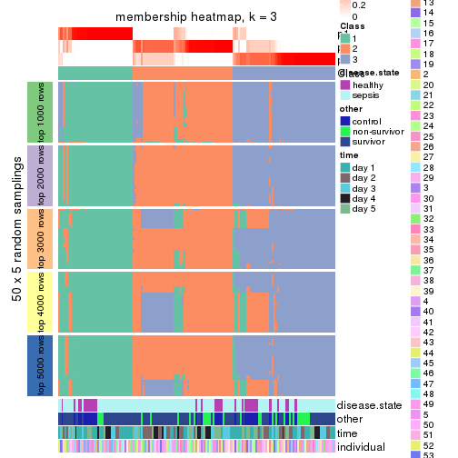</p>

</div>
<div id='tab-CV-pam-membership-heatmap-3'>
<pre><code class="r">membership_heatmap(res, k = 4)
</code></pre>

<p></p>

</div>
<div id='tab-CV-pam-membership-heatmap-4'>
<pre><code class="r">membership_heatmap(res, k = 5)
</code></pre>

<p></p>

</div>
<div id='tab-CV-pam-membership-heatmap-5'>
<pre><code class="r">membership_heatmap(res, k = 6)
</code></pre>

<p></p>

</div>
</div>

As soon as we have had the classes for columns, we can look for signatures
which are significantly different between classes which can be candidate marks
for certain classes. Following are the heatmaps for signatures.


Signature heatmaps where rows are scaled:


<script>
$( function() {
	$( '#tabs-CV-pam-get-signatures' ).tabs();
} );
</script>
<div id='tabs-CV-pam-get-signatures'>
<ul>
<li><a href='#tab-CV-pam-get-signatures-1'>k = 2</a></li>
<li><a href='#tab-CV-pam-get-signatures-2'>k = 3</a></li>
<li><a href='#tab-CV-pam-get-signatures-3'>k = 4</a></li>
<li><a href='#tab-CV-pam-get-signatures-4'>k = 5</a></li>
<li><a href='#tab-CV-pam-get-signatures-5'>k = 6</a></li>
</ul>
<div id='tab-CV-pam-get-signatures-1'>
<pre><code class="r">get_signatures(res, k = 2)
</code></pre>

<p></p>

</div>
<div id='tab-CV-pam-get-signatures-2'>
<pre><code class="r">get_signatures(res, k = 3)
</code></pre>

<p></p>

</div>
<div id='tab-CV-pam-get-signatures-3'>
<pre><code class="r">get_signatures(res, k = 4)
</code></pre>

<p></p>

</div>
<div id='tab-CV-pam-get-signatures-4'>
<pre><code class="r">get_signatures(res, k = 5)
</code></pre>

<p></p>

</div>
<div id='tab-CV-pam-get-signatures-5'>
<pre><code class="r">get_signatures(res, k = 6)
</code></pre>

<p>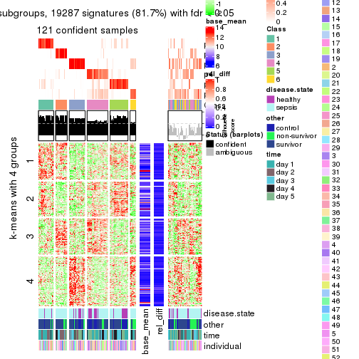</p>

</div>
</div>


Signature heatmaps where rows are not scaled:


<script>
$( function() {
	$( '#tabs-CV-pam-get-signatures-no-scale' ).tabs();
} );
</script>
<div id='tabs-CV-pam-get-signatures-no-scale'>
<ul>
<li><a href='#tab-CV-pam-get-signatures-no-scale-1'>k = 2</a></li>
<li><a href='#tab-CV-pam-get-signatures-no-scale-2'>k = 3</a></li>
<li><a href='#tab-CV-pam-get-signatures-no-scale-3'>k = 4</a></li>
<li><a href='#tab-CV-pam-get-signatures-no-scale-4'>k = 5</a></li>
<li><a href='#tab-CV-pam-get-signatures-no-scale-5'>k = 6</a></li>
</ul>
<div id='tab-CV-pam-get-signatures-no-scale-1'>
<pre><code class="r">get_signatures(res, k = 2, scale_rows = FALSE)
</code></pre>

<p></p>

</div>
<div id='tab-CV-pam-get-signatures-no-scale-2'>
<pre><code class="r">get_signatures(res, k = 3, scale_rows = FALSE)
</code></pre>

<p></p>

</div>
<div id='tab-CV-pam-get-signatures-no-scale-3'>
<pre><code class="r">get_signatures(res, k = 4, scale_rows = FALSE)
</code></pre>

<p></p>

</div>
<div id='tab-CV-pam-get-signatures-no-scale-4'>
<pre><code class="r">get_signatures(res, k = 5, scale_rows = FALSE)
</code></pre>

<p></p>

</div>
<div id='tab-CV-pam-get-signatures-no-scale-5'>
<pre><code class="r">get_signatures(res, k = 6, scale_rows = FALSE)
</code></pre>

<p></p>

</div>
</div>


Compare the overlap of signatures from different k:

```r
compare_signatures(res)
```


`get_signature()` returns a data frame invisibly. TO get the list of signatures, the function
call should be assigned to a variable explicitly. In following code, if `plot` argument is set
to `FALSE`, no heatmap is plotted while only the differential analysis is performed.

```r
# code only for demonstration
tb = get_signature(res, k = ..., plot = FALSE)
```

An example of the output of `tb` is:

```
#>   which_row         fdr    mean_1    mean_2 scaled_mean_1 scaled_mean_2 km
#> 1        38 0.042760348  8.373488  9.131774    -0.5533452     0.5164555  1
#> 2        40 0.018707592  7.106213  8.469186    -0.6173731     0.5762149  1
#> 3        55 0.019134737 10.221463 11.207825    -0.6159697     0.5749050  1
#> 4        59 0.006059896  5.921854  7.869574    -0.6899429     0.6439467  1
#> 5        60 0.018055526  8.928898 10.211722    -0.6204761     0.5791110  1
#> 6        98 0.009384629 15.714769 14.887706     0.6635654    -0.6193277  2
...
```

The columns in `tb` are:

1. `which_row`: row indices corresponding to the input matrix.
2. `fdr`: FDR for the differential test. 
3. `mean_x`: The mean value in group x.
4. `scaled_mean_x`: The mean value in group x after rows are scaled.
5. `km`: Row groups if k-means clustering is applied to rows.


UMAP plot which shows how samples are separated.


<script>
$( function() {
	$( '#tabs-CV-pam-dimension-reduction' ).tabs();
} );
</script>
<div id='tabs-CV-pam-dimension-reduction'>
<ul>
<li><a href='#tab-CV-pam-dimension-reduction-1'>k = 2</a></li>
<li><a href='#tab-CV-pam-dimension-reduction-2'>k = 3</a></li>
<li><a href='#tab-CV-pam-dimension-reduction-3'>k = 4</a></li>
<li><a href='#tab-CV-pam-dimension-reduction-4'>k = 5</a></li>
<li><a href='#tab-CV-pam-dimension-reduction-5'>k = 6</a></li>
</ul>
<div id='tab-CV-pam-dimension-reduction-1'>
<pre><code class="r">dimension_reduction(res, k = 2, method = &quot;UMAP&quot;)
</code></pre>

<p></p>

</div>
<div id='tab-CV-pam-dimension-reduction-2'>
<pre><code class="r">dimension_reduction(res, k = 3, method = &quot;UMAP&quot;)
</code></pre>

<p></p>

</div>
<div id='tab-CV-pam-dimension-reduction-3'>
<pre><code class="r">dimension_reduction(res, k = 4, method = &quot;UMAP&quot;)
</code></pre>

<p></p>

</div>
<div id='tab-CV-pam-dimension-reduction-4'>
<pre><code class="r">dimension_reduction(res, k = 5, method = &quot;UMAP&quot;)
</code></pre>

<p></p>

</div>
<div id='tab-CV-pam-dimension-reduction-5'>
<pre><code class="r">dimension_reduction(res, k = 6, method = &quot;UMAP&quot;)
</code></pre>

<p></p>

</div>
</div>


Following heatmap shows how subgroups are split when increasing `k`:

```r
collect_classes(res)
```


Test correlation between subgroups and known annotations. If the known
annotation is numeric, one-way ANOVA test is applied, and if the known
annotation is discrete, chi-squared contingency table test is applied.

```r
test_to_known_factors(res)
```

```
#>          n disease.state(p) other(p)  time(p) individual(p) k
#> CV:pam 160         0.212897 5.18e-02 0.010079         0.406 2
#> CV:pam 150         0.118437 5.83e-02 0.035260         0.611 3
#> CV:pam 149         0.010991 3.52e-03 0.002945         0.389 4
#> CV:pam 142         0.000573 8.18e-04 0.001220         0.320 5
#> CV:pam 121         0.011398 5.78e-05 0.000244         0.400 6
```


If matrix rows can be associated to genes, consider to use `functional_enrichment(res,
...)` to perform function enrichment for the signature genes. See [this vignette](http://bioconductor.org/packages/devel/bioc/vignettes/cola/inst/doc/functional_enrichment.html) for more detailed explanations.


 

---------------------------------------------------


### CV:mclust*


The object with results only for a single top-value method and a single partition method 
can be extracted as:

```r
res = res_list["CV", "mclust"]
# you can also extract it by
# res = res_list["CV:mclust"]
```

A summary of `res` and all the functions that can be applied to it:

```r
res
```

```
#> A 'ConsensusPartition' object with k = 2, 3, 4, 5, 6.
#>   On a matrix with 23598 rows and 163 columns.
#>   Top rows (1000, 2000, 3000, 4000, 5000) are extracted by 'CV' method.
#>   Subgroups are detected by 'mclust' method.
#>   Performed in total 1250 partitions by row resampling.
#>   Best k for subgroups seems to be 3.
#> 
#> Following methods can be applied to this 'ConsensusPartition' object:
#>  [1] "cola_report"             "collect_classes"         "collect_plots"          
#>  [4] "collect_stats"           "colnames"                "compare_signatures"     
#>  [7] "consensus_heatmap"       "dimension_reduction"     "functional_enrichment"  
#> [10] "get_anno_col"            "get_anno"                "get_classes"            
#> [13] "get_consensus"           "get_matrix"              "get_membership"         
#> [16] "get_param"               "get_signatures"          "get_stats"              
#> [19] "is_best_k"               "is_stable_k"             "membership_heatmap"     
#> [22] "ncol"                    "nrow"                    "plot_ecdf"              
#> [25] "rownames"                "select_partition_number" "show"                   
#> [28] "suggest_best_k"          "test_to_known_factors"
```

`collect_plots()` function collects all the plots made from `res` for all `k` (number of partitions)
into one single page to provide an easy and fast comparison between different `k`.

```r
collect_plots(res)
```


The plots are:

- The first row: a plot of the ECDF (empirical cumulative distribution
  function) curves of the consensus matrix for each `k` and the heatmap of
  predicted classes for each `k`.
- The second row: heatmaps of the consensus matrix for each `k`.
- The third row: heatmaps of the membership matrix for each `k`.
- The fouth row: heatmaps of the signatures for each `k`.

All the plots in panels can be made by individual functions and they are
plotted later in this section.

`select_partition_number()` produces several plots showing different
statistics for choosing "optimized" `k`. There are following statistics:

- ECDF curves of the consensus matrix for each `k`;
- 1-PAC. [The PAC
  score](https://en.wikipedia.org/wiki/Consensus_clustering#Over-interpretation_potential_of_consensus_clustering)
  measures the proportion of the ambiguous subgrouping.
- Mean silhouette score.
- Concordance. The mean probability of fiting the consensus class ids in all
  partitions.
- Area increased. Denote $A_k$ as the area under the ECDF curve for current
  `k`, the area increased is defined as $A_k - A_{k-1}$.
- Rand index. The percent of pairs of samples that are both in a same cluster
  or both are not in a same cluster in the partition of k and k-1.
- Jaccard index. The ratio of pairs of samples are both in a same cluster in
  the partition of k and k-1 and the pairs of samples are both in a same
  cluster in the partition k or k-1.

The detailed explanations of these statistics can be found in [the _cola_
vignette](http://bioconductor.org/packages/devel/bioc/vignettes/cola/inst/doc/cola.html#toc_13).

Generally speaking, lower PAC score, higher mean silhouette score or higher
concordance corresponds to better partition. Rand index and Jaccard index
measure how similar the current partition is compared to partition with `k-1`.
If they are too similar, we won't accept `k` is better than `k-1`.

```r
select_partition_number(res)
```


The numeric values for all these statistics can be obtained by `get_stats()`.

```r
get_stats(res)
```

```
#>   k 1-PAC mean_silhouette concordance area_increased  Rand Jaccard
#> 2 2 0.185           0.653       0.722         0.3592 0.572   0.572
#> 3 3 0.906           0.926       0.967         0.8561 0.677   0.474
#> 4 4 0.732           0.726       0.824         0.0737 0.870   0.648
#> 5 5 0.677           0.701       0.801         0.0852 0.887   0.626
#> 6 6 0.728           0.713       0.820         0.0577 0.879   0.520
```

`suggest_best_k()` suggests the best $k$ based on these statistics. The rules are as follows:

- All $k$ with Jaccard index larger than 0.95 are removed because increasing
  $k$ does not provide enough extra information. If all $k$ are removed, it is
  marked as no subgroup is detected.
- For all $k$ with 1-PAC score larger than 0.9, the maximal $k$ is taken as
  the best $k$, and other $k$ are marked as optional $k$.
- If it does not fit the second rule. The $k$ with the maximal vote of the
  highest 1-PAC score, highest mean silhouette, and highest concordance is
  taken as the best $k$.

```r
suggest_best_k(res)
```

```
#> [1] 3
```


Following shows the table of the partitions (You need to click the **show/hide
code output** link to see it). The membership matrix (columns with name `p*`)
is inferred by
[`clue::cl_consensus()`](https://www.rdocumentation.org/link/cl_consensus?package=clue)
function with the `SE` method. Basically the value in the membership matrix
represents the probability to belong to a certain group. The finall class
label for an item is determined with the group with highest probability it
belongs to.

In `get_classes()` function, the entropy is calculated from the membership
matrix and the silhouette score is calculated from the consensus matrix.


<script>
$( function() {
	$( '#tabs-CV-mclust-get-classes' ).tabs();
} );
</script>
<div id='tabs-CV-mclust-get-classes'>
<ul>
<li><a href='#tab-CV-mclust-get-classes-1'>k = 2</a></li>
<li><a href='#tab-CV-mclust-get-classes-2'>k = 3</a></li>
<li><a href='#tab-CV-mclust-get-classes-3'>k = 4</a></li>
<li><a href='#tab-CV-mclust-get-classes-4'>k = 5</a></li>
<li><a href='#tab-CV-mclust-get-classes-5'>k = 6</a></li>
</ul>

<div id='tab-CV-mclust-get-classes-1'>
<p><a id='tab-CV-mclust-get-classes-1-a' style='color:#0366d6' href='#'>show/hide code output</a></p>
<pre><code class="r">cbind(get_classes(res, k = 2), get_membership(res, k = 2))
</code></pre>

<pre><code>#&gt;            class entropy silhouette    p1    p2
#&gt; GSM1317945     1  0.9993     -0.461 0.516 0.484
#&gt; GSM1317946     2  0.9933      0.503 0.452 0.548
#&gt; GSM1317947     1  0.0376      0.651 0.996 0.004
#&gt; GSM1317948     1  0.7950      0.660 0.760 0.240
#&gt; GSM1317949     1  0.7674      0.670 0.776 0.224
#&gt; GSM1317950     1  0.9286      0.659 0.656 0.344
#&gt; GSM1317953     1  0.9286      0.659 0.656 0.344
#&gt; GSM1317954     1  0.9286      0.659 0.656 0.344
#&gt; GSM1317955     1  0.9044      0.666 0.680 0.320
#&gt; GSM1317956     1  0.9286      0.659 0.656 0.344
#&gt; GSM1317957     2  0.8813      0.838 0.300 0.700
#&gt; GSM1317958     1  0.9248      0.661 0.660 0.340
#&gt; GSM1317959     2  0.9963      0.506 0.464 0.536
#&gt; GSM1317960     1  0.7883      0.663 0.764 0.236
#&gt; GSM1317961     1  0.0000      0.653 1.000 0.000
#&gt; GSM1317962     1  0.8499      0.610 0.724 0.276
#&gt; GSM1317963     1  0.7950      0.660 0.760 0.240
#&gt; GSM1317964     1  0.9286      0.659 0.656 0.344
#&gt; GSM1317965     1  0.0376      0.651 0.996 0.004
#&gt; GSM1317966     1  0.0000      0.653 1.000 0.000
#&gt; GSM1317967     2  0.9970      0.501 0.468 0.532
#&gt; GSM1317968     1  0.9209      0.662 0.664 0.336
#&gt; GSM1317969     1  0.5737      0.638 0.864 0.136
#&gt; GSM1317970     2  0.8713      0.838 0.292 0.708
#&gt; GSM1317952     1  0.7883      0.663 0.764 0.236
#&gt; GSM1317951     1  0.9044      0.666 0.680 0.320
#&gt; GSM1317971     1  0.3274      0.584 0.940 0.060
#&gt; GSM1317972     2  0.9988      0.388 0.480 0.520
#&gt; GSM1317973     2  0.8763      0.839 0.296 0.704
#&gt; GSM1317974     2  0.9427      0.751 0.360 0.640
#&gt; GSM1317975     2  0.9608      0.825 0.384 0.616
#&gt; GSM1317978     1  0.9129      0.664 0.672 0.328
#&gt; GSM1317979     1  0.7950      0.660 0.760 0.240
#&gt; GSM1317980     1  0.2423      0.663 0.960 0.040
#&gt; GSM1317981     2  0.9608      0.825 0.384 0.616
#&gt; GSM1317982     1  0.8016      0.656 0.756 0.244
#&gt; GSM1317983     1  0.9286      0.659 0.656 0.344
#&gt; GSM1317984     1  0.6801      0.469 0.820 0.180
#&gt; GSM1317985     1  0.7056      0.456 0.808 0.192
#&gt; GSM1317986     1  0.9286      0.659 0.656 0.344
#&gt; GSM1317987     2  0.9608      0.825 0.384 0.616
#&gt; GSM1317988     2  0.8713      0.838 0.292 0.708
#&gt; GSM1317989     1  0.7950      0.660 0.760 0.240
#&gt; GSM1317990     2  0.9608      0.825 0.384 0.616
#&gt; GSM1317991     1  0.0376      0.651 0.996 0.004
#&gt; GSM1317992     2  0.9933      0.758 0.452 0.548
#&gt; GSM1317993     2  0.9608      0.825 0.384 0.616
#&gt; GSM1317994     1  0.6438      0.486 0.836 0.164
#&gt; GSM1317977     1  0.7883      0.663 0.764 0.236
#&gt; GSM1317976     1  0.8016      0.657 0.756 0.244
#&gt; GSM1317995     1  0.7056      0.456 0.808 0.192
#&gt; GSM1317996     2  0.8713      0.838 0.292 0.708
#&gt; GSM1317997     1  0.7056      0.456 0.808 0.192
#&gt; GSM1317998     1  0.9248      0.661 0.660 0.340
#&gt; GSM1317999     1  0.9209      0.664 0.664 0.336
#&gt; GSM1318002     2  0.9635      0.824 0.388 0.612
#&gt; GSM1318003     2  0.9635      0.824 0.388 0.612
#&gt; GSM1318004     2  0.9963      0.506 0.464 0.536
#&gt; GSM1318005     2  0.9209      0.795 0.336 0.664
#&gt; GSM1318006     1  0.9248      0.661 0.660 0.340
#&gt; GSM1318007     1  0.9922     -0.113 0.552 0.448
#&gt; GSM1318008     1  0.9248      0.661 0.660 0.340
#&gt; GSM1318009     2  0.8713      0.838 0.292 0.708
#&gt; GSM1318010     1  0.7056      0.456 0.808 0.192
#&gt; GSM1318011     1  0.8443      0.671 0.728 0.272
#&gt; GSM1318012     1  0.7883      0.663 0.764 0.236
#&gt; GSM1318013     2  0.9970      0.501 0.468 0.532
#&gt; GSM1318014     1  0.9129      0.667 0.672 0.328
#&gt; GSM1318015     2  0.9635      0.824 0.388 0.612
#&gt; GSM1318001     1  0.7056      0.456 0.808 0.192
#&gt; GSM1318000     2  0.8713      0.838 0.292 0.708
#&gt; GSM1318016     2  0.9608      0.825 0.384 0.616
#&gt; GSM1318017     1  0.9286      0.659 0.656 0.344
#&gt; GSM1318019     2  0.8713      0.838 0.292 0.708
#&gt; GSM1318020     1  0.0376      0.651 0.996 0.004
#&gt; GSM1318021     2  0.9608      0.825 0.384 0.616
#&gt; GSM1318022     1  0.0376      0.651 0.996 0.004
#&gt; GSM1318023     1  0.9286      0.659 0.656 0.344
#&gt; GSM1318024     2  0.9608      0.825 0.384 0.616
#&gt; GSM1318025     1  0.0376      0.651 0.996 0.004
#&gt; GSM1318026     2  0.9661      0.820 0.392 0.608
#&gt; GSM1318027     2  0.8713      0.838 0.292 0.708
#&gt; GSM1318028     1  0.8861      0.669 0.696 0.304
#&gt; GSM1318029     1  0.0000      0.653 1.000 0.000
#&gt; GSM1318018     1  0.9248      0.661 0.660 0.340
#&gt; GSM1318030     1  0.8016      0.656 0.756 0.244
#&gt; GSM1318031     1  0.0672      0.649 0.992 0.008
#&gt; GSM1318033     1  0.8661      0.669 0.712 0.288
#&gt; GSM1318034     1  0.0376      0.651 0.996 0.004
#&gt; GSM1318035     2  0.9608      0.825 0.384 0.616
#&gt; GSM1318036     1  0.8081      0.653 0.752 0.248
#&gt; GSM1318037     1  0.8016      0.656 0.756 0.244
#&gt; GSM1318038     1  0.0000      0.653 1.000 0.000
#&gt; GSM1318039     1  0.9286      0.659 0.656 0.344
#&gt; GSM1318040     1  0.1843      0.629 0.972 0.028
#&gt; GSM1318032     1  0.1633      0.633 0.976 0.024
#&gt; GSM1317914     1  0.0938      0.645 0.988 0.012
#&gt; GSM1317915     1  0.9286      0.659 0.656 0.344
#&gt; GSM1317916     1  0.9248      0.661 0.660 0.340
#&gt; GSM1317917     1  0.3114      0.658 0.944 0.056
#&gt; GSM1317918     1  0.9286      0.659 0.656 0.344
#&gt; GSM1317919     1  0.0376      0.651 0.996 0.004
#&gt; GSM1317920     1  0.0000      0.653 1.000 0.000
#&gt; GSM1317921     1  0.0376      0.651 0.996 0.004
#&gt; GSM1317922     1  0.0000      0.653 1.000 0.000
#&gt; GSM1317923     1  0.0376      0.651 0.996 0.004
#&gt; GSM1317924     1  0.0672      0.649 0.992 0.008
#&gt; GSM1317925     2  0.9608      0.825 0.384 0.616
#&gt; GSM1317926     1  0.0000      0.653 1.000 0.000
#&gt; GSM1317927     2  0.9608      0.825 0.384 0.616
#&gt; GSM1317928     1  0.3879      0.556 0.924 0.076
#&gt; GSM1317929     1  0.0376      0.651 0.996 0.004
#&gt; GSM1317930     2  0.9635      0.824 0.388 0.612
#&gt; GSM1317931     1  0.0376      0.651 0.996 0.004
#&gt; GSM1317932     1  0.7219      0.500 0.800 0.200
#&gt; GSM1317933     2  0.9608      0.825 0.384 0.616
#&gt; GSM1317934     1  0.7528      0.488 0.784 0.216
#&gt; GSM1317935     1  0.0000      0.653 1.000 0.000
#&gt; GSM1317936     1  0.7056      0.456 0.808 0.192
#&gt; GSM1317937     1  0.9286      0.659 0.656 0.344
#&gt; GSM1317938     2  0.8713      0.838 0.292 0.708
#&gt; GSM1317939     2  0.9580      0.827 0.380 0.620
#&gt; GSM1317940     1  0.8144      0.680 0.748 0.252
#&gt; GSM1317941     2  0.8713      0.838 0.292 0.708
#&gt; GSM1317942     2  0.8661      0.835 0.288 0.712
#&gt; GSM1317943     2  0.8955      0.838 0.312 0.688
#&gt; GSM1317944     2  0.9608      0.825 0.384 0.616
#&gt; GSM1317896     1  0.7056      0.456 0.808 0.192
#&gt; GSM1317897     1  0.9286      0.659 0.656 0.344
#&gt; GSM1317898     1  0.7883      0.663 0.764 0.236
#&gt; GSM1317899     1  0.7950      0.660 0.760 0.240
#&gt; GSM1317900     1  0.0376      0.651 0.996 0.004
#&gt; GSM1317901     1  0.9129      0.667 0.672 0.328
#&gt; GSM1317902     1  0.9248      0.661 0.660 0.340
#&gt; GSM1317903     1  0.9248      0.661 0.660 0.340
#&gt; GSM1317904     2  0.8713      0.838 0.292 0.708
#&gt; GSM1317905     1  0.8207      0.456 0.744 0.256
#&gt; GSM1317906     1  0.9754     -0.387 0.592 0.408
#&gt; GSM1317907     1  0.8016      0.656 0.756 0.244
#&gt; GSM1317908     1  0.0376      0.651 0.996 0.004
#&gt; GSM1317909     1  0.7453      0.673 0.788 0.212
#&gt; GSM1317910     1  0.7453      0.674 0.788 0.212
#&gt; GSM1317911     1  0.9248      0.661 0.660 0.340
#&gt; GSM1317912     1  0.8016      0.656 0.756 0.244
#&gt; GSM1317913     2  0.9970      0.501 0.468 0.532
#&gt; GSM1318041     1  0.7815      0.666 0.768 0.232
#&gt; GSM1318042     1  0.0376      0.651 0.996 0.004
#&gt; GSM1318043     1  0.6973      0.460 0.812 0.188
#&gt; GSM1318044     1  0.9286      0.659 0.656 0.344
#&gt; GSM1318045     1  0.9248      0.661 0.660 0.340
#&gt; GSM1318046     1  0.9286      0.659 0.656 0.344
#&gt; GSM1318047     1  0.7883      0.663 0.764 0.236
#&gt; GSM1318048     1  0.0672      0.653 0.992 0.008
#&gt; GSM1318049     1  0.8081      0.677 0.752 0.248
#&gt; GSM1318050     2  0.8713      0.838 0.292 0.708
#&gt; GSM1318051     2  0.8713      0.838 0.292 0.708
#&gt; GSM1318052     2  0.8713      0.838 0.292 0.708
#&gt; GSM1318053     2  0.8713      0.838 0.292 0.708
#&gt; GSM1318054     2  0.9970      0.501 0.468 0.532
#&gt; GSM1318055     1  0.0672      0.649 0.992 0.008
#&gt; GSM1318056     2  0.9970      0.501 0.468 0.532
#&gt; GSM1318057     2  0.9087      0.814 0.324 0.676
#&gt; GSM1318058     1  0.9710      0.144 0.600 0.400
</code></pre>

<script>
$('#tab-CV-mclust-get-classes-1-a').parent().next().next().hide();
$('#tab-CV-mclust-get-classes-1-a').click(function(){
  $('#tab-CV-mclust-get-classes-1-a').parent().next().next().toggle();
  return(false);
});
</script>
</div>

<div id='tab-CV-mclust-get-classes-2'>
<p><a id='tab-CV-mclust-get-classes-2-a' style='color:#0366d6' href='#'>show/hide code output</a></p>
<pre><code class="r">cbind(get_classes(res, k = 3), get_membership(res, k = 3))
</code></pre>

<pre><code>#&gt;            class entropy silhouette    p1    p2    p3
#&gt; GSM1317945     2  0.2982     0.9004 0.024 0.920 0.056
#&gt; GSM1317946     2  0.4842     0.7417 0.224 0.776 0.000
#&gt; GSM1317947     3  0.1643     0.9366 0.044 0.000 0.956
#&gt; GSM1317948     1  0.0592     0.9666 0.988 0.000 0.012
#&gt; GSM1317949     1  0.0000     0.9761 1.000 0.000 0.000
#&gt; GSM1317950     1  0.0000     0.9761 1.000 0.000 0.000
#&gt; GSM1317953     1  0.0000     0.9761 1.000 0.000 0.000
#&gt; GSM1317954     1  0.0000     0.9761 1.000 0.000 0.000
#&gt; GSM1317955     1  0.0000     0.9761 1.000 0.000 0.000
#&gt; GSM1317956     1  0.0000     0.9761 1.000 0.000 0.000
#&gt; GSM1317957     2  0.0000     0.9465 0.000 1.000 0.000
#&gt; GSM1317958     1  0.0000     0.9761 1.000 0.000 0.000
#&gt; GSM1317959     2  0.0592     0.9415 0.000 0.988 0.012
#&gt; GSM1317960     1  0.0592     0.9666 0.988 0.000 0.012
#&gt; GSM1317961     3  0.0000     0.9771 0.000 0.000 1.000
#&gt; GSM1317962     2  0.4842     0.7426 0.224 0.776 0.000
#&gt; GSM1317963     1  0.0000     0.9761 1.000 0.000 0.000
#&gt; GSM1317964     1  0.0000     0.9761 1.000 0.000 0.000
#&gt; GSM1317965     3  0.0000     0.9771 0.000 0.000 1.000
#&gt; GSM1317966     3  0.0000     0.9771 0.000 0.000 1.000
#&gt; GSM1317967     2  0.0592     0.9415 0.000 0.988 0.012
#&gt; GSM1317968     1  0.0000     0.9761 1.000 0.000 0.000
#&gt; GSM1317969     3  0.5988     0.3776 0.000 0.368 0.632
#&gt; GSM1317970     2  0.0000     0.9465 0.000 1.000 0.000
#&gt; GSM1317952     1  0.0592     0.9666 0.988 0.000 0.012
#&gt; GSM1317951     1  0.0000     0.9761 1.000 0.000 0.000
#&gt; GSM1317971     3  0.0000     0.9771 0.000 0.000 1.000
#&gt; GSM1317972     2  0.6154     0.3753 0.408 0.592 0.000
#&gt; GSM1317973     2  0.0000     0.9465 0.000 1.000 0.000
#&gt; GSM1317974     2  0.4178     0.8053 0.172 0.828 0.000
#&gt; GSM1317975     2  0.0000     0.9465 0.000 1.000 0.000
#&gt; GSM1317978     1  0.0000     0.9761 1.000 0.000 0.000
#&gt; GSM1317979     1  0.6307     0.0505 0.512 0.000 0.488
#&gt; GSM1317980     3  0.3941     0.8027 0.156 0.000 0.844
#&gt; GSM1317981     2  0.0000     0.9465 0.000 1.000 0.000
#&gt; GSM1317982     2  0.9353     0.1344 0.168 0.444 0.388
#&gt; GSM1317983     1  0.0000     0.9761 1.000 0.000 0.000
#&gt; GSM1317984     3  0.0000     0.9771 0.000 0.000 1.000
#&gt; GSM1317985     3  0.0000     0.9771 0.000 0.000 1.000
#&gt; GSM1317986     1  0.0000     0.9761 1.000 0.000 0.000
#&gt; GSM1317987     2  0.0000     0.9465 0.000 1.000 0.000
#&gt; GSM1317988     2  0.0000     0.9465 0.000 1.000 0.000
#&gt; GSM1317989     1  0.0592     0.9666 0.988 0.000 0.012
#&gt; GSM1317990     2  0.0000     0.9465 0.000 1.000 0.000
#&gt; GSM1317991     3  0.0000     0.9771 0.000 0.000 1.000
#&gt; GSM1317992     2  0.3340     0.8527 0.000 0.880 0.120
#&gt; GSM1317993     2  0.0000     0.9465 0.000 1.000 0.000
#&gt; GSM1317994     3  0.0000     0.9771 0.000 0.000 1.000
#&gt; GSM1317977     1  0.0424     0.9700 0.992 0.000 0.008
#&gt; GSM1317976     1  0.0000     0.9761 1.000 0.000 0.000
#&gt; GSM1317995     3  0.0000     0.9771 0.000 0.000 1.000
#&gt; GSM1317996     2  0.0000     0.9465 0.000 1.000 0.000
#&gt; GSM1317997     3  0.0000     0.9771 0.000 0.000 1.000
#&gt; GSM1317998     1  0.0000     0.9761 1.000 0.000 0.000
#&gt; GSM1317999     1  0.0000     0.9761 1.000 0.000 0.000
#&gt; GSM1318002     2  0.0000     0.9465 0.000 1.000 0.000
#&gt; GSM1318003     2  0.0000     0.9465 0.000 1.000 0.000
#&gt; GSM1318004     2  0.3845     0.8551 0.116 0.872 0.012
#&gt; GSM1318005     2  0.0000     0.9465 0.000 1.000 0.000
#&gt; GSM1318006     1  0.0000     0.9761 1.000 0.000 0.000
#&gt; GSM1318007     2  0.4805     0.7940 0.176 0.812 0.012
#&gt; GSM1318008     1  0.0000     0.9761 1.000 0.000 0.000
#&gt; GSM1318009     2  0.0000     0.9465 0.000 1.000 0.000
#&gt; GSM1318010     3  0.0000     0.9771 0.000 0.000 1.000
#&gt; GSM1318011     1  0.0000     0.9761 1.000 0.000 0.000
#&gt; GSM1318012     1  0.0000     0.9761 1.000 0.000 0.000
#&gt; GSM1318013     2  0.0592     0.9415 0.000 0.988 0.012
#&gt; GSM1318014     1  0.0000     0.9761 1.000 0.000 0.000
#&gt; GSM1318015     2  0.0000     0.9465 0.000 1.000 0.000
#&gt; GSM1318001     3  0.0000     0.9771 0.000 0.000 1.000
#&gt; GSM1318000     2  0.0000     0.9465 0.000 1.000 0.000
#&gt; GSM1318016     2  0.0000     0.9465 0.000 1.000 0.000
#&gt; GSM1318017     1  0.0000     0.9761 1.000 0.000 0.000
#&gt; GSM1318019     2  0.0000     0.9465 0.000 1.000 0.000
#&gt; GSM1318020     3  0.0000     0.9771 0.000 0.000 1.000
#&gt; GSM1318021     2  0.0000     0.9465 0.000 1.000 0.000
#&gt; GSM1318022     3  0.0000     0.9771 0.000 0.000 1.000
#&gt; GSM1318023     1  0.0000     0.9761 1.000 0.000 0.000
#&gt; GSM1318024     2  0.0000     0.9465 0.000 1.000 0.000
#&gt; GSM1318025     3  0.0000     0.9771 0.000 0.000 1.000
#&gt; GSM1318026     2  0.0592     0.9415 0.000 0.988 0.012
#&gt; GSM1318027     2  0.0000     0.9465 0.000 1.000 0.000
#&gt; GSM1318028     1  0.0000     0.9761 1.000 0.000 0.000
#&gt; GSM1318029     3  0.0000     0.9771 0.000 0.000 1.000
#&gt; GSM1318018     1  0.0000     0.9761 1.000 0.000 0.000
#&gt; GSM1318030     2  0.5236     0.7935 0.168 0.804 0.028
#&gt; GSM1318031     3  0.0000     0.9771 0.000 0.000 1.000
#&gt; GSM1318033     1  0.0000     0.9761 1.000 0.000 0.000
#&gt; GSM1318034     3  0.0000     0.9771 0.000 0.000 1.000
#&gt; GSM1318035     2  0.0000     0.9465 0.000 1.000 0.000
#&gt; GSM1318036     1  0.4409     0.7642 0.824 0.172 0.004
#&gt; GSM1318037     2  0.4805     0.7940 0.176 0.812 0.012
#&gt; GSM1318038     3  0.0000     0.9771 0.000 0.000 1.000
#&gt; GSM1318039     1  0.0000     0.9761 1.000 0.000 0.000
#&gt; GSM1318040     3  0.0000     0.9771 0.000 0.000 1.000
#&gt; GSM1318032     3  0.0000     0.9771 0.000 0.000 1.000
#&gt; GSM1317914     3  0.0000     0.9771 0.000 0.000 1.000
#&gt; GSM1317915     1  0.0000     0.9761 1.000 0.000 0.000
#&gt; GSM1317916     1  0.0000     0.9761 1.000 0.000 0.000
#&gt; GSM1317917     3  0.0000     0.9771 0.000 0.000 1.000
#&gt; GSM1317918     1  0.0000     0.9761 1.000 0.000 0.000
#&gt; GSM1317919     3  0.0000     0.9771 0.000 0.000 1.000
#&gt; GSM1317920     3  0.0000     0.9771 0.000 0.000 1.000
#&gt; GSM1317921     3  0.0000     0.9771 0.000 0.000 1.000
#&gt; GSM1317922     3  0.0000     0.9771 0.000 0.000 1.000
#&gt; GSM1317923     3  0.0000     0.9771 0.000 0.000 1.000
#&gt; GSM1317924     3  0.0000     0.9771 0.000 0.000 1.000
#&gt; GSM1317925     2  0.0000     0.9465 0.000 1.000 0.000
#&gt; GSM1317926     3  0.0000     0.9771 0.000 0.000 1.000
#&gt; GSM1317927     2  0.0000     0.9465 0.000 1.000 0.000
#&gt; GSM1317928     3  0.0000     0.9771 0.000 0.000 1.000
#&gt; GSM1317929     3  0.0000     0.9771 0.000 0.000 1.000
#&gt; GSM1317930     2  0.0000     0.9465 0.000 1.000 0.000
#&gt; GSM1317931     3  0.0000     0.9771 0.000 0.000 1.000
#&gt; GSM1317932     3  0.1643     0.9370 0.000 0.044 0.956
#&gt; GSM1317933     2  0.0000     0.9465 0.000 1.000 0.000
#&gt; GSM1317934     3  0.2537     0.8981 0.000 0.080 0.920
#&gt; GSM1317935     3  0.0000     0.9771 0.000 0.000 1.000
#&gt; GSM1317936     3  0.0000     0.9771 0.000 0.000 1.000
#&gt; GSM1317937     1  0.0000     0.9761 1.000 0.000 0.000
#&gt; GSM1317938     2  0.0000     0.9465 0.000 1.000 0.000
#&gt; GSM1317939     2  0.0000     0.9465 0.000 1.000 0.000
#&gt; GSM1317940     1  0.0424     0.9697 0.992 0.000 0.008
#&gt; GSM1317941     2  0.0000     0.9465 0.000 1.000 0.000
#&gt; GSM1317942     2  0.0000     0.9465 0.000 1.000 0.000
#&gt; GSM1317943     2  0.0000     0.9465 0.000 1.000 0.000
#&gt; GSM1317944     2  0.0000     0.9465 0.000 1.000 0.000
#&gt; GSM1317896     3  0.0000     0.9771 0.000 0.000 1.000
#&gt; GSM1317897     1  0.0000     0.9761 1.000 0.000 0.000
#&gt; GSM1317898     1  0.0000     0.9761 1.000 0.000 0.000
#&gt; GSM1317899     1  0.0000     0.9761 1.000 0.000 0.000
#&gt; GSM1317900     3  0.0000     0.9771 0.000 0.000 1.000
#&gt; GSM1317901     1  0.0000     0.9761 1.000 0.000 0.000
#&gt; GSM1317902     1  0.0000     0.9761 1.000 0.000 0.000
#&gt; GSM1317903     1  0.0000     0.9761 1.000 0.000 0.000
#&gt; GSM1317904     2  0.0000     0.9465 0.000 1.000 0.000
#&gt; GSM1317905     2  0.0892     0.9370 0.000 0.980 0.020
#&gt; GSM1317906     2  0.0892     0.9370 0.000 0.980 0.020
#&gt; GSM1317907     2  0.4979     0.7985 0.168 0.812 0.020
#&gt; GSM1317908     3  0.0000     0.9771 0.000 0.000 1.000
#&gt; GSM1317909     1  0.4750     0.7208 0.784 0.000 0.216
#&gt; GSM1317910     1  0.5254     0.6409 0.736 0.000 0.264
#&gt; GSM1317911     1  0.0000     0.9761 1.000 0.000 0.000
#&gt; GSM1317912     2  0.7514     0.5095 0.328 0.616 0.056
#&gt; GSM1317913     2  0.0829     0.9405 0.004 0.984 0.012
#&gt; GSM1318041     3  0.4178     0.7799 0.172 0.000 0.828
#&gt; GSM1318042     3  0.0000     0.9771 0.000 0.000 1.000
#&gt; GSM1318043     3  0.0000     0.9771 0.000 0.000 1.000
#&gt; GSM1318044     1  0.0000     0.9761 1.000 0.000 0.000
#&gt; GSM1318045     1  0.0000     0.9761 1.000 0.000 0.000
#&gt; GSM1318046     1  0.0000     0.9761 1.000 0.000 0.000
#&gt; GSM1318047     1  0.0000     0.9761 1.000 0.000 0.000
#&gt; GSM1318048     3  0.3482     0.8433 0.128 0.000 0.872
#&gt; GSM1318049     1  0.0424     0.9700 0.992 0.000 0.008
#&gt; GSM1318050     2  0.0000     0.9465 0.000 1.000 0.000
#&gt; GSM1318051     2  0.0000     0.9465 0.000 1.000 0.000
#&gt; GSM1318052     2  0.0000     0.9465 0.000 1.000 0.000
#&gt; GSM1318053     2  0.0000     0.9465 0.000 1.000 0.000
#&gt; GSM1318054     2  0.0747     0.9394 0.000 0.984 0.016
#&gt; GSM1318055     3  0.0000     0.9771 0.000 0.000 1.000
#&gt; GSM1318056     2  0.0592     0.9415 0.000 0.988 0.012
#&gt; GSM1318057     2  0.0424     0.9433 0.000 0.992 0.008
#&gt; GSM1318058     2  0.1289     0.9288 0.000 0.968 0.032
</code></pre>

<script>
$('#tab-CV-mclust-get-classes-2-a').parent().next().next().hide();
$('#tab-CV-mclust-get-classes-2-a').click(function(){
  $('#tab-CV-mclust-get-classes-2-a').parent().next().next().toggle();
  return(false);
});
</script>
</div>

<div id='tab-CV-mclust-get-classes-3'>
<p><a id='tab-CV-mclust-get-classes-3-a' style='color:#0366d6' href='#'>show/hide code output</a></p>
<pre><code class="r">cbind(get_classes(res, k = 4), get_membership(res, k = 4))
</code></pre>

<pre><code>#&gt;            class entropy silhouette    p1    p2    p3    p4
#&gt; GSM1317945     4  0.6726     0.6850 0.000 0.364 0.100 0.536
#&gt; GSM1317946     1  0.5596     0.4504 0.632 0.332 0.000 0.036
#&gt; GSM1317947     3  0.0672     0.9323 0.008 0.000 0.984 0.008
#&gt; GSM1317948     1  0.3933     0.6692 0.792 0.000 0.200 0.008
#&gt; GSM1317949     1  0.3307     0.8302 0.868 0.000 0.028 0.104
#&gt; GSM1317950     1  0.4123     0.8208 0.772 0.000 0.008 0.220
#&gt; GSM1317953     1  0.4567     0.8071 0.716 0.000 0.008 0.276
#&gt; GSM1317954     1  0.4746     0.7970 0.688 0.000 0.008 0.304
#&gt; GSM1317955     1  0.4857     0.7877 0.668 0.000 0.008 0.324
#&gt; GSM1317956     1  0.4621     0.8044 0.708 0.000 0.008 0.284
#&gt; GSM1317957     2  0.3569     0.4803 0.000 0.804 0.000 0.196
#&gt; GSM1317958     1  0.0188     0.8308 0.996 0.000 0.000 0.004
#&gt; GSM1317959     4  0.5633     0.8074 0.012 0.348 0.016 0.624
#&gt; GSM1317960     1  0.1452     0.8157 0.956 0.000 0.036 0.008
#&gt; GSM1317961     3  0.0336     0.9364 0.000 0.000 0.992 0.008
#&gt; GSM1317962     1  0.5530     0.4329 0.632 0.336 0.000 0.032
#&gt; GSM1317963     1  0.1798     0.8373 0.944 0.000 0.016 0.040
#&gt; GSM1317964     1  0.4857     0.7877 0.668 0.000 0.008 0.324
#&gt; GSM1317965     3  0.0336     0.9364 0.000 0.000 0.992 0.008
#&gt; GSM1317966     3  0.0336     0.9364 0.000 0.000 0.992 0.008
#&gt; GSM1317967     4  0.6058     0.7605 0.000 0.308 0.068 0.624
#&gt; GSM1317968     1  0.4228     0.8181 0.760 0.000 0.008 0.232
#&gt; GSM1317969     3  0.0817     0.9239 0.000 0.024 0.976 0.000
#&gt; GSM1317970     2  0.3528     0.4774 0.000 0.808 0.000 0.192
#&gt; GSM1317952     1  0.3893     0.6740 0.796 0.000 0.196 0.008
#&gt; GSM1317951     1  0.4857     0.7877 0.668 0.000 0.008 0.324
#&gt; GSM1317971     3  0.0592     0.9349 0.000 0.000 0.984 0.016
#&gt; GSM1317972     1  0.6576     0.6823 0.628 0.152 0.000 0.220
#&gt; GSM1317973     4  0.4817     0.8072 0.000 0.388 0.000 0.612
#&gt; GSM1317974     1  0.7517    -0.0780 0.428 0.388 0.000 0.184
#&gt; GSM1317975     2  0.1211     0.6533 0.000 0.960 0.000 0.040
#&gt; GSM1317978     1  0.4192     0.8233 0.780 0.004 0.008 0.208
#&gt; GSM1317979     3  0.4722     0.5616 0.300 0.000 0.692 0.008
#&gt; GSM1317980     3  0.0336     0.9349 0.000 0.000 0.992 0.008
#&gt; GSM1317981     2  0.1118     0.6571 0.000 0.964 0.000 0.036
#&gt; GSM1317982     3  0.3505     0.8178 0.000 0.048 0.864 0.088
#&gt; GSM1317983     1  0.4746     0.7969 0.688 0.000 0.008 0.304
#&gt; GSM1317984     3  0.0469     0.9345 0.000 0.000 0.988 0.012
#&gt; GSM1317985     3  0.0817     0.9313 0.000 0.000 0.976 0.024
#&gt; GSM1317986     1  0.4746     0.7969 0.688 0.000 0.008 0.304
#&gt; GSM1317987     2  0.1022     0.6602 0.000 0.968 0.000 0.032
#&gt; GSM1317988     4  0.4817     0.8072 0.000 0.388 0.000 0.612
#&gt; GSM1317989     1  0.3450     0.7266 0.836 0.000 0.156 0.008
#&gt; GSM1317990     2  0.0469     0.6720 0.000 0.988 0.000 0.012
#&gt; GSM1317991     3  0.0336     0.9364 0.000 0.000 0.992 0.008
#&gt; GSM1317992     2  0.6639     0.1780 0.000 0.596 0.284 0.120
#&gt; GSM1317993     2  0.0000     0.6763 0.000 1.000 0.000 0.000
#&gt; GSM1317994     3  0.0592     0.9335 0.000 0.000 0.984 0.016
#&gt; GSM1317977     1  0.1174     0.8226 0.968 0.000 0.020 0.012
#&gt; GSM1317976     1  0.4442     0.8168 0.752 0.004 0.008 0.236
#&gt; GSM1317995     3  0.0817     0.9313 0.000 0.000 0.976 0.024
#&gt; GSM1317996     2  0.3400     0.5216 0.000 0.820 0.000 0.180
#&gt; GSM1317997     3  0.0817     0.9313 0.000 0.000 0.976 0.024
#&gt; GSM1317998     1  0.0000     0.8315 1.000 0.000 0.000 0.000
#&gt; GSM1317999     1  0.0336     0.8299 0.992 0.000 0.000 0.008
#&gt; GSM1318002     2  0.0921     0.6662 0.000 0.972 0.000 0.028
#&gt; GSM1318003     2  0.4331     0.2486 0.000 0.712 0.000 0.288
#&gt; GSM1318004     4  0.5513     0.8077 0.008 0.348 0.016 0.628
#&gt; GSM1318005     4  0.4776     0.8142 0.000 0.376 0.000 0.624
#&gt; GSM1318006     1  0.0188     0.8323 0.996 0.000 0.000 0.004
#&gt; GSM1318007     4  0.6548     0.7405 0.012 0.296 0.076 0.616
#&gt; GSM1318008     1  0.0000     0.8315 1.000 0.000 0.000 0.000
#&gt; GSM1318009     4  0.4790     0.8112 0.000 0.380 0.000 0.620
#&gt; GSM1318010     3  0.0592     0.9335 0.000 0.000 0.984 0.016
#&gt; GSM1318011     1  0.0672     0.8280 0.984 0.000 0.008 0.008
#&gt; GSM1318012     1  0.0524     0.8289 0.988 0.000 0.004 0.008
#&gt; GSM1318013     4  0.6261     0.7593 0.008 0.300 0.064 0.628
#&gt; GSM1318014     1  0.1151     0.8221 0.968 0.000 0.024 0.008
#&gt; GSM1318015     2  0.0707     0.6704 0.000 0.980 0.000 0.020
#&gt; GSM1318001     3  0.0817     0.9313 0.000 0.000 0.976 0.024
#&gt; GSM1318000     4  0.4830     0.8014 0.000 0.392 0.000 0.608
#&gt; GSM1318016     2  0.0707     0.6704 0.000 0.980 0.000 0.020
#&gt; GSM1318017     1  0.2704     0.8351 0.876 0.000 0.000 0.124
#&gt; GSM1318019     4  0.4817     0.8072 0.000 0.388 0.000 0.612
#&gt; GSM1318020     3  0.0000     0.9361 0.000 0.000 1.000 0.000
#&gt; GSM1318021     2  0.0000     0.6763 0.000 1.000 0.000 0.000
#&gt; GSM1318022     3  0.0336     0.9364 0.000 0.000 0.992 0.008
#&gt; GSM1318023     1  0.2921     0.8338 0.860 0.000 0.000 0.140
#&gt; GSM1318024     2  0.0000     0.6763 0.000 1.000 0.000 0.000
#&gt; GSM1318025     3  0.0336     0.9349 0.000 0.000 0.992 0.008
#&gt; GSM1318026     2  0.5897     0.1587 0.000 0.588 0.368 0.044
#&gt; GSM1318027     4  0.4978     0.8111 0.000 0.384 0.004 0.612
#&gt; GSM1318028     1  0.4836     0.7899 0.672 0.000 0.008 0.320
#&gt; GSM1318029     3  0.0336     0.9364 0.000 0.000 0.992 0.008
#&gt; GSM1318018     1  0.3545     0.8308 0.828 0.000 0.008 0.164
#&gt; GSM1318030     4  0.7811     0.2897 0.000 0.260 0.336 0.404
#&gt; GSM1318031     3  0.0469     0.9355 0.000 0.000 0.988 0.012
#&gt; GSM1318033     1  0.0336     0.8299 0.992 0.000 0.000 0.008
#&gt; GSM1318034     3  0.0672     0.9323 0.008 0.000 0.984 0.008
#&gt; GSM1318035     2  0.0000     0.6763 0.000 1.000 0.000 0.000
#&gt; GSM1318036     1  0.3920     0.7677 0.856 0.056 0.012 0.076
#&gt; GSM1318037     4  0.6450     0.7442 0.008 0.300 0.076 0.616
#&gt; GSM1318038     3  0.0336     0.9364 0.000 0.000 0.992 0.008
#&gt; GSM1318039     1  0.4769     0.7952 0.684 0.000 0.008 0.308
#&gt; GSM1318040     3  0.1042     0.9242 0.000 0.020 0.972 0.008
#&gt; GSM1318032     3  0.0469     0.9355 0.000 0.000 0.988 0.012
#&gt; GSM1317914     3  0.0592     0.9349 0.000 0.000 0.984 0.016
#&gt; GSM1317915     1  0.4769     0.7952 0.684 0.000 0.008 0.308
#&gt; GSM1317916     1  0.4621     0.8061 0.708 0.000 0.008 0.284
#&gt; GSM1317917     3  0.0524     0.9357 0.004 0.000 0.988 0.008
#&gt; GSM1317918     1  0.4814     0.7917 0.676 0.000 0.008 0.316
#&gt; GSM1317919     3  0.0336     0.9364 0.000 0.000 0.992 0.008
#&gt; GSM1317920     3  0.0336     0.9364 0.000 0.000 0.992 0.008
#&gt; GSM1317921     3  0.0336     0.9364 0.000 0.000 0.992 0.008
#&gt; GSM1317922     3  0.0336     0.9364 0.000 0.000 0.992 0.008
#&gt; GSM1317923     3  0.0336     0.9364 0.000 0.000 0.992 0.008
#&gt; GSM1317924     3  0.0592     0.9355 0.000 0.000 0.984 0.016
#&gt; GSM1317925     2  0.0000     0.6763 0.000 1.000 0.000 0.000
#&gt; GSM1317926     3  0.0336     0.9364 0.000 0.000 0.992 0.008
#&gt; GSM1317927     2  0.3074     0.5149 0.000 0.848 0.000 0.152
#&gt; GSM1317928     3  0.0524     0.9349 0.000 0.004 0.988 0.008
#&gt; GSM1317929     3  0.0336     0.9364 0.000 0.000 0.992 0.008
#&gt; GSM1317930     2  0.4948    -0.3702 0.000 0.560 0.000 0.440
#&gt; GSM1317931     3  0.0336     0.9344 0.000 0.000 0.992 0.008
#&gt; GSM1317932     3  0.0927     0.9288 0.000 0.016 0.976 0.008
#&gt; GSM1317933     2  0.4776    -0.1696 0.000 0.624 0.000 0.376
#&gt; GSM1317934     3  0.1576     0.9041 0.000 0.048 0.948 0.004
#&gt; GSM1317935     3  0.0336     0.9364 0.000 0.000 0.992 0.008
#&gt; GSM1317936     3  0.0592     0.9324 0.000 0.000 0.984 0.016
#&gt; GSM1317937     1  0.3498     0.8315 0.832 0.000 0.008 0.160
#&gt; GSM1317938     4  0.4817     0.8072 0.000 0.388 0.000 0.612
#&gt; GSM1317939     2  0.4955    -0.3883 0.000 0.556 0.000 0.444
#&gt; GSM1317940     1  0.4567     0.8072 0.716 0.000 0.008 0.276
#&gt; GSM1317941     2  0.7632    -0.0604 0.244 0.468 0.000 0.288
#&gt; GSM1317942     2  0.4985    -0.4627 0.000 0.532 0.000 0.468
#&gt; GSM1317943     2  0.4955    -0.3858 0.000 0.556 0.000 0.444
#&gt; GSM1317944     2  0.0000     0.6763 0.000 1.000 0.000 0.000
#&gt; GSM1317896     3  0.0592     0.9335 0.000 0.000 0.984 0.016
#&gt; GSM1317897     1  0.4857     0.7877 0.668 0.000 0.008 0.324
#&gt; GSM1317898     1  0.0524     0.8289 0.988 0.000 0.004 0.008
#&gt; GSM1317899     1  0.0188     0.8312 0.996 0.000 0.004 0.000
#&gt; GSM1317900     3  0.0469     0.9362 0.000 0.000 0.988 0.012
#&gt; GSM1317901     1  0.1406     0.8324 0.960 0.000 0.016 0.024
#&gt; GSM1317902     1  0.0000     0.8315 1.000 0.000 0.000 0.000
#&gt; GSM1317903     1  0.0188     0.8323 0.996 0.000 0.000 0.004
#&gt; GSM1317904     4  0.4790     0.8112 0.000 0.380 0.000 0.620
#&gt; GSM1317905     3  0.7588    -0.2043 0.000 0.320 0.464 0.216
#&gt; GSM1317906     3  0.7542    -0.1689 0.000 0.312 0.476 0.212
#&gt; GSM1317907     4  0.7852     0.2903 0.000 0.276 0.332 0.392
#&gt; GSM1317908     3  0.0336     0.9364 0.000 0.000 0.992 0.008
#&gt; GSM1317909     1  0.5203     0.4683 0.636 0.000 0.348 0.016
#&gt; GSM1317910     1  0.5326     0.4099 0.604 0.000 0.380 0.016
#&gt; GSM1317911     1  0.1635     0.8368 0.948 0.000 0.008 0.044
#&gt; GSM1317912     3  0.8586     0.1322 0.252 0.040 0.440 0.268
#&gt; GSM1317913     4  0.5395     0.8106 0.004 0.352 0.016 0.628
#&gt; GSM1318041     3  0.2976     0.8323 0.120 0.000 0.872 0.008
#&gt; GSM1318042     3  0.0672     0.9323 0.008 0.000 0.984 0.008
#&gt; GSM1318043     3  0.0592     0.9335 0.000 0.000 0.984 0.016
#&gt; GSM1318044     1  0.2760     0.8349 0.872 0.000 0.000 0.128
#&gt; GSM1318045     1  0.0000     0.8315 1.000 0.000 0.000 0.000
#&gt; GSM1318046     1  0.0000     0.8315 1.000 0.000 0.000 0.000
#&gt; GSM1318047     1  0.0927     0.8254 0.976 0.000 0.016 0.008
#&gt; GSM1318048     3  0.0804     0.9309 0.012 0.000 0.980 0.008
#&gt; GSM1318049     1  0.3893     0.6740 0.796 0.000 0.196 0.008
#&gt; GSM1318050     4  0.4776     0.8142 0.000 0.376 0.000 0.624
#&gt; GSM1318051     4  0.4776     0.8142 0.000 0.376 0.000 0.624
#&gt; GSM1318052     4  0.4964     0.8136 0.000 0.380 0.004 0.616
#&gt; GSM1318053     4  0.4817     0.8072 0.000 0.388 0.000 0.612
#&gt; GSM1318054     4  0.6951     0.6345 0.000 0.304 0.140 0.556
#&gt; GSM1318055     3  0.0592     0.9345 0.000 0.000 0.984 0.016
#&gt; GSM1318056     4  0.7416     0.5204 0.000 0.312 0.192 0.496
#&gt; GSM1318057     4  0.5040     0.8141 0.000 0.364 0.008 0.628
#&gt; GSM1318058     3  0.6948     0.2634 0.000 0.204 0.588 0.208
</code></pre>

<script>
$('#tab-CV-mclust-get-classes-3-a').parent().next().next().hide();
$('#tab-CV-mclust-get-classes-3-a').click(function(){
  $('#tab-CV-mclust-get-classes-3-a').parent().next().next().toggle();
  return(false);
});
</script>
</div>

<div id='tab-CV-mclust-get-classes-4'>
<p><a id='tab-CV-mclust-get-classes-4-a' style='color:#0366d6' href='#'>show/hide code output</a></p>
<pre><code class="r">cbind(get_classes(res, k = 5), get_membership(res, k = 5))
</code></pre>

<pre><code>#&gt;            class entropy silhouette    p1    p2    p3    p4    p5
#&gt; GSM1317945     4  0.2389     0.7210 0.000 0.004 0.116 0.880 0.000
#&gt; GSM1317946     1  0.5911     0.2457 0.564 0.068 0.000 0.348 0.020
#&gt; GSM1317947     3  0.2629     0.8265 0.004 0.000 0.860 0.000 0.136
#&gt; GSM1317948     5  0.1478     0.6673 0.000 0.000 0.064 0.000 0.936
#&gt; GSM1317949     5  0.5246     0.1647 0.344 0.000 0.060 0.000 0.596
#&gt; GSM1317950     1  0.3274     0.8036 0.780 0.000 0.000 0.000 0.220
#&gt; GSM1317953     1  0.3039     0.8205 0.808 0.000 0.000 0.000 0.192
#&gt; GSM1317954     1  0.3003     0.8213 0.812 0.000 0.000 0.000 0.188
#&gt; GSM1317955     1  0.2773     0.8174 0.836 0.000 0.000 0.000 0.164
#&gt; GSM1317956     1  0.3242     0.8071 0.784 0.000 0.000 0.000 0.216
#&gt; GSM1317957     2  0.4192     0.7006 0.000 0.596 0.000 0.404 0.000
#&gt; GSM1317958     5  0.2516     0.7497 0.140 0.000 0.000 0.000 0.860
#&gt; GSM1317959     4  0.0324     0.7835 0.000 0.004 0.000 0.992 0.004
#&gt; GSM1317960     5  0.3459     0.7401 0.116 0.000 0.052 0.000 0.832
#&gt; GSM1317961     3  0.2989     0.8498 0.060 0.072 0.868 0.000 0.000
#&gt; GSM1317962     1  0.7523    -0.2262 0.384 0.232 0.000 0.340 0.044
#&gt; GSM1317963     5  0.4157     0.6078 0.264 0.000 0.020 0.000 0.716
#&gt; GSM1317964     1  0.2891     0.8218 0.824 0.000 0.000 0.000 0.176
#&gt; GSM1317965     3  0.1864     0.8545 0.068 0.004 0.924 0.000 0.004
#&gt; GSM1317966     3  0.3731     0.8358 0.112 0.072 0.816 0.000 0.000
#&gt; GSM1317967     4  0.1704     0.7551 0.000 0.004 0.068 0.928 0.000
#&gt; GSM1317968     1  0.3123     0.8211 0.812 0.004 0.000 0.000 0.184
#&gt; GSM1317969     3  0.4280     0.7581 0.028 0.040 0.792 0.140 0.000
#&gt; GSM1317970     2  0.4210     0.6908 0.000 0.588 0.000 0.412 0.000
#&gt; GSM1317952     5  0.1410     0.6703 0.000 0.000 0.060 0.000 0.940
#&gt; GSM1317951     1  0.2852     0.8206 0.828 0.000 0.000 0.000 0.172
#&gt; GSM1317971     3  0.5210     0.7915 0.112 0.092 0.744 0.052 0.000
#&gt; GSM1317972     1  0.5559     0.3336 0.608 0.056 0.000 0.320 0.016
#&gt; GSM1317973     4  0.0162     0.7836 0.000 0.004 0.000 0.996 0.000
#&gt; GSM1317974     4  0.7113    -0.3819 0.280 0.352 0.000 0.356 0.012
#&gt; GSM1317975     2  0.3011     0.8232 0.016 0.844 0.000 0.140 0.000
#&gt; GSM1317978     1  0.4551     0.7599 0.744 0.012 0.000 0.044 0.200
#&gt; GSM1317979     5  0.3752     0.4712 0.000 0.000 0.292 0.000 0.708
#&gt; GSM1317980     3  0.2583     0.8273 0.004 0.000 0.864 0.000 0.132
#&gt; GSM1317981     2  0.3011     0.8232 0.016 0.844 0.000 0.140 0.000
#&gt; GSM1317982     3  0.5143     0.0999 0.000 0.040 0.532 0.428 0.000
#&gt; GSM1317983     1  0.3305     0.7960 0.776 0.000 0.000 0.000 0.224
#&gt; GSM1317984     3  0.2583     0.8273 0.004 0.000 0.864 0.000 0.132
#&gt; GSM1317985     3  0.3767     0.8097 0.016 0.032 0.820 0.000 0.132
#&gt; GSM1317986     1  0.3274     0.8025 0.780 0.000 0.000 0.000 0.220
#&gt; GSM1317987     2  0.3011     0.8232 0.016 0.844 0.000 0.140 0.000
#&gt; GSM1317988     4  0.0162     0.7836 0.000 0.004 0.000 0.996 0.000
#&gt; GSM1317989     5  0.3946     0.7316 0.120 0.000 0.080 0.000 0.800
#&gt; GSM1317990     2  0.2690     0.8335 0.000 0.844 0.000 0.156 0.000
#&gt; GSM1317991     3  0.4183     0.8208 0.136 0.084 0.780 0.000 0.000
#&gt; GSM1317992     2  0.5761     0.5421 0.000 0.620 0.184 0.196 0.000
#&gt; GSM1317993     2  0.2929     0.8444 0.000 0.820 0.000 0.180 0.000
#&gt; GSM1317994     3  0.2583     0.8273 0.004 0.000 0.864 0.000 0.132
#&gt; GSM1317977     5  0.3291     0.7357 0.120 0.000 0.000 0.040 0.840
#&gt; GSM1317976     1  0.3573     0.7964 0.812 0.036 0.000 0.000 0.152
#&gt; GSM1317995     3  0.3767     0.8097 0.016 0.032 0.820 0.000 0.132
#&gt; GSM1317996     2  0.4015     0.7365 0.000 0.652 0.000 0.348 0.000
#&gt; GSM1317997     3  0.3767     0.8097 0.016 0.032 0.820 0.000 0.132
#&gt; GSM1317998     5  0.2516     0.7497 0.140 0.000 0.000 0.000 0.860
#&gt; GSM1317999     5  0.2329     0.7512 0.124 0.000 0.000 0.000 0.876
#&gt; GSM1318002     2  0.3774     0.8023 0.000 0.704 0.000 0.296 0.000
#&gt; GSM1318003     2  0.4235     0.6467 0.000 0.576 0.000 0.424 0.000
#&gt; GSM1318004     4  0.0324     0.7835 0.000 0.004 0.000 0.992 0.004
#&gt; GSM1318005     4  0.0162     0.7836 0.000 0.004 0.000 0.996 0.000
#&gt; GSM1318006     5  0.2929     0.7193 0.180 0.000 0.000 0.000 0.820
#&gt; GSM1318007     4  0.3239     0.6985 0.000 0.000 0.080 0.852 0.068
#&gt; GSM1318008     5  0.2516     0.7497 0.140 0.000 0.000 0.000 0.860
#&gt; GSM1318009     4  0.0290     0.7824 0.000 0.008 0.000 0.992 0.000
#&gt; GSM1318010     3  0.2583     0.8273 0.004 0.000 0.864 0.000 0.132
#&gt; GSM1318011     5  0.2270     0.7381 0.076 0.000 0.020 0.000 0.904
#&gt; GSM1318012     5  0.2329     0.7512 0.124 0.000 0.000 0.000 0.876
#&gt; GSM1318013     4  0.1502     0.7632 0.000 0.000 0.056 0.940 0.004
#&gt; GSM1318014     5  0.1270     0.6755 0.000 0.000 0.052 0.000 0.948
#&gt; GSM1318015     2  0.3796     0.7992 0.000 0.700 0.000 0.300 0.000
#&gt; GSM1318001     3  0.3767     0.8097 0.016 0.032 0.820 0.000 0.132
#&gt; GSM1318000     4  0.1197     0.7563 0.000 0.048 0.000 0.952 0.000
#&gt; GSM1318016     2  0.3730     0.8065 0.000 0.712 0.000 0.288 0.000
#&gt; GSM1318017     5  0.4138     0.3429 0.384 0.000 0.000 0.000 0.616
#&gt; GSM1318019     4  0.1792     0.7298 0.000 0.084 0.000 0.916 0.000
#&gt; GSM1318020     3  0.0912     0.8559 0.016 0.000 0.972 0.000 0.012
#&gt; GSM1318021     2  0.2929     0.8444 0.000 0.820 0.000 0.180 0.000
#&gt; GSM1318022     3  0.3239     0.8397 0.080 0.068 0.852 0.000 0.000
#&gt; GSM1318023     5  0.4268     0.1308 0.444 0.000 0.000 0.000 0.556
#&gt; GSM1318024     2  0.3143     0.8391 0.000 0.796 0.000 0.204 0.000
#&gt; GSM1318025     3  0.1806     0.8555 0.032 0.020 0.940 0.004 0.004
#&gt; GSM1318026     2  0.5250     0.4939 0.000 0.536 0.048 0.416 0.000
#&gt; GSM1318027     4  0.1478     0.7497 0.000 0.064 0.000 0.936 0.000
#&gt; GSM1318028     1  0.3003     0.8213 0.812 0.000 0.000 0.000 0.188
#&gt; GSM1318029     3  0.1942     0.8533 0.012 0.068 0.920 0.000 0.000
#&gt; GSM1318018     1  0.4304     0.1306 0.516 0.000 0.000 0.000 0.484
#&gt; GSM1318030     4  0.4313     0.5960 0.000 0.040 0.228 0.732 0.000
#&gt; GSM1318031     3  0.2791     0.8466 0.072 0.032 0.888 0.004 0.004
#&gt; GSM1318033     5  0.2516     0.7497 0.140 0.000 0.000 0.000 0.860
#&gt; GSM1318034     3  0.2629     0.8265 0.004 0.000 0.860 0.000 0.136
#&gt; GSM1318035     2  0.2929     0.8444 0.000 0.820 0.000 0.180 0.000
#&gt; GSM1318036     5  0.5431     0.5792 0.116 0.004 0.008 0.180 0.692
#&gt; GSM1318037     4  0.3475     0.6663 0.000 0.012 0.180 0.804 0.004
#&gt; GSM1318038     3  0.3215     0.8424 0.068 0.068 0.860 0.000 0.004
#&gt; GSM1318039     1  0.3039     0.8061 0.808 0.000 0.000 0.000 0.192
#&gt; GSM1318040     3  0.4466     0.7947 0.072 0.056 0.800 0.072 0.000
#&gt; GSM1318032     3  0.4466     0.7947 0.072 0.056 0.800 0.072 0.000
#&gt; GSM1317914     3  0.3237     0.8440 0.104 0.048 0.848 0.000 0.000
#&gt; GSM1317915     1  0.3074     0.8031 0.804 0.000 0.000 0.000 0.196
#&gt; GSM1317916     1  0.4060     0.4722 0.640 0.000 0.000 0.000 0.360
#&gt; GSM1317917     3  0.5435     0.7371 0.068 0.068 0.724 0.000 0.140
#&gt; GSM1317918     1  0.2813     0.8140 0.832 0.000 0.000 0.000 0.168
#&gt; GSM1317919     3  0.4183     0.8208 0.136 0.084 0.780 0.000 0.000
#&gt; GSM1317920     3  0.1864     0.8539 0.004 0.068 0.924 0.000 0.004
#&gt; GSM1317921     3  0.3950     0.8264 0.136 0.068 0.796 0.000 0.000
#&gt; GSM1317922     3  0.3971     0.8283 0.004 0.068 0.804 0.000 0.124
#&gt; GSM1317923     3  0.2115     0.8541 0.008 0.068 0.916 0.000 0.008
#&gt; GSM1317924     3  0.2707     0.8477 0.072 0.028 0.892 0.004 0.004
#&gt; GSM1317925     2  0.2929     0.8444 0.000 0.820 0.000 0.180 0.000
#&gt; GSM1317926     3  0.3056     0.8418 0.068 0.068 0.864 0.000 0.000
#&gt; GSM1317927     2  0.2966     0.8440 0.000 0.816 0.000 0.184 0.000
#&gt; GSM1317928     3  0.3482     0.8343 0.104 0.040 0.844 0.012 0.000
#&gt; GSM1317929     3  0.4183     0.8208 0.136 0.084 0.780 0.000 0.000
#&gt; GSM1317930     4  0.2471     0.6852 0.000 0.136 0.000 0.864 0.000
#&gt; GSM1317931     3  0.0566     0.8536 0.000 0.000 0.984 0.004 0.012
#&gt; GSM1317932     3  0.5193     0.7722 0.136 0.048 0.740 0.076 0.000
#&gt; GSM1317933     4  0.4219     0.0513 0.000 0.416 0.000 0.584 0.000
#&gt; GSM1317934     3  0.5108     0.7707 0.136 0.040 0.744 0.080 0.000
#&gt; GSM1317935     3  0.3670     0.8324 0.112 0.068 0.820 0.000 0.000
#&gt; GSM1317936     3  0.3767     0.8097 0.016 0.032 0.820 0.000 0.132
#&gt; GSM1317937     5  0.4305    -0.0693 0.488 0.000 0.000 0.000 0.512
#&gt; GSM1317938     4  0.0609     0.7762 0.000 0.020 0.000 0.980 0.000
#&gt; GSM1317939     4  0.3242     0.5892 0.000 0.216 0.000 0.784 0.000
#&gt; GSM1317940     1  0.3003     0.8213 0.812 0.000 0.000 0.000 0.188
#&gt; GSM1317941     2  0.4420     0.6310 0.000 0.548 0.000 0.448 0.004
#&gt; GSM1317942     4  0.2690     0.6679 0.000 0.156 0.000 0.844 0.000
#&gt; GSM1317943     4  0.3210     0.5878 0.000 0.212 0.000 0.788 0.000
#&gt; GSM1317944     2  0.2929     0.8444 0.000 0.820 0.000 0.180 0.000
#&gt; GSM1317896     3  0.2583     0.8273 0.004 0.000 0.864 0.000 0.132
#&gt; GSM1317897     1  0.2773     0.8174 0.836 0.000 0.000 0.000 0.164
#&gt; GSM1317898     5  0.2329     0.7512 0.124 0.000 0.000 0.000 0.876
#&gt; GSM1317899     5  0.2516     0.7497 0.140 0.000 0.000 0.000 0.860
#&gt; GSM1317900     3  0.2857     0.8577 0.064 0.020 0.888 0.000 0.028
#&gt; GSM1317901     5  0.3885     0.5537 0.176 0.000 0.040 0.000 0.784
#&gt; GSM1317902     5  0.2561     0.7478 0.144 0.000 0.000 0.000 0.856
#&gt; GSM1317903     5  0.3003     0.7124 0.188 0.000 0.000 0.000 0.812
#&gt; GSM1317904     4  0.0162     0.7836 0.000 0.004 0.000 0.996 0.000
#&gt; GSM1317905     4  0.6761     0.2409 0.020 0.180 0.288 0.512 0.000
#&gt; GSM1317906     4  0.7699    -0.1681 0.052 0.336 0.264 0.348 0.000
#&gt; GSM1317907     4  0.4378     0.6047 0.000 0.040 0.216 0.740 0.004
#&gt; GSM1317908     3  0.3971     0.8283 0.004 0.068 0.804 0.000 0.124
#&gt; GSM1317909     5  0.3659     0.5342 0.000 0.012 0.220 0.000 0.768
#&gt; GSM1317910     5  0.4708     0.4939 0.000 0.068 0.220 0.000 0.712
#&gt; GSM1317911     5  0.2929     0.7202 0.180 0.000 0.000 0.000 0.820
#&gt; GSM1317912     4  0.5834     0.4488 0.000 0.000 0.276 0.588 0.136
#&gt; GSM1317913     4  0.0794     0.7778 0.000 0.000 0.028 0.972 0.000
#&gt; GSM1318041     5  0.4114     0.3794 0.000 0.000 0.376 0.000 0.624
#&gt; GSM1318042     3  0.2583     0.8273 0.004 0.000 0.864 0.000 0.132
#&gt; GSM1318043     3  0.2707     0.8264 0.008 0.000 0.860 0.000 0.132
#&gt; GSM1318044     5  0.4182     0.2941 0.400 0.000 0.000 0.000 0.600
#&gt; GSM1318045     5  0.2648     0.7430 0.152 0.000 0.000 0.000 0.848
#&gt; GSM1318046     5  0.2561     0.7480 0.144 0.000 0.000 0.000 0.856
#&gt; GSM1318047     5  0.2513     0.7518 0.116 0.000 0.008 0.000 0.876
#&gt; GSM1318048     3  0.3689     0.7363 0.004 0.000 0.740 0.000 0.256
#&gt; GSM1318049     5  0.2074     0.6341 0.000 0.000 0.104 0.000 0.896
#&gt; GSM1318050     4  0.0162     0.7836 0.000 0.004 0.000 0.996 0.000
#&gt; GSM1318051     4  0.0162     0.7836 0.000 0.004 0.000 0.996 0.000
#&gt; GSM1318052     4  0.0000     0.7837 0.000 0.000 0.000 1.000 0.000
#&gt; GSM1318053     4  0.1732     0.7337 0.000 0.080 0.000 0.920 0.000
#&gt; GSM1318054     4  0.2448     0.7325 0.000 0.020 0.088 0.892 0.000
#&gt; GSM1318055     3  0.2282     0.8519 0.032 0.036 0.920 0.004 0.008
#&gt; GSM1318056     4  0.2448     0.7397 0.000 0.020 0.088 0.892 0.000
#&gt; GSM1318057     4  0.0451     0.7830 0.000 0.004 0.008 0.988 0.000
#&gt; GSM1318058     3  0.6172     0.5024 0.068 0.040 0.576 0.316 0.000
</code></pre>

<script>
$('#tab-CV-mclust-get-classes-4-a').parent().next().next().hide();
$('#tab-CV-mclust-get-classes-4-a').click(function(){
  $('#tab-CV-mclust-get-classes-4-a').parent().next().next().toggle();
  return(false);
});
</script>
</div>

<div id='tab-CV-mclust-get-classes-5'>
<p><a id='tab-CV-mclust-get-classes-5-a' style='color:#0366d6' href='#'>show/hide code output</a></p>
<pre><code class="r">cbind(get_classes(res, k = 6), get_membership(res, k = 6))
</code></pre>

<pre><code>#&gt;            class entropy silhouette    p1    p2    p3    p4    p5    p6
#&gt; GSM1317945     4  0.2044     0.8275 0.012 0.008 0.004 0.920 0.004 0.052
#&gt; GSM1317946     2  0.4527     0.6095 0.284 0.664 0.000 0.040 0.012 0.000
#&gt; GSM1317947     3  0.4279     0.7532 0.000 0.000 0.732 0.000 0.140 0.128
#&gt; GSM1317948     5  0.0937     0.7466 0.000 0.000 0.040 0.000 0.960 0.000
#&gt; GSM1317949     5  0.4884     0.5317 0.076 0.000 0.028 0.000 0.692 0.204
#&gt; GSM1317950     1  0.2277     0.8572 0.892 0.000 0.076 0.000 0.032 0.000
#&gt; GSM1317953     1  0.0790     0.8889 0.968 0.000 0.000 0.000 0.032 0.000
#&gt; GSM1317954     1  0.0790     0.8889 0.968 0.000 0.000 0.000 0.032 0.000
#&gt; GSM1317955     1  0.0790     0.8889 0.968 0.000 0.000 0.000 0.032 0.000
#&gt; GSM1317956     1  0.2277     0.8572 0.892 0.000 0.076 0.000 0.032 0.000
#&gt; GSM1317957     2  0.3023     0.7563 0.000 0.768 0.000 0.232 0.000 0.000
#&gt; GSM1317958     5  0.3730     0.7388 0.168 0.000 0.060 0.000 0.772 0.000
#&gt; GSM1317959     4  0.0622     0.8363 0.012 0.000 0.000 0.980 0.000 0.008
#&gt; GSM1317960     5  0.0713     0.7524 0.000 0.000 0.028 0.000 0.972 0.000
#&gt; GSM1317961     6  0.1152     0.7738 0.000 0.000 0.044 0.000 0.004 0.952
#&gt; GSM1317962     2  0.5483     0.6261 0.248 0.616 0.000 0.116 0.016 0.004
#&gt; GSM1317963     5  0.3050     0.6027 0.236 0.000 0.000 0.000 0.764 0.000
#&gt; GSM1317964     1  0.0790     0.8889 0.968 0.000 0.000 0.000 0.032 0.000
#&gt; GSM1317965     6  0.2048     0.7468 0.000 0.000 0.120 0.000 0.000 0.880
#&gt; GSM1317966     6  0.0508     0.7774 0.000 0.000 0.012 0.000 0.004 0.984
#&gt; GSM1317967     4  0.1007     0.8356 0.000 0.000 0.000 0.956 0.000 0.044
#&gt; GSM1317968     1  0.0547     0.8837 0.980 0.000 0.000 0.000 0.020 0.000
#&gt; GSM1317969     4  0.4322     0.2681 0.000 0.000 0.028 0.600 0.000 0.372
#&gt; GSM1317970     2  0.3309     0.7167 0.000 0.720 0.000 0.280 0.000 0.000
#&gt; GSM1317952     5  0.0937     0.7466 0.000 0.000 0.040 0.000 0.960 0.000
#&gt; GSM1317951     1  0.0790     0.8889 0.968 0.000 0.000 0.000 0.032 0.000
#&gt; GSM1317971     6  0.1625     0.7720 0.000 0.000 0.012 0.060 0.000 0.928
#&gt; GSM1317972     2  0.4719     0.2660 0.464 0.500 0.000 0.024 0.012 0.000
#&gt; GSM1317973     4  0.1674     0.8101 0.004 0.068 0.000 0.924 0.000 0.004
#&gt; GSM1317974     2  0.4372     0.6159 0.280 0.680 0.000 0.024 0.012 0.004
#&gt; GSM1317975     2  0.1148     0.8122 0.016 0.960 0.004 0.000 0.020 0.000
#&gt; GSM1317978     1  0.1789     0.8505 0.924 0.044 0.000 0.000 0.032 0.000
#&gt; GSM1317979     5  0.4598     0.1280 0.000 0.000 0.360 0.000 0.592 0.048
#&gt; GSM1317980     3  0.2135     0.8340 0.000 0.000 0.872 0.000 0.000 0.128
#&gt; GSM1317981     2  0.1148     0.8122 0.016 0.960 0.004 0.000 0.020 0.000
#&gt; GSM1317982     4  0.2224     0.8130 0.012 0.000 0.020 0.904 0.000 0.064
#&gt; GSM1317983     1  0.4305     0.6697 0.708 0.000 0.076 0.000 0.216 0.000
#&gt; GSM1317984     3  0.2135     0.8340 0.000 0.000 0.872 0.000 0.000 0.128
#&gt; GSM1317985     3  0.1610     0.8175 0.000 0.000 0.916 0.000 0.000 0.084
#&gt; GSM1317986     1  0.4278     0.6761 0.712 0.000 0.076 0.000 0.212 0.000
#&gt; GSM1317987     2  0.1148     0.8122 0.016 0.960 0.004 0.000 0.020 0.000
#&gt; GSM1317988     4  0.1267     0.8165 0.000 0.060 0.000 0.940 0.000 0.000
#&gt; GSM1317989     5  0.1605     0.7427 0.012 0.000 0.032 0.000 0.940 0.016
#&gt; GSM1317990     2  0.1148     0.8122 0.016 0.960 0.004 0.000 0.020 0.000
#&gt; GSM1317991     6  0.0146     0.7770 0.000 0.000 0.004 0.000 0.000 0.996
#&gt; GSM1317992     2  0.5195     0.5329 0.000 0.616 0.000 0.208 0.000 0.176
#&gt; GSM1317993     2  0.2145     0.8248 0.016 0.916 0.004 0.044 0.020 0.000
#&gt; GSM1317994     3  0.2135     0.8340 0.000 0.000 0.872 0.000 0.000 0.128
#&gt; GSM1317977     5  0.0993     0.7520 0.012 0.000 0.000 0.024 0.964 0.000
#&gt; GSM1317976     1  0.0547     0.8837 0.980 0.000 0.000 0.000 0.020 0.000
#&gt; GSM1317995     3  0.1610     0.8175 0.000 0.000 0.916 0.000 0.000 0.084
#&gt; GSM1317996     2  0.1429     0.8217 0.004 0.940 0.000 0.052 0.000 0.004
#&gt; GSM1317997     3  0.1610     0.8175 0.000 0.000 0.916 0.000 0.000 0.084
#&gt; GSM1317998     5  0.3946     0.7334 0.168 0.000 0.076 0.000 0.756 0.000
#&gt; GSM1317999     5  0.1829     0.7626 0.024 0.000 0.056 0.000 0.920 0.000
#&gt; GSM1318002     2  0.2378     0.8027 0.000 0.848 0.000 0.152 0.000 0.000
#&gt; GSM1318003     2  0.2595     0.8034 0.004 0.836 0.000 0.160 0.000 0.000
#&gt; GSM1318004     4  0.0622     0.8363 0.012 0.000 0.000 0.980 0.000 0.008
#&gt; GSM1318005     4  0.1644     0.8168 0.012 0.052 0.000 0.932 0.000 0.004
#&gt; GSM1318006     5  0.3946     0.7334 0.168 0.000 0.076 0.000 0.756 0.000
#&gt; GSM1318007     4  0.1367     0.8347 0.012 0.000 0.000 0.944 0.000 0.044
#&gt; GSM1318008     5  0.3786     0.7377 0.168 0.000 0.064 0.000 0.768 0.000
#&gt; GSM1318009     4  0.2979     0.6875 0.004 0.188 0.000 0.804 0.000 0.004
#&gt; GSM1318010     3  0.2135     0.8340 0.000 0.000 0.872 0.000 0.000 0.128
#&gt; GSM1318011     5  0.0603     0.7563 0.004 0.000 0.016 0.000 0.980 0.000
#&gt; GSM1318012     5  0.0632     0.7593 0.024 0.000 0.000 0.000 0.976 0.000
#&gt; GSM1318013     4  0.1367     0.8347 0.012 0.000 0.000 0.944 0.000 0.044
#&gt; GSM1318014     5  0.0790     0.7507 0.000 0.000 0.032 0.000 0.968 0.000
#&gt; GSM1318015     2  0.1957     0.8180 0.000 0.888 0.000 0.112 0.000 0.000
#&gt; GSM1318001     3  0.1610     0.8175 0.000 0.000 0.916 0.000 0.000 0.084
#&gt; GSM1318000     2  0.3918     0.6081 0.004 0.632 0.000 0.360 0.000 0.004
#&gt; GSM1318016     2  0.1075     0.8240 0.000 0.952 0.000 0.048 0.000 0.000
#&gt; GSM1318017     5  0.4278     0.6987 0.212 0.000 0.076 0.000 0.712 0.000
#&gt; GSM1318019     2  0.3807     0.6007 0.004 0.628 0.000 0.368 0.000 0.000
#&gt; GSM1318020     6  0.2823     0.6799 0.000 0.000 0.204 0.000 0.000 0.796
#&gt; GSM1318021     2  0.1367     0.8242 0.012 0.944 0.000 0.044 0.000 0.000
#&gt; GSM1318022     6  0.2632     0.6660 0.000 0.000 0.164 0.000 0.004 0.832
#&gt; GSM1318023     5  0.4278     0.6987 0.212 0.000 0.076 0.000 0.712 0.000
#&gt; GSM1318024     2  0.1367     0.8242 0.012 0.944 0.000 0.044 0.000 0.000
#&gt; GSM1318025     3  0.2260     0.8248 0.000 0.000 0.860 0.000 0.000 0.140
#&gt; GSM1318026     2  0.5069     0.5733 0.000 0.624 0.004 0.264 0.000 0.108
#&gt; GSM1318027     4  0.3076     0.5604 0.000 0.240 0.000 0.760 0.000 0.000
#&gt; GSM1318028     1  0.0547     0.8837 0.980 0.000 0.000 0.000 0.020 0.000
#&gt; GSM1318029     6  0.2772     0.6696 0.000 0.000 0.180 0.000 0.004 0.816
#&gt; GSM1318018     5  0.4407     0.6757 0.232 0.000 0.076 0.000 0.692 0.000
#&gt; GSM1318030     4  0.2159     0.8158 0.012 0.000 0.012 0.904 0.000 0.072
#&gt; GSM1318031     6  0.4172     0.5820 0.000 0.000 0.280 0.040 0.000 0.680
#&gt; GSM1318033     5  0.2527     0.7459 0.168 0.000 0.000 0.000 0.832 0.000
#&gt; GSM1318034     3  0.4253     0.7352 0.000 0.000 0.732 0.000 0.160 0.108
#&gt; GSM1318035     2  0.2145     0.8248 0.016 0.916 0.004 0.044 0.020 0.000
#&gt; GSM1318036     4  0.3738     0.6663 0.012 0.000 0.000 0.740 0.236 0.012
#&gt; GSM1318037     4  0.1870     0.8299 0.012 0.000 0.012 0.928 0.004 0.044
#&gt; GSM1318038     3  0.3991     0.3816 0.000 0.000 0.524 0.000 0.004 0.472
#&gt; GSM1318039     1  0.4281     0.6564 0.704 0.000 0.068 0.000 0.228 0.000
#&gt; GSM1318040     6  0.4952     0.6125 0.000 0.000 0.168 0.180 0.000 0.652
#&gt; GSM1318032     6  0.4923     0.6181 0.000 0.000 0.168 0.176 0.000 0.656
#&gt; GSM1317914     6  0.3126     0.5397 0.000 0.000 0.248 0.000 0.000 0.752
#&gt; GSM1317915     1  0.4507     0.5697 0.664 0.000 0.068 0.000 0.268 0.000
#&gt; GSM1317916     5  0.5061     0.2405 0.428 0.000 0.076 0.000 0.496 0.000
#&gt; GSM1317917     3  0.5065     0.4070 0.000 0.000 0.524 0.000 0.080 0.396
#&gt; GSM1317918     1  0.2697     0.7649 0.812 0.000 0.000 0.000 0.188 0.000
#&gt; GSM1317919     6  0.0146     0.7770 0.000 0.000 0.004 0.000 0.000 0.996
#&gt; GSM1317920     6  0.2703     0.6797 0.000 0.000 0.172 0.000 0.004 0.824
#&gt; GSM1317921     6  0.0146     0.7770 0.000 0.000 0.004 0.000 0.000 0.996
#&gt; GSM1317922     3  0.5213     0.5376 0.000 0.000 0.544 0.000 0.104 0.352
#&gt; GSM1317923     6  0.3852     0.1624 0.000 0.000 0.384 0.000 0.004 0.612
#&gt; GSM1317924     6  0.4254     0.5904 0.000 0.000 0.272 0.048 0.000 0.680
#&gt; GSM1317925     2  0.2145     0.8248 0.016 0.916 0.004 0.044 0.020 0.000
#&gt; GSM1317926     6  0.2838     0.6359 0.000 0.000 0.188 0.000 0.004 0.808
#&gt; GSM1317927     2  0.1367     0.8242 0.012 0.944 0.000 0.044 0.000 0.000
#&gt; GSM1317928     6  0.3481     0.6982 0.000 0.000 0.032 0.192 0.000 0.776
#&gt; GSM1317929     6  0.0146     0.7762 0.000 0.000 0.000 0.000 0.004 0.996
#&gt; GSM1317930     4  0.3330     0.6016 0.000 0.284 0.000 0.716 0.000 0.000
#&gt; GSM1317931     3  0.2562     0.8081 0.000 0.000 0.828 0.000 0.000 0.172
#&gt; GSM1317932     6  0.2584     0.7299 0.000 0.000 0.004 0.144 0.004 0.848
#&gt; GSM1317933     2  0.2446     0.8065 0.012 0.864 0.000 0.124 0.000 0.000
#&gt; GSM1317934     6  0.2504     0.7349 0.000 0.004 0.000 0.136 0.004 0.856
#&gt; GSM1317935     6  0.0146     0.7762 0.000 0.000 0.000 0.000 0.004 0.996
#&gt; GSM1317936     3  0.1610     0.8175 0.000 0.000 0.916 0.000 0.000 0.084
#&gt; GSM1317937     5  0.4813     0.5384 0.316 0.000 0.076 0.000 0.608 0.000
#&gt; GSM1317938     4  0.3429     0.5706 0.004 0.252 0.000 0.740 0.000 0.004
#&gt; GSM1317939     2  0.2664     0.7724 0.000 0.816 0.000 0.184 0.000 0.000
#&gt; GSM1317940     1  0.0547     0.8837 0.980 0.000 0.000 0.000 0.020 0.000
#&gt; GSM1317941     2  0.3543     0.7492 0.016 0.756 0.000 0.224 0.000 0.004
#&gt; GSM1317942     2  0.3074     0.7707 0.004 0.792 0.000 0.200 0.000 0.004
#&gt; GSM1317943     2  0.2558     0.7925 0.004 0.840 0.000 0.156 0.000 0.000
#&gt; GSM1317944     2  0.2145     0.8248 0.016 0.916 0.004 0.044 0.020 0.000
#&gt; GSM1317896     3  0.2135     0.8340 0.000 0.000 0.872 0.000 0.000 0.128
#&gt; GSM1317897     1  0.0790     0.8889 0.968 0.000 0.000 0.000 0.032 0.000
#&gt; GSM1317898     5  0.0632     0.7593 0.024 0.000 0.000 0.000 0.976 0.000
#&gt; GSM1317899     5  0.2562     0.7457 0.172 0.000 0.000 0.000 0.828 0.000
#&gt; GSM1317900     6  0.1267     0.7729 0.000 0.000 0.060 0.000 0.000 0.940
#&gt; GSM1317901     5  0.2070     0.7592 0.012 0.000 0.092 0.000 0.896 0.000
#&gt; GSM1317902     5  0.3946     0.7334 0.168 0.000 0.076 0.000 0.756 0.000
#&gt; GSM1317903     5  0.4012     0.7287 0.176 0.000 0.076 0.000 0.748 0.000
#&gt; GSM1317904     4  0.2162     0.7885 0.012 0.088 0.000 0.896 0.000 0.004
#&gt; GSM1317905     4  0.4988    -0.0416 0.000 0.068 0.000 0.484 0.000 0.448
#&gt; GSM1317906     6  0.5196     0.1939 0.000 0.092 0.000 0.404 0.000 0.504
#&gt; GSM1317907     4  0.2715     0.7877 0.012 0.000 0.012 0.868 0.004 0.104
#&gt; GSM1317908     3  0.5344     0.5277 0.000 0.000 0.532 0.000 0.120 0.348
#&gt; GSM1317909     5  0.2618     0.7002 0.000 0.000 0.052 0.000 0.872 0.076
#&gt; GSM1317910     5  0.3954     0.5837 0.000 0.000 0.056 0.000 0.740 0.204
#&gt; GSM1317911     5  0.4195     0.7140 0.200 0.000 0.076 0.000 0.724 0.000
#&gt; GSM1317912     5  0.5571     0.3458 0.012 0.000 0.036 0.292 0.604 0.056
#&gt; GSM1317913     4  0.0508     0.8360 0.012 0.000 0.000 0.984 0.000 0.004
#&gt; GSM1318041     3  0.5209     0.3405 0.000 0.000 0.492 0.000 0.416 0.092
#&gt; GSM1318042     3  0.2135     0.8340 0.000 0.000 0.872 0.000 0.000 0.128
#&gt; GSM1318043     3  0.2135     0.8340 0.000 0.000 0.872 0.000 0.000 0.128
#&gt; GSM1318044     5  0.4278     0.6987 0.212 0.000 0.076 0.000 0.712 0.000
#&gt; GSM1318045     5  0.3946     0.7334 0.168 0.000 0.076 0.000 0.756 0.000
#&gt; GSM1318046     5  0.3979     0.7312 0.172 0.000 0.076 0.000 0.752 0.000
#&gt; GSM1318047     5  0.0622     0.7573 0.008 0.000 0.012 0.000 0.980 0.000
#&gt; GSM1318048     3  0.3980     0.6851 0.000 0.000 0.732 0.000 0.216 0.052
#&gt; GSM1318049     5  0.3288     0.4333 0.000 0.000 0.276 0.000 0.724 0.000
#&gt; GSM1318050     4  0.1411     0.8103 0.000 0.060 0.000 0.936 0.000 0.004
#&gt; GSM1318051     4  0.2146     0.7567 0.000 0.116 0.000 0.880 0.000 0.004
#&gt; GSM1318052     4  0.0632     0.8287 0.000 0.024 0.000 0.976 0.000 0.000
#&gt; GSM1318053     2  0.3867     0.3339 0.000 0.512 0.000 0.488 0.000 0.000
#&gt; GSM1318054     4  0.1152     0.8353 0.000 0.000 0.004 0.952 0.000 0.044
#&gt; GSM1318055     3  0.2260     0.8248 0.000 0.000 0.860 0.000 0.000 0.140
#&gt; GSM1318056     4  0.1152     0.8353 0.000 0.000 0.004 0.952 0.000 0.044
#&gt; GSM1318057     4  0.0000     0.8336 0.000 0.000 0.000 1.000 0.000 0.000
#&gt; GSM1318058     4  0.3967     0.3826 0.000 0.000 0.012 0.632 0.000 0.356
</code></pre>

<script>
$('#tab-CV-mclust-get-classes-5-a').parent().next().next().hide();
$('#tab-CV-mclust-get-classes-5-a').click(function(){
  $('#tab-CV-mclust-get-classes-5-a').parent().next().next().toggle();
  return(false);
});
</script>
</div>
</div>

Heatmaps for the consensus matrix. It visualizes the probability of two
samples to be in a same group.


<script>
$( function() {
	$( '#tabs-CV-mclust-consensus-heatmap' ).tabs();
} );
</script>
<div id='tabs-CV-mclust-consensus-heatmap'>
<ul>
<li><a href='#tab-CV-mclust-consensus-heatmap-1'>k = 2</a></li>
<li><a href='#tab-CV-mclust-consensus-heatmap-2'>k = 3</a></li>
<li><a href='#tab-CV-mclust-consensus-heatmap-3'>k = 4</a></li>
<li><a href='#tab-CV-mclust-consensus-heatmap-4'>k = 5</a></li>
<li><a href='#tab-CV-mclust-consensus-heatmap-5'>k = 6</a></li>
</ul>
<div id='tab-CV-mclust-consensus-heatmap-1'>
<pre><code class="r">consensus_heatmap(res, k = 2)
</code></pre>

<p></p>

</div>
<div id='tab-CV-mclust-consensus-heatmap-2'>
<pre><code class="r">consensus_heatmap(res, k = 3)
</code></pre>

<p></p>

</div>
<div id='tab-CV-mclust-consensus-heatmap-3'>
<pre><code class="r">consensus_heatmap(res, k = 4)
</code></pre>

<p></p>

</div>
<div id='tab-CV-mclust-consensus-heatmap-4'>
<pre><code class="r">consensus_heatmap(res, k = 5)
</code></pre>

<p></p>

</div>
<div id='tab-CV-mclust-consensus-heatmap-5'>
<pre><code class="r">consensus_heatmap(res, k = 6)
</code></pre>

<p></p>

</div>
</div>

Heatmaps for the membership of samples in all partitions to see how consistent they are:


<script>
$( function() {
	$( '#tabs-CV-mclust-membership-heatmap' ).tabs();
} );
</script>
<div id='tabs-CV-mclust-membership-heatmap'>
<ul>
<li><a href='#tab-CV-mclust-membership-heatmap-1'>k = 2</a></li>
<li><a href='#tab-CV-mclust-membership-heatmap-2'>k = 3</a></li>
<li><a href='#tab-CV-mclust-membership-heatmap-3'>k = 4</a></li>
<li><a href='#tab-CV-mclust-membership-heatmap-4'>k = 5</a></li>
<li><a href='#tab-CV-mclust-membership-heatmap-5'>k = 6</a></li>
</ul>
<div id='tab-CV-mclust-membership-heatmap-1'>
<pre><code class="r">membership_heatmap(res, k = 2)
</code></pre>

<p></p>

</div>
<div id='tab-CV-mclust-membership-heatmap-2'>
<pre><code class="r">membership_heatmap(res, k = 3)
</code></pre>

<p></p>

</div>
<div id='tab-CV-mclust-membership-heatmap-3'>
<pre><code class="r">membership_heatmap(res, k = 4)
</code></pre>

<p></p>

</div>
<div id='tab-CV-mclust-membership-heatmap-4'>
<pre><code class="r">membership_heatmap(res, k = 5)
</code></pre>

<p></p>

</div>
<div id='tab-CV-mclust-membership-heatmap-5'>
<pre><code class="r">membership_heatmap(res, k = 6)
</code></pre>

<p></p>

</div>
</div>

As soon as we have had the classes for columns, we can look for signatures
which are significantly different between classes which can be candidate marks
for certain classes. Following are the heatmaps for signatures.


Signature heatmaps where rows are scaled:


<script>
$( function() {
	$( '#tabs-CV-mclust-get-signatures' ).tabs();
} );
</script>
<div id='tabs-CV-mclust-get-signatures'>
<ul>
<li><a href='#tab-CV-mclust-get-signatures-1'>k = 2</a></li>
<li><a href='#tab-CV-mclust-get-signatures-2'>k = 3</a></li>
<li><a href='#tab-CV-mclust-get-signatures-3'>k = 4</a></li>
<li><a href='#tab-CV-mclust-get-signatures-4'>k = 5</a></li>
<li><a href='#tab-CV-mclust-get-signatures-5'>k = 6</a></li>
</ul>
<div id='tab-CV-mclust-get-signatures-1'>
<pre><code class="r">get_signatures(res, k = 2)
</code></pre>

<p></p>

</div>
<div id='tab-CV-mclust-get-signatures-2'>
<pre><code class="r">get_signatures(res, k = 3)
</code></pre>

<p></p>

</div>
<div id='tab-CV-mclust-get-signatures-3'>
<pre><code class="r">get_signatures(res, k = 4)
</code></pre>

<p></p>

</div>
<div id='tab-CV-mclust-get-signatures-4'>
<pre><code class="r">get_signatures(res, k = 5)
</code></pre>

<p></p>

</div>
<div id='tab-CV-mclust-get-signatures-5'>
<pre><code class="r">get_signatures(res, k = 6)
</code></pre>

<p>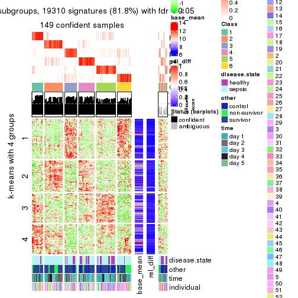</p>

</div>
</div>


Signature heatmaps where rows are not scaled:


<script>
$( function() {
	$( '#tabs-CV-mclust-get-signatures-no-scale' ).tabs();
} );
</script>
<div id='tabs-CV-mclust-get-signatures-no-scale'>
<ul>
<li><a href='#tab-CV-mclust-get-signatures-no-scale-1'>k = 2</a></li>
<li><a href='#tab-CV-mclust-get-signatures-no-scale-2'>k = 3</a></li>
<li><a href='#tab-CV-mclust-get-signatures-no-scale-3'>k = 4</a></li>
<li><a href='#tab-CV-mclust-get-signatures-no-scale-4'>k = 5</a></li>
<li><a href='#tab-CV-mclust-get-signatures-no-scale-5'>k = 6</a></li>
</ul>
<div id='tab-CV-mclust-get-signatures-no-scale-1'>
<pre><code class="r">get_signatures(res, k = 2, scale_rows = FALSE)
</code></pre>

<p></p>

</div>
<div id='tab-CV-mclust-get-signatures-no-scale-2'>
<pre><code class="r">get_signatures(res, k = 3, scale_rows = FALSE)
</code></pre>

<p>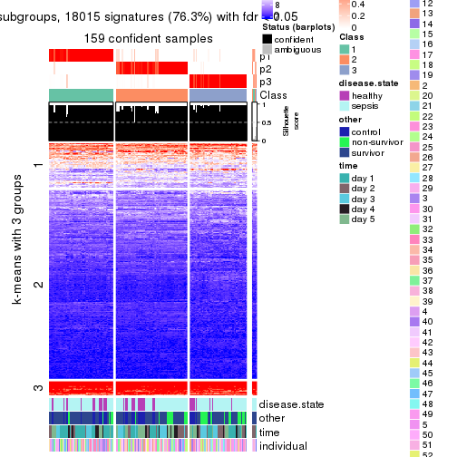</p>

</div>
<div id='tab-CV-mclust-get-signatures-no-scale-3'>
<pre><code class="r">get_signatures(res, k = 4, scale_rows = FALSE)
</code></pre>

<p></p>

</div>
<div id='tab-CV-mclust-get-signatures-no-scale-4'>
<pre><code class="r">get_signatures(res, k = 5, scale_rows = FALSE)
</code></pre>

<p></p>

</div>
<div id='tab-CV-mclust-get-signatures-no-scale-5'>
<pre><code class="r">get_signatures(res, k = 6, scale_rows = FALSE)
</code></pre>

<p></p>

</div>
</div>


Compare the overlap of signatures from different k:

```r
compare_signatures(res)
```


`get_signature()` returns a data frame invisibly. TO get the list of signatures, the function
call should be assigned to a variable explicitly. In following code, if `plot` argument is set
to `FALSE`, no heatmap is plotted while only the differential analysis is performed.

```r
# code only for demonstration
tb = get_signature(res, k = ..., plot = FALSE)
```

An example of the output of `tb` is:

```
#>   which_row         fdr    mean_1    mean_2 scaled_mean_1 scaled_mean_2 km
#> 1        38 0.042760348  8.373488  9.131774    -0.5533452     0.5164555  1
#> 2        40 0.018707592  7.106213  8.469186    -0.6173731     0.5762149  1
#> 3        55 0.019134737 10.221463 11.207825    -0.6159697     0.5749050  1
#> 4        59 0.006059896  5.921854  7.869574    -0.6899429     0.6439467  1
#> 5        60 0.018055526  8.928898 10.211722    -0.6204761     0.5791110  1
#> 6        98 0.009384629 15.714769 14.887706     0.6635654    -0.6193277  2
...
```

The columns in `tb` are:

1. `which_row`: row indices corresponding to the input matrix.
2. `fdr`: FDR for the differential test. 
3. `mean_x`: The mean value in group x.
4. `scaled_mean_x`: The mean value in group x after rows are scaled.
5. `km`: Row groups if k-means clustering is applied to rows.


UMAP plot which shows how samples are separated.


<script>
$( function() {
	$( '#tabs-CV-mclust-dimension-reduction' ).tabs();
} );
</script>
<div id='tabs-CV-mclust-dimension-reduction'>
<ul>
<li><a href='#tab-CV-mclust-dimension-reduction-1'>k = 2</a></li>
<li><a href='#tab-CV-mclust-dimension-reduction-2'>k = 3</a></li>
<li><a href='#tab-CV-mclust-dimension-reduction-3'>k = 4</a></li>
<li><a href='#tab-CV-mclust-dimension-reduction-4'>k = 5</a></li>
<li><a href='#tab-CV-mclust-dimension-reduction-5'>k = 6</a></li>
</ul>
<div id='tab-CV-mclust-dimension-reduction-1'>
<pre><code class="r">dimension_reduction(res, k = 2, method = &quot;UMAP&quot;)
</code></pre>

<p></p>

</div>
<div id='tab-CV-mclust-dimension-reduction-2'>
<pre><code class="r">dimension_reduction(res, k = 3, method = &quot;UMAP&quot;)
</code></pre>

<p></p>

</div>
<div id='tab-CV-mclust-dimension-reduction-3'>
<pre><code class="r">dimension_reduction(res, k = 4, method = &quot;UMAP&quot;)
</code></pre>

<p></p>

</div>
<div id='tab-CV-mclust-dimension-reduction-4'>
<pre><code class="r">dimension_reduction(res, k = 5, method = &quot;UMAP&quot;)
</code></pre>

<p></p>

</div>
<div id='tab-CV-mclust-dimension-reduction-5'>
<pre><code class="r">dimension_reduction(res, k = 6, method = &quot;UMAP&quot;)
</code></pre>

<p></p>

</div>
</div>


Following heatmap shows how subgroups are split when increasing `k`:

```r
collect_classes(res)
```


Test correlation between subgroups and known annotations. If the known
annotation is numeric, one-way ANOVA test is applied, and if the known
annotation is discrete, chi-squared contingency table test is applied.

```r
test_to_known_factors(res)
```

```
#>             n disease.state(p) other(p) time(p) individual(p) k
#> CV:mclust 146          0.69841 8.34e-01 0.00769         0.979 2
#> CV:mclust 159          0.51729 3.88e-02 0.15703         0.438 3
#> CV:mclust 141          0.03017 3.85e-03 0.01941         0.552 4
#> CV:mclust 143          0.00151 5.53e-04 0.00232         0.552 5
#> CV:mclust 149          0.00016 1.96e-05 0.02700         0.364 6
```


If matrix rows can be associated to genes, consider to use `functional_enrichment(res,
...)` to perform function enrichment for the signature genes. See [this vignette](http://bioconductor.org/packages/devel/bioc/vignettes/cola/inst/doc/functional_enrichment.html) for more detailed explanations.


 

---------------------------------------------------


### CV:NMF


The object with results only for a single top-value method and a single partition method 
can be extracted as:

```r
res = res_list["CV", "NMF"]
# you can also extract it by
# res = res_list["CV:NMF"]
```

A summary of `res` and all the functions that can be applied to it:

```r
res
```

```
#> A 'ConsensusPartition' object with k = 2, 3, 4, 5, 6.
#>   On a matrix with 23598 rows and 163 columns.
#>   Top rows (1000, 2000, 3000, 4000, 5000) are extracted by 'CV' method.
#>   Subgroups are detected by 'NMF' method.
#>   Performed in total 1250 partitions by row resampling.
#>   Best k for subgroups seems to be 3.
#> 
#> Following methods can be applied to this 'ConsensusPartition' object:
#>  [1] "cola_report"             "collect_classes"         "collect_plots"          
#>  [4] "collect_stats"           "colnames"                "compare_signatures"     
#>  [7] "consensus_heatmap"       "dimension_reduction"     "functional_enrichment"  
#> [10] "get_anno_col"            "get_anno"                "get_classes"            
#> [13] "get_consensus"           "get_matrix"              "get_membership"         
#> [16] "get_param"               "get_signatures"          "get_stats"              
#> [19] "is_best_k"               "is_stable_k"             "membership_heatmap"     
#> [22] "ncol"                    "nrow"                    "plot_ecdf"              
#> [25] "rownames"                "select_partition_number" "show"                   
#> [28] "suggest_best_k"          "test_to_known_factors"
```

`collect_plots()` function collects all the plots made from `res` for all `k` (number of partitions)
into one single page to provide an easy and fast comparison between different `k`.

```r
collect_plots(res)
```


The plots are:

- The first row: a plot of the ECDF (empirical cumulative distribution
  function) curves of the consensus matrix for each `k` and the heatmap of
  predicted classes for each `k`.
- The second row: heatmaps of the consensus matrix for each `k`.
- The third row: heatmaps of the membership matrix for each `k`.
- The fouth row: heatmaps of the signatures for each `k`.

All the plots in panels can be made by individual functions and they are
plotted later in this section.

`select_partition_number()` produces several plots showing different
statistics for choosing "optimized" `k`. There are following statistics:

- ECDF curves of the consensus matrix for each `k`;
- 1-PAC. [The PAC
  score](https://en.wikipedia.org/wiki/Consensus_clustering#Over-interpretation_potential_of_consensus_clustering)
  measures the proportion of the ambiguous subgrouping.
- Mean silhouette score.
- Concordance. The mean probability of fiting the consensus class ids in all
  partitions.
- Area increased. Denote $A_k$ as the area under the ECDF curve for current
  `k`, the area increased is defined as $A_k - A_{k-1}$.
- Rand index. The percent of pairs of samples that are both in a same cluster
  or both are not in a same cluster in the partition of k and k-1.
- Jaccard index. The ratio of pairs of samples are both in a same cluster in
  the partition of k and k-1 and the pairs of samples are both in a same
  cluster in the partition k or k-1.

The detailed explanations of these statistics can be found in [the _cola_
vignette](http://bioconductor.org/packages/devel/bioc/vignettes/cola/inst/doc/cola.html#toc_13).

Generally speaking, lower PAC score, higher mean silhouette score or higher
concordance corresponds to better partition. Rand index and Jaccard index
measure how similar the current partition is compared to partition with `k-1`.
If they are too similar, we won't accept `k` is better than `k-1`.

```r
select_partition_number(res)
```


The numeric values for all these statistics can be obtained by `get_stats()`.

```r
get_stats(res)
```

```
#>   k 1-PAC mean_silhouette concordance area_increased  Rand Jaccard
#> 2 2 0.778           0.903       0.957         0.4755 0.529   0.529
#> 3 3 0.899           0.921       0.966         0.4068 0.762   0.566
#> 4 4 0.646           0.595       0.765         0.1115 0.863   0.621
#> 5 5 0.758           0.754       0.863         0.0671 0.891   0.617
#> 6 6 0.789           0.703       0.847         0.0353 0.934   0.708
```

`suggest_best_k()` suggests the best $k$ based on these statistics. The rules are as follows:

- All $k$ with Jaccard index larger than 0.95 are removed because increasing
  $k$ does not provide enough extra information. If all $k$ are removed, it is
  marked as no subgroup is detected.
- For all $k$ with 1-PAC score larger than 0.9, the maximal $k$ is taken as
  the best $k$, and other $k$ are marked as optional $k$.
- If it does not fit the second rule. The $k$ with the maximal vote of the
  highest 1-PAC score, highest mean silhouette, and highest concordance is
  taken as the best $k$.

```r
suggest_best_k(res)
```

```
#> [1] 3
```


Following shows the table of the partitions (You need to click the **show/hide
code output** link to see it). The membership matrix (columns with name `p*`)
is inferred by
[`clue::cl_consensus()`](https://www.rdocumentation.org/link/cl_consensus?package=clue)
function with the `SE` method. Basically the value in the membership matrix
represents the probability to belong to a certain group. The finall class
label for an item is determined with the group with highest probability it
belongs to.

In `get_classes()` function, the entropy is calculated from the membership
matrix and the silhouette score is calculated from the consensus matrix.


<script>
$( function() {
	$( '#tabs-CV-NMF-get-classes' ).tabs();
} );
</script>
<div id='tabs-CV-NMF-get-classes'>
<ul>
<li><a href='#tab-CV-NMF-get-classes-1'>k = 2</a></li>
<li><a href='#tab-CV-NMF-get-classes-2'>k = 3</a></li>
<li><a href='#tab-CV-NMF-get-classes-3'>k = 4</a></li>
<li><a href='#tab-CV-NMF-get-classes-4'>k = 5</a></li>
<li><a href='#tab-CV-NMF-get-classes-5'>k = 6</a></li>
</ul>

<div id='tab-CV-NMF-get-classes-1'>
<p><a id='tab-CV-NMF-get-classes-1-a' style='color:#0366d6' href='#'>show/hide code output</a></p>
<pre><code class="r">cbind(get_classes(res, k = 2), get_membership(res, k = 2))
</code></pre>

<pre><code>#&gt;            class entropy silhouette    p1    p2
#&gt; GSM1317945     2  0.0000      0.954 0.000 1.000
#&gt; GSM1317946     1  0.0000      0.950 1.000 0.000
#&gt; GSM1317947     2  0.0000      0.954 0.000 1.000
#&gt; GSM1317948     1  0.9427      0.487 0.640 0.360
#&gt; GSM1317949     1  0.0000      0.950 1.000 0.000
#&gt; GSM1317950     1  0.0000      0.950 1.000 0.000
#&gt; GSM1317953     1  0.0000      0.950 1.000 0.000
#&gt; GSM1317954     1  0.0000      0.950 1.000 0.000
#&gt; GSM1317955     1  0.0000      0.950 1.000 0.000
#&gt; GSM1317956     1  0.0000      0.950 1.000 0.000
#&gt; GSM1317957     2  0.0000      0.954 0.000 1.000
#&gt; GSM1317958     1  0.0000      0.950 1.000 0.000
#&gt; GSM1317959     2  0.6531      0.780 0.168 0.832
#&gt; GSM1317960     1  0.5178      0.853 0.884 0.116
#&gt; GSM1317961     2  0.0000      0.954 0.000 1.000
#&gt; GSM1317962     1  0.0000      0.950 1.000 0.000
#&gt; GSM1317963     1  0.0000      0.950 1.000 0.000
#&gt; GSM1317964     1  0.0000      0.950 1.000 0.000
#&gt; GSM1317965     2  0.0000      0.954 0.000 1.000
#&gt; GSM1317966     2  0.0000      0.954 0.000 1.000
#&gt; GSM1317967     2  0.0000      0.954 0.000 1.000
#&gt; GSM1317968     1  0.0000      0.950 1.000 0.000
#&gt; GSM1317969     2  0.0000      0.954 0.000 1.000
#&gt; GSM1317970     2  0.0000      0.954 0.000 1.000
#&gt; GSM1317952     1  0.6623      0.794 0.828 0.172
#&gt; GSM1317951     1  0.0000      0.950 1.000 0.000
#&gt; GSM1317971     2  0.0000      0.954 0.000 1.000
#&gt; GSM1317972     1  0.0000      0.950 1.000 0.000
#&gt; GSM1317973     2  0.0000      0.954 0.000 1.000
#&gt; GSM1317974     1  0.0000      0.950 1.000 0.000
#&gt; GSM1317975     2  0.9993      0.116 0.484 0.516
#&gt; GSM1317978     1  0.0000      0.950 1.000 0.000
#&gt; GSM1317979     2  0.8555      0.590 0.280 0.720
#&gt; GSM1317980     2  0.0000      0.954 0.000 1.000
#&gt; GSM1317981     2  0.9393      0.491 0.356 0.644
#&gt; GSM1317982     2  0.0000      0.954 0.000 1.000
#&gt; GSM1317983     1  0.0000      0.950 1.000 0.000
#&gt; GSM1317984     2  0.0000      0.954 0.000 1.000
#&gt; GSM1317985     2  0.0000      0.954 0.000 1.000
#&gt; GSM1317986     1  0.0000      0.950 1.000 0.000
#&gt; GSM1317987     2  0.8386      0.664 0.268 0.732
#&gt; GSM1317988     2  0.0000      0.954 0.000 1.000
#&gt; GSM1317989     1  0.9815      0.336 0.580 0.420
#&gt; GSM1317990     2  0.7219      0.764 0.200 0.800
#&gt; GSM1317991     2  0.0000      0.954 0.000 1.000
#&gt; GSM1317992     2  0.0000      0.954 0.000 1.000
#&gt; GSM1317993     2  0.7219      0.764 0.200 0.800
#&gt; GSM1317994     2  0.0000      0.954 0.000 1.000
#&gt; GSM1317977     1  0.5946      0.826 0.856 0.144
#&gt; GSM1317976     1  0.0000      0.950 1.000 0.000
#&gt; GSM1317995     2  0.0000      0.954 0.000 1.000
#&gt; GSM1317996     2  0.7299      0.759 0.204 0.796
#&gt; GSM1317997     2  0.0000      0.954 0.000 1.000
#&gt; GSM1317998     1  0.0000      0.950 1.000 0.000
#&gt; GSM1317999     1  0.0000      0.950 1.000 0.000
#&gt; GSM1318002     2  0.0000      0.954 0.000 1.000
#&gt; GSM1318003     2  0.0000      0.954 0.000 1.000
#&gt; GSM1318004     2  0.5178      0.846 0.116 0.884
#&gt; GSM1318005     2  0.1184      0.943 0.016 0.984
#&gt; GSM1318006     1  0.0000      0.950 1.000 0.000
#&gt; GSM1318007     2  0.0000      0.954 0.000 1.000
#&gt; GSM1318008     1  0.0000      0.950 1.000 0.000
#&gt; GSM1318009     2  0.7674      0.736 0.224 0.776
#&gt; GSM1318010     2  0.0000      0.954 0.000 1.000
#&gt; GSM1318011     1  0.0000      0.950 1.000 0.000
#&gt; GSM1318012     1  0.0000      0.950 1.000 0.000
#&gt; GSM1318013     2  0.0000      0.954 0.000 1.000
#&gt; GSM1318014     1  0.0938      0.942 0.988 0.012
#&gt; GSM1318015     2  0.0000      0.954 0.000 1.000
#&gt; GSM1318001     2  0.0000      0.954 0.000 1.000
#&gt; GSM1318000     2  0.0000      0.954 0.000 1.000
#&gt; GSM1318016     2  0.0000      0.954 0.000 1.000
#&gt; GSM1318017     1  0.0000      0.950 1.000 0.000
#&gt; GSM1318019     2  0.0000      0.954 0.000 1.000
#&gt; GSM1318020     2  0.0000      0.954 0.000 1.000
#&gt; GSM1318021     2  0.7219      0.764 0.200 0.800
#&gt; GSM1318022     2  0.0000      0.954 0.000 1.000
#&gt; GSM1318023     1  0.0000      0.950 1.000 0.000
#&gt; GSM1318024     2  0.4431      0.879 0.092 0.908
#&gt; GSM1318025     2  0.0000      0.954 0.000 1.000
#&gt; GSM1318026     2  0.0000      0.954 0.000 1.000
#&gt; GSM1318027     2  0.0000      0.954 0.000 1.000
#&gt; GSM1318028     1  0.0000      0.950 1.000 0.000
#&gt; GSM1318029     2  0.0000      0.954 0.000 1.000
#&gt; GSM1318018     1  0.0000      0.950 1.000 0.000
#&gt; GSM1318030     2  0.0000      0.954 0.000 1.000
#&gt; GSM1318031     2  0.0000      0.954 0.000 1.000
#&gt; GSM1318033     1  0.0000      0.950 1.000 0.000
#&gt; GSM1318034     2  0.0672      0.949 0.008 0.992
#&gt; GSM1318035     2  0.7056      0.773 0.192 0.808
#&gt; GSM1318036     1  0.0938      0.942 0.988 0.012
#&gt; GSM1318037     2  0.0000      0.954 0.000 1.000
#&gt; GSM1318038     2  0.0000      0.954 0.000 1.000
#&gt; GSM1318039     1  0.0000      0.950 1.000 0.000
#&gt; GSM1318040     2  0.0000      0.954 0.000 1.000
#&gt; GSM1318032     2  0.0000      0.954 0.000 1.000
#&gt; GSM1317914     2  0.0000      0.954 0.000 1.000
#&gt; GSM1317915     1  0.0000      0.950 1.000 0.000
#&gt; GSM1317916     1  0.0000      0.950 1.000 0.000
#&gt; GSM1317917     2  0.1843      0.933 0.028 0.972
#&gt; GSM1317918     1  0.0000      0.950 1.000 0.000
#&gt; GSM1317919     2  0.0000      0.954 0.000 1.000
#&gt; GSM1317920     2  0.0000      0.954 0.000 1.000
#&gt; GSM1317921     2  0.0000      0.954 0.000 1.000
#&gt; GSM1317922     1  0.7883      0.712 0.764 0.236
#&gt; GSM1317923     2  0.0000      0.954 0.000 1.000
#&gt; GSM1317924     2  0.0000      0.954 0.000 1.000
#&gt; GSM1317925     2  0.0000      0.954 0.000 1.000
#&gt; GSM1317926     2  0.0000      0.954 0.000 1.000
#&gt; GSM1317927     2  0.7219      0.764 0.200 0.800
#&gt; GSM1317928     2  0.0000      0.954 0.000 1.000
#&gt; GSM1317929     2  0.0000      0.954 0.000 1.000
#&gt; GSM1317930     2  0.0000      0.954 0.000 1.000
#&gt; GSM1317931     2  0.0000      0.954 0.000 1.000
#&gt; GSM1317932     2  0.0000      0.954 0.000 1.000
#&gt; GSM1317933     2  0.1184      0.943 0.016 0.984
#&gt; GSM1317934     2  0.0000      0.954 0.000 1.000
#&gt; GSM1317935     2  0.0000      0.954 0.000 1.000
#&gt; GSM1317936     2  0.0000      0.954 0.000 1.000
#&gt; GSM1317937     1  0.0000      0.950 1.000 0.000
#&gt; GSM1317938     2  0.3584      0.901 0.068 0.932
#&gt; GSM1317939     2  0.7219      0.764 0.200 0.800
#&gt; GSM1317940     1  0.0000      0.950 1.000 0.000
#&gt; GSM1317941     1  0.9427      0.455 0.640 0.360
#&gt; GSM1317942     1  0.9323      0.435 0.652 0.348
#&gt; GSM1317943     2  0.7376      0.753 0.208 0.792
#&gt; GSM1317944     2  0.7139      0.768 0.196 0.804
#&gt; GSM1317896     2  0.0000      0.954 0.000 1.000
#&gt; GSM1317897     1  0.0000      0.950 1.000 0.000
#&gt; GSM1317898     1  0.0000      0.950 1.000 0.000
#&gt; GSM1317899     1  0.0000      0.950 1.000 0.000
#&gt; GSM1317900     2  0.0000      0.954 0.000 1.000
#&gt; GSM1317901     1  0.0000      0.950 1.000 0.000
#&gt; GSM1317902     1  0.0000      0.950 1.000 0.000
#&gt; GSM1317903     1  0.0000      0.950 1.000 0.000
#&gt; GSM1317904     1  0.1184      0.939 0.984 0.016
#&gt; GSM1317905     2  0.0000      0.954 0.000 1.000
#&gt; GSM1317906     2  0.0000      0.954 0.000 1.000
#&gt; GSM1317907     2  0.0000      0.954 0.000 1.000
#&gt; GSM1317908     2  0.0000      0.954 0.000 1.000
#&gt; GSM1317909     1  0.7219      0.759 0.800 0.200
#&gt; GSM1317910     1  0.7219      0.759 0.800 0.200
#&gt; GSM1317911     1  0.0000      0.950 1.000 0.000
#&gt; GSM1317912     2  0.0000      0.954 0.000 1.000
#&gt; GSM1317913     2  0.0000      0.954 0.000 1.000
#&gt; GSM1318041     2  0.0672      0.949 0.008 0.992
#&gt; GSM1318042     2  0.0000      0.954 0.000 1.000
#&gt; GSM1318043     2  0.0000      0.954 0.000 1.000
#&gt; GSM1318044     1  0.0000      0.950 1.000 0.000
#&gt; GSM1318045     1  0.0000      0.950 1.000 0.000
#&gt; GSM1318046     1  0.0000      0.950 1.000 0.000
#&gt; GSM1318047     1  0.0000      0.950 1.000 0.000
#&gt; GSM1318048     2  0.9087      0.494 0.324 0.676
#&gt; GSM1318049     1  0.7219      0.759 0.800 0.200
#&gt; GSM1318050     2  0.0000      0.954 0.000 1.000
#&gt; GSM1318051     2  0.0000      0.954 0.000 1.000
#&gt; GSM1318052     2  0.0000      0.954 0.000 1.000
#&gt; GSM1318053     2  0.0000      0.954 0.000 1.000
#&gt; GSM1318054     2  0.0000      0.954 0.000 1.000
#&gt; GSM1318055     2  0.0000      0.954 0.000 1.000
#&gt; GSM1318056     2  0.0000      0.954 0.000 1.000
#&gt; GSM1318057     2  0.0000      0.954 0.000 1.000
#&gt; GSM1318058     2  0.0000      0.954 0.000 1.000
</code></pre>

<script>
$('#tab-CV-NMF-get-classes-1-a').parent().next().next().hide();
$('#tab-CV-NMF-get-classes-1-a').click(function(){
  $('#tab-CV-NMF-get-classes-1-a').parent().next().next().toggle();
  return(false);
});
</script>
</div>

<div id='tab-CV-NMF-get-classes-2'>
<p><a id='tab-CV-NMF-get-classes-2-a' style='color:#0366d6' href='#'>show/hide code output</a></p>
<pre><code class="r">cbind(get_classes(res, k = 3), get_membership(res, k = 3))
</code></pre>

<pre><code>#&gt;            class entropy silhouette    p1    p2    p3
#&gt; GSM1317945     2  0.0000      0.957 0.000 1.000 0.000
#&gt; GSM1317946     1  0.2448      0.896 0.924 0.076 0.000
#&gt; GSM1317947     3  0.0000      0.976 0.000 0.000 1.000
#&gt; GSM1317948     1  0.6095      0.395 0.608 0.000 0.392
#&gt; GSM1317949     1  0.0000      0.960 1.000 0.000 0.000
#&gt; GSM1317950     1  0.0000      0.960 1.000 0.000 0.000
#&gt; GSM1317953     1  0.0000      0.960 1.000 0.000 0.000
#&gt; GSM1317954     1  0.0000      0.960 1.000 0.000 0.000
#&gt; GSM1317955     1  0.0000      0.960 1.000 0.000 0.000
#&gt; GSM1317956     1  0.0000      0.960 1.000 0.000 0.000
#&gt; GSM1317957     2  0.0000      0.957 0.000 1.000 0.000
#&gt; GSM1317958     1  0.0000      0.960 1.000 0.000 0.000
#&gt; GSM1317959     2  0.1289      0.929 0.032 0.968 0.000
#&gt; GSM1317960     1  0.3941      0.815 0.844 0.000 0.156
#&gt; GSM1317961     3  0.0000      0.976 0.000 0.000 1.000
#&gt; GSM1317962     1  0.3551      0.830 0.868 0.132 0.000
#&gt; GSM1317963     1  0.0000      0.960 1.000 0.000 0.000
#&gt; GSM1317964     1  0.0000      0.960 1.000 0.000 0.000
#&gt; GSM1317965     3  0.0000      0.976 0.000 0.000 1.000
#&gt; GSM1317966     3  0.0000      0.976 0.000 0.000 1.000
#&gt; GSM1317967     2  0.4504      0.748 0.000 0.804 0.196
#&gt; GSM1317968     1  0.0000      0.960 1.000 0.000 0.000
#&gt; GSM1317969     3  0.0000      0.976 0.000 0.000 1.000
#&gt; GSM1317970     2  0.0000      0.957 0.000 1.000 0.000
#&gt; GSM1317952     1  0.4605      0.754 0.796 0.000 0.204
#&gt; GSM1317951     1  0.0000      0.960 1.000 0.000 0.000
#&gt; GSM1317971     2  0.5882      0.481 0.000 0.652 0.348
#&gt; GSM1317972     1  0.3340      0.852 0.880 0.120 0.000
#&gt; GSM1317973     2  0.0000      0.957 0.000 1.000 0.000
#&gt; GSM1317974     2  0.0424      0.951 0.008 0.992 0.000
#&gt; GSM1317975     2  0.0000      0.957 0.000 1.000 0.000
#&gt; GSM1317978     1  0.0000      0.960 1.000 0.000 0.000
#&gt; GSM1317979     3  0.0424      0.969 0.008 0.000 0.992
#&gt; GSM1317980     3  0.0000      0.976 0.000 0.000 1.000
#&gt; GSM1317981     2  0.0000      0.957 0.000 1.000 0.000
#&gt; GSM1317982     3  0.0000      0.976 0.000 0.000 1.000
#&gt; GSM1317983     1  0.0000      0.960 1.000 0.000 0.000
#&gt; GSM1317984     3  0.0000      0.976 0.000 0.000 1.000
#&gt; GSM1317985     3  0.0000      0.976 0.000 0.000 1.000
#&gt; GSM1317986     1  0.0000      0.960 1.000 0.000 0.000
#&gt; GSM1317987     2  0.0000      0.957 0.000 1.000 0.000
#&gt; GSM1317988     2  0.0000      0.957 0.000 1.000 0.000
#&gt; GSM1317989     1  0.5138      0.680 0.748 0.000 0.252
#&gt; GSM1317990     2  0.0000      0.957 0.000 1.000 0.000
#&gt; GSM1317991     3  0.0000      0.976 0.000 0.000 1.000
#&gt; GSM1317992     2  0.0000      0.957 0.000 1.000 0.000
#&gt; GSM1317993     2  0.0000      0.957 0.000 1.000 0.000
#&gt; GSM1317994     3  0.0000      0.976 0.000 0.000 1.000
#&gt; GSM1317977     1  0.0000      0.960 1.000 0.000 0.000
#&gt; GSM1317976     1  0.0000      0.960 1.000 0.000 0.000
#&gt; GSM1317995     3  0.0000      0.976 0.000 0.000 1.000
#&gt; GSM1317996     2  0.0000      0.957 0.000 1.000 0.000
#&gt; GSM1317997     3  0.0000      0.976 0.000 0.000 1.000
#&gt; GSM1317998     1  0.0000      0.960 1.000 0.000 0.000
#&gt; GSM1317999     1  0.0000      0.960 1.000 0.000 0.000
#&gt; GSM1318002     2  0.0000      0.957 0.000 1.000 0.000
#&gt; GSM1318003     2  0.0000      0.957 0.000 1.000 0.000
#&gt; GSM1318004     2  0.0424      0.951 0.000 0.992 0.008
#&gt; GSM1318005     2  0.0000      0.957 0.000 1.000 0.000
#&gt; GSM1318006     1  0.0000      0.960 1.000 0.000 0.000
#&gt; GSM1318007     3  0.5497      0.575 0.000 0.292 0.708
#&gt; GSM1318008     1  0.0000      0.960 1.000 0.000 0.000
#&gt; GSM1318009     2  0.0000      0.957 0.000 1.000 0.000
#&gt; GSM1318010     3  0.0000      0.976 0.000 0.000 1.000
#&gt; GSM1318011     1  0.0424      0.954 0.992 0.000 0.008
#&gt; GSM1318012     1  0.0000      0.960 1.000 0.000 0.000
#&gt; GSM1318013     2  0.5650      0.555 0.000 0.688 0.312
#&gt; GSM1318014     1  0.1529      0.929 0.960 0.000 0.040
#&gt; GSM1318015     2  0.0000      0.957 0.000 1.000 0.000
#&gt; GSM1318001     3  0.0000      0.976 0.000 0.000 1.000
#&gt; GSM1318000     2  0.0000      0.957 0.000 1.000 0.000
#&gt; GSM1318016     2  0.0000      0.957 0.000 1.000 0.000
#&gt; GSM1318017     1  0.0000      0.960 1.000 0.000 0.000
#&gt; GSM1318019     2  0.0000      0.957 0.000 1.000 0.000
#&gt; GSM1318020     3  0.0000      0.976 0.000 0.000 1.000
#&gt; GSM1318021     2  0.0000      0.957 0.000 1.000 0.000
#&gt; GSM1318022     3  0.0000      0.976 0.000 0.000 1.000
#&gt; GSM1318023     1  0.0000      0.960 1.000 0.000 0.000
#&gt; GSM1318024     2  0.0000      0.957 0.000 1.000 0.000
#&gt; GSM1318025     3  0.0000      0.976 0.000 0.000 1.000
#&gt; GSM1318026     2  0.0000      0.957 0.000 1.000 0.000
#&gt; GSM1318027     2  0.0000      0.957 0.000 1.000 0.000
#&gt; GSM1318028     1  0.0000      0.960 1.000 0.000 0.000
#&gt; GSM1318029     3  0.0000      0.976 0.000 0.000 1.000
#&gt; GSM1318018     1  0.0000      0.960 1.000 0.000 0.000
#&gt; GSM1318030     3  0.2711      0.889 0.000 0.088 0.912
#&gt; GSM1318031     3  0.0000      0.976 0.000 0.000 1.000
#&gt; GSM1318033     1  0.0000      0.960 1.000 0.000 0.000
#&gt; GSM1318034     3  0.0000      0.976 0.000 0.000 1.000
#&gt; GSM1318035     2  0.0000      0.957 0.000 1.000 0.000
#&gt; GSM1318036     1  0.0000      0.960 1.000 0.000 0.000
#&gt; GSM1318037     2  0.7460      0.177 0.036 0.524 0.440
#&gt; GSM1318038     3  0.0000      0.976 0.000 0.000 1.000
#&gt; GSM1318039     1  0.0000      0.960 1.000 0.000 0.000
#&gt; GSM1318040     3  0.0000      0.976 0.000 0.000 1.000
#&gt; GSM1318032     3  0.0000      0.976 0.000 0.000 1.000
#&gt; GSM1317914     3  0.0000      0.976 0.000 0.000 1.000
#&gt; GSM1317915     1  0.0000      0.960 1.000 0.000 0.000
#&gt; GSM1317916     1  0.0000      0.960 1.000 0.000 0.000
#&gt; GSM1317917     3  0.0000      0.976 0.000 0.000 1.000
#&gt; GSM1317918     1  0.0000      0.960 1.000 0.000 0.000
#&gt; GSM1317919     3  0.3816      0.817 0.000 0.148 0.852
#&gt; GSM1317920     3  0.0000      0.976 0.000 0.000 1.000
#&gt; GSM1317921     3  0.0000      0.976 0.000 0.000 1.000
#&gt; GSM1317922     3  0.3879      0.802 0.152 0.000 0.848
#&gt; GSM1317923     3  0.0000      0.976 0.000 0.000 1.000
#&gt; GSM1317924     3  0.0000      0.976 0.000 0.000 1.000
#&gt; GSM1317925     2  0.0000      0.957 0.000 1.000 0.000
#&gt; GSM1317926     3  0.0000      0.976 0.000 0.000 1.000
#&gt; GSM1317927     2  0.0000      0.957 0.000 1.000 0.000
#&gt; GSM1317928     3  0.0237      0.972 0.000 0.004 0.996
#&gt; GSM1317929     3  0.0000      0.976 0.000 0.000 1.000
#&gt; GSM1317930     2  0.0000      0.957 0.000 1.000 0.000
#&gt; GSM1317931     3  0.0000      0.976 0.000 0.000 1.000
#&gt; GSM1317932     2  0.4654      0.732 0.000 0.792 0.208
#&gt; GSM1317933     2  0.0000      0.957 0.000 1.000 0.000
#&gt; GSM1317934     2  0.1411      0.928 0.000 0.964 0.036
#&gt; GSM1317935     3  0.0000      0.976 0.000 0.000 1.000
#&gt; GSM1317936     3  0.0000      0.976 0.000 0.000 1.000
#&gt; GSM1317937     1  0.0000      0.960 1.000 0.000 0.000
#&gt; GSM1317938     2  0.0000      0.957 0.000 1.000 0.000
#&gt; GSM1317939     2  0.0000      0.957 0.000 1.000 0.000
#&gt; GSM1317940     1  0.0000      0.960 1.000 0.000 0.000
#&gt; GSM1317941     2  0.0000      0.957 0.000 1.000 0.000
#&gt; GSM1317942     2  0.0000      0.957 0.000 1.000 0.000
#&gt; GSM1317943     2  0.0000      0.957 0.000 1.000 0.000
#&gt; GSM1317944     2  0.0000      0.957 0.000 1.000 0.000
#&gt; GSM1317896     3  0.0000      0.976 0.000 0.000 1.000
#&gt; GSM1317897     1  0.0000      0.960 1.000 0.000 0.000
#&gt; GSM1317898     1  0.0000      0.960 1.000 0.000 0.000
#&gt; GSM1317899     1  0.0000      0.960 1.000 0.000 0.000
#&gt; GSM1317900     3  0.0000      0.976 0.000 0.000 1.000
#&gt; GSM1317901     1  0.0000      0.960 1.000 0.000 0.000
#&gt; GSM1317902     1  0.0000      0.960 1.000 0.000 0.000
#&gt; GSM1317903     1  0.0000      0.960 1.000 0.000 0.000
#&gt; GSM1317904     2  0.0000      0.957 0.000 1.000 0.000
#&gt; GSM1317905     2  0.0237      0.954 0.000 0.996 0.004
#&gt; GSM1317906     2  0.0000      0.957 0.000 1.000 0.000
#&gt; GSM1317907     3  0.3941      0.805 0.000 0.156 0.844
#&gt; GSM1317908     3  0.0000      0.976 0.000 0.000 1.000
#&gt; GSM1317909     1  0.4605      0.753 0.796 0.000 0.204
#&gt; GSM1317910     1  0.4555      0.758 0.800 0.000 0.200
#&gt; GSM1317911     1  0.0000      0.960 1.000 0.000 0.000
#&gt; GSM1317912     3  0.0000      0.976 0.000 0.000 1.000
#&gt; GSM1317913     2  0.0000      0.957 0.000 1.000 0.000
#&gt; GSM1318041     3  0.0000      0.976 0.000 0.000 1.000
#&gt; GSM1318042     3  0.0000      0.976 0.000 0.000 1.000
#&gt; GSM1318043     3  0.0000      0.976 0.000 0.000 1.000
#&gt; GSM1318044     1  0.0000      0.960 1.000 0.000 0.000
#&gt; GSM1318045     1  0.0000      0.960 1.000 0.000 0.000
#&gt; GSM1318046     1  0.0000      0.960 1.000 0.000 0.000
#&gt; GSM1318047     1  0.0237      0.957 0.996 0.000 0.004
#&gt; GSM1318048     3  0.0000      0.976 0.000 0.000 1.000
#&gt; GSM1318049     1  0.5882      0.499 0.652 0.000 0.348
#&gt; GSM1318050     2  0.0000      0.957 0.000 1.000 0.000
#&gt; GSM1318051     2  0.0000      0.957 0.000 1.000 0.000
#&gt; GSM1318052     2  0.0000      0.957 0.000 1.000 0.000
#&gt; GSM1318053     2  0.0000      0.957 0.000 1.000 0.000
#&gt; GSM1318054     2  0.6280      0.173 0.000 0.540 0.460
#&gt; GSM1318055     3  0.0000      0.976 0.000 0.000 1.000
#&gt; GSM1318056     2  0.3619      0.824 0.000 0.864 0.136
#&gt; GSM1318057     2  0.0000      0.957 0.000 1.000 0.000
#&gt; GSM1318058     3  0.5650      0.531 0.000 0.312 0.688
</code></pre>

<script>
$('#tab-CV-NMF-get-classes-2-a').parent().next().next().hide();
$('#tab-CV-NMF-get-classes-2-a').click(function(){
  $('#tab-CV-NMF-get-classes-2-a').parent().next().next().toggle();
  return(false);
});
</script>
</div>

<div id='tab-CV-NMF-get-classes-3'>
<p><a id='tab-CV-NMF-get-classes-3-a' style='color:#0366d6' href='#'>show/hide code output</a></p>
<pre><code class="r">cbind(get_classes(res, k = 4), get_membership(res, k = 4))
</code></pre>

<pre><code>#&gt;            class entropy silhouette    p1    p2    p3    p4
#&gt; GSM1317945     4  0.3528    0.54137 0.000 0.192 0.000 0.808
#&gt; GSM1317946     1  0.5839    0.34512 0.604 0.044 0.000 0.352
#&gt; GSM1317947     3  0.0000    0.90129 0.000 0.000 1.000 0.000
#&gt; GSM1317948     1  0.4446    0.62068 0.776 0.000 0.196 0.028
#&gt; GSM1317949     1  0.4477    0.67773 0.688 0.312 0.000 0.000
#&gt; GSM1317950     1  0.2814    0.75760 0.868 0.132 0.000 0.000
#&gt; GSM1317953     1  0.4877    0.62197 0.592 0.408 0.000 0.000
#&gt; GSM1317954     1  0.4866    0.62469 0.596 0.404 0.000 0.000
#&gt; GSM1317955     1  0.4961    0.58148 0.552 0.448 0.000 0.000
#&gt; GSM1317956     1  0.4477    0.68529 0.688 0.312 0.000 0.000
#&gt; GSM1317957     2  0.4543    0.26164 0.000 0.676 0.000 0.324
#&gt; GSM1317958     1  0.0000    0.77493 1.000 0.000 0.000 0.000
#&gt; GSM1317959     4  0.4406    0.41422 0.300 0.000 0.000 0.700
#&gt; GSM1317960     1  0.5132    0.61126 0.748 0.000 0.068 0.184
#&gt; GSM1317961     2  0.5000   -0.24484 0.000 0.500 0.500 0.000
#&gt; GSM1317962     2  0.6694   -0.20235 0.392 0.516 0.000 0.092
#&gt; GSM1317963     1  0.4331    0.69687 0.712 0.288 0.000 0.000
#&gt; GSM1317964     1  0.4907    0.61326 0.580 0.420 0.000 0.000
#&gt; GSM1317965     3  0.0000    0.90129 0.000 0.000 1.000 0.000
#&gt; GSM1317966     2  0.4830   -0.00135 0.000 0.608 0.392 0.000
#&gt; GSM1317967     4  0.0188    0.71043 0.000 0.004 0.000 0.996
#&gt; GSM1317968     1  0.4948    0.58618 0.560 0.440 0.000 0.000
#&gt; GSM1317969     3  0.3907    0.67513 0.000 0.000 0.768 0.232
#&gt; GSM1317970     4  0.4356    0.33270 0.000 0.292 0.000 0.708
#&gt; GSM1317952     1  0.4290    0.64922 0.800 0.000 0.164 0.036
#&gt; GSM1317951     1  0.4961    0.58148 0.552 0.448 0.000 0.000
#&gt; GSM1317971     3  0.4877    0.34778 0.000 0.408 0.592 0.000
#&gt; GSM1317972     2  0.4655   -0.10991 0.312 0.684 0.000 0.004
#&gt; GSM1317973     4  0.0469    0.70988 0.000 0.012 0.000 0.988
#&gt; GSM1317974     2  0.5496    0.28055 0.188 0.724 0.000 0.088
#&gt; GSM1317975     2  0.0817    0.42670 0.000 0.976 0.000 0.024
#&gt; GSM1317978     1  0.4500    0.67509 0.684 0.316 0.000 0.000
#&gt; GSM1317979     3  0.6440    0.32811 0.356 0.000 0.564 0.080
#&gt; GSM1317980     3  0.0000    0.90129 0.000 0.000 1.000 0.000
#&gt; GSM1317981     2  0.1118    0.42817 0.000 0.964 0.000 0.036
#&gt; GSM1317982     4  0.4999   -0.12436 0.000 0.000 0.492 0.508
#&gt; GSM1317983     1  0.3123    0.75223 0.844 0.156 0.000 0.000
#&gt; GSM1317984     3  0.0000    0.90129 0.000 0.000 1.000 0.000
#&gt; GSM1317985     3  0.0000    0.90129 0.000 0.000 1.000 0.000
#&gt; GSM1317986     1  0.3356    0.74545 0.824 0.176 0.000 0.000
#&gt; GSM1317987     2  0.0921    0.42754 0.000 0.972 0.000 0.028
#&gt; GSM1317988     4  0.0707    0.70682 0.000 0.020 0.000 0.980
#&gt; GSM1317989     1  0.5772    0.66285 0.716 0.100 0.180 0.004
#&gt; GSM1317990     2  0.4830    0.41044 0.000 0.608 0.000 0.392
#&gt; GSM1317991     3  0.4907    0.33260 0.000 0.420 0.580 0.000
#&gt; GSM1317992     2  0.5097    0.39428 0.000 0.568 0.004 0.428
#&gt; GSM1317993     2  0.4898    0.40579 0.000 0.584 0.000 0.416
#&gt; GSM1317994     3  0.0000    0.90129 0.000 0.000 1.000 0.000
#&gt; GSM1317977     1  0.3688    0.64020 0.792 0.000 0.000 0.208
#&gt; GSM1317976     2  0.3764    0.15377 0.216 0.784 0.000 0.000
#&gt; GSM1317995     3  0.0000    0.90129 0.000 0.000 1.000 0.000
#&gt; GSM1317996     4  0.4843    0.03049 0.000 0.396 0.000 0.604
#&gt; GSM1317997     3  0.0000    0.90129 0.000 0.000 1.000 0.000
#&gt; GSM1317998     1  0.0707    0.77069 0.980 0.000 0.000 0.020
#&gt; GSM1317999     1  0.0336    0.77569 0.992 0.008 0.000 0.000
#&gt; GSM1318002     2  0.4948    0.37808 0.000 0.560 0.000 0.440
#&gt; GSM1318003     2  0.4967    0.35605 0.000 0.548 0.000 0.452
#&gt; GSM1318004     4  0.2011    0.65585 0.080 0.000 0.000 0.920
#&gt; GSM1318005     4  0.0188    0.70919 0.004 0.000 0.000 0.996
#&gt; GSM1318006     1  0.1211    0.77373 0.960 0.040 0.000 0.000
#&gt; GSM1318007     4  0.6664    0.32077 0.308 0.000 0.112 0.580
#&gt; GSM1318008     1  0.0817    0.76944 0.976 0.000 0.000 0.024
#&gt; GSM1318009     4  0.0469    0.70988 0.000 0.012 0.000 0.988
#&gt; GSM1318010     3  0.0000    0.90129 0.000 0.000 1.000 0.000
#&gt; GSM1318011     1  0.0921    0.76791 0.972 0.000 0.000 0.028
#&gt; GSM1318012     1  0.3801    0.61558 0.780 0.000 0.000 0.220
#&gt; GSM1318013     4  0.1824    0.67228 0.060 0.000 0.004 0.936
#&gt; GSM1318014     1  0.0336    0.77356 0.992 0.000 0.000 0.008
#&gt; GSM1318015     2  0.4916    0.40059 0.000 0.576 0.000 0.424
#&gt; GSM1318001     3  0.0000    0.90129 0.000 0.000 1.000 0.000
#&gt; GSM1318000     4  0.3764    0.49000 0.000 0.216 0.000 0.784
#&gt; GSM1318016     2  0.4925    0.39613 0.000 0.572 0.000 0.428
#&gt; GSM1318017     1  0.0000    0.77493 1.000 0.000 0.000 0.000
#&gt; GSM1318019     4  0.2530    0.63501 0.000 0.112 0.000 0.888
#&gt; GSM1318020     3  0.0000    0.90129 0.000 0.000 1.000 0.000
#&gt; GSM1318021     2  0.4907    0.40396 0.000 0.580 0.000 0.420
#&gt; GSM1318022     3  0.4040    0.68252 0.000 0.248 0.752 0.000
#&gt; GSM1318023     1  0.0188    0.77545 0.996 0.004 0.000 0.000
#&gt; GSM1318024     2  0.4907    0.40396 0.000 0.580 0.000 0.420
#&gt; GSM1318025     3  0.0000    0.90129 0.000 0.000 1.000 0.000
#&gt; GSM1318026     2  0.4941    0.38377 0.000 0.564 0.000 0.436
#&gt; GSM1318027     4  0.1118    0.69809 0.000 0.036 0.000 0.964
#&gt; GSM1318028     1  0.4985    0.55475 0.532 0.468 0.000 0.000
#&gt; GSM1318029     3  0.0000    0.90129 0.000 0.000 1.000 0.000
#&gt; GSM1318018     1  0.0336    0.77569 0.992 0.008 0.000 0.000
#&gt; GSM1318030     4  0.4522    0.38704 0.000 0.000 0.320 0.680
#&gt; GSM1318031     3  0.0000    0.90129 0.000 0.000 1.000 0.000
#&gt; GSM1318033     1  0.3400    0.66306 0.820 0.000 0.000 0.180
#&gt; GSM1318034     3  0.0000    0.90129 0.000 0.000 1.000 0.000
#&gt; GSM1318035     2  0.4907    0.40396 0.000 0.580 0.000 0.420
#&gt; GSM1318036     1  0.3836    0.67625 0.816 0.016 0.000 0.168
#&gt; GSM1318037     4  0.4969    0.54295 0.088 0.000 0.140 0.772
#&gt; GSM1318038     3  0.0657    0.89276 0.000 0.012 0.984 0.004
#&gt; GSM1318039     1  0.4898    0.61703 0.584 0.416 0.000 0.000
#&gt; GSM1318040     3  0.0000    0.90129 0.000 0.000 1.000 0.000
#&gt; GSM1318032     3  0.0000    0.90129 0.000 0.000 1.000 0.000
#&gt; GSM1317914     3  0.0000    0.90129 0.000 0.000 1.000 0.000
#&gt; GSM1317915     1  0.4898    0.61703 0.584 0.416 0.000 0.000
#&gt; GSM1317916     1  0.4103    0.71542 0.744 0.256 0.000 0.000
#&gt; GSM1317917     3  0.7231    0.59251 0.160 0.116 0.656 0.068
#&gt; GSM1317918     1  0.4907    0.61326 0.580 0.420 0.000 0.000
#&gt; GSM1317919     3  0.4804    0.40442 0.000 0.384 0.616 0.000
#&gt; GSM1317920     3  0.0000    0.90129 0.000 0.000 1.000 0.000
#&gt; GSM1317921     3  0.1474    0.86282 0.000 0.052 0.948 0.000
#&gt; GSM1317922     3  0.4656    0.71007 0.136 0.072 0.792 0.000
#&gt; GSM1317923     3  0.0707    0.88751 0.000 0.000 0.980 0.020
#&gt; GSM1317924     3  0.0000    0.90129 0.000 0.000 1.000 0.000
#&gt; GSM1317925     2  0.4907    0.40396 0.000 0.580 0.000 0.420
#&gt; GSM1317926     3  0.0469    0.89428 0.000 0.012 0.988 0.000
#&gt; GSM1317927     2  0.4933    0.38438 0.000 0.568 0.000 0.432
#&gt; GSM1317928     3  0.6147    0.53057 0.000 0.200 0.672 0.128
#&gt; GSM1317929     2  0.4888   -0.04524 0.000 0.588 0.412 0.000
#&gt; GSM1317930     4  0.4522    0.32843 0.000 0.320 0.000 0.680
#&gt; GSM1317931     3  0.0000    0.90129 0.000 0.000 1.000 0.000
#&gt; GSM1317932     2  0.6890    0.32112 0.000 0.580 0.268 0.152
#&gt; GSM1317933     2  0.5000    0.21324 0.000 0.504 0.000 0.496
#&gt; GSM1317934     2  0.6873    0.32134 0.000 0.580 0.272 0.148
#&gt; GSM1317935     3  0.4406    0.56264 0.000 0.300 0.700 0.000
#&gt; GSM1317936     3  0.0000    0.90129 0.000 0.000 1.000 0.000
#&gt; GSM1317937     1  0.0592    0.77618 0.984 0.016 0.000 0.000
#&gt; GSM1317938     4  0.3172    0.60182 0.000 0.160 0.000 0.840
#&gt; GSM1317939     2  0.4948    0.36688 0.000 0.560 0.000 0.440
#&gt; GSM1317940     2  0.4730   -0.31450 0.364 0.636 0.000 0.000
#&gt; GSM1317941     4  0.4406    0.32363 0.000 0.300 0.000 0.700
#&gt; GSM1317942     4  0.4543    0.33150 0.000 0.324 0.000 0.676
#&gt; GSM1317943     4  0.4761    0.20174 0.000 0.372 0.000 0.628
#&gt; GSM1317944     2  0.4907    0.40396 0.000 0.580 0.000 0.420
#&gt; GSM1317896     3  0.0000    0.90129 0.000 0.000 1.000 0.000
#&gt; GSM1317897     1  0.4907    0.61326 0.580 0.420 0.000 0.000
#&gt; GSM1317898     1  0.0592    0.77574 0.984 0.016 0.000 0.000
#&gt; GSM1317899     1  0.1042    0.76916 0.972 0.008 0.000 0.020
#&gt; GSM1317900     3  0.0000    0.90129 0.000 0.000 1.000 0.000
#&gt; GSM1317901     1  0.2814    0.75679 0.868 0.132 0.000 0.000
#&gt; GSM1317902     1  0.0000    0.77493 1.000 0.000 0.000 0.000
#&gt; GSM1317903     1  0.0336    0.77569 0.992 0.008 0.000 0.000
#&gt; GSM1317904     4  0.0336    0.70816 0.008 0.000 0.000 0.992
#&gt; GSM1317905     4  0.4661    0.18541 0.000 0.348 0.000 0.652
#&gt; GSM1317906     4  0.4624    0.20901 0.000 0.340 0.000 0.660
#&gt; GSM1317907     4  0.5998    0.44791 0.116 0.000 0.200 0.684
#&gt; GSM1317908     3  0.0000    0.90129 0.000 0.000 1.000 0.000
#&gt; GSM1317909     1  0.4905    0.38282 0.632 0.004 0.364 0.000
#&gt; GSM1317910     1  0.7519    0.47869 0.496 0.248 0.256 0.000
#&gt; GSM1317911     1  0.0469    0.77277 0.988 0.000 0.000 0.012
#&gt; GSM1317912     1  0.7586   -0.00973 0.416 0.000 0.196 0.388
#&gt; GSM1317913     4  0.0336    0.70816 0.008 0.000 0.000 0.992
#&gt; GSM1318041     3  0.6968    0.37154 0.308 0.000 0.552 0.140
#&gt; GSM1318042     3  0.0000    0.90129 0.000 0.000 1.000 0.000
#&gt; GSM1318043     3  0.0000    0.90129 0.000 0.000 1.000 0.000
#&gt; GSM1318044     1  0.0188    0.77545 0.996 0.004 0.000 0.000
#&gt; GSM1318045     1  0.0188    0.77545 0.996 0.004 0.000 0.000
#&gt; GSM1318046     1  0.0817    0.76944 0.976 0.000 0.000 0.024
#&gt; GSM1318047     1  0.1302    0.76096 0.956 0.000 0.000 0.044
#&gt; GSM1318048     3  0.0336    0.89620 0.008 0.000 0.992 0.000
#&gt; GSM1318049     1  0.3569    0.63553 0.804 0.000 0.196 0.000
#&gt; GSM1318050     4  0.0469    0.70628 0.012 0.000 0.000 0.988
#&gt; GSM1318051     4  0.0000    0.70987 0.000 0.000 0.000 1.000
#&gt; GSM1318052     4  0.0469    0.70988 0.000 0.012 0.000 0.988
#&gt; GSM1318053     4  0.1637    0.68230 0.000 0.060 0.000 0.940
#&gt; GSM1318054     4  0.0524    0.70994 0.000 0.004 0.008 0.988
#&gt; GSM1318055     3  0.0592    0.89196 0.000 0.000 0.984 0.016
#&gt; GSM1318056     4  0.0592    0.70860 0.000 0.016 0.000 0.984
#&gt; GSM1318057     4  0.0188    0.71043 0.000 0.004 0.000 0.996
#&gt; GSM1318058     4  0.5411    0.39001 0.000 0.032 0.312 0.656
</code></pre>

<script>
$('#tab-CV-NMF-get-classes-3-a').parent().next().next().hide();
$('#tab-CV-NMF-get-classes-3-a').click(function(){
  $('#tab-CV-NMF-get-classes-3-a').parent().next().next().toggle();
  return(false);
});
</script>
</div>

<div id='tab-CV-NMF-get-classes-4'>
<p><a id='tab-CV-NMF-get-classes-4-a' style='color:#0366d6' href='#'>show/hide code output</a></p>
<pre><code class="r">cbind(get_classes(res, k = 5), get_membership(res, k = 5))
</code></pre>

<pre><code>#&gt;            class entropy silhouette    p1    p2    p3    p4    p5
#&gt; GSM1317945     4  0.5098    0.18912 0.012 0.480 0.000 0.492 0.016
#&gt; GSM1317946     4  0.7690    0.01288 0.276 0.056 0.000 0.396 0.272
#&gt; GSM1317947     3  0.1831    0.81741 0.004 0.000 0.920 0.000 0.076
#&gt; GSM1317948     5  0.2569    0.81715 0.016 0.000 0.076 0.012 0.896
#&gt; GSM1317949     5  0.2881    0.80907 0.124 0.004 0.012 0.000 0.860
#&gt; GSM1317950     5  0.2719    0.79888 0.144 0.000 0.000 0.004 0.852
#&gt; GSM1317953     1  0.2763    0.70617 0.848 0.004 0.000 0.000 0.148
#&gt; GSM1317954     1  0.4560    0.12255 0.508 0.008 0.000 0.000 0.484
#&gt; GSM1317955     1  0.2654    0.73192 0.884 0.032 0.000 0.000 0.084
#&gt; GSM1317956     5  0.3579    0.67085 0.240 0.000 0.000 0.004 0.756
#&gt; GSM1317957     1  0.5940    0.17169 0.516 0.096 0.004 0.384 0.000
#&gt; GSM1317958     5  0.0510    0.88972 0.016 0.000 0.000 0.000 0.984
#&gt; GSM1317959     4  0.1943    0.83168 0.000 0.020 0.000 0.924 0.056
#&gt; GSM1317960     5  0.1524    0.87368 0.016 0.000 0.016 0.016 0.952
#&gt; GSM1317961     1  0.5065    0.24316 0.544 0.036 0.420 0.000 0.000
#&gt; GSM1317962     1  0.8128    0.31775 0.364 0.200 0.000 0.120 0.316
#&gt; GSM1317963     1  0.3231    0.66763 0.800 0.000 0.000 0.004 0.196
#&gt; GSM1317964     1  0.2179    0.72606 0.896 0.004 0.000 0.000 0.100
#&gt; GSM1317965     3  0.0290    0.85829 0.008 0.000 0.992 0.000 0.000
#&gt; GSM1317966     1  0.5102    0.34181 0.580 0.044 0.376 0.000 0.000
#&gt; GSM1317967     4  0.2284    0.85756 0.004 0.096 0.004 0.896 0.000
#&gt; GSM1317968     1  0.4963    0.44841 0.608 0.040 0.000 0.000 0.352
#&gt; GSM1317969     3  0.4803   -0.00391 0.004 0.012 0.500 0.484 0.000
#&gt; GSM1317970     4  0.3488    0.80741 0.024 0.168 0.000 0.808 0.000
#&gt; GSM1317952     5  0.1306    0.87766 0.016 0.000 0.016 0.008 0.960
#&gt; GSM1317951     1  0.3812    0.66861 0.772 0.024 0.000 0.000 0.204
#&gt; GSM1317971     3  0.2740    0.78919 0.028 0.096 0.876 0.000 0.000
#&gt; GSM1317972     1  0.5465    0.57436 0.660 0.244 0.000 0.012 0.084
#&gt; GSM1317973     4  0.1310    0.82036 0.024 0.020 0.000 0.956 0.000
#&gt; GSM1317974     1  0.4116    0.69970 0.816 0.096 0.000 0.056 0.032
#&gt; GSM1317975     2  0.1908    0.85961 0.092 0.908 0.000 0.000 0.000
#&gt; GSM1317978     5  0.3671    0.64395 0.236 0.008 0.000 0.000 0.756
#&gt; GSM1317979     3  0.4763    0.63025 0.016 0.000 0.720 0.040 0.224
#&gt; GSM1317980     3  0.0404    0.85989 0.012 0.000 0.988 0.000 0.000
#&gt; GSM1317981     2  0.1792    0.86918 0.084 0.916 0.000 0.000 0.000
#&gt; GSM1317982     4  0.1740    0.79252 0.012 0.000 0.056 0.932 0.000
#&gt; GSM1317983     5  0.2690    0.79460 0.156 0.000 0.000 0.000 0.844
#&gt; GSM1317984     3  0.0000    0.86011 0.000 0.000 1.000 0.000 0.000
#&gt; GSM1317985     3  0.0510    0.85878 0.016 0.000 0.984 0.000 0.000
#&gt; GSM1317986     5  0.3579    0.68057 0.240 0.000 0.000 0.004 0.756
#&gt; GSM1317987     2  0.1851    0.86468 0.088 0.912 0.000 0.000 0.000
#&gt; GSM1317988     4  0.2011    0.85835 0.004 0.088 0.000 0.908 0.000
#&gt; GSM1317989     5  0.2949    0.83979 0.052 0.000 0.068 0.004 0.876
#&gt; GSM1317990     2  0.0963    0.91271 0.036 0.964 0.000 0.000 0.000
#&gt; GSM1317991     3  0.5519    0.21387 0.068 0.412 0.520 0.000 0.000
#&gt; GSM1317992     2  0.1405    0.92054 0.016 0.956 0.020 0.008 0.000
#&gt; GSM1317993     2  0.0162    0.93366 0.004 0.996 0.000 0.000 0.000
#&gt; GSM1317994     3  0.0000    0.86011 0.000 0.000 1.000 0.000 0.000
#&gt; GSM1317977     5  0.0794    0.88304 0.000 0.000 0.000 0.028 0.972
#&gt; GSM1317976     1  0.5443    0.48218 0.604 0.312 0.000 0.000 0.084
#&gt; GSM1317995     3  0.0404    0.85989 0.012 0.000 0.988 0.000 0.000
#&gt; GSM1317996     4  0.5940    0.46490 0.292 0.140 0.000 0.568 0.000
#&gt; GSM1317997     3  0.0290    0.86011 0.008 0.000 0.992 0.000 0.000
#&gt; GSM1317998     5  0.0579    0.89030 0.008 0.000 0.000 0.008 0.984
#&gt; GSM1317999     5  0.0671    0.88991 0.016 0.000 0.000 0.004 0.980
#&gt; GSM1318002     2  0.0510    0.93433 0.000 0.984 0.000 0.016 0.000
#&gt; GSM1318003     2  0.0703    0.93074 0.000 0.976 0.000 0.024 0.000
#&gt; GSM1318004     4  0.2291    0.84907 0.000 0.056 0.000 0.908 0.036
#&gt; GSM1318005     4  0.1956    0.85795 0.000 0.076 0.000 0.916 0.008
#&gt; GSM1318006     5  0.0794    0.88608 0.028 0.000 0.000 0.000 0.972
#&gt; GSM1318007     4  0.2532    0.80384 0.012 0.000 0.008 0.892 0.088
#&gt; GSM1318008     5  0.0162    0.88934 0.000 0.000 0.000 0.004 0.996
#&gt; GSM1318009     4  0.1965    0.85719 0.000 0.096 0.000 0.904 0.000
#&gt; GSM1318010     3  0.0404    0.85989 0.012 0.000 0.988 0.000 0.000
#&gt; GSM1318011     5  0.1087    0.88154 0.016 0.000 0.008 0.008 0.968
#&gt; GSM1318012     5  0.1547    0.87176 0.016 0.000 0.004 0.032 0.948
#&gt; GSM1318013     4  0.2227    0.84786 0.004 0.048 0.000 0.916 0.032
#&gt; GSM1318014     5  0.1074    0.88139 0.016 0.000 0.012 0.004 0.968
#&gt; GSM1318015     2  0.0162    0.93685 0.000 0.996 0.000 0.004 0.000
#&gt; GSM1318001     3  0.0404    0.85989 0.012 0.000 0.988 0.000 0.000
#&gt; GSM1318000     4  0.4302    0.24196 0.000 0.480 0.000 0.520 0.000
#&gt; GSM1318016     2  0.0609    0.93257 0.000 0.980 0.000 0.020 0.000
#&gt; GSM1318017     5  0.0566    0.89033 0.012 0.000 0.000 0.004 0.984
#&gt; GSM1318019     4  0.2286    0.85299 0.004 0.108 0.000 0.888 0.000
#&gt; GSM1318020     3  0.0000    0.86011 0.000 0.000 1.000 0.000 0.000
#&gt; GSM1318021     2  0.0162    0.93685 0.000 0.996 0.000 0.004 0.000
#&gt; GSM1318022     1  0.5491    0.31189 0.600 0.000 0.312 0.088 0.000
#&gt; GSM1318023     5  0.0703    0.88801 0.024 0.000 0.000 0.000 0.976
#&gt; GSM1318024     2  0.0162    0.93685 0.000 0.996 0.000 0.004 0.000
#&gt; GSM1318025     3  0.0000    0.86011 0.000 0.000 1.000 0.000 0.000
#&gt; GSM1318026     2  0.0162    0.93685 0.000 0.996 0.000 0.004 0.000
#&gt; GSM1318027     4  0.2124    0.85708 0.004 0.096 0.000 0.900 0.000
#&gt; GSM1318028     1  0.2694    0.73215 0.884 0.040 0.000 0.000 0.076
#&gt; GSM1318029     3  0.1557    0.83993 0.052 0.000 0.940 0.008 0.000
#&gt; GSM1318018     5  0.0609    0.88909 0.020 0.000 0.000 0.000 0.980
#&gt; GSM1318030     4  0.5120    0.73279 0.016 0.080 0.148 0.744 0.012
#&gt; GSM1318031     3  0.0162    0.85941 0.004 0.000 0.996 0.000 0.000
#&gt; GSM1318033     5  0.3913    0.47132 0.000 0.000 0.000 0.324 0.676
#&gt; GSM1318034     3  0.1041    0.84685 0.004 0.000 0.964 0.000 0.032
#&gt; GSM1318035     2  0.0162    0.93685 0.000 0.996 0.000 0.004 0.000
#&gt; GSM1318036     4  0.3783    0.64649 0.008 0.000 0.000 0.740 0.252
#&gt; GSM1318037     4  0.3879    0.79157 0.016 0.016 0.044 0.840 0.084
#&gt; GSM1318038     3  0.4620    0.73154 0.136 0.000 0.760 0.096 0.008
#&gt; GSM1318039     1  0.2927    0.71858 0.872 0.000 0.000 0.068 0.060
#&gt; GSM1318040     3  0.1952    0.81116 0.004 0.084 0.912 0.000 0.000
#&gt; GSM1318032     3  0.0162    0.85941 0.004 0.000 0.996 0.000 0.000
#&gt; GSM1317914     3  0.3191    0.79543 0.052 0.004 0.860 0.084 0.000
#&gt; GSM1317915     1  0.3362    0.71394 0.844 0.000 0.000 0.076 0.080
#&gt; GSM1317916     5  0.5654    0.21624 0.380 0.000 0.000 0.084 0.536
#&gt; GSM1317917     3  0.6570    0.62840 0.148 0.008 0.648 0.104 0.092
#&gt; GSM1317918     1  0.2676    0.71661 0.884 0.000 0.000 0.080 0.036
#&gt; GSM1317919     3  0.4528    0.67814 0.212 0.000 0.728 0.060 0.000
#&gt; GSM1317920     3  0.4747    0.66615 0.196 0.000 0.720 0.084 0.000
#&gt; GSM1317921     3  0.4149    0.74043 0.128 0.000 0.784 0.088 0.000
#&gt; GSM1317922     3  0.5200    0.67268 0.172 0.000 0.720 0.084 0.024
#&gt; GSM1317923     3  0.4117    0.74999 0.096 0.000 0.788 0.116 0.000
#&gt; GSM1317924     3  0.0162    0.85941 0.004 0.000 0.996 0.000 0.000
#&gt; GSM1317925     2  0.0162    0.93685 0.000 0.996 0.000 0.004 0.000
#&gt; GSM1317926     1  0.5715    0.16131 0.524 0.000 0.388 0.088 0.000
#&gt; GSM1317927     2  0.0290    0.93618 0.000 0.992 0.000 0.008 0.000
#&gt; GSM1317928     2  0.4334    0.73401 0.000 0.768 0.140 0.092 0.000
#&gt; GSM1317929     1  0.3400    0.65590 0.828 0.000 0.136 0.036 0.000
#&gt; GSM1317930     2  0.2230    0.84422 0.000 0.884 0.000 0.116 0.000
#&gt; GSM1317931     3  0.0798    0.85570 0.016 0.000 0.976 0.000 0.008
#&gt; GSM1317932     2  0.1908    0.85600 0.000 0.908 0.092 0.000 0.000
#&gt; GSM1317933     2  0.0794    0.92689 0.000 0.972 0.000 0.028 0.000
#&gt; GSM1317934     2  0.1792    0.86471 0.000 0.916 0.084 0.000 0.000
#&gt; GSM1317935     3  0.4310    0.30342 0.000 0.392 0.604 0.004 0.000
#&gt; GSM1317936     3  0.0510    0.85878 0.016 0.000 0.984 0.000 0.000
#&gt; GSM1317937     5  0.0794    0.88719 0.028 0.000 0.000 0.000 0.972
#&gt; GSM1317938     2  0.2852    0.77615 0.000 0.828 0.000 0.172 0.000
#&gt; GSM1317939     2  0.0609    0.93148 0.000 0.980 0.000 0.020 0.000
#&gt; GSM1317940     1  0.2514    0.73502 0.896 0.044 0.000 0.000 0.060
#&gt; GSM1317941     4  0.4183    0.77069 0.084 0.136 0.000 0.780 0.000
#&gt; GSM1317942     2  0.1341    0.90705 0.000 0.944 0.000 0.056 0.000
#&gt; GSM1317943     2  0.1410    0.90595 0.000 0.940 0.000 0.060 0.000
#&gt; GSM1317944     2  0.0162    0.93685 0.000 0.996 0.000 0.004 0.000
#&gt; GSM1317896     3  0.0000    0.86011 0.000 0.000 1.000 0.000 0.000
#&gt; GSM1317897     1  0.2890    0.69799 0.836 0.004 0.000 0.000 0.160
#&gt; GSM1317898     5  0.0566    0.89079 0.012 0.000 0.004 0.000 0.984
#&gt; GSM1317899     5  0.1041    0.87971 0.004 0.032 0.000 0.000 0.964
#&gt; GSM1317900     3  0.0162    0.85941 0.004 0.000 0.996 0.000 0.000
#&gt; GSM1317901     5  0.2036    0.86799 0.056 0.000 0.024 0.000 0.920
#&gt; GSM1317902     5  0.0404    0.89023 0.012 0.000 0.000 0.000 0.988
#&gt; GSM1317903     5  0.0510    0.88972 0.016 0.000 0.000 0.000 0.984
#&gt; GSM1317904     4  0.1892    0.85844 0.000 0.080 0.000 0.916 0.004
#&gt; GSM1317905     4  0.3538    0.83362 0.028 0.128 0.012 0.832 0.000
#&gt; GSM1317906     4  0.2919    0.84079 0.024 0.104 0.004 0.868 0.000
#&gt; GSM1317907     4  0.4188    0.64526 0.020 0.004 0.164 0.788 0.024
#&gt; GSM1317908     3  0.0162    0.86015 0.004 0.000 0.996 0.000 0.000
#&gt; GSM1317909     5  0.5403    0.19270 0.044 0.000 0.392 0.008 0.556
#&gt; GSM1317910     1  0.4377    0.67614 0.796 0.000 0.088 0.092 0.024
#&gt; GSM1317911     5  0.2068    0.83168 0.004 0.000 0.000 0.092 0.904
#&gt; GSM1317912     4  0.6423    0.41417 0.016 0.000 0.140 0.544 0.300
#&gt; GSM1317913     4  0.2414    0.85631 0.012 0.080 0.000 0.900 0.008
#&gt; GSM1318041     3  0.5070    0.49719 0.016 0.000 0.640 0.028 0.316
#&gt; GSM1318042     3  0.0290    0.86011 0.008 0.000 0.992 0.000 0.000
#&gt; GSM1318043     3  0.0162    0.86015 0.004 0.000 0.996 0.000 0.000
#&gt; GSM1318044     5  0.0404    0.89023 0.012 0.000 0.000 0.000 0.988
#&gt; GSM1318045     5  0.0290    0.89053 0.008 0.000 0.000 0.000 0.992
#&gt; GSM1318046     5  0.0451    0.88964 0.004 0.000 0.000 0.008 0.988
#&gt; GSM1318047     5  0.0981    0.88234 0.012 0.000 0.008 0.008 0.972
#&gt; GSM1318048     3  0.4473    0.29080 0.008 0.000 0.580 0.000 0.412
#&gt; GSM1318049     5  0.1195    0.87426 0.012 0.000 0.028 0.000 0.960
#&gt; GSM1318050     4  0.1608    0.85789 0.000 0.072 0.000 0.928 0.000
#&gt; GSM1318051     4  0.1792    0.85842 0.000 0.084 0.000 0.916 0.000
#&gt; GSM1318052     4  0.2068    0.85787 0.004 0.092 0.000 0.904 0.000
#&gt; GSM1318053     4  0.2193    0.85812 0.008 0.092 0.000 0.900 0.000
#&gt; GSM1318054     4  0.2112    0.85898 0.004 0.084 0.004 0.908 0.000
#&gt; GSM1318055     3  0.0671    0.85544 0.004 0.000 0.980 0.016 0.000
#&gt; GSM1318056     4  0.2352    0.85822 0.008 0.092 0.004 0.896 0.000
#&gt; GSM1318057     4  0.1952    0.85861 0.004 0.084 0.000 0.912 0.000
#&gt; GSM1318058     4  0.3211    0.75399 0.004 0.008 0.164 0.824 0.000
</code></pre>

<script>
$('#tab-CV-NMF-get-classes-4-a').parent().next().next().hide();
$('#tab-CV-NMF-get-classes-4-a').click(function(){
  $('#tab-CV-NMF-get-classes-4-a').parent().next().next().toggle();
  return(false);
});
</script>
</div>

<div id='tab-CV-NMF-get-classes-5'>
<p><a id='tab-CV-NMF-get-classes-5-a' style='color:#0366d6' href='#'>show/hide code output</a></p>
<pre><code class="r">cbind(get_classes(res, k = 6), get_membership(res, k = 6))
</code></pre>

<pre><code>#&gt;            class entropy silhouette    p1    p2    p3    p4    p5    p6
#&gt; GSM1317945     2  0.7179    0.05704 0.052 0.380 0.000 0.276 0.012 0.280
#&gt; GSM1317946     4  0.6422    0.03895 0.224 0.008 0.000 0.472 0.280 0.016
#&gt; GSM1317947     3  0.2588    0.73698 0.004 0.000 0.860 0.000 0.124 0.012
#&gt; GSM1317948     5  0.3956    0.70457 0.040 0.000 0.032 0.000 0.784 0.144
#&gt; GSM1317949     5  0.1429    0.79008 0.052 0.004 0.004 0.000 0.940 0.000
#&gt; GSM1317950     5  0.1701    0.76627 0.072 0.000 0.000 0.000 0.920 0.008
#&gt; GSM1317953     1  0.3518    0.67413 0.732 0.000 0.000 0.000 0.256 0.012
#&gt; GSM1317954     5  0.3975   -0.17654 0.452 0.000 0.000 0.000 0.544 0.004
#&gt; GSM1317955     1  0.2446    0.64310 0.864 0.000 0.000 0.000 0.124 0.012
#&gt; GSM1317956     5  0.3012    0.61991 0.196 0.000 0.000 0.000 0.796 0.008
#&gt; GSM1317957     4  0.4440    0.14076 0.452 0.008 0.008 0.528 0.000 0.004
#&gt; GSM1317958     5  0.0547    0.79778 0.020 0.000 0.000 0.000 0.980 0.000
#&gt; GSM1317959     4  0.1049    0.86685 0.008 0.000 0.000 0.960 0.000 0.032
#&gt; GSM1317960     5  0.4958    0.56962 0.056 0.004 0.004 0.008 0.640 0.288
#&gt; GSM1317961     3  0.4830    0.22004 0.424 0.008 0.540 0.008 0.008 0.012
#&gt; GSM1317962     1  0.6625    0.33570 0.348 0.008 0.000 0.316 0.316 0.012
#&gt; GSM1317963     1  0.3735    0.59194 0.792 0.000 0.004 0.000 0.120 0.084
#&gt; GSM1317964     1  0.2631    0.66740 0.840 0.000 0.000 0.000 0.152 0.008
#&gt; GSM1317965     3  0.0291    0.84103 0.004 0.000 0.992 0.000 0.000 0.004
#&gt; GSM1317966     3  0.5010    0.04339 0.476 0.012 0.480 0.004 0.008 0.020
#&gt; GSM1317967     4  0.0551    0.87519 0.004 0.000 0.008 0.984 0.000 0.004
#&gt; GSM1317968     1  0.4144    0.48203 0.580 0.004 0.000 0.000 0.408 0.008
#&gt; GSM1317969     4  0.4033    0.33068 0.004 0.000 0.404 0.588 0.000 0.004
#&gt; GSM1317970     4  0.0951    0.87078 0.020 0.008 0.000 0.968 0.000 0.004
#&gt; GSM1317952     5  0.4120    0.67855 0.052 0.000 0.012 0.000 0.748 0.188
#&gt; GSM1317951     1  0.3804    0.61240 0.656 0.000 0.000 0.000 0.336 0.008
#&gt; GSM1317971     3  0.2372    0.79727 0.024 0.024 0.908 0.008 0.000 0.036
#&gt; GSM1317972     1  0.5351    0.64559 0.628 0.060 0.000 0.024 0.276 0.012
#&gt; GSM1317973     4  0.3101    0.67230 0.000 0.000 0.000 0.756 0.000 0.244
#&gt; GSM1317974     1  0.4962    0.57378 0.688 0.012 0.000 0.184 0.112 0.004
#&gt; GSM1317975     2  0.0508    0.92088 0.012 0.984 0.000 0.000 0.000 0.004
#&gt; GSM1317978     5  0.3586    0.42599 0.280 0.000 0.000 0.004 0.712 0.004
#&gt; GSM1317979     3  0.6506    0.36275 0.052 0.000 0.564 0.016 0.188 0.180
#&gt; GSM1317980     3  0.1082    0.83543 0.004 0.000 0.956 0.000 0.000 0.040
#&gt; GSM1317981     2  0.0508    0.92088 0.012 0.984 0.000 0.000 0.000 0.004
#&gt; GSM1317982     4  0.1265    0.86536 0.000 0.000 0.008 0.948 0.000 0.044
#&gt; GSM1317983     5  0.1700    0.76744 0.080 0.000 0.000 0.000 0.916 0.004
#&gt; GSM1317984     3  0.0865    0.83851 0.000 0.000 0.964 0.000 0.000 0.036
#&gt; GSM1317985     3  0.1700    0.80732 0.004 0.000 0.916 0.000 0.000 0.080
#&gt; GSM1317986     5  0.2668    0.68605 0.168 0.000 0.000 0.000 0.828 0.004
#&gt; GSM1317987     2  0.0622    0.91999 0.012 0.980 0.000 0.000 0.000 0.008
#&gt; GSM1317988     4  0.0146    0.87485 0.004 0.000 0.000 0.996 0.000 0.000
#&gt; GSM1317989     5  0.3473    0.69425 0.040 0.000 0.136 0.000 0.812 0.012
#&gt; GSM1317990     2  0.0260    0.92186 0.008 0.992 0.000 0.000 0.000 0.000
#&gt; GSM1317991     3  0.3720    0.70789 0.108 0.060 0.812 0.004 0.000 0.016
#&gt; GSM1317992     2  0.4434    0.74313 0.024 0.776 0.116 0.060 0.000 0.024
#&gt; GSM1317993     2  0.0260    0.92192 0.000 0.992 0.000 0.000 0.000 0.008
#&gt; GSM1317994     3  0.0000    0.84231 0.000 0.000 1.000 0.000 0.000 0.000
#&gt; GSM1317977     5  0.1448    0.79610 0.024 0.000 0.000 0.016 0.948 0.012
#&gt; GSM1317976     1  0.5224    0.65807 0.656 0.048 0.016 0.000 0.252 0.028
#&gt; GSM1317995     3  0.1152    0.83333 0.004 0.000 0.952 0.000 0.000 0.044
#&gt; GSM1317996     4  0.4821    0.02135 0.468 0.008 0.000 0.488 0.000 0.036
#&gt; GSM1317997     3  0.0547    0.84259 0.000 0.000 0.980 0.000 0.000 0.020
#&gt; GSM1317998     5  0.1074    0.79835 0.028 0.000 0.000 0.000 0.960 0.012
#&gt; GSM1317999     5  0.0777    0.79635 0.024 0.000 0.000 0.000 0.972 0.004
#&gt; GSM1318002     2  0.2084    0.89087 0.016 0.916 0.000 0.044 0.000 0.024
#&gt; GSM1318003     2  0.1523    0.90212 0.008 0.940 0.000 0.044 0.000 0.008
#&gt; GSM1318004     4  0.0146    0.87485 0.004 0.000 0.000 0.996 0.000 0.000
#&gt; GSM1318005     4  0.0146    0.87486 0.004 0.000 0.000 0.996 0.000 0.000
#&gt; GSM1318006     5  0.0547    0.79831 0.020 0.000 0.000 0.000 0.980 0.000
#&gt; GSM1318007     4  0.1536    0.86032 0.016 0.000 0.000 0.940 0.004 0.040
#&gt; GSM1318008     5  0.0692    0.80104 0.020 0.000 0.000 0.000 0.976 0.004
#&gt; GSM1318009     4  0.0260    0.87486 0.008 0.000 0.000 0.992 0.000 0.000
#&gt; GSM1318010     3  0.1588    0.81363 0.004 0.000 0.924 0.000 0.000 0.072
#&gt; GSM1318011     5  0.2278    0.77686 0.044 0.000 0.004 0.000 0.900 0.052
#&gt; GSM1318012     5  0.3920    0.70810 0.052 0.000 0.004 0.012 0.784 0.148
#&gt; GSM1318013     4  0.0291    0.87503 0.004 0.000 0.000 0.992 0.000 0.004
#&gt; GSM1318014     5  0.2868    0.74933 0.032 0.000 0.004 0.000 0.852 0.112
#&gt; GSM1318015     2  0.1167    0.91459 0.008 0.960 0.000 0.020 0.000 0.012
#&gt; GSM1318001     3  0.1285    0.82834 0.004 0.000 0.944 0.000 0.000 0.052
#&gt; GSM1318000     4  0.1577    0.85749 0.008 0.036 0.000 0.940 0.000 0.016
#&gt; GSM1318016     2  0.1483    0.90559 0.008 0.944 0.000 0.036 0.000 0.012
#&gt; GSM1318017     5  0.0777    0.79824 0.024 0.000 0.000 0.000 0.972 0.004
#&gt; GSM1318019     4  0.0291    0.87461 0.004 0.004 0.000 0.992 0.000 0.000
#&gt; GSM1318020     3  0.0551    0.83924 0.004 0.004 0.984 0.000 0.000 0.008
#&gt; GSM1318021     2  0.0363    0.92150 0.000 0.988 0.000 0.000 0.000 0.012
#&gt; GSM1318022     6  0.2848    0.74199 0.176 0.000 0.008 0.000 0.000 0.816
#&gt; GSM1318023     5  0.0858    0.79672 0.028 0.000 0.000 0.000 0.968 0.004
#&gt; GSM1318024     2  0.1078    0.91770 0.008 0.964 0.000 0.012 0.000 0.016
#&gt; GSM1318025     3  0.0260    0.84368 0.000 0.000 0.992 0.000 0.000 0.008
#&gt; GSM1318026     2  0.1294    0.91406 0.008 0.956 0.008 0.004 0.000 0.024
#&gt; GSM1318027     4  0.0696    0.87433 0.008 0.004 0.004 0.980 0.000 0.004
#&gt; GSM1318028     1  0.3691    0.68207 0.764 0.012 0.000 0.000 0.204 0.020
#&gt; GSM1318029     3  0.2263    0.75785 0.016 0.000 0.884 0.000 0.000 0.100
#&gt; GSM1318018     5  0.0790    0.79342 0.032 0.000 0.000 0.000 0.968 0.000
#&gt; GSM1318030     4  0.3576    0.77191 0.024 0.000 0.028 0.816 0.004 0.128
#&gt; GSM1318031     3  0.0291    0.84103 0.004 0.000 0.992 0.000 0.000 0.004
#&gt; GSM1318033     5  0.6279    0.28479 0.044 0.000 0.000 0.320 0.496 0.140
#&gt; GSM1318034     3  0.1444    0.79926 0.000 0.000 0.928 0.000 0.072 0.000
#&gt; GSM1318035     2  0.0260    0.92022 0.000 0.992 0.000 0.000 0.000 0.008
#&gt; GSM1318036     4  0.3089    0.80342 0.024 0.000 0.000 0.856 0.080 0.040
#&gt; GSM1318037     4  0.3186    0.79085 0.020 0.000 0.012 0.840 0.008 0.120
#&gt; GSM1318038     6  0.1890    0.75477 0.024 0.000 0.060 0.000 0.000 0.916
#&gt; GSM1318039     1  0.3468    0.23067 0.728 0.000 0.000 0.000 0.008 0.264
#&gt; GSM1318040     3  0.0696    0.83942 0.004 0.008 0.980 0.004 0.000 0.004
#&gt; GSM1318032     3  0.0291    0.84103 0.004 0.000 0.992 0.000 0.000 0.004
#&gt; GSM1317914     6  0.3895    0.63982 0.004 0.016 0.284 0.000 0.000 0.696
#&gt; GSM1317915     1  0.3872   -0.12881 0.604 0.000 0.000 0.000 0.004 0.392
#&gt; GSM1317916     6  0.3950    0.65337 0.276 0.000 0.000 0.000 0.028 0.696
#&gt; GSM1317917     6  0.1251    0.71560 0.012 0.000 0.024 0.000 0.008 0.956
#&gt; GSM1317918     1  0.3847   -0.29782 0.544 0.000 0.000 0.000 0.000 0.456
#&gt; GSM1317919     6  0.5969    0.50158 0.260 0.000 0.292 0.000 0.000 0.448
#&gt; GSM1317920     3  0.5945   -0.36012 0.220 0.000 0.420 0.000 0.000 0.360
#&gt; GSM1317921     6  0.4493    0.74688 0.132 0.000 0.160 0.000 0.000 0.708
#&gt; GSM1317922     6  0.4178    0.76815 0.156 0.000 0.092 0.000 0.004 0.748
#&gt; GSM1317923     6  0.3291    0.77545 0.064 0.000 0.104 0.004 0.000 0.828
#&gt; GSM1317924     3  0.0692    0.84399 0.004 0.000 0.976 0.000 0.000 0.020
#&gt; GSM1317925     2  0.0547    0.92143 0.000 0.980 0.000 0.000 0.000 0.020
#&gt; GSM1317926     6  0.4436    0.65968 0.312 0.000 0.048 0.000 0.000 0.640
#&gt; GSM1317927     2  0.0363    0.92162 0.000 0.988 0.000 0.000 0.000 0.012
#&gt; GSM1317928     2  0.2964    0.74557 0.004 0.792 0.000 0.000 0.000 0.204
#&gt; GSM1317929     1  0.3575    0.40036 0.796 0.000 0.076 0.000 0.000 0.128
#&gt; GSM1317930     2  0.1908    0.86787 0.004 0.900 0.000 0.000 0.000 0.096
#&gt; GSM1317931     3  0.4365    0.50815 0.004 0.040 0.664 0.000 0.000 0.292
#&gt; GSM1317932     2  0.0363    0.92090 0.000 0.988 0.000 0.000 0.000 0.012
#&gt; GSM1317933     2  0.0405    0.92059 0.000 0.988 0.000 0.004 0.000 0.008
#&gt; GSM1317934     2  0.0458    0.92192 0.000 0.984 0.000 0.000 0.000 0.016
#&gt; GSM1317935     2  0.3791    0.60958 0.000 0.732 0.236 0.000 0.000 0.032
#&gt; GSM1317936     3  0.1908    0.79582 0.004 0.000 0.900 0.000 0.000 0.096
#&gt; GSM1317937     5  0.0914    0.80167 0.016 0.000 0.000 0.000 0.968 0.016
#&gt; GSM1317938     2  0.2165    0.84609 0.000 0.884 0.000 0.108 0.000 0.008
#&gt; GSM1317939     2  0.0508    0.91840 0.004 0.984 0.000 0.000 0.000 0.012
#&gt; GSM1317940     1  0.3231    0.68026 0.800 0.012 0.000 0.000 0.180 0.008
#&gt; GSM1317941     4  0.1296    0.86038 0.044 0.004 0.000 0.948 0.000 0.004
#&gt; GSM1317942     2  0.1138    0.91449 0.004 0.960 0.000 0.012 0.000 0.024
#&gt; GSM1317943     2  0.0837    0.91634 0.004 0.972 0.000 0.004 0.000 0.020
#&gt; GSM1317944     2  0.0260    0.92022 0.000 0.992 0.000 0.000 0.000 0.008
#&gt; GSM1317896     3  0.0000    0.84231 0.000 0.000 1.000 0.000 0.000 0.000
#&gt; GSM1317897     1  0.3190    0.68104 0.772 0.000 0.000 0.000 0.220 0.008
#&gt; GSM1317898     5  0.0458    0.79946 0.016 0.000 0.000 0.000 0.984 0.000
#&gt; GSM1317899     5  0.4081    0.56939 0.020 0.224 0.000 0.000 0.732 0.024
#&gt; GSM1317900     3  0.0520    0.83921 0.008 0.000 0.984 0.000 0.000 0.008
#&gt; GSM1317901     5  0.1364    0.78338 0.048 0.000 0.004 0.000 0.944 0.004
#&gt; GSM1317902     5  0.0806    0.80006 0.020 0.000 0.000 0.000 0.972 0.008
#&gt; GSM1317903     5  0.0547    0.79778 0.020 0.000 0.000 0.000 0.980 0.000
#&gt; GSM1317904     4  0.0405    0.87446 0.008 0.000 0.000 0.988 0.000 0.004
#&gt; GSM1317905     4  0.2554    0.82126 0.020 0.000 0.088 0.880 0.000 0.012
#&gt; GSM1317906     4  0.2086    0.84490 0.008 0.004 0.064 0.912 0.000 0.012
#&gt; GSM1317907     4  0.4917    0.58995 0.040 0.000 0.008 0.652 0.020 0.280
#&gt; GSM1317908     3  0.0363    0.84343 0.000 0.000 0.988 0.000 0.000 0.012
#&gt; GSM1317909     5  0.6051    0.39269 0.048 0.000 0.248 0.000 0.568 0.136
#&gt; GSM1317910     1  0.4246   -0.09600 0.580 0.000 0.020 0.000 0.000 0.400
#&gt; GSM1317911     5  0.3830    0.72645 0.032 0.000 0.000 0.084 0.808 0.076
#&gt; GSM1317912     5  0.7576    0.00219 0.052 0.000 0.036 0.276 0.320 0.316
#&gt; GSM1317913     4  0.2122    0.84103 0.024 0.000 0.000 0.900 0.000 0.076
#&gt; GSM1318041     5  0.7081    0.02966 0.052 0.000 0.352 0.012 0.376 0.208
#&gt; GSM1318042     3  0.0858    0.84002 0.004 0.000 0.968 0.000 0.000 0.028
#&gt; GSM1318043     3  0.0363    0.84343 0.000 0.000 0.988 0.000 0.000 0.012
#&gt; GSM1318044     5  0.0291    0.80088 0.004 0.000 0.000 0.000 0.992 0.004
#&gt; GSM1318045     5  0.0000    0.80066 0.000 0.000 0.000 0.000 1.000 0.000
#&gt; GSM1318046     5  0.1865    0.78642 0.040 0.000 0.000 0.000 0.920 0.040
#&gt; GSM1318047     5  0.3159    0.74607 0.052 0.000 0.004 0.004 0.844 0.096
#&gt; GSM1318048     3  0.4184    0.16862 0.004 0.000 0.556 0.000 0.432 0.008
#&gt; GSM1318049     5  0.1367    0.79071 0.012 0.000 0.044 0.000 0.944 0.000
#&gt; GSM1318050     4  0.1643    0.85289 0.008 0.000 0.000 0.924 0.000 0.068
#&gt; GSM1318051     4  0.0520    0.87390 0.008 0.000 0.000 0.984 0.000 0.008
#&gt; GSM1318052     4  0.0405    0.87500 0.008 0.000 0.000 0.988 0.000 0.004
#&gt; GSM1318053     4  0.0653    0.87464 0.012 0.000 0.004 0.980 0.000 0.004
#&gt; GSM1318054     4  0.0551    0.87519 0.004 0.000 0.008 0.984 0.000 0.004
#&gt; GSM1318055     3  0.0603    0.83770 0.004 0.000 0.980 0.016 0.000 0.000
#&gt; GSM1318056     4  0.0551    0.87519 0.004 0.000 0.008 0.984 0.000 0.004
#&gt; GSM1318057     4  0.0000    0.87482 0.000 0.000 0.000 1.000 0.000 0.000
#&gt; GSM1318058     4  0.2656    0.79766 0.012 0.000 0.120 0.860 0.000 0.008
</code></pre>

<script>
$('#tab-CV-NMF-get-classes-5-a').parent().next().next().hide();
$('#tab-CV-NMF-get-classes-5-a').click(function(){
  $('#tab-CV-NMF-get-classes-5-a').parent().next().next().toggle();
  return(false);
});
</script>
</div>
</div>

Heatmaps for the consensus matrix. It visualizes the probability of two
samples to be in a same group.


<script>
$( function() {
	$( '#tabs-CV-NMF-consensus-heatmap' ).tabs();
} );
</script>
<div id='tabs-CV-NMF-consensus-heatmap'>
<ul>
<li><a href='#tab-CV-NMF-consensus-heatmap-1'>k = 2</a></li>
<li><a href='#tab-CV-NMF-consensus-heatmap-2'>k = 3</a></li>
<li><a href='#tab-CV-NMF-consensus-heatmap-3'>k = 4</a></li>
<li><a href='#tab-CV-NMF-consensus-heatmap-4'>k = 5</a></li>
<li><a href='#tab-CV-NMF-consensus-heatmap-5'>k = 6</a></li>
</ul>
<div id='tab-CV-NMF-consensus-heatmap-1'>
<pre><code class="r">consensus_heatmap(res, k = 2)
</code></pre>

<p></p>

</div>
<div id='tab-CV-NMF-consensus-heatmap-2'>
<pre><code class="r">consensus_heatmap(res, k = 3)
</code></pre>

<p></p>

</div>
<div id='tab-CV-NMF-consensus-heatmap-3'>
<pre><code class="r">consensus_heatmap(res, k = 4)
</code></pre>

<p></p>

</div>
<div id='tab-CV-NMF-consensus-heatmap-4'>
<pre><code class="r">consensus_heatmap(res, k = 5)
</code></pre>

<p>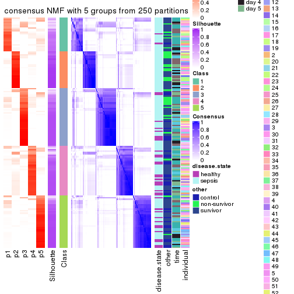</p>

</div>
<div id='tab-CV-NMF-consensus-heatmap-5'>
<pre><code class="r">consensus_heatmap(res, k = 6)
</code></pre>

<p></p>

</div>
</div>

Heatmaps for the membership of samples in all partitions to see how consistent they are:


<script>
$( function() {
	$( '#tabs-CV-NMF-membership-heatmap' ).tabs();
} );
</script>
<div id='tabs-CV-NMF-membership-heatmap'>
<ul>
<li><a href='#tab-CV-NMF-membership-heatmap-1'>k = 2</a></li>
<li><a href='#tab-CV-NMF-membership-heatmap-2'>k = 3</a></li>
<li><a href='#tab-CV-NMF-membership-heatmap-3'>k = 4</a></li>
<li><a href='#tab-CV-NMF-membership-heatmap-4'>k = 5</a></li>
<li><a href='#tab-CV-NMF-membership-heatmap-5'>k = 6</a></li>
</ul>
<div id='tab-CV-NMF-membership-heatmap-1'>
<pre><code class="r">membership_heatmap(res, k = 2)
</code></pre>

<p></p>

</div>
<div id='tab-CV-NMF-membership-heatmap-2'>
<pre><code class="r">membership_heatmap(res, k = 3)
</code></pre>

<p></p>

</div>
<div id='tab-CV-NMF-membership-heatmap-3'>
<pre><code class="r">membership_heatmap(res, k = 4)
</code></pre>

<p></p>

</div>
<div id='tab-CV-NMF-membership-heatmap-4'>
<pre><code class="r">membership_heatmap(res, k = 5)
</code></pre>

<p></p>

</div>
<div id='tab-CV-NMF-membership-heatmap-5'>
<pre><code class="r">membership_heatmap(res, k = 6)
</code></pre>

<p></p>

</div>
</div>

As soon as we have had the classes for columns, we can look for signatures
which are significantly different between classes which can be candidate marks
for certain classes. Following are the heatmaps for signatures.


Signature heatmaps where rows are scaled:


<script>
$( function() {
	$( '#tabs-CV-NMF-get-signatures' ).tabs();
} );
</script>
<div id='tabs-CV-NMF-get-signatures'>
<ul>
<li><a href='#tab-CV-NMF-get-signatures-1'>k = 2</a></li>
<li><a href='#tab-CV-NMF-get-signatures-2'>k = 3</a></li>
<li><a href='#tab-CV-NMF-get-signatures-3'>k = 4</a></li>
<li><a href='#tab-CV-NMF-get-signatures-4'>k = 5</a></li>
<li><a href='#tab-CV-NMF-get-signatures-5'>k = 6</a></li>
</ul>
<div id='tab-CV-NMF-get-signatures-1'>
<pre><code class="r">get_signatures(res, k = 2)
</code></pre>

<p></p>

</div>
<div id='tab-CV-NMF-get-signatures-2'>
<pre><code class="r">get_signatures(res, k = 3)
</code></pre>

<p></p>

</div>
<div id='tab-CV-NMF-get-signatures-3'>
<pre><code class="r">get_signatures(res, k = 4)
</code></pre>

<p></p>

</div>
<div id='tab-CV-NMF-get-signatures-4'>
<pre><code class="r">get_signatures(res, k = 5)
</code></pre>

<p></p>

</div>
<div id='tab-CV-NMF-get-signatures-5'>
<pre><code class="r">get_signatures(res, k = 6)
</code></pre>

<p>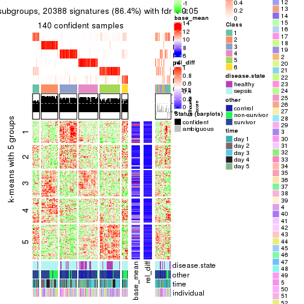</p>

</div>
</div>


Signature heatmaps where rows are not scaled:


<script>
$( function() {
	$( '#tabs-CV-NMF-get-signatures-no-scale' ).tabs();
} );
</script>
<div id='tabs-CV-NMF-get-signatures-no-scale'>
<ul>
<li><a href='#tab-CV-NMF-get-signatures-no-scale-1'>k = 2</a></li>
<li><a href='#tab-CV-NMF-get-signatures-no-scale-2'>k = 3</a></li>
<li><a href='#tab-CV-NMF-get-signatures-no-scale-3'>k = 4</a></li>
<li><a href='#tab-CV-NMF-get-signatures-no-scale-4'>k = 5</a></li>
<li><a href='#tab-CV-NMF-get-signatures-no-scale-5'>k = 6</a></li>
</ul>
<div id='tab-CV-NMF-get-signatures-no-scale-1'>
<pre><code class="r">get_signatures(res, k = 2, scale_rows = FALSE)
</code></pre>

<p></p>

</div>
<div id='tab-CV-NMF-get-signatures-no-scale-2'>
<pre><code class="r">get_signatures(res, k = 3, scale_rows = FALSE)
</code></pre>

<p></p>

</div>
<div id='tab-CV-NMF-get-signatures-no-scale-3'>
<pre><code class="r">get_signatures(res, k = 4, scale_rows = FALSE)
</code></pre>

<p></p>

</div>
<div id='tab-CV-NMF-get-signatures-no-scale-4'>
<pre><code class="r">get_signatures(res, k = 5, scale_rows = FALSE)
</code></pre>

<p></p>

</div>
<div id='tab-CV-NMF-get-signatures-no-scale-5'>
<pre><code class="r">get_signatures(res, k = 6, scale_rows = FALSE)
</code></pre>

<p></p>

</div>
</div>


Compare the overlap of signatures from different k:

```r
compare_signatures(res)
```


`get_signature()` returns a data frame invisibly. TO get the list of signatures, the function
call should be assigned to a variable explicitly. In following code, if `plot` argument is set
to `FALSE`, no heatmap is plotted while only the differential analysis is performed.

```r
# code only for demonstration
tb = get_signature(res, k = ..., plot = FALSE)
```

An example of the output of `tb` is:

```
#>   which_row         fdr    mean_1    mean_2 scaled_mean_1 scaled_mean_2 km
#> 1        38 0.042760348  8.373488  9.131774    -0.5533452     0.5164555  1
#> 2        40 0.018707592  7.106213  8.469186    -0.6173731     0.5762149  1
#> 3        55 0.019134737 10.221463 11.207825    -0.6159697     0.5749050  1
#> 4        59 0.006059896  5.921854  7.869574    -0.6899429     0.6439467  1
#> 5        60 0.018055526  8.928898 10.211722    -0.6204761     0.5791110  1
#> 6        98 0.009384629 15.714769 14.887706     0.6635654    -0.6193277  2
...
```

The columns in `tb` are:

1. `which_row`: row indices corresponding to the input matrix.
2. `fdr`: FDR for the differential test. 
3. `mean_x`: The mean value in group x.
4. `scaled_mean_x`: The mean value in group x after rows are scaled.
5. `km`: Row groups if k-means clustering is applied to rows.


UMAP plot which shows how samples are separated.


<script>
$( function() {
	$( '#tabs-CV-NMF-dimension-reduction' ).tabs();
} );
</script>
<div id='tabs-CV-NMF-dimension-reduction'>
<ul>
<li><a href='#tab-CV-NMF-dimension-reduction-1'>k = 2</a></li>
<li><a href='#tab-CV-NMF-dimension-reduction-2'>k = 3</a></li>
<li><a href='#tab-CV-NMF-dimension-reduction-3'>k = 4</a></li>
<li><a href='#tab-CV-NMF-dimension-reduction-4'>k = 5</a></li>
<li><a href='#tab-CV-NMF-dimension-reduction-5'>k = 6</a></li>
</ul>
<div id='tab-CV-NMF-dimension-reduction-1'>
<pre><code class="r">dimension_reduction(res, k = 2, method = &quot;UMAP&quot;)
</code></pre>

<p></p>

</div>
<div id='tab-CV-NMF-dimension-reduction-2'>
<pre><code class="r">dimension_reduction(res, k = 3, method = &quot;UMAP&quot;)
</code></pre>

<p></p>

</div>
<div id='tab-CV-NMF-dimension-reduction-3'>
<pre><code class="r">dimension_reduction(res, k = 4, method = &quot;UMAP&quot;)
</code></pre>

<p></p>

</div>
<div id='tab-CV-NMF-dimension-reduction-4'>
<pre><code class="r">dimension_reduction(res, k = 5, method = &quot;UMAP&quot;)
</code></pre>

<p></p>

</div>
<div id='tab-CV-NMF-dimension-reduction-5'>
<pre><code class="r">dimension_reduction(res, k = 6, method = &quot;UMAP&quot;)
</code></pre>

<p></p>

</div>
</div>


Following heatmap shows how subgroups are split when increasing `k`:

```r
collect_classes(res)
```


Test correlation between subgroups and known annotations. If the known
annotation is numeric, one-way ANOVA test is applied, and if the known
annotation is discrete, chi-squared contingency table test is applied.

```r
test_to_known_factors(res)
```

```
#>          n disease.state(p) other(p) time(p) individual(p) k
#> CV:NMF 156         0.495132 1.35e-01  0.0120        0.0923 2
#> CV:NMF 158         0.829415 2.01e-01  0.0383        0.5934 3
#> CV:NMF 109         0.105220 8.87e-03  0.2486        0.2168 4
#> CV:NMF 141         0.001118 3.82e-05  0.0112        0.4446 5
#> CV:NMF 140         0.000789 1.59e-09  0.0081        0.1609 6
```


If matrix rows can be associated to genes, consider to use `functional_enrichment(res,
...)` to perform function enrichment for the signature genes. See [this vignette](http://bioconductor.org/packages/devel/bioc/vignettes/cola/inst/doc/functional_enrichment.html) for more detailed explanations.


 

---------------------------------------------------


### MAD:hclust


The object with results only for a single top-value method and a single partition method 
can be extracted as:

```r
res = res_list["MAD", "hclust"]
# you can also extract it by
# res = res_list["MAD:hclust"]
```

A summary of `res` and all the functions that can be applied to it:

```r
res
```

```
#> A 'ConsensusPartition' object with k = 2, 3, 4, 5, 6.
#>   On a matrix with 23598 rows and 163 columns.
#>   Top rows (1000, 2000, 3000, 4000, 5000) are extracted by 'MAD' method.
#>   Subgroups are detected by 'hclust' method.
#>   Performed in total 1250 partitions by row resampling.
#>   Best k for subgroups seems to be 2.
#> 
#> Following methods can be applied to this 'ConsensusPartition' object:
#>  [1] "cola_report"             "collect_classes"         "collect_plots"          
#>  [4] "collect_stats"           "colnames"                "compare_signatures"     
#>  [7] "consensus_heatmap"       "dimension_reduction"     "functional_enrichment"  
#> [10] "get_anno_col"            "get_anno"                "get_classes"            
#> [13] "get_consensus"           "get_matrix"              "get_membership"         
#> [16] "get_param"               "get_signatures"          "get_stats"              
#> [19] "is_best_k"               "is_stable_k"             "membership_heatmap"     
#> [22] "ncol"                    "nrow"                    "plot_ecdf"              
#> [25] "rownames"                "select_partition_number" "show"                   
#> [28] "suggest_best_k"          "test_to_known_factors"
```

`collect_plots()` function collects all the plots made from `res` for all `k` (number of partitions)
into one single page to provide an easy and fast comparison between different `k`.

```r
collect_plots(res)
```


The plots are:

- The first row: a plot of the ECDF (empirical cumulative distribution
  function) curves of the consensus matrix for each `k` and the heatmap of
  predicted classes for each `k`.
- The second row: heatmaps of the consensus matrix for each `k`.
- The third row: heatmaps of the membership matrix for each `k`.
- The fouth row: heatmaps of the signatures for each `k`.

All the plots in panels can be made by individual functions and they are
plotted later in this section.

`select_partition_number()` produces several plots showing different
statistics for choosing "optimized" `k`. There are following statistics:

- ECDF curves of the consensus matrix for each `k`;
- 1-PAC. [The PAC
  score](https://en.wikipedia.org/wiki/Consensus_clustering#Over-interpretation_potential_of_consensus_clustering)
  measures the proportion of the ambiguous subgrouping.
- Mean silhouette score.
- Concordance. The mean probability of fiting the consensus class ids in all
  partitions.
- Area increased. Denote $A_k$ as the area under the ECDF curve for current
  `k`, the area increased is defined as $A_k - A_{k-1}$.
- Rand index. The percent of pairs of samples that are both in a same cluster
  or both are not in a same cluster in the partition of k and k-1.
- Jaccard index. The ratio of pairs of samples are both in a same cluster in
  the partition of k and k-1 and the pairs of samples are both in a same
  cluster in the partition k or k-1.

The detailed explanations of these statistics can be found in [the _cola_
vignette](http://bioconductor.org/packages/devel/bioc/vignettes/cola/inst/doc/cola.html#toc_13).

Generally speaking, lower PAC score, higher mean silhouette score or higher
concordance corresponds to better partition. Rand index and Jaccard index
measure how similar the current partition is compared to partition with `k-1`.
If they are too similar, we won't accept `k` is better than `k-1`.

```r
select_partition_number(res)
```


The numeric values for all these statistics can be obtained by `get_stats()`.

```r
get_stats(res)
```

```
#>   k 1-PAC mean_silhouette concordance area_increased  Rand Jaccard
#> 2 2 0.504           0.753       0.889         0.4411 0.546   0.546
#> 3 3 0.381           0.618       0.795         0.4226 0.786   0.612
#> 4 4 0.468           0.596       0.737         0.1315 0.885   0.685
#> 5 5 0.521           0.531       0.695         0.0729 0.921   0.740
#> 6 6 0.582           0.467       0.660         0.0454 0.899   0.640
```

`suggest_best_k()` suggests the best $k$ based on these statistics. The rules are as follows:

- All $k$ with Jaccard index larger than 0.95 are removed because increasing
  $k$ does not provide enough extra information. If all $k$ are removed, it is
  marked as no subgroup is detected.
- For all $k$ with 1-PAC score larger than 0.9, the maximal $k$ is taken as
  the best $k$, and other $k$ are marked as optional $k$.
- If it does not fit the second rule. The $k$ with the maximal vote of the
  highest 1-PAC score, highest mean silhouette, and highest concordance is
  taken as the best $k$.

```r
suggest_best_k(res)
```

```
#> [1] 2
```


Following shows the table of the partitions (You need to click the **show/hide
code output** link to see it). The membership matrix (columns with name `p*`)
is inferred by
[`clue::cl_consensus()`](https://www.rdocumentation.org/link/cl_consensus?package=clue)
function with the `SE` method. Basically the value in the membership matrix
represents the probability to belong to a certain group. The finall class
label for an item is determined with the group with highest probability it
belongs to.

In `get_classes()` function, the entropy is calculated from the membership
matrix and the silhouette score is calculated from the consensus matrix.


<script>
$( function() {
	$( '#tabs-MAD-hclust-get-classes' ).tabs();
} );
</script>
<div id='tabs-MAD-hclust-get-classes'>
<ul>
<li><a href='#tab-MAD-hclust-get-classes-1'>k = 2</a></li>
<li><a href='#tab-MAD-hclust-get-classes-2'>k = 3</a></li>
<li><a href='#tab-MAD-hclust-get-classes-3'>k = 4</a></li>
<li><a href='#tab-MAD-hclust-get-classes-4'>k = 5</a></li>
<li><a href='#tab-MAD-hclust-get-classes-5'>k = 6</a></li>
</ul>

<div id='tab-MAD-hclust-get-classes-1'>
<p><a id='tab-MAD-hclust-get-classes-1-a' style='color:#0366d6' href='#'>show/hide code output</a></p>
<pre><code class="r">cbind(get_classes(res, k = 2), get_membership(res, k = 2))
</code></pre>

<pre><code>#&gt;            class entropy silhouette    p1    p2
#&gt; GSM1317945     2  0.4431      0.831 0.092 0.908
#&gt; GSM1317946     2  0.9635      0.347 0.388 0.612
#&gt; GSM1317947     1  0.7299      0.754 0.796 0.204
#&gt; GSM1317948     1  0.9909      0.386 0.556 0.444
#&gt; GSM1317949     1  0.7299      0.754 0.796 0.204
#&gt; GSM1317950     1  0.0000      0.817 1.000 0.000
#&gt; GSM1317953     1  0.0000      0.817 1.000 0.000
#&gt; GSM1317954     1  0.6531      0.746 0.832 0.168
#&gt; GSM1317955     1  0.6531      0.746 0.832 0.168
#&gt; GSM1317956     1  0.0000      0.817 1.000 0.000
#&gt; GSM1317957     2  0.2423      0.876 0.040 0.960
#&gt; GSM1317958     1  0.0672      0.817 0.992 0.008
#&gt; GSM1317959     2  0.1633      0.889 0.024 0.976
#&gt; GSM1317960     1  0.9909      0.386 0.556 0.444
#&gt; GSM1317961     2  0.4431      0.830 0.092 0.908
#&gt; GSM1317962     2  0.9970      0.110 0.468 0.532
#&gt; GSM1317963     1  0.9881      0.414 0.564 0.436
#&gt; GSM1317964     1  0.0000      0.817 1.000 0.000
#&gt; GSM1317965     2  0.0938      0.890 0.012 0.988
#&gt; GSM1317966     2  0.4431      0.830 0.092 0.908
#&gt; GSM1317967     2  0.0000      0.893 0.000 1.000
#&gt; GSM1317968     2  0.9970      0.110 0.468 0.532
#&gt; GSM1317969     2  0.0938      0.890 0.012 0.988
#&gt; GSM1317970     2  0.2423      0.876 0.040 0.960
#&gt; GSM1317952     1  0.9909      0.386 0.556 0.444
#&gt; GSM1317951     1  0.6531      0.746 0.832 0.168
#&gt; GSM1317971     2  0.0672      0.892 0.008 0.992
#&gt; GSM1317972     2  0.9970      0.110 0.468 0.532
#&gt; GSM1317973     2  0.0672      0.892 0.008 0.992
#&gt; GSM1317974     2  0.9970      0.110 0.468 0.532
#&gt; GSM1317975     2  0.2603      0.880 0.044 0.956
#&gt; GSM1317978     2  0.9460      0.411 0.364 0.636
#&gt; GSM1317979     2  0.9522      0.302 0.372 0.628
#&gt; GSM1317980     2  0.9522      0.302 0.372 0.628
#&gt; GSM1317981     2  0.2603      0.880 0.044 0.956
#&gt; GSM1317982     2  0.9522      0.302 0.372 0.628
#&gt; GSM1317983     1  0.0000      0.817 1.000 0.000
#&gt; GSM1317984     2  0.0000      0.893 0.000 1.000
#&gt; GSM1317985     2  0.0000      0.893 0.000 1.000
#&gt; GSM1317986     1  0.0000      0.817 1.000 0.000
#&gt; GSM1317987     2  0.2603      0.880 0.044 0.956
#&gt; GSM1317988     2  0.0672      0.892 0.008 0.992
#&gt; GSM1317989     1  0.6148      0.784 0.848 0.152
#&gt; GSM1317990     2  0.2603      0.880 0.044 0.956
#&gt; GSM1317991     2  0.0672      0.892 0.008 0.992
#&gt; GSM1317992     2  0.0672      0.892 0.008 0.992
#&gt; GSM1317993     2  0.1633      0.889 0.024 0.976
#&gt; GSM1317994     2  0.0000      0.893 0.000 1.000
#&gt; GSM1317977     1  0.6148      0.784 0.848 0.152
#&gt; GSM1317976     2  0.9970      0.110 0.468 0.532
#&gt; GSM1317995     2  0.0000      0.893 0.000 1.000
#&gt; GSM1317996     2  0.3431      0.866 0.064 0.936
#&gt; GSM1317997     2  0.0000      0.893 0.000 1.000
#&gt; GSM1317998     1  0.0000      0.817 1.000 0.000
#&gt; GSM1317999     1  0.1184      0.818 0.984 0.016
#&gt; GSM1318002     2  0.0000      0.893 0.000 1.000
#&gt; GSM1318003     2  0.0000      0.893 0.000 1.000
#&gt; GSM1318004     2  0.1414      0.890 0.020 0.980
#&gt; GSM1318005     2  0.1414      0.890 0.020 0.980
#&gt; GSM1318006     1  0.1184      0.818 0.984 0.016
#&gt; GSM1318007     2  0.1414      0.890 0.020 0.980
#&gt; GSM1318008     1  0.1184      0.818 0.984 0.016
#&gt; GSM1318009     2  0.1633      0.889 0.024 0.976
#&gt; GSM1318010     2  0.0000      0.893 0.000 1.000
#&gt; GSM1318011     1  0.9815      0.444 0.580 0.420
#&gt; GSM1318012     1  0.9815      0.444 0.580 0.420
#&gt; GSM1318013     2  0.1414      0.890 0.020 0.980
#&gt; GSM1318014     1  0.9815      0.444 0.580 0.420
#&gt; GSM1318015     2  0.0000      0.893 0.000 1.000
#&gt; GSM1318001     2  0.0000      0.893 0.000 1.000
#&gt; GSM1318000     2  0.1633      0.889 0.024 0.976
#&gt; GSM1318016     2  0.1633      0.889 0.024 0.976
#&gt; GSM1318017     1  0.0000      0.817 1.000 0.000
#&gt; GSM1318019     2  0.0000      0.893 0.000 1.000
#&gt; GSM1318020     2  0.8267      0.592 0.260 0.740
#&gt; GSM1318021     2  0.1633      0.889 0.024 0.976
#&gt; GSM1318022     2  0.0672      0.892 0.008 0.992
#&gt; GSM1318023     1  0.0000      0.817 1.000 0.000
#&gt; GSM1318024     2  0.1633      0.889 0.024 0.976
#&gt; GSM1318025     2  0.0000      0.893 0.000 1.000
#&gt; GSM1318026     2  0.0000      0.893 0.000 1.000
#&gt; GSM1318027     2  0.0000      0.893 0.000 1.000
#&gt; GSM1318028     1  0.8081      0.697 0.752 0.248
#&gt; GSM1318029     2  0.0000      0.893 0.000 1.000
#&gt; GSM1318018     1  0.0000      0.817 1.000 0.000
#&gt; GSM1318030     2  0.9850      0.096 0.428 0.572
#&gt; GSM1318031     2  0.0000      0.893 0.000 1.000
#&gt; GSM1318033     1  0.9710      0.425 0.600 0.400
#&gt; GSM1318034     1  0.7602      0.741 0.780 0.220
#&gt; GSM1318035     2  0.1633      0.889 0.024 0.976
#&gt; GSM1318036     1  0.9998      0.153 0.508 0.492
#&gt; GSM1318037     2  0.9850      0.096 0.428 0.572
#&gt; GSM1318038     2  0.9552      0.289 0.376 0.624
#&gt; GSM1318039     1  0.0000      0.817 1.000 0.000
#&gt; GSM1318040     2  0.0000      0.893 0.000 1.000
#&gt; GSM1318032     2  0.0000      0.893 0.000 1.000
#&gt; GSM1317914     2  0.0000      0.893 0.000 1.000
#&gt; GSM1317915     1  0.0000      0.817 1.000 0.000
#&gt; GSM1317916     1  0.0376      0.818 0.996 0.004
#&gt; GSM1317917     2  0.9552      0.289 0.376 0.624
#&gt; GSM1317918     1  0.0000      0.817 1.000 0.000
#&gt; GSM1317919     2  0.0000      0.893 0.000 1.000
#&gt; GSM1317920     2  0.0000      0.893 0.000 1.000
#&gt; GSM1317921     2  0.0000      0.893 0.000 1.000
#&gt; GSM1317922     1  0.7453      0.747 0.788 0.212
#&gt; GSM1317923     2  0.0672      0.892 0.008 0.992
#&gt; GSM1317924     2  0.0000      0.893 0.000 1.000
#&gt; GSM1317925     2  0.1633      0.889 0.024 0.976
#&gt; GSM1317926     2  0.0672      0.892 0.008 0.992
#&gt; GSM1317927     2  0.1633      0.889 0.024 0.976
#&gt; GSM1317928     2  0.0000      0.893 0.000 1.000
#&gt; GSM1317929     2  0.0000      0.893 0.000 1.000
#&gt; GSM1317930     2  0.0000      0.893 0.000 1.000
#&gt; GSM1317931     2  0.0000      0.893 0.000 1.000
#&gt; GSM1317932     2  0.8267      0.592 0.260 0.740
#&gt; GSM1317933     2  0.1633      0.889 0.024 0.976
#&gt; GSM1317934     2  0.8267      0.592 0.260 0.740
#&gt; GSM1317935     2  0.8267      0.592 0.260 0.740
#&gt; GSM1317936     2  0.0000      0.893 0.000 1.000
#&gt; GSM1317937     1  0.0000      0.817 1.000 0.000
#&gt; GSM1317938     2  0.1633      0.889 0.024 0.976
#&gt; GSM1317939     2  0.1633      0.889 0.024 0.976
#&gt; GSM1317940     1  0.4431      0.804 0.908 0.092
#&gt; GSM1317941     2  0.8499      0.594 0.276 0.724
#&gt; GSM1317942     2  0.1633      0.889 0.024 0.976
#&gt; GSM1317943     2  0.1633      0.889 0.024 0.976
#&gt; GSM1317944     2  0.1633      0.889 0.024 0.976
#&gt; GSM1317896     2  0.6887      0.716 0.184 0.816
#&gt; GSM1317897     1  0.0000      0.817 1.000 0.000
#&gt; GSM1317898     1  0.2948      0.812 0.948 0.052
#&gt; GSM1317899     1  0.1184      0.818 0.984 0.016
#&gt; GSM1317900     2  0.6973      0.711 0.188 0.812
#&gt; GSM1317901     1  0.7299      0.754 0.796 0.204
#&gt; GSM1317902     1  0.0376      0.818 0.996 0.004
#&gt; GSM1317903     1  0.0376      0.818 0.996 0.004
#&gt; GSM1317904     2  0.1633      0.889 0.024 0.976
#&gt; GSM1317905     2  0.0376      0.893 0.004 0.996
#&gt; GSM1317906     2  0.0376      0.893 0.004 0.996
#&gt; GSM1317907     2  0.4431      0.831 0.092 0.908
#&gt; GSM1317908     1  0.7299      0.754 0.796 0.204
#&gt; GSM1317909     1  0.9286      0.593 0.656 0.344
#&gt; GSM1317910     1  0.9286      0.593 0.656 0.344
#&gt; GSM1317911     1  0.9286      0.593 0.656 0.344
#&gt; GSM1317912     2  0.4431      0.831 0.092 0.908
#&gt; GSM1317913     2  0.4431      0.831 0.092 0.908
#&gt; GSM1318041     1  0.9970      0.322 0.532 0.468
#&gt; GSM1318042     2  0.5519      0.786 0.128 0.872
#&gt; GSM1318043     2  0.5519      0.786 0.128 0.872
#&gt; GSM1318044     1  0.0000      0.817 1.000 0.000
#&gt; GSM1318045     1  0.0000      0.817 1.000 0.000
#&gt; GSM1318046     1  0.0000      0.817 1.000 0.000
#&gt; GSM1318047     1  0.9833      0.442 0.576 0.424
#&gt; GSM1318048     1  0.6973      0.766 0.812 0.188
#&gt; GSM1318049     1  0.6973      0.766 0.812 0.188
#&gt; GSM1318050     2  0.1633      0.889 0.024 0.976
#&gt; GSM1318051     2  0.1633      0.889 0.024 0.976
#&gt; GSM1318052     2  0.0000      0.893 0.000 1.000
#&gt; GSM1318053     2  0.0000      0.893 0.000 1.000
#&gt; GSM1318054     2  0.0000      0.893 0.000 1.000
#&gt; GSM1318055     2  0.0000      0.893 0.000 1.000
#&gt; GSM1318056     2  0.0000      0.893 0.000 1.000
#&gt; GSM1318057     2  0.0000      0.893 0.000 1.000
#&gt; GSM1318058     2  0.0000      0.893 0.000 1.000
</code></pre>

<script>
$('#tab-MAD-hclust-get-classes-1-a').parent().next().next().hide();
$('#tab-MAD-hclust-get-classes-1-a').click(function(){
  $('#tab-MAD-hclust-get-classes-1-a').parent().next().next().toggle();
  return(false);
});
</script>
</div>

<div id='tab-MAD-hclust-get-classes-2'>
<p><a id='tab-MAD-hclust-get-classes-2-a' style='color:#0366d6' href='#'>show/hide code output</a></p>
<pre><code class="r">cbind(get_classes(res, k = 3), get_membership(res, k = 3))
</code></pre>

<pre><code>#&gt;            class entropy silhouette    p1    p2    p3
#&gt; GSM1317945     2  0.7058     0.5452 0.080 0.708 0.212
#&gt; GSM1317946     2  0.7107     0.4030 0.340 0.624 0.036
#&gt; GSM1317947     1  0.6264     0.6808 0.724 0.032 0.244
#&gt; GSM1317948     1  0.9582     0.4308 0.480 0.256 0.264
#&gt; GSM1317949     1  0.6264     0.6808 0.724 0.032 0.244
#&gt; GSM1317950     1  0.0000     0.7922 1.000 0.000 0.000
#&gt; GSM1317953     1  0.0000     0.7922 1.000 0.000 0.000
#&gt; GSM1317954     1  0.4121     0.7034 0.832 0.168 0.000
#&gt; GSM1317955     1  0.4121     0.7034 0.832 0.168 0.000
#&gt; GSM1317956     1  0.0000     0.7922 1.000 0.000 0.000
#&gt; GSM1317957     2  0.3042     0.7524 0.040 0.920 0.040
#&gt; GSM1317958     1  0.0475     0.7927 0.992 0.004 0.004
#&gt; GSM1317959     2  0.2356     0.7573 0.000 0.928 0.072
#&gt; GSM1317960     1  0.9582     0.4308 0.480 0.256 0.264
#&gt; GSM1317961     3  0.7853     0.4267 0.060 0.384 0.556
#&gt; GSM1317962     2  0.7145     0.1730 0.440 0.536 0.024
#&gt; GSM1317963     1  0.9463     0.4549 0.500 0.244 0.256
#&gt; GSM1317964     1  0.0000     0.7922 1.000 0.000 0.000
#&gt; GSM1317965     3  0.6330     0.4705 0.004 0.396 0.600
#&gt; GSM1317966     3  0.7853     0.4267 0.060 0.384 0.556
#&gt; GSM1317967     2  0.3192     0.7464 0.000 0.888 0.112
#&gt; GSM1317968     2  0.7145     0.1730 0.440 0.536 0.024
#&gt; GSM1317969     3  0.6330     0.4705 0.004 0.396 0.600
#&gt; GSM1317970     2  0.3042     0.7524 0.040 0.920 0.040
#&gt; GSM1317952     1  0.9582     0.4308 0.480 0.256 0.264
#&gt; GSM1317951     1  0.4121     0.7034 0.832 0.168 0.000
#&gt; GSM1317971     2  0.6308    -0.2005 0.000 0.508 0.492
#&gt; GSM1317972     2  0.7145     0.1730 0.440 0.536 0.024
#&gt; GSM1317973     2  0.3038     0.7515 0.000 0.896 0.104
#&gt; GSM1317974     2  0.7145     0.1730 0.440 0.536 0.024
#&gt; GSM1317975     2  0.1781     0.7583 0.020 0.960 0.020
#&gt; GSM1317978     2  0.6625     0.4363 0.316 0.660 0.024
#&gt; GSM1317979     3  0.9987     0.0151 0.308 0.344 0.348
#&gt; GSM1317980     3  0.9987     0.0151 0.308 0.344 0.348
#&gt; GSM1317981     2  0.1781     0.7583 0.020 0.960 0.020
#&gt; GSM1317982     3  0.9987     0.0151 0.308 0.344 0.348
#&gt; GSM1317983     1  0.0000     0.7922 1.000 0.000 0.000
#&gt; GSM1317984     3  0.2448     0.7259 0.000 0.076 0.924
#&gt; GSM1317985     3  0.2448     0.7259 0.000 0.076 0.924
#&gt; GSM1317986     1  0.0000     0.7922 1.000 0.000 0.000
#&gt; GSM1317987     2  0.1781     0.7583 0.020 0.960 0.020
#&gt; GSM1317988     2  0.3038     0.7515 0.000 0.896 0.104
#&gt; GSM1317989     1  0.5891     0.7314 0.780 0.052 0.168
#&gt; GSM1317990     2  0.1781     0.7583 0.020 0.960 0.020
#&gt; GSM1317991     2  0.6308    -0.2005 0.000 0.508 0.492
#&gt; GSM1317992     2  0.6308    -0.2005 0.000 0.508 0.492
#&gt; GSM1317993     2  0.0892     0.7595 0.000 0.980 0.020
#&gt; GSM1317994     3  0.2448     0.7259 0.000 0.076 0.924
#&gt; GSM1317977     1  0.5891     0.7314 0.780 0.052 0.168
#&gt; GSM1317976     2  0.7145     0.1730 0.440 0.536 0.024
#&gt; GSM1317995     3  0.2448     0.7259 0.000 0.076 0.924
#&gt; GSM1317996     2  0.1765     0.7456 0.040 0.956 0.004
#&gt; GSM1317997     3  0.2448     0.7259 0.000 0.076 0.924
#&gt; GSM1317998     1  0.0000     0.7922 1.000 0.000 0.000
#&gt; GSM1317999     1  0.0848     0.7926 0.984 0.008 0.008
#&gt; GSM1318002     2  0.1964     0.7578 0.000 0.944 0.056
#&gt; GSM1318003     2  0.1964     0.7578 0.000 0.944 0.056
#&gt; GSM1318004     2  0.3482     0.7291 0.000 0.872 0.128
#&gt; GSM1318005     2  0.3482     0.7291 0.000 0.872 0.128
#&gt; GSM1318006     1  0.1636     0.7913 0.964 0.020 0.016
#&gt; GSM1318007     2  0.3482     0.7291 0.000 0.872 0.128
#&gt; GSM1318008     1  0.0848     0.7926 0.984 0.008 0.008
#&gt; GSM1318009     2  0.2356     0.7573 0.000 0.928 0.072
#&gt; GSM1318010     3  0.2448     0.7259 0.000 0.076 0.924
#&gt; GSM1318011     1  0.9438     0.4658 0.504 0.252 0.244
#&gt; GSM1318012     1  0.9438     0.4658 0.504 0.252 0.244
#&gt; GSM1318013     2  0.3482     0.7291 0.000 0.872 0.128
#&gt; GSM1318014     1  0.9438     0.4658 0.504 0.252 0.244
#&gt; GSM1318015     2  0.1964     0.7578 0.000 0.944 0.056
#&gt; GSM1318001     3  0.2448     0.7259 0.000 0.076 0.924
#&gt; GSM1318000     2  0.2356     0.7573 0.000 0.928 0.072
#&gt; GSM1318016     2  0.0892     0.7595 0.000 0.980 0.020
#&gt; GSM1318017     1  0.0000     0.7922 1.000 0.000 0.000
#&gt; GSM1318019     2  0.3267     0.7462 0.000 0.884 0.116
#&gt; GSM1318020     3  0.8649     0.5623 0.204 0.196 0.600
#&gt; GSM1318021     2  0.0892     0.7595 0.000 0.980 0.020
#&gt; GSM1318022     3  0.3551     0.7156 0.000 0.132 0.868
#&gt; GSM1318023     1  0.0000     0.7922 1.000 0.000 0.000
#&gt; GSM1318024     2  0.0892     0.7595 0.000 0.980 0.020
#&gt; GSM1318025     3  0.4452     0.7071 0.000 0.192 0.808
#&gt; GSM1318026     2  0.2165     0.7544 0.000 0.936 0.064
#&gt; GSM1318027     2  0.3267     0.7462 0.000 0.884 0.116
#&gt; GSM1318028     1  0.6767     0.6609 0.720 0.216 0.064
#&gt; GSM1318029     3  0.6225     0.4210 0.000 0.432 0.568
#&gt; GSM1318018     1  0.0000     0.7922 1.000 0.000 0.000
#&gt; GSM1318030     2  0.9666    -0.0980 0.356 0.428 0.216
#&gt; GSM1318031     3  0.4452     0.7071 0.000 0.192 0.808
#&gt; GSM1318033     1  0.8699     0.3431 0.512 0.376 0.112
#&gt; GSM1318034     1  0.6337     0.6623 0.708 0.028 0.264
#&gt; GSM1318035     2  0.1163     0.7604 0.000 0.972 0.028
#&gt; GSM1318036     2  0.8981    -0.1326 0.424 0.448 0.128
#&gt; GSM1318037     2  0.9666    -0.0980 0.356 0.428 0.216
#&gt; GSM1318038     3  0.6200     0.2775 0.312 0.012 0.676
#&gt; GSM1318039     1  0.0000     0.7922 1.000 0.000 0.000
#&gt; GSM1318040     3  0.4452     0.7071 0.000 0.192 0.808
#&gt; GSM1318032     3  0.4452     0.7071 0.000 0.192 0.808
#&gt; GSM1317914     3  0.4002     0.7007 0.000 0.160 0.840
#&gt; GSM1317915     1  0.0000     0.7922 1.000 0.000 0.000
#&gt; GSM1317916     1  0.2356     0.7826 0.928 0.000 0.072
#&gt; GSM1317917     3  0.6200     0.2775 0.312 0.012 0.676
#&gt; GSM1317918     1  0.0000     0.7922 1.000 0.000 0.000
#&gt; GSM1317919     3  0.5706     0.6052 0.000 0.320 0.680
#&gt; GSM1317920     3  0.6225     0.4210 0.000 0.432 0.568
#&gt; GSM1317921     3  0.5706     0.6052 0.000 0.320 0.680
#&gt; GSM1317922     1  0.5728     0.6604 0.720 0.008 0.272
#&gt; GSM1317923     3  0.3551     0.7156 0.000 0.132 0.868
#&gt; GSM1317924     3  0.4452     0.7071 0.000 0.192 0.808
#&gt; GSM1317925     2  0.0892     0.7595 0.000 0.980 0.020
#&gt; GSM1317926     3  0.3551     0.7156 0.000 0.132 0.868
#&gt; GSM1317927     2  0.1031     0.7601 0.000 0.976 0.024
#&gt; GSM1317928     2  0.4842     0.5772 0.000 0.776 0.224
#&gt; GSM1317929     3  0.6225     0.4210 0.000 0.432 0.568
#&gt; GSM1317930     2  0.4842     0.5772 0.000 0.776 0.224
#&gt; GSM1317931     3  0.2448     0.7259 0.000 0.076 0.924
#&gt; GSM1317932     3  0.8649     0.5623 0.204 0.196 0.600
#&gt; GSM1317933     2  0.1031     0.7601 0.000 0.976 0.024
#&gt; GSM1317934     3  0.8649     0.5623 0.204 0.196 0.600
#&gt; GSM1317935     3  0.8649     0.5623 0.204 0.196 0.600
#&gt; GSM1317936     3  0.2448     0.7259 0.000 0.076 0.924
#&gt; GSM1317937     1  0.0000     0.7922 1.000 0.000 0.000
#&gt; GSM1317938     2  0.1163     0.7604 0.000 0.972 0.028
#&gt; GSM1317939     2  0.1163     0.7604 0.000 0.972 0.028
#&gt; GSM1317940     1  0.4189     0.7713 0.876 0.056 0.068
#&gt; GSM1317941     2  0.5982     0.5487 0.228 0.744 0.028
#&gt; GSM1317942     2  0.1163     0.7604 0.000 0.972 0.028
#&gt; GSM1317943     2  0.1163     0.7604 0.000 0.972 0.028
#&gt; GSM1317944     2  0.1163     0.7604 0.000 0.972 0.028
#&gt; GSM1317896     3  0.5603     0.6418 0.136 0.060 0.804
#&gt; GSM1317897     1  0.0000     0.7922 1.000 0.000 0.000
#&gt; GSM1317898     1  0.2773     0.7842 0.928 0.024 0.048
#&gt; GSM1317899     1  0.1636     0.7913 0.964 0.020 0.016
#&gt; GSM1317900     3  0.8334     0.5882 0.136 0.248 0.616
#&gt; GSM1317901     1  0.6264     0.6808 0.724 0.032 0.244
#&gt; GSM1317902     1  0.0237     0.7925 0.996 0.004 0.000
#&gt; GSM1317903     1  0.0237     0.7925 0.996 0.004 0.000
#&gt; GSM1317904     2  0.2356     0.7573 0.000 0.928 0.072
#&gt; GSM1317905     2  0.5285     0.5345 0.004 0.752 0.244
#&gt; GSM1317906     2  0.5285     0.5345 0.004 0.752 0.244
#&gt; GSM1317907     2  0.7058     0.5452 0.080 0.708 0.212
#&gt; GSM1317908     1  0.6264     0.6808 0.724 0.032 0.244
#&gt; GSM1317909     1  0.8657     0.5646 0.592 0.164 0.244
#&gt; GSM1317910     1  0.8657     0.5646 0.592 0.164 0.244
#&gt; GSM1317911     1  0.8657     0.5646 0.592 0.164 0.244
#&gt; GSM1317912     2  0.7058     0.5452 0.080 0.708 0.212
#&gt; GSM1317913     2  0.7058     0.5452 0.080 0.708 0.212
#&gt; GSM1318041     1  0.9413     0.3743 0.468 0.184 0.348
#&gt; GSM1318042     3  0.4316     0.6871 0.088 0.044 0.868
#&gt; GSM1318043     3  0.4316     0.6871 0.088 0.044 0.868
#&gt; GSM1318044     1  0.0000     0.7922 1.000 0.000 0.000
#&gt; GSM1318045     1  0.0000     0.7922 1.000 0.000 0.000
#&gt; GSM1318046     1  0.0000     0.7922 1.000 0.000 0.000
#&gt; GSM1318047     1  0.9433     0.4657 0.504 0.236 0.260
#&gt; GSM1318048     1  0.6099     0.6965 0.740 0.032 0.228
#&gt; GSM1318049     1  0.6099     0.6965 0.740 0.032 0.228
#&gt; GSM1318050     2  0.2356     0.7573 0.000 0.928 0.072
#&gt; GSM1318051     2  0.2356     0.7573 0.000 0.928 0.072
#&gt; GSM1318052     2  0.3192     0.7464 0.000 0.888 0.112
#&gt; GSM1318053     2  0.3192     0.7464 0.000 0.888 0.112
#&gt; GSM1318054     2  0.3192     0.7464 0.000 0.888 0.112
#&gt; GSM1318055     3  0.3482     0.7258 0.000 0.128 0.872
#&gt; GSM1318056     2  0.3192     0.7464 0.000 0.888 0.112
#&gt; GSM1318057     2  0.3192     0.7464 0.000 0.888 0.112
#&gt; GSM1318058     2  0.3192     0.7464 0.000 0.888 0.112
</code></pre>

<script>
$('#tab-MAD-hclust-get-classes-2-a').parent().next().next().hide();
$('#tab-MAD-hclust-get-classes-2-a').click(function(){
  $('#tab-MAD-hclust-get-classes-2-a').parent().next().next().toggle();
  return(false);
});
</script>
</div>

<div id='tab-MAD-hclust-get-classes-3'>
<p><a id='tab-MAD-hclust-get-classes-3-a' style='color:#0366d6' href='#'>show/hide code output</a></p>
<pre><code class="r">cbind(get_classes(res, k = 4), get_membership(res, k = 4))
</code></pre>

<pre><code>#&gt;            class entropy silhouette    p1    p2    p3    p4
#&gt; GSM1317945     2  0.5588     0.5227 0.004 0.600 0.020 0.376
#&gt; GSM1317946     2  0.7232     0.3556 0.268 0.568 0.008 0.156
#&gt; GSM1317947     4  0.5230     0.4127 0.368 0.004 0.008 0.620
#&gt; GSM1317948     4  0.6471     0.6015 0.196 0.144 0.004 0.656
#&gt; GSM1317949     4  0.5230     0.4127 0.368 0.004 0.008 0.620
#&gt; GSM1317950     1  0.0000     0.8792 1.000 0.000 0.000 0.000
#&gt; GSM1317953     1  0.0000     0.8792 1.000 0.000 0.000 0.000
#&gt; GSM1317954     1  0.4356     0.6408 0.804 0.148 0.000 0.048
#&gt; GSM1317955     1  0.4356     0.6408 0.804 0.148 0.000 0.048
#&gt; GSM1317956     1  0.0000     0.8792 1.000 0.000 0.000 0.000
#&gt; GSM1317957     2  0.3884     0.7624 0.008 0.848 0.036 0.108
#&gt; GSM1317958     1  0.1118     0.8728 0.964 0.000 0.000 0.036
#&gt; GSM1317959     2  0.3547     0.7589 0.000 0.840 0.016 0.144
#&gt; GSM1317960     4  0.6471     0.6015 0.196 0.144 0.004 0.656
#&gt; GSM1317961     3  0.8528     0.3730 0.024 0.328 0.356 0.292
#&gt; GSM1317962     2  0.7460     0.1555 0.368 0.472 0.004 0.156
#&gt; GSM1317963     4  0.6814     0.5656 0.268 0.128 0.004 0.600
#&gt; GSM1317964     1  0.0000     0.8792 1.000 0.000 0.000 0.000
#&gt; GSM1317965     3  0.7511     0.4597 0.000 0.336 0.468 0.196
#&gt; GSM1317966     3  0.8528     0.3730 0.024 0.328 0.356 0.292
#&gt; GSM1317967     2  0.4663     0.7571 0.000 0.788 0.064 0.148
#&gt; GSM1317968     2  0.7460     0.1555 0.368 0.472 0.004 0.156
#&gt; GSM1317969     3  0.7511     0.4597 0.000 0.336 0.468 0.196
#&gt; GSM1317970     2  0.3884     0.7624 0.008 0.848 0.036 0.108
#&gt; GSM1317952     4  0.6471     0.6015 0.196 0.144 0.004 0.656
#&gt; GSM1317951     1  0.4356     0.6408 0.804 0.148 0.000 0.048
#&gt; GSM1317971     2  0.7171    -0.2175 0.000 0.464 0.400 0.136
#&gt; GSM1317972     2  0.7460     0.1555 0.368 0.472 0.004 0.156
#&gt; GSM1317973     2  0.4285     0.7586 0.000 0.804 0.040 0.156
#&gt; GSM1317974     2  0.7460     0.1555 0.368 0.472 0.004 0.156
#&gt; GSM1317975     2  0.1388     0.7649 0.012 0.960 0.000 0.028
#&gt; GSM1317978     2  0.6878     0.3947 0.244 0.604 0.004 0.148
#&gt; GSM1317979     4  0.7479     0.5037 0.068 0.204 0.104 0.624
#&gt; GSM1317980     4  0.7479     0.5037 0.068 0.204 0.104 0.624
#&gt; GSM1317981     2  0.1388     0.7649 0.012 0.960 0.000 0.028
#&gt; GSM1317982     4  0.7479     0.5037 0.068 0.204 0.104 0.624
#&gt; GSM1317983     1  0.0000     0.8792 1.000 0.000 0.000 0.000
#&gt; GSM1317984     3  0.0657     0.7121 0.000 0.004 0.984 0.012
#&gt; GSM1317985     3  0.0657     0.7121 0.000 0.004 0.984 0.012
#&gt; GSM1317986     1  0.0000     0.8792 1.000 0.000 0.000 0.000
#&gt; GSM1317987     2  0.1388     0.7649 0.012 0.960 0.000 0.028
#&gt; GSM1317988     2  0.4285     0.7586 0.000 0.804 0.040 0.156
#&gt; GSM1317989     4  0.5976     0.2686 0.452 0.024 0.008 0.516
#&gt; GSM1317990     2  0.1388     0.7649 0.012 0.960 0.000 0.028
#&gt; GSM1317991     2  0.7171    -0.2175 0.000 0.464 0.400 0.136
#&gt; GSM1317992     2  0.7171    -0.2175 0.000 0.464 0.400 0.136
#&gt; GSM1317993     2  0.0707     0.7669 0.000 0.980 0.000 0.020
#&gt; GSM1317994     3  0.0657     0.7121 0.000 0.004 0.984 0.012
#&gt; GSM1317977     4  0.5976     0.2686 0.452 0.024 0.008 0.516
#&gt; GSM1317976     2  0.7460     0.1555 0.368 0.472 0.004 0.156
#&gt; GSM1317995     3  0.0657     0.7121 0.000 0.004 0.984 0.012
#&gt; GSM1317996     2  0.2796     0.7582 0.008 0.892 0.004 0.096
#&gt; GSM1317997     3  0.0657     0.7121 0.000 0.004 0.984 0.012
#&gt; GSM1317998     1  0.0336     0.8805 0.992 0.000 0.000 0.008
#&gt; GSM1317999     1  0.1118     0.8694 0.964 0.000 0.000 0.036
#&gt; GSM1318002     2  0.2036     0.7608 0.000 0.936 0.032 0.032
#&gt; GSM1318003     2  0.2036     0.7608 0.000 0.936 0.032 0.032
#&gt; GSM1318004     2  0.4426     0.7288 0.000 0.772 0.024 0.204
#&gt; GSM1318005     2  0.4426     0.7288 0.000 0.772 0.024 0.204
#&gt; GSM1318006     1  0.4422     0.5797 0.736 0.008 0.000 0.256
#&gt; GSM1318007     2  0.4426     0.7288 0.000 0.772 0.024 0.204
#&gt; GSM1318008     1  0.1118     0.8694 0.964 0.000 0.000 0.036
#&gt; GSM1318009     2  0.3547     0.7589 0.000 0.840 0.016 0.144
#&gt; GSM1318010     3  0.0657     0.7121 0.000 0.004 0.984 0.012
#&gt; GSM1318011     4  0.6624     0.5950 0.220 0.140 0.004 0.636
#&gt; GSM1318012     4  0.6624     0.5950 0.220 0.140 0.004 0.636
#&gt; GSM1318013     2  0.4426     0.7288 0.000 0.772 0.024 0.204
#&gt; GSM1318014     4  0.6624     0.5950 0.220 0.140 0.004 0.636
#&gt; GSM1318015     2  0.2036     0.7608 0.000 0.936 0.032 0.032
#&gt; GSM1318001     3  0.0657     0.7121 0.000 0.004 0.984 0.012
#&gt; GSM1318000     2  0.3547     0.7589 0.000 0.840 0.016 0.144
#&gt; GSM1318016     2  0.0707     0.7669 0.000 0.980 0.000 0.020
#&gt; GSM1318017     1  0.0336     0.8805 0.992 0.000 0.000 0.008
#&gt; GSM1318019     2  0.4436     0.7613 0.000 0.800 0.052 0.148
#&gt; GSM1318020     4  0.8653    -0.2737 0.068 0.148 0.384 0.400
#&gt; GSM1318021     2  0.0707     0.7669 0.000 0.980 0.000 0.020
#&gt; GSM1318022     3  0.4906     0.6639 0.000 0.084 0.776 0.140
#&gt; GSM1318023     1  0.0336     0.8805 0.992 0.000 0.000 0.008
#&gt; GSM1318024     2  0.0707     0.7669 0.000 0.980 0.000 0.020
#&gt; GSM1318025     3  0.4840     0.7069 0.000 0.100 0.784 0.116
#&gt; GSM1318026     2  0.2224     0.7566 0.000 0.928 0.040 0.032
#&gt; GSM1318027     2  0.4436     0.7613 0.000 0.800 0.052 0.148
#&gt; GSM1318028     1  0.6469     0.4044 0.644 0.164 0.000 0.192
#&gt; GSM1318029     3  0.7408     0.4524 0.000 0.364 0.464 0.172
#&gt; GSM1318018     1  0.0336     0.8805 0.992 0.000 0.000 0.008
#&gt; GSM1318030     4  0.7548     0.4327 0.168 0.316 0.008 0.508
#&gt; GSM1318031     3  0.4840     0.7069 0.000 0.100 0.784 0.116
#&gt; GSM1318033     4  0.7956     0.4413 0.300 0.276 0.004 0.420
#&gt; GSM1318034     4  0.6863     0.3604 0.392 0.004 0.092 0.512
#&gt; GSM1318035     2  0.0524     0.7722 0.000 0.988 0.004 0.008
#&gt; GSM1318036     4  0.8025     0.3618 0.236 0.348 0.008 0.408
#&gt; GSM1318037     4  0.7548     0.4327 0.168 0.316 0.008 0.508
#&gt; GSM1318038     4  0.5678    -0.0444 0.024 0.000 0.452 0.524
#&gt; GSM1318039     1  0.0707     0.8753 0.980 0.000 0.000 0.020
#&gt; GSM1318040     3  0.4840     0.7069 0.000 0.100 0.784 0.116
#&gt; GSM1318032     3  0.4840     0.7069 0.000 0.100 0.784 0.116
#&gt; GSM1317914     3  0.4610     0.6661 0.000 0.100 0.800 0.100
#&gt; GSM1317915     1  0.0707     0.8753 0.980 0.000 0.000 0.020
#&gt; GSM1317916     1  0.4855     0.2010 0.600 0.000 0.000 0.400
#&gt; GSM1317917     4  0.5678    -0.0444 0.024 0.000 0.452 0.524
#&gt; GSM1317918     1  0.0707     0.8753 0.980 0.000 0.000 0.020
#&gt; GSM1317919     3  0.6897     0.6284 0.000 0.256 0.584 0.160
#&gt; GSM1317920     3  0.7408     0.4524 0.000 0.364 0.464 0.172
#&gt; GSM1317921     3  0.6897     0.6284 0.000 0.256 0.584 0.160
#&gt; GSM1317922     4  0.7081     0.3289 0.388 0.000 0.128 0.484
#&gt; GSM1317923     3  0.4906     0.6639 0.000 0.084 0.776 0.140
#&gt; GSM1317924     3  0.4840     0.7069 0.000 0.100 0.784 0.116
#&gt; GSM1317925     2  0.0000     0.7718 0.000 1.000 0.000 0.000
#&gt; GSM1317926     3  0.4906     0.6639 0.000 0.084 0.776 0.140
#&gt; GSM1317927     2  0.0376     0.7723 0.000 0.992 0.004 0.004
#&gt; GSM1317928     2  0.4507     0.5589 0.000 0.756 0.224 0.020
#&gt; GSM1317929     3  0.7408     0.4524 0.000 0.364 0.464 0.172
#&gt; GSM1317930     2  0.4507     0.5589 0.000 0.756 0.224 0.020
#&gt; GSM1317931     3  0.0657     0.7121 0.000 0.004 0.984 0.012
#&gt; GSM1317932     4  0.8653    -0.2737 0.068 0.148 0.384 0.400
#&gt; GSM1317933     2  0.0376     0.7723 0.000 0.992 0.004 0.004
#&gt; GSM1317934     4  0.8653    -0.2737 0.068 0.148 0.384 0.400
#&gt; GSM1317935     4  0.8653    -0.2737 0.068 0.148 0.384 0.400
#&gt; GSM1317936     3  0.0657     0.7121 0.000 0.004 0.984 0.012
#&gt; GSM1317937     1  0.0707     0.8793 0.980 0.000 0.000 0.020
#&gt; GSM1317938     2  0.0779     0.7746 0.000 0.980 0.004 0.016
#&gt; GSM1317939     2  0.0779     0.7746 0.000 0.980 0.004 0.016
#&gt; GSM1317940     1  0.3863     0.6951 0.828 0.028 0.000 0.144
#&gt; GSM1317941     2  0.6340     0.5260 0.160 0.672 0.004 0.164
#&gt; GSM1317942     2  0.0779     0.7746 0.000 0.980 0.004 0.016
#&gt; GSM1317943     2  0.0779     0.7746 0.000 0.980 0.004 0.016
#&gt; GSM1317944     2  0.0524     0.7722 0.000 0.988 0.004 0.008
#&gt; GSM1317896     3  0.5065     0.4822 0.008 0.016 0.708 0.268
#&gt; GSM1317897     1  0.0000     0.8792 1.000 0.000 0.000 0.000
#&gt; GSM1317898     1  0.4673     0.5010 0.700 0.008 0.000 0.292
#&gt; GSM1317899     1  0.4422     0.5797 0.736 0.008 0.000 0.256
#&gt; GSM1317900     3  0.7830     0.3739 0.008 0.188 0.408 0.396
#&gt; GSM1317901     4  0.5230     0.4127 0.368 0.004 0.008 0.620
#&gt; GSM1317902     1  0.1118     0.8725 0.964 0.000 0.000 0.036
#&gt; GSM1317903     1  0.1118     0.8725 0.964 0.000 0.000 0.036
#&gt; GSM1317904     2  0.3547     0.7589 0.000 0.840 0.016 0.144
#&gt; GSM1317905     2  0.5770     0.5572 0.000 0.712 0.148 0.140
#&gt; GSM1317906     2  0.5770     0.5572 0.000 0.712 0.148 0.140
#&gt; GSM1317907     2  0.5588     0.5227 0.004 0.600 0.020 0.376
#&gt; GSM1317908     4  0.5230     0.4127 0.368 0.004 0.008 0.620
#&gt; GSM1317909     4  0.5929     0.5054 0.356 0.048 0.000 0.596
#&gt; GSM1317910     4  0.5929     0.5054 0.356 0.048 0.000 0.596
#&gt; GSM1317911     4  0.5929     0.5054 0.356 0.048 0.000 0.596
#&gt; GSM1317912     2  0.5588     0.5227 0.004 0.600 0.020 0.376
#&gt; GSM1317913     2  0.5588     0.5227 0.004 0.600 0.020 0.376
#&gt; GSM1318041     4  0.8143     0.5720 0.200 0.076 0.156 0.568
#&gt; GSM1318042     3  0.3024     0.6284 0.000 0.000 0.852 0.148
#&gt; GSM1318043     3  0.3024     0.6284 0.000 0.000 0.852 0.148
#&gt; GSM1318044     1  0.0707     0.8793 0.980 0.000 0.000 0.020
#&gt; GSM1318045     1  0.0707     0.8793 0.980 0.000 0.000 0.020
#&gt; GSM1318046     1  0.0707     0.8793 0.980 0.000 0.000 0.020
#&gt; GSM1318047     4  0.6377     0.5991 0.212 0.124 0.004 0.660
#&gt; GSM1318048     4  0.5365     0.3515 0.412 0.004 0.008 0.576
#&gt; GSM1318049     4  0.5365     0.3515 0.412 0.004 0.008 0.576
#&gt; GSM1318050     2  0.3547     0.7589 0.000 0.840 0.016 0.144
#&gt; GSM1318051     2  0.3547     0.7589 0.000 0.840 0.016 0.144
#&gt; GSM1318052     2  0.4663     0.7571 0.000 0.788 0.064 0.148
#&gt; GSM1318053     2  0.4663     0.7571 0.000 0.788 0.064 0.148
#&gt; GSM1318054     2  0.4663     0.7571 0.000 0.788 0.064 0.148
#&gt; GSM1318055     3  0.2706     0.7052 0.000 0.020 0.900 0.080
#&gt; GSM1318056     2  0.4663     0.7571 0.000 0.788 0.064 0.148
#&gt; GSM1318057     2  0.4663     0.7571 0.000 0.788 0.064 0.148
#&gt; GSM1318058     2  0.4663     0.7571 0.000 0.788 0.064 0.148
</code></pre>

<script>
$('#tab-MAD-hclust-get-classes-3-a').parent().next().next().hide();
$('#tab-MAD-hclust-get-classes-3-a').click(function(){
  $('#tab-MAD-hclust-get-classes-3-a').parent().next().next().toggle();
  return(false);
});
</script>
</div>

<div id='tab-MAD-hclust-get-classes-4'>
<p><a id='tab-MAD-hclust-get-classes-4-a' style='color:#0366d6' href='#'>show/hide code output</a></p>
<pre><code class="r">cbind(get_classes(res, k = 5), get_membership(res, k = 5))
</code></pre>

<pre><code>#&gt;            class entropy silhouette    p1    p2    p3    p4    p5
#&gt; GSM1317945     4  0.5295     0.4294 0.000 0.032 0.008 0.504 0.456
#&gt; GSM1317946     4  0.8762     0.1216 0.252 0.136 0.032 0.392 0.188
#&gt; GSM1317947     5  0.6730     0.3761 0.260 0.244 0.008 0.000 0.488
#&gt; GSM1317948     5  0.4183     0.5625 0.136 0.000 0.000 0.084 0.780
#&gt; GSM1317949     5  0.6730     0.3761 0.260 0.244 0.008 0.000 0.488
#&gt; GSM1317950     1  0.0290     0.7633 0.992 0.008 0.000 0.000 0.000
#&gt; GSM1317953     1  0.0290     0.7633 0.992 0.008 0.000 0.000 0.000
#&gt; GSM1317954     1  0.4644     0.6270 0.788 0.060 0.000 0.068 0.084
#&gt; GSM1317955     1  0.4644     0.6270 0.788 0.060 0.000 0.068 0.084
#&gt; GSM1317956     1  0.0290     0.7633 0.992 0.008 0.000 0.000 0.000
#&gt; GSM1317957     4  0.6835     0.5537 0.000 0.192 0.064 0.584 0.160
#&gt; GSM1317958     1  0.1386     0.7565 0.952 0.032 0.000 0.000 0.016
#&gt; GSM1317959     4  0.4330     0.7194 0.000 0.036 0.008 0.752 0.204
#&gt; GSM1317960     5  0.4183     0.5625 0.136 0.000 0.000 0.084 0.780
#&gt; GSM1317961     3  0.7735     0.3461 0.016 0.096 0.528 0.168 0.192
#&gt; GSM1317962     1  0.8928     0.1353 0.344 0.136 0.032 0.244 0.244
#&gt; GSM1317963     5  0.5469     0.5332 0.212 0.024 0.000 0.080 0.684
#&gt; GSM1317964     1  0.0290     0.7633 0.992 0.008 0.000 0.000 0.000
#&gt; GSM1317965     3  0.6358     0.4498 0.000 0.092 0.632 0.204 0.072
#&gt; GSM1317966     3  0.7735     0.3461 0.016 0.096 0.528 0.168 0.192
#&gt; GSM1317967     4  0.5560     0.7214 0.000 0.088 0.044 0.704 0.164
#&gt; GSM1317968     1  0.8928     0.1353 0.344 0.136 0.032 0.244 0.244
#&gt; GSM1317969     3  0.6358     0.4498 0.000 0.092 0.632 0.204 0.072
#&gt; GSM1317970     4  0.6835     0.5537 0.000 0.192 0.064 0.584 0.160
#&gt; GSM1317952     5  0.4183     0.5625 0.136 0.000 0.000 0.084 0.780
#&gt; GSM1317951     1  0.4644     0.6270 0.788 0.060 0.000 0.068 0.084
#&gt; GSM1317971     3  0.6403     0.3839 0.000 0.112 0.544 0.320 0.024
#&gt; GSM1317972     1  0.8928     0.1353 0.344 0.136 0.032 0.244 0.244
#&gt; GSM1317973     4  0.5028     0.7188 0.000 0.068 0.012 0.708 0.212
#&gt; GSM1317974     1  0.8928     0.1353 0.344 0.136 0.032 0.244 0.244
#&gt; GSM1317975     4  0.1617     0.7485 0.000 0.012 0.020 0.948 0.020
#&gt; GSM1317978     4  0.8957     0.0833 0.228 0.148 0.032 0.348 0.244
#&gt; GSM1317979     5  0.7089     0.3706 0.052 0.072 0.096 0.148 0.632
#&gt; GSM1317980     5  0.7089     0.3706 0.052 0.072 0.096 0.148 0.632
#&gt; GSM1317981     4  0.1617     0.7485 0.000 0.012 0.020 0.948 0.020
#&gt; GSM1317982     5  0.7089     0.3706 0.052 0.072 0.096 0.148 0.632
#&gt; GSM1317983     1  0.0290     0.7633 0.992 0.008 0.000 0.000 0.000
#&gt; GSM1317984     3  0.3388     0.4034 0.000 0.200 0.792 0.000 0.008
#&gt; GSM1317985     3  0.3388     0.4034 0.000 0.200 0.792 0.000 0.008
#&gt; GSM1317986     1  0.0290     0.7633 0.992 0.008 0.000 0.000 0.000
#&gt; GSM1317987     4  0.1617     0.7485 0.000 0.012 0.020 0.948 0.020
#&gt; GSM1317988     4  0.5028     0.7188 0.000 0.068 0.012 0.708 0.212
#&gt; GSM1317989     5  0.7118     0.3840 0.340 0.188 0.008 0.016 0.448
#&gt; GSM1317990     4  0.1617     0.7485 0.000 0.012 0.020 0.948 0.020
#&gt; GSM1317991     3  0.6403     0.3839 0.000 0.112 0.544 0.320 0.024
#&gt; GSM1317992     3  0.6403     0.3839 0.000 0.112 0.544 0.320 0.024
#&gt; GSM1317993     4  0.1059     0.7515 0.000 0.008 0.020 0.968 0.004
#&gt; GSM1317994     3  0.3388     0.4034 0.000 0.200 0.792 0.000 0.008
#&gt; GSM1317977     5  0.7118     0.3840 0.340 0.188 0.008 0.016 0.448
#&gt; GSM1317976     1  0.8928     0.1353 0.344 0.136 0.032 0.244 0.244
#&gt; GSM1317995     3  0.3388     0.4034 0.000 0.200 0.792 0.000 0.008
#&gt; GSM1317996     4  0.6474     0.5761 0.000 0.156 0.056 0.624 0.164
#&gt; GSM1317997     3  0.3388     0.4034 0.000 0.200 0.792 0.000 0.008
#&gt; GSM1317998     1  0.0566     0.7640 0.984 0.004 0.000 0.000 0.012
#&gt; GSM1317999     1  0.1300     0.7545 0.956 0.016 0.000 0.000 0.028
#&gt; GSM1318002     4  0.2522     0.7437 0.000 0.056 0.028 0.904 0.012
#&gt; GSM1318003     4  0.2522     0.7437 0.000 0.056 0.028 0.904 0.012
#&gt; GSM1318004     4  0.4939     0.6747 0.000 0.044 0.008 0.676 0.272
#&gt; GSM1318005     4  0.4939     0.6747 0.000 0.044 0.008 0.676 0.272
#&gt; GSM1318006     1  0.5857     0.3413 0.620 0.160 0.000 0.004 0.216
#&gt; GSM1318007     4  0.4939     0.6747 0.000 0.044 0.008 0.676 0.272
#&gt; GSM1318008     1  0.1300     0.7545 0.956 0.016 0.000 0.000 0.028
#&gt; GSM1318009     4  0.4270     0.7294 0.000 0.040 0.008 0.764 0.188
#&gt; GSM1318010     3  0.3388     0.4034 0.000 0.200 0.792 0.000 0.008
#&gt; GSM1318011     5  0.4584     0.5726 0.160 0.004 0.000 0.084 0.752
#&gt; GSM1318012     5  0.4584     0.5726 0.160 0.004 0.000 0.084 0.752
#&gt; GSM1318013     4  0.4939     0.6747 0.000 0.044 0.008 0.676 0.272
#&gt; GSM1318014     5  0.4584     0.5726 0.160 0.004 0.000 0.084 0.752
#&gt; GSM1318015     4  0.2522     0.7437 0.000 0.056 0.028 0.904 0.012
#&gt; GSM1318001     3  0.3388     0.4034 0.000 0.200 0.792 0.000 0.008
#&gt; GSM1318000     4  0.4270     0.7294 0.000 0.040 0.008 0.764 0.188
#&gt; GSM1318016     4  0.1059     0.7515 0.000 0.008 0.020 0.968 0.004
#&gt; GSM1318017     1  0.0566     0.7640 0.984 0.004 0.000 0.000 0.012
#&gt; GSM1318019     4  0.4735     0.7398 0.000 0.064 0.016 0.748 0.172
#&gt; GSM1318020     3  0.7525     0.2348 0.024 0.084 0.524 0.092 0.276
#&gt; GSM1318021     4  0.1059     0.7515 0.000 0.008 0.020 0.968 0.004
#&gt; GSM1318022     3  0.6285     0.0528 0.000 0.448 0.452 0.068 0.032
#&gt; GSM1318023     1  0.0566     0.7640 0.984 0.004 0.000 0.000 0.012
#&gt; GSM1318024     4  0.1059     0.7515 0.000 0.008 0.020 0.968 0.004
#&gt; GSM1318025     3  0.1197     0.5121 0.000 0.000 0.952 0.048 0.000
#&gt; GSM1318026     4  0.2590     0.7424 0.000 0.060 0.028 0.900 0.012
#&gt; GSM1318027     4  0.4698     0.7403 0.000 0.064 0.016 0.752 0.168
#&gt; GSM1318028     1  0.6363     0.4485 0.616 0.080 0.000 0.068 0.236
#&gt; GSM1318029     3  0.6790     0.4153 0.000 0.164 0.572 0.216 0.048
#&gt; GSM1318018     1  0.0566     0.7640 0.984 0.004 0.000 0.000 0.012
#&gt; GSM1318030     5  0.6013     0.4533 0.120 0.020 0.000 0.236 0.624
#&gt; GSM1318031     3  0.1197     0.5121 0.000 0.000 0.952 0.048 0.000
#&gt; GSM1318033     5  0.6726     0.4620 0.244 0.020 0.000 0.204 0.532
#&gt; GSM1318034     5  0.7854     0.2863 0.280 0.204 0.092 0.000 0.424
#&gt; GSM1318035     4  0.0771     0.7572 0.000 0.020 0.000 0.976 0.004
#&gt; GSM1318036     5  0.6820     0.4170 0.184 0.024 0.000 0.276 0.516
#&gt; GSM1318037     5  0.6013     0.4533 0.120 0.020 0.000 0.236 0.624
#&gt; GSM1318038     2  0.5851     1.0000 0.000 0.588 0.140 0.000 0.272
#&gt; GSM1318039     1  0.1195     0.7543 0.960 0.012 0.000 0.000 0.028
#&gt; GSM1318040     3  0.1197     0.5121 0.000 0.000 0.952 0.048 0.000
#&gt; GSM1318032     3  0.1197     0.5121 0.000 0.000 0.952 0.048 0.000
#&gt; GSM1317914     3  0.5961     0.0645 0.000 0.452 0.452 0.092 0.004
#&gt; GSM1317915     1  0.1195     0.7543 0.960 0.012 0.000 0.000 0.028
#&gt; GSM1317916     1  0.6300    -0.0771 0.488 0.164 0.000 0.000 0.348
#&gt; GSM1317917     2  0.5851     1.0000 0.000 0.588 0.140 0.000 0.272
#&gt; GSM1317918     1  0.1195     0.7543 0.960 0.012 0.000 0.000 0.028
#&gt; GSM1317919     3  0.5658     0.4499 0.000 0.108 0.688 0.172 0.032
#&gt; GSM1317920     3  0.6790     0.4153 0.000 0.164 0.572 0.216 0.048
#&gt; GSM1317921     3  0.5658     0.4499 0.000 0.108 0.688 0.172 0.032
#&gt; GSM1317922     5  0.7862     0.0802 0.276 0.252 0.076 0.000 0.396
#&gt; GSM1317923     3  0.6285     0.0528 0.000 0.448 0.452 0.068 0.032
#&gt; GSM1317924     3  0.1197     0.5121 0.000 0.000 0.952 0.048 0.000
#&gt; GSM1317925     4  0.0290     0.7575 0.000 0.008 0.000 0.992 0.000
#&gt; GSM1317926     3  0.6285     0.0528 0.000 0.448 0.452 0.068 0.032
#&gt; GSM1317927     4  0.0609     0.7577 0.000 0.020 0.000 0.980 0.000
#&gt; GSM1317928     4  0.5090     0.5559 0.000 0.092 0.168 0.724 0.016
#&gt; GSM1317929     3  0.6790     0.4153 0.000 0.164 0.572 0.216 0.048
#&gt; GSM1317930     4  0.5090     0.5559 0.000 0.092 0.168 0.724 0.016
#&gt; GSM1317931     3  0.3388     0.4034 0.000 0.200 0.792 0.000 0.008
#&gt; GSM1317932     3  0.7525     0.2348 0.024 0.084 0.524 0.092 0.276
#&gt; GSM1317933     4  0.0609     0.7577 0.000 0.020 0.000 0.980 0.000
#&gt; GSM1317934     3  0.7525     0.2348 0.024 0.084 0.524 0.092 0.276
#&gt; GSM1317935     3  0.7525     0.2348 0.024 0.084 0.524 0.092 0.276
#&gt; GSM1317936     3  0.3388     0.4034 0.000 0.200 0.792 0.000 0.008
#&gt; GSM1317937     1  0.1106     0.7616 0.964 0.024 0.000 0.000 0.012
#&gt; GSM1317938     4  0.1836     0.7565 0.000 0.036 0.000 0.932 0.032
#&gt; GSM1317939     4  0.1668     0.7576 0.000 0.028 0.000 0.940 0.032
#&gt; GSM1317940     1  0.3651     0.5913 0.808 0.028 0.000 0.004 0.160
#&gt; GSM1317941     4  0.8828     0.2476 0.140 0.148 0.052 0.416 0.244
#&gt; GSM1317942     4  0.1668     0.7576 0.000 0.028 0.000 0.940 0.032
#&gt; GSM1317943     4  0.1668     0.7576 0.000 0.028 0.000 0.940 0.032
#&gt; GSM1317944     4  0.0771     0.7572 0.000 0.020 0.000 0.976 0.004
#&gt; GSM1317896     3  0.6479     0.0894 0.000 0.240 0.540 0.008 0.212
#&gt; GSM1317897     1  0.0290     0.7633 0.992 0.008 0.000 0.000 0.000
#&gt; GSM1317898     1  0.6048     0.2572 0.588 0.160 0.000 0.004 0.248
#&gt; GSM1317899     1  0.5857     0.3413 0.620 0.160 0.000 0.004 0.216
#&gt; GSM1317900     3  0.7046     0.3165 0.000 0.084 0.556 0.124 0.236
#&gt; GSM1317901     5  0.6730     0.3761 0.260 0.244 0.008 0.000 0.488
#&gt; GSM1317902     1  0.1386     0.7561 0.952 0.032 0.000 0.000 0.016
#&gt; GSM1317903     1  0.1386     0.7561 0.952 0.032 0.000 0.000 0.016
#&gt; GSM1317904     4  0.4330     0.7194 0.000 0.036 0.008 0.752 0.204
#&gt; GSM1317905     4  0.6758     0.3451 0.000 0.140 0.288 0.536 0.036
#&gt; GSM1317906     4  0.6758     0.3451 0.000 0.140 0.288 0.536 0.036
#&gt; GSM1317907     4  0.5295     0.4294 0.000 0.032 0.008 0.504 0.456
#&gt; GSM1317908     5  0.6730     0.3761 0.260 0.244 0.008 0.000 0.488
#&gt; GSM1317909     5  0.4445     0.5045 0.300 0.024 0.000 0.000 0.676
#&gt; GSM1317910     5  0.4445     0.5045 0.300 0.024 0.000 0.000 0.676
#&gt; GSM1317911     5  0.4445     0.5045 0.300 0.024 0.000 0.000 0.676
#&gt; GSM1317912     4  0.5295     0.4294 0.000 0.032 0.008 0.504 0.456
#&gt; GSM1317913     4  0.5295     0.4294 0.000 0.032 0.008 0.504 0.456
#&gt; GSM1318041     5  0.8690     0.3198 0.128 0.196 0.136 0.072 0.468
#&gt; GSM1318042     3  0.5329     0.2447 0.000 0.236 0.656 0.000 0.108
#&gt; GSM1318043     3  0.5329     0.2447 0.000 0.236 0.656 0.000 0.108
#&gt; GSM1318044     1  0.1106     0.7616 0.964 0.024 0.000 0.000 0.012
#&gt; GSM1318045     1  0.1106     0.7616 0.964 0.024 0.000 0.000 0.012
#&gt; GSM1318046     1  0.1106     0.7616 0.964 0.024 0.000 0.000 0.012
#&gt; GSM1318047     5  0.5540     0.5619 0.152 0.056 0.000 0.080 0.712
#&gt; GSM1318048     5  0.6826     0.3736 0.300 0.236 0.008 0.000 0.456
#&gt; GSM1318049     5  0.6826     0.3736 0.300 0.236 0.008 0.000 0.456
#&gt; GSM1318050     4  0.4330     0.7194 0.000 0.036 0.008 0.752 0.204
#&gt; GSM1318051     4  0.4330     0.7194 0.000 0.036 0.008 0.752 0.204
#&gt; GSM1318052     4  0.5560     0.7214 0.000 0.088 0.044 0.704 0.164
#&gt; GSM1318053     4  0.5560     0.7214 0.000 0.088 0.044 0.704 0.164
#&gt; GSM1318054     4  0.5560     0.7214 0.000 0.088 0.044 0.704 0.164
#&gt; GSM1318055     3  0.4339     0.3900 0.000 0.136 0.776 0.004 0.084
#&gt; GSM1318056     4  0.5560     0.7214 0.000 0.088 0.044 0.704 0.164
#&gt; GSM1318057     4  0.5560     0.7214 0.000 0.088 0.044 0.704 0.164
#&gt; GSM1318058     4  0.5560     0.7214 0.000 0.088 0.044 0.704 0.164
</code></pre>

<script>
$('#tab-MAD-hclust-get-classes-4-a').parent().next().next().hide();
$('#tab-MAD-hclust-get-classes-4-a').click(function(){
  $('#tab-MAD-hclust-get-classes-4-a').parent().next().next().toggle();
  return(false);
});
</script>
</div>

<div id='tab-MAD-hclust-get-classes-5'>
<p><a id='tab-MAD-hclust-get-classes-5-a' style='color:#0366d6' href='#'>show/hide code output</a></p>
<pre><code class="r">cbind(get_classes(res, k = 6), get_membership(res, k = 6))
</code></pre>

<pre><code>#&gt;            class entropy silhouette    p1    p2    p3    p4    p5    p6
#&gt; GSM1317945     2  0.5000     0.4402 0.000 0.692 0.000 0.032 0.092 0.184
#&gt; GSM1317946     2  0.8143    -0.5003 0.240 0.324 0.016 0.308 0.052 0.060
#&gt; GSM1317947     5  0.2599     0.5093 0.068 0.000 0.008 0.028 0.888 0.008
#&gt; GSM1317948     6  0.6967    -0.0584 0.052 0.228 0.000 0.004 0.356 0.360
#&gt; GSM1317949     5  0.2599     0.5093 0.068 0.000 0.008 0.028 0.888 0.008
#&gt; GSM1317950     1  0.1636     0.8704 0.936 0.000 0.000 0.036 0.004 0.024
#&gt; GSM1317953     1  0.1636     0.8704 0.936 0.000 0.000 0.036 0.004 0.024
#&gt; GSM1317954     1  0.4340     0.6866 0.740 0.000 0.000 0.176 0.068 0.016
#&gt; GSM1317955     1  0.4340     0.6866 0.740 0.000 0.000 0.176 0.068 0.016
#&gt; GSM1317956     1  0.1636     0.8704 0.936 0.000 0.000 0.036 0.004 0.024
#&gt; GSM1317957     4  0.5275     0.3543 0.000 0.328 0.024 0.584 0.064 0.000
#&gt; GSM1317958     1  0.1471     0.8734 0.932 0.000 0.000 0.000 0.064 0.004
#&gt; GSM1317959     2  0.1421     0.6125 0.000 0.944 0.000 0.028 0.000 0.028
#&gt; GSM1317960     6  0.6967    -0.0584 0.052 0.228 0.000 0.004 0.356 0.360
#&gt; GSM1317961     3  0.7176     0.4035 0.012 0.040 0.544 0.212 0.120 0.072
#&gt; GSM1317962     4  0.8122     0.5174 0.328 0.124 0.016 0.372 0.104 0.056
#&gt; GSM1317963     6  0.7771     0.0294 0.116 0.220 0.000 0.028 0.240 0.396
#&gt; GSM1317964     1  0.1636     0.8704 0.936 0.000 0.000 0.036 0.004 0.024
#&gt; GSM1317965     3  0.5612     0.4961 0.000 0.080 0.648 0.204 0.064 0.004
#&gt; GSM1317966     3  0.7176     0.4035 0.012 0.040 0.544 0.212 0.120 0.072
#&gt; GSM1317967     2  0.3791     0.5143 0.000 0.732 0.032 0.236 0.000 0.000
#&gt; GSM1317968     4  0.8122     0.5174 0.328 0.124 0.016 0.372 0.104 0.056
#&gt; GSM1317969     3  0.5612     0.4961 0.000 0.080 0.648 0.204 0.064 0.004
#&gt; GSM1317970     4  0.5275     0.3543 0.000 0.328 0.024 0.584 0.064 0.000
#&gt; GSM1317952     6  0.6967    -0.0584 0.052 0.228 0.000 0.004 0.356 0.360
#&gt; GSM1317951     1  0.4340     0.6866 0.740 0.000 0.000 0.176 0.068 0.016
#&gt; GSM1317971     3  0.5804     0.3298 0.000 0.148 0.560 0.276 0.008 0.008
#&gt; GSM1317972     4  0.8122     0.5174 0.328 0.124 0.016 0.372 0.104 0.056
#&gt; GSM1317973     2  0.2527     0.6073 0.000 0.876 0.000 0.084 0.000 0.040
#&gt; GSM1317974     4  0.8122     0.5174 0.328 0.124 0.016 0.372 0.104 0.056
#&gt; GSM1317975     2  0.4398     0.5674 0.000 0.688 0.024 0.268 0.016 0.004
#&gt; GSM1317978     4  0.8261     0.5790 0.216 0.232 0.016 0.392 0.084 0.060
#&gt; GSM1317979     5  0.8205     0.0305 0.008 0.276 0.072 0.060 0.308 0.276
#&gt; GSM1317980     5  0.8205     0.0305 0.008 0.276 0.072 0.060 0.308 0.276
#&gt; GSM1317981     2  0.4398     0.5674 0.000 0.688 0.024 0.268 0.016 0.004
#&gt; GSM1317982     5  0.8205     0.0305 0.008 0.276 0.072 0.060 0.308 0.276
#&gt; GSM1317983     1  0.1636     0.8704 0.936 0.000 0.000 0.036 0.004 0.024
#&gt; GSM1317984     3  0.3271     0.5379 0.000 0.000 0.760 0.000 0.008 0.232
#&gt; GSM1317985     3  0.3271     0.5379 0.000 0.000 0.760 0.000 0.008 0.232
#&gt; GSM1317986     1  0.1636     0.8704 0.936 0.000 0.000 0.036 0.004 0.024
#&gt; GSM1317987     2  0.4398     0.5674 0.000 0.688 0.024 0.268 0.016 0.004
#&gt; GSM1317988     2  0.2527     0.6073 0.000 0.876 0.000 0.084 0.000 0.040
#&gt; GSM1317989     5  0.3954     0.5126 0.144 0.008 0.008 0.008 0.792 0.040
#&gt; GSM1317990     2  0.4398     0.5674 0.000 0.688 0.024 0.268 0.016 0.004
#&gt; GSM1317991     3  0.5804     0.3298 0.000 0.148 0.560 0.276 0.008 0.008
#&gt; GSM1317992     3  0.5804     0.3298 0.000 0.148 0.560 0.276 0.008 0.008
#&gt; GSM1317993     2  0.3993     0.5749 0.000 0.700 0.024 0.272 0.000 0.004
#&gt; GSM1317994     3  0.3271     0.5379 0.000 0.000 0.760 0.000 0.008 0.232
#&gt; GSM1317977     5  0.3954     0.5126 0.144 0.008 0.008 0.008 0.792 0.040
#&gt; GSM1317976     4  0.8122     0.5174 0.328 0.124 0.016 0.372 0.104 0.056
#&gt; GSM1317995     3  0.3271     0.5379 0.000 0.000 0.760 0.000 0.008 0.232
#&gt; GSM1317996     4  0.5416     0.3001 0.000 0.432 0.016 0.480 0.072 0.000
#&gt; GSM1317997     3  0.3271     0.5379 0.000 0.000 0.760 0.000 0.008 0.232
#&gt; GSM1317998     1  0.0935     0.8815 0.964 0.000 0.000 0.000 0.032 0.004
#&gt; GSM1317999     1  0.1411     0.8729 0.936 0.000 0.000 0.000 0.060 0.004
#&gt; GSM1318002     2  0.4292     0.5488 0.000 0.628 0.032 0.340 0.000 0.000
#&gt; GSM1318003     2  0.4292     0.5488 0.000 0.628 0.032 0.340 0.000 0.000
#&gt; GSM1318004     2  0.2747     0.5809 0.000 0.860 0.000 0.044 0.000 0.096
#&gt; GSM1318005     2  0.2747     0.5809 0.000 0.860 0.000 0.044 0.000 0.096
#&gt; GSM1318006     5  0.4364     0.1602 0.424 0.000 0.000 0.008 0.556 0.012
#&gt; GSM1318007     2  0.2747     0.5809 0.000 0.860 0.000 0.044 0.000 0.096
#&gt; GSM1318008     1  0.1411     0.8729 0.936 0.000 0.000 0.000 0.060 0.004
#&gt; GSM1318009     2  0.1151     0.6188 0.000 0.956 0.000 0.032 0.000 0.012
#&gt; GSM1318010     3  0.3271     0.5379 0.000 0.000 0.760 0.000 0.008 0.232
#&gt; GSM1318011     5  0.7074    -0.0239 0.076 0.228 0.000 0.000 0.352 0.344
#&gt; GSM1318012     5  0.7074    -0.0239 0.076 0.228 0.000 0.000 0.352 0.344
#&gt; GSM1318013     2  0.2747     0.5809 0.000 0.860 0.000 0.044 0.000 0.096
#&gt; GSM1318014     5  0.7074    -0.0239 0.076 0.228 0.000 0.000 0.352 0.344
#&gt; GSM1318015     2  0.4292     0.5488 0.000 0.628 0.032 0.340 0.000 0.000
#&gt; GSM1318001     3  0.3271     0.5379 0.000 0.000 0.760 0.000 0.008 0.232
#&gt; GSM1318000     2  0.1151     0.6188 0.000 0.956 0.000 0.032 0.000 0.012
#&gt; GSM1318016     2  0.3993     0.5749 0.000 0.700 0.024 0.272 0.000 0.004
#&gt; GSM1318017     1  0.0935     0.8815 0.964 0.000 0.000 0.000 0.032 0.004
#&gt; GSM1318019     2  0.2778     0.5967 0.000 0.824 0.008 0.168 0.000 0.000
#&gt; GSM1318020     3  0.5885     0.4433 0.008 0.008 0.540 0.096 0.336 0.012
#&gt; GSM1318021     2  0.3993     0.5749 0.000 0.700 0.024 0.272 0.000 0.004
#&gt; GSM1318022     6  0.6264    -0.1941 0.000 0.020 0.340 0.152 0.008 0.480
#&gt; GSM1318023     1  0.0935     0.8815 0.964 0.000 0.000 0.000 0.032 0.004
#&gt; GSM1318024     2  0.3993     0.5749 0.000 0.700 0.024 0.272 0.000 0.004
#&gt; GSM1318025     3  0.0858     0.6058 0.000 0.004 0.968 0.028 0.000 0.000
#&gt; GSM1318026     2  0.4306     0.5462 0.000 0.624 0.032 0.344 0.000 0.000
#&gt; GSM1318027     2  0.2778     0.5958 0.000 0.824 0.008 0.168 0.000 0.000
#&gt; GSM1318028     1  0.6658     0.4344 0.572 0.016 0.000 0.180 0.128 0.104
#&gt; GSM1318029     3  0.6416     0.4123 0.000 0.040 0.516 0.312 0.016 0.116
#&gt; GSM1318018     1  0.0935     0.8815 0.964 0.000 0.000 0.000 0.032 0.004
#&gt; GSM1318030     2  0.7281    -0.2525 0.044 0.376 0.000 0.028 0.220 0.332
#&gt; GSM1318031     3  0.0858     0.6058 0.000 0.004 0.968 0.028 0.000 0.000
#&gt; GSM1318033     2  0.8065    -0.3215 0.160 0.344 0.000 0.040 0.164 0.292
#&gt; GSM1318034     5  0.3418     0.4752 0.084 0.000 0.092 0.000 0.820 0.004
#&gt; GSM1318035     2  0.3534     0.6059 0.000 0.772 0.024 0.200 0.000 0.004
#&gt; GSM1318036     2  0.7692    -0.1960 0.108 0.412 0.000 0.036 0.164 0.280
#&gt; GSM1318037     2  0.7281    -0.2525 0.044 0.376 0.000 0.028 0.220 0.332
#&gt; GSM1318038     6  0.4392     0.1979 0.000 0.000 0.028 0.132 0.084 0.756
#&gt; GSM1318039     1  0.3469     0.8075 0.816 0.000 0.000 0.032 0.132 0.020
#&gt; GSM1318040     3  0.0858     0.6058 0.000 0.004 0.968 0.028 0.000 0.000
#&gt; GSM1318032     3  0.0858     0.6058 0.000 0.004 0.968 0.028 0.000 0.000
#&gt; GSM1317914     6  0.6490    -0.1645 0.000 0.032 0.304 0.216 0.000 0.448
#&gt; GSM1317915     1  0.3469     0.8075 0.816 0.000 0.000 0.032 0.132 0.020
#&gt; GSM1317916     5  0.6908     0.2983 0.296 0.000 0.000 0.056 0.392 0.256
#&gt; GSM1317917     6  0.4392     0.1979 0.000 0.000 0.028 0.132 0.084 0.756
#&gt; GSM1317918     1  0.3469     0.8075 0.816 0.000 0.000 0.032 0.132 0.020
#&gt; GSM1317919     3  0.5674     0.4873 0.000 0.028 0.632 0.220 0.012 0.108
#&gt; GSM1317920     3  0.6416     0.4123 0.000 0.040 0.516 0.312 0.016 0.116
#&gt; GSM1317921     3  0.5674     0.4873 0.000 0.028 0.632 0.220 0.012 0.108
#&gt; GSM1317922     5  0.6743     0.2044 0.084 0.000 0.004 0.112 0.408 0.392
#&gt; GSM1317923     6  0.6264    -0.1941 0.000 0.020 0.340 0.152 0.008 0.480
#&gt; GSM1317924     3  0.0858     0.6058 0.000 0.004 0.968 0.028 0.000 0.000
#&gt; GSM1317925     2  0.3809     0.5938 0.000 0.732 0.024 0.240 0.000 0.004
#&gt; GSM1317926     6  0.6264    -0.1941 0.000 0.020 0.340 0.152 0.008 0.480
#&gt; GSM1317927     2  0.3622     0.6027 0.000 0.760 0.024 0.212 0.000 0.004
#&gt; GSM1317928     2  0.5935     0.3657 0.000 0.504 0.152 0.328 0.000 0.016
#&gt; GSM1317929     3  0.6416     0.4123 0.000 0.040 0.516 0.312 0.016 0.116
#&gt; GSM1317930     2  0.5935     0.3657 0.000 0.504 0.152 0.328 0.000 0.016
#&gt; GSM1317931     3  0.3271     0.5379 0.000 0.000 0.760 0.000 0.008 0.232
#&gt; GSM1317932     3  0.5885     0.4433 0.008 0.008 0.540 0.096 0.336 0.012
#&gt; GSM1317933     2  0.3622     0.6027 0.000 0.760 0.024 0.212 0.000 0.004
#&gt; GSM1317934     3  0.5885     0.4433 0.008 0.008 0.540 0.096 0.336 0.012
#&gt; GSM1317935     3  0.5885     0.4433 0.008 0.008 0.540 0.096 0.336 0.012
#&gt; GSM1317936     3  0.3271     0.5379 0.000 0.000 0.760 0.000 0.008 0.232
#&gt; GSM1317937     1  0.1429     0.8777 0.940 0.000 0.000 0.004 0.052 0.004
#&gt; GSM1317938     2  0.3062     0.6152 0.000 0.816 0.024 0.160 0.000 0.000
#&gt; GSM1317939     2  0.3098     0.6143 0.000 0.812 0.024 0.164 0.000 0.000
#&gt; GSM1317940     1  0.4565     0.7036 0.764 0.008 0.000 0.044 0.076 0.108
#&gt; GSM1317941     4  0.7911     0.5513 0.124 0.296 0.016 0.420 0.100 0.044
#&gt; GSM1317942     2  0.3098     0.6143 0.000 0.812 0.024 0.164 0.000 0.000
#&gt; GSM1317943     2  0.3098     0.6143 0.000 0.812 0.024 0.164 0.000 0.000
#&gt; GSM1317944     2  0.3534     0.6059 0.000 0.772 0.024 0.200 0.000 0.004
#&gt; GSM1317896     3  0.5931     0.4306 0.000 0.000 0.524 0.012 0.272 0.192
#&gt; GSM1317897     1  0.1636     0.8704 0.936 0.000 0.000 0.036 0.004 0.024
#&gt; GSM1317898     5  0.4200     0.2514 0.392 0.000 0.000 0.004 0.592 0.012
#&gt; GSM1317899     5  0.4364     0.1602 0.424 0.000 0.000 0.008 0.556 0.012
#&gt; GSM1317900     3  0.5874     0.4913 0.000 0.012 0.568 0.120 0.284 0.016
#&gt; GSM1317901     5  0.2599     0.5093 0.068 0.000 0.008 0.028 0.888 0.008
#&gt; GSM1317902     1  0.1531     0.8706 0.928 0.000 0.000 0.000 0.068 0.004
#&gt; GSM1317903     1  0.1531     0.8706 0.928 0.000 0.000 0.000 0.068 0.004
#&gt; GSM1317904     2  0.1421     0.6125 0.000 0.944 0.000 0.028 0.000 0.028
#&gt; GSM1317905     4  0.6077     0.2186 0.000 0.296 0.304 0.400 0.000 0.000
#&gt; GSM1317906     4  0.6077     0.2186 0.000 0.296 0.304 0.400 0.000 0.000
#&gt; GSM1317907     2  0.5000     0.4402 0.000 0.692 0.000 0.032 0.092 0.184
#&gt; GSM1317908     5  0.2599     0.5093 0.068 0.000 0.008 0.028 0.888 0.008
#&gt; GSM1317909     6  0.7805     0.0360 0.204 0.128 0.000 0.028 0.244 0.396
#&gt; GSM1317910     6  0.7805     0.0360 0.204 0.128 0.000 0.028 0.244 0.396
#&gt; GSM1317911     6  0.7805     0.0360 0.204 0.128 0.000 0.028 0.244 0.396
#&gt; GSM1317912     2  0.5000     0.4402 0.000 0.692 0.000 0.032 0.092 0.184
#&gt; GSM1317913     2  0.5000     0.4402 0.000 0.692 0.000 0.032 0.092 0.184
#&gt; GSM1318041     5  0.6871     0.2662 0.044 0.184 0.124 0.000 0.568 0.080
#&gt; GSM1318042     3  0.5080     0.4791 0.000 0.000 0.624 0.000 0.140 0.236
#&gt; GSM1318043     3  0.5080     0.4791 0.000 0.000 0.624 0.000 0.140 0.236
#&gt; GSM1318044     1  0.1429     0.8777 0.940 0.000 0.000 0.004 0.052 0.004
#&gt; GSM1318045     1  0.1429     0.8777 0.940 0.000 0.000 0.004 0.052 0.004
#&gt; GSM1318046     1  0.1429     0.8777 0.940 0.000 0.000 0.004 0.052 0.004
#&gt; GSM1318047     5  0.6920     0.0319 0.068 0.216 0.000 0.000 0.416 0.300
#&gt; GSM1318048     5  0.2261     0.5188 0.104 0.000 0.008 0.000 0.884 0.004
#&gt; GSM1318049     5  0.2261     0.5188 0.104 0.000 0.008 0.000 0.884 0.004
#&gt; GSM1318050     2  0.1421     0.6125 0.000 0.944 0.000 0.028 0.000 0.028
#&gt; GSM1318051     2  0.1421     0.6125 0.000 0.944 0.000 0.028 0.000 0.028
#&gt; GSM1318052     2  0.3791     0.5143 0.000 0.732 0.032 0.236 0.000 0.000
#&gt; GSM1318053     2  0.3791     0.5143 0.000 0.732 0.032 0.236 0.000 0.000
#&gt; GSM1318054     2  0.3791     0.5143 0.000 0.732 0.032 0.236 0.000 0.000
#&gt; GSM1318055     3  0.4358     0.5054 0.000 0.096 0.744 0.012 0.000 0.148
#&gt; GSM1318056     2  0.3791     0.5143 0.000 0.732 0.032 0.236 0.000 0.000
#&gt; GSM1318057     2  0.3791     0.5143 0.000 0.732 0.032 0.236 0.000 0.000
#&gt; GSM1318058     2  0.3791     0.5143 0.000 0.732 0.032 0.236 0.000 0.000
</code></pre>

<script>
$('#tab-MAD-hclust-get-classes-5-a').parent().next().next().hide();
$('#tab-MAD-hclust-get-classes-5-a').click(function(){
  $('#tab-MAD-hclust-get-classes-5-a').parent().next().next().toggle();
  return(false);
});
</script>
</div>
</div>

Heatmaps for the consensus matrix. It visualizes the probability of two
samples to be in a same group.


<script>
$( function() {
	$( '#tabs-MAD-hclust-consensus-heatmap' ).tabs();
} );
</script>
<div id='tabs-MAD-hclust-consensus-heatmap'>
<ul>
<li><a href='#tab-MAD-hclust-consensus-heatmap-1'>k = 2</a></li>
<li><a href='#tab-MAD-hclust-consensus-heatmap-2'>k = 3</a></li>
<li><a href='#tab-MAD-hclust-consensus-heatmap-3'>k = 4</a></li>
<li><a href='#tab-MAD-hclust-consensus-heatmap-4'>k = 5</a></li>
<li><a href='#tab-MAD-hclust-consensus-heatmap-5'>k = 6</a></li>
</ul>
<div id='tab-MAD-hclust-consensus-heatmap-1'>
<pre><code class="r">consensus_heatmap(res, k = 2)
</code></pre>

<p></p>

</div>
<div id='tab-MAD-hclust-consensus-heatmap-2'>
<pre><code class="r">consensus_heatmap(res, k = 3)
</code></pre>

<p></p>

</div>
<div id='tab-MAD-hclust-consensus-heatmap-3'>
<pre><code class="r">consensus_heatmap(res, k = 4)
</code></pre>

<p></p>

</div>
<div id='tab-MAD-hclust-consensus-heatmap-4'>
<pre><code class="r">consensus_heatmap(res, k = 5)
</code></pre>

<p></p>

</div>
<div id='tab-MAD-hclust-consensus-heatmap-5'>
<pre><code class="r">consensus_heatmap(res, k = 6)
</code></pre>

<p></p>

</div>
</div>

Heatmaps for the membership of samples in all partitions to see how consistent they are:


<script>
$( function() {
	$( '#tabs-MAD-hclust-membership-heatmap' ).tabs();
} );
</script>
<div id='tabs-MAD-hclust-membership-heatmap'>
<ul>
<li><a href='#tab-MAD-hclust-membership-heatmap-1'>k = 2</a></li>
<li><a href='#tab-MAD-hclust-membership-heatmap-2'>k = 3</a></li>
<li><a href='#tab-MAD-hclust-membership-heatmap-3'>k = 4</a></li>
<li><a href='#tab-MAD-hclust-membership-heatmap-4'>k = 5</a></li>
<li><a href='#tab-MAD-hclust-membership-heatmap-5'>k = 6</a></li>
</ul>
<div id='tab-MAD-hclust-membership-heatmap-1'>
<pre><code class="r">membership_heatmap(res, k = 2)
</code></pre>

<p></p>

</div>
<div id='tab-MAD-hclust-membership-heatmap-2'>
<pre><code class="r">membership_heatmap(res, k = 3)
</code></pre>

<p></p>

</div>
<div id='tab-MAD-hclust-membership-heatmap-3'>
<pre><code class="r">membership_heatmap(res, k = 4)
</code></pre>

<p></p>

</div>
<div id='tab-MAD-hclust-membership-heatmap-4'>
<pre><code class="r">membership_heatmap(res, k = 5)
</code></pre>

<p></p>

</div>
<div id='tab-MAD-hclust-membership-heatmap-5'>
<pre><code class="r">membership_heatmap(res, k = 6)
</code></pre>

<p></p>

</div>
</div>

As soon as we have had the classes for columns, we can look for signatures
which are significantly different between classes which can be candidate marks
for certain classes. Following are the heatmaps for signatures.


Signature heatmaps where rows are scaled:


<script>
$( function() {
	$( '#tabs-MAD-hclust-get-signatures' ).tabs();
} );
</script>
<div id='tabs-MAD-hclust-get-signatures'>
<ul>
<li><a href='#tab-MAD-hclust-get-signatures-1'>k = 2</a></li>
<li><a href='#tab-MAD-hclust-get-signatures-2'>k = 3</a></li>
<li><a href='#tab-MAD-hclust-get-signatures-3'>k = 4</a></li>
<li><a href='#tab-MAD-hclust-get-signatures-4'>k = 5</a></li>
<li><a href='#tab-MAD-hclust-get-signatures-5'>k = 6</a></li>
</ul>
<div id='tab-MAD-hclust-get-signatures-1'>
<pre><code class="r">get_signatures(res, k = 2)
</code></pre>

<p></p>

</div>
<div id='tab-MAD-hclust-get-signatures-2'>
<pre><code class="r">get_signatures(res, k = 3)
</code></pre>

<p></p>

</div>
<div id='tab-MAD-hclust-get-signatures-3'>
<pre><code class="r">get_signatures(res, k = 4)
</code></pre>

<p></p>

</div>
<div id='tab-MAD-hclust-get-signatures-4'>
<pre><code class="r">get_signatures(res, k = 5)
</code></pre>

<p></p>

</div>
<div id='tab-MAD-hclust-get-signatures-5'>
<pre><code class="r">get_signatures(res, k = 6)
</code></pre>

<p></p>

</div>
</div>


Signature heatmaps where rows are not scaled:


<script>
$( function() {
	$( '#tabs-MAD-hclust-get-signatures-no-scale' ).tabs();
} );
</script>
<div id='tabs-MAD-hclust-get-signatures-no-scale'>
<ul>
<li><a href='#tab-MAD-hclust-get-signatures-no-scale-1'>k = 2</a></li>
<li><a href='#tab-MAD-hclust-get-signatures-no-scale-2'>k = 3</a></li>
<li><a href='#tab-MAD-hclust-get-signatures-no-scale-3'>k = 4</a></li>
<li><a href='#tab-MAD-hclust-get-signatures-no-scale-4'>k = 5</a></li>
<li><a href='#tab-MAD-hclust-get-signatures-no-scale-5'>k = 6</a></li>
</ul>
<div id='tab-MAD-hclust-get-signatures-no-scale-1'>
<pre><code class="r">get_signatures(res, k = 2, scale_rows = FALSE)
</code></pre>

<p></p>

</div>
<div id='tab-MAD-hclust-get-signatures-no-scale-2'>
<pre><code class="r">get_signatures(res, k = 3, scale_rows = FALSE)
</code></pre>

<p></p>

</div>
<div id='tab-MAD-hclust-get-signatures-no-scale-3'>
<pre><code class="r">get_signatures(res, k = 4, scale_rows = FALSE)
</code></pre>

<p></p>

</div>
<div id='tab-MAD-hclust-get-signatures-no-scale-4'>
<pre><code class="r">get_signatures(res, k = 5, scale_rows = FALSE)
</code></pre>

<p></p>

</div>
<div id='tab-MAD-hclust-get-signatures-no-scale-5'>
<pre><code class="r">get_signatures(res, k = 6, scale_rows = FALSE)
</code></pre>

<p></p>

</div>
</div>


Compare the overlap of signatures from different k:

```r
compare_signatures(res)
```


`get_signature()` returns a data frame invisibly. TO get the list of signatures, the function
call should be assigned to a variable explicitly. In following code, if `plot` argument is set
to `FALSE`, no heatmap is plotted while only the differential analysis is performed.

```r
# code only for demonstration
tb = get_signature(res, k = ..., plot = FALSE)
```

An example of the output of `tb` is:

```
#>   which_row         fdr    mean_1    mean_2 scaled_mean_1 scaled_mean_2 km
#> 1        38 0.042760348  8.373488  9.131774    -0.5533452     0.5164555  1
#> 2        40 0.018707592  7.106213  8.469186    -0.6173731     0.5762149  1
#> 3        55 0.019134737 10.221463 11.207825    -0.6159697     0.5749050  1
#> 4        59 0.006059896  5.921854  7.869574    -0.6899429     0.6439467  1
#> 5        60 0.018055526  8.928898 10.211722    -0.6204761     0.5791110  1
#> 6        98 0.009384629 15.714769 14.887706     0.6635654    -0.6193277  2
...
```

The columns in `tb` are:

1. `which_row`: row indices corresponding to the input matrix.
2. `fdr`: FDR for the differential test. 
3. `mean_x`: The mean value in group x.
4. `scaled_mean_x`: The mean value in group x after rows are scaled.
5. `km`: Row groups if k-means clustering is applied to rows.


UMAP plot which shows how samples are separated.


<script>
$( function() {
	$( '#tabs-MAD-hclust-dimension-reduction' ).tabs();
} );
</script>
<div id='tabs-MAD-hclust-dimension-reduction'>
<ul>
<li><a href='#tab-MAD-hclust-dimension-reduction-1'>k = 2</a></li>
<li><a href='#tab-MAD-hclust-dimension-reduction-2'>k = 3</a></li>
<li><a href='#tab-MAD-hclust-dimension-reduction-3'>k = 4</a></li>
<li><a href='#tab-MAD-hclust-dimension-reduction-4'>k = 5</a></li>
<li><a href='#tab-MAD-hclust-dimension-reduction-5'>k = 6</a></li>
</ul>
<div id='tab-MAD-hclust-dimension-reduction-1'>
<pre><code class="r">dimension_reduction(res, k = 2, method = &quot;UMAP&quot;)
</code></pre>

<p></p>

</div>
<div id='tab-MAD-hclust-dimension-reduction-2'>
<pre><code class="r">dimension_reduction(res, k = 3, method = &quot;UMAP&quot;)
</code></pre>

<p></p>

</div>
<div id='tab-MAD-hclust-dimension-reduction-3'>
<pre><code class="r">dimension_reduction(res, k = 4, method = &quot;UMAP&quot;)
</code></pre>

<p></p>

</div>
<div id='tab-MAD-hclust-dimension-reduction-4'>
<pre><code class="r">dimension_reduction(res, k = 5, method = &quot;UMAP&quot;)
</code></pre>

<p></p>

</div>
<div id='tab-MAD-hclust-dimension-reduction-5'>
<pre><code class="r">dimension_reduction(res, k = 6, method = &quot;UMAP&quot;)
</code></pre>

<p></p>

</div>
</div>


Following heatmap shows how subgroups are split when increasing `k`:

```r
collect_classes(res)
```


Test correlation between subgroups and known annotations. If the known
annotation is numeric, one-way ANOVA test is applied, and if the known
annotation is discrete, chi-squared contingency table test is applied.

```r
test_to_known_factors(res)
```

```
#>              n disease.state(p) other(p) time(p) individual(p) k
#> MAD:hclust 138           0.1503    0.121 0.00479         0.585 2
#> MAD:hclust 128           0.3072    0.134 0.01550         0.835 3
#> MAD:hclust 122           0.4948    0.187 0.10415         0.694 4
#> MAD:hclust  92           0.4652    0.551 0.01172         1.000 5
#> MAD:hclust  99           0.0919    0.328 0.00109         0.983 6
```


If matrix rows can be associated to genes, consider to use `functional_enrichment(res,
...)` to perform function enrichment for the signature genes. See [this vignette](http://bioconductor.org/packages/devel/bioc/vignettes/cola/inst/doc/functional_enrichment.html) for more detailed explanations.


 

---------------------------------------------------


### MAD:kmeans*


The object with results only for a single top-value method and a single partition method 
can be extracted as:

```r
res = res_list["MAD", "kmeans"]
# you can also extract it by
# res = res_list["MAD:kmeans"]
```

A summary of `res` and all the functions that can be applied to it:

```r
res
```

```
#> A 'ConsensusPartition' object with k = 2, 3, 4, 5, 6.
#>   On a matrix with 23598 rows and 163 columns.
#>   Top rows (1000, 2000, 3000, 4000, 5000) are extracted by 'MAD' method.
#>   Subgroups are detected by 'kmeans' method.
#>   Performed in total 1250 partitions by row resampling.
#>   Best k for subgroups seems to be 3.
#> 
#> Following methods can be applied to this 'ConsensusPartition' object:
#>  [1] "cola_report"             "collect_classes"         "collect_plots"          
#>  [4] "collect_stats"           "colnames"                "compare_signatures"     
#>  [7] "consensus_heatmap"       "dimension_reduction"     "functional_enrichment"  
#> [10] "get_anno_col"            "get_anno"                "get_classes"            
#> [13] "get_consensus"           "get_matrix"              "get_membership"         
#> [16] "get_param"               "get_signatures"          "get_stats"              
#> [19] "is_best_k"               "is_stable_k"             "membership_heatmap"     
#> [22] "ncol"                    "nrow"                    "plot_ecdf"              
#> [25] "rownames"                "select_partition_number" "show"                   
#> [28] "suggest_best_k"          "test_to_known_factors"
```

`collect_plots()` function collects all the plots made from `res` for all `k` (number of partitions)
into one single page to provide an easy and fast comparison between different `k`.

```r
collect_plots(res)
```


The plots are:

- The first row: a plot of the ECDF (empirical cumulative distribution
  function) curves of the consensus matrix for each `k` and the heatmap of
  predicted classes for each `k`.
- The second row: heatmaps of the consensus matrix for each `k`.
- The third row: heatmaps of the membership matrix for each `k`.
- The fouth row: heatmaps of the signatures for each `k`.

All the plots in panels can be made by individual functions and they are
plotted later in this section.

`select_partition_number()` produces several plots showing different
statistics for choosing "optimized" `k`. There are following statistics:

- ECDF curves of the consensus matrix for each `k`;
- 1-PAC. [The PAC
  score](https://en.wikipedia.org/wiki/Consensus_clustering#Over-interpretation_potential_of_consensus_clustering)
  measures the proportion of the ambiguous subgrouping.
- Mean silhouette score.
- Concordance. The mean probability of fiting the consensus class ids in all
  partitions.
- Area increased. Denote $A_k$ as the area under the ECDF curve for current
  `k`, the area increased is defined as $A_k - A_{k-1}$.
- Rand index. The percent of pairs of samples that are both in a same cluster
  or both are not in a same cluster in the partition of k and k-1.
- Jaccard index. The ratio of pairs of samples are both in a same cluster in
  the partition of k and k-1 and the pairs of samples are both in a same
  cluster in the partition k or k-1.

The detailed explanations of these statistics can be found in [the _cola_
vignette](http://bioconductor.org/packages/devel/bioc/vignettes/cola/inst/doc/cola.html#toc_13).

Generally speaking, lower PAC score, higher mean silhouette score or higher
concordance corresponds to better partition. Rand index and Jaccard index
measure how similar the current partition is compared to partition with `k-1`.
If they are too similar, we won't accept `k` is better than `k-1`.

```r
select_partition_number(res)
```


The numeric values for all these statistics can be obtained by `get_stats()`.

```r
get_stats(res)
```

```
#>   k 1-PAC mean_silhouette concordance area_increased  Rand Jaccard
#> 2 2 0.858           0.946       0.969         0.4725 0.529   0.529
#> 3 3 0.927           0.940       0.958         0.4072 0.773   0.581
#> 4 4 0.660           0.626       0.728         0.1054 0.940   0.824
#> 5 5 0.658           0.627       0.699         0.0691 0.836   0.502
#> 6 6 0.703           0.655       0.777         0.0463 0.928   0.684
```

`suggest_best_k()` suggests the best $k$ based on these statistics. The rules are as follows:

- All $k$ with Jaccard index larger than 0.95 are removed because increasing
  $k$ does not provide enough extra information. If all $k$ are removed, it is
  marked as no subgroup is detected.
- For all $k$ with 1-PAC score larger than 0.9, the maximal $k$ is taken as
  the best $k$, and other $k$ are marked as optional $k$.
- If it does not fit the second rule. The $k$ with the maximal vote of the
  highest 1-PAC score, highest mean silhouette, and highest concordance is
  taken as the best $k$.

```r
suggest_best_k(res)
```

```
#> [1] 3
```


Following shows the table of the partitions (You need to click the **show/hide
code output** link to see it). The membership matrix (columns with name `p*`)
is inferred by
[`clue::cl_consensus()`](https://www.rdocumentation.org/link/cl_consensus?package=clue)
function with the `SE` method. Basically the value in the membership matrix
represents the probability to belong to a certain group. The finall class
label for an item is determined with the group with highest probability it
belongs to.

In `get_classes()` function, the entropy is calculated from the membership
matrix and the silhouette score is calculated from the consensus matrix.


<script>
$( function() {
	$( '#tabs-MAD-kmeans-get-classes' ).tabs();
} );
</script>
<div id='tabs-MAD-kmeans-get-classes'>
<ul>
<li><a href='#tab-MAD-kmeans-get-classes-1'>k = 2</a></li>
<li><a href='#tab-MAD-kmeans-get-classes-2'>k = 3</a></li>
<li><a href='#tab-MAD-kmeans-get-classes-3'>k = 4</a></li>
<li><a href='#tab-MAD-kmeans-get-classes-4'>k = 5</a></li>
<li><a href='#tab-MAD-kmeans-get-classes-5'>k = 6</a></li>
</ul>

<div id='tab-MAD-kmeans-get-classes-1'>
<p><a id='tab-MAD-kmeans-get-classes-1-a' style='color:#0366d6' href='#'>show/hide code output</a></p>
<pre><code class="r">cbind(get_classes(res, k = 2), get_membership(res, k = 2))
</code></pre>

<pre><code>#&gt;            class entropy silhouette    p1    p2
#&gt; GSM1317945     2  0.0000      0.967 0.000 1.000
#&gt; GSM1317946     1  0.0672      0.974 0.992 0.008
#&gt; GSM1317947     2  0.2423      0.940 0.040 0.960
#&gt; GSM1317948     1  0.5946      0.859 0.856 0.144
#&gt; GSM1317949     1  0.0672      0.974 0.992 0.008
#&gt; GSM1317950     1  0.0672      0.974 0.992 0.008
#&gt; GSM1317953     1  0.0672      0.974 0.992 0.008
#&gt; GSM1317954     1  0.0672      0.974 0.992 0.008
#&gt; GSM1317955     1  0.0672      0.974 0.992 0.008
#&gt; GSM1317956     1  0.0672      0.974 0.992 0.008
#&gt; GSM1317957     2  0.0000      0.967 0.000 1.000
#&gt; GSM1317958     1  0.0672      0.974 0.992 0.008
#&gt; GSM1317959     2  0.3114      0.938 0.056 0.944
#&gt; GSM1317960     1  0.0672      0.974 0.992 0.008
#&gt; GSM1317961     2  0.0000      0.967 0.000 1.000
#&gt; GSM1317962     1  0.0672      0.974 0.992 0.008
#&gt; GSM1317963     1  0.0672      0.974 0.992 0.008
#&gt; GSM1317964     1  0.0672      0.974 0.992 0.008
#&gt; GSM1317965     2  0.0000      0.967 0.000 1.000
#&gt; GSM1317966     2  0.0000      0.967 0.000 1.000
#&gt; GSM1317967     2  0.0000      0.967 0.000 1.000
#&gt; GSM1317968     1  0.0672      0.974 0.992 0.008
#&gt; GSM1317969     2  0.0000      0.967 0.000 1.000
#&gt; GSM1317970     2  0.0000      0.967 0.000 1.000
#&gt; GSM1317952     1  0.2778      0.943 0.952 0.048
#&gt; GSM1317951     1  0.0672      0.974 0.992 0.008
#&gt; GSM1317971     2  0.0000      0.967 0.000 1.000
#&gt; GSM1317972     1  0.0672      0.974 0.992 0.008
#&gt; GSM1317973     2  0.0000      0.967 0.000 1.000
#&gt; GSM1317974     1  0.0672      0.974 0.992 0.008
#&gt; GSM1317975     2  0.6531      0.830 0.168 0.832
#&gt; GSM1317978     1  0.0672      0.974 0.992 0.008
#&gt; GSM1317979     2  0.9754      0.256 0.408 0.592
#&gt; GSM1317980     2  0.0000      0.967 0.000 1.000
#&gt; GSM1317981     2  0.4431      0.913 0.092 0.908
#&gt; GSM1317982     2  0.0000      0.967 0.000 1.000
#&gt; GSM1317983     1  0.0672      0.974 0.992 0.008
#&gt; GSM1317984     2  0.0000      0.967 0.000 1.000
#&gt; GSM1317985     2  0.0000      0.967 0.000 1.000
#&gt; GSM1317986     1  0.0672      0.974 0.992 0.008
#&gt; GSM1317987     2  0.4431      0.913 0.092 0.908
#&gt; GSM1317988     2  0.0000      0.967 0.000 1.000
#&gt; GSM1317989     1  0.5737      0.862 0.864 0.136
#&gt; GSM1317990     2  0.4431      0.913 0.092 0.908
#&gt; GSM1317991     2  0.0000      0.967 0.000 1.000
#&gt; GSM1317992     2  0.0000      0.967 0.000 1.000
#&gt; GSM1317993     2  0.4431      0.913 0.092 0.908
#&gt; GSM1317994     2  0.0000      0.967 0.000 1.000
#&gt; GSM1317977     1  0.0672      0.974 0.992 0.008
#&gt; GSM1317976     1  0.0672      0.974 0.992 0.008
#&gt; GSM1317995     2  0.0000      0.967 0.000 1.000
#&gt; GSM1317996     2  0.4431      0.913 0.092 0.908
#&gt; GSM1317997     2  0.0000      0.967 0.000 1.000
#&gt; GSM1317998     1  0.0672      0.974 0.992 0.008
#&gt; GSM1317999     1  0.0672      0.974 0.992 0.008
#&gt; GSM1318002     2  0.0000      0.967 0.000 1.000
#&gt; GSM1318003     2  0.0938      0.962 0.012 0.988
#&gt; GSM1318004     2  0.4431      0.913 0.092 0.908
#&gt; GSM1318005     2  0.4431      0.913 0.092 0.908
#&gt; GSM1318006     1  0.0672      0.974 0.992 0.008
#&gt; GSM1318007     2  0.0000      0.967 0.000 1.000
#&gt; GSM1318008     1  0.0672      0.974 0.992 0.008
#&gt; GSM1318009     2  0.4431      0.913 0.092 0.908
#&gt; GSM1318010     2  0.0000      0.967 0.000 1.000
#&gt; GSM1318011     1  0.0672      0.974 0.992 0.008
#&gt; GSM1318012     1  0.0672      0.974 0.992 0.008
#&gt; GSM1318013     2  0.0000      0.967 0.000 1.000
#&gt; GSM1318014     1  0.0672      0.974 0.992 0.008
#&gt; GSM1318015     2  0.0000      0.967 0.000 1.000
#&gt; GSM1318001     2  0.0000      0.967 0.000 1.000
#&gt; GSM1318000     2  0.4431      0.913 0.092 0.908
#&gt; GSM1318016     2  0.1843      0.954 0.028 0.972
#&gt; GSM1318017     1  0.0672      0.974 0.992 0.008
#&gt; GSM1318019     2  0.0000      0.967 0.000 1.000
#&gt; GSM1318020     2  0.0000      0.967 0.000 1.000
#&gt; GSM1318021     2  0.4431      0.913 0.092 0.908
#&gt; GSM1318022     2  0.0672      0.963 0.008 0.992
#&gt; GSM1318023     1  0.0672      0.974 0.992 0.008
#&gt; GSM1318024     2  0.4431      0.913 0.092 0.908
#&gt; GSM1318025     2  0.0000      0.967 0.000 1.000
#&gt; GSM1318026     2  0.0000      0.967 0.000 1.000
#&gt; GSM1318027     2  0.0000      0.967 0.000 1.000
#&gt; GSM1318028     1  0.0672      0.974 0.992 0.008
#&gt; GSM1318029     2  0.0672      0.963 0.008 0.992
#&gt; GSM1318018     1  0.0672      0.974 0.992 0.008
#&gt; GSM1318030     2  0.0000      0.967 0.000 1.000
#&gt; GSM1318031     2  0.0000      0.967 0.000 1.000
#&gt; GSM1318033     1  0.0672      0.974 0.992 0.008
#&gt; GSM1318034     1  0.7453      0.782 0.788 0.212
#&gt; GSM1318035     2  0.4431      0.913 0.092 0.908
#&gt; GSM1318036     1  0.0672      0.974 0.992 0.008
#&gt; GSM1318037     2  0.0000      0.967 0.000 1.000
#&gt; GSM1318038     2  0.0672      0.963 0.008 0.992
#&gt; GSM1318039     1  0.0000      0.968 1.000 0.000
#&gt; GSM1318040     2  0.0000      0.967 0.000 1.000
#&gt; GSM1318032     2  0.0000      0.967 0.000 1.000
#&gt; GSM1317914     2  0.0672      0.963 0.008 0.992
#&gt; GSM1317915     1  0.0000      0.968 1.000 0.000
#&gt; GSM1317916     1  0.0000      0.968 1.000 0.000
#&gt; GSM1317917     2  0.0672      0.963 0.008 0.992
#&gt; GSM1317918     1  0.0000      0.968 1.000 0.000
#&gt; GSM1317919     2  0.0672      0.963 0.008 0.992
#&gt; GSM1317920     2  0.0672      0.963 0.008 0.992
#&gt; GSM1317921     2  0.0672      0.963 0.008 0.992
#&gt; GSM1317922     1  0.7056      0.798 0.808 0.192
#&gt; GSM1317923     2  0.0672      0.963 0.008 0.992
#&gt; GSM1317924     2  0.0000      0.967 0.000 1.000
#&gt; GSM1317925     2  0.2236      0.949 0.036 0.964
#&gt; GSM1317926     2  0.0672      0.963 0.008 0.992
#&gt; GSM1317927     2  0.4431      0.913 0.092 0.908
#&gt; GSM1317928     2  0.0000      0.967 0.000 1.000
#&gt; GSM1317929     2  0.0672      0.963 0.008 0.992
#&gt; GSM1317930     2  0.0000      0.967 0.000 1.000
#&gt; GSM1317931     2  0.0000      0.967 0.000 1.000
#&gt; GSM1317932     2  0.0000      0.967 0.000 1.000
#&gt; GSM1317933     2  0.2778      0.943 0.048 0.952
#&gt; GSM1317934     2  0.0000      0.967 0.000 1.000
#&gt; GSM1317935     2  0.0000      0.967 0.000 1.000
#&gt; GSM1317936     2  0.0000      0.967 0.000 1.000
#&gt; GSM1317937     1  0.0672      0.974 0.992 0.008
#&gt; GSM1317938     2  0.4431      0.913 0.092 0.908
#&gt; GSM1317939     2  0.4431      0.913 0.092 0.908
#&gt; GSM1317940     1  0.0672      0.974 0.992 0.008
#&gt; GSM1317941     2  0.4431      0.913 0.092 0.908
#&gt; GSM1317942     2  0.7056      0.798 0.192 0.808
#&gt; GSM1317943     2  0.4939      0.898 0.108 0.892
#&gt; GSM1317944     2  0.4431      0.913 0.092 0.908
#&gt; GSM1317896     2  0.0000      0.967 0.000 1.000
#&gt; GSM1317897     1  0.0672      0.974 0.992 0.008
#&gt; GSM1317898     1  0.0672      0.974 0.992 0.008
#&gt; GSM1317899     1  0.0672      0.974 0.992 0.008
#&gt; GSM1317900     2  0.0000      0.967 0.000 1.000
#&gt; GSM1317901     1  0.0672      0.974 0.992 0.008
#&gt; GSM1317902     1  0.0672      0.974 0.992 0.008
#&gt; GSM1317903     1  0.0672      0.974 0.992 0.008
#&gt; GSM1317904     2  0.6712      0.820 0.176 0.824
#&gt; GSM1317905     2  0.0000      0.967 0.000 1.000
#&gt; GSM1317906     2  0.0000      0.967 0.000 1.000
#&gt; GSM1317907     2  0.0000      0.967 0.000 1.000
#&gt; GSM1317908     1  0.7453      0.782 0.788 0.212
#&gt; GSM1317909     1  0.7056      0.807 0.808 0.192
#&gt; GSM1317910     1  0.7139      0.793 0.804 0.196
#&gt; GSM1317911     1  0.0672      0.974 0.992 0.008
#&gt; GSM1317912     2  0.0000      0.967 0.000 1.000
#&gt; GSM1317913     2  0.0000      0.967 0.000 1.000
#&gt; GSM1318041     2  0.6623      0.785 0.172 0.828
#&gt; GSM1318042     2  0.0000      0.967 0.000 1.000
#&gt; GSM1318043     2  0.0000      0.967 0.000 1.000
#&gt; GSM1318044     1  0.0672      0.974 0.992 0.008
#&gt; GSM1318045     1  0.0672      0.974 0.992 0.008
#&gt; GSM1318046     1  0.0672      0.974 0.992 0.008
#&gt; GSM1318047     1  0.0672      0.974 0.992 0.008
#&gt; GSM1318048     1  0.7299      0.792 0.796 0.204
#&gt; GSM1318049     1  0.2778      0.943 0.952 0.048
#&gt; GSM1318050     2  0.2603      0.945 0.044 0.956
#&gt; GSM1318051     2  0.2043      0.952 0.032 0.968
#&gt; GSM1318052     2  0.0000      0.967 0.000 1.000
#&gt; GSM1318053     2  0.0000      0.967 0.000 1.000
#&gt; GSM1318054     2  0.0000      0.967 0.000 1.000
#&gt; GSM1318055     2  0.0000      0.967 0.000 1.000
#&gt; GSM1318056     2  0.0000      0.967 0.000 1.000
#&gt; GSM1318057     2  0.0000      0.967 0.000 1.000
#&gt; GSM1318058     2  0.0000      0.967 0.000 1.000
</code></pre>

<script>
$('#tab-MAD-kmeans-get-classes-1-a').parent().next().next().hide();
$('#tab-MAD-kmeans-get-classes-1-a').click(function(){
  $('#tab-MAD-kmeans-get-classes-1-a').parent().next().next().toggle();
  return(false);
});
</script>
</div>

<div id='tab-MAD-kmeans-get-classes-2'>
<p><a id='tab-MAD-kmeans-get-classes-2-a' style='color:#0366d6' href='#'>show/hide code output</a></p>
<pre><code class="r">cbind(get_classes(res, k = 3), get_membership(res, k = 3))
</code></pre>

<pre><code>#&gt;            class entropy silhouette    p1    p2    p3
#&gt; GSM1317945     2  0.0237      0.958 0.000 0.996 0.004
#&gt; GSM1317946     1  0.1267      0.961 0.972 0.004 0.024
#&gt; GSM1317947     3  0.2152      0.956 0.036 0.016 0.948
#&gt; GSM1317948     1  0.4912      0.753 0.796 0.008 0.196
#&gt; GSM1317949     1  0.0475      0.964 0.992 0.004 0.004
#&gt; GSM1317950     1  0.0892      0.962 0.980 0.000 0.020
#&gt; GSM1317953     1  0.1267      0.961 0.972 0.004 0.024
#&gt; GSM1317954     1  0.1267      0.961 0.972 0.004 0.024
#&gt; GSM1317955     1  0.1267      0.961 0.972 0.004 0.024
#&gt; GSM1317956     1  0.0892      0.962 0.980 0.000 0.020
#&gt; GSM1317957     2  0.0424      0.956 0.000 0.992 0.008
#&gt; GSM1317958     1  0.0000      0.965 1.000 0.000 0.000
#&gt; GSM1317959     2  0.0475      0.957 0.004 0.992 0.004
#&gt; GSM1317960     1  0.1765      0.936 0.956 0.004 0.040
#&gt; GSM1317961     3  0.1529      0.975 0.000 0.040 0.960
#&gt; GSM1317962     1  0.3886      0.879 0.880 0.096 0.024
#&gt; GSM1317963     1  0.0475      0.964 0.992 0.004 0.004
#&gt; GSM1317964     1  0.1267      0.961 0.972 0.004 0.024
#&gt; GSM1317965     3  0.1643      0.980 0.000 0.044 0.956
#&gt; GSM1317966     3  0.1529      0.975 0.000 0.040 0.960
#&gt; GSM1317967     2  0.1753      0.932 0.000 0.952 0.048
#&gt; GSM1317968     1  0.1267      0.961 0.972 0.004 0.024
#&gt; GSM1317969     3  0.2356      0.956 0.000 0.072 0.928
#&gt; GSM1317970     2  0.0592      0.958 0.000 0.988 0.012
#&gt; GSM1317952     1  0.3644      0.853 0.872 0.004 0.124
#&gt; GSM1317951     1  0.1267      0.961 0.972 0.004 0.024
#&gt; GSM1317971     3  0.1643      0.980 0.000 0.044 0.956
#&gt; GSM1317972     1  0.1267      0.961 0.972 0.004 0.024
#&gt; GSM1317973     2  0.0237      0.958 0.000 0.996 0.004
#&gt; GSM1317974     1  0.4413      0.849 0.852 0.124 0.024
#&gt; GSM1317975     2  0.1129      0.946 0.004 0.976 0.020
#&gt; GSM1317978     1  0.1267      0.961 0.972 0.004 0.024
#&gt; GSM1317979     3  0.2584      0.933 0.064 0.008 0.928
#&gt; GSM1317980     3  0.1878      0.977 0.004 0.044 0.952
#&gt; GSM1317981     2  0.1129      0.946 0.004 0.976 0.020
#&gt; GSM1317982     3  0.4121      0.843 0.000 0.168 0.832
#&gt; GSM1317983     1  0.0892      0.962 0.980 0.000 0.020
#&gt; GSM1317984     3  0.1643      0.980 0.000 0.044 0.956
#&gt; GSM1317985     3  0.1643      0.980 0.000 0.044 0.956
#&gt; GSM1317986     1  0.0892      0.962 0.980 0.000 0.020
#&gt; GSM1317987     2  0.1129      0.946 0.004 0.976 0.020
#&gt; GSM1317988     2  0.0237      0.958 0.000 0.996 0.004
#&gt; GSM1317989     1  0.4413      0.812 0.832 0.008 0.160
#&gt; GSM1317990     2  0.0661      0.955 0.004 0.988 0.008
#&gt; GSM1317991     3  0.1529      0.979 0.000 0.040 0.960
#&gt; GSM1317992     2  0.1529      0.938 0.000 0.960 0.040
#&gt; GSM1317993     2  0.0661      0.955 0.004 0.988 0.008
#&gt; GSM1317994     3  0.1643      0.980 0.000 0.044 0.956
#&gt; GSM1317977     1  0.0237      0.964 0.996 0.004 0.000
#&gt; GSM1317976     1  0.1267      0.961 0.972 0.004 0.024
#&gt; GSM1317995     3  0.1643      0.980 0.000 0.044 0.956
#&gt; GSM1317996     2  0.0661      0.955 0.004 0.988 0.008
#&gt; GSM1317997     3  0.1643      0.980 0.000 0.044 0.956
#&gt; GSM1317998     1  0.0000      0.965 1.000 0.000 0.000
#&gt; GSM1317999     1  0.0000      0.965 1.000 0.000 0.000
#&gt; GSM1318002     2  0.0424      0.958 0.000 0.992 0.008
#&gt; GSM1318003     2  0.0424      0.958 0.000 0.992 0.008
#&gt; GSM1318004     2  0.0475      0.957 0.004 0.992 0.004
#&gt; GSM1318005     2  0.0475      0.957 0.004 0.992 0.004
#&gt; GSM1318006     1  0.0000      0.965 1.000 0.000 0.000
#&gt; GSM1318007     2  0.4555      0.757 0.000 0.800 0.200
#&gt; GSM1318008     1  0.0000      0.965 1.000 0.000 0.000
#&gt; GSM1318009     2  0.0475      0.957 0.004 0.992 0.004
#&gt; GSM1318010     3  0.1643      0.980 0.000 0.044 0.956
#&gt; GSM1318011     1  0.0237      0.964 0.996 0.004 0.000
#&gt; GSM1318012     1  0.0237      0.964 0.996 0.004 0.000
#&gt; GSM1318013     2  0.1643      0.932 0.000 0.956 0.044
#&gt; GSM1318014     1  0.0237      0.964 0.996 0.004 0.000
#&gt; GSM1318015     2  0.0424      0.958 0.000 0.992 0.008
#&gt; GSM1318001     3  0.1643      0.980 0.000 0.044 0.956
#&gt; GSM1318000     2  0.0661      0.958 0.004 0.988 0.008
#&gt; GSM1318016     2  0.0424      0.958 0.000 0.992 0.008
#&gt; GSM1318017     1  0.0000      0.965 1.000 0.000 0.000
#&gt; GSM1318019     2  0.0424      0.958 0.000 0.992 0.008
#&gt; GSM1318020     3  0.1643      0.980 0.000 0.044 0.956
#&gt; GSM1318021     2  0.0661      0.958 0.004 0.988 0.008
#&gt; GSM1318022     3  0.1031      0.974 0.000 0.024 0.976
#&gt; GSM1318023     1  0.0000      0.965 1.000 0.000 0.000
#&gt; GSM1318024     2  0.0661      0.955 0.004 0.988 0.008
#&gt; GSM1318025     3  0.1643      0.980 0.000 0.044 0.956
#&gt; GSM1318026     2  0.0424      0.958 0.000 0.992 0.008
#&gt; GSM1318027     2  0.0424      0.958 0.000 0.992 0.008
#&gt; GSM1318028     1  0.1267      0.961 0.972 0.004 0.024
#&gt; GSM1318029     3  0.0892      0.972 0.000 0.020 0.980
#&gt; GSM1318018     1  0.0000      0.965 1.000 0.000 0.000
#&gt; GSM1318030     2  0.6154      0.315 0.000 0.592 0.408
#&gt; GSM1318031     3  0.1643      0.980 0.000 0.044 0.956
#&gt; GSM1318033     1  0.0237      0.964 0.996 0.004 0.000
#&gt; GSM1318034     3  0.2063      0.949 0.044 0.008 0.948
#&gt; GSM1318035     2  0.0661      0.958 0.004 0.988 0.008
#&gt; GSM1318036     1  0.0848      0.963 0.984 0.008 0.008
#&gt; GSM1318037     2  0.4002      0.813 0.000 0.840 0.160
#&gt; GSM1318038     3  0.1163      0.972 0.000 0.028 0.972
#&gt; GSM1318039     1  0.1411      0.958 0.964 0.000 0.036
#&gt; GSM1318040     3  0.1643      0.980 0.000 0.044 0.956
#&gt; GSM1318032     3  0.1643      0.980 0.000 0.044 0.956
#&gt; GSM1317914     3  0.1411      0.978 0.000 0.036 0.964
#&gt; GSM1317915     1  0.1289      0.959 0.968 0.000 0.032
#&gt; GSM1317916     1  0.0747      0.960 0.984 0.000 0.016
#&gt; GSM1317917     3  0.1482      0.959 0.020 0.012 0.968
#&gt; GSM1317918     1  0.1411      0.958 0.964 0.000 0.036
#&gt; GSM1317919     3  0.1031      0.974 0.000 0.024 0.976
#&gt; GSM1317920     3  0.0892      0.972 0.000 0.020 0.980
#&gt; GSM1317921     3  0.1031      0.974 0.000 0.024 0.976
#&gt; GSM1317922     3  0.1399      0.951 0.028 0.004 0.968
#&gt; GSM1317923     3  0.1163      0.972 0.000 0.028 0.972
#&gt; GSM1317924     3  0.1643      0.980 0.000 0.044 0.956
#&gt; GSM1317925     2  0.0424      0.958 0.000 0.992 0.008
#&gt; GSM1317926     3  0.1031      0.974 0.000 0.024 0.976
#&gt; GSM1317927     2  0.0661      0.958 0.004 0.988 0.008
#&gt; GSM1317928     3  0.1643      0.980 0.000 0.044 0.956
#&gt; GSM1317929     3  0.0892      0.972 0.000 0.020 0.980
#&gt; GSM1317930     2  0.0424      0.958 0.000 0.992 0.008
#&gt; GSM1317931     3  0.1643      0.980 0.000 0.044 0.956
#&gt; GSM1317932     3  0.1643      0.980 0.000 0.044 0.956
#&gt; GSM1317933     2  0.0424      0.958 0.000 0.992 0.008
#&gt; GSM1317934     3  0.1643      0.980 0.000 0.044 0.956
#&gt; GSM1317935     3  0.1643      0.980 0.000 0.044 0.956
#&gt; GSM1317936     3  0.1643      0.980 0.000 0.044 0.956
#&gt; GSM1317937     1  0.0000      0.965 1.000 0.000 0.000
#&gt; GSM1317938     2  0.0661      0.958 0.004 0.988 0.008
#&gt; GSM1317939     2  0.0661      0.958 0.004 0.988 0.008
#&gt; GSM1317940     1  0.1267      0.961 0.972 0.004 0.024
#&gt; GSM1317941     2  0.0829      0.952 0.004 0.984 0.012
#&gt; GSM1317942     2  0.0475      0.957 0.004 0.992 0.004
#&gt; GSM1317943     2  0.0661      0.958 0.004 0.988 0.008
#&gt; GSM1317944     2  0.0661      0.958 0.004 0.988 0.008
#&gt; GSM1317896     3  0.1643      0.980 0.000 0.044 0.956
#&gt; GSM1317897     1  0.1267      0.961 0.972 0.004 0.024
#&gt; GSM1317898     1  0.0000      0.965 1.000 0.000 0.000
#&gt; GSM1317899     1  0.0237      0.964 0.996 0.004 0.000
#&gt; GSM1317900     3  0.1529      0.979 0.000 0.040 0.960
#&gt; GSM1317901     1  0.0000      0.965 1.000 0.000 0.000
#&gt; GSM1317902     1  0.0000      0.965 1.000 0.000 0.000
#&gt; GSM1317903     1  0.0000      0.965 1.000 0.000 0.000
#&gt; GSM1317904     2  0.0475      0.957 0.004 0.992 0.004
#&gt; GSM1317905     2  0.3267      0.869 0.000 0.884 0.116
#&gt; GSM1317906     2  0.3267      0.869 0.000 0.884 0.116
#&gt; GSM1317907     2  0.5948      0.447 0.000 0.640 0.360
#&gt; GSM1317908     3  0.1411      0.952 0.036 0.000 0.964
#&gt; GSM1317909     1  0.4784      0.754 0.796 0.004 0.200
#&gt; GSM1317910     1  0.6169      0.457 0.636 0.004 0.360
#&gt; GSM1317911     1  0.0000      0.965 1.000 0.000 0.000
#&gt; GSM1317912     3  0.4589      0.829 0.008 0.172 0.820
#&gt; GSM1317913     2  0.0237      0.958 0.000 0.996 0.004
#&gt; GSM1318041     3  0.2116      0.953 0.040 0.012 0.948
#&gt; GSM1318042     3  0.1753      0.978 0.000 0.048 0.952
#&gt; GSM1318043     3  0.1643      0.980 0.000 0.044 0.956
#&gt; GSM1318044     1  0.0000      0.965 1.000 0.000 0.000
#&gt; GSM1318045     1  0.0000      0.965 1.000 0.000 0.000
#&gt; GSM1318046     1  0.0000      0.965 1.000 0.000 0.000
#&gt; GSM1318047     1  0.0237      0.964 0.996 0.004 0.000
#&gt; GSM1318048     3  0.2063      0.949 0.044 0.008 0.948
#&gt; GSM1318049     1  0.3644      0.853 0.872 0.004 0.124
#&gt; GSM1318050     2  0.0475      0.957 0.004 0.992 0.004
#&gt; GSM1318051     2  0.0237      0.958 0.000 0.996 0.004
#&gt; GSM1318052     2  0.0424      0.958 0.000 0.992 0.008
#&gt; GSM1318053     2  0.0424      0.958 0.000 0.992 0.008
#&gt; GSM1318054     2  0.4062      0.813 0.000 0.836 0.164
#&gt; GSM1318055     3  0.1643      0.980 0.000 0.044 0.956
#&gt; GSM1318056     2  0.2066      0.923 0.000 0.940 0.060
#&gt; GSM1318057     2  0.0424      0.958 0.000 0.992 0.008
#&gt; GSM1318058     2  0.4605      0.758 0.000 0.796 0.204
</code></pre>

<script>
$('#tab-MAD-kmeans-get-classes-2-a').parent().next().next().hide();
$('#tab-MAD-kmeans-get-classes-2-a').click(function(){
  $('#tab-MAD-kmeans-get-classes-2-a').parent().next().next().toggle();
  return(false);
});
</script>
</div>

<div id='tab-MAD-kmeans-get-classes-3'>
<p><a id='tab-MAD-kmeans-get-classes-3-a' style='color:#0366d6' href='#'>show/hide code output</a></p>
<pre><code class="r">cbind(get_classes(res, k = 4), get_membership(res, k = 4))
</code></pre>

<pre><code>#&gt;            class entropy silhouette    p1    p2    p3    p4
#&gt; GSM1317945     2  0.3598     0.7400 0.000 0.848 0.028 0.124
#&gt; GSM1317946     1  0.4252     0.8103 0.744 0.000 0.004 0.252
#&gt; GSM1317947     4  0.5303    -0.1616 0.004 0.004 0.448 0.544
#&gt; GSM1317948     1  0.5686     0.5924 0.592 0.000 0.032 0.376
#&gt; GSM1317949     1  0.4343     0.8101 0.732 0.000 0.004 0.264
#&gt; GSM1317950     1  0.2149     0.8362 0.912 0.000 0.000 0.088
#&gt; GSM1317953     1  0.3494     0.8170 0.824 0.000 0.004 0.172
#&gt; GSM1317954     1  0.3539     0.8154 0.820 0.000 0.004 0.176
#&gt; GSM1317955     1  0.3539     0.8154 0.820 0.000 0.004 0.176
#&gt; GSM1317956     1  0.2149     0.8362 0.912 0.000 0.000 0.088
#&gt; GSM1317957     2  0.4039     0.7414 0.000 0.836 0.080 0.084
#&gt; GSM1317958     1  0.1637     0.8390 0.940 0.000 0.000 0.060
#&gt; GSM1317959     2  0.3105     0.7231 0.000 0.856 0.004 0.140
#&gt; GSM1317960     1  0.5361     0.6628 0.636 0.004 0.016 0.344
#&gt; GSM1317961     4  0.4998    -0.2483 0.000 0.000 0.488 0.512
#&gt; GSM1317962     1  0.5308     0.8003 0.756 0.044 0.020 0.180
#&gt; GSM1317963     1  0.4608     0.7583 0.692 0.004 0.000 0.304
#&gt; GSM1317964     1  0.3494     0.8170 0.824 0.000 0.004 0.172
#&gt; GSM1317965     3  0.4920     0.6931 0.000 0.004 0.628 0.368
#&gt; GSM1317966     4  0.4998    -0.2483 0.000 0.000 0.488 0.512
#&gt; GSM1317967     2  0.3597     0.7037 0.000 0.836 0.148 0.016
#&gt; GSM1317968     1  0.3448     0.8174 0.828 0.000 0.004 0.168
#&gt; GSM1317969     3  0.6881     0.0163 0.000 0.340 0.540 0.120
#&gt; GSM1317970     2  0.1716     0.7609 0.000 0.936 0.064 0.000
#&gt; GSM1317952     1  0.5400     0.6176 0.608 0.000 0.020 0.372
#&gt; GSM1317951     1  0.3539     0.8154 0.820 0.000 0.004 0.176
#&gt; GSM1317971     3  0.4836     0.6405 0.000 0.008 0.672 0.320
#&gt; GSM1317972     1  0.3946     0.8104 0.812 0.000 0.020 0.168
#&gt; GSM1317973     2  0.1902     0.7539 0.000 0.932 0.004 0.064
#&gt; GSM1317974     1  0.5009     0.7923 0.776 0.036 0.020 0.168
#&gt; GSM1317975     2  0.6523     0.6974 0.000 0.564 0.348 0.088
#&gt; GSM1317978     1  0.3448     0.8174 0.828 0.000 0.004 0.168
#&gt; GSM1317979     4  0.6768     0.1938 0.144 0.016 0.188 0.652
#&gt; GSM1317980     3  0.5268     0.5363 0.000 0.008 0.540 0.452
#&gt; GSM1317981     2  0.6523     0.6974 0.000 0.564 0.348 0.088
#&gt; GSM1317982     2  0.6979     0.2798 0.000 0.528 0.344 0.128
#&gt; GSM1317983     1  0.2149     0.8362 0.912 0.000 0.000 0.088
#&gt; GSM1317984     3  0.5016     0.7103 0.000 0.004 0.600 0.396
#&gt; GSM1317985     3  0.5028     0.7081 0.000 0.004 0.596 0.400
#&gt; GSM1317986     1  0.2149     0.8362 0.912 0.000 0.000 0.088
#&gt; GSM1317987     2  0.6523     0.6974 0.000 0.564 0.348 0.088
#&gt; GSM1317988     2  0.1398     0.7590 0.000 0.956 0.004 0.040
#&gt; GSM1317989     1  0.5918     0.6545 0.568 0.004 0.032 0.396
#&gt; GSM1317990     2  0.6523     0.6974 0.000 0.564 0.348 0.088
#&gt; GSM1317991     3  0.4643     0.6594 0.000 0.000 0.656 0.344
#&gt; GSM1317992     2  0.4916     0.7056 0.000 0.576 0.424 0.000
#&gt; GSM1317993     2  0.4837     0.7442 0.000 0.648 0.348 0.004
#&gt; GSM1317994     3  0.5016     0.7103 0.000 0.004 0.600 0.396
#&gt; GSM1317977     1  0.4584     0.7243 0.696 0.004 0.000 0.300
#&gt; GSM1317976     1  0.3946     0.8104 0.812 0.000 0.020 0.168
#&gt; GSM1317995     3  0.5028     0.7081 0.000 0.004 0.596 0.400
#&gt; GSM1317996     2  0.5022     0.7594 0.000 0.708 0.264 0.028
#&gt; GSM1317997     3  0.5028     0.7081 0.000 0.004 0.596 0.400
#&gt; GSM1317998     1  0.2149     0.8355 0.912 0.000 0.000 0.088
#&gt; GSM1317999     1  0.2868     0.8175 0.864 0.000 0.000 0.136
#&gt; GSM1318002     2  0.4643     0.7469 0.000 0.656 0.344 0.000
#&gt; GSM1318003     2  0.4643     0.7469 0.000 0.656 0.344 0.000
#&gt; GSM1318004     2  0.3306     0.7144 0.000 0.840 0.004 0.156
#&gt; GSM1318005     2  0.2888     0.7313 0.000 0.872 0.004 0.124
#&gt; GSM1318006     1  0.1118     0.8419 0.964 0.000 0.000 0.036
#&gt; GSM1318007     2  0.5833     0.6050 0.000 0.692 0.096 0.212
#&gt; GSM1318008     1  0.2345     0.8325 0.900 0.000 0.000 0.100
#&gt; GSM1318009     2  0.2830     0.7688 0.000 0.900 0.060 0.040
#&gt; GSM1318010     3  0.5028     0.7081 0.000 0.004 0.596 0.400
#&gt; GSM1318011     1  0.4331     0.7359 0.712 0.000 0.000 0.288
#&gt; GSM1318012     1  0.4382     0.7301 0.704 0.000 0.000 0.296
#&gt; GSM1318013     2  0.4590     0.6943 0.000 0.792 0.060 0.148
#&gt; GSM1318014     1  0.4356     0.7324 0.708 0.000 0.000 0.292
#&gt; GSM1318015     2  0.4643     0.7469 0.000 0.656 0.344 0.000
#&gt; GSM1318001     3  0.5028     0.7081 0.000 0.004 0.596 0.400
#&gt; GSM1318000     2  0.3764     0.7676 0.000 0.784 0.216 0.000
#&gt; GSM1318016     2  0.4643     0.7469 0.000 0.656 0.344 0.000
#&gt; GSM1318017     1  0.0336     0.8440 0.992 0.000 0.000 0.008
#&gt; GSM1318019     2  0.0592     0.7660 0.000 0.984 0.016 0.000
#&gt; GSM1318020     3  0.5016     0.7103 0.000 0.004 0.600 0.396
#&gt; GSM1318021     2  0.4643     0.7469 0.000 0.656 0.344 0.000
#&gt; GSM1318022     4  0.5604    -0.1814 0.000 0.020 0.476 0.504
#&gt; GSM1318023     1  0.0336     0.8440 0.992 0.000 0.000 0.008
#&gt; GSM1318024     2  0.4661     0.7456 0.000 0.652 0.348 0.000
#&gt; GSM1318025     3  0.4837     0.6732 0.000 0.004 0.648 0.348
#&gt; GSM1318026     2  0.4978     0.7428 0.000 0.612 0.384 0.004
#&gt; GSM1318027     2  0.1489     0.7588 0.000 0.952 0.044 0.004
#&gt; GSM1318028     1  0.3539     0.8154 0.820 0.000 0.004 0.176
#&gt; GSM1318029     4  0.4977    -0.2419 0.000 0.000 0.460 0.540
#&gt; GSM1318018     1  0.0336     0.8440 0.992 0.000 0.000 0.008
#&gt; GSM1318030     2  0.6374     0.5243 0.000 0.644 0.228 0.128
#&gt; GSM1318031     3  0.4837     0.6661 0.000 0.004 0.648 0.348
#&gt; GSM1318033     1  0.3668     0.7947 0.808 0.004 0.000 0.188
#&gt; GSM1318034     4  0.6197     0.0279 0.056 0.000 0.400 0.544
#&gt; GSM1318035     2  0.4643     0.7469 0.000 0.656 0.344 0.000
#&gt; GSM1318036     1  0.6091     0.7016 0.596 0.060 0.000 0.344
#&gt; GSM1318037     2  0.5374     0.6162 0.000 0.704 0.052 0.244
#&gt; GSM1318038     4  0.5590    -0.1824 0.000 0.020 0.456 0.524
#&gt; GSM1318039     1  0.2408     0.8341 0.896 0.000 0.000 0.104
#&gt; GSM1318040     3  0.5492     0.5960 0.000 0.032 0.640 0.328
#&gt; GSM1318032     3  0.5492     0.5960 0.000 0.032 0.640 0.328
#&gt; GSM1317914     3  0.5132     0.4253 0.000 0.004 0.548 0.448
#&gt; GSM1317915     1  0.2408     0.8341 0.896 0.000 0.000 0.104
#&gt; GSM1317916     1  0.0921     0.8434 0.972 0.000 0.000 0.028
#&gt; GSM1317917     4  0.5535    -0.0848 0.000 0.020 0.420 0.560
#&gt; GSM1317918     1  0.3688     0.8018 0.792 0.000 0.000 0.208
#&gt; GSM1317919     3  0.5508     0.1698 0.000 0.016 0.508 0.476
#&gt; GSM1317920     4  0.5602    -0.1827 0.000 0.020 0.472 0.508
#&gt; GSM1317921     3  0.5510     0.1670 0.000 0.016 0.504 0.480
#&gt; GSM1317922     4  0.4964    -0.0181 0.004 0.000 0.380 0.616
#&gt; GSM1317923     4  0.5607    -0.1900 0.000 0.020 0.484 0.496
#&gt; GSM1317924     3  0.4837     0.6661 0.000 0.004 0.648 0.348
#&gt; GSM1317925     2  0.4643     0.7469 0.000 0.656 0.344 0.000
#&gt; GSM1317926     4  0.5604    -0.1814 0.000 0.020 0.476 0.504
#&gt; GSM1317927     2  0.4643     0.7469 0.000 0.656 0.344 0.000
#&gt; GSM1317928     3  0.4978     0.7065 0.000 0.004 0.612 0.384
#&gt; GSM1317929     3  0.5510     0.1565 0.000 0.016 0.504 0.480
#&gt; GSM1317930     2  0.4522     0.7526 0.000 0.680 0.320 0.000
#&gt; GSM1317931     3  0.5016     0.7103 0.000 0.004 0.600 0.396
#&gt; GSM1317932     3  0.4706     0.2170 0.000 0.028 0.748 0.224
#&gt; GSM1317933     2  0.4585     0.7497 0.000 0.668 0.332 0.000
#&gt; GSM1317934     3  0.4706     0.2170 0.000 0.028 0.748 0.224
#&gt; GSM1317935     3  0.5060     0.6610 0.000 0.004 0.584 0.412
#&gt; GSM1317936     3  0.5028     0.7081 0.000 0.004 0.596 0.400
#&gt; GSM1317937     1  0.0336     0.8440 0.992 0.000 0.000 0.008
#&gt; GSM1317938     2  0.4356     0.7584 0.000 0.708 0.292 0.000
#&gt; GSM1317939     2  0.4643     0.7469 0.000 0.656 0.344 0.000
#&gt; GSM1317940     1  0.3448     0.8174 0.828 0.000 0.004 0.168
#&gt; GSM1317941     2  0.2843     0.7497 0.000 0.892 0.020 0.088
#&gt; GSM1317942     2  0.4522     0.7523 0.000 0.680 0.320 0.000
#&gt; GSM1317943     2  0.4543     0.7517 0.000 0.676 0.324 0.000
#&gt; GSM1317944     2  0.4643     0.7469 0.000 0.656 0.344 0.000
#&gt; GSM1317896     3  0.5016     0.7103 0.000 0.004 0.600 0.396
#&gt; GSM1317897     1  0.3494     0.8170 0.824 0.000 0.004 0.172
#&gt; GSM1317898     1  0.3172     0.8069 0.840 0.000 0.000 0.160
#&gt; GSM1317899     1  0.1867     0.8380 0.928 0.000 0.000 0.072
#&gt; GSM1317900     3  0.4889     0.6882 0.000 0.004 0.636 0.360
#&gt; GSM1317901     1  0.2921     0.8148 0.860 0.000 0.000 0.140
#&gt; GSM1317902     1  0.1118     0.8419 0.964 0.000 0.000 0.036
#&gt; GSM1317903     1  0.0817     0.8430 0.976 0.000 0.000 0.024
#&gt; GSM1317904     2  0.2704     0.7325 0.000 0.876 0.000 0.124
#&gt; GSM1317905     2  0.3219     0.6955 0.000 0.836 0.164 0.000
#&gt; GSM1317906     2  0.3402     0.6934 0.000 0.832 0.164 0.004
#&gt; GSM1317907     2  0.6285     0.5027 0.000 0.624 0.092 0.284
#&gt; GSM1317908     3  0.5168     0.3288 0.004 0.000 0.500 0.496
#&gt; GSM1317909     1  0.5721     0.5877 0.584 0.004 0.024 0.388
#&gt; GSM1317910     4  0.6874    -0.4057 0.452 0.020 0.056 0.472
#&gt; GSM1317911     1  0.2999     0.8193 0.864 0.004 0.000 0.132
#&gt; GSM1317912     2  0.8507     0.0630 0.048 0.404 0.168 0.380
#&gt; GSM1317913     2  0.3552     0.7240 0.000 0.848 0.024 0.128
#&gt; GSM1318041     4  0.5909     0.1741 0.064 0.004 0.264 0.668
#&gt; GSM1318042     3  0.5161     0.6988 0.000 0.008 0.592 0.400
#&gt; GSM1318043     3  0.5028     0.7081 0.000 0.004 0.596 0.400
#&gt; GSM1318044     1  0.0336     0.8440 0.992 0.000 0.000 0.008
#&gt; GSM1318045     1  0.1211     0.8415 0.960 0.000 0.000 0.040
#&gt; GSM1318046     1  0.2081     0.8368 0.916 0.000 0.000 0.084
#&gt; GSM1318047     1  0.4522     0.7094 0.680 0.000 0.000 0.320
#&gt; GSM1318048     4  0.6589     0.1179 0.092 0.000 0.352 0.556
#&gt; GSM1318049     1  0.5173     0.6656 0.660 0.000 0.020 0.320
#&gt; GSM1318050     2  0.2831     0.7332 0.000 0.876 0.004 0.120
#&gt; GSM1318051     2  0.1398     0.7590 0.000 0.956 0.004 0.040
#&gt; GSM1318052     2  0.1975     0.7564 0.000 0.936 0.048 0.016
#&gt; GSM1318053     2  0.1722     0.7574 0.000 0.944 0.048 0.008
#&gt; GSM1318054     2  0.3969     0.6749 0.000 0.804 0.180 0.016
#&gt; GSM1318055     3  0.4837     0.6732 0.000 0.004 0.648 0.348
#&gt; GSM1318056     2  0.3450     0.6998 0.000 0.836 0.156 0.008
#&gt; GSM1318057     2  0.1888     0.7561 0.000 0.940 0.044 0.016
#&gt; GSM1318058     2  0.3982     0.6366 0.000 0.776 0.220 0.004
</code></pre>

<script>
$('#tab-MAD-kmeans-get-classes-3-a').parent().next().next().hide();
$('#tab-MAD-kmeans-get-classes-3-a').click(function(){
  $('#tab-MAD-kmeans-get-classes-3-a').parent().next().next().toggle();
  return(false);
});
</script>
</div>

<div id='tab-MAD-kmeans-get-classes-4'>
<p><a id='tab-MAD-kmeans-get-classes-4-a' style='color:#0366d6' href='#'>show/hide code output</a></p>
<pre><code class="r">cbind(get_classes(res, k = 5), get_membership(res, k = 5))
</code></pre>

<pre><code>#&gt;            class entropy silhouette    p1    p2    p3    p4    p5
#&gt; GSM1317945     4  0.6599   0.682153 0.000 0.340 0.004 0.464 0.192
#&gt; GSM1317946     1  0.3999   0.534995 0.812 0.020 0.000 0.044 0.124
#&gt; GSM1317947     3  0.3689   0.614465 0.000 0.000 0.740 0.004 0.256
#&gt; GSM1317948     5  0.3973   0.640887 0.164 0.000 0.036 0.008 0.792
#&gt; GSM1317949     1  0.5261   0.115180 0.572 0.004 0.000 0.044 0.380
#&gt; GSM1317950     1  0.2179   0.649481 0.888 0.000 0.000 0.000 0.112
#&gt; GSM1317953     1  0.0609   0.672907 0.980 0.000 0.000 0.020 0.000
#&gt; GSM1317954     1  0.1430   0.669722 0.944 0.000 0.000 0.052 0.004
#&gt; GSM1317955     1  0.1717   0.666563 0.936 0.008 0.000 0.052 0.004
#&gt; GSM1317956     1  0.2179   0.649481 0.888 0.000 0.000 0.000 0.112
#&gt; GSM1317957     4  0.5684   0.608383 0.076 0.268 0.000 0.636 0.020
#&gt; GSM1317958     5  0.4557   0.085860 0.476 0.000 0.000 0.008 0.516
#&gt; GSM1317959     4  0.6297   0.759045 0.000 0.236 0.004 0.556 0.204
#&gt; GSM1317960     5  0.3891   0.643334 0.172 0.000 0.028 0.008 0.792
#&gt; GSM1317961     3  0.6979   0.658803 0.128 0.024 0.632 0.112 0.104
#&gt; GSM1317962     1  0.4310   0.589320 0.808 0.044 0.000 0.064 0.084
#&gt; GSM1317963     5  0.4455   0.415991 0.404 0.000 0.000 0.008 0.588
#&gt; GSM1317964     1  0.0290   0.673268 0.992 0.000 0.000 0.008 0.000
#&gt; GSM1317965     3  0.1828   0.794185 0.000 0.004 0.936 0.032 0.028
#&gt; GSM1317966     3  0.6979   0.658803 0.128 0.024 0.632 0.112 0.104
#&gt; GSM1317967     4  0.4912   0.753183 0.000 0.256 0.048 0.688 0.008
#&gt; GSM1317968     1  0.2060   0.666605 0.924 0.008 0.000 0.052 0.016
#&gt; GSM1317969     4  0.5549  -0.008004 0.000 0.056 0.464 0.476 0.004
#&gt; GSM1317970     4  0.4270   0.729049 0.000 0.336 0.004 0.656 0.004
#&gt; GSM1317952     5  0.3934   0.642503 0.168 0.000 0.032 0.008 0.792
#&gt; GSM1317951     1  0.1717   0.666563 0.936 0.008 0.000 0.052 0.004
#&gt; GSM1317971     3  0.4624   0.750379 0.000 0.024 0.756 0.176 0.044
#&gt; GSM1317972     1  0.2536   0.654310 0.904 0.032 0.000 0.052 0.012
#&gt; GSM1317973     4  0.6058   0.756099 0.000 0.312 0.004 0.556 0.128
#&gt; GSM1317974     1  0.2800   0.645524 0.892 0.040 0.000 0.052 0.016
#&gt; GSM1317975     2  0.2378   0.803267 0.048 0.904 0.000 0.048 0.000
#&gt; GSM1317978     1  0.2158   0.665698 0.920 0.008 0.000 0.052 0.020
#&gt; GSM1317979     5  0.6156   0.425794 0.056 0.000 0.268 0.064 0.612
#&gt; GSM1317980     3  0.2074   0.767710 0.000 0.000 0.896 0.000 0.104
#&gt; GSM1317981     2  0.2378   0.803267 0.048 0.904 0.000 0.048 0.000
#&gt; GSM1317982     4  0.6535   0.745481 0.000 0.132 0.084 0.632 0.152
#&gt; GSM1317983     1  0.2179   0.649481 0.888 0.000 0.000 0.000 0.112
#&gt; GSM1317984     3  0.0510   0.795764 0.000 0.000 0.984 0.000 0.016
#&gt; GSM1317985     3  0.0609   0.795244 0.000 0.000 0.980 0.000 0.020
#&gt; GSM1317986     1  0.2179   0.649481 0.888 0.000 0.000 0.000 0.112
#&gt; GSM1317987     2  0.2378   0.803267 0.048 0.904 0.000 0.048 0.000
#&gt; GSM1317988     4  0.5832   0.744754 0.000 0.340 0.004 0.560 0.096
#&gt; GSM1317989     5  0.4913   0.502157 0.352 0.004 0.016 0.008 0.620
#&gt; GSM1317990     2  0.2077   0.818240 0.040 0.920 0.000 0.040 0.000
#&gt; GSM1317991     3  0.3730   0.784832 0.000 0.028 0.840 0.084 0.048
#&gt; GSM1317992     2  0.4971   0.453530 0.000 0.692 0.036 0.252 0.020
#&gt; GSM1317993     2  0.0609   0.872579 0.000 0.980 0.000 0.020 0.000
#&gt; GSM1317994     3  0.0404   0.796009 0.000 0.000 0.988 0.000 0.012
#&gt; GSM1317977     5  0.3618   0.639885 0.196 0.000 0.004 0.012 0.788
#&gt; GSM1317976     1  0.2472   0.660383 0.908 0.020 0.000 0.052 0.020
#&gt; GSM1317995     3  0.0609   0.795244 0.000 0.000 0.980 0.000 0.020
#&gt; GSM1317996     2  0.3691   0.660185 0.028 0.804 0.000 0.164 0.004
#&gt; GSM1317997     3  0.0609   0.795244 0.000 0.000 0.980 0.000 0.020
#&gt; GSM1317998     1  0.4562  -0.045565 0.500 0.000 0.000 0.008 0.492
#&gt; GSM1317999     5  0.4510   0.245754 0.432 0.000 0.000 0.008 0.560
#&gt; GSM1318002     2  0.0290   0.883864 0.000 0.992 0.000 0.008 0.000
#&gt; GSM1318003     2  0.0290   0.885765 0.000 0.992 0.000 0.008 0.000
#&gt; GSM1318004     4  0.6281   0.754255 0.000 0.220 0.004 0.560 0.216
#&gt; GSM1318005     4  0.6249   0.761285 0.000 0.264 0.004 0.556 0.176
#&gt; GSM1318006     1  0.4653   0.019331 0.516 0.000 0.000 0.012 0.472
#&gt; GSM1318007     4  0.6398   0.768588 0.000 0.172 0.032 0.608 0.188
#&gt; GSM1318008     5  0.4538   0.164836 0.452 0.000 0.000 0.008 0.540
#&gt; GSM1318009     2  0.5597  -0.524735 0.000 0.488 0.000 0.440 0.072
#&gt; GSM1318010     3  0.0510   0.795795 0.000 0.000 0.984 0.000 0.016
#&gt; GSM1318011     5  0.3388   0.640222 0.200 0.000 0.008 0.000 0.792
#&gt; GSM1318012     5  0.3652   0.638117 0.200 0.000 0.004 0.012 0.784
#&gt; GSM1318013     4  0.6352   0.777110 0.000 0.192 0.028 0.608 0.172
#&gt; GSM1318014     5  0.3421   0.638520 0.204 0.000 0.008 0.000 0.788
#&gt; GSM1318015     2  0.0404   0.884755 0.000 0.988 0.000 0.012 0.000
#&gt; GSM1318001     3  0.0609   0.795244 0.000 0.000 0.980 0.000 0.020
#&gt; GSM1318000     2  0.2891   0.638649 0.000 0.824 0.000 0.176 0.000
#&gt; GSM1318016     2  0.0510   0.884650 0.000 0.984 0.000 0.016 0.000
#&gt; GSM1318017     1  0.4066   0.435252 0.672 0.000 0.000 0.004 0.324
#&gt; GSM1318019     4  0.4430   0.595094 0.000 0.456 0.000 0.540 0.004
#&gt; GSM1318020     3  0.0510   0.795953 0.000 0.000 0.984 0.000 0.016
#&gt; GSM1318021     2  0.0162   0.885987 0.000 0.996 0.000 0.004 0.000
#&gt; GSM1318022     3  0.6263   0.646661 0.000 0.000 0.532 0.276 0.192
#&gt; GSM1318023     1  0.4066   0.435252 0.672 0.000 0.000 0.004 0.324
#&gt; GSM1318024     2  0.0290   0.883864 0.000 0.992 0.000 0.008 0.000
#&gt; GSM1318025     3  0.2756   0.777573 0.000 0.004 0.880 0.092 0.024
#&gt; GSM1318026     2  0.2228   0.806427 0.000 0.900 0.004 0.092 0.004
#&gt; GSM1318027     4  0.4162   0.738780 0.000 0.312 0.004 0.680 0.004
#&gt; GSM1318028     1  0.1557   0.667835 0.940 0.008 0.000 0.052 0.000
#&gt; GSM1318029     3  0.6153   0.658964 0.000 0.000 0.560 0.232 0.208
#&gt; GSM1318018     1  0.4066   0.435252 0.672 0.000 0.000 0.004 0.324
#&gt; GSM1318030     4  0.6387   0.769681 0.000 0.168 0.044 0.624 0.164
#&gt; GSM1318031     3  0.3569   0.753013 0.000 0.004 0.816 0.152 0.028
#&gt; GSM1318033     5  0.4309   0.503073 0.308 0.000 0.000 0.016 0.676
#&gt; GSM1318034     3  0.4166   0.436973 0.000 0.000 0.648 0.004 0.348
#&gt; GSM1318035     2  0.0324   0.886336 0.000 0.992 0.004 0.004 0.000
#&gt; GSM1318036     5  0.6101   0.439007 0.284 0.000 0.000 0.164 0.552
#&gt; GSM1318037     4  0.6129   0.725754 0.000 0.160 0.004 0.572 0.264
#&gt; GSM1318038     3  0.6124   0.653562 0.000 0.000 0.564 0.236 0.200
#&gt; GSM1318039     1  0.3241   0.632994 0.832 0.000 0.000 0.024 0.144
#&gt; GSM1318040     3  0.3961   0.738246 0.000 0.012 0.792 0.168 0.028
#&gt; GSM1318032     3  0.3961   0.738246 0.000 0.012 0.792 0.168 0.028
#&gt; GSM1317914     3  0.4981   0.733155 0.000 0.000 0.708 0.172 0.120
#&gt; GSM1317915     1  0.3241   0.632994 0.832 0.000 0.000 0.024 0.144
#&gt; GSM1317916     1  0.4624   0.448049 0.636 0.000 0.000 0.024 0.340
#&gt; GSM1317917     3  0.6171   0.649015 0.000 0.000 0.556 0.240 0.204
#&gt; GSM1317918     1  0.3130   0.577160 0.856 0.000 0.000 0.048 0.096
#&gt; GSM1317919     3  0.6404   0.648367 0.000 0.004 0.524 0.288 0.184
#&gt; GSM1317920     3  0.6296   0.647838 0.000 0.000 0.528 0.272 0.200
#&gt; GSM1317921     3  0.6155   0.653195 0.000 0.000 0.548 0.276 0.176
#&gt; GSM1317922     3  0.6307   0.628904 0.000 0.000 0.532 0.224 0.244
#&gt; GSM1317923     3  0.6237   0.647593 0.000 0.000 0.536 0.276 0.188
#&gt; GSM1317924     3  0.3569   0.753013 0.000 0.004 0.816 0.152 0.028
#&gt; GSM1317925     2  0.0324   0.886336 0.000 0.992 0.004 0.004 0.000
#&gt; GSM1317926     3  0.6263   0.646661 0.000 0.000 0.532 0.276 0.192
#&gt; GSM1317927     2  0.0451   0.885703 0.000 0.988 0.004 0.008 0.000
#&gt; GSM1317928     3  0.0854   0.797390 0.000 0.004 0.976 0.012 0.008
#&gt; GSM1317929     3  0.6479   0.641753 0.000 0.004 0.512 0.288 0.196
#&gt; GSM1317930     2  0.0865   0.877446 0.000 0.972 0.004 0.024 0.000
#&gt; GSM1317931     3  0.0510   0.796184 0.000 0.000 0.984 0.000 0.016
#&gt; GSM1317932     3  0.5735   0.512970 0.000 0.312 0.608 0.036 0.044
#&gt; GSM1317933     2  0.0771   0.879752 0.000 0.976 0.004 0.020 0.000
#&gt; GSM1317934     3  0.5607   0.481524 0.000 0.332 0.600 0.036 0.032
#&gt; GSM1317935     3  0.2770   0.786429 0.000 0.000 0.880 0.044 0.076
#&gt; GSM1317936     3  0.0609   0.795244 0.000 0.000 0.980 0.000 0.020
#&gt; GSM1317937     1  0.4047   0.439346 0.676 0.000 0.000 0.004 0.320
#&gt; GSM1317938     2  0.1671   0.823415 0.000 0.924 0.000 0.076 0.000
#&gt; GSM1317939     2  0.0451   0.885703 0.000 0.988 0.004 0.008 0.000
#&gt; GSM1317940     1  0.1988   0.667750 0.928 0.008 0.000 0.048 0.016
#&gt; GSM1317941     4  0.6838   0.577848 0.116 0.300 0.000 0.532 0.052
#&gt; GSM1317942     2  0.0794   0.875527 0.000 0.972 0.000 0.028 0.000
#&gt; GSM1317943     2  0.0794   0.875527 0.000 0.972 0.000 0.028 0.000
#&gt; GSM1317944     2  0.0324   0.886336 0.000 0.992 0.004 0.004 0.000
#&gt; GSM1317896     3  0.0510   0.795953 0.000 0.000 0.984 0.000 0.016
#&gt; GSM1317897     1  0.0609   0.673268 0.980 0.000 0.000 0.020 0.000
#&gt; GSM1317898     5  0.4551   0.400885 0.368 0.000 0.000 0.016 0.616
#&gt; GSM1317899     5  0.4796   0.105408 0.468 0.000 0.004 0.012 0.516
#&gt; GSM1317900     3  0.2142   0.792561 0.000 0.004 0.920 0.048 0.028
#&gt; GSM1317901     5  0.4310   0.362192 0.392 0.000 0.000 0.004 0.604
#&gt; GSM1317902     1  0.4555   0.032252 0.520 0.000 0.000 0.008 0.472
#&gt; GSM1317903     1  0.4446   0.271288 0.592 0.000 0.000 0.008 0.400
#&gt; GSM1317904     4  0.6227   0.761606 0.000 0.272 0.004 0.556 0.168
#&gt; GSM1317905     4  0.4736   0.728984 0.000 0.252 0.024 0.704 0.020
#&gt; GSM1317906     4  0.4736   0.728984 0.000 0.252 0.024 0.704 0.020
#&gt; GSM1317907     4  0.7057   0.715671 0.000 0.156 0.068 0.552 0.224
#&gt; GSM1317908     3  0.3016   0.746397 0.000 0.000 0.848 0.020 0.132
#&gt; GSM1317909     5  0.5583   0.579566 0.180 0.000 0.096 0.032 0.692
#&gt; GSM1317910     5  0.6707   0.372808 0.112 0.000 0.144 0.124 0.620
#&gt; GSM1317911     1  0.4517   0.131029 0.556 0.000 0.000 0.008 0.436
#&gt; GSM1317912     5  0.6809  -0.135192 0.000 0.036 0.128 0.336 0.500
#&gt; GSM1317913     4  0.6053   0.776859 0.000 0.232 0.004 0.592 0.172
#&gt; GSM1318041     5  0.4617   0.044627 0.000 0.000 0.436 0.012 0.552
#&gt; GSM1318042     3  0.0880   0.792330 0.000 0.000 0.968 0.000 0.032
#&gt; GSM1318043     3  0.0609   0.795244 0.000 0.000 0.980 0.000 0.020
#&gt; GSM1318044     1  0.4084   0.427678 0.668 0.000 0.000 0.004 0.328
#&gt; GSM1318045     1  0.4559  -0.000135 0.512 0.000 0.000 0.008 0.480
#&gt; GSM1318046     1  0.4555   0.036175 0.520 0.000 0.000 0.008 0.472
#&gt; GSM1318047     5  0.3391   0.643813 0.188 0.000 0.012 0.000 0.800
#&gt; GSM1318048     3  0.4443   0.119012 0.000 0.000 0.524 0.004 0.472
#&gt; GSM1318049     5  0.4793   0.568398 0.256 0.000 0.048 0.004 0.692
#&gt; GSM1318050     4  0.6187   0.761382 0.000 0.284 0.004 0.556 0.156
#&gt; GSM1318051     4  0.5741   0.744893 0.000 0.340 0.004 0.568 0.088
#&gt; GSM1318052     4  0.4240   0.746621 0.000 0.304 0.004 0.684 0.008
#&gt; GSM1318053     4  0.4162   0.738780 0.000 0.312 0.004 0.680 0.004
#&gt; GSM1318054     4  0.4881   0.746815 0.000 0.240 0.060 0.696 0.004
#&gt; GSM1318055     3  0.2707   0.763831 0.000 0.000 0.860 0.132 0.008
#&gt; GSM1318056     4  0.4793   0.747116 0.000 0.256 0.048 0.692 0.004
#&gt; GSM1318057     4  0.4305   0.751668 0.000 0.296 0.004 0.688 0.012
#&gt; GSM1318058     4  0.5254   0.710462 0.000 0.200 0.100 0.692 0.008
</code></pre>

<script>
$('#tab-MAD-kmeans-get-classes-4-a').parent().next().next().hide();
$('#tab-MAD-kmeans-get-classes-4-a').click(function(){
  $('#tab-MAD-kmeans-get-classes-4-a').parent().next().next().toggle();
  return(false);
});
</script>
</div>

<div id='tab-MAD-kmeans-get-classes-5'>
<p><a id='tab-MAD-kmeans-get-classes-5-a' style='color:#0366d6' href='#'>show/hide code output</a></p>
<pre><code class="r">cbind(get_classes(res, k = 6), get_membership(res, k = 6))
</code></pre>

<pre><code>#&gt;            class entropy silhouette    p1    p2    p3    p4    p5    p6
#&gt; GSM1317945     4  0.4264     0.7596 0.000 0.124 0.000 0.744 0.128 0.004
#&gt; GSM1317946     1  0.4763     0.6029 0.760 0.040 0.000 0.040 0.116 0.044
#&gt; GSM1317947     3  0.4373     0.4384 0.000 0.004 0.656 0.004 0.308 0.028
#&gt; GSM1317948     5  0.1976     0.6501 0.000 0.000 0.016 0.060 0.916 0.008
#&gt; GSM1317949     5  0.5490     0.1697 0.420 0.032 0.004 0.004 0.504 0.036
#&gt; GSM1317950     1  0.3754     0.6694 0.776 0.000 0.000 0.000 0.152 0.072
#&gt; GSM1317953     1  0.1906     0.7286 0.924 0.008 0.000 0.000 0.036 0.032
#&gt; GSM1317954     1  0.2231     0.7267 0.908 0.048 0.000 0.000 0.028 0.016
#&gt; GSM1317955     1  0.2151     0.7266 0.912 0.048 0.000 0.000 0.024 0.016
#&gt; GSM1317956     1  0.3754     0.6694 0.776 0.000 0.000 0.000 0.152 0.072
#&gt; GSM1317957     4  0.5913     0.6303 0.152 0.076 0.004 0.636 0.000 0.132
#&gt; GSM1317958     5  0.4245     0.4828 0.256 0.000 0.000 0.004 0.696 0.044
#&gt; GSM1317959     4  0.3029     0.8223 0.000 0.036 0.000 0.840 0.120 0.004
#&gt; GSM1317960     5  0.1829     0.6497 0.000 0.000 0.012 0.064 0.920 0.004
#&gt; GSM1317961     3  0.7806     0.1298 0.212 0.040 0.452 0.016 0.072 0.208
#&gt; GSM1317962     1  0.5671     0.5554 0.700 0.060 0.000 0.076 0.108 0.056
#&gt; GSM1317963     5  0.5889     0.3809 0.240 0.000 0.000 0.104 0.596 0.060
#&gt; GSM1317964     1  0.1649     0.7262 0.932 0.000 0.000 0.000 0.036 0.032
#&gt; GSM1317965     3  0.1872     0.6841 0.004 0.008 0.920 0.004 0.000 0.064
#&gt; GSM1317966     3  0.7806     0.1298 0.212 0.040 0.452 0.016 0.072 0.208
#&gt; GSM1317967     4  0.3256     0.7734 0.000 0.020 0.032 0.836 0.000 0.112
#&gt; GSM1317968     1  0.2713     0.7133 0.888 0.036 0.000 0.004 0.032 0.040
#&gt; GSM1317969     4  0.4927     0.4637 0.000 0.008 0.300 0.628 0.004 0.060
#&gt; GSM1317970     4  0.3297     0.7879 0.008 0.060 0.000 0.832 0.000 0.100
#&gt; GSM1317952     5  0.1820     0.6516 0.000 0.000 0.012 0.056 0.924 0.008
#&gt; GSM1317951     1  0.2231     0.7267 0.908 0.048 0.000 0.000 0.028 0.016
#&gt; GSM1317971     3  0.5730     0.4080 0.012 0.032 0.624 0.100 0.000 0.232
#&gt; GSM1317972     1  0.3301     0.6971 0.852 0.056 0.000 0.004 0.032 0.056
#&gt; GSM1317973     4  0.2712     0.8283 0.000 0.048 0.000 0.864 0.088 0.000
#&gt; GSM1317974     1  0.3472     0.6914 0.844 0.060 0.000 0.008 0.032 0.056
#&gt; GSM1317975     2  0.2045     0.8665 0.028 0.920 0.000 0.024 0.000 0.028
#&gt; GSM1317978     1  0.2924     0.7134 0.876 0.040 0.000 0.004 0.036 0.044
#&gt; GSM1317979     5  0.4850     0.5221 0.000 0.000 0.176 0.104 0.700 0.020
#&gt; GSM1317980     3  0.3191     0.6346 0.000 0.000 0.832 0.024 0.128 0.016
#&gt; GSM1317981     2  0.2045     0.8665 0.028 0.920 0.000 0.024 0.000 0.028
#&gt; GSM1317982     4  0.3271     0.8257 0.000 0.004 0.032 0.848 0.088 0.028
#&gt; GSM1317983     1  0.3754     0.6694 0.776 0.000 0.000 0.000 0.152 0.072
#&gt; GSM1317984     3  0.0603     0.7200 0.000 0.000 0.980 0.004 0.016 0.000
#&gt; GSM1317985     3  0.0858     0.7212 0.000 0.000 0.968 0.004 0.028 0.000
#&gt; GSM1317986     1  0.3754     0.6694 0.776 0.000 0.000 0.000 0.152 0.072
#&gt; GSM1317987     2  0.2045     0.8665 0.028 0.920 0.000 0.024 0.000 0.028
#&gt; GSM1317988     4  0.2776     0.8279 0.000 0.052 0.000 0.860 0.088 0.000
#&gt; GSM1317989     5  0.3853     0.5719 0.168 0.000 0.008 0.008 0.780 0.036
#&gt; GSM1317990     2  0.1882     0.8770 0.020 0.928 0.000 0.028 0.000 0.024
#&gt; GSM1317991     3  0.4823     0.5050 0.020 0.032 0.708 0.020 0.004 0.216
#&gt; GSM1317992     2  0.6825     0.4143 0.012 0.504 0.064 0.248 0.000 0.172
#&gt; GSM1317993     2  0.1554     0.8973 0.004 0.940 0.000 0.044 0.004 0.008
#&gt; GSM1317994     3  0.0748     0.7190 0.000 0.000 0.976 0.004 0.016 0.004
#&gt; GSM1317977     5  0.2077     0.6532 0.008 0.000 0.008 0.056 0.916 0.012
#&gt; GSM1317976     1  0.3300     0.6934 0.852 0.052 0.000 0.004 0.032 0.060
#&gt; GSM1317995     3  0.0858     0.7212 0.000 0.000 0.968 0.004 0.028 0.000
#&gt; GSM1317996     2  0.5036     0.5211 0.024 0.628 0.000 0.300 0.004 0.044
#&gt; GSM1317997     3  0.0858     0.7212 0.000 0.000 0.968 0.004 0.028 0.000
#&gt; GSM1317998     5  0.4373     0.4766 0.260 0.000 0.000 0.008 0.688 0.044
#&gt; GSM1317999     5  0.3987     0.5256 0.224 0.000 0.000 0.004 0.732 0.040
#&gt; GSM1318002     2  0.1858     0.9134 0.000 0.912 0.000 0.076 0.000 0.012
#&gt; GSM1318003     2  0.1757     0.9137 0.000 0.916 0.000 0.076 0.000 0.008
#&gt; GSM1318004     4  0.3329     0.8196 0.000 0.036 0.000 0.828 0.120 0.016
#&gt; GSM1318005     4  0.3238     0.8205 0.000 0.036 0.000 0.832 0.120 0.012
#&gt; GSM1318006     5  0.4599     0.4254 0.292 0.000 0.000 0.004 0.648 0.056
#&gt; GSM1318007     4  0.3015     0.8250 0.000 0.024 0.012 0.844 0.120 0.000
#&gt; GSM1318008     5  0.4271     0.5095 0.232 0.000 0.000 0.008 0.712 0.048
#&gt; GSM1318009     4  0.4494     0.6867 0.000 0.220 0.000 0.708 0.056 0.016
#&gt; GSM1318010     3  0.0777     0.7211 0.000 0.000 0.972 0.004 0.024 0.000
#&gt; GSM1318011     5  0.1396     0.6562 0.008 0.000 0.012 0.024 0.952 0.004
#&gt; GSM1318012     5  0.2101     0.6478 0.004 0.000 0.008 0.072 0.908 0.008
#&gt; GSM1318013     4  0.2815     0.8243 0.000 0.032 0.000 0.848 0.120 0.000
#&gt; GSM1318014     5  0.1414     0.6559 0.012 0.000 0.012 0.020 0.952 0.004
#&gt; GSM1318015     2  0.1858     0.9134 0.000 0.912 0.000 0.076 0.000 0.012
#&gt; GSM1318001     3  0.0858     0.7212 0.000 0.000 0.968 0.004 0.028 0.000
#&gt; GSM1318000     2  0.3998     0.5054 0.000 0.644 0.000 0.340 0.000 0.016
#&gt; GSM1318016     2  0.1757     0.9137 0.000 0.916 0.000 0.076 0.000 0.008
#&gt; GSM1318017     1  0.5157     0.1629 0.484 0.000 0.000 0.004 0.440 0.072
#&gt; GSM1318019     4  0.3161     0.7094 0.000 0.216 0.000 0.776 0.000 0.008
#&gt; GSM1318020     3  0.1377     0.7166 0.000 0.004 0.952 0.004 0.024 0.016
#&gt; GSM1318021     2  0.1644     0.9151 0.000 0.920 0.000 0.076 0.004 0.000
#&gt; GSM1318022     6  0.4134     0.9197 0.004 0.000 0.288 0.020 0.004 0.684
#&gt; GSM1318023     1  0.5114     0.1595 0.488 0.000 0.000 0.004 0.440 0.068
#&gt; GSM1318024     2  0.1802     0.9129 0.000 0.916 0.000 0.072 0.000 0.012
#&gt; GSM1318025     3  0.3817     0.6290 0.008 0.008 0.796 0.052 0.000 0.136
#&gt; GSM1318026     2  0.4137     0.7984 0.004 0.776 0.020 0.140 0.000 0.060
#&gt; GSM1318027     4  0.3049     0.7810 0.000 0.048 0.004 0.844 0.000 0.104
#&gt; GSM1318028     1  0.2116     0.7215 0.916 0.036 0.000 0.000 0.024 0.024
#&gt; GSM1318029     6  0.3990     0.8902 0.000 0.000 0.304 0.016 0.004 0.676
#&gt; GSM1318018     1  0.5116     0.1529 0.484 0.000 0.000 0.004 0.444 0.068
#&gt; GSM1318030     4  0.2981     0.8266 0.000 0.020 0.016 0.848 0.116 0.000
#&gt; GSM1318031     3  0.4667     0.5701 0.008 0.008 0.724 0.104 0.000 0.156
#&gt; GSM1318033     5  0.4528     0.5840 0.088 0.000 0.000 0.120 0.752 0.040
#&gt; GSM1318034     3  0.4504     0.3420 0.000 0.000 0.576 0.004 0.392 0.028
#&gt; GSM1318035     2  0.1901     0.9150 0.000 0.912 0.000 0.076 0.004 0.008
#&gt; GSM1318036     5  0.6540     0.2301 0.140 0.012 0.000 0.320 0.488 0.040
#&gt; GSM1318037     4  0.3322     0.8076 0.000 0.020 0.004 0.820 0.144 0.012
#&gt; GSM1318038     6  0.4320     0.8961 0.004 0.000 0.332 0.020 0.004 0.640
#&gt; GSM1318039     1  0.4380     0.6610 0.756 0.024 0.000 0.000 0.124 0.096
#&gt; GSM1318040     3  0.4888     0.5546 0.008 0.012 0.708 0.116 0.000 0.156
#&gt; GSM1318032     3  0.4888     0.5546 0.008 0.012 0.708 0.116 0.000 0.156
#&gt; GSM1317914     6  0.4522     0.5878 0.004 0.004 0.476 0.016 0.000 0.500
#&gt; GSM1317915     1  0.4380     0.6610 0.756 0.024 0.000 0.000 0.124 0.096
#&gt; GSM1317916     1  0.5996     0.2709 0.504 0.024 0.000 0.004 0.352 0.116
#&gt; GSM1317917     6  0.4425     0.8921 0.004 0.000 0.332 0.020 0.008 0.636
#&gt; GSM1317918     1  0.3502     0.6686 0.800 0.024 0.000 0.000 0.016 0.160
#&gt; GSM1317919     6  0.3652     0.8981 0.000 0.000 0.264 0.016 0.000 0.720
#&gt; GSM1317920     6  0.3799     0.9167 0.000 0.000 0.276 0.020 0.000 0.704
#&gt; GSM1317921     6  0.3833     0.9065 0.004 0.000 0.272 0.016 0.000 0.708
#&gt; GSM1317922     6  0.4912     0.8531 0.008 0.012 0.316 0.004 0.032 0.628
#&gt; GSM1317923     6  0.4035     0.9183 0.004 0.000 0.296 0.020 0.000 0.680
#&gt; GSM1317924     3  0.4667     0.5701 0.008 0.008 0.724 0.104 0.000 0.156
#&gt; GSM1317925     2  0.2095     0.9146 0.000 0.904 0.000 0.076 0.004 0.016
#&gt; GSM1317926     6  0.3997     0.9196 0.004 0.000 0.288 0.020 0.000 0.688
#&gt; GSM1317927     2  0.1901     0.9150 0.000 0.912 0.000 0.076 0.004 0.008
#&gt; GSM1317928     3  0.1498     0.7113 0.004 0.012 0.948 0.000 0.012 0.024
#&gt; GSM1317929     6  0.3606     0.8973 0.000 0.000 0.256 0.016 0.000 0.728
#&gt; GSM1317930     2  0.1956     0.9136 0.000 0.908 0.000 0.080 0.004 0.008
#&gt; GSM1317931     3  0.0893     0.7201 0.004 0.004 0.972 0.000 0.016 0.004
#&gt; GSM1317932     3  0.5631     0.2864 0.004 0.384 0.524 0.008 0.016 0.064
#&gt; GSM1317933     2  0.1956     0.9136 0.000 0.908 0.000 0.080 0.004 0.008
#&gt; GSM1317934     3  0.5570     0.2713 0.004 0.396 0.516 0.008 0.012 0.064
#&gt; GSM1317935     3  0.3980     0.5481 0.000 0.004 0.772 0.004 0.068 0.152
#&gt; GSM1317936     3  0.0935     0.7203 0.000 0.004 0.964 0.000 0.032 0.000
#&gt; GSM1317937     1  0.5111     0.1673 0.492 0.000 0.000 0.004 0.436 0.068
#&gt; GSM1317938     2  0.2714     0.8659 0.000 0.848 0.000 0.136 0.004 0.012
#&gt; GSM1317939     2  0.1901     0.9150 0.000 0.912 0.000 0.076 0.004 0.008
#&gt; GSM1317940     1  0.2959     0.7092 0.876 0.036 0.000 0.008 0.032 0.048
#&gt; GSM1317941     4  0.6612     0.6296 0.184 0.080 0.000 0.600 0.076 0.060
#&gt; GSM1317942     2  0.2110     0.9115 0.000 0.900 0.000 0.084 0.004 0.012
#&gt; GSM1317943     2  0.2056     0.9131 0.000 0.904 0.000 0.080 0.004 0.012
#&gt; GSM1317944     2  0.1901     0.9150 0.000 0.912 0.000 0.076 0.004 0.008
#&gt; GSM1317896     3  0.0837     0.7217 0.000 0.000 0.972 0.004 0.020 0.004
#&gt; GSM1317897     1  0.1675     0.7285 0.936 0.008 0.000 0.000 0.032 0.024
#&gt; GSM1317898     5  0.3149     0.6086 0.132 0.000 0.000 0.000 0.824 0.044
#&gt; GSM1317899     5  0.4379     0.5567 0.180 0.008 0.000 0.008 0.740 0.064
#&gt; GSM1317900     3  0.2914     0.6727 0.008 0.008 0.864 0.016 0.004 0.100
#&gt; GSM1317901     5  0.3381     0.5827 0.156 0.000 0.000 0.000 0.800 0.044
#&gt; GSM1317902     5  0.4522     0.4061 0.300 0.000 0.000 0.004 0.648 0.048
#&gt; GSM1317903     5  0.4763     0.2224 0.372 0.000 0.000 0.004 0.576 0.048
#&gt; GSM1317904     4  0.3743     0.8137 0.000 0.040 0.000 0.808 0.116 0.036
#&gt; GSM1317905     4  0.3644     0.7744 0.004 0.032 0.016 0.804 0.000 0.144
#&gt; GSM1317906     4  0.4059     0.7537 0.004 0.032 0.024 0.768 0.000 0.172
#&gt; GSM1317907     4  0.3374     0.8139 0.000 0.016 0.024 0.824 0.132 0.004
#&gt; GSM1317908     3  0.4121     0.5686 0.000 0.004 0.760 0.004 0.156 0.076
#&gt; GSM1317909     5  0.4994     0.5774 0.028 0.000 0.076 0.032 0.736 0.128
#&gt; GSM1317910     5  0.6806     0.0511 0.024 0.000 0.096 0.064 0.440 0.376
#&gt; GSM1317911     5  0.5381     0.0656 0.392 0.000 0.000 0.024 0.524 0.060
#&gt; GSM1317912     5  0.5337    -0.1053 0.000 0.004 0.068 0.432 0.488 0.008
#&gt; GSM1317913     4  0.2775     0.8271 0.000 0.040 0.000 0.856 0.104 0.000
#&gt; GSM1318041     5  0.4810     0.4030 0.000 0.000 0.288 0.052 0.644 0.016
#&gt; GSM1318042     3  0.1785     0.7095 0.000 0.000 0.928 0.008 0.048 0.016
#&gt; GSM1318043     3  0.0862     0.7213 0.000 0.000 0.972 0.004 0.016 0.008
#&gt; GSM1318044     1  0.5117     0.1412 0.480 0.000 0.000 0.004 0.448 0.068
#&gt; GSM1318045     5  0.4449     0.4349 0.284 0.000 0.000 0.004 0.664 0.048
#&gt; GSM1318046     5  0.4573     0.4243 0.288 0.000 0.000 0.008 0.656 0.048
#&gt; GSM1318047     5  0.1218     0.6559 0.000 0.000 0.012 0.028 0.956 0.004
#&gt; GSM1318048     5  0.4536     0.1279 0.000 0.000 0.408 0.004 0.560 0.028
#&gt; GSM1318049     5  0.2672     0.6343 0.048 0.000 0.048 0.000 0.884 0.020
#&gt; GSM1318050     4  0.2937     0.8266 0.000 0.044 0.000 0.852 0.100 0.004
#&gt; GSM1318051     4  0.2828     0.8264 0.000 0.060 0.000 0.864 0.072 0.004
#&gt; GSM1318052     4  0.2917     0.7834 0.000 0.040 0.004 0.852 0.000 0.104
#&gt; GSM1318053     4  0.3059     0.7815 0.004 0.040 0.004 0.848 0.000 0.104
#&gt; GSM1318054     4  0.3386     0.7676 0.000 0.020 0.032 0.824 0.000 0.124
#&gt; GSM1318055     3  0.4319     0.5827 0.004 0.000 0.748 0.112 0.004 0.132
#&gt; GSM1318056     4  0.3386     0.7676 0.000 0.020 0.032 0.824 0.000 0.124
#&gt; GSM1318057     4  0.2848     0.7857 0.000 0.036 0.004 0.856 0.000 0.104
#&gt; GSM1318058     4  0.4304     0.7314 0.008 0.028 0.056 0.772 0.000 0.136
</code></pre>

<script>
$('#tab-MAD-kmeans-get-classes-5-a').parent().next().next().hide();
$('#tab-MAD-kmeans-get-classes-5-a').click(function(){
  $('#tab-MAD-kmeans-get-classes-5-a').parent().next().next().toggle();
  return(false);
});
</script>
</div>
</div>

Heatmaps for the consensus matrix. It visualizes the probability of two
samples to be in a same group.


<script>
$( function() {
	$( '#tabs-MAD-kmeans-consensus-heatmap' ).tabs();
} );
</script>
<div id='tabs-MAD-kmeans-consensus-heatmap'>
<ul>
<li><a href='#tab-MAD-kmeans-consensus-heatmap-1'>k = 2</a></li>
<li><a href='#tab-MAD-kmeans-consensus-heatmap-2'>k = 3</a></li>
<li><a href='#tab-MAD-kmeans-consensus-heatmap-3'>k = 4</a></li>
<li><a href='#tab-MAD-kmeans-consensus-heatmap-4'>k = 5</a></li>
<li><a href='#tab-MAD-kmeans-consensus-heatmap-5'>k = 6</a></li>
</ul>
<div id='tab-MAD-kmeans-consensus-heatmap-1'>
<pre><code class="r">consensus_heatmap(res, k = 2)
</code></pre>

<p></p>

</div>
<div id='tab-MAD-kmeans-consensus-heatmap-2'>
<pre><code class="r">consensus_heatmap(res, k = 3)
</code></pre>

<p></p>

</div>
<div id='tab-MAD-kmeans-consensus-heatmap-3'>
<pre><code class="r">consensus_heatmap(res, k = 4)
</code></pre>

<p></p>

</div>
<div id='tab-MAD-kmeans-consensus-heatmap-4'>
<pre><code class="r">consensus_heatmap(res, k = 5)
</code></pre>

<p></p>

</div>
<div id='tab-MAD-kmeans-consensus-heatmap-5'>
<pre><code class="r">consensus_heatmap(res, k = 6)
</code></pre>

<p></p>

</div>
</div>

Heatmaps for the membership of samples in all partitions to see how consistent they are:


<script>
$( function() {
	$( '#tabs-MAD-kmeans-membership-heatmap' ).tabs();
} );
</script>
<div id='tabs-MAD-kmeans-membership-heatmap'>
<ul>
<li><a href='#tab-MAD-kmeans-membership-heatmap-1'>k = 2</a></li>
<li><a href='#tab-MAD-kmeans-membership-heatmap-2'>k = 3</a></li>
<li><a href='#tab-MAD-kmeans-membership-heatmap-3'>k = 4</a></li>
<li><a href='#tab-MAD-kmeans-membership-heatmap-4'>k = 5</a></li>
<li><a href='#tab-MAD-kmeans-membership-heatmap-5'>k = 6</a></li>
</ul>
<div id='tab-MAD-kmeans-membership-heatmap-1'>
<pre><code class="r">membership_heatmap(res, k = 2)
</code></pre>

<p></p>

</div>
<div id='tab-MAD-kmeans-membership-heatmap-2'>
<pre><code class="r">membership_heatmap(res, k = 3)
</code></pre>

<p></p>

</div>
<div id='tab-MAD-kmeans-membership-heatmap-3'>
<pre><code class="r">membership_heatmap(res, k = 4)
</code></pre>

<p></p>

</div>
<div id='tab-MAD-kmeans-membership-heatmap-4'>
<pre><code class="r">membership_heatmap(res, k = 5)
</code></pre>

<p></p>

</div>
<div id='tab-MAD-kmeans-membership-heatmap-5'>
<pre><code class="r">membership_heatmap(res, k = 6)
</code></pre>

<p></p>

</div>
</div>

As soon as we have had the classes for columns, we can look for signatures
which are significantly different between classes which can be candidate marks
for certain classes. Following are the heatmaps for signatures.


Signature heatmaps where rows are scaled:


<script>
$( function() {
	$( '#tabs-MAD-kmeans-get-signatures' ).tabs();
} );
</script>
<div id='tabs-MAD-kmeans-get-signatures'>
<ul>
<li><a href='#tab-MAD-kmeans-get-signatures-1'>k = 2</a></li>
<li><a href='#tab-MAD-kmeans-get-signatures-2'>k = 3</a></li>
<li><a href='#tab-MAD-kmeans-get-signatures-3'>k = 4</a></li>
<li><a href='#tab-MAD-kmeans-get-signatures-4'>k = 5</a></li>
<li><a href='#tab-MAD-kmeans-get-signatures-5'>k = 6</a></li>
</ul>
<div id='tab-MAD-kmeans-get-signatures-1'>
<pre><code class="r">get_signatures(res, k = 2)
</code></pre>

<p></p>

</div>
<div id='tab-MAD-kmeans-get-signatures-2'>
<pre><code class="r">get_signatures(res, k = 3)
</code></pre>

<p></p>

</div>
<div id='tab-MAD-kmeans-get-signatures-3'>
<pre><code class="r">get_signatures(res, k = 4)
</code></pre>

<p></p>

</div>
<div id='tab-MAD-kmeans-get-signatures-4'>
<pre><code class="r">get_signatures(res, k = 5)
</code></pre>

<p></p>

</div>
<div id='tab-MAD-kmeans-get-signatures-5'>
<pre><code class="r">get_signatures(res, k = 6)
</code></pre>

<p></p>

</div>
</div>


Signature heatmaps where rows are not scaled:


<script>
$( function() {
	$( '#tabs-MAD-kmeans-get-signatures-no-scale' ).tabs();
} );
</script>
<div id='tabs-MAD-kmeans-get-signatures-no-scale'>
<ul>
<li><a href='#tab-MAD-kmeans-get-signatures-no-scale-1'>k = 2</a></li>
<li><a href='#tab-MAD-kmeans-get-signatures-no-scale-2'>k = 3</a></li>
<li><a href='#tab-MAD-kmeans-get-signatures-no-scale-3'>k = 4</a></li>
<li><a href='#tab-MAD-kmeans-get-signatures-no-scale-4'>k = 5</a></li>
<li><a href='#tab-MAD-kmeans-get-signatures-no-scale-5'>k = 6</a></li>
</ul>
<div id='tab-MAD-kmeans-get-signatures-no-scale-1'>
<pre><code class="r">get_signatures(res, k = 2, scale_rows = FALSE)
</code></pre>

<p></p>

</div>
<div id='tab-MAD-kmeans-get-signatures-no-scale-2'>
<pre><code class="r">get_signatures(res, k = 3, scale_rows = FALSE)
</code></pre>

<p></p>

</div>
<div id='tab-MAD-kmeans-get-signatures-no-scale-3'>
<pre><code class="r">get_signatures(res, k = 4, scale_rows = FALSE)
</code></pre>

<p></p>

</div>
<div id='tab-MAD-kmeans-get-signatures-no-scale-4'>
<pre><code class="r">get_signatures(res, k = 5, scale_rows = FALSE)
</code></pre>

<p></p>

</div>
<div id='tab-MAD-kmeans-get-signatures-no-scale-5'>
<pre><code class="r">get_signatures(res, k = 6, scale_rows = FALSE)
</code></pre>

<p></p>

</div>
</div>


Compare the overlap of signatures from different k:

```r
compare_signatures(res)
```


`get_signature()` returns a data frame invisibly. TO get the list of signatures, the function
call should be assigned to a variable explicitly. In following code, if `plot` argument is set
to `FALSE`, no heatmap is plotted while only the differential analysis is performed.

```r
# code only for demonstration
tb = get_signature(res, k = ..., plot = FALSE)
```

An example of the output of `tb` is:

```
#>   which_row         fdr    mean_1    mean_2 scaled_mean_1 scaled_mean_2 km
#> 1        38 0.042760348  8.373488  9.131774    -0.5533452     0.5164555  1
#> 2        40 0.018707592  7.106213  8.469186    -0.6173731     0.5762149  1
#> 3        55 0.019134737 10.221463 11.207825    -0.6159697     0.5749050  1
#> 4        59 0.006059896  5.921854  7.869574    -0.6899429     0.6439467  1
#> 5        60 0.018055526  8.928898 10.211722    -0.6204761     0.5791110  1
#> 6        98 0.009384629 15.714769 14.887706     0.6635654    -0.6193277  2
...
```

The columns in `tb` are:

1. `which_row`: row indices corresponding to the input matrix.
2. `fdr`: FDR for the differential test. 
3. `mean_x`: The mean value in group x.
4. `scaled_mean_x`: The mean value in group x after rows are scaled.
5. `km`: Row groups if k-means clustering is applied to rows.


UMAP plot which shows how samples are separated.


<script>
$( function() {
	$( '#tabs-MAD-kmeans-dimension-reduction' ).tabs();
} );
</script>
<div id='tabs-MAD-kmeans-dimension-reduction'>
<ul>
<li><a href='#tab-MAD-kmeans-dimension-reduction-1'>k = 2</a></li>
<li><a href='#tab-MAD-kmeans-dimension-reduction-2'>k = 3</a></li>
<li><a href='#tab-MAD-kmeans-dimension-reduction-3'>k = 4</a></li>
<li><a href='#tab-MAD-kmeans-dimension-reduction-4'>k = 5</a></li>
<li><a href='#tab-MAD-kmeans-dimension-reduction-5'>k = 6</a></li>
</ul>
<div id='tab-MAD-kmeans-dimension-reduction-1'>
<pre><code class="r">dimension_reduction(res, k = 2, method = &quot;UMAP&quot;)
</code></pre>

<p></p>

</div>
<div id='tab-MAD-kmeans-dimension-reduction-2'>
<pre><code class="r">dimension_reduction(res, k = 3, method = &quot;UMAP&quot;)
</code></pre>

<p></p>

</div>
<div id='tab-MAD-kmeans-dimension-reduction-3'>
<pre><code class="r">dimension_reduction(res, k = 4, method = &quot;UMAP&quot;)
</code></pre>

<p></p>

</div>
<div id='tab-MAD-kmeans-dimension-reduction-4'>
<pre><code class="r">dimension_reduction(res, k = 5, method = &quot;UMAP&quot;)
</code></pre>

<p></p>

</div>
<div id='tab-MAD-kmeans-dimension-reduction-5'>
<pre><code class="r">dimension_reduction(res, k = 6, method = &quot;UMAP&quot;)
</code></pre>

<p></p>

</div>
</div>


Following heatmap shows how subgroups are split when increasing `k`:

```r
collect_classes(res)
```


Test correlation between subgroups and known annotations. If the known
annotation is numeric, one-way ANOVA test is applied, and if the known
annotation is discrete, chi-squared contingency table test is applied.

```r
test_to_known_factors(res)
```

```
#>              n disease.state(p) other(p) time(p) individual(p) k
#> MAD:kmeans 162         0.448204 6.09e-02 0.01450         0.378 2
#> MAD:kmeans 160         0.746000 6.90e-02 0.05503         0.565 3
#> MAD:kmeans 137         0.898377 6.12e-01 0.01033         0.599 4
#> MAD:kmeans 131         0.000175 2.03e-05 0.00421         0.389 5
#> MAD:kmeans 133         0.000203 5.47e-08 0.00147         0.406 6
```


If matrix rows can be associated to genes, consider to use `functional_enrichment(res,
...)` to perform function enrichment for the signature genes. See [this vignette](http://bioconductor.org/packages/devel/bioc/vignettes/cola/inst/doc/functional_enrichment.html) for more detailed explanations.


 

---------------------------------------------------


### MAD:skmeans*


The object with results only for a single top-value method and a single partition method 
can be extracted as:

```r
res = res_list["MAD", "skmeans"]
# you can also extract it by
# res = res_list["MAD:skmeans"]
```

A summary of `res` and all the functions that can be applied to it:

```r
res
```

```
#> A 'ConsensusPartition' object with k = 2, 3, 4, 5, 6.
#>   On a matrix with 23598 rows and 163 columns.
#>   Top rows (1000, 2000, 3000, 4000, 5000) are extracted by 'MAD' method.
#>   Subgroups are detected by 'skmeans' method.
#>   Performed in total 1250 partitions by row resampling.
#>   Best k for subgroups seems to be 4.
#> 
#> Following methods can be applied to this 'ConsensusPartition' object:
#>  [1] "cola_report"             "collect_classes"         "collect_plots"          
#>  [4] "collect_stats"           "colnames"                "compare_signatures"     
#>  [7] "consensus_heatmap"       "dimension_reduction"     "functional_enrichment"  
#> [10] "get_anno_col"            "get_anno"                "get_classes"            
#> [13] "get_consensus"           "get_matrix"              "get_membership"         
#> [16] "get_param"               "get_signatures"          "get_stats"              
#> [19] "is_best_k"               "is_stable_k"             "membership_heatmap"     
#> [22] "ncol"                    "nrow"                    "plot_ecdf"              
#> [25] "rownames"                "select_partition_number" "show"                   
#> [28] "suggest_best_k"          "test_to_known_factors"
```

`collect_plots()` function collects all the plots made from `res` for all `k` (number of partitions)
into one single page to provide an easy and fast comparison between different `k`.

```r
collect_plots(res)
```


The plots are:

- The first row: a plot of the ECDF (empirical cumulative distribution
  function) curves of the consensus matrix for each `k` and the heatmap of
  predicted classes for each `k`.
- The second row: heatmaps of the consensus matrix for each `k`.
- The third row: heatmaps of the membership matrix for each `k`.
- The fouth row: heatmaps of the signatures for each `k`.

All the plots in panels can be made by individual functions and they are
plotted later in this section.

`select_partition_number()` produces several plots showing different
statistics for choosing "optimized" `k`. There are following statistics:

- ECDF curves of the consensus matrix for each `k`;
- 1-PAC. [The PAC
  score](https://en.wikipedia.org/wiki/Consensus_clustering#Over-interpretation_potential_of_consensus_clustering)
  measures the proportion of the ambiguous subgrouping.
- Mean silhouette score.
- Concordance. The mean probability of fiting the consensus class ids in all
  partitions.
- Area increased. Denote $A_k$ as the area under the ECDF curve for current
  `k`, the area increased is defined as $A_k - A_{k-1}$.
- Rand index. The percent of pairs of samples that are both in a same cluster
  or both are not in a same cluster in the partition of k and k-1.
- Jaccard index. The ratio of pairs of samples are both in a same cluster in
  the partition of k and k-1 and the pairs of samples are both in a same
  cluster in the partition k or k-1.

The detailed explanations of these statistics can be found in [the _cola_
vignette](http://bioconductor.org/packages/devel/bioc/vignettes/cola/inst/doc/cola.html#toc_13).

Generally speaking, lower PAC score, higher mean silhouette score or higher
concordance corresponds to better partition. Rand index and Jaccard index
measure how similar the current partition is compared to partition with `k-1`.
If they are too similar, we won't accept `k` is better than `k-1`.

```r
select_partition_number(res)
```


The numeric values for all these statistics can be obtained by `get_stats()`.

```r
get_stats(res)
```

```
#>   k 1-PAC mean_silhouette concordance area_increased  Rand Jaccard
#> 2 2 0.669           0.861       0.936         0.4948 0.505   0.505
#> 3 3 0.992           0.964       0.983         0.3535 0.738   0.522
#> 4 4 0.948           0.925       0.964         0.0987 0.914   0.749
#> 5 5 0.883           0.844       0.913         0.0824 0.908   0.669
#> 6 6 0.825           0.777       0.884         0.0408 0.947   0.752
```

`suggest_best_k()` suggests the best $k$ based on these statistics. The rules are as follows:

- All $k$ with Jaccard index larger than 0.95 are removed because increasing
  $k$ does not provide enough extra information. If all $k$ are removed, it is
  marked as no subgroup is detected.
- For all $k$ with 1-PAC score larger than 0.9, the maximal $k$ is taken as
  the best $k$, and other $k$ are marked as optional $k$.
- If it does not fit the second rule. The $k$ with the maximal vote of the
  highest 1-PAC score, highest mean silhouette, and highest concordance is
  taken as the best $k$.

```r
suggest_best_k(res)
```

```
#> [1] 4
#> attr(,"optional")
#> [1] 3
```

There is also optional best $k$ = 3 that is worth to check.

Following shows the table of the partitions (You need to click the **show/hide
code output** link to see it). The membership matrix (columns with name `p*`)
is inferred by
[`clue::cl_consensus()`](https://www.rdocumentation.org/link/cl_consensus?package=clue)
function with the `SE` method. Basically the value in the membership matrix
represents the probability to belong to a certain group. The finall class
label for an item is determined with the group with highest probability it
belongs to.

In `get_classes()` function, the entropy is calculated from the membership
matrix and the silhouette score is calculated from the consensus matrix.


<script>
$( function() {
	$( '#tabs-MAD-skmeans-get-classes' ).tabs();
} );
</script>
<div id='tabs-MAD-skmeans-get-classes'>
<ul>
<li><a href='#tab-MAD-skmeans-get-classes-1'>k = 2</a></li>
<li><a href='#tab-MAD-skmeans-get-classes-2'>k = 3</a></li>
<li><a href='#tab-MAD-skmeans-get-classes-3'>k = 4</a></li>
<li><a href='#tab-MAD-skmeans-get-classes-4'>k = 5</a></li>
<li><a href='#tab-MAD-skmeans-get-classes-5'>k = 6</a></li>
</ul>

<div id='tab-MAD-skmeans-get-classes-1'>
<p><a id='tab-MAD-skmeans-get-classes-1-a' style='color:#0366d6' href='#'>show/hide code output</a></p>
<pre><code class="r">cbind(get_classes(res, k = 2), get_membership(res, k = 2))
</code></pre>

<pre><code>#&gt;            class entropy silhouette    p1    p2
#&gt; GSM1317945     2  0.0672      0.929 0.008 0.992
#&gt; GSM1317946     1  0.0000      0.922 1.000 0.000
#&gt; GSM1317947     1  0.7219      0.764 0.800 0.200
#&gt; GSM1317948     1  0.5294      0.835 0.880 0.120
#&gt; GSM1317949     1  0.0000      0.922 1.000 0.000
#&gt; GSM1317950     1  0.0000      0.922 1.000 0.000
#&gt; GSM1317953     1  0.0000      0.922 1.000 0.000
#&gt; GSM1317954     1  0.0000      0.922 1.000 0.000
#&gt; GSM1317955     1  0.0000      0.922 1.000 0.000
#&gt; GSM1317956     1  0.0000      0.922 1.000 0.000
#&gt; GSM1317957     2  0.0000      0.933 0.000 1.000
#&gt; GSM1317958     1  0.0000      0.922 1.000 0.000
#&gt; GSM1317959     2  0.7815      0.752 0.232 0.768
#&gt; GSM1317960     1  0.0000      0.922 1.000 0.000
#&gt; GSM1317961     1  0.8555      0.668 0.720 0.280
#&gt; GSM1317962     1  0.0000      0.922 1.000 0.000
#&gt; GSM1317963     1  0.0000      0.922 1.000 0.000
#&gt; GSM1317964     1  0.0000      0.922 1.000 0.000
#&gt; GSM1317965     2  0.0000      0.933 0.000 1.000
#&gt; GSM1317966     1  0.8713      0.651 0.708 0.292
#&gt; GSM1317967     2  0.0000      0.933 0.000 1.000
#&gt; GSM1317968     1  0.0000      0.922 1.000 0.000
#&gt; GSM1317969     2  0.0000      0.933 0.000 1.000
#&gt; GSM1317970     2  0.0000      0.933 0.000 1.000
#&gt; GSM1317952     1  0.2423      0.896 0.960 0.040
#&gt; GSM1317951     1  0.0000      0.922 1.000 0.000
#&gt; GSM1317971     2  0.0000      0.933 0.000 1.000
#&gt; GSM1317972     1  0.0000      0.922 1.000 0.000
#&gt; GSM1317973     2  0.0000      0.933 0.000 1.000
#&gt; GSM1317974     1  0.0000      0.922 1.000 0.000
#&gt; GSM1317975     2  0.7883      0.746 0.236 0.764
#&gt; GSM1317978     1  0.0000      0.922 1.000 0.000
#&gt; GSM1317979     1  0.7219      0.764 0.800 0.200
#&gt; GSM1317980     1  0.9988      0.227 0.520 0.480
#&gt; GSM1317981     2  0.7299      0.785 0.204 0.796
#&gt; GSM1317982     2  0.0000      0.933 0.000 1.000
#&gt; GSM1317983     1  0.0000      0.922 1.000 0.000
#&gt; GSM1317984     2  0.0000      0.933 0.000 1.000
#&gt; GSM1317985     2  0.0000      0.933 0.000 1.000
#&gt; GSM1317986     1  0.0000      0.922 1.000 0.000
#&gt; GSM1317987     2  0.7299      0.785 0.204 0.796
#&gt; GSM1317988     2  0.0000      0.933 0.000 1.000
#&gt; GSM1317989     1  0.0000      0.922 1.000 0.000
#&gt; GSM1317990     2  0.7219      0.790 0.200 0.800
#&gt; GSM1317991     2  0.0000      0.933 0.000 1.000
#&gt; GSM1317992     2  0.0000      0.933 0.000 1.000
#&gt; GSM1317993     2  0.7219      0.790 0.200 0.800
#&gt; GSM1317994     2  0.0000      0.933 0.000 1.000
#&gt; GSM1317977     1  0.0000      0.922 1.000 0.000
#&gt; GSM1317976     1  0.0000      0.922 1.000 0.000
#&gt; GSM1317995     2  0.0000      0.933 0.000 1.000
#&gt; GSM1317996     2  0.7219      0.790 0.200 0.800
#&gt; GSM1317997     2  0.0000      0.933 0.000 1.000
#&gt; GSM1317998     1  0.0000      0.922 1.000 0.000
#&gt; GSM1317999     1  0.0000      0.922 1.000 0.000
#&gt; GSM1318002     2  0.0000      0.933 0.000 1.000
#&gt; GSM1318003     2  0.2423      0.910 0.040 0.960
#&gt; GSM1318004     1  1.0000     -0.133 0.504 0.496
#&gt; GSM1318005     2  0.7219      0.790 0.200 0.800
#&gt; GSM1318006     1  0.0000      0.922 1.000 0.000
#&gt; GSM1318007     2  0.0000      0.933 0.000 1.000
#&gt; GSM1318008     1  0.0000      0.922 1.000 0.000
#&gt; GSM1318009     2  0.7219      0.790 0.200 0.800
#&gt; GSM1318010     2  0.0000      0.933 0.000 1.000
#&gt; GSM1318011     1  0.0000      0.922 1.000 0.000
#&gt; GSM1318012     1  0.0000      0.922 1.000 0.000
#&gt; GSM1318013     2  0.0000      0.933 0.000 1.000
#&gt; GSM1318014     1  0.0000      0.922 1.000 0.000
#&gt; GSM1318015     2  0.0000      0.933 0.000 1.000
#&gt; GSM1318001     2  0.0000      0.933 0.000 1.000
#&gt; GSM1318000     2  0.7219      0.790 0.200 0.800
#&gt; GSM1318016     2  0.2948      0.903 0.052 0.948
#&gt; GSM1318017     1  0.0000      0.922 1.000 0.000
#&gt; GSM1318019     2  0.0000      0.933 0.000 1.000
#&gt; GSM1318020     2  0.0000      0.933 0.000 1.000
#&gt; GSM1318021     2  0.7219      0.790 0.200 0.800
#&gt; GSM1318022     2  0.0000      0.933 0.000 1.000
#&gt; GSM1318023     1  0.0000      0.922 1.000 0.000
#&gt; GSM1318024     2  0.7219      0.790 0.200 0.800
#&gt; GSM1318025     2  0.0000      0.933 0.000 1.000
#&gt; GSM1318026     2  0.0000      0.933 0.000 1.000
#&gt; GSM1318027     2  0.0000      0.933 0.000 1.000
#&gt; GSM1318028     1  0.0000      0.922 1.000 0.000
#&gt; GSM1318029     1  0.9866      0.366 0.568 0.432
#&gt; GSM1318018     1  0.0000      0.922 1.000 0.000
#&gt; GSM1318030     2  0.0000      0.933 0.000 1.000
#&gt; GSM1318031     2  0.0000      0.933 0.000 1.000
#&gt; GSM1318033     1  0.0000      0.922 1.000 0.000
#&gt; GSM1318034     1  0.7219      0.764 0.800 0.200
#&gt; GSM1318035     2  0.7219      0.790 0.200 0.800
#&gt; GSM1318036     1  0.0000      0.922 1.000 0.000
#&gt; GSM1318037     2  0.0000      0.933 0.000 1.000
#&gt; GSM1318038     2  0.0000      0.933 0.000 1.000
#&gt; GSM1318039     1  0.0000      0.922 1.000 0.000
#&gt; GSM1318040     2  0.0000      0.933 0.000 1.000
#&gt; GSM1318032     2  0.0000      0.933 0.000 1.000
#&gt; GSM1317914     2  0.0000      0.933 0.000 1.000
#&gt; GSM1317915     1  0.0000      0.922 1.000 0.000
#&gt; GSM1317916     1  0.0000      0.922 1.000 0.000
#&gt; GSM1317917     1  0.9963      0.275 0.536 0.464
#&gt; GSM1317918     1  0.0000      0.922 1.000 0.000
#&gt; GSM1317919     2  0.0000      0.933 0.000 1.000
#&gt; GSM1317920     2  0.9732      0.186 0.404 0.596
#&gt; GSM1317921     2  0.0000      0.933 0.000 1.000
#&gt; GSM1317922     1  0.7219      0.764 0.800 0.200
#&gt; GSM1317923     2  0.0000      0.933 0.000 1.000
#&gt; GSM1317924     2  0.0000      0.933 0.000 1.000
#&gt; GSM1317925     2  0.5178      0.859 0.116 0.884
#&gt; GSM1317926     2  0.0000      0.933 0.000 1.000
#&gt; GSM1317927     2  0.7219      0.790 0.200 0.800
#&gt; GSM1317928     2  0.0000      0.933 0.000 1.000
#&gt; GSM1317929     2  0.0000      0.933 0.000 1.000
#&gt; GSM1317930     2  0.0000      0.933 0.000 1.000
#&gt; GSM1317931     2  0.0000      0.933 0.000 1.000
#&gt; GSM1317932     2  0.0000      0.933 0.000 1.000
#&gt; GSM1317933     2  0.5946      0.838 0.144 0.856
#&gt; GSM1317934     2  0.0000      0.933 0.000 1.000
#&gt; GSM1317935     2  0.0000      0.933 0.000 1.000
#&gt; GSM1317936     2  0.0000      0.933 0.000 1.000
#&gt; GSM1317937     1  0.0000      0.922 1.000 0.000
#&gt; GSM1317938     2  0.7219      0.790 0.200 0.800
#&gt; GSM1317939     2  0.7219      0.790 0.200 0.800
#&gt; GSM1317940     1  0.0000      0.922 1.000 0.000
#&gt; GSM1317941     2  1.0000      0.140 0.496 0.504
#&gt; GSM1317942     2  0.7950      0.740 0.240 0.760
#&gt; GSM1317943     2  0.7219      0.790 0.200 0.800
#&gt; GSM1317944     2  0.7219      0.790 0.200 0.800
#&gt; GSM1317896     2  0.0000      0.933 0.000 1.000
#&gt; GSM1317897     1  0.0000      0.922 1.000 0.000
#&gt; GSM1317898     1  0.0000      0.922 1.000 0.000
#&gt; GSM1317899     1  0.0000      0.922 1.000 0.000
#&gt; GSM1317900     2  0.0000      0.933 0.000 1.000
#&gt; GSM1317901     1  0.0000      0.922 1.000 0.000
#&gt; GSM1317902     1  0.0000      0.922 1.000 0.000
#&gt; GSM1317903     1  0.0000      0.922 1.000 0.000
#&gt; GSM1317904     1  1.0000     -0.133 0.504 0.496
#&gt; GSM1317905     2  0.0000      0.933 0.000 1.000
#&gt; GSM1317906     2  0.0000      0.933 0.000 1.000
#&gt; GSM1317907     2  0.0000      0.933 0.000 1.000
#&gt; GSM1317908     1  0.7219      0.764 0.800 0.200
#&gt; GSM1317909     1  0.7219      0.764 0.800 0.200
#&gt; GSM1317910     1  0.7219      0.764 0.800 0.200
#&gt; GSM1317911     1  0.0000      0.922 1.000 0.000
#&gt; GSM1317912     2  0.0376      0.930 0.004 0.996
#&gt; GSM1317913     2  0.0000      0.933 0.000 1.000
#&gt; GSM1318041     1  0.7815      0.730 0.768 0.232
#&gt; GSM1318042     2  0.0000      0.933 0.000 1.000
#&gt; GSM1318043     2  0.0000      0.933 0.000 1.000
#&gt; GSM1318044     1  0.0000      0.922 1.000 0.000
#&gt; GSM1318045     1  0.0000      0.922 1.000 0.000
#&gt; GSM1318046     1  0.0000      0.922 1.000 0.000
#&gt; GSM1318047     1  0.0000      0.922 1.000 0.000
#&gt; GSM1318048     1  0.7219      0.764 0.800 0.200
#&gt; GSM1318049     1  0.2948      0.888 0.948 0.052
#&gt; GSM1318050     2  0.6343      0.825 0.160 0.840
#&gt; GSM1318051     2  0.3274      0.898 0.060 0.940
#&gt; GSM1318052     2  0.0000      0.933 0.000 1.000
#&gt; GSM1318053     2  0.0000      0.933 0.000 1.000
#&gt; GSM1318054     2  0.0000      0.933 0.000 1.000
#&gt; GSM1318055     2  0.0000      0.933 0.000 1.000
#&gt; GSM1318056     2  0.0000      0.933 0.000 1.000
#&gt; GSM1318057     2  0.0000      0.933 0.000 1.000
#&gt; GSM1318058     2  0.0000      0.933 0.000 1.000
</code></pre>

<script>
$('#tab-MAD-skmeans-get-classes-1-a').parent().next().next().hide();
$('#tab-MAD-skmeans-get-classes-1-a').click(function(){
  $('#tab-MAD-skmeans-get-classes-1-a').parent().next().next().toggle();
  return(false);
});
</script>
</div>

<div id='tab-MAD-skmeans-get-classes-2'>
<p><a id='tab-MAD-skmeans-get-classes-2-a' style='color:#0366d6' href='#'>show/hide code output</a></p>
<pre><code class="r">cbind(get_classes(res, k = 3), get_membership(res, k = 3))
</code></pre>

<pre><code>#&gt;            class entropy silhouette    p1    p2    p3
#&gt; GSM1317945     2  0.0000      0.961 0.000 1.000 0.000
#&gt; GSM1317946     1  0.0000      0.992 1.000 0.000 0.000
#&gt; GSM1317947     3  0.0000      0.996 0.000 0.000 1.000
#&gt; GSM1317948     1  0.0237      0.988 0.996 0.000 0.004
#&gt; GSM1317949     1  0.0000      0.992 1.000 0.000 0.000
#&gt; GSM1317950     1  0.0000      0.992 1.000 0.000 0.000
#&gt; GSM1317953     1  0.0000      0.992 1.000 0.000 0.000
#&gt; GSM1317954     1  0.0000      0.992 1.000 0.000 0.000
#&gt; GSM1317955     1  0.0000      0.992 1.000 0.000 0.000
#&gt; GSM1317956     1  0.0000      0.992 1.000 0.000 0.000
#&gt; GSM1317957     2  0.0000      0.961 0.000 1.000 0.000
#&gt; GSM1317958     1  0.0000      0.992 1.000 0.000 0.000
#&gt; GSM1317959     2  0.0000      0.961 0.000 1.000 0.000
#&gt; GSM1317960     1  0.0000      0.992 1.000 0.000 0.000
#&gt; GSM1317961     3  0.0000      0.996 0.000 0.000 1.000
#&gt; GSM1317962     1  0.0000      0.992 1.000 0.000 0.000
#&gt; GSM1317963     1  0.0000      0.992 1.000 0.000 0.000
#&gt; GSM1317964     1  0.0000      0.992 1.000 0.000 0.000
#&gt; GSM1317965     3  0.0000      0.996 0.000 0.000 1.000
#&gt; GSM1317966     3  0.0000      0.996 0.000 0.000 1.000
#&gt; GSM1317967     2  0.0747      0.951 0.000 0.984 0.016
#&gt; GSM1317968     1  0.0000      0.992 1.000 0.000 0.000
#&gt; GSM1317969     3  0.0000      0.996 0.000 0.000 1.000
#&gt; GSM1317970     2  0.0000      0.961 0.000 1.000 0.000
#&gt; GSM1317952     1  0.0000      0.992 1.000 0.000 0.000
#&gt; GSM1317951     1  0.0000      0.992 1.000 0.000 0.000
#&gt; GSM1317971     3  0.0000      0.996 0.000 0.000 1.000
#&gt; GSM1317972     1  0.0000      0.992 1.000 0.000 0.000
#&gt; GSM1317973     2  0.0000      0.961 0.000 1.000 0.000
#&gt; GSM1317974     1  0.0237      0.988 0.996 0.004 0.000
#&gt; GSM1317975     2  0.0000      0.961 0.000 1.000 0.000
#&gt; GSM1317978     1  0.0000      0.992 1.000 0.000 0.000
#&gt; GSM1317979     3  0.2448      0.916 0.076 0.000 0.924
#&gt; GSM1317980     3  0.0000      0.996 0.000 0.000 1.000
#&gt; GSM1317981     2  0.0000      0.961 0.000 1.000 0.000
#&gt; GSM1317982     3  0.2448      0.914 0.000 0.076 0.924
#&gt; GSM1317983     1  0.0000      0.992 1.000 0.000 0.000
#&gt; GSM1317984     3  0.0000      0.996 0.000 0.000 1.000
#&gt; GSM1317985     3  0.0000      0.996 0.000 0.000 1.000
#&gt; GSM1317986     1  0.0000      0.992 1.000 0.000 0.000
#&gt; GSM1317987     2  0.0000      0.961 0.000 1.000 0.000
#&gt; GSM1317988     2  0.0000      0.961 0.000 1.000 0.000
#&gt; GSM1317989     1  0.0000      0.992 1.000 0.000 0.000
#&gt; GSM1317990     2  0.0000      0.961 0.000 1.000 0.000
#&gt; GSM1317991     3  0.0000      0.996 0.000 0.000 1.000
#&gt; GSM1317992     2  0.0747      0.951 0.000 0.984 0.016
#&gt; GSM1317993     2  0.0000      0.961 0.000 1.000 0.000
#&gt; GSM1317994     3  0.0000      0.996 0.000 0.000 1.000
#&gt; GSM1317977     1  0.0000      0.992 1.000 0.000 0.000
#&gt; GSM1317976     1  0.0000      0.992 1.000 0.000 0.000
#&gt; GSM1317995     3  0.0000      0.996 0.000 0.000 1.000
#&gt; GSM1317996     2  0.0000      0.961 0.000 1.000 0.000
#&gt; GSM1317997     3  0.0000      0.996 0.000 0.000 1.000
#&gt; GSM1317998     1  0.0000      0.992 1.000 0.000 0.000
#&gt; GSM1317999     1  0.0000      0.992 1.000 0.000 0.000
#&gt; GSM1318002     2  0.0000      0.961 0.000 1.000 0.000
#&gt; GSM1318003     2  0.0000      0.961 0.000 1.000 0.000
#&gt; GSM1318004     2  0.0000      0.961 0.000 1.000 0.000
#&gt; GSM1318005     2  0.0000      0.961 0.000 1.000 0.000
#&gt; GSM1318006     1  0.0000      0.992 1.000 0.000 0.000
#&gt; GSM1318007     2  0.4452      0.781 0.000 0.808 0.192
#&gt; GSM1318008     1  0.0000      0.992 1.000 0.000 0.000
#&gt; GSM1318009     2  0.0000      0.961 0.000 1.000 0.000
#&gt; GSM1318010     3  0.0000      0.996 0.000 0.000 1.000
#&gt; GSM1318011     1  0.0000      0.992 1.000 0.000 0.000
#&gt; GSM1318012     1  0.0000      0.992 1.000 0.000 0.000
#&gt; GSM1318013     2  0.0237      0.959 0.000 0.996 0.004
#&gt; GSM1318014     1  0.0000      0.992 1.000 0.000 0.000
#&gt; GSM1318015     2  0.0000      0.961 0.000 1.000 0.000
#&gt; GSM1318001     3  0.0000      0.996 0.000 0.000 1.000
#&gt; GSM1318000     2  0.0000      0.961 0.000 1.000 0.000
#&gt; GSM1318016     2  0.0000      0.961 0.000 1.000 0.000
#&gt; GSM1318017     1  0.0000      0.992 1.000 0.000 0.000
#&gt; GSM1318019     2  0.0000      0.961 0.000 1.000 0.000
#&gt; GSM1318020     3  0.0000      0.996 0.000 0.000 1.000
#&gt; GSM1318021     2  0.0000      0.961 0.000 1.000 0.000
#&gt; GSM1318022     3  0.0000      0.996 0.000 0.000 1.000
#&gt; GSM1318023     1  0.0000      0.992 1.000 0.000 0.000
#&gt; GSM1318024     2  0.0000      0.961 0.000 1.000 0.000
#&gt; GSM1318025     3  0.0000      0.996 0.000 0.000 1.000
#&gt; GSM1318026     2  0.0000      0.961 0.000 1.000 0.000
#&gt; GSM1318027     2  0.0000      0.961 0.000 1.000 0.000
#&gt; GSM1318028     1  0.0000      0.992 1.000 0.000 0.000
#&gt; GSM1318029     3  0.0000      0.996 0.000 0.000 1.000
#&gt; GSM1318018     1  0.0000      0.992 1.000 0.000 0.000
#&gt; GSM1318030     2  0.6045      0.445 0.000 0.620 0.380
#&gt; GSM1318031     3  0.0000      0.996 0.000 0.000 1.000
#&gt; GSM1318033     1  0.0000      0.992 1.000 0.000 0.000
#&gt; GSM1318034     3  0.0000      0.996 0.000 0.000 1.000
#&gt; GSM1318035     2  0.0000      0.961 0.000 1.000 0.000
#&gt; GSM1318036     1  0.0000      0.992 1.000 0.000 0.000
#&gt; GSM1318037     2  0.2878      0.884 0.000 0.904 0.096
#&gt; GSM1318038     3  0.0000      0.996 0.000 0.000 1.000
#&gt; GSM1318039     1  0.0000      0.992 1.000 0.000 0.000
#&gt; GSM1318040     3  0.0000      0.996 0.000 0.000 1.000
#&gt; GSM1318032     3  0.0000      0.996 0.000 0.000 1.000
#&gt; GSM1317914     3  0.0000      0.996 0.000 0.000 1.000
#&gt; GSM1317915     1  0.0000      0.992 1.000 0.000 0.000
#&gt; GSM1317916     1  0.0000      0.992 1.000 0.000 0.000
#&gt; GSM1317917     3  0.0000      0.996 0.000 0.000 1.000
#&gt; GSM1317918     1  0.0000      0.992 1.000 0.000 0.000
#&gt; GSM1317919     3  0.0000      0.996 0.000 0.000 1.000
#&gt; GSM1317920     3  0.0000      0.996 0.000 0.000 1.000
#&gt; GSM1317921     3  0.0000      0.996 0.000 0.000 1.000
#&gt; GSM1317922     3  0.0000      0.996 0.000 0.000 1.000
#&gt; GSM1317923     3  0.0000      0.996 0.000 0.000 1.000
#&gt; GSM1317924     3  0.0000      0.996 0.000 0.000 1.000
#&gt; GSM1317925     2  0.0000      0.961 0.000 1.000 0.000
#&gt; GSM1317926     3  0.0000      0.996 0.000 0.000 1.000
#&gt; GSM1317927     2  0.0000      0.961 0.000 1.000 0.000
#&gt; GSM1317928     3  0.0000      0.996 0.000 0.000 1.000
#&gt; GSM1317929     3  0.0000      0.996 0.000 0.000 1.000
#&gt; GSM1317930     2  0.0000      0.961 0.000 1.000 0.000
#&gt; GSM1317931     3  0.0000      0.996 0.000 0.000 1.000
#&gt; GSM1317932     3  0.0000      0.996 0.000 0.000 1.000
#&gt; GSM1317933     2  0.0000      0.961 0.000 1.000 0.000
#&gt; GSM1317934     3  0.0000      0.996 0.000 0.000 1.000
#&gt; GSM1317935     3  0.0000      0.996 0.000 0.000 1.000
#&gt; GSM1317936     3  0.0000      0.996 0.000 0.000 1.000
#&gt; GSM1317937     1  0.0000      0.992 1.000 0.000 0.000
#&gt; GSM1317938     2  0.0000      0.961 0.000 1.000 0.000
#&gt; GSM1317939     2  0.0000      0.961 0.000 1.000 0.000
#&gt; GSM1317940     1  0.0000      0.992 1.000 0.000 0.000
#&gt; GSM1317941     2  0.0000      0.961 0.000 1.000 0.000
#&gt; GSM1317942     2  0.0000      0.961 0.000 1.000 0.000
#&gt; GSM1317943     2  0.0000      0.961 0.000 1.000 0.000
#&gt; GSM1317944     2  0.0000      0.961 0.000 1.000 0.000
#&gt; GSM1317896     3  0.0000      0.996 0.000 0.000 1.000
#&gt; GSM1317897     1  0.0000      0.992 1.000 0.000 0.000
#&gt; GSM1317898     1  0.0000      0.992 1.000 0.000 0.000
#&gt; GSM1317899     1  0.0000      0.992 1.000 0.000 0.000
#&gt; GSM1317900     3  0.0000      0.996 0.000 0.000 1.000
#&gt; GSM1317901     1  0.0000      0.992 1.000 0.000 0.000
#&gt; GSM1317902     1  0.0000      0.992 1.000 0.000 0.000
#&gt; GSM1317903     1  0.0000      0.992 1.000 0.000 0.000
#&gt; GSM1317904     2  0.0000      0.961 0.000 1.000 0.000
#&gt; GSM1317905     2  0.4555      0.771 0.000 0.800 0.200
#&gt; GSM1317906     2  0.4555      0.771 0.000 0.800 0.200
#&gt; GSM1317907     2  0.6192      0.341 0.000 0.580 0.420
#&gt; GSM1317908     3  0.0000      0.996 0.000 0.000 1.000
#&gt; GSM1317909     1  0.4555      0.744 0.800 0.000 0.200
#&gt; GSM1317910     1  0.5058      0.673 0.756 0.000 0.244
#&gt; GSM1317911     1  0.0000      0.992 1.000 0.000 0.000
#&gt; GSM1317912     3  0.1964      0.937 0.000 0.056 0.944
#&gt; GSM1317913     2  0.0000      0.961 0.000 1.000 0.000
#&gt; GSM1318041     3  0.0000      0.996 0.000 0.000 1.000
#&gt; GSM1318042     3  0.0000      0.996 0.000 0.000 1.000
#&gt; GSM1318043     3  0.0000      0.996 0.000 0.000 1.000
#&gt; GSM1318044     1  0.0000      0.992 1.000 0.000 0.000
#&gt; GSM1318045     1  0.0000      0.992 1.000 0.000 0.000
#&gt; GSM1318046     1  0.0000      0.992 1.000 0.000 0.000
#&gt; GSM1318047     1  0.0000      0.992 1.000 0.000 0.000
#&gt; GSM1318048     3  0.0000      0.996 0.000 0.000 1.000
#&gt; GSM1318049     1  0.0000      0.992 1.000 0.000 0.000
#&gt; GSM1318050     2  0.0000      0.961 0.000 1.000 0.000
#&gt; GSM1318051     2  0.0000      0.961 0.000 1.000 0.000
#&gt; GSM1318052     2  0.0000      0.961 0.000 1.000 0.000
#&gt; GSM1318053     2  0.0000      0.961 0.000 1.000 0.000
#&gt; GSM1318054     2  0.4555      0.771 0.000 0.800 0.200
#&gt; GSM1318055     3  0.0000      0.996 0.000 0.000 1.000
#&gt; GSM1318056     2  0.3267      0.865 0.000 0.884 0.116
#&gt; GSM1318057     2  0.0000      0.961 0.000 1.000 0.000
#&gt; GSM1318058     2  0.4605      0.766 0.000 0.796 0.204
</code></pre>

<script>
$('#tab-MAD-skmeans-get-classes-2-a').parent().next().next().hide();
$('#tab-MAD-skmeans-get-classes-2-a').click(function(){
  $('#tab-MAD-skmeans-get-classes-2-a').parent().next().next().toggle();
  return(false);
});
</script>
</div>

<div id='tab-MAD-skmeans-get-classes-3'>
<p><a id='tab-MAD-skmeans-get-classes-3-a' style='color:#0366d6' href='#'>show/hide code output</a></p>
<pre><code class="r">cbind(get_classes(res, k = 4), get_membership(res, k = 4))
</code></pre>

<pre><code>#&gt;            class entropy silhouette    p1    p2    p3    p4
#&gt; GSM1317945     4  0.4761      0.400 0.000 0.372 0.000 0.628
#&gt; GSM1317946     1  0.0817      0.960 0.976 0.024 0.000 0.000
#&gt; GSM1317947     3  0.0336      0.986 0.008 0.000 0.992 0.000
#&gt; GSM1317948     1  0.1022      0.940 0.968 0.000 0.032 0.000
#&gt; GSM1317949     1  0.0592      0.962 0.984 0.016 0.000 0.000
#&gt; GSM1317950     1  0.0336      0.965 0.992 0.008 0.000 0.000
#&gt; GSM1317953     1  0.0817      0.960 0.976 0.024 0.000 0.000
#&gt; GSM1317954     1  0.0817      0.960 0.976 0.024 0.000 0.000
#&gt; GSM1317955     1  0.0817      0.960 0.976 0.024 0.000 0.000
#&gt; GSM1317956     1  0.0336      0.965 0.992 0.008 0.000 0.000
#&gt; GSM1317957     2  0.4817      0.406 0.000 0.612 0.000 0.388
#&gt; GSM1317958     1  0.0000      0.966 1.000 0.000 0.000 0.000
#&gt; GSM1317959     4  0.0000      0.937 0.000 0.000 0.000 1.000
#&gt; GSM1317960     1  0.0188      0.965 0.996 0.000 0.000 0.004
#&gt; GSM1317961     3  0.0817      0.975 0.000 0.024 0.976 0.000
#&gt; GSM1317962     1  0.3024      0.840 0.852 0.148 0.000 0.000
#&gt; GSM1317963     1  0.0336      0.965 0.992 0.008 0.000 0.000
#&gt; GSM1317964     1  0.0817      0.960 0.976 0.024 0.000 0.000
#&gt; GSM1317965     3  0.0000      0.992 0.000 0.000 1.000 0.000
#&gt; GSM1317966     3  0.0817      0.975 0.000 0.024 0.976 0.000
#&gt; GSM1317967     4  0.0188      0.936 0.000 0.004 0.000 0.996
#&gt; GSM1317968     1  0.0817      0.960 0.976 0.024 0.000 0.000
#&gt; GSM1317969     4  0.4898      0.306 0.000 0.000 0.416 0.584
#&gt; GSM1317970     4  0.1474      0.896 0.000 0.052 0.000 0.948
#&gt; GSM1317952     1  0.0000      0.966 1.000 0.000 0.000 0.000
#&gt; GSM1317951     1  0.0817      0.960 0.976 0.024 0.000 0.000
#&gt; GSM1317971     3  0.0336      0.987 0.000 0.008 0.992 0.000
#&gt; GSM1317972     1  0.3311      0.810 0.828 0.172 0.000 0.000
#&gt; GSM1317973     4  0.0000      0.937 0.000 0.000 0.000 1.000
#&gt; GSM1317974     1  0.4998      0.108 0.512 0.488 0.000 0.000
#&gt; GSM1317975     2  0.0000      0.923 0.000 1.000 0.000 0.000
#&gt; GSM1317978     1  0.0817      0.960 0.976 0.024 0.000 0.000
#&gt; GSM1317979     3  0.3355      0.797 0.160 0.000 0.836 0.004
#&gt; GSM1317980     3  0.0000      0.992 0.000 0.000 1.000 0.000
#&gt; GSM1317981     2  0.0000      0.923 0.000 1.000 0.000 0.000
#&gt; GSM1317982     4  0.0469      0.928 0.000 0.000 0.012 0.988
#&gt; GSM1317983     1  0.0336      0.965 0.992 0.008 0.000 0.000
#&gt; GSM1317984     3  0.0000      0.992 0.000 0.000 1.000 0.000
#&gt; GSM1317985     3  0.0000      0.992 0.000 0.000 1.000 0.000
#&gt; GSM1317986     1  0.0336      0.965 0.992 0.008 0.000 0.000
#&gt; GSM1317987     2  0.0000      0.923 0.000 1.000 0.000 0.000
#&gt; GSM1317988     4  0.0000      0.937 0.000 0.000 0.000 1.000
#&gt; GSM1317989     1  0.0188      0.966 0.996 0.004 0.000 0.000
#&gt; GSM1317990     2  0.0336      0.928 0.000 0.992 0.000 0.008
#&gt; GSM1317991     3  0.0336      0.987 0.000 0.008 0.992 0.000
#&gt; GSM1317992     2  0.3801      0.737 0.000 0.780 0.000 0.220
#&gt; GSM1317993     2  0.0707      0.936 0.000 0.980 0.000 0.020
#&gt; GSM1317994     3  0.0000      0.992 0.000 0.000 1.000 0.000
#&gt; GSM1317977     1  0.0188      0.965 0.996 0.000 0.000 0.004
#&gt; GSM1317976     1  0.3024      0.840 0.852 0.148 0.000 0.000
#&gt; GSM1317995     3  0.0000      0.992 0.000 0.000 1.000 0.000
#&gt; GSM1317996     2  0.0592      0.933 0.000 0.984 0.000 0.016
#&gt; GSM1317997     3  0.0000      0.992 0.000 0.000 1.000 0.000
#&gt; GSM1317998     1  0.0000      0.966 1.000 0.000 0.000 0.000
#&gt; GSM1317999     1  0.0000      0.966 1.000 0.000 0.000 0.000
#&gt; GSM1318002     2  0.0817      0.937 0.000 0.976 0.000 0.024
#&gt; GSM1318003     2  0.0817      0.937 0.000 0.976 0.000 0.024
#&gt; GSM1318004     4  0.0000      0.937 0.000 0.000 0.000 1.000
#&gt; GSM1318005     4  0.0000      0.937 0.000 0.000 0.000 1.000
#&gt; GSM1318006     1  0.0000      0.966 1.000 0.000 0.000 0.000
#&gt; GSM1318007     4  0.0000      0.937 0.000 0.000 0.000 1.000
#&gt; GSM1318008     1  0.0000      0.966 1.000 0.000 0.000 0.000
#&gt; GSM1318009     4  0.4776      0.392 0.000 0.376 0.000 0.624
#&gt; GSM1318010     3  0.0000      0.992 0.000 0.000 1.000 0.000
#&gt; GSM1318011     1  0.0000      0.966 1.000 0.000 0.000 0.000
#&gt; GSM1318012     1  0.0188      0.965 0.996 0.000 0.000 0.004
#&gt; GSM1318013     4  0.0000      0.937 0.000 0.000 0.000 1.000
#&gt; GSM1318014     1  0.0000      0.966 1.000 0.000 0.000 0.000
#&gt; GSM1318015     2  0.0817      0.937 0.000 0.976 0.000 0.024
#&gt; GSM1318001     3  0.0000      0.992 0.000 0.000 1.000 0.000
#&gt; GSM1318000     2  0.0817      0.937 0.000 0.976 0.000 0.024
#&gt; GSM1318016     2  0.0817      0.937 0.000 0.976 0.000 0.024
#&gt; GSM1318017     1  0.0000      0.966 1.000 0.000 0.000 0.000
#&gt; GSM1318019     4  0.2345      0.849 0.000 0.100 0.000 0.900
#&gt; GSM1318020     3  0.0000      0.992 0.000 0.000 1.000 0.000
#&gt; GSM1318021     2  0.0817      0.937 0.000 0.976 0.000 0.024
#&gt; GSM1318022     3  0.0000      0.992 0.000 0.000 1.000 0.000
#&gt; GSM1318023     1  0.0000      0.966 1.000 0.000 0.000 0.000
#&gt; GSM1318024     2  0.0817      0.937 0.000 0.976 0.000 0.024
#&gt; GSM1318025     3  0.0000      0.992 0.000 0.000 1.000 0.000
#&gt; GSM1318026     2  0.0817      0.937 0.000 0.976 0.000 0.024
#&gt; GSM1318027     4  0.0188      0.936 0.000 0.004 0.000 0.996
#&gt; GSM1318028     1  0.0817      0.960 0.976 0.024 0.000 0.000
#&gt; GSM1318029     3  0.0000      0.992 0.000 0.000 1.000 0.000
#&gt; GSM1318018     1  0.0000      0.966 1.000 0.000 0.000 0.000
#&gt; GSM1318030     4  0.0000      0.937 0.000 0.000 0.000 1.000
#&gt; GSM1318031     3  0.0000      0.992 0.000 0.000 1.000 0.000
#&gt; GSM1318033     1  0.0188      0.965 0.996 0.000 0.000 0.004
#&gt; GSM1318034     3  0.0707      0.976 0.020 0.000 0.980 0.000
#&gt; GSM1318035     2  0.0817      0.937 0.000 0.976 0.000 0.024
#&gt; GSM1318036     1  0.0524      0.965 0.988 0.008 0.000 0.004
#&gt; GSM1318037     4  0.0000      0.937 0.000 0.000 0.000 1.000
#&gt; GSM1318038     3  0.0000      0.992 0.000 0.000 1.000 0.000
#&gt; GSM1318039     1  0.0336      0.965 0.992 0.008 0.000 0.000
#&gt; GSM1318040     3  0.0188      0.990 0.000 0.000 0.996 0.004
#&gt; GSM1318032     3  0.0188      0.990 0.000 0.000 0.996 0.004
#&gt; GSM1317914     3  0.0000      0.992 0.000 0.000 1.000 0.000
#&gt; GSM1317915     1  0.0336      0.965 0.992 0.008 0.000 0.000
#&gt; GSM1317916     1  0.0000      0.966 1.000 0.000 0.000 0.000
#&gt; GSM1317917     3  0.0000      0.992 0.000 0.000 1.000 0.000
#&gt; GSM1317918     1  0.0817      0.960 0.976 0.024 0.000 0.000
#&gt; GSM1317919     3  0.0000      0.992 0.000 0.000 1.000 0.000
#&gt; GSM1317920     3  0.0000      0.992 0.000 0.000 1.000 0.000
#&gt; GSM1317921     3  0.0000      0.992 0.000 0.000 1.000 0.000
#&gt; GSM1317922     3  0.0000      0.992 0.000 0.000 1.000 0.000
#&gt; GSM1317923     3  0.0000      0.992 0.000 0.000 1.000 0.000
#&gt; GSM1317924     3  0.0000      0.992 0.000 0.000 1.000 0.000
#&gt; GSM1317925     2  0.0817      0.937 0.000 0.976 0.000 0.024
#&gt; GSM1317926     3  0.0000      0.992 0.000 0.000 1.000 0.000
#&gt; GSM1317927     2  0.0817      0.937 0.000 0.976 0.000 0.024
#&gt; GSM1317928     3  0.0000      0.992 0.000 0.000 1.000 0.000
#&gt; GSM1317929     3  0.0000      0.992 0.000 0.000 1.000 0.000
#&gt; GSM1317930     2  0.2589      0.855 0.000 0.884 0.000 0.116
#&gt; GSM1317931     3  0.0000      0.992 0.000 0.000 1.000 0.000
#&gt; GSM1317932     2  0.3907      0.693 0.000 0.768 0.232 0.000
#&gt; GSM1317933     2  0.1022      0.934 0.000 0.968 0.000 0.032
#&gt; GSM1317934     2  0.2973      0.800 0.000 0.856 0.144 0.000
#&gt; GSM1317935     3  0.0000      0.992 0.000 0.000 1.000 0.000
#&gt; GSM1317936     3  0.0000      0.992 0.000 0.000 1.000 0.000
#&gt; GSM1317937     1  0.0000      0.966 1.000 0.000 0.000 0.000
#&gt; GSM1317938     2  0.1022      0.934 0.000 0.968 0.000 0.032
#&gt; GSM1317939     2  0.0817      0.937 0.000 0.976 0.000 0.024
#&gt; GSM1317940     1  0.0817      0.960 0.976 0.024 0.000 0.000
#&gt; GSM1317941     2  0.4761      0.425 0.000 0.628 0.000 0.372
#&gt; GSM1317942     2  0.1022      0.934 0.000 0.968 0.000 0.032
#&gt; GSM1317943     2  0.1022      0.934 0.000 0.968 0.000 0.032
#&gt; GSM1317944     2  0.0817      0.937 0.000 0.976 0.000 0.024
#&gt; GSM1317896     3  0.0000      0.992 0.000 0.000 1.000 0.000
#&gt; GSM1317897     1  0.0817      0.960 0.976 0.024 0.000 0.000
#&gt; GSM1317898     1  0.0000      0.966 1.000 0.000 0.000 0.000
#&gt; GSM1317899     1  0.0000      0.966 1.000 0.000 0.000 0.000
#&gt; GSM1317900     3  0.0000      0.992 0.000 0.000 1.000 0.000
#&gt; GSM1317901     1  0.0000      0.966 1.000 0.000 0.000 0.000
#&gt; GSM1317902     1  0.0000      0.966 1.000 0.000 0.000 0.000
#&gt; GSM1317903     1  0.0000      0.966 1.000 0.000 0.000 0.000
#&gt; GSM1317904     4  0.0000      0.937 0.000 0.000 0.000 1.000
#&gt; GSM1317905     4  0.0336      0.934 0.000 0.008 0.000 0.992
#&gt; GSM1317906     4  0.0336      0.934 0.000 0.008 0.000 0.992
#&gt; GSM1317907     4  0.1118      0.906 0.000 0.000 0.036 0.964
#&gt; GSM1317908     3  0.0000      0.992 0.000 0.000 1.000 0.000
#&gt; GSM1317909     1  0.3610      0.739 0.800 0.000 0.200 0.000
#&gt; GSM1317910     1  0.4746      0.558 0.688 0.008 0.304 0.000
#&gt; GSM1317911     1  0.0336      0.965 0.992 0.008 0.000 0.000
#&gt; GSM1317912     4  0.4175      0.705 0.016 0.000 0.200 0.784
#&gt; GSM1317913     4  0.0000      0.937 0.000 0.000 0.000 1.000
#&gt; GSM1318041     3  0.0817      0.972 0.024 0.000 0.976 0.000
#&gt; GSM1318042     3  0.0000      0.992 0.000 0.000 1.000 0.000
#&gt; GSM1318043     3  0.0000      0.992 0.000 0.000 1.000 0.000
#&gt; GSM1318044     1  0.0000      0.966 1.000 0.000 0.000 0.000
#&gt; GSM1318045     1  0.0000      0.966 1.000 0.000 0.000 0.000
#&gt; GSM1318046     1  0.0000      0.966 1.000 0.000 0.000 0.000
#&gt; GSM1318047     1  0.0000      0.966 1.000 0.000 0.000 0.000
#&gt; GSM1318048     3  0.0817      0.972 0.024 0.000 0.976 0.000
#&gt; GSM1318049     1  0.0000      0.966 1.000 0.000 0.000 0.000
#&gt; GSM1318050     4  0.0000      0.937 0.000 0.000 0.000 1.000
#&gt; GSM1318051     4  0.0000      0.937 0.000 0.000 0.000 1.000
#&gt; GSM1318052     4  0.0188      0.936 0.000 0.004 0.000 0.996
#&gt; GSM1318053     4  0.0188      0.936 0.000 0.004 0.000 0.996
#&gt; GSM1318054     4  0.0188      0.936 0.000 0.004 0.000 0.996
#&gt; GSM1318055     3  0.0000      0.992 0.000 0.000 1.000 0.000
#&gt; GSM1318056     4  0.0188      0.936 0.000 0.004 0.000 0.996
#&gt; GSM1318057     4  0.0000      0.937 0.000 0.000 0.000 1.000
#&gt; GSM1318058     4  0.0188      0.936 0.000 0.004 0.000 0.996
</code></pre>

<script>
$('#tab-MAD-skmeans-get-classes-3-a').parent().next().next().hide();
$('#tab-MAD-skmeans-get-classes-3-a').click(function(){
  $('#tab-MAD-skmeans-get-classes-3-a').parent().next().next().toggle();
  return(false);
});
</script>
</div>

<div id='tab-MAD-skmeans-get-classes-4'>
<p><a id='tab-MAD-skmeans-get-classes-4-a' style='color:#0366d6' href='#'>show/hide code output</a></p>
<pre><code class="r">cbind(get_classes(res, k = 5), get_membership(res, k = 5))
</code></pre>

<pre><code>#&gt;            class entropy silhouette    p1    p2    p3    p4    p5
#&gt; GSM1317945     4  0.4192     0.3589 0.000 0.404 0.000 0.596 0.000
#&gt; GSM1317946     1  0.0162     0.9102 0.996 0.000 0.000 0.000 0.004
#&gt; GSM1317947     5  0.4307    -0.1246 0.000 0.000 0.496 0.000 0.504
#&gt; GSM1317948     5  0.1331     0.7750 0.040 0.000 0.008 0.000 0.952
#&gt; GSM1317949     5  0.4278     0.2466 0.452 0.000 0.000 0.000 0.548
#&gt; GSM1317950     1  0.1043     0.8910 0.960 0.000 0.000 0.000 0.040
#&gt; GSM1317953     1  0.0162     0.9102 0.996 0.000 0.000 0.000 0.004
#&gt; GSM1317954     1  0.0162     0.9102 0.996 0.000 0.000 0.000 0.004
#&gt; GSM1317955     1  0.0162     0.9102 0.996 0.000 0.000 0.000 0.004
#&gt; GSM1317956     1  0.1043     0.8910 0.960 0.000 0.000 0.000 0.040
#&gt; GSM1317957     2  0.5923     0.2104 0.060 0.516 0.008 0.408 0.008
#&gt; GSM1317958     5  0.3707     0.7555 0.284 0.000 0.000 0.000 0.716
#&gt; GSM1317959     4  0.0000     0.9372 0.000 0.000 0.000 1.000 0.000
#&gt; GSM1317960     5  0.1197     0.7788 0.048 0.000 0.000 0.000 0.952
#&gt; GSM1317961     3  0.4736     0.3350 0.404 0.000 0.576 0.000 0.020
#&gt; GSM1317962     1  0.0290     0.9057 0.992 0.008 0.000 0.000 0.000
#&gt; GSM1317963     1  0.2179     0.8359 0.888 0.000 0.000 0.000 0.112
#&gt; GSM1317964     1  0.0162     0.9102 0.996 0.000 0.000 0.000 0.004
#&gt; GSM1317965     3  0.0290     0.9524 0.000 0.000 0.992 0.000 0.008
#&gt; GSM1317966     3  0.4736     0.3350 0.404 0.000 0.576 0.000 0.020
#&gt; GSM1317967     4  0.0000     0.9372 0.000 0.000 0.000 1.000 0.000
#&gt; GSM1317968     1  0.0162     0.9102 0.996 0.000 0.000 0.000 0.004
#&gt; GSM1317969     4  0.4201     0.3318 0.000 0.000 0.408 0.592 0.000
#&gt; GSM1317970     4  0.0693     0.9271 0.000 0.012 0.000 0.980 0.008
#&gt; GSM1317952     5  0.1197     0.7788 0.048 0.000 0.000 0.000 0.952
#&gt; GSM1317951     1  0.0162     0.9102 0.996 0.000 0.000 0.000 0.004
#&gt; GSM1317971     3  0.0510     0.9513 0.000 0.000 0.984 0.000 0.016
#&gt; GSM1317972     1  0.0404     0.9025 0.988 0.012 0.000 0.000 0.000
#&gt; GSM1317973     4  0.0000     0.9372 0.000 0.000 0.000 1.000 0.000
#&gt; GSM1317974     1  0.0880     0.8813 0.968 0.032 0.000 0.000 0.000
#&gt; GSM1317975     2  0.0000     0.9610 0.000 1.000 0.000 0.000 0.000
#&gt; GSM1317978     1  0.0162     0.9102 0.996 0.000 0.000 0.000 0.004
#&gt; GSM1317979     5  0.2179     0.6903 0.000 0.000 0.112 0.000 0.888
#&gt; GSM1317980     3  0.1410     0.9296 0.000 0.000 0.940 0.000 0.060
#&gt; GSM1317981     2  0.0000     0.9610 0.000 1.000 0.000 0.000 0.000
#&gt; GSM1317982     4  0.0703     0.9234 0.000 0.000 0.024 0.976 0.000
#&gt; GSM1317983     1  0.1608     0.8619 0.928 0.000 0.000 0.000 0.072
#&gt; GSM1317984     3  0.0609     0.9515 0.000 0.000 0.980 0.000 0.020
#&gt; GSM1317985     3  0.0794     0.9486 0.000 0.000 0.972 0.000 0.028
#&gt; GSM1317986     1  0.1544     0.8666 0.932 0.000 0.000 0.000 0.068
#&gt; GSM1317987     2  0.0000     0.9610 0.000 1.000 0.000 0.000 0.000
#&gt; GSM1317988     4  0.0000     0.9372 0.000 0.000 0.000 1.000 0.000
#&gt; GSM1317989     5  0.2891     0.7491 0.176 0.000 0.000 0.000 0.824
#&gt; GSM1317990     2  0.0000     0.9610 0.000 1.000 0.000 0.000 0.000
#&gt; GSM1317991     3  0.0510     0.9513 0.000 0.000 0.984 0.000 0.016
#&gt; GSM1317992     2  0.4316     0.7691 0.000 0.784 0.128 0.080 0.008
#&gt; GSM1317993     2  0.0000     0.9610 0.000 1.000 0.000 0.000 0.000
#&gt; GSM1317994     3  0.0609     0.9515 0.000 0.000 0.980 0.000 0.020
#&gt; GSM1317977     5  0.1478     0.7840 0.064 0.000 0.000 0.000 0.936
#&gt; GSM1317976     1  0.0290     0.9057 0.992 0.008 0.000 0.000 0.000
#&gt; GSM1317995     3  0.0794     0.9486 0.000 0.000 0.972 0.000 0.028
#&gt; GSM1317996     2  0.0794     0.9379 0.000 0.972 0.000 0.028 0.000
#&gt; GSM1317997     3  0.0794     0.9486 0.000 0.000 0.972 0.000 0.028
#&gt; GSM1317998     5  0.3661     0.7578 0.276 0.000 0.000 0.000 0.724
#&gt; GSM1317999     5  0.3242     0.7757 0.216 0.000 0.000 0.000 0.784
#&gt; GSM1318002     2  0.0000     0.9610 0.000 1.000 0.000 0.000 0.000
#&gt; GSM1318003     2  0.0000     0.9610 0.000 1.000 0.000 0.000 0.000
#&gt; GSM1318004     4  0.0000     0.9372 0.000 0.000 0.000 1.000 0.000
#&gt; GSM1318005     4  0.0000     0.9372 0.000 0.000 0.000 1.000 0.000
#&gt; GSM1318006     5  0.3707     0.7555 0.284 0.000 0.000 0.000 0.716
#&gt; GSM1318007     4  0.0000     0.9372 0.000 0.000 0.000 1.000 0.000
#&gt; GSM1318008     5  0.3661     0.7578 0.276 0.000 0.000 0.000 0.724
#&gt; GSM1318009     4  0.4030     0.4777 0.000 0.352 0.000 0.648 0.000
#&gt; GSM1318010     3  0.0609     0.9515 0.000 0.000 0.980 0.000 0.020
#&gt; GSM1318011     5  0.1478     0.7840 0.064 0.000 0.000 0.000 0.936
#&gt; GSM1318012     5  0.1478     0.7840 0.064 0.000 0.000 0.000 0.936
#&gt; GSM1318013     4  0.0000     0.9372 0.000 0.000 0.000 1.000 0.000
#&gt; GSM1318014     5  0.1478     0.7840 0.064 0.000 0.000 0.000 0.936
#&gt; GSM1318015     2  0.0000     0.9610 0.000 1.000 0.000 0.000 0.000
#&gt; GSM1318001     3  0.0794     0.9486 0.000 0.000 0.972 0.000 0.028
#&gt; GSM1318000     2  0.0000     0.9610 0.000 1.000 0.000 0.000 0.000
#&gt; GSM1318016     2  0.0000     0.9610 0.000 1.000 0.000 0.000 0.000
#&gt; GSM1318017     5  0.4045     0.6918 0.356 0.000 0.000 0.000 0.644
#&gt; GSM1318019     4  0.1851     0.8645 0.000 0.088 0.000 0.912 0.000
#&gt; GSM1318020     3  0.0609     0.9515 0.000 0.000 0.980 0.000 0.020
#&gt; GSM1318021     2  0.0000     0.9610 0.000 1.000 0.000 0.000 0.000
#&gt; GSM1318022     3  0.1282     0.9431 0.004 0.000 0.952 0.000 0.044
#&gt; GSM1318023     5  0.4045     0.6918 0.356 0.000 0.000 0.000 0.644
#&gt; GSM1318024     2  0.0000     0.9610 0.000 1.000 0.000 0.000 0.000
#&gt; GSM1318025     3  0.0000     0.9529 0.000 0.000 1.000 0.000 0.000
#&gt; GSM1318026     2  0.0000     0.9610 0.000 1.000 0.000 0.000 0.000
#&gt; GSM1318027     4  0.0000     0.9372 0.000 0.000 0.000 1.000 0.000
#&gt; GSM1318028     1  0.0162     0.9102 0.996 0.000 0.000 0.000 0.004
#&gt; GSM1318029     3  0.1282     0.9431 0.004 0.000 0.952 0.000 0.044
#&gt; GSM1318018     5  0.4045     0.6918 0.356 0.000 0.000 0.000 0.644
#&gt; GSM1318030     4  0.0000     0.9372 0.000 0.000 0.000 1.000 0.000
#&gt; GSM1318031     3  0.0290     0.9524 0.000 0.000 0.992 0.000 0.008
#&gt; GSM1318033     5  0.3932     0.7094 0.328 0.000 0.000 0.000 0.672
#&gt; GSM1318034     5  0.1908     0.7169 0.000 0.000 0.092 0.000 0.908
#&gt; GSM1318035     2  0.0000     0.9610 0.000 1.000 0.000 0.000 0.000
#&gt; GSM1318036     1  0.0794     0.8961 0.972 0.000 0.000 0.000 0.028
#&gt; GSM1318037     4  0.0000     0.9372 0.000 0.000 0.000 1.000 0.000
#&gt; GSM1318038     3  0.1282     0.9461 0.004 0.000 0.952 0.000 0.044
#&gt; GSM1318039     1  0.1478     0.8706 0.936 0.000 0.000 0.000 0.064
#&gt; GSM1318040     3  0.0290     0.9524 0.000 0.000 0.992 0.000 0.008
#&gt; GSM1318032     3  0.0290     0.9524 0.000 0.000 0.992 0.000 0.008
#&gt; GSM1317914     3  0.0671     0.9526 0.004 0.000 0.980 0.000 0.016
#&gt; GSM1317915     1  0.1544     0.8666 0.932 0.000 0.000 0.000 0.068
#&gt; GSM1317916     5  0.4030     0.6928 0.352 0.000 0.000 0.000 0.648
#&gt; GSM1317917     3  0.1357     0.9451 0.004 0.000 0.948 0.000 0.048
#&gt; GSM1317918     1  0.0404     0.9001 0.988 0.000 0.000 0.000 0.012
#&gt; GSM1317919     3  0.1282     0.9431 0.004 0.000 0.952 0.000 0.044
#&gt; GSM1317920     3  0.1282     0.9431 0.004 0.000 0.952 0.000 0.044
#&gt; GSM1317921     3  0.1282     0.9431 0.004 0.000 0.952 0.000 0.044
#&gt; GSM1317922     3  0.1282     0.9461 0.004 0.000 0.952 0.000 0.044
#&gt; GSM1317923     3  0.1205     0.9442 0.004 0.000 0.956 0.000 0.040
#&gt; GSM1317924     3  0.0290     0.9524 0.000 0.000 0.992 0.000 0.008
#&gt; GSM1317925     2  0.0000     0.9610 0.000 1.000 0.000 0.000 0.000
#&gt; GSM1317926     3  0.1282     0.9431 0.004 0.000 0.952 0.000 0.044
#&gt; GSM1317927     2  0.0000     0.9610 0.000 1.000 0.000 0.000 0.000
#&gt; GSM1317928     3  0.0510     0.9521 0.000 0.000 0.984 0.000 0.016
#&gt; GSM1317929     3  0.1282     0.9431 0.004 0.000 0.952 0.000 0.044
#&gt; GSM1317930     2  0.0290     0.9545 0.000 0.992 0.000 0.008 0.000
#&gt; GSM1317931     3  0.0609     0.9515 0.000 0.000 0.980 0.000 0.020
#&gt; GSM1317932     2  0.3048     0.7831 0.000 0.820 0.176 0.000 0.004
#&gt; GSM1317933     2  0.0000     0.9610 0.000 1.000 0.000 0.000 0.000
#&gt; GSM1317934     2  0.2280     0.8503 0.000 0.880 0.120 0.000 0.000
#&gt; GSM1317935     3  0.0703     0.9530 0.000 0.000 0.976 0.000 0.024
#&gt; GSM1317936     3  0.0609     0.9515 0.000 0.000 0.980 0.000 0.020
#&gt; GSM1317937     5  0.4045     0.6918 0.356 0.000 0.000 0.000 0.644
#&gt; GSM1317938     2  0.0000     0.9610 0.000 1.000 0.000 0.000 0.000
#&gt; GSM1317939     2  0.0000     0.9610 0.000 1.000 0.000 0.000 0.000
#&gt; GSM1317940     1  0.0162     0.9102 0.996 0.000 0.000 0.000 0.004
#&gt; GSM1317941     1  0.4965     0.4280 0.644 0.052 0.000 0.304 0.000
#&gt; GSM1317942     2  0.0000     0.9610 0.000 1.000 0.000 0.000 0.000
#&gt; GSM1317943     2  0.0000     0.9610 0.000 1.000 0.000 0.000 0.000
#&gt; GSM1317944     2  0.0000     0.9610 0.000 1.000 0.000 0.000 0.000
#&gt; GSM1317896     3  0.0609     0.9515 0.000 0.000 0.980 0.000 0.020
#&gt; GSM1317897     1  0.0162     0.9102 0.996 0.000 0.000 0.000 0.004
#&gt; GSM1317898     5  0.2280     0.7862 0.120 0.000 0.000 0.000 0.880
#&gt; GSM1317899     5  0.3707     0.7555 0.284 0.000 0.000 0.000 0.716
#&gt; GSM1317900     3  0.0290     0.9524 0.000 0.000 0.992 0.000 0.008
#&gt; GSM1317901     5  0.2230     0.7862 0.116 0.000 0.000 0.000 0.884
#&gt; GSM1317902     5  0.3730     0.7527 0.288 0.000 0.000 0.000 0.712
#&gt; GSM1317903     5  0.3999     0.7055 0.344 0.000 0.000 0.000 0.656
#&gt; GSM1317904     4  0.0000     0.9372 0.000 0.000 0.000 1.000 0.000
#&gt; GSM1317905     4  0.1522     0.9043 0.000 0.000 0.044 0.944 0.012
#&gt; GSM1317906     4  0.1522     0.9043 0.000 0.000 0.044 0.944 0.012
#&gt; GSM1317907     4  0.1211     0.9149 0.000 0.000 0.024 0.960 0.016
#&gt; GSM1317908     3  0.3074     0.7755 0.000 0.000 0.804 0.000 0.196
#&gt; GSM1317909     5  0.1331     0.7664 0.040 0.000 0.008 0.000 0.952
#&gt; GSM1317910     1  0.6417     0.0979 0.424 0.000 0.172 0.000 0.404
#&gt; GSM1317911     1  0.4138     0.1499 0.616 0.000 0.000 0.000 0.384
#&gt; GSM1317912     4  0.4451     0.5551 0.000 0.000 0.016 0.644 0.340
#&gt; GSM1317913     4  0.0000     0.9372 0.000 0.000 0.000 1.000 0.000
#&gt; GSM1318041     5  0.1908     0.7212 0.000 0.000 0.092 0.000 0.908
#&gt; GSM1318042     3  0.1197     0.9378 0.000 0.000 0.952 0.000 0.048
#&gt; GSM1318043     3  0.0609     0.9515 0.000 0.000 0.980 0.000 0.020
#&gt; GSM1318044     5  0.4030     0.6968 0.352 0.000 0.000 0.000 0.648
#&gt; GSM1318045     5  0.3707     0.7555 0.284 0.000 0.000 0.000 0.716
#&gt; GSM1318046     5  0.3983     0.7055 0.340 0.000 0.000 0.000 0.660
#&gt; GSM1318047     5  0.1341     0.7817 0.056 0.000 0.000 0.000 0.944
#&gt; GSM1318048     5  0.1197     0.7449 0.000 0.000 0.048 0.000 0.952
#&gt; GSM1318049     5  0.1331     0.7750 0.040 0.000 0.008 0.000 0.952
#&gt; GSM1318050     4  0.0000     0.9372 0.000 0.000 0.000 1.000 0.000
#&gt; GSM1318051     4  0.0000     0.9372 0.000 0.000 0.000 1.000 0.000
#&gt; GSM1318052     4  0.0000     0.9372 0.000 0.000 0.000 1.000 0.000
#&gt; GSM1318053     4  0.0000     0.9372 0.000 0.000 0.000 1.000 0.000
#&gt; GSM1318054     4  0.0000     0.9372 0.000 0.000 0.000 1.000 0.000
#&gt; GSM1318055     3  0.0162     0.9528 0.000 0.000 0.996 0.000 0.004
#&gt; GSM1318056     4  0.0000     0.9372 0.000 0.000 0.000 1.000 0.000
#&gt; GSM1318057     4  0.0000     0.9372 0.000 0.000 0.000 1.000 0.000
#&gt; GSM1318058     4  0.0566     0.9298 0.000 0.000 0.012 0.984 0.004
</code></pre>

<script>
$('#tab-MAD-skmeans-get-classes-4-a').parent().next().next().hide();
$('#tab-MAD-skmeans-get-classes-4-a').click(function(){
  $('#tab-MAD-skmeans-get-classes-4-a').parent().next().next().toggle();
  return(false);
});
</script>
</div>

<div id='tab-MAD-skmeans-get-classes-5'>
<p><a id='tab-MAD-skmeans-get-classes-5-a' style='color:#0366d6' href='#'>show/hide code output</a></p>
<pre><code class="r">cbind(get_classes(res, k = 6), get_membership(res, k = 6))
</code></pre>

<pre><code>#&gt;            class entropy silhouette    p1    p2    p3    p4    p5    p6
#&gt; GSM1317945     4  0.3706     0.4290 0.000 0.380 0.000 0.620 0.000 0.000
#&gt; GSM1317946     1  0.0000     0.8780 1.000 0.000 0.000 0.000 0.000 0.000
#&gt; GSM1317947     3  0.2738     0.7142 0.000 0.000 0.820 0.000 0.176 0.004
#&gt; GSM1317948     5  0.0520     0.7832 0.000 0.000 0.008 0.000 0.984 0.008
#&gt; GSM1317949     5  0.3907     0.3120 0.408 0.000 0.000 0.000 0.588 0.004
#&gt; GSM1317950     1  0.2416     0.7664 0.844 0.000 0.000 0.000 0.156 0.000
#&gt; GSM1317953     1  0.0000     0.8780 1.000 0.000 0.000 0.000 0.000 0.000
#&gt; GSM1317954     1  0.0000     0.8780 1.000 0.000 0.000 0.000 0.000 0.000
#&gt; GSM1317955     1  0.0000     0.8780 1.000 0.000 0.000 0.000 0.000 0.000
#&gt; GSM1317956     1  0.2416     0.7664 0.844 0.000 0.000 0.000 0.156 0.000
#&gt; GSM1317957     4  0.7455     0.1687 0.188 0.296 0.004 0.376 0.000 0.136
#&gt; GSM1317958     5  0.2527     0.7888 0.168 0.000 0.000 0.000 0.832 0.000
#&gt; GSM1317959     4  0.0000     0.8717 0.000 0.000 0.000 1.000 0.000 0.000
#&gt; GSM1317960     5  0.0260     0.7860 0.000 0.000 0.000 0.000 0.992 0.008
#&gt; GSM1317961     6  0.6130     0.1237 0.324 0.000 0.336 0.000 0.000 0.340
#&gt; GSM1317962     1  0.0000     0.8780 1.000 0.000 0.000 0.000 0.000 0.000
#&gt; GSM1317963     1  0.3052     0.7100 0.780 0.000 0.000 0.000 0.216 0.004
#&gt; GSM1317964     1  0.0000     0.8780 1.000 0.000 0.000 0.000 0.000 0.000
#&gt; GSM1317965     3  0.2300     0.7886 0.000 0.000 0.856 0.000 0.000 0.144
#&gt; GSM1317966     6  0.6130     0.1237 0.324 0.000 0.336 0.000 0.000 0.340
#&gt; GSM1317967     4  0.0865     0.8677 0.000 0.000 0.000 0.964 0.000 0.036
#&gt; GSM1317968     1  0.0000     0.8780 1.000 0.000 0.000 0.000 0.000 0.000
#&gt; GSM1317969     4  0.4945     0.0881 0.000 0.000 0.452 0.484 0.000 0.064
#&gt; GSM1317970     4  0.1444     0.8486 0.000 0.000 0.000 0.928 0.000 0.072
#&gt; GSM1317952     5  0.0260     0.7860 0.000 0.000 0.000 0.000 0.992 0.008
#&gt; GSM1317951     1  0.0000     0.8780 1.000 0.000 0.000 0.000 0.000 0.000
#&gt; GSM1317971     3  0.3499     0.6015 0.000 0.000 0.680 0.000 0.000 0.320
#&gt; GSM1317972     1  0.0000     0.8780 1.000 0.000 0.000 0.000 0.000 0.000
#&gt; GSM1317973     4  0.0146     0.8715 0.000 0.000 0.000 0.996 0.000 0.004
#&gt; GSM1317974     1  0.0000     0.8780 1.000 0.000 0.000 0.000 0.000 0.000
#&gt; GSM1317975     2  0.0000     0.9834 0.000 1.000 0.000 0.000 0.000 0.000
#&gt; GSM1317978     1  0.0000     0.8780 1.000 0.000 0.000 0.000 0.000 0.000
#&gt; GSM1317979     5  0.5081     0.3463 0.000 0.000 0.308 0.000 0.588 0.104
#&gt; GSM1317980     3  0.0777     0.8470 0.000 0.000 0.972 0.000 0.024 0.004
#&gt; GSM1317981     2  0.0000     0.9834 0.000 1.000 0.000 0.000 0.000 0.000
#&gt; GSM1317982     4  0.0993     0.8651 0.000 0.000 0.012 0.964 0.000 0.024
#&gt; GSM1317983     1  0.2969     0.6741 0.776 0.000 0.000 0.000 0.224 0.000
#&gt; GSM1317984     3  0.0260     0.8565 0.000 0.000 0.992 0.000 0.008 0.000
#&gt; GSM1317985     3  0.0260     0.8565 0.000 0.000 0.992 0.000 0.008 0.000
#&gt; GSM1317986     1  0.2823     0.7055 0.796 0.000 0.000 0.000 0.204 0.000
#&gt; GSM1317987     2  0.0000     0.9834 0.000 1.000 0.000 0.000 0.000 0.000
#&gt; GSM1317988     4  0.0146     0.8715 0.000 0.000 0.000 0.996 0.000 0.004
#&gt; GSM1317989     5  0.3101     0.6149 0.244 0.000 0.000 0.000 0.756 0.000
#&gt; GSM1317990     2  0.0000     0.9834 0.000 1.000 0.000 0.000 0.000 0.000
#&gt; GSM1317991     3  0.3409     0.6141 0.000 0.000 0.700 0.000 0.000 0.300
#&gt; GSM1317992     2  0.5391     0.5240 0.000 0.656 0.148 0.032 0.000 0.164
#&gt; GSM1317993     2  0.0000     0.9834 0.000 1.000 0.000 0.000 0.000 0.000
#&gt; GSM1317994     3  0.0260     0.8565 0.000 0.000 0.992 0.000 0.008 0.000
#&gt; GSM1317977     5  0.0260     0.7903 0.008 0.000 0.000 0.000 0.992 0.000
#&gt; GSM1317976     1  0.0000     0.8780 1.000 0.000 0.000 0.000 0.000 0.000
#&gt; GSM1317995     3  0.0260     0.8565 0.000 0.000 0.992 0.000 0.008 0.000
#&gt; GSM1317996     2  0.0508     0.9699 0.000 0.984 0.000 0.012 0.000 0.004
#&gt; GSM1317997     3  0.0260     0.8565 0.000 0.000 0.992 0.000 0.008 0.000
#&gt; GSM1317998     5  0.2300     0.7923 0.144 0.000 0.000 0.000 0.856 0.000
#&gt; GSM1317999     5  0.1765     0.7981 0.096 0.000 0.000 0.000 0.904 0.000
#&gt; GSM1318002     2  0.0000     0.9834 0.000 1.000 0.000 0.000 0.000 0.000
#&gt; GSM1318003     2  0.0000     0.9834 0.000 1.000 0.000 0.000 0.000 0.000
#&gt; GSM1318004     4  0.0000     0.8717 0.000 0.000 0.000 1.000 0.000 0.000
#&gt; GSM1318005     4  0.0000     0.8717 0.000 0.000 0.000 1.000 0.000 0.000
#&gt; GSM1318006     5  0.2527     0.7888 0.168 0.000 0.000 0.000 0.832 0.000
#&gt; GSM1318007     4  0.0000     0.8717 0.000 0.000 0.000 1.000 0.000 0.000
#&gt; GSM1318008     5  0.2300     0.7923 0.144 0.000 0.000 0.000 0.856 0.000
#&gt; GSM1318009     4  0.3737     0.3961 0.000 0.392 0.000 0.608 0.000 0.000
#&gt; GSM1318010     3  0.0260     0.8565 0.000 0.000 0.992 0.000 0.008 0.000
#&gt; GSM1318011     5  0.0520     0.7889 0.008 0.000 0.000 0.000 0.984 0.008
#&gt; GSM1318012     5  0.0405     0.7897 0.008 0.000 0.000 0.000 0.988 0.004
#&gt; GSM1318013     4  0.0000     0.8717 0.000 0.000 0.000 1.000 0.000 0.000
#&gt; GSM1318014     5  0.0520     0.7889 0.008 0.000 0.000 0.000 0.984 0.008
#&gt; GSM1318015     2  0.0000     0.9834 0.000 1.000 0.000 0.000 0.000 0.000
#&gt; GSM1318001     3  0.0260     0.8565 0.000 0.000 0.992 0.000 0.008 0.000
#&gt; GSM1318000     2  0.0000     0.9834 0.000 1.000 0.000 0.000 0.000 0.000
#&gt; GSM1318016     2  0.0000     0.9834 0.000 1.000 0.000 0.000 0.000 0.000
#&gt; GSM1318017     5  0.3076     0.7399 0.240 0.000 0.000 0.000 0.760 0.000
#&gt; GSM1318019     4  0.3534     0.6151 0.000 0.276 0.000 0.716 0.000 0.008
#&gt; GSM1318020     3  0.0260     0.8565 0.000 0.000 0.992 0.000 0.008 0.000
#&gt; GSM1318021     2  0.0000     0.9834 0.000 1.000 0.000 0.000 0.000 0.000
#&gt; GSM1318022     6  0.1141     0.8537 0.000 0.000 0.052 0.000 0.000 0.948
#&gt; GSM1318023     5  0.3101     0.7373 0.244 0.000 0.000 0.000 0.756 0.000
#&gt; GSM1318024     2  0.0000     0.9834 0.000 1.000 0.000 0.000 0.000 0.000
#&gt; GSM1318025     3  0.1387     0.8328 0.000 0.000 0.932 0.000 0.000 0.068
#&gt; GSM1318026     2  0.0717     0.9619 0.000 0.976 0.008 0.000 0.000 0.016
#&gt; GSM1318027     4  0.0865     0.8677 0.000 0.000 0.000 0.964 0.000 0.036
#&gt; GSM1318028     1  0.0000     0.8780 1.000 0.000 0.000 0.000 0.000 0.000
#&gt; GSM1318029     6  0.1141     0.8537 0.000 0.000 0.052 0.000 0.000 0.948
#&gt; GSM1318018     5  0.3101     0.7373 0.244 0.000 0.000 0.000 0.756 0.000
#&gt; GSM1318030     4  0.0000     0.8717 0.000 0.000 0.000 1.000 0.000 0.000
#&gt; GSM1318031     3  0.2527     0.7791 0.000 0.000 0.832 0.000 0.000 0.168
#&gt; GSM1318033     5  0.3470     0.7518 0.200 0.000 0.000 0.028 0.772 0.000
#&gt; GSM1318034     3  0.2848     0.7090 0.000 0.000 0.816 0.000 0.176 0.008
#&gt; GSM1318035     2  0.0000     0.9834 0.000 1.000 0.000 0.000 0.000 0.000
#&gt; GSM1318036     1  0.1723     0.8352 0.928 0.000 0.000 0.036 0.036 0.000
#&gt; GSM1318037     4  0.0260     0.8692 0.000 0.000 0.000 0.992 0.008 0.000
#&gt; GSM1318038     6  0.2378     0.7953 0.000 0.000 0.152 0.000 0.000 0.848
#&gt; GSM1318039     1  0.4062     0.6976 0.736 0.000 0.000 0.000 0.068 0.196
#&gt; GSM1318040     3  0.2597     0.7763 0.000 0.000 0.824 0.000 0.000 0.176
#&gt; GSM1318032     3  0.2597     0.7763 0.000 0.000 0.824 0.000 0.000 0.176
#&gt; GSM1317914     3  0.3446     0.5248 0.000 0.000 0.692 0.000 0.000 0.308
#&gt; GSM1317915     1  0.4114     0.6949 0.732 0.000 0.000 0.000 0.072 0.196
#&gt; GSM1317916     5  0.5534     0.5375 0.248 0.000 0.000 0.000 0.556 0.196
#&gt; GSM1317917     6  0.2378     0.7915 0.000 0.000 0.152 0.000 0.000 0.848
#&gt; GSM1317918     1  0.3290     0.6607 0.744 0.000 0.000 0.000 0.004 0.252
#&gt; GSM1317919     6  0.0790     0.8429 0.000 0.000 0.032 0.000 0.000 0.968
#&gt; GSM1317920     6  0.1141     0.8537 0.000 0.000 0.052 0.000 0.000 0.948
#&gt; GSM1317921     6  0.1075     0.8520 0.000 0.000 0.048 0.000 0.000 0.952
#&gt; GSM1317922     6  0.2378     0.7957 0.000 0.000 0.152 0.000 0.000 0.848
#&gt; GSM1317923     6  0.1204     0.8525 0.000 0.000 0.056 0.000 0.000 0.944
#&gt; GSM1317924     3  0.2527     0.7791 0.000 0.000 0.832 0.000 0.000 0.168
#&gt; GSM1317925     2  0.0000     0.9834 0.000 1.000 0.000 0.000 0.000 0.000
#&gt; GSM1317926     6  0.1141     0.8537 0.000 0.000 0.052 0.000 0.000 0.948
#&gt; GSM1317927     2  0.0000     0.9834 0.000 1.000 0.000 0.000 0.000 0.000
#&gt; GSM1317928     3  0.0000     0.8546 0.000 0.000 1.000 0.000 0.000 0.000
#&gt; GSM1317929     6  0.0790     0.8429 0.000 0.000 0.032 0.000 0.000 0.968
#&gt; GSM1317930     2  0.0000     0.9834 0.000 1.000 0.000 0.000 0.000 0.000
#&gt; GSM1317931     3  0.0260     0.8565 0.000 0.000 0.992 0.000 0.008 0.000
#&gt; GSM1317932     3  0.3756     0.3862 0.000 0.400 0.600 0.000 0.000 0.000
#&gt; GSM1317933     2  0.0000     0.9834 0.000 1.000 0.000 0.000 0.000 0.000
#&gt; GSM1317934     3  0.3838     0.2603 0.000 0.448 0.552 0.000 0.000 0.000
#&gt; GSM1317935     3  0.2738     0.7187 0.000 0.000 0.820 0.000 0.004 0.176
#&gt; GSM1317936     3  0.0260     0.8565 0.000 0.000 0.992 0.000 0.008 0.000
#&gt; GSM1317937     5  0.3126     0.7333 0.248 0.000 0.000 0.000 0.752 0.000
#&gt; GSM1317938     2  0.0000     0.9834 0.000 1.000 0.000 0.000 0.000 0.000
#&gt; GSM1317939     2  0.0000     0.9834 0.000 1.000 0.000 0.000 0.000 0.000
#&gt; GSM1317940     1  0.0000     0.8780 1.000 0.000 0.000 0.000 0.000 0.000
#&gt; GSM1317941     1  0.3837     0.5773 0.752 0.052 0.000 0.196 0.000 0.000
#&gt; GSM1317942     2  0.0000     0.9834 0.000 1.000 0.000 0.000 0.000 0.000
#&gt; GSM1317943     2  0.0000     0.9834 0.000 1.000 0.000 0.000 0.000 0.000
#&gt; GSM1317944     2  0.0000     0.9834 0.000 1.000 0.000 0.000 0.000 0.000
#&gt; GSM1317896     3  0.0260     0.8565 0.000 0.000 0.992 0.000 0.008 0.000
#&gt; GSM1317897     1  0.0000     0.8780 1.000 0.000 0.000 0.000 0.000 0.000
#&gt; GSM1317898     5  0.1141     0.7946 0.052 0.000 0.000 0.000 0.948 0.000
#&gt; GSM1317899     5  0.2527     0.7888 0.168 0.000 0.000 0.000 0.832 0.000
#&gt; GSM1317900     3  0.2454     0.7814 0.000 0.000 0.840 0.000 0.000 0.160
#&gt; GSM1317901     5  0.1349     0.7946 0.056 0.000 0.000 0.000 0.940 0.004
#&gt; GSM1317902     5  0.2562     0.7867 0.172 0.000 0.000 0.000 0.828 0.000
#&gt; GSM1317903     5  0.3023     0.7481 0.232 0.000 0.000 0.000 0.768 0.000
#&gt; GSM1317904     4  0.0000     0.8717 0.000 0.000 0.000 1.000 0.000 0.000
#&gt; GSM1317905     4  0.3468     0.6508 0.000 0.000 0.008 0.728 0.000 0.264
#&gt; GSM1317906     4  0.3468     0.6508 0.000 0.000 0.008 0.728 0.000 0.264
#&gt; GSM1317907     4  0.1812     0.8237 0.000 0.000 0.080 0.912 0.000 0.008
#&gt; GSM1317908     3  0.2706     0.7549 0.000 0.000 0.852 0.000 0.124 0.024
#&gt; GSM1317909     5  0.4483     0.4684 0.004 0.000 0.040 0.000 0.636 0.320
#&gt; GSM1317910     6  0.3851     0.7251 0.096 0.000 0.028 0.000 0.072 0.804
#&gt; GSM1317911     1  0.3955     0.1473 0.560 0.000 0.000 0.000 0.436 0.004
#&gt; GSM1317912     4  0.5750     0.4077 0.000 0.000 0.244 0.552 0.196 0.008
#&gt; GSM1317913     4  0.0000     0.8717 0.000 0.000 0.000 1.000 0.000 0.000
#&gt; GSM1318041     5  0.4089     0.0894 0.000 0.000 0.468 0.000 0.524 0.008
#&gt; GSM1318042     3  0.0405     0.8547 0.000 0.000 0.988 0.000 0.008 0.004
#&gt; GSM1318043     3  0.0260     0.8565 0.000 0.000 0.992 0.000 0.008 0.000
#&gt; GSM1318044     5  0.3101     0.7373 0.244 0.000 0.000 0.000 0.756 0.000
#&gt; GSM1318045     5  0.2527     0.7888 0.168 0.000 0.000 0.000 0.832 0.000
#&gt; GSM1318046     5  0.2854     0.7578 0.208 0.000 0.000 0.000 0.792 0.000
#&gt; GSM1318047     5  0.0260     0.7860 0.000 0.000 0.000 0.000 0.992 0.008
#&gt; GSM1318048     5  0.4080     0.0742 0.000 0.000 0.456 0.000 0.536 0.008
#&gt; GSM1318049     5  0.0260     0.7860 0.000 0.000 0.000 0.000 0.992 0.008
#&gt; GSM1318050     4  0.0000     0.8717 0.000 0.000 0.000 1.000 0.000 0.000
#&gt; GSM1318051     4  0.0000     0.8717 0.000 0.000 0.000 1.000 0.000 0.000
#&gt; GSM1318052     4  0.0865     0.8677 0.000 0.000 0.000 0.964 0.000 0.036
#&gt; GSM1318053     4  0.0865     0.8677 0.000 0.000 0.000 0.964 0.000 0.036
#&gt; GSM1318054     4  0.0865     0.8677 0.000 0.000 0.000 0.964 0.000 0.036
#&gt; GSM1318055     3  0.1007     0.8446 0.000 0.000 0.956 0.000 0.000 0.044
#&gt; GSM1318056     4  0.0865     0.8677 0.000 0.000 0.000 0.964 0.000 0.036
#&gt; GSM1318057     4  0.0713     0.8690 0.000 0.000 0.000 0.972 0.000 0.028
#&gt; GSM1318058     4  0.2672     0.8103 0.000 0.000 0.052 0.868 0.000 0.080
</code></pre>

<script>
$('#tab-MAD-skmeans-get-classes-5-a').parent().next().next().hide();
$('#tab-MAD-skmeans-get-classes-5-a').click(function(){
  $('#tab-MAD-skmeans-get-classes-5-a').parent().next().next().toggle();
  return(false);
});
</script>
</div>
</div>

Heatmaps for the consensus matrix. It visualizes the probability of two
samples to be in a same group.


<script>
$( function() {
	$( '#tabs-MAD-skmeans-consensus-heatmap' ).tabs();
} );
</script>
<div id='tabs-MAD-skmeans-consensus-heatmap'>
<ul>
<li><a href='#tab-MAD-skmeans-consensus-heatmap-1'>k = 2</a></li>
<li><a href='#tab-MAD-skmeans-consensus-heatmap-2'>k = 3</a></li>
<li><a href='#tab-MAD-skmeans-consensus-heatmap-3'>k = 4</a></li>
<li><a href='#tab-MAD-skmeans-consensus-heatmap-4'>k = 5</a></li>
<li><a href='#tab-MAD-skmeans-consensus-heatmap-5'>k = 6</a></li>
</ul>
<div id='tab-MAD-skmeans-consensus-heatmap-1'>
<pre><code class="r">consensus_heatmap(res, k = 2)
</code></pre>

<p></p>

</div>
<div id='tab-MAD-skmeans-consensus-heatmap-2'>
<pre><code class="r">consensus_heatmap(res, k = 3)
</code></pre>

<p></p>

</div>
<div id='tab-MAD-skmeans-consensus-heatmap-3'>
<pre><code class="r">consensus_heatmap(res, k = 4)
</code></pre>

<p></p>

</div>
<div id='tab-MAD-skmeans-consensus-heatmap-4'>
<pre><code class="r">consensus_heatmap(res, k = 5)
</code></pre>

<p></p>

</div>
<div id='tab-MAD-skmeans-consensus-heatmap-5'>
<pre><code class="r">consensus_heatmap(res, k = 6)
</code></pre>

<p></p>

</div>
</div>

Heatmaps for the membership of samples in all partitions to see how consistent they are:


<script>
$( function() {
	$( '#tabs-MAD-skmeans-membership-heatmap' ).tabs();
} );
</script>
<div id='tabs-MAD-skmeans-membership-heatmap'>
<ul>
<li><a href='#tab-MAD-skmeans-membership-heatmap-1'>k = 2</a></li>
<li><a href='#tab-MAD-skmeans-membership-heatmap-2'>k = 3</a></li>
<li><a href='#tab-MAD-skmeans-membership-heatmap-3'>k = 4</a></li>
<li><a href='#tab-MAD-skmeans-membership-heatmap-4'>k = 5</a></li>
<li><a href='#tab-MAD-skmeans-membership-heatmap-5'>k = 6</a></li>
</ul>
<div id='tab-MAD-skmeans-membership-heatmap-1'>
<pre><code class="r">membership_heatmap(res, k = 2)
</code></pre>

<p></p>

</div>
<div id='tab-MAD-skmeans-membership-heatmap-2'>
<pre><code class="r">membership_heatmap(res, k = 3)
</code></pre>

<p></p>

</div>
<div id='tab-MAD-skmeans-membership-heatmap-3'>
<pre><code class="r">membership_heatmap(res, k = 4)
</code></pre>

<p></p>

</div>
<div id='tab-MAD-skmeans-membership-heatmap-4'>
<pre><code class="r">membership_heatmap(res, k = 5)
</code></pre>

<p></p>

</div>
<div id='tab-MAD-skmeans-membership-heatmap-5'>
<pre><code class="r">membership_heatmap(res, k = 6)
</code></pre>

<p></p>

</div>
</div>

As soon as we have had the classes for columns, we can look for signatures
which are significantly different between classes which can be candidate marks
for certain classes. Following are the heatmaps for signatures.


Signature heatmaps where rows are scaled:


<script>
$( function() {
	$( '#tabs-MAD-skmeans-get-signatures' ).tabs();
} );
</script>
<div id='tabs-MAD-skmeans-get-signatures'>
<ul>
<li><a href='#tab-MAD-skmeans-get-signatures-1'>k = 2</a></li>
<li><a href='#tab-MAD-skmeans-get-signatures-2'>k = 3</a></li>
<li><a href='#tab-MAD-skmeans-get-signatures-3'>k = 4</a></li>
<li><a href='#tab-MAD-skmeans-get-signatures-4'>k = 5</a></li>
<li><a href='#tab-MAD-skmeans-get-signatures-5'>k = 6</a></li>
</ul>
<div id='tab-MAD-skmeans-get-signatures-1'>
<pre><code class="r">get_signatures(res, k = 2)
</code></pre>

<p>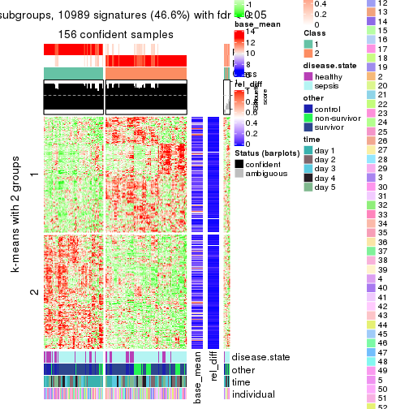</p>

</div>
<div id='tab-MAD-skmeans-get-signatures-2'>
<pre><code class="r">get_signatures(res, k = 3)
</code></pre>

<p></p>

</div>
<div id='tab-MAD-skmeans-get-signatures-3'>
<pre><code class="r">get_signatures(res, k = 4)
</code></pre>

<p></p>

</div>
<div id='tab-MAD-skmeans-get-signatures-4'>
<pre><code class="r">get_signatures(res, k = 5)
</code></pre>

<p></p>

</div>
<div id='tab-MAD-skmeans-get-signatures-5'>
<pre><code class="r">get_signatures(res, k = 6)
</code></pre>

<p></p>

</div>
</div>


Signature heatmaps where rows are not scaled:


<script>
$( function() {
	$( '#tabs-MAD-skmeans-get-signatures-no-scale' ).tabs();
} );
</script>
<div id='tabs-MAD-skmeans-get-signatures-no-scale'>
<ul>
<li><a href='#tab-MAD-skmeans-get-signatures-no-scale-1'>k = 2</a></li>
<li><a href='#tab-MAD-skmeans-get-signatures-no-scale-2'>k = 3</a></li>
<li><a href='#tab-MAD-skmeans-get-signatures-no-scale-3'>k = 4</a></li>
<li><a href='#tab-MAD-skmeans-get-signatures-no-scale-4'>k = 5</a></li>
<li><a href='#tab-MAD-skmeans-get-signatures-no-scale-5'>k = 6</a></li>
</ul>
<div id='tab-MAD-skmeans-get-signatures-no-scale-1'>
<pre><code class="r">get_signatures(res, k = 2, scale_rows = FALSE)
</code></pre>

<p></p>

</div>
<div id='tab-MAD-skmeans-get-signatures-no-scale-2'>
<pre><code class="r">get_signatures(res, k = 3, scale_rows = FALSE)
</code></pre>

<p></p>

</div>
<div id='tab-MAD-skmeans-get-signatures-no-scale-3'>
<pre><code class="r">get_signatures(res, k = 4, scale_rows = FALSE)
</code></pre>

<p></p>

</div>
<div id='tab-MAD-skmeans-get-signatures-no-scale-4'>
<pre><code class="r">get_signatures(res, k = 5, scale_rows = FALSE)
</code></pre>

<p></p>

</div>
<div id='tab-MAD-skmeans-get-signatures-no-scale-5'>
<pre><code class="r">get_signatures(res, k = 6, scale_rows = FALSE)
</code></pre>

<p></p>

</div>
</div>


Compare the overlap of signatures from different k:

```r
compare_signatures(res)
```


`get_signature()` returns a data frame invisibly. TO get the list of signatures, the function
call should be assigned to a variable explicitly. In following code, if `plot` argument is set
to `FALSE`, no heatmap is plotted while only the differential analysis is performed.

```r
# code only for demonstration
tb = get_signature(res, k = ..., plot = FALSE)
```

An example of the output of `tb` is:

```
#>   which_row         fdr    mean_1    mean_2 scaled_mean_1 scaled_mean_2 km
#> 1        38 0.042760348  8.373488  9.131774    -0.5533452     0.5164555  1
#> 2        40 0.018707592  7.106213  8.469186    -0.6173731     0.5762149  1
#> 3        55 0.019134737 10.221463 11.207825    -0.6159697     0.5749050  1
#> 4        59 0.006059896  5.921854  7.869574    -0.6899429     0.6439467  1
#> 5        60 0.018055526  8.928898 10.211722    -0.6204761     0.5791110  1
#> 6        98 0.009384629 15.714769 14.887706     0.6635654    -0.6193277  2
...
```

The columns in `tb` are:

1. `which_row`: row indices corresponding to the input matrix.
2. `fdr`: FDR for the differential test. 
3. `mean_x`: The mean value in group x.
4. `scaled_mean_x`: The mean value in group x after rows are scaled.
5. `km`: Row groups if k-means clustering is applied to rows.


UMAP plot which shows how samples are separated.


<script>
$( function() {
	$( '#tabs-MAD-skmeans-dimension-reduction' ).tabs();
} );
</script>
<div id='tabs-MAD-skmeans-dimension-reduction'>
<ul>
<li><a href='#tab-MAD-skmeans-dimension-reduction-1'>k = 2</a></li>
<li><a href='#tab-MAD-skmeans-dimension-reduction-2'>k = 3</a></li>
<li><a href='#tab-MAD-skmeans-dimension-reduction-3'>k = 4</a></li>
<li><a href='#tab-MAD-skmeans-dimension-reduction-4'>k = 5</a></li>
<li><a href='#tab-MAD-skmeans-dimension-reduction-5'>k = 6</a></li>
</ul>
<div id='tab-MAD-skmeans-dimension-reduction-1'>
<pre><code class="r">dimension_reduction(res, k = 2, method = &quot;UMAP&quot;)
</code></pre>

<p></p>

</div>
<div id='tab-MAD-skmeans-dimension-reduction-2'>
<pre><code class="r">dimension_reduction(res, k = 3, method = &quot;UMAP&quot;)
</code></pre>

<p></p>

</div>
<div id='tab-MAD-skmeans-dimension-reduction-3'>
<pre><code class="r">dimension_reduction(res, k = 4, method = &quot;UMAP&quot;)
</code></pre>

<p></p>

</div>
<div id='tab-MAD-skmeans-dimension-reduction-4'>
<pre><code class="r">dimension_reduction(res, k = 5, method = &quot;UMAP&quot;)
</code></pre>

<p></p>

</div>
<div id='tab-MAD-skmeans-dimension-reduction-5'>
<pre><code class="r">dimension_reduction(res, k = 6, method = &quot;UMAP&quot;)
</code></pre>

<p></p>

</div>
</div>


Following heatmap shows how subgroups are split when increasing `k`:

```r
collect_classes(res)
```


Test correlation between subgroups and known annotations. If the known
annotation is numeric, one-way ANOVA test is applied, and if the known
annotation is discrete, chi-squared contingency table test is applied.

```r
test_to_known_factors(res)
```

```
#>               n disease.state(p) other(p) time(p) individual(p) k
#> MAD:skmeans 156         5.11e-01 4.62e-02 0.00155         0.439 2
#> MAD:skmeans 161         6.72e-01 6.38e-02 0.04165         0.596 3
#> MAD:skmeans 157         1.29e-04 4.01e-06 0.00100         0.170 4
#> MAD:skmeans 152         3.53e-06 9.55e-08 0.00113         0.114 5
#> MAD:skmeans 148         4.76e-05 1.72e-07 0.00201         0.222 6
```


If matrix rows can be associated to genes, consider to use `functional_enrichment(res,
...)` to perform function enrichment for the signature genes. See [this vignette](http://bioconductor.org/packages/devel/bioc/vignettes/cola/inst/doc/functional_enrichment.html) for more detailed explanations.


 

---------------------------------------------------


### MAD:pam**


The object with results only for a single top-value method and a single partition method 
can be extracted as:

```r
res = res_list["MAD", "pam"]
# you can also extract it by
# res = res_list["MAD:pam"]
```

A summary of `res` and all the functions that can be applied to it:

```r
res
```

```
#> A 'ConsensusPartition' object with k = 2, 3, 4, 5, 6.
#>   On a matrix with 23598 rows and 163 columns.
#>   Top rows (1000, 2000, 3000, 4000, 5000) are extracted by 'MAD' method.
#>   Subgroups are detected by 'pam' method.
#>   Performed in total 1250 partitions by row resampling.
#>   Best k for subgroups seems to be 2.
#> 
#> Following methods can be applied to this 'ConsensusPartition' object:
#>  [1] "cola_report"             "collect_classes"         "collect_plots"          
#>  [4] "collect_stats"           "colnames"                "compare_signatures"     
#>  [7] "consensus_heatmap"       "dimension_reduction"     "functional_enrichment"  
#> [10] "get_anno_col"            "get_anno"                "get_classes"            
#> [13] "get_consensus"           "get_matrix"              "get_membership"         
#> [16] "get_param"               "get_signatures"          "get_stats"              
#> [19] "is_best_k"               "is_stable_k"             "membership_heatmap"     
#> [22] "ncol"                    "nrow"                    "plot_ecdf"              
#> [25] "rownames"                "select_partition_number" "show"                   
#> [28] "suggest_best_k"          "test_to_known_factors"
```

`collect_plots()` function collects all the plots made from `res` for all `k` (number of partitions)
into one single page to provide an easy and fast comparison between different `k`.

```r
collect_plots(res)
```


The plots are:

- The first row: a plot of the ECDF (empirical cumulative distribution
  function) curves of the consensus matrix for each `k` and the heatmap of
  predicted classes for each `k`.
- The second row: heatmaps of the consensus matrix for each `k`.
- The third row: heatmaps of the membership matrix for each `k`.
- The fouth row: heatmaps of the signatures for each `k`.

All the plots in panels can be made by individual functions and they are
plotted later in this section.

`select_partition_number()` produces several plots showing different
statistics for choosing "optimized" `k`. There are following statistics:

- ECDF curves of the consensus matrix for each `k`;
- 1-PAC. [The PAC
  score](https://en.wikipedia.org/wiki/Consensus_clustering#Over-interpretation_potential_of_consensus_clustering)
  measures the proportion of the ambiguous subgrouping.
- Mean silhouette score.
- Concordance. The mean probability of fiting the consensus class ids in all
  partitions.
- Area increased. Denote $A_k$ as the area under the ECDF curve for current
  `k`, the area increased is defined as $A_k - A_{k-1}$.
- Rand index. The percent of pairs of samples that are both in a same cluster
  or both are not in a same cluster in the partition of k and k-1.
- Jaccard index. The ratio of pairs of samples are both in a same cluster in
  the partition of k and k-1 and the pairs of samples are both in a same
  cluster in the partition k or k-1.

The detailed explanations of these statistics can be found in [the _cola_
vignette](http://bioconductor.org/packages/devel/bioc/vignettes/cola/inst/doc/cola.html#toc_13).

Generally speaking, lower PAC score, higher mean silhouette score or higher
concordance corresponds to better partition. Rand index and Jaccard index
measure how similar the current partition is compared to partition with `k-1`.
If they are too similar, we won't accept `k` is better than `k-1`.

```r
select_partition_number(res)
```


The numeric values for all these statistics can be obtained by `get_stats()`.

```r
get_stats(res)
```

```
#>   k 1-PAC mean_silhouette concordance area_increased  Rand Jaccard
#> 2 2 0.967           0.946       0.973         0.4596 0.539   0.539
#> 3 3 0.658           0.620       0.830         0.4506 0.736   0.535
#> 4 4 0.741           0.796       0.875         0.1119 0.772   0.439
#> 5 5 0.757           0.733       0.841         0.0613 0.903   0.657
#> 6 6 0.723           0.569       0.769         0.0434 0.879   0.521
```

`suggest_best_k()` suggests the best $k$ based on these statistics. The rules are as follows:

- All $k$ with Jaccard index larger than 0.95 are removed because increasing
  $k$ does not provide enough extra information. If all $k$ are removed, it is
  marked as no subgroup is detected.
- For all $k$ with 1-PAC score larger than 0.9, the maximal $k$ is taken as
  the best $k$, and other $k$ are marked as optional $k$.
- If it does not fit the second rule. The $k$ with the maximal vote of the
  highest 1-PAC score, highest mean silhouette, and highest concordance is
  taken as the best $k$.

```r
suggest_best_k(res)
```

```
#> [1] 2
```


Following shows the table of the partitions (You need to click the **show/hide
code output** link to see it). The membership matrix (columns with name `p*`)
is inferred by
[`clue::cl_consensus()`](https://www.rdocumentation.org/link/cl_consensus?package=clue)
function with the `SE` method. Basically the value in the membership matrix
represents the probability to belong to a certain group. The finall class
label for an item is determined with the group with highest probability it
belongs to.

In `get_classes()` function, the entropy is calculated from the membership
matrix and the silhouette score is calculated from the consensus matrix.


<script>
$( function() {
	$( '#tabs-MAD-pam-get-classes' ).tabs();
} );
</script>
<div id='tabs-MAD-pam-get-classes'>
<ul>
<li><a href='#tab-MAD-pam-get-classes-1'>k = 2</a></li>
<li><a href='#tab-MAD-pam-get-classes-2'>k = 3</a></li>
<li><a href='#tab-MAD-pam-get-classes-3'>k = 4</a></li>
<li><a href='#tab-MAD-pam-get-classes-4'>k = 5</a></li>
<li><a href='#tab-MAD-pam-get-classes-5'>k = 6</a></li>
</ul>

<div id='tab-MAD-pam-get-classes-1'>
<p><a id='tab-MAD-pam-get-classes-1-a' style='color:#0366d6' href='#'>show/hide code output</a></p>
<pre><code class="r">cbind(get_classes(res, k = 2), get_membership(res, k = 2))
</code></pre>

<pre><code>#&gt;            class entropy silhouette    p1    p2
#&gt; GSM1317945     2  0.0000      0.979 0.000 1.000
#&gt; GSM1317946     2  0.7883      0.721 0.236 0.764
#&gt; GSM1317947     1  0.3584      0.930 0.932 0.068
#&gt; GSM1317948     1  0.3584      0.930 0.932 0.068
#&gt; GSM1317949     1  0.0672      0.958 0.992 0.008
#&gt; GSM1317950     1  0.0000      0.959 1.000 0.000
#&gt; GSM1317953     1  0.0000      0.959 1.000 0.000
#&gt; GSM1317954     1  0.0000      0.959 1.000 0.000
#&gt; GSM1317955     1  0.0000      0.959 1.000 0.000
#&gt; GSM1317956     1  0.0000      0.959 1.000 0.000
#&gt; GSM1317957     2  0.0376      0.977 0.004 0.996
#&gt; GSM1317958     1  0.0000      0.959 1.000 0.000
#&gt; GSM1317959     1  0.9044      0.569 0.680 0.320
#&gt; GSM1317960     1  0.2778      0.944 0.952 0.048
#&gt; GSM1317961     2  0.0000      0.979 0.000 1.000
#&gt; GSM1317962     1  0.2778      0.940 0.952 0.048
#&gt; GSM1317963     2  0.3733      0.918 0.072 0.928
#&gt; GSM1317964     1  0.0000      0.959 1.000 0.000
#&gt; GSM1317965     2  0.0000      0.979 0.000 1.000
#&gt; GSM1317966     2  0.0000      0.979 0.000 1.000
#&gt; GSM1317967     2  0.0000      0.979 0.000 1.000
#&gt; GSM1317968     1  0.0000      0.959 1.000 0.000
#&gt; GSM1317969     2  0.0000      0.979 0.000 1.000
#&gt; GSM1317970     2  0.0376      0.977 0.004 0.996
#&gt; GSM1317952     1  0.2778      0.944 0.952 0.048
#&gt; GSM1317951     1  0.0000      0.959 1.000 0.000
#&gt; GSM1317971     2  0.0000      0.979 0.000 1.000
#&gt; GSM1317972     1  0.9815      0.259 0.580 0.420
#&gt; GSM1317973     2  0.0376      0.977 0.004 0.996
#&gt; GSM1317974     2  0.6973      0.791 0.188 0.812
#&gt; GSM1317975     2  0.1414      0.968 0.020 0.980
#&gt; GSM1317978     1  0.0000      0.959 1.000 0.000
#&gt; GSM1317979     2  0.8207      0.657 0.256 0.744
#&gt; GSM1317980     2  0.0000      0.979 0.000 1.000
#&gt; GSM1317981     2  0.1414      0.968 0.020 0.980
#&gt; GSM1317982     2  0.0000      0.979 0.000 1.000
#&gt; GSM1317983     1  0.0000      0.959 1.000 0.000
#&gt; GSM1317984     2  0.0000      0.979 0.000 1.000
#&gt; GSM1317985     2  0.0000      0.979 0.000 1.000
#&gt; GSM1317986     1  0.0000      0.959 1.000 0.000
#&gt; GSM1317987     2  0.1414      0.968 0.020 0.980
#&gt; GSM1317988     2  0.0376      0.977 0.004 0.996
#&gt; GSM1317989     1  0.2948      0.940 0.948 0.052
#&gt; GSM1317990     2  0.1414      0.968 0.020 0.980
#&gt; GSM1317991     2  0.0000      0.979 0.000 1.000
#&gt; GSM1317992     2  0.0000      0.979 0.000 1.000
#&gt; GSM1317993     2  0.1414      0.968 0.020 0.980
#&gt; GSM1317994     2  0.0000      0.979 0.000 1.000
#&gt; GSM1317977     1  0.2948      0.941 0.948 0.052
#&gt; GSM1317976     2  0.7528      0.745 0.216 0.784
#&gt; GSM1317995     2  0.0000      0.979 0.000 1.000
#&gt; GSM1317996     2  0.1184      0.970 0.016 0.984
#&gt; GSM1317997     2  0.0000      0.979 0.000 1.000
#&gt; GSM1317998     1  0.0000      0.959 1.000 0.000
#&gt; GSM1317999     1  0.0000      0.959 1.000 0.000
#&gt; GSM1318002     2  0.0376      0.977 0.004 0.996
#&gt; GSM1318003     2  0.0376      0.977 0.004 0.996
#&gt; GSM1318004     2  0.9129      0.516 0.328 0.672
#&gt; GSM1318005     2  0.3879      0.916 0.076 0.924
#&gt; GSM1318006     1  0.0000      0.959 1.000 0.000
#&gt; GSM1318007     2  0.0938      0.972 0.012 0.988
#&gt; GSM1318008     1  0.0000      0.959 1.000 0.000
#&gt; GSM1318009     2  0.1414      0.968 0.020 0.980
#&gt; GSM1318010     2  0.0000      0.979 0.000 1.000
#&gt; GSM1318011     1  0.2778      0.944 0.952 0.048
#&gt; GSM1318012     1  0.2778      0.944 0.952 0.048
#&gt; GSM1318013     2  0.0000      0.979 0.000 1.000
#&gt; GSM1318014     1  0.2603      0.945 0.956 0.044
#&gt; GSM1318015     2  0.0376      0.977 0.004 0.996
#&gt; GSM1318001     2  0.0000      0.979 0.000 1.000
#&gt; GSM1318000     2  0.1414      0.968 0.020 0.980
#&gt; GSM1318016     2  0.0376      0.977 0.004 0.996
#&gt; GSM1318017     1  0.0000      0.959 1.000 0.000
#&gt; GSM1318019     2  0.0376      0.977 0.004 0.996
#&gt; GSM1318020     2  0.0000      0.979 0.000 1.000
#&gt; GSM1318021     2  0.1414      0.968 0.020 0.980
#&gt; GSM1318022     2  0.0000      0.979 0.000 1.000
#&gt; GSM1318023     1  0.0000      0.959 1.000 0.000
#&gt; GSM1318024     2  0.1414      0.968 0.020 0.980
#&gt; GSM1318025     2  0.0000      0.979 0.000 1.000
#&gt; GSM1318026     2  0.0000      0.979 0.000 1.000
#&gt; GSM1318027     2  0.0000      0.979 0.000 1.000
#&gt; GSM1318028     1  0.0000      0.959 1.000 0.000
#&gt; GSM1318029     2  0.0000      0.979 0.000 1.000
#&gt; GSM1318018     1  0.0000      0.959 1.000 0.000
#&gt; GSM1318030     2  0.0000      0.979 0.000 1.000
#&gt; GSM1318031     2  0.0000      0.979 0.000 1.000
#&gt; GSM1318033     1  0.1184      0.955 0.984 0.016
#&gt; GSM1318034     1  0.4690      0.903 0.900 0.100
#&gt; GSM1318035     2  0.0376      0.977 0.004 0.996
#&gt; GSM1318036     2  0.4562      0.896 0.096 0.904
#&gt; GSM1318037     2  0.0000      0.979 0.000 1.000
#&gt; GSM1318038     2  0.0000      0.979 0.000 1.000
#&gt; GSM1318039     1  0.0000      0.959 1.000 0.000
#&gt; GSM1318040     2  0.0000      0.979 0.000 1.000
#&gt; GSM1318032     2  0.0000      0.979 0.000 1.000
#&gt; GSM1317914     2  0.0000      0.979 0.000 1.000
#&gt; GSM1317915     1  0.0000      0.959 1.000 0.000
#&gt; GSM1317916     1  0.0000      0.959 1.000 0.000
#&gt; GSM1317917     2  0.4161      0.900 0.084 0.916
#&gt; GSM1317918     1  0.0672      0.957 0.992 0.008
#&gt; GSM1317919     2  0.0000      0.979 0.000 1.000
#&gt; GSM1317920     2  0.0000      0.979 0.000 1.000
#&gt; GSM1317921     2  0.0000      0.979 0.000 1.000
#&gt; GSM1317922     1  0.5737      0.865 0.864 0.136
#&gt; GSM1317923     2  0.0000      0.979 0.000 1.000
#&gt; GSM1317924     2  0.0000      0.979 0.000 1.000
#&gt; GSM1317925     2  0.0376      0.977 0.004 0.996
#&gt; GSM1317926     2  0.0000      0.979 0.000 1.000
#&gt; GSM1317927     2  0.1414      0.968 0.020 0.980
#&gt; GSM1317928     2  0.0000      0.979 0.000 1.000
#&gt; GSM1317929     2  0.0000      0.979 0.000 1.000
#&gt; GSM1317930     2  0.0000      0.979 0.000 1.000
#&gt; GSM1317931     2  0.0000      0.979 0.000 1.000
#&gt; GSM1317932     2  0.0000      0.979 0.000 1.000
#&gt; GSM1317933     2  0.0376      0.977 0.004 0.996
#&gt; GSM1317934     2  0.0000      0.979 0.000 1.000
#&gt; GSM1317935     2  0.0000      0.979 0.000 1.000
#&gt; GSM1317936     2  0.0000      0.979 0.000 1.000
#&gt; GSM1317937     1  0.0000      0.959 1.000 0.000
#&gt; GSM1317938     2  0.0376      0.977 0.004 0.996
#&gt; GSM1317939     2  0.0376      0.977 0.004 0.996
#&gt; GSM1317940     1  0.1414      0.953 0.980 0.020
#&gt; GSM1317941     2  0.1414      0.968 0.020 0.980
#&gt; GSM1317942     2  0.3733      0.920 0.072 0.928
#&gt; GSM1317943     2  0.2948      0.939 0.052 0.948
#&gt; GSM1317944     2  0.0376      0.977 0.004 0.996
#&gt; GSM1317896     2  0.0000      0.979 0.000 1.000
#&gt; GSM1317897     1  0.0000      0.959 1.000 0.000
#&gt; GSM1317898     1  0.1184      0.955 0.984 0.016
#&gt; GSM1317899     1  0.0376      0.959 0.996 0.004
#&gt; GSM1317900     2  0.0000      0.979 0.000 1.000
#&gt; GSM1317901     1  0.0672      0.958 0.992 0.008
#&gt; GSM1317902     1  0.0000      0.959 1.000 0.000
#&gt; GSM1317903     1  0.0000      0.959 1.000 0.000
#&gt; GSM1317904     2  0.3879      0.916 0.076 0.924
#&gt; GSM1317905     2  0.0000      0.979 0.000 1.000
#&gt; GSM1317906     2  0.0000      0.979 0.000 1.000
#&gt; GSM1317907     2  0.0000      0.979 0.000 1.000
#&gt; GSM1317908     2  0.4161      0.906 0.084 0.916
#&gt; GSM1317909     1  0.3584      0.930 0.932 0.068
#&gt; GSM1317910     2  0.0376      0.977 0.004 0.996
#&gt; GSM1317911     1  0.0000      0.959 1.000 0.000
#&gt; GSM1317912     1  0.8813      0.615 0.700 0.300
#&gt; GSM1317913     2  0.0000      0.979 0.000 1.000
#&gt; GSM1318041     1  0.7376      0.775 0.792 0.208
#&gt; GSM1318042     2  0.0000      0.979 0.000 1.000
#&gt; GSM1318043     2  0.0000      0.979 0.000 1.000
#&gt; GSM1318044     1  0.0000      0.959 1.000 0.000
#&gt; GSM1318045     1  0.0000      0.959 1.000 0.000
#&gt; GSM1318046     1  0.0000      0.959 1.000 0.000
#&gt; GSM1318047     1  0.2778      0.944 0.952 0.048
#&gt; GSM1318048     1  0.3584      0.930 0.932 0.068
#&gt; GSM1318049     1  0.2778      0.944 0.952 0.048
#&gt; GSM1318050     2  0.0376      0.977 0.004 0.996
#&gt; GSM1318051     2  0.0376      0.977 0.004 0.996
#&gt; GSM1318052     2  0.0000      0.979 0.000 1.000
#&gt; GSM1318053     2  0.0376      0.977 0.004 0.996
#&gt; GSM1318054     2  0.0000      0.979 0.000 1.000
#&gt; GSM1318055     2  0.0000      0.979 0.000 1.000
#&gt; GSM1318056     2  0.0000      0.979 0.000 1.000
#&gt; GSM1318057     2  0.0000      0.979 0.000 1.000
#&gt; GSM1318058     2  0.0000      0.979 0.000 1.000
</code></pre>

<script>
$('#tab-MAD-pam-get-classes-1-a').parent().next().next().hide();
$('#tab-MAD-pam-get-classes-1-a').click(function(){
  $('#tab-MAD-pam-get-classes-1-a').parent().next().next().toggle();
  return(false);
});
</script>
</div>

<div id='tab-MAD-pam-get-classes-2'>
<p><a id='tab-MAD-pam-get-classes-2-a' style='color:#0366d6' href='#'>show/hide code output</a></p>
<pre><code class="r">cbind(get_classes(res, k = 3), get_membership(res, k = 3))
</code></pre>

<pre><code>#&gt;            class entropy silhouette    p1    p2    p3
#&gt; GSM1317945     2  0.6295     0.7091 0.000 0.528 0.472
#&gt; GSM1317946     2  0.6295     0.7091 0.000 0.528 0.472
#&gt; GSM1317947     1  0.6274     0.3240 0.544 0.456 0.000
#&gt; GSM1317948     2  0.6215    -0.1578 0.428 0.572 0.000
#&gt; GSM1317949     1  0.0000     0.8667 1.000 0.000 0.000
#&gt; GSM1317950     1  0.0000     0.8667 1.000 0.000 0.000
#&gt; GSM1317953     1  0.0000     0.8667 1.000 0.000 0.000
#&gt; GSM1317954     1  0.0000     0.8667 1.000 0.000 0.000
#&gt; GSM1317955     1  0.0000     0.8667 1.000 0.000 0.000
#&gt; GSM1317956     1  0.0000     0.8667 1.000 0.000 0.000
#&gt; GSM1317957     3  0.0000     0.4006 0.000 0.000 1.000
#&gt; GSM1317958     1  0.0000     0.8667 1.000 0.000 0.000
#&gt; GSM1317959     2  0.6295     0.7091 0.000 0.528 0.472
#&gt; GSM1317960     2  0.6126     0.2269 0.400 0.600 0.000
#&gt; GSM1317961     3  0.6291     0.7265 0.000 0.468 0.532
#&gt; GSM1317962     1  0.6045     0.4514 0.620 0.000 0.380
#&gt; GSM1317963     2  0.7113     0.5648 0.112 0.720 0.168
#&gt; GSM1317964     1  0.0000     0.8667 1.000 0.000 0.000
#&gt; GSM1317965     3  0.6291     0.7265 0.000 0.468 0.532
#&gt; GSM1317966     3  0.6291     0.7265 0.000 0.468 0.532
#&gt; GSM1317967     2  0.6295     0.7091 0.000 0.528 0.472
#&gt; GSM1317968     1  0.3686     0.7547 0.860 0.000 0.140
#&gt; GSM1317969     2  0.3038     0.2061 0.000 0.896 0.104
#&gt; GSM1317970     3  0.0000     0.4006 0.000 0.000 1.000
#&gt; GSM1317952     2  0.4346     0.4212 0.184 0.816 0.000
#&gt; GSM1317951     1  0.0000     0.8667 1.000 0.000 0.000
#&gt; GSM1317971     3  0.6291     0.7265 0.000 0.468 0.532
#&gt; GSM1317972     1  0.6244     0.3426 0.560 0.000 0.440
#&gt; GSM1317973     3  0.3482     0.1108 0.000 0.128 0.872
#&gt; GSM1317974     1  0.6244     0.3426 0.560 0.000 0.440
#&gt; GSM1317975     3  0.0000     0.4006 0.000 0.000 1.000
#&gt; GSM1317978     1  0.5016     0.6464 0.760 0.000 0.240
#&gt; GSM1317979     2  0.0000     0.4070 0.000 1.000 0.000
#&gt; GSM1317980     2  0.0000     0.4070 0.000 1.000 0.000
#&gt; GSM1317981     3  0.0000     0.4006 0.000 0.000 1.000
#&gt; GSM1317982     2  0.0237     0.4080 0.000 0.996 0.004
#&gt; GSM1317983     1  0.0000     0.8667 1.000 0.000 0.000
#&gt; GSM1317984     3  0.6309     0.6978 0.000 0.500 0.500
#&gt; GSM1317985     3  0.6295     0.7249 0.000 0.472 0.528
#&gt; GSM1317986     1  0.0000     0.8667 1.000 0.000 0.000
#&gt; GSM1317987     3  0.0000     0.4006 0.000 0.000 1.000
#&gt; GSM1317988     3  0.0000     0.4006 0.000 0.000 1.000
#&gt; GSM1317989     1  0.6247     0.4547 0.620 0.004 0.376
#&gt; GSM1317990     3  0.0000     0.4006 0.000 0.000 1.000
#&gt; GSM1317991     3  0.6291     0.7265 0.000 0.468 0.532
#&gt; GSM1317992     3  0.0000     0.4006 0.000 0.000 1.000
#&gt; GSM1317993     3  0.0000     0.4006 0.000 0.000 1.000
#&gt; GSM1317994     3  0.6295     0.7249 0.000 0.472 0.528
#&gt; GSM1317977     1  0.5178     0.6294 0.744 0.000 0.256
#&gt; GSM1317976     3  0.4974     0.1144 0.236 0.000 0.764
#&gt; GSM1317995     3  0.6295     0.7249 0.000 0.472 0.528
#&gt; GSM1317996     3  0.4796    -0.1638 0.000 0.220 0.780
#&gt; GSM1317997     3  0.6295     0.7249 0.000 0.472 0.528
#&gt; GSM1317998     1  0.0000     0.8667 1.000 0.000 0.000
#&gt; GSM1317999     1  0.0000     0.8667 1.000 0.000 0.000
#&gt; GSM1318002     3  0.0000     0.4006 0.000 0.000 1.000
#&gt; GSM1318003     2  0.6295     0.7091 0.000 0.528 0.472
#&gt; GSM1318004     2  0.6295     0.7091 0.000 0.528 0.472
#&gt; GSM1318005     2  0.6295     0.7091 0.000 0.528 0.472
#&gt; GSM1318006     1  0.0000     0.8667 1.000 0.000 0.000
#&gt; GSM1318007     2  0.4974     0.5810 0.000 0.764 0.236
#&gt; GSM1318008     1  0.0000     0.8667 1.000 0.000 0.000
#&gt; GSM1318009     2  0.6295     0.7091 0.000 0.528 0.472
#&gt; GSM1318010     3  0.6295     0.7249 0.000 0.472 0.528
#&gt; GSM1318011     1  0.0000     0.8667 1.000 0.000 0.000
#&gt; GSM1318012     1  0.2878     0.7846 0.904 0.096 0.000
#&gt; GSM1318013     2  0.6295     0.7091 0.000 0.528 0.472
#&gt; GSM1318014     1  0.0000     0.8667 1.000 0.000 0.000
#&gt; GSM1318015     3  0.0000     0.4006 0.000 0.000 1.000
#&gt; GSM1318001     3  0.6295     0.7249 0.000 0.472 0.528
#&gt; GSM1318000     2  0.6295     0.7091 0.000 0.528 0.472
#&gt; GSM1318016     3  0.0000     0.4006 0.000 0.000 1.000
#&gt; GSM1318017     1  0.0000     0.8667 1.000 0.000 0.000
#&gt; GSM1318019     2  0.6295     0.7091 0.000 0.528 0.472
#&gt; GSM1318020     3  0.6295     0.7249 0.000 0.472 0.528
#&gt; GSM1318021     3  0.0000     0.4006 0.000 0.000 1.000
#&gt; GSM1318022     3  0.6291     0.7265 0.000 0.468 0.532
#&gt; GSM1318023     1  0.0000     0.8667 1.000 0.000 0.000
#&gt; GSM1318024     3  0.0000     0.4006 0.000 0.000 1.000
#&gt; GSM1318025     3  0.6295     0.7249 0.000 0.472 0.528
#&gt; GSM1318026     3  0.0000     0.4006 0.000 0.000 1.000
#&gt; GSM1318027     2  0.6305     0.6980 0.000 0.516 0.484
#&gt; GSM1318028     1  0.0237     0.8640 0.996 0.000 0.004
#&gt; GSM1318029     3  0.6295     0.7249 0.000 0.472 0.528
#&gt; GSM1318018     1  0.0000     0.8667 1.000 0.000 0.000
#&gt; GSM1318030     2  0.3038     0.4904 0.000 0.896 0.104
#&gt; GSM1318031     3  0.6291     0.7265 0.000 0.468 0.532
#&gt; GSM1318033     1  0.6309    -0.0507 0.500 0.500 0.000
#&gt; GSM1318034     1  0.6295     0.2917 0.528 0.472 0.000
#&gt; GSM1318035     3  0.0000     0.4006 0.000 0.000 1.000
#&gt; GSM1318036     2  0.6295     0.7091 0.000 0.528 0.472
#&gt; GSM1318037     2  0.6291     0.7075 0.000 0.532 0.468
#&gt; GSM1318038     2  0.0000     0.4070 0.000 1.000 0.000
#&gt; GSM1318039     1  0.0000     0.8667 1.000 0.000 0.000
#&gt; GSM1318040     3  0.6291     0.7265 0.000 0.468 0.532
#&gt; GSM1318032     3  0.6291     0.7265 0.000 0.468 0.532
#&gt; GSM1317914     3  0.6291     0.7265 0.000 0.468 0.532
#&gt; GSM1317915     1  0.0000     0.8667 1.000 0.000 0.000
#&gt; GSM1317916     1  0.0000     0.8667 1.000 0.000 0.000
#&gt; GSM1317917     2  0.0000     0.4070 0.000 1.000 0.000
#&gt; GSM1317918     1  0.0000     0.8667 1.000 0.000 0.000
#&gt; GSM1317919     3  0.6291     0.7265 0.000 0.468 0.532
#&gt; GSM1317920     3  0.6291     0.7265 0.000 0.468 0.532
#&gt; GSM1317921     3  0.6291     0.7265 0.000 0.468 0.532
#&gt; GSM1317922     1  0.7759     0.1738 0.480 0.472 0.048
#&gt; GSM1317923     3  0.6291     0.7265 0.000 0.468 0.532
#&gt; GSM1317924     3  0.6295     0.7249 0.000 0.472 0.528
#&gt; GSM1317925     3  0.0000     0.4006 0.000 0.000 1.000
#&gt; GSM1317926     3  0.6291     0.7265 0.000 0.468 0.532
#&gt; GSM1317927     2  0.6295     0.7091 0.000 0.528 0.472
#&gt; GSM1317928     2  0.1753     0.3320 0.000 0.952 0.048
#&gt; GSM1317929     3  0.6291     0.7265 0.000 0.468 0.532
#&gt; GSM1317930     2  0.6295     0.7091 0.000 0.528 0.472
#&gt; GSM1317931     2  0.4235    -0.0244 0.000 0.824 0.176
#&gt; GSM1317932     3  0.6252     0.7134 0.000 0.444 0.556
#&gt; GSM1317933     2  0.6295     0.7091 0.000 0.528 0.472
#&gt; GSM1317934     3  0.4605     0.5391 0.000 0.204 0.796
#&gt; GSM1317935     3  0.6291     0.7265 0.000 0.468 0.532
#&gt; GSM1317936     3  0.6295     0.7249 0.000 0.472 0.528
#&gt; GSM1317937     1  0.0000     0.8667 1.000 0.000 0.000
#&gt; GSM1317938     2  0.6295     0.7091 0.000 0.528 0.472
#&gt; GSM1317939     2  0.6295     0.7091 0.000 0.528 0.472
#&gt; GSM1317940     1  0.6215     0.3911 0.572 0.000 0.428
#&gt; GSM1317941     2  0.6295     0.7091 0.000 0.528 0.472
#&gt; GSM1317942     2  0.6295     0.7091 0.000 0.528 0.472
#&gt; GSM1317943     2  0.6295     0.7091 0.000 0.528 0.472
#&gt; GSM1317944     3  0.6235    -0.6170 0.000 0.436 0.564
#&gt; GSM1317896     3  0.6295     0.7249 0.000 0.472 0.528
#&gt; GSM1317897     1  0.0000     0.8667 1.000 0.000 0.000
#&gt; GSM1317898     1  0.0000     0.8667 1.000 0.000 0.000
#&gt; GSM1317899     1  0.0000     0.8667 1.000 0.000 0.000
#&gt; GSM1317900     3  0.6291     0.7265 0.000 0.468 0.532
#&gt; GSM1317901     1  0.0000     0.8667 1.000 0.000 0.000
#&gt; GSM1317902     1  0.0000     0.8667 1.000 0.000 0.000
#&gt; GSM1317903     1  0.0000     0.8667 1.000 0.000 0.000
#&gt; GSM1317904     2  0.6295     0.7091 0.000 0.528 0.472
#&gt; GSM1317905     3  0.6291     0.7265 0.000 0.468 0.532
#&gt; GSM1317906     3  0.6291     0.7265 0.000 0.468 0.532
#&gt; GSM1317907     2  0.0237     0.4080 0.000 0.996 0.004
#&gt; GSM1317908     1  0.6295     0.2917 0.528 0.472 0.000
#&gt; GSM1317909     1  0.5882     0.5078 0.652 0.348 0.000
#&gt; GSM1317910     2  0.0000     0.4070 0.000 1.000 0.000
#&gt; GSM1317911     1  0.0000     0.8667 1.000 0.000 0.000
#&gt; GSM1317912     2  0.0000     0.4070 0.000 1.000 0.000
#&gt; GSM1317913     2  0.5810     0.6416 0.000 0.664 0.336
#&gt; GSM1318041     2  0.0000     0.4070 0.000 1.000 0.000
#&gt; GSM1318042     3  0.6295     0.7249 0.000 0.472 0.528
#&gt; GSM1318043     3  0.6295     0.7249 0.000 0.472 0.528
#&gt; GSM1318044     1  0.0000     0.8667 1.000 0.000 0.000
#&gt; GSM1318045     1  0.0000     0.8667 1.000 0.000 0.000
#&gt; GSM1318046     1  0.0000     0.8667 1.000 0.000 0.000
#&gt; GSM1318047     1  0.0000     0.8667 1.000 0.000 0.000
#&gt; GSM1318048     1  0.6252     0.3473 0.556 0.444 0.000
#&gt; GSM1318049     1  0.4555     0.6951 0.800 0.200 0.000
#&gt; GSM1318050     2  0.6295     0.7091 0.000 0.528 0.472
#&gt; GSM1318051     2  0.6295     0.7091 0.000 0.528 0.472
#&gt; GSM1318052     2  0.6295     0.7091 0.000 0.528 0.472
#&gt; GSM1318053     2  0.6295     0.7091 0.000 0.528 0.472
#&gt; GSM1318054     2  0.1411     0.4360 0.000 0.964 0.036
#&gt; GSM1318055     2  0.0000     0.4070 0.000 1.000 0.000
#&gt; GSM1318056     2  0.1411     0.4360 0.000 0.964 0.036
#&gt; GSM1318057     2  0.6295     0.7091 0.000 0.528 0.472
#&gt; GSM1318058     3  0.6274     0.7204 0.000 0.456 0.544
</code></pre>

<script>
$('#tab-MAD-pam-get-classes-2-a').parent().next().next().hide();
$('#tab-MAD-pam-get-classes-2-a').click(function(){
  $('#tab-MAD-pam-get-classes-2-a').parent().next().next().toggle();
  return(false);
});
</script>
</div>

<div id='tab-MAD-pam-get-classes-3'>
<p><a id='tab-MAD-pam-get-classes-3-a' style='color:#0366d6' href='#'>show/hide code output</a></p>
<pre><code class="r">cbind(get_classes(res, k = 4), get_membership(res, k = 4))
</code></pre>

<pre><code>#&gt;            class entropy silhouette    p1    p2    p3    p4
#&gt; GSM1317945     4  0.1211     0.7748 0.000 0.040 0.000 0.960
#&gt; GSM1317946     4  0.5624     0.6760 0.128 0.148 0.000 0.724
#&gt; GSM1317947     3  0.2224     0.9065 0.032 0.000 0.928 0.040
#&gt; GSM1317948     4  0.4261     0.6872 0.112 0.000 0.068 0.820
#&gt; GSM1317949     1  0.3534     0.8426 0.840 0.004 0.008 0.148
#&gt; GSM1317950     1  0.1940     0.8571 0.924 0.076 0.000 0.000
#&gt; GSM1317953     1  0.2149     0.8524 0.912 0.088 0.000 0.000
#&gt; GSM1317954     1  0.1940     0.8571 0.924 0.076 0.000 0.000
#&gt; GSM1317955     1  0.4697     0.4947 0.644 0.356 0.000 0.000
#&gt; GSM1317956     1  0.1940     0.8571 0.924 0.076 0.000 0.000
#&gt; GSM1317957     2  0.3266     0.7951 0.000 0.832 0.000 0.168
#&gt; GSM1317958     1  0.2760     0.8527 0.872 0.000 0.000 0.128
#&gt; GSM1317959     4  0.2928     0.7674 0.052 0.052 0.000 0.896
#&gt; GSM1317960     4  0.3598     0.6953 0.124 0.000 0.028 0.848
#&gt; GSM1317961     3  0.0895     0.9551 0.000 0.004 0.976 0.020
#&gt; GSM1317962     2  0.5900     0.5612 0.096 0.684 0.000 0.220
#&gt; GSM1317963     4  0.2216     0.7278 0.000 0.092 0.000 0.908
#&gt; GSM1317964     1  0.2149     0.8524 0.912 0.088 0.000 0.000
#&gt; GSM1317965     3  0.0376     0.9585 0.000 0.004 0.992 0.004
#&gt; GSM1317966     3  0.0895     0.9551 0.000 0.004 0.976 0.020
#&gt; GSM1317967     4  0.4100     0.7706 0.000 0.148 0.036 0.816
#&gt; GSM1317968     1  0.3243     0.8380 0.876 0.088 0.000 0.036
#&gt; GSM1317969     3  0.0657     0.9574 0.000 0.004 0.984 0.012
#&gt; GSM1317970     2  0.4961     0.2417 0.000 0.552 0.000 0.448
#&gt; GSM1317952     4  0.3919     0.6998 0.104 0.000 0.056 0.840
#&gt; GSM1317951     1  0.4967     0.2465 0.548 0.452 0.000 0.000
#&gt; GSM1317971     3  0.1406     0.9452 0.000 0.024 0.960 0.016
#&gt; GSM1317972     2  0.4605     0.6829 0.132 0.796 0.000 0.072
#&gt; GSM1317973     4  0.3123     0.7754 0.000 0.156 0.000 0.844
#&gt; GSM1317974     2  0.3996     0.7080 0.104 0.836 0.000 0.060
#&gt; GSM1317975     2  0.2011     0.8411 0.000 0.920 0.000 0.080
#&gt; GSM1317978     1  0.5496     0.7425 0.732 0.160 0.000 0.108
#&gt; GSM1317979     3  0.0000     0.9588 0.000 0.000 1.000 0.000
#&gt; GSM1317980     3  0.0000     0.9588 0.000 0.000 1.000 0.000
#&gt; GSM1317981     2  0.2011     0.8411 0.000 0.920 0.000 0.080
#&gt; GSM1317982     3  0.0592     0.9575 0.000 0.000 0.984 0.016
#&gt; GSM1317983     1  0.1940     0.8571 0.924 0.076 0.000 0.000
#&gt; GSM1317984     3  0.0000     0.9588 0.000 0.000 1.000 0.000
#&gt; GSM1317985     3  0.0000     0.9588 0.000 0.000 1.000 0.000
#&gt; GSM1317986     1  0.1940     0.8571 0.924 0.076 0.000 0.000
#&gt; GSM1317987     2  0.1940     0.8405 0.000 0.924 0.000 0.076
#&gt; GSM1317988     4  0.3219     0.7739 0.000 0.164 0.000 0.836
#&gt; GSM1317989     3  0.7026     0.5070 0.128 0.016 0.612 0.244
#&gt; GSM1317990     2  0.2011     0.8411 0.000 0.920 0.000 0.080
#&gt; GSM1317991     2  0.5360     0.1909 0.000 0.552 0.436 0.012
#&gt; GSM1317992     2  0.2868     0.8170 0.000 0.864 0.000 0.136
#&gt; GSM1317993     2  0.2216     0.8427 0.000 0.908 0.000 0.092
#&gt; GSM1317994     3  0.0000     0.9588 0.000 0.000 1.000 0.000
#&gt; GSM1317977     4  0.5198     0.2533 0.360 0.004 0.008 0.628
#&gt; GSM1317976     2  0.2021     0.7737 0.024 0.936 0.000 0.040
#&gt; GSM1317995     3  0.0000     0.9588 0.000 0.000 1.000 0.000
#&gt; GSM1317996     2  0.2973     0.8104 0.000 0.856 0.000 0.144
#&gt; GSM1317997     3  0.0000     0.9588 0.000 0.000 1.000 0.000
#&gt; GSM1317998     1  0.2345     0.8620 0.900 0.000 0.000 0.100
#&gt; GSM1317999     1  0.3024     0.8440 0.852 0.000 0.000 0.148
#&gt; GSM1318002     2  0.2281     0.8418 0.000 0.904 0.000 0.096
#&gt; GSM1318003     2  0.2216     0.8427 0.000 0.908 0.000 0.092
#&gt; GSM1318004     4  0.1867     0.7787 0.000 0.072 0.000 0.928
#&gt; GSM1318005     4  0.2081     0.7818 0.000 0.084 0.000 0.916
#&gt; GSM1318006     1  0.2408     0.8607 0.896 0.000 0.000 0.104
#&gt; GSM1318007     4  0.2831     0.7373 0.000 0.004 0.120 0.876
#&gt; GSM1318008     1  0.3024     0.8440 0.852 0.000 0.000 0.148
#&gt; GSM1318009     4  0.3486     0.7576 0.000 0.188 0.000 0.812
#&gt; GSM1318010     3  0.0000     0.9588 0.000 0.000 1.000 0.000
#&gt; GSM1318011     1  0.3933     0.8058 0.792 0.000 0.008 0.200
#&gt; GSM1318012     4  0.3306     0.6709 0.156 0.000 0.004 0.840
#&gt; GSM1318013     4  0.2011     0.7814 0.000 0.080 0.000 0.920
#&gt; GSM1318014     1  0.3933     0.8058 0.792 0.000 0.008 0.200
#&gt; GSM1318015     2  0.2281     0.8418 0.000 0.904 0.000 0.096
#&gt; GSM1318001     3  0.0000     0.9588 0.000 0.000 1.000 0.000
#&gt; GSM1318000     4  0.3486     0.7576 0.000 0.188 0.000 0.812
#&gt; GSM1318016     2  0.2216     0.8427 0.000 0.908 0.000 0.092
#&gt; GSM1318017     1  0.0000     0.8720 1.000 0.000 0.000 0.000
#&gt; GSM1318019     4  0.3219     0.7705 0.000 0.164 0.000 0.836
#&gt; GSM1318020     3  0.0000     0.9588 0.000 0.000 1.000 0.000
#&gt; GSM1318021     2  0.2216     0.8427 0.000 0.908 0.000 0.092
#&gt; GSM1318022     3  0.0779     0.9567 0.000 0.004 0.980 0.016
#&gt; GSM1318023     1  0.0000     0.8720 1.000 0.000 0.000 0.000
#&gt; GSM1318024     2  0.2216     0.8427 0.000 0.908 0.000 0.092
#&gt; GSM1318025     3  0.0000     0.9588 0.000 0.000 1.000 0.000
#&gt; GSM1318026     2  0.2216     0.8410 0.000 0.908 0.000 0.092
#&gt; GSM1318027     4  0.3219     0.7705 0.000 0.164 0.000 0.836
#&gt; GSM1318028     2  0.5281     0.0534 0.464 0.528 0.000 0.008
#&gt; GSM1318029     3  0.0657     0.9576 0.000 0.004 0.984 0.012
#&gt; GSM1318018     1  0.0000     0.8720 1.000 0.000 0.000 0.000
#&gt; GSM1318030     4  0.3810     0.7108 0.000 0.008 0.188 0.804
#&gt; GSM1318031     3  0.0376     0.9585 0.000 0.004 0.992 0.004
#&gt; GSM1318033     4  0.2814     0.6941 0.132 0.000 0.000 0.868
#&gt; GSM1318034     3  0.1722     0.9170 0.048 0.000 0.944 0.008
#&gt; GSM1318035     2  0.2216     0.8427 0.000 0.908 0.000 0.092
#&gt; GSM1318036     4  0.2376     0.7365 0.016 0.068 0.000 0.916
#&gt; GSM1318037     4  0.0657     0.7726 0.000 0.012 0.004 0.984
#&gt; GSM1318038     3  0.0657     0.9577 0.000 0.004 0.984 0.012
#&gt; GSM1318039     1  0.1940     0.8571 0.924 0.076 0.000 0.000
#&gt; GSM1318040     3  0.1489     0.9371 0.000 0.004 0.952 0.044
#&gt; GSM1318032     3  0.0895     0.9545 0.000 0.004 0.976 0.020
#&gt; GSM1317914     3  0.0779     0.9567 0.000 0.004 0.980 0.016
#&gt; GSM1317915     1  0.1867     0.8583 0.928 0.072 0.000 0.000
#&gt; GSM1317916     1  0.0188     0.8722 0.996 0.000 0.000 0.004
#&gt; GSM1317917     3  0.3934     0.8113 0.048 0.000 0.836 0.116
#&gt; GSM1317918     1  0.2081     0.8542 0.916 0.084 0.000 0.000
#&gt; GSM1317919     3  0.1042     0.9539 0.000 0.008 0.972 0.020
#&gt; GSM1317920     3  0.1209     0.9493 0.000 0.004 0.964 0.032
#&gt; GSM1317921     3  0.0895     0.9551 0.000 0.004 0.976 0.020
#&gt; GSM1317922     3  0.0524     0.9580 0.000 0.004 0.988 0.008
#&gt; GSM1317923     3  0.0657     0.9573 0.000 0.004 0.984 0.012
#&gt; GSM1317924     3  0.0188     0.9586 0.000 0.004 0.996 0.000
#&gt; GSM1317925     2  0.2408     0.8385 0.000 0.896 0.000 0.104
#&gt; GSM1317926     3  0.0895     0.9551 0.000 0.004 0.976 0.020
#&gt; GSM1317927     2  0.2216     0.8427 0.000 0.908 0.000 0.092
#&gt; GSM1317928     3  0.0524     0.9579 0.000 0.004 0.988 0.008
#&gt; GSM1317929     3  0.1743     0.9292 0.000 0.004 0.940 0.056
#&gt; GSM1317930     4  0.4072     0.7059 0.000 0.252 0.000 0.748
#&gt; GSM1317931     3  0.0000     0.9588 0.000 0.000 1.000 0.000
#&gt; GSM1317932     3  0.3372     0.8614 0.000 0.096 0.868 0.036
#&gt; GSM1317933     2  0.4661     0.4108 0.000 0.652 0.000 0.348
#&gt; GSM1317934     2  0.5170     0.6113 0.000 0.724 0.228 0.048
#&gt; GSM1317935     3  0.0657     0.9569 0.000 0.004 0.984 0.012
#&gt; GSM1317936     3  0.0000     0.9588 0.000 0.000 1.000 0.000
#&gt; GSM1317937     1  0.0000     0.8720 1.000 0.000 0.000 0.000
#&gt; GSM1317938     4  0.3444     0.7591 0.000 0.184 0.000 0.816
#&gt; GSM1317939     4  0.4477     0.6233 0.000 0.312 0.000 0.688
#&gt; GSM1317940     2  0.6059     0.3305 0.328 0.616 0.004 0.052
#&gt; GSM1317941     4  0.3219     0.7750 0.000 0.164 0.000 0.836
#&gt; GSM1317942     4  0.3726     0.7408 0.000 0.212 0.000 0.788
#&gt; GSM1317943     4  0.4730     0.5086 0.000 0.364 0.000 0.636
#&gt; GSM1317944     2  0.2216     0.8427 0.000 0.908 0.000 0.092
#&gt; GSM1317896     3  0.0000     0.9588 0.000 0.000 1.000 0.000
#&gt; GSM1317897     1  0.2081     0.8542 0.916 0.084 0.000 0.000
#&gt; GSM1317898     1  0.4123     0.7950 0.772 0.008 0.000 0.220
#&gt; GSM1317899     1  0.2408     0.8607 0.896 0.000 0.000 0.104
#&gt; GSM1317900     3  0.0895     0.9551 0.000 0.004 0.976 0.020
#&gt; GSM1317901     1  0.2469     0.8595 0.892 0.000 0.000 0.108
#&gt; GSM1317902     1  0.1940     0.8676 0.924 0.000 0.000 0.076
#&gt; GSM1317903     1  0.0707     0.8721 0.980 0.000 0.000 0.020
#&gt; GSM1317904     4  0.3172     0.7752 0.000 0.160 0.000 0.840
#&gt; GSM1317905     4  0.5080     0.3466 0.000 0.004 0.420 0.576
#&gt; GSM1317906     3  0.5050     0.2151 0.000 0.004 0.588 0.408
#&gt; GSM1317907     4  0.4522     0.5883 0.000 0.000 0.320 0.680
#&gt; GSM1317908     3  0.0000     0.9588 0.000 0.000 1.000 0.000
#&gt; GSM1317909     1  0.6901     0.2272 0.488 0.000 0.404 0.108
#&gt; GSM1317910     4  0.5848     0.5306 0.048 0.000 0.336 0.616
#&gt; GSM1317911     1  0.4301     0.8499 0.816 0.064 0.000 0.120
#&gt; GSM1317912     4  0.4881     0.6720 0.048 0.000 0.196 0.756
#&gt; GSM1317913     4  0.2060     0.7842 0.000 0.052 0.016 0.932
#&gt; GSM1318041     4  0.5984     0.4641 0.048 0.000 0.372 0.580
#&gt; GSM1318042     3  0.0000     0.9588 0.000 0.000 1.000 0.000
#&gt; GSM1318043     3  0.0000     0.9588 0.000 0.000 1.000 0.000
#&gt; GSM1318044     1  0.0000     0.8720 1.000 0.000 0.000 0.000
#&gt; GSM1318045     1  0.2408     0.8607 0.896 0.000 0.000 0.104
#&gt; GSM1318046     1  0.1867     0.8682 0.928 0.000 0.000 0.072
#&gt; GSM1318047     1  0.3448     0.8306 0.828 0.000 0.004 0.168
#&gt; GSM1318048     3  0.3617     0.8346 0.076 0.000 0.860 0.064
#&gt; GSM1318049     1  0.4804     0.7962 0.780 0.000 0.072 0.148
#&gt; GSM1318050     4  0.3074     0.7749 0.000 0.152 0.000 0.848
#&gt; GSM1318051     4  0.3074     0.7749 0.000 0.152 0.000 0.848
#&gt; GSM1318052     4  0.3074     0.7749 0.000 0.152 0.000 0.848
#&gt; GSM1318053     4  0.3074     0.7749 0.000 0.152 0.000 0.848
#&gt; GSM1318054     4  0.4538     0.6758 0.000 0.024 0.216 0.760
#&gt; GSM1318055     3  0.0000     0.9588 0.000 0.000 1.000 0.000
#&gt; GSM1318056     4  0.4538     0.6758 0.000 0.024 0.216 0.760
#&gt; GSM1318057     4  0.3074     0.7749 0.000 0.152 0.000 0.848
#&gt; GSM1318058     3  0.2799     0.8638 0.000 0.008 0.884 0.108
</code></pre>

<script>
$('#tab-MAD-pam-get-classes-3-a').parent().next().next().hide();
$('#tab-MAD-pam-get-classes-3-a').click(function(){
  $('#tab-MAD-pam-get-classes-3-a').parent().next().next().toggle();
  return(false);
});
</script>
</div>

<div id='tab-MAD-pam-get-classes-4'>
<p><a id='tab-MAD-pam-get-classes-4-a' style='color:#0366d6' href='#'>show/hide code output</a></p>
<pre><code class="r">cbind(get_classes(res, k = 5), get_membership(res, k = 5))
</code></pre>

<pre><code>#&gt;            class entropy silhouette    p1    p2    p3    p4    p5
#&gt; GSM1317945     4  0.5654     0.6731 0.156 0.004 0.000 0.648 0.192
#&gt; GSM1317946     1  0.1310     0.6845 0.956 0.024 0.000 0.020 0.000
#&gt; GSM1317947     3  0.4288     0.3572 0.004 0.000 0.612 0.000 0.384
#&gt; GSM1317948     5  0.6197     0.2732 0.160 0.000 0.012 0.236 0.592
#&gt; GSM1317949     5  0.1845     0.7383 0.056 0.000 0.016 0.000 0.928
#&gt; GSM1317950     1  0.3366     0.7663 0.768 0.000 0.000 0.000 0.232
#&gt; GSM1317953     1  0.2813     0.7956 0.832 0.000 0.000 0.000 0.168
#&gt; GSM1317954     1  0.3003     0.7903 0.812 0.000 0.000 0.000 0.188
#&gt; GSM1317955     1  0.2852     0.7955 0.828 0.000 0.000 0.000 0.172
#&gt; GSM1317956     1  0.3366     0.7663 0.768 0.000 0.000 0.000 0.232
#&gt; GSM1317957     2  0.4037     0.7162 0.020 0.752 0.004 0.224 0.000
#&gt; GSM1317958     5  0.0000     0.7577 0.000 0.000 0.000 0.000 1.000
#&gt; GSM1317959     4  0.1557     0.7422 0.008 0.000 0.000 0.940 0.052
#&gt; GSM1317960     4  0.6555     0.5018 0.160 0.000 0.012 0.508 0.320
#&gt; GSM1317961     3  0.1469     0.9224 0.016 0.000 0.948 0.036 0.000
#&gt; GSM1317962     5  0.7505     0.4243 0.252 0.092 0.000 0.160 0.496
#&gt; GSM1317963     1  0.5354     0.3254 0.652 0.000 0.000 0.108 0.240
#&gt; GSM1317964     1  0.2852     0.7955 0.828 0.000 0.000 0.000 0.172
#&gt; GSM1317965     3  0.0566     0.9332 0.012 0.000 0.984 0.004 0.000
#&gt; GSM1317966     3  0.2074     0.9080 0.044 0.000 0.920 0.036 0.000
#&gt; GSM1317967     4  0.0613     0.7352 0.004 0.004 0.008 0.984 0.000
#&gt; GSM1317968     1  0.2286     0.7740 0.888 0.000 0.000 0.004 0.108
#&gt; GSM1317969     3  0.0566     0.9339 0.004 0.000 0.984 0.012 0.000
#&gt; GSM1317970     4  0.4676     0.0335 0.012 0.392 0.004 0.592 0.000
#&gt; GSM1317952     4  0.6631     0.4420 0.160 0.000 0.012 0.476 0.352
#&gt; GSM1317951     1  0.3093     0.7955 0.824 0.008 0.000 0.000 0.168
#&gt; GSM1317971     3  0.2006     0.9006 0.012 0.000 0.916 0.072 0.000
#&gt; GSM1317972     1  0.3246     0.6922 0.808 0.184 0.000 0.008 0.000
#&gt; GSM1317973     4  0.3890     0.7472 0.168 0.036 0.004 0.792 0.000
#&gt; GSM1317974     1  0.3246     0.6922 0.808 0.184 0.000 0.008 0.000
#&gt; GSM1317975     2  0.0162     0.8788 0.004 0.996 0.000 0.000 0.000
#&gt; GSM1317978     1  0.0898     0.6996 0.972 0.000 0.000 0.008 0.020
#&gt; GSM1317979     3  0.0162     0.9349 0.004 0.000 0.996 0.000 0.000
#&gt; GSM1317980     3  0.0162     0.9349 0.004 0.000 0.996 0.000 0.000
#&gt; GSM1317981     2  0.0162     0.8788 0.004 0.996 0.000 0.000 0.000
#&gt; GSM1317982     3  0.0703     0.9314 0.000 0.000 0.976 0.024 0.000
#&gt; GSM1317983     1  0.3366     0.7663 0.768 0.000 0.000 0.000 0.232
#&gt; GSM1317984     3  0.0162     0.9349 0.004 0.000 0.996 0.000 0.000
#&gt; GSM1317985     3  0.0162     0.9349 0.004 0.000 0.996 0.000 0.000
#&gt; GSM1317986     1  0.3366     0.7663 0.768 0.000 0.000 0.000 0.232
#&gt; GSM1317987     2  0.0162     0.8788 0.004 0.996 0.000 0.000 0.000
#&gt; GSM1317988     4  0.3773     0.7489 0.164 0.032 0.004 0.800 0.000
#&gt; GSM1317989     5  0.4000     0.6306 0.228 0.000 0.000 0.024 0.748
#&gt; GSM1317990     2  0.0162     0.8788 0.004 0.996 0.000 0.000 0.000
#&gt; GSM1317991     2  0.5190     0.3863 0.012 0.604 0.352 0.032 0.000
#&gt; GSM1317992     2  0.3805     0.7428 0.016 0.784 0.008 0.192 0.000
#&gt; GSM1317993     2  0.0000     0.8802 0.000 1.000 0.000 0.000 0.000
#&gt; GSM1317994     3  0.0162     0.9349 0.004 0.000 0.996 0.000 0.000
#&gt; GSM1317977     5  0.3855     0.6515 0.160 0.000 0.008 0.032 0.800
#&gt; GSM1317976     1  0.4268     0.5653 0.708 0.268 0.000 0.024 0.000
#&gt; GSM1317995     3  0.0162     0.9349 0.004 0.000 0.996 0.000 0.000
#&gt; GSM1317996     2  0.3246     0.7548 0.008 0.808 0.000 0.184 0.000
#&gt; GSM1317997     3  0.0162     0.9349 0.004 0.000 0.996 0.000 0.000
#&gt; GSM1317998     5  0.1124     0.7572 0.036 0.000 0.000 0.004 0.960
#&gt; GSM1317999     5  0.0162     0.7576 0.000 0.000 0.000 0.004 0.996
#&gt; GSM1318002     2  0.1608     0.8612 0.000 0.928 0.000 0.072 0.000
#&gt; GSM1318003     2  0.1121     0.8724 0.000 0.956 0.000 0.044 0.000
#&gt; GSM1318004     4  0.5544     0.7205 0.172 0.024 0.000 0.692 0.112
#&gt; GSM1318005     4  0.4504     0.7470 0.156 0.024 0.000 0.772 0.048
#&gt; GSM1318006     5  0.0794     0.7567 0.028 0.000 0.000 0.000 0.972
#&gt; GSM1318007     4  0.5267     0.7329 0.156 0.000 0.020 0.716 0.108
#&gt; GSM1318008     5  0.0162     0.7576 0.000 0.000 0.000 0.004 0.996
#&gt; GSM1318009     4  0.4518     0.7467 0.156 0.044 0.000 0.772 0.028
#&gt; GSM1318010     3  0.0162     0.9349 0.004 0.000 0.996 0.000 0.000
#&gt; GSM1318011     5  0.2848     0.6771 0.156 0.000 0.000 0.004 0.840
#&gt; GSM1318012     5  0.5163     0.4985 0.156 0.000 0.000 0.152 0.692
#&gt; GSM1318013     4  0.3835     0.7512 0.156 0.000 0.000 0.796 0.048
#&gt; GSM1318014     5  0.2719     0.6865 0.144 0.000 0.000 0.004 0.852
#&gt; GSM1318015     2  0.1341     0.8692 0.000 0.944 0.000 0.056 0.000
#&gt; GSM1318001     3  0.0162     0.9349 0.004 0.000 0.996 0.000 0.000
#&gt; GSM1318000     4  0.4400     0.7312 0.212 0.052 0.000 0.736 0.000
#&gt; GSM1318016     2  0.1121     0.8729 0.000 0.956 0.000 0.044 0.000
#&gt; GSM1318017     5  0.3636     0.5452 0.272 0.000 0.000 0.000 0.728
#&gt; GSM1318019     4  0.3216     0.7527 0.108 0.044 0.000 0.848 0.000
#&gt; GSM1318020     3  0.0162     0.9349 0.004 0.000 0.996 0.000 0.000
#&gt; GSM1318021     2  0.0000     0.8802 0.000 1.000 0.000 0.000 0.000
#&gt; GSM1318022     3  0.0807     0.9324 0.012 0.000 0.976 0.012 0.000
#&gt; GSM1318023     5  0.3636     0.5452 0.272 0.000 0.000 0.000 0.728
#&gt; GSM1318024     2  0.0404     0.8794 0.000 0.988 0.000 0.012 0.000
#&gt; GSM1318025     3  0.0162     0.9349 0.004 0.000 0.996 0.000 0.000
#&gt; GSM1318026     2  0.2228     0.8553 0.012 0.908 0.004 0.076 0.000
#&gt; GSM1318027     4  0.0566     0.7348 0.004 0.012 0.000 0.984 0.000
#&gt; GSM1318028     1  0.4987     0.6341 0.684 0.080 0.000 0.000 0.236
#&gt; GSM1318029     3  0.1830     0.9150 0.028 0.000 0.932 0.040 0.000
#&gt; GSM1318018     5  0.3636     0.5452 0.272 0.000 0.000 0.000 0.728
#&gt; GSM1318030     4  0.5654     0.6747 0.156 0.004 0.192 0.648 0.000
#&gt; GSM1318031     3  0.0566     0.9332 0.012 0.000 0.984 0.004 0.000
#&gt; GSM1318033     4  0.6235     0.4694 0.156 0.000 0.000 0.500 0.344
#&gt; GSM1318034     3  0.1205     0.9106 0.004 0.000 0.956 0.000 0.040
#&gt; GSM1318035     2  0.0000     0.8802 0.000 1.000 0.000 0.000 0.000
#&gt; GSM1318036     1  0.6396     0.0347 0.508 0.000 0.000 0.212 0.280
#&gt; GSM1318037     4  0.5163     0.7048 0.156 0.000 0.000 0.692 0.152
#&gt; GSM1318038     3  0.0865     0.9322 0.004 0.000 0.972 0.024 0.000
#&gt; GSM1318039     1  0.3366     0.7663 0.768 0.000 0.000 0.000 0.232
#&gt; GSM1318040     3  0.1525     0.9218 0.012 0.004 0.948 0.036 0.000
#&gt; GSM1318032     3  0.1364     0.9229 0.012 0.000 0.952 0.036 0.000
#&gt; GSM1317914     3  0.0807     0.9324 0.012 0.000 0.976 0.012 0.000
#&gt; GSM1317915     5  0.4305    -0.1111 0.488 0.000 0.000 0.000 0.512
#&gt; GSM1317916     5  0.3480     0.5785 0.248 0.000 0.000 0.000 0.752
#&gt; GSM1317917     3  0.3090     0.8203 0.000 0.000 0.856 0.104 0.040
#&gt; GSM1317918     1  0.2852     0.7955 0.828 0.000 0.000 0.000 0.172
#&gt; GSM1317919     3  0.1444     0.9224 0.012 0.000 0.948 0.040 0.000
#&gt; GSM1317920     3  0.3242     0.8261 0.116 0.000 0.844 0.040 0.000
#&gt; GSM1317921     3  0.1444     0.9224 0.012 0.000 0.948 0.040 0.000
#&gt; GSM1317922     3  0.0981     0.9325 0.012 0.000 0.972 0.008 0.008
#&gt; GSM1317923     3  0.0807     0.9324 0.012 0.000 0.976 0.012 0.000
#&gt; GSM1317924     3  0.0404     0.9338 0.012 0.000 0.988 0.000 0.000
#&gt; GSM1317925     2  0.0000     0.8802 0.000 1.000 0.000 0.000 0.000
#&gt; GSM1317926     3  0.1444     0.9224 0.012 0.000 0.948 0.040 0.000
#&gt; GSM1317927     2  0.0000     0.8802 0.000 1.000 0.000 0.000 0.000
#&gt; GSM1317928     3  0.1106     0.9259 0.000 0.024 0.964 0.012 0.000
#&gt; GSM1317929     3  0.5273     0.5976 0.164 0.000 0.680 0.156 0.000
#&gt; GSM1317930     4  0.3242     0.6290 0.000 0.216 0.000 0.784 0.000
#&gt; GSM1317931     3  0.0162     0.9349 0.004 0.000 0.996 0.000 0.000
#&gt; GSM1317932     3  0.6169     0.5036 0.160 0.216 0.608 0.016 0.000
#&gt; GSM1317933     2  0.3586     0.5461 0.000 0.736 0.000 0.264 0.000
#&gt; GSM1317934     2  0.2976     0.8094 0.044 0.880 0.064 0.012 0.000
#&gt; GSM1317935     3  0.1281     0.9248 0.012 0.000 0.956 0.032 0.000
#&gt; GSM1317936     3  0.0162     0.9349 0.004 0.000 0.996 0.000 0.000
#&gt; GSM1317937     5  0.3636     0.5452 0.272 0.000 0.000 0.000 0.728
#&gt; GSM1317938     4  0.5263     0.6831 0.144 0.176 0.000 0.680 0.000
#&gt; GSM1317939     4  0.4294     0.2496 0.000 0.468 0.000 0.532 0.000
#&gt; GSM1317940     1  0.1631     0.6792 0.948 0.024 0.004 0.004 0.020
#&gt; GSM1317941     4  0.5100     0.4122 0.448 0.036 0.000 0.516 0.000
#&gt; GSM1317942     4  0.5729     0.6390 0.148 0.236 0.000 0.616 0.000
#&gt; GSM1317943     2  0.4297    -0.1024 0.000 0.528 0.000 0.472 0.000
#&gt; GSM1317944     2  0.0000     0.8802 0.000 1.000 0.000 0.000 0.000
#&gt; GSM1317896     3  0.0162     0.9349 0.004 0.000 0.996 0.000 0.000
#&gt; GSM1317897     1  0.2852     0.7955 0.828 0.000 0.000 0.000 0.172
#&gt; GSM1317898     5  0.2536     0.7102 0.128 0.000 0.000 0.004 0.868
#&gt; GSM1317899     5  0.2054     0.7414 0.028 0.052 0.000 0.000 0.920
#&gt; GSM1317900     3  0.1579     0.9201 0.024 0.000 0.944 0.032 0.000
#&gt; GSM1317901     5  0.0963     0.7546 0.036 0.000 0.000 0.000 0.964
#&gt; GSM1317902     5  0.1608     0.7417 0.072 0.000 0.000 0.000 0.928
#&gt; GSM1317903     5  0.3143     0.6307 0.204 0.000 0.000 0.000 0.796
#&gt; GSM1317904     4  0.3733     0.7480 0.160 0.032 0.000 0.804 0.004
#&gt; GSM1317905     4  0.4213     0.5306 0.012 0.000 0.308 0.680 0.000
#&gt; GSM1317906     4  0.4270     0.4075 0.012 0.000 0.320 0.668 0.000
#&gt; GSM1317907     4  0.4045     0.5040 0.000 0.000 0.356 0.644 0.000
#&gt; GSM1317908     3  0.0162     0.9349 0.004 0.000 0.996 0.000 0.000
#&gt; GSM1317909     5  0.3927     0.6643 0.164 0.000 0.040 0.004 0.792
#&gt; GSM1317910     4  0.6491     0.5596 0.160 0.000 0.300 0.528 0.012
#&gt; GSM1317911     1  0.3969     0.7038 0.692 0.000 0.000 0.004 0.304
#&gt; GSM1317912     4  0.5620     0.5955 0.000 0.000 0.272 0.612 0.116
#&gt; GSM1317913     4  0.2730     0.7543 0.056 0.008 0.000 0.892 0.044
#&gt; GSM1318041     4  0.5813     0.3472 0.004 0.000 0.416 0.500 0.080
#&gt; GSM1318042     3  0.0162     0.9349 0.004 0.000 0.996 0.000 0.000
#&gt; GSM1318043     3  0.0162     0.9349 0.004 0.000 0.996 0.000 0.000
#&gt; GSM1318044     5  0.3636     0.5452 0.272 0.000 0.000 0.000 0.728
#&gt; GSM1318045     5  0.1043     0.7549 0.040 0.000 0.000 0.000 0.960
#&gt; GSM1318046     5  0.2280     0.7098 0.120 0.000 0.000 0.000 0.880
#&gt; GSM1318047     5  0.0162     0.7576 0.000 0.000 0.000 0.004 0.996
#&gt; GSM1318048     3  0.3928     0.5827 0.004 0.000 0.700 0.000 0.296
#&gt; GSM1318049     5  0.0865     0.7527 0.004 0.000 0.024 0.000 0.972
#&gt; GSM1318050     4  0.1483     0.7404 0.008 0.012 0.000 0.952 0.028
#&gt; GSM1318051     4  0.0404     0.7357 0.000 0.012 0.000 0.988 0.000
#&gt; GSM1318052     4  0.0404     0.7357 0.000 0.012 0.000 0.988 0.000
#&gt; GSM1318053     4  0.0404     0.7357 0.000 0.012 0.000 0.988 0.000
#&gt; GSM1318054     4  0.0727     0.7351 0.004 0.004 0.012 0.980 0.000
#&gt; GSM1318055     3  0.0162     0.9349 0.004 0.000 0.996 0.000 0.000
#&gt; GSM1318056     4  0.0613     0.7352 0.004 0.004 0.008 0.984 0.000
#&gt; GSM1318057     4  0.0404     0.7357 0.000 0.012 0.000 0.988 0.000
#&gt; GSM1318058     3  0.4567     0.5152 0.012 0.004 0.628 0.356 0.000
</code></pre>

<script>
$('#tab-MAD-pam-get-classes-4-a').parent().next().next().hide();
$('#tab-MAD-pam-get-classes-4-a').click(function(){
  $('#tab-MAD-pam-get-classes-4-a').parent().next().next().toggle();
  return(false);
});
</script>
</div>

<div id='tab-MAD-pam-get-classes-5'>
<p><a id='tab-MAD-pam-get-classes-5-a' style='color:#0366d6' href='#'>show/hide code output</a></p>
<pre><code class="r">cbind(get_classes(res, k = 6), get_membership(res, k = 6))
</code></pre>

<pre><code>#&gt;            class entropy silhouette    p1    p2    p3    p4    p5    p6
#&gt; GSM1317945     4  0.5551     0.6728 0.016 0.000 0.000 0.568 0.112 0.304
#&gt; GSM1317946     1  0.1590     0.8324 0.936 0.008 0.000 0.048 0.000 0.008
#&gt; GSM1317947     5  0.4403     0.0196 0.000 0.000 0.468 0.000 0.508 0.024
#&gt; GSM1317948     3  0.6426     0.1687 0.016 0.000 0.480 0.016 0.172 0.316
#&gt; GSM1317949     5  0.1578     0.8535 0.012 0.000 0.004 0.000 0.936 0.048
#&gt; GSM1317950     1  0.1219     0.8509 0.948 0.000 0.000 0.000 0.048 0.004
#&gt; GSM1317953     1  0.0603     0.8538 0.980 0.000 0.000 0.000 0.016 0.004
#&gt; GSM1317954     1  0.1957     0.8163 0.888 0.000 0.000 0.000 0.112 0.000
#&gt; GSM1317955     1  0.0622     0.8538 0.980 0.008 0.000 0.000 0.012 0.000
#&gt; GSM1317956     1  0.1141     0.8483 0.948 0.000 0.000 0.000 0.052 0.000
#&gt; GSM1317957     6  0.5047     0.3935 0.000 0.236 0.000 0.136 0.000 0.628
#&gt; GSM1317958     5  0.0937     0.8572 0.000 0.000 0.000 0.000 0.960 0.040
#&gt; GSM1317959     4  0.1082     0.7065 0.000 0.000 0.000 0.956 0.004 0.040
#&gt; GSM1317960     3  0.7692    -0.1497 0.016 0.000 0.356 0.176 0.140 0.312
#&gt; GSM1317961     3  0.4263    -0.3351 0.016 0.000 0.504 0.000 0.000 0.480
#&gt; GSM1317962     5  0.4963     0.7402 0.076 0.020 0.000 0.076 0.748 0.080
#&gt; GSM1317963     1  0.4426     0.7008 0.752 0.000 0.000 0.024 0.124 0.100
#&gt; GSM1317964     1  0.0547     0.8539 0.980 0.000 0.000 0.000 0.020 0.000
#&gt; GSM1317965     3  0.3727    -0.1340 0.000 0.000 0.612 0.000 0.000 0.388
#&gt; GSM1317966     3  0.3995    -0.3165 0.004 0.000 0.516 0.000 0.000 0.480
#&gt; GSM1317967     4  0.1204     0.6821 0.000 0.000 0.000 0.944 0.000 0.056
#&gt; GSM1317968     1  0.1226     0.8446 0.952 0.000 0.000 0.040 0.004 0.004
#&gt; GSM1317969     3  0.5260     0.0653 0.000 0.000 0.504 0.396 0.000 0.100
#&gt; GSM1317970     6  0.5483     0.3865 0.008 0.096 0.000 0.432 0.000 0.464
#&gt; GSM1317952     4  0.7735     0.4687 0.016 0.000 0.168 0.352 0.156 0.308
#&gt; GSM1317951     1  0.1563     0.8454 0.932 0.012 0.000 0.000 0.056 0.000
#&gt; GSM1317971     6  0.4705     0.3433 0.000 0.044 0.476 0.000 0.000 0.480
#&gt; GSM1317972     1  0.1957     0.8324 0.920 0.024 0.000 0.048 0.000 0.008
#&gt; GSM1317973     6  0.3672    -0.0332 0.000 0.008 0.000 0.304 0.000 0.688
#&gt; GSM1317974     1  0.1957     0.8324 0.920 0.024 0.000 0.048 0.000 0.008
#&gt; GSM1317975     2  0.0000     0.9006 0.000 1.000 0.000 0.000 0.000 0.000
#&gt; GSM1317978     1  0.1364     0.8376 0.944 0.000 0.000 0.048 0.004 0.004
#&gt; GSM1317979     3  0.0508     0.6205 0.000 0.000 0.984 0.004 0.012 0.000
#&gt; GSM1317980     3  0.0000     0.6268 0.000 0.000 1.000 0.000 0.000 0.000
#&gt; GSM1317981     2  0.0000     0.9006 0.000 1.000 0.000 0.000 0.000 0.000
#&gt; GSM1317982     4  0.4185     0.0407 0.000 0.000 0.492 0.496 0.000 0.012
#&gt; GSM1317983     1  0.1863     0.8218 0.896 0.000 0.000 0.000 0.104 0.000
#&gt; GSM1317984     3  0.0000     0.6268 0.000 0.000 1.000 0.000 0.000 0.000
#&gt; GSM1317985     3  0.0000     0.6268 0.000 0.000 1.000 0.000 0.000 0.000
#&gt; GSM1317986     1  0.1141     0.8483 0.948 0.000 0.000 0.000 0.052 0.000
#&gt; GSM1317987     2  0.0000     0.9006 0.000 1.000 0.000 0.000 0.000 0.000
#&gt; GSM1317988     6  0.3043     0.2753 0.000 0.008 0.000 0.200 0.000 0.792
#&gt; GSM1317989     5  0.3799     0.7360 0.024 0.000 0.008 0.008 0.772 0.188
#&gt; GSM1317990     2  0.0000     0.9006 0.000 1.000 0.000 0.000 0.000 0.000
#&gt; GSM1317991     6  0.5844     0.4654 0.000 0.216 0.308 0.000 0.000 0.476
#&gt; GSM1317992     6  0.4465     0.3890 0.000 0.244 0.016 0.044 0.000 0.696
#&gt; GSM1317993     2  0.0000     0.9006 0.000 1.000 0.000 0.000 0.000 0.000
#&gt; GSM1317994     3  0.0000     0.6268 0.000 0.000 1.000 0.000 0.000 0.000
#&gt; GSM1317977     5  0.2151     0.8352 0.016 0.000 0.000 0.008 0.904 0.072
#&gt; GSM1317976     1  0.2672     0.7860 0.868 0.080 0.000 0.000 0.000 0.052
#&gt; GSM1317995     3  0.0000     0.6268 0.000 0.000 1.000 0.000 0.000 0.000
#&gt; GSM1317996     2  0.4869     0.6205 0.024 0.696 0.000 0.088 0.000 0.192
#&gt; GSM1317997     3  0.0000     0.6268 0.000 0.000 1.000 0.000 0.000 0.000
#&gt; GSM1317998     5  0.1674     0.8611 0.068 0.000 0.000 0.004 0.924 0.004
#&gt; GSM1317999     5  0.1398     0.8535 0.000 0.000 0.000 0.008 0.940 0.052
#&gt; GSM1318002     2  0.1563     0.8770 0.000 0.932 0.000 0.012 0.000 0.056
#&gt; GSM1318003     2  0.1838     0.8681 0.000 0.916 0.000 0.016 0.000 0.068
#&gt; GSM1318004     4  0.4823     0.6956 0.036 0.004 0.000 0.608 0.012 0.340
#&gt; GSM1318005     4  0.4194     0.7055 0.016 0.004 0.000 0.656 0.004 0.320
#&gt; GSM1318006     5  0.1327     0.8604 0.064 0.000 0.000 0.000 0.936 0.000
#&gt; GSM1318007     4  0.5723     0.6852 0.016 0.000 0.016 0.584 0.092 0.292
#&gt; GSM1318008     5  0.1398     0.8535 0.000 0.000 0.000 0.008 0.940 0.052
#&gt; GSM1318009     4  0.4814     0.7053 0.028 0.036 0.000 0.644 0.000 0.292
#&gt; GSM1318010     3  0.0000     0.6268 0.000 0.000 1.000 0.000 0.000 0.000
#&gt; GSM1318011     5  0.1957     0.8409 0.008 0.000 0.000 0.008 0.912 0.072
#&gt; GSM1318012     5  0.5436     0.4468 0.016 0.000 0.000 0.128 0.612 0.244
#&gt; GSM1318013     4  0.3833     0.7140 0.016 0.000 0.000 0.708 0.004 0.272
#&gt; GSM1318014     5  0.1787     0.8460 0.004 0.000 0.000 0.008 0.920 0.068
#&gt; GSM1318015     2  0.1686     0.8730 0.000 0.924 0.000 0.012 0.000 0.064
#&gt; GSM1318001     3  0.0000     0.6268 0.000 0.000 1.000 0.000 0.000 0.000
#&gt; GSM1318000     4  0.5292     0.6958 0.052 0.044 0.000 0.616 0.000 0.288
#&gt; GSM1318016     2  0.1528     0.8797 0.000 0.936 0.000 0.016 0.000 0.048
#&gt; GSM1318017     5  0.2092     0.8347 0.124 0.000 0.000 0.000 0.876 0.000
#&gt; GSM1318019     4  0.3875     0.7189 0.016 0.008 0.000 0.716 0.000 0.260
#&gt; GSM1318020     3  0.1863     0.5315 0.000 0.000 0.896 0.000 0.000 0.104
#&gt; GSM1318021     2  0.0000     0.9006 0.000 1.000 0.000 0.000 0.000 0.000
#&gt; GSM1318022     6  0.3774     0.4195 0.000 0.000 0.408 0.000 0.000 0.592
#&gt; GSM1318023     5  0.2092     0.8347 0.124 0.000 0.000 0.000 0.876 0.000
#&gt; GSM1318024     2  0.1196     0.8868 0.000 0.952 0.000 0.008 0.000 0.040
#&gt; GSM1318025     3  0.0000     0.6268 0.000 0.000 1.000 0.000 0.000 0.000
#&gt; GSM1318026     6  0.4475     0.1756 0.000 0.412 0.000 0.032 0.000 0.556
#&gt; GSM1318027     4  0.1387     0.6732 0.000 0.000 0.000 0.932 0.000 0.068
#&gt; GSM1318028     1  0.3831     0.5504 0.712 0.008 0.000 0.000 0.268 0.012
#&gt; GSM1318029     6  0.3717     0.4410 0.000 0.000 0.384 0.000 0.000 0.616
#&gt; GSM1318018     5  0.2092     0.8347 0.124 0.000 0.000 0.000 0.876 0.000
#&gt; GSM1318030     4  0.5758     0.6200 0.016 0.000 0.148 0.556 0.000 0.280
#&gt; GSM1318031     3  0.3843    -0.2630 0.000 0.000 0.548 0.000 0.000 0.452
#&gt; GSM1318033     4  0.5702     0.6530 0.016 0.000 0.000 0.548 0.128 0.308
#&gt; GSM1318034     3  0.0547     0.6178 0.000 0.000 0.980 0.000 0.020 0.000
#&gt; GSM1318035     2  0.0000     0.9006 0.000 1.000 0.000 0.000 0.000 0.000
#&gt; GSM1318036     1  0.6949     0.1034 0.416 0.000 0.000 0.188 0.080 0.316
#&gt; GSM1318037     4  0.5197     0.6850 0.016 0.000 0.000 0.600 0.076 0.308
#&gt; GSM1318038     3  0.5449     0.1061 0.000 0.000 0.488 0.388 0.000 0.124
#&gt; GSM1318039     1  0.1141     0.8483 0.948 0.000 0.000 0.000 0.052 0.000
#&gt; GSM1318040     6  0.4333     0.3390 0.000 0.000 0.468 0.020 0.000 0.512
#&gt; GSM1318032     6  0.3996     0.3156 0.000 0.000 0.484 0.004 0.000 0.512
#&gt; GSM1317914     6  0.3867     0.3006 0.000 0.000 0.488 0.000 0.000 0.512
#&gt; GSM1317915     1  0.3857     0.0410 0.532 0.000 0.000 0.000 0.468 0.000
#&gt; GSM1317916     5  0.1957     0.8422 0.112 0.000 0.000 0.000 0.888 0.000
#&gt; GSM1317917     3  0.5875     0.1112 0.000 0.000 0.480 0.380 0.020 0.120
#&gt; GSM1317918     1  0.0909     0.8541 0.968 0.000 0.000 0.000 0.020 0.012
#&gt; GSM1317919     6  0.3756     0.4271 0.000 0.000 0.400 0.000 0.000 0.600
#&gt; GSM1317920     6  0.3288     0.4841 0.000 0.000 0.276 0.000 0.000 0.724
#&gt; GSM1317921     6  0.3782     0.4141 0.000 0.000 0.412 0.000 0.000 0.588
#&gt; GSM1317922     3  0.5758     0.0717 0.000 0.000 0.476 0.000 0.340 0.184
#&gt; GSM1317923     6  0.3868     0.2836 0.000 0.000 0.496 0.000 0.000 0.504
#&gt; GSM1317924     3  0.3717    -0.1296 0.000 0.000 0.616 0.000 0.000 0.384
#&gt; GSM1317925     2  0.0000     0.9006 0.000 1.000 0.000 0.000 0.000 0.000
#&gt; GSM1317926     6  0.3866     0.3050 0.000 0.000 0.484 0.000 0.000 0.516
#&gt; GSM1317927     2  0.0146     0.8991 0.000 0.996 0.000 0.004 0.000 0.000
#&gt; GSM1317928     3  0.4721     0.1032 0.000 0.008 0.540 0.420 0.000 0.032
#&gt; GSM1317929     6  0.2831     0.4900 0.000 0.000 0.136 0.024 0.000 0.840
#&gt; GSM1317930     4  0.3482     0.4969 0.000 0.316 0.000 0.684 0.000 0.000
#&gt; GSM1317931     3  0.0000     0.6268 0.000 0.000 1.000 0.000 0.000 0.000
#&gt; GSM1317932     6  0.5249     0.4607 0.000 0.244 0.156 0.000 0.000 0.600
#&gt; GSM1317933     2  0.3309     0.4974 0.000 0.720 0.000 0.280 0.000 0.000
#&gt; GSM1317934     6  0.5374     0.3250 0.000 0.380 0.116 0.000 0.000 0.504
#&gt; GSM1317935     3  0.3862    -0.3030 0.000 0.000 0.524 0.000 0.000 0.476
#&gt; GSM1317936     3  0.0000     0.6268 0.000 0.000 1.000 0.000 0.000 0.000
#&gt; GSM1317937     5  0.2092     0.8347 0.124 0.000 0.000 0.000 0.876 0.000
#&gt; GSM1317938     4  0.5393     0.6195 0.016 0.192 0.000 0.632 0.000 0.160
#&gt; GSM1317939     2  0.3998    -0.1915 0.000 0.504 0.000 0.492 0.000 0.004
#&gt; GSM1317940     1  0.2272     0.8245 0.900 0.056 0.000 0.000 0.040 0.004
#&gt; GSM1317941     1  0.6340    -0.2365 0.344 0.008 0.000 0.324 0.000 0.324
#&gt; GSM1317942     4  0.5444     0.5702 0.016 0.268 0.000 0.600 0.000 0.116
#&gt; GSM1317943     4  0.3868     0.1283 0.000 0.492 0.000 0.508 0.000 0.000
#&gt; GSM1317944     2  0.0000     0.9006 0.000 1.000 0.000 0.000 0.000 0.000
#&gt; GSM1317896     3  0.0000     0.6268 0.000 0.000 1.000 0.000 0.000 0.000
#&gt; GSM1317897     1  0.0937     0.8514 0.960 0.000 0.000 0.000 0.040 0.000
#&gt; GSM1317898     5  0.1644     0.8524 0.012 0.000 0.000 0.004 0.932 0.052
#&gt; GSM1317899     5  0.1867     0.8561 0.064 0.020 0.000 0.000 0.916 0.000
#&gt; GSM1317900     3  0.3868    -0.3345 0.000 0.000 0.504 0.000 0.000 0.496
#&gt; GSM1317901     5  0.1152     0.8570 0.004 0.000 0.000 0.000 0.952 0.044
#&gt; GSM1317902     5  0.1501     0.8577 0.076 0.000 0.000 0.000 0.924 0.000
#&gt; GSM1317903     5  0.1957     0.8423 0.112 0.000 0.000 0.000 0.888 0.000
#&gt; GSM1317904     4  0.4421     0.7027 0.028 0.008 0.000 0.636 0.000 0.328
#&gt; GSM1317905     6  0.5831     0.4824 0.000 0.000 0.244 0.264 0.000 0.492
#&gt; GSM1317906     6  0.4401     0.3507 0.000 0.000 0.024 0.464 0.000 0.512
#&gt; GSM1317907     4  0.4366     0.2109 0.000 0.000 0.428 0.548 0.000 0.024
#&gt; GSM1317908     3  0.0000     0.6268 0.000 0.000 1.000 0.000 0.000 0.000
#&gt; GSM1317909     3  0.5589     0.1012 0.016 0.000 0.528 0.004 0.368 0.084
#&gt; GSM1317910     3  0.5105     0.2938 0.016 0.000 0.648 0.056 0.012 0.268
#&gt; GSM1317911     1  0.2554     0.8435 0.876 0.000 0.000 0.048 0.076 0.000
#&gt; GSM1317912     4  0.4440     0.2197 0.000 0.000 0.420 0.556 0.016 0.008
#&gt; GSM1317913     4  0.2595     0.7217 0.000 0.000 0.000 0.836 0.004 0.160
#&gt; GSM1318041     3  0.1829     0.5826 0.000 0.000 0.920 0.056 0.024 0.000
#&gt; GSM1318042     3  0.0000     0.6268 0.000 0.000 1.000 0.000 0.000 0.000
#&gt; GSM1318043     3  0.0000     0.6268 0.000 0.000 1.000 0.000 0.000 0.000
#&gt; GSM1318044     5  0.2092     0.8347 0.124 0.000 0.000 0.000 0.876 0.000
#&gt; GSM1318045     5  0.1327     0.8604 0.064 0.000 0.000 0.000 0.936 0.000
#&gt; GSM1318046     5  0.2362     0.8280 0.136 0.000 0.000 0.004 0.860 0.000
#&gt; GSM1318047     5  0.1398     0.8535 0.000 0.000 0.000 0.008 0.940 0.052
#&gt; GSM1318048     3  0.3381     0.4701 0.000 0.000 0.800 0.000 0.156 0.044
#&gt; GSM1318049     3  0.4757    -0.1103 0.000 0.000 0.480 0.000 0.472 0.048
#&gt; GSM1318050     4  0.0935     0.7041 0.000 0.004 0.000 0.964 0.000 0.032
#&gt; GSM1318051     4  0.0405     0.6944 0.000 0.004 0.000 0.988 0.000 0.008
#&gt; GSM1318052     4  0.0937     0.6876 0.000 0.000 0.000 0.960 0.000 0.040
#&gt; GSM1318053     4  0.1141     0.6839 0.000 0.000 0.000 0.948 0.000 0.052
#&gt; GSM1318054     4  0.1285     0.6828 0.000 0.000 0.004 0.944 0.000 0.052
#&gt; GSM1318055     3  0.0935     0.6032 0.000 0.000 0.964 0.004 0.000 0.032
#&gt; GSM1318056     4  0.1204     0.6821 0.000 0.000 0.000 0.944 0.000 0.056
#&gt; GSM1318057     4  0.0937     0.6876 0.000 0.000 0.000 0.960 0.000 0.040
#&gt; GSM1318058     6  0.5412     0.4422 0.000 0.000 0.120 0.384 0.000 0.496
</code></pre>

<script>
$('#tab-MAD-pam-get-classes-5-a').parent().next().next().hide();
$('#tab-MAD-pam-get-classes-5-a').click(function(){
  $('#tab-MAD-pam-get-classes-5-a').parent().next().next().toggle();
  return(false);
});
</script>
</div>
</div>

Heatmaps for the consensus matrix. It visualizes the probability of two
samples to be in a same group.


<script>
$( function() {
	$( '#tabs-MAD-pam-consensus-heatmap' ).tabs();
} );
</script>
<div id='tabs-MAD-pam-consensus-heatmap'>
<ul>
<li><a href='#tab-MAD-pam-consensus-heatmap-1'>k = 2</a></li>
<li><a href='#tab-MAD-pam-consensus-heatmap-2'>k = 3</a></li>
<li><a href='#tab-MAD-pam-consensus-heatmap-3'>k = 4</a></li>
<li><a href='#tab-MAD-pam-consensus-heatmap-4'>k = 5</a></li>
<li><a href='#tab-MAD-pam-consensus-heatmap-5'>k = 6</a></li>
</ul>
<div id='tab-MAD-pam-consensus-heatmap-1'>
<pre><code class="r">consensus_heatmap(res, k = 2)
</code></pre>

<p></p>

</div>
<div id='tab-MAD-pam-consensus-heatmap-2'>
<pre><code class="r">consensus_heatmap(res, k = 3)
</code></pre>

<p></p>

</div>
<div id='tab-MAD-pam-consensus-heatmap-3'>
<pre><code class="r">consensus_heatmap(res, k = 4)
</code></pre>

<p></p>

</div>
<div id='tab-MAD-pam-consensus-heatmap-4'>
<pre><code class="r">consensus_heatmap(res, k = 5)
</code></pre>

<p></p>

</div>
<div id='tab-MAD-pam-consensus-heatmap-5'>
<pre><code class="r">consensus_heatmap(res, k = 6)
</code></pre>

<p></p>

</div>
</div>

Heatmaps for the membership of samples in all partitions to see how consistent they are:


<script>
$( function() {
	$( '#tabs-MAD-pam-membership-heatmap' ).tabs();
} );
</script>
<div id='tabs-MAD-pam-membership-heatmap'>
<ul>
<li><a href='#tab-MAD-pam-membership-heatmap-1'>k = 2</a></li>
<li><a href='#tab-MAD-pam-membership-heatmap-2'>k = 3</a></li>
<li><a href='#tab-MAD-pam-membership-heatmap-3'>k = 4</a></li>
<li><a href='#tab-MAD-pam-membership-heatmap-4'>k = 5</a></li>
<li><a href='#tab-MAD-pam-membership-heatmap-5'>k = 6</a></li>
</ul>
<div id='tab-MAD-pam-membership-heatmap-1'>
<pre><code class="r">membership_heatmap(res, k = 2)
</code></pre>

<p></p>

</div>
<div id='tab-MAD-pam-membership-heatmap-2'>
<pre><code class="r">membership_heatmap(res, k = 3)
</code></pre>

<p></p>

</div>
<div id='tab-MAD-pam-membership-heatmap-3'>
<pre><code class="r">membership_heatmap(res, k = 4)
</code></pre>

<p></p>

</div>
<div id='tab-MAD-pam-membership-heatmap-4'>
<pre><code class="r">membership_heatmap(res, k = 5)
</code></pre>

<p></p>

</div>
<div id='tab-MAD-pam-membership-heatmap-5'>
<pre><code class="r">membership_heatmap(res, k = 6)
</code></pre>

<p></p>

</div>
</div>

As soon as we have had the classes for columns, we can look for signatures
which are significantly different between classes which can be candidate marks
for certain classes. Following are the heatmaps for signatures.


Signature heatmaps where rows are scaled:


<script>
$( function() {
	$( '#tabs-MAD-pam-get-signatures' ).tabs();
} );
</script>
<div id='tabs-MAD-pam-get-signatures'>
<ul>
<li><a href='#tab-MAD-pam-get-signatures-1'>k = 2</a></li>
<li><a href='#tab-MAD-pam-get-signatures-2'>k = 3</a></li>
<li><a href='#tab-MAD-pam-get-signatures-3'>k = 4</a></li>
<li><a href='#tab-MAD-pam-get-signatures-4'>k = 5</a></li>
<li><a href='#tab-MAD-pam-get-signatures-5'>k = 6</a></li>
</ul>
<div id='tab-MAD-pam-get-signatures-1'>
<pre><code class="r">get_signatures(res, k = 2)
</code></pre>

<p></p>

</div>
<div id='tab-MAD-pam-get-signatures-2'>
<pre><code class="r">get_signatures(res, k = 3)
</code></pre>

<p>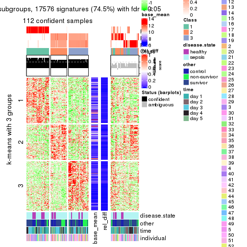</p>

</div>
<div id='tab-MAD-pam-get-signatures-3'>
<pre><code class="r">get_signatures(res, k = 4)
</code></pre>

<p></p>

</div>
<div id='tab-MAD-pam-get-signatures-4'>
<pre><code class="r">get_signatures(res, k = 5)
</code></pre>

<p></p>

</div>
<div id='tab-MAD-pam-get-signatures-5'>
<pre><code class="r">get_signatures(res, k = 6)
</code></pre>

<p></p>

</div>
</div>


Signature heatmaps where rows are not scaled:


<script>
$( function() {
	$( '#tabs-MAD-pam-get-signatures-no-scale' ).tabs();
} );
</script>
<div id='tabs-MAD-pam-get-signatures-no-scale'>
<ul>
<li><a href='#tab-MAD-pam-get-signatures-no-scale-1'>k = 2</a></li>
<li><a href='#tab-MAD-pam-get-signatures-no-scale-2'>k = 3</a></li>
<li><a href='#tab-MAD-pam-get-signatures-no-scale-3'>k = 4</a></li>
<li><a href='#tab-MAD-pam-get-signatures-no-scale-4'>k = 5</a></li>
<li><a href='#tab-MAD-pam-get-signatures-no-scale-5'>k = 6</a></li>
</ul>
<div id='tab-MAD-pam-get-signatures-no-scale-1'>
<pre><code class="r">get_signatures(res, k = 2, scale_rows = FALSE)
</code></pre>

<p></p>

</div>
<div id='tab-MAD-pam-get-signatures-no-scale-2'>
<pre><code class="r">get_signatures(res, k = 3, scale_rows = FALSE)
</code></pre>

<p></p>

</div>
<div id='tab-MAD-pam-get-signatures-no-scale-3'>
<pre><code class="r">get_signatures(res, k = 4, scale_rows = FALSE)
</code></pre>

<p></p>

</div>
<div id='tab-MAD-pam-get-signatures-no-scale-4'>
<pre><code class="r">get_signatures(res, k = 5, scale_rows = FALSE)
</code></pre>

<p></p>

</div>
<div id='tab-MAD-pam-get-signatures-no-scale-5'>
<pre><code class="r">get_signatures(res, k = 6, scale_rows = FALSE)
</code></pre>

<p></p>

</div>
</div>


Compare the overlap of signatures from different k:

```r
compare_signatures(res)
```


`get_signature()` returns a data frame invisibly. TO get the list of signatures, the function
call should be assigned to a variable explicitly. In following code, if `plot` argument is set
to `FALSE`, no heatmap is plotted while only the differential analysis is performed.

```r
# code only for demonstration
tb = get_signature(res, k = ..., plot = FALSE)
```

An example of the output of `tb` is:

```
#>   which_row         fdr    mean_1    mean_2 scaled_mean_1 scaled_mean_2 km
#> 1        38 0.042760348  8.373488  9.131774    -0.5533452     0.5164555  1
#> 2        40 0.018707592  7.106213  8.469186    -0.6173731     0.5762149  1
#> 3        55 0.019134737 10.221463 11.207825    -0.6159697     0.5749050  1
#> 4        59 0.006059896  5.921854  7.869574    -0.6899429     0.6439467  1
#> 5        60 0.018055526  8.928898 10.211722    -0.6204761     0.5791110  1
#> 6        98 0.009384629 15.714769 14.887706     0.6635654    -0.6193277  2
...
```

The columns in `tb` are:

1. `which_row`: row indices corresponding to the input matrix.
2. `fdr`: FDR for the differential test. 
3. `mean_x`: The mean value in group x.
4. `scaled_mean_x`: The mean value in group x after rows are scaled.
5. `km`: Row groups if k-means clustering is applied to rows.


UMAP plot which shows how samples are separated.


<script>
$( function() {
	$( '#tabs-MAD-pam-dimension-reduction' ).tabs();
} );
</script>
<div id='tabs-MAD-pam-dimension-reduction'>
<ul>
<li><a href='#tab-MAD-pam-dimension-reduction-1'>k = 2</a></li>
<li><a href='#tab-MAD-pam-dimension-reduction-2'>k = 3</a></li>
<li><a href='#tab-MAD-pam-dimension-reduction-3'>k = 4</a></li>
<li><a href='#tab-MAD-pam-dimension-reduction-4'>k = 5</a></li>
<li><a href='#tab-MAD-pam-dimension-reduction-5'>k = 6</a></li>
</ul>
<div id='tab-MAD-pam-dimension-reduction-1'>
<pre><code class="r">dimension_reduction(res, k = 2, method = &quot;UMAP&quot;)
</code></pre>

<p></p>

</div>
<div id='tab-MAD-pam-dimension-reduction-2'>
<pre><code class="r">dimension_reduction(res, k = 3, method = &quot;UMAP&quot;)
</code></pre>

<p>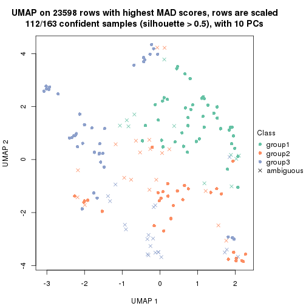</p>

</div>
<div id='tab-MAD-pam-dimension-reduction-3'>
<pre><code class="r">dimension_reduction(res, k = 4, method = &quot;UMAP&quot;)
</code></pre>

<p></p>

</div>
<div id='tab-MAD-pam-dimension-reduction-4'>
<pre><code class="r">dimension_reduction(res, k = 5, method = &quot;UMAP&quot;)
</code></pre>

<p></p>

</div>
<div id='tab-MAD-pam-dimension-reduction-5'>
<pre><code class="r">dimension_reduction(res, k = 6, method = &quot;UMAP&quot;)
</code></pre>

<p></p>

</div>
</div>


Following heatmap shows how subgroups are split when increasing `k`:

```r
collect_classes(res)
```


Test correlation between subgroups and known annotations. If the known
annotation is numeric, one-way ANOVA test is applied, and if the known
annotation is discrete, chi-squared contingency table test is applied.

```r
test_to_known_factors(res)
```

```
#>           n disease.state(p) other(p)  time(p) individual(p) k
#> MAD:pam 162          0.26218 0.087412 4.75e-03         0.496 2
#> MAD:pam 112          0.45094 0.150657 6.48e-02         0.505 3
#> MAD:pam 151          0.00910 0.009067 2.19e-03         0.513 4
#> MAD:pam 147          0.00042 0.000356 7.79e-03         0.282 5
#> MAD:pam 108          0.01698 0.117664 9.73e-05         0.662 6
```


If matrix rows can be associated to genes, consider to use `functional_enrichment(res,
...)` to perform function enrichment for the signature genes. See [this vignette](http://bioconductor.org/packages/devel/bioc/vignettes/cola/inst/doc/functional_enrichment.html) for more detailed explanations.


 

---------------------------------------------------


### MAD:mclust


The object with results only for a single top-value method and a single partition method 
can be extracted as:

```r
res = res_list["MAD", "mclust"]
# you can also extract it by
# res = res_list["MAD:mclust"]
```

A summary of `res` and all the functions that can be applied to it:

```r
res
```

```
#> A 'ConsensusPartition' object with k = 2, 3, 4, 5, 6.
#>   On a matrix with 23598 rows and 163 columns.
#>   Top rows (1000, 2000, 3000, 4000, 5000) are extracted by 'MAD' method.
#>   Subgroups are detected by 'mclust' method.
#>   Performed in total 1250 partitions by row resampling.
#>   Best k for subgroups seems to be 3.
#> 
#> Following methods can be applied to this 'ConsensusPartition' object:
#>  [1] "cola_report"             "collect_classes"         "collect_plots"          
#>  [4] "collect_stats"           "colnames"                "compare_signatures"     
#>  [7] "consensus_heatmap"       "dimension_reduction"     "functional_enrichment"  
#> [10] "get_anno_col"            "get_anno"                "get_classes"            
#> [13] "get_consensus"           "get_matrix"              "get_membership"         
#> [16] "get_param"               "get_signatures"          "get_stats"              
#> [19] "is_best_k"               "is_stable_k"             "membership_heatmap"     
#> [22] "ncol"                    "nrow"                    "plot_ecdf"              
#> [25] "rownames"                "select_partition_number" "show"                   
#> [28] "suggest_best_k"          "test_to_known_factors"
```

`collect_plots()` function collects all the plots made from `res` for all `k` (number of partitions)
into one single page to provide an easy and fast comparison between different `k`.

```r
collect_plots(res)
```


The plots are:

- The first row: a plot of the ECDF (empirical cumulative distribution
  function) curves of the consensus matrix for each `k` and the heatmap of
  predicted classes for each `k`.
- The second row: heatmaps of the consensus matrix for each `k`.
- The third row: heatmaps of the membership matrix for each `k`.
- The fouth row: heatmaps of the signatures for each `k`.

All the plots in panels can be made by individual functions and they are
plotted later in this section.

`select_partition_number()` produces several plots showing different
statistics for choosing "optimized" `k`. There are following statistics:

- ECDF curves of the consensus matrix for each `k`;
- 1-PAC. [The PAC
  score](https://en.wikipedia.org/wiki/Consensus_clustering#Over-interpretation_potential_of_consensus_clustering)
  measures the proportion of the ambiguous subgrouping.
- Mean silhouette score.
- Concordance. The mean probability of fiting the consensus class ids in all
  partitions.
- Area increased. Denote $A_k$ as the area under the ECDF curve for current
  `k`, the area increased is defined as $A_k - A_{k-1}$.
- Rand index. The percent of pairs of samples that are both in a same cluster
  or both are not in a same cluster in the partition of k and k-1.
- Jaccard index. The ratio of pairs of samples are both in a same cluster in
  the partition of k and k-1 and the pairs of samples are both in a same
  cluster in the partition k or k-1.

The detailed explanations of these statistics can be found in [the _cola_
vignette](http://bioconductor.org/packages/devel/bioc/vignettes/cola/inst/doc/cola.html#toc_13).

Generally speaking, lower PAC score, higher mean silhouette score or higher
concordance corresponds to better partition. Rand index and Jaccard index
measure how similar the current partition is compared to partition with `k-1`.
If they are too similar, we won't accept `k` is better than `k-1`.

```r
select_partition_number(res)
```


The numeric values for all these statistics can be obtained by `get_stats()`.

```r
get_stats(res)
```

```
#>   k 1-PAC mean_silhouette concordance area_increased  Rand Jaccard
#> 2 2 0.286           0.559       0.767         0.3155 0.884   0.884
#> 3 3 0.885           0.933       0.966         1.1107 0.389   0.331
#> 4 4 0.849           0.828       0.916         0.0850 0.911   0.743
#> 5 5 0.704           0.621       0.789         0.0813 0.933   0.765
#> 6 6 0.757           0.751       0.839         0.0547 0.851   0.452
```

`suggest_best_k()` suggests the best $k$ based on these statistics. The rules are as follows:

- All $k$ with Jaccard index larger than 0.95 are removed because increasing
  $k$ does not provide enough extra information. If all $k$ are removed, it is
  marked as no subgroup is detected.
- For all $k$ with 1-PAC score larger than 0.9, the maximal $k$ is taken as
  the best $k$, and other $k$ are marked as optional $k$.
- If it does not fit the second rule. The $k$ with the maximal vote of the
  highest 1-PAC score, highest mean silhouette, and highest concordance is
  taken as the best $k$.

```r
suggest_best_k(res)
```

```
#> [1] 3
```


Following shows the table of the partitions (You need to click the **show/hide
code output** link to see it). The membership matrix (columns with name `p*`)
is inferred by
[`clue::cl_consensus()`](https://www.rdocumentation.org/link/cl_consensus?package=clue)
function with the `SE` method. Basically the value in the membership matrix
represents the probability to belong to a certain group. The finall class
label for an item is determined with the group with highest probability it
belongs to.

In `get_classes()` function, the entropy is calculated from the membership
matrix and the silhouette score is calculated from the consensus matrix.


<script>
$( function() {
	$( '#tabs-MAD-mclust-get-classes' ).tabs();
} );
</script>
<div id='tabs-MAD-mclust-get-classes'>
<ul>
<li><a href='#tab-MAD-mclust-get-classes-1'>k = 2</a></li>
<li><a href='#tab-MAD-mclust-get-classes-2'>k = 3</a></li>
<li><a href='#tab-MAD-mclust-get-classes-3'>k = 4</a></li>
<li><a href='#tab-MAD-mclust-get-classes-4'>k = 5</a></li>
<li><a href='#tab-MAD-mclust-get-classes-5'>k = 6</a></li>
</ul>

<div id='tab-MAD-mclust-get-classes-1'>
<p><a id='tab-MAD-mclust-get-classes-1-a' style='color:#0366d6' href='#'>show/hide code output</a></p>
<pre><code class="r">cbind(get_classes(res, k = 2), get_membership(res, k = 2))
</code></pre>

<pre><code>#&gt;            class entropy silhouette    p1    p2
#&gt; GSM1317945     2  0.5946    0.70233 0.144 0.856
#&gt; GSM1317946     2  0.2948    0.71776 0.052 0.948
#&gt; GSM1317947     2  0.9686   -0.00596 0.396 0.604
#&gt; GSM1317948     2  0.0000    0.71357 0.000 1.000
#&gt; GSM1317949     2  0.4022    0.66080 0.080 0.920
#&gt; GSM1317950     2  0.4161    0.69539 0.084 0.916
#&gt; GSM1317953     2  0.4161    0.69539 0.084 0.916
#&gt; GSM1317954     2  0.4161    0.69539 0.084 0.916
#&gt; GSM1317955     2  0.4161    0.69539 0.084 0.916
#&gt; GSM1317956     2  0.4161    0.69539 0.084 0.916
#&gt; GSM1317957     2  0.7602    0.67590 0.220 0.780
#&gt; GSM1317958     2  0.4022    0.69708 0.080 0.920
#&gt; GSM1317959     2  0.6623    0.69315 0.172 0.828
#&gt; GSM1317960     2  0.0000    0.71357 0.000 1.000
#&gt; GSM1317961     2  0.9686   -0.00596 0.396 0.604
#&gt; GSM1317962     2  0.1184    0.71643 0.016 0.984
#&gt; GSM1317963     2  0.0000    0.71357 0.000 1.000
#&gt; GSM1317964     2  0.4161    0.69539 0.084 0.916
#&gt; GSM1317965     2  0.9686   -0.00596 0.396 0.604
#&gt; GSM1317966     2  0.9686   -0.00596 0.396 0.604
#&gt; GSM1317967     2  0.6623    0.69315 0.172 0.828
#&gt; GSM1317968     2  0.4022    0.69708 0.080 0.920
#&gt; GSM1317969     2  0.4690    0.65360 0.100 0.900
#&gt; GSM1317970     2  0.7219    0.67926 0.200 0.800
#&gt; GSM1317952     2  0.0376    0.71236 0.004 0.996
#&gt; GSM1317951     2  0.4161    0.69539 0.084 0.916
#&gt; GSM1317971     2  0.9686   -0.00596 0.396 0.604
#&gt; GSM1317972     2  0.2236    0.71782 0.036 0.964
#&gt; GSM1317973     2  0.6531    0.69477 0.168 0.832
#&gt; GSM1317974     2  0.6148    0.70152 0.152 0.848
#&gt; GSM1317975     2  0.8081    0.66635 0.248 0.752
#&gt; GSM1317978     2  0.4022    0.69708 0.080 0.920
#&gt; GSM1317979     2  0.0376    0.71236 0.004 0.996
#&gt; GSM1317980     2  0.9661    0.00247 0.392 0.608
#&gt; GSM1317981     2  0.8081    0.66635 0.248 0.752
#&gt; GSM1317982     2  0.0000    0.71357 0.000 1.000
#&gt; GSM1317983     2  0.4161    0.69539 0.084 0.916
#&gt; GSM1317984     1  0.8608    0.98198 0.716 0.284
#&gt; GSM1317985     1  0.8608    0.98198 0.716 0.284
#&gt; GSM1317986     2  0.4161    0.69539 0.084 0.916
#&gt; GSM1317987     2  0.8081    0.66635 0.248 0.752
#&gt; GSM1317988     2  0.7139    0.68152 0.196 0.804
#&gt; GSM1317989     2  0.0000    0.71357 0.000 1.000
#&gt; GSM1317990     2  0.8081    0.66635 0.248 0.752
#&gt; GSM1317991     2  0.9686   -0.00596 0.396 0.604
#&gt; GSM1317992     2  0.7528    0.68341 0.216 0.784
#&gt; GSM1317993     2  0.8081    0.66635 0.248 0.752
#&gt; GSM1317994     1  0.9460    0.83433 0.636 0.364
#&gt; GSM1317977     2  0.0000    0.71357 0.000 1.000
#&gt; GSM1317976     2  0.0000    0.71357 0.000 1.000
#&gt; GSM1317995     1  0.8608    0.98198 0.716 0.284
#&gt; GSM1317996     2  0.7219    0.67926 0.200 0.800
#&gt; GSM1317997     1  0.8608    0.98198 0.716 0.284
#&gt; GSM1317998     2  0.4161    0.69539 0.084 0.916
#&gt; GSM1317999     2  0.4022    0.69708 0.080 0.920
#&gt; GSM1318002     2  0.8081    0.66635 0.248 0.752
#&gt; GSM1318003     2  0.7376    0.67836 0.208 0.792
#&gt; GSM1318004     2  0.6531    0.69477 0.168 0.832
#&gt; GSM1318005     2  0.7219    0.67926 0.200 0.800
#&gt; GSM1318006     2  0.4161    0.69539 0.084 0.916
#&gt; GSM1318007     2  0.5737    0.70448 0.136 0.864
#&gt; GSM1318008     2  0.4161    0.69539 0.084 0.916
#&gt; GSM1318009     2  0.7219    0.67926 0.200 0.800
#&gt; GSM1318010     1  0.8608    0.98198 0.716 0.284
#&gt; GSM1318011     2  0.0376    0.71354 0.004 0.996
#&gt; GSM1318012     2  0.0000    0.71357 0.000 1.000
#&gt; GSM1318013     2  0.6531    0.69477 0.168 0.832
#&gt; GSM1318014     2  0.1414    0.71233 0.020 0.980
#&gt; GSM1318015     2  0.8081    0.66635 0.248 0.752
#&gt; GSM1318001     1  0.8608    0.98198 0.716 0.284
#&gt; GSM1318000     2  0.7219    0.67926 0.200 0.800
#&gt; GSM1318016     2  0.8081    0.66635 0.248 0.752
#&gt; GSM1318017     2  0.4161    0.69539 0.084 0.916
#&gt; GSM1318019     2  0.7219    0.67926 0.200 0.800
#&gt; GSM1318020     2  0.9686   -0.00596 0.396 0.604
#&gt; GSM1318021     2  0.8081    0.66635 0.248 0.752
#&gt; GSM1318022     2  0.9686   -0.00596 0.396 0.604
#&gt; GSM1318023     2  0.4161    0.69539 0.084 0.916
#&gt; GSM1318024     2  0.8081    0.66635 0.248 0.752
#&gt; GSM1318025     2  0.9686   -0.00596 0.396 0.604
#&gt; GSM1318026     2  0.7950    0.67137 0.240 0.760
#&gt; GSM1318027     2  0.7219    0.67926 0.200 0.800
#&gt; GSM1318028     2  0.4161    0.69539 0.084 0.916
#&gt; GSM1318029     2  0.9686   -0.00596 0.396 0.604
#&gt; GSM1318018     2  0.4161    0.69539 0.084 0.916
#&gt; GSM1318030     2  0.0000    0.71357 0.000 1.000
#&gt; GSM1318031     2  0.9686   -0.00596 0.396 0.604
#&gt; GSM1318033     2  0.0000    0.71357 0.000 1.000
#&gt; GSM1318034     2  0.9686   -0.00596 0.396 0.604
#&gt; GSM1318035     2  0.8081    0.66635 0.248 0.752
#&gt; GSM1318036     2  0.0000    0.71357 0.000 1.000
#&gt; GSM1318037     2  0.0000    0.71357 0.000 1.000
#&gt; GSM1318038     2  0.9686   -0.00596 0.396 0.604
#&gt; GSM1318039     2  0.4161    0.69539 0.084 0.916
#&gt; GSM1318040     2  0.9686   -0.00596 0.396 0.604
#&gt; GSM1318032     2  0.9686   -0.00596 0.396 0.604
#&gt; GSM1317914     2  0.9686   -0.00596 0.396 0.604
#&gt; GSM1317915     2  0.4161    0.69539 0.084 0.916
#&gt; GSM1317916     2  0.4161    0.69539 0.084 0.916
#&gt; GSM1317917     2  0.8327    0.38329 0.264 0.736
#&gt; GSM1317918     2  0.4161    0.69539 0.084 0.916
#&gt; GSM1317919     2  0.9686   -0.00596 0.396 0.604
#&gt; GSM1317920     2  0.9686   -0.00596 0.396 0.604
#&gt; GSM1317921     2  0.9686   -0.00596 0.396 0.604
#&gt; GSM1317922     2  0.9686   -0.00596 0.396 0.604
#&gt; GSM1317923     2  0.9686   -0.00596 0.396 0.604
#&gt; GSM1317924     2  0.9686   -0.00596 0.396 0.604
#&gt; GSM1317925     2  0.8081    0.66635 0.248 0.752
#&gt; GSM1317926     2  0.9686   -0.00596 0.396 0.604
#&gt; GSM1317927     2  0.8081    0.66635 0.248 0.752
#&gt; GSM1317928     2  0.9686   -0.00596 0.396 0.604
#&gt; GSM1317929     2  0.9710   -0.00688 0.400 0.600
#&gt; GSM1317930     2  0.8081    0.66635 0.248 0.752
#&gt; GSM1317931     2  0.9775   -0.08313 0.412 0.588
#&gt; GSM1317932     2  0.9686    0.02100 0.396 0.604
#&gt; GSM1317933     2  0.8081    0.66635 0.248 0.752
#&gt; GSM1317934     2  0.8267    0.44528 0.260 0.740
#&gt; GSM1317935     2  0.9686   -0.00596 0.396 0.604
#&gt; GSM1317936     1  0.8713    0.97177 0.708 0.292
#&gt; GSM1317937     2  0.4161    0.69539 0.084 0.916
#&gt; GSM1317938     2  0.7219    0.67926 0.200 0.800
#&gt; GSM1317939     2  0.7453    0.67768 0.212 0.788
#&gt; GSM1317940     2  0.4022    0.70012 0.080 0.920
#&gt; GSM1317941     2  0.7219    0.67926 0.200 0.800
#&gt; GSM1317942     2  0.7219    0.67926 0.200 0.800
#&gt; GSM1317943     2  0.7219    0.67926 0.200 0.800
#&gt; GSM1317944     2  0.8081    0.66635 0.248 0.752
#&gt; GSM1317896     1  0.8608    0.98198 0.716 0.284
#&gt; GSM1317897     2  0.4161    0.69539 0.084 0.916
#&gt; GSM1317898     2  0.0000    0.71357 0.000 1.000
#&gt; GSM1317899     2  0.0000    0.71357 0.000 1.000
#&gt; GSM1317900     2  0.9686   -0.00596 0.396 0.604
#&gt; GSM1317901     2  0.5294    0.67287 0.120 0.880
#&gt; GSM1317902     2  0.4161    0.69539 0.084 0.916
#&gt; GSM1317903     2  0.4161    0.69539 0.084 0.916
#&gt; GSM1317904     2  0.7219    0.67926 0.200 0.800
#&gt; GSM1317905     2  0.3733    0.70267 0.072 0.928
#&gt; GSM1317906     2  0.7528    0.68341 0.216 0.784
#&gt; GSM1317907     2  0.0000    0.71357 0.000 1.000
#&gt; GSM1317908     2  0.9686   -0.00596 0.396 0.604
#&gt; GSM1317909     2  0.3733    0.67335 0.072 0.928
#&gt; GSM1317910     2  0.3274    0.68019 0.060 0.940
#&gt; GSM1317911     2  0.4022    0.69718 0.080 0.920
#&gt; GSM1317912     2  0.0000    0.71357 0.000 1.000
#&gt; GSM1317913     2  0.6531    0.69477 0.168 0.832
#&gt; GSM1318041     2  0.2043    0.69903 0.032 0.968
#&gt; GSM1318042     2  0.9686   -0.00596 0.396 0.604
#&gt; GSM1318043     1  0.8608    0.98198 0.716 0.284
#&gt; GSM1318044     2  0.4161    0.69539 0.084 0.916
#&gt; GSM1318045     2  0.4161    0.69539 0.084 0.916
#&gt; GSM1318046     2  0.4161    0.69539 0.084 0.916
#&gt; GSM1318047     2  0.0000    0.71357 0.000 1.000
#&gt; GSM1318048     2  0.9686   -0.00596 0.396 0.604
#&gt; GSM1318049     2  0.3274    0.68605 0.060 0.940
#&gt; GSM1318050     2  0.7219    0.67926 0.200 0.800
#&gt; GSM1318051     2  0.7219    0.67926 0.200 0.800
#&gt; GSM1318052     2  0.7219    0.67926 0.200 0.800
#&gt; GSM1318053     2  0.7219    0.67926 0.200 0.800
#&gt; GSM1318054     2  0.6531    0.69477 0.168 0.832
#&gt; GSM1318055     2  0.9686   -0.00596 0.396 0.604
#&gt; GSM1318056     2  0.6531    0.69477 0.168 0.832
#&gt; GSM1318057     2  0.7219    0.67926 0.200 0.800
#&gt; GSM1318058     2  0.6973    0.69387 0.188 0.812
</code></pre>

<script>
$('#tab-MAD-mclust-get-classes-1-a').parent().next().next().hide();
$('#tab-MAD-mclust-get-classes-1-a').click(function(){
  $('#tab-MAD-mclust-get-classes-1-a').parent().next().next().toggle();
  return(false);
});
</script>
</div>

<div id='tab-MAD-mclust-get-classes-2'>
<p><a id='tab-MAD-mclust-get-classes-2-a' style='color:#0366d6' href='#'>show/hide code output</a></p>
<pre><code class="r">cbind(get_classes(res, k = 3), get_membership(res, k = 3))
</code></pre>

<pre><code>#&gt;            class entropy silhouette    p1    p2    p3
#&gt; GSM1317945     2  0.0237      0.953 0.000 0.996 0.004
#&gt; GSM1317946     2  0.4121      0.812 0.168 0.832 0.000
#&gt; GSM1317947     3  0.0000      0.986 0.000 0.000 1.000
#&gt; GSM1317948     1  0.4504      0.775 0.804 0.000 0.196
#&gt; GSM1317949     1  0.1411      0.942 0.964 0.000 0.036
#&gt; GSM1317950     1  0.0000      0.960 1.000 0.000 0.000
#&gt; GSM1317953     1  0.0000      0.960 1.000 0.000 0.000
#&gt; GSM1317954     1  0.0000      0.960 1.000 0.000 0.000
#&gt; GSM1317955     1  0.0000      0.960 1.000 0.000 0.000
#&gt; GSM1317956     1  0.0000      0.960 1.000 0.000 0.000
#&gt; GSM1317957     2  0.0237      0.953 0.000 0.996 0.004
#&gt; GSM1317958     1  0.0000      0.960 1.000 0.000 0.000
#&gt; GSM1317959     2  0.0237      0.953 0.000 0.996 0.004
#&gt; GSM1317960     1  0.3551      0.850 0.868 0.000 0.132
#&gt; GSM1317961     3  0.0000      0.986 0.000 0.000 1.000
#&gt; GSM1317962     2  0.3030      0.889 0.092 0.904 0.004
#&gt; GSM1317963     1  0.0747      0.953 0.984 0.000 0.016
#&gt; GSM1317964     1  0.0000      0.960 1.000 0.000 0.000
#&gt; GSM1317965     3  0.0000      0.986 0.000 0.000 1.000
#&gt; GSM1317966     3  0.0000      0.986 0.000 0.000 1.000
#&gt; GSM1317967     2  0.2796      0.899 0.000 0.908 0.092
#&gt; GSM1317968     1  0.0000      0.960 1.000 0.000 0.000
#&gt; GSM1317969     3  0.5291      0.603 0.000 0.268 0.732
#&gt; GSM1317970     2  0.0237      0.953 0.000 0.996 0.004
#&gt; GSM1317952     1  0.4121      0.809 0.832 0.000 0.168
#&gt; GSM1317951     1  0.0000      0.960 1.000 0.000 0.000
#&gt; GSM1317971     3  0.0747      0.971 0.000 0.016 0.984
#&gt; GSM1317972     2  0.6154      0.349 0.408 0.592 0.000
#&gt; GSM1317973     2  0.0237      0.953 0.000 0.996 0.004
#&gt; GSM1317974     2  0.1525      0.934 0.032 0.964 0.004
#&gt; GSM1317975     2  0.0000      0.951 0.000 1.000 0.000
#&gt; GSM1317978     1  0.0237      0.958 0.996 0.004 0.000
#&gt; GSM1317979     3  0.5327      0.598 0.272 0.000 0.728
#&gt; GSM1317980     3  0.0000      0.986 0.000 0.000 1.000
#&gt; GSM1317981     2  0.0000      0.951 0.000 1.000 0.000
#&gt; GSM1317982     2  0.5216      0.701 0.000 0.740 0.260
#&gt; GSM1317983     1  0.0000      0.960 1.000 0.000 0.000
#&gt; GSM1317984     3  0.0000      0.986 0.000 0.000 1.000
#&gt; GSM1317985     3  0.0000      0.986 0.000 0.000 1.000
#&gt; GSM1317986     1  0.0000      0.960 1.000 0.000 0.000
#&gt; GSM1317987     2  0.0000      0.951 0.000 1.000 0.000
#&gt; GSM1317988     2  0.0237      0.953 0.000 0.996 0.004
#&gt; GSM1317989     1  0.4121      0.809 0.832 0.000 0.168
#&gt; GSM1317990     2  0.0000      0.951 0.000 1.000 0.000
#&gt; GSM1317991     3  0.0000      0.986 0.000 0.000 1.000
#&gt; GSM1317992     2  0.3116      0.886 0.000 0.892 0.108
#&gt; GSM1317993     2  0.0000      0.951 0.000 1.000 0.000
#&gt; GSM1317994     3  0.0000      0.986 0.000 0.000 1.000
#&gt; GSM1317977     1  0.2066      0.921 0.940 0.000 0.060
#&gt; GSM1317976     1  0.0983      0.949 0.980 0.016 0.004
#&gt; GSM1317995     3  0.0000      0.986 0.000 0.000 1.000
#&gt; GSM1317996     2  0.0237      0.953 0.000 0.996 0.004
#&gt; GSM1317997     3  0.0000      0.986 0.000 0.000 1.000
#&gt; GSM1317998     1  0.0000      0.960 1.000 0.000 0.000
#&gt; GSM1317999     1  0.0000      0.960 1.000 0.000 0.000
#&gt; GSM1318002     2  0.0237      0.953 0.000 0.996 0.004
#&gt; GSM1318003     2  0.0237      0.953 0.000 0.996 0.004
#&gt; GSM1318004     2  0.0237      0.953 0.000 0.996 0.004
#&gt; GSM1318005     2  0.0237      0.953 0.000 0.996 0.004
#&gt; GSM1318006     1  0.0000      0.960 1.000 0.000 0.000
#&gt; GSM1318007     2  0.3879      0.845 0.000 0.848 0.152
#&gt; GSM1318008     1  0.0000      0.960 1.000 0.000 0.000
#&gt; GSM1318009     2  0.0237      0.953 0.000 0.996 0.004
#&gt; GSM1318010     3  0.0000      0.986 0.000 0.000 1.000
#&gt; GSM1318011     1  0.0892      0.951 0.980 0.000 0.020
#&gt; GSM1318012     1  0.0892      0.951 0.980 0.000 0.020
#&gt; GSM1318013     2  0.3038      0.890 0.000 0.896 0.104
#&gt; GSM1318014     1  0.1031      0.949 0.976 0.000 0.024
#&gt; GSM1318015     2  0.0237      0.953 0.000 0.996 0.004
#&gt; GSM1318001     3  0.0000      0.986 0.000 0.000 1.000
#&gt; GSM1318000     2  0.0237      0.953 0.000 0.996 0.004
#&gt; GSM1318016     2  0.0237      0.953 0.000 0.996 0.004
#&gt; GSM1318017     1  0.0000      0.960 1.000 0.000 0.000
#&gt; GSM1318019     2  0.0237      0.953 0.000 0.996 0.004
#&gt; GSM1318020     3  0.0000      0.986 0.000 0.000 1.000
#&gt; GSM1318021     2  0.0000      0.951 0.000 1.000 0.000
#&gt; GSM1318022     3  0.0000      0.986 0.000 0.000 1.000
#&gt; GSM1318023     1  0.0000      0.960 1.000 0.000 0.000
#&gt; GSM1318024     2  0.0000      0.951 0.000 1.000 0.000
#&gt; GSM1318025     3  0.0000      0.986 0.000 0.000 1.000
#&gt; GSM1318026     2  0.0237      0.953 0.000 0.996 0.004
#&gt; GSM1318027     2  0.0237      0.953 0.000 0.996 0.004
#&gt; GSM1318028     1  0.0000      0.960 1.000 0.000 0.000
#&gt; GSM1318029     3  0.0000      0.986 0.000 0.000 1.000
#&gt; GSM1318018     1  0.0000      0.960 1.000 0.000 0.000
#&gt; GSM1318030     2  0.4178      0.823 0.000 0.828 0.172
#&gt; GSM1318031     3  0.0000      0.986 0.000 0.000 1.000
#&gt; GSM1318033     1  0.0661      0.954 0.988 0.008 0.004
#&gt; GSM1318034     3  0.0000      0.986 0.000 0.000 1.000
#&gt; GSM1318035     2  0.0000      0.951 0.000 1.000 0.000
#&gt; GSM1318036     1  0.6209      0.428 0.628 0.368 0.004
#&gt; GSM1318037     2  0.3752      0.853 0.000 0.856 0.144
#&gt; GSM1318038     3  0.0000      0.986 0.000 0.000 1.000
#&gt; GSM1318039     1  0.0000      0.960 1.000 0.000 0.000
#&gt; GSM1318040     3  0.1289      0.956 0.000 0.032 0.968
#&gt; GSM1318032     3  0.0747      0.971 0.000 0.016 0.984
#&gt; GSM1317914     3  0.0000      0.986 0.000 0.000 1.000
#&gt; GSM1317915     1  0.0000      0.960 1.000 0.000 0.000
#&gt; GSM1317916     1  0.0000      0.960 1.000 0.000 0.000
#&gt; GSM1317917     3  0.0000      0.986 0.000 0.000 1.000
#&gt; GSM1317918     1  0.0000      0.960 1.000 0.000 0.000
#&gt; GSM1317919     3  0.0237      0.982 0.000 0.004 0.996
#&gt; GSM1317920     3  0.0000      0.986 0.000 0.000 1.000
#&gt; GSM1317921     3  0.0000      0.986 0.000 0.000 1.000
#&gt; GSM1317922     3  0.0000      0.986 0.000 0.000 1.000
#&gt; GSM1317923     3  0.0000      0.986 0.000 0.000 1.000
#&gt; GSM1317924     3  0.0000      0.986 0.000 0.000 1.000
#&gt; GSM1317925     2  0.0000      0.951 0.000 1.000 0.000
#&gt; GSM1317926     3  0.0000      0.986 0.000 0.000 1.000
#&gt; GSM1317927     2  0.0000      0.951 0.000 1.000 0.000
#&gt; GSM1317928     3  0.0000      0.986 0.000 0.000 1.000
#&gt; GSM1317929     3  0.0424      0.979 0.000 0.008 0.992
#&gt; GSM1317930     2  0.0237      0.953 0.000 0.996 0.004
#&gt; GSM1317931     3  0.0000      0.986 0.000 0.000 1.000
#&gt; GSM1317932     3  0.0000      0.986 0.000 0.000 1.000
#&gt; GSM1317933     2  0.0000      0.951 0.000 1.000 0.000
#&gt; GSM1317934     3  0.0747      0.971 0.000 0.016 0.984
#&gt; GSM1317935     3  0.0000      0.986 0.000 0.000 1.000
#&gt; GSM1317936     3  0.0000      0.986 0.000 0.000 1.000
#&gt; GSM1317937     1  0.0000      0.960 1.000 0.000 0.000
#&gt; GSM1317938     2  0.0237      0.953 0.000 0.996 0.004
#&gt; GSM1317939     2  0.0000      0.951 0.000 1.000 0.000
#&gt; GSM1317940     1  0.0237      0.958 0.996 0.004 0.000
#&gt; GSM1317941     2  0.0237      0.953 0.000 0.996 0.004
#&gt; GSM1317942     2  0.0237      0.953 0.000 0.996 0.004
#&gt; GSM1317943     2  0.0237      0.953 0.000 0.996 0.004
#&gt; GSM1317944     2  0.0000      0.951 0.000 1.000 0.000
#&gt; GSM1317896     3  0.0000      0.986 0.000 0.000 1.000
#&gt; GSM1317897     1  0.0000      0.960 1.000 0.000 0.000
#&gt; GSM1317898     1  0.0747      0.953 0.984 0.000 0.016
#&gt; GSM1317899     1  0.0000      0.960 1.000 0.000 0.000
#&gt; GSM1317900     3  0.0000      0.986 0.000 0.000 1.000
#&gt; GSM1317901     1  0.0892      0.951 0.980 0.000 0.020
#&gt; GSM1317902     1  0.0000      0.960 1.000 0.000 0.000
#&gt; GSM1317903     1  0.0000      0.960 1.000 0.000 0.000
#&gt; GSM1317904     2  0.0237      0.953 0.000 0.996 0.004
#&gt; GSM1317905     2  0.2448      0.910 0.000 0.924 0.076
#&gt; GSM1317906     2  0.2878      0.896 0.000 0.904 0.096
#&gt; GSM1317907     2  0.4654      0.778 0.000 0.792 0.208
#&gt; GSM1317908     3  0.0000      0.986 0.000 0.000 1.000
#&gt; GSM1317909     1  0.4555      0.770 0.800 0.000 0.200
#&gt; GSM1317910     1  0.5706      0.569 0.680 0.000 0.320
#&gt; GSM1317911     1  0.0000      0.960 1.000 0.000 0.000
#&gt; GSM1317912     2  0.5681      0.725 0.016 0.748 0.236
#&gt; GSM1317913     2  0.0424      0.951 0.000 0.992 0.008
#&gt; GSM1318041     3  0.0000      0.986 0.000 0.000 1.000
#&gt; GSM1318042     3  0.0000      0.986 0.000 0.000 1.000
#&gt; GSM1318043     3  0.0000      0.986 0.000 0.000 1.000
#&gt; GSM1318044     1  0.0000      0.960 1.000 0.000 0.000
#&gt; GSM1318045     1  0.0000      0.960 1.000 0.000 0.000
#&gt; GSM1318046     1  0.0000      0.960 1.000 0.000 0.000
#&gt; GSM1318047     1  0.1031      0.949 0.976 0.000 0.024
#&gt; GSM1318048     3  0.0000      0.986 0.000 0.000 1.000
#&gt; GSM1318049     1  0.4399      0.786 0.812 0.000 0.188
#&gt; GSM1318050     2  0.0237      0.953 0.000 0.996 0.004
#&gt; GSM1318051     2  0.0237      0.953 0.000 0.996 0.004
#&gt; GSM1318052     2  0.0237      0.953 0.000 0.996 0.004
#&gt; GSM1318053     2  0.0237      0.953 0.000 0.996 0.004
#&gt; GSM1318054     2  0.3619      0.861 0.000 0.864 0.136
#&gt; GSM1318055     3  0.0000      0.986 0.000 0.000 1.000
#&gt; GSM1318056     2  0.3340      0.876 0.000 0.880 0.120
#&gt; GSM1318057     2  0.0237      0.953 0.000 0.996 0.004
#&gt; GSM1318058     2  0.3752      0.853 0.000 0.856 0.144
</code></pre>

<script>
$('#tab-MAD-mclust-get-classes-2-a').parent().next().next().hide();
$('#tab-MAD-mclust-get-classes-2-a').click(function(){
  $('#tab-MAD-mclust-get-classes-2-a').parent().next().next().toggle();
  return(false);
});
</script>
</div>

<div id='tab-MAD-mclust-get-classes-3'>
<p><a id='tab-MAD-mclust-get-classes-3-a' style='color:#0366d6' href='#'>show/hide code output</a></p>
<pre><code class="r">cbind(get_classes(res, k = 4), get_membership(res, k = 4))
</code></pre>

<pre><code>#&gt;            class entropy silhouette    p1    p2    p3    p4
#&gt; GSM1317945     4  0.0336      0.835 0.000 0.000 0.008 0.992
#&gt; GSM1317946     1  0.5429      0.307 0.592 0.012 0.004 0.392
#&gt; GSM1317947     3  0.0188      0.968 0.000 0.004 0.996 0.000
#&gt; GSM1317948     1  0.5466      0.601 0.668 0.040 0.292 0.000
#&gt; GSM1317949     1  0.2830      0.887 0.900 0.040 0.060 0.000
#&gt; GSM1317950     1  0.0336      0.927 0.992 0.008 0.000 0.000
#&gt; GSM1317953     1  0.0336      0.927 0.992 0.008 0.000 0.000
#&gt; GSM1317954     1  0.0469      0.927 0.988 0.012 0.000 0.000
#&gt; GSM1317955     1  0.0592      0.926 0.984 0.016 0.000 0.000
#&gt; GSM1317956     1  0.0336      0.927 0.992 0.008 0.000 0.000
#&gt; GSM1317957     2  0.4103      0.706 0.000 0.744 0.000 0.256
#&gt; GSM1317958     1  0.1022      0.923 0.968 0.032 0.000 0.000
#&gt; GSM1317959     4  0.0524      0.834 0.000 0.004 0.008 0.988
#&gt; GSM1317960     1  0.3587      0.840 0.856 0.040 0.104 0.000
#&gt; GSM1317961     3  0.0469      0.964 0.000 0.012 0.988 0.000
#&gt; GSM1317962     1  0.5568      0.545 0.664 0.028 0.008 0.300
#&gt; GSM1317963     1  0.1545      0.918 0.952 0.040 0.008 0.000
#&gt; GSM1317964     1  0.0469      0.927 0.988 0.012 0.000 0.000
#&gt; GSM1317965     3  0.0000      0.969 0.000 0.000 1.000 0.000
#&gt; GSM1317966     3  0.0469      0.964 0.000 0.012 0.988 0.000
#&gt; GSM1317967     4  0.0592      0.832 0.000 0.000 0.016 0.984
#&gt; GSM1317968     1  0.0592      0.926 0.984 0.016 0.000 0.000
#&gt; GSM1317969     3  0.0188      0.968 0.000 0.004 0.996 0.000
#&gt; GSM1317970     2  0.4905      0.546 0.000 0.632 0.004 0.364
#&gt; GSM1317952     1  0.4793      0.728 0.756 0.040 0.204 0.000
#&gt; GSM1317951     1  0.0592      0.926 0.984 0.016 0.000 0.000
#&gt; GSM1317971     3  0.0188      0.968 0.000 0.004 0.996 0.000
#&gt; GSM1317972     1  0.2586      0.881 0.912 0.048 0.000 0.040
#&gt; GSM1317973     4  0.0336      0.835 0.000 0.000 0.008 0.992
#&gt; GSM1317974     4  0.8029     -0.145 0.280 0.340 0.004 0.376
#&gt; GSM1317975     2  0.1807      0.832 0.000 0.940 0.008 0.052
#&gt; GSM1317978     1  0.0592      0.926 0.984 0.016 0.000 0.000
#&gt; GSM1317979     3  0.5821      0.302 0.368 0.040 0.592 0.000
#&gt; GSM1317980     3  0.0000      0.969 0.000 0.000 1.000 0.000
#&gt; GSM1317981     2  0.1807      0.832 0.000 0.940 0.008 0.052
#&gt; GSM1317982     3  0.4761      0.337 0.000 0.000 0.628 0.372
#&gt; GSM1317983     1  0.0336      0.927 0.992 0.008 0.000 0.000
#&gt; GSM1317984     3  0.0188      0.968 0.000 0.000 0.996 0.004
#&gt; GSM1317985     3  0.0336      0.965 0.000 0.000 0.992 0.008
#&gt; GSM1317986     1  0.0336      0.927 0.992 0.008 0.000 0.000
#&gt; GSM1317987     2  0.1807      0.832 0.000 0.940 0.008 0.052
#&gt; GSM1317988     4  0.0336      0.835 0.000 0.000 0.008 0.992
#&gt; GSM1317989     1  0.4831      0.722 0.752 0.040 0.208 0.000
#&gt; GSM1317990     2  0.1824      0.833 0.000 0.936 0.004 0.060
#&gt; GSM1317991     3  0.0000      0.969 0.000 0.000 1.000 0.000
#&gt; GSM1317992     2  0.6442      0.612 0.000 0.632 0.124 0.244
#&gt; GSM1317993     2  0.1637      0.832 0.000 0.940 0.000 0.060
#&gt; GSM1317994     3  0.0336      0.965 0.000 0.000 0.992 0.008
#&gt; GSM1317977     1  0.1985      0.913 0.940 0.040 0.016 0.004
#&gt; GSM1317976     1  0.0592      0.926 0.984 0.016 0.000 0.000
#&gt; GSM1317995     3  0.0336      0.965 0.000 0.000 0.992 0.008
#&gt; GSM1317996     2  0.2868      0.811 0.000 0.864 0.000 0.136
#&gt; GSM1317997     3  0.0336      0.965 0.000 0.000 0.992 0.008
#&gt; GSM1317998     1  0.0921      0.924 0.972 0.028 0.000 0.000
#&gt; GSM1317999     1  0.1022      0.923 0.968 0.032 0.000 0.000
#&gt; GSM1318002     2  0.2149      0.832 0.000 0.912 0.000 0.088
#&gt; GSM1318003     4  0.4277      0.462 0.000 0.280 0.000 0.720
#&gt; GSM1318004     4  0.0336      0.835 0.000 0.000 0.008 0.992
#&gt; GSM1318005     4  0.0336      0.835 0.000 0.000 0.008 0.992
#&gt; GSM1318006     1  0.0336      0.927 0.992 0.008 0.000 0.000
#&gt; GSM1318007     4  0.0804      0.830 0.000 0.008 0.012 0.980
#&gt; GSM1318008     1  0.1022      0.923 0.968 0.032 0.000 0.000
#&gt; GSM1318009     4  0.0672      0.832 0.000 0.008 0.008 0.984
#&gt; GSM1318010     3  0.0336      0.965 0.000 0.000 0.992 0.008
#&gt; GSM1318011     1  0.1545      0.918 0.952 0.040 0.008 0.000
#&gt; GSM1318012     1  0.1677      0.916 0.948 0.040 0.012 0.000
#&gt; GSM1318013     4  0.0469      0.834 0.000 0.000 0.012 0.988
#&gt; GSM1318014     1  0.1798      0.915 0.944 0.040 0.016 0.000
#&gt; GSM1318015     2  0.2271      0.834 0.000 0.916 0.008 0.076
#&gt; GSM1318001     3  0.0336      0.965 0.000 0.000 0.992 0.008
#&gt; GSM1318000     4  0.1109      0.821 0.000 0.028 0.004 0.968
#&gt; GSM1318016     2  0.3024      0.798 0.000 0.852 0.000 0.148
#&gt; GSM1318017     1  0.0188      0.928 0.996 0.004 0.000 0.000
#&gt; GSM1318019     4  0.0524      0.831 0.000 0.008 0.004 0.988
#&gt; GSM1318020     3  0.0000      0.969 0.000 0.000 1.000 0.000
#&gt; GSM1318021     2  0.3123      0.789 0.000 0.844 0.000 0.156
#&gt; GSM1318022     3  0.0000      0.969 0.000 0.000 1.000 0.000
#&gt; GSM1318023     1  0.0188      0.928 0.996 0.004 0.000 0.000
#&gt; GSM1318024     2  0.1637      0.832 0.000 0.940 0.000 0.060
#&gt; GSM1318025     3  0.0000      0.969 0.000 0.000 1.000 0.000
#&gt; GSM1318026     2  0.6836      0.543 0.000 0.580 0.140 0.280
#&gt; GSM1318027     4  0.0336      0.835 0.000 0.000 0.008 0.992
#&gt; GSM1318028     1  0.0592      0.926 0.984 0.016 0.000 0.000
#&gt; GSM1318029     3  0.0188      0.968 0.000 0.004 0.996 0.000
#&gt; GSM1318018     1  0.0336      0.927 0.992 0.008 0.000 0.000
#&gt; GSM1318030     4  0.2281      0.754 0.000 0.000 0.096 0.904
#&gt; GSM1318031     3  0.0188      0.968 0.000 0.004 0.996 0.000
#&gt; GSM1318033     1  0.1305      0.921 0.960 0.036 0.004 0.000
#&gt; GSM1318034     3  0.0188      0.968 0.000 0.004 0.996 0.000
#&gt; GSM1318035     2  0.2149      0.829 0.000 0.912 0.000 0.088
#&gt; GSM1318036     1  0.5223      0.698 0.736 0.040 0.008 0.216
#&gt; GSM1318037     4  0.0657      0.832 0.000 0.004 0.012 0.984
#&gt; GSM1318038     3  0.0000      0.969 0.000 0.000 1.000 0.000
#&gt; GSM1318039     1  0.0336      0.927 0.992 0.008 0.000 0.000
#&gt; GSM1318040     3  0.2282      0.893 0.000 0.024 0.924 0.052
#&gt; GSM1318032     3  0.0524      0.963 0.000 0.008 0.988 0.004
#&gt; GSM1317914     3  0.0188      0.968 0.000 0.004 0.996 0.000
#&gt; GSM1317915     1  0.0336      0.927 0.992 0.008 0.000 0.000
#&gt; GSM1317916     1  0.0336      0.927 0.992 0.008 0.000 0.000
#&gt; GSM1317917     3  0.0188      0.968 0.000 0.004 0.996 0.000
#&gt; GSM1317918     1  0.0336      0.927 0.992 0.008 0.000 0.000
#&gt; GSM1317919     3  0.0000      0.969 0.000 0.000 1.000 0.000
#&gt; GSM1317920     3  0.0000      0.969 0.000 0.000 1.000 0.000
#&gt; GSM1317921     3  0.0000      0.969 0.000 0.000 1.000 0.000
#&gt; GSM1317922     3  0.0188      0.968 0.000 0.004 0.996 0.000
#&gt; GSM1317923     3  0.0000      0.969 0.000 0.000 1.000 0.000
#&gt; GSM1317924     3  0.0188      0.968 0.000 0.004 0.996 0.000
#&gt; GSM1317925     2  0.1637      0.832 0.000 0.940 0.000 0.060
#&gt; GSM1317926     3  0.0000      0.969 0.000 0.000 1.000 0.000
#&gt; GSM1317927     2  0.4697      0.479 0.000 0.644 0.000 0.356
#&gt; GSM1317928     3  0.0188      0.968 0.000 0.004 0.996 0.000
#&gt; GSM1317929     3  0.0000      0.969 0.000 0.000 1.000 0.000
#&gt; GSM1317930     4  0.2611      0.765 0.000 0.096 0.008 0.896
#&gt; GSM1317931     3  0.0000      0.969 0.000 0.000 1.000 0.000
#&gt; GSM1317932     3  0.0188      0.968 0.000 0.004 0.996 0.000
#&gt; GSM1317933     4  0.4804      0.269 0.000 0.384 0.000 0.616
#&gt; GSM1317934     3  0.0188      0.968 0.000 0.004 0.996 0.000
#&gt; GSM1317935     3  0.0000      0.969 0.000 0.000 1.000 0.000
#&gt; GSM1317936     3  0.0336      0.965 0.000 0.000 0.992 0.008
#&gt; GSM1317937     1  0.0336      0.927 0.992 0.008 0.000 0.000
#&gt; GSM1317938     4  0.0336      0.835 0.000 0.000 0.008 0.992
#&gt; GSM1317939     4  0.3610      0.640 0.000 0.200 0.000 0.800
#&gt; GSM1317940     1  0.0592      0.926 0.984 0.016 0.000 0.000
#&gt; GSM1317941     4  0.6447      0.423 0.136 0.188 0.008 0.668
#&gt; GSM1317942     4  0.2198      0.786 0.000 0.072 0.008 0.920
#&gt; GSM1317943     4  0.3688      0.629 0.000 0.208 0.000 0.792
#&gt; GSM1317944     2  0.4356      0.604 0.000 0.708 0.000 0.292
#&gt; GSM1317896     3  0.0336      0.965 0.000 0.000 0.992 0.008
#&gt; GSM1317897     1  0.0592      0.926 0.984 0.016 0.000 0.000
#&gt; GSM1317898     1  0.1545      0.918 0.952 0.040 0.008 0.000
#&gt; GSM1317899     1  0.1305      0.921 0.960 0.036 0.004 0.000
#&gt; GSM1317900     3  0.0000      0.969 0.000 0.000 1.000 0.000
#&gt; GSM1317901     1  0.0524      0.927 0.988 0.008 0.004 0.000
#&gt; GSM1317902     1  0.0592      0.926 0.984 0.016 0.000 0.000
#&gt; GSM1317903     1  0.0000      0.927 1.000 0.000 0.000 0.000
#&gt; GSM1317904     4  0.0336      0.835 0.000 0.000 0.008 0.992
#&gt; GSM1317905     4  0.7924     -0.231 0.000 0.328 0.336 0.336
#&gt; GSM1317906     2  0.7889      0.209 0.000 0.364 0.288 0.348
#&gt; GSM1317907     4  0.4193      0.513 0.000 0.000 0.268 0.732
#&gt; GSM1317908     3  0.0188      0.968 0.000 0.004 0.996 0.000
#&gt; GSM1317909     1  0.4793      0.728 0.756 0.040 0.204 0.000
#&gt; GSM1317910     1  0.5284      0.646 0.696 0.040 0.264 0.000
#&gt; GSM1317911     1  0.1022      0.923 0.968 0.032 0.000 0.000
#&gt; GSM1317912     4  0.6602      0.157 0.020 0.040 0.444 0.496
#&gt; GSM1317913     4  0.0336      0.835 0.000 0.000 0.008 0.992
#&gt; GSM1318041     3  0.4379      0.709 0.172 0.036 0.792 0.000
#&gt; GSM1318042     3  0.0000      0.969 0.000 0.000 1.000 0.000
#&gt; GSM1318043     3  0.0336      0.965 0.000 0.000 0.992 0.008
#&gt; GSM1318044     1  0.0188      0.928 0.996 0.004 0.000 0.000
#&gt; GSM1318045     1  0.0469      0.927 0.988 0.012 0.000 0.000
#&gt; GSM1318046     1  0.0921      0.924 0.972 0.028 0.000 0.000
#&gt; GSM1318047     1  0.1798      0.915 0.944 0.040 0.016 0.000
#&gt; GSM1318048     3  0.1004      0.948 0.004 0.024 0.972 0.000
#&gt; GSM1318049     1  0.4793      0.728 0.756 0.040 0.204 0.000
#&gt; GSM1318050     4  0.0336      0.835 0.000 0.000 0.008 0.992
#&gt; GSM1318051     4  0.0336      0.835 0.000 0.000 0.008 0.992
#&gt; GSM1318052     4  0.0336      0.835 0.000 0.000 0.008 0.992
#&gt; GSM1318053     4  0.0779      0.827 0.000 0.016 0.004 0.980
#&gt; GSM1318054     4  0.0592      0.832 0.000 0.000 0.016 0.984
#&gt; GSM1318055     3  0.0188      0.968 0.000 0.004 0.996 0.000
#&gt; GSM1318056     4  0.1807      0.798 0.000 0.008 0.052 0.940
#&gt; GSM1318057     4  0.0336      0.835 0.000 0.000 0.008 0.992
#&gt; GSM1318058     4  0.7877     -0.144 0.000 0.312 0.300 0.388
</code></pre>

<script>
$('#tab-MAD-mclust-get-classes-3-a').parent().next().next().hide();
$('#tab-MAD-mclust-get-classes-3-a').click(function(){
  $('#tab-MAD-mclust-get-classes-3-a').parent().next().next().toggle();
  return(false);
});
</script>
</div>

<div id='tab-MAD-mclust-get-classes-4'>
<p><a id='tab-MAD-mclust-get-classes-4-a' style='color:#0366d6' href='#'>show/hide code output</a></p>
<pre><code class="r">cbind(get_classes(res, k = 5), get_membership(res, k = 5))
</code></pre>

<pre><code>#&gt;            class entropy silhouette    p1    p2    p3    p4    p5
#&gt; GSM1317945     4  0.0290    0.87103 0.000 0.000 0.008 0.992 0.000
#&gt; GSM1317946     1  0.7178    0.22866 0.516 0.052 0.000 0.236 0.196
#&gt; GSM1317947     3  0.2074    0.81595 0.000 0.000 0.896 0.000 0.104
#&gt; GSM1317948     5  0.6060    0.73825 0.384 0.000 0.124 0.000 0.492
#&gt; GSM1317949     5  0.6977   -0.02755 0.352 0.060 0.104 0.000 0.484
#&gt; GSM1317950     1  0.0609    0.56261 0.980 0.000 0.000 0.000 0.020
#&gt; GSM1317953     1  0.3266    0.52043 0.796 0.004 0.000 0.000 0.200
#&gt; GSM1317954     1  0.4370    0.50128 0.744 0.056 0.000 0.000 0.200
#&gt; GSM1317955     1  0.4433    0.49951 0.740 0.060 0.000 0.000 0.200
#&gt; GSM1317956     1  0.0794    0.56172 0.972 0.000 0.000 0.000 0.028
#&gt; GSM1317957     2  0.3177    0.73497 0.000 0.792 0.000 0.208 0.000
#&gt; GSM1317958     1  0.4060    0.00198 0.640 0.000 0.000 0.000 0.360
#&gt; GSM1317959     4  0.0000    0.87398 0.000 0.000 0.000 1.000 0.000
#&gt; GSM1317960     5  0.6002    0.73743 0.392 0.000 0.116 0.000 0.492
#&gt; GSM1317961     3  0.4263    0.81024 0.000 0.060 0.760 0.000 0.180
#&gt; GSM1317962     5  0.8533   -0.17857 0.208 0.260 0.000 0.220 0.312
#&gt; GSM1317963     1  0.4235   -0.22266 0.576 0.000 0.000 0.000 0.424
#&gt; GSM1317964     1  0.3266    0.52043 0.796 0.004 0.000 0.000 0.200
#&gt; GSM1317965     3  0.1732    0.84973 0.000 0.000 0.920 0.000 0.080
#&gt; GSM1317966     3  0.4367    0.80052 0.000 0.060 0.748 0.000 0.192
#&gt; GSM1317967     4  0.0000    0.87398 0.000 0.000 0.000 1.000 0.000
#&gt; GSM1317968     1  0.4433    0.49951 0.740 0.060 0.000 0.000 0.200
#&gt; GSM1317969     3  0.4411    0.76045 0.000 0.000 0.764 0.120 0.116
#&gt; GSM1317970     2  0.4219    0.49647 0.000 0.584 0.000 0.416 0.000
#&gt; GSM1317952     5  0.6032    0.74025 0.388 0.000 0.120 0.000 0.492
#&gt; GSM1317951     1  0.4433    0.49951 0.740 0.060 0.000 0.000 0.200
#&gt; GSM1317971     3  0.3612    0.79967 0.000 0.000 0.732 0.000 0.268
#&gt; GSM1317972     1  0.7771    0.23934 0.488 0.144 0.000 0.168 0.200
#&gt; GSM1317973     4  0.0000    0.87398 0.000 0.000 0.000 1.000 0.000
#&gt; GSM1317974     2  0.7911    0.40069 0.160 0.468 0.000 0.172 0.200
#&gt; GSM1317975     2  0.0000    0.77404 0.000 1.000 0.000 0.000 0.000
#&gt; GSM1317978     1  0.4433    0.49951 0.740 0.060 0.000 0.000 0.200
#&gt; GSM1317979     5  0.6465    0.61786 0.288 0.000 0.220 0.000 0.492
#&gt; GSM1317980     3  0.1544    0.83303 0.000 0.000 0.932 0.000 0.068
#&gt; GSM1317981     2  0.0000    0.77404 0.000 1.000 0.000 0.000 0.000
#&gt; GSM1317982     4  0.4182    0.42763 0.000 0.000 0.352 0.644 0.004
#&gt; GSM1317983     1  0.0162    0.56282 0.996 0.000 0.000 0.000 0.004
#&gt; GSM1317984     3  0.1544    0.83303 0.000 0.000 0.932 0.000 0.068
#&gt; GSM1317985     3  0.2127    0.82115 0.000 0.000 0.892 0.000 0.108
#&gt; GSM1317986     1  0.0290    0.56298 0.992 0.000 0.000 0.000 0.008
#&gt; GSM1317987     2  0.0000    0.77404 0.000 1.000 0.000 0.000 0.000
#&gt; GSM1317988     4  0.0000    0.87398 0.000 0.000 0.000 1.000 0.000
#&gt; GSM1317989     5  0.6604    0.51028 0.328 0.036 0.108 0.000 0.528
#&gt; GSM1317990     2  0.0000    0.77404 0.000 1.000 0.000 0.000 0.000
#&gt; GSM1317991     3  0.3809    0.80203 0.000 0.008 0.736 0.000 0.256
#&gt; GSM1317992     2  0.6493    0.62299 0.000 0.628 0.172 0.132 0.068
#&gt; GSM1317993     2  0.1410    0.79729 0.000 0.940 0.000 0.060 0.000
#&gt; GSM1317994     3  0.1544    0.83303 0.000 0.000 0.932 0.000 0.068
#&gt; GSM1317977     1  0.5201   -0.31585 0.532 0.000 0.000 0.044 0.424
#&gt; GSM1317976     1  0.4725    0.48202 0.720 0.080 0.000 0.000 0.200
#&gt; GSM1317995     3  0.2127    0.82115 0.000 0.000 0.892 0.000 0.108
#&gt; GSM1317996     2  0.2852    0.77331 0.000 0.828 0.000 0.172 0.000
#&gt; GSM1317997     3  0.2127    0.82115 0.000 0.000 0.892 0.000 0.108
#&gt; GSM1317998     1  0.3949    0.08582 0.668 0.000 0.000 0.000 0.332
#&gt; GSM1317999     1  0.4030    0.01375 0.648 0.000 0.000 0.000 0.352
#&gt; GSM1318002     2  0.2891    0.77115 0.000 0.824 0.000 0.176 0.000
#&gt; GSM1318003     2  0.4126    0.55698 0.000 0.620 0.000 0.380 0.000
#&gt; GSM1318004     4  0.0000    0.87398 0.000 0.000 0.000 1.000 0.000
#&gt; GSM1318005     4  0.0000    0.87398 0.000 0.000 0.000 1.000 0.000
#&gt; GSM1318006     1  0.2127    0.49081 0.892 0.000 0.000 0.000 0.108
#&gt; GSM1318007     4  0.0000    0.87398 0.000 0.000 0.000 1.000 0.000
#&gt; GSM1318008     1  0.4045    0.01518 0.644 0.000 0.000 0.000 0.356
#&gt; GSM1318009     4  0.0794    0.86251 0.000 0.028 0.000 0.972 0.000
#&gt; GSM1318010     3  0.1544    0.83303 0.000 0.000 0.932 0.000 0.068
#&gt; GSM1318011     5  0.5457    0.58997 0.460 0.000 0.060 0.000 0.480
#&gt; GSM1318012     1  0.4497   -0.25556 0.568 0.000 0.008 0.000 0.424
#&gt; GSM1318013     4  0.0000    0.87398 0.000 0.000 0.000 1.000 0.000
#&gt; GSM1318014     5  0.6002    0.73743 0.392 0.000 0.116 0.000 0.492
#&gt; GSM1318015     2  0.2929    0.76926 0.000 0.820 0.000 0.180 0.000
#&gt; GSM1318001     3  0.2127    0.82115 0.000 0.000 0.892 0.000 0.108
#&gt; GSM1318000     4  0.1544    0.83112 0.000 0.068 0.000 0.932 0.000
#&gt; GSM1318016     2  0.2648    0.77941 0.000 0.848 0.000 0.152 0.000
#&gt; GSM1318017     1  0.1270    0.54314 0.948 0.000 0.000 0.000 0.052
#&gt; GSM1318019     4  0.1965    0.80552 0.000 0.096 0.000 0.904 0.000
#&gt; GSM1318020     3  0.0963    0.84429 0.000 0.000 0.964 0.000 0.036
#&gt; GSM1318021     2  0.1410    0.79729 0.000 0.940 0.000 0.060 0.000
#&gt; GSM1318022     3  0.2471    0.83978 0.000 0.000 0.864 0.000 0.136
#&gt; GSM1318023     1  0.1121    0.54770 0.956 0.000 0.000 0.000 0.044
#&gt; GSM1318024     2  0.1410    0.79729 0.000 0.940 0.000 0.060 0.000
#&gt; GSM1318025     3  0.2852    0.82831 0.000 0.000 0.828 0.000 0.172
#&gt; GSM1318026     2  0.6008    0.54177 0.000 0.576 0.048 0.332 0.044
#&gt; GSM1318027     4  0.0510    0.86650 0.000 0.016 0.000 0.984 0.000
#&gt; GSM1318028     1  0.4433    0.49951 0.740 0.060 0.000 0.000 0.200
#&gt; GSM1318029     3  0.2127    0.84450 0.000 0.000 0.892 0.000 0.108
#&gt; GSM1318018     1  0.0609    0.55684 0.980 0.000 0.000 0.000 0.020
#&gt; GSM1318030     4  0.1671    0.81603 0.000 0.000 0.076 0.924 0.000
#&gt; GSM1318031     3  0.2891    0.82663 0.000 0.000 0.824 0.000 0.176
#&gt; GSM1318033     1  0.4101   -0.04245 0.628 0.000 0.000 0.000 0.372
#&gt; GSM1318034     3  0.2280    0.80385 0.000 0.000 0.880 0.000 0.120
#&gt; GSM1318035     2  0.1410    0.79729 0.000 0.940 0.000 0.060 0.000
#&gt; GSM1318036     1  0.6477   -0.37094 0.424 0.000 0.000 0.184 0.392
#&gt; GSM1318037     4  0.0000    0.87398 0.000 0.000 0.000 1.000 0.000
#&gt; GSM1318038     3  0.2127    0.84452 0.000 0.000 0.892 0.000 0.108
#&gt; GSM1318039     1  0.0162    0.56282 0.996 0.000 0.000 0.000 0.004
#&gt; GSM1318040     3  0.4683    0.75972 0.000 0.000 0.732 0.092 0.176
#&gt; GSM1318032     3  0.4683    0.75972 0.000 0.000 0.732 0.092 0.176
#&gt; GSM1317914     3  0.3177    0.82622 0.000 0.000 0.792 0.000 0.208
#&gt; GSM1317915     1  0.0000    0.56202 1.000 0.000 0.000 0.000 0.000
#&gt; GSM1317916     1  0.1270    0.54306 0.948 0.000 0.000 0.000 0.052
#&gt; GSM1317917     3  0.3752    0.68518 0.000 0.000 0.708 0.000 0.292
#&gt; GSM1317918     1  0.2690    0.53399 0.844 0.000 0.000 0.000 0.156
#&gt; GSM1317919     3  0.3612    0.79967 0.000 0.000 0.732 0.000 0.268
#&gt; GSM1317920     3  0.2020    0.84585 0.000 0.000 0.900 0.000 0.100
#&gt; GSM1317921     3  0.2852    0.83394 0.000 0.000 0.828 0.000 0.172
#&gt; GSM1317922     3  0.2127    0.81322 0.000 0.000 0.892 0.000 0.108
#&gt; GSM1317923     3  0.0404    0.84613 0.000 0.000 0.988 0.000 0.012
#&gt; GSM1317924     3  0.2891    0.82663 0.000 0.000 0.824 0.000 0.176
#&gt; GSM1317925     2  0.1410    0.79729 0.000 0.940 0.000 0.060 0.000
#&gt; GSM1317926     3  0.2020    0.84341 0.000 0.000 0.900 0.000 0.100
#&gt; GSM1317927     2  0.2280    0.77756 0.000 0.880 0.000 0.120 0.000
#&gt; GSM1317928     3  0.3177    0.82622 0.000 0.000 0.792 0.000 0.208
#&gt; GSM1317929     3  0.3274    0.82085 0.000 0.000 0.780 0.000 0.220
#&gt; GSM1317930     4  0.1270    0.84537 0.000 0.052 0.000 0.948 0.000
#&gt; GSM1317931     3  0.1478    0.84546 0.000 0.000 0.936 0.000 0.064
#&gt; GSM1317932     3  0.3586    0.80190 0.000 0.000 0.736 0.000 0.264
#&gt; GSM1317933     2  0.4305    0.07561 0.000 0.512 0.000 0.488 0.000
#&gt; GSM1317934     3  0.3534    0.80633 0.000 0.000 0.744 0.000 0.256
#&gt; GSM1317935     3  0.2690    0.83694 0.000 0.000 0.844 0.000 0.156
#&gt; GSM1317936     3  0.2127    0.82115 0.000 0.000 0.892 0.000 0.108
#&gt; GSM1317937     1  0.1043    0.54943 0.960 0.000 0.000 0.000 0.040
#&gt; GSM1317938     4  0.0703    0.86432 0.000 0.024 0.000 0.976 0.000
#&gt; GSM1317939     4  0.2773    0.73734 0.000 0.164 0.000 0.836 0.000
#&gt; GSM1317940     1  0.4433    0.49951 0.740 0.060 0.000 0.000 0.200
#&gt; GSM1317941     2  0.4613    0.58973 0.020 0.620 0.000 0.360 0.000
#&gt; GSM1317942     4  0.2690    0.74515 0.000 0.156 0.000 0.844 0.000
#&gt; GSM1317943     4  0.3586    0.56359 0.000 0.264 0.000 0.736 0.000
#&gt; GSM1317944     2  0.1608    0.79569 0.000 0.928 0.000 0.072 0.000
#&gt; GSM1317896     3  0.1544    0.83303 0.000 0.000 0.932 0.000 0.068
#&gt; GSM1317897     1  0.4433    0.49951 0.740 0.060 0.000 0.000 0.200
#&gt; GSM1317898     1  0.4235   -0.22266 0.576 0.000 0.000 0.000 0.424
#&gt; GSM1317899     1  0.4101   -0.04245 0.628 0.000 0.000 0.000 0.372
#&gt; GSM1317900     3  0.2230    0.84490 0.000 0.000 0.884 0.000 0.116
#&gt; GSM1317901     1  0.3565    0.31320 0.800 0.000 0.024 0.000 0.176
#&gt; GSM1317902     1  0.3586    0.24688 0.736 0.000 0.000 0.000 0.264
#&gt; GSM1317903     1  0.1544    0.53100 0.932 0.000 0.000 0.000 0.068
#&gt; GSM1317904     4  0.0000    0.87398 0.000 0.000 0.000 1.000 0.000
#&gt; GSM1317905     4  0.7943   -0.08829 0.000 0.204 0.340 0.364 0.092
#&gt; GSM1317906     2  0.7784    0.30035 0.000 0.376 0.200 0.348 0.076
#&gt; GSM1317907     4  0.2424    0.75944 0.000 0.000 0.132 0.868 0.000
#&gt; GSM1317908     3  0.2074    0.81595 0.000 0.000 0.896 0.000 0.104
#&gt; GSM1317909     5  0.6032    0.74025 0.388 0.000 0.120 0.000 0.492
#&gt; GSM1317910     5  0.6060    0.73825 0.384 0.000 0.124 0.000 0.492
#&gt; GSM1317911     1  0.4030    0.02686 0.648 0.000 0.000 0.000 0.352
#&gt; GSM1317912     4  0.7074    0.22984 0.036 0.000 0.196 0.500 0.268
#&gt; GSM1317913     4  0.0000    0.87398 0.000 0.000 0.000 1.000 0.000
#&gt; GSM1318041     3  0.5778   -0.20389 0.088 0.000 0.464 0.000 0.448
#&gt; GSM1318042     3  0.1544    0.83303 0.000 0.000 0.932 0.000 0.068
#&gt; GSM1318043     3  0.1544    0.83303 0.000 0.000 0.932 0.000 0.068
#&gt; GSM1318044     1  0.1197    0.54559 0.952 0.000 0.000 0.000 0.048
#&gt; GSM1318045     1  0.3109    0.36669 0.800 0.000 0.000 0.000 0.200
#&gt; GSM1318046     1  0.3932    0.09660 0.672 0.000 0.000 0.000 0.328
#&gt; GSM1318047     5  0.5799    0.69622 0.416 0.000 0.092 0.000 0.492
#&gt; GSM1318048     3  0.4088    0.38067 0.000 0.000 0.632 0.000 0.368
#&gt; GSM1318049     5  0.6032    0.74025 0.388 0.000 0.120 0.000 0.492
#&gt; GSM1318050     4  0.0000    0.87398 0.000 0.000 0.000 1.000 0.000
#&gt; GSM1318051     4  0.0000    0.87398 0.000 0.000 0.000 1.000 0.000
#&gt; GSM1318052     4  0.0000    0.87398 0.000 0.000 0.000 1.000 0.000
#&gt; GSM1318053     4  0.2280    0.77187 0.000 0.120 0.000 0.880 0.000
#&gt; GSM1318054     4  0.0404    0.86798 0.000 0.000 0.012 0.988 0.000
#&gt; GSM1318055     3  0.2074    0.84684 0.000 0.000 0.896 0.000 0.104
#&gt; GSM1318056     4  0.0703    0.85889 0.000 0.000 0.024 0.976 0.000
#&gt; GSM1318057     4  0.0000    0.87398 0.000 0.000 0.000 1.000 0.000
#&gt; GSM1318058     4  0.7060    0.26787 0.000 0.104 0.260 0.544 0.092
</code></pre>

<script>
$('#tab-MAD-mclust-get-classes-4-a').parent().next().next().hide();
$('#tab-MAD-mclust-get-classes-4-a').click(function(){
  $('#tab-MAD-mclust-get-classes-4-a').parent().next().next().toggle();
  return(false);
});
</script>
</div>

<div id='tab-MAD-mclust-get-classes-5'>
<p><a id='tab-MAD-mclust-get-classes-5-a' style='color:#0366d6' href='#'>show/hide code output</a></p>
<pre><code class="r">cbind(get_classes(res, k = 6), get_membership(res, k = 6))
</code></pre>

<pre><code>#&gt;            class entropy silhouette    p1    p2    p3    p4    p5    p6
#&gt; GSM1317945     4  0.0260     0.9294 0.000 0.000 0.000 0.992 0.000 0.008
#&gt; GSM1317946     2  0.5457     0.6597 0.212 0.604 0.008 0.176 0.000 0.000
#&gt; GSM1317947     3  0.3297     0.8411 0.000 0.000 0.820 0.000 0.068 0.112
#&gt; GSM1317948     5  0.2664     0.7424 0.000 0.000 0.184 0.000 0.816 0.000
#&gt; GSM1317949     5  0.6534     0.2295 0.104 0.000 0.092 0.000 0.484 0.320
#&gt; GSM1317950     1  0.2491     0.7686 0.836 0.000 0.000 0.000 0.164 0.000
#&gt; GSM1317953     1  0.1204     0.8278 0.944 0.000 0.000 0.000 0.056 0.000
#&gt; GSM1317954     1  0.0632     0.8308 0.976 0.000 0.000 0.000 0.024 0.000
#&gt; GSM1317955     1  0.0547     0.8304 0.980 0.000 0.000 0.000 0.020 0.000
#&gt; GSM1317956     1  0.2491     0.7686 0.836 0.000 0.000 0.000 0.164 0.000
#&gt; GSM1317957     2  0.2902     0.8052 0.004 0.800 0.000 0.196 0.000 0.000
#&gt; GSM1317958     5  0.2121     0.7708 0.096 0.000 0.012 0.000 0.892 0.000
#&gt; GSM1317959     4  0.0000     0.9325 0.000 0.000 0.000 1.000 0.000 0.000
#&gt; GSM1317960     5  0.2491     0.7501 0.000 0.000 0.164 0.000 0.836 0.000
#&gt; GSM1317961     6  0.1053     0.8240 0.020 0.000 0.012 0.000 0.004 0.964
#&gt; GSM1317962     2  0.5777     0.6500 0.188 0.568 0.008 0.232 0.004 0.000
#&gt; GSM1317963     5  0.2726     0.7732 0.032 0.000 0.112 0.000 0.856 0.000
#&gt; GSM1317964     1  0.1075     0.8300 0.952 0.000 0.000 0.000 0.048 0.000
#&gt; GSM1317965     6  0.1714     0.8205 0.000 0.000 0.092 0.000 0.000 0.908
#&gt; GSM1317966     6  0.1511     0.8078 0.044 0.000 0.012 0.000 0.004 0.940
#&gt; GSM1317967     4  0.0363     0.9285 0.000 0.000 0.000 0.988 0.000 0.012
#&gt; GSM1317968     1  0.1349     0.8278 0.940 0.000 0.000 0.004 0.056 0.000
#&gt; GSM1317969     6  0.4452     0.5624 0.000 0.000 0.048 0.316 0.000 0.636
#&gt; GSM1317970     2  0.2912     0.7929 0.000 0.784 0.000 0.216 0.000 0.000
#&gt; GSM1317952     5  0.2597     0.7461 0.000 0.000 0.176 0.000 0.824 0.000
#&gt; GSM1317951     1  0.0547     0.8304 0.980 0.000 0.000 0.000 0.020 0.000
#&gt; GSM1317971     6  0.1010     0.8354 0.000 0.000 0.036 0.004 0.000 0.960
#&gt; GSM1317972     1  0.5188    -0.0989 0.512 0.412 0.008 0.068 0.000 0.000
#&gt; GSM1317973     4  0.0000     0.9325 0.000 0.000 0.000 1.000 0.000 0.000
#&gt; GSM1317974     2  0.4195     0.7305 0.188 0.740 0.008 0.064 0.000 0.000
#&gt; GSM1317975     2  0.0146     0.8197 0.004 0.996 0.000 0.000 0.000 0.000
#&gt; GSM1317978     1  0.1462     0.8267 0.936 0.000 0.000 0.008 0.056 0.000
#&gt; GSM1317979     3  0.3489     0.5158 0.000 0.000 0.708 0.000 0.288 0.004
#&gt; GSM1317980     3  0.2581     0.8612 0.000 0.000 0.860 0.000 0.020 0.120
#&gt; GSM1317981     2  0.0146     0.8197 0.004 0.996 0.000 0.000 0.000 0.000
#&gt; GSM1317982     4  0.1720     0.8735 0.000 0.000 0.032 0.928 0.000 0.040
#&gt; GSM1317983     1  0.3860     0.2081 0.528 0.000 0.000 0.000 0.472 0.000
#&gt; GSM1317984     3  0.2048     0.8649 0.000 0.000 0.880 0.000 0.000 0.120
#&gt; GSM1317985     3  0.2003     0.8643 0.000 0.000 0.884 0.000 0.000 0.116
#&gt; GSM1317986     1  0.3774     0.3932 0.592 0.000 0.000 0.000 0.408 0.000
#&gt; GSM1317987     2  0.0146     0.8197 0.004 0.996 0.000 0.000 0.000 0.000
#&gt; GSM1317988     4  0.0000     0.9325 0.000 0.000 0.000 1.000 0.000 0.000
#&gt; GSM1317989     5  0.3044     0.7509 0.048 0.000 0.116 0.000 0.836 0.000
#&gt; GSM1317990     2  0.0146     0.8197 0.004 0.996 0.000 0.000 0.000 0.000
#&gt; GSM1317991     6  0.0363     0.8335 0.000 0.000 0.012 0.000 0.000 0.988
#&gt; GSM1317992     2  0.5137     0.5443 0.000 0.596 0.000 0.120 0.000 0.284
#&gt; GSM1317993     2  0.0146     0.8197 0.004 0.996 0.000 0.000 0.000 0.000
#&gt; GSM1317994     3  0.2048     0.8649 0.000 0.000 0.880 0.000 0.000 0.120
#&gt; GSM1317977     5  0.2822     0.7536 0.000 0.000 0.108 0.040 0.852 0.000
#&gt; GSM1317976     1  0.1257     0.8227 0.952 0.000 0.000 0.020 0.028 0.000
#&gt; GSM1317995     3  0.2003     0.8643 0.000 0.000 0.884 0.000 0.000 0.116
#&gt; GSM1317996     2  0.2325     0.8354 0.008 0.884 0.008 0.100 0.000 0.000
#&gt; GSM1317997     3  0.2003     0.8643 0.000 0.000 0.884 0.000 0.000 0.116
#&gt; GSM1317998     5  0.2003     0.7608 0.116 0.000 0.000 0.000 0.884 0.000
#&gt; GSM1317999     5  0.0603     0.7769 0.016 0.000 0.004 0.000 0.980 0.000
#&gt; GSM1318002     2  0.1957     0.8343 0.000 0.888 0.000 0.112 0.000 0.000
#&gt; GSM1318003     2  0.2882     0.8130 0.008 0.812 0.000 0.180 0.000 0.000
#&gt; GSM1318004     4  0.0000     0.9325 0.000 0.000 0.000 1.000 0.000 0.000
#&gt; GSM1318005     4  0.0000     0.9325 0.000 0.000 0.000 1.000 0.000 0.000
#&gt; GSM1318006     5  0.2135     0.7555 0.128 0.000 0.000 0.000 0.872 0.000
#&gt; GSM1318007     4  0.0146     0.9311 0.000 0.000 0.000 0.996 0.004 0.000
#&gt; GSM1318008     5  0.2257     0.7637 0.116 0.000 0.008 0.000 0.876 0.000
#&gt; GSM1318009     4  0.1382     0.9007 0.008 0.036 0.008 0.948 0.000 0.000
#&gt; GSM1318010     3  0.2048     0.8649 0.000 0.000 0.880 0.000 0.000 0.120
#&gt; GSM1318011     5  0.2219     0.7618 0.000 0.000 0.136 0.000 0.864 0.000
#&gt; GSM1318012     5  0.2212     0.7672 0.000 0.000 0.112 0.008 0.880 0.000
#&gt; GSM1318013     4  0.0000     0.9325 0.000 0.000 0.000 1.000 0.000 0.000
#&gt; GSM1318014     5  0.2562     0.7473 0.000 0.000 0.172 0.000 0.828 0.000
#&gt; GSM1318015     2  0.2003     0.8335 0.000 0.884 0.000 0.116 0.000 0.000
#&gt; GSM1318001     3  0.2003     0.8643 0.000 0.000 0.884 0.000 0.000 0.116
#&gt; GSM1318000     2  0.3899     0.6226 0.008 0.628 0.000 0.364 0.000 0.000
#&gt; GSM1318016     2  0.1866     0.8366 0.008 0.908 0.000 0.084 0.000 0.000
#&gt; GSM1318017     5  0.2178     0.7523 0.132 0.000 0.000 0.000 0.868 0.000
#&gt; GSM1318019     2  0.4039     0.5152 0.008 0.568 0.000 0.424 0.000 0.000
#&gt; GSM1318020     6  0.2597     0.7504 0.000 0.000 0.176 0.000 0.000 0.824
#&gt; GSM1318021     2  0.0260     0.8195 0.008 0.992 0.000 0.000 0.000 0.000
#&gt; GSM1318022     6  0.3175     0.5873 0.000 0.000 0.256 0.000 0.000 0.744
#&gt; GSM1318023     5  0.2219     0.7494 0.136 0.000 0.000 0.000 0.864 0.000
#&gt; GSM1318024     2  0.0260     0.8195 0.008 0.992 0.000 0.000 0.000 0.000
#&gt; GSM1318025     3  0.2595     0.8381 0.000 0.000 0.836 0.004 0.000 0.160
#&gt; GSM1318026     2  0.3134     0.8149 0.000 0.808 0.000 0.168 0.000 0.024
#&gt; GSM1318027     4  0.3266     0.4721 0.000 0.272 0.000 0.728 0.000 0.000
#&gt; GSM1318028     1  0.0547     0.8304 0.980 0.000 0.000 0.000 0.020 0.000
#&gt; GSM1318029     6  0.1958     0.7951 0.000 0.000 0.100 0.000 0.004 0.896
#&gt; GSM1318018     5  0.3126     0.6024 0.248 0.000 0.000 0.000 0.752 0.000
#&gt; GSM1318030     4  0.0909     0.9121 0.000 0.000 0.012 0.968 0.000 0.020
#&gt; GSM1318031     6  0.2389     0.7927 0.000 0.000 0.128 0.008 0.000 0.864
#&gt; GSM1318033     5  0.4138     0.7690 0.108 0.000 0.112 0.012 0.768 0.000
#&gt; GSM1318034     3  0.2376     0.7938 0.000 0.000 0.888 0.000 0.068 0.044
#&gt; GSM1318035     2  0.0146     0.8197 0.004 0.996 0.000 0.000 0.000 0.000
#&gt; GSM1318036     4  0.4043     0.6825 0.000 0.000 0.116 0.756 0.128 0.000
#&gt; GSM1318037     4  0.0000     0.9325 0.000 0.000 0.000 1.000 0.000 0.000
#&gt; GSM1318038     3  0.3499     0.6762 0.000 0.000 0.680 0.000 0.000 0.320
#&gt; GSM1318039     1  0.3843     0.2206 0.548 0.000 0.000 0.000 0.452 0.000
#&gt; GSM1318040     6  0.2630     0.7966 0.000 0.000 0.064 0.064 0.000 0.872
#&gt; GSM1318032     6  0.2571     0.7981 0.000 0.000 0.060 0.064 0.000 0.876
#&gt; GSM1317914     6  0.3782     0.3799 0.000 0.000 0.360 0.004 0.000 0.636
#&gt; GSM1317915     5  0.3851     0.0680 0.460 0.000 0.000 0.000 0.540 0.000
#&gt; GSM1317916     5  0.3409     0.5431 0.300 0.000 0.000 0.000 0.700 0.000
#&gt; GSM1317917     3  0.3098     0.7120 0.000 0.000 0.812 0.000 0.024 0.164
#&gt; GSM1317918     1  0.2912     0.6415 0.784 0.000 0.000 0.000 0.216 0.000
#&gt; GSM1317919     6  0.0937     0.8344 0.000 0.000 0.040 0.000 0.000 0.960
#&gt; GSM1317920     6  0.2631     0.7182 0.000 0.000 0.180 0.000 0.000 0.820
#&gt; GSM1317921     6  0.1007     0.8346 0.000 0.000 0.044 0.000 0.000 0.956
#&gt; GSM1317922     3  0.3387     0.7973 0.000 0.000 0.796 0.000 0.040 0.164
#&gt; GSM1317923     3  0.3993     0.4235 0.000 0.000 0.592 0.008 0.000 0.400
#&gt; GSM1317924     6  0.2389     0.7927 0.000 0.000 0.128 0.008 0.000 0.864
#&gt; GSM1317925     2  0.0146     0.8197 0.004 0.996 0.000 0.000 0.000 0.000
#&gt; GSM1317926     6  0.3428     0.4841 0.000 0.000 0.304 0.000 0.000 0.696
#&gt; GSM1317927     2  0.0891     0.8225 0.008 0.968 0.000 0.024 0.000 0.000
#&gt; GSM1317928     6  0.3547     0.4617 0.000 0.000 0.332 0.000 0.000 0.668
#&gt; GSM1317929     6  0.0363     0.8335 0.000 0.000 0.012 0.000 0.000 0.988
#&gt; GSM1317930     4  0.1007     0.9035 0.000 0.044 0.000 0.956 0.000 0.000
#&gt; GSM1317931     3  0.2260     0.8523 0.000 0.000 0.860 0.000 0.000 0.140
#&gt; GSM1317932     6  0.0363     0.8335 0.000 0.000 0.012 0.000 0.000 0.988
#&gt; GSM1317933     2  0.2389     0.8164 0.008 0.864 0.000 0.128 0.000 0.000
#&gt; GSM1317934     6  0.0363     0.8335 0.000 0.000 0.012 0.000 0.000 0.988
#&gt; GSM1317935     6  0.0363     0.8335 0.000 0.000 0.012 0.000 0.000 0.988
#&gt; GSM1317936     3  0.2048     0.8649 0.000 0.000 0.880 0.000 0.000 0.120
#&gt; GSM1317937     5  0.3695     0.3751 0.376 0.000 0.000 0.000 0.624 0.000
#&gt; GSM1317938     4  0.2473     0.7644 0.008 0.136 0.000 0.856 0.000 0.000
#&gt; GSM1317939     2  0.3288     0.7271 0.000 0.724 0.000 0.276 0.000 0.000
#&gt; GSM1317940     1  0.0547     0.8304 0.980 0.000 0.000 0.000 0.020 0.000
#&gt; GSM1317941     2  0.3166     0.8100 0.008 0.800 0.008 0.184 0.000 0.000
#&gt; GSM1317942     2  0.3915     0.6928 0.008 0.680 0.008 0.304 0.000 0.000
#&gt; GSM1317943     2  0.3411     0.7687 0.008 0.756 0.004 0.232 0.000 0.000
#&gt; GSM1317944     2  0.0146     0.8197 0.004 0.996 0.000 0.000 0.000 0.000
#&gt; GSM1317896     3  0.2048     0.8649 0.000 0.000 0.880 0.000 0.000 0.120
#&gt; GSM1317897     1  0.0547     0.8304 0.980 0.000 0.000 0.000 0.020 0.000
#&gt; GSM1317898     5  0.1910     0.7679 0.000 0.000 0.108 0.000 0.892 0.000
#&gt; GSM1317899     5  0.3997     0.7651 0.132 0.000 0.108 0.000 0.760 0.000
#&gt; GSM1317900     6  0.1765     0.8157 0.000 0.000 0.096 0.000 0.000 0.904
#&gt; GSM1317901     5  0.2019     0.7552 0.012 0.000 0.088 0.000 0.900 0.000
#&gt; GSM1317902     5  0.2003     0.7608 0.116 0.000 0.000 0.000 0.884 0.000
#&gt; GSM1317903     5  0.2092     0.7572 0.124 0.000 0.000 0.000 0.876 0.000
#&gt; GSM1317904     4  0.0260     0.9297 0.000 0.000 0.008 0.992 0.000 0.000
#&gt; GSM1317905     6  0.3387     0.7060 0.000 0.040 0.000 0.164 0.000 0.796
#&gt; GSM1317906     6  0.4206     0.6390 0.000 0.092 0.000 0.176 0.000 0.732
#&gt; GSM1317907     4  0.1528     0.8840 0.000 0.000 0.016 0.936 0.000 0.048
#&gt; GSM1317908     3  0.3679     0.7986 0.000 0.000 0.760 0.000 0.040 0.200
#&gt; GSM1317909     5  0.2854     0.7276 0.000 0.000 0.208 0.000 0.792 0.000
#&gt; GSM1317910     5  0.3043     0.7303 0.000 0.000 0.200 0.000 0.792 0.008
#&gt; GSM1317911     5  0.2003     0.7608 0.116 0.000 0.000 0.000 0.884 0.000
#&gt; GSM1317912     5  0.5856     0.3572 0.000 0.000 0.188 0.316 0.492 0.004
#&gt; GSM1317913     4  0.0000     0.9325 0.000 0.000 0.000 1.000 0.000 0.000
#&gt; GSM1318041     3  0.3161     0.6307 0.000 0.000 0.776 0.000 0.216 0.008
#&gt; GSM1318042     3  0.2048     0.8649 0.000 0.000 0.880 0.000 0.000 0.120
#&gt; GSM1318043     3  0.2048     0.8649 0.000 0.000 0.880 0.000 0.000 0.120
#&gt; GSM1318044     5  0.2219     0.7494 0.136 0.000 0.000 0.000 0.864 0.000
#&gt; GSM1318045     5  0.1910     0.7639 0.108 0.000 0.000 0.000 0.892 0.000
#&gt; GSM1318046     5  0.2048     0.7592 0.120 0.000 0.000 0.000 0.880 0.000
#&gt; GSM1318047     5  0.2300     0.7590 0.000 0.000 0.144 0.000 0.856 0.000
#&gt; GSM1318048     3  0.1753     0.7455 0.000 0.000 0.912 0.000 0.084 0.004
#&gt; GSM1318049     3  0.3351     0.5066 0.000 0.000 0.712 0.000 0.288 0.000
#&gt; GSM1318050     4  0.0000     0.9325 0.000 0.000 0.000 1.000 0.000 0.000
#&gt; GSM1318051     4  0.0000     0.9325 0.000 0.000 0.000 1.000 0.000 0.000
#&gt; GSM1318052     4  0.0000     0.9325 0.000 0.000 0.000 1.000 0.000 0.000
#&gt; GSM1318053     2  0.3868     0.3373 0.000 0.504 0.000 0.496 0.000 0.000
#&gt; GSM1318054     4  0.0508     0.9266 0.000 0.000 0.004 0.984 0.000 0.012
#&gt; GSM1318055     3  0.2877     0.8317 0.000 0.000 0.820 0.012 0.000 0.168
#&gt; GSM1318056     4  0.0363     0.9285 0.000 0.000 0.000 0.988 0.000 0.012
#&gt; GSM1318057     4  0.0000     0.9325 0.000 0.000 0.000 1.000 0.000 0.000
#&gt; GSM1318058     4  0.4538     0.1687 0.000 0.008 0.020 0.536 0.000 0.436
</code></pre>

<script>
$('#tab-MAD-mclust-get-classes-5-a').parent().next().next().hide();
$('#tab-MAD-mclust-get-classes-5-a').click(function(){
  $('#tab-MAD-mclust-get-classes-5-a').parent().next().next().toggle();
  return(false);
});
</script>
</div>
</div>

Heatmaps for the consensus matrix. It visualizes the probability of two
samples to be in a same group.


<script>
$( function() {
	$( '#tabs-MAD-mclust-consensus-heatmap' ).tabs();
} );
</script>
<div id='tabs-MAD-mclust-consensus-heatmap'>
<ul>
<li><a href='#tab-MAD-mclust-consensus-heatmap-1'>k = 2</a></li>
<li><a href='#tab-MAD-mclust-consensus-heatmap-2'>k = 3</a></li>
<li><a href='#tab-MAD-mclust-consensus-heatmap-3'>k = 4</a></li>
<li><a href='#tab-MAD-mclust-consensus-heatmap-4'>k = 5</a></li>
<li><a href='#tab-MAD-mclust-consensus-heatmap-5'>k = 6</a></li>
</ul>
<div id='tab-MAD-mclust-consensus-heatmap-1'>
<pre><code class="r">consensus_heatmap(res, k = 2)
</code></pre>

<p></p>

</div>
<div id='tab-MAD-mclust-consensus-heatmap-2'>
<pre><code class="r">consensus_heatmap(res, k = 3)
</code></pre>

<p></p>

</div>
<div id='tab-MAD-mclust-consensus-heatmap-3'>
<pre><code class="r">consensus_heatmap(res, k = 4)
</code></pre>

<p></p>

</div>
<div id='tab-MAD-mclust-consensus-heatmap-4'>
<pre><code class="r">consensus_heatmap(res, k = 5)
</code></pre>

<p></p>

</div>
<div id='tab-MAD-mclust-consensus-heatmap-5'>
<pre><code class="r">consensus_heatmap(res, k = 6)
</code></pre>

<p></p>

</div>
</div>

Heatmaps for the membership of samples in all partitions to see how consistent they are:


<script>
$( function() {
	$( '#tabs-MAD-mclust-membership-heatmap' ).tabs();
} );
</script>
<div id='tabs-MAD-mclust-membership-heatmap'>
<ul>
<li><a href='#tab-MAD-mclust-membership-heatmap-1'>k = 2</a></li>
<li><a href='#tab-MAD-mclust-membership-heatmap-2'>k = 3</a></li>
<li><a href='#tab-MAD-mclust-membership-heatmap-3'>k = 4</a></li>
<li><a href='#tab-MAD-mclust-membership-heatmap-4'>k = 5</a></li>
<li><a href='#tab-MAD-mclust-membership-heatmap-5'>k = 6</a></li>
</ul>
<div id='tab-MAD-mclust-membership-heatmap-1'>
<pre><code class="r">membership_heatmap(res, k = 2)
</code></pre>

<p></p>

</div>
<div id='tab-MAD-mclust-membership-heatmap-2'>
<pre><code class="r">membership_heatmap(res, k = 3)
</code></pre>

<p></p>

</div>
<div id='tab-MAD-mclust-membership-heatmap-3'>
<pre><code class="r">membership_heatmap(res, k = 4)
</code></pre>

<p></p>

</div>
<div id='tab-MAD-mclust-membership-heatmap-4'>
<pre><code class="r">membership_heatmap(res, k = 5)
</code></pre>

<p></p>

</div>
<div id='tab-MAD-mclust-membership-heatmap-5'>
<pre><code class="r">membership_heatmap(res, k = 6)
</code></pre>

<p></p>

</div>
</div>

As soon as we have had the classes for columns, we can look for signatures
which are significantly different between classes which can be candidate marks
for certain classes. Following are the heatmaps for signatures.


Signature heatmaps where rows are scaled:


<script>
$( function() {
	$( '#tabs-MAD-mclust-get-signatures' ).tabs();
} );
</script>
<div id='tabs-MAD-mclust-get-signatures'>
<ul>
<li><a href='#tab-MAD-mclust-get-signatures-1'>k = 2</a></li>
<li><a href='#tab-MAD-mclust-get-signatures-2'>k = 3</a></li>
<li><a href='#tab-MAD-mclust-get-signatures-3'>k = 4</a></li>
<li><a href='#tab-MAD-mclust-get-signatures-4'>k = 5</a></li>
<li><a href='#tab-MAD-mclust-get-signatures-5'>k = 6</a></li>
</ul>
<div id='tab-MAD-mclust-get-signatures-1'>
<pre><code class="r">get_signatures(res, k = 2)
</code></pre>

<p></p>

</div>
<div id='tab-MAD-mclust-get-signatures-2'>
<pre><code class="r">get_signatures(res, k = 3)
</code></pre>

<p></p>

</div>
<div id='tab-MAD-mclust-get-signatures-3'>
<pre><code class="r">get_signatures(res, k = 4)
</code></pre>

<p></p>

</div>
<div id='tab-MAD-mclust-get-signatures-4'>
<pre><code class="r">get_signatures(res, k = 5)
</code></pre>

<p></p>

</div>
<div id='tab-MAD-mclust-get-signatures-5'>
<pre><code class="r">get_signatures(res, k = 6)
</code></pre>

<p></p>

</div>
</div>


Signature heatmaps where rows are not scaled:


<script>
$( function() {
	$( '#tabs-MAD-mclust-get-signatures-no-scale' ).tabs();
} );
</script>
<div id='tabs-MAD-mclust-get-signatures-no-scale'>
<ul>
<li><a href='#tab-MAD-mclust-get-signatures-no-scale-1'>k = 2</a></li>
<li><a href='#tab-MAD-mclust-get-signatures-no-scale-2'>k = 3</a></li>
<li><a href='#tab-MAD-mclust-get-signatures-no-scale-3'>k = 4</a></li>
<li><a href='#tab-MAD-mclust-get-signatures-no-scale-4'>k = 5</a></li>
<li><a href='#tab-MAD-mclust-get-signatures-no-scale-5'>k = 6</a></li>
</ul>
<div id='tab-MAD-mclust-get-signatures-no-scale-1'>
<pre><code class="r">get_signatures(res, k = 2, scale_rows = FALSE)
</code></pre>

<p></p>

</div>
<div id='tab-MAD-mclust-get-signatures-no-scale-2'>
<pre><code class="r">get_signatures(res, k = 3, scale_rows = FALSE)
</code></pre>

<p></p>

</div>
<div id='tab-MAD-mclust-get-signatures-no-scale-3'>
<pre><code class="r">get_signatures(res, k = 4, scale_rows = FALSE)
</code></pre>

<p></p>

</div>
<div id='tab-MAD-mclust-get-signatures-no-scale-4'>
<pre><code class="r">get_signatures(res, k = 5, scale_rows = FALSE)
</code></pre>

<p></p>

</div>
<div id='tab-MAD-mclust-get-signatures-no-scale-5'>
<pre><code class="r">get_signatures(res, k = 6, scale_rows = FALSE)
</code></pre>

<p></p>

</div>
</div>


Compare the overlap of signatures from different k:

```r
compare_signatures(res)
```


`get_signature()` returns a data frame invisibly. TO get the list of signatures, the function
call should be assigned to a variable explicitly. In following code, if `plot` argument is set
to `FALSE`, no heatmap is plotted while only the differential analysis is performed.

```r
# code only for demonstration
tb = get_signature(res, k = ..., plot = FALSE)
```

An example of the output of `tb` is:

```
#>   which_row         fdr    mean_1    mean_2 scaled_mean_1 scaled_mean_2 km
#> 1        38 0.042760348  8.373488  9.131774    -0.5533452     0.5164555  1
#> 2        40 0.018707592  7.106213  8.469186    -0.6173731     0.5762149  1
#> 3        55 0.019134737 10.221463 11.207825    -0.6159697     0.5749050  1
#> 4        59 0.006059896  5.921854  7.869574    -0.6899429     0.6439467  1
#> 5        60 0.018055526  8.928898 10.211722    -0.6204761     0.5791110  1
#> 6        98 0.009384629 15.714769 14.887706     0.6635654    -0.6193277  2
...
```

The columns in `tb` are:

1. `which_row`: row indices corresponding to the input matrix.
2. `fdr`: FDR for the differential test. 
3. `mean_x`: The mean value in group x.
4. `scaled_mean_x`: The mean value in group x after rows are scaled.
5. `km`: Row groups if k-means clustering is applied to rows.


UMAP plot which shows how samples are separated.


<script>
$( function() {
	$( '#tabs-MAD-mclust-dimension-reduction' ).tabs();
} );
</script>
<div id='tabs-MAD-mclust-dimension-reduction'>
<ul>
<li><a href='#tab-MAD-mclust-dimension-reduction-1'>k = 2</a></li>
<li><a href='#tab-MAD-mclust-dimension-reduction-2'>k = 3</a></li>
<li><a href='#tab-MAD-mclust-dimension-reduction-3'>k = 4</a></li>
<li><a href='#tab-MAD-mclust-dimension-reduction-4'>k = 5</a></li>
<li><a href='#tab-MAD-mclust-dimension-reduction-5'>k = 6</a></li>
</ul>
<div id='tab-MAD-mclust-dimension-reduction-1'>
<pre><code class="r">dimension_reduction(res, k = 2, method = &quot;UMAP&quot;)
</code></pre>

<p>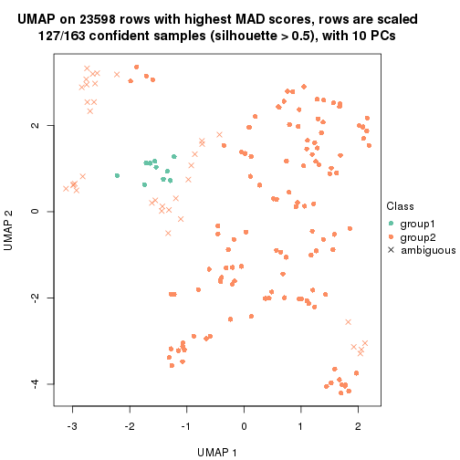</p>

</div>
<div id='tab-MAD-mclust-dimension-reduction-2'>
<pre><code class="r">dimension_reduction(res, k = 3, method = &quot;UMAP&quot;)
</code></pre>

<p></p>

</div>
<div id='tab-MAD-mclust-dimension-reduction-3'>
<pre><code class="r">dimension_reduction(res, k = 4, method = &quot;UMAP&quot;)
</code></pre>

<p></p>

</div>
<div id='tab-MAD-mclust-dimension-reduction-4'>
<pre><code class="r">dimension_reduction(res, k = 5, method = &quot;UMAP&quot;)
</code></pre>

<p></p>

</div>
<div id='tab-MAD-mclust-dimension-reduction-5'>
<pre><code class="r">dimension_reduction(res, k = 6, method = &quot;UMAP&quot;)
</code></pre>

<p></p>

</div>
</div>


Following heatmap shows how subgroups are split when increasing `k`:

```r
collect_classes(res)
```


Test correlation between subgroups and known annotations. If the known
annotation is numeric, one-way ANOVA test is applied, and if the known
annotation is discrete, chi-squared contingency table test is applied.

```r
test_to_known_factors(res)
```

```
#>              n disease.state(p) other(p) time(p) individual(p) k
#> MAD:mclust 127          1.00000  0.89170 0.04375         0.657 2
#> MAD:mclust 161          0.43087  0.05390 0.11822         0.453 3
#> MAD:mclust 151          0.03394  0.00301 0.01077         0.728 4
#> MAD:mclust 124          0.01110  0.01520 0.01007         0.799 5
#> MAD:mclust 148          0.00101  0.00131 0.00638         0.398 6
```


If matrix rows can be associated to genes, consider to use `functional_enrichment(res,
...)` to perform function enrichment for the signature genes. See [this vignette](http://bioconductor.org/packages/devel/bioc/vignettes/cola/inst/doc/functional_enrichment.html) for more detailed explanations.


 

---------------------------------------------------


### MAD:NMF*


The object with results only for a single top-value method and a single partition method 
can be extracted as:

```r
res = res_list["MAD", "NMF"]
# you can also extract it by
# res = res_list["MAD:NMF"]
```

A summary of `res` and all the functions that can be applied to it:

```r
res
```

```
#> A 'ConsensusPartition' object with k = 2, 3, 4, 5, 6.
#>   On a matrix with 23598 rows and 163 columns.
#>   Top rows (1000, 2000, 3000, 4000, 5000) are extracted by 'MAD' method.
#>   Subgroups are detected by 'NMF' method.
#>   Performed in total 1250 partitions by row resampling.
#>   Best k for subgroups seems to be 3.
#> 
#> Following methods can be applied to this 'ConsensusPartition' object:
#>  [1] "cola_report"             "collect_classes"         "collect_plots"          
#>  [4] "collect_stats"           "colnames"                "compare_signatures"     
#>  [7] "consensus_heatmap"       "dimension_reduction"     "functional_enrichment"  
#> [10] "get_anno_col"            "get_anno"                "get_classes"            
#> [13] "get_consensus"           "get_matrix"              "get_membership"         
#> [16] "get_param"               "get_signatures"          "get_stats"              
#> [19] "is_best_k"               "is_stable_k"             "membership_heatmap"     
#> [22] "ncol"                    "nrow"                    "plot_ecdf"              
#> [25] "rownames"                "select_partition_number" "show"                   
#> [28] "suggest_best_k"          "test_to_known_factors"
```

`collect_plots()` function collects all the plots made from `res` for all `k` (number of partitions)
into one single page to provide an easy and fast comparison between different `k`.

```r
collect_plots(res)
```


The plots are:

- The first row: a plot of the ECDF (empirical cumulative distribution
  function) curves of the consensus matrix for each `k` and the heatmap of
  predicted classes for each `k`.
- The second row: heatmaps of the consensus matrix for each `k`.
- The third row: heatmaps of the membership matrix for each `k`.
- The fouth row: heatmaps of the signatures for each `k`.

All the plots in panels can be made by individual functions and they are
plotted later in this section.

`select_partition_number()` produces several plots showing different
statistics for choosing "optimized" `k`. There are following statistics:

- ECDF curves of the consensus matrix for each `k`;
- 1-PAC. [The PAC
  score](https://en.wikipedia.org/wiki/Consensus_clustering#Over-interpretation_potential_of_consensus_clustering)
  measures the proportion of the ambiguous subgrouping.
- Mean silhouette score.
- Concordance. The mean probability of fiting the consensus class ids in all
  partitions.
- Area increased. Denote $A_k$ as the area under the ECDF curve for current
  `k`, the area increased is defined as $A_k - A_{k-1}$.
- Rand index. The percent of pairs of samples that are both in a same cluster
  or both are not in a same cluster in the partition of k and k-1.
- Jaccard index. The ratio of pairs of samples are both in a same cluster in
  the partition of k and k-1 and the pairs of samples are both in a same
  cluster in the partition k or k-1.

The detailed explanations of these statistics can be found in [the _cola_
vignette](http://bioconductor.org/packages/devel/bioc/vignettes/cola/inst/doc/cola.html#toc_13).

Generally speaking, lower PAC score, higher mean silhouette score or higher
concordance corresponds to better partition. Rand index and Jaccard index
measure how similar the current partition is compared to partition with `k-1`.
If they are too similar, we won't accept `k` is better than `k-1`.

```r
select_partition_number(res)
```


The numeric values for all these statistics can be obtained by `get_stats()`.

```r
get_stats(res)
```

```
#>   k 1-PAC mean_silhouette concordance area_increased  Rand Jaccard
#> 2 2 0.864           0.933       0.971         0.4700 0.532   0.532
#> 3 3 0.907           0.913       0.962         0.4225 0.767   0.575
#> 4 4 0.646           0.624       0.810         0.1153 0.860   0.613
#> 5 5 0.677           0.651       0.811         0.0626 0.886   0.603
#> 6 6 0.796           0.749       0.854         0.0378 0.919   0.650
```

`suggest_best_k()` suggests the best $k$ based on these statistics. The rules are as follows:

- All $k$ with Jaccard index larger than 0.95 are removed because increasing
  $k$ does not provide enough extra information. If all $k$ are removed, it is
  marked as no subgroup is detected.
- For all $k$ with 1-PAC score larger than 0.9, the maximal $k$ is taken as
  the best $k$, and other $k$ are marked as optional $k$.
- If it does not fit the second rule. The $k$ with the maximal vote of the
  highest 1-PAC score, highest mean silhouette, and highest concordance is
  taken as the best $k$.

```r
suggest_best_k(res)
```

```
#> [1] 3
```


Following shows the table of the partitions (You need to click the **show/hide
code output** link to see it). The membership matrix (columns with name `p*`)
is inferred by
[`clue::cl_consensus()`](https://www.rdocumentation.org/link/cl_consensus?package=clue)
function with the `SE` method. Basically the value in the membership matrix
represents the probability to belong to a certain group. The finall class
label for an item is determined with the group with highest probability it
belongs to.

In `get_classes()` function, the entropy is calculated from the membership
matrix and the silhouette score is calculated from the consensus matrix.


<script>
$( function() {
	$( '#tabs-MAD-NMF-get-classes' ).tabs();
} );
</script>
<div id='tabs-MAD-NMF-get-classes'>
<ul>
<li><a href='#tab-MAD-NMF-get-classes-1'>k = 2</a></li>
<li><a href='#tab-MAD-NMF-get-classes-2'>k = 3</a></li>
<li><a href='#tab-MAD-NMF-get-classes-3'>k = 4</a></li>
<li><a href='#tab-MAD-NMF-get-classes-4'>k = 5</a></li>
<li><a href='#tab-MAD-NMF-get-classes-5'>k = 6</a></li>
</ul>

<div id='tab-MAD-NMF-get-classes-1'>
<p><a id='tab-MAD-NMF-get-classes-1-a' style='color:#0366d6' href='#'>show/hide code output</a></p>
<pre><code class="r">cbind(get_classes(res, k = 2), get_membership(res, k = 2))
</code></pre>

<pre><code>#&gt;            class entropy silhouette    p1    p2
#&gt; GSM1317945     2  0.0000      0.972 0.000 1.000
#&gt; GSM1317946     1  0.0000      0.964 1.000 0.000
#&gt; GSM1317947     2  0.0000      0.972 0.000 1.000
#&gt; GSM1317948     1  0.7950      0.709 0.760 0.240
#&gt; GSM1317949     1  0.0000      0.964 1.000 0.000
#&gt; GSM1317950     1  0.0000      0.964 1.000 0.000
#&gt; GSM1317953     1  0.0000      0.964 1.000 0.000
#&gt; GSM1317954     1  0.0000      0.964 1.000 0.000
#&gt; GSM1317955     1  0.0000      0.964 1.000 0.000
#&gt; GSM1317956     1  0.0000      0.964 1.000 0.000
#&gt; GSM1317957     2  0.0000      0.972 0.000 1.000
#&gt; GSM1317958     1  0.0000      0.964 1.000 0.000
#&gt; GSM1317959     2  0.5294      0.851 0.120 0.880
#&gt; GSM1317960     1  0.3274      0.918 0.940 0.060
#&gt; GSM1317961     2  0.0000      0.972 0.000 1.000
#&gt; GSM1317962     1  0.0000      0.964 1.000 0.000
#&gt; GSM1317963     1  0.0000      0.964 1.000 0.000
#&gt; GSM1317964     1  0.0000      0.964 1.000 0.000
#&gt; GSM1317965     2  0.0000      0.972 0.000 1.000
#&gt; GSM1317966     2  0.0000      0.972 0.000 1.000
#&gt; GSM1317967     2  0.0000      0.972 0.000 1.000
#&gt; GSM1317968     1  0.0000      0.964 1.000 0.000
#&gt; GSM1317969     2  0.0000      0.972 0.000 1.000
#&gt; GSM1317970     2  0.0000      0.972 0.000 1.000
#&gt; GSM1317952     1  0.4815      0.878 0.896 0.104
#&gt; GSM1317951     1  0.0000      0.964 1.000 0.000
#&gt; GSM1317971     2  0.0000      0.972 0.000 1.000
#&gt; GSM1317972     1  0.0000      0.964 1.000 0.000
#&gt; GSM1317973     2  0.0000      0.972 0.000 1.000
#&gt; GSM1317974     1  0.0000      0.964 1.000 0.000
#&gt; GSM1317975     2  0.9358      0.472 0.352 0.648
#&gt; GSM1317978     1  0.0000      0.964 1.000 0.000
#&gt; GSM1317979     2  0.9795      0.261 0.416 0.584
#&gt; GSM1317980     2  0.0000      0.972 0.000 1.000
#&gt; GSM1317981     2  0.6801      0.777 0.180 0.820
#&gt; GSM1317982     2  0.0000      0.972 0.000 1.000
#&gt; GSM1317983     1  0.0000      0.964 1.000 0.000
#&gt; GSM1317984     2  0.0000      0.972 0.000 1.000
#&gt; GSM1317985     2  0.0000      0.972 0.000 1.000
#&gt; GSM1317986     1  0.0000      0.964 1.000 0.000
#&gt; GSM1317987     2  0.4939      0.866 0.108 0.892
#&gt; GSM1317988     2  0.0000      0.972 0.000 1.000
#&gt; GSM1317989     1  0.7950      0.709 0.760 0.240
#&gt; GSM1317990     2  0.0000      0.972 0.000 1.000
#&gt; GSM1317991     2  0.0000      0.972 0.000 1.000
#&gt; GSM1317992     2  0.0000      0.972 0.000 1.000
#&gt; GSM1317993     2  0.0000      0.972 0.000 1.000
#&gt; GSM1317994     2  0.0000      0.972 0.000 1.000
#&gt; GSM1317977     1  0.6712      0.797 0.824 0.176
#&gt; GSM1317976     1  0.0000      0.964 1.000 0.000
#&gt; GSM1317995     2  0.0000      0.972 0.000 1.000
#&gt; GSM1317996     2  0.0672      0.965 0.008 0.992
#&gt; GSM1317997     2  0.0000      0.972 0.000 1.000
#&gt; GSM1317998     1  0.0000      0.964 1.000 0.000
#&gt; GSM1317999     1  0.0000      0.964 1.000 0.000
#&gt; GSM1318002     2  0.0000      0.972 0.000 1.000
#&gt; GSM1318003     2  0.0000      0.972 0.000 1.000
#&gt; GSM1318004     2  0.2603      0.933 0.044 0.956
#&gt; GSM1318005     2  0.0000      0.972 0.000 1.000
#&gt; GSM1318006     1  0.0000      0.964 1.000 0.000
#&gt; GSM1318007     2  0.0000      0.972 0.000 1.000
#&gt; GSM1318008     1  0.0000      0.964 1.000 0.000
#&gt; GSM1318009     2  0.0938      0.962 0.012 0.988
#&gt; GSM1318010     2  0.0000      0.972 0.000 1.000
#&gt; GSM1318011     1  0.0000      0.964 1.000 0.000
#&gt; GSM1318012     1  0.0000      0.964 1.000 0.000
#&gt; GSM1318013     2  0.0000      0.972 0.000 1.000
#&gt; GSM1318014     1  0.0000      0.964 1.000 0.000
#&gt; GSM1318015     2  0.0000      0.972 0.000 1.000
#&gt; GSM1318001     2  0.0000      0.972 0.000 1.000
#&gt; GSM1318000     2  0.0000      0.972 0.000 1.000
#&gt; GSM1318016     2  0.0000      0.972 0.000 1.000
#&gt; GSM1318017     1  0.0000      0.964 1.000 0.000
#&gt; GSM1318019     2  0.0000      0.972 0.000 1.000
#&gt; GSM1318020     2  0.0000      0.972 0.000 1.000
#&gt; GSM1318021     2  0.0000      0.972 0.000 1.000
#&gt; GSM1318022     2  0.0000      0.972 0.000 1.000
#&gt; GSM1318023     1  0.0000      0.964 1.000 0.000
#&gt; GSM1318024     2  0.0000      0.972 0.000 1.000
#&gt; GSM1318025     2  0.0000      0.972 0.000 1.000
#&gt; GSM1318026     2  0.0000      0.972 0.000 1.000
#&gt; GSM1318027     2  0.0000      0.972 0.000 1.000
#&gt; GSM1318028     1  0.0000      0.964 1.000 0.000
#&gt; GSM1318029     2  0.0938      0.962 0.012 0.988
#&gt; GSM1318018     1  0.0000      0.964 1.000 0.000
#&gt; GSM1318030     2  0.0000      0.972 0.000 1.000
#&gt; GSM1318031     2  0.0000      0.972 0.000 1.000
#&gt; GSM1318033     1  0.0000      0.964 1.000 0.000
#&gt; GSM1318034     2  0.9323      0.452 0.348 0.652
#&gt; GSM1318035     2  0.0000      0.972 0.000 1.000
#&gt; GSM1318036     1  0.0376      0.961 0.996 0.004
#&gt; GSM1318037     2  0.0000      0.972 0.000 1.000
#&gt; GSM1318038     2  0.0000      0.972 0.000 1.000
#&gt; GSM1318039     1  0.0000      0.964 1.000 0.000
#&gt; GSM1318040     2  0.0000      0.972 0.000 1.000
#&gt; GSM1318032     2  0.0000      0.972 0.000 1.000
#&gt; GSM1317914     2  0.0000      0.972 0.000 1.000
#&gt; GSM1317915     1  0.0000      0.964 1.000 0.000
#&gt; GSM1317916     1  0.0000      0.964 1.000 0.000
#&gt; GSM1317917     2  0.8144      0.655 0.252 0.748
#&gt; GSM1317918     1  0.0000      0.964 1.000 0.000
#&gt; GSM1317919     2  0.0000      0.972 0.000 1.000
#&gt; GSM1317920     2  0.0000      0.972 0.000 1.000
#&gt; GSM1317921     2  0.0000      0.972 0.000 1.000
#&gt; GSM1317922     1  0.7453      0.751 0.788 0.212
#&gt; GSM1317923     2  0.0000      0.972 0.000 1.000
#&gt; GSM1317924     2  0.0000      0.972 0.000 1.000
#&gt; GSM1317925     2  0.0000      0.972 0.000 1.000
#&gt; GSM1317926     2  0.0000      0.972 0.000 1.000
#&gt; GSM1317927     2  0.0000      0.972 0.000 1.000
#&gt; GSM1317928     2  0.0000      0.972 0.000 1.000
#&gt; GSM1317929     2  0.0000      0.972 0.000 1.000
#&gt; GSM1317930     2  0.0000      0.972 0.000 1.000
#&gt; GSM1317931     2  0.0000      0.972 0.000 1.000
#&gt; GSM1317932     2  0.0000      0.972 0.000 1.000
#&gt; GSM1317933     2  0.0000      0.972 0.000 1.000
#&gt; GSM1317934     2  0.0000      0.972 0.000 1.000
#&gt; GSM1317935     2  0.0000      0.972 0.000 1.000
#&gt; GSM1317936     2  0.0000      0.972 0.000 1.000
#&gt; GSM1317937     1  0.0000      0.964 1.000 0.000
#&gt; GSM1317938     2  0.0000      0.972 0.000 1.000
#&gt; GSM1317939     2  0.0000      0.972 0.000 1.000
#&gt; GSM1317940     1  0.0000      0.964 1.000 0.000
#&gt; GSM1317941     2  0.8813      0.571 0.300 0.700
#&gt; GSM1317942     2  0.8016      0.683 0.244 0.756
#&gt; GSM1317943     2  0.6712      0.782 0.176 0.824
#&gt; GSM1317944     2  0.0000      0.972 0.000 1.000
#&gt; GSM1317896     2  0.0000      0.972 0.000 1.000
#&gt; GSM1317897     1  0.0000      0.964 1.000 0.000
#&gt; GSM1317898     1  0.0000      0.964 1.000 0.000
#&gt; GSM1317899     1  0.0000      0.964 1.000 0.000
#&gt; GSM1317900     2  0.0000      0.972 0.000 1.000
#&gt; GSM1317901     1  0.0000      0.964 1.000 0.000
#&gt; GSM1317902     1  0.0000      0.964 1.000 0.000
#&gt; GSM1317903     1  0.0000      0.964 1.000 0.000
#&gt; GSM1317904     1  0.4815      0.875 0.896 0.104
#&gt; GSM1317905     2  0.0000      0.972 0.000 1.000
#&gt; GSM1317906     2  0.0000      0.972 0.000 1.000
#&gt; GSM1317907     2  0.0000      0.972 0.000 1.000
#&gt; GSM1317908     2  0.1843      0.948 0.028 0.972
#&gt; GSM1317909     1  0.7219      0.767 0.800 0.200
#&gt; GSM1317910     1  0.7376      0.756 0.792 0.208
#&gt; GSM1317911     1  0.0000      0.964 1.000 0.000
#&gt; GSM1317912     2  0.0000      0.972 0.000 1.000
#&gt; GSM1317913     2  0.0000      0.972 0.000 1.000
#&gt; GSM1318041     2  0.5629      0.836 0.132 0.868
#&gt; GSM1318042     2  0.0000      0.972 0.000 1.000
#&gt; GSM1318043     2  0.0000      0.972 0.000 1.000
#&gt; GSM1318044     1  0.0000      0.964 1.000 0.000
#&gt; GSM1318045     1  0.0000      0.964 1.000 0.000
#&gt; GSM1318046     1  0.0000      0.964 1.000 0.000
#&gt; GSM1318047     1  0.0000      0.964 1.000 0.000
#&gt; GSM1318048     1  0.9795      0.322 0.584 0.416
#&gt; GSM1318049     1  0.4022      0.900 0.920 0.080
#&gt; GSM1318050     2  0.0000      0.972 0.000 1.000
#&gt; GSM1318051     2  0.0000      0.972 0.000 1.000
#&gt; GSM1318052     2  0.0000      0.972 0.000 1.000
#&gt; GSM1318053     2  0.0000      0.972 0.000 1.000
#&gt; GSM1318054     2  0.0000      0.972 0.000 1.000
#&gt; GSM1318055     2  0.0000      0.972 0.000 1.000
#&gt; GSM1318056     2  0.0000      0.972 0.000 1.000
#&gt; GSM1318057     2  0.0000      0.972 0.000 1.000
#&gt; GSM1318058     2  0.0000      0.972 0.000 1.000
</code></pre>

<script>
$('#tab-MAD-NMF-get-classes-1-a').parent().next().next().hide();
$('#tab-MAD-NMF-get-classes-1-a').click(function(){
  $('#tab-MAD-NMF-get-classes-1-a').parent().next().next().toggle();
  return(false);
});
</script>
</div>

<div id='tab-MAD-NMF-get-classes-2'>
<p><a id='tab-MAD-NMF-get-classes-2-a' style='color:#0366d6' href='#'>show/hide code output</a></p>
<pre><code class="r">cbind(get_classes(res, k = 3), get_membership(res, k = 3))
</code></pre>

<pre><code>#&gt;            class entropy silhouette    p1    p2    p3
#&gt; GSM1317945     2  0.0000      0.947 0.000 1.000 0.000
#&gt; GSM1317946     1  0.2066      0.904 0.940 0.060 0.000
#&gt; GSM1317947     3  0.0000      0.980 0.000 0.000 1.000
#&gt; GSM1317948     1  0.5905      0.482 0.648 0.000 0.352
#&gt; GSM1317949     1  0.0000      0.955 1.000 0.000 0.000
#&gt; GSM1317950     1  0.0000      0.955 1.000 0.000 0.000
#&gt; GSM1317953     1  0.0000      0.955 1.000 0.000 0.000
#&gt; GSM1317954     1  0.0000      0.955 1.000 0.000 0.000
#&gt; GSM1317955     1  0.0000      0.955 1.000 0.000 0.000
#&gt; GSM1317956     1  0.0000      0.955 1.000 0.000 0.000
#&gt; GSM1317957     2  0.0000      0.947 0.000 1.000 0.000
#&gt; GSM1317958     1  0.0000      0.955 1.000 0.000 0.000
#&gt; GSM1317959     2  0.4504      0.725 0.196 0.804 0.000
#&gt; GSM1317960     1  0.3686      0.828 0.860 0.000 0.140
#&gt; GSM1317961     3  0.0000      0.980 0.000 0.000 1.000
#&gt; GSM1317962     1  0.6280      0.125 0.540 0.460 0.000
#&gt; GSM1317963     1  0.0000      0.955 1.000 0.000 0.000
#&gt; GSM1317964     1  0.0000      0.955 1.000 0.000 0.000
#&gt; GSM1317965     3  0.0000      0.980 0.000 0.000 1.000
#&gt; GSM1317966     3  0.0424      0.974 0.008 0.000 0.992
#&gt; GSM1317967     2  0.2625      0.876 0.000 0.916 0.084
#&gt; GSM1317968     1  0.0000      0.955 1.000 0.000 0.000
#&gt; GSM1317969     3  0.0000      0.980 0.000 0.000 1.000
#&gt; GSM1317970     2  0.0000      0.947 0.000 1.000 0.000
#&gt; GSM1317952     1  0.3941      0.809 0.844 0.000 0.156
#&gt; GSM1317951     1  0.0000      0.955 1.000 0.000 0.000
#&gt; GSM1317971     2  0.5465      0.617 0.000 0.712 0.288
#&gt; GSM1317972     1  0.6008      0.423 0.628 0.372 0.000
#&gt; GSM1317973     2  0.0000      0.947 0.000 1.000 0.000
#&gt; GSM1317974     2  0.0424      0.941 0.008 0.992 0.000
#&gt; GSM1317975     2  0.0000      0.947 0.000 1.000 0.000
#&gt; GSM1317978     1  0.0000      0.955 1.000 0.000 0.000
#&gt; GSM1317979     3  0.0592      0.970 0.012 0.000 0.988
#&gt; GSM1317980     3  0.0000      0.980 0.000 0.000 1.000
#&gt; GSM1317981     2  0.0000      0.947 0.000 1.000 0.000
#&gt; GSM1317982     3  0.0000      0.980 0.000 0.000 1.000
#&gt; GSM1317983     1  0.0000      0.955 1.000 0.000 0.000
#&gt; GSM1317984     3  0.0000      0.980 0.000 0.000 1.000
#&gt; GSM1317985     3  0.0000      0.980 0.000 0.000 1.000
#&gt; GSM1317986     1  0.0000      0.955 1.000 0.000 0.000
#&gt; GSM1317987     2  0.0000      0.947 0.000 1.000 0.000
#&gt; GSM1317988     2  0.0000      0.947 0.000 1.000 0.000
#&gt; GSM1317989     1  0.4555      0.753 0.800 0.000 0.200
#&gt; GSM1317990     2  0.0000      0.947 0.000 1.000 0.000
#&gt; GSM1317991     3  0.5968      0.390 0.000 0.364 0.636
#&gt; GSM1317992     2  0.0000      0.947 0.000 1.000 0.000
#&gt; GSM1317993     2  0.0000      0.947 0.000 1.000 0.000
#&gt; GSM1317994     3  0.0000      0.980 0.000 0.000 1.000
#&gt; GSM1317977     1  0.0000      0.955 1.000 0.000 0.000
#&gt; GSM1317976     1  0.0000      0.955 1.000 0.000 0.000
#&gt; GSM1317995     3  0.0000      0.980 0.000 0.000 1.000
#&gt; GSM1317996     2  0.0000      0.947 0.000 1.000 0.000
#&gt; GSM1317997     3  0.0000      0.980 0.000 0.000 1.000
#&gt; GSM1317998     1  0.0000      0.955 1.000 0.000 0.000
#&gt; GSM1317999     1  0.0000      0.955 1.000 0.000 0.000
#&gt; GSM1318002     2  0.0000      0.947 0.000 1.000 0.000
#&gt; GSM1318003     2  0.0000      0.947 0.000 1.000 0.000
#&gt; GSM1318004     2  0.0000      0.947 0.000 1.000 0.000
#&gt; GSM1318005     2  0.0000      0.947 0.000 1.000 0.000
#&gt; GSM1318006     1  0.0000      0.955 1.000 0.000 0.000
#&gt; GSM1318007     3  0.5706      0.501 0.000 0.320 0.680
#&gt; GSM1318008     1  0.0000      0.955 1.000 0.000 0.000
#&gt; GSM1318009     2  0.0000      0.947 0.000 1.000 0.000
#&gt; GSM1318010     3  0.0000      0.980 0.000 0.000 1.000
#&gt; GSM1318011     1  0.0000      0.955 1.000 0.000 0.000
#&gt; GSM1318012     1  0.0000      0.955 1.000 0.000 0.000
#&gt; GSM1318013     2  0.4504      0.751 0.000 0.804 0.196
#&gt; GSM1318014     1  0.0424      0.949 0.992 0.000 0.008
#&gt; GSM1318015     2  0.0000      0.947 0.000 1.000 0.000
#&gt; GSM1318001     3  0.0000      0.980 0.000 0.000 1.000
#&gt; GSM1318000     2  0.0000      0.947 0.000 1.000 0.000
#&gt; GSM1318016     2  0.0000      0.947 0.000 1.000 0.000
#&gt; GSM1318017     1  0.0000      0.955 1.000 0.000 0.000
#&gt; GSM1318019     2  0.0000      0.947 0.000 1.000 0.000
#&gt; GSM1318020     3  0.0000      0.980 0.000 0.000 1.000
#&gt; GSM1318021     2  0.0000      0.947 0.000 1.000 0.000
#&gt; GSM1318022     3  0.0000      0.980 0.000 0.000 1.000
#&gt; GSM1318023     1  0.0000      0.955 1.000 0.000 0.000
#&gt; GSM1318024     2  0.0000      0.947 0.000 1.000 0.000
#&gt; GSM1318025     3  0.0000      0.980 0.000 0.000 1.000
#&gt; GSM1318026     2  0.0000      0.947 0.000 1.000 0.000
#&gt; GSM1318027     2  0.0000      0.947 0.000 1.000 0.000
#&gt; GSM1318028     1  0.0000      0.955 1.000 0.000 0.000
#&gt; GSM1318029     3  0.0000      0.980 0.000 0.000 1.000
#&gt; GSM1318018     1  0.0000      0.955 1.000 0.000 0.000
#&gt; GSM1318030     3  0.1411      0.947 0.000 0.036 0.964
#&gt; GSM1318031     3  0.0000      0.980 0.000 0.000 1.000
#&gt; GSM1318033     1  0.0000      0.955 1.000 0.000 0.000
#&gt; GSM1318034     3  0.0000      0.980 0.000 0.000 1.000
#&gt; GSM1318035     2  0.0000      0.947 0.000 1.000 0.000
#&gt; GSM1318036     1  0.0000      0.955 1.000 0.000 0.000
#&gt; GSM1318037     2  0.8609      0.510 0.160 0.596 0.244
#&gt; GSM1318038     3  0.0000      0.980 0.000 0.000 1.000
#&gt; GSM1318039     1  0.0000      0.955 1.000 0.000 0.000
#&gt; GSM1318040     3  0.2448      0.904 0.000 0.076 0.924
#&gt; GSM1318032     3  0.2165      0.918 0.000 0.064 0.936
#&gt; GSM1317914     3  0.0000      0.980 0.000 0.000 1.000
#&gt; GSM1317915     1  0.0000      0.955 1.000 0.000 0.000
#&gt; GSM1317916     1  0.0000      0.955 1.000 0.000 0.000
#&gt; GSM1317917     3  0.0000      0.980 0.000 0.000 1.000
#&gt; GSM1317918     1  0.0000      0.955 1.000 0.000 0.000
#&gt; GSM1317919     2  0.6140      0.370 0.000 0.596 0.404
#&gt; GSM1317920     3  0.0000      0.980 0.000 0.000 1.000
#&gt; GSM1317921     3  0.0000      0.980 0.000 0.000 1.000
#&gt; GSM1317922     3  0.1031      0.958 0.024 0.000 0.976
#&gt; GSM1317923     3  0.0000      0.980 0.000 0.000 1.000
#&gt; GSM1317924     3  0.0000      0.980 0.000 0.000 1.000
#&gt; GSM1317925     2  0.0000      0.947 0.000 1.000 0.000
#&gt; GSM1317926     3  0.0000      0.980 0.000 0.000 1.000
#&gt; GSM1317927     2  0.0000      0.947 0.000 1.000 0.000
#&gt; GSM1317928     3  0.0000      0.980 0.000 0.000 1.000
#&gt; GSM1317929     3  0.0237      0.977 0.000 0.004 0.996
#&gt; GSM1317930     2  0.0000      0.947 0.000 1.000 0.000
#&gt; GSM1317931     3  0.0000      0.980 0.000 0.000 1.000
#&gt; GSM1317932     2  0.5650      0.575 0.000 0.688 0.312
#&gt; GSM1317933     2  0.0000      0.947 0.000 1.000 0.000
#&gt; GSM1317934     2  0.4654      0.739 0.000 0.792 0.208
#&gt; GSM1317935     3  0.0000      0.980 0.000 0.000 1.000
#&gt; GSM1317936     3  0.0000      0.980 0.000 0.000 1.000
#&gt; GSM1317937     1  0.0000      0.955 1.000 0.000 0.000
#&gt; GSM1317938     2  0.0000      0.947 0.000 1.000 0.000
#&gt; GSM1317939     2  0.0000      0.947 0.000 1.000 0.000
#&gt; GSM1317940     1  0.0000      0.955 1.000 0.000 0.000
#&gt; GSM1317941     2  0.0000      0.947 0.000 1.000 0.000
#&gt; GSM1317942     2  0.0000      0.947 0.000 1.000 0.000
#&gt; GSM1317943     2  0.0000      0.947 0.000 1.000 0.000
#&gt; GSM1317944     2  0.0000      0.947 0.000 1.000 0.000
#&gt; GSM1317896     3  0.0000      0.980 0.000 0.000 1.000
#&gt; GSM1317897     1  0.0000      0.955 1.000 0.000 0.000
#&gt; GSM1317898     1  0.0000      0.955 1.000 0.000 0.000
#&gt; GSM1317899     1  0.0000      0.955 1.000 0.000 0.000
#&gt; GSM1317900     3  0.0000      0.980 0.000 0.000 1.000
#&gt; GSM1317901     1  0.0000      0.955 1.000 0.000 0.000
#&gt; GSM1317902     1  0.0000      0.955 1.000 0.000 0.000
#&gt; GSM1317903     1  0.0000      0.955 1.000 0.000 0.000
#&gt; GSM1317904     2  0.0000      0.947 0.000 1.000 0.000
#&gt; GSM1317905     2  0.0000      0.947 0.000 1.000 0.000
#&gt; GSM1317906     2  0.0000      0.947 0.000 1.000 0.000
#&gt; GSM1317907     3  0.0000      0.980 0.000 0.000 1.000
#&gt; GSM1317908     3  0.0000      0.980 0.000 0.000 1.000
#&gt; GSM1317909     1  0.4504      0.759 0.804 0.000 0.196
#&gt; GSM1317910     1  0.4555      0.753 0.800 0.000 0.200
#&gt; GSM1317911     1  0.0000      0.955 1.000 0.000 0.000
#&gt; GSM1317912     3  0.0000      0.980 0.000 0.000 1.000
#&gt; GSM1317913     2  0.0000      0.947 0.000 1.000 0.000
#&gt; GSM1318041     3  0.0000      0.980 0.000 0.000 1.000
#&gt; GSM1318042     3  0.0000      0.980 0.000 0.000 1.000
#&gt; GSM1318043     3  0.0000      0.980 0.000 0.000 1.000
#&gt; GSM1318044     1  0.0000      0.955 1.000 0.000 0.000
#&gt; GSM1318045     1  0.0000      0.955 1.000 0.000 0.000
#&gt; GSM1318046     1  0.0000      0.955 1.000 0.000 0.000
#&gt; GSM1318047     1  0.0000      0.955 1.000 0.000 0.000
#&gt; GSM1318048     3  0.0000      0.980 0.000 0.000 1.000
#&gt; GSM1318049     1  0.4796      0.726 0.780 0.000 0.220
#&gt; GSM1318050     2  0.0000      0.947 0.000 1.000 0.000
#&gt; GSM1318051     2  0.0000      0.947 0.000 1.000 0.000
#&gt; GSM1318052     2  0.0000      0.947 0.000 1.000 0.000
#&gt; GSM1318053     2  0.0000      0.947 0.000 1.000 0.000
#&gt; GSM1318054     2  0.6215      0.301 0.000 0.572 0.428
#&gt; GSM1318055     3  0.0000      0.980 0.000 0.000 1.000
#&gt; GSM1318056     2  0.1163      0.925 0.000 0.972 0.028
#&gt; GSM1318057     2  0.0000      0.947 0.000 1.000 0.000
#&gt; GSM1318058     2  0.5621      0.582 0.000 0.692 0.308
</code></pre>

<script>
$('#tab-MAD-NMF-get-classes-2-a').parent().next().next().hide();
$('#tab-MAD-NMF-get-classes-2-a').click(function(){
  $('#tab-MAD-NMF-get-classes-2-a').parent().next().next().toggle();
  return(false);
});
</script>
</div>

<div id='tab-MAD-NMF-get-classes-3'>
<p><a id='tab-MAD-NMF-get-classes-3-a' style='color:#0366d6' href='#'>show/hide code output</a></p>
<pre><code class="r">cbind(get_classes(res, k = 4), get_membership(res, k = 4))
</code></pre>

<pre><code>#&gt;            class entropy silhouette    p1    p2    p3    p4
#&gt; GSM1317945     4  0.3249     0.6297 0.008 0.140 0.000 0.852
#&gt; GSM1317946     1  0.5944     0.5996 0.684 0.104 0.000 0.212
#&gt; GSM1317947     3  0.0000     0.9293 0.000 0.000 1.000 0.000
#&gt; GSM1317948     1  0.4508     0.6530 0.780 0.000 0.184 0.036
#&gt; GSM1317949     1  0.4543     0.6830 0.676 0.324 0.000 0.000
#&gt; GSM1317950     1  0.3074     0.7715 0.848 0.152 0.000 0.000
#&gt; GSM1317953     1  0.4730     0.6578 0.636 0.364 0.000 0.000
#&gt; GSM1317954     1  0.4790     0.6422 0.620 0.380 0.000 0.000
#&gt; GSM1317955     1  0.4972     0.5531 0.544 0.456 0.000 0.000
#&gt; GSM1317956     1  0.4164     0.7227 0.736 0.264 0.000 0.000
#&gt; GSM1317957     2  0.4331     0.3719 0.000 0.712 0.000 0.288
#&gt; GSM1317958     1  0.0000     0.7930 1.000 0.000 0.000 0.000
#&gt; GSM1317959     4  0.4164     0.4718 0.264 0.000 0.000 0.736
#&gt; GSM1317960     1  0.3972     0.6536 0.788 0.000 0.008 0.204
#&gt; GSM1317961     2  0.5161     0.3206 0.024 0.676 0.300 0.000
#&gt; GSM1317962     2  0.6770     0.1497 0.292 0.580 0.000 0.128
#&gt; GSM1317963     1  0.2530     0.7864 0.888 0.112 0.000 0.000
#&gt; GSM1317964     1  0.4746     0.6545 0.632 0.368 0.000 0.000
#&gt; GSM1317965     3  0.0000     0.9293 0.000 0.000 1.000 0.000
#&gt; GSM1317966     2  0.4807     0.4056 0.024 0.728 0.248 0.000
#&gt; GSM1317967     4  0.0817     0.7148 0.000 0.024 0.000 0.976
#&gt; GSM1317968     1  0.4992     0.5120 0.524 0.476 0.000 0.000
#&gt; GSM1317969     3  0.4331     0.6036 0.000 0.000 0.712 0.288
#&gt; GSM1317970     4  0.4790     0.1811 0.000 0.380 0.000 0.620
#&gt; GSM1317952     1  0.2928     0.7574 0.896 0.000 0.052 0.052
#&gt; GSM1317951     1  0.4961     0.5605 0.552 0.448 0.000 0.000
#&gt; GSM1317971     2  0.4981     0.1593 0.000 0.536 0.464 0.000
#&gt; GSM1317972     2  0.4728     0.2865 0.216 0.752 0.000 0.032
#&gt; GSM1317973     4  0.1022     0.7139 0.000 0.032 0.000 0.968
#&gt; GSM1317974     2  0.5010     0.4216 0.120 0.772 0.000 0.108
#&gt; GSM1317975     2  0.0921     0.5070 0.000 0.972 0.000 0.028
#&gt; GSM1317978     1  0.4543     0.6811 0.676 0.324 0.000 0.000
#&gt; GSM1317979     1  0.6764     0.1407 0.500 0.000 0.404 0.096
#&gt; GSM1317980     3  0.0000     0.9293 0.000 0.000 1.000 0.000
#&gt; GSM1317981     2  0.1118     0.5076 0.000 0.964 0.000 0.036
#&gt; GSM1317982     4  0.5172     0.1400 0.008 0.000 0.404 0.588
#&gt; GSM1317983     1  0.3074     0.7724 0.848 0.152 0.000 0.000
#&gt; GSM1317984     3  0.0000     0.9293 0.000 0.000 1.000 0.000
#&gt; GSM1317985     3  0.0000     0.9293 0.000 0.000 1.000 0.000
#&gt; GSM1317986     1  0.3486     0.7590 0.812 0.188 0.000 0.000
#&gt; GSM1317987     2  0.0921     0.5070 0.000 0.972 0.000 0.028
#&gt; GSM1317988     4  0.1118     0.7128 0.000 0.036 0.000 0.964
#&gt; GSM1317989     1  0.6323     0.6909 0.668 0.200 0.128 0.004
#&gt; GSM1317990     2  0.4222     0.4565 0.000 0.728 0.000 0.272
#&gt; GSM1317991     2  0.4356     0.4495 0.000 0.708 0.292 0.000
#&gt; GSM1317992     2  0.4866     0.3635 0.000 0.596 0.000 0.404
#&gt; GSM1317993     2  0.4564     0.4284 0.000 0.672 0.000 0.328
#&gt; GSM1317994     3  0.0000     0.9293 0.000 0.000 1.000 0.000
#&gt; GSM1317977     1  0.3873     0.6379 0.772 0.000 0.000 0.228
#&gt; GSM1317976     2  0.1716     0.4777 0.064 0.936 0.000 0.000
#&gt; GSM1317995     3  0.0000     0.9293 0.000 0.000 1.000 0.000
#&gt; GSM1317996     4  0.4961    -0.0491 0.000 0.448 0.000 0.552
#&gt; GSM1317997     3  0.0000     0.9293 0.000 0.000 1.000 0.000
#&gt; GSM1317998     1  0.1022     0.7863 0.968 0.000 0.000 0.032
#&gt; GSM1317999     1  0.0469     0.7943 0.988 0.012 0.000 0.000
#&gt; GSM1318002     2  0.4925     0.3289 0.000 0.572 0.000 0.428
#&gt; GSM1318003     2  0.4994     0.2116 0.000 0.520 0.000 0.480
#&gt; GSM1318004     4  0.2413     0.6886 0.064 0.020 0.000 0.916
#&gt; GSM1318005     4  0.0336     0.7094 0.008 0.000 0.000 0.992
#&gt; GSM1318006     1  0.2011     0.7895 0.920 0.080 0.000 0.000
#&gt; GSM1318007     4  0.5337     0.4472 0.260 0.000 0.044 0.696
#&gt; GSM1318008     1  0.1118     0.7850 0.964 0.000 0.000 0.036
#&gt; GSM1318009     4  0.1118     0.7130 0.000 0.036 0.000 0.964
#&gt; GSM1318010     3  0.0000     0.9293 0.000 0.000 1.000 0.000
#&gt; GSM1318011     1  0.1211     0.7835 0.960 0.000 0.000 0.040
#&gt; GSM1318012     1  0.4072     0.5936 0.748 0.000 0.000 0.252
#&gt; GSM1318013     4  0.1557     0.6843 0.056 0.000 0.000 0.944
#&gt; GSM1318014     1  0.0921     0.7874 0.972 0.000 0.000 0.028
#&gt; GSM1318015     2  0.4916     0.3340 0.000 0.576 0.000 0.424
#&gt; GSM1318001     3  0.0000     0.9293 0.000 0.000 1.000 0.000
#&gt; GSM1318000     4  0.4679     0.2717 0.000 0.352 0.000 0.648
#&gt; GSM1318016     2  0.4967     0.2789 0.000 0.548 0.000 0.452
#&gt; GSM1318017     1  0.0000     0.7930 1.000 0.000 0.000 0.000
#&gt; GSM1318019     4  0.2973     0.6407 0.000 0.144 0.000 0.856
#&gt; GSM1318020     3  0.0000     0.9293 0.000 0.000 1.000 0.000
#&gt; GSM1318021     2  0.4804     0.3829 0.000 0.616 0.000 0.384
#&gt; GSM1318022     3  0.3311     0.7554 0.000 0.172 0.828 0.000
#&gt; GSM1318023     1  0.0336     0.7940 0.992 0.008 0.000 0.000
#&gt; GSM1318024     2  0.4761     0.3966 0.000 0.628 0.000 0.372
#&gt; GSM1318025     3  0.0000     0.9293 0.000 0.000 1.000 0.000
#&gt; GSM1318026     2  0.4948     0.3043 0.000 0.560 0.000 0.440
#&gt; GSM1318027     4  0.1867     0.6960 0.000 0.072 0.000 0.928
#&gt; GSM1318028     1  0.4998     0.4999 0.512 0.488 0.000 0.000
#&gt; GSM1318029     3  0.0000     0.9293 0.000 0.000 1.000 0.000
#&gt; GSM1318018     1  0.0469     0.7943 0.988 0.012 0.000 0.000
#&gt; GSM1318030     4  0.3016     0.6251 0.004 0.004 0.120 0.872
#&gt; GSM1318031     3  0.0000     0.9293 0.000 0.000 1.000 0.000
#&gt; GSM1318033     1  0.4277     0.5506 0.720 0.000 0.000 0.280
#&gt; GSM1318034     3  0.0000     0.9293 0.000 0.000 1.000 0.000
#&gt; GSM1318035     2  0.4804     0.3812 0.000 0.616 0.000 0.384
#&gt; GSM1318036     1  0.4290     0.7092 0.800 0.036 0.000 0.164
#&gt; GSM1318037     4  0.3877     0.6064 0.112 0.000 0.048 0.840
#&gt; GSM1318038     3  0.1452     0.9023 0.000 0.008 0.956 0.036
#&gt; GSM1318039     1  0.4661     0.6727 0.652 0.348 0.000 0.000
#&gt; GSM1318040     3  0.1182     0.9069 0.000 0.016 0.968 0.016
#&gt; GSM1318032     3  0.1022     0.9060 0.000 0.032 0.968 0.000
#&gt; GSM1317914     3  0.0000     0.9293 0.000 0.000 1.000 0.000
#&gt; GSM1317915     1  0.4661     0.6727 0.652 0.348 0.000 0.000
#&gt; GSM1317916     1  0.2216     0.7909 0.908 0.092 0.000 0.000
#&gt; GSM1317917     3  0.7914     0.3645 0.300 0.048 0.532 0.120
#&gt; GSM1317918     1  0.4907     0.6141 0.580 0.420 0.000 0.000
#&gt; GSM1317919     2  0.4981     0.1511 0.000 0.536 0.464 0.000
#&gt; GSM1317920     3  0.0188     0.9272 0.000 0.004 0.996 0.000
#&gt; GSM1317921     3  0.0592     0.9198 0.000 0.016 0.984 0.000
#&gt; GSM1317922     3  0.4245     0.6887 0.196 0.020 0.784 0.000
#&gt; GSM1317923     3  0.0000     0.9293 0.000 0.000 1.000 0.000
#&gt; GSM1317924     3  0.0000     0.9293 0.000 0.000 1.000 0.000
#&gt; GSM1317925     2  0.4746     0.3982 0.000 0.632 0.000 0.368
#&gt; GSM1317926     3  0.0188     0.9272 0.000 0.004 0.996 0.000
#&gt; GSM1317927     2  0.4898     0.3244 0.000 0.584 0.000 0.416
#&gt; GSM1317928     3  0.6110     0.5422 0.000 0.144 0.680 0.176
#&gt; GSM1317929     2  0.4477     0.3834 0.000 0.688 0.312 0.000
#&gt; GSM1317930     4  0.3907     0.5581 0.000 0.232 0.000 0.768
#&gt; GSM1317931     3  0.0000     0.9293 0.000 0.000 1.000 0.000
#&gt; GSM1317932     2  0.5823     0.3945 0.000 0.608 0.348 0.044
#&gt; GSM1317933     4  0.4941     0.0817 0.000 0.436 0.000 0.564
#&gt; GSM1317934     2  0.5677     0.4188 0.000 0.628 0.332 0.040
#&gt; GSM1317935     3  0.3569     0.7145 0.000 0.196 0.804 0.000
#&gt; GSM1317936     3  0.0000     0.9293 0.000 0.000 1.000 0.000
#&gt; GSM1317937     1  0.0707     0.7948 0.980 0.020 0.000 0.000
#&gt; GSM1317938     4  0.3219     0.6327 0.000 0.164 0.000 0.836
#&gt; GSM1317939     2  0.4985     0.1994 0.000 0.532 0.000 0.468
#&gt; GSM1317940     2  0.4804    -0.3017 0.384 0.616 0.000 0.000
#&gt; GSM1317941     4  0.4843     0.1560 0.000 0.396 0.000 0.604
#&gt; GSM1317942     4  0.3975     0.5469 0.000 0.240 0.000 0.760
#&gt; GSM1317943     4  0.4040     0.5317 0.000 0.248 0.000 0.752
#&gt; GSM1317944     2  0.4804     0.3812 0.000 0.616 0.000 0.384
#&gt; GSM1317896     3  0.0000     0.9293 0.000 0.000 1.000 0.000
#&gt; GSM1317897     1  0.4941     0.5957 0.564 0.436 0.000 0.000
#&gt; GSM1317898     1  0.1637     0.7924 0.940 0.060 0.000 0.000
#&gt; GSM1317899     1  0.0921     0.7874 0.972 0.000 0.000 0.028
#&gt; GSM1317900     3  0.1302     0.8948 0.000 0.044 0.956 0.000
#&gt; GSM1317901     1  0.3710     0.7549 0.804 0.192 0.004 0.000
#&gt; GSM1317902     1  0.0469     0.7910 0.988 0.000 0.000 0.012
#&gt; GSM1317903     1  0.0592     0.7944 0.984 0.016 0.000 0.000
#&gt; GSM1317904     4  0.0592     0.7070 0.016 0.000 0.000 0.984
#&gt; GSM1317905     4  0.5105    -0.0119 0.000 0.432 0.004 0.564
#&gt; GSM1317906     4  0.4888     0.0656 0.000 0.412 0.000 0.588
#&gt; GSM1317907     4  0.6324     0.4281 0.168 0.000 0.172 0.660
#&gt; GSM1317908     3  0.0000     0.9293 0.000 0.000 1.000 0.000
#&gt; GSM1317909     1  0.3975     0.6175 0.760 0.000 0.240 0.000
#&gt; GSM1317910     1  0.6013     0.5324 0.640 0.072 0.288 0.000
#&gt; GSM1317911     1  0.1022     0.7863 0.968 0.000 0.000 0.032
#&gt; GSM1317912     4  0.7550     0.0779 0.372 0.000 0.192 0.436
#&gt; GSM1317913     4  0.1022     0.7000 0.032 0.000 0.000 0.968
#&gt; GSM1318041     3  0.7201     0.2321 0.356 0.000 0.496 0.148
#&gt; GSM1318042     3  0.0000     0.9293 0.000 0.000 1.000 0.000
#&gt; GSM1318043     3  0.0000     0.9293 0.000 0.000 1.000 0.000
#&gt; GSM1318044     1  0.0188     0.7935 0.996 0.004 0.000 0.000
#&gt; GSM1318045     1  0.0469     0.7943 0.988 0.012 0.000 0.000
#&gt; GSM1318046     1  0.1118     0.7850 0.964 0.000 0.000 0.036
#&gt; GSM1318047     1  0.1637     0.7747 0.940 0.000 0.000 0.060
#&gt; GSM1318048     3  0.0707     0.9149 0.020 0.000 0.980 0.000
#&gt; GSM1318049     1  0.3355     0.6933 0.836 0.000 0.160 0.004
#&gt; GSM1318050     4  0.0817     0.7041 0.024 0.000 0.000 0.976
#&gt; GSM1318051     4  0.0188     0.7124 0.000 0.004 0.000 0.996
#&gt; GSM1318052     4  0.0921     0.7145 0.000 0.028 0.000 0.972
#&gt; GSM1318053     4  0.2589     0.6661 0.000 0.116 0.000 0.884
#&gt; GSM1318054     4  0.0817     0.7149 0.000 0.024 0.000 0.976
#&gt; GSM1318055     3  0.1867     0.8729 0.000 0.000 0.928 0.072
#&gt; GSM1318056     4  0.1022     0.7139 0.000 0.032 0.000 0.968
#&gt; GSM1318057     4  0.0592     0.7143 0.000 0.016 0.000 0.984
#&gt; GSM1318058     4  0.4261     0.6401 0.000 0.112 0.068 0.820
</code></pre>

<script>
$('#tab-MAD-NMF-get-classes-3-a').parent().next().next().hide();
$('#tab-MAD-NMF-get-classes-3-a').click(function(){
  $('#tab-MAD-NMF-get-classes-3-a').parent().next().next().toggle();
  return(false);
});
</script>
</div>

<div id='tab-MAD-NMF-get-classes-4'>
<p><a id='tab-MAD-NMF-get-classes-4-a' style='color:#0366d6' href='#'>show/hide code output</a></p>
<pre><code class="r">cbind(get_classes(res, k = 5), get_membership(res, k = 5))
</code></pre>

<pre><code>#&gt;            class entropy silhouette    p1    p2    p3    p4    p5
#&gt; GSM1317945     4  0.4116     0.5973 0.028 0.212 0.000 0.756 0.004
#&gt; GSM1317946     4  0.7051     0.2476 0.124 0.056 0.000 0.492 0.328
#&gt; GSM1317947     3  0.1638     0.7673 0.004 0.000 0.932 0.000 0.064
#&gt; GSM1317948     5  0.2472     0.8314 0.020 0.000 0.052 0.020 0.908
#&gt; GSM1317949     5  0.4761     0.6515 0.084 0.136 0.020 0.000 0.760
#&gt; GSM1317950     5  0.2681     0.7868 0.108 0.012 0.000 0.004 0.876
#&gt; GSM1317953     1  0.5612     0.6285 0.624 0.128 0.000 0.000 0.248
#&gt; GSM1317954     5  0.6170    -0.0666 0.320 0.156 0.000 0.000 0.524
#&gt; GSM1317955     1  0.5169     0.6615 0.688 0.184 0.000 0.000 0.128
#&gt; GSM1317956     5  0.3387     0.7424 0.128 0.032 0.000 0.004 0.836
#&gt; GSM1317957     2  0.6676    -0.0663 0.344 0.416 0.000 0.240 0.000
#&gt; GSM1317958     5  0.0162     0.8626 0.004 0.000 0.000 0.000 0.996
#&gt; GSM1317959     4  0.2871     0.7734 0.088 0.000 0.000 0.872 0.040
#&gt; GSM1317960     5  0.2949     0.8117 0.028 0.000 0.024 0.064 0.884
#&gt; GSM1317961     1  0.6740     0.3615 0.444 0.228 0.324 0.004 0.000
#&gt; GSM1317962     2  0.7687    -0.0310 0.144 0.488 0.000 0.132 0.236
#&gt; GSM1317963     1  0.4741     0.5170 0.656 0.004 0.004 0.020 0.316
#&gt; GSM1317964     1  0.5489     0.6506 0.648 0.136 0.000 0.000 0.216
#&gt; GSM1317965     3  0.0609     0.7976 0.020 0.000 0.980 0.000 0.000
#&gt; GSM1317966     1  0.6870     0.4513 0.472 0.244 0.272 0.000 0.012
#&gt; GSM1317967     4  0.1041     0.8096 0.004 0.032 0.000 0.964 0.000
#&gt; GSM1317968     1  0.6571     0.3707 0.400 0.204 0.000 0.000 0.396
#&gt; GSM1317969     3  0.5046     0.1245 0.032 0.000 0.500 0.468 0.000
#&gt; GSM1317970     4  0.4369     0.6266 0.052 0.208 0.000 0.740 0.000
#&gt; GSM1317952     5  0.2366     0.8355 0.028 0.000 0.028 0.028 0.916
#&gt; GSM1317951     1  0.6275     0.5632 0.520 0.180 0.000 0.000 0.300
#&gt; GSM1317971     3  0.4956     0.5047 0.028 0.292 0.664 0.016 0.000
#&gt; GSM1317972     2  0.6200     0.1751 0.240 0.620 0.000 0.040 0.100
#&gt; GSM1317973     4  0.3209     0.7318 0.180 0.008 0.000 0.812 0.000
#&gt; GSM1317974     2  0.6533    -0.2742 0.440 0.444 0.000 0.064 0.052
#&gt; GSM1317975     2  0.0510     0.6836 0.016 0.984 0.000 0.000 0.000
#&gt; GSM1317978     5  0.4959     0.5142 0.160 0.128 0.000 0.000 0.712
#&gt; GSM1317979     3  0.6500     0.4092 0.040 0.000 0.580 0.116 0.264
#&gt; GSM1317980     3  0.0162     0.8017 0.004 0.000 0.996 0.000 0.000
#&gt; GSM1317981     2  0.0671     0.6877 0.016 0.980 0.000 0.004 0.000
#&gt; GSM1317982     4  0.3757     0.7297 0.136 0.000 0.040 0.816 0.008
#&gt; GSM1317983     5  0.2674     0.7824 0.120 0.012 0.000 0.000 0.868
#&gt; GSM1317984     3  0.0000     0.8019 0.000 0.000 1.000 0.000 0.000
#&gt; GSM1317985     3  0.0162     0.8017 0.004 0.000 0.996 0.000 0.000
#&gt; GSM1317986     5  0.3513     0.6995 0.180 0.020 0.000 0.000 0.800
#&gt; GSM1317987     2  0.0671     0.6877 0.016 0.980 0.000 0.004 0.000
#&gt; GSM1317988     4  0.1082     0.8123 0.008 0.028 0.000 0.964 0.000
#&gt; GSM1317989     5  0.3423     0.7940 0.044 0.020 0.080 0.000 0.856
#&gt; GSM1317990     2  0.1041     0.7183 0.004 0.964 0.000 0.032 0.000
#&gt; GSM1317991     2  0.5296     0.3579 0.084 0.636 0.280 0.000 0.000
#&gt; GSM1317992     2  0.3489     0.7564 0.016 0.824 0.012 0.148 0.000
#&gt; GSM1317993     2  0.2230     0.7651 0.000 0.884 0.000 0.116 0.000
#&gt; GSM1317994     3  0.0162     0.8015 0.004 0.000 0.996 0.000 0.000
#&gt; GSM1317977     5  0.1809     0.8386 0.012 0.000 0.000 0.060 0.928
#&gt; GSM1317976     2  0.4890     0.2561 0.256 0.680 0.000 0.000 0.064
#&gt; GSM1317995     3  0.0000     0.8019 0.000 0.000 1.000 0.000 0.000
#&gt; GSM1317996     4  0.5575     0.4866 0.148 0.212 0.000 0.640 0.000
#&gt; GSM1317997     3  0.0000     0.8019 0.000 0.000 1.000 0.000 0.000
#&gt; GSM1317998     5  0.0771     0.8606 0.004 0.000 0.000 0.020 0.976
#&gt; GSM1317999     5  0.0404     0.8621 0.012 0.000 0.000 0.000 0.988
#&gt; GSM1318002     2  0.2930     0.7605 0.004 0.832 0.000 0.164 0.000
#&gt; GSM1318003     2  0.3266     0.7417 0.004 0.796 0.000 0.200 0.000
#&gt; GSM1318004     4  0.1965     0.8076 0.000 0.024 0.000 0.924 0.052
#&gt; GSM1318005     4  0.0566     0.8141 0.004 0.000 0.000 0.984 0.012
#&gt; GSM1318006     5  0.0912     0.8587 0.016 0.012 0.000 0.000 0.972
#&gt; GSM1318007     4  0.3100     0.7501 0.008 0.008 0.004 0.852 0.128
#&gt; GSM1318008     5  0.1012     0.8590 0.012 0.000 0.000 0.020 0.968
#&gt; GSM1318009     4  0.1522     0.8066 0.012 0.044 0.000 0.944 0.000
#&gt; GSM1318010     3  0.0000     0.8019 0.000 0.000 1.000 0.000 0.000
#&gt; GSM1318011     5  0.1820     0.8488 0.020 0.000 0.020 0.020 0.940
#&gt; GSM1318012     5  0.2846     0.8088 0.028 0.000 0.012 0.076 0.884
#&gt; GSM1318013     4  0.1124     0.8089 0.004 0.000 0.000 0.960 0.036
#&gt; GSM1318014     5  0.1186     0.8584 0.008 0.000 0.020 0.008 0.964
#&gt; GSM1318015     2  0.2763     0.7655 0.004 0.848 0.000 0.148 0.000
#&gt; GSM1318001     3  0.0162     0.8017 0.004 0.000 0.996 0.000 0.000
#&gt; GSM1318000     2  0.4192     0.4571 0.000 0.596 0.000 0.404 0.000
#&gt; GSM1318016     2  0.3086     0.7535 0.004 0.816 0.000 0.180 0.000
#&gt; GSM1318017     5  0.0404     0.8617 0.012 0.000 0.000 0.000 0.988
#&gt; GSM1318019     4  0.1851     0.7790 0.000 0.088 0.000 0.912 0.000
#&gt; GSM1318020     3  0.0609     0.7968 0.000 0.020 0.980 0.000 0.000
#&gt; GSM1318021     2  0.2516     0.7660 0.000 0.860 0.000 0.140 0.000
#&gt; GSM1318022     1  0.4790     0.2025 0.672 0.016 0.292 0.020 0.000
#&gt; GSM1318023     5  0.0510     0.8617 0.016 0.000 0.000 0.000 0.984
#&gt; GSM1318024     2  0.2674     0.7663 0.004 0.856 0.000 0.140 0.000
#&gt; GSM1318025     3  0.0510     0.7989 0.016 0.000 0.984 0.000 0.000
#&gt; GSM1318026     2  0.2732     0.7600 0.000 0.840 0.000 0.160 0.000
#&gt; GSM1318027     4  0.1768     0.7890 0.004 0.072 0.000 0.924 0.000
#&gt; GSM1318028     1  0.5792     0.6542 0.616 0.192 0.000 0.000 0.192
#&gt; GSM1318029     3  0.2074     0.7662 0.104 0.000 0.896 0.000 0.000
#&gt; GSM1318018     5  0.0794     0.8590 0.028 0.000 0.000 0.000 0.972
#&gt; GSM1318030     4  0.1862     0.7990 0.016 0.000 0.048 0.932 0.004
#&gt; GSM1318031     3  0.0609     0.7976 0.020 0.000 0.980 0.000 0.000
#&gt; GSM1318033     5  0.4905    -0.0219 0.024 0.000 0.000 0.476 0.500
#&gt; GSM1318034     3  0.2690     0.6792 0.000 0.000 0.844 0.000 0.156
#&gt; GSM1318035     2  0.2471     0.7663 0.000 0.864 0.000 0.136 0.000
#&gt; GSM1318036     4  0.4150     0.4019 0.000 0.000 0.000 0.612 0.388
#&gt; GSM1318037     4  0.2942     0.7632 0.004 0.012 0.004 0.864 0.116
#&gt; GSM1318038     3  0.5861     0.4630 0.372 0.004 0.556 0.044 0.024
#&gt; GSM1318039     1  0.2300     0.6604 0.904 0.024 0.000 0.000 0.072
#&gt; GSM1318040     3  0.4158     0.6174 0.020 0.224 0.748 0.008 0.000
#&gt; GSM1318032     3  0.2251     0.7756 0.024 0.052 0.916 0.008 0.000
#&gt; GSM1317914     3  0.4467     0.6443 0.240 0.024 0.724 0.012 0.000
#&gt; GSM1317915     1  0.2625     0.6573 0.876 0.016 0.000 0.000 0.108
#&gt; GSM1317916     1  0.4268     0.1119 0.556 0.000 0.000 0.000 0.444
#&gt; GSM1317917     3  0.7324     0.2774 0.396 0.004 0.424 0.100 0.076
#&gt; GSM1317918     1  0.1740     0.6503 0.932 0.012 0.000 0.000 0.056
#&gt; GSM1317919     3  0.5554     0.3975 0.404 0.040 0.540 0.016 0.000
#&gt; GSM1317920     3  0.4546     0.3816 0.460 0.000 0.532 0.008 0.000
#&gt; GSM1317921     3  0.4943     0.5049 0.376 0.016 0.596 0.012 0.000
#&gt; GSM1317922     3  0.5636     0.4032 0.412 0.008 0.532 0.008 0.040
#&gt; GSM1317923     3  0.5862     0.4683 0.344 0.000 0.544 0.112 0.000
#&gt; GSM1317924     3  0.0992     0.7949 0.024 0.000 0.968 0.008 0.000
#&gt; GSM1317925     2  0.2471     0.7663 0.000 0.864 0.000 0.136 0.000
#&gt; GSM1317926     1  0.4653     0.1344 0.652 0.008 0.324 0.016 0.000
#&gt; GSM1317927     2  0.2732     0.7591 0.000 0.840 0.000 0.160 0.000
#&gt; GSM1317928     2  0.7232    -0.0389 0.160 0.404 0.392 0.044 0.000
#&gt; GSM1317929     1  0.4695     0.6106 0.764 0.124 0.096 0.016 0.000
#&gt; GSM1317930     4  0.4747    -0.1688 0.016 0.488 0.000 0.496 0.000
#&gt; GSM1317931     3  0.0807     0.7982 0.012 0.012 0.976 0.000 0.000
#&gt; GSM1317932     2  0.2605     0.6684 0.000 0.852 0.148 0.000 0.000
#&gt; GSM1317933     2  0.3274     0.7148 0.000 0.780 0.000 0.220 0.000
#&gt; GSM1317934     2  0.2329     0.6821 0.000 0.876 0.124 0.000 0.000
#&gt; GSM1317935     3  0.3300     0.6352 0.004 0.204 0.792 0.000 0.000
#&gt; GSM1317936     3  0.0162     0.8017 0.004 0.000 0.996 0.000 0.000
#&gt; GSM1317937     5  0.0955     0.8585 0.028 0.004 0.000 0.000 0.968
#&gt; GSM1317938     2  0.3949     0.5997 0.000 0.668 0.000 0.332 0.000
#&gt; GSM1317939     2  0.2773     0.7571 0.000 0.836 0.000 0.164 0.000
#&gt; GSM1317940     1  0.5946     0.6393 0.592 0.224 0.000 0.000 0.184
#&gt; GSM1317941     4  0.5051     0.5595 0.068 0.248 0.000 0.680 0.004
#&gt; GSM1317942     2  0.4161     0.4520 0.000 0.608 0.000 0.392 0.000
#&gt; GSM1317943     2  0.4074     0.5245 0.000 0.636 0.000 0.364 0.000
#&gt; GSM1317944     2  0.2605     0.7635 0.000 0.852 0.000 0.148 0.000
#&gt; GSM1317896     3  0.0000     0.8019 0.000 0.000 1.000 0.000 0.000
#&gt; GSM1317897     1  0.5954     0.5994 0.576 0.152 0.000 0.000 0.272
#&gt; GSM1317898     5  0.1278     0.8613 0.004 0.016 0.020 0.000 0.960
#&gt; GSM1317899     5  0.2696     0.8159 0.024 0.072 0.000 0.012 0.892
#&gt; GSM1317900     3  0.0865     0.7967 0.024 0.000 0.972 0.004 0.000
#&gt; GSM1317901     5  0.2507     0.8330 0.044 0.028 0.020 0.000 0.908
#&gt; GSM1317902     5  0.0290     0.8630 0.008 0.000 0.000 0.000 0.992
#&gt; GSM1317903     5  0.0404     0.8627 0.012 0.000 0.000 0.000 0.988
#&gt; GSM1317904     4  0.0693     0.8136 0.012 0.000 0.000 0.980 0.008
#&gt; GSM1317905     4  0.3812     0.6942 0.032 0.168 0.004 0.796 0.000
#&gt; GSM1317906     4  0.3593     0.7492 0.060 0.116 0.000 0.824 0.000
#&gt; GSM1317907     4  0.5366     0.6179 0.136 0.000 0.144 0.704 0.016
#&gt; GSM1317908     3  0.0000     0.8019 0.000 0.000 1.000 0.000 0.000
#&gt; GSM1317909     5  0.5337     0.4380 0.064 0.000 0.252 0.016 0.668
#&gt; GSM1317910     1  0.3779     0.6196 0.840 0.000 0.060 0.032 0.068
#&gt; GSM1317911     5  0.2974     0.8067 0.052 0.000 0.000 0.080 0.868
#&gt; GSM1317912     4  0.6723     0.4038 0.036 0.000 0.148 0.552 0.264
#&gt; GSM1317913     4  0.0798     0.8134 0.016 0.000 0.000 0.976 0.008
#&gt; GSM1318041     3  0.6259     0.2496 0.028 0.000 0.508 0.076 0.388
#&gt; GSM1318042     3  0.0000     0.8019 0.000 0.000 1.000 0.000 0.000
#&gt; GSM1318043     3  0.0000     0.8019 0.000 0.000 1.000 0.000 0.000
#&gt; GSM1318044     5  0.0404     0.8627 0.012 0.000 0.000 0.000 0.988
#&gt; GSM1318045     5  0.0162     0.8629 0.004 0.000 0.000 0.000 0.996
#&gt; GSM1318046     5  0.1211     0.8566 0.016 0.000 0.000 0.024 0.960
#&gt; GSM1318047     5  0.2354     0.8380 0.032 0.000 0.020 0.032 0.916
#&gt; GSM1318048     3  0.4249     0.2176 0.000 0.000 0.568 0.000 0.432
#&gt; GSM1318049     5  0.1121     0.8532 0.000 0.000 0.044 0.000 0.956
#&gt; GSM1318050     4  0.1792     0.7925 0.084 0.000 0.000 0.916 0.000
#&gt; GSM1318051     4  0.0451     0.8135 0.008 0.004 0.000 0.988 0.000
#&gt; GSM1318052     4  0.0955     0.8104 0.004 0.028 0.000 0.968 0.000
#&gt; GSM1318053     4  0.1914     0.7962 0.016 0.060 0.000 0.924 0.000
#&gt; GSM1318054     4  0.1012     0.8133 0.020 0.012 0.000 0.968 0.000
#&gt; GSM1318055     3  0.2505     0.7499 0.020 0.000 0.888 0.092 0.000
#&gt; GSM1318056     4  0.1648     0.8054 0.020 0.040 0.000 0.940 0.000
#&gt; GSM1318057     4  0.0162     0.8136 0.000 0.004 0.000 0.996 0.000
#&gt; GSM1318058     4  0.3843     0.7563 0.020 0.052 0.100 0.828 0.000
</code></pre>

<script>
$('#tab-MAD-NMF-get-classes-4-a').parent().next().next().hide();
$('#tab-MAD-NMF-get-classes-4-a').click(function(){
  $('#tab-MAD-NMF-get-classes-4-a').parent().next().next().toggle();
  return(false);
});
</script>
</div>

<div id='tab-MAD-NMF-get-classes-5'>
<p><a id='tab-MAD-NMF-get-classes-5-a' style='color:#0366d6' href='#'>show/hide code output</a></p>
<pre><code class="r">cbind(get_classes(res, k = 6), get_membership(res, k = 6))
</code></pre>

<pre><code>#&gt;            class entropy silhouette    p1    p2    p3    p4    p5    p6
#&gt; GSM1317945     4  0.6403     0.5408 0.020 0.132 0.000 0.600 0.072 0.176
#&gt; GSM1317946     4  0.4854     0.6190 0.184 0.008 0.000 0.704 0.092 0.012
#&gt; GSM1317947     3  0.4495     0.4817 0.004 0.008 0.648 0.000 0.312 0.028
#&gt; GSM1317948     5  0.2078     0.7947 0.012 0.000 0.032 0.000 0.916 0.040
#&gt; GSM1317949     5  0.3161     0.7953 0.136 0.028 0.008 0.000 0.828 0.000
#&gt; GSM1317950     5  0.2854     0.7508 0.208 0.000 0.000 0.000 0.792 0.000
#&gt; GSM1317953     1  0.3102     0.7154 0.816 0.000 0.000 0.000 0.156 0.028
#&gt; GSM1317954     1  0.4150     0.4325 0.616 0.008 0.000 0.000 0.368 0.008
#&gt; GSM1317955     1  0.2631     0.6733 0.876 0.004 0.000 0.000 0.044 0.076
#&gt; GSM1317956     5  0.3309     0.6533 0.280 0.000 0.000 0.000 0.720 0.000
#&gt; GSM1317957     1  0.4345     0.3883 0.628 0.012 0.016 0.344 0.000 0.000
#&gt; GSM1317958     5  0.1714     0.8295 0.092 0.000 0.000 0.000 0.908 0.000
#&gt; GSM1317959     4  0.1232     0.8661 0.004 0.000 0.000 0.956 0.016 0.024
#&gt; GSM1317960     5  0.3112     0.7380 0.028 0.000 0.008 0.008 0.848 0.108
#&gt; GSM1317961     1  0.4076     0.3920 0.648 0.004 0.336 0.008 0.000 0.004
#&gt; GSM1317962     1  0.5690     0.5027 0.560 0.012 0.000 0.276 0.152 0.000
#&gt; GSM1317963     1  0.4804     0.5938 0.720 0.000 0.004 0.024 0.160 0.092
#&gt; GSM1317964     1  0.2776     0.7051 0.860 0.000 0.000 0.000 0.088 0.052
#&gt; GSM1317965     3  0.0603     0.8633 0.016 0.000 0.980 0.000 0.000 0.004
#&gt; GSM1317966     1  0.3764     0.4528 0.700 0.004 0.288 0.004 0.000 0.004
#&gt; GSM1317967     4  0.1074     0.8647 0.028 0.000 0.012 0.960 0.000 0.000
#&gt; GSM1317968     1  0.2994     0.6919 0.788 0.004 0.000 0.000 0.208 0.000
#&gt; GSM1317969     4  0.4282     0.2633 0.020 0.000 0.420 0.560 0.000 0.000
#&gt; GSM1317970     4  0.1845     0.8468 0.072 0.004 0.008 0.916 0.000 0.000
#&gt; GSM1317952     5  0.2375     0.7775 0.020 0.000 0.016 0.000 0.896 0.068
#&gt; GSM1317951     1  0.3449     0.6977 0.780 0.008 0.000 0.000 0.196 0.016
#&gt; GSM1317971     3  0.2796     0.7985 0.080 0.016 0.876 0.020 0.000 0.008
#&gt; GSM1317972     1  0.4360     0.6813 0.764 0.108 0.000 0.032 0.096 0.000
#&gt; GSM1317973     4  0.3023     0.7168 0.000 0.004 0.000 0.784 0.000 0.212
#&gt; GSM1317974     1  0.3425     0.6921 0.848 0.024 0.000 0.072 0.040 0.016
#&gt; GSM1317975     2  0.1075     0.9299 0.048 0.952 0.000 0.000 0.000 0.000
#&gt; GSM1317978     5  0.3864     0.0451 0.480 0.000 0.000 0.000 0.520 0.000
#&gt; GSM1317979     3  0.5953     0.3466 0.020 0.000 0.540 0.036 0.344 0.060
#&gt; GSM1317980     3  0.0603     0.8666 0.000 0.000 0.980 0.000 0.004 0.016
#&gt; GSM1317981     2  0.1075     0.9306 0.048 0.952 0.000 0.000 0.000 0.000
#&gt; GSM1317982     4  0.1341     0.8638 0.000 0.000 0.024 0.948 0.000 0.028
#&gt; GSM1317983     5  0.2838     0.7672 0.188 0.000 0.000 0.000 0.808 0.004
#&gt; GSM1317984     3  0.0458     0.8676 0.000 0.000 0.984 0.000 0.000 0.016
#&gt; GSM1317985     3  0.0692     0.8648 0.000 0.000 0.976 0.000 0.004 0.020
#&gt; GSM1317986     5  0.3190     0.7278 0.220 0.000 0.000 0.000 0.772 0.008
#&gt; GSM1317987     2  0.0790     0.9371 0.032 0.968 0.000 0.000 0.000 0.000
#&gt; GSM1317988     4  0.0363     0.8685 0.000 0.000 0.000 0.988 0.000 0.012
#&gt; GSM1317989     5  0.4717     0.6568 0.092 0.000 0.180 0.012 0.712 0.004
#&gt; GSM1317990     2  0.0790     0.9371 0.032 0.968 0.000 0.000 0.000 0.000
#&gt; GSM1317991     3  0.4839     0.4612 0.304 0.060 0.628 0.004 0.000 0.004
#&gt; GSM1317992     2  0.4239     0.8006 0.084 0.788 0.048 0.076 0.000 0.004
#&gt; GSM1317993     2  0.0458     0.9402 0.016 0.984 0.000 0.000 0.000 0.000
#&gt; GSM1317994     3  0.0291     0.8673 0.004 0.000 0.992 0.000 0.000 0.004
#&gt; GSM1317977     5  0.0603     0.8293 0.016 0.000 0.000 0.004 0.980 0.000
#&gt; GSM1317976     1  0.3455     0.7081 0.832 0.068 0.012 0.000 0.084 0.004
#&gt; GSM1317995     3  0.0363     0.8681 0.000 0.000 0.988 0.000 0.000 0.012
#&gt; GSM1317996     4  0.5055     0.0628 0.420 0.008 0.000 0.516 0.000 0.056
#&gt; GSM1317997     3  0.0363     0.8681 0.000 0.000 0.988 0.000 0.000 0.012
#&gt; GSM1317998     5  0.1285     0.8357 0.052 0.000 0.000 0.000 0.944 0.004
#&gt; GSM1317999     5  0.1910     0.8237 0.108 0.000 0.000 0.000 0.892 0.000
#&gt; GSM1318002     2  0.2471     0.9026 0.056 0.888 0.000 0.052 0.000 0.004
#&gt; GSM1318003     2  0.1895     0.9129 0.016 0.912 0.000 0.072 0.000 0.000
#&gt; GSM1318004     4  0.1257     0.8667 0.020 0.000 0.000 0.952 0.028 0.000
#&gt; GSM1318005     4  0.0363     0.8685 0.000 0.000 0.000 0.988 0.000 0.012
#&gt; GSM1318006     5  0.2163     0.8305 0.096 0.004 0.000 0.000 0.892 0.008
#&gt; GSM1318007     4  0.1837     0.8632 0.020 0.000 0.004 0.932 0.032 0.012
#&gt; GSM1318008     5  0.1007     0.8349 0.044 0.000 0.000 0.000 0.956 0.000
#&gt; GSM1318009     4  0.0653     0.8689 0.004 0.004 0.000 0.980 0.000 0.012
#&gt; GSM1318010     3  0.0458     0.8676 0.000 0.000 0.984 0.000 0.000 0.016
#&gt; GSM1318011     5  0.0622     0.8207 0.012 0.000 0.000 0.000 0.980 0.008
#&gt; GSM1318012     5  0.2201     0.7858 0.028 0.000 0.000 0.028 0.912 0.032
#&gt; GSM1318013     4  0.0951     0.8685 0.004 0.000 0.000 0.968 0.020 0.008
#&gt; GSM1318014     5  0.0806     0.8221 0.008 0.000 0.000 0.000 0.972 0.020
#&gt; GSM1318015     2  0.1649     0.9289 0.032 0.932 0.000 0.036 0.000 0.000
#&gt; GSM1318001     3  0.0603     0.8666 0.000 0.000 0.980 0.000 0.004 0.016
#&gt; GSM1318000     4  0.2462     0.8114 0.028 0.096 0.000 0.876 0.000 0.000
#&gt; GSM1318016     2  0.1829     0.9218 0.024 0.920 0.000 0.056 0.000 0.000
#&gt; GSM1318017     5  0.1714     0.8296 0.092 0.000 0.000 0.000 0.908 0.000
#&gt; GSM1318019     4  0.0881     0.8688 0.008 0.012 0.000 0.972 0.000 0.008
#&gt; GSM1318020     3  0.0665     0.8643 0.008 0.008 0.980 0.000 0.000 0.004
#&gt; GSM1318021     2  0.0520     0.9420 0.008 0.984 0.000 0.008 0.000 0.000
#&gt; GSM1318022     6  0.1713     0.7805 0.044 0.000 0.028 0.000 0.000 0.928
#&gt; GSM1318023     5  0.1765     0.8278 0.096 0.000 0.000 0.000 0.904 0.000
#&gt; GSM1318024     2  0.1010     0.9384 0.036 0.960 0.000 0.004 0.000 0.000
#&gt; GSM1318025     3  0.0458     0.8639 0.016 0.000 0.984 0.000 0.000 0.000
#&gt; GSM1318026     2  0.1194     0.9394 0.032 0.956 0.004 0.008 0.000 0.000
#&gt; GSM1318027     4  0.1003     0.8652 0.028 0.004 0.004 0.964 0.000 0.000
#&gt; GSM1318028     1  0.2612     0.7246 0.868 0.008 0.000 0.000 0.108 0.016
#&gt; GSM1318029     3  0.1863     0.7913 0.000 0.000 0.896 0.000 0.000 0.104
#&gt; GSM1318018     5  0.2020     0.8289 0.096 0.000 0.000 0.000 0.896 0.008
#&gt; GSM1318030     4  0.2446     0.8430 0.008 0.000 0.008 0.900 0.040 0.044
#&gt; GSM1318031     3  0.0820     0.8586 0.016 0.000 0.972 0.012 0.000 0.000
#&gt; GSM1318033     4  0.5329     0.2384 0.024 0.000 0.000 0.492 0.432 0.052
#&gt; GSM1318034     3  0.3512     0.5613 0.000 0.000 0.720 0.000 0.272 0.008
#&gt; GSM1318035     2  0.0146     0.9400 0.000 0.996 0.000 0.004 0.000 0.000
#&gt; GSM1318036     4  0.2876     0.7946 0.016 0.000 0.000 0.844 0.132 0.008
#&gt; GSM1318037     4  0.2296     0.8498 0.012 0.000 0.008 0.908 0.052 0.020
#&gt; GSM1318038     6  0.2239     0.7746 0.012 0.004 0.052 0.004 0.016 0.912
#&gt; GSM1318039     1  0.3860    -0.2498 0.528 0.000 0.000 0.000 0.000 0.472
#&gt; GSM1318040     3  0.3845     0.6505 0.028 0.204 0.756 0.012 0.000 0.000
#&gt; GSM1318032     3  0.1346     0.8505 0.024 0.008 0.952 0.016 0.000 0.000
#&gt; GSM1317914     6  0.3637     0.7294 0.008 0.040 0.164 0.000 0.000 0.788
#&gt; GSM1317915     6  0.3795     0.5285 0.364 0.000 0.000 0.000 0.004 0.632
#&gt; GSM1317916     6  0.2448     0.7466 0.064 0.000 0.000 0.000 0.052 0.884
#&gt; GSM1317917     6  0.2612     0.7585 0.020 0.004 0.036 0.012 0.028 0.900
#&gt; GSM1317918     6  0.3288     0.6508 0.276 0.000 0.000 0.000 0.000 0.724
#&gt; GSM1317919     6  0.5714     0.5023 0.196 0.000 0.296 0.000 0.000 0.508
#&gt; GSM1317920     6  0.5569     0.5377 0.180 0.000 0.280 0.000 0.000 0.540
#&gt; GSM1317921     6  0.2784     0.7763 0.028 0.000 0.124 0.000 0.000 0.848
#&gt; GSM1317922     6  0.1946     0.7873 0.012 0.000 0.072 0.000 0.004 0.912
#&gt; GSM1317923     6  0.2174     0.7817 0.008 0.000 0.088 0.008 0.000 0.896
#&gt; GSM1317924     3  0.0993     0.8546 0.024 0.000 0.964 0.012 0.000 0.000
#&gt; GSM1317925     2  0.0146     0.9400 0.004 0.996 0.000 0.000 0.000 0.000
#&gt; GSM1317926     6  0.2696     0.7655 0.116 0.000 0.028 0.000 0.000 0.856
#&gt; GSM1317927     2  0.0547     0.9385 0.000 0.980 0.000 0.020 0.000 0.000
#&gt; GSM1317928     2  0.3875     0.5937 0.004 0.700 0.016 0.000 0.000 0.280
#&gt; GSM1317929     1  0.4405     0.3710 0.688 0.000 0.072 0.000 0.000 0.240
#&gt; GSM1317930     2  0.2750     0.8298 0.000 0.844 0.000 0.020 0.000 0.136
#&gt; GSM1317931     3  0.4560     0.5930 0.012 0.048 0.708 0.000 0.008 0.224
#&gt; GSM1317932     2  0.0146     0.9390 0.004 0.996 0.000 0.000 0.000 0.000
#&gt; GSM1317933     2  0.0632     0.9373 0.000 0.976 0.000 0.024 0.000 0.000
#&gt; GSM1317934     2  0.0260     0.9396 0.008 0.992 0.000 0.000 0.000 0.000
#&gt; GSM1317935     3  0.4636     0.2047 0.004 0.432 0.532 0.000 0.000 0.032
#&gt; GSM1317936     3  0.1225     0.8555 0.004 0.004 0.956 0.000 0.004 0.032
#&gt; GSM1317937     5  0.1625     0.8353 0.060 0.000 0.000 0.000 0.928 0.012
#&gt; GSM1317938     2  0.1958     0.8892 0.004 0.896 0.000 0.100 0.000 0.000
#&gt; GSM1317939     2  0.0260     0.9395 0.000 0.992 0.000 0.008 0.000 0.000
#&gt; GSM1317940     1  0.2515     0.7259 0.876 0.008 0.004 0.000 0.104 0.008
#&gt; GSM1317941     4  0.2244     0.8253 0.100 0.004 0.004 0.888 0.004 0.000
#&gt; GSM1317942     2  0.1007     0.9312 0.000 0.956 0.000 0.044 0.000 0.000
#&gt; GSM1317943     2  0.0865     0.9347 0.000 0.964 0.000 0.036 0.000 0.000
#&gt; GSM1317944     2  0.0146     0.9400 0.000 0.996 0.000 0.004 0.000 0.000
#&gt; GSM1317896     3  0.0146     0.8675 0.000 0.000 0.996 0.000 0.000 0.004
#&gt; GSM1317897     1  0.3073     0.7133 0.824 0.008 0.000 0.000 0.152 0.016
#&gt; GSM1317898     5  0.2237     0.8282 0.068 0.036 0.000 0.000 0.896 0.000
#&gt; GSM1317899     5  0.4854     0.1526 0.020 0.436 0.000 0.000 0.520 0.024
#&gt; GSM1317900     3  0.1370     0.8483 0.036 0.000 0.948 0.012 0.000 0.004
#&gt; GSM1317901     5  0.2462     0.8091 0.132 0.000 0.004 0.000 0.860 0.004
#&gt; GSM1317902     5  0.1196     0.8349 0.040 0.000 0.000 0.000 0.952 0.008
#&gt; GSM1317903     5  0.2006     0.8256 0.104 0.000 0.000 0.000 0.892 0.004
#&gt; GSM1317904     4  0.0458     0.8684 0.000 0.000 0.000 0.984 0.000 0.016
#&gt; GSM1317905     4  0.1890     0.8502 0.060 0.000 0.024 0.916 0.000 0.000
#&gt; GSM1317906     4  0.2050     0.8557 0.048 0.008 0.012 0.920 0.000 0.012
#&gt; GSM1317907     4  0.4877     0.6957 0.016 0.004 0.016 0.724 0.068 0.172
#&gt; GSM1317908     3  0.0837     0.8662 0.004 0.004 0.972 0.000 0.000 0.020
#&gt; GSM1317909     5  0.5215     0.5426 0.024 0.000 0.248 0.004 0.648 0.076
#&gt; GSM1317910     6  0.4927     0.4249 0.400 0.000 0.056 0.004 0.000 0.540
#&gt; GSM1317911     5  0.3239     0.7939 0.056 0.000 0.000 0.040 0.852 0.052
#&gt; GSM1317912     4  0.6633     0.3692 0.032 0.000 0.036 0.504 0.312 0.116
#&gt; GSM1317913     4  0.1350     0.8644 0.008 0.000 0.000 0.952 0.020 0.020
#&gt; GSM1318041     5  0.5417     0.4100 0.028 0.000 0.300 0.012 0.608 0.052
#&gt; GSM1318042     3  0.0363     0.8681 0.000 0.000 0.988 0.000 0.000 0.012
#&gt; GSM1318043     3  0.0363     0.8681 0.000 0.000 0.988 0.000 0.000 0.012
#&gt; GSM1318044     5  0.1584     0.8355 0.064 0.000 0.000 0.000 0.928 0.008
#&gt; GSM1318045     5  0.1196     0.8355 0.040 0.000 0.000 0.000 0.952 0.008
#&gt; GSM1318046     5  0.0520     0.8248 0.008 0.000 0.000 0.000 0.984 0.008
#&gt; GSM1318047     5  0.1565     0.8026 0.028 0.000 0.004 0.000 0.940 0.028
#&gt; GSM1318048     5  0.3979     0.1973 0.000 0.000 0.456 0.000 0.540 0.004
#&gt; GSM1318049     5  0.1644     0.8300 0.028 0.000 0.040 0.000 0.932 0.000
#&gt; GSM1318050     4  0.1554     0.8606 0.008 0.004 0.000 0.940 0.004 0.044
#&gt; GSM1318051     4  0.0603     0.8681 0.000 0.004 0.000 0.980 0.000 0.016
#&gt; GSM1318052     4  0.0547     0.8674 0.020 0.000 0.000 0.980 0.000 0.000
#&gt; GSM1318053     4  0.1082     0.8629 0.040 0.000 0.004 0.956 0.000 0.000
#&gt; GSM1318054     4  0.0260     0.8690 0.008 0.000 0.000 0.992 0.000 0.000
#&gt; GSM1318055     3  0.0665     0.8666 0.008 0.000 0.980 0.008 0.000 0.004
#&gt; GSM1318056     4  0.1003     0.8654 0.028 0.004 0.004 0.964 0.000 0.000
#&gt; GSM1318057     4  0.0363     0.8692 0.000 0.000 0.000 0.988 0.000 0.012
#&gt; GSM1318058     4  0.2308     0.8363 0.040 0.000 0.068 0.892 0.000 0.000
</code></pre>

<script>
$('#tab-MAD-NMF-get-classes-5-a').parent().next().next().hide();
$('#tab-MAD-NMF-get-classes-5-a').click(function(){
  $('#tab-MAD-NMF-get-classes-5-a').parent().next().next().toggle();
  return(false);
});
</script>
</div>
</div>

Heatmaps for the consensus matrix. It visualizes the probability of two
samples to be in a same group.


<script>
$( function() {
	$( '#tabs-MAD-NMF-consensus-heatmap' ).tabs();
} );
</script>
<div id='tabs-MAD-NMF-consensus-heatmap'>
<ul>
<li><a href='#tab-MAD-NMF-consensus-heatmap-1'>k = 2</a></li>
<li><a href='#tab-MAD-NMF-consensus-heatmap-2'>k = 3</a></li>
<li><a href='#tab-MAD-NMF-consensus-heatmap-3'>k = 4</a></li>
<li><a href='#tab-MAD-NMF-consensus-heatmap-4'>k = 5</a></li>
<li><a href='#tab-MAD-NMF-consensus-heatmap-5'>k = 6</a></li>
</ul>
<div id='tab-MAD-NMF-consensus-heatmap-1'>
<pre><code class="r">consensus_heatmap(res, k = 2)
</code></pre>

<p></p>

</div>
<div id='tab-MAD-NMF-consensus-heatmap-2'>
<pre><code class="r">consensus_heatmap(res, k = 3)
</code></pre>

<p></p>

</div>
<div id='tab-MAD-NMF-consensus-heatmap-3'>
<pre><code class="r">consensus_heatmap(res, k = 4)
</code></pre>

<p></p>

</div>
<div id='tab-MAD-NMF-consensus-heatmap-4'>
<pre><code class="r">consensus_heatmap(res, k = 5)
</code></pre>

<p></p>

</div>
<div id='tab-MAD-NMF-consensus-heatmap-5'>
<pre><code class="r">consensus_heatmap(res, k = 6)
</code></pre>

<p></p>

</div>
</div>

Heatmaps for the membership of samples in all partitions to see how consistent they are:


<script>
$( function() {
	$( '#tabs-MAD-NMF-membership-heatmap' ).tabs();
} );
</script>
<div id='tabs-MAD-NMF-membership-heatmap'>
<ul>
<li><a href='#tab-MAD-NMF-membership-heatmap-1'>k = 2</a></li>
<li><a href='#tab-MAD-NMF-membership-heatmap-2'>k = 3</a></li>
<li><a href='#tab-MAD-NMF-membership-heatmap-3'>k = 4</a></li>
<li><a href='#tab-MAD-NMF-membership-heatmap-4'>k = 5</a></li>
<li><a href='#tab-MAD-NMF-membership-heatmap-5'>k = 6</a></li>
</ul>
<div id='tab-MAD-NMF-membership-heatmap-1'>
<pre><code class="r">membership_heatmap(res, k = 2)
</code></pre>

<p></p>

</div>
<div id='tab-MAD-NMF-membership-heatmap-2'>
<pre><code class="r">membership_heatmap(res, k = 3)
</code></pre>

<p></p>

</div>
<div id='tab-MAD-NMF-membership-heatmap-3'>
<pre><code class="r">membership_heatmap(res, k = 4)
</code></pre>

<p></p>

</div>
<div id='tab-MAD-NMF-membership-heatmap-4'>
<pre><code class="r">membership_heatmap(res, k = 5)
</code></pre>

<p></p>

</div>
<div id='tab-MAD-NMF-membership-heatmap-5'>
<pre><code class="r">membership_heatmap(res, k = 6)
</code></pre>

<p></p>

</div>
</div>

As soon as we have had the classes for columns, we can look for signatures
which are significantly different between classes which can be candidate marks
for certain classes. Following are the heatmaps for signatures.


Signature heatmaps where rows are scaled:


<script>
$( function() {
	$( '#tabs-MAD-NMF-get-signatures' ).tabs();
} );
</script>
<div id='tabs-MAD-NMF-get-signatures'>
<ul>
<li><a href='#tab-MAD-NMF-get-signatures-1'>k = 2</a></li>
<li><a href='#tab-MAD-NMF-get-signatures-2'>k = 3</a></li>
<li><a href='#tab-MAD-NMF-get-signatures-3'>k = 4</a></li>
<li><a href='#tab-MAD-NMF-get-signatures-4'>k = 5</a></li>
<li><a href='#tab-MAD-NMF-get-signatures-5'>k = 6</a></li>
</ul>
<div id='tab-MAD-NMF-get-signatures-1'>
<pre><code class="r">get_signatures(res, k = 2)
</code></pre>

<p></p>

</div>
<div id='tab-MAD-NMF-get-signatures-2'>
<pre><code class="r">get_signatures(res, k = 3)
</code></pre>

<p>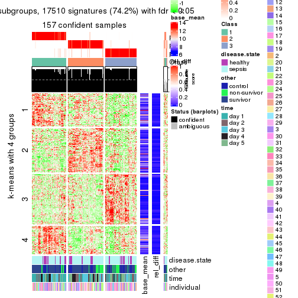</p>

</div>
<div id='tab-MAD-NMF-get-signatures-3'>
<pre><code class="r">get_signatures(res, k = 4)
</code></pre>

<p></p>

</div>
<div id='tab-MAD-NMF-get-signatures-4'>
<pre><code class="r">get_signatures(res, k = 5)
</code></pre>

<p></p>

</div>
<div id='tab-MAD-NMF-get-signatures-5'>
<pre><code class="r">get_signatures(res, k = 6)
</code></pre>

<p></p>

</div>
</div>


Signature heatmaps where rows are not scaled:


<script>
$( function() {
	$( '#tabs-MAD-NMF-get-signatures-no-scale' ).tabs();
} );
</script>
<div id='tabs-MAD-NMF-get-signatures-no-scale'>
<ul>
<li><a href='#tab-MAD-NMF-get-signatures-no-scale-1'>k = 2</a></li>
<li><a href='#tab-MAD-NMF-get-signatures-no-scale-2'>k = 3</a></li>
<li><a href='#tab-MAD-NMF-get-signatures-no-scale-3'>k = 4</a></li>
<li><a href='#tab-MAD-NMF-get-signatures-no-scale-4'>k = 5</a></li>
<li><a href='#tab-MAD-NMF-get-signatures-no-scale-5'>k = 6</a></li>
</ul>
<div id='tab-MAD-NMF-get-signatures-no-scale-1'>
<pre><code class="r">get_signatures(res, k = 2, scale_rows = FALSE)
</code></pre>

<p></p>

</div>
<div id='tab-MAD-NMF-get-signatures-no-scale-2'>
<pre><code class="r">get_signatures(res, k = 3, scale_rows = FALSE)
</code></pre>

<p></p>

</div>
<div id='tab-MAD-NMF-get-signatures-no-scale-3'>
<pre><code class="r">get_signatures(res, k = 4, scale_rows = FALSE)
</code></pre>

<p></p>

</div>
<div id='tab-MAD-NMF-get-signatures-no-scale-4'>
<pre><code class="r">get_signatures(res, k = 5, scale_rows = FALSE)
</code></pre>

<p></p>

</div>
<div id='tab-MAD-NMF-get-signatures-no-scale-5'>
<pre><code class="r">get_signatures(res, k = 6, scale_rows = FALSE)
</code></pre>

<p></p>

</div>
</div>


Compare the overlap of signatures from different k:

```r
compare_signatures(res)
```


`get_signature()` returns a data frame invisibly. TO get the list of signatures, the function
call should be assigned to a variable explicitly. In following code, if `plot` argument is set
to `FALSE`, no heatmap is plotted while only the differential analysis is performed.

```r
# code only for demonstration
tb = get_signature(res, k = ..., plot = FALSE)
```

An example of the output of `tb` is:

```
#>   which_row         fdr    mean_1    mean_2 scaled_mean_1 scaled_mean_2 km
#> 1        38 0.042760348  8.373488  9.131774    -0.5533452     0.5164555  1
#> 2        40 0.018707592  7.106213  8.469186    -0.6173731     0.5762149  1
#> 3        55 0.019134737 10.221463 11.207825    -0.6159697     0.5749050  1
#> 4        59 0.006059896  5.921854  7.869574    -0.6899429     0.6439467  1
#> 5        60 0.018055526  8.928898 10.211722    -0.6204761     0.5791110  1
#> 6        98 0.009384629 15.714769 14.887706     0.6635654    -0.6193277  2
...
```

The columns in `tb` are:

1. `which_row`: row indices corresponding to the input matrix.
2. `fdr`: FDR for the differential test. 
3. `mean_x`: The mean value in group x.
4. `scaled_mean_x`: The mean value in group x after rows are scaled.
5. `km`: Row groups if k-means clustering is applied to rows.


UMAP plot which shows how samples are separated.


<script>
$( function() {
	$( '#tabs-MAD-NMF-dimension-reduction' ).tabs();
} );
</script>
<div id='tabs-MAD-NMF-dimension-reduction'>
<ul>
<li><a href='#tab-MAD-NMF-dimension-reduction-1'>k = 2</a></li>
<li><a href='#tab-MAD-NMF-dimension-reduction-2'>k = 3</a></li>
<li><a href='#tab-MAD-NMF-dimension-reduction-3'>k = 4</a></li>
<li><a href='#tab-MAD-NMF-dimension-reduction-4'>k = 5</a></li>
<li><a href='#tab-MAD-NMF-dimension-reduction-5'>k = 6</a></li>
</ul>
<div id='tab-MAD-NMF-dimension-reduction-1'>
<pre><code class="r">dimension_reduction(res, k = 2, method = &quot;UMAP&quot;)
</code></pre>

<p></p>

</div>
<div id='tab-MAD-NMF-dimension-reduction-2'>
<pre><code class="r">dimension_reduction(res, k = 3, method = &quot;UMAP&quot;)
</code></pre>

<p></p>

</div>
<div id='tab-MAD-NMF-dimension-reduction-3'>
<pre><code class="r">dimension_reduction(res, k = 4, method = &quot;UMAP&quot;)
</code></pre>

<p></p>

</div>
<div id='tab-MAD-NMF-dimension-reduction-4'>
<pre><code class="r">dimension_reduction(res, k = 5, method = &quot;UMAP&quot;)
</code></pre>

<p></p>

</div>
<div id='tab-MAD-NMF-dimension-reduction-5'>
<pre><code class="r">dimension_reduction(res, k = 6, method = &quot;UMAP&quot;)
</code></pre>

<p></p>

</div>
</div>


Following heatmap shows how subgroups are split when increasing `k`:

```r
collect_classes(res)
```


Test correlation between subgroups and known annotations. If the known
annotation is numeric, one-way ANOVA test is applied, and if the known
annotation is discrete, chi-squared contingency table test is applied.

```r
test_to_known_factors(res)
```

```
#>           n disease.state(p) other(p)  time(p) individual(p) k
#> MAD:NMF 159         0.548974 7.27e-02 0.010485         0.174 2
#> MAD:NMF 157         0.674598 2.52e-01 0.051618         0.488 3
#> MAD:NMF 118         0.229939 6.52e-02 0.000424         0.583 4
#> MAD:NMF 130         0.004280 4.50e-04 0.008573         0.386 5
#> MAD:NMF 144         0.000753 4.73e-11 0.001204         0.355 6
```


If matrix rows can be associated to genes, consider to use `functional_enrichment(res,
...)` to perform function enrichment for the signature genes. See [this vignette](http://bioconductor.org/packages/devel/bioc/vignettes/cola/inst/doc/functional_enrichment.html) for more detailed explanations.


 

---------------------------------------------------


### ATC:hclust


The object with results only for a single top-value method and a single partition method 
can be extracted as:

```r
res = res_list["ATC", "hclust"]
# you can also extract it by
# res = res_list["ATC:hclust"]
```

A summary of `res` and all the functions that can be applied to it:

```r
res
```

```
#> A 'ConsensusPartition' object with k = 2, 3, 4, 5, 6.
#>   On a matrix with 23598 rows and 163 columns.
#>   Top rows (1000, 2000, 3000, 4000, 5000) are extracted by 'ATC' method.
#>   Subgroups are detected by 'hclust' method.
#>   Performed in total 1250 partitions by row resampling.
#>   Best k for subgroups seems to be 4.
#> 
#> Following methods can be applied to this 'ConsensusPartition' object:
#>  [1] "cola_report"             "collect_classes"         "collect_plots"          
#>  [4] "collect_stats"           "colnames"                "compare_signatures"     
#>  [7] "consensus_heatmap"       "dimension_reduction"     "functional_enrichment"  
#> [10] "get_anno_col"            "get_anno"                "get_classes"            
#> [13] "get_consensus"           "get_matrix"              "get_membership"         
#> [16] "get_param"               "get_signatures"          "get_stats"              
#> [19] "is_best_k"               "is_stable_k"             "membership_heatmap"     
#> [22] "ncol"                    "nrow"                    "plot_ecdf"              
#> [25] "rownames"                "select_partition_number" "show"                   
#> [28] "suggest_best_k"          "test_to_known_factors"
```

`collect_plots()` function collects all the plots made from `res` for all `k` (number of partitions)
into one single page to provide an easy and fast comparison between different `k`.

```r
collect_plots(res)
```


The plots are:

- The first row: a plot of the ECDF (empirical cumulative distribution
  function) curves of the consensus matrix for each `k` and the heatmap of
  predicted classes for each `k`.
- The second row: heatmaps of the consensus matrix for each `k`.
- The third row: heatmaps of the membership matrix for each `k`.
- The fouth row: heatmaps of the signatures for each `k`.

All the plots in panels can be made by individual functions and they are
plotted later in this section.

`select_partition_number()` produces several plots showing different
statistics for choosing "optimized" `k`. There are following statistics:

- ECDF curves of the consensus matrix for each `k`;
- 1-PAC. [The PAC
  score](https://en.wikipedia.org/wiki/Consensus_clustering#Over-interpretation_potential_of_consensus_clustering)
  measures the proportion of the ambiguous subgrouping.
- Mean silhouette score.
- Concordance. The mean probability of fiting the consensus class ids in all
  partitions.
- Area increased. Denote $A_k$ as the area under the ECDF curve for current
  `k`, the area increased is defined as $A_k - A_{k-1}$.
- Rand index. The percent of pairs of samples that are both in a same cluster
  or both are not in a same cluster in the partition of k and k-1.
- Jaccard index. The ratio of pairs of samples are both in a same cluster in
  the partition of k and k-1 and the pairs of samples are both in a same
  cluster in the partition k or k-1.

The detailed explanations of these statistics can be found in [the _cola_
vignette](http://bioconductor.org/packages/devel/bioc/vignettes/cola/inst/doc/cola.html#toc_13).

Generally speaking, lower PAC score, higher mean silhouette score or higher
concordance corresponds to better partition. Rand index and Jaccard index
measure how similar the current partition is compared to partition with `k-1`.
If they are too similar, we won't accept `k` is better than `k-1`.

```r
select_partition_number(res)
```


The numeric values for all these statistics can be obtained by `get_stats()`.

```r
get_stats(res)
```

```
#>   k 1-PAC mean_silhouette concordance area_increased  Rand Jaccard
#> 2 2 0.602           0.843       0.930         0.3488 0.682   0.682
#> 3 3 0.413           0.591       0.747         0.6311 0.712   0.586
#> 4 4 0.527           0.663       0.761         0.2373 0.811   0.561
#> 5 5 0.556           0.550       0.737         0.0374 0.916   0.719
#> 6 6 0.598           0.677       0.750         0.0344 0.865   0.546
```

`suggest_best_k()` suggests the best $k$ based on these statistics. The rules are as follows:

- All $k$ with Jaccard index larger than 0.95 are removed because increasing
  $k$ does not provide enough extra information. If all $k$ are removed, it is
  marked as no subgroup is detected.
- For all $k$ with 1-PAC score larger than 0.9, the maximal $k$ is taken as
  the best $k$, and other $k$ are marked as optional $k$.
- If it does not fit the second rule. The $k$ with the maximal vote of the
  highest 1-PAC score, highest mean silhouette, and highest concordance is
  taken as the best $k$.

```r
suggest_best_k(res)
```

```
#> [1] 4
```


Following shows the table of the partitions (You need to click the **show/hide
code output** link to see it). The membership matrix (columns with name `p*`)
is inferred by
[`clue::cl_consensus()`](https://www.rdocumentation.org/link/cl_consensus?package=clue)
function with the `SE` method. Basically the value in the membership matrix
represents the probability to belong to a certain group. The finall class
label for an item is determined with the group with highest probability it
belongs to.

In `get_classes()` function, the entropy is calculated from the membership
matrix and the silhouette score is calculated from the consensus matrix.


<script>
$( function() {
	$( '#tabs-ATC-hclust-get-classes' ).tabs();
} );
</script>
<div id='tabs-ATC-hclust-get-classes'>
<ul>
<li><a href='#tab-ATC-hclust-get-classes-1'>k = 2</a></li>
<li><a href='#tab-ATC-hclust-get-classes-2'>k = 3</a></li>
<li><a href='#tab-ATC-hclust-get-classes-3'>k = 4</a></li>
<li><a href='#tab-ATC-hclust-get-classes-4'>k = 5</a></li>
<li><a href='#tab-ATC-hclust-get-classes-5'>k = 6</a></li>
</ul>

<div id='tab-ATC-hclust-get-classes-1'>
<p><a id='tab-ATC-hclust-get-classes-1-a' style='color:#0366d6' href='#'>show/hide code output</a></p>
<pre><code class="r">cbind(get_classes(res, k = 2), get_membership(res, k = 2))
</code></pre>

<pre><code>#&gt;            class entropy silhouette    p1    p2
#&gt; GSM1317945     1  0.0000     0.9248 1.000 0.000
#&gt; GSM1317946     1  0.0000     0.9248 1.000 0.000
#&gt; GSM1317947     1  0.9998     0.0744 0.508 0.492
#&gt; GSM1317948     1  0.0672     0.9210 0.992 0.008
#&gt; GSM1317949     1  0.8955     0.5791 0.688 0.312
#&gt; GSM1317950     1  0.0000     0.9248 1.000 0.000
#&gt; GSM1317953     1  0.0000     0.9248 1.000 0.000
#&gt; GSM1317954     1  0.0000     0.9248 1.000 0.000
#&gt; GSM1317955     1  0.0000     0.9248 1.000 0.000
#&gt; GSM1317956     1  0.0000     0.9248 1.000 0.000
#&gt; GSM1317957     1  0.6247     0.8113 0.844 0.156
#&gt; GSM1317958     1  0.0000     0.9248 1.000 0.000
#&gt; GSM1317959     1  0.0000     0.9248 1.000 0.000
#&gt; GSM1317960     1  0.0000     0.9248 1.000 0.000
#&gt; GSM1317961     2  0.0376     0.9056 0.004 0.996
#&gt; GSM1317962     1  0.0000     0.9248 1.000 0.000
#&gt; GSM1317963     1  0.0672     0.9210 0.992 0.008
#&gt; GSM1317964     1  0.0000     0.9248 1.000 0.000
#&gt; GSM1317965     2  0.0000     0.9067 0.000 1.000
#&gt; GSM1317966     2  0.0376     0.9056 0.004 0.996
#&gt; GSM1317967     1  0.5842     0.8269 0.860 0.140
#&gt; GSM1317968     1  0.0000     0.9248 1.000 0.000
#&gt; GSM1317969     1  0.5842     0.8269 0.860 0.140
#&gt; GSM1317970     1  0.6247     0.8113 0.844 0.156
#&gt; GSM1317952     1  0.0672     0.9210 0.992 0.008
#&gt; GSM1317951     1  0.0000     0.9248 1.000 0.000
#&gt; GSM1317971     1  0.9661     0.3970 0.608 0.392
#&gt; GSM1317972     1  0.0000     0.9248 1.000 0.000
#&gt; GSM1317973     1  0.0000     0.9248 1.000 0.000
#&gt; GSM1317974     1  0.0000     0.9248 1.000 0.000
#&gt; GSM1317975     1  0.0000     0.9248 1.000 0.000
#&gt; GSM1317978     1  0.0000     0.9248 1.000 0.000
#&gt; GSM1317979     1  0.7674     0.7242 0.776 0.224
#&gt; GSM1317980     1  0.9993     0.0968 0.516 0.484
#&gt; GSM1317981     1  0.0000     0.9248 1.000 0.000
#&gt; GSM1317982     1  0.8267     0.6753 0.740 0.260
#&gt; GSM1317983     1  0.0000     0.9248 1.000 0.000
#&gt; GSM1317984     1  0.9996     0.0812 0.512 0.488
#&gt; GSM1317985     2  0.0000     0.9067 0.000 1.000
#&gt; GSM1317986     1  0.0000     0.9248 1.000 0.000
#&gt; GSM1317987     1  0.0000     0.9248 1.000 0.000
#&gt; GSM1317988     1  0.0000     0.9248 1.000 0.000
#&gt; GSM1317989     1  0.1414     0.9142 0.980 0.020
#&gt; GSM1317990     1  0.0000     0.9248 1.000 0.000
#&gt; GSM1317991     2  0.9170     0.5260 0.332 0.668
#&gt; GSM1317992     1  0.9661     0.3970 0.608 0.392
#&gt; GSM1317993     1  0.0000     0.9248 1.000 0.000
#&gt; GSM1317994     2  0.0000     0.9067 0.000 1.000
#&gt; GSM1317977     1  0.1414     0.9142 0.980 0.020
#&gt; GSM1317976     1  0.0000     0.9248 1.000 0.000
#&gt; GSM1317995     2  0.0000     0.9067 0.000 1.000
#&gt; GSM1317996     1  0.0376     0.9231 0.996 0.004
#&gt; GSM1317997     2  0.0000     0.9067 0.000 1.000
#&gt; GSM1317998     1  0.0000     0.9248 1.000 0.000
#&gt; GSM1317999     1  0.0000     0.9248 1.000 0.000
#&gt; GSM1318002     1  0.0000     0.9248 1.000 0.000
#&gt; GSM1318003     1  0.0000     0.9248 1.000 0.000
#&gt; GSM1318004     1  0.0000     0.9248 1.000 0.000
#&gt; GSM1318005     1  0.0000     0.9248 1.000 0.000
#&gt; GSM1318006     1  0.0000     0.9248 1.000 0.000
#&gt; GSM1318007     1  0.0938     0.9190 0.988 0.012
#&gt; GSM1318008     1  0.0000     0.9248 1.000 0.000
#&gt; GSM1318009     1  0.0000     0.9248 1.000 0.000
#&gt; GSM1318010     2  0.0000     0.9067 0.000 1.000
#&gt; GSM1318011     1  0.0376     0.9230 0.996 0.004
#&gt; GSM1318012     1  0.0000     0.9248 1.000 0.000
#&gt; GSM1318013     1  0.0938     0.9190 0.988 0.012
#&gt; GSM1318014     1  0.0376     0.9230 0.996 0.004
#&gt; GSM1318015     1  0.0000     0.9248 1.000 0.000
#&gt; GSM1318001     2  0.0000     0.9067 0.000 1.000
#&gt; GSM1318000     1  0.0000     0.9248 1.000 0.000
#&gt; GSM1318016     1  0.0000     0.9248 1.000 0.000
#&gt; GSM1318017     1  0.0000     0.9248 1.000 0.000
#&gt; GSM1318019     1  0.0000     0.9248 1.000 0.000
#&gt; GSM1318020     2  0.9635     0.3706 0.388 0.612
#&gt; GSM1318021     1  0.0000     0.9248 1.000 0.000
#&gt; GSM1318022     2  0.9170     0.5249 0.332 0.668
#&gt; GSM1318023     1  0.0000     0.9248 1.000 0.000
#&gt; GSM1318024     1  0.0000     0.9248 1.000 0.000
#&gt; GSM1318025     2  0.0000     0.9067 0.000 1.000
#&gt; GSM1318026     1  0.6247     0.8113 0.844 0.156
#&gt; GSM1318027     1  0.5842     0.8269 0.860 0.140
#&gt; GSM1318028     1  0.0000     0.9248 1.000 0.000
#&gt; GSM1318029     2  0.0000     0.9067 0.000 1.000
#&gt; GSM1318018     1  0.0000     0.9248 1.000 0.000
#&gt; GSM1318030     1  0.2236     0.9067 0.964 0.036
#&gt; GSM1318031     2  0.0000     0.9067 0.000 1.000
#&gt; GSM1318033     1  0.0000     0.9248 1.000 0.000
#&gt; GSM1318034     1  1.0000     0.0480 0.504 0.496
#&gt; GSM1318035     1  0.0000     0.9248 1.000 0.000
#&gt; GSM1318036     1  0.0938     0.9187 0.988 0.012
#&gt; GSM1318037     1  0.2236     0.9067 0.964 0.036
#&gt; GSM1318038     1  0.7950     0.7015 0.760 0.240
#&gt; GSM1318039     1  0.0000     0.9248 1.000 0.000
#&gt; GSM1318040     2  0.0000     0.9067 0.000 1.000
#&gt; GSM1318032     2  0.0000     0.9067 0.000 1.000
#&gt; GSM1317914     2  0.6973     0.7639 0.188 0.812
#&gt; GSM1317915     1  0.0000     0.9248 1.000 0.000
#&gt; GSM1317916     1  0.0000     0.9248 1.000 0.000
#&gt; GSM1317917     1  0.7950     0.7015 0.760 0.240
#&gt; GSM1317918     1  0.0000     0.9248 1.000 0.000
#&gt; GSM1317919     2  0.6887     0.7673 0.184 0.816
#&gt; GSM1317920     2  0.1414     0.8982 0.020 0.980
#&gt; GSM1317921     2  0.6887     0.7673 0.184 0.816
#&gt; GSM1317922     2  0.2043     0.8908 0.032 0.968
#&gt; GSM1317923     2  0.9323     0.5050 0.348 0.652
#&gt; GSM1317924     2  0.0000     0.9067 0.000 1.000
#&gt; GSM1317925     1  0.0000     0.9248 1.000 0.000
#&gt; GSM1317926     2  0.0938     0.9022 0.012 0.988
#&gt; GSM1317927     1  0.0000     0.9248 1.000 0.000
#&gt; GSM1317928     1  0.4815     0.8584 0.896 0.104
#&gt; GSM1317929     2  0.0000     0.9067 0.000 1.000
#&gt; GSM1317930     1  0.0000     0.9248 1.000 0.000
#&gt; GSM1317931     1  0.7219     0.7532 0.800 0.200
#&gt; GSM1317932     1  0.4815     0.8584 0.896 0.104
#&gt; GSM1317933     1  0.0000     0.9248 1.000 0.000
#&gt; GSM1317934     1  0.4815     0.8584 0.896 0.104
#&gt; GSM1317935     1  0.4815     0.8584 0.896 0.104
#&gt; GSM1317936     2  0.0000     0.9067 0.000 1.000
#&gt; GSM1317937     1  0.0000     0.9248 1.000 0.000
#&gt; GSM1317938     1  0.0000     0.9248 1.000 0.000
#&gt; GSM1317939     1  0.0000     0.9248 1.000 0.000
#&gt; GSM1317940     1  0.0000     0.9248 1.000 0.000
#&gt; GSM1317941     1  0.0938     0.9187 0.988 0.012
#&gt; GSM1317942     1  0.0000     0.9248 1.000 0.000
#&gt; GSM1317943     1  0.0000     0.9248 1.000 0.000
#&gt; GSM1317944     1  0.0000     0.9248 1.000 0.000
#&gt; GSM1317896     2  0.0000     0.9067 0.000 1.000
#&gt; GSM1317897     1  0.0000     0.9248 1.000 0.000
#&gt; GSM1317898     1  0.0000     0.9248 1.000 0.000
#&gt; GSM1317899     1  0.0000     0.9248 1.000 0.000
#&gt; GSM1317900     2  0.0000     0.9067 0.000 1.000
#&gt; GSM1317901     1  0.1414     0.9157 0.980 0.020
#&gt; GSM1317902     1  0.0000     0.9248 1.000 0.000
#&gt; GSM1317903     1  0.0000     0.9248 1.000 0.000
#&gt; GSM1317904     1  0.0000     0.9248 1.000 0.000
#&gt; GSM1317905     1  0.5842     0.8269 0.860 0.140
#&gt; GSM1317906     1  0.5842     0.8269 0.860 0.140
#&gt; GSM1317907     1  0.0000     0.9248 1.000 0.000
#&gt; GSM1317908     1  0.9922     0.2305 0.552 0.448
#&gt; GSM1317909     1  0.7674     0.7242 0.776 0.224
#&gt; GSM1317910     1  0.7674     0.7242 0.776 0.224
#&gt; GSM1317911     1  0.0000     0.9248 1.000 0.000
#&gt; GSM1317912     1  0.0000     0.9248 1.000 0.000
#&gt; GSM1317913     1  0.0000     0.9248 1.000 0.000
#&gt; GSM1318041     1  0.6801     0.7790 0.820 0.180
#&gt; GSM1318042     1  1.0000     0.0480 0.504 0.496
#&gt; GSM1318043     2  0.0000     0.9067 0.000 1.000
#&gt; GSM1318044     1  0.0000     0.9248 1.000 0.000
#&gt; GSM1318045     1  0.0000     0.9248 1.000 0.000
#&gt; GSM1318046     1  0.0000     0.9248 1.000 0.000
#&gt; GSM1318047     1  0.0000     0.9248 1.000 0.000
#&gt; GSM1318048     1  0.7219     0.7557 0.800 0.200
#&gt; GSM1318049     1  0.6801     0.7790 0.820 0.180
#&gt; GSM1318050     1  0.0000     0.9248 1.000 0.000
#&gt; GSM1318051     1  0.0000     0.9248 1.000 0.000
#&gt; GSM1318052     1  0.5842     0.8269 0.860 0.140
#&gt; GSM1318053     1  0.5842     0.8269 0.860 0.140
#&gt; GSM1318054     1  0.6048     0.8195 0.852 0.148
#&gt; GSM1318055     2  0.7376     0.7351 0.208 0.792
#&gt; GSM1318056     1  0.8327     0.6633 0.736 0.264
#&gt; GSM1318057     1  0.5842     0.8269 0.860 0.140
#&gt; GSM1318058     2  0.8713     0.6037 0.292 0.708
</code></pre>

<script>
$('#tab-ATC-hclust-get-classes-1-a').parent().next().next().hide();
$('#tab-ATC-hclust-get-classes-1-a').click(function(){
  $('#tab-ATC-hclust-get-classes-1-a').parent().next().next().toggle();
  return(false);
});
</script>
</div>

<div id='tab-ATC-hclust-get-classes-2'>
<p><a id='tab-ATC-hclust-get-classes-2-a' style='color:#0366d6' href='#'>show/hide code output</a></p>
<pre><code class="r">cbind(get_classes(res, k = 3), get_membership(res, k = 3))
</code></pre>

<pre><code>#&gt;            class entropy silhouette    p1    p2    p3
#&gt; GSM1317945     1  0.6140     0.5653 0.596 0.404 0.000
#&gt; GSM1317946     1  0.2356     0.6846 0.928 0.072 0.000
#&gt; GSM1317947     2  0.9027     0.3119 0.160 0.532 0.308
#&gt; GSM1317948     1  0.4978     0.5539 0.780 0.216 0.004
#&gt; GSM1317949     2  0.8702     0.5735 0.292 0.568 0.140
#&gt; GSM1317950     1  0.0000     0.6857 1.000 0.000 0.000
#&gt; GSM1317953     1  0.0000     0.6857 1.000 0.000 0.000
#&gt; GSM1317954     1  0.0000     0.6857 1.000 0.000 0.000
#&gt; GSM1317955     1  0.0000     0.6857 1.000 0.000 0.000
#&gt; GSM1317956     1  0.0000     0.6857 1.000 0.000 0.000
#&gt; GSM1317957     2  0.4178     0.5925 0.172 0.828 0.000
#&gt; GSM1317958     1  0.0237     0.6836 0.996 0.004 0.000
#&gt; GSM1317959     1  0.6140     0.5653 0.596 0.404 0.000
#&gt; GSM1317960     1  0.1860     0.6466 0.948 0.052 0.000
#&gt; GSM1317961     3  0.2165     0.8991 0.000 0.064 0.936
#&gt; GSM1317962     1  0.0892     0.6881 0.980 0.020 0.000
#&gt; GSM1317963     1  0.4978     0.5539 0.780 0.216 0.004
#&gt; GSM1317964     1  0.0000     0.6857 1.000 0.000 0.000
#&gt; GSM1317965     3  0.1860     0.9019 0.000 0.052 0.948
#&gt; GSM1317966     3  0.2165     0.8991 0.000 0.064 0.936
#&gt; GSM1317967     2  0.4452     0.5784 0.192 0.808 0.000
#&gt; GSM1317968     1  0.0892     0.6881 0.980 0.020 0.000
#&gt; GSM1317969     2  0.4702     0.5516 0.212 0.788 0.000
#&gt; GSM1317970     2  0.4178     0.5925 0.172 0.828 0.000
#&gt; GSM1317952     1  0.4978     0.5539 0.780 0.216 0.004
#&gt; GSM1317951     1  0.0000     0.6857 1.000 0.000 0.000
#&gt; GSM1317971     2  0.5734     0.5052 0.048 0.788 0.164
#&gt; GSM1317972     1  0.2356     0.6846 0.928 0.072 0.000
#&gt; GSM1317973     1  0.6140     0.5653 0.596 0.404 0.000
#&gt; GSM1317974     1  0.2356     0.6846 0.928 0.072 0.000
#&gt; GSM1317975     1  0.6140     0.5653 0.596 0.404 0.000
#&gt; GSM1317978     1  0.2356     0.6846 0.928 0.072 0.000
#&gt; GSM1317979     2  0.8514     0.5172 0.372 0.528 0.100
#&gt; GSM1317980     2  0.8173     0.3349 0.116 0.620 0.264
#&gt; GSM1317981     1  0.6140     0.5653 0.596 0.404 0.000
#&gt; GSM1317982     2  0.8312     0.5661 0.324 0.576 0.100
#&gt; GSM1317983     1  0.0000     0.6857 1.000 0.000 0.000
#&gt; GSM1317984     2  0.8203     0.3311 0.116 0.616 0.268
#&gt; GSM1317985     3  0.1753     0.9023 0.000 0.048 0.952
#&gt; GSM1317986     1  0.0000     0.6857 1.000 0.000 0.000
#&gt; GSM1317987     1  0.6140     0.5653 0.596 0.404 0.000
#&gt; GSM1317988     1  0.6140     0.5653 0.596 0.404 0.000
#&gt; GSM1317989     1  0.5843     0.4978 0.732 0.252 0.016
#&gt; GSM1317990     1  0.6140     0.5653 0.596 0.404 0.000
#&gt; GSM1317991     2  0.6468    -0.1808 0.004 0.552 0.444
#&gt; GSM1317992     2  0.5734     0.5052 0.048 0.788 0.164
#&gt; GSM1317993     1  0.6140     0.5653 0.596 0.404 0.000
#&gt; GSM1317994     3  0.1753     0.9023 0.000 0.048 0.952
#&gt; GSM1317977     1  0.4840     0.6254 0.816 0.168 0.016
#&gt; GSM1317976     1  0.1643     0.6884 0.956 0.044 0.000
#&gt; GSM1317995     3  0.1753     0.9023 0.000 0.048 0.952
#&gt; GSM1317996     1  0.6154     0.5578 0.592 0.408 0.000
#&gt; GSM1317997     3  0.1753     0.9023 0.000 0.048 0.952
#&gt; GSM1317998     1  0.0000     0.6857 1.000 0.000 0.000
#&gt; GSM1317999     1  0.0747     0.6768 0.984 0.016 0.000
#&gt; GSM1318002     1  0.6140     0.5653 0.596 0.404 0.000
#&gt; GSM1318003     1  0.6140     0.5653 0.596 0.404 0.000
#&gt; GSM1318004     1  0.6140     0.5653 0.596 0.404 0.000
#&gt; GSM1318005     1  0.6140     0.5653 0.596 0.404 0.000
#&gt; GSM1318006     1  0.0000     0.6857 1.000 0.000 0.000
#&gt; GSM1318007     2  0.6204    -0.0916 0.424 0.576 0.000
#&gt; GSM1318008     1  0.0000     0.6857 1.000 0.000 0.000
#&gt; GSM1318009     1  0.6140     0.5653 0.596 0.404 0.000
#&gt; GSM1318010     3  0.1753     0.9023 0.000 0.048 0.952
#&gt; GSM1318011     1  0.4834     0.5643 0.792 0.204 0.004
#&gt; GSM1318012     1  0.2165     0.6490 0.936 0.064 0.000
#&gt; GSM1318013     2  0.6204    -0.0916 0.424 0.576 0.000
#&gt; GSM1318014     1  0.4931     0.5521 0.784 0.212 0.004
#&gt; GSM1318015     1  0.6140     0.5653 0.596 0.404 0.000
#&gt; GSM1318001     3  0.1753     0.9023 0.000 0.048 0.952
#&gt; GSM1318000     1  0.6140     0.5653 0.596 0.404 0.000
#&gt; GSM1318016     1  0.6140     0.5653 0.596 0.404 0.000
#&gt; GSM1318017     1  0.0000     0.6857 1.000 0.000 0.000
#&gt; GSM1318019     1  0.6140     0.5653 0.596 0.404 0.000
#&gt; GSM1318020     2  0.7339    -0.0110 0.036 0.572 0.392
#&gt; GSM1318021     1  0.6140     0.5653 0.596 0.404 0.000
#&gt; GSM1318022     2  0.6267    -0.2107 0.000 0.548 0.452
#&gt; GSM1318023     1  0.0000     0.6857 1.000 0.000 0.000
#&gt; GSM1318024     1  0.6140     0.5653 0.596 0.404 0.000
#&gt; GSM1318025     3  0.2356     0.8434 0.000 0.072 0.928
#&gt; GSM1318026     2  0.4178     0.5925 0.172 0.828 0.000
#&gt; GSM1318027     2  0.4452     0.5784 0.192 0.808 0.000
#&gt; GSM1318028     1  0.1753     0.6505 0.952 0.048 0.000
#&gt; GSM1318029     3  0.2066     0.9002 0.000 0.060 0.940
#&gt; GSM1318018     1  0.0000     0.6857 1.000 0.000 0.000
#&gt; GSM1318030     1  0.6822    -0.0687 0.508 0.480 0.012
#&gt; GSM1318031     3  0.2356     0.8434 0.000 0.072 0.928
#&gt; GSM1318033     1  0.0000     0.6857 1.000 0.000 0.000
#&gt; GSM1318034     2  0.8262     0.3057 0.116 0.608 0.276
#&gt; GSM1318035     1  0.6140     0.5653 0.596 0.404 0.000
#&gt; GSM1318036     1  0.6082     0.5374 0.692 0.296 0.012
#&gt; GSM1318037     1  0.6822    -0.0687 0.508 0.480 0.012
#&gt; GSM1318038     2  0.8434     0.5469 0.336 0.560 0.104
#&gt; GSM1318039     1  0.0000     0.6857 1.000 0.000 0.000
#&gt; GSM1318040     3  0.2356     0.8434 0.000 0.072 0.928
#&gt; GSM1318032     3  0.2356     0.8434 0.000 0.072 0.928
#&gt; GSM1317914     3  0.5988     0.5775 0.000 0.368 0.632
#&gt; GSM1317915     1  0.1411     0.6615 0.964 0.036 0.000
#&gt; GSM1317916     1  0.1411     0.6615 0.964 0.036 0.000
#&gt; GSM1317917     2  0.8434     0.5469 0.336 0.560 0.104
#&gt; GSM1317918     1  0.1411     0.6615 0.964 0.036 0.000
#&gt; GSM1317919     3  0.5760     0.6359 0.000 0.328 0.672
#&gt; GSM1317920     3  0.2356     0.8910 0.000 0.072 0.928
#&gt; GSM1317921     3  0.5760     0.6359 0.000 0.328 0.672
#&gt; GSM1317922     3  0.3816     0.8424 0.000 0.148 0.852
#&gt; GSM1317923     3  0.8157     0.3074 0.072 0.412 0.516
#&gt; GSM1317924     3  0.2356     0.8434 0.000 0.072 0.928
#&gt; GSM1317925     1  0.6140     0.5653 0.596 0.404 0.000
#&gt; GSM1317926     3  0.2165     0.8942 0.000 0.064 0.936
#&gt; GSM1317927     1  0.6140     0.5653 0.596 0.404 0.000
#&gt; GSM1317928     2  0.6497     0.4828 0.336 0.648 0.016
#&gt; GSM1317929     3  0.1860     0.8993 0.000 0.052 0.948
#&gt; GSM1317930     1  0.6140     0.5653 0.596 0.404 0.000
#&gt; GSM1317931     2  0.6606     0.5907 0.236 0.716 0.048
#&gt; GSM1317932     2  0.6473     0.4842 0.332 0.652 0.016
#&gt; GSM1317933     1  0.6140     0.5653 0.596 0.404 0.000
#&gt; GSM1317934     2  0.6473     0.4842 0.332 0.652 0.016
#&gt; GSM1317935     2  0.6473     0.4842 0.332 0.652 0.016
#&gt; GSM1317936     3  0.1753     0.9023 0.000 0.048 0.952
#&gt; GSM1317937     1  0.0000     0.6857 1.000 0.000 0.000
#&gt; GSM1317938     1  0.6140     0.5653 0.596 0.404 0.000
#&gt; GSM1317939     1  0.6140     0.5653 0.596 0.404 0.000
#&gt; GSM1317940     1  0.1753     0.6505 0.952 0.048 0.000
#&gt; GSM1317941     1  0.3845     0.6702 0.872 0.116 0.012
#&gt; GSM1317942     1  0.6140     0.5653 0.596 0.404 0.000
#&gt; GSM1317943     1  0.6140     0.5653 0.596 0.404 0.000
#&gt; GSM1317944     1  0.6140     0.5653 0.596 0.404 0.000
#&gt; GSM1317896     3  0.1860     0.9019 0.000 0.052 0.948
#&gt; GSM1317897     1  0.0000     0.6857 1.000 0.000 0.000
#&gt; GSM1317898     1  0.1411     0.6874 0.964 0.036 0.000
#&gt; GSM1317899     1  0.1289     0.6876 0.968 0.032 0.000
#&gt; GSM1317900     3  0.1860     0.9019 0.000 0.052 0.948
#&gt; GSM1317901     1  0.6008     0.2748 0.664 0.332 0.004
#&gt; GSM1317902     1  0.0000     0.6857 1.000 0.000 0.000
#&gt; GSM1317903     1  0.0000     0.6857 1.000 0.000 0.000
#&gt; GSM1317904     1  0.6140     0.5653 0.596 0.404 0.000
#&gt; GSM1317905     2  0.4452     0.5784 0.192 0.808 0.000
#&gt; GSM1317906     2  0.4452     0.5784 0.192 0.808 0.000
#&gt; GSM1317907     1  0.6140     0.5653 0.596 0.404 0.000
#&gt; GSM1317908     2  0.8423     0.3825 0.156 0.616 0.228
#&gt; GSM1317909     2  0.8549     0.4940 0.384 0.516 0.100
#&gt; GSM1317910     2  0.8549     0.4940 0.384 0.516 0.100
#&gt; GSM1317911     1  0.0000     0.6857 1.000 0.000 0.000
#&gt; GSM1317912     1  0.6140     0.5653 0.596 0.404 0.000
#&gt; GSM1317913     1  0.6140     0.5653 0.596 0.404 0.000
#&gt; GSM1318041     2  0.8334     0.3915 0.440 0.480 0.080
#&gt; GSM1318042     2  0.8262     0.3057 0.116 0.608 0.276
#&gt; GSM1318043     3  0.1753     0.9023 0.000 0.048 0.952
#&gt; GSM1318044     1  0.0000     0.6857 1.000 0.000 0.000
#&gt; GSM1318045     1  0.0000     0.6857 1.000 0.000 0.000
#&gt; GSM1318046     1  0.0000     0.6857 1.000 0.000 0.000
#&gt; GSM1318047     1  0.1860     0.6466 0.948 0.052 0.000
#&gt; GSM1318048     2  0.8419     0.4546 0.408 0.504 0.088
#&gt; GSM1318049     2  0.8334     0.3905 0.440 0.480 0.080
#&gt; GSM1318050     1  0.6140     0.5653 0.596 0.404 0.000
#&gt; GSM1318051     1  0.6140     0.5653 0.596 0.404 0.000
#&gt; GSM1318052     2  0.4452     0.5784 0.192 0.808 0.000
#&gt; GSM1318053     2  0.4452     0.5784 0.192 0.808 0.000
#&gt; GSM1318054     2  0.4346     0.5836 0.184 0.816 0.000
#&gt; GSM1318055     3  0.6045     0.5260 0.000 0.380 0.620
#&gt; GSM1318056     2  0.5042     0.5951 0.104 0.836 0.060
#&gt; GSM1318057     2  0.4452     0.5784 0.192 0.808 0.000
#&gt; GSM1318058     2  0.6291    -0.2883 0.000 0.532 0.468
</code></pre>

<script>
$('#tab-ATC-hclust-get-classes-2-a').parent().next().next().hide();
$('#tab-ATC-hclust-get-classes-2-a').click(function(){
  $('#tab-ATC-hclust-get-classes-2-a').parent().next().next().toggle();
  return(false);
});
</script>
</div>

<div id='tab-ATC-hclust-get-classes-3'>
<p><a id='tab-ATC-hclust-get-classes-3-a' style='color:#0366d6' href='#'>show/hide code output</a></p>
<pre><code class="r">cbind(get_classes(res, k = 4), get_membership(res, k = 4))
</code></pre>

<pre><code>#&gt;            class entropy silhouette    p1    p2    p3    p4
#&gt; GSM1317945     2  0.0188     0.8838 0.004 0.996 0.000 0.000
#&gt; GSM1317946     2  0.4961    -0.2101 0.448 0.552 0.000 0.000
#&gt; GSM1317947     4  0.4939     0.3192 0.040 0.000 0.220 0.740
#&gt; GSM1317948     1  0.6939     0.4333 0.540 0.128 0.000 0.332
#&gt; GSM1317949     4  0.4569     0.5028 0.144 0.004 0.052 0.800
#&gt; GSM1317950     1  0.3801     0.8451 0.780 0.220 0.000 0.000
#&gt; GSM1317953     1  0.3801     0.8451 0.780 0.220 0.000 0.000
#&gt; GSM1317954     1  0.3801     0.8451 0.780 0.220 0.000 0.000
#&gt; GSM1317955     1  0.3801     0.8451 0.780 0.220 0.000 0.000
#&gt; GSM1317956     1  0.3801     0.8451 0.780 0.220 0.000 0.000
#&gt; GSM1317957     4  0.6360     0.5358 0.064 0.420 0.000 0.516
#&gt; GSM1317958     1  0.3577     0.8226 0.832 0.156 0.000 0.012
#&gt; GSM1317959     2  0.0469     0.8790 0.012 0.988 0.000 0.000
#&gt; GSM1317960     1  0.4344     0.7741 0.816 0.108 0.000 0.076
#&gt; GSM1317961     3  0.2530     0.8716 0.004 0.000 0.896 0.100
#&gt; GSM1317962     1  0.4500     0.7451 0.684 0.316 0.000 0.000
#&gt; GSM1317963     1  0.6939     0.4333 0.540 0.128 0.000 0.332
#&gt; GSM1317964     1  0.3801     0.8451 0.780 0.220 0.000 0.000
#&gt; GSM1317965     3  0.2216     0.8740 0.000 0.000 0.908 0.092
#&gt; GSM1317966     3  0.2530     0.8716 0.004 0.000 0.896 0.100
#&gt; GSM1317967     4  0.6387     0.5103 0.064 0.444 0.000 0.492
#&gt; GSM1317968     1  0.4500     0.7451 0.684 0.316 0.000 0.000
#&gt; GSM1317969     4  0.6658     0.5054 0.084 0.444 0.000 0.472
#&gt; GSM1317970     4  0.6360     0.5358 0.064 0.420 0.000 0.516
#&gt; GSM1317952     1  0.6939     0.4333 0.540 0.128 0.000 0.332
#&gt; GSM1317951     1  0.3801     0.8451 0.780 0.220 0.000 0.000
#&gt; GSM1317971     4  0.7354     0.5052 0.012 0.276 0.152 0.560
#&gt; GSM1317972     2  0.4961    -0.2101 0.448 0.552 0.000 0.000
#&gt; GSM1317973     2  0.0524     0.8702 0.008 0.988 0.000 0.004
#&gt; GSM1317974     2  0.4961    -0.2101 0.448 0.552 0.000 0.000
#&gt; GSM1317975     2  0.0188     0.8838 0.004 0.996 0.000 0.000
#&gt; GSM1317978     2  0.4961    -0.2101 0.448 0.552 0.000 0.000
#&gt; GSM1317979     4  0.5321     0.5358 0.204 0.044 0.012 0.740
#&gt; GSM1317980     4  0.4238     0.3745 0.028 0.000 0.176 0.796
#&gt; GSM1317981     2  0.0188     0.8838 0.004 0.996 0.000 0.000
#&gt; GSM1317982     4  0.4866     0.5539 0.160 0.044 0.012 0.784
#&gt; GSM1317983     1  0.3801     0.8451 0.780 0.220 0.000 0.000
#&gt; GSM1317984     4  0.4281     0.3710 0.028 0.000 0.180 0.792
#&gt; GSM1317985     3  0.2149     0.8745 0.000 0.000 0.912 0.088
#&gt; GSM1317986     1  0.3801     0.8451 0.780 0.220 0.000 0.000
#&gt; GSM1317987     2  0.0188     0.8838 0.004 0.996 0.000 0.000
#&gt; GSM1317988     2  0.0524     0.8702 0.008 0.988 0.000 0.004
#&gt; GSM1317989     1  0.7426     0.2417 0.488 0.188 0.000 0.324
#&gt; GSM1317990     2  0.0188     0.8838 0.004 0.996 0.000 0.000
#&gt; GSM1317991     4  0.6043    -0.0967 0.016 0.020 0.412 0.552
#&gt; GSM1317992     4  0.7354     0.5052 0.012 0.276 0.152 0.560
#&gt; GSM1317993     2  0.0188     0.8838 0.004 0.996 0.000 0.000
#&gt; GSM1317994     3  0.2149     0.8745 0.000 0.000 0.912 0.088
#&gt; GSM1317977     1  0.7706     0.3604 0.424 0.348 0.000 0.228
#&gt; GSM1317976     1  0.5277     0.7334 0.668 0.304 0.000 0.028
#&gt; GSM1317995     3  0.2149     0.8745 0.000 0.000 0.912 0.088
#&gt; GSM1317996     2  0.0524     0.8786 0.004 0.988 0.000 0.008
#&gt; GSM1317997     3  0.2149     0.8745 0.000 0.000 0.912 0.088
#&gt; GSM1317998     1  0.3801     0.8451 0.780 0.220 0.000 0.000
#&gt; GSM1317999     1  0.3616     0.7971 0.852 0.112 0.000 0.036
#&gt; GSM1318002     2  0.0188     0.8783 0.000 0.996 0.000 0.004
#&gt; GSM1318003     2  0.0376     0.8814 0.004 0.992 0.000 0.004
#&gt; GSM1318004     2  0.0657     0.8774 0.012 0.984 0.000 0.004
#&gt; GSM1318005     2  0.0657     0.8774 0.012 0.984 0.000 0.004
#&gt; GSM1318006     1  0.3801     0.8451 0.780 0.220 0.000 0.000
#&gt; GSM1318007     2  0.6147     0.2049 0.128 0.672 0.000 0.200
#&gt; GSM1318008     1  0.3801     0.8451 0.780 0.220 0.000 0.000
#&gt; GSM1318009     2  0.0469     0.8790 0.012 0.988 0.000 0.000
#&gt; GSM1318010     3  0.2149     0.8745 0.000 0.000 0.912 0.088
#&gt; GSM1318011     1  0.6862     0.4691 0.560 0.128 0.000 0.312
#&gt; GSM1318012     1  0.4646     0.7618 0.796 0.120 0.000 0.084
#&gt; GSM1318013     2  0.6147     0.2049 0.128 0.672 0.000 0.200
#&gt; GSM1318014     1  0.6685     0.4317 0.568 0.108 0.000 0.324
#&gt; GSM1318015     2  0.0188     0.8783 0.000 0.996 0.000 0.004
#&gt; GSM1318001     3  0.2149     0.8745 0.000 0.000 0.912 0.088
#&gt; GSM1318000     2  0.0469     0.8790 0.012 0.988 0.000 0.000
#&gt; GSM1318016     2  0.0188     0.8838 0.004 0.996 0.000 0.000
#&gt; GSM1318017     1  0.3801     0.8451 0.780 0.220 0.000 0.000
#&gt; GSM1318019     2  0.0376     0.8814 0.004 0.992 0.000 0.004
#&gt; GSM1318020     4  0.5277     0.1628 0.028 0.000 0.304 0.668
#&gt; GSM1318021     2  0.0188     0.8838 0.004 0.996 0.000 0.000
#&gt; GSM1318022     4  0.5545    -0.0960 0.020 0.004 0.364 0.612
#&gt; GSM1318023     1  0.3801     0.8451 0.780 0.220 0.000 0.000
#&gt; GSM1318024     2  0.0188     0.8838 0.004 0.996 0.000 0.000
#&gt; GSM1318025     3  0.3474     0.7605 0.068 0.000 0.868 0.064
#&gt; GSM1318026     4  0.6360     0.5358 0.064 0.420 0.000 0.516
#&gt; GSM1318027     4  0.6387     0.5103 0.064 0.444 0.000 0.492
#&gt; GSM1318028     1  0.4514     0.8116 0.796 0.148 0.000 0.056
#&gt; GSM1318029     3  0.2345     0.8721 0.000 0.000 0.900 0.100
#&gt; GSM1318018     1  0.3801     0.8451 0.780 0.220 0.000 0.000
#&gt; GSM1318030     4  0.7589     0.3450 0.196 0.400 0.000 0.404
#&gt; GSM1318031     3  0.3474     0.7605 0.068 0.000 0.868 0.064
#&gt; GSM1318033     1  0.4304     0.7861 0.716 0.284 0.000 0.000
#&gt; GSM1318034     4  0.4365     0.3609 0.028 0.000 0.188 0.784
#&gt; GSM1318035     2  0.0188     0.8838 0.004 0.996 0.000 0.000
#&gt; GSM1318036     2  0.6602     0.3743 0.164 0.628 0.000 0.208
#&gt; GSM1318037     4  0.7589     0.3450 0.196 0.400 0.000 0.404
#&gt; GSM1318038     4  0.5321     0.5337 0.192 0.044 0.016 0.748
#&gt; GSM1318039     1  0.4764     0.8353 0.748 0.220 0.000 0.032
#&gt; GSM1318040     3  0.3474     0.7605 0.068 0.000 0.868 0.064
#&gt; GSM1318032     3  0.3474     0.7605 0.068 0.000 0.868 0.064
#&gt; GSM1317914     3  0.5537     0.4437 0.012 0.004 0.544 0.440
#&gt; GSM1317915     1  0.3400     0.7382 0.872 0.064 0.000 0.064
#&gt; GSM1317916     1  0.3400     0.7382 0.872 0.064 0.000 0.064
#&gt; GSM1317917     4  0.5321     0.5337 0.192 0.044 0.016 0.748
#&gt; GSM1317918     1  0.3400     0.7382 0.872 0.064 0.000 0.064
#&gt; GSM1317919     3  0.5306     0.5970 0.020 0.000 0.632 0.348
#&gt; GSM1317920     3  0.2530     0.8641 0.000 0.000 0.888 0.112
#&gt; GSM1317921     3  0.5306     0.5970 0.020 0.000 0.632 0.348
#&gt; GSM1317922     3  0.3942     0.7622 0.000 0.000 0.764 0.236
#&gt; GSM1317923     3  0.6616     0.3116 0.068 0.004 0.476 0.452
#&gt; GSM1317924     3  0.3474     0.7605 0.068 0.000 0.868 0.064
#&gt; GSM1317925     2  0.0188     0.8838 0.004 0.996 0.000 0.000
#&gt; GSM1317926     3  0.2408     0.8676 0.000 0.000 0.896 0.104
#&gt; GSM1317927     2  0.0188     0.8838 0.004 0.996 0.000 0.000
#&gt; GSM1317928     4  0.6592     0.5541 0.076 0.368 0.004 0.552
#&gt; GSM1317929     3  0.2216     0.8712 0.000 0.000 0.908 0.092
#&gt; GSM1317930     2  0.0188     0.8838 0.004 0.996 0.000 0.000
#&gt; GSM1317931     4  0.6138     0.5497 0.012 0.360 0.036 0.592
#&gt; GSM1317932     4  0.6603     0.5509 0.076 0.372 0.004 0.548
#&gt; GSM1317933     2  0.0188     0.8838 0.004 0.996 0.000 0.000
#&gt; GSM1317934     4  0.6603     0.5509 0.076 0.372 0.004 0.548
#&gt; GSM1317935     4  0.6603     0.5509 0.076 0.372 0.004 0.548
#&gt; GSM1317936     3  0.2149     0.8745 0.000 0.000 0.912 0.088
#&gt; GSM1317937     1  0.3801     0.8451 0.780 0.220 0.000 0.000
#&gt; GSM1317938     2  0.0188     0.8838 0.004 0.996 0.000 0.000
#&gt; GSM1317939     2  0.0188     0.8838 0.004 0.996 0.000 0.000
#&gt; GSM1317940     1  0.4514     0.8116 0.796 0.148 0.000 0.056
#&gt; GSM1317941     2  0.5869     0.0648 0.360 0.596 0.000 0.044
#&gt; GSM1317942     2  0.0188     0.8838 0.004 0.996 0.000 0.000
#&gt; GSM1317943     2  0.0188     0.8838 0.004 0.996 0.000 0.000
#&gt; GSM1317944     2  0.0188     0.8838 0.004 0.996 0.000 0.000
#&gt; GSM1317896     3  0.2216     0.8740 0.000 0.000 0.908 0.092
#&gt; GSM1317897     1  0.3801     0.8451 0.780 0.220 0.000 0.000
#&gt; GSM1317898     1  0.4957     0.7093 0.684 0.300 0.000 0.016
#&gt; GSM1317899     1  0.4730     0.6723 0.636 0.364 0.000 0.000
#&gt; GSM1317900     3  0.2216     0.8740 0.000 0.000 0.908 0.092
#&gt; GSM1317901     1  0.6500     0.0787 0.484 0.072 0.000 0.444
#&gt; GSM1317902     1  0.3801     0.8451 0.780 0.220 0.000 0.000
#&gt; GSM1317903     1  0.3801     0.8451 0.780 0.220 0.000 0.000
#&gt; GSM1317904     2  0.0336     0.8816 0.008 0.992 0.000 0.000
#&gt; GSM1317905     4  0.6387     0.5103 0.064 0.444 0.000 0.492
#&gt; GSM1317906     4  0.6387     0.5103 0.064 0.444 0.000 0.492
#&gt; GSM1317907     2  0.0657     0.8704 0.012 0.984 0.000 0.004
#&gt; GSM1317908     4  0.3999     0.4113 0.036 0.000 0.140 0.824
#&gt; GSM1317909     4  0.5217     0.5190 0.232 0.028 0.012 0.728
#&gt; GSM1317910     4  0.5217     0.5190 0.232 0.028 0.012 0.728
#&gt; GSM1317911     1  0.3801     0.8451 0.780 0.220 0.000 0.000
#&gt; GSM1317912     2  0.0657     0.8704 0.012 0.984 0.000 0.004
#&gt; GSM1317913     2  0.0657     0.8704 0.012 0.984 0.000 0.004
#&gt; GSM1318041     4  0.5416     0.4912 0.260 0.048 0.000 0.692
#&gt; GSM1318042     4  0.4365     0.3609 0.028 0.000 0.188 0.784
#&gt; GSM1318043     3  0.2149     0.8745 0.000 0.000 0.912 0.088
#&gt; GSM1318044     1  0.3801     0.8451 0.780 0.220 0.000 0.000
#&gt; GSM1318045     1  0.3801     0.8451 0.780 0.220 0.000 0.000
#&gt; GSM1318046     1  0.3801     0.8451 0.780 0.220 0.000 0.000
#&gt; GSM1318047     1  0.4344     0.7741 0.816 0.108 0.000 0.076
#&gt; GSM1318048     4  0.5372     0.5074 0.256 0.032 0.008 0.704
#&gt; GSM1318049     4  0.5393     0.4915 0.268 0.044 0.000 0.688
#&gt; GSM1318050     2  0.0188     0.8838 0.004 0.996 0.000 0.000
#&gt; GSM1318051     2  0.0188     0.8838 0.004 0.996 0.000 0.000
#&gt; GSM1318052     4  0.6387     0.5103 0.064 0.444 0.000 0.492
#&gt; GSM1318053     4  0.6387     0.5103 0.064 0.444 0.000 0.492
#&gt; GSM1318054     4  0.6265     0.5079 0.056 0.444 0.000 0.500
#&gt; GSM1318055     3  0.4888     0.4510 0.000 0.000 0.588 0.412
#&gt; GSM1318056     4  0.6828     0.4733 0.016 0.432 0.060 0.492
#&gt; GSM1318057     4  0.6387     0.5103 0.064 0.444 0.000 0.492
#&gt; GSM1318058     4  0.5882    -0.1905 0.016 0.012 0.436 0.536
</code></pre>

<script>
$('#tab-ATC-hclust-get-classes-3-a').parent().next().next().hide();
$('#tab-ATC-hclust-get-classes-3-a').click(function(){
  $('#tab-ATC-hclust-get-classes-3-a').parent().next().next().toggle();
  return(false);
});
</script>
</div>

<div id='tab-ATC-hclust-get-classes-4'>
<p><a id='tab-ATC-hclust-get-classes-4-a' style='color:#0366d6' href='#'>show/hide code output</a></p>
<pre><code class="r">cbind(get_classes(res, k = 5), get_membership(res, k = 5))
</code></pre>

<pre><code>#&gt;            class entropy silhouette    p1    p2    p3    p4    p5
#&gt; GSM1317945     4  0.0162     0.7488 0.004 0.000 0.000 0.996 0.000
#&gt; GSM1317946     4  0.4273    -0.2658 0.448 0.000 0.000 0.552 0.000
#&gt; GSM1317947     5  0.4624     0.3955 0.012 0.016 0.296 0.000 0.676
#&gt; GSM1317948     1  0.6451     0.3263 0.520 0.020 0.004 0.100 0.356
#&gt; GSM1317949     5  0.5103     0.5308 0.136 0.012 0.128 0.000 0.724
#&gt; GSM1317950     1  0.3300     0.8410 0.792 0.004 0.000 0.204 0.000
#&gt; GSM1317953     1  0.3143     0.8406 0.796 0.000 0.000 0.204 0.000
#&gt; GSM1317954     1  0.3143     0.8406 0.796 0.000 0.000 0.204 0.000
#&gt; GSM1317955     1  0.3143     0.8406 0.796 0.000 0.000 0.204 0.000
#&gt; GSM1317956     1  0.3300     0.8410 0.792 0.004 0.000 0.204 0.000
#&gt; GSM1317957     4  0.8007    -0.1363 0.100 0.112 0.020 0.388 0.380
#&gt; GSM1317958     1  0.2741     0.8070 0.860 0.004 0.000 0.132 0.004
#&gt; GSM1317959     4  0.0404     0.7453 0.012 0.000 0.000 0.988 0.000
#&gt; GSM1317960     1  0.3977     0.7399 0.820 0.020 0.000 0.100 0.060
#&gt; GSM1317961     3  0.0798     0.7892 0.000 0.008 0.976 0.000 0.016
#&gt; GSM1317962     1  0.3796     0.7499 0.700 0.000 0.000 0.300 0.000
#&gt; GSM1317963     1  0.6451     0.3263 0.520 0.020 0.004 0.100 0.356
#&gt; GSM1317964     1  0.3143     0.8406 0.796 0.000 0.000 0.204 0.000
#&gt; GSM1317965     3  0.0404     0.7916 0.000 0.000 0.988 0.000 0.012
#&gt; GSM1317966     3  0.0798     0.7892 0.000 0.008 0.976 0.000 0.016
#&gt; GSM1317967     4  0.7883    -0.0394 0.100 0.100 0.020 0.432 0.348
#&gt; GSM1317968     1  0.3796     0.7499 0.700 0.000 0.000 0.300 0.000
#&gt; GSM1317969     4  0.8022    -0.0483 0.120 0.100 0.020 0.432 0.328
#&gt; GSM1317970     4  0.8007    -0.1363 0.100 0.112 0.020 0.388 0.380
#&gt; GSM1317952     1  0.6451     0.3263 0.520 0.020 0.004 0.100 0.356
#&gt; GSM1317951     1  0.3143     0.8406 0.796 0.000 0.000 0.204 0.000
#&gt; GSM1317971     5  0.8238     0.2818 0.016 0.168 0.120 0.248 0.448
#&gt; GSM1317972     4  0.4273    -0.2658 0.448 0.000 0.000 0.552 0.000
#&gt; GSM1317973     4  0.0510     0.7393 0.016 0.000 0.000 0.984 0.000
#&gt; GSM1317974     4  0.4273    -0.2658 0.448 0.000 0.000 0.552 0.000
#&gt; GSM1317975     4  0.0162     0.7488 0.004 0.000 0.000 0.996 0.000
#&gt; GSM1317978     4  0.4273    -0.2658 0.448 0.000 0.000 0.552 0.000
#&gt; GSM1317979     5  0.5819     0.5426 0.200 0.020 0.084 0.016 0.680
#&gt; GSM1317980     5  0.4299     0.4507 0.028 0.008 0.220 0.000 0.744
#&gt; GSM1317981     4  0.0162     0.7488 0.004 0.000 0.000 0.996 0.000
#&gt; GSM1317982     5  0.5857     0.5440 0.164 0.032 0.084 0.020 0.700
#&gt; GSM1317983     1  0.3300     0.8410 0.792 0.004 0.000 0.204 0.000
#&gt; GSM1317984     5  0.4329     0.4481 0.028 0.008 0.224 0.000 0.740
#&gt; GSM1317985     3  0.0290     0.7915 0.000 0.000 0.992 0.000 0.008
#&gt; GSM1317986     1  0.3300     0.8410 0.792 0.004 0.000 0.204 0.000
#&gt; GSM1317987     4  0.0162     0.7488 0.004 0.000 0.000 0.996 0.000
#&gt; GSM1317988     4  0.0510     0.7393 0.016 0.000 0.000 0.984 0.000
#&gt; GSM1317989     1  0.6596     0.1318 0.496 0.008 0.004 0.152 0.340
#&gt; GSM1317990     4  0.0162     0.7488 0.004 0.000 0.000 0.996 0.000
#&gt; GSM1317991     5  0.6895    -0.0334 0.020 0.168 0.400 0.000 0.412
#&gt; GSM1317992     5  0.8238     0.2818 0.016 0.168 0.120 0.248 0.448
#&gt; GSM1317993     4  0.0162     0.7488 0.004 0.000 0.000 0.996 0.000
#&gt; GSM1317994     3  0.0290     0.7915 0.000 0.000 0.992 0.000 0.008
#&gt; GSM1317977     1  0.6840     0.2891 0.416 0.000 0.004 0.324 0.256
#&gt; GSM1317976     1  0.4527     0.7400 0.692 0.000 0.000 0.272 0.036
#&gt; GSM1317995     3  0.0290     0.7915 0.000 0.000 0.992 0.000 0.008
#&gt; GSM1317996     4  0.0960     0.7374 0.004 0.008 0.000 0.972 0.016
#&gt; GSM1317997     3  0.0290     0.7915 0.000 0.000 0.992 0.000 0.008
#&gt; GSM1317998     1  0.3300     0.8410 0.792 0.004 0.000 0.204 0.000
#&gt; GSM1317999     1  0.2608     0.7700 0.888 0.004 0.000 0.088 0.020
#&gt; GSM1318002     4  0.0290     0.7443 0.008 0.000 0.000 0.992 0.000
#&gt; GSM1318003     4  0.0290     0.7476 0.008 0.000 0.000 0.992 0.000
#&gt; GSM1318004     4  0.0609     0.7434 0.020 0.000 0.000 0.980 0.000
#&gt; GSM1318005     4  0.0609     0.7434 0.020 0.000 0.000 0.980 0.000
#&gt; GSM1318006     1  0.3300     0.8410 0.792 0.004 0.000 0.204 0.000
#&gt; GSM1318007     4  0.5847     0.3588 0.152 0.024 0.000 0.664 0.160
#&gt; GSM1318008     1  0.3300     0.8410 0.792 0.004 0.000 0.204 0.000
#&gt; GSM1318009     4  0.0404     0.7453 0.012 0.000 0.000 0.988 0.000
#&gt; GSM1318010     3  0.0290     0.7915 0.000 0.000 0.992 0.000 0.008
#&gt; GSM1318011     1  0.6386     0.3736 0.544 0.020 0.004 0.100 0.332
#&gt; GSM1318012     1  0.4393     0.7177 0.792 0.020 0.000 0.100 0.088
#&gt; GSM1318013     4  0.5847     0.3588 0.152 0.024 0.000 0.664 0.160
#&gt; GSM1318014     1  0.6186     0.3306 0.556 0.020 0.004 0.080 0.340
#&gt; GSM1318015     4  0.0290     0.7443 0.008 0.000 0.000 0.992 0.000
#&gt; GSM1318001     3  0.0290     0.7915 0.000 0.000 0.992 0.000 0.008
#&gt; GSM1318000     4  0.0404     0.7453 0.012 0.000 0.000 0.988 0.000
#&gt; GSM1318016     4  0.0162     0.7488 0.004 0.000 0.000 0.996 0.000
#&gt; GSM1318017     1  0.3300     0.8410 0.792 0.004 0.000 0.204 0.000
#&gt; GSM1318019     4  0.0290     0.7476 0.008 0.000 0.000 0.992 0.000
#&gt; GSM1318020     5  0.5026     0.2456 0.028 0.008 0.356 0.000 0.608
#&gt; GSM1318021     4  0.0162     0.7488 0.004 0.000 0.000 0.996 0.000
#&gt; GSM1318022     5  0.7590    -0.2054 0.044 0.264 0.320 0.000 0.372
#&gt; GSM1318023     1  0.3300     0.8410 0.792 0.004 0.000 0.204 0.000
#&gt; GSM1318024     4  0.0162     0.7488 0.004 0.000 0.000 0.996 0.000
#&gt; GSM1318025     2  0.4227     0.7997 0.000 0.580 0.420 0.000 0.000
#&gt; GSM1318026     4  0.8007    -0.1363 0.100 0.112 0.020 0.388 0.380
#&gt; GSM1318027     4  0.7883    -0.0394 0.100 0.100 0.020 0.432 0.348
#&gt; GSM1318028     1  0.3467     0.7937 0.832 0.004 0.000 0.128 0.036
#&gt; GSM1318029     3  0.0833     0.7892 0.004 0.004 0.976 0.000 0.016
#&gt; GSM1318018     1  0.3300     0.8410 0.792 0.004 0.000 0.204 0.000
#&gt; GSM1318030     5  0.7266     0.2491 0.204 0.032 0.000 0.372 0.392
#&gt; GSM1318031     2  0.4227     0.7997 0.000 0.580 0.420 0.000 0.000
#&gt; GSM1318033     1  0.3814     0.7812 0.720 0.004 0.000 0.276 0.000
#&gt; GSM1318034     5  0.4443     0.4381 0.028 0.008 0.240 0.000 0.724
#&gt; GSM1318035     4  0.0162     0.7488 0.004 0.000 0.000 0.996 0.000
#&gt; GSM1318036     4  0.6164     0.2873 0.156 0.012 0.000 0.596 0.236
#&gt; GSM1318037     5  0.7266     0.2491 0.204 0.032 0.000 0.372 0.392
#&gt; GSM1318038     5  0.6602     0.3769 0.192 0.240 0.012 0.004 0.552
#&gt; GSM1318039     1  0.4425     0.8249 0.744 0.004 0.000 0.204 0.048
#&gt; GSM1318040     2  0.4227     0.7997 0.000 0.580 0.420 0.000 0.000
#&gt; GSM1318032     2  0.4227     0.7997 0.000 0.580 0.420 0.000 0.000
#&gt; GSM1317914     3  0.6906     0.2165 0.016 0.272 0.480 0.000 0.232
#&gt; GSM1317915     1  0.2842     0.6914 0.888 0.012 0.000 0.044 0.056
#&gt; GSM1317916     1  0.2842     0.6914 0.888 0.012 0.000 0.044 0.056
#&gt; GSM1317917     5  0.6602     0.3769 0.192 0.240 0.012 0.004 0.552
#&gt; GSM1317918     1  0.2842     0.6914 0.888 0.012 0.000 0.044 0.056
#&gt; GSM1317919     3  0.6291     0.3967 0.036 0.144 0.624 0.000 0.196
#&gt; GSM1317920     3  0.2529     0.7246 0.004 0.056 0.900 0.000 0.040
#&gt; GSM1317921     3  0.6291     0.3967 0.036 0.144 0.624 0.000 0.196
#&gt; GSM1317922     3  0.4314     0.5383 0.004 0.124 0.780 0.000 0.092
#&gt; GSM1317923     3  0.7377     0.1512 0.064 0.160 0.468 0.000 0.308
#&gt; GSM1317924     2  0.4227     0.7997 0.000 0.580 0.420 0.000 0.000
#&gt; GSM1317925     4  0.0162     0.7488 0.004 0.000 0.000 0.996 0.000
#&gt; GSM1317926     3  0.2369     0.7299 0.004 0.056 0.908 0.000 0.032
#&gt; GSM1317927     4  0.0162     0.7488 0.004 0.000 0.000 0.996 0.000
#&gt; GSM1317928     5  0.7696     0.3112 0.112 0.100 0.008 0.328 0.452
#&gt; GSM1317929     3  0.1329     0.7684 0.004 0.032 0.956 0.000 0.008
#&gt; GSM1317930     4  0.0162     0.7488 0.004 0.000 0.000 0.996 0.000
#&gt; GSM1317931     5  0.6488     0.3227 0.016 0.100 0.012 0.324 0.548
#&gt; GSM1317932     5  0.7704     0.3035 0.112 0.100 0.008 0.332 0.448
#&gt; GSM1317933     4  0.0162     0.7488 0.004 0.000 0.000 0.996 0.000
#&gt; GSM1317934     5  0.7704     0.3035 0.112 0.100 0.008 0.332 0.448
#&gt; GSM1317935     5  0.7704     0.3035 0.112 0.100 0.008 0.332 0.448
#&gt; GSM1317936     3  0.0290     0.7915 0.000 0.000 0.992 0.000 0.008
#&gt; GSM1317937     1  0.3300     0.8410 0.792 0.004 0.000 0.204 0.000
#&gt; GSM1317938     4  0.0162     0.7488 0.004 0.000 0.000 0.996 0.000
#&gt; GSM1317939     4  0.0162     0.7488 0.004 0.000 0.000 0.996 0.000
#&gt; GSM1317940     1  0.3467     0.7937 0.832 0.004 0.000 0.128 0.036
#&gt; GSM1317941     4  0.5240    -0.0211 0.360 0.000 0.000 0.584 0.056
#&gt; GSM1317942     4  0.0162     0.7488 0.004 0.000 0.000 0.996 0.000
#&gt; GSM1317943     4  0.0162     0.7488 0.004 0.000 0.000 0.996 0.000
#&gt; GSM1317944     4  0.0162     0.7488 0.004 0.000 0.000 0.996 0.000
#&gt; GSM1317896     3  0.0404     0.7916 0.000 0.000 0.988 0.000 0.012
#&gt; GSM1317897     1  0.3143     0.8406 0.796 0.000 0.000 0.204 0.000
#&gt; GSM1317898     1  0.3928     0.6986 0.700 0.000 0.000 0.296 0.004
#&gt; GSM1317899     1  0.4074     0.6672 0.636 0.000 0.000 0.364 0.000
#&gt; GSM1317900     3  0.0404     0.7916 0.000 0.000 0.988 0.000 0.012
#&gt; GSM1317901     1  0.5839    -0.0798 0.472 0.020 0.004 0.040 0.464
#&gt; GSM1317902     1  0.3300     0.8410 0.792 0.004 0.000 0.204 0.000
#&gt; GSM1317903     1  0.3300     0.8410 0.792 0.004 0.000 0.204 0.000
#&gt; GSM1317904     4  0.0290     0.7471 0.008 0.000 0.000 0.992 0.000
#&gt; GSM1317905     4  0.7883    -0.0394 0.100 0.100 0.020 0.432 0.348
#&gt; GSM1317906     4  0.7883    -0.0394 0.100 0.100 0.020 0.432 0.348
#&gt; GSM1317907     4  0.0609     0.7393 0.020 0.000 0.000 0.980 0.000
#&gt; GSM1317908     5  0.4037     0.4696 0.028 0.008 0.188 0.000 0.776
#&gt; GSM1317909     5  0.5530     0.5334 0.204 0.020 0.084 0.004 0.688
#&gt; GSM1317910     5  0.5530     0.5334 0.204 0.020 0.084 0.004 0.688
#&gt; GSM1317911     1  0.3300     0.8410 0.792 0.004 0.000 0.204 0.000
#&gt; GSM1317912     4  0.0609     0.7393 0.020 0.000 0.000 0.980 0.000
#&gt; GSM1317913     4  0.0609     0.7393 0.020 0.000 0.000 0.980 0.000
#&gt; GSM1318041     5  0.5860     0.5114 0.256 0.020 0.060 0.016 0.648
#&gt; GSM1318042     5  0.4443     0.4381 0.028 0.008 0.240 0.000 0.724
#&gt; GSM1318043     3  0.0290     0.7915 0.000 0.000 0.992 0.000 0.008
#&gt; GSM1318044     1  0.3300     0.8410 0.792 0.004 0.000 0.204 0.000
#&gt; GSM1318045     1  0.3300     0.8410 0.792 0.004 0.000 0.204 0.000
#&gt; GSM1318046     1  0.3300     0.8410 0.792 0.004 0.000 0.204 0.000
#&gt; GSM1318047     1  0.3977     0.7399 0.820 0.020 0.000 0.100 0.060
#&gt; GSM1318048     5  0.5405     0.5194 0.248 0.016 0.060 0.004 0.672
#&gt; GSM1318049     5  0.5810     0.5104 0.264 0.020 0.060 0.012 0.644
#&gt; GSM1318050     4  0.0162     0.7488 0.004 0.000 0.000 0.996 0.000
#&gt; GSM1318051     4  0.0162     0.7488 0.004 0.000 0.000 0.996 0.000
#&gt; GSM1318052     4  0.7883    -0.0394 0.100 0.100 0.020 0.432 0.348
#&gt; GSM1318053     4  0.7883    -0.0394 0.100 0.100 0.020 0.432 0.348
#&gt; GSM1318054     4  0.7818    -0.0433 0.092 0.100 0.020 0.432 0.356
#&gt; GSM1318055     3  0.6628    -0.2355 0.000 0.372 0.408 0.000 0.220
#&gt; GSM1318056     4  0.7409    -0.0895 0.016 0.116 0.048 0.424 0.396
#&gt; GSM1318057     4  0.7883    -0.0394 0.100 0.100 0.020 0.432 0.348
#&gt; GSM1318058     2  0.7131     0.0172 0.012 0.380 0.228 0.004 0.376
</code></pre>

<script>
$('#tab-ATC-hclust-get-classes-4-a').parent().next().next().hide();
$('#tab-ATC-hclust-get-classes-4-a').click(function(){
  $('#tab-ATC-hclust-get-classes-4-a').parent().next().next().toggle();
  return(false);
});
</script>
</div>

<div id='tab-ATC-hclust-get-classes-5'>
<p><a id='tab-ATC-hclust-get-classes-5-a' style='color:#0366d6' href='#'>show/hide code output</a></p>
<pre><code class="r">cbind(get_classes(res, k = 6), get_membership(res, k = 6))
</code></pre>

<pre><code>#&gt;            class entropy silhouette    p1    p2    p3    p4    p5    p6
#&gt; GSM1317945     2  0.2697     0.9482 0.000 0.812 0.000 0.000 0.188 0.000
#&gt; GSM1317946     5  0.3659     0.3030 0.000 0.364 0.000 0.000 0.636 0.000
#&gt; GSM1317947     3  0.5499     0.3844 0.028 0.008 0.624 0.080 0.000 0.260
#&gt; GSM1317948     3  0.4214     0.1529 0.000 0.004 0.528 0.008 0.460 0.000
#&gt; GSM1317949     3  0.3948     0.5224 0.016 0.004 0.804 0.080 0.004 0.092
#&gt; GSM1317950     5  0.0000     0.8326 0.000 0.000 0.000 0.000 1.000 0.000
#&gt; GSM1317953     5  0.0806     0.8269 0.000 0.000 0.020 0.008 0.972 0.000
#&gt; GSM1317954     5  0.1124     0.8228 0.000 0.000 0.036 0.008 0.956 0.000
#&gt; GSM1317955     5  0.1124     0.8228 0.000 0.000 0.036 0.008 0.956 0.000
#&gt; GSM1317956     5  0.0000     0.8326 0.000 0.000 0.000 0.000 1.000 0.000
#&gt; GSM1317957     4  0.5422     0.7411 0.000 0.276 0.160 0.564 0.000 0.000
#&gt; GSM1317958     5  0.1531     0.7772 0.000 0.004 0.068 0.000 0.928 0.000
#&gt; GSM1317959     2  0.2793     0.9388 0.000 0.800 0.000 0.000 0.200 0.000
#&gt; GSM1317960     5  0.3104     0.6461 0.000 0.004 0.204 0.004 0.788 0.000
#&gt; GSM1317961     6  0.0551     0.8264 0.008 0.004 0.004 0.000 0.000 0.984
#&gt; GSM1317962     5  0.2443     0.7629 0.000 0.096 0.020 0.004 0.880 0.000
#&gt; GSM1317963     3  0.4211     0.1613 0.000 0.004 0.532 0.008 0.456 0.000
#&gt; GSM1317964     5  0.0806     0.8269 0.000 0.000 0.020 0.008 0.972 0.000
#&gt; GSM1317965     6  0.0146     0.8278 0.000 0.000 0.004 0.000 0.000 0.996
#&gt; GSM1317966     6  0.0551     0.8264 0.008 0.004 0.004 0.000 0.000 0.984
#&gt; GSM1317967     4  0.5543     0.7580 0.000 0.320 0.156 0.524 0.000 0.000
#&gt; GSM1317968     5  0.2443     0.7629 0.000 0.096 0.020 0.004 0.880 0.000
#&gt; GSM1317969     4  0.5669     0.7476 0.000 0.320 0.176 0.504 0.000 0.000
#&gt; GSM1317970     4  0.5422     0.7411 0.000 0.276 0.160 0.564 0.000 0.000
#&gt; GSM1317952     3  0.4214     0.1529 0.000 0.004 0.528 0.008 0.460 0.000
#&gt; GSM1317951     5  0.1124     0.8228 0.000 0.000 0.036 0.008 0.956 0.000
#&gt; GSM1317971     4  0.5337     0.4978 0.024 0.144 0.052 0.708 0.000 0.072
#&gt; GSM1317972     5  0.3659     0.3030 0.000 0.364 0.000 0.000 0.636 0.000
#&gt; GSM1317973     2  0.2946     0.9284 0.000 0.812 0.012 0.000 0.176 0.000
#&gt; GSM1317974     5  0.3659     0.3030 0.000 0.364 0.000 0.000 0.636 0.000
#&gt; GSM1317975     2  0.2697     0.9482 0.000 0.812 0.000 0.000 0.188 0.000
#&gt; GSM1317978     5  0.3659     0.3030 0.000 0.364 0.000 0.000 0.636 0.000
#&gt; GSM1317979     3  0.3268     0.5202 0.000 0.016 0.852 0.068 0.008 0.056
#&gt; GSM1317980     3  0.5894     0.4215 0.020 0.012 0.604 0.184 0.000 0.180
#&gt; GSM1317981     2  0.2697     0.9482 0.000 0.812 0.000 0.000 0.188 0.000
#&gt; GSM1317982     3  0.4627     0.3513 0.000 0.024 0.704 0.216 0.000 0.056
#&gt; GSM1317983     5  0.0000     0.8326 0.000 0.000 0.000 0.000 1.000 0.000
#&gt; GSM1317984     3  0.5920     0.4183 0.020 0.012 0.600 0.184 0.000 0.184
#&gt; GSM1317985     6  0.0000     0.8282 0.000 0.000 0.000 0.000 0.000 1.000
#&gt; GSM1317986     5  0.0000     0.8326 0.000 0.000 0.000 0.000 1.000 0.000
#&gt; GSM1317987     2  0.2697     0.9482 0.000 0.812 0.000 0.000 0.188 0.000
#&gt; GSM1317988     2  0.2946     0.9284 0.000 0.812 0.012 0.000 0.176 0.000
#&gt; GSM1317989     3  0.5615     0.2579 0.000 0.112 0.520 0.012 0.356 0.000
#&gt; GSM1317990     2  0.2697     0.9482 0.000 0.812 0.000 0.000 0.188 0.000
#&gt; GSM1317991     4  0.5668    -0.0679 0.028 0.016 0.052 0.552 0.000 0.352
#&gt; GSM1317992     4  0.5337     0.4978 0.024 0.144 0.052 0.708 0.000 0.072
#&gt; GSM1317993     2  0.2697     0.9482 0.000 0.812 0.000 0.000 0.188 0.000
#&gt; GSM1317994     6  0.0000     0.8282 0.000 0.000 0.000 0.000 0.000 1.000
#&gt; GSM1317977     5  0.6130     0.0416 0.000 0.208 0.372 0.008 0.412 0.000
#&gt; GSM1317976     5  0.3862     0.7139 0.000 0.104 0.100 0.008 0.788 0.000
#&gt; GSM1317995     6  0.0000     0.8282 0.000 0.000 0.000 0.000 0.000 1.000
#&gt; GSM1317996     2  0.3441     0.9259 0.000 0.784 0.004 0.024 0.188 0.000
#&gt; GSM1317997     6  0.0000     0.8282 0.000 0.000 0.000 0.000 0.000 1.000
#&gt; GSM1317998     5  0.0000     0.8326 0.000 0.000 0.000 0.000 1.000 0.000
#&gt; GSM1317999     5  0.2333     0.7174 0.000 0.004 0.120 0.004 0.872 0.000
#&gt; GSM1318002     2  0.2738     0.9391 0.000 0.820 0.004 0.000 0.176 0.000
#&gt; GSM1318003     2  0.2805     0.9458 0.000 0.812 0.004 0.000 0.184 0.000
#&gt; GSM1318004     2  0.2948     0.9336 0.000 0.804 0.008 0.000 0.188 0.000
#&gt; GSM1318005     2  0.2948     0.9336 0.000 0.804 0.008 0.000 0.188 0.000
#&gt; GSM1318006     5  0.0000     0.8326 0.000 0.000 0.000 0.000 1.000 0.000
#&gt; GSM1318007     2  0.4733     0.1748 0.000 0.668 0.240 0.088 0.004 0.000
#&gt; GSM1318008     5  0.0000     0.8326 0.000 0.000 0.000 0.000 1.000 0.000
#&gt; GSM1318009     2  0.2793     0.9388 0.000 0.800 0.000 0.000 0.200 0.000
#&gt; GSM1318010     6  0.0000     0.8282 0.000 0.000 0.000 0.000 0.000 1.000
#&gt; GSM1318011     3  0.4227     0.0687 0.000 0.004 0.500 0.008 0.488 0.000
#&gt; GSM1318012     5  0.3411     0.6038 0.000 0.004 0.232 0.008 0.756 0.000
#&gt; GSM1318013     2  0.4733     0.1748 0.000 0.668 0.240 0.088 0.004 0.000
#&gt; GSM1318014     3  0.4306     0.1384 0.000 0.004 0.520 0.012 0.464 0.000
#&gt; GSM1318015     2  0.2738     0.9391 0.000 0.820 0.004 0.000 0.176 0.000
#&gt; GSM1318001     6  0.0000     0.8282 0.000 0.000 0.000 0.000 0.000 1.000
#&gt; GSM1318000     2  0.2793     0.9388 0.000 0.800 0.000 0.000 0.200 0.000
#&gt; GSM1318016     2  0.2697     0.9482 0.000 0.812 0.000 0.000 0.188 0.000
#&gt; GSM1318017     5  0.0000     0.8326 0.000 0.000 0.000 0.000 1.000 0.000
#&gt; GSM1318019     2  0.2805     0.9458 0.000 0.812 0.004 0.000 0.184 0.000
#&gt; GSM1318020     3  0.6459     0.1519 0.020 0.012 0.452 0.168 0.000 0.348
#&gt; GSM1318021     2  0.2697     0.9482 0.000 0.812 0.000 0.000 0.188 0.000
#&gt; GSM1318022     6  0.8682     0.1084 0.216 0.168 0.108 0.200 0.000 0.308
#&gt; GSM1318023     5  0.0000     0.8326 0.000 0.000 0.000 0.000 1.000 0.000
#&gt; GSM1318024     2  0.2697     0.9482 0.000 0.812 0.000 0.000 0.188 0.000
#&gt; GSM1318025     1  0.3076     1.0000 0.760 0.000 0.000 0.000 0.000 0.240
#&gt; GSM1318026     4  0.5422     0.7411 0.000 0.276 0.160 0.564 0.000 0.000
#&gt; GSM1318027     4  0.5543     0.7580 0.000 0.320 0.156 0.524 0.000 0.000
#&gt; GSM1318028     5  0.2982     0.7315 0.000 0.008 0.152 0.012 0.828 0.000
#&gt; GSM1318029     6  0.0551     0.8261 0.008 0.004 0.004 0.000 0.000 0.984
#&gt; GSM1318018     5  0.0000     0.8326 0.000 0.000 0.000 0.000 1.000 0.000
#&gt; GSM1318030     3  0.6062    -0.2626 0.000 0.372 0.452 0.160 0.016 0.000
#&gt; GSM1318031     1  0.3076     1.0000 0.760 0.000 0.000 0.000 0.000 0.240
#&gt; GSM1318033     5  0.1444     0.7916 0.000 0.072 0.000 0.000 0.928 0.000
#&gt; GSM1318034     3  0.6019     0.4081 0.020 0.012 0.584 0.180 0.000 0.204
#&gt; GSM1318035     2  0.2697     0.9482 0.000 0.812 0.000 0.000 0.188 0.000
#&gt; GSM1318036     2  0.6182     0.2640 0.000 0.440 0.340 0.012 0.208 0.000
#&gt; GSM1318037     3  0.6062    -0.2626 0.000 0.372 0.452 0.160 0.016 0.000
#&gt; GSM1318038     3  0.5824     0.3214 0.180 0.020 0.572 0.228 0.000 0.000
#&gt; GSM1318039     5  0.2250     0.7936 0.000 0.000 0.064 0.040 0.896 0.000
#&gt; GSM1318040     1  0.3076     1.0000 0.760 0.000 0.000 0.000 0.000 0.240
#&gt; GSM1318032     1  0.3076     1.0000 0.760 0.000 0.000 0.000 0.000 0.240
#&gt; GSM1317914     6  0.7621     0.3117 0.232 0.068 0.056 0.200 0.000 0.444
#&gt; GSM1317915     5  0.4374     0.5593 0.000 0.012 0.224 0.052 0.712 0.000
#&gt; GSM1317916     5  0.4374     0.5593 0.000 0.012 0.224 0.052 0.712 0.000
#&gt; GSM1317917     3  0.5824     0.3214 0.180 0.020 0.572 0.228 0.000 0.000
#&gt; GSM1317918     5  0.4374     0.5593 0.000 0.012 0.224 0.052 0.712 0.000
#&gt; GSM1317919     6  0.6444     0.5146 0.136 0.164 0.020 0.080 0.000 0.600
#&gt; GSM1317920     6  0.2763     0.7732 0.052 0.012 0.004 0.052 0.000 0.880
#&gt; GSM1317921     6  0.6444     0.5146 0.136 0.164 0.020 0.080 0.000 0.600
#&gt; GSM1317922     6  0.4715     0.6058 0.120 0.004 0.032 0.104 0.000 0.740
#&gt; GSM1317923     6  0.8065     0.2781 0.116 0.164 0.172 0.104 0.000 0.444
#&gt; GSM1317924     1  0.3076     1.0000 0.760 0.000 0.000 0.000 0.000 0.240
#&gt; GSM1317925     2  0.2697     0.9482 0.000 0.812 0.000 0.000 0.188 0.000
#&gt; GSM1317926     6  0.2551     0.7777 0.052 0.004 0.004 0.052 0.000 0.888
#&gt; GSM1317927     2  0.2697     0.9482 0.000 0.812 0.000 0.000 0.188 0.000
#&gt; GSM1317928     4  0.6392     0.6008 0.012 0.316 0.296 0.376 0.000 0.000
#&gt; GSM1317929     6  0.1680     0.8052 0.040 0.004 0.004 0.016 0.000 0.936
#&gt; GSM1317930     2  0.2697     0.9482 0.000 0.812 0.000 0.000 0.188 0.000
#&gt; GSM1317931     4  0.6111     0.5654 0.012 0.320 0.200 0.468 0.000 0.000
#&gt; GSM1317932     4  0.6390     0.6048 0.012 0.320 0.292 0.376 0.000 0.000
#&gt; GSM1317933     2  0.2697     0.9482 0.000 0.812 0.000 0.000 0.188 0.000
#&gt; GSM1317934     4  0.6390     0.6048 0.012 0.320 0.292 0.376 0.000 0.000
#&gt; GSM1317935     4  0.6390     0.6048 0.012 0.320 0.292 0.376 0.000 0.000
#&gt; GSM1317936     6  0.0000     0.8282 0.000 0.000 0.000 0.000 0.000 1.000
#&gt; GSM1317937     5  0.0000     0.8326 0.000 0.000 0.000 0.000 1.000 0.000
#&gt; GSM1317938     2  0.2697     0.9482 0.000 0.812 0.000 0.000 0.188 0.000
#&gt; GSM1317939     2  0.2697     0.9482 0.000 0.812 0.000 0.000 0.188 0.000
#&gt; GSM1317940     5  0.2982     0.7315 0.000 0.008 0.152 0.012 0.828 0.000
#&gt; GSM1317941     5  0.5352    -0.0204 0.000 0.408 0.084 0.008 0.500 0.000
#&gt; GSM1317942     2  0.2697     0.9482 0.000 0.812 0.000 0.000 0.188 0.000
#&gt; GSM1317943     2  0.2697     0.9482 0.000 0.812 0.000 0.000 0.188 0.000
#&gt; GSM1317944     2  0.2697     0.9482 0.000 0.812 0.000 0.000 0.188 0.000
#&gt; GSM1317896     6  0.0291     0.8275 0.004 0.000 0.004 0.000 0.000 0.992
#&gt; GSM1317897     5  0.0806     0.8269 0.000 0.000 0.020 0.008 0.972 0.000
#&gt; GSM1317898     5  0.3786     0.6987 0.000 0.168 0.064 0.000 0.768 0.000
#&gt; GSM1317899     5  0.2527     0.7054 0.000 0.168 0.000 0.000 0.832 0.000
#&gt; GSM1317900     6  0.0291     0.8275 0.004 0.000 0.004 0.000 0.000 0.992
#&gt; GSM1317901     3  0.3878     0.4247 0.000 0.004 0.668 0.008 0.320 0.000
#&gt; GSM1317902     5  0.0000     0.8326 0.000 0.000 0.000 0.000 1.000 0.000
#&gt; GSM1317903     5  0.0000     0.8326 0.000 0.000 0.000 0.000 1.000 0.000
#&gt; GSM1317904     2  0.2762     0.9420 0.000 0.804 0.000 0.000 0.196 0.000
#&gt; GSM1317905     4  0.5543     0.7580 0.000 0.320 0.156 0.524 0.000 0.000
#&gt; GSM1317906     4  0.5543     0.7580 0.000 0.320 0.156 0.524 0.000 0.000
#&gt; GSM1317907     2  0.3014     0.9259 0.000 0.804 0.012 0.000 0.184 0.000
#&gt; GSM1317908     3  0.5715     0.4414 0.020 0.012 0.628 0.188 0.000 0.152
#&gt; GSM1317909     3  0.1964     0.5449 0.000 0.008 0.920 0.012 0.004 0.056
#&gt; GSM1317910     3  0.1964     0.5449 0.000 0.008 0.920 0.012 0.004 0.056
#&gt; GSM1317911     5  0.0000     0.8326 0.000 0.000 0.000 0.000 1.000 0.000
#&gt; GSM1317912     2  0.3014     0.9259 0.000 0.804 0.012 0.000 0.184 0.000
#&gt; GSM1317913     2  0.3014     0.9259 0.000 0.804 0.012 0.000 0.184 0.000
#&gt; GSM1318041     3  0.2896     0.5490 0.000 0.008 0.876 0.020 0.064 0.032
#&gt; GSM1318042     3  0.6019     0.4081 0.020 0.012 0.584 0.180 0.000 0.204
#&gt; GSM1318043     6  0.0000     0.8282 0.000 0.000 0.000 0.000 0.000 1.000
#&gt; GSM1318044     5  0.0000     0.8326 0.000 0.000 0.000 0.000 1.000 0.000
#&gt; GSM1318045     5  0.0000     0.8326 0.000 0.000 0.000 0.000 1.000 0.000
#&gt; GSM1318046     5  0.0000     0.8326 0.000 0.000 0.000 0.000 1.000 0.000
#&gt; GSM1318047     5  0.3104     0.6461 0.000 0.004 0.204 0.004 0.788 0.000
#&gt; GSM1318048     3  0.3235     0.5533 0.004 0.008 0.864 0.040 0.052 0.032
#&gt; GSM1318049     3  0.2750     0.5498 0.000 0.008 0.884 0.016 0.060 0.032
#&gt; GSM1318050     2  0.2697     0.9482 0.000 0.812 0.000 0.000 0.188 0.000
#&gt; GSM1318051     2  0.2697     0.9482 0.000 0.812 0.000 0.000 0.188 0.000
#&gt; GSM1318052     4  0.5543     0.7580 0.000 0.320 0.156 0.524 0.000 0.000
#&gt; GSM1318053     4  0.5543     0.7580 0.000 0.320 0.156 0.524 0.000 0.000
#&gt; GSM1318054     4  0.5428     0.7542 0.000 0.320 0.140 0.540 0.000 0.000
#&gt; GSM1318055     4  0.6293    -0.3105 0.276 0.000 0.008 0.384 0.000 0.332
#&gt; GSM1318056     4  0.4949     0.6688 0.024 0.312 0.044 0.620 0.000 0.000
#&gt; GSM1318057     4  0.5543     0.7580 0.000 0.320 0.156 0.524 0.000 0.000
#&gt; GSM1318058     4  0.6277    -0.0966 0.276 0.004 0.040 0.532 0.000 0.148
</code></pre>

<script>
$('#tab-ATC-hclust-get-classes-5-a').parent().next().next().hide();
$('#tab-ATC-hclust-get-classes-5-a').click(function(){
  $('#tab-ATC-hclust-get-classes-5-a').parent().next().next().toggle();
  return(false);
});
</script>
</div>
</div>

Heatmaps for the consensus matrix. It visualizes the probability of two
samples to be in a same group.


<script>
$( function() {
	$( '#tabs-ATC-hclust-consensus-heatmap' ).tabs();
} );
</script>
<div id='tabs-ATC-hclust-consensus-heatmap'>
<ul>
<li><a href='#tab-ATC-hclust-consensus-heatmap-1'>k = 2</a></li>
<li><a href='#tab-ATC-hclust-consensus-heatmap-2'>k = 3</a></li>
<li><a href='#tab-ATC-hclust-consensus-heatmap-3'>k = 4</a></li>
<li><a href='#tab-ATC-hclust-consensus-heatmap-4'>k = 5</a></li>
<li><a href='#tab-ATC-hclust-consensus-heatmap-5'>k = 6</a></li>
</ul>
<div id='tab-ATC-hclust-consensus-heatmap-1'>
<pre><code class="r">consensus_heatmap(res, k = 2)
</code></pre>

<p></p>

</div>
<div id='tab-ATC-hclust-consensus-heatmap-2'>
<pre><code class="r">consensus_heatmap(res, k = 3)
</code></pre>

<p></p>

</div>
<div id='tab-ATC-hclust-consensus-heatmap-3'>
<pre><code class="r">consensus_heatmap(res, k = 4)
</code></pre>

<p></p>

</div>
<div id='tab-ATC-hclust-consensus-heatmap-4'>
<pre><code class="r">consensus_heatmap(res, k = 5)
</code></pre>

<p>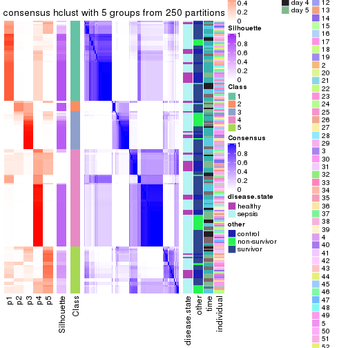</p>

</div>
<div id='tab-ATC-hclust-consensus-heatmap-5'>
<pre><code class="r">consensus_heatmap(res, k = 6)
</code></pre>

<p></p>

</div>
</div>

Heatmaps for the membership of samples in all partitions to see how consistent they are:


<script>
$( function() {
	$( '#tabs-ATC-hclust-membership-heatmap' ).tabs();
} );
</script>
<div id='tabs-ATC-hclust-membership-heatmap'>
<ul>
<li><a href='#tab-ATC-hclust-membership-heatmap-1'>k = 2</a></li>
<li><a href='#tab-ATC-hclust-membership-heatmap-2'>k = 3</a></li>
<li><a href='#tab-ATC-hclust-membership-heatmap-3'>k = 4</a></li>
<li><a href='#tab-ATC-hclust-membership-heatmap-4'>k = 5</a></li>
<li><a href='#tab-ATC-hclust-membership-heatmap-5'>k = 6</a></li>
</ul>
<div id='tab-ATC-hclust-membership-heatmap-1'>
<pre><code class="r">membership_heatmap(res, k = 2)
</code></pre>

<p></p>

</div>
<div id='tab-ATC-hclust-membership-heatmap-2'>
<pre><code class="r">membership_heatmap(res, k = 3)
</code></pre>

<p></p>

</div>
<div id='tab-ATC-hclust-membership-heatmap-3'>
<pre><code class="r">membership_heatmap(res, k = 4)
</code></pre>

<p></p>

</div>
<div id='tab-ATC-hclust-membership-heatmap-4'>
<pre><code class="r">membership_heatmap(res, k = 5)
</code></pre>

<p></p>

</div>
<div id='tab-ATC-hclust-membership-heatmap-5'>
<pre><code class="r">membership_heatmap(res, k = 6)
</code></pre>

<p></p>

</div>
</div>

As soon as we have had the classes for columns, we can look for signatures
which are significantly different between classes which can be candidate marks
for certain classes. Following are the heatmaps for signatures.


Signature heatmaps where rows are scaled:


<script>
$( function() {
	$( '#tabs-ATC-hclust-get-signatures' ).tabs();
} );
</script>
<div id='tabs-ATC-hclust-get-signatures'>
<ul>
<li><a href='#tab-ATC-hclust-get-signatures-1'>k = 2</a></li>
<li><a href='#tab-ATC-hclust-get-signatures-2'>k = 3</a></li>
<li><a href='#tab-ATC-hclust-get-signatures-3'>k = 4</a></li>
<li><a href='#tab-ATC-hclust-get-signatures-4'>k = 5</a></li>
<li><a href='#tab-ATC-hclust-get-signatures-5'>k = 6</a></li>
</ul>
<div id='tab-ATC-hclust-get-signatures-1'>
<pre><code class="r">get_signatures(res, k = 2)
</code></pre>

<p></p>

</div>
<div id='tab-ATC-hclust-get-signatures-2'>
<pre><code class="r">get_signatures(res, k = 3)
</code></pre>

<p></p>

</div>
<div id='tab-ATC-hclust-get-signatures-3'>
<pre><code class="r">get_signatures(res, k = 4)
</code></pre>

<p></p>

</div>
<div id='tab-ATC-hclust-get-signatures-4'>
<pre><code class="r">get_signatures(res, k = 5)
</code></pre>

<p></p>

</div>
<div id='tab-ATC-hclust-get-signatures-5'>
<pre><code class="r">get_signatures(res, k = 6)
</code></pre>

<p></p>

</div>
</div>


Signature heatmaps where rows are not scaled:


<script>
$( function() {
	$( '#tabs-ATC-hclust-get-signatures-no-scale' ).tabs();
} );
</script>
<div id='tabs-ATC-hclust-get-signatures-no-scale'>
<ul>
<li><a href='#tab-ATC-hclust-get-signatures-no-scale-1'>k = 2</a></li>
<li><a href='#tab-ATC-hclust-get-signatures-no-scale-2'>k = 3</a></li>
<li><a href='#tab-ATC-hclust-get-signatures-no-scale-3'>k = 4</a></li>
<li><a href='#tab-ATC-hclust-get-signatures-no-scale-4'>k = 5</a></li>
<li><a href='#tab-ATC-hclust-get-signatures-no-scale-5'>k = 6</a></li>
</ul>
<div id='tab-ATC-hclust-get-signatures-no-scale-1'>
<pre><code class="r">get_signatures(res, k = 2, scale_rows = FALSE)
</code></pre>

<p></p>

</div>
<div id='tab-ATC-hclust-get-signatures-no-scale-2'>
<pre><code class="r">get_signatures(res, k = 3, scale_rows = FALSE)
</code></pre>

<p></p>

</div>
<div id='tab-ATC-hclust-get-signatures-no-scale-3'>
<pre><code class="r">get_signatures(res, k = 4, scale_rows = FALSE)
</code></pre>

<p></p>

</div>
<div id='tab-ATC-hclust-get-signatures-no-scale-4'>
<pre><code class="r">get_signatures(res, k = 5, scale_rows = FALSE)
</code></pre>

<p></p>

</div>
<div id='tab-ATC-hclust-get-signatures-no-scale-5'>
<pre><code class="r">get_signatures(res, k = 6, scale_rows = FALSE)
</code></pre>

<p></p>

</div>
</div>


Compare the overlap of signatures from different k:

```r
compare_signatures(res)
```


`get_signature()` returns a data frame invisibly. TO get the list of signatures, the function
call should be assigned to a variable explicitly. In following code, if `plot` argument is set
to `FALSE`, no heatmap is plotted while only the differential analysis is performed.

```r
# code only for demonstration
tb = get_signature(res, k = ..., plot = FALSE)
```

An example of the output of `tb` is:

```
#>   which_row         fdr    mean_1    mean_2 scaled_mean_1 scaled_mean_2 km
#> 1        38 0.042760348  8.373488  9.131774    -0.5533452     0.5164555  1
#> 2        40 0.018707592  7.106213  8.469186    -0.6173731     0.5762149  1
#> 3        55 0.019134737 10.221463 11.207825    -0.6159697     0.5749050  1
#> 4        59 0.006059896  5.921854  7.869574    -0.6899429     0.6439467  1
#> 5        60 0.018055526  8.928898 10.211722    -0.6204761     0.5791110  1
#> 6        98 0.009384629 15.714769 14.887706     0.6635654    -0.6193277  2
...
```

The columns in `tb` are:

1. `which_row`: row indices corresponding to the input matrix.
2. `fdr`: FDR for the differential test. 
3. `mean_x`: The mean value in group x.
4. `scaled_mean_x`: The mean value in group x after rows are scaled.
5. `km`: Row groups if k-means clustering is applied to rows.


UMAP plot which shows how samples are separated.


<script>
$( function() {
	$( '#tabs-ATC-hclust-dimension-reduction' ).tabs();
} );
</script>
<div id='tabs-ATC-hclust-dimension-reduction'>
<ul>
<li><a href='#tab-ATC-hclust-dimension-reduction-1'>k = 2</a></li>
<li><a href='#tab-ATC-hclust-dimension-reduction-2'>k = 3</a></li>
<li><a href='#tab-ATC-hclust-dimension-reduction-3'>k = 4</a></li>
<li><a href='#tab-ATC-hclust-dimension-reduction-4'>k = 5</a></li>
<li><a href='#tab-ATC-hclust-dimension-reduction-5'>k = 6</a></li>
</ul>
<div id='tab-ATC-hclust-dimension-reduction-1'>
<pre><code class="r">dimension_reduction(res, k = 2, method = &quot;UMAP&quot;)
</code></pre>

<p></p>

</div>
<div id='tab-ATC-hclust-dimension-reduction-2'>
<pre><code class="r">dimension_reduction(res, k = 3, method = &quot;UMAP&quot;)
</code></pre>

<p></p>

</div>
<div id='tab-ATC-hclust-dimension-reduction-3'>
<pre><code class="r">dimension_reduction(res, k = 4, method = &quot;UMAP&quot;)
</code></pre>

<p></p>

</div>
<div id='tab-ATC-hclust-dimension-reduction-4'>
<pre><code class="r">dimension_reduction(res, k = 5, method = &quot;UMAP&quot;)
</code></pre>

<p></p>

</div>
<div id='tab-ATC-hclust-dimension-reduction-5'>
<pre><code class="r">dimension_reduction(res, k = 6, method = &quot;UMAP&quot;)
</code></pre>

<p></p>

</div>
</div>


Following heatmap shows how subgroups are split when increasing `k`:

```r
collect_classes(res)
```


Test correlation between subgroups and known annotations. If the known
annotation is numeric, one-way ANOVA test is applied, and if the known
annotation is discrete, chi-squared contingency table test is applied.

```r
test_to_known_factors(res)
```

```
#>              n disease.state(p) other(p) time(p) individual(p) k
#> ATC:hclust 154           0.5149   0.1561  0.9388         0.469 2
#> ATC:hclust 137           0.2186   0.1236  0.7331         0.206 3
#> ATC:hclust 129           0.2172   0.2864  0.2762         0.364 4
#> ATC:hclust 108           0.0370   0.1177  0.0261         0.577 5
#> ATC:hclust 127           0.0135   0.0317  0.0503         0.668 6
```


If matrix rows can be associated to genes, consider to use `functional_enrichment(res,
...)` to perform function enrichment for the signature genes. See [this vignette](http://bioconductor.org/packages/devel/bioc/vignettes/cola/inst/doc/functional_enrichment.html) for more detailed explanations.


 

---------------------------------------------------


### ATC:kmeans**


The object with results only for a single top-value method and a single partition method 
can be extracted as:

```r
res = res_list["ATC", "kmeans"]
# you can also extract it by
# res = res_list["ATC:kmeans"]
```

A summary of `res` and all the functions that can be applied to it:

```r
res
```

```
#> A 'ConsensusPartition' object with k = 2, 3, 4, 5, 6.
#>   On a matrix with 23598 rows and 163 columns.
#>   Top rows (1000, 2000, 3000, 4000, 5000) are extracted by 'ATC' method.
#>   Subgroups are detected by 'kmeans' method.
#>   Performed in total 1250 partitions by row resampling.
#>   Best k for subgroups seems to be 2.
#> 
#> Following methods can be applied to this 'ConsensusPartition' object:
#>  [1] "cola_report"             "collect_classes"         "collect_plots"          
#>  [4] "collect_stats"           "colnames"                "compare_signatures"     
#>  [7] "consensus_heatmap"       "dimension_reduction"     "functional_enrichment"  
#> [10] "get_anno_col"            "get_anno"                "get_classes"            
#> [13] "get_consensus"           "get_matrix"              "get_membership"         
#> [16] "get_param"               "get_signatures"          "get_stats"              
#> [19] "is_best_k"               "is_stable_k"             "membership_heatmap"     
#> [22] "ncol"                    "nrow"                    "plot_ecdf"              
#> [25] "rownames"                "select_partition_number" "show"                   
#> [28] "suggest_best_k"          "test_to_known_factors"
```

`collect_plots()` function collects all the plots made from `res` for all `k` (number of partitions)
into one single page to provide an easy and fast comparison between different `k`.

```r
collect_plots(res)
```


The plots are:

- The first row: a plot of the ECDF (empirical cumulative distribution
  function) curves of the consensus matrix for each `k` and the heatmap of
  predicted classes for each `k`.
- The second row: heatmaps of the consensus matrix for each `k`.
- The third row: heatmaps of the membership matrix for each `k`.
- The fouth row: heatmaps of the signatures for each `k`.

All the plots in panels can be made by individual functions and they are
plotted later in this section.

`select_partition_number()` produces several plots showing different
statistics for choosing "optimized" `k`. There are following statistics:

- ECDF curves of the consensus matrix for each `k`;
- 1-PAC. [The PAC
  score](https://en.wikipedia.org/wiki/Consensus_clustering#Over-interpretation_potential_of_consensus_clustering)
  measures the proportion of the ambiguous subgrouping.
- Mean silhouette score.
- Concordance. The mean probability of fiting the consensus class ids in all
  partitions.
- Area increased. Denote $A_k$ as the area under the ECDF curve for current
  `k`, the area increased is defined as $A_k - A_{k-1}$.
- Rand index. The percent of pairs of samples that are both in a same cluster
  or both are not in a same cluster in the partition of k and k-1.
- Jaccard index. The ratio of pairs of samples are both in a same cluster in
  the partition of k and k-1 and the pairs of samples are both in a same
  cluster in the partition k or k-1.

The detailed explanations of these statistics can be found in [the _cola_
vignette](http://bioconductor.org/packages/devel/bioc/vignettes/cola/inst/doc/cola.html#toc_13).

Generally speaking, lower PAC score, higher mean silhouette score or higher
concordance corresponds to better partition. Rand index and Jaccard index
measure how similar the current partition is compared to partition with `k-1`.
If they are too similar, we won't accept `k` is better than `k-1`.

```r
select_partition_number(res)
```


The numeric values for all these statistics can be obtained by `get_stats()`.

```r
get_stats(res)
```

```
#>   k 1-PAC mean_silhouette concordance area_increased  Rand Jaccard
#> 2 2 1.000           0.959       0.980         0.4144 0.592   0.592
#> 3 3 0.664           0.854       0.893         0.5679 0.704   0.518
#> 4 4 0.737           0.753       0.843         0.1275 0.820   0.534
#> 5 5 0.673           0.650       0.755         0.0653 0.952   0.815
#> 6 6 0.719           0.599       0.727         0.0509 0.934   0.714
```

`suggest_best_k()` suggests the best $k$ based on these statistics. The rules are as follows:

- All $k$ with Jaccard index larger than 0.95 are removed because increasing
  $k$ does not provide enough extra information. If all $k$ are removed, it is
  marked as no subgroup is detected.
- For all $k$ with 1-PAC score larger than 0.9, the maximal $k$ is taken as
  the best $k$, and other $k$ are marked as optional $k$.
- If it does not fit the second rule. The $k$ with the maximal vote of the
  highest 1-PAC score, highest mean silhouette, and highest concordance is
  taken as the best $k$.

```r
suggest_best_k(res)
```

```
#> [1] 2
```


Following shows the table of the partitions (You need to click the **show/hide
code output** link to see it). The membership matrix (columns with name `p*`)
is inferred by
[`clue::cl_consensus()`](https://www.rdocumentation.org/link/cl_consensus?package=clue)
function with the `SE` method. Basically the value in the membership matrix
represents the probability to belong to a certain group. The finall class
label for an item is determined with the group with highest probability it
belongs to.

In `get_classes()` function, the entropy is calculated from the membership
matrix and the silhouette score is calculated from the consensus matrix.


<script>
$( function() {
	$( '#tabs-ATC-kmeans-get-classes' ).tabs();
} );
</script>
<div id='tabs-ATC-kmeans-get-classes'>
<ul>
<li><a href='#tab-ATC-kmeans-get-classes-1'>k = 2</a></li>
<li><a href='#tab-ATC-kmeans-get-classes-2'>k = 3</a></li>
<li><a href='#tab-ATC-kmeans-get-classes-3'>k = 4</a></li>
<li><a href='#tab-ATC-kmeans-get-classes-4'>k = 5</a></li>
<li><a href='#tab-ATC-kmeans-get-classes-5'>k = 6</a></li>
</ul>

<div id='tab-ATC-kmeans-get-classes-1'>
<p><a id='tab-ATC-kmeans-get-classes-1-a' style='color:#0366d6' href='#'>show/hide code output</a></p>
<pre><code class="r">cbind(get_classes(res, k = 2), get_membership(res, k = 2))
</code></pre>

<pre><code>#&gt;            class entropy silhouette    p1    p2
#&gt; GSM1317945     1  0.0000      0.979 1.000 0.000
#&gt; GSM1317946     1  0.0000      0.979 1.000 0.000
#&gt; GSM1317947     2  0.0000      0.981 0.000 1.000
#&gt; GSM1317948     1  0.0938      0.979 0.988 0.012
#&gt; GSM1317949     1  0.8267      0.662 0.740 0.260
#&gt; GSM1317950     1  0.0938      0.979 0.988 0.012
#&gt; GSM1317953     1  0.0938      0.979 0.988 0.012
#&gt; GSM1317954     1  0.0938      0.979 0.988 0.012
#&gt; GSM1317955     1  0.0938      0.979 0.988 0.012
#&gt; GSM1317956     1  0.0938      0.979 0.988 0.012
#&gt; GSM1317957     1  0.8763      0.572 0.704 0.296
#&gt; GSM1317958     1  0.0938      0.979 0.988 0.012
#&gt; GSM1317959     1  0.0000      0.979 1.000 0.000
#&gt; GSM1317960     1  0.0938      0.979 0.988 0.012
#&gt; GSM1317961     2  0.0000      0.981 0.000 1.000
#&gt; GSM1317962     1  0.0000      0.979 1.000 0.000
#&gt; GSM1317963     1  0.0938      0.979 0.988 0.012
#&gt; GSM1317964     1  0.0938      0.979 0.988 0.012
#&gt; GSM1317965     2  0.0000      0.981 0.000 1.000
#&gt; GSM1317966     2  0.0000      0.981 0.000 1.000
#&gt; GSM1317967     1  0.0672      0.974 0.992 0.008
#&gt; GSM1317968     1  0.0938      0.979 0.988 0.012
#&gt; GSM1317969     1  0.9775      0.289 0.588 0.412
#&gt; GSM1317970     1  0.0000      0.979 1.000 0.000
#&gt; GSM1317952     1  0.0938      0.979 0.988 0.012
#&gt; GSM1317951     1  0.0938      0.979 0.988 0.012
#&gt; GSM1317971     2  0.0938      0.978 0.012 0.988
#&gt; GSM1317972     1  0.0000      0.979 1.000 0.000
#&gt; GSM1317973     1  0.0000      0.979 1.000 0.000
#&gt; GSM1317974     1  0.0000      0.979 1.000 0.000
#&gt; GSM1317975     1  0.0000      0.979 1.000 0.000
#&gt; GSM1317978     1  0.0938      0.979 0.988 0.012
#&gt; GSM1317979     1  0.0938      0.979 0.988 0.012
#&gt; GSM1317980     2  0.0000      0.981 0.000 1.000
#&gt; GSM1317981     1  0.0000      0.979 1.000 0.000
#&gt; GSM1317982     1  0.0000      0.979 1.000 0.000
#&gt; GSM1317983     1  0.0938      0.979 0.988 0.012
#&gt; GSM1317984     2  0.0000      0.981 0.000 1.000
#&gt; GSM1317985     2  0.0000      0.981 0.000 1.000
#&gt; GSM1317986     1  0.0938      0.979 0.988 0.012
#&gt; GSM1317987     1  0.0000      0.979 1.000 0.000
#&gt; GSM1317988     1  0.0000      0.979 1.000 0.000
#&gt; GSM1317989     1  0.0938      0.979 0.988 0.012
#&gt; GSM1317990     1  0.0000      0.979 1.000 0.000
#&gt; GSM1317991     2  0.0938      0.978 0.012 0.988
#&gt; GSM1317992     2  0.6973      0.784 0.188 0.812
#&gt; GSM1317993     1  0.0000      0.979 1.000 0.000
#&gt; GSM1317994     2  0.0000      0.981 0.000 1.000
#&gt; GSM1317977     1  0.0938      0.979 0.988 0.012
#&gt; GSM1317976     1  0.0938      0.979 0.988 0.012
#&gt; GSM1317995     2  0.0000      0.981 0.000 1.000
#&gt; GSM1317996     1  0.0000      0.979 1.000 0.000
#&gt; GSM1317997     2  0.0000      0.981 0.000 1.000
#&gt; GSM1317998     1  0.0938      0.979 0.988 0.012
#&gt; GSM1317999     1  0.0938      0.979 0.988 0.012
#&gt; GSM1318002     1  0.0000      0.979 1.000 0.000
#&gt; GSM1318003     1  0.0000      0.979 1.000 0.000
#&gt; GSM1318004     1  0.0000      0.979 1.000 0.000
#&gt; GSM1318005     1  0.0000      0.979 1.000 0.000
#&gt; GSM1318006     1  0.0938      0.979 0.988 0.012
#&gt; GSM1318007     1  0.0000      0.979 1.000 0.000
#&gt; GSM1318008     1  0.0938      0.979 0.988 0.012
#&gt; GSM1318009     1  0.0000      0.979 1.000 0.000
#&gt; GSM1318010     2  0.0000      0.981 0.000 1.000
#&gt; GSM1318011     1  0.0938      0.979 0.988 0.012
#&gt; GSM1318012     1  0.0938      0.979 0.988 0.012
#&gt; GSM1318013     1  0.0000      0.979 1.000 0.000
#&gt; GSM1318014     1  0.0938      0.979 0.988 0.012
#&gt; GSM1318015     1  0.0000      0.979 1.000 0.000
#&gt; GSM1318001     2  0.0000      0.981 0.000 1.000
#&gt; GSM1318000     1  0.0000      0.979 1.000 0.000
#&gt; GSM1318016     1  0.0000      0.979 1.000 0.000
#&gt; GSM1318017     1  0.0938      0.979 0.988 0.012
#&gt; GSM1318019     1  0.0000      0.979 1.000 0.000
#&gt; GSM1318020     2  0.0000      0.981 0.000 1.000
#&gt; GSM1318021     1  0.0000      0.979 1.000 0.000
#&gt; GSM1318022     2  0.0000      0.981 0.000 1.000
#&gt; GSM1318023     1  0.0938      0.979 0.988 0.012
#&gt; GSM1318024     1  0.0000      0.979 1.000 0.000
#&gt; GSM1318025     2  0.0938      0.978 0.012 0.988
#&gt; GSM1318026     2  0.7139      0.772 0.196 0.804
#&gt; GSM1318027     1  0.0000      0.979 1.000 0.000
#&gt; GSM1318028     1  0.0938      0.979 0.988 0.012
#&gt; GSM1318029     2  0.0000      0.981 0.000 1.000
#&gt; GSM1318018     1  0.0938      0.979 0.988 0.012
#&gt; GSM1318030     1  0.0672      0.974 0.992 0.008
#&gt; GSM1318031     2  0.0938      0.978 0.012 0.988
#&gt; GSM1318033     1  0.0938      0.979 0.988 0.012
#&gt; GSM1318034     2  0.0000      0.981 0.000 1.000
#&gt; GSM1318035     1  0.0000      0.979 1.000 0.000
#&gt; GSM1318036     1  0.0672      0.979 0.992 0.008
#&gt; GSM1318037     1  0.0000      0.979 1.000 0.000
#&gt; GSM1318038     2  0.7815      0.698 0.232 0.768
#&gt; GSM1318039     1  0.0938      0.979 0.988 0.012
#&gt; GSM1318040     2  0.0938      0.978 0.012 0.988
#&gt; GSM1318032     2  0.0938      0.978 0.012 0.988
#&gt; GSM1317914     2  0.0938      0.978 0.012 0.988
#&gt; GSM1317915     1  0.0938      0.979 0.988 0.012
#&gt; GSM1317916     1  0.0938      0.979 0.988 0.012
#&gt; GSM1317917     1  0.0938      0.979 0.988 0.012
#&gt; GSM1317918     1  0.0938      0.979 0.988 0.012
#&gt; GSM1317919     2  0.0938      0.978 0.012 0.988
#&gt; GSM1317920     2  0.0000      0.981 0.000 1.000
#&gt; GSM1317921     2  0.0938      0.978 0.012 0.988
#&gt; GSM1317922     2  0.0000      0.981 0.000 1.000
#&gt; GSM1317923     2  0.0000      0.981 0.000 1.000
#&gt; GSM1317924     2  0.0938      0.978 0.012 0.988
#&gt; GSM1317925     1  0.0000      0.979 1.000 0.000
#&gt; GSM1317926     2  0.0000      0.981 0.000 1.000
#&gt; GSM1317927     1  0.0000      0.979 1.000 0.000
#&gt; GSM1317928     1  0.0000      0.979 1.000 0.000
#&gt; GSM1317929     2  0.0000      0.981 0.000 1.000
#&gt; GSM1317930     1  0.0000      0.979 1.000 0.000
#&gt; GSM1317931     2  0.0938      0.978 0.012 0.988
#&gt; GSM1317932     1  0.0000      0.979 1.000 0.000
#&gt; GSM1317933     1  0.0000      0.979 1.000 0.000
#&gt; GSM1317934     1  0.0000      0.979 1.000 0.000
#&gt; GSM1317935     1  0.0672      0.979 0.992 0.008
#&gt; GSM1317936     2  0.0000      0.981 0.000 1.000
#&gt; GSM1317937     1  0.0938      0.979 0.988 0.012
#&gt; GSM1317938     1  0.0000      0.979 1.000 0.000
#&gt; GSM1317939     1  0.0000      0.979 1.000 0.000
#&gt; GSM1317940     1  0.0938      0.979 0.988 0.012
#&gt; GSM1317941     1  0.0000      0.979 1.000 0.000
#&gt; GSM1317942     1  0.0000      0.979 1.000 0.000
#&gt; GSM1317943     1  0.0000      0.979 1.000 0.000
#&gt; GSM1317944     1  0.0000      0.979 1.000 0.000
#&gt; GSM1317896     2  0.0000      0.981 0.000 1.000
#&gt; GSM1317897     1  0.0938      0.979 0.988 0.012
#&gt; GSM1317898     1  0.0938      0.979 0.988 0.012
#&gt; GSM1317899     1  0.0938      0.979 0.988 0.012
#&gt; GSM1317900     2  0.0000      0.981 0.000 1.000
#&gt; GSM1317901     1  0.0938      0.979 0.988 0.012
#&gt; GSM1317902     1  0.0938      0.979 0.988 0.012
#&gt; GSM1317903     1  0.0938      0.979 0.988 0.012
#&gt; GSM1317904     1  0.0000      0.979 1.000 0.000
#&gt; GSM1317905     1  0.0000      0.979 1.000 0.000
#&gt; GSM1317906     1  0.9815      0.264 0.580 0.420
#&gt; GSM1317907     1  0.0000      0.979 1.000 0.000
#&gt; GSM1317908     2  0.0000      0.981 0.000 1.000
#&gt; GSM1317909     1  0.1843      0.967 0.972 0.028
#&gt; GSM1317910     2  0.2236      0.952 0.036 0.964
#&gt; GSM1317911     1  0.0938      0.979 0.988 0.012
#&gt; GSM1317912     1  0.0000      0.979 1.000 0.000
#&gt; GSM1317913     1  0.0000      0.979 1.000 0.000
#&gt; GSM1318041     1  0.0938      0.979 0.988 0.012
#&gt; GSM1318042     2  0.0000      0.981 0.000 1.000
#&gt; GSM1318043     2  0.0000      0.981 0.000 1.000
#&gt; GSM1318044     1  0.0938      0.979 0.988 0.012
#&gt; GSM1318045     1  0.0938      0.979 0.988 0.012
#&gt; GSM1318046     1  0.0938      0.979 0.988 0.012
#&gt; GSM1318047     1  0.0938      0.979 0.988 0.012
#&gt; GSM1318048     2  0.0000      0.981 0.000 1.000
#&gt; GSM1318049     1  0.0938      0.979 0.988 0.012
#&gt; GSM1318050     1  0.0000      0.979 1.000 0.000
#&gt; GSM1318051     1  0.0000      0.979 1.000 0.000
#&gt; GSM1318052     1  0.0000      0.979 1.000 0.000
#&gt; GSM1318053     1  0.0000      0.979 1.000 0.000
#&gt; GSM1318054     1  0.8763      0.574 0.704 0.296
#&gt; GSM1318055     2  0.0938      0.978 0.012 0.988
#&gt; GSM1318056     2  0.0938      0.978 0.012 0.988
#&gt; GSM1318057     1  0.0000      0.979 1.000 0.000
#&gt; GSM1318058     2  0.0938      0.978 0.012 0.988
</code></pre>

<script>
$('#tab-ATC-kmeans-get-classes-1-a').parent().next().next().hide();
$('#tab-ATC-kmeans-get-classes-1-a').click(function(){
  $('#tab-ATC-kmeans-get-classes-1-a').parent().next().next().toggle();
  return(false);
});
</script>
</div>

<div id='tab-ATC-kmeans-get-classes-2'>
<p><a id='tab-ATC-kmeans-get-classes-2-a' style='color:#0366d6' href='#'>show/hide code output</a></p>
<pre><code class="r">cbind(get_classes(res, k = 3), get_membership(res, k = 3))
</code></pre>

<pre><code>#&gt;            class entropy silhouette    p1    p2    p3
#&gt; GSM1317945     2  0.5058      0.863 0.244 0.756 0.000
#&gt; GSM1317946     2  0.5733      0.778 0.324 0.676 0.000
#&gt; GSM1317947     3  0.0000      0.935 0.000 0.000 1.000
#&gt; GSM1317948     1  0.5058      0.742 0.756 0.244 0.000
#&gt; GSM1317949     1  0.5058      0.742 0.756 0.244 0.000
#&gt; GSM1317950     1  0.0000      0.906 1.000 0.000 0.000
#&gt; GSM1317953     1  0.0000      0.906 1.000 0.000 0.000
#&gt; GSM1317954     1  0.0000      0.906 1.000 0.000 0.000
#&gt; GSM1317955     1  0.0000      0.906 1.000 0.000 0.000
#&gt; GSM1317956     1  0.0000      0.906 1.000 0.000 0.000
#&gt; GSM1317957     2  0.0000      0.790 0.000 1.000 0.000
#&gt; GSM1317958     1  0.0000      0.906 1.000 0.000 0.000
#&gt; GSM1317959     2  0.5058      0.863 0.244 0.756 0.000
#&gt; GSM1317960     1  0.0000      0.906 1.000 0.000 0.000
#&gt; GSM1317961     3  0.0000      0.935 0.000 0.000 1.000
#&gt; GSM1317962     2  0.6126      0.660 0.400 0.600 0.000
#&gt; GSM1317963     1  0.1643      0.883 0.956 0.044 0.000
#&gt; GSM1317964     1  0.0000      0.906 1.000 0.000 0.000
#&gt; GSM1317965     3  0.0000      0.935 0.000 0.000 1.000
#&gt; GSM1317966     3  0.0000      0.935 0.000 0.000 1.000
#&gt; GSM1317967     2  0.0000      0.790 0.000 1.000 0.000
#&gt; GSM1317968     1  0.0000      0.906 1.000 0.000 0.000
#&gt; GSM1317969     2  0.0000      0.790 0.000 1.000 0.000
#&gt; GSM1317970     2  0.0000      0.790 0.000 1.000 0.000
#&gt; GSM1317952     1  0.4605      0.776 0.796 0.204 0.000
#&gt; GSM1317951     1  0.0000      0.906 1.000 0.000 0.000
#&gt; GSM1317971     3  0.5058      0.804 0.000 0.244 0.756
#&gt; GSM1317972     2  0.6274      0.544 0.456 0.544 0.000
#&gt; GSM1317973     2  0.5058      0.863 0.244 0.756 0.000
#&gt; GSM1317974     2  0.5706      0.783 0.320 0.680 0.000
#&gt; GSM1317975     2  0.5058      0.863 0.244 0.756 0.000
#&gt; GSM1317978     1  0.0000      0.906 1.000 0.000 0.000
#&gt; GSM1317979     1  0.5058      0.742 0.756 0.244 0.000
#&gt; GSM1317980     3  0.5058      0.804 0.000 0.244 0.756
#&gt; GSM1317981     2  0.5058      0.863 0.244 0.756 0.000
#&gt; GSM1317982     2  0.0000      0.790 0.000 1.000 0.000
#&gt; GSM1317983     1  0.0000      0.906 1.000 0.000 0.000
#&gt; GSM1317984     3  0.5058      0.804 0.000 0.244 0.756
#&gt; GSM1317985     3  0.0000      0.935 0.000 0.000 1.000
#&gt; GSM1317986     1  0.0000      0.906 1.000 0.000 0.000
#&gt; GSM1317987     2  0.5058      0.863 0.244 0.756 0.000
#&gt; GSM1317988     2  0.5058      0.863 0.244 0.756 0.000
#&gt; GSM1317989     1  0.5058      0.742 0.756 0.244 0.000
#&gt; GSM1317990     2  0.5058      0.863 0.244 0.756 0.000
#&gt; GSM1317991     3  0.0000      0.935 0.000 0.000 1.000
#&gt; GSM1317992     2  0.0000      0.790 0.000 1.000 0.000
#&gt; GSM1317993     2  0.5058      0.863 0.244 0.756 0.000
#&gt; GSM1317994     3  0.0000      0.935 0.000 0.000 1.000
#&gt; GSM1317977     1  0.0000      0.906 1.000 0.000 0.000
#&gt; GSM1317976     1  0.0000      0.906 1.000 0.000 0.000
#&gt; GSM1317995     3  0.0000      0.935 0.000 0.000 1.000
#&gt; GSM1317996     2  0.5058      0.863 0.244 0.756 0.000
#&gt; GSM1317997     3  0.0000      0.935 0.000 0.000 1.000
#&gt; GSM1317998     1  0.0000      0.906 1.000 0.000 0.000
#&gt; GSM1317999     1  0.1529      0.885 0.960 0.040 0.000
#&gt; GSM1318002     2  0.4931      0.860 0.232 0.768 0.000
#&gt; GSM1318003     2  0.5058      0.863 0.244 0.756 0.000
#&gt; GSM1318004     2  0.5058      0.863 0.244 0.756 0.000
#&gt; GSM1318005     2  0.5058      0.863 0.244 0.756 0.000
#&gt; GSM1318006     1  0.0000      0.906 1.000 0.000 0.000
#&gt; GSM1318007     2  0.0000      0.790 0.000 1.000 0.000
#&gt; GSM1318008     1  0.0000      0.906 1.000 0.000 0.000
#&gt; GSM1318009     2  0.5058      0.863 0.244 0.756 0.000
#&gt; GSM1318010     3  0.0000      0.935 0.000 0.000 1.000
#&gt; GSM1318011     1  0.0000      0.906 1.000 0.000 0.000
#&gt; GSM1318012     1  0.0000      0.906 1.000 0.000 0.000
#&gt; GSM1318013     2  0.0000      0.790 0.000 1.000 0.000
#&gt; GSM1318014     1  0.4842      0.761 0.776 0.224 0.000
#&gt; GSM1318015     2  0.4605      0.853 0.204 0.796 0.000
#&gt; GSM1318001     3  0.0000      0.935 0.000 0.000 1.000
#&gt; GSM1318000     2  0.5058      0.863 0.244 0.756 0.000
#&gt; GSM1318016     2  0.5058      0.863 0.244 0.756 0.000
#&gt; GSM1318017     1  0.0000      0.906 1.000 0.000 0.000
#&gt; GSM1318019     2  0.5058      0.863 0.244 0.756 0.000
#&gt; GSM1318020     3  0.5058      0.804 0.000 0.244 0.756
#&gt; GSM1318021     2  0.5058      0.863 0.244 0.756 0.000
#&gt; GSM1318022     3  0.4750      0.821 0.000 0.216 0.784
#&gt; GSM1318023     1  0.0000      0.906 1.000 0.000 0.000
#&gt; GSM1318024     2  0.5058      0.863 0.244 0.756 0.000
#&gt; GSM1318025     3  0.0000      0.935 0.000 0.000 1.000
#&gt; GSM1318026     2  0.0000      0.790 0.000 1.000 0.000
#&gt; GSM1318027     2  0.0000      0.790 0.000 1.000 0.000
#&gt; GSM1318028     1  0.0237      0.904 0.996 0.004 0.000
#&gt; GSM1318029     3  0.0000      0.935 0.000 0.000 1.000
#&gt; GSM1318018     1  0.0000      0.906 1.000 0.000 0.000
#&gt; GSM1318030     2  0.0000      0.790 0.000 1.000 0.000
#&gt; GSM1318031     3  0.0000      0.935 0.000 0.000 1.000
#&gt; GSM1318033     1  0.0000      0.906 1.000 0.000 0.000
#&gt; GSM1318034     3  0.5058      0.804 0.000 0.244 0.756
#&gt; GSM1318035     2  0.5058      0.863 0.244 0.756 0.000
#&gt; GSM1318036     2  0.5905      0.740 0.352 0.648 0.000
#&gt; GSM1318037     2  0.0000      0.790 0.000 1.000 0.000
#&gt; GSM1318038     3  0.5138      0.798 0.000 0.252 0.748
#&gt; GSM1318039     1  0.0000      0.906 1.000 0.000 0.000
#&gt; GSM1318040     3  0.0000      0.935 0.000 0.000 1.000
#&gt; GSM1318032     3  0.0000      0.935 0.000 0.000 1.000
#&gt; GSM1317914     3  0.0000      0.935 0.000 0.000 1.000
#&gt; GSM1317915     1  0.0237      0.904 0.996 0.004 0.000
#&gt; GSM1317916     1  0.4842      0.761 0.776 0.224 0.000
#&gt; GSM1317917     1  0.5058      0.742 0.756 0.244 0.000
#&gt; GSM1317918     1  0.2878      0.850 0.904 0.096 0.000
#&gt; GSM1317919     3  0.0000      0.935 0.000 0.000 1.000
#&gt; GSM1317920     3  0.0000      0.935 0.000 0.000 1.000
#&gt; GSM1317921     3  0.0000      0.935 0.000 0.000 1.000
#&gt; GSM1317922     3  0.0000      0.935 0.000 0.000 1.000
#&gt; GSM1317923     3  0.5058      0.804 0.000 0.244 0.756
#&gt; GSM1317924     3  0.0000      0.935 0.000 0.000 1.000
#&gt; GSM1317925     2  0.5058      0.863 0.244 0.756 0.000
#&gt; GSM1317926     3  0.0000      0.935 0.000 0.000 1.000
#&gt; GSM1317927     2  0.5058      0.863 0.244 0.756 0.000
#&gt; GSM1317928     2  0.0000      0.790 0.000 1.000 0.000
#&gt; GSM1317929     3  0.0000      0.935 0.000 0.000 1.000
#&gt; GSM1317930     2  0.5058      0.863 0.244 0.756 0.000
#&gt; GSM1317931     3  0.5058      0.804 0.000 0.244 0.756
#&gt; GSM1317932     2  0.0000      0.790 0.000 1.000 0.000
#&gt; GSM1317933     2  0.5058      0.863 0.244 0.756 0.000
#&gt; GSM1317934     2  0.0000      0.790 0.000 1.000 0.000
#&gt; GSM1317935     2  0.0000      0.790 0.000 1.000 0.000
#&gt; GSM1317936     3  0.0000      0.935 0.000 0.000 1.000
#&gt; GSM1317937     1  0.0000      0.906 1.000 0.000 0.000
#&gt; GSM1317938     2  0.5058      0.863 0.244 0.756 0.000
#&gt; GSM1317939     2  0.5058      0.863 0.244 0.756 0.000
#&gt; GSM1317940     1  0.3752      0.818 0.856 0.144 0.000
#&gt; GSM1317941     2  0.5058      0.863 0.244 0.756 0.000
#&gt; GSM1317942     2  0.5058      0.863 0.244 0.756 0.000
#&gt; GSM1317943     2  0.5058      0.863 0.244 0.756 0.000
#&gt; GSM1317944     2  0.5058      0.863 0.244 0.756 0.000
#&gt; GSM1317896     3  0.0000      0.935 0.000 0.000 1.000
#&gt; GSM1317897     1  0.0000      0.906 1.000 0.000 0.000
#&gt; GSM1317898     1  0.0000      0.906 1.000 0.000 0.000
#&gt; GSM1317899     1  0.0000      0.906 1.000 0.000 0.000
#&gt; GSM1317900     3  0.0000      0.935 0.000 0.000 1.000
#&gt; GSM1317901     1  0.5058      0.742 0.756 0.244 0.000
#&gt; GSM1317902     1  0.0000      0.906 1.000 0.000 0.000
#&gt; GSM1317903     1  0.0000      0.906 1.000 0.000 0.000
#&gt; GSM1317904     2  0.5058      0.863 0.244 0.756 0.000
#&gt; GSM1317905     2  0.0000      0.790 0.000 1.000 0.000
#&gt; GSM1317906     2  0.0000      0.790 0.000 1.000 0.000
#&gt; GSM1317907     2  0.0000      0.790 0.000 1.000 0.000
#&gt; GSM1317908     3  0.5016      0.807 0.000 0.240 0.760
#&gt; GSM1317909     1  0.5058      0.742 0.756 0.244 0.000
#&gt; GSM1317910     1  0.6965      0.681 0.696 0.244 0.060
#&gt; GSM1317911     1  0.0000      0.906 1.000 0.000 0.000
#&gt; GSM1317912     2  0.5058      0.863 0.244 0.756 0.000
#&gt; GSM1317913     2  0.5058      0.863 0.244 0.756 0.000
#&gt; GSM1318041     1  0.5058      0.742 0.756 0.244 0.000
#&gt; GSM1318042     3  0.5058      0.804 0.000 0.244 0.756
#&gt; GSM1318043     3  0.0000      0.935 0.000 0.000 1.000
#&gt; GSM1318044     1  0.0000      0.906 1.000 0.000 0.000
#&gt; GSM1318045     1  0.0000      0.906 1.000 0.000 0.000
#&gt; GSM1318046     1  0.0000      0.906 1.000 0.000 0.000
#&gt; GSM1318047     1  0.0000      0.906 1.000 0.000 0.000
#&gt; GSM1318048     1  0.9463      0.329 0.500 0.244 0.256
#&gt; GSM1318049     1  0.5058      0.742 0.756 0.244 0.000
#&gt; GSM1318050     2  0.5058      0.863 0.244 0.756 0.000
#&gt; GSM1318051     2  0.5058      0.863 0.244 0.756 0.000
#&gt; GSM1318052     2  0.0000      0.790 0.000 1.000 0.000
#&gt; GSM1318053     2  0.0000      0.790 0.000 1.000 0.000
#&gt; GSM1318054     2  0.0000      0.790 0.000 1.000 0.000
#&gt; GSM1318055     3  0.0000      0.935 0.000 0.000 1.000
#&gt; GSM1318056     2  0.0747      0.777 0.000 0.984 0.016
#&gt; GSM1318057     2  0.0000      0.790 0.000 1.000 0.000
#&gt; GSM1318058     3  0.0000      0.935 0.000 0.000 1.000
</code></pre>

<script>
$('#tab-ATC-kmeans-get-classes-2-a').parent().next().next().hide();
$('#tab-ATC-kmeans-get-classes-2-a').click(function(){
  $('#tab-ATC-kmeans-get-classes-2-a').parent().next().next().toggle();
  return(false);
});
</script>
</div>

<div id='tab-ATC-kmeans-get-classes-3'>
<p><a id='tab-ATC-kmeans-get-classes-3-a' style='color:#0366d6' href='#'>show/hide code output</a></p>
<pre><code class="r">cbind(get_classes(res, k = 4), get_membership(res, k = 4))
</code></pre>

<pre><code>#&gt;            class entropy silhouette    p1    p2    p3    p4
#&gt; GSM1317945     2  0.0376     0.9270 0.004 0.992 0.000 0.004
#&gt; GSM1317946     2  0.2385     0.8470 0.028 0.920 0.000 0.052
#&gt; GSM1317947     3  0.5062     0.6275 0.024 0.000 0.692 0.284
#&gt; GSM1317948     4  0.4679     0.2281 0.352 0.000 0.000 0.648
#&gt; GSM1317949     4  0.4086     0.4348 0.216 0.000 0.008 0.776
#&gt; GSM1317950     1  0.1940     0.9052 0.924 0.076 0.000 0.000
#&gt; GSM1317953     1  0.3383     0.8888 0.872 0.076 0.000 0.052
#&gt; GSM1317954     1  0.3383     0.8888 0.872 0.076 0.000 0.052
#&gt; GSM1317955     1  0.4285     0.8761 0.820 0.076 0.000 0.104
#&gt; GSM1317956     1  0.1940     0.9052 0.924 0.076 0.000 0.000
#&gt; GSM1317957     4  0.5112     0.4763 0.004 0.436 0.000 0.560
#&gt; GSM1317958     1  0.1557     0.9005 0.944 0.056 0.000 0.000
#&gt; GSM1317959     2  0.2053     0.8808 0.004 0.924 0.000 0.072
#&gt; GSM1317960     1  0.3099     0.8518 0.876 0.020 0.000 0.104
#&gt; GSM1317961     3  0.1284     0.9341 0.024 0.000 0.964 0.012
#&gt; GSM1317962     2  0.6286     0.2043 0.384 0.552 0.000 0.064
#&gt; GSM1317963     1  0.3908     0.7715 0.784 0.004 0.000 0.212
#&gt; GSM1317964     1  0.3383     0.8888 0.872 0.076 0.000 0.052
#&gt; GSM1317965     3  0.0817     0.9430 0.024 0.000 0.976 0.000
#&gt; GSM1317966     3  0.0188     0.9416 0.004 0.000 0.996 0.000
#&gt; GSM1317967     4  0.5132     0.4560 0.004 0.448 0.000 0.548
#&gt; GSM1317968     1  0.3464     0.8870 0.868 0.076 0.000 0.056
#&gt; GSM1317969     4  0.3052     0.6189 0.004 0.136 0.000 0.860
#&gt; GSM1317970     4  0.5396     0.4227 0.012 0.464 0.000 0.524
#&gt; GSM1317952     1  0.4624     0.5708 0.660 0.000 0.000 0.340
#&gt; GSM1317951     1  0.4285     0.8761 0.820 0.076 0.000 0.104
#&gt; GSM1317971     4  0.5206     0.3628 0.024 0.000 0.308 0.668
#&gt; GSM1317972     2  0.5917     0.3602 0.320 0.624 0.000 0.056
#&gt; GSM1317973     2  0.3015     0.8138 0.024 0.884 0.000 0.092
#&gt; GSM1317974     2  0.2363     0.8486 0.024 0.920 0.000 0.056
#&gt; GSM1317975     2  0.0188     0.9277 0.000 0.996 0.000 0.004
#&gt; GSM1317978     1  0.3533     0.8850 0.864 0.080 0.000 0.056
#&gt; GSM1317979     4  0.3837     0.4745 0.224 0.000 0.000 0.776
#&gt; GSM1317980     4  0.5088     0.3469 0.024 0.000 0.288 0.688
#&gt; GSM1317981     2  0.0188     0.9277 0.000 0.996 0.000 0.004
#&gt; GSM1317982     4  0.3401     0.6160 0.008 0.152 0.000 0.840
#&gt; GSM1317983     1  0.1940     0.9052 0.924 0.076 0.000 0.000
#&gt; GSM1317984     4  0.5620     0.1365 0.024 0.000 0.416 0.560
#&gt; GSM1317985     3  0.0817     0.9430 0.024 0.000 0.976 0.000
#&gt; GSM1317986     1  0.1940     0.9052 0.924 0.076 0.000 0.000
#&gt; GSM1317987     2  0.0188     0.9277 0.000 0.996 0.000 0.004
#&gt; GSM1317988     2  0.3015     0.8138 0.024 0.884 0.000 0.092
#&gt; GSM1317989     4  0.2973     0.5248 0.144 0.000 0.000 0.856
#&gt; GSM1317990     2  0.0000     0.9294 0.000 1.000 0.000 0.000
#&gt; GSM1317991     3  0.1406     0.9327 0.024 0.000 0.960 0.016
#&gt; GSM1317992     4  0.5112     0.4763 0.004 0.436 0.000 0.560
#&gt; GSM1317993     2  0.0000     0.9294 0.000 1.000 0.000 0.000
#&gt; GSM1317994     3  0.0817     0.9430 0.024 0.000 0.976 0.000
#&gt; GSM1317977     1  0.3176     0.8658 0.880 0.036 0.000 0.084
#&gt; GSM1317976     1  0.4428     0.8688 0.808 0.068 0.000 0.124
#&gt; GSM1317995     3  0.0817     0.9430 0.024 0.000 0.976 0.000
#&gt; GSM1317996     2  0.2081     0.8624 0.000 0.916 0.000 0.084
#&gt; GSM1317997     3  0.0817     0.9430 0.024 0.000 0.976 0.000
#&gt; GSM1317998     1  0.1940     0.9052 0.924 0.076 0.000 0.000
#&gt; GSM1317999     1  0.1637     0.8684 0.940 0.000 0.000 0.060
#&gt; GSM1318002     2  0.1059     0.9078 0.012 0.972 0.000 0.016
#&gt; GSM1318003     2  0.0000     0.9294 0.000 1.000 0.000 0.000
#&gt; GSM1318004     2  0.3080     0.8120 0.024 0.880 0.000 0.096
#&gt; GSM1318005     2  0.0707     0.9209 0.000 0.980 0.000 0.020
#&gt; GSM1318006     1  0.1940     0.9052 0.924 0.076 0.000 0.000
#&gt; GSM1318007     4  0.5436     0.5316 0.024 0.356 0.000 0.620
#&gt; GSM1318008     1  0.1940     0.9052 0.924 0.076 0.000 0.000
#&gt; GSM1318009     2  0.0000     0.9294 0.000 1.000 0.000 0.000
#&gt; GSM1318010     3  0.0895     0.9377 0.020 0.000 0.976 0.004
#&gt; GSM1318011     1  0.2831     0.8373 0.876 0.004 0.000 0.120
#&gt; GSM1318012     1  0.3245     0.8774 0.880 0.056 0.000 0.064
#&gt; GSM1318013     4  0.5536     0.5083 0.024 0.384 0.000 0.592
#&gt; GSM1318014     1  0.4454     0.6129 0.692 0.000 0.000 0.308
#&gt; GSM1318015     2  0.2197     0.8488 0.024 0.928 0.000 0.048
#&gt; GSM1318001     3  0.0817     0.9430 0.024 0.000 0.976 0.000
#&gt; GSM1318000     2  0.0000     0.9294 0.000 1.000 0.000 0.000
#&gt; GSM1318016     2  0.0000     0.9294 0.000 1.000 0.000 0.000
#&gt; GSM1318017     1  0.1940     0.9052 0.924 0.076 0.000 0.000
#&gt; GSM1318019     2  0.0188     0.9276 0.004 0.996 0.000 0.000
#&gt; GSM1318020     4  0.5663     0.0781 0.024 0.000 0.440 0.536
#&gt; GSM1318021     2  0.0000     0.9294 0.000 1.000 0.000 0.000
#&gt; GSM1318022     3  0.5780     0.0702 0.028 0.000 0.496 0.476
#&gt; GSM1318023     1  0.1940     0.9052 0.924 0.076 0.000 0.000
#&gt; GSM1318024     2  0.0000     0.9294 0.000 1.000 0.000 0.000
#&gt; GSM1318025     3  0.1833     0.9292 0.024 0.000 0.944 0.032
#&gt; GSM1318026     4  0.5147     0.4388 0.004 0.460 0.000 0.536
#&gt; GSM1318027     4  0.5281     0.4250 0.008 0.464 0.000 0.528
#&gt; GSM1318028     1  0.3591     0.8379 0.824 0.008 0.000 0.168
#&gt; GSM1318029     3  0.1629     0.9303 0.024 0.000 0.952 0.024
#&gt; GSM1318018     1  0.1940     0.9052 0.924 0.076 0.000 0.000
#&gt; GSM1318030     4  0.4741     0.5584 0.004 0.328 0.000 0.668
#&gt; GSM1318031     3  0.1833     0.9292 0.024 0.000 0.944 0.032
#&gt; GSM1318033     1  0.2742     0.8987 0.900 0.076 0.000 0.024
#&gt; GSM1318034     4  0.4955     0.3743 0.024 0.000 0.268 0.708
#&gt; GSM1318035     2  0.0000     0.9294 0.000 1.000 0.000 0.000
#&gt; GSM1318036     1  0.7858    -0.0501 0.396 0.316 0.000 0.288
#&gt; GSM1318037     4  0.5110     0.5556 0.016 0.328 0.000 0.656
#&gt; GSM1318038     4  0.2799     0.5532 0.008 0.000 0.108 0.884
#&gt; GSM1318039     1  0.1940     0.9052 0.924 0.076 0.000 0.000
#&gt; GSM1318040     3  0.1833     0.9292 0.024 0.000 0.944 0.032
#&gt; GSM1318032     3  0.1833     0.9292 0.024 0.000 0.944 0.032
#&gt; GSM1317914     3  0.1629     0.9303 0.024 0.000 0.952 0.024
#&gt; GSM1317915     1  0.2266     0.8631 0.912 0.004 0.000 0.084
#&gt; GSM1317916     1  0.2216     0.8579 0.908 0.000 0.000 0.092
#&gt; GSM1317917     4  0.3528     0.5218 0.192 0.000 0.000 0.808
#&gt; GSM1317918     1  0.3494     0.8321 0.824 0.004 0.000 0.172
#&gt; GSM1317919     3  0.1406     0.9338 0.024 0.000 0.960 0.016
#&gt; GSM1317920     3  0.1629     0.9303 0.024 0.000 0.952 0.024
#&gt; GSM1317921     3  0.1629     0.9303 0.024 0.000 0.952 0.024
#&gt; GSM1317922     3  0.1520     0.9409 0.024 0.000 0.956 0.020
#&gt; GSM1317923     4  0.5600     0.2161 0.028 0.000 0.376 0.596
#&gt; GSM1317924     3  0.1833     0.9292 0.024 0.000 0.944 0.032
#&gt; GSM1317925     2  0.0000     0.9294 0.000 1.000 0.000 0.000
#&gt; GSM1317926     3  0.0895     0.9389 0.004 0.000 0.976 0.020
#&gt; GSM1317927     2  0.0000     0.9294 0.000 1.000 0.000 0.000
#&gt; GSM1317928     4  0.5203     0.5015 0.008 0.416 0.000 0.576
#&gt; GSM1317929     3  0.1004     0.9424 0.024 0.000 0.972 0.004
#&gt; GSM1317930     2  0.0000     0.9294 0.000 1.000 0.000 0.000
#&gt; GSM1317931     4  0.4095     0.5083 0.024 0.000 0.172 0.804
#&gt; GSM1317932     4  0.5193     0.5039 0.008 0.412 0.000 0.580
#&gt; GSM1317933     2  0.0000     0.9294 0.000 1.000 0.000 0.000
#&gt; GSM1317934     4  0.5193     0.5039 0.008 0.412 0.000 0.580
#&gt; GSM1317935     4  0.2781     0.6230 0.008 0.072 0.016 0.904
#&gt; GSM1317936     3  0.0707     0.9387 0.020 0.000 0.980 0.000
#&gt; GSM1317937     1  0.1940     0.9052 0.924 0.076 0.000 0.000
#&gt; GSM1317938     2  0.0000     0.9294 0.000 1.000 0.000 0.000
#&gt; GSM1317939     2  0.0000     0.9294 0.000 1.000 0.000 0.000
#&gt; GSM1317940     1  0.3569     0.8178 0.804 0.000 0.000 0.196
#&gt; GSM1317941     2  0.1042     0.9190 0.008 0.972 0.000 0.020
#&gt; GSM1317942     2  0.0000     0.9294 0.000 1.000 0.000 0.000
#&gt; GSM1317943     2  0.0000     0.9294 0.000 1.000 0.000 0.000
#&gt; GSM1317944     2  0.0000     0.9294 0.000 1.000 0.000 0.000
#&gt; GSM1317896     3  0.0817     0.9430 0.024 0.000 0.976 0.000
#&gt; GSM1317897     1  0.3383     0.8888 0.872 0.076 0.000 0.052
#&gt; GSM1317898     1  0.2565     0.8996 0.912 0.056 0.000 0.032
#&gt; GSM1317899     1  0.1940     0.9052 0.924 0.076 0.000 0.000
#&gt; GSM1317900     3  0.0817     0.9430 0.024 0.000 0.976 0.000
#&gt; GSM1317901     1  0.4250     0.6530 0.724 0.000 0.000 0.276
#&gt; GSM1317902     1  0.1940     0.9052 0.924 0.076 0.000 0.000
#&gt; GSM1317903     1  0.1940     0.9052 0.924 0.076 0.000 0.000
#&gt; GSM1317904     2  0.0707     0.9209 0.000 0.980 0.000 0.020
#&gt; GSM1317905     4  0.5193     0.5039 0.008 0.412 0.000 0.580
#&gt; GSM1317906     4  0.5060     0.5042 0.004 0.412 0.000 0.584
#&gt; GSM1317907     4  0.5452     0.5316 0.024 0.360 0.000 0.616
#&gt; GSM1317908     4  0.5523     0.1825 0.024 0.000 0.380 0.596
#&gt; GSM1317909     4  0.4040     0.4229 0.248 0.000 0.000 0.752
#&gt; GSM1317910     4  0.4332     0.5159 0.176 0.000 0.032 0.792
#&gt; GSM1317911     1  0.1940     0.9052 0.924 0.076 0.000 0.000
#&gt; GSM1317912     2  0.4744     0.5804 0.024 0.736 0.000 0.240
#&gt; GSM1317913     2  0.1724     0.8989 0.020 0.948 0.000 0.032
#&gt; GSM1318041     4  0.3444     0.5261 0.184 0.000 0.000 0.816
#&gt; GSM1318042     4  0.5560     0.1877 0.024 0.000 0.392 0.584
#&gt; GSM1318043     3  0.0707     0.9387 0.020 0.000 0.980 0.000
#&gt; GSM1318044     1  0.1940     0.9052 0.924 0.076 0.000 0.000
#&gt; GSM1318045     1  0.1940     0.9052 0.924 0.076 0.000 0.000
#&gt; GSM1318046     1  0.1940     0.9052 0.924 0.076 0.000 0.000
#&gt; GSM1318047     1  0.2987     0.8512 0.880 0.016 0.000 0.104
#&gt; GSM1318048     4  0.4701     0.5309 0.164 0.000 0.056 0.780
#&gt; GSM1318049     1  0.4907     0.4224 0.580 0.000 0.000 0.420
#&gt; GSM1318050     2  0.0707     0.9209 0.000 0.980 0.000 0.020
#&gt; GSM1318051     2  0.0707     0.9209 0.000 0.980 0.000 0.020
#&gt; GSM1318052     4  0.5285     0.4158 0.008 0.468 0.000 0.524
#&gt; GSM1318053     4  0.5281     0.4250 0.008 0.464 0.000 0.528
#&gt; GSM1318054     4  0.5088     0.4921 0.004 0.424 0.000 0.572
#&gt; GSM1318055     3  0.0817     0.9430 0.024 0.000 0.976 0.000
#&gt; GSM1318056     4  0.6354     0.4645 0.024 0.428 0.024 0.524
#&gt; GSM1318057     4  0.5273     0.4400 0.008 0.456 0.000 0.536
#&gt; GSM1318058     3  0.2174     0.9041 0.020 0.000 0.928 0.052
</code></pre>

<script>
$('#tab-ATC-kmeans-get-classes-3-a').parent().next().next().hide();
$('#tab-ATC-kmeans-get-classes-3-a').click(function(){
  $('#tab-ATC-kmeans-get-classes-3-a').parent().next().next().toggle();
  return(false);
});
</script>
</div>

<div id='tab-ATC-kmeans-get-classes-4'>
<p><a id='tab-ATC-kmeans-get-classes-4-a' style='color:#0366d6' href='#'>show/hide code output</a></p>
<pre><code class="r">cbind(get_classes(res, k = 5), get_membership(res, k = 5))
</code></pre>

<pre><code>#&gt;            class entropy silhouette    p1    p2    p3    p4    p5
#&gt; GSM1317945     2  0.2230   0.828337 0.000 0.912 0.000 0.044 0.044
#&gt; GSM1317946     2  0.4444   0.725768 0.104 0.788 0.000 0.020 0.088
#&gt; GSM1317947     5  0.6171  -0.000584 0.004 0.000 0.416 0.116 0.464
#&gt; GSM1317948     5  0.6834   0.318792 0.256 0.004 0.000 0.320 0.420
#&gt; GSM1317949     5  0.5658   0.443177 0.096 0.000 0.000 0.332 0.572
#&gt; GSM1317950     1  0.1877   0.806984 0.924 0.064 0.000 0.000 0.012
#&gt; GSM1317953     1  0.4138   0.767235 0.776 0.064 0.000 0.000 0.160
#&gt; GSM1317954     1  0.4215   0.766113 0.768 0.064 0.000 0.000 0.168
#&gt; GSM1317955     1  0.4589   0.752496 0.724 0.064 0.000 0.000 0.212
#&gt; GSM1317956     1  0.1877   0.806984 0.924 0.064 0.000 0.000 0.012
#&gt; GSM1317957     4  0.3750   0.729777 0.000 0.232 0.000 0.756 0.012
#&gt; GSM1317958     1  0.2278   0.784830 0.908 0.032 0.000 0.000 0.060
#&gt; GSM1317959     2  0.4749   0.676401 0.004 0.736 0.000 0.172 0.088
#&gt; GSM1317960     1  0.5249   0.642528 0.692 0.012 0.000 0.084 0.212
#&gt; GSM1317961     3  0.3551   0.774366 0.008 0.000 0.772 0.000 0.220
#&gt; GSM1317962     2  0.7926   0.001270 0.288 0.380 0.000 0.080 0.252
#&gt; GSM1317963     1  0.6777   0.210280 0.428 0.004 0.000 0.232 0.336
#&gt; GSM1317964     1  0.4098   0.768999 0.780 0.064 0.000 0.000 0.156
#&gt; GSM1317965     3  0.0000   0.804063 0.000 0.000 1.000 0.000 0.000
#&gt; GSM1317966     3  0.3419   0.789131 0.016 0.000 0.804 0.000 0.180
#&gt; GSM1317967     4  0.3395   0.730485 0.000 0.236 0.000 0.764 0.000
#&gt; GSM1317968     1  0.4289   0.765636 0.760 0.064 0.000 0.000 0.176
#&gt; GSM1317969     4  0.2370   0.531088 0.000 0.040 0.000 0.904 0.056
#&gt; GSM1317970     4  0.4096   0.712375 0.004 0.260 0.000 0.724 0.012
#&gt; GSM1317952     1  0.6697   0.228713 0.456 0.004 0.000 0.220 0.320
#&gt; GSM1317951     1  0.4830   0.744360 0.684 0.060 0.000 0.000 0.256
#&gt; GSM1317971     4  0.5779   0.087473 0.000 0.000 0.172 0.616 0.212
#&gt; GSM1317972     2  0.6905   0.226544 0.276 0.492 0.000 0.020 0.212
#&gt; GSM1317973     2  0.5037   0.639695 0.016 0.724 0.000 0.180 0.080
#&gt; GSM1317974     2  0.4781   0.708277 0.092 0.760 0.000 0.020 0.128
#&gt; GSM1317975     2  0.1605   0.846963 0.004 0.944 0.000 0.040 0.012
#&gt; GSM1317978     1  0.5094   0.748843 0.724 0.080 0.000 0.020 0.176
#&gt; GSM1317979     4  0.6024  -0.392415 0.116 0.000 0.000 0.472 0.412
#&gt; GSM1317980     5  0.6599   0.448428 0.000 0.000 0.268 0.268 0.464
#&gt; GSM1317981     2  0.1605   0.846963 0.004 0.944 0.000 0.040 0.012
#&gt; GSM1317982     4  0.2376   0.542435 0.000 0.052 0.000 0.904 0.044
#&gt; GSM1317983     1  0.1877   0.806984 0.924 0.064 0.000 0.000 0.012
#&gt; GSM1317984     5  0.6695   0.247479 0.000 0.000 0.368 0.240 0.392
#&gt; GSM1317985     3  0.0000   0.804063 0.000 0.000 1.000 0.000 0.000
#&gt; GSM1317986     1  0.1877   0.806984 0.924 0.064 0.000 0.000 0.012
#&gt; GSM1317987     2  0.1605   0.846963 0.004 0.944 0.000 0.040 0.012
#&gt; GSM1317988     2  0.4935   0.616899 0.012 0.720 0.000 0.200 0.068
#&gt; GSM1317989     4  0.5687  -0.353576 0.080 0.000 0.000 0.484 0.436
#&gt; GSM1317990     2  0.1492   0.847061 0.004 0.948 0.000 0.040 0.008
#&gt; GSM1317991     3  0.3336   0.772412 0.000 0.000 0.772 0.000 0.228
#&gt; GSM1317992     4  0.3779   0.728081 0.000 0.236 0.000 0.752 0.012
#&gt; GSM1317993     2  0.1153   0.852474 0.004 0.964 0.000 0.024 0.008
#&gt; GSM1317994     3  0.0000   0.804063 0.000 0.000 1.000 0.000 0.000
#&gt; GSM1317977     1  0.5863   0.628842 0.652 0.036 0.000 0.084 0.228
#&gt; GSM1317976     1  0.6090   0.657873 0.544 0.056 0.000 0.036 0.364
#&gt; GSM1317995     3  0.0000   0.804063 0.000 0.000 1.000 0.000 0.000
#&gt; GSM1317996     2  0.3819   0.694197 0.004 0.772 0.000 0.208 0.016
#&gt; GSM1317997     3  0.0000   0.804063 0.000 0.000 1.000 0.000 0.000
#&gt; GSM1317998     1  0.1764   0.807054 0.928 0.064 0.000 0.000 0.008
#&gt; GSM1317999     1  0.3523   0.728801 0.824 0.004 0.000 0.032 0.140
#&gt; GSM1318002     2  0.2177   0.810476 0.004 0.908 0.000 0.080 0.008
#&gt; GSM1318003     2  0.0865   0.853249 0.000 0.972 0.000 0.024 0.004
#&gt; GSM1318004     2  0.5668   0.547805 0.016 0.664 0.000 0.204 0.116
#&gt; GSM1318005     2  0.2580   0.819925 0.000 0.892 0.000 0.064 0.044
#&gt; GSM1318006     1  0.2193   0.807375 0.912 0.060 0.000 0.000 0.028
#&gt; GSM1318007     4  0.5648   0.597992 0.004 0.196 0.000 0.648 0.152
#&gt; GSM1318008     1  0.2037   0.806068 0.920 0.064 0.000 0.004 0.012
#&gt; GSM1318009     2  0.2152   0.832768 0.004 0.920 0.000 0.032 0.044
#&gt; GSM1318010     3  0.2773   0.793627 0.000 0.000 0.836 0.000 0.164
#&gt; GSM1318011     1  0.5527   0.579287 0.660 0.004 0.000 0.136 0.200
#&gt; GSM1318012     1  0.5785   0.667686 0.672 0.056 0.000 0.064 0.208
#&gt; GSM1318013     4  0.6011   0.579561 0.004 0.220 0.000 0.600 0.176
#&gt; GSM1318014     1  0.6366   0.358876 0.528 0.004 0.000 0.176 0.292
#&gt; GSM1318015     2  0.2463   0.785173 0.004 0.888 0.000 0.100 0.008
#&gt; GSM1318001     3  0.0162   0.802973 0.000 0.000 0.996 0.000 0.004
#&gt; GSM1318000     2  0.1285   0.845120 0.004 0.956 0.000 0.004 0.036
#&gt; GSM1318016     2  0.1492   0.847061 0.004 0.948 0.000 0.040 0.008
#&gt; GSM1318017     1  0.1638   0.807456 0.932 0.064 0.000 0.000 0.004
#&gt; GSM1318019     2  0.0865   0.852978 0.004 0.972 0.000 0.024 0.000
#&gt; GSM1318020     3  0.6460  -0.114501 0.000 0.000 0.412 0.180 0.408
#&gt; GSM1318021     2  0.1153   0.852474 0.004 0.964 0.000 0.024 0.008
#&gt; GSM1318022     3  0.6641   0.066782 0.016 0.000 0.440 0.140 0.404
#&gt; GSM1318023     1  0.1478   0.807632 0.936 0.064 0.000 0.000 0.000
#&gt; GSM1318024     2  0.1492   0.847061 0.004 0.948 0.000 0.040 0.008
#&gt; GSM1318025     3  0.2484   0.757295 0.004 0.000 0.900 0.028 0.068
#&gt; GSM1318026     4  0.3689   0.723742 0.000 0.256 0.000 0.740 0.004
#&gt; GSM1318027     4  0.3963   0.716878 0.004 0.256 0.000 0.732 0.008
#&gt; GSM1318028     1  0.5186   0.641491 0.612 0.008 0.000 0.040 0.340
#&gt; GSM1318029     3  0.4169   0.747232 0.016 0.000 0.724 0.004 0.256
#&gt; GSM1318018     1  0.1638   0.807456 0.932 0.064 0.000 0.000 0.004
#&gt; GSM1318030     4  0.3236   0.672836 0.000 0.152 0.000 0.828 0.020
#&gt; GSM1318031     3  0.2484   0.757295 0.004 0.000 0.900 0.028 0.068
#&gt; GSM1318033     1  0.4039   0.767380 0.824 0.080 0.000 0.036 0.060
#&gt; GSM1318034     5  0.5901   0.572983 0.000 0.000 0.132 0.300 0.568
#&gt; GSM1318035     2  0.1026   0.852806 0.004 0.968 0.000 0.024 0.004
#&gt; GSM1318036     4  0.8431   0.077923 0.212 0.172 0.000 0.312 0.304
#&gt; GSM1318037     4  0.4690   0.621826 0.004 0.140 0.000 0.748 0.108
#&gt; GSM1318038     5  0.6068   0.478640 0.032 0.000 0.052 0.424 0.492
#&gt; GSM1318039     1  0.3213   0.796228 0.860 0.064 0.000 0.004 0.072
#&gt; GSM1318040     3  0.2484   0.757295 0.004 0.000 0.900 0.028 0.068
#&gt; GSM1318032     3  0.2484   0.757295 0.004 0.000 0.900 0.028 0.068
#&gt; GSM1317914     3  0.4387   0.730116 0.016 0.000 0.704 0.008 0.272
#&gt; GSM1317915     1  0.3829   0.729175 0.776 0.000 0.000 0.028 0.196
#&gt; GSM1317916     1  0.4425   0.685089 0.716 0.000 0.000 0.040 0.244
#&gt; GSM1317917     5  0.6190   0.414522 0.100 0.000 0.012 0.384 0.504
#&gt; GSM1317918     1  0.5350   0.416051 0.488 0.000 0.000 0.052 0.460
#&gt; GSM1317919     3  0.3883   0.762480 0.008 0.000 0.744 0.004 0.244
#&gt; GSM1317920     3  0.4387   0.730116 0.016 0.000 0.704 0.008 0.272
#&gt; GSM1317921     3  0.4230   0.727395 0.008 0.000 0.704 0.008 0.280
#&gt; GSM1317922     3  0.4342   0.740242 0.016 0.000 0.724 0.012 0.248
#&gt; GSM1317923     5  0.6785   0.257139 0.008 0.000 0.328 0.212 0.452
#&gt; GSM1317924     3  0.2484   0.757295 0.004 0.000 0.900 0.028 0.068
#&gt; GSM1317925     2  0.1492   0.847061 0.004 0.948 0.000 0.040 0.008
#&gt; GSM1317926     3  0.4209   0.750714 0.016 0.000 0.732 0.008 0.244
#&gt; GSM1317927     2  0.0865   0.853216 0.004 0.972 0.000 0.024 0.000
#&gt; GSM1317928     4  0.3852   0.725198 0.000 0.220 0.000 0.760 0.020
#&gt; GSM1317929     3  0.3213   0.797587 0.016 0.000 0.836 0.004 0.144
#&gt; GSM1317930     2  0.0510   0.853851 0.000 0.984 0.000 0.016 0.000
#&gt; GSM1317931     4  0.4763   0.152221 0.000 0.000 0.076 0.712 0.212
#&gt; GSM1317932     4  0.4037   0.725993 0.004 0.224 0.000 0.752 0.020
#&gt; GSM1317933     2  0.0865   0.853216 0.004 0.972 0.000 0.024 0.000
#&gt; GSM1317934     4  0.4037   0.725993 0.004 0.224 0.000 0.752 0.020
#&gt; GSM1317935     4  0.3391   0.262010 0.000 0.000 0.012 0.800 0.188
#&gt; GSM1317936     3  0.3048   0.788248 0.000 0.000 0.820 0.004 0.176
#&gt; GSM1317937     1  0.1478   0.807632 0.936 0.064 0.000 0.000 0.000
#&gt; GSM1317938     2  0.0324   0.852151 0.004 0.992 0.000 0.000 0.004
#&gt; GSM1317939     2  0.0566   0.853579 0.004 0.984 0.000 0.012 0.000
#&gt; GSM1317940     1  0.6060   0.477570 0.492 0.000 0.000 0.124 0.384
#&gt; GSM1317941     2  0.2740   0.825241 0.004 0.888 0.000 0.044 0.064
#&gt; GSM1317942     2  0.0833   0.848471 0.004 0.976 0.000 0.004 0.016
#&gt; GSM1317943     2  0.0162   0.852404 0.004 0.996 0.000 0.000 0.000
#&gt; GSM1317944     2  0.0865   0.853216 0.004 0.972 0.000 0.024 0.000
#&gt; GSM1317896     3  0.0968   0.795559 0.004 0.000 0.972 0.012 0.012
#&gt; GSM1317897     1  0.4138   0.768305 0.776 0.064 0.000 0.000 0.160
#&gt; GSM1317898     1  0.4897   0.722119 0.712 0.036 0.000 0.024 0.228
#&gt; GSM1317899     1  0.2609   0.798859 0.896 0.068 0.000 0.008 0.028
#&gt; GSM1317900     3  0.1200   0.797741 0.008 0.000 0.964 0.012 0.016
#&gt; GSM1317901     1  0.6202   0.348276 0.484 0.000 0.000 0.144 0.372
#&gt; GSM1317902     1  0.1478   0.807632 0.936 0.064 0.000 0.000 0.000
#&gt; GSM1317903     1  0.1478   0.807632 0.936 0.064 0.000 0.000 0.000
#&gt; GSM1317904     2  0.2740   0.821315 0.004 0.888 0.000 0.064 0.044
#&gt; GSM1317905     4  0.3366   0.730204 0.004 0.212 0.000 0.784 0.000
#&gt; GSM1317906     4  0.3274   0.730873 0.000 0.220 0.000 0.780 0.000
#&gt; GSM1317907     4  0.6569   0.542458 0.032 0.204 0.000 0.584 0.180
#&gt; GSM1317908     5  0.6581   0.361292 0.000 0.000 0.316 0.228 0.456
#&gt; GSM1317909     5  0.6183   0.464450 0.136 0.000 0.000 0.408 0.456
#&gt; GSM1317910     5  0.6299   0.500510 0.084 0.000 0.024 0.404 0.488
#&gt; GSM1317911     1  0.1764   0.807054 0.928 0.064 0.000 0.000 0.008
#&gt; GSM1317912     2  0.7442  -0.122286 0.044 0.412 0.000 0.332 0.212
#&gt; GSM1317913     2  0.3317   0.795012 0.004 0.852 0.000 0.088 0.056
#&gt; GSM1318041     4  0.5826  -0.354058 0.096 0.000 0.000 0.500 0.404
#&gt; GSM1318042     5  0.6667   0.363748 0.000 0.000 0.320 0.248 0.432
#&gt; GSM1318043     3  0.2890   0.795043 0.004 0.000 0.836 0.000 0.160
#&gt; GSM1318044     1  0.1478   0.807632 0.936 0.064 0.000 0.000 0.000
#&gt; GSM1318045     1  0.1410   0.808024 0.940 0.060 0.000 0.000 0.000
#&gt; GSM1318046     1  0.1764   0.807054 0.928 0.064 0.000 0.000 0.008
#&gt; GSM1318047     1  0.4928   0.665099 0.724 0.012 0.000 0.072 0.192
#&gt; GSM1318048     5  0.6408   0.514247 0.076 0.000 0.036 0.396 0.492
#&gt; GSM1318049     5  0.6650   0.074647 0.360 0.000 0.000 0.228 0.412
#&gt; GSM1318050     2  0.2673   0.823569 0.004 0.892 0.000 0.060 0.044
#&gt; GSM1318051     2  0.2464   0.829398 0.004 0.904 0.000 0.048 0.044
#&gt; GSM1318052     4  0.3844   0.718815 0.004 0.256 0.000 0.736 0.004
#&gt; GSM1318053     4  0.3844   0.718815 0.004 0.256 0.000 0.736 0.004
#&gt; GSM1318054     4  0.3336   0.731086 0.000 0.228 0.000 0.772 0.000
#&gt; GSM1318055     3  0.0807   0.795842 0.000 0.000 0.976 0.012 0.012
#&gt; GSM1318056     4  0.4519   0.700124 0.000 0.228 0.000 0.720 0.052
#&gt; GSM1318057     4  0.3817   0.726996 0.004 0.252 0.000 0.740 0.004
#&gt; GSM1318058     3  0.5063   0.654540 0.004 0.000 0.712 0.164 0.120
</code></pre>

<script>
$('#tab-ATC-kmeans-get-classes-4-a').parent().next().next().hide();
$('#tab-ATC-kmeans-get-classes-4-a').click(function(){
  $('#tab-ATC-kmeans-get-classes-4-a').parent().next().next().toggle();
  return(false);
});
</script>
</div>

<div id='tab-ATC-kmeans-get-classes-5'>
<p><a id='tab-ATC-kmeans-get-classes-5-a' style='color:#0366d6' href='#'>show/hide code output</a></p>
<pre><code class="r">cbind(get_classes(res, k = 6), get_membership(res, k = 6))
</code></pre>

<pre><code>#&gt;            class entropy silhouette    p1    p2    p3    p4    p5    p6
#&gt; GSM1317945     2  0.3727    0.74544 0.188 0.768 0.000 0.040 0.000 0.004
#&gt; GSM1317946     2  0.6019    0.57677 0.192 0.608 0.000 0.012 0.152 0.036
#&gt; GSM1317947     6  0.5529    0.55504 0.116 0.000 0.276 0.012 0.004 0.592
#&gt; GSM1317948     1  0.5380    0.38214 0.636 0.000 0.000 0.036 0.088 0.240
#&gt; GSM1317949     1  0.6253    0.07327 0.464 0.000 0.000 0.124 0.044 0.368
#&gt; GSM1317950     5  0.0713    0.76951 0.000 0.028 0.000 0.000 0.972 0.000
#&gt; GSM1317953     5  0.4941    0.62649 0.168 0.028 0.000 0.016 0.720 0.068
#&gt; GSM1317954     5  0.5391    0.60013 0.184 0.028 0.000 0.020 0.680 0.088
#&gt; GSM1317955     5  0.6235    0.46828 0.240 0.028 0.000 0.024 0.576 0.132
#&gt; GSM1317956     5  0.0713    0.76951 0.000 0.028 0.000 0.000 0.972 0.000
#&gt; GSM1317957     4  0.1909    0.84206 0.004 0.052 0.000 0.920 0.000 0.024
#&gt; GSM1317958     5  0.1957    0.68001 0.112 0.000 0.000 0.000 0.888 0.000
#&gt; GSM1317959     2  0.5170    0.57709 0.296 0.596 0.000 0.104 0.000 0.004
#&gt; GSM1317960     5  0.4472   -0.11678 0.476 0.000 0.000 0.000 0.496 0.028
#&gt; GSM1317961     3  0.3650    0.66871 0.004 0.000 0.716 0.000 0.008 0.272
#&gt; GSM1317962     1  0.7786    0.10568 0.412 0.236 0.000 0.052 0.220 0.080
#&gt; GSM1317963     1  0.5238    0.51389 0.668 0.000 0.000 0.028 0.176 0.128
#&gt; GSM1317964     5  0.5075    0.61764 0.172 0.028 0.000 0.016 0.708 0.076
#&gt; GSM1317965     3  0.0363    0.75114 0.000 0.000 0.988 0.000 0.000 0.012
#&gt; GSM1317966     3  0.3517    0.71050 0.012 0.000 0.772 0.000 0.012 0.204
#&gt; GSM1317967     4  0.1196    0.84755 0.008 0.040 0.000 0.952 0.000 0.000
#&gt; GSM1317968     5  0.5264    0.60524 0.184 0.028 0.000 0.016 0.688 0.084
#&gt; GSM1317969     4  0.2925    0.79572 0.060 0.012 0.000 0.864 0.000 0.064
#&gt; GSM1317970     4  0.2308    0.82972 0.016 0.076 0.000 0.896 0.000 0.012
#&gt; GSM1317952     1  0.5385    0.49984 0.636 0.000 0.000 0.024 0.220 0.120
#&gt; GSM1317951     5  0.6047    0.39665 0.288 0.008 0.000 0.024 0.548 0.132
#&gt; GSM1317971     4  0.4032    0.59154 0.000 0.000 0.068 0.740 0.000 0.192
#&gt; GSM1317972     2  0.7477    0.09447 0.292 0.368 0.000 0.016 0.244 0.080
#&gt; GSM1317973     2  0.5203    0.61839 0.240 0.620 0.000 0.136 0.000 0.004
#&gt; GSM1317974     2  0.6468    0.49982 0.232 0.556 0.000 0.012 0.144 0.056
#&gt; GSM1317975     2  0.1594    0.82298 0.000 0.932 0.000 0.052 0.000 0.016
#&gt; GSM1317978     5  0.6036    0.43479 0.276 0.076 0.000 0.012 0.580 0.056
#&gt; GSM1317979     1  0.5544    0.22340 0.584 0.000 0.000 0.100 0.024 0.292
#&gt; GSM1317980     6  0.6091    0.63884 0.132 0.000 0.204 0.072 0.000 0.592
#&gt; GSM1317981     2  0.1594    0.82298 0.000 0.932 0.000 0.052 0.000 0.016
#&gt; GSM1317982     4  0.3411    0.78946 0.088 0.032 0.000 0.836 0.000 0.044
#&gt; GSM1317983     5  0.0713    0.76951 0.000 0.028 0.000 0.000 0.972 0.000
#&gt; GSM1317984     6  0.6070    0.49589 0.072 0.000 0.324 0.076 0.000 0.528
#&gt; GSM1317985     3  0.0632    0.75312 0.000 0.000 0.976 0.000 0.000 0.024
#&gt; GSM1317986     5  0.0713    0.76951 0.000 0.028 0.000 0.000 0.972 0.000
#&gt; GSM1317987     2  0.1594    0.82298 0.000 0.932 0.000 0.052 0.000 0.016
#&gt; GSM1317988     2  0.5550    0.58000 0.224 0.576 0.000 0.196 0.000 0.004
#&gt; GSM1317989     1  0.5320    0.27199 0.616 0.000 0.000 0.120 0.012 0.252
#&gt; GSM1317990     2  0.1594    0.82298 0.000 0.932 0.000 0.052 0.000 0.016
#&gt; GSM1317991     3  0.3851    0.65196 0.004 0.000 0.700 0.008 0.004 0.284
#&gt; GSM1317992     4  0.1765    0.84082 0.000 0.052 0.000 0.924 0.000 0.024
#&gt; GSM1317993     2  0.1594    0.82298 0.000 0.932 0.000 0.052 0.000 0.016
#&gt; GSM1317994     3  0.0632    0.75312 0.000 0.000 0.976 0.000 0.000 0.024
#&gt; GSM1317977     1  0.4076    0.24124 0.592 0.012 0.000 0.000 0.396 0.000
#&gt; GSM1317976     1  0.6535    0.17098 0.512 0.024 0.000 0.028 0.292 0.144
#&gt; GSM1317995     3  0.0632    0.75312 0.000 0.000 0.976 0.000 0.000 0.024
#&gt; GSM1317996     2  0.4337    0.44663 0.008 0.604 0.000 0.372 0.000 0.016
#&gt; GSM1317997     3  0.0632    0.75312 0.000 0.000 0.976 0.000 0.000 0.024
#&gt; GSM1317998     5  0.0858    0.76793 0.004 0.028 0.000 0.000 0.968 0.000
#&gt; GSM1317999     5  0.4359    0.28262 0.312 0.000 0.000 0.008 0.652 0.028
#&gt; GSM1318002     2  0.2094    0.81319 0.008 0.908 0.000 0.068 0.000 0.016
#&gt; GSM1318003     2  0.0937    0.82659 0.000 0.960 0.000 0.040 0.000 0.000
#&gt; GSM1318004     2  0.5731    0.40506 0.344 0.496 0.000 0.156 0.000 0.004
#&gt; GSM1318005     2  0.3932    0.74270 0.184 0.760 0.000 0.048 0.000 0.008
#&gt; GSM1318006     5  0.1922    0.75417 0.040 0.024 0.000 0.000 0.924 0.012
#&gt; GSM1318007     4  0.5325    0.37390 0.388 0.084 0.000 0.520 0.000 0.008
#&gt; GSM1318008     5  0.1074    0.76401 0.012 0.028 0.000 0.000 0.960 0.000
#&gt; GSM1318009     2  0.3300    0.77538 0.148 0.816 0.000 0.012 0.000 0.024
#&gt; GSM1318010     3  0.3023    0.69216 0.000 0.000 0.768 0.000 0.000 0.232
#&gt; GSM1318011     5  0.5007   -0.15648 0.464 0.000 0.000 0.024 0.484 0.028
#&gt; GSM1318012     1  0.4429    0.18386 0.548 0.028 0.000 0.000 0.424 0.000
#&gt; GSM1318013     4  0.5357    0.32682 0.412 0.084 0.000 0.496 0.000 0.008
#&gt; GSM1318014     1  0.5590    0.44888 0.564 0.000 0.000 0.024 0.316 0.096
#&gt; GSM1318015     2  0.2252    0.80826 0.012 0.900 0.000 0.072 0.000 0.016
#&gt; GSM1318001     3  0.0858    0.75187 0.004 0.000 0.968 0.000 0.000 0.028
#&gt; GSM1318000     2  0.2480    0.79582 0.104 0.872 0.000 0.000 0.000 0.024
#&gt; GSM1318016     2  0.1500    0.82330 0.000 0.936 0.000 0.052 0.000 0.012
#&gt; GSM1318017     5  0.0713    0.76951 0.000 0.028 0.000 0.000 0.972 0.000
#&gt; GSM1318019     2  0.1196    0.82704 0.008 0.952 0.000 0.040 0.000 0.000
#&gt; GSM1318020     6  0.5918    0.44235 0.060 0.000 0.336 0.072 0.000 0.532
#&gt; GSM1318021     2  0.1644    0.82539 0.000 0.932 0.000 0.040 0.000 0.028
#&gt; GSM1318022     6  0.5177    0.30391 0.016 0.000 0.296 0.052 0.012 0.624
#&gt; GSM1318023     5  0.0713    0.76951 0.000 0.028 0.000 0.000 0.972 0.000
#&gt; GSM1318024     2  0.1682    0.82332 0.000 0.928 0.000 0.052 0.000 0.020
#&gt; GSM1318025     3  0.2450    0.70408 0.024 0.000 0.896 0.012 0.004 0.064
#&gt; GSM1318026     4  0.2094    0.83459 0.004 0.064 0.000 0.908 0.000 0.024
#&gt; GSM1318027     4  0.1873    0.84514 0.020 0.048 0.000 0.924 0.000 0.008
#&gt; GSM1318028     1  0.6127    0.18474 0.496 0.000 0.000 0.024 0.316 0.164
#&gt; GSM1318029     3  0.4426    0.57623 0.008 0.000 0.596 0.000 0.020 0.376
#&gt; GSM1318018     5  0.0713    0.76951 0.000 0.028 0.000 0.000 0.972 0.000
#&gt; GSM1318030     4  0.2833    0.81888 0.048 0.048 0.000 0.876 0.000 0.028
#&gt; GSM1318031     3  0.2450    0.70408 0.024 0.000 0.896 0.012 0.004 0.064
#&gt; GSM1318033     5  0.4121    0.49951 0.220 0.060 0.000 0.000 0.720 0.000
#&gt; GSM1318034     6  0.5981    0.54456 0.272 0.000 0.080 0.076 0.000 0.572
#&gt; GSM1318035     2  0.1624    0.82543 0.004 0.936 0.000 0.040 0.000 0.020
#&gt; GSM1318036     1  0.5153    0.41269 0.716 0.080 0.000 0.140 0.052 0.012
#&gt; GSM1318037     4  0.4932    0.51800 0.312 0.060 0.000 0.616 0.000 0.012
#&gt; GSM1318038     6  0.5552    0.43184 0.216 0.000 0.016 0.144 0.004 0.620
#&gt; GSM1318039     5  0.3528    0.70905 0.072 0.024 0.000 0.012 0.840 0.052
#&gt; GSM1318040     3  0.2450    0.70408 0.024 0.000 0.896 0.012 0.004 0.064
#&gt; GSM1318032     3  0.2450    0.70408 0.024 0.000 0.896 0.012 0.004 0.064
#&gt; GSM1317914     3  0.4538    0.48890 0.008 0.000 0.536 0.000 0.020 0.436
#&gt; GSM1317915     5  0.5743    0.27205 0.284 0.000 0.000 0.016 0.556 0.144
#&gt; GSM1317916     5  0.5860    0.17180 0.320 0.000 0.000 0.016 0.520 0.144
#&gt; GSM1317917     6  0.5242   -0.06550 0.444 0.000 0.000 0.056 0.016 0.484
#&gt; GSM1317918     1  0.6527    0.14989 0.400 0.000 0.000 0.024 0.320 0.256
#&gt; GSM1317919     3  0.4337    0.58900 0.008 0.000 0.604 0.000 0.016 0.372
#&gt; GSM1317920     3  0.4496    0.53283 0.008 0.000 0.564 0.000 0.020 0.408
#&gt; GSM1317921     3  0.4446    0.51570 0.008 0.000 0.552 0.000 0.016 0.424
#&gt; GSM1317922     3  0.4332    0.60306 0.008 0.000 0.628 0.000 0.020 0.344
#&gt; GSM1317923     6  0.4702    0.47194 0.008 0.000 0.228 0.056 0.012 0.696
#&gt; GSM1317924     3  0.2450    0.70408 0.024 0.000 0.896 0.012 0.004 0.064
#&gt; GSM1317925     2  0.1644    0.82361 0.004 0.932 0.000 0.052 0.000 0.012
#&gt; GSM1317926     3  0.4345    0.60902 0.008 0.000 0.624 0.000 0.020 0.348
#&gt; GSM1317927     2  0.1624    0.82543 0.004 0.936 0.000 0.040 0.000 0.020
#&gt; GSM1317928     4  0.3236    0.82894 0.040 0.060 0.000 0.852 0.000 0.048
#&gt; GSM1317929     3  0.3838    0.68846 0.008 0.000 0.732 0.000 0.020 0.240
#&gt; GSM1317930     2  0.1737    0.82579 0.008 0.932 0.000 0.040 0.000 0.020
#&gt; GSM1317931     4  0.5076    0.32893 0.048 0.000 0.020 0.576 0.000 0.356
#&gt; GSM1317932     4  0.3303    0.82934 0.044 0.060 0.000 0.848 0.000 0.048
#&gt; GSM1317933     2  0.1624    0.82543 0.004 0.936 0.000 0.040 0.000 0.020
#&gt; GSM1317934     4  0.3303    0.82934 0.044 0.060 0.000 0.848 0.000 0.048
#&gt; GSM1317935     4  0.4972    0.43931 0.108 0.000 0.000 0.620 0.000 0.272
#&gt; GSM1317936     3  0.3244    0.66298 0.000 0.000 0.732 0.000 0.000 0.268
#&gt; GSM1317937     5  0.0713    0.76951 0.000 0.028 0.000 0.000 0.972 0.000
#&gt; GSM1317938     2  0.1088    0.81948 0.016 0.960 0.000 0.000 0.000 0.024
#&gt; GSM1317939     2  0.1237    0.82451 0.004 0.956 0.000 0.020 0.000 0.020
#&gt; GSM1317940     1  0.6118    0.35221 0.560 0.000 0.000 0.044 0.236 0.160
#&gt; GSM1317941     2  0.3931    0.75229 0.172 0.768 0.000 0.048 0.000 0.012
#&gt; GSM1317942     2  0.1088    0.81948 0.016 0.960 0.000 0.000 0.000 0.024
#&gt; GSM1317943     2  0.0891    0.82027 0.008 0.968 0.000 0.000 0.000 0.024
#&gt; GSM1317944     2  0.1624    0.82543 0.004 0.936 0.000 0.040 0.000 0.020
#&gt; GSM1317896     3  0.0146    0.75012 0.000 0.000 0.996 0.000 0.004 0.000
#&gt; GSM1317897     5  0.5315    0.60543 0.180 0.028 0.000 0.020 0.688 0.084
#&gt; GSM1317898     1  0.4659    0.00826 0.504 0.000 0.000 0.004 0.460 0.032
#&gt; GSM1317899     5  0.1934    0.73798 0.044 0.040 0.000 0.000 0.916 0.000
#&gt; GSM1317900     3  0.0260    0.75111 0.000 0.000 0.992 0.000 0.008 0.000
#&gt; GSM1317901     1  0.5821    0.48999 0.580 0.000 0.000 0.028 0.244 0.148
#&gt; GSM1317902     5  0.0713    0.76951 0.000 0.028 0.000 0.000 0.972 0.000
#&gt; GSM1317903     5  0.0713    0.76951 0.000 0.028 0.000 0.000 0.972 0.000
#&gt; GSM1317904     2  0.4248    0.74414 0.180 0.748 0.000 0.048 0.000 0.024
#&gt; GSM1317905     4  0.1340    0.84802 0.008 0.040 0.000 0.948 0.000 0.004
#&gt; GSM1317906     4  0.1297    0.84587 0.000 0.040 0.000 0.948 0.000 0.012
#&gt; GSM1317907     1  0.5371   -0.13103 0.512 0.088 0.000 0.392 0.000 0.008
#&gt; GSM1317908     6  0.6079    0.63173 0.120 0.000 0.220 0.072 0.000 0.588
#&gt; GSM1317909     1  0.6329   -0.04286 0.460 0.000 0.000 0.128 0.048 0.364
#&gt; GSM1317910     6  0.6261    0.19791 0.412 0.000 0.020 0.140 0.008 0.420
#&gt; GSM1317911     5  0.1257    0.75847 0.020 0.028 0.000 0.000 0.952 0.000
#&gt; GSM1317912     1  0.5553    0.24292 0.584 0.240 0.000 0.168 0.000 0.008
#&gt; GSM1317913     2  0.4223    0.70225 0.232 0.712 0.000 0.052 0.000 0.004
#&gt; GSM1318041     1  0.5733    0.20704 0.568 0.000 0.000 0.124 0.024 0.284
#&gt; GSM1318042     6  0.6156    0.60096 0.104 0.000 0.256 0.076 0.000 0.564
#&gt; GSM1318043     3  0.3136    0.69491 0.000 0.000 0.768 0.000 0.004 0.228
#&gt; GSM1318044     5  0.0713    0.76951 0.000 0.028 0.000 0.000 0.972 0.000
#&gt; GSM1318045     5  0.0777    0.76754 0.004 0.024 0.000 0.000 0.972 0.000
#&gt; GSM1318046     5  0.0858    0.76793 0.004 0.028 0.000 0.000 0.968 0.000
#&gt; GSM1318047     5  0.4453   -0.04032 0.444 0.000 0.000 0.000 0.528 0.028
#&gt; GSM1318048     6  0.6352    0.27233 0.384 0.000 0.028 0.136 0.008 0.444
#&gt; GSM1318049     1  0.5770    0.41244 0.588 0.000 0.000 0.028 0.144 0.240
#&gt; GSM1318050     2  0.4248    0.74414 0.180 0.748 0.000 0.048 0.000 0.024
#&gt; GSM1318051     2  0.3897    0.76784 0.140 0.788 0.000 0.048 0.000 0.024
#&gt; GSM1318052     4  0.1950    0.83653 0.024 0.064 0.000 0.912 0.000 0.000
#&gt; GSM1318053     4  0.1700    0.84467 0.024 0.048 0.000 0.928 0.000 0.000
#&gt; GSM1318054     4  0.1196    0.84755 0.008 0.040 0.000 0.952 0.000 0.000
#&gt; GSM1318055     3  0.0547    0.75250 0.000 0.000 0.980 0.000 0.000 0.020
#&gt; GSM1318056     4  0.1980    0.83482 0.008 0.036 0.000 0.920 0.000 0.036
#&gt; GSM1318057     4  0.1480    0.84716 0.020 0.040 0.000 0.940 0.000 0.000
#&gt; GSM1318058     3  0.5582    0.25113 0.004 0.000 0.524 0.352 0.004 0.116
</code></pre>

<script>
$('#tab-ATC-kmeans-get-classes-5-a').parent().next().next().hide();
$('#tab-ATC-kmeans-get-classes-5-a').click(function(){
  $('#tab-ATC-kmeans-get-classes-5-a').parent().next().next().toggle();
  return(false);
});
</script>
</div>
</div>

Heatmaps for the consensus matrix. It visualizes the probability of two
samples to be in a same group.


<script>
$( function() {
	$( '#tabs-ATC-kmeans-consensus-heatmap' ).tabs();
} );
</script>
<div id='tabs-ATC-kmeans-consensus-heatmap'>
<ul>
<li><a href='#tab-ATC-kmeans-consensus-heatmap-1'>k = 2</a></li>
<li><a href='#tab-ATC-kmeans-consensus-heatmap-2'>k = 3</a></li>
<li><a href='#tab-ATC-kmeans-consensus-heatmap-3'>k = 4</a></li>
<li><a href='#tab-ATC-kmeans-consensus-heatmap-4'>k = 5</a></li>
<li><a href='#tab-ATC-kmeans-consensus-heatmap-5'>k = 6</a></li>
</ul>
<div id='tab-ATC-kmeans-consensus-heatmap-1'>
<pre><code class="r">consensus_heatmap(res, k = 2)
</code></pre>

<p></p>

</div>
<div id='tab-ATC-kmeans-consensus-heatmap-2'>
<pre><code class="r">consensus_heatmap(res, k = 3)
</code></pre>

<p></p>

</div>
<div id='tab-ATC-kmeans-consensus-heatmap-3'>
<pre><code class="r">consensus_heatmap(res, k = 4)
</code></pre>

<p>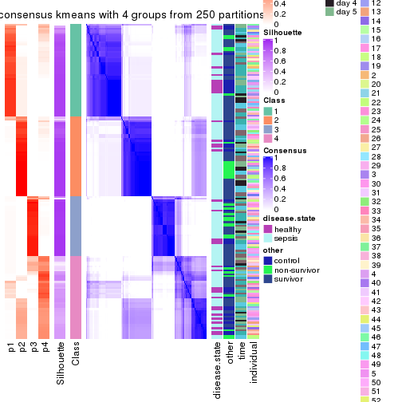</p>

</div>
<div id='tab-ATC-kmeans-consensus-heatmap-4'>
<pre><code class="r">consensus_heatmap(res, k = 5)
</code></pre>

<p></p>

</div>
<div id='tab-ATC-kmeans-consensus-heatmap-5'>
<pre><code class="r">consensus_heatmap(res, k = 6)
</code></pre>

<p></p>

</div>
</div>

Heatmaps for the membership of samples in all partitions to see how consistent they are:


<script>
$( function() {
	$( '#tabs-ATC-kmeans-membership-heatmap' ).tabs();
} );
</script>
<div id='tabs-ATC-kmeans-membership-heatmap'>
<ul>
<li><a href='#tab-ATC-kmeans-membership-heatmap-1'>k = 2</a></li>
<li><a href='#tab-ATC-kmeans-membership-heatmap-2'>k = 3</a></li>
<li><a href='#tab-ATC-kmeans-membership-heatmap-3'>k = 4</a></li>
<li><a href='#tab-ATC-kmeans-membership-heatmap-4'>k = 5</a></li>
<li><a href='#tab-ATC-kmeans-membership-heatmap-5'>k = 6</a></li>
</ul>
<div id='tab-ATC-kmeans-membership-heatmap-1'>
<pre><code class="r">membership_heatmap(res, k = 2)
</code></pre>

<p></p>

</div>
<div id='tab-ATC-kmeans-membership-heatmap-2'>
<pre><code class="r">membership_heatmap(res, k = 3)
</code></pre>

<p></p>

</div>
<div id='tab-ATC-kmeans-membership-heatmap-3'>
<pre><code class="r">membership_heatmap(res, k = 4)
</code></pre>

<p></p>

</div>
<div id='tab-ATC-kmeans-membership-heatmap-4'>
<pre><code class="r">membership_heatmap(res, k = 5)
</code></pre>

<p></p>

</div>
<div id='tab-ATC-kmeans-membership-heatmap-5'>
<pre><code class="r">membership_heatmap(res, k = 6)
</code></pre>

<p></p>

</div>
</div>

As soon as we have had the classes for columns, we can look for signatures
which are significantly different between classes which can be candidate marks
for certain classes. Following are the heatmaps for signatures.


Signature heatmaps where rows are scaled:


<script>
$( function() {
	$( '#tabs-ATC-kmeans-get-signatures' ).tabs();
} );
</script>
<div id='tabs-ATC-kmeans-get-signatures'>
<ul>
<li><a href='#tab-ATC-kmeans-get-signatures-1'>k = 2</a></li>
<li><a href='#tab-ATC-kmeans-get-signatures-2'>k = 3</a></li>
<li><a href='#tab-ATC-kmeans-get-signatures-3'>k = 4</a></li>
<li><a href='#tab-ATC-kmeans-get-signatures-4'>k = 5</a></li>
<li><a href='#tab-ATC-kmeans-get-signatures-5'>k = 6</a></li>
</ul>
<div id='tab-ATC-kmeans-get-signatures-1'>
<pre><code class="r">get_signatures(res, k = 2)
</code></pre>

<p></p>

</div>
<div id='tab-ATC-kmeans-get-signatures-2'>
<pre><code class="r">get_signatures(res, k = 3)
</code></pre>

<p></p>

</div>
<div id='tab-ATC-kmeans-get-signatures-3'>
<pre><code class="r">get_signatures(res, k = 4)
</code></pre>

<p></p>

</div>
<div id='tab-ATC-kmeans-get-signatures-4'>
<pre><code class="r">get_signatures(res, k = 5)
</code></pre>

<p></p>

</div>
<div id='tab-ATC-kmeans-get-signatures-5'>
<pre><code class="r">get_signatures(res, k = 6)
</code></pre>

<p></p>

</div>
</div>


Signature heatmaps where rows are not scaled:


<script>
$( function() {
	$( '#tabs-ATC-kmeans-get-signatures-no-scale' ).tabs();
} );
</script>
<div id='tabs-ATC-kmeans-get-signatures-no-scale'>
<ul>
<li><a href='#tab-ATC-kmeans-get-signatures-no-scale-1'>k = 2</a></li>
<li><a href='#tab-ATC-kmeans-get-signatures-no-scale-2'>k = 3</a></li>
<li><a href='#tab-ATC-kmeans-get-signatures-no-scale-3'>k = 4</a></li>
<li><a href='#tab-ATC-kmeans-get-signatures-no-scale-4'>k = 5</a></li>
<li><a href='#tab-ATC-kmeans-get-signatures-no-scale-5'>k = 6</a></li>
</ul>
<div id='tab-ATC-kmeans-get-signatures-no-scale-1'>
<pre><code class="r">get_signatures(res, k = 2, scale_rows = FALSE)
</code></pre>

<p></p>

</div>
<div id='tab-ATC-kmeans-get-signatures-no-scale-2'>
<pre><code class="r">get_signatures(res, k = 3, scale_rows = FALSE)
</code></pre>

<p></p>

</div>
<div id='tab-ATC-kmeans-get-signatures-no-scale-3'>
<pre><code class="r">get_signatures(res, k = 4, scale_rows = FALSE)
</code></pre>

<p></p>

</div>
<div id='tab-ATC-kmeans-get-signatures-no-scale-4'>
<pre><code class="r">get_signatures(res, k = 5, scale_rows = FALSE)
</code></pre>

<p></p>

</div>
<div id='tab-ATC-kmeans-get-signatures-no-scale-5'>
<pre><code class="r">get_signatures(res, k = 6, scale_rows = FALSE)
</code></pre>

<p></p>

</div>
</div>


Compare the overlap of signatures from different k:

```r
compare_signatures(res)
```


`get_signature()` returns a data frame invisibly. TO get the list of signatures, the function
call should be assigned to a variable explicitly. In following code, if `plot` argument is set
to `FALSE`, no heatmap is plotted while only the differential analysis is performed.

```r
# code only for demonstration
tb = get_signature(res, k = ..., plot = FALSE)
```

An example of the output of `tb` is:

```
#>   which_row         fdr    mean_1    mean_2 scaled_mean_1 scaled_mean_2 km
#> 1        38 0.042760348  8.373488  9.131774    -0.5533452     0.5164555  1
#> 2        40 0.018707592  7.106213  8.469186    -0.6173731     0.5762149  1
#> 3        55 0.019134737 10.221463 11.207825    -0.6159697     0.5749050  1
#> 4        59 0.006059896  5.921854  7.869574    -0.6899429     0.6439467  1
#> 5        60 0.018055526  8.928898 10.211722    -0.6204761     0.5791110  1
#> 6        98 0.009384629 15.714769 14.887706     0.6635654    -0.6193277  2
...
```

The columns in `tb` are:

1. `which_row`: row indices corresponding to the input matrix.
2. `fdr`: FDR for the differential test. 
3. `mean_x`: The mean value in group x.
4. `scaled_mean_x`: The mean value in group x after rows are scaled.
5. `km`: Row groups if k-means clustering is applied to rows.


UMAP plot which shows how samples are separated.


<script>
$( function() {
	$( '#tabs-ATC-kmeans-dimension-reduction' ).tabs();
} );
</script>
<div id='tabs-ATC-kmeans-dimension-reduction'>
<ul>
<li><a href='#tab-ATC-kmeans-dimension-reduction-1'>k = 2</a></li>
<li><a href='#tab-ATC-kmeans-dimension-reduction-2'>k = 3</a></li>
<li><a href='#tab-ATC-kmeans-dimension-reduction-3'>k = 4</a></li>
<li><a href='#tab-ATC-kmeans-dimension-reduction-4'>k = 5</a></li>
<li><a href='#tab-ATC-kmeans-dimension-reduction-5'>k = 6</a></li>
</ul>
<div id='tab-ATC-kmeans-dimension-reduction-1'>
<pre><code class="r">dimension_reduction(res, k = 2, method = &quot;UMAP&quot;)
</code></pre>

<p>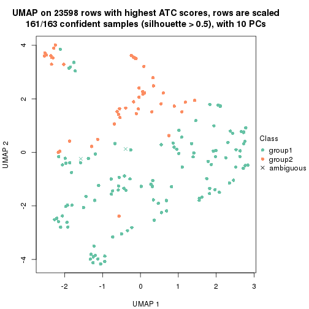</p>

</div>
<div id='tab-ATC-kmeans-dimension-reduction-2'>
<pre><code class="r">dimension_reduction(res, k = 3, method = &quot;UMAP&quot;)
</code></pre>

<p></p>

</div>
<div id='tab-ATC-kmeans-dimension-reduction-3'>
<pre><code class="r">dimension_reduction(res, k = 4, method = &quot;UMAP&quot;)
</code></pre>

<p></p>

</div>
<div id='tab-ATC-kmeans-dimension-reduction-4'>
<pre><code class="r">dimension_reduction(res, k = 5, method = &quot;UMAP&quot;)
</code></pre>

<p></p>

</div>
<div id='tab-ATC-kmeans-dimension-reduction-5'>
<pre><code class="r">dimension_reduction(res, k = 6, method = &quot;UMAP&quot;)
</code></pre>

<p></p>

</div>
</div>


Following heatmap shows how subgroups are split when increasing `k`:

```r
collect_classes(res)
```


Test correlation between subgroups and known annotations. If the known
annotation is numeric, one-way ANOVA test is applied, and if the known
annotation is discrete, chi-squared contingency table test is applied.

```r
test_to_known_factors(res)
```

```
#>              n disease.state(p) other(p) time(p) individual(p) k
#> ATC:kmeans 161           1.0000   0.6180   0.692         0.485 2
#> ATC:kmeans 162           0.4312   0.3072   0.130         0.458 3
#> ATC:kmeans 135           0.3683   0.2043   0.124         0.514 4
#> ATC:kmeans 133           0.0553   0.0464   0.242         0.227 5
#> ATC:kmeans 114           0.1950   0.1788   0.506         0.589 6
```


If matrix rows can be associated to genes, consider to use `functional_enrichment(res,
...)` to perform function enrichment for the signature genes. See [this vignette](http://bioconductor.org/packages/devel/bioc/vignettes/cola/inst/doc/functional_enrichment.html) for more detailed explanations.


 

---------------------------------------------------


### ATC:skmeans*


The object with results only for a single top-value method and a single partition method 
can be extracted as:

```r
res = res_list["ATC", "skmeans"]
# you can also extract it by
# res = res_list["ATC:skmeans"]
```

A summary of `res` and all the functions that can be applied to it:

```r
res
```

```
#> A 'ConsensusPartition' object with k = 2, 3, 4, 5, 6.
#>   On a matrix with 23598 rows and 163 columns.
#>   Top rows (1000, 2000, 3000, 4000, 5000) are extracted by 'ATC' method.
#>   Subgroups are detected by 'skmeans' method.
#>   Performed in total 1250 partitions by row resampling.
#>   Best k for subgroups seems to be 4.
#> 
#> Following methods can be applied to this 'ConsensusPartition' object:
#>  [1] "cola_report"             "collect_classes"         "collect_plots"          
#>  [4] "collect_stats"           "colnames"                "compare_signatures"     
#>  [7] "consensus_heatmap"       "dimension_reduction"     "functional_enrichment"  
#> [10] "get_anno_col"            "get_anno"                "get_classes"            
#> [13] "get_consensus"           "get_matrix"              "get_membership"         
#> [16] "get_param"               "get_signatures"          "get_stats"              
#> [19] "is_best_k"               "is_stable_k"             "membership_heatmap"     
#> [22] "ncol"                    "nrow"                    "plot_ecdf"              
#> [25] "rownames"                "select_partition_number" "show"                   
#> [28] "suggest_best_k"          "test_to_known_factors"
```

`collect_plots()` function collects all the plots made from `res` for all `k` (number of partitions)
into one single page to provide an easy and fast comparison between different `k`.

```r
collect_plots(res)
```


The plots are:

- The first row: a plot of the ECDF (empirical cumulative distribution
  function) curves of the consensus matrix for each `k` and the heatmap of
  predicted classes for each `k`.
- The second row: heatmaps of the consensus matrix for each `k`.
- The third row: heatmaps of the membership matrix for each `k`.
- The fouth row: heatmaps of the signatures for each `k`.

All the plots in panels can be made by individual functions and they are
plotted later in this section.

`select_partition_number()` produces several plots showing different
statistics for choosing "optimized" `k`. There are following statistics:

- ECDF curves of the consensus matrix for each `k`;
- 1-PAC. [The PAC
  score](https://en.wikipedia.org/wiki/Consensus_clustering#Over-interpretation_potential_of_consensus_clustering)
  measures the proportion of the ambiguous subgrouping.
- Mean silhouette score.
- Concordance. The mean probability of fiting the consensus class ids in all
  partitions.
- Area increased. Denote $A_k$ as the area under the ECDF curve for current
  `k`, the area increased is defined as $A_k - A_{k-1}$.
- Rand index. The percent of pairs of samples that are both in a same cluster
  or both are not in a same cluster in the partition of k and k-1.
- Jaccard index. The ratio of pairs of samples are both in a same cluster in
  the partition of k and k-1 and the pairs of samples are both in a same
  cluster in the partition k or k-1.

The detailed explanations of these statistics can be found in [the _cola_
vignette](http://bioconductor.org/packages/devel/bioc/vignettes/cola/inst/doc/cola.html#toc_13).

Generally speaking, lower PAC score, higher mean silhouette score or higher
concordance corresponds to better partition. Rand index and Jaccard index
measure how similar the current partition is compared to partition with `k-1`.
If they are too similar, we won't accept `k` is better than `k-1`.

```r
select_partition_number(res)
```


The numeric values for all these statistics can be obtained by `get_stats()`.

```r
get_stats(res)
```

```
#>   k 1-PAC mean_silhouette concordance area_increased  Rand Jaccard
#> 2 2 1.000           0.970       0.987         0.4931 0.509   0.509
#> 3 3 0.892           0.896       0.957         0.3548 0.712   0.488
#> 4 4 0.948           0.917       0.954         0.1005 0.899   0.710
#> 5 5 0.832           0.800       0.852         0.0608 0.940   0.782
#> 6 6 0.832           0.713       0.804         0.0356 0.924   0.694
```

`suggest_best_k()` suggests the best $k$ based on these statistics. The rules are as follows:

- All $k$ with Jaccard index larger than 0.95 are removed because increasing
  $k$ does not provide enough extra information. If all $k$ are removed, it is
  marked as no subgroup is detected.
- For all $k$ with 1-PAC score larger than 0.9, the maximal $k$ is taken as
  the best $k$, and other $k$ are marked as optional $k$.
- If it does not fit the second rule. The $k$ with the maximal vote of the
  highest 1-PAC score, highest mean silhouette, and highest concordance is
  taken as the best $k$.

```r
suggest_best_k(res)
```

```
#> [1] 4
#> attr(,"optional")
#> [1] 2
```

There is also optional best $k$ = 2 that is worth to check.

Following shows the table of the partitions (You need to click the **show/hide
code output** link to see it). The membership matrix (columns with name `p*`)
is inferred by
[`clue::cl_consensus()`](https://www.rdocumentation.org/link/cl_consensus?package=clue)
function with the `SE` method. Basically the value in the membership matrix
represents the probability to belong to a certain group. The finall class
label for an item is determined with the group with highest probability it
belongs to.

In `get_classes()` function, the entropy is calculated from the membership
matrix and the silhouette score is calculated from the consensus matrix.


<script>
$( function() {
	$( '#tabs-ATC-skmeans-get-classes' ).tabs();
} );
</script>
<div id='tabs-ATC-skmeans-get-classes'>
<ul>
<li><a href='#tab-ATC-skmeans-get-classes-1'>k = 2</a></li>
<li><a href='#tab-ATC-skmeans-get-classes-2'>k = 3</a></li>
<li><a href='#tab-ATC-skmeans-get-classes-3'>k = 4</a></li>
<li><a href='#tab-ATC-skmeans-get-classes-4'>k = 5</a></li>
<li><a href='#tab-ATC-skmeans-get-classes-5'>k = 6</a></li>
</ul>

<div id='tab-ATC-skmeans-get-classes-1'>
<p><a id='tab-ATC-skmeans-get-classes-1-a' style='color:#0366d6' href='#'>show/hide code output</a></p>
<pre><code class="r">cbind(get_classes(res, k = 2), get_membership(res, k = 2))
</code></pre>

<pre><code>#&gt;            class entropy silhouette    p1    p2
#&gt; GSM1317945     1  0.0000      0.985 1.000 0.000
#&gt; GSM1317946     1  0.0000      0.985 1.000 0.000
#&gt; GSM1317947     2  0.0000      0.990 0.000 1.000
#&gt; GSM1317948     1  0.2778      0.939 0.952 0.048
#&gt; GSM1317949     2  0.0000      0.990 0.000 1.000
#&gt; GSM1317950     1  0.0000      0.985 1.000 0.000
#&gt; GSM1317953     1  0.0000      0.985 1.000 0.000
#&gt; GSM1317954     1  0.0000      0.985 1.000 0.000
#&gt; GSM1317955     1  0.0000      0.985 1.000 0.000
#&gt; GSM1317956     1  0.0000      0.985 1.000 0.000
#&gt; GSM1317957     2  0.0000      0.990 0.000 1.000
#&gt; GSM1317958     1  0.0000      0.985 1.000 0.000
#&gt; GSM1317959     1  0.0000      0.985 1.000 0.000
#&gt; GSM1317960     1  0.0000      0.985 1.000 0.000
#&gt; GSM1317961     2  0.0000      0.990 0.000 1.000
#&gt; GSM1317962     1  0.0000      0.985 1.000 0.000
#&gt; GSM1317963     1  0.0000      0.985 1.000 0.000
#&gt; GSM1317964     1  0.0000      0.985 1.000 0.000
#&gt; GSM1317965     2  0.0000      0.990 0.000 1.000
#&gt; GSM1317966     2  0.0000      0.990 0.000 1.000
#&gt; GSM1317967     2  0.0000      0.990 0.000 1.000
#&gt; GSM1317968     1  0.0000      0.985 1.000 0.000
#&gt; GSM1317969     2  0.0000      0.990 0.000 1.000
#&gt; GSM1317970     2  0.7299      0.745 0.204 0.796
#&gt; GSM1317952     1  0.0000      0.985 1.000 0.000
#&gt; GSM1317951     1  0.0000      0.985 1.000 0.000
#&gt; GSM1317971     2  0.0000      0.990 0.000 1.000
#&gt; GSM1317972     1  0.0000      0.985 1.000 0.000
#&gt; GSM1317973     1  0.0000      0.985 1.000 0.000
#&gt; GSM1317974     1  0.0000      0.985 1.000 0.000
#&gt; GSM1317975     1  0.0000      0.985 1.000 0.000
#&gt; GSM1317978     1  0.0000      0.985 1.000 0.000
#&gt; GSM1317979     2  0.0000      0.990 0.000 1.000
#&gt; GSM1317980     2  0.0000      0.990 0.000 1.000
#&gt; GSM1317981     1  0.0000      0.985 1.000 0.000
#&gt; GSM1317982     2  0.0000      0.990 0.000 1.000
#&gt; GSM1317983     1  0.0000      0.985 1.000 0.000
#&gt; GSM1317984     2  0.0000      0.990 0.000 1.000
#&gt; GSM1317985     2  0.0000      0.990 0.000 1.000
#&gt; GSM1317986     1  0.0000      0.985 1.000 0.000
#&gt; GSM1317987     1  0.0000      0.985 1.000 0.000
#&gt; GSM1317988     1  0.0000      0.985 1.000 0.000
#&gt; GSM1317989     2  0.0000      0.990 0.000 1.000
#&gt; GSM1317990     1  0.0000      0.985 1.000 0.000
#&gt; GSM1317991     2  0.0000      0.990 0.000 1.000
#&gt; GSM1317992     2  0.0000      0.990 0.000 1.000
#&gt; GSM1317993     1  0.0000      0.985 1.000 0.000
#&gt; GSM1317994     2  0.0000      0.990 0.000 1.000
#&gt; GSM1317977     1  0.0000      0.985 1.000 0.000
#&gt; GSM1317976     1  0.0000      0.985 1.000 0.000
#&gt; GSM1317995     2  0.0000      0.990 0.000 1.000
#&gt; GSM1317996     1  0.0672      0.978 0.992 0.008
#&gt; GSM1317997     2  0.0000      0.990 0.000 1.000
#&gt; GSM1317998     1  0.0000      0.985 1.000 0.000
#&gt; GSM1317999     1  0.0000      0.985 1.000 0.000
#&gt; GSM1318002     1  0.0000      0.985 1.000 0.000
#&gt; GSM1318003     1  0.0000      0.985 1.000 0.000
#&gt; GSM1318004     1  0.0000      0.985 1.000 0.000
#&gt; GSM1318005     1  0.0000      0.985 1.000 0.000
#&gt; GSM1318006     1  0.0000      0.985 1.000 0.000
#&gt; GSM1318007     1  0.5629      0.844 0.868 0.132
#&gt; GSM1318008     1  0.0000      0.985 1.000 0.000
#&gt; GSM1318009     1  0.0000      0.985 1.000 0.000
#&gt; GSM1318010     2  0.0000      0.990 0.000 1.000
#&gt; GSM1318011     1  0.0000      0.985 1.000 0.000
#&gt; GSM1318012     1  0.0000      0.985 1.000 0.000
#&gt; GSM1318013     1  0.0000      0.985 1.000 0.000
#&gt; GSM1318014     1  0.0000      0.985 1.000 0.000
#&gt; GSM1318015     1  0.0000      0.985 1.000 0.000
#&gt; GSM1318001     2  0.0000      0.990 0.000 1.000
#&gt; GSM1318000     1  0.0000      0.985 1.000 0.000
#&gt; GSM1318016     1  0.0000      0.985 1.000 0.000
#&gt; GSM1318017     1  0.0000      0.985 1.000 0.000
#&gt; GSM1318019     1  0.0000      0.985 1.000 0.000
#&gt; GSM1318020     2  0.0000      0.990 0.000 1.000
#&gt; GSM1318021     1  0.0000      0.985 1.000 0.000
#&gt; GSM1318022     2  0.0000      0.990 0.000 1.000
#&gt; GSM1318023     1  0.0000      0.985 1.000 0.000
#&gt; GSM1318024     1  0.0000      0.985 1.000 0.000
#&gt; GSM1318025     2  0.0000      0.990 0.000 1.000
#&gt; GSM1318026     2  0.0000      0.990 0.000 1.000
#&gt; GSM1318027     2  0.0000      0.990 0.000 1.000
#&gt; GSM1318028     1  0.0000      0.985 1.000 0.000
#&gt; GSM1318029     2  0.0000      0.990 0.000 1.000
#&gt; GSM1318018     1  0.0000      0.985 1.000 0.000
#&gt; GSM1318030     2  0.0000      0.990 0.000 1.000
#&gt; GSM1318031     2  0.0000      0.990 0.000 1.000
#&gt; GSM1318033     1  0.0000      0.985 1.000 0.000
#&gt; GSM1318034     2  0.0000      0.990 0.000 1.000
#&gt; GSM1318035     1  0.0000      0.985 1.000 0.000
#&gt; GSM1318036     1  0.0000      0.985 1.000 0.000
#&gt; GSM1318037     1  0.9815      0.293 0.580 0.420
#&gt; GSM1318038     2  0.0000      0.990 0.000 1.000
#&gt; GSM1318039     1  0.0000      0.985 1.000 0.000
#&gt; GSM1318040     2  0.0000      0.990 0.000 1.000
#&gt; GSM1318032     2  0.0000      0.990 0.000 1.000
#&gt; GSM1317914     2  0.0000      0.990 0.000 1.000
#&gt; GSM1317915     1  0.0000      0.985 1.000 0.000
#&gt; GSM1317916     1  0.0000      0.985 1.000 0.000
#&gt; GSM1317917     2  0.6712      0.787 0.176 0.824
#&gt; GSM1317918     1  0.9393      0.441 0.644 0.356
#&gt; GSM1317919     2  0.0000      0.990 0.000 1.000
#&gt; GSM1317920     2  0.0000      0.990 0.000 1.000
#&gt; GSM1317921     2  0.0000      0.990 0.000 1.000
#&gt; GSM1317922     2  0.0000      0.990 0.000 1.000
#&gt; GSM1317923     2  0.0000      0.990 0.000 1.000
#&gt; GSM1317924     2  0.0000      0.990 0.000 1.000
#&gt; GSM1317925     1  0.0000      0.985 1.000 0.000
#&gt; GSM1317926     2  0.0000      0.990 0.000 1.000
#&gt; GSM1317927     1  0.0000      0.985 1.000 0.000
#&gt; GSM1317928     2  0.0000      0.990 0.000 1.000
#&gt; GSM1317929     2  0.0000      0.990 0.000 1.000
#&gt; GSM1317930     1  0.0000      0.985 1.000 0.000
#&gt; GSM1317931     2  0.0000      0.990 0.000 1.000
#&gt; GSM1317932     2  0.0000      0.990 0.000 1.000
#&gt; GSM1317933     1  0.0000      0.985 1.000 0.000
#&gt; GSM1317934     2  0.0672      0.983 0.008 0.992
#&gt; GSM1317935     2  0.0000      0.990 0.000 1.000
#&gt; GSM1317936     2  0.0000      0.990 0.000 1.000
#&gt; GSM1317937     1  0.0000      0.985 1.000 0.000
#&gt; GSM1317938     1  0.0000      0.985 1.000 0.000
#&gt; GSM1317939     1  0.0000      0.985 1.000 0.000
#&gt; GSM1317940     1  0.0000      0.985 1.000 0.000
#&gt; GSM1317941     1  0.0000      0.985 1.000 0.000
#&gt; GSM1317942     1  0.0000      0.985 1.000 0.000
#&gt; GSM1317943     1  0.0000      0.985 1.000 0.000
#&gt; GSM1317944     1  0.0000      0.985 1.000 0.000
#&gt; GSM1317896     2  0.0000      0.990 0.000 1.000
#&gt; GSM1317897     1  0.0000      0.985 1.000 0.000
#&gt; GSM1317898     1  0.0000      0.985 1.000 0.000
#&gt; GSM1317899     1  0.0000      0.985 1.000 0.000
#&gt; GSM1317900     2  0.0000      0.990 0.000 1.000
#&gt; GSM1317901     1  0.7299      0.746 0.796 0.204
#&gt; GSM1317902     1  0.0000      0.985 1.000 0.000
#&gt; GSM1317903     1  0.0000      0.985 1.000 0.000
#&gt; GSM1317904     1  0.0000      0.985 1.000 0.000
#&gt; GSM1317905     2  0.0000      0.990 0.000 1.000
#&gt; GSM1317906     2  0.0000      0.990 0.000 1.000
#&gt; GSM1317907     1  0.0000      0.985 1.000 0.000
#&gt; GSM1317908     2  0.0000      0.990 0.000 1.000
#&gt; GSM1317909     2  0.0000      0.990 0.000 1.000
#&gt; GSM1317910     2  0.0000      0.990 0.000 1.000
#&gt; GSM1317911     1  0.0000      0.985 1.000 0.000
#&gt; GSM1317912     1  0.0000      0.985 1.000 0.000
#&gt; GSM1317913     1  0.0000      0.985 1.000 0.000
#&gt; GSM1318041     2  0.0000      0.990 0.000 1.000
#&gt; GSM1318042     2  0.0000      0.990 0.000 1.000
#&gt; GSM1318043     2  0.0000      0.990 0.000 1.000
#&gt; GSM1318044     1  0.0000      0.985 1.000 0.000
#&gt; GSM1318045     1  0.0000      0.985 1.000 0.000
#&gt; GSM1318046     1  0.0000      0.985 1.000 0.000
#&gt; GSM1318047     1  0.0000      0.985 1.000 0.000
#&gt; GSM1318048     2  0.0000      0.990 0.000 1.000
#&gt; GSM1318049     1  0.7602      0.722 0.780 0.220
#&gt; GSM1318050     1  0.0000      0.985 1.000 0.000
#&gt; GSM1318051     1  0.0000      0.985 1.000 0.000
#&gt; GSM1318052     2  0.8499      0.624 0.276 0.724
#&gt; GSM1318053     2  0.0000      0.990 0.000 1.000
#&gt; GSM1318054     2  0.0000      0.990 0.000 1.000
#&gt; GSM1318055     2  0.0000      0.990 0.000 1.000
#&gt; GSM1318056     2  0.0000      0.990 0.000 1.000
#&gt; GSM1318057     2  0.0000      0.990 0.000 1.000
#&gt; GSM1318058     2  0.0000      0.990 0.000 1.000
</code></pre>

<script>
$('#tab-ATC-skmeans-get-classes-1-a').parent().next().next().hide();
$('#tab-ATC-skmeans-get-classes-1-a').click(function(){
  $('#tab-ATC-skmeans-get-classes-1-a').parent().next().next().toggle();
  return(false);
});
</script>
</div>

<div id='tab-ATC-skmeans-get-classes-2'>
<p><a id='tab-ATC-skmeans-get-classes-2-a' style='color:#0366d6' href='#'>show/hide code output</a></p>
<pre><code class="r">cbind(get_classes(res, k = 3), get_membership(res, k = 3))
</code></pre>

<pre><code>#&gt;            class entropy silhouette    p1    p2    p3
#&gt; GSM1317945     2  0.0237      0.945 0.004 0.996 0.000
#&gt; GSM1317946     2  0.4291      0.770 0.180 0.820 0.000
#&gt; GSM1317947     3  0.0000      0.943 0.000 0.000 1.000
#&gt; GSM1317948     1  0.0237      0.969 0.996 0.004 0.000
#&gt; GSM1317949     3  0.3038      0.845 0.104 0.000 0.896
#&gt; GSM1317950     1  0.0000      0.972 1.000 0.000 0.000
#&gt; GSM1317953     1  0.0000      0.972 1.000 0.000 0.000
#&gt; GSM1317954     1  0.0000      0.972 1.000 0.000 0.000
#&gt; GSM1317955     1  0.0000      0.972 1.000 0.000 0.000
#&gt; GSM1317956     1  0.0000      0.972 1.000 0.000 0.000
#&gt; GSM1317957     3  0.6168      0.297 0.000 0.412 0.588
#&gt; GSM1317958     1  0.0000      0.972 1.000 0.000 0.000
#&gt; GSM1317959     2  0.0237      0.945 0.004 0.996 0.000
#&gt; GSM1317960     1  0.0000      0.972 1.000 0.000 0.000
#&gt; GSM1317961     3  0.0000      0.943 0.000 0.000 1.000
#&gt; GSM1317962     1  0.2796      0.878 0.908 0.092 0.000
#&gt; GSM1317963     1  0.0000      0.972 1.000 0.000 0.000
#&gt; GSM1317964     1  0.0000      0.972 1.000 0.000 0.000
#&gt; GSM1317965     3  0.0000      0.943 0.000 0.000 1.000
#&gt; GSM1317966     3  0.0000      0.943 0.000 0.000 1.000
#&gt; GSM1317967     2  0.5968      0.435 0.000 0.636 0.364
#&gt; GSM1317968     1  0.0000      0.972 1.000 0.000 0.000
#&gt; GSM1317969     3  0.0237      0.940 0.000 0.004 0.996
#&gt; GSM1317970     2  0.0000      0.943 0.000 1.000 0.000
#&gt; GSM1317952     1  0.0000      0.972 1.000 0.000 0.000
#&gt; GSM1317951     1  0.0000      0.972 1.000 0.000 0.000
#&gt; GSM1317971     3  0.0000      0.943 0.000 0.000 1.000
#&gt; GSM1317972     1  0.1529      0.938 0.960 0.040 0.000
#&gt; GSM1317973     2  0.0237      0.945 0.004 0.996 0.000
#&gt; GSM1317974     2  0.2261      0.893 0.068 0.932 0.000
#&gt; GSM1317975     2  0.0237      0.945 0.004 0.996 0.000
#&gt; GSM1317978     1  0.0000      0.972 1.000 0.000 0.000
#&gt; GSM1317979     1  0.4654      0.721 0.792 0.000 0.208
#&gt; GSM1317980     3  0.0000      0.943 0.000 0.000 1.000
#&gt; GSM1317981     2  0.0237      0.945 0.004 0.996 0.000
#&gt; GSM1317982     3  0.5706      0.515 0.000 0.320 0.680
#&gt; GSM1317983     1  0.0000      0.972 1.000 0.000 0.000
#&gt; GSM1317984     3  0.0000      0.943 0.000 0.000 1.000
#&gt; GSM1317985     3  0.0000      0.943 0.000 0.000 1.000
#&gt; GSM1317986     1  0.0000      0.972 1.000 0.000 0.000
#&gt; GSM1317987     2  0.0237      0.945 0.004 0.996 0.000
#&gt; GSM1317988     2  0.0237      0.945 0.004 0.996 0.000
#&gt; GSM1317989     3  0.4974      0.666 0.236 0.000 0.764
#&gt; GSM1317990     2  0.0237      0.945 0.004 0.996 0.000
#&gt; GSM1317991     3  0.0000      0.943 0.000 0.000 1.000
#&gt; GSM1317992     3  0.6140      0.320 0.000 0.404 0.596
#&gt; GSM1317993     2  0.0237      0.945 0.004 0.996 0.000
#&gt; GSM1317994     3  0.0000      0.943 0.000 0.000 1.000
#&gt; GSM1317977     1  0.0000      0.972 1.000 0.000 0.000
#&gt; GSM1317976     1  0.0000      0.972 1.000 0.000 0.000
#&gt; GSM1317995     3  0.0000      0.943 0.000 0.000 1.000
#&gt; GSM1317996     2  0.0237      0.945 0.004 0.996 0.000
#&gt; GSM1317997     3  0.0000      0.943 0.000 0.000 1.000
#&gt; GSM1317998     1  0.0000      0.972 1.000 0.000 0.000
#&gt; GSM1317999     1  0.0000      0.972 1.000 0.000 0.000
#&gt; GSM1318002     2  0.0237      0.945 0.004 0.996 0.000
#&gt; GSM1318003     2  0.0237      0.945 0.004 0.996 0.000
#&gt; GSM1318004     2  0.0237      0.945 0.004 0.996 0.000
#&gt; GSM1318005     2  0.0237      0.945 0.004 0.996 0.000
#&gt; GSM1318006     1  0.0000      0.972 1.000 0.000 0.000
#&gt; GSM1318007     2  0.0000      0.943 0.000 1.000 0.000
#&gt; GSM1318008     1  0.0000      0.972 1.000 0.000 0.000
#&gt; GSM1318009     2  0.0237      0.945 0.004 0.996 0.000
#&gt; GSM1318010     3  0.0000      0.943 0.000 0.000 1.000
#&gt; GSM1318011     1  0.0000      0.972 1.000 0.000 0.000
#&gt; GSM1318012     1  0.0000      0.972 1.000 0.000 0.000
#&gt; GSM1318013     2  0.0000      0.943 0.000 1.000 0.000
#&gt; GSM1318014     1  0.0000      0.972 1.000 0.000 0.000
#&gt; GSM1318015     2  0.0000      0.943 0.000 1.000 0.000
#&gt; GSM1318001     3  0.0000      0.943 0.000 0.000 1.000
#&gt; GSM1318000     2  0.0237      0.945 0.004 0.996 0.000
#&gt; GSM1318016     2  0.0237      0.945 0.004 0.996 0.000
#&gt; GSM1318017     1  0.0000      0.972 1.000 0.000 0.000
#&gt; GSM1318019     2  0.0237      0.945 0.004 0.996 0.000
#&gt; GSM1318020     3  0.0000      0.943 0.000 0.000 1.000
#&gt; GSM1318021     2  0.0237      0.945 0.004 0.996 0.000
#&gt; GSM1318022     3  0.0000      0.943 0.000 0.000 1.000
#&gt; GSM1318023     1  0.0000      0.972 1.000 0.000 0.000
#&gt; GSM1318024     2  0.0237      0.945 0.004 0.996 0.000
#&gt; GSM1318025     3  0.0000      0.943 0.000 0.000 1.000
#&gt; GSM1318026     2  0.6111      0.351 0.000 0.604 0.396
#&gt; GSM1318027     2  0.4504      0.746 0.000 0.804 0.196
#&gt; GSM1318028     1  0.0000      0.972 1.000 0.000 0.000
#&gt; GSM1318029     3  0.0000      0.943 0.000 0.000 1.000
#&gt; GSM1318018     1  0.0000      0.972 1.000 0.000 0.000
#&gt; GSM1318030     3  0.6154      0.309 0.000 0.408 0.592
#&gt; GSM1318031     3  0.0000      0.943 0.000 0.000 1.000
#&gt; GSM1318033     1  0.0000      0.972 1.000 0.000 0.000
#&gt; GSM1318034     3  0.0000      0.943 0.000 0.000 1.000
#&gt; GSM1318035     2  0.0237      0.945 0.004 0.996 0.000
#&gt; GSM1318036     1  0.1031      0.953 0.976 0.024 0.000
#&gt; GSM1318037     2  0.4555      0.741 0.000 0.800 0.200
#&gt; GSM1318038     3  0.0000      0.943 0.000 0.000 1.000
#&gt; GSM1318039     1  0.0000      0.972 1.000 0.000 0.000
#&gt; GSM1318040     3  0.0000      0.943 0.000 0.000 1.000
#&gt; GSM1318032     3  0.0000      0.943 0.000 0.000 1.000
#&gt; GSM1317914     3  0.0000      0.943 0.000 0.000 1.000
#&gt; GSM1317915     1  0.0000      0.972 1.000 0.000 0.000
#&gt; GSM1317916     1  0.0000      0.972 1.000 0.000 0.000
#&gt; GSM1317917     1  0.6286      0.181 0.536 0.000 0.464
#&gt; GSM1317918     1  0.0000      0.972 1.000 0.000 0.000
#&gt; GSM1317919     3  0.0000      0.943 0.000 0.000 1.000
#&gt; GSM1317920     3  0.0000      0.943 0.000 0.000 1.000
#&gt; GSM1317921     3  0.0000      0.943 0.000 0.000 1.000
#&gt; GSM1317922     3  0.0000      0.943 0.000 0.000 1.000
#&gt; GSM1317923     3  0.0000      0.943 0.000 0.000 1.000
#&gt; GSM1317924     3  0.0000      0.943 0.000 0.000 1.000
#&gt; GSM1317925     2  0.0237      0.945 0.004 0.996 0.000
#&gt; GSM1317926     3  0.0000      0.943 0.000 0.000 1.000
#&gt; GSM1317927     2  0.0237      0.945 0.004 0.996 0.000
#&gt; GSM1317928     2  0.4346      0.762 0.000 0.816 0.184
#&gt; GSM1317929     3  0.0000      0.943 0.000 0.000 1.000
#&gt; GSM1317930     2  0.0237      0.945 0.004 0.996 0.000
#&gt; GSM1317931     3  0.0000      0.943 0.000 0.000 1.000
#&gt; GSM1317932     2  0.4235      0.773 0.000 0.824 0.176
#&gt; GSM1317933     2  0.0237      0.945 0.004 0.996 0.000
#&gt; GSM1317934     2  0.0000      0.943 0.000 1.000 0.000
#&gt; GSM1317935     3  0.0237      0.940 0.000 0.004 0.996
#&gt; GSM1317936     3  0.0000      0.943 0.000 0.000 1.000
#&gt; GSM1317937     1  0.0000      0.972 1.000 0.000 0.000
#&gt; GSM1317938     2  0.0237      0.945 0.004 0.996 0.000
#&gt; GSM1317939     2  0.0237      0.945 0.004 0.996 0.000
#&gt; GSM1317940     1  0.0000      0.972 1.000 0.000 0.000
#&gt; GSM1317941     2  0.0237      0.945 0.004 0.996 0.000
#&gt; GSM1317942     2  0.0237      0.945 0.004 0.996 0.000
#&gt; GSM1317943     2  0.0237      0.945 0.004 0.996 0.000
#&gt; GSM1317944     2  0.0237      0.945 0.004 0.996 0.000
#&gt; GSM1317896     3  0.0000      0.943 0.000 0.000 1.000
#&gt; GSM1317897     1  0.0000      0.972 1.000 0.000 0.000
#&gt; GSM1317898     1  0.0000      0.972 1.000 0.000 0.000
#&gt; GSM1317899     1  0.0000      0.972 1.000 0.000 0.000
#&gt; GSM1317900     3  0.0000      0.943 0.000 0.000 1.000
#&gt; GSM1317901     1  0.0237      0.968 0.996 0.000 0.004
#&gt; GSM1317902     1  0.0000      0.972 1.000 0.000 0.000
#&gt; GSM1317903     1  0.0000      0.972 1.000 0.000 0.000
#&gt; GSM1317904     2  0.0237      0.945 0.004 0.996 0.000
#&gt; GSM1317905     2  0.5905      0.463 0.000 0.648 0.352
#&gt; GSM1317906     3  0.6140      0.320 0.000 0.404 0.596
#&gt; GSM1317907     2  0.0237      0.945 0.004 0.996 0.000
#&gt; GSM1317908     3  0.0000      0.943 0.000 0.000 1.000
#&gt; GSM1317909     1  0.6079      0.347 0.612 0.000 0.388
#&gt; GSM1317910     3  0.0000      0.943 0.000 0.000 1.000
#&gt; GSM1317911     1  0.0000      0.972 1.000 0.000 0.000
#&gt; GSM1317912     2  0.0237      0.945 0.004 0.996 0.000
#&gt; GSM1317913     2  0.0237      0.945 0.004 0.996 0.000
#&gt; GSM1318041     1  0.4784      0.729 0.796 0.004 0.200
#&gt; GSM1318042     3  0.0000      0.943 0.000 0.000 1.000
#&gt; GSM1318043     3  0.0000      0.943 0.000 0.000 1.000
#&gt; GSM1318044     1  0.0000      0.972 1.000 0.000 0.000
#&gt; GSM1318045     1  0.0000      0.972 1.000 0.000 0.000
#&gt; GSM1318046     1  0.0000      0.972 1.000 0.000 0.000
#&gt; GSM1318047     1  0.0000      0.972 1.000 0.000 0.000
#&gt; GSM1318048     3  0.0000      0.943 0.000 0.000 1.000
#&gt; GSM1318049     1  0.0592      0.962 0.988 0.000 0.012
#&gt; GSM1318050     2  0.0237      0.945 0.004 0.996 0.000
#&gt; GSM1318051     2  0.0237      0.945 0.004 0.996 0.000
#&gt; GSM1318052     2  0.0000      0.943 0.000 1.000 0.000
#&gt; GSM1318053     2  0.0000      0.943 0.000 1.000 0.000
#&gt; GSM1318054     2  0.6111      0.351 0.000 0.604 0.396
#&gt; GSM1318055     3  0.0000      0.943 0.000 0.000 1.000
#&gt; GSM1318056     3  0.6140      0.320 0.000 0.404 0.596
#&gt; GSM1318057     2  0.3686      0.815 0.000 0.860 0.140
#&gt; GSM1318058     3  0.0000      0.943 0.000 0.000 1.000
</code></pre>

<script>
$('#tab-ATC-skmeans-get-classes-2-a').parent().next().next().hide();
$('#tab-ATC-skmeans-get-classes-2-a').click(function(){
  $('#tab-ATC-skmeans-get-classes-2-a').parent().next().next().toggle();
  return(false);
});
</script>
</div>

<div id='tab-ATC-skmeans-get-classes-3'>
<p><a id='tab-ATC-skmeans-get-classes-3-a' style='color:#0366d6' href='#'>show/hide code output</a></p>
<pre><code class="r">cbind(get_classes(res, k = 4), get_membership(res, k = 4))
</code></pre>

<pre><code>#&gt;            class entropy silhouette    p1    p2    p3    p4
#&gt; GSM1317945     2  0.2081      0.905 0.000 0.916 0.000 0.084
#&gt; GSM1317946     2  0.1557      0.895 0.056 0.944 0.000 0.000
#&gt; GSM1317947     3  0.0000      0.981 0.000 0.000 1.000 0.000
#&gt; GSM1317948     1  0.1557      0.938 0.944 0.000 0.000 0.056
#&gt; GSM1317949     3  0.1004      0.950 0.024 0.000 0.972 0.004
#&gt; GSM1317950     1  0.0000      0.969 1.000 0.000 0.000 0.000
#&gt; GSM1317953     1  0.0000      0.969 1.000 0.000 0.000 0.000
#&gt; GSM1317954     1  0.0000      0.969 1.000 0.000 0.000 0.000
#&gt; GSM1317955     1  0.0000      0.969 1.000 0.000 0.000 0.000
#&gt; GSM1317956     1  0.0000      0.969 1.000 0.000 0.000 0.000
#&gt; GSM1317957     4  0.3601      0.876 0.000 0.084 0.056 0.860
#&gt; GSM1317958     1  0.0000      0.969 1.000 0.000 0.000 0.000
#&gt; GSM1317959     2  0.2081      0.905 0.000 0.916 0.000 0.084
#&gt; GSM1317960     1  0.1022      0.954 0.968 0.000 0.000 0.032
#&gt; GSM1317961     3  0.0000      0.981 0.000 0.000 1.000 0.000
#&gt; GSM1317962     2  0.4746      0.432 0.368 0.632 0.000 0.000
#&gt; GSM1317963     1  0.0921      0.956 0.972 0.000 0.000 0.028
#&gt; GSM1317964     1  0.0000      0.969 1.000 0.000 0.000 0.000
#&gt; GSM1317965     3  0.0000      0.981 0.000 0.000 1.000 0.000
#&gt; GSM1317966     3  0.0000      0.981 0.000 0.000 1.000 0.000
#&gt; GSM1317967     4  0.1557      0.899 0.000 0.000 0.056 0.944
#&gt; GSM1317968     1  0.0000      0.969 1.000 0.000 0.000 0.000
#&gt; GSM1317969     4  0.2589      0.862 0.000 0.000 0.116 0.884
#&gt; GSM1317970     4  0.3074      0.838 0.000 0.152 0.000 0.848
#&gt; GSM1317952     1  0.1557      0.938 0.944 0.000 0.000 0.056
#&gt; GSM1317951     1  0.0000      0.969 1.000 0.000 0.000 0.000
#&gt; GSM1317971     3  0.0000      0.981 0.000 0.000 1.000 0.000
#&gt; GSM1317972     2  0.1637      0.892 0.060 0.940 0.000 0.000
#&gt; GSM1317973     2  0.2081      0.905 0.000 0.916 0.000 0.084
#&gt; GSM1317974     2  0.1557      0.895 0.056 0.944 0.000 0.000
#&gt; GSM1317975     2  0.1022      0.927 0.000 0.968 0.000 0.032
#&gt; GSM1317978     1  0.0921      0.949 0.972 0.028 0.000 0.000
#&gt; GSM1317979     1  0.5148      0.682 0.736 0.000 0.208 0.056
#&gt; GSM1317980     3  0.0000      0.981 0.000 0.000 1.000 0.000
#&gt; GSM1317981     2  0.1022      0.927 0.000 0.968 0.000 0.032
#&gt; GSM1317982     4  0.0779      0.879 0.000 0.004 0.016 0.980
#&gt; GSM1317983     1  0.0000      0.969 1.000 0.000 0.000 0.000
#&gt; GSM1317984     3  0.0000      0.981 0.000 0.000 1.000 0.000
#&gt; GSM1317985     3  0.0000      0.981 0.000 0.000 1.000 0.000
#&gt; GSM1317986     1  0.0000      0.969 1.000 0.000 0.000 0.000
#&gt; GSM1317987     2  0.1022      0.927 0.000 0.968 0.000 0.032
#&gt; GSM1317988     2  0.2345      0.903 0.000 0.900 0.000 0.100
#&gt; GSM1317989     3  0.3355      0.762 0.160 0.000 0.836 0.004
#&gt; GSM1317990     2  0.1022      0.927 0.000 0.968 0.000 0.032
#&gt; GSM1317991     3  0.0000      0.981 0.000 0.000 1.000 0.000
#&gt; GSM1317992     4  0.3601      0.876 0.000 0.084 0.056 0.860
#&gt; GSM1317993     2  0.0817      0.929 0.000 0.976 0.000 0.024
#&gt; GSM1317994     3  0.0000      0.981 0.000 0.000 1.000 0.000
#&gt; GSM1317977     1  0.0000      0.969 1.000 0.000 0.000 0.000
#&gt; GSM1317976     1  0.0817      0.951 0.976 0.024 0.000 0.000
#&gt; GSM1317995     3  0.0000      0.981 0.000 0.000 1.000 0.000
#&gt; GSM1317996     2  0.1716      0.909 0.000 0.936 0.000 0.064
#&gt; GSM1317997     3  0.0000      0.981 0.000 0.000 1.000 0.000
#&gt; GSM1317998     1  0.0000      0.969 1.000 0.000 0.000 0.000
#&gt; GSM1317999     1  0.0000      0.969 1.000 0.000 0.000 0.000
#&gt; GSM1318002     2  0.1022      0.927 0.000 0.968 0.000 0.032
#&gt; GSM1318003     2  0.0336      0.931 0.000 0.992 0.000 0.008
#&gt; GSM1318004     2  0.2081      0.905 0.000 0.916 0.000 0.084
#&gt; GSM1318005     2  0.2081      0.905 0.000 0.916 0.000 0.084
#&gt; GSM1318006     1  0.0000      0.969 1.000 0.000 0.000 0.000
#&gt; GSM1318007     4  0.4830      0.240 0.000 0.392 0.000 0.608
#&gt; GSM1318008     1  0.0000      0.969 1.000 0.000 0.000 0.000
#&gt; GSM1318009     2  0.1792      0.913 0.000 0.932 0.000 0.068
#&gt; GSM1318010     3  0.0000      0.981 0.000 0.000 1.000 0.000
#&gt; GSM1318011     1  0.1557      0.938 0.944 0.000 0.000 0.056
#&gt; GSM1318012     1  0.0921      0.956 0.972 0.000 0.000 0.028
#&gt; GSM1318013     2  0.4948      0.326 0.000 0.560 0.000 0.440
#&gt; GSM1318014     1  0.1557      0.938 0.944 0.000 0.000 0.056
#&gt; GSM1318015     2  0.1022      0.927 0.000 0.968 0.000 0.032
#&gt; GSM1318001     3  0.0000      0.981 0.000 0.000 1.000 0.000
#&gt; GSM1318000     2  0.0000      0.930 0.000 1.000 0.000 0.000
#&gt; GSM1318016     2  0.1022      0.927 0.000 0.968 0.000 0.032
#&gt; GSM1318017     1  0.0000      0.969 1.000 0.000 0.000 0.000
#&gt; GSM1318019     2  0.1118      0.930 0.000 0.964 0.000 0.036
#&gt; GSM1318020     3  0.0000      0.981 0.000 0.000 1.000 0.000
#&gt; GSM1318021     2  0.0707      0.929 0.000 0.980 0.000 0.020
#&gt; GSM1318022     3  0.0000      0.981 0.000 0.000 1.000 0.000
#&gt; GSM1318023     1  0.0000      0.969 1.000 0.000 0.000 0.000
#&gt; GSM1318024     2  0.1022      0.927 0.000 0.968 0.000 0.032
#&gt; GSM1318025     3  0.0000      0.981 0.000 0.000 1.000 0.000
#&gt; GSM1318026     4  0.3601      0.876 0.000 0.084 0.056 0.860
#&gt; GSM1318027     4  0.1661      0.899 0.000 0.004 0.052 0.944
#&gt; GSM1318028     1  0.0000      0.969 1.000 0.000 0.000 0.000
#&gt; GSM1318029     3  0.0000      0.981 0.000 0.000 1.000 0.000
#&gt; GSM1318018     1  0.0000      0.969 1.000 0.000 0.000 0.000
#&gt; GSM1318030     4  0.1743      0.898 0.000 0.004 0.056 0.940
#&gt; GSM1318031     3  0.0000      0.981 0.000 0.000 1.000 0.000
#&gt; GSM1318033     1  0.0336      0.964 0.992 0.008 0.000 0.000
#&gt; GSM1318034     3  0.0000      0.981 0.000 0.000 1.000 0.000
#&gt; GSM1318035     2  0.0336      0.931 0.000 0.992 0.000 0.008
#&gt; GSM1318036     1  0.2149      0.888 0.912 0.088 0.000 0.000
#&gt; GSM1318037     4  0.2197      0.878 0.000 0.048 0.024 0.928
#&gt; GSM1318038     3  0.0188      0.977 0.000 0.000 0.996 0.004
#&gt; GSM1318039     1  0.0000      0.969 1.000 0.000 0.000 0.000
#&gt; GSM1318040     3  0.0000      0.981 0.000 0.000 1.000 0.000
#&gt; GSM1318032     3  0.0000      0.981 0.000 0.000 1.000 0.000
#&gt; GSM1317914     3  0.0000      0.981 0.000 0.000 1.000 0.000
#&gt; GSM1317915     1  0.0000      0.969 1.000 0.000 0.000 0.000
#&gt; GSM1317916     1  0.0188      0.967 0.996 0.000 0.000 0.004
#&gt; GSM1317917     3  0.5897      0.501 0.284 0.004 0.656 0.056
#&gt; GSM1317918     1  0.0000      0.969 1.000 0.000 0.000 0.000
#&gt; GSM1317919     3  0.0000      0.981 0.000 0.000 1.000 0.000
#&gt; GSM1317920     3  0.0000      0.981 0.000 0.000 1.000 0.000
#&gt; GSM1317921     3  0.0000      0.981 0.000 0.000 1.000 0.000
#&gt; GSM1317922     3  0.0000      0.981 0.000 0.000 1.000 0.000
#&gt; GSM1317923     3  0.0000      0.981 0.000 0.000 1.000 0.000
#&gt; GSM1317924     3  0.0000      0.981 0.000 0.000 1.000 0.000
#&gt; GSM1317925     2  0.1022      0.927 0.000 0.968 0.000 0.032
#&gt; GSM1317926     3  0.0000      0.981 0.000 0.000 1.000 0.000
#&gt; GSM1317927     2  0.0336      0.931 0.000 0.992 0.000 0.008
#&gt; GSM1317928     4  0.2949      0.875 0.000 0.088 0.024 0.888
#&gt; GSM1317929     3  0.0000      0.981 0.000 0.000 1.000 0.000
#&gt; GSM1317930     2  0.1022      0.929 0.000 0.968 0.000 0.032
#&gt; GSM1317931     3  0.0000      0.981 0.000 0.000 1.000 0.000
#&gt; GSM1317932     4  0.3552      0.853 0.000 0.128 0.024 0.848
#&gt; GSM1317933     2  0.0336      0.931 0.000 0.992 0.000 0.008
#&gt; GSM1317934     4  0.3172      0.828 0.000 0.160 0.000 0.840
#&gt; GSM1317935     3  0.3311      0.773 0.000 0.000 0.828 0.172
#&gt; GSM1317936     3  0.0000      0.981 0.000 0.000 1.000 0.000
#&gt; GSM1317937     1  0.0000      0.969 1.000 0.000 0.000 0.000
#&gt; GSM1317938     2  0.0000      0.930 0.000 1.000 0.000 0.000
#&gt; GSM1317939     2  0.0188      0.930 0.000 0.996 0.000 0.004
#&gt; GSM1317940     1  0.0000      0.969 1.000 0.000 0.000 0.000
#&gt; GSM1317941     2  0.0000      0.930 0.000 1.000 0.000 0.000
#&gt; GSM1317942     2  0.0000      0.930 0.000 1.000 0.000 0.000
#&gt; GSM1317943     2  0.0000      0.930 0.000 1.000 0.000 0.000
#&gt; GSM1317944     2  0.0336      0.931 0.000 0.992 0.000 0.008
#&gt; GSM1317896     3  0.0000      0.981 0.000 0.000 1.000 0.000
#&gt; GSM1317897     1  0.0000      0.969 1.000 0.000 0.000 0.000
#&gt; GSM1317898     1  0.0000      0.969 1.000 0.000 0.000 0.000
#&gt; GSM1317899     1  0.0000      0.969 1.000 0.000 0.000 0.000
#&gt; GSM1317900     3  0.0000      0.981 0.000 0.000 1.000 0.000
#&gt; GSM1317901     1  0.1890      0.934 0.936 0.000 0.008 0.056
#&gt; GSM1317902     1  0.0000      0.969 1.000 0.000 0.000 0.000
#&gt; GSM1317903     1  0.0000      0.969 1.000 0.000 0.000 0.000
#&gt; GSM1317904     2  0.2081      0.905 0.000 0.916 0.000 0.084
#&gt; GSM1317905     4  0.1557      0.899 0.000 0.000 0.056 0.944
#&gt; GSM1317906     4  0.1557      0.899 0.000 0.000 0.056 0.944
#&gt; GSM1317907     2  0.2814      0.876 0.000 0.868 0.000 0.132
#&gt; GSM1317908     3  0.0000      0.981 0.000 0.000 1.000 0.000
#&gt; GSM1317909     1  0.5150      0.349 0.596 0.000 0.396 0.008
#&gt; GSM1317910     3  0.0188      0.977 0.000 0.000 0.996 0.004
#&gt; GSM1317911     1  0.0000      0.969 1.000 0.000 0.000 0.000
#&gt; GSM1317912     2  0.2760      0.879 0.000 0.872 0.000 0.128
#&gt; GSM1317913     2  0.2081      0.905 0.000 0.916 0.000 0.084
#&gt; GSM1318041     1  0.4524      0.743 0.768 0.000 0.028 0.204
#&gt; GSM1318042     3  0.0000      0.981 0.000 0.000 1.000 0.000
#&gt; GSM1318043     3  0.0000      0.981 0.000 0.000 1.000 0.000
#&gt; GSM1318044     1  0.0000      0.969 1.000 0.000 0.000 0.000
#&gt; GSM1318045     1  0.0000      0.969 1.000 0.000 0.000 0.000
#&gt; GSM1318046     1  0.0000      0.969 1.000 0.000 0.000 0.000
#&gt; GSM1318047     1  0.1022      0.954 0.968 0.000 0.000 0.032
#&gt; GSM1318048     3  0.0188      0.977 0.000 0.000 0.996 0.004
#&gt; GSM1318049     1  0.2256      0.924 0.924 0.000 0.020 0.056
#&gt; GSM1318050     2  0.2081      0.905 0.000 0.916 0.000 0.084
#&gt; GSM1318051     2  0.2081      0.905 0.000 0.916 0.000 0.084
#&gt; GSM1318052     4  0.1557      0.875 0.000 0.056 0.000 0.944
#&gt; GSM1318053     4  0.1557      0.875 0.000 0.056 0.000 0.944
#&gt; GSM1318054     4  0.1557      0.899 0.000 0.000 0.056 0.944
#&gt; GSM1318055     3  0.0000      0.981 0.000 0.000 1.000 0.000
#&gt; GSM1318056     4  0.1557      0.899 0.000 0.000 0.056 0.944
#&gt; GSM1318057     4  0.1820      0.896 0.000 0.020 0.036 0.944
#&gt; GSM1318058     4  0.4977      0.223 0.000 0.000 0.460 0.540
</code></pre>

<script>
$('#tab-ATC-skmeans-get-classes-3-a').parent().next().next().hide();
$('#tab-ATC-skmeans-get-classes-3-a').click(function(){
  $('#tab-ATC-skmeans-get-classes-3-a').parent().next().next().toggle();
  return(false);
});
</script>
</div>

<div id='tab-ATC-skmeans-get-classes-4'>
<p><a id='tab-ATC-skmeans-get-classes-4-a' style='color:#0366d6' href='#'>show/hide code output</a></p>
<pre><code class="r">cbind(get_classes(res, k = 5), get_membership(res, k = 5))
</code></pre>

<pre><code>#&gt;            class entropy silhouette    p1    p2    p3    p4    p5
#&gt; GSM1317945     2  0.3865     0.8251 0.000 0.808 0.000 0.100 0.092
#&gt; GSM1317946     2  0.3953     0.7687 0.168 0.784 0.000 0.000 0.048
#&gt; GSM1317947     3  0.0000     0.9497 0.000 0.000 1.000 0.000 0.000
#&gt; GSM1317948     5  0.2020     0.9032 0.100 0.000 0.000 0.000 0.900
#&gt; GSM1317949     3  0.4101     0.5158 0.372 0.000 0.628 0.000 0.000
#&gt; GSM1317950     1  0.4101     0.7125 0.628 0.000 0.000 0.000 0.372
#&gt; GSM1317953     1  0.0000     0.6056 1.000 0.000 0.000 0.000 0.000
#&gt; GSM1317954     1  0.0000     0.6056 1.000 0.000 0.000 0.000 0.000
#&gt; GSM1317955     1  0.0000     0.6056 1.000 0.000 0.000 0.000 0.000
#&gt; GSM1317956     1  0.4101     0.7125 0.628 0.000 0.000 0.000 0.372
#&gt; GSM1317957     4  0.2020     0.8556 0.000 0.100 0.000 0.900 0.000
#&gt; GSM1317958     1  0.4101     0.7125 0.628 0.000 0.000 0.000 0.372
#&gt; GSM1317959     2  0.3918     0.8227 0.000 0.804 0.000 0.100 0.096
#&gt; GSM1317960     5  0.2127     0.8986 0.108 0.000 0.000 0.000 0.892
#&gt; GSM1317961     3  0.0000     0.9497 0.000 0.000 1.000 0.000 0.000
#&gt; GSM1317962     1  0.1628     0.5387 0.936 0.056 0.000 0.000 0.008
#&gt; GSM1317963     5  0.2127     0.8986 0.108 0.000 0.000 0.000 0.892
#&gt; GSM1317964     1  0.0000     0.6056 1.000 0.000 0.000 0.000 0.000
#&gt; GSM1317965     3  0.0000     0.9497 0.000 0.000 1.000 0.000 0.000
#&gt; GSM1317966     3  0.0000     0.9497 0.000 0.000 1.000 0.000 0.000
#&gt; GSM1317967     4  0.0000     0.8841 0.000 0.000 0.000 1.000 0.000
#&gt; GSM1317968     1  0.0000     0.6056 1.000 0.000 0.000 0.000 0.000
#&gt; GSM1317969     4  0.2966     0.7106 0.000 0.000 0.184 0.816 0.000
#&gt; GSM1317970     4  0.2020     0.8556 0.000 0.100 0.000 0.900 0.000
#&gt; GSM1317952     5  0.2020     0.9032 0.100 0.000 0.000 0.000 0.900
#&gt; GSM1317951     1  0.0000     0.6056 1.000 0.000 0.000 0.000 0.000
#&gt; GSM1317971     3  0.0162     0.9468 0.000 0.000 0.996 0.004 0.000
#&gt; GSM1317972     1  0.2304     0.4915 0.892 0.100 0.000 0.000 0.008
#&gt; GSM1317973     2  0.3865     0.8251 0.000 0.808 0.000 0.100 0.092
#&gt; GSM1317974     2  0.3835     0.6847 0.260 0.732 0.000 0.000 0.008
#&gt; GSM1317975     2  0.0609     0.8884 0.000 0.980 0.000 0.020 0.000
#&gt; GSM1317978     1  0.0771     0.5975 0.976 0.004 0.000 0.000 0.020
#&gt; GSM1317979     5  0.2020     0.9032 0.100 0.000 0.000 0.000 0.900
#&gt; GSM1317980     3  0.0000     0.9497 0.000 0.000 1.000 0.000 0.000
#&gt; GSM1317981     2  0.0609     0.8884 0.000 0.980 0.000 0.020 0.000
#&gt; GSM1317982     4  0.1364     0.8642 0.000 0.012 0.000 0.952 0.036
#&gt; GSM1317983     1  0.4101     0.7125 0.628 0.000 0.000 0.000 0.372
#&gt; GSM1317984     3  0.0000     0.9497 0.000 0.000 1.000 0.000 0.000
#&gt; GSM1317985     3  0.0000     0.9497 0.000 0.000 1.000 0.000 0.000
#&gt; GSM1317986     1  0.4101     0.7125 0.628 0.000 0.000 0.000 0.372
#&gt; GSM1317987     2  0.0609     0.8884 0.000 0.980 0.000 0.020 0.000
#&gt; GSM1317988     2  0.3967     0.8242 0.000 0.800 0.000 0.108 0.092
#&gt; GSM1317989     3  0.6401     0.1902 0.380 0.000 0.448 0.000 0.172
#&gt; GSM1317990     2  0.0609     0.8884 0.000 0.980 0.000 0.020 0.000
#&gt; GSM1317991     3  0.0000     0.9497 0.000 0.000 1.000 0.000 0.000
#&gt; GSM1317992     4  0.2020     0.8556 0.000 0.100 0.000 0.900 0.000
#&gt; GSM1317993     2  0.0609     0.8884 0.000 0.980 0.000 0.020 0.000
#&gt; GSM1317994     3  0.0000     0.9497 0.000 0.000 1.000 0.000 0.000
#&gt; GSM1317977     1  0.4126     0.7026 0.620 0.000 0.000 0.000 0.380
#&gt; GSM1317976     1  0.0000     0.6056 1.000 0.000 0.000 0.000 0.000
#&gt; GSM1317995     3  0.0000     0.9497 0.000 0.000 1.000 0.000 0.000
#&gt; GSM1317996     2  0.1671     0.8526 0.000 0.924 0.000 0.076 0.000
#&gt; GSM1317997     3  0.0000     0.9497 0.000 0.000 1.000 0.000 0.000
#&gt; GSM1317998     1  0.4126     0.7026 0.620 0.000 0.000 0.000 0.380
#&gt; GSM1317999     1  0.4101     0.7125 0.628 0.000 0.000 0.000 0.372
#&gt; GSM1318002     2  0.0609     0.8884 0.000 0.980 0.000 0.020 0.000
#&gt; GSM1318003     2  0.0404     0.8894 0.000 0.988 0.000 0.012 0.000
#&gt; GSM1318004     2  0.3865     0.8251 0.000 0.808 0.000 0.100 0.092
#&gt; GSM1318005     2  0.3865     0.8251 0.000 0.808 0.000 0.100 0.092
#&gt; GSM1318006     1  0.4101     0.7125 0.628 0.000 0.000 0.000 0.372
#&gt; GSM1318007     4  0.6765     0.0866 0.000 0.304 0.000 0.400 0.296
#&gt; GSM1318008     1  0.4126     0.7026 0.620 0.000 0.000 0.000 0.380
#&gt; GSM1318009     2  0.3865     0.8251 0.000 0.808 0.000 0.100 0.092
#&gt; GSM1318010     3  0.0000     0.9497 0.000 0.000 1.000 0.000 0.000
#&gt; GSM1318011     5  0.2020     0.9032 0.100 0.000 0.000 0.000 0.900
#&gt; GSM1318012     5  0.3857     0.1956 0.312 0.000 0.000 0.000 0.688
#&gt; GSM1318013     2  0.6597     0.3604 0.000 0.460 0.000 0.244 0.296
#&gt; GSM1318014     5  0.2020     0.9032 0.100 0.000 0.000 0.000 0.900
#&gt; GSM1318015     2  0.0609     0.8884 0.000 0.980 0.000 0.020 0.000
#&gt; GSM1318001     3  0.0000     0.9497 0.000 0.000 1.000 0.000 0.000
#&gt; GSM1318000     2  0.0290     0.8888 0.000 0.992 0.000 0.000 0.008
#&gt; GSM1318016     2  0.0609     0.8884 0.000 0.980 0.000 0.020 0.000
#&gt; GSM1318017     1  0.4101     0.7125 0.628 0.000 0.000 0.000 0.372
#&gt; GSM1318019     2  0.0609     0.8884 0.000 0.980 0.000 0.020 0.000
#&gt; GSM1318020     3  0.0000     0.9497 0.000 0.000 1.000 0.000 0.000
#&gt; GSM1318021     2  0.0609     0.8884 0.000 0.980 0.000 0.020 0.000
#&gt; GSM1318022     3  0.0000     0.9497 0.000 0.000 1.000 0.000 0.000
#&gt; GSM1318023     1  0.4101     0.7125 0.628 0.000 0.000 0.000 0.372
#&gt; GSM1318024     2  0.0609     0.8884 0.000 0.980 0.000 0.020 0.000
#&gt; GSM1318025     3  0.0000     0.9497 0.000 0.000 1.000 0.000 0.000
#&gt; GSM1318026     4  0.2020     0.8556 0.000 0.100 0.000 0.900 0.000
#&gt; GSM1318027     4  0.0000     0.8841 0.000 0.000 0.000 1.000 0.000
#&gt; GSM1318028     1  0.0000     0.6056 1.000 0.000 0.000 0.000 0.000
#&gt; GSM1318029     3  0.0000     0.9497 0.000 0.000 1.000 0.000 0.000
#&gt; GSM1318018     1  0.4101     0.7125 0.628 0.000 0.000 0.000 0.372
#&gt; GSM1318030     4  0.0693     0.8760 0.000 0.012 0.008 0.980 0.000
#&gt; GSM1318031     3  0.0000     0.9497 0.000 0.000 1.000 0.000 0.000
#&gt; GSM1318033     1  0.4278     0.6129 0.548 0.000 0.000 0.000 0.452
#&gt; GSM1318034     3  0.0510     0.9376 0.000 0.000 0.984 0.000 0.016
#&gt; GSM1318035     2  0.0404     0.8894 0.000 0.988 0.000 0.012 0.000
#&gt; GSM1318036     1  0.5696     0.4493 0.560 0.096 0.000 0.000 0.344
#&gt; GSM1318037     4  0.2879     0.8091 0.000 0.032 0.000 0.868 0.100
#&gt; GSM1318038     3  0.0290     0.9445 0.000 0.000 0.992 0.000 0.008
#&gt; GSM1318039     1  0.3707     0.6881 0.716 0.000 0.000 0.000 0.284
#&gt; GSM1318040     3  0.0000     0.9497 0.000 0.000 1.000 0.000 0.000
#&gt; GSM1318032     3  0.0000     0.9497 0.000 0.000 1.000 0.000 0.000
#&gt; GSM1317914     3  0.0000     0.9497 0.000 0.000 1.000 0.000 0.000
#&gt; GSM1317915     1  0.3707     0.6881 0.716 0.000 0.000 0.000 0.284
#&gt; GSM1317916     1  0.4060     0.7102 0.640 0.000 0.000 0.000 0.360
#&gt; GSM1317917     5  0.2470     0.7460 0.012 0.000 0.104 0.000 0.884
#&gt; GSM1317918     1  0.0000     0.6056 1.000 0.000 0.000 0.000 0.000
#&gt; GSM1317919     3  0.0000     0.9497 0.000 0.000 1.000 0.000 0.000
#&gt; GSM1317920     3  0.0000     0.9497 0.000 0.000 1.000 0.000 0.000
#&gt; GSM1317921     3  0.0000     0.9497 0.000 0.000 1.000 0.000 0.000
#&gt; GSM1317922     3  0.0000     0.9497 0.000 0.000 1.000 0.000 0.000
#&gt; GSM1317923     3  0.0000     0.9497 0.000 0.000 1.000 0.000 0.000
#&gt; GSM1317924     3  0.0000     0.9497 0.000 0.000 1.000 0.000 0.000
#&gt; GSM1317925     2  0.0609     0.8884 0.000 0.980 0.000 0.020 0.000
#&gt; GSM1317926     3  0.0000     0.9497 0.000 0.000 1.000 0.000 0.000
#&gt; GSM1317927     2  0.0404     0.8894 0.000 0.988 0.000 0.012 0.000
#&gt; GSM1317928     4  0.3789     0.7669 0.000 0.224 0.000 0.760 0.016
#&gt; GSM1317929     3  0.0000     0.9497 0.000 0.000 1.000 0.000 0.000
#&gt; GSM1317930     2  0.0162     0.8895 0.000 0.996 0.000 0.004 0.000
#&gt; GSM1317931     3  0.0290     0.9445 0.000 0.000 0.992 0.000 0.008
#&gt; GSM1317932     4  0.3789     0.7679 0.000 0.224 0.000 0.760 0.016
#&gt; GSM1317933     2  0.0404     0.8894 0.000 0.988 0.000 0.012 0.000
#&gt; GSM1317934     4  0.3819     0.7636 0.000 0.228 0.000 0.756 0.016
#&gt; GSM1317935     3  0.3527     0.7148 0.000 0.000 0.792 0.192 0.016
#&gt; GSM1317936     3  0.0000     0.9497 0.000 0.000 1.000 0.000 0.000
#&gt; GSM1317937     1  0.4101     0.7125 0.628 0.000 0.000 0.000 0.372
#&gt; GSM1317938     2  0.0290     0.8888 0.000 0.992 0.000 0.000 0.008
#&gt; GSM1317939     2  0.0000     0.8890 0.000 1.000 0.000 0.000 0.000
#&gt; GSM1317940     1  0.0000     0.6056 1.000 0.000 0.000 0.000 0.000
#&gt; GSM1317941     2  0.0290     0.8888 0.000 0.992 0.000 0.000 0.008
#&gt; GSM1317942     2  0.0290     0.8888 0.000 0.992 0.000 0.000 0.008
#&gt; GSM1317943     2  0.0290     0.8888 0.000 0.992 0.000 0.000 0.008
#&gt; GSM1317944     2  0.0404     0.8894 0.000 0.988 0.000 0.012 0.000
#&gt; GSM1317896     3  0.0000     0.9497 0.000 0.000 1.000 0.000 0.000
#&gt; GSM1317897     1  0.0000     0.6056 1.000 0.000 0.000 0.000 0.000
#&gt; GSM1317898     1  0.4101     0.7125 0.628 0.000 0.000 0.000 0.372
#&gt; GSM1317899     1  0.4101     0.7125 0.628 0.000 0.000 0.000 0.372
#&gt; GSM1317900     3  0.0000     0.9497 0.000 0.000 1.000 0.000 0.000
#&gt; GSM1317901     5  0.2424     0.8668 0.132 0.000 0.000 0.000 0.868
#&gt; GSM1317902     1  0.4101     0.7125 0.628 0.000 0.000 0.000 0.372
#&gt; GSM1317903     1  0.4101     0.7125 0.628 0.000 0.000 0.000 0.372
#&gt; GSM1317904     2  0.3865     0.8251 0.000 0.808 0.000 0.100 0.092
#&gt; GSM1317905     4  0.0703     0.8830 0.000 0.024 0.000 0.976 0.000
#&gt; GSM1317906     4  0.0703     0.8830 0.000 0.024 0.000 0.976 0.000
#&gt; GSM1317907     2  0.5579     0.6175 0.000 0.600 0.000 0.100 0.300
#&gt; GSM1317908     3  0.0000     0.9497 0.000 0.000 1.000 0.000 0.000
#&gt; GSM1317909     5  0.5082     0.5821 0.096 0.000 0.220 0.000 0.684
#&gt; GSM1317910     3  0.3895     0.5719 0.000 0.000 0.680 0.000 0.320
#&gt; GSM1317911     1  0.4161     0.6836 0.608 0.000 0.000 0.000 0.392
#&gt; GSM1317912     2  0.5659     0.5922 0.000 0.580 0.000 0.100 0.320
#&gt; GSM1317913     2  0.3865     0.8251 0.000 0.808 0.000 0.100 0.092
#&gt; GSM1318041     5  0.1908     0.8953 0.092 0.000 0.000 0.000 0.908
#&gt; GSM1318042     3  0.0000     0.9497 0.000 0.000 1.000 0.000 0.000
#&gt; GSM1318043     3  0.0000     0.9497 0.000 0.000 1.000 0.000 0.000
#&gt; GSM1318044     1  0.4101     0.7125 0.628 0.000 0.000 0.000 0.372
#&gt; GSM1318045     1  0.4101     0.7125 0.628 0.000 0.000 0.000 0.372
#&gt; GSM1318046     1  0.4126     0.7026 0.620 0.000 0.000 0.000 0.380
#&gt; GSM1318047     5  0.2127     0.8986 0.108 0.000 0.000 0.000 0.892
#&gt; GSM1318048     3  0.3684     0.6365 0.000 0.000 0.720 0.000 0.280
#&gt; GSM1318049     5  0.2020     0.9032 0.100 0.000 0.000 0.000 0.900
#&gt; GSM1318050     2  0.3865     0.8251 0.000 0.808 0.000 0.100 0.092
#&gt; GSM1318051     2  0.3865     0.8251 0.000 0.808 0.000 0.100 0.092
#&gt; GSM1318052     4  0.0000     0.8841 0.000 0.000 0.000 1.000 0.000
#&gt; GSM1318053     4  0.0000     0.8841 0.000 0.000 0.000 1.000 0.000
#&gt; GSM1318054     4  0.0000     0.8841 0.000 0.000 0.000 1.000 0.000
#&gt; GSM1318055     3  0.0000     0.9497 0.000 0.000 1.000 0.000 0.000
#&gt; GSM1318056     4  0.0000     0.8841 0.000 0.000 0.000 1.000 0.000
#&gt; GSM1318057     4  0.0000     0.8841 0.000 0.000 0.000 1.000 0.000
#&gt; GSM1318058     3  0.4305     0.0475 0.000 0.000 0.512 0.488 0.000
</code></pre>

<script>
$('#tab-ATC-skmeans-get-classes-4-a').parent().next().next().hide();
$('#tab-ATC-skmeans-get-classes-4-a').click(function(){
  $('#tab-ATC-skmeans-get-classes-4-a').parent().next().next().toggle();
  return(false);
});
</script>
</div>

<div id='tab-ATC-skmeans-get-classes-5'>
<p><a id='tab-ATC-skmeans-get-classes-5-a' style='color:#0366d6' href='#'>show/hide code output</a></p>
<pre><code class="r">cbind(get_classes(res, k = 6), get_membership(res, k = 6))
</code></pre>

<pre><code>#&gt;            class entropy silhouette    p1    p2    p3    p4    p5    p6
#&gt; GSM1317945     4  0.4379     0.7743 0.028 0.396 0.000 0.576 0.000 0.000
#&gt; GSM1317946     4  0.6550     0.4104 0.000 0.392 0.000 0.416 0.124 0.068
#&gt; GSM1317947     3  0.0260     0.9468 0.000 0.000 0.992 0.000 0.000 0.008
#&gt; GSM1317948     6  0.5746     0.7318 0.000 0.000 0.000 0.188 0.324 0.488
#&gt; GSM1317949     3  0.5996     0.2690 0.000 0.000 0.536 0.100 0.048 0.316
#&gt; GSM1317950     5  0.0146     0.6835 0.000 0.000 0.000 0.004 0.996 0.000
#&gt; GSM1317953     5  0.5481     0.5435 0.000 0.000 0.000 0.164 0.552 0.284
#&gt; GSM1317954     5  0.5559     0.5386 0.000 0.000 0.000 0.176 0.540 0.284
#&gt; GSM1317955     5  0.5621     0.5314 0.000 0.000 0.000 0.184 0.528 0.288
#&gt; GSM1317956     5  0.0146     0.6835 0.000 0.000 0.000 0.004 0.996 0.000
#&gt; GSM1317957     1  0.0865     0.9048 0.964 0.036 0.000 0.000 0.000 0.000
#&gt; GSM1317958     5  0.0000     0.6835 0.000 0.000 0.000 0.000 1.000 0.000
#&gt; GSM1317959     4  0.4504     0.7725 0.028 0.392 0.000 0.576 0.004 0.000
#&gt; GSM1317960     5  0.5823    -0.6307 0.000 0.000 0.000 0.188 0.440 0.372
#&gt; GSM1317961     3  0.0000     0.9521 0.000 0.000 1.000 0.000 0.000 0.000
#&gt; GSM1317962     5  0.5481     0.5435 0.000 0.000 0.000 0.164 0.552 0.284
#&gt; GSM1317963     6  0.5802     0.6567 0.000 0.000 0.000 0.180 0.400 0.420
#&gt; GSM1317964     5  0.5559     0.5386 0.000 0.000 0.000 0.176 0.540 0.284
#&gt; GSM1317965     3  0.0000     0.9521 0.000 0.000 1.000 0.000 0.000 0.000
#&gt; GSM1317966     3  0.0000     0.9521 0.000 0.000 1.000 0.000 0.000 0.000
#&gt; GSM1317967     1  0.0000     0.9154 1.000 0.000 0.000 0.000 0.000 0.000
#&gt; GSM1317968     5  0.5507     0.5421 0.000 0.000 0.000 0.168 0.548 0.284
#&gt; GSM1317969     1  0.3052     0.6733 0.780 0.000 0.216 0.000 0.000 0.004
#&gt; GSM1317970     1  0.0865     0.9048 0.964 0.036 0.000 0.000 0.000 0.000
#&gt; GSM1317952     6  0.5786     0.7208 0.000 0.000 0.000 0.188 0.344 0.468
#&gt; GSM1317951     5  0.5621     0.5314 0.000 0.000 0.000 0.184 0.528 0.288
#&gt; GSM1317971     3  0.0146     0.9495 0.004 0.000 0.996 0.000 0.000 0.000
#&gt; GSM1317972     5  0.5976     0.5334 0.000 0.024 0.000 0.160 0.540 0.276
#&gt; GSM1317973     4  0.4379     0.7743 0.028 0.396 0.000 0.576 0.000 0.000
#&gt; GSM1317974     2  0.6513     0.1494 0.000 0.536 0.000 0.116 0.108 0.240
#&gt; GSM1317975     2  0.0260     0.8649 0.008 0.992 0.000 0.000 0.000 0.000
#&gt; GSM1317978     5  0.4814     0.5621 0.000 0.000 0.000 0.100 0.644 0.256
#&gt; GSM1317979     6  0.5583     0.7406 0.000 0.000 0.000 0.180 0.284 0.536
#&gt; GSM1317980     3  0.0146     0.9499 0.000 0.000 0.996 0.000 0.000 0.004
#&gt; GSM1317981     2  0.0260     0.8649 0.008 0.992 0.000 0.000 0.000 0.000
#&gt; GSM1317982     1  0.2630     0.8521 0.872 0.000 0.004 0.032 0.000 0.092
#&gt; GSM1317983     5  0.0146     0.6835 0.000 0.000 0.000 0.004 0.996 0.000
#&gt; GSM1317984     3  0.0000     0.9521 0.000 0.000 1.000 0.000 0.000 0.000
#&gt; GSM1317985     3  0.0000     0.9521 0.000 0.000 1.000 0.000 0.000 0.000
#&gt; GSM1317986     5  0.0146     0.6835 0.000 0.000 0.000 0.004 0.996 0.000
#&gt; GSM1317987     2  0.0260     0.8649 0.008 0.992 0.000 0.000 0.000 0.000
#&gt; GSM1317988     4  0.4379     0.7743 0.028 0.396 0.000 0.576 0.000 0.000
#&gt; GSM1317989     6  0.5934     0.1854 0.000 0.000 0.336 0.088 0.048 0.528
#&gt; GSM1317990     2  0.0260     0.8649 0.008 0.992 0.000 0.000 0.000 0.000
#&gt; GSM1317991     3  0.0000     0.9521 0.000 0.000 1.000 0.000 0.000 0.000
#&gt; GSM1317992     1  0.1464     0.9016 0.944 0.036 0.004 0.000 0.000 0.016
#&gt; GSM1317993     2  0.0260     0.8649 0.008 0.992 0.000 0.000 0.000 0.000
#&gt; GSM1317994     3  0.0000     0.9521 0.000 0.000 1.000 0.000 0.000 0.000
#&gt; GSM1317977     5  0.0146     0.6801 0.000 0.000 0.000 0.000 0.996 0.004
#&gt; GSM1317976     5  0.5559     0.5386 0.000 0.000 0.000 0.176 0.540 0.284
#&gt; GSM1317995     3  0.0000     0.9521 0.000 0.000 1.000 0.000 0.000 0.000
#&gt; GSM1317996     2  0.1814     0.7598 0.100 0.900 0.000 0.000 0.000 0.000
#&gt; GSM1317997     3  0.0000     0.9521 0.000 0.000 1.000 0.000 0.000 0.000
#&gt; GSM1317998     5  0.0000     0.6835 0.000 0.000 0.000 0.000 1.000 0.000
#&gt; GSM1317999     5  0.0000     0.6835 0.000 0.000 0.000 0.000 1.000 0.000
#&gt; GSM1318002     2  0.0260     0.8649 0.008 0.992 0.000 0.000 0.000 0.000
#&gt; GSM1318003     2  0.0000     0.8634 0.000 1.000 0.000 0.000 0.000 0.000
#&gt; GSM1318004     4  0.4379     0.7743 0.028 0.396 0.000 0.576 0.000 0.000
#&gt; GSM1318005     4  0.4379     0.7743 0.028 0.396 0.000 0.576 0.000 0.000
#&gt; GSM1318006     5  0.0146     0.6835 0.000 0.000 0.000 0.004 0.996 0.000
#&gt; GSM1318007     4  0.3876     0.5545 0.156 0.068 0.000 0.772 0.000 0.004
#&gt; GSM1318008     5  0.0000     0.6835 0.000 0.000 0.000 0.000 1.000 0.000
#&gt; GSM1318009     4  0.4388     0.7688 0.028 0.400 0.000 0.572 0.000 0.000
#&gt; GSM1318010     3  0.0000     0.9521 0.000 0.000 1.000 0.000 0.000 0.000
#&gt; GSM1318011     5  0.5798    -0.6008 0.000 0.000 0.000 0.188 0.460 0.352
#&gt; GSM1318012     5  0.4264    -0.2495 0.000 0.000 0.000 0.484 0.500 0.016
#&gt; GSM1318013     4  0.3972     0.6232 0.104 0.120 0.000 0.772 0.000 0.004
#&gt; GSM1318014     6  0.5792     0.7179 0.000 0.000 0.000 0.188 0.348 0.464
#&gt; GSM1318015     2  0.0260     0.8649 0.008 0.992 0.000 0.000 0.000 0.000
#&gt; GSM1318001     3  0.0000     0.9521 0.000 0.000 1.000 0.000 0.000 0.000
#&gt; GSM1318000     2  0.1387     0.7945 0.000 0.932 0.000 0.068 0.000 0.000
#&gt; GSM1318016     2  0.0260     0.8649 0.008 0.992 0.000 0.000 0.000 0.000
#&gt; GSM1318017     5  0.0000     0.6835 0.000 0.000 0.000 0.000 1.000 0.000
#&gt; GSM1318019     2  0.0146     0.8620 0.000 0.996 0.000 0.004 0.000 0.000
#&gt; GSM1318020     3  0.0000     0.9521 0.000 0.000 1.000 0.000 0.000 0.000
#&gt; GSM1318021     2  0.0260     0.8649 0.008 0.992 0.000 0.000 0.000 0.000
#&gt; GSM1318022     3  0.0291     0.9473 0.000 0.000 0.992 0.004 0.000 0.004
#&gt; GSM1318023     5  0.0000     0.6835 0.000 0.000 0.000 0.000 1.000 0.000
#&gt; GSM1318024     2  0.0260     0.8649 0.008 0.992 0.000 0.000 0.000 0.000
#&gt; GSM1318025     3  0.0000     0.9521 0.000 0.000 1.000 0.000 0.000 0.000
#&gt; GSM1318026     1  0.1010     0.9043 0.960 0.036 0.000 0.000 0.000 0.004
#&gt; GSM1318027     1  0.0000     0.9154 1.000 0.000 0.000 0.000 0.000 0.000
#&gt; GSM1318028     5  0.5647     0.5261 0.000 0.000 0.000 0.184 0.520 0.296
#&gt; GSM1318029     3  0.0000     0.9521 0.000 0.000 1.000 0.000 0.000 0.000
#&gt; GSM1318018     5  0.0000     0.6835 0.000 0.000 0.000 0.000 1.000 0.000
#&gt; GSM1318030     1  0.3001     0.8368 0.852 0.004 0.008 0.028 0.000 0.108
#&gt; GSM1318031     3  0.0000     0.9521 0.000 0.000 1.000 0.000 0.000 0.000
#&gt; GSM1318033     5  0.2527     0.4813 0.000 0.000 0.000 0.168 0.832 0.000
#&gt; GSM1318034     3  0.2562     0.7724 0.000 0.000 0.828 0.000 0.000 0.172
#&gt; GSM1318035     2  0.0000     0.8634 0.000 1.000 0.000 0.000 0.000 0.000
#&gt; GSM1318036     4  0.4720     0.2701 0.000 0.052 0.000 0.560 0.388 0.000
#&gt; GSM1318037     4  0.5943     0.1776 0.360 0.032 0.000 0.500 0.000 0.108
#&gt; GSM1318038     3  0.3989     0.6611 0.000 0.000 0.720 0.044 0.000 0.236
#&gt; GSM1318039     5  0.2860     0.6369 0.000 0.000 0.000 0.100 0.852 0.048
#&gt; GSM1318040     3  0.0000     0.9521 0.000 0.000 1.000 0.000 0.000 0.000
#&gt; GSM1318032     3  0.0000     0.9521 0.000 0.000 1.000 0.000 0.000 0.000
#&gt; GSM1317914     3  0.0146     0.9501 0.000 0.000 0.996 0.004 0.000 0.000
#&gt; GSM1317915     5  0.4074     0.5690 0.000 0.000 0.000 0.108 0.752 0.140
#&gt; GSM1317916     5  0.3940     0.5411 0.000 0.000 0.000 0.096 0.764 0.140
#&gt; GSM1317917     6  0.4348     0.6424 0.000 0.000 0.000 0.056 0.268 0.676
#&gt; GSM1317918     5  0.5537     0.4743 0.000 0.000 0.000 0.136 0.476 0.388
#&gt; GSM1317919     3  0.0000     0.9521 0.000 0.000 1.000 0.000 0.000 0.000
#&gt; GSM1317920     3  0.0000     0.9521 0.000 0.000 1.000 0.000 0.000 0.000
#&gt; GSM1317921     3  0.0146     0.9501 0.000 0.000 0.996 0.004 0.000 0.000
#&gt; GSM1317922     3  0.0000     0.9521 0.000 0.000 1.000 0.000 0.000 0.000
#&gt; GSM1317923     3  0.0146     0.9501 0.000 0.000 0.996 0.004 0.000 0.000
#&gt; GSM1317924     3  0.0000     0.9521 0.000 0.000 1.000 0.000 0.000 0.000
#&gt; GSM1317925     2  0.0260     0.8649 0.008 0.992 0.000 0.000 0.000 0.000
#&gt; GSM1317926     3  0.0000     0.9521 0.000 0.000 1.000 0.000 0.000 0.000
#&gt; GSM1317927     2  0.0146     0.8620 0.000 0.996 0.000 0.004 0.000 0.000
#&gt; GSM1317928     2  0.6332     0.0715 0.352 0.472 0.000 0.052 0.000 0.124
#&gt; GSM1317929     3  0.0000     0.9521 0.000 0.000 1.000 0.000 0.000 0.000
#&gt; GSM1317930     2  0.0260     0.8594 0.000 0.992 0.000 0.008 0.000 0.000
#&gt; GSM1317931     3  0.3130     0.7833 0.000 0.000 0.828 0.048 0.000 0.124
#&gt; GSM1317932     2  0.6302     0.1297 0.336 0.488 0.000 0.052 0.000 0.124
#&gt; GSM1317933     2  0.0146     0.8620 0.000 0.996 0.000 0.004 0.000 0.000
#&gt; GSM1317934     2  0.6255     0.1836 0.316 0.508 0.000 0.052 0.000 0.124
#&gt; GSM1317935     3  0.4698     0.6701 0.080 0.000 0.740 0.052 0.000 0.128
#&gt; GSM1317936     3  0.0000     0.9521 0.000 0.000 1.000 0.000 0.000 0.000
#&gt; GSM1317937     5  0.0000     0.6835 0.000 0.000 0.000 0.000 1.000 0.000
#&gt; GSM1317938     2  0.1007     0.8256 0.000 0.956 0.000 0.044 0.000 0.000
#&gt; GSM1317939     2  0.0260     0.8594 0.000 0.992 0.000 0.008 0.000 0.000
#&gt; GSM1317940     5  0.5660     0.5231 0.000 0.000 0.000 0.184 0.516 0.300
#&gt; GSM1317941     2  0.1267     0.8055 0.000 0.940 0.000 0.060 0.000 0.000
#&gt; GSM1317942     2  0.1327     0.8003 0.000 0.936 0.000 0.064 0.000 0.000
#&gt; GSM1317943     2  0.0937     0.8299 0.000 0.960 0.000 0.040 0.000 0.000
#&gt; GSM1317944     2  0.0000     0.8634 0.000 1.000 0.000 0.000 0.000 0.000
#&gt; GSM1317896     3  0.0000     0.9521 0.000 0.000 1.000 0.000 0.000 0.000
#&gt; GSM1317897     5  0.5559     0.5386 0.000 0.000 0.000 0.176 0.540 0.284
#&gt; GSM1317898     5  0.0000     0.6835 0.000 0.000 0.000 0.000 1.000 0.000
#&gt; GSM1317899     5  0.0000     0.6835 0.000 0.000 0.000 0.000 1.000 0.000
#&gt; GSM1317900     3  0.0000     0.9521 0.000 0.000 1.000 0.000 0.000 0.000
#&gt; GSM1317901     6  0.5803     0.6707 0.000 0.000 0.000 0.184 0.372 0.444
#&gt; GSM1317902     5  0.0000     0.6835 0.000 0.000 0.000 0.000 1.000 0.000
#&gt; GSM1317903     5  0.0000     0.6835 0.000 0.000 0.000 0.000 1.000 0.000
#&gt; GSM1317904     4  0.4379     0.7743 0.028 0.396 0.000 0.576 0.000 0.000
#&gt; GSM1317905     1  0.0458     0.9133 0.984 0.016 0.000 0.000 0.000 0.000
#&gt; GSM1317906     1  0.0458     0.9133 0.984 0.016 0.000 0.000 0.000 0.000
#&gt; GSM1317907     4  0.3688     0.6838 0.028 0.196 0.000 0.768 0.000 0.008
#&gt; GSM1317908     3  0.0363     0.9435 0.000 0.000 0.988 0.000 0.000 0.012
#&gt; GSM1317909     6  0.5640     0.6053 0.000 0.000 0.192 0.000 0.280 0.528
#&gt; GSM1317910     6  0.3864    -0.0280 0.000 0.000 0.480 0.000 0.000 0.520
#&gt; GSM1317911     5  0.1204     0.6217 0.000 0.000 0.000 0.000 0.944 0.056
#&gt; GSM1317912     4  0.3755     0.6815 0.028 0.192 0.000 0.768 0.000 0.012
#&gt; GSM1317913     4  0.4379     0.7743 0.028 0.396 0.000 0.576 0.000 0.000
#&gt; GSM1318041     6  0.5587     0.7376 0.000 0.000 0.000 0.188 0.272 0.540
#&gt; GSM1318042     3  0.0146     0.9499 0.000 0.000 0.996 0.000 0.000 0.004
#&gt; GSM1318043     3  0.0000     0.9521 0.000 0.000 1.000 0.000 0.000 0.000
#&gt; GSM1318044     5  0.0000     0.6835 0.000 0.000 0.000 0.000 1.000 0.000
#&gt; GSM1318045     5  0.0000     0.6835 0.000 0.000 0.000 0.000 1.000 0.000
#&gt; GSM1318046     5  0.0000     0.6835 0.000 0.000 0.000 0.000 1.000 0.000
#&gt; GSM1318047     5  0.5799    -0.6193 0.000 0.000 0.000 0.184 0.448 0.368
#&gt; GSM1318048     3  0.3867     0.0405 0.000 0.000 0.512 0.000 0.000 0.488
#&gt; GSM1318049     6  0.5559     0.7405 0.000 0.000 0.000 0.176 0.284 0.540
#&gt; GSM1318050     4  0.4379     0.7743 0.028 0.396 0.000 0.576 0.000 0.000
#&gt; GSM1318051     4  0.4379     0.7743 0.028 0.396 0.000 0.576 0.000 0.000
#&gt; GSM1318052     1  0.0000     0.9154 1.000 0.000 0.000 0.000 0.000 0.000
#&gt; GSM1318053     1  0.0000     0.9154 1.000 0.000 0.000 0.000 0.000 0.000
#&gt; GSM1318054     1  0.0000     0.9154 1.000 0.000 0.000 0.000 0.000 0.000
#&gt; GSM1318055     3  0.0000     0.9521 0.000 0.000 1.000 0.000 0.000 0.000
#&gt; GSM1318056     1  0.0000     0.9154 1.000 0.000 0.000 0.000 0.000 0.000
#&gt; GSM1318057     1  0.0000     0.9154 1.000 0.000 0.000 0.000 0.000 0.000
#&gt; GSM1318058     1  0.3782     0.3191 0.588 0.000 0.412 0.000 0.000 0.000
</code></pre>

<script>
$('#tab-ATC-skmeans-get-classes-5-a').parent().next().next().hide();
$('#tab-ATC-skmeans-get-classes-5-a').click(function(){
  $('#tab-ATC-skmeans-get-classes-5-a').parent().next().next().toggle();
  return(false);
});
</script>
</div>
</div>

Heatmaps for the consensus matrix. It visualizes the probability of two
samples to be in a same group.


<script>
$( function() {
	$( '#tabs-ATC-skmeans-consensus-heatmap' ).tabs();
} );
</script>
<div id='tabs-ATC-skmeans-consensus-heatmap'>
<ul>
<li><a href='#tab-ATC-skmeans-consensus-heatmap-1'>k = 2</a></li>
<li><a href='#tab-ATC-skmeans-consensus-heatmap-2'>k = 3</a></li>
<li><a href='#tab-ATC-skmeans-consensus-heatmap-3'>k = 4</a></li>
<li><a href='#tab-ATC-skmeans-consensus-heatmap-4'>k = 5</a></li>
<li><a href='#tab-ATC-skmeans-consensus-heatmap-5'>k = 6</a></li>
</ul>
<div id='tab-ATC-skmeans-consensus-heatmap-1'>
<pre><code class="r">consensus_heatmap(res, k = 2)
</code></pre>

<p></p>

</div>
<div id='tab-ATC-skmeans-consensus-heatmap-2'>
<pre><code class="r">consensus_heatmap(res, k = 3)
</code></pre>

<p></p>

</div>
<div id='tab-ATC-skmeans-consensus-heatmap-3'>
<pre><code class="r">consensus_heatmap(res, k = 4)
</code></pre>

<p></p>

</div>
<div id='tab-ATC-skmeans-consensus-heatmap-4'>
<pre><code class="r">consensus_heatmap(res, k = 5)
</code></pre>

<p></p>

</div>
<div id='tab-ATC-skmeans-consensus-heatmap-5'>
<pre><code class="r">consensus_heatmap(res, k = 6)
</code></pre>

<p></p>

</div>
</div>

Heatmaps for the membership of samples in all partitions to see how consistent they are:


<script>
$( function() {
	$( '#tabs-ATC-skmeans-membership-heatmap' ).tabs();
} );
</script>
<div id='tabs-ATC-skmeans-membership-heatmap'>
<ul>
<li><a href='#tab-ATC-skmeans-membership-heatmap-1'>k = 2</a></li>
<li><a href='#tab-ATC-skmeans-membership-heatmap-2'>k = 3</a></li>
<li><a href='#tab-ATC-skmeans-membership-heatmap-3'>k = 4</a></li>
<li><a href='#tab-ATC-skmeans-membership-heatmap-4'>k = 5</a></li>
<li><a href='#tab-ATC-skmeans-membership-heatmap-5'>k = 6</a></li>
</ul>
<div id='tab-ATC-skmeans-membership-heatmap-1'>
<pre><code class="r">membership_heatmap(res, k = 2)
</code></pre>

<p></p>

</div>
<div id='tab-ATC-skmeans-membership-heatmap-2'>
<pre><code class="r">membership_heatmap(res, k = 3)
</code></pre>

<p></p>

</div>
<div id='tab-ATC-skmeans-membership-heatmap-3'>
<pre><code class="r">membership_heatmap(res, k = 4)
</code></pre>

<p></p>

</div>
<div id='tab-ATC-skmeans-membership-heatmap-4'>
<pre><code class="r">membership_heatmap(res, k = 5)
</code></pre>

<p></p>

</div>
<div id='tab-ATC-skmeans-membership-heatmap-5'>
<pre><code class="r">membership_heatmap(res, k = 6)
</code></pre>

<p></p>

</div>
</div>

As soon as we have had the classes for columns, we can look for signatures
which are significantly different between classes which can be candidate marks
for certain classes. Following are the heatmaps for signatures.


Signature heatmaps where rows are scaled:


<script>
$( function() {
	$( '#tabs-ATC-skmeans-get-signatures' ).tabs();
} );
</script>
<div id='tabs-ATC-skmeans-get-signatures'>
<ul>
<li><a href='#tab-ATC-skmeans-get-signatures-1'>k = 2</a></li>
<li><a href='#tab-ATC-skmeans-get-signatures-2'>k = 3</a></li>
<li><a href='#tab-ATC-skmeans-get-signatures-3'>k = 4</a></li>
<li><a href='#tab-ATC-skmeans-get-signatures-4'>k = 5</a></li>
<li><a href='#tab-ATC-skmeans-get-signatures-5'>k = 6</a></li>
</ul>
<div id='tab-ATC-skmeans-get-signatures-1'>
<pre><code class="r">get_signatures(res, k = 2)
</code></pre>

<p></p>

</div>
<div id='tab-ATC-skmeans-get-signatures-2'>
<pre><code class="r">get_signatures(res, k = 3)
</code></pre>

<p></p>

</div>
<div id='tab-ATC-skmeans-get-signatures-3'>
<pre><code class="r">get_signatures(res, k = 4)
</code></pre>

<p></p>

</div>
<div id='tab-ATC-skmeans-get-signatures-4'>
<pre><code class="r">get_signatures(res, k = 5)
</code></pre>

<p></p>

</div>
<div id='tab-ATC-skmeans-get-signatures-5'>
<pre><code class="r">get_signatures(res, k = 6)
</code></pre>

<p></p>

</div>
</div>


Signature heatmaps where rows are not scaled:


<script>
$( function() {
	$( '#tabs-ATC-skmeans-get-signatures-no-scale' ).tabs();
} );
</script>
<div id='tabs-ATC-skmeans-get-signatures-no-scale'>
<ul>
<li><a href='#tab-ATC-skmeans-get-signatures-no-scale-1'>k = 2</a></li>
<li><a href='#tab-ATC-skmeans-get-signatures-no-scale-2'>k = 3</a></li>
<li><a href='#tab-ATC-skmeans-get-signatures-no-scale-3'>k = 4</a></li>
<li><a href='#tab-ATC-skmeans-get-signatures-no-scale-4'>k = 5</a></li>
<li><a href='#tab-ATC-skmeans-get-signatures-no-scale-5'>k = 6</a></li>
</ul>
<div id='tab-ATC-skmeans-get-signatures-no-scale-1'>
<pre><code class="r">get_signatures(res, k = 2, scale_rows = FALSE)
</code></pre>

<p></p>

</div>
<div id='tab-ATC-skmeans-get-signatures-no-scale-2'>
<pre><code class="r">get_signatures(res, k = 3, scale_rows = FALSE)
</code></pre>

<p></p>

</div>
<div id='tab-ATC-skmeans-get-signatures-no-scale-3'>
<pre><code class="r">get_signatures(res, k = 4, scale_rows = FALSE)
</code></pre>

<p></p>

</div>
<div id='tab-ATC-skmeans-get-signatures-no-scale-4'>
<pre><code class="r">get_signatures(res, k = 5, scale_rows = FALSE)
</code></pre>

<p></p>

</div>
<div id='tab-ATC-skmeans-get-signatures-no-scale-5'>
<pre><code class="r">get_signatures(res, k = 6, scale_rows = FALSE)
</code></pre>

<p></p>

</div>
</div>


Compare the overlap of signatures from different k:

```r
compare_signatures(res)
```


`get_signature()` returns a data frame invisibly. TO get the list of signatures, the function
call should be assigned to a variable explicitly. In following code, if `plot` argument is set
to `FALSE`, no heatmap is plotted while only the differential analysis is performed.

```r
# code only for demonstration
tb = get_signature(res, k = ..., plot = FALSE)
```

An example of the output of `tb` is:

```
#>   which_row         fdr    mean_1    mean_2 scaled_mean_1 scaled_mean_2 km
#> 1        38 0.042760348  8.373488  9.131774    -0.5533452     0.5164555  1
#> 2        40 0.018707592  7.106213  8.469186    -0.6173731     0.5762149  1
#> 3        55 0.019134737 10.221463 11.207825    -0.6159697     0.5749050  1
#> 4        59 0.006059896  5.921854  7.869574    -0.6899429     0.6439467  1
#> 5        60 0.018055526  8.928898 10.211722    -0.6204761     0.5791110  1
#> 6        98 0.009384629 15.714769 14.887706     0.6635654    -0.6193277  2
...
```

The columns in `tb` are:

1. `which_row`: row indices corresponding to the input matrix.
2. `fdr`: FDR for the differential test. 
3. `mean_x`: The mean value in group x.
4. `scaled_mean_x`: The mean value in group x after rows are scaled.
5. `km`: Row groups if k-means clustering is applied to rows.


UMAP plot which shows how samples are separated.


<script>
$( function() {
	$( '#tabs-ATC-skmeans-dimension-reduction' ).tabs();
} );
</script>
<div id='tabs-ATC-skmeans-dimension-reduction'>
<ul>
<li><a href='#tab-ATC-skmeans-dimension-reduction-1'>k = 2</a></li>
<li><a href='#tab-ATC-skmeans-dimension-reduction-2'>k = 3</a></li>
<li><a href='#tab-ATC-skmeans-dimension-reduction-3'>k = 4</a></li>
<li><a href='#tab-ATC-skmeans-dimension-reduction-4'>k = 5</a></li>
<li><a href='#tab-ATC-skmeans-dimension-reduction-5'>k = 6</a></li>
</ul>
<div id='tab-ATC-skmeans-dimension-reduction-1'>
<pre><code class="r">dimension_reduction(res, k = 2, method = &quot;UMAP&quot;)
</code></pre>

<p></p>

</div>
<div id='tab-ATC-skmeans-dimension-reduction-2'>
<pre><code class="r">dimension_reduction(res, k = 3, method = &quot;UMAP&quot;)
</code></pre>

<p></p>

</div>
<div id='tab-ATC-skmeans-dimension-reduction-3'>
<pre><code class="r">dimension_reduction(res, k = 4, method = &quot;UMAP&quot;)
</code></pre>

<p></p>

</div>
<div id='tab-ATC-skmeans-dimension-reduction-4'>
<pre><code class="r">dimension_reduction(res, k = 5, method = &quot;UMAP&quot;)
</code></pre>

<p></p>

</div>
<div id='tab-ATC-skmeans-dimension-reduction-5'>
<pre><code class="r">dimension_reduction(res, k = 6, method = &quot;UMAP&quot;)
</code></pre>

<p></p>

</div>
</div>


Following heatmap shows how subgroups are split when increasing `k`:

```r
collect_classes(res)
```


Test correlation between subgroups and known annotations. If the known
annotation is numeric, one-way ANOVA test is applied, and if the known
annotation is discrete, chi-squared contingency table test is applied.

```r
test_to_known_factors(res)
```

```
#>               n disease.state(p) other(p) time(p) individual(p) k
#> ATC:skmeans 161          0.42851 0.173952  0.3414         0.174 2
#> ATC:skmeans 152          0.64567 0.231518  0.0805         0.414 3
#> ATC:skmeans 158          0.23636 0.171812  0.2077         0.475 4
#> ATC:skmeans 156          0.24234 0.359528  0.1871         0.531 5
#> ATC:skmeans 145          0.00364 0.000766  0.0104         0.345 6
```


If matrix rows can be associated to genes, consider to use `functional_enrichment(res,
...)` to perform function enrichment for the signature genes. See [this vignette](http://bioconductor.org/packages/devel/bioc/vignettes/cola/inst/doc/functional_enrichment.html) for more detailed explanations.


 

---------------------------------------------------


### ATC:pam


The object with results only for a single top-value method and a single partition method 
can be extracted as:

```r
res = res_list["ATC", "pam"]
# you can also extract it by
# res = res_list["ATC:pam"]
```

A summary of `res` and all the functions that can be applied to it:

```r
res
```

```
#> A 'ConsensusPartition' object with k = 2, 3, 4, 5, 6.
#>   On a matrix with 23598 rows and 163 columns.
#>   Top rows (1000, 2000, 3000, 4000, 5000) are extracted by 'ATC' method.
#>   Subgroups are detected by 'pam' method.
#>   Performed in total 1250 partitions by row resampling.
#>   Best k for subgroups seems to be 4.
#> 
#> Following methods can be applied to this 'ConsensusPartition' object:
#>  [1] "cola_report"             "collect_classes"         "collect_plots"          
#>  [4] "collect_stats"           "colnames"                "compare_signatures"     
#>  [7] "consensus_heatmap"       "dimension_reduction"     "functional_enrichment"  
#> [10] "get_anno_col"            "get_anno"                "get_classes"            
#> [13] "get_consensus"           "get_matrix"              "get_membership"         
#> [16] "get_param"               "get_signatures"          "get_stats"              
#> [19] "is_best_k"               "is_stable_k"             "membership_heatmap"     
#> [22] "ncol"                    "nrow"                    "plot_ecdf"              
#> [25] "rownames"                "select_partition_number" "show"                   
#> [28] "suggest_best_k"          "test_to_known_factors"
```

`collect_plots()` function collects all the plots made from `res` for all `k` (number of partitions)
into one single page to provide an easy and fast comparison between different `k`.

```r
collect_plots(res)
```


The plots are:

- The first row: a plot of the ECDF (empirical cumulative distribution
  function) curves of the consensus matrix for each `k` and the heatmap of
  predicted classes for each `k`.
- The second row: heatmaps of the consensus matrix for each `k`.
- The third row: heatmaps of the membership matrix for each `k`.
- The fouth row: heatmaps of the signatures for each `k`.

All the plots in panels can be made by individual functions and they are
plotted later in this section.

`select_partition_number()` produces several plots showing different
statistics for choosing "optimized" `k`. There are following statistics:

- ECDF curves of the consensus matrix for each `k`;
- 1-PAC. [The PAC
  score](https://en.wikipedia.org/wiki/Consensus_clustering#Over-interpretation_potential_of_consensus_clustering)
  measures the proportion of the ambiguous subgrouping.
- Mean silhouette score.
- Concordance. The mean probability of fiting the consensus class ids in all
  partitions.
- Area increased. Denote $A_k$ as the area under the ECDF curve for current
  `k`, the area increased is defined as $A_k - A_{k-1}$.
- Rand index. The percent of pairs of samples that are both in a same cluster
  or both are not in a same cluster in the partition of k and k-1.
- Jaccard index. The ratio of pairs of samples are both in a same cluster in
  the partition of k and k-1 and the pairs of samples are both in a same
  cluster in the partition k or k-1.

The detailed explanations of these statistics can be found in [the _cola_
vignette](http://bioconductor.org/packages/devel/bioc/vignettes/cola/inst/doc/cola.html#toc_13).

Generally speaking, lower PAC score, higher mean silhouette score or higher
concordance corresponds to better partition. Rand index and Jaccard index
measure how similar the current partition is compared to partition with `k-1`.
If they are too similar, we won't accept `k` is better than `k-1`.

```r
select_partition_number(res)
```


The numeric values for all these statistics can be obtained by `get_stats()`.

```r
get_stats(res)
```

```
#>   k 1-PAC mean_silhouette concordance area_increased  Rand Jaccard
#> 2 2 0.443           0.747       0.817         0.3976 0.603   0.603
#> 3 3 0.580           0.340       0.682         0.6106 0.621   0.427
#> 4 4 0.742           0.811       0.901         0.1646 0.755   0.416
#> 5 5 0.766           0.759       0.854         0.0373 0.979   0.920
#> 6 6 0.715           0.636       0.790         0.0459 0.901   0.624
```

`suggest_best_k()` suggests the best $k$ based on these statistics. The rules are as follows:

- All $k$ with Jaccard index larger than 0.95 are removed because increasing
  $k$ does not provide enough extra information. If all $k$ are removed, it is
  marked as no subgroup is detected.
- For all $k$ with 1-PAC score larger than 0.9, the maximal $k$ is taken as
  the best $k$, and other $k$ are marked as optional $k$.
- If it does not fit the second rule. The $k$ with the maximal vote of the
  highest 1-PAC score, highest mean silhouette, and highest concordance is
  taken as the best $k$.

```r
suggest_best_k(res)
```

```
#> [1] 4
```


Following shows the table of the partitions (You need to click the **show/hide
code output** link to see it). The membership matrix (columns with name `p*`)
is inferred by
[`clue::cl_consensus()`](https://www.rdocumentation.org/link/cl_consensus?package=clue)
function with the `SE` method. Basically the value in the membership matrix
represents the probability to belong to a certain group. The finall class
label for an item is determined with the group with highest probability it
belongs to.

In `get_classes()` function, the entropy is calculated from the membership
matrix and the silhouette score is calculated from the consensus matrix.


<script>
$( function() {
	$( '#tabs-ATC-pam-get-classes' ).tabs();
} );
</script>
<div id='tabs-ATC-pam-get-classes'>
<ul>
<li><a href='#tab-ATC-pam-get-classes-1'>k = 2</a></li>
<li><a href='#tab-ATC-pam-get-classes-2'>k = 3</a></li>
<li><a href='#tab-ATC-pam-get-classes-3'>k = 4</a></li>
<li><a href='#tab-ATC-pam-get-classes-4'>k = 5</a></li>
<li><a href='#tab-ATC-pam-get-classes-5'>k = 6</a></li>
</ul>

<div id='tab-ATC-pam-get-classes-1'>
<p><a id='tab-ATC-pam-get-classes-1-a' style='color:#0366d6' href='#'>show/hide code output</a></p>
<pre><code class="r">cbind(get_classes(res, k = 2), get_membership(res, k = 2))
</code></pre>

<pre><code>#&gt;            class entropy silhouette    p1    p2
#&gt; GSM1317945     2   0.985     0.6690 0.428 0.572
#&gt; GSM1317946     1   0.343     0.8681 0.936 0.064
#&gt; GSM1317947     2   0.000     0.6861 0.000 1.000
#&gt; GSM1317948     2   0.993     0.5646 0.452 0.548
#&gt; GSM1317949     2   0.895     0.7608 0.312 0.688
#&gt; GSM1317950     1   0.000     0.9360 1.000 0.000
#&gt; GSM1317953     1   0.000     0.9360 1.000 0.000
#&gt; GSM1317954     1   0.000     0.9360 1.000 0.000
#&gt; GSM1317955     1   0.988    -0.3358 0.564 0.436
#&gt; GSM1317956     1   0.000     0.9360 1.000 0.000
#&gt; GSM1317957     2   0.895     0.7608 0.312 0.688
#&gt; GSM1317958     1   0.000     0.9360 1.000 0.000
#&gt; GSM1317959     2   0.985     0.6690 0.428 0.572
#&gt; GSM1317960     1   0.000     0.9360 1.000 0.000
#&gt; GSM1317961     2   0.000     0.6861 0.000 1.000
#&gt; GSM1317962     2   0.971     0.7058 0.400 0.600
#&gt; GSM1317963     2   0.993     0.5805 0.452 0.548
#&gt; GSM1317964     1   0.000     0.9360 1.000 0.000
#&gt; GSM1317965     2   0.000     0.6861 0.000 1.000
#&gt; GSM1317966     2   0.000     0.6861 0.000 1.000
#&gt; GSM1317967     2   0.895     0.7608 0.312 0.688
#&gt; GSM1317968     1   0.242     0.8998 0.960 0.040
#&gt; GSM1317969     2   0.895     0.7608 0.312 0.688
#&gt; GSM1317970     2   0.895     0.7608 0.312 0.688
#&gt; GSM1317952     1   0.506     0.8159 0.888 0.112
#&gt; GSM1317951     1   0.541     0.7705 0.876 0.124
#&gt; GSM1317971     2   0.000     0.6861 0.000 1.000
#&gt; GSM1317972     2   0.998     0.5776 0.476 0.524
#&gt; GSM1317973     2   0.895     0.7608 0.312 0.688
#&gt; GSM1317974     2   0.998     0.5776 0.476 0.524
#&gt; GSM1317975     2   0.971     0.7058 0.400 0.600
#&gt; GSM1317978     1   0.163     0.9171 0.976 0.024
#&gt; GSM1317979     2   0.895     0.7608 0.312 0.688
#&gt; GSM1317980     2   0.000     0.6861 0.000 1.000
#&gt; GSM1317981     2   0.971     0.7058 0.400 0.600
#&gt; GSM1317982     2   0.895     0.7608 0.312 0.688
#&gt; GSM1317983     1   0.000     0.9360 1.000 0.000
#&gt; GSM1317984     2   0.000     0.6861 0.000 1.000
#&gt; GSM1317985     2   0.000     0.6861 0.000 1.000
#&gt; GSM1317986     1   0.000     0.9360 1.000 0.000
#&gt; GSM1317987     2   0.971     0.7058 0.400 0.600
#&gt; GSM1317988     2   0.895     0.7608 0.312 0.688
#&gt; GSM1317989     2   0.895     0.7608 0.312 0.688
#&gt; GSM1317990     2   0.971     0.7058 0.400 0.600
#&gt; GSM1317991     2   0.000     0.6861 0.000 1.000
#&gt; GSM1317992     2   0.895     0.7608 0.312 0.688
#&gt; GSM1317993     2   0.971     0.7058 0.400 0.600
#&gt; GSM1317994     2   0.000     0.6861 0.000 1.000
#&gt; GSM1317977     1   0.936     0.0317 0.648 0.352
#&gt; GSM1317976     2   0.971     0.7058 0.400 0.600
#&gt; GSM1317995     2   0.000     0.6861 0.000 1.000
#&gt; GSM1317996     2   0.971     0.7058 0.400 0.600
#&gt; GSM1317997     2   0.000     0.6861 0.000 1.000
#&gt; GSM1317998     1   0.000     0.9360 1.000 0.000
#&gt; GSM1317999     1   0.000     0.9360 1.000 0.000
#&gt; GSM1318002     2   0.952     0.7266 0.372 0.628
#&gt; GSM1318003     2   0.971     0.7058 0.400 0.600
#&gt; GSM1318004     2   0.971     0.7058 0.400 0.600
#&gt; GSM1318005     2   0.985     0.6690 0.428 0.572
#&gt; GSM1318006     1   0.000     0.9360 1.000 0.000
#&gt; GSM1318007     2   0.895     0.7608 0.312 0.688
#&gt; GSM1318008     1   0.000     0.9360 1.000 0.000
#&gt; GSM1318009     2   0.985     0.6690 0.428 0.572
#&gt; GSM1318010     2   0.000     0.6861 0.000 1.000
#&gt; GSM1318011     1   0.000     0.9360 1.000 0.000
#&gt; GSM1318012     1   0.163     0.9171 0.976 0.024
#&gt; GSM1318013     2   0.895     0.7608 0.312 0.688
#&gt; GSM1318014     1   0.506     0.8159 0.888 0.112
#&gt; GSM1318015     2   0.895     0.7608 0.312 0.688
#&gt; GSM1318001     2   0.000     0.6861 0.000 1.000
#&gt; GSM1318000     2   0.971     0.7058 0.400 0.600
#&gt; GSM1318016     2   0.971     0.7058 0.400 0.600
#&gt; GSM1318017     1   0.000     0.9360 1.000 0.000
#&gt; GSM1318019     2   0.900     0.7590 0.316 0.684
#&gt; GSM1318020     2   0.000     0.6861 0.000 1.000
#&gt; GSM1318021     2   0.971     0.7058 0.400 0.600
#&gt; GSM1318022     2   0.000     0.6861 0.000 1.000
#&gt; GSM1318023     1   0.000     0.9360 1.000 0.000
#&gt; GSM1318024     2   0.971     0.7058 0.400 0.600
#&gt; GSM1318025     2   0.000     0.6861 0.000 1.000
#&gt; GSM1318026     2   0.895     0.7608 0.312 0.688
#&gt; GSM1318027     2   0.895     0.7608 0.312 0.688
#&gt; GSM1318028     2   0.985     0.6682 0.428 0.572
#&gt; GSM1318029     2   0.000     0.6861 0.000 1.000
#&gt; GSM1318018     1   0.000     0.9360 1.000 0.000
#&gt; GSM1318030     2   0.895     0.7608 0.312 0.688
#&gt; GSM1318031     2   0.000     0.6861 0.000 1.000
#&gt; GSM1318033     1   0.163     0.9171 0.976 0.024
#&gt; GSM1318034     2   0.000     0.6861 0.000 1.000
#&gt; GSM1318035     2   0.971     0.7058 0.400 0.600
#&gt; GSM1318036     2   0.900     0.7590 0.316 0.684
#&gt; GSM1318037     2   0.895     0.7608 0.312 0.688
#&gt; GSM1318038     2   0.844     0.7550 0.272 0.728
#&gt; GSM1318039     1   0.000     0.9360 1.000 0.000
#&gt; GSM1318040     2   0.000     0.6861 0.000 1.000
#&gt; GSM1318032     2   0.000     0.6861 0.000 1.000
#&gt; GSM1317914     2   0.000     0.6861 0.000 1.000
#&gt; GSM1317915     1   0.000     0.9360 1.000 0.000
#&gt; GSM1317916     1   0.000     0.9360 1.000 0.000
#&gt; GSM1317917     2   0.895     0.7608 0.312 0.688
#&gt; GSM1317918     1   0.904     0.1980 0.680 0.320
#&gt; GSM1317919     2   0.000     0.6861 0.000 1.000
#&gt; GSM1317920     2   0.000     0.6861 0.000 1.000
#&gt; GSM1317921     2   0.000     0.6861 0.000 1.000
#&gt; GSM1317922     2   0.000     0.6861 0.000 1.000
#&gt; GSM1317923     2   0.000     0.6861 0.000 1.000
#&gt; GSM1317924     2   0.000     0.6861 0.000 1.000
#&gt; GSM1317925     2   0.971     0.7058 0.400 0.600
#&gt; GSM1317926     2   0.000     0.6861 0.000 1.000
#&gt; GSM1317927     2   0.971     0.7058 0.400 0.600
#&gt; GSM1317928     2   0.895     0.7608 0.312 0.688
#&gt; GSM1317929     2   0.000     0.6861 0.000 1.000
#&gt; GSM1317930     2   0.936     0.7395 0.352 0.648
#&gt; GSM1317931     2   0.000     0.6861 0.000 1.000
#&gt; GSM1317932     2   0.895     0.7608 0.312 0.688
#&gt; GSM1317933     2   0.971     0.7058 0.400 0.600
#&gt; GSM1317934     2   0.895     0.7608 0.312 0.688
#&gt; GSM1317935     2   0.895     0.7608 0.312 0.688
#&gt; GSM1317936     2   0.000     0.6861 0.000 1.000
#&gt; GSM1317937     1   0.000     0.9360 1.000 0.000
#&gt; GSM1317938     2   0.971     0.7058 0.400 0.600
#&gt; GSM1317939     2   0.971     0.7058 0.400 0.600
#&gt; GSM1317940     2   0.971     0.7058 0.400 0.600
#&gt; GSM1317941     2   0.971     0.7058 0.400 0.600
#&gt; GSM1317942     2   0.985     0.6690 0.428 0.572
#&gt; GSM1317943     2   0.985     0.6690 0.428 0.572
#&gt; GSM1317944     2   0.971     0.7058 0.400 0.600
#&gt; GSM1317896     2   0.000     0.6861 0.000 1.000
#&gt; GSM1317897     1   0.000     0.9360 1.000 0.000
#&gt; GSM1317898     1   0.163     0.9171 0.976 0.024
#&gt; GSM1317899     1   0.000     0.9360 1.000 0.000
#&gt; GSM1317900     2   0.000     0.6861 0.000 1.000
#&gt; GSM1317901     1   0.430     0.8347 0.912 0.088
#&gt; GSM1317902     1   0.000     0.9360 1.000 0.000
#&gt; GSM1317903     1   0.000     0.9360 1.000 0.000
#&gt; GSM1317904     2   0.985     0.6690 0.428 0.572
#&gt; GSM1317905     2   0.895     0.7608 0.312 0.688
#&gt; GSM1317906     2   0.895     0.7608 0.312 0.688
#&gt; GSM1317907     2   0.895     0.7608 0.312 0.688
#&gt; GSM1317908     2   0.000     0.6861 0.000 1.000
#&gt; GSM1317909     2   0.983     0.6183 0.424 0.576
#&gt; GSM1317910     2   0.827     0.7523 0.260 0.740
#&gt; GSM1317911     1   0.000     0.9360 1.000 0.000
#&gt; GSM1317912     2   0.895     0.7608 0.312 0.688
#&gt; GSM1317913     2   0.900     0.7590 0.316 0.684
#&gt; GSM1318041     2   0.895     0.7608 0.312 0.688
#&gt; GSM1318042     2   0.000     0.6861 0.000 1.000
#&gt; GSM1318043     2   0.000     0.6861 0.000 1.000
#&gt; GSM1318044     1   0.000     0.9360 1.000 0.000
#&gt; GSM1318045     1   0.000     0.9360 1.000 0.000
#&gt; GSM1318046     1   0.000     0.9360 1.000 0.000
#&gt; GSM1318047     1   0.000     0.9360 1.000 0.000
#&gt; GSM1318048     2   0.494     0.7114 0.108 0.892
#&gt; GSM1318049     1   0.430     0.8347 0.912 0.088
#&gt; GSM1318050     2   0.985     0.6690 0.428 0.572
#&gt; GSM1318051     2   0.971     0.7058 0.400 0.600
#&gt; GSM1318052     2   0.895     0.7608 0.312 0.688
#&gt; GSM1318053     2   0.895     0.7608 0.312 0.688
#&gt; GSM1318054     2   0.895     0.7608 0.312 0.688
#&gt; GSM1318055     2   0.000     0.6861 0.000 1.000
#&gt; GSM1318056     2   0.224     0.6939 0.036 0.964
#&gt; GSM1318057     2   0.895     0.7608 0.312 0.688
#&gt; GSM1318058     2   0.000     0.6861 0.000 1.000
</code></pre>

<script>
$('#tab-ATC-pam-get-classes-1-a').parent().next().next().hide();
$('#tab-ATC-pam-get-classes-1-a').click(function(){
  $('#tab-ATC-pam-get-classes-1-a').parent().next().next().toggle();
  return(false);
});
</script>
</div>

<div id='tab-ATC-pam-get-classes-2'>
<p><a id='tab-ATC-pam-get-classes-2-a' style='color:#0366d6' href='#'>show/hide code output</a></p>
<pre><code class="r">cbind(get_classes(res, k = 3), get_membership(res, k = 3))
</code></pre>

<pre><code>#&gt;            class entropy silhouette    p1    p2    p3
#&gt; GSM1317945     2   0.813   0.680480 0.068 0.488 0.444
#&gt; GSM1317946     2   0.756   0.699763 0.040 0.516 0.444
#&gt; GSM1317947     3   0.625   0.451530 0.000 0.444 0.556
#&gt; GSM1317948     1   0.663   0.433185 0.700 0.040 0.260
#&gt; GSM1317949     1   0.780   0.132241 0.552 0.056 0.392
#&gt; GSM1317950     1   0.460   0.766964 0.796 0.204 0.000
#&gt; GSM1317953     1   0.460   0.766964 0.796 0.204 0.000
#&gt; GSM1317954     1   0.517   0.760925 0.784 0.204 0.012
#&gt; GSM1317955     3   0.958  -0.370551 0.352 0.204 0.444
#&gt; GSM1317956     1   0.460   0.766964 0.796 0.204 0.000
#&gt; GSM1317957     3   0.958  -0.465671 0.204 0.352 0.444
#&gt; GSM1317958     1   0.388   0.756485 0.848 0.152 0.000
#&gt; GSM1317959     2   0.813   0.680480 0.068 0.488 0.444
#&gt; GSM1317960     1   0.362   0.733891 0.864 0.136 0.000
#&gt; GSM1317961     3   0.625   0.451530 0.000 0.444 0.556
#&gt; GSM1317962     3   0.926  -0.552805 0.156 0.400 0.444
#&gt; GSM1317963     1   0.756  -0.001978 0.516 0.040 0.444
#&gt; GSM1317964     1   0.460   0.766964 0.796 0.204 0.000
#&gt; GSM1317965     3   0.625   0.451530 0.000 0.444 0.556
#&gt; GSM1317966     3   0.625   0.451530 0.000 0.444 0.556
#&gt; GSM1317967     3   0.958  -0.465671 0.204 0.352 0.444
#&gt; GSM1317968     3   0.974  -0.445233 0.256 0.300 0.444
#&gt; GSM1317969     3   0.898  -0.388946 0.204 0.232 0.564
#&gt; GSM1317970     3   0.958  -0.465671 0.204 0.352 0.444
#&gt; GSM1317952     1   0.153   0.694289 0.960 0.040 0.000
#&gt; GSM1317951     3   0.956  -0.370533 0.356 0.200 0.444
#&gt; GSM1317971     2   0.935  -0.385808 0.168 0.444 0.388
#&gt; GSM1317972     2   0.756   0.699763 0.040 0.516 0.444
#&gt; GSM1317973     2   0.874   0.624032 0.108 0.448 0.444
#&gt; GSM1317974     2   0.756   0.699763 0.040 0.516 0.444
#&gt; GSM1317975     2   0.625   0.739509 0.000 0.556 0.444
#&gt; GSM1317978     2   0.756   0.699763 0.040 0.516 0.444
#&gt; GSM1317979     1   0.736   0.202556 0.588 0.040 0.372
#&gt; GSM1317980     3   0.737   0.439200 0.032 0.444 0.524
#&gt; GSM1317981     2   0.625   0.739509 0.000 0.556 0.444
#&gt; GSM1317982     3   0.958  -0.465671 0.204 0.352 0.444
#&gt; GSM1317983     1   0.460   0.766964 0.796 0.204 0.000
#&gt; GSM1317984     3   0.737   0.439200 0.032 0.444 0.524
#&gt; GSM1317985     3   0.625   0.451530 0.000 0.444 0.556
#&gt; GSM1317986     1   0.460   0.766964 0.796 0.204 0.000
#&gt; GSM1317987     2   0.625   0.739509 0.000 0.556 0.444
#&gt; GSM1317988     2   0.874   0.624032 0.108 0.448 0.444
#&gt; GSM1317989     1   0.756  -0.001978 0.516 0.040 0.444
#&gt; GSM1317990     2   0.625   0.739509 0.000 0.556 0.444
#&gt; GSM1317991     3   0.625   0.451530 0.000 0.444 0.556
#&gt; GSM1317992     3   0.951  -0.456971 0.204 0.328 0.468
#&gt; GSM1317993     2   0.625   0.739509 0.000 0.556 0.444
#&gt; GSM1317994     3   0.625   0.451530 0.000 0.444 0.556
#&gt; GSM1317977     1   0.897   0.211128 0.500 0.136 0.364
#&gt; GSM1317976     2   0.852   0.625526 0.092 0.464 0.444
#&gt; GSM1317995     3   0.625   0.451530 0.000 0.444 0.556
#&gt; GSM1317996     2   0.625   0.739509 0.000 0.556 0.444
#&gt; GSM1317997     3   0.625   0.451530 0.000 0.444 0.556
#&gt; GSM1317998     1   0.460   0.766964 0.796 0.204 0.000
#&gt; GSM1317999     1   0.000   0.703372 1.000 0.000 0.000
#&gt; GSM1318002     3   0.894  -0.611819 0.124 0.432 0.444
#&gt; GSM1318003     2   0.756   0.707775 0.040 0.516 0.444
#&gt; GSM1318004     3   0.954  -0.480984 0.196 0.360 0.444
#&gt; GSM1318005     2   0.625   0.739509 0.000 0.556 0.444
#&gt; GSM1318006     1   0.460   0.766964 0.796 0.204 0.000
#&gt; GSM1318007     3   0.958  -0.465671 0.204 0.352 0.444
#&gt; GSM1318008     1   0.460   0.766964 0.796 0.204 0.000
#&gt; GSM1318009     2   0.625   0.739509 0.000 0.556 0.444
#&gt; GSM1318010     3   0.625   0.451530 0.000 0.444 0.556
#&gt; GSM1318011     1   0.153   0.694289 0.960 0.040 0.000
#&gt; GSM1318012     1   0.435   0.725338 0.816 0.184 0.000
#&gt; GSM1318013     3   0.958  -0.465671 0.204 0.352 0.444
#&gt; GSM1318014     1   0.153   0.694289 0.960 0.040 0.000
#&gt; GSM1318015     3   0.958  -0.465671 0.204 0.352 0.444
#&gt; GSM1318001     3   0.625   0.451530 0.000 0.444 0.556
#&gt; GSM1318000     2   0.625   0.739509 0.000 0.556 0.444
#&gt; GSM1318016     2   0.625   0.739509 0.000 0.556 0.444
#&gt; GSM1318017     1   0.460   0.766964 0.796 0.204 0.000
#&gt; GSM1318019     2   0.813   0.680480 0.068 0.488 0.444
#&gt; GSM1318020     2   0.884  -0.415487 0.116 0.444 0.440
#&gt; GSM1318021     2   0.625   0.739509 0.000 0.556 0.444
#&gt; GSM1318022     3   0.747   0.437173 0.036 0.444 0.520
#&gt; GSM1318023     1   0.460   0.766964 0.796 0.204 0.000
#&gt; GSM1318024     2   0.625   0.739509 0.000 0.556 0.444
#&gt; GSM1318025     3   0.625   0.451530 0.000 0.444 0.556
#&gt; GSM1318026     3   0.958  -0.465671 0.204 0.352 0.444
#&gt; GSM1318027     3   0.958  -0.465671 0.204 0.352 0.444
#&gt; GSM1318028     1   0.827   0.022699 0.480 0.076 0.444
#&gt; GSM1318029     3   0.625   0.451530 0.000 0.444 0.556
#&gt; GSM1318018     1   0.460   0.766964 0.796 0.204 0.000
#&gt; GSM1318030     3   0.958  -0.465671 0.204 0.352 0.444
#&gt; GSM1318031     3   0.625   0.451530 0.000 0.444 0.556
#&gt; GSM1318033     1   0.991   0.171896 0.400 0.296 0.304
#&gt; GSM1318034     2   0.907  -0.403256 0.136 0.444 0.420
#&gt; GSM1318035     2   0.625   0.739509 0.000 0.556 0.444
#&gt; GSM1318036     3   0.958  -0.465671 0.204 0.352 0.444
#&gt; GSM1318037     3   0.958  -0.465671 0.204 0.352 0.444
#&gt; GSM1318038     2   0.946  -0.341007 0.204 0.484 0.312
#&gt; GSM1318039     1   0.460   0.766964 0.796 0.204 0.000
#&gt; GSM1318040     3   0.625   0.451530 0.000 0.444 0.556
#&gt; GSM1318032     3   0.625   0.451530 0.000 0.444 0.556
#&gt; GSM1317914     3   0.625   0.451530 0.000 0.444 0.556
#&gt; GSM1317915     1   0.116   0.715391 0.972 0.028 0.000
#&gt; GSM1317916     1   0.000   0.703372 1.000 0.000 0.000
#&gt; GSM1317917     1   0.715   0.457998 0.696 0.076 0.228
#&gt; GSM1317918     1   0.226   0.708907 0.932 0.068 0.000
#&gt; GSM1317919     3   0.625   0.451530 0.000 0.444 0.556
#&gt; GSM1317920     3   0.625   0.451530 0.000 0.444 0.556
#&gt; GSM1317921     3   0.625   0.451530 0.000 0.444 0.556
#&gt; GSM1317922     3   0.625   0.451530 0.000 0.444 0.556
#&gt; GSM1317923     2   0.907  -0.403256 0.136 0.444 0.420
#&gt; GSM1317924     3   0.625   0.451530 0.000 0.444 0.556
#&gt; GSM1317925     2   0.625   0.739509 0.000 0.556 0.444
#&gt; GSM1317926     3   0.625   0.451530 0.000 0.444 0.556
#&gt; GSM1317927     2   0.625   0.739509 0.000 0.556 0.444
#&gt; GSM1317928     3   0.958  -0.465671 0.204 0.352 0.444
#&gt; GSM1317929     3   0.625   0.451530 0.000 0.444 0.556
#&gt; GSM1317930     2   0.813   0.680480 0.068 0.488 0.444
#&gt; GSM1317931     2   0.928  -0.387693 0.160 0.448 0.392
#&gt; GSM1317932     3   0.958  -0.465671 0.204 0.352 0.444
#&gt; GSM1317933     2   0.625   0.739509 0.000 0.556 0.444
#&gt; GSM1317934     3   0.958  -0.465671 0.204 0.352 0.444
#&gt; GSM1317935     3   0.605  -0.172800 0.204 0.040 0.756
#&gt; GSM1317936     3   0.625   0.451530 0.000 0.444 0.556
#&gt; GSM1317937     1   0.460   0.766964 0.796 0.204 0.000
#&gt; GSM1317938     2   0.625   0.739509 0.000 0.556 0.444
#&gt; GSM1317939     2   0.625   0.739509 0.000 0.556 0.444
#&gt; GSM1317940     1   0.774  -0.000626 0.508 0.048 0.444
#&gt; GSM1317941     2   0.765   0.703538 0.044 0.512 0.444
#&gt; GSM1317942     2   0.625   0.739509 0.000 0.556 0.444
#&gt; GSM1317943     2   0.625   0.739509 0.000 0.556 0.444
#&gt; GSM1317944     2   0.625   0.739509 0.000 0.556 0.444
#&gt; GSM1317896     3   0.625   0.451530 0.000 0.444 0.556
#&gt; GSM1317897     1   0.460   0.766964 0.796 0.204 0.000
#&gt; GSM1317898     3   0.926  -0.349380 0.400 0.156 0.444
#&gt; GSM1317899     1   0.465   0.765743 0.792 0.208 0.000
#&gt; GSM1317900     3   0.625   0.451530 0.000 0.444 0.556
#&gt; GSM1317901     1   0.141   0.695625 0.964 0.036 0.000
#&gt; GSM1317902     1   0.460   0.766964 0.796 0.204 0.000
#&gt; GSM1317903     1   0.460   0.766964 0.796 0.204 0.000
#&gt; GSM1317904     2   0.625   0.739509 0.000 0.556 0.444
#&gt; GSM1317905     3   0.958  -0.465671 0.204 0.352 0.444
#&gt; GSM1317906     3   0.958  -0.465671 0.204 0.352 0.444
#&gt; GSM1317907     3   0.958  -0.465671 0.204 0.352 0.444
#&gt; GSM1317908     3   0.737   0.439200 0.032 0.444 0.524
#&gt; GSM1317909     1   0.644   0.465194 0.720 0.040 0.240
#&gt; GSM1317910     1   0.810   0.341363 0.616 0.104 0.280
#&gt; GSM1317911     1   0.460   0.766964 0.796 0.204 0.000
#&gt; GSM1317912     2   0.874   0.624032 0.108 0.448 0.444
#&gt; GSM1317913     2   0.827   0.670321 0.076 0.480 0.444
#&gt; GSM1318041     1   0.756  -0.001978 0.516 0.040 0.444
#&gt; GSM1318042     3   0.737   0.439200 0.032 0.444 0.524
#&gt; GSM1318043     3   0.625   0.451530 0.000 0.444 0.556
#&gt; GSM1318044     1   0.460   0.766964 0.796 0.204 0.000
#&gt; GSM1318045     1   0.460   0.766964 0.796 0.204 0.000
#&gt; GSM1318046     1   0.460   0.766964 0.796 0.204 0.000
#&gt; GSM1318047     1   0.362   0.733891 0.864 0.136 0.000
#&gt; GSM1318048     2   0.856  -0.230562 0.420 0.484 0.096
#&gt; GSM1318049     1   0.153   0.694289 0.960 0.040 0.000
#&gt; GSM1318050     2   0.625   0.739509 0.000 0.556 0.444
#&gt; GSM1318051     2   0.625   0.739509 0.000 0.556 0.444
#&gt; GSM1318052     3   0.958  -0.465671 0.204 0.352 0.444
#&gt; GSM1318053     3   0.958  -0.465671 0.204 0.352 0.444
#&gt; GSM1318054     3   0.958  -0.465671 0.204 0.352 0.444
#&gt; GSM1318055     3   0.625   0.451530 0.000 0.444 0.556
#&gt; GSM1318056     3   0.846  -0.406670 0.136 0.264 0.600
#&gt; GSM1318057     3   0.958  -0.465671 0.204 0.352 0.444
#&gt; GSM1318058     3   0.625   0.451530 0.000 0.444 0.556
</code></pre>

<script>
$('#tab-ATC-pam-get-classes-2-a').parent().next().next().hide();
$('#tab-ATC-pam-get-classes-2-a').click(function(){
  $('#tab-ATC-pam-get-classes-2-a').parent().next().next().toggle();
  return(false);
});
</script>
</div>

<div id='tab-ATC-pam-get-classes-3'>
<p><a id='tab-ATC-pam-get-classes-3-a' style='color:#0366d6' href='#'>show/hide code output</a></p>
<pre><code class="r">cbind(get_classes(res, k = 4), get_membership(res, k = 4))
</code></pre>

<pre><code>#&gt;            class entropy silhouette    p1    p2    p3    p4
#&gt; GSM1317945     2  0.4335     0.7747 0.168 0.796 0.000 0.036
#&gt; GSM1317946     2  0.1022     0.8935 0.000 0.968 0.000 0.032
#&gt; GSM1317947     3  0.2011     0.9119 0.000 0.000 0.920 0.080
#&gt; GSM1317948     4  0.3400     0.7784 0.180 0.000 0.000 0.820
#&gt; GSM1317949     4  0.0000     0.8514 0.000 0.000 0.000 1.000
#&gt; GSM1317950     1  0.3266     0.8450 0.832 0.168 0.000 0.000
#&gt; GSM1317953     1  0.3266     0.8450 0.832 0.168 0.000 0.000
#&gt; GSM1317954     1  0.3266     0.8450 0.832 0.168 0.000 0.000
#&gt; GSM1317955     4  0.7576    -0.0034 0.344 0.204 0.000 0.452
#&gt; GSM1317956     1  0.3266     0.8450 0.832 0.168 0.000 0.000
#&gt; GSM1317957     4  0.1118     0.8352 0.000 0.036 0.000 0.964
#&gt; GSM1317958     1  0.0000     0.8371 1.000 0.000 0.000 0.000
#&gt; GSM1317959     2  0.4335     0.7747 0.168 0.796 0.000 0.036
#&gt; GSM1317960     1  0.1302     0.8091 0.956 0.000 0.000 0.044
#&gt; GSM1317961     3  0.0000     0.9500 0.000 0.000 1.000 0.000
#&gt; GSM1317962     2  0.5637     0.6993 0.168 0.720 0.000 0.112
#&gt; GSM1317963     4  0.3610     0.7652 0.200 0.000 0.000 0.800
#&gt; GSM1317964     1  0.3266     0.8450 0.832 0.168 0.000 0.000
#&gt; GSM1317965     3  0.0000     0.9500 0.000 0.000 1.000 0.000
#&gt; GSM1317966     3  0.0000     0.9500 0.000 0.000 1.000 0.000
#&gt; GSM1317967     4  0.0000     0.8514 0.000 0.000 0.000 1.000
#&gt; GSM1317968     2  0.5596     0.5906 0.068 0.696 0.000 0.236
#&gt; GSM1317969     4  0.0000     0.8514 0.000 0.000 0.000 1.000
#&gt; GSM1317970     4  0.4868     0.5248 0.012 0.304 0.000 0.684
#&gt; GSM1317952     4  0.3837     0.7478 0.224 0.000 0.000 0.776
#&gt; GSM1317951     4  0.5906     0.3855 0.436 0.036 0.000 0.528
#&gt; GSM1317971     4  0.4925     0.1322 0.000 0.000 0.428 0.572
#&gt; GSM1317972     2  0.0000     0.9022 0.000 1.000 0.000 0.000
#&gt; GSM1317973     2  0.4335     0.7747 0.168 0.796 0.000 0.036
#&gt; GSM1317974     2  0.0000     0.9022 0.000 1.000 0.000 0.000
#&gt; GSM1317975     2  0.0000     0.9022 0.000 1.000 0.000 0.000
#&gt; GSM1317978     2  0.0188     0.9000 0.004 0.996 0.000 0.000
#&gt; GSM1317979     4  0.0000     0.8514 0.000 0.000 0.000 1.000
#&gt; GSM1317980     3  0.3569     0.8173 0.000 0.000 0.804 0.196
#&gt; GSM1317981     2  0.0000     0.9022 0.000 1.000 0.000 0.000
#&gt; GSM1317982     4  0.0000     0.8514 0.000 0.000 0.000 1.000
#&gt; GSM1317983     1  0.3266     0.8450 0.832 0.168 0.000 0.000
#&gt; GSM1317984     3  0.3528     0.8218 0.000 0.000 0.808 0.192
#&gt; GSM1317985     3  0.0000     0.9500 0.000 0.000 1.000 0.000
#&gt; GSM1317986     1  0.3266     0.8450 0.832 0.168 0.000 0.000
#&gt; GSM1317987     2  0.0000     0.9022 0.000 1.000 0.000 0.000
#&gt; GSM1317988     2  0.4335     0.7747 0.168 0.796 0.000 0.036
#&gt; GSM1317989     4  0.3266     0.7840 0.168 0.000 0.000 0.832
#&gt; GSM1317990     2  0.0000     0.9022 0.000 1.000 0.000 0.000
#&gt; GSM1317991     3  0.2081     0.9097 0.000 0.000 0.916 0.084
#&gt; GSM1317992     4  0.1118     0.8352 0.000 0.036 0.000 0.964
#&gt; GSM1317993     2  0.0000     0.9022 0.000 1.000 0.000 0.000
#&gt; GSM1317994     3  0.0000     0.9500 0.000 0.000 1.000 0.000
#&gt; GSM1317977     4  0.4707     0.7447 0.204 0.036 0.000 0.760
#&gt; GSM1317976     4  0.5066     0.7301 0.088 0.148 0.000 0.764
#&gt; GSM1317995     3  0.0000     0.9500 0.000 0.000 1.000 0.000
#&gt; GSM1317996     2  0.1211     0.8781 0.000 0.960 0.000 0.040
#&gt; GSM1317997     3  0.0000     0.9500 0.000 0.000 1.000 0.000
#&gt; GSM1317998     1  0.3123     0.8462 0.844 0.156 0.000 0.000
#&gt; GSM1317999     1  0.2011     0.7714 0.920 0.000 0.000 0.080
#&gt; GSM1318002     2  0.2647     0.8290 0.120 0.880 0.000 0.000
#&gt; GSM1318003     2  0.0000     0.9022 0.000 1.000 0.000 0.000
#&gt; GSM1318004     4  0.5033     0.7448 0.168 0.072 0.000 0.760
#&gt; GSM1318005     2  0.2319     0.8752 0.040 0.924 0.000 0.036
#&gt; GSM1318006     1  0.0000     0.8371 1.000 0.000 0.000 0.000
#&gt; GSM1318007     4  0.0000     0.8514 0.000 0.000 0.000 1.000
#&gt; GSM1318008     1  0.3266     0.8450 0.832 0.168 0.000 0.000
#&gt; GSM1318009     2  0.1118     0.8920 0.000 0.964 0.000 0.036
#&gt; GSM1318010     3  0.0000     0.9500 0.000 0.000 1.000 0.000
#&gt; GSM1318011     1  0.4761     0.1835 0.628 0.000 0.000 0.372
#&gt; GSM1318012     4  0.7143     0.4925 0.208 0.232 0.000 0.560
#&gt; GSM1318013     4  0.0469     0.8483 0.000 0.012 0.000 0.988
#&gt; GSM1318014     4  0.4072     0.7275 0.252 0.000 0.000 0.748
#&gt; GSM1318015     2  0.3577     0.7735 0.012 0.832 0.000 0.156
#&gt; GSM1318001     3  0.0000     0.9500 0.000 0.000 1.000 0.000
#&gt; GSM1318000     2  0.0000     0.9022 0.000 1.000 0.000 0.000
#&gt; GSM1318016     2  0.0000     0.9022 0.000 1.000 0.000 0.000
#&gt; GSM1318017     1  0.3266     0.8450 0.832 0.168 0.000 0.000
#&gt; GSM1318019     2  0.3024     0.8047 0.148 0.852 0.000 0.000
#&gt; GSM1318020     3  0.3610     0.8123 0.000 0.000 0.800 0.200
#&gt; GSM1318021     2  0.0000     0.9022 0.000 1.000 0.000 0.000
#&gt; GSM1318022     3  0.3569     0.8173 0.000 0.000 0.804 0.196
#&gt; GSM1318023     1  0.3266     0.8450 0.832 0.168 0.000 0.000
#&gt; GSM1318024     2  0.0000     0.9022 0.000 1.000 0.000 0.000
#&gt; GSM1318025     3  0.0000     0.9500 0.000 0.000 1.000 0.000
#&gt; GSM1318026     4  0.1211     0.8340 0.000 0.040 0.000 0.960
#&gt; GSM1318027     4  0.2647     0.7758 0.000 0.120 0.000 0.880
#&gt; GSM1318028     4  0.3649     0.7643 0.204 0.000 0.000 0.796
#&gt; GSM1318029     3  0.0000     0.9500 0.000 0.000 1.000 0.000
#&gt; GSM1318018     1  0.0000     0.8371 1.000 0.000 0.000 0.000
#&gt; GSM1318030     4  0.0000     0.8514 0.000 0.000 0.000 1.000
#&gt; GSM1318031     3  0.0000     0.9500 0.000 0.000 1.000 0.000
#&gt; GSM1318033     4  0.5345     0.4191 0.428 0.012 0.000 0.560
#&gt; GSM1318034     4  0.4605     0.4230 0.000 0.000 0.336 0.664
#&gt; GSM1318035     2  0.0000     0.9022 0.000 1.000 0.000 0.000
#&gt; GSM1318036     4  0.4423     0.7680 0.168 0.040 0.000 0.792
#&gt; GSM1318037     4  0.0000     0.8514 0.000 0.000 0.000 1.000
#&gt; GSM1318038     4  0.0817     0.8402 0.000 0.000 0.024 0.976
#&gt; GSM1318039     1  0.1389     0.8447 0.952 0.048 0.000 0.000
#&gt; GSM1318040     3  0.0000     0.9500 0.000 0.000 1.000 0.000
#&gt; GSM1318032     3  0.0000     0.9500 0.000 0.000 1.000 0.000
#&gt; GSM1317914     3  0.2647     0.8862 0.000 0.000 0.880 0.120
#&gt; GSM1317915     1  0.0000     0.8371 1.000 0.000 0.000 0.000
#&gt; GSM1317916     1  0.0336     0.8329 0.992 0.000 0.000 0.008
#&gt; GSM1317917     4  0.0469     0.8493 0.012 0.000 0.000 0.988
#&gt; GSM1317918     4  0.3975     0.7378 0.240 0.000 0.000 0.760
#&gt; GSM1317919     3  0.1211     0.9331 0.000 0.000 0.960 0.040
#&gt; GSM1317920     3  0.0000     0.9500 0.000 0.000 1.000 0.000
#&gt; GSM1317921     3  0.2589     0.8883 0.000 0.000 0.884 0.116
#&gt; GSM1317922     3  0.0000     0.9500 0.000 0.000 1.000 0.000
#&gt; GSM1317923     4  0.0000     0.8514 0.000 0.000 0.000 1.000
#&gt; GSM1317924     3  0.0000     0.9500 0.000 0.000 1.000 0.000
#&gt; GSM1317925     2  0.0000     0.9022 0.000 1.000 0.000 0.000
#&gt; GSM1317926     3  0.0000     0.9500 0.000 0.000 1.000 0.000
#&gt; GSM1317927     2  0.0000     0.9022 0.000 1.000 0.000 0.000
#&gt; GSM1317928     4  0.0000     0.8514 0.000 0.000 0.000 1.000
#&gt; GSM1317929     3  0.0000     0.9500 0.000 0.000 1.000 0.000
#&gt; GSM1317930     2  0.1118     0.8920 0.000 0.964 0.000 0.036
#&gt; GSM1317931     4  0.4907     0.1519 0.000 0.000 0.420 0.580
#&gt; GSM1317932     4  0.0000     0.8514 0.000 0.000 0.000 1.000
#&gt; GSM1317933     2  0.0000     0.9022 0.000 1.000 0.000 0.000
#&gt; GSM1317934     4  0.0000     0.8514 0.000 0.000 0.000 1.000
#&gt; GSM1317935     4  0.0000     0.8514 0.000 0.000 0.000 1.000
#&gt; GSM1317936     3  0.0000     0.9500 0.000 0.000 1.000 0.000
#&gt; GSM1317937     1  0.3266     0.8450 0.832 0.168 0.000 0.000
#&gt; GSM1317938     2  0.1118     0.8920 0.000 0.964 0.000 0.036
#&gt; GSM1317939     2  0.0000     0.9022 0.000 1.000 0.000 0.000
#&gt; GSM1317940     4  0.3528     0.7704 0.192 0.000 0.000 0.808
#&gt; GSM1317941     2  0.7264     0.3016 0.168 0.512 0.000 0.320
#&gt; GSM1317942     2  0.0188     0.9015 0.000 0.996 0.000 0.004
#&gt; GSM1317943     2  0.0000     0.9022 0.000 1.000 0.000 0.000
#&gt; GSM1317944     2  0.0000     0.9022 0.000 1.000 0.000 0.000
#&gt; GSM1317896     3  0.0000     0.9500 0.000 0.000 1.000 0.000
#&gt; GSM1317897     1  0.3266     0.8450 0.832 0.168 0.000 0.000
#&gt; GSM1317898     4  0.4599     0.7431 0.212 0.028 0.000 0.760
#&gt; GSM1317899     1  0.4281     0.8190 0.792 0.180 0.000 0.028
#&gt; GSM1317900     3  0.0000     0.9500 0.000 0.000 1.000 0.000
#&gt; GSM1317901     1  0.4817     0.1422 0.612 0.000 0.000 0.388
#&gt; GSM1317902     1  0.0000     0.8371 1.000 0.000 0.000 0.000
#&gt; GSM1317903     1  0.0000     0.8371 1.000 0.000 0.000 0.000
#&gt; GSM1317904     2  0.1118     0.8920 0.000 0.964 0.000 0.036
#&gt; GSM1317905     4  0.0000     0.8514 0.000 0.000 0.000 1.000
#&gt; GSM1317906     4  0.0000     0.8514 0.000 0.000 0.000 1.000
#&gt; GSM1317907     4  0.3266     0.7840 0.168 0.000 0.000 0.832
#&gt; GSM1317908     3  0.3486     0.8260 0.000 0.000 0.812 0.188
#&gt; GSM1317909     4  0.0469     0.8483 0.012 0.000 0.000 0.988
#&gt; GSM1317910     4  0.0000     0.8514 0.000 0.000 0.000 1.000
#&gt; GSM1317911     1  0.0000     0.8371 1.000 0.000 0.000 0.000
#&gt; GSM1317912     4  0.4820     0.7540 0.168 0.060 0.000 0.772
#&gt; GSM1317913     2  0.4335     0.7747 0.168 0.796 0.000 0.036
#&gt; GSM1318041     4  0.0000     0.8514 0.000 0.000 0.000 1.000
#&gt; GSM1318042     3  0.3486     0.8260 0.000 0.000 0.812 0.188
#&gt; GSM1318043     3  0.0000     0.9500 0.000 0.000 1.000 0.000
#&gt; GSM1318044     1  0.3266     0.8450 0.832 0.168 0.000 0.000
#&gt; GSM1318045     1  0.0000     0.8371 1.000 0.000 0.000 0.000
#&gt; GSM1318046     1  0.3266     0.8450 0.832 0.168 0.000 0.000
#&gt; GSM1318047     1  0.0000     0.8371 1.000 0.000 0.000 0.000
#&gt; GSM1318048     4  0.0000     0.8514 0.000 0.000 0.000 1.000
#&gt; GSM1318049     1  0.4543     0.3378 0.676 0.000 0.000 0.324
#&gt; GSM1318050     2  0.1118     0.8920 0.000 0.964 0.000 0.036
#&gt; GSM1318051     2  0.1118     0.8920 0.000 0.964 0.000 0.036
#&gt; GSM1318052     2  0.5285     0.1916 0.008 0.524 0.000 0.468
#&gt; GSM1318053     4  0.3400     0.7073 0.000 0.180 0.000 0.820
#&gt; GSM1318054     4  0.0000     0.8514 0.000 0.000 0.000 1.000
#&gt; GSM1318055     3  0.0000     0.9500 0.000 0.000 1.000 0.000
#&gt; GSM1318056     4  0.0000     0.8514 0.000 0.000 0.000 1.000
#&gt; GSM1318057     4  0.0000     0.8514 0.000 0.000 0.000 1.000
#&gt; GSM1318058     3  0.1389     0.9240 0.000 0.000 0.952 0.048
</code></pre>

<script>
$('#tab-ATC-pam-get-classes-3-a').parent().next().next().hide();
$('#tab-ATC-pam-get-classes-3-a').click(function(){
  $('#tab-ATC-pam-get-classes-3-a').parent().next().next().toggle();
  return(false);
});
</script>
</div>

<div id='tab-ATC-pam-get-classes-4'>
<p><a id='tab-ATC-pam-get-classes-4-a' style='color:#0366d6' href='#'>show/hide code output</a></p>
<pre><code class="r">cbind(get_classes(res, k = 5), get_membership(res, k = 5))
</code></pre>

<pre><code>#&gt;            class entropy silhouette    p1    p2    p3    p4    p5
#&gt; GSM1317945     2  0.3297     0.8756 0.040 0.868 0.000 0.032 0.060
#&gt; GSM1317946     2  0.2437     0.8896 0.004 0.904 0.000 0.032 0.060
#&gt; GSM1317947     3  0.1608     0.8019 0.000 0.000 0.928 0.072 0.000
#&gt; GSM1317948     4  0.4527     0.7061 0.040 0.000 0.000 0.700 0.260
#&gt; GSM1317949     4  0.0794     0.7890 0.000 0.000 0.000 0.972 0.028
#&gt; GSM1317950     1  0.1043     0.8378 0.960 0.040 0.000 0.000 0.000
#&gt; GSM1317953     1  0.2515     0.8170 0.908 0.040 0.000 0.020 0.032
#&gt; GSM1317954     1  0.1915     0.8251 0.928 0.040 0.000 0.000 0.032
#&gt; GSM1317955     4  0.7198     0.2733 0.300 0.080 0.000 0.504 0.116
#&gt; GSM1317956     1  0.1043     0.8378 0.960 0.040 0.000 0.000 0.000
#&gt; GSM1317957     4  0.1478     0.7797 0.000 0.064 0.000 0.936 0.000
#&gt; GSM1317958     1  0.3534     0.7036 0.744 0.000 0.000 0.000 0.256
#&gt; GSM1317959     2  0.5102     0.7234 0.040 0.704 0.000 0.032 0.224
#&gt; GSM1317960     1  0.4583     0.6520 0.672 0.000 0.000 0.032 0.296
#&gt; GSM1317961     3  0.0000     0.8382 0.000 0.000 1.000 0.000 0.000
#&gt; GSM1317962     2  0.6165     0.6201 0.040 0.632 0.000 0.108 0.220
#&gt; GSM1317963     4  0.4527     0.7061 0.040 0.000 0.000 0.700 0.260
#&gt; GSM1317964     1  0.1043     0.8378 0.960 0.040 0.000 0.000 0.000
#&gt; GSM1317965     3  0.0404     0.8380 0.000 0.000 0.988 0.000 0.012
#&gt; GSM1317966     3  0.0000     0.8382 0.000 0.000 1.000 0.000 0.000
#&gt; GSM1317967     4  0.0880     0.7933 0.000 0.000 0.000 0.968 0.032
#&gt; GSM1317968     2  0.6432     0.3994 0.004 0.532 0.000 0.244 0.220
#&gt; GSM1317969     4  0.0880     0.7933 0.000 0.000 0.000 0.968 0.032
#&gt; GSM1317970     4  0.4370     0.4951 0.008 0.332 0.000 0.656 0.004
#&gt; GSM1317952     4  0.4527     0.7061 0.040 0.000 0.000 0.700 0.260
#&gt; GSM1317951     4  0.6967     0.4170 0.264 0.032 0.000 0.512 0.192
#&gt; GSM1317971     4  0.4210     0.1487 0.000 0.000 0.412 0.588 0.000
#&gt; GSM1317972     2  0.2278     0.8906 0.000 0.908 0.000 0.032 0.060
#&gt; GSM1317973     2  0.5028     0.7410 0.040 0.720 0.000 0.036 0.204
#&gt; GSM1317974     2  0.2278     0.8906 0.000 0.908 0.000 0.032 0.060
#&gt; GSM1317975     2  0.0162     0.9047 0.000 0.996 0.000 0.000 0.004
#&gt; GSM1317978     2  0.3651     0.8572 0.060 0.848 0.000 0.032 0.060
#&gt; GSM1317979     4  0.2020     0.7812 0.000 0.000 0.000 0.900 0.100
#&gt; GSM1317980     3  0.3109     0.6713 0.000 0.000 0.800 0.200 0.000
#&gt; GSM1317981     2  0.0162     0.9047 0.000 0.996 0.000 0.000 0.004
#&gt; GSM1317982     4  0.0880     0.7933 0.000 0.000 0.000 0.968 0.032
#&gt; GSM1317983     1  0.1043     0.8378 0.960 0.040 0.000 0.000 0.000
#&gt; GSM1317984     3  0.3109     0.6716 0.000 0.000 0.800 0.200 0.000
#&gt; GSM1317985     3  0.0404     0.8380 0.000 0.000 0.988 0.000 0.012
#&gt; GSM1317986     1  0.1043     0.8378 0.960 0.040 0.000 0.000 0.000
#&gt; GSM1317987     2  0.0162     0.9047 0.000 0.996 0.000 0.000 0.004
#&gt; GSM1317988     2  0.4261     0.8122 0.040 0.800 0.000 0.036 0.124
#&gt; GSM1317989     4  0.3994     0.7347 0.040 0.000 0.000 0.772 0.188
#&gt; GSM1317990     2  0.0000     0.9049 0.000 1.000 0.000 0.000 0.000
#&gt; GSM1317991     3  0.1671     0.7993 0.000 0.000 0.924 0.076 0.000
#&gt; GSM1317992     4  0.1478     0.7797 0.000 0.064 0.000 0.936 0.000
#&gt; GSM1317993     2  0.0000     0.9049 0.000 1.000 0.000 0.000 0.000
#&gt; GSM1317994     3  0.0404     0.8380 0.000 0.000 0.988 0.000 0.012
#&gt; GSM1317977     4  0.4687     0.6921 0.040 0.000 0.000 0.672 0.288
#&gt; GSM1317976     4  0.4373     0.7331 0.020 0.028 0.000 0.760 0.192
#&gt; GSM1317995     3  0.0404     0.8380 0.000 0.000 0.988 0.000 0.012
#&gt; GSM1317996     2  0.2011     0.8382 0.000 0.908 0.000 0.088 0.004
#&gt; GSM1317997     3  0.0404     0.8380 0.000 0.000 0.988 0.000 0.012
#&gt; GSM1317998     1  0.0963     0.8379 0.964 0.036 0.000 0.000 0.000
#&gt; GSM1317999     1  0.4914     0.6424 0.676 0.000 0.000 0.064 0.260
#&gt; GSM1318002     2  0.0880     0.8952 0.032 0.968 0.000 0.000 0.000
#&gt; GSM1318003     2  0.0000     0.9049 0.000 1.000 0.000 0.000 0.000
#&gt; GSM1318004     4  0.5903     0.6788 0.040 0.108 0.000 0.668 0.184
#&gt; GSM1318005     2  0.2941     0.8872 0.020 0.884 0.000 0.032 0.064
#&gt; GSM1318006     1  0.2605     0.7658 0.852 0.000 0.000 0.000 0.148
#&gt; GSM1318007     4  0.1041     0.7937 0.000 0.004 0.000 0.964 0.032
#&gt; GSM1318008     1  0.1043     0.8378 0.960 0.040 0.000 0.000 0.000
#&gt; GSM1318009     2  0.1908     0.8965 0.000 0.908 0.000 0.000 0.092
#&gt; GSM1318010     3  0.0404     0.8380 0.000 0.000 0.988 0.000 0.012
#&gt; GSM1318011     1  0.6736     0.0313 0.396 0.000 0.000 0.344 0.260
#&gt; GSM1318012     4  0.7049     0.5224 0.040 0.156 0.000 0.484 0.320
#&gt; GSM1318013     4  0.1836     0.7895 0.000 0.036 0.000 0.932 0.032
#&gt; GSM1318014     4  0.5082     0.6844 0.076 0.000 0.000 0.664 0.260
#&gt; GSM1318015     2  0.1168     0.8897 0.008 0.960 0.000 0.032 0.000
#&gt; GSM1318001     3  0.1043     0.8186 0.000 0.000 0.960 0.000 0.040
#&gt; GSM1318000     2  0.1732     0.9002 0.000 0.920 0.000 0.000 0.080
#&gt; GSM1318016     2  0.0000     0.9049 0.000 1.000 0.000 0.000 0.000
#&gt; GSM1318017     1  0.1043     0.8378 0.960 0.040 0.000 0.000 0.000
#&gt; GSM1318019     2  0.1915     0.8930 0.040 0.928 0.000 0.000 0.032
#&gt; GSM1318020     3  0.3177     0.6592 0.000 0.000 0.792 0.208 0.000
#&gt; GSM1318021     2  0.0000     0.9049 0.000 1.000 0.000 0.000 0.000
#&gt; GSM1318022     3  0.3074     0.6728 0.000 0.000 0.804 0.196 0.000
#&gt; GSM1318023     1  0.1043     0.8378 0.960 0.040 0.000 0.000 0.000
#&gt; GSM1318024     2  0.0000     0.9049 0.000 1.000 0.000 0.000 0.000
#&gt; GSM1318025     5  0.4030     0.9940 0.000 0.000 0.352 0.000 0.648
#&gt; GSM1318026     4  0.1544     0.7785 0.000 0.068 0.000 0.932 0.000
#&gt; GSM1318027     4  0.2824     0.7395 0.000 0.096 0.000 0.872 0.032
#&gt; GSM1318028     4  0.4028     0.7331 0.040 0.000 0.000 0.768 0.192
#&gt; GSM1318029     3  0.0000     0.8382 0.000 0.000 1.000 0.000 0.000
#&gt; GSM1318018     1  0.0000     0.8317 1.000 0.000 0.000 0.000 0.000
#&gt; GSM1318030     4  0.0000     0.7948 0.000 0.000 0.000 1.000 0.000
#&gt; GSM1318031     5  0.4030     0.9940 0.000 0.000 0.352 0.000 0.648
#&gt; GSM1318033     4  0.6371     0.4707 0.200 0.000 0.000 0.508 0.292
#&gt; GSM1318034     4  0.4299     0.2859 0.000 0.000 0.388 0.608 0.004
#&gt; GSM1318035     2  0.0000     0.9049 0.000 1.000 0.000 0.000 0.000
#&gt; GSM1318036     4  0.5745     0.6897 0.040 0.100 0.000 0.684 0.176
#&gt; GSM1318037     4  0.0000     0.7948 0.000 0.000 0.000 1.000 0.000
#&gt; GSM1318038     4  0.1582     0.7843 0.000 0.000 0.028 0.944 0.028
#&gt; GSM1318039     1  0.0290     0.8340 0.992 0.008 0.000 0.000 0.000
#&gt; GSM1318040     5  0.4030     0.9940 0.000 0.000 0.352 0.000 0.648
#&gt; GSM1318032     5  0.4030     0.9940 0.000 0.000 0.352 0.000 0.648
#&gt; GSM1317914     3  0.2852     0.6757 0.000 0.000 0.828 0.172 0.000
#&gt; GSM1317915     1  0.2732     0.7580 0.840 0.000 0.000 0.000 0.160
#&gt; GSM1317916     1  0.2852     0.7527 0.828 0.000 0.000 0.000 0.172
#&gt; GSM1317917     4  0.2561     0.7797 0.000 0.000 0.000 0.856 0.144
#&gt; GSM1317918     4  0.4495     0.7225 0.064 0.000 0.000 0.736 0.200
#&gt; GSM1317919     3  0.0794     0.8297 0.000 0.000 0.972 0.028 0.000
#&gt; GSM1317920     3  0.0000     0.8382 0.000 0.000 1.000 0.000 0.000
#&gt; GSM1317921     3  0.2074     0.7746 0.000 0.000 0.896 0.104 0.000
#&gt; GSM1317922     3  0.0000     0.8382 0.000 0.000 1.000 0.000 0.000
#&gt; GSM1317923     4  0.1197     0.7822 0.000 0.000 0.048 0.952 0.000
#&gt; GSM1317924     5  0.4030     0.9940 0.000 0.000 0.352 0.000 0.648
#&gt; GSM1317925     2  0.0000     0.9049 0.000 1.000 0.000 0.000 0.000
#&gt; GSM1317926     3  0.0000     0.8382 0.000 0.000 1.000 0.000 0.000
#&gt; GSM1317927     2  0.0000     0.9049 0.000 1.000 0.000 0.000 0.000
#&gt; GSM1317928     4  0.0880     0.7933 0.000 0.000 0.000 0.968 0.032
#&gt; GSM1317929     3  0.0794     0.8204 0.000 0.000 0.972 0.000 0.028
#&gt; GSM1317930     2  0.1668     0.8993 0.000 0.940 0.000 0.028 0.032
#&gt; GSM1317931     4  0.4219     0.1321 0.000 0.000 0.416 0.584 0.000
#&gt; GSM1317932     4  0.0000     0.7948 0.000 0.000 0.000 1.000 0.000
#&gt; GSM1317933     2  0.0000     0.9049 0.000 1.000 0.000 0.000 0.000
#&gt; GSM1317934     4  0.0000     0.7948 0.000 0.000 0.000 1.000 0.000
#&gt; GSM1317935     4  0.0000     0.7948 0.000 0.000 0.000 1.000 0.000
#&gt; GSM1317936     3  0.0404     0.8380 0.000 0.000 0.988 0.000 0.012
#&gt; GSM1317937     1  0.1043     0.8378 0.960 0.040 0.000 0.000 0.000
#&gt; GSM1317938     2  0.2193     0.8949 0.000 0.912 0.000 0.028 0.060
#&gt; GSM1317939     2  0.0000     0.9049 0.000 1.000 0.000 0.000 0.000
#&gt; GSM1317940     4  0.3994     0.7347 0.040 0.000 0.000 0.772 0.188
#&gt; GSM1317941     2  0.5980     0.4921 0.040 0.604 0.000 0.296 0.060
#&gt; GSM1317942     2  0.1768     0.9009 0.000 0.924 0.000 0.004 0.072
#&gt; GSM1317943     2  0.1410     0.9023 0.000 0.940 0.000 0.000 0.060
#&gt; GSM1317944     2  0.0000     0.9049 0.000 1.000 0.000 0.000 0.000
#&gt; GSM1317896     3  0.3143     0.5016 0.000 0.000 0.796 0.000 0.204
#&gt; GSM1317897     1  0.1915     0.8251 0.928 0.040 0.000 0.000 0.032
#&gt; GSM1317898     4  0.4840     0.6774 0.040 0.000 0.000 0.640 0.320
#&gt; GSM1317899     1  0.4751     0.7174 0.732 0.116 0.000 0.000 0.152
#&gt; GSM1317900     5  0.4114     0.9691 0.000 0.000 0.376 0.000 0.624
#&gt; GSM1317901     1  0.6723     0.0737 0.408 0.000 0.000 0.332 0.260
#&gt; GSM1317902     1  0.0000     0.8317 1.000 0.000 0.000 0.000 0.000
#&gt; GSM1317903     1  0.0000     0.8317 1.000 0.000 0.000 0.000 0.000
#&gt; GSM1317904     2  0.2344     0.8930 0.000 0.904 0.000 0.032 0.064
#&gt; GSM1317905     4  0.0162     0.7951 0.000 0.000 0.000 0.996 0.004
#&gt; GSM1317906     4  0.0880     0.7933 0.000 0.000 0.000 0.968 0.032
#&gt; GSM1317907     4  0.4028     0.7434 0.040 0.000 0.000 0.768 0.192
#&gt; GSM1317908     3  0.2891     0.7028 0.000 0.000 0.824 0.176 0.000
#&gt; GSM1317909     4  0.2020     0.7812 0.000 0.000 0.000 0.900 0.100
#&gt; GSM1317910     4  0.1908     0.7835 0.000 0.000 0.000 0.908 0.092
#&gt; GSM1317911     1  0.2020     0.7938 0.900 0.000 0.000 0.000 0.100
#&gt; GSM1317912     4  0.4840     0.6932 0.040 0.000 0.000 0.640 0.320
#&gt; GSM1317913     2  0.3377     0.8736 0.040 0.864 0.000 0.036 0.060
#&gt; GSM1318041     4  0.2020     0.7812 0.000 0.000 0.000 0.900 0.100
#&gt; GSM1318042     3  0.2813     0.7111 0.000 0.000 0.832 0.168 0.000
#&gt; GSM1318043     3  0.0404     0.8380 0.000 0.000 0.988 0.000 0.012
#&gt; GSM1318044     1  0.1043     0.8378 0.960 0.040 0.000 0.000 0.000
#&gt; GSM1318045     1  0.0000     0.8317 1.000 0.000 0.000 0.000 0.000
#&gt; GSM1318046     1  0.1043     0.8378 0.960 0.040 0.000 0.000 0.000
#&gt; GSM1318047     1  0.3561     0.7008 0.740 0.000 0.000 0.000 0.260
#&gt; GSM1318048     4  0.2304     0.7800 0.000 0.000 0.008 0.892 0.100
#&gt; GSM1318049     1  0.6541     0.2777 0.480 0.000 0.000 0.260 0.260
#&gt; GSM1318050     2  0.2278     0.8933 0.000 0.908 0.000 0.032 0.060
#&gt; GSM1318051     2  0.2278     0.8933 0.000 0.908 0.000 0.032 0.060
#&gt; GSM1318052     4  0.5289    -0.0130 0.008 0.448 0.000 0.512 0.032
#&gt; GSM1318053     4  0.3495     0.6823 0.000 0.152 0.000 0.816 0.032
#&gt; GSM1318054     4  0.0880     0.7933 0.000 0.000 0.000 0.968 0.032
#&gt; GSM1318055     3  0.0404     0.8380 0.000 0.000 0.988 0.000 0.012
#&gt; GSM1318056     4  0.0880     0.7933 0.000 0.000 0.000 0.968 0.032
#&gt; GSM1318057     4  0.0880     0.7933 0.000 0.000 0.000 0.968 0.032
#&gt; GSM1318058     3  0.5946    -0.4429 0.000 0.000 0.508 0.112 0.380
</code></pre>

<script>
$('#tab-ATC-pam-get-classes-4-a').parent().next().next().hide();
$('#tab-ATC-pam-get-classes-4-a').click(function(){
  $('#tab-ATC-pam-get-classes-4-a').parent().next().next().toggle();
  return(false);
});
</script>
</div>

<div id='tab-ATC-pam-get-classes-5'>
<p><a id='tab-ATC-pam-get-classes-5-a' style='color:#0366d6' href='#'>show/hide code output</a></p>
<pre><code class="r">cbind(get_classes(res, k = 6), get_membership(res, k = 6))
</code></pre>

<pre><code>#&gt;            class entropy silhouette    p1    p2    p3    p4    p5    p6
#&gt; GSM1317945     2  0.4065   0.739887 0.056 0.724 0.000 0.220 0.000 0.000
#&gt; GSM1317946     2  0.4450   0.606419 0.336 0.628 0.000 0.000 0.008 0.028
#&gt; GSM1317947     3  0.0547   0.870821 0.020 0.000 0.980 0.000 0.000 0.000
#&gt; GSM1317948     1  0.2631   0.529904 0.820 0.000 0.000 0.180 0.000 0.000
#&gt; GSM1317949     4  0.3529   0.596775 0.208 0.000 0.000 0.764 0.000 0.028
#&gt; GSM1317950     5  0.0000   0.914415 0.000 0.000 0.000 0.000 1.000 0.000
#&gt; GSM1317953     5  0.3312   0.707273 0.180 0.000 0.000 0.000 0.792 0.028
#&gt; GSM1317954     5  0.2462   0.808324 0.096 0.000 0.000 0.000 0.876 0.028
#&gt; GSM1317955     1  0.7163   0.014214 0.412 0.048 0.000 0.336 0.176 0.028
#&gt; GSM1317956     5  0.0000   0.914415 0.000 0.000 0.000 0.000 1.000 0.000
#&gt; GSM1317957     4  0.3592   0.595404 0.020 0.240 0.000 0.740 0.000 0.000
#&gt; GSM1317958     1  0.3789   0.093132 0.584 0.000 0.000 0.000 0.416 0.000
#&gt; GSM1317959     2  0.5916   0.452036 0.336 0.444 0.000 0.220 0.000 0.000
#&gt; GSM1317960     1  0.5067   0.419449 0.636 0.000 0.000 0.184 0.180 0.000
#&gt; GSM1317961     3  0.0458   0.871514 0.016 0.000 0.984 0.000 0.000 0.000
#&gt; GSM1317962     1  0.4576  -0.251343 0.532 0.436 0.000 0.004 0.000 0.028
#&gt; GSM1317963     1  0.2631   0.529904 0.820 0.000 0.000 0.180 0.000 0.000
#&gt; GSM1317964     5  0.0000   0.914415 0.000 0.000 0.000 0.000 1.000 0.000
#&gt; GSM1317965     3  0.0865   0.870807 0.000 0.000 0.964 0.000 0.000 0.036
#&gt; GSM1317966     3  0.0547   0.870821 0.020 0.000 0.980 0.000 0.000 0.000
#&gt; GSM1317967     4  0.0000   0.707854 0.000 0.000 0.000 1.000 0.000 0.000
#&gt; GSM1317968     1  0.5278  -0.155967 0.528 0.408 0.000 0.024 0.012 0.028
#&gt; GSM1317969     4  0.0937   0.705565 0.040 0.000 0.000 0.960 0.000 0.000
#&gt; GSM1317970     4  0.3695   0.550379 0.016 0.272 0.000 0.712 0.000 0.000
#&gt; GSM1317952     1  0.2597   0.530906 0.824 0.000 0.000 0.176 0.000 0.000
#&gt; GSM1317951     1  0.6978   0.213318 0.500 0.052 0.000 0.244 0.176 0.028
#&gt; GSM1317971     4  0.3337   0.550777 0.004 0.000 0.260 0.736 0.000 0.000
#&gt; GSM1317972     2  0.4196   0.612665 0.332 0.640 0.000 0.000 0.000 0.028
#&gt; GSM1317973     2  0.5921   0.406761 0.240 0.460 0.000 0.300 0.000 0.000
#&gt; GSM1317974     2  0.4009   0.658662 0.288 0.684 0.000 0.000 0.000 0.028
#&gt; GSM1317975     2  0.1812   0.755564 0.080 0.912 0.000 0.000 0.000 0.008
#&gt; GSM1317978     2  0.5674   0.529990 0.332 0.556 0.000 0.004 0.080 0.028
#&gt; GSM1317979     1  0.3706   0.283357 0.620 0.000 0.000 0.380 0.000 0.000
#&gt; GSM1317980     3  0.2793   0.715991 0.000 0.000 0.800 0.200 0.000 0.000
#&gt; GSM1317981     2  0.1812   0.755564 0.080 0.912 0.000 0.000 0.000 0.008
#&gt; GSM1317982     4  0.0547   0.705751 0.020 0.000 0.000 0.980 0.000 0.000
#&gt; GSM1317983     5  0.0000   0.914415 0.000 0.000 0.000 0.000 1.000 0.000
#&gt; GSM1317984     3  0.2933   0.714412 0.000 0.000 0.796 0.200 0.000 0.004
#&gt; GSM1317985     3  0.0865   0.870807 0.000 0.000 0.964 0.000 0.000 0.036
#&gt; GSM1317986     5  0.0000   0.914415 0.000 0.000 0.000 0.000 1.000 0.000
#&gt; GSM1317987     2  0.1556   0.758963 0.080 0.920 0.000 0.000 0.000 0.000
#&gt; GSM1317988     2  0.5398   0.521660 0.136 0.544 0.000 0.320 0.000 0.000
#&gt; GSM1317989     4  0.4116   0.244012 0.416 0.000 0.000 0.572 0.000 0.012
#&gt; GSM1317990     2  0.0000   0.774904 0.000 1.000 0.000 0.000 0.000 0.000
#&gt; GSM1317991     3  0.0000   0.871923 0.000 0.000 1.000 0.000 0.000 0.000
#&gt; GSM1317992     4  0.3592   0.595404 0.020 0.240 0.000 0.740 0.000 0.000
#&gt; GSM1317993     2  0.0000   0.774904 0.000 1.000 0.000 0.000 0.000 0.000
#&gt; GSM1317994     3  0.1007   0.868519 0.000 0.000 0.956 0.000 0.000 0.044
#&gt; GSM1317977     1  0.2178   0.543916 0.868 0.000 0.000 0.132 0.000 0.000
#&gt; GSM1317976     1  0.5516  -0.000779 0.500 0.064 0.000 0.408 0.000 0.028
#&gt; GSM1317995     3  0.0865   0.870807 0.000 0.000 0.964 0.000 0.000 0.036
#&gt; GSM1317996     2  0.5038   0.264103 0.084 0.596 0.000 0.316 0.000 0.004
#&gt; GSM1317997     3  0.0865   0.870807 0.000 0.000 0.964 0.000 0.000 0.036
#&gt; GSM1317998     5  0.0000   0.914415 0.000 0.000 0.000 0.000 1.000 0.000
#&gt; GSM1317999     1  0.4389   0.210720 0.596 0.000 0.000 0.032 0.372 0.000
#&gt; GSM1318002     2  0.0508   0.774289 0.004 0.984 0.000 0.012 0.000 0.000
#&gt; GSM1318003     2  0.0146   0.775354 0.004 0.996 0.000 0.000 0.000 0.000
#&gt; GSM1318004     1  0.6058   0.087183 0.408 0.396 0.000 0.188 0.000 0.008
#&gt; GSM1318005     2  0.4955   0.719892 0.136 0.644 0.000 0.220 0.000 0.000
#&gt; GSM1318006     5  0.2762   0.714511 0.196 0.000 0.000 0.000 0.804 0.000
#&gt; GSM1318007     4  0.1257   0.700743 0.028 0.020 0.000 0.952 0.000 0.000
#&gt; GSM1318008     5  0.0000   0.914415 0.000 0.000 0.000 0.000 1.000 0.000
#&gt; GSM1318009     2  0.4990   0.722584 0.152 0.644 0.000 0.204 0.000 0.000
#&gt; GSM1318010     3  0.0865   0.870807 0.000 0.000 0.964 0.000 0.000 0.036
#&gt; GSM1318011     1  0.3381   0.545760 0.800 0.000 0.000 0.156 0.044 0.000
#&gt; GSM1318012     1  0.4025   0.421506 0.668 0.016 0.000 0.312 0.004 0.000
#&gt; GSM1318013     4  0.3403   0.424190 0.020 0.212 0.000 0.768 0.000 0.000
#&gt; GSM1318014     1  0.2631   0.529904 0.820 0.000 0.000 0.180 0.000 0.000
#&gt; GSM1318015     2  0.0146   0.775354 0.004 0.996 0.000 0.000 0.000 0.000
#&gt; GSM1318001     3  0.2823   0.747975 0.000 0.000 0.796 0.000 0.000 0.204
#&gt; GSM1318000     2  0.4917   0.735719 0.140 0.668 0.000 0.188 0.000 0.004
#&gt; GSM1318016     2  0.0146   0.775354 0.004 0.996 0.000 0.000 0.000 0.000
#&gt; GSM1318017     5  0.0000   0.914415 0.000 0.000 0.000 0.000 1.000 0.000
#&gt; GSM1318019     2  0.3073   0.755948 0.008 0.788 0.000 0.204 0.000 0.000
#&gt; GSM1318020     3  0.2823   0.710905 0.000 0.000 0.796 0.204 0.000 0.000
#&gt; GSM1318021     2  0.0000   0.774904 0.000 1.000 0.000 0.000 0.000 0.000
#&gt; GSM1318022     3  0.3210   0.733348 0.028 0.000 0.804 0.168 0.000 0.000
#&gt; GSM1318023     5  0.0000   0.914415 0.000 0.000 0.000 0.000 1.000 0.000
#&gt; GSM1318024     2  0.0146   0.775354 0.004 0.996 0.000 0.000 0.000 0.000
#&gt; GSM1318025     6  0.0713   0.978542 0.000 0.000 0.028 0.000 0.000 0.972
#&gt; GSM1318026     4  0.3076   0.591197 0.000 0.240 0.000 0.760 0.000 0.000
#&gt; GSM1318027     4  0.1225   0.707937 0.012 0.036 0.000 0.952 0.000 0.000
#&gt; GSM1318028     1  0.4471  -0.131550 0.500 0.000 0.000 0.472 0.000 0.028
#&gt; GSM1318029     3  0.0713   0.869123 0.028 0.000 0.972 0.000 0.000 0.000
#&gt; GSM1318018     5  0.0000   0.914415 0.000 0.000 0.000 0.000 1.000 0.000
#&gt; GSM1318030     4  0.2823   0.620990 0.204 0.000 0.000 0.796 0.000 0.000
#&gt; GSM1318031     6  0.0713   0.978542 0.000 0.000 0.028 0.000 0.000 0.972
#&gt; GSM1318033     1  0.2433   0.537930 0.884 0.000 0.000 0.044 0.072 0.000
#&gt; GSM1318034     3  0.5036   0.335408 0.088 0.000 0.568 0.344 0.000 0.000
#&gt; GSM1318035     2  0.0000   0.774904 0.000 1.000 0.000 0.000 0.000 0.000
#&gt; GSM1318036     1  0.6232   0.094304 0.408 0.396 0.000 0.176 0.000 0.020
#&gt; GSM1318037     4  0.2823   0.620990 0.204 0.000 0.000 0.796 0.000 0.000
#&gt; GSM1318038     4  0.2404   0.692770 0.080 0.000 0.036 0.884 0.000 0.000
#&gt; GSM1318039     5  0.0000   0.914415 0.000 0.000 0.000 0.000 1.000 0.000
#&gt; GSM1318040     6  0.0713   0.978542 0.000 0.000 0.028 0.000 0.000 0.972
#&gt; GSM1318032     6  0.0713   0.978542 0.000 0.000 0.028 0.000 0.000 0.972
#&gt; GSM1317914     3  0.4379   0.205945 0.028 0.000 0.576 0.396 0.000 0.000
#&gt; GSM1317915     5  0.2793   0.700807 0.200 0.000 0.000 0.000 0.800 0.000
#&gt; GSM1317916     5  0.3288   0.597706 0.276 0.000 0.000 0.000 0.724 0.000
#&gt; GSM1317917     4  0.3851  -0.132351 0.460 0.000 0.000 0.540 0.000 0.000
#&gt; GSM1317918     1  0.4680   0.070116 0.576 0.000 0.000 0.384 0.012 0.028
#&gt; GSM1317919     3  0.0363   0.871841 0.012 0.000 0.988 0.000 0.000 0.000
#&gt; GSM1317920     3  0.0713   0.869123 0.028 0.000 0.972 0.000 0.000 0.000
#&gt; GSM1317921     3  0.0713   0.869123 0.028 0.000 0.972 0.000 0.000 0.000
#&gt; GSM1317922     3  0.0713   0.869123 0.028 0.000 0.972 0.000 0.000 0.000
#&gt; GSM1317923     4  0.4330   0.554478 0.068 0.000 0.236 0.696 0.000 0.000
#&gt; GSM1317924     6  0.0713   0.978542 0.000 0.000 0.028 0.000 0.000 0.972
#&gt; GSM1317925     2  0.0000   0.774904 0.000 1.000 0.000 0.000 0.000 0.000
#&gt; GSM1317926     3  0.0713   0.869123 0.028 0.000 0.972 0.000 0.000 0.000
#&gt; GSM1317927     2  0.0000   0.774904 0.000 1.000 0.000 0.000 0.000 0.000
#&gt; GSM1317928     4  0.0777   0.705804 0.024 0.004 0.000 0.972 0.000 0.000
#&gt; GSM1317929     3  0.2696   0.799293 0.028 0.000 0.856 0.000 0.000 0.116
#&gt; GSM1317930     2  0.3374   0.752579 0.020 0.772 0.000 0.208 0.000 0.000
#&gt; GSM1317931     4  0.4300   0.457183 0.036 0.000 0.324 0.640 0.000 0.000
#&gt; GSM1317932     4  0.2969   0.608357 0.224 0.000 0.000 0.776 0.000 0.000
#&gt; GSM1317933     2  0.0363   0.777038 0.000 0.988 0.000 0.012 0.000 0.000
#&gt; GSM1317934     4  0.2969   0.608357 0.224 0.000 0.000 0.776 0.000 0.000
#&gt; GSM1317935     4  0.2969   0.608357 0.224 0.000 0.000 0.776 0.000 0.000
#&gt; GSM1317936     3  0.0865   0.870807 0.000 0.000 0.964 0.000 0.000 0.036
#&gt; GSM1317937     5  0.0000   0.914415 0.000 0.000 0.000 0.000 1.000 0.000
#&gt; GSM1317938     2  0.4095   0.744457 0.064 0.728 0.000 0.208 0.000 0.000
#&gt; GSM1317939     2  0.0000   0.774904 0.000 1.000 0.000 0.000 0.000 0.000
#&gt; GSM1317940     4  0.4423   0.216198 0.420 0.000 0.000 0.552 0.000 0.028
#&gt; GSM1317941     2  0.4686   0.590916 0.312 0.636 0.000 0.032 0.000 0.020
#&gt; GSM1317942     2  0.4011   0.747502 0.060 0.736 0.000 0.204 0.000 0.000
#&gt; GSM1317943     2  0.3896   0.748656 0.052 0.744 0.000 0.204 0.000 0.000
#&gt; GSM1317944     2  0.0000   0.774904 0.000 1.000 0.000 0.000 0.000 0.000
#&gt; GSM1317896     3  0.3620   0.488601 0.000 0.000 0.648 0.000 0.000 0.352
#&gt; GSM1317897     5  0.2462   0.808324 0.096 0.000 0.000 0.000 0.876 0.028
#&gt; GSM1317898     1  0.1572   0.530881 0.936 0.000 0.000 0.036 0.000 0.028
#&gt; GSM1317899     1  0.5946  -0.039456 0.480 0.112 0.000 0.000 0.380 0.028
#&gt; GSM1317900     6  0.2389   0.887818 0.008 0.000 0.128 0.000 0.000 0.864
#&gt; GSM1317901     1  0.3470   0.546266 0.796 0.000 0.000 0.152 0.052 0.000
#&gt; GSM1317902     5  0.0000   0.914415 0.000 0.000 0.000 0.000 1.000 0.000
#&gt; GSM1317903     5  0.0000   0.914415 0.000 0.000 0.000 0.000 1.000 0.000
#&gt; GSM1317904     2  0.4983   0.722183 0.148 0.644 0.000 0.208 0.000 0.000
#&gt; GSM1317905     4  0.2730   0.631481 0.192 0.000 0.000 0.808 0.000 0.000
#&gt; GSM1317906     4  0.0000   0.707854 0.000 0.000 0.000 1.000 0.000 0.000
#&gt; GSM1317907     4  0.3076   0.420561 0.240 0.000 0.000 0.760 0.000 0.000
#&gt; GSM1317908     3  0.1204   0.852958 0.000 0.000 0.944 0.056 0.000 0.000
#&gt; GSM1317909     1  0.3706   0.283357 0.620 0.000 0.000 0.380 0.000 0.000
#&gt; GSM1317910     1  0.3817   0.172793 0.568 0.000 0.000 0.432 0.000 0.000
#&gt; GSM1317911     5  0.3727   0.336933 0.388 0.000 0.000 0.000 0.612 0.000
#&gt; GSM1317912     1  0.3547   0.416490 0.668 0.000 0.000 0.332 0.000 0.000
#&gt; GSM1317913     2  0.4498   0.673412 0.056 0.644 0.000 0.300 0.000 0.000
#&gt; GSM1318041     1  0.3747   0.271494 0.604 0.000 0.000 0.396 0.000 0.000
#&gt; GSM1318042     3  0.1642   0.853231 0.028 0.000 0.936 0.032 0.000 0.004
#&gt; GSM1318043     3  0.0865   0.870807 0.000 0.000 0.964 0.000 0.000 0.036
#&gt; GSM1318044     5  0.0000   0.914415 0.000 0.000 0.000 0.000 1.000 0.000
#&gt; GSM1318045     5  0.0363   0.905483 0.012 0.000 0.000 0.000 0.988 0.000
#&gt; GSM1318046     5  0.0000   0.914415 0.000 0.000 0.000 0.000 1.000 0.000
#&gt; GSM1318047     1  0.3717   0.161243 0.616 0.000 0.000 0.000 0.384 0.000
#&gt; GSM1318048     1  0.4703   0.246935 0.568 0.000 0.052 0.380 0.000 0.000
#&gt; GSM1318049     1  0.5156   0.460371 0.616 0.000 0.000 0.152 0.232 0.000
#&gt; GSM1318050     2  0.4065   0.739887 0.056 0.724 0.000 0.220 0.000 0.000
#&gt; GSM1318051     2  0.4065   0.739887 0.056 0.724 0.000 0.220 0.000 0.000
#&gt; GSM1318052     4  0.1074   0.686768 0.028 0.012 0.000 0.960 0.000 0.000
#&gt; GSM1318053     4  0.0146   0.706558 0.004 0.000 0.000 0.996 0.000 0.000
#&gt; GSM1318054     4  0.0146   0.706137 0.004 0.000 0.000 0.996 0.000 0.000
#&gt; GSM1318055     3  0.0865   0.870807 0.000 0.000 0.964 0.000 0.000 0.036
#&gt; GSM1318056     4  0.0000   0.707854 0.000 0.000 0.000 1.000 0.000 0.000
#&gt; GSM1318057     4  0.0146   0.706137 0.004 0.000 0.000 0.996 0.000 0.000
#&gt; GSM1318058     4  0.5976  -0.008245 0.000 0.000 0.364 0.408 0.000 0.228
</code></pre>

<script>
$('#tab-ATC-pam-get-classes-5-a').parent().next().next().hide();
$('#tab-ATC-pam-get-classes-5-a').click(function(){
  $('#tab-ATC-pam-get-classes-5-a').parent().next().next().toggle();
  return(false);
});
</script>
</div>
</div>

Heatmaps for the consensus matrix. It visualizes the probability of two
samples to be in a same group.


<script>
$( function() {
	$( '#tabs-ATC-pam-consensus-heatmap' ).tabs();
} );
</script>
<div id='tabs-ATC-pam-consensus-heatmap'>
<ul>
<li><a href='#tab-ATC-pam-consensus-heatmap-1'>k = 2</a></li>
<li><a href='#tab-ATC-pam-consensus-heatmap-2'>k = 3</a></li>
<li><a href='#tab-ATC-pam-consensus-heatmap-3'>k = 4</a></li>
<li><a href='#tab-ATC-pam-consensus-heatmap-4'>k = 5</a></li>
<li><a href='#tab-ATC-pam-consensus-heatmap-5'>k = 6</a></li>
</ul>
<div id='tab-ATC-pam-consensus-heatmap-1'>
<pre><code class="r">consensus_heatmap(res, k = 2)
</code></pre>

<p></p>

</div>
<div id='tab-ATC-pam-consensus-heatmap-2'>
<pre><code class="r">consensus_heatmap(res, k = 3)
</code></pre>

<p></p>

</div>
<div id='tab-ATC-pam-consensus-heatmap-3'>
<pre><code class="r">consensus_heatmap(res, k = 4)
</code></pre>

<p></p>

</div>
<div id='tab-ATC-pam-consensus-heatmap-4'>
<pre><code class="r">consensus_heatmap(res, k = 5)
</code></pre>

<p></p>

</div>
<div id='tab-ATC-pam-consensus-heatmap-5'>
<pre><code class="r">consensus_heatmap(res, k = 6)
</code></pre>

<p></p>

</div>
</div>

Heatmaps for the membership of samples in all partitions to see how consistent they are:


<script>
$( function() {
	$( '#tabs-ATC-pam-membership-heatmap' ).tabs();
} );
</script>
<div id='tabs-ATC-pam-membership-heatmap'>
<ul>
<li><a href='#tab-ATC-pam-membership-heatmap-1'>k = 2</a></li>
<li><a href='#tab-ATC-pam-membership-heatmap-2'>k = 3</a></li>
<li><a href='#tab-ATC-pam-membership-heatmap-3'>k = 4</a></li>
<li><a href='#tab-ATC-pam-membership-heatmap-4'>k = 5</a></li>
<li><a href='#tab-ATC-pam-membership-heatmap-5'>k = 6</a></li>
</ul>
<div id='tab-ATC-pam-membership-heatmap-1'>
<pre><code class="r">membership_heatmap(res, k = 2)
</code></pre>

<p></p>

</div>
<div id='tab-ATC-pam-membership-heatmap-2'>
<pre><code class="r">membership_heatmap(res, k = 3)
</code></pre>

<p></p>

</div>
<div id='tab-ATC-pam-membership-heatmap-3'>
<pre><code class="r">membership_heatmap(res, k = 4)
</code></pre>

<p></p>

</div>
<div id='tab-ATC-pam-membership-heatmap-4'>
<pre><code class="r">membership_heatmap(res, k = 5)
</code></pre>

<p></p>

</div>
<div id='tab-ATC-pam-membership-heatmap-5'>
<pre><code class="r">membership_heatmap(res, k = 6)
</code></pre>

<p></p>

</div>
</div>

As soon as we have had the classes for columns, we can look for signatures
which are significantly different between classes which can be candidate marks
for certain classes. Following are the heatmaps for signatures.


Signature heatmaps where rows are scaled:


<script>
$( function() {
	$( '#tabs-ATC-pam-get-signatures' ).tabs();
} );
</script>
<div id='tabs-ATC-pam-get-signatures'>
<ul>
<li><a href='#tab-ATC-pam-get-signatures-1'>k = 2</a></li>
<li><a href='#tab-ATC-pam-get-signatures-2'>k = 3</a></li>
<li><a href='#tab-ATC-pam-get-signatures-3'>k = 4</a></li>
<li><a href='#tab-ATC-pam-get-signatures-4'>k = 5</a></li>
<li><a href='#tab-ATC-pam-get-signatures-5'>k = 6</a></li>
</ul>
<div id='tab-ATC-pam-get-signatures-1'>
<pre><code class="r">get_signatures(res, k = 2)
</code></pre>

<p></p>

</div>
<div id='tab-ATC-pam-get-signatures-2'>
<pre><code class="r">get_signatures(res, k = 3)
</code></pre>

<p></p>

</div>
<div id='tab-ATC-pam-get-signatures-3'>
<pre><code class="r">get_signatures(res, k = 4)
</code></pre>

<p></p>

</div>
<div id='tab-ATC-pam-get-signatures-4'>
<pre><code class="r">get_signatures(res, k = 5)
</code></pre>

<p></p>

</div>
<div id='tab-ATC-pam-get-signatures-5'>
<pre><code class="r">get_signatures(res, k = 6)
</code></pre>

<p></p>

</div>
</div>


Signature heatmaps where rows are not scaled:


<script>
$( function() {
	$( '#tabs-ATC-pam-get-signatures-no-scale' ).tabs();
} );
</script>
<div id='tabs-ATC-pam-get-signatures-no-scale'>
<ul>
<li><a href='#tab-ATC-pam-get-signatures-no-scale-1'>k = 2</a></li>
<li><a href='#tab-ATC-pam-get-signatures-no-scale-2'>k = 3</a></li>
<li><a href='#tab-ATC-pam-get-signatures-no-scale-3'>k = 4</a></li>
<li><a href='#tab-ATC-pam-get-signatures-no-scale-4'>k = 5</a></li>
<li><a href='#tab-ATC-pam-get-signatures-no-scale-5'>k = 6</a></li>
</ul>
<div id='tab-ATC-pam-get-signatures-no-scale-1'>
<pre><code class="r">get_signatures(res, k = 2, scale_rows = FALSE)
</code></pre>

<p></p>

</div>
<div id='tab-ATC-pam-get-signatures-no-scale-2'>
<pre><code class="r">get_signatures(res, k = 3, scale_rows = FALSE)
</code></pre>

<p></p>

</div>
<div id='tab-ATC-pam-get-signatures-no-scale-3'>
<pre><code class="r">get_signatures(res, k = 4, scale_rows = FALSE)
</code></pre>

<p></p>

</div>
<div id='tab-ATC-pam-get-signatures-no-scale-4'>
<pre><code class="r">get_signatures(res, k = 5, scale_rows = FALSE)
</code></pre>

<p></p>

</div>
<div id='tab-ATC-pam-get-signatures-no-scale-5'>
<pre><code class="r">get_signatures(res, k = 6, scale_rows = FALSE)
</code></pre>

<p></p>

</div>
</div>


Compare the overlap of signatures from different k:

```r
compare_signatures(res)
```


`get_signature()` returns a data frame invisibly. TO get the list of signatures, the function
call should be assigned to a variable explicitly. In following code, if `plot` argument is set
to `FALSE`, no heatmap is plotted while only the differential analysis is performed.

```r
# code only for demonstration
tb = get_signature(res, k = ..., plot = FALSE)
```

An example of the output of `tb` is:

```
#>   which_row         fdr    mean_1    mean_2 scaled_mean_1 scaled_mean_2 km
#> 1        38 0.042760348  8.373488  9.131774    -0.5533452     0.5164555  1
#> 2        40 0.018707592  7.106213  8.469186    -0.6173731     0.5762149  1
#> 3        55 0.019134737 10.221463 11.207825    -0.6159697     0.5749050  1
#> 4        59 0.006059896  5.921854  7.869574    -0.6899429     0.6439467  1
#> 5        60 0.018055526  8.928898 10.211722    -0.6204761     0.5791110  1
#> 6        98 0.009384629 15.714769 14.887706     0.6635654    -0.6193277  2
...
```

The columns in `tb` are:

1. `which_row`: row indices corresponding to the input matrix.
2. `fdr`: FDR for the differential test. 
3. `mean_x`: The mean value in group x.
4. `scaled_mean_x`: The mean value in group x after rows are scaled.
5. `km`: Row groups if k-means clustering is applied to rows.


UMAP plot which shows how samples are separated.


<script>
$( function() {
	$( '#tabs-ATC-pam-dimension-reduction' ).tabs();
} );
</script>
<div id='tabs-ATC-pam-dimension-reduction'>
<ul>
<li><a href='#tab-ATC-pam-dimension-reduction-1'>k = 2</a></li>
<li><a href='#tab-ATC-pam-dimension-reduction-2'>k = 3</a></li>
<li><a href='#tab-ATC-pam-dimension-reduction-3'>k = 4</a></li>
<li><a href='#tab-ATC-pam-dimension-reduction-4'>k = 5</a></li>
<li><a href='#tab-ATC-pam-dimension-reduction-5'>k = 6</a></li>
</ul>
<div id='tab-ATC-pam-dimension-reduction-1'>
<pre><code class="r">dimension_reduction(res, k = 2, method = &quot;UMAP&quot;)
</code></pre>

<p></p>

</div>
<div id='tab-ATC-pam-dimension-reduction-2'>
<pre><code class="r">dimension_reduction(res, k = 3, method = &quot;UMAP&quot;)
</code></pre>

<p></p>

</div>
<div id='tab-ATC-pam-dimension-reduction-3'>
<pre><code class="r">dimension_reduction(res, k = 4, method = &quot;UMAP&quot;)
</code></pre>

<p></p>

</div>
<div id='tab-ATC-pam-dimension-reduction-4'>
<pre><code class="r">dimension_reduction(res, k = 5, method = &quot;UMAP&quot;)
</code></pre>

<p></p>

</div>
<div id='tab-ATC-pam-dimension-reduction-5'>
<pre><code class="r">dimension_reduction(res, k = 6, method = &quot;UMAP&quot;)
</code></pre>

<p></p>

</div>
</div>


Following heatmap shows how subgroups are split when increasing `k`:

```r
collect_classes(res)
```


Test correlation between subgroups and known annotations. If the known
annotation is numeric, one-way ANOVA test is applied, and if the known
annotation is discrete, chi-squared contingency table test is applied.

```r
test_to_known_factors(res)
```

```
#>           n disease.state(p) other(p) time(p) individual(p) k
#> ATC:pam 160            0.324   0.0754 0.05546         0.189 2
#> ATC:pam  75            0.112   0.0859 0.00714         0.641 3
#> ATC:pam 151            0.114   0.2769 0.40547         0.634 4
#> ATC:pam 149            0.190   0.4227 0.23900         0.654 5
#> ATC:pam 127            0.598   0.6764 0.25350         0.837 6
```


If matrix rows can be associated to genes, consider to use `functional_enrichment(res,
...)` to perform function enrichment for the signature genes. See [this vignette](http://bioconductor.org/packages/devel/bioc/vignettes/cola/inst/doc/functional_enrichment.html) for more detailed explanations.


 

---------------------------------------------------


### ATC:mclust**


The object with results only for a single top-value method and a single partition method 
can be extracted as:

```r
res = res_list["ATC", "mclust"]
# you can also extract it by
# res = res_list["ATC:mclust"]
```

A summary of `res` and all the functions that can be applied to it:

```r
res
```

```
#> A 'ConsensusPartition' object with k = 2, 3, 4, 5, 6.
#>   On a matrix with 23598 rows and 163 columns.
#>   Top rows (1000, 2000, 3000, 4000, 5000) are extracted by 'ATC' method.
#>   Subgroups are detected by 'mclust' method.
#>   Performed in total 1250 partitions by row resampling.
#>   Best k for subgroups seems to be 3.
#> 
#> Following methods can be applied to this 'ConsensusPartition' object:
#>  [1] "cola_report"             "collect_classes"         "collect_plots"          
#>  [4] "collect_stats"           "colnames"                "compare_signatures"     
#>  [7] "consensus_heatmap"       "dimension_reduction"     "functional_enrichment"  
#> [10] "get_anno_col"            "get_anno"                "get_classes"            
#> [13] "get_consensus"           "get_matrix"              "get_membership"         
#> [16] "get_param"               "get_signatures"          "get_stats"              
#> [19] "is_best_k"               "is_stable_k"             "membership_heatmap"     
#> [22] "ncol"                    "nrow"                    "plot_ecdf"              
#> [25] "rownames"                "select_partition_number" "show"                   
#> [28] "suggest_best_k"          "test_to_known_factors"
```

`collect_plots()` function collects all the plots made from `res` for all `k` (number of partitions)
into one single page to provide an easy and fast comparison between different `k`.

```r
collect_plots(res)
```


The plots are:

- The first row: a plot of the ECDF (empirical cumulative distribution
  function) curves of the consensus matrix for each `k` and the heatmap of
  predicted classes for each `k`.
- The second row: heatmaps of the consensus matrix for each `k`.
- The third row: heatmaps of the membership matrix for each `k`.
- The fouth row: heatmaps of the signatures for each `k`.

All the plots in panels can be made by individual functions and they are
plotted later in this section.

`select_partition_number()` produces several plots showing different
statistics for choosing "optimized" `k`. There are following statistics:

- ECDF curves of the consensus matrix for each `k`;
- 1-PAC. [The PAC
  score](https://en.wikipedia.org/wiki/Consensus_clustering#Over-interpretation_potential_of_consensus_clustering)
  measures the proportion of the ambiguous subgrouping.
- Mean silhouette score.
- Concordance. The mean probability of fiting the consensus class ids in all
  partitions.
- Area increased. Denote $A_k$ as the area under the ECDF curve for current
  `k`, the area increased is defined as $A_k - A_{k-1}$.
- Rand index. The percent of pairs of samples that are both in a same cluster
  or both are not in a same cluster in the partition of k and k-1.
- Jaccard index. The ratio of pairs of samples are both in a same cluster in
  the partition of k and k-1 and the pairs of samples are both in a same
  cluster in the partition k or k-1.

The detailed explanations of these statistics can be found in [the _cola_
vignette](http://bioconductor.org/packages/devel/bioc/vignettes/cola/inst/doc/cola.html#toc_13).

Generally speaking, lower PAC score, higher mean silhouette score or higher
concordance corresponds to better partition. Rand index and Jaccard index
measure how similar the current partition is compared to partition with `k-1`.
If they are too similar, we won't accept `k` is better than `k-1`.

```r
select_partition_number(res)
```


The numeric values for all these statistics can be obtained by `get_stats()`.

```r
get_stats(res)
```

```
#>   k 1-PAC mean_silhouette concordance area_increased  Rand Jaccard
#> 2 2 0.351           0.564       0.805         0.4352 0.582   0.582
#> 3 3 0.996           0.961       0.977         0.5026 0.695   0.503
#> 4 4 0.683           0.665       0.792         0.1030 0.997   0.991
#> 5 5 0.790           0.785       0.869         0.0976 0.858   0.589
#> 6 6 0.806           0.789       0.868         0.0371 0.953   0.783
```

`suggest_best_k()` suggests the best $k$ based on these statistics. The rules are as follows:

- All $k$ with Jaccard index larger than 0.95 are removed because increasing
  $k$ does not provide enough extra information. If all $k$ are removed, it is
  marked as no subgroup is detected.
- For all $k$ with 1-PAC score larger than 0.9, the maximal $k$ is taken as
  the best $k$, and other $k$ are marked as optional $k$.
- If it does not fit the second rule. The $k$ with the maximal vote of the
  highest 1-PAC score, highest mean silhouette, and highest concordance is
  taken as the best $k$.

```r
suggest_best_k(res)
```

```
#> [1] 3
```


Following shows the table of the partitions (You need to click the **show/hide
code output** link to see it). The membership matrix (columns with name `p*`)
is inferred by
[`clue::cl_consensus()`](https://www.rdocumentation.org/link/cl_consensus?package=clue)
function with the `SE` method. Basically the value in the membership matrix
represents the probability to belong to a certain group. The finall class
label for an item is determined with the group with highest probability it
belongs to.

In `get_classes()` function, the entropy is calculated from the membership
matrix and the silhouette score is calculated from the consensus matrix.


<script>
$( function() {
	$( '#tabs-ATC-mclust-get-classes' ).tabs();
} );
</script>
<div id='tabs-ATC-mclust-get-classes'>
<ul>
<li><a href='#tab-ATC-mclust-get-classes-1'>k = 2</a></li>
<li><a href='#tab-ATC-mclust-get-classes-2'>k = 3</a></li>
<li><a href='#tab-ATC-mclust-get-classes-3'>k = 4</a></li>
<li><a href='#tab-ATC-mclust-get-classes-4'>k = 5</a></li>
<li><a href='#tab-ATC-mclust-get-classes-5'>k = 6</a></li>
</ul>

<div id='tab-ATC-mclust-get-classes-1'>
<p><a id='tab-ATC-mclust-get-classes-1-a' style='color:#0366d6' href='#'>show/hide code output</a></p>
<pre><code class="r">cbind(get_classes(res, k = 2), get_membership(res, k = 2))
</code></pre>

<pre><code>#&gt;            class entropy silhouette    p1    p2
#&gt; GSM1317945     1  0.0000     0.6675 1.000 0.000
#&gt; GSM1317946     1  0.7139     0.6029 0.804 0.196
#&gt; GSM1317947     2  0.0672     0.8580 0.008 0.992
#&gt; GSM1317948     1  0.9996     0.3414 0.512 0.488
#&gt; GSM1317949     2  0.9954    -0.2112 0.460 0.540
#&gt; GSM1317950     1  0.9993     0.3500 0.516 0.484
#&gt; GSM1317953     1  0.9993     0.3500 0.516 0.484
#&gt; GSM1317954     1  0.9993     0.3500 0.516 0.484
#&gt; GSM1317955     1  0.9993     0.3500 0.516 0.484
#&gt; GSM1317956     1  0.9993     0.3500 0.516 0.484
#&gt; GSM1317957     1  0.2043     0.6544 0.968 0.032
#&gt; GSM1317958     1  0.9993     0.3500 0.516 0.484
#&gt; GSM1317959     1  0.5737     0.6298 0.864 0.136
#&gt; GSM1317960     1  0.9993     0.3500 0.516 0.484
#&gt; GSM1317961     2  0.0672     0.8580 0.008 0.992
#&gt; GSM1317962     1  0.7139     0.6029 0.804 0.196
#&gt; GSM1317963     1  0.9993     0.3500 0.516 0.484
#&gt; GSM1317964     1  0.9993     0.3500 0.516 0.484
#&gt; GSM1317965     2  0.0672     0.8580 0.008 0.992
#&gt; GSM1317966     2  0.0672     0.8580 0.008 0.992
#&gt; GSM1317967     1  0.5842     0.5814 0.860 0.140
#&gt; GSM1317968     1  0.9993     0.3500 0.516 0.484
#&gt; GSM1317969     1  0.7815     0.5379 0.768 0.232
#&gt; GSM1317970     1  0.0000     0.6675 1.000 0.000
#&gt; GSM1317952     1  0.9993     0.3500 0.516 0.484
#&gt; GSM1317951     1  0.9993     0.3500 0.516 0.484
#&gt; GSM1317971     2  0.6048     0.6994 0.148 0.852
#&gt; GSM1317972     1  0.7139     0.6029 0.804 0.196
#&gt; GSM1317973     1  0.0000     0.6675 1.000 0.000
#&gt; GSM1317974     1  0.7056     0.6051 0.808 0.192
#&gt; GSM1317975     1  0.0672     0.6651 0.992 0.008
#&gt; GSM1317978     1  0.7299     0.5984 0.796 0.204
#&gt; GSM1317979     2  0.9710    -0.0227 0.400 0.600
#&gt; GSM1317980     2  0.5946     0.6850 0.144 0.856
#&gt; GSM1317981     1  0.0672     0.6651 0.992 0.008
#&gt; GSM1317982     1  0.5842     0.5814 0.860 0.140
#&gt; GSM1317983     1  0.9993     0.3500 0.516 0.484
#&gt; GSM1317984     2  0.0672     0.8580 0.008 0.992
#&gt; GSM1317985     2  0.0672     0.8580 0.008 0.992
#&gt; GSM1317986     1  0.9993     0.3500 0.516 0.484
#&gt; GSM1317987     1  0.0376     0.6664 0.996 0.004
#&gt; GSM1317988     1  0.0000     0.6675 1.000 0.000
#&gt; GSM1317989     2  0.9996    -0.2977 0.488 0.512
#&gt; GSM1317990     1  0.0000     0.6675 1.000 0.000
#&gt; GSM1317991     2  0.0672     0.8580 0.008 0.992
#&gt; GSM1317992     1  0.5519     0.5934 0.872 0.128
#&gt; GSM1317993     1  0.0000     0.6675 1.000 0.000
#&gt; GSM1317994     2  0.0672     0.8580 0.008 0.992
#&gt; GSM1317977     1  0.9993     0.3500 0.516 0.484
#&gt; GSM1317976     1  0.9963     0.3687 0.536 0.464
#&gt; GSM1317995     2  0.0672     0.8580 0.008 0.992
#&gt; GSM1317996     1  0.0000     0.6675 1.000 0.000
#&gt; GSM1317997     2  0.0672     0.8580 0.008 0.992
#&gt; GSM1317998     1  0.9993     0.3500 0.516 0.484
#&gt; GSM1317999     1  0.9993     0.3500 0.516 0.484
#&gt; GSM1318002     1  0.0000     0.6675 1.000 0.000
#&gt; GSM1318003     1  0.0000     0.6675 1.000 0.000
#&gt; GSM1318004     1  0.0000     0.6675 1.000 0.000
#&gt; GSM1318005     1  0.0000     0.6675 1.000 0.000
#&gt; GSM1318006     1  0.9993     0.3500 0.516 0.484
#&gt; GSM1318007     1  0.5059     0.6056 0.888 0.112
#&gt; GSM1318008     1  0.9993     0.3500 0.516 0.484
#&gt; GSM1318009     1  0.0000     0.6675 1.000 0.000
#&gt; GSM1318010     2  0.0672     0.8580 0.008 0.992
#&gt; GSM1318011     1  0.9993     0.3500 0.516 0.484
#&gt; GSM1318012     1  0.9850     0.4068 0.572 0.428
#&gt; GSM1318013     1  0.5059     0.6056 0.888 0.112
#&gt; GSM1318014     1  0.9993     0.3500 0.516 0.484
#&gt; GSM1318015     1  0.0000     0.6675 1.000 0.000
#&gt; GSM1318001     2  0.0672     0.8580 0.008 0.992
#&gt; GSM1318000     1  0.0000     0.6675 1.000 0.000
#&gt; GSM1318016     1  0.0000     0.6675 1.000 0.000
#&gt; GSM1318017     1  0.9993     0.3500 0.516 0.484
#&gt; GSM1318019     1  0.0000     0.6675 1.000 0.000
#&gt; GSM1318020     2  0.0672     0.8580 0.008 0.992
#&gt; GSM1318021     1  0.0000     0.6675 1.000 0.000
#&gt; GSM1318022     2  0.0672     0.8580 0.008 0.992
#&gt; GSM1318023     1  0.9993     0.3500 0.516 0.484
#&gt; GSM1318024     1  0.0000     0.6675 1.000 0.000
#&gt; GSM1318025     2  0.0672     0.8580 0.008 0.992
#&gt; GSM1318026     1  0.4815     0.6130 0.896 0.104
#&gt; GSM1318027     1  0.0376     0.6664 0.996 0.004
#&gt; GSM1318028     1  0.9993     0.3500 0.516 0.484
#&gt; GSM1318029     2  0.0672     0.8580 0.008 0.992
#&gt; GSM1318018     1  0.9993     0.3500 0.516 0.484
#&gt; GSM1318030     1  0.5842     0.5814 0.860 0.140
#&gt; GSM1318031     2  0.0672     0.8580 0.008 0.992
#&gt; GSM1318033     1  0.9993     0.3500 0.516 0.484
#&gt; GSM1318034     2  0.7745     0.5223 0.228 0.772
#&gt; GSM1318035     1  0.0000     0.6675 1.000 0.000
#&gt; GSM1318036     1  0.7299     0.5984 0.796 0.204
#&gt; GSM1318037     1  0.8144     0.5674 0.748 0.252
#&gt; GSM1318038     2  0.9522     0.1151 0.372 0.628
#&gt; GSM1318039     1  0.9993     0.3500 0.516 0.484
#&gt; GSM1318040     2  0.1184     0.8494 0.016 0.984
#&gt; GSM1318032     2  0.0672     0.8580 0.008 0.992
#&gt; GSM1317914     2  0.0672     0.8580 0.008 0.992
#&gt; GSM1317915     1  1.0000     0.3174 0.504 0.496
#&gt; GSM1317916     1  1.0000     0.3174 0.504 0.496
#&gt; GSM1317917     2  0.9754    -0.0345 0.408 0.592
#&gt; GSM1317918     1  1.0000     0.3174 0.504 0.496
#&gt; GSM1317919     2  0.0672     0.8580 0.008 0.992
#&gt; GSM1317920     2  0.0672     0.8580 0.008 0.992
#&gt; GSM1317921     2  0.0672     0.8580 0.008 0.992
#&gt; GSM1317922     2  0.0672     0.8580 0.008 0.992
#&gt; GSM1317923     2  0.1414     0.8469 0.020 0.980
#&gt; GSM1317924     2  0.0672     0.8580 0.008 0.992
#&gt; GSM1317925     1  0.0000     0.6675 1.000 0.000
#&gt; GSM1317926     2  0.0672     0.8580 0.008 0.992
#&gt; GSM1317927     1  0.0000     0.6675 1.000 0.000
#&gt; GSM1317928     1  0.5178     0.6024 0.884 0.116
#&gt; GSM1317929     2  0.0672     0.8580 0.008 0.992
#&gt; GSM1317930     1  0.0000     0.6675 1.000 0.000
#&gt; GSM1317931     1  0.9775     0.3277 0.588 0.412
#&gt; GSM1317932     1  0.3114     0.6431 0.944 0.056
#&gt; GSM1317933     1  0.0000     0.6675 1.000 0.000
#&gt; GSM1317934     1  0.0376     0.6664 0.996 0.004
#&gt; GSM1317935     1  0.9850     0.3077 0.572 0.428
#&gt; GSM1317936     2  0.0672     0.8580 0.008 0.992
#&gt; GSM1317937     1  0.9993     0.3500 0.516 0.484
#&gt; GSM1317938     1  0.0000     0.6675 1.000 0.000
#&gt; GSM1317939     1  0.0000     0.6675 1.000 0.000
#&gt; GSM1317940     1  0.9993     0.3500 0.516 0.484
#&gt; GSM1317941     1  0.0000     0.6675 1.000 0.000
#&gt; GSM1317942     1  0.0000     0.6675 1.000 0.000
#&gt; GSM1317943     1  0.0000     0.6675 1.000 0.000
#&gt; GSM1317944     1  0.0000     0.6675 1.000 0.000
#&gt; GSM1317896     2  0.0672     0.8580 0.008 0.992
#&gt; GSM1317897     1  0.9993     0.3500 0.516 0.484
#&gt; GSM1317898     1  0.9993     0.3500 0.516 0.484
#&gt; GSM1317899     1  0.8955     0.5186 0.688 0.312
#&gt; GSM1317900     2  0.0672     0.8580 0.008 0.992
#&gt; GSM1317901     1  0.9993     0.3500 0.516 0.484
#&gt; GSM1317902     1  0.9993     0.3500 0.516 0.484
#&gt; GSM1317903     1  0.9993     0.3500 0.516 0.484
#&gt; GSM1317904     1  0.0000     0.6675 1.000 0.000
#&gt; GSM1317905     1  0.5737     0.5852 0.864 0.136
#&gt; GSM1317906     1  0.6048     0.5730 0.852 0.148
#&gt; GSM1317907     1  0.4939     0.6087 0.892 0.108
#&gt; GSM1317908     2  0.0672     0.8580 0.008 0.992
#&gt; GSM1317909     2  0.9552     0.0657 0.376 0.624
#&gt; GSM1317910     2  0.9522     0.1151 0.372 0.628
#&gt; GSM1317911     1  0.9993     0.3500 0.516 0.484
#&gt; GSM1317912     1  0.6712     0.6131 0.824 0.176
#&gt; GSM1317913     1  0.0672     0.6649 0.992 0.008
#&gt; GSM1318041     2  0.9775    -0.0316 0.412 0.588
#&gt; GSM1318042     2  0.0672     0.8580 0.008 0.992
#&gt; GSM1318043     2  0.0672     0.8580 0.008 0.992
#&gt; GSM1318044     1  0.9993     0.3500 0.516 0.484
#&gt; GSM1318045     1  0.9993     0.3500 0.516 0.484
#&gt; GSM1318046     1  0.9993     0.3500 0.516 0.484
#&gt; GSM1318047     1  0.9993     0.3500 0.516 0.484
#&gt; GSM1318048     2  0.9522     0.1151 0.372 0.628
#&gt; GSM1318049     1  0.9993     0.3500 0.516 0.484
#&gt; GSM1318050     1  0.4815     0.6115 0.896 0.104
#&gt; GSM1318051     1  0.1414     0.6601 0.980 0.020
#&gt; GSM1318052     1  0.4022     0.6281 0.920 0.080
#&gt; GSM1318053     1  0.0376     0.6664 0.996 0.004
#&gt; GSM1318054     1  0.5842     0.5814 0.860 0.140
#&gt; GSM1318055     2  0.0938     0.8539 0.012 0.988
#&gt; GSM1318056     1  0.6148     0.5687 0.848 0.152
#&gt; GSM1318057     1  0.5059     0.6056 0.888 0.112
#&gt; GSM1318058     2  0.2236     0.8246 0.036 0.964
</code></pre>

<script>
$('#tab-ATC-mclust-get-classes-1-a').parent().next().next().hide();
$('#tab-ATC-mclust-get-classes-1-a').click(function(){
  $('#tab-ATC-mclust-get-classes-1-a').parent().next().next().toggle();
  return(false);
});
</script>
</div>

<div id='tab-ATC-mclust-get-classes-2'>
<p><a id='tab-ATC-mclust-get-classes-2-a' style='color:#0366d6' href='#'>show/hide code output</a></p>
<pre><code class="r">cbind(get_classes(res, k = 3), get_membership(res, k = 3))
</code></pre>

<pre><code>#&gt;            class entropy silhouette    p1    p2    p3
#&gt; GSM1317945     2  0.0000      0.991 0.000 1.000 0.000
#&gt; GSM1317946     2  0.2448      0.919 0.076 0.924 0.000
#&gt; GSM1317947     3  0.0000      0.977 0.000 0.000 1.000
#&gt; GSM1317948     1  0.3120      0.934 0.908 0.080 0.012
#&gt; GSM1317949     1  0.2796      0.907 0.908 0.000 0.092
#&gt; GSM1317950     1  0.0000      0.955 1.000 0.000 0.000
#&gt; GSM1317953     1  0.0000      0.955 1.000 0.000 0.000
#&gt; GSM1317954     1  0.0000      0.955 1.000 0.000 0.000
#&gt; GSM1317955     1  0.0000      0.955 1.000 0.000 0.000
#&gt; GSM1317956     1  0.0000      0.955 1.000 0.000 0.000
#&gt; GSM1317957     2  0.0000      0.991 0.000 1.000 0.000
#&gt; GSM1317958     1  0.1015      0.954 0.980 0.008 0.012
#&gt; GSM1317959     2  0.0000      0.991 0.000 1.000 0.000
#&gt; GSM1317960     1  0.3120      0.934 0.908 0.080 0.012
#&gt; GSM1317961     3  0.0000      0.977 0.000 0.000 1.000
#&gt; GSM1317962     2  0.4452      0.786 0.192 0.808 0.000
#&gt; GSM1317963     1  0.3120      0.934 0.908 0.080 0.012
#&gt; GSM1317964     1  0.0000      0.955 1.000 0.000 0.000
#&gt; GSM1317965     3  0.0000      0.977 0.000 0.000 1.000
#&gt; GSM1317966     3  0.0000      0.977 0.000 0.000 1.000
#&gt; GSM1317967     2  0.0000      0.991 0.000 1.000 0.000
#&gt; GSM1317968     1  0.0000      0.955 1.000 0.000 0.000
#&gt; GSM1317969     2  0.0000      0.991 0.000 1.000 0.000
#&gt; GSM1317970     2  0.0000      0.991 0.000 1.000 0.000
#&gt; GSM1317952     1  0.3120      0.934 0.908 0.080 0.012
#&gt; GSM1317951     1  0.0424      0.955 0.992 0.000 0.008
#&gt; GSM1317971     3  0.4399      0.770 0.000 0.188 0.812
#&gt; GSM1317972     2  0.2625      0.910 0.084 0.916 0.000
#&gt; GSM1317973     2  0.0000      0.991 0.000 1.000 0.000
#&gt; GSM1317974     2  0.1753      0.948 0.048 0.952 0.000
#&gt; GSM1317975     2  0.0592      0.983 0.012 0.988 0.000
#&gt; GSM1317978     1  0.3038      0.884 0.896 0.104 0.000
#&gt; GSM1317979     1  0.3120      0.934 0.908 0.080 0.012
#&gt; GSM1317980     3  0.0592      0.968 0.012 0.000 0.988
#&gt; GSM1317981     2  0.0592      0.983 0.012 0.988 0.000
#&gt; GSM1317982     2  0.0000      0.991 0.000 1.000 0.000
#&gt; GSM1317983     1  0.0000      0.955 1.000 0.000 0.000
#&gt; GSM1317984     3  0.0424      0.971 0.000 0.008 0.992
#&gt; GSM1317985     3  0.0000      0.977 0.000 0.000 1.000
#&gt; GSM1317986     1  0.0000      0.955 1.000 0.000 0.000
#&gt; GSM1317987     2  0.0000      0.991 0.000 1.000 0.000
#&gt; GSM1317988     2  0.0000      0.991 0.000 1.000 0.000
#&gt; GSM1317989     1  0.3120      0.934 0.908 0.080 0.012
#&gt; GSM1317990     2  0.0000      0.991 0.000 1.000 0.000
#&gt; GSM1317991     3  0.0000      0.977 0.000 0.000 1.000
#&gt; GSM1317992     2  0.0000      0.991 0.000 1.000 0.000
#&gt; GSM1317993     2  0.0000      0.991 0.000 1.000 0.000
#&gt; GSM1317994     3  0.0000      0.977 0.000 0.000 1.000
#&gt; GSM1317977     1  0.3120      0.934 0.908 0.080 0.012
#&gt; GSM1317976     1  0.0661      0.954 0.988 0.008 0.004
#&gt; GSM1317995     3  0.0000      0.977 0.000 0.000 1.000
#&gt; GSM1317996     2  0.0592      0.983 0.012 0.988 0.000
#&gt; GSM1317997     3  0.0000      0.977 0.000 0.000 1.000
#&gt; GSM1317998     1  0.0592      0.955 0.988 0.000 0.012
#&gt; GSM1317999     1  0.3120      0.934 0.908 0.080 0.012
#&gt; GSM1318002     2  0.0000      0.991 0.000 1.000 0.000
#&gt; GSM1318003     2  0.0000      0.991 0.000 1.000 0.000
#&gt; GSM1318004     2  0.0000      0.991 0.000 1.000 0.000
#&gt; GSM1318005     2  0.0000      0.991 0.000 1.000 0.000
#&gt; GSM1318006     1  0.0592      0.955 0.988 0.000 0.012
#&gt; GSM1318007     2  0.0000      0.991 0.000 1.000 0.000
#&gt; GSM1318008     1  0.0592      0.955 0.988 0.000 0.012
#&gt; GSM1318009     2  0.0000      0.991 0.000 1.000 0.000
#&gt; GSM1318010     3  0.0000      0.977 0.000 0.000 1.000
#&gt; GSM1318011     1  0.3120      0.934 0.908 0.080 0.012
#&gt; GSM1318012     1  0.3120      0.934 0.908 0.080 0.012
#&gt; GSM1318013     2  0.0000      0.991 0.000 1.000 0.000
#&gt; GSM1318014     1  0.3120      0.934 0.908 0.080 0.012
#&gt; GSM1318015     2  0.0000      0.991 0.000 1.000 0.000
#&gt; GSM1318001     3  0.0000      0.977 0.000 0.000 1.000
#&gt; GSM1318000     2  0.0000      0.991 0.000 1.000 0.000
#&gt; GSM1318016     2  0.0592      0.983 0.012 0.988 0.000
#&gt; GSM1318017     1  0.0000      0.955 1.000 0.000 0.000
#&gt; GSM1318019     2  0.0000      0.991 0.000 1.000 0.000
#&gt; GSM1318020     3  0.0000      0.977 0.000 0.000 1.000
#&gt; GSM1318021     2  0.0000      0.991 0.000 1.000 0.000
#&gt; GSM1318022     3  0.0000      0.977 0.000 0.000 1.000
#&gt; GSM1318023     1  0.0000      0.955 1.000 0.000 0.000
#&gt; GSM1318024     2  0.0237      0.988 0.004 0.996 0.000
#&gt; GSM1318025     3  0.0000      0.977 0.000 0.000 1.000
#&gt; GSM1318026     2  0.0000      0.991 0.000 1.000 0.000
#&gt; GSM1318027     2  0.0000      0.991 0.000 1.000 0.000
#&gt; GSM1318028     1  0.0592      0.955 0.988 0.000 0.012
#&gt; GSM1318029     3  0.0000      0.977 0.000 0.000 1.000
#&gt; GSM1318018     1  0.0000      0.955 1.000 0.000 0.000
#&gt; GSM1318030     2  0.0000      0.991 0.000 1.000 0.000
#&gt; GSM1318031     3  0.0000      0.977 0.000 0.000 1.000
#&gt; GSM1318033     1  0.0000      0.955 1.000 0.000 0.000
#&gt; GSM1318034     3  0.1337      0.955 0.012 0.016 0.972
#&gt; GSM1318035     2  0.0000      0.991 0.000 1.000 0.000
#&gt; GSM1318036     2  0.3695      0.860 0.108 0.880 0.012
#&gt; GSM1318037     2  0.0000      0.991 0.000 1.000 0.000
#&gt; GSM1318038     3  0.7027      0.692 0.104 0.172 0.724
#&gt; GSM1318039     1  0.0000      0.955 1.000 0.000 0.000
#&gt; GSM1318040     3  0.0000      0.977 0.000 0.000 1.000
#&gt; GSM1318032     3  0.0000      0.977 0.000 0.000 1.000
#&gt; GSM1317914     3  0.0000      0.977 0.000 0.000 1.000
#&gt; GSM1317915     1  0.0592      0.955 0.988 0.000 0.012
#&gt; GSM1317916     1  0.0592      0.955 0.988 0.000 0.012
#&gt; GSM1317917     1  0.3120      0.934 0.908 0.080 0.012
#&gt; GSM1317918     1  0.0592      0.955 0.988 0.000 0.012
#&gt; GSM1317919     3  0.0000      0.977 0.000 0.000 1.000
#&gt; GSM1317920     3  0.0000      0.977 0.000 0.000 1.000
#&gt; GSM1317921     3  0.0000      0.977 0.000 0.000 1.000
#&gt; GSM1317922     3  0.0000      0.977 0.000 0.000 1.000
#&gt; GSM1317923     3  0.0000      0.977 0.000 0.000 1.000
#&gt; GSM1317924     3  0.0000      0.977 0.000 0.000 1.000
#&gt; GSM1317925     2  0.0592      0.983 0.012 0.988 0.000
#&gt; GSM1317926     3  0.0000      0.977 0.000 0.000 1.000
#&gt; GSM1317927     2  0.0000      0.991 0.000 1.000 0.000
#&gt; GSM1317928     2  0.0000      0.991 0.000 1.000 0.000
#&gt; GSM1317929     3  0.0000      0.977 0.000 0.000 1.000
#&gt; GSM1317930     2  0.0000      0.991 0.000 1.000 0.000
#&gt; GSM1317931     3  0.5859      0.497 0.000 0.344 0.656
#&gt; GSM1317932     2  0.0000      0.991 0.000 1.000 0.000
#&gt; GSM1317933     2  0.0000      0.991 0.000 1.000 0.000
#&gt; GSM1317934     2  0.0000      0.991 0.000 1.000 0.000
#&gt; GSM1317935     2  0.0000      0.991 0.000 1.000 0.000
#&gt; GSM1317936     3  0.0000      0.977 0.000 0.000 1.000
#&gt; GSM1317937     1  0.0000      0.955 1.000 0.000 0.000
#&gt; GSM1317938     2  0.0000      0.991 0.000 1.000 0.000
#&gt; GSM1317939     2  0.0000      0.991 0.000 1.000 0.000
#&gt; GSM1317940     1  0.0592      0.955 0.988 0.000 0.012
#&gt; GSM1317941     2  0.0000      0.991 0.000 1.000 0.000
#&gt; GSM1317942     2  0.0000      0.991 0.000 1.000 0.000
#&gt; GSM1317943     2  0.0000      0.991 0.000 1.000 0.000
#&gt; GSM1317944     2  0.0000      0.991 0.000 1.000 0.000
#&gt; GSM1317896     3  0.0000      0.977 0.000 0.000 1.000
#&gt; GSM1317897     1  0.0000      0.955 1.000 0.000 0.000
#&gt; GSM1317898     1  0.3377      0.924 0.896 0.092 0.012
#&gt; GSM1317899     1  0.1529      0.940 0.960 0.040 0.000
#&gt; GSM1317900     3  0.0000      0.977 0.000 0.000 1.000
#&gt; GSM1317901     1  0.3120      0.934 0.908 0.080 0.012
#&gt; GSM1317902     1  0.0000      0.955 1.000 0.000 0.000
#&gt; GSM1317903     1  0.0000      0.955 1.000 0.000 0.000
#&gt; GSM1317904     2  0.0000      0.991 0.000 1.000 0.000
#&gt; GSM1317905     2  0.0000      0.991 0.000 1.000 0.000
#&gt; GSM1317906     2  0.0000      0.991 0.000 1.000 0.000
#&gt; GSM1317907     2  0.0000      0.991 0.000 1.000 0.000
#&gt; GSM1317908     3  0.0592      0.968 0.012 0.000 0.988
#&gt; GSM1317909     1  0.3120      0.934 0.908 0.080 0.012
#&gt; GSM1317910     1  0.3234      0.935 0.908 0.072 0.020
#&gt; GSM1317911     1  0.0592      0.955 0.988 0.000 0.012
#&gt; GSM1317912     2  0.0000      0.991 0.000 1.000 0.000
#&gt; GSM1317913     2  0.0000      0.991 0.000 1.000 0.000
#&gt; GSM1318041     1  0.4692      0.840 0.820 0.168 0.012
#&gt; GSM1318042     3  0.0424      0.971 0.008 0.000 0.992
#&gt; GSM1318043     3  0.0000      0.977 0.000 0.000 1.000
#&gt; GSM1318044     1  0.0000      0.955 1.000 0.000 0.000
#&gt; GSM1318045     1  0.0592      0.955 0.988 0.000 0.012
#&gt; GSM1318046     1  0.0000      0.955 1.000 0.000 0.000
#&gt; GSM1318047     1  0.3120      0.934 0.908 0.080 0.012
#&gt; GSM1318048     1  0.3272      0.932 0.904 0.080 0.016
#&gt; GSM1318049     1  0.3120      0.934 0.908 0.080 0.012
#&gt; GSM1318050     2  0.0000      0.991 0.000 1.000 0.000
#&gt; GSM1318051     2  0.0000      0.991 0.000 1.000 0.000
#&gt; GSM1318052     2  0.0000      0.991 0.000 1.000 0.000
#&gt; GSM1318053     2  0.0000      0.991 0.000 1.000 0.000
#&gt; GSM1318054     2  0.0000      0.991 0.000 1.000 0.000
#&gt; GSM1318055     3  0.0000      0.977 0.000 0.000 1.000
#&gt; GSM1318056     2  0.0000      0.991 0.000 1.000 0.000
#&gt; GSM1318057     2  0.0000      0.991 0.000 1.000 0.000
#&gt; GSM1318058     3  0.0000      0.977 0.000 0.000 1.000
</code></pre>

<script>
$('#tab-ATC-mclust-get-classes-2-a').parent().next().next().hide();
$('#tab-ATC-mclust-get-classes-2-a').click(function(){
  $('#tab-ATC-mclust-get-classes-2-a').parent().next().next().toggle();
  return(false);
});
</script>
</div>

<div id='tab-ATC-mclust-get-classes-3'>
<p><a id='tab-ATC-mclust-get-classes-3-a' style='color:#0366d6' href='#'>show/hide code output</a></p>
<pre><code class="r">cbind(get_classes(res, k = 4), get_membership(res, k = 4))
</code></pre>

<pre><code>#&gt;            class entropy silhouette    p1    p2    p3    p4
#&gt; GSM1317945     2  0.1118      0.731 0.000 0.964 0.000 0.036
#&gt; GSM1317946     2  0.6381      0.663 0.196 0.652 0.000 0.152
#&gt; GSM1317947     3  0.1118      0.863 0.000 0.000 0.964 0.036
#&gt; GSM1317948     1  0.7310      0.314 0.480 0.160 0.000 0.360
#&gt; GSM1317949     1  0.6531      0.490 0.636 0.160 0.000 0.204
#&gt; GSM1317950     1  0.0469      0.723 0.988 0.000 0.000 0.012
#&gt; GSM1317953     1  0.2469      0.679 0.892 0.000 0.000 0.108
#&gt; GSM1317954     1  0.2921      0.659 0.860 0.000 0.000 0.140
#&gt; GSM1317955     1  0.3024      0.654 0.852 0.000 0.000 0.148
#&gt; GSM1317956     1  0.0469      0.723 0.988 0.000 0.000 0.012
#&gt; GSM1317957     2  0.3726      0.737 0.000 0.788 0.000 0.212
#&gt; GSM1317958     1  0.0469      0.723 0.988 0.000 0.000 0.012
#&gt; GSM1317959     2  0.1635      0.720 0.008 0.948 0.000 0.044
#&gt; GSM1317960     1  0.7261      0.348 0.500 0.160 0.000 0.340
#&gt; GSM1317961     3  0.0000      0.878 0.000 0.000 1.000 0.000
#&gt; GSM1317962     2  0.6324      0.488 0.340 0.584 0.000 0.076
#&gt; GSM1317963     1  0.7184      0.379 0.524 0.160 0.000 0.316
#&gt; GSM1317964     1  0.2216      0.688 0.908 0.000 0.000 0.092
#&gt; GSM1317965     3  0.0000      0.878 0.000 0.000 1.000 0.000
#&gt; GSM1317966     3  0.0000      0.878 0.000 0.000 1.000 0.000
#&gt; GSM1317967     2  0.1557      0.701 0.000 0.944 0.000 0.056
#&gt; GSM1317968     1  0.3024      0.654 0.852 0.000 0.000 0.148
#&gt; GSM1317969     2  0.2281      0.670 0.000 0.904 0.000 0.096
#&gt; GSM1317970     2  0.3444      0.744 0.000 0.816 0.000 0.184
#&gt; GSM1317952     1  0.7261      0.348 0.500 0.160 0.000 0.340
#&gt; GSM1317951     1  0.3024      0.654 0.852 0.000 0.000 0.148
#&gt; GSM1317971     3  0.3668      0.545 0.000 0.188 0.808 0.004
#&gt; GSM1317972     2  0.6926      0.364 0.392 0.496 0.000 0.112
#&gt; GSM1317973     2  0.0817      0.734 0.000 0.976 0.000 0.024
#&gt; GSM1317974     2  0.6621      0.668 0.184 0.628 0.000 0.188
#&gt; GSM1317975     2  0.4679      0.750 0.000 0.648 0.000 0.352
#&gt; GSM1317978     1  0.3761      0.632 0.852 0.080 0.000 0.068
#&gt; GSM1317979     1  0.7318      0.307 0.476 0.160 0.000 0.364
#&gt; GSM1317980     3  0.4758      0.515 0.000 0.156 0.780 0.064
#&gt; GSM1317981     2  0.4817      0.741 0.000 0.612 0.000 0.388
#&gt; GSM1317982     2  0.2973      0.608 0.000 0.856 0.000 0.144
#&gt; GSM1317983     1  0.0469      0.723 0.988 0.000 0.000 0.012
#&gt; GSM1317984     3  0.4332      0.549 0.000 0.160 0.800 0.040
#&gt; GSM1317985     3  0.1022      0.866 0.000 0.000 0.968 0.032
#&gt; GSM1317986     1  0.0469      0.723 0.988 0.000 0.000 0.012
#&gt; GSM1317987     2  0.4866      0.736 0.000 0.596 0.000 0.404
#&gt; GSM1317988     2  0.1474      0.741 0.000 0.948 0.000 0.052
#&gt; GSM1317989     1  0.7301      0.326 0.484 0.160 0.000 0.356
#&gt; GSM1317990     2  0.4888      0.732 0.000 0.588 0.000 0.412
#&gt; GSM1317991     3  0.0000      0.878 0.000 0.000 1.000 0.000
#&gt; GSM1317992     2  0.3726      0.735 0.000 0.788 0.000 0.212
#&gt; GSM1317993     2  0.4888      0.732 0.000 0.588 0.000 0.412
#&gt; GSM1317994     3  0.0817      0.869 0.000 0.000 0.976 0.024
#&gt; GSM1317977     1  0.7169      0.385 0.528 0.160 0.000 0.312
#&gt; GSM1317976     1  0.3024      0.654 0.852 0.000 0.000 0.148
#&gt; GSM1317995     3  0.1022      0.866 0.000 0.000 0.968 0.032
#&gt; GSM1317996     2  0.4679      0.750 0.000 0.648 0.000 0.352
#&gt; GSM1317997     3  0.1022      0.866 0.000 0.000 0.968 0.032
#&gt; GSM1317998     1  0.2921      0.682 0.860 0.000 0.000 0.140
#&gt; GSM1317999     1  0.5993      0.532 0.692 0.160 0.000 0.148
#&gt; GSM1318002     2  0.4888      0.732 0.000 0.588 0.000 0.412
#&gt; GSM1318003     2  0.4877      0.734 0.000 0.592 0.000 0.408
#&gt; GSM1318004     2  0.1022      0.736 0.000 0.968 0.000 0.032
#&gt; GSM1318005     2  0.3649      0.754 0.000 0.796 0.000 0.204
#&gt; GSM1318006     1  0.0000      0.724 1.000 0.000 0.000 0.000
#&gt; GSM1318007     2  0.2345      0.666 0.000 0.900 0.000 0.100
#&gt; GSM1318008     1  0.3311      0.662 0.828 0.000 0.000 0.172
#&gt; GSM1318009     2  0.4008      0.761 0.000 0.756 0.000 0.244
#&gt; GSM1318010     3  0.1022      0.866 0.000 0.000 0.968 0.032
#&gt; GSM1318011     1  0.7261      0.348 0.500 0.160 0.000 0.340
#&gt; GSM1318012     1  0.7261      0.348 0.500 0.160 0.000 0.340
#&gt; GSM1318013     2  0.2081      0.682 0.000 0.916 0.000 0.084
#&gt; GSM1318014     1  0.7261      0.348 0.500 0.160 0.000 0.340
#&gt; GSM1318015     2  0.4843      0.737 0.000 0.604 0.000 0.396
#&gt; GSM1318001     3  0.0817      0.869 0.000 0.000 0.976 0.024
#&gt; GSM1318000     2  0.4624      0.753 0.000 0.660 0.000 0.340
#&gt; GSM1318016     2  0.4888      0.732 0.000 0.588 0.000 0.412
#&gt; GSM1318017     1  0.0336      0.724 0.992 0.000 0.000 0.008
#&gt; GSM1318019     2  0.4746      0.747 0.000 0.632 0.000 0.368
#&gt; GSM1318020     3  0.4332      0.549 0.000 0.160 0.800 0.040
#&gt; GSM1318021     2  0.4888      0.732 0.000 0.588 0.000 0.412
#&gt; GSM1318022     3  0.0000      0.878 0.000 0.000 1.000 0.000
#&gt; GSM1318023     1  0.0336      0.724 0.992 0.000 0.000 0.008
#&gt; GSM1318024     2  0.4888      0.732 0.000 0.588 0.000 0.412
#&gt; GSM1318025     3  0.0000      0.878 0.000 0.000 1.000 0.000
#&gt; GSM1318026     2  0.3688      0.736 0.000 0.792 0.000 0.208
#&gt; GSM1318027     2  0.3266      0.740 0.000 0.832 0.000 0.168
#&gt; GSM1318028     1  0.3024      0.654 0.852 0.000 0.000 0.148
#&gt; GSM1318029     3  0.0000      0.878 0.000 0.000 1.000 0.000
#&gt; GSM1318018     1  0.0336      0.724 0.992 0.000 0.000 0.008
#&gt; GSM1318030     2  0.2011      0.686 0.000 0.920 0.000 0.080
#&gt; GSM1318031     3  0.0000      0.878 0.000 0.000 1.000 0.000
#&gt; GSM1318033     1  0.4406      0.567 0.700 0.000 0.000 0.300
#&gt; GSM1318034     3  0.8286     -0.725 0.044 0.160 0.476 0.320
#&gt; GSM1318035     2  0.4877      0.734 0.000 0.592 0.000 0.408
#&gt; GSM1318036     2  0.5938      0.291 0.168 0.696 0.000 0.136
#&gt; GSM1318037     2  0.2149      0.677 0.000 0.912 0.000 0.088
#&gt; GSM1318038     4  0.8807      0.000 0.064 0.184 0.348 0.404
#&gt; GSM1318039     1  0.0188      0.724 0.996 0.000 0.000 0.004
#&gt; GSM1318040     3  0.0000      0.878 0.000 0.000 1.000 0.000
#&gt; GSM1318032     3  0.0000      0.878 0.000 0.000 1.000 0.000
#&gt; GSM1317914     3  0.0000      0.878 0.000 0.000 1.000 0.000
#&gt; GSM1317915     1  0.0188      0.724 0.996 0.000 0.000 0.004
#&gt; GSM1317916     1  0.0188      0.724 0.996 0.000 0.000 0.004
#&gt; GSM1317917     1  0.7292      0.328 0.488 0.160 0.000 0.352
#&gt; GSM1317918     1  0.0336      0.723 0.992 0.000 0.000 0.008
#&gt; GSM1317919     3  0.0000      0.878 0.000 0.000 1.000 0.000
#&gt; GSM1317920     3  0.0000      0.878 0.000 0.000 1.000 0.000
#&gt; GSM1317921     3  0.0000      0.878 0.000 0.000 1.000 0.000
#&gt; GSM1317922     3  0.0000      0.878 0.000 0.000 1.000 0.000
#&gt; GSM1317923     3  0.3443      0.640 0.000 0.136 0.848 0.016
#&gt; GSM1317924     3  0.0000      0.878 0.000 0.000 1.000 0.000
#&gt; GSM1317925     2  0.4877      0.734 0.000 0.592 0.000 0.408
#&gt; GSM1317926     3  0.0000      0.878 0.000 0.000 1.000 0.000
#&gt; GSM1317927     2  0.4877      0.734 0.000 0.592 0.000 0.408
#&gt; GSM1317928     2  0.1867      0.692 0.000 0.928 0.000 0.072
#&gt; GSM1317929     3  0.0000      0.878 0.000 0.000 1.000 0.000
#&gt; GSM1317930     2  0.4072      0.761 0.000 0.748 0.000 0.252
#&gt; GSM1317931     3  0.6708     -0.334 0.000 0.448 0.464 0.088
#&gt; GSM1317932     2  0.2011      0.712 0.000 0.920 0.000 0.080
#&gt; GSM1317933     2  0.4877      0.734 0.000 0.592 0.000 0.408
#&gt; GSM1317934     2  0.1716      0.709 0.000 0.936 0.000 0.064
#&gt; GSM1317935     2  0.2796      0.666 0.008 0.892 0.004 0.096
#&gt; GSM1317936     3  0.1022      0.866 0.000 0.000 0.968 0.032
#&gt; GSM1317937     1  0.0336      0.724 0.992 0.000 0.000 0.008
#&gt; GSM1317938     2  0.4431      0.758 0.000 0.696 0.000 0.304
#&gt; GSM1317939     2  0.4877      0.734 0.000 0.592 0.000 0.408
#&gt; GSM1317940     1  0.3024      0.654 0.852 0.000 0.000 0.148
#&gt; GSM1317941     2  0.3942      0.767 0.000 0.764 0.000 0.236
#&gt; GSM1317942     2  0.4585      0.754 0.000 0.668 0.000 0.332
#&gt; GSM1317943     2  0.4877      0.734 0.000 0.592 0.000 0.408
#&gt; GSM1317944     2  0.4877      0.734 0.000 0.592 0.000 0.408
#&gt; GSM1317896     3  0.0000      0.878 0.000 0.000 1.000 0.000
#&gt; GSM1317897     1  0.1389      0.709 0.952 0.000 0.000 0.048
#&gt; GSM1317898     1  0.6685      0.471 0.616 0.160 0.000 0.224
#&gt; GSM1317899     1  0.2081      0.704 0.916 0.000 0.000 0.084
#&gt; GSM1317900     3  0.0000      0.878 0.000 0.000 1.000 0.000
#&gt; GSM1317901     1  0.5077      0.568 0.760 0.160 0.000 0.080
#&gt; GSM1317902     1  0.0336      0.724 0.992 0.000 0.000 0.008
#&gt; GSM1317903     1  0.0336      0.724 0.992 0.000 0.000 0.008
#&gt; GSM1317904     2  0.3610      0.753 0.000 0.800 0.000 0.200
#&gt; GSM1317905     2  0.1637      0.708 0.000 0.940 0.000 0.060
#&gt; GSM1317906     2  0.1637      0.708 0.000 0.940 0.000 0.060
#&gt; GSM1317907     2  0.2011      0.686 0.000 0.920 0.000 0.080
#&gt; GSM1317908     3  0.4499      0.534 0.000 0.160 0.792 0.048
#&gt; GSM1317909     1  0.7318      0.307 0.476 0.160 0.000 0.364
#&gt; GSM1317910     1  0.7318      0.307 0.476 0.160 0.000 0.364
#&gt; GSM1317911     1  0.2814      0.683 0.868 0.000 0.000 0.132
#&gt; GSM1317912     2  0.4164      0.329 0.000 0.736 0.000 0.264
#&gt; GSM1317913     2  0.1118      0.725 0.000 0.964 0.000 0.036
#&gt; GSM1318041     1  0.7318      0.307 0.476 0.160 0.000 0.364
#&gt; GSM1318042     3  0.4417      0.542 0.000 0.160 0.796 0.044
#&gt; GSM1318043     3  0.1022      0.866 0.000 0.000 0.968 0.032
#&gt; GSM1318044     1  0.0336      0.724 0.992 0.000 0.000 0.008
#&gt; GSM1318045     1  0.0336      0.724 0.992 0.000 0.000 0.008
#&gt; GSM1318046     1  0.0469      0.724 0.988 0.000 0.000 0.012
#&gt; GSM1318047     1  0.7261      0.348 0.500 0.160 0.000 0.340
#&gt; GSM1318048     1  0.7318      0.307 0.476 0.160 0.000 0.364
#&gt; GSM1318049     1  0.7261      0.348 0.500 0.160 0.000 0.340
#&gt; GSM1318050     2  0.3528      0.751 0.000 0.808 0.000 0.192
#&gt; GSM1318051     2  0.3649      0.754 0.000 0.796 0.000 0.204
#&gt; GSM1318052     2  0.0336      0.727 0.000 0.992 0.000 0.008
#&gt; GSM1318053     2  0.2589      0.746 0.000 0.884 0.000 0.116
#&gt; GSM1318054     2  0.1867      0.692 0.000 0.928 0.000 0.072
#&gt; GSM1318055     3  0.1022      0.866 0.000 0.000 0.968 0.032
#&gt; GSM1318056     2  0.1716      0.705 0.000 0.936 0.000 0.064
#&gt; GSM1318057     2  0.1716      0.698 0.000 0.936 0.000 0.064
#&gt; GSM1318058     3  0.0000      0.878 0.000 0.000 1.000 0.000
</code></pre>

<script>
$('#tab-ATC-mclust-get-classes-3-a').parent().next().next().hide();
$('#tab-ATC-mclust-get-classes-3-a').click(function(){
  $('#tab-ATC-mclust-get-classes-3-a').parent().next().next().toggle();
  return(false);
});
</script>
</div>

<div id='tab-ATC-mclust-get-classes-4'>
<p><a id='tab-ATC-mclust-get-classes-4-a' style='color:#0366d6' href='#'>show/hide code output</a></p>
<pre><code class="r">cbind(get_classes(res, k = 5), get_membership(res, k = 5))
</code></pre>

<pre><code>#&gt;            class entropy silhouette    p1    p2    p3    p4    p5
#&gt; GSM1317945     4  0.3452     0.7160 0.000 0.244 0.000 0.756 0.000
#&gt; GSM1317946     2  0.0613     0.9154 0.008 0.984 0.000 0.004 0.004
#&gt; GSM1317947     3  0.0451     0.8527 0.008 0.000 0.988 0.004 0.000
#&gt; GSM1317948     5  0.4419     0.7074 0.032 0.000 0.188 0.020 0.760
#&gt; GSM1317949     1  0.2664     0.7453 0.884 0.000 0.020 0.004 0.092
#&gt; GSM1317950     5  0.3395     0.5989 0.236 0.000 0.000 0.000 0.764
#&gt; GSM1317953     1  0.3480     0.8820 0.752 0.000 0.000 0.000 0.248
#&gt; GSM1317954     1  0.3395     0.8897 0.764 0.000 0.000 0.000 0.236
#&gt; GSM1317955     1  0.3395     0.8897 0.764 0.000 0.000 0.000 0.236
#&gt; GSM1317956     5  0.3395     0.5989 0.236 0.000 0.000 0.000 0.764
#&gt; GSM1317957     2  0.3424     0.6758 0.000 0.760 0.000 0.240 0.000
#&gt; GSM1317958     5  0.0290     0.7750 0.008 0.000 0.000 0.000 0.992
#&gt; GSM1317959     4  0.4073     0.7259 0.000 0.216 0.000 0.752 0.032
#&gt; GSM1317960     5  0.3282     0.7267 0.000 0.000 0.188 0.008 0.804
#&gt; GSM1317961     3  0.3003     0.8969 0.188 0.000 0.812 0.000 0.000
#&gt; GSM1317962     1  0.6191     0.6551 0.552 0.244 0.000 0.000 0.204
#&gt; GSM1317963     5  0.0671     0.7741 0.004 0.000 0.000 0.016 0.980
#&gt; GSM1317964     1  0.3480     0.8820 0.752 0.000 0.000 0.000 0.248
#&gt; GSM1317965     3  0.3003     0.8969 0.188 0.000 0.812 0.000 0.000
#&gt; GSM1317966     3  0.3003     0.8969 0.188 0.000 0.812 0.000 0.000
#&gt; GSM1317967     4  0.0609     0.8530 0.000 0.020 0.000 0.980 0.000
#&gt; GSM1317968     1  0.3395     0.8897 0.764 0.000 0.000 0.000 0.236
#&gt; GSM1317969     4  0.0404     0.8502 0.000 0.012 0.000 0.988 0.000
#&gt; GSM1317970     2  0.3424     0.6758 0.000 0.760 0.000 0.240 0.000
#&gt; GSM1317952     5  0.3879     0.7201 0.012 0.000 0.188 0.016 0.784
#&gt; GSM1317951     1  0.3395     0.8897 0.764 0.000 0.000 0.000 0.236
#&gt; GSM1317971     3  0.3550     0.7217 0.000 0.004 0.760 0.236 0.000
#&gt; GSM1317972     1  0.4551     0.3473 0.616 0.368 0.000 0.000 0.016
#&gt; GSM1317973     4  0.1478     0.8470 0.000 0.064 0.000 0.936 0.000
#&gt; GSM1317974     2  0.0290     0.9197 0.008 0.992 0.000 0.000 0.000
#&gt; GSM1317975     2  0.0000     0.9250 0.000 1.000 0.000 0.000 0.000
#&gt; GSM1317978     1  0.3689     0.8750 0.740 0.004 0.000 0.000 0.256
#&gt; GSM1317979     5  0.4419     0.7074 0.032 0.000 0.188 0.020 0.760
#&gt; GSM1317980     3  0.1485     0.8253 0.032 0.000 0.948 0.020 0.000
#&gt; GSM1317981     2  0.0000     0.9250 0.000 1.000 0.000 0.000 0.000
#&gt; GSM1317982     4  0.0404     0.8502 0.000 0.012 0.000 0.988 0.000
#&gt; GSM1317983     5  0.3424     0.5925 0.240 0.000 0.000 0.000 0.760
#&gt; GSM1317984     3  0.0162     0.8558 0.000 0.000 0.996 0.004 0.000
#&gt; GSM1317985     3  0.0162     0.8568 0.004 0.000 0.996 0.000 0.000
#&gt; GSM1317986     5  0.3424     0.5925 0.240 0.000 0.000 0.000 0.760
#&gt; GSM1317987     2  0.0000     0.9250 0.000 1.000 0.000 0.000 0.000
#&gt; GSM1317988     4  0.1478     0.8470 0.000 0.064 0.000 0.936 0.000
#&gt; GSM1317989     1  0.4824     0.4397 0.512 0.000 0.000 0.020 0.468
#&gt; GSM1317990     2  0.0000     0.9250 0.000 1.000 0.000 0.000 0.000
#&gt; GSM1317991     3  0.3003     0.8969 0.188 0.000 0.812 0.000 0.000
#&gt; GSM1317992     2  0.3424     0.6758 0.000 0.760 0.000 0.240 0.000
#&gt; GSM1317993     2  0.0000     0.9250 0.000 1.000 0.000 0.000 0.000
#&gt; GSM1317994     3  0.0162     0.8568 0.004 0.000 0.996 0.000 0.000
#&gt; GSM1317977     5  0.0290     0.7755 0.000 0.000 0.000 0.008 0.992
#&gt; GSM1317976     1  0.3395     0.8897 0.764 0.000 0.000 0.000 0.236
#&gt; GSM1317995     3  0.0162     0.8568 0.004 0.000 0.996 0.000 0.000
#&gt; GSM1317996     2  0.0000     0.9250 0.000 1.000 0.000 0.000 0.000
#&gt; GSM1317997     3  0.0162     0.8568 0.004 0.000 0.996 0.000 0.000
#&gt; GSM1317998     5  0.0609     0.7751 0.020 0.000 0.000 0.000 0.980
#&gt; GSM1317999     5  0.1662     0.7717 0.004 0.000 0.056 0.004 0.936
#&gt; GSM1318002     2  0.0162     0.9234 0.000 0.996 0.000 0.004 0.000
#&gt; GSM1318003     2  0.0162     0.9234 0.000 0.996 0.000 0.004 0.000
#&gt; GSM1318004     4  0.1670     0.8490 0.000 0.052 0.000 0.936 0.012
#&gt; GSM1318005     4  0.3534     0.7037 0.000 0.256 0.000 0.744 0.000
#&gt; GSM1318006     5  0.3074     0.6389 0.196 0.000 0.000 0.000 0.804
#&gt; GSM1318007     4  0.0807     0.8471 0.000 0.012 0.000 0.976 0.012
#&gt; GSM1318008     5  0.0451     0.7757 0.008 0.000 0.000 0.004 0.988
#&gt; GSM1318009     4  0.4074     0.5472 0.000 0.364 0.000 0.636 0.000
#&gt; GSM1318010     3  0.0162     0.8568 0.004 0.000 0.996 0.000 0.000
#&gt; GSM1318011     5  0.3282     0.7267 0.000 0.000 0.188 0.008 0.804
#&gt; GSM1318012     5  0.3691     0.7259 0.000 0.000 0.156 0.040 0.804
#&gt; GSM1318013     4  0.1195     0.8512 0.000 0.028 0.000 0.960 0.012
#&gt; GSM1318014     5  0.3953     0.7176 0.024 0.000 0.188 0.008 0.780
#&gt; GSM1318015     2  0.0510     0.9155 0.000 0.984 0.000 0.016 0.000
#&gt; GSM1318001     3  0.0162     0.8568 0.004 0.000 0.996 0.000 0.000
#&gt; GSM1318000     2  0.0000     0.9250 0.000 1.000 0.000 0.000 0.000
#&gt; GSM1318016     2  0.0000     0.9250 0.000 1.000 0.000 0.000 0.000
#&gt; GSM1318017     5  0.0963     0.7711 0.036 0.000 0.000 0.000 0.964
#&gt; GSM1318019     2  0.0162     0.9234 0.000 0.996 0.000 0.004 0.000
#&gt; GSM1318020     3  0.3039     0.7762 0.000 0.000 0.808 0.192 0.000
#&gt; GSM1318021     2  0.0000     0.9250 0.000 1.000 0.000 0.000 0.000
#&gt; GSM1318022     3  0.3003     0.8969 0.188 0.000 0.812 0.000 0.000
#&gt; GSM1318023     5  0.3039     0.6565 0.192 0.000 0.000 0.000 0.808
#&gt; GSM1318024     2  0.0000     0.9250 0.000 1.000 0.000 0.000 0.000
#&gt; GSM1318025     3  0.3003     0.8969 0.188 0.000 0.812 0.000 0.000
#&gt; GSM1318026     2  0.3424     0.6758 0.000 0.760 0.000 0.240 0.000
#&gt; GSM1318027     2  0.4268     0.2400 0.000 0.556 0.000 0.444 0.000
#&gt; GSM1318028     1  0.3395     0.8897 0.764 0.000 0.000 0.000 0.236
#&gt; GSM1318029     3  0.3003     0.8969 0.188 0.000 0.812 0.000 0.000
#&gt; GSM1318018     5  0.1792     0.7485 0.084 0.000 0.000 0.000 0.916
#&gt; GSM1318030     4  0.0510     0.8519 0.000 0.016 0.000 0.984 0.000
#&gt; GSM1318031     3  0.3003     0.8969 0.188 0.000 0.812 0.000 0.000
#&gt; GSM1318033     5  0.0451     0.7753 0.008 0.000 0.000 0.004 0.988
#&gt; GSM1318034     3  0.4453     0.5881 0.032 0.000 0.756 0.020 0.192
#&gt; GSM1318035     2  0.0000     0.9250 0.000 1.000 0.000 0.000 0.000
#&gt; GSM1318036     4  0.3882     0.6852 0.000 0.044 0.000 0.788 0.168
#&gt; GSM1318037     4  0.0404     0.8502 0.000 0.012 0.000 0.988 0.000
#&gt; GSM1318038     3  0.6705     0.5334 0.032 0.000 0.564 0.208 0.196
#&gt; GSM1318039     5  0.3730     0.4801 0.288 0.000 0.000 0.000 0.712
#&gt; GSM1318040     3  0.3003     0.8969 0.188 0.000 0.812 0.000 0.000
#&gt; GSM1318032     3  0.3003     0.8969 0.188 0.000 0.812 0.000 0.000
#&gt; GSM1317914     3  0.3003     0.8969 0.188 0.000 0.812 0.000 0.000
#&gt; GSM1317915     5  0.4015     0.3066 0.348 0.000 0.000 0.000 0.652
#&gt; GSM1317916     5  0.3242     0.6118 0.216 0.000 0.000 0.000 0.784
#&gt; GSM1317917     5  0.1915     0.7604 0.032 0.000 0.000 0.040 0.928
#&gt; GSM1317918     1  0.3242     0.8687 0.784 0.000 0.000 0.000 0.216
#&gt; GSM1317919     3  0.3003     0.8969 0.188 0.000 0.812 0.000 0.000
#&gt; GSM1317920     3  0.3003     0.8969 0.188 0.000 0.812 0.000 0.000
#&gt; GSM1317921     3  0.3003     0.8969 0.188 0.000 0.812 0.000 0.000
#&gt; GSM1317922     3  0.3003     0.8969 0.188 0.000 0.812 0.000 0.000
#&gt; GSM1317923     3  0.3196     0.8940 0.192 0.000 0.804 0.004 0.000
#&gt; GSM1317924     3  0.3003     0.8969 0.188 0.000 0.812 0.000 0.000
#&gt; GSM1317925     2  0.0000     0.9250 0.000 1.000 0.000 0.000 0.000
#&gt; GSM1317926     3  0.3003     0.8969 0.188 0.000 0.812 0.000 0.000
#&gt; GSM1317927     2  0.0000     0.9250 0.000 1.000 0.000 0.000 0.000
#&gt; GSM1317928     4  0.0510     0.8519 0.000 0.016 0.000 0.984 0.000
#&gt; GSM1317929     3  0.3003     0.8969 0.188 0.000 0.812 0.000 0.000
#&gt; GSM1317930     4  0.4235     0.4152 0.000 0.424 0.000 0.576 0.000
#&gt; GSM1317931     4  0.0290     0.8419 0.000 0.000 0.008 0.992 0.000
#&gt; GSM1317932     4  0.3074     0.6987 0.000 0.196 0.000 0.804 0.000
#&gt; GSM1317933     2  0.0000     0.9250 0.000 1.000 0.000 0.000 0.000
#&gt; GSM1317934     4  0.4291     0.0503 0.000 0.464 0.000 0.536 0.000
#&gt; GSM1317935     4  0.4235     0.3660 0.000 0.008 0.336 0.656 0.000
#&gt; GSM1317936     3  0.0162     0.8568 0.004 0.000 0.996 0.000 0.000
#&gt; GSM1317937     5  0.3074     0.6522 0.196 0.000 0.000 0.000 0.804
#&gt; GSM1317938     2  0.3480     0.5851 0.000 0.752 0.000 0.248 0.000
#&gt; GSM1317939     2  0.0000     0.9250 0.000 1.000 0.000 0.000 0.000
#&gt; GSM1317940     1  0.3395     0.8897 0.764 0.000 0.000 0.000 0.236
#&gt; GSM1317941     2  0.0162     0.9234 0.000 0.996 0.000 0.004 0.000
#&gt; GSM1317942     2  0.2516     0.7723 0.000 0.860 0.000 0.140 0.000
#&gt; GSM1317943     2  0.0000     0.9250 0.000 1.000 0.000 0.000 0.000
#&gt; GSM1317944     2  0.0000     0.9250 0.000 1.000 0.000 0.000 0.000
#&gt; GSM1317896     3  0.3003     0.8969 0.188 0.000 0.812 0.000 0.000
#&gt; GSM1317897     1  0.3424     0.8876 0.760 0.000 0.000 0.000 0.240
#&gt; GSM1317898     5  0.0290     0.7755 0.000 0.000 0.000 0.008 0.992
#&gt; GSM1317899     5  0.0609     0.7729 0.020 0.000 0.000 0.000 0.980
#&gt; GSM1317900     3  0.3003     0.8969 0.188 0.000 0.812 0.000 0.000
#&gt; GSM1317901     5  0.4118     0.7168 0.032 0.000 0.188 0.008 0.772
#&gt; GSM1317902     5  0.1478     0.7592 0.064 0.000 0.000 0.000 0.936
#&gt; GSM1317903     5  0.2929     0.6693 0.180 0.000 0.000 0.000 0.820
#&gt; GSM1317904     4  0.3534     0.7037 0.000 0.256 0.000 0.744 0.000
#&gt; GSM1317905     4  0.0609     0.8530 0.000 0.020 0.000 0.980 0.000
#&gt; GSM1317906     4  0.0609     0.8530 0.000 0.020 0.000 0.980 0.000
#&gt; GSM1317907     4  0.1597     0.8489 0.000 0.048 0.000 0.940 0.012
#&gt; GSM1317908     3  0.0671     0.8474 0.016 0.000 0.980 0.004 0.000
#&gt; GSM1317909     5  0.4419     0.7074 0.032 0.000 0.188 0.020 0.760
#&gt; GSM1317910     5  0.4419     0.7074 0.032 0.000 0.188 0.020 0.760
#&gt; GSM1317911     5  0.0510     0.7754 0.016 0.000 0.000 0.000 0.984
#&gt; GSM1317912     4  0.1522     0.8485 0.000 0.044 0.000 0.944 0.012
#&gt; GSM1317913     4  0.1410     0.8479 0.000 0.060 0.000 0.940 0.000
#&gt; GSM1318041     5  0.4472     0.7077 0.032 0.000 0.184 0.024 0.760
#&gt; GSM1318042     3  0.0324     0.8552 0.004 0.000 0.992 0.004 0.000
#&gt; GSM1318043     3  0.0162     0.8568 0.004 0.000 0.996 0.000 0.000
#&gt; GSM1318044     5  0.2773     0.6852 0.164 0.000 0.000 0.000 0.836
#&gt; GSM1318045     5  0.1792     0.7484 0.084 0.000 0.000 0.000 0.916
#&gt; GSM1318046     5  0.0609     0.7751 0.020 0.000 0.000 0.000 0.980
#&gt; GSM1318047     5  0.3282     0.7267 0.000 0.000 0.188 0.008 0.804
#&gt; GSM1318048     5  0.4419     0.7074 0.032 0.000 0.188 0.020 0.760
#&gt; GSM1318049     5  0.4326     0.7096 0.032 0.000 0.188 0.016 0.764
#&gt; GSM1318050     4  0.3534     0.7037 0.000 0.256 0.000 0.744 0.000
#&gt; GSM1318051     4  0.3586     0.6957 0.000 0.264 0.000 0.736 0.000
#&gt; GSM1318052     4  0.0609     0.8530 0.000 0.020 0.000 0.980 0.000
#&gt; GSM1318053     4  0.4256     0.1555 0.000 0.436 0.000 0.564 0.000
#&gt; GSM1318054     4  0.0609     0.8530 0.000 0.020 0.000 0.980 0.000
#&gt; GSM1318055     3  0.0162     0.8568 0.004 0.000 0.996 0.000 0.000
#&gt; GSM1318056     4  0.0609     0.8530 0.000 0.020 0.000 0.980 0.000
#&gt; GSM1318057     4  0.0609     0.8530 0.000 0.020 0.000 0.980 0.000
#&gt; GSM1318058     3  0.3003     0.8969 0.188 0.000 0.812 0.000 0.000
</code></pre>

<script>
$('#tab-ATC-mclust-get-classes-4-a').parent().next().next().hide();
$('#tab-ATC-mclust-get-classes-4-a').click(function(){
  $('#tab-ATC-mclust-get-classes-4-a').parent().next().next().toggle();
  return(false);
});
</script>
</div>

<div id='tab-ATC-mclust-get-classes-5'>
<p><a id='tab-ATC-mclust-get-classes-5-a' style='color:#0366d6' href='#'>show/hide code output</a></p>
<pre><code class="r">cbind(get_classes(res, k = 6), get_membership(res, k = 6))
</code></pre>

<pre><code>#&gt;            class entropy silhouette    p1    p2    p3    p4    p5    p6
#&gt; GSM1317945     4  0.1863     0.8084 0.000 0.104 0.000 0.896 0.000 0.000
#&gt; GSM1317946     2  0.2165     0.8002 0.008 0.884 0.000 0.000 0.108 0.000
#&gt; GSM1317947     3  0.2491     0.8893 0.164 0.000 0.836 0.000 0.000 0.000
#&gt; GSM1317948     6  0.0363     0.8550 0.000 0.000 0.000 0.000 0.012 0.988
#&gt; GSM1317949     1  0.3950     0.6108 0.696 0.000 0.000 0.000 0.028 0.276
#&gt; GSM1317950     5  0.0000     0.8886 0.000 0.000 0.000 0.000 1.000 0.000
#&gt; GSM1317953     1  0.3634     0.8531 0.696 0.000 0.000 0.000 0.296 0.008
#&gt; GSM1317954     1  0.3634     0.8531 0.696 0.000 0.000 0.000 0.296 0.008
#&gt; GSM1317955     1  0.3634     0.8531 0.696 0.000 0.000 0.000 0.296 0.008
#&gt; GSM1317956     5  0.0000     0.8886 0.000 0.000 0.000 0.000 1.000 0.000
#&gt; GSM1317957     2  0.3428     0.6002 0.000 0.696 0.000 0.304 0.000 0.000
#&gt; GSM1317958     5  0.3175     0.5620 0.000 0.000 0.000 0.000 0.744 0.256
#&gt; GSM1317959     4  0.2212     0.8023 0.000 0.112 0.000 0.880 0.000 0.008
#&gt; GSM1317960     6  0.0937     0.8482 0.000 0.000 0.000 0.000 0.040 0.960
#&gt; GSM1317961     3  0.0508     0.9040 0.004 0.000 0.984 0.000 0.000 0.012
#&gt; GSM1317962     1  0.4719     0.7789 0.692 0.100 0.000 0.000 0.200 0.008
#&gt; GSM1317963     6  0.0363     0.8550 0.000 0.000 0.000 0.000 0.012 0.988
#&gt; GSM1317964     1  0.3634     0.8531 0.696 0.000 0.000 0.000 0.296 0.008
#&gt; GSM1317965     3  0.0508     0.9040 0.004 0.000 0.984 0.000 0.000 0.012
#&gt; GSM1317966     3  0.0508     0.9040 0.004 0.000 0.984 0.000 0.000 0.012
#&gt; GSM1317967     4  0.0000     0.8313 0.000 0.000 0.000 1.000 0.000 0.000
#&gt; GSM1317968     1  0.3634     0.8531 0.696 0.000 0.000 0.000 0.296 0.008
#&gt; GSM1317969     4  0.0458     0.8287 0.000 0.000 0.000 0.984 0.000 0.016
#&gt; GSM1317970     2  0.3428     0.6002 0.000 0.696 0.000 0.304 0.000 0.000
#&gt; GSM1317952     6  0.0363     0.8550 0.000 0.000 0.000 0.000 0.012 0.988
#&gt; GSM1317951     1  0.3634     0.8531 0.696 0.000 0.000 0.000 0.296 0.008
#&gt; GSM1317971     3  0.3766     0.6318 0.000 0.000 0.684 0.304 0.000 0.012
#&gt; GSM1317972     1  0.4691     0.7782 0.696 0.100 0.000 0.000 0.196 0.008
#&gt; GSM1317973     4  0.1863     0.8084 0.000 0.104 0.000 0.896 0.000 0.000
#&gt; GSM1317974     2  0.1082     0.8756 0.000 0.956 0.000 0.000 0.040 0.004
#&gt; GSM1317975     2  0.0000     0.9004 0.000 1.000 0.000 0.000 0.000 0.000
#&gt; GSM1317978     1  0.3690     0.8407 0.684 0.000 0.000 0.000 0.308 0.008
#&gt; GSM1317979     6  0.0363     0.8550 0.000 0.000 0.000 0.000 0.012 0.988
#&gt; GSM1317980     3  0.3752     0.8557 0.164 0.000 0.772 0.000 0.000 0.064
#&gt; GSM1317981     2  0.0000     0.9004 0.000 1.000 0.000 0.000 0.000 0.000
#&gt; GSM1317982     4  0.0865     0.8215 0.000 0.000 0.000 0.964 0.000 0.036
#&gt; GSM1317983     5  0.0000     0.8886 0.000 0.000 0.000 0.000 1.000 0.000
#&gt; GSM1317984     3  0.3351     0.8740 0.160 0.000 0.800 0.000 0.000 0.040
#&gt; GSM1317985     3  0.2762     0.8799 0.196 0.000 0.804 0.000 0.000 0.000
#&gt; GSM1317986     5  0.0000     0.8886 0.000 0.000 0.000 0.000 1.000 0.000
#&gt; GSM1317987     2  0.0000     0.9004 0.000 1.000 0.000 0.000 0.000 0.000
#&gt; GSM1317988     4  0.1863     0.8084 0.000 0.104 0.000 0.896 0.000 0.000
#&gt; GSM1317989     1  0.3789     0.3508 0.584 0.000 0.000 0.000 0.000 0.416
#&gt; GSM1317990     2  0.0000     0.9004 0.000 1.000 0.000 0.000 0.000 0.000
#&gt; GSM1317991     3  0.0363     0.9050 0.000 0.000 0.988 0.000 0.000 0.012
#&gt; GSM1317992     2  0.3428     0.6002 0.000 0.696 0.000 0.304 0.000 0.000
#&gt; GSM1317993     2  0.0000     0.9004 0.000 1.000 0.000 0.000 0.000 0.000
#&gt; GSM1317994     3  0.2416     0.8903 0.156 0.000 0.844 0.000 0.000 0.000
#&gt; GSM1317977     6  0.0632     0.8533 0.000 0.000 0.000 0.000 0.024 0.976
#&gt; GSM1317976     1  0.4382     0.8411 0.696 0.000 0.000 0.000 0.228 0.076
#&gt; GSM1317995     3  0.2762     0.8799 0.196 0.000 0.804 0.000 0.000 0.000
#&gt; GSM1317996     2  0.0000     0.9004 0.000 1.000 0.000 0.000 0.000 0.000
#&gt; GSM1317997     3  0.2762     0.8799 0.196 0.000 0.804 0.000 0.000 0.000
#&gt; GSM1317998     6  0.3578     0.5157 0.000 0.000 0.000 0.000 0.340 0.660
#&gt; GSM1317999     6  0.3774     0.2542 0.000 0.000 0.000 0.000 0.408 0.592
#&gt; GSM1318002     2  0.0937     0.8883 0.000 0.960 0.000 0.040 0.000 0.000
#&gt; GSM1318003     2  0.0937     0.8883 0.000 0.960 0.000 0.040 0.000 0.000
#&gt; GSM1318004     4  0.2020     0.8100 0.000 0.096 0.000 0.896 0.000 0.008
#&gt; GSM1318005     4  0.3198     0.6704 0.000 0.260 0.000 0.740 0.000 0.000
#&gt; GSM1318006     5  0.0260     0.8822 0.000 0.000 0.000 0.000 0.992 0.008
#&gt; GSM1318007     4  0.0713     0.8252 0.000 0.000 0.000 0.972 0.000 0.028
#&gt; GSM1318008     6  0.3266     0.6283 0.000 0.000 0.000 0.000 0.272 0.728
#&gt; GSM1318009     4  0.3244     0.6608 0.000 0.268 0.000 0.732 0.000 0.000
#&gt; GSM1318010     3  0.2762     0.8799 0.196 0.000 0.804 0.000 0.000 0.000
#&gt; GSM1318011     6  0.0363     0.8550 0.000 0.000 0.000 0.000 0.012 0.988
#&gt; GSM1318012     6  0.1910     0.8046 0.000 0.000 0.000 0.000 0.108 0.892
#&gt; GSM1318013     4  0.0713     0.8274 0.000 0.000 0.000 0.972 0.000 0.028
#&gt; GSM1318014     6  0.0363     0.8550 0.000 0.000 0.000 0.000 0.012 0.988
#&gt; GSM1318015     2  0.1141     0.8828 0.000 0.948 0.000 0.052 0.000 0.000
#&gt; GSM1318001     3  0.2416     0.8903 0.156 0.000 0.844 0.000 0.000 0.000
#&gt; GSM1318000     2  0.1007     0.8869 0.000 0.956 0.000 0.044 0.000 0.000
#&gt; GSM1318016     2  0.0000     0.9004 0.000 1.000 0.000 0.000 0.000 0.000
#&gt; GSM1318017     5  0.0000     0.8886 0.000 0.000 0.000 0.000 1.000 0.000
#&gt; GSM1318019     2  0.1663     0.8534 0.000 0.912 0.000 0.088 0.000 0.000
#&gt; GSM1318020     3  0.3621     0.8771 0.160 0.000 0.788 0.004 0.000 0.048
#&gt; GSM1318021     2  0.0000     0.9004 0.000 1.000 0.000 0.000 0.000 0.000
#&gt; GSM1318022     3  0.0000     0.9060 0.000 0.000 1.000 0.000 0.000 0.000
#&gt; GSM1318023     5  0.0000     0.8886 0.000 0.000 0.000 0.000 1.000 0.000
#&gt; GSM1318024     2  0.0000     0.9004 0.000 1.000 0.000 0.000 0.000 0.000
#&gt; GSM1318025     3  0.2170     0.8609 0.100 0.000 0.888 0.000 0.000 0.012
#&gt; GSM1318026     2  0.3428     0.6002 0.000 0.696 0.000 0.304 0.000 0.000
#&gt; GSM1318027     4  0.3789     0.1569 0.000 0.416 0.000 0.584 0.000 0.000
#&gt; GSM1318028     1  0.4503     0.8288 0.696 0.000 0.000 0.000 0.204 0.100
#&gt; GSM1318029     3  0.0146     0.9058 0.004 0.000 0.996 0.000 0.000 0.000
#&gt; GSM1318018     5  0.0146     0.8858 0.000 0.000 0.000 0.000 0.996 0.004
#&gt; GSM1318030     4  0.0000     0.8313 0.000 0.000 0.000 1.000 0.000 0.000
#&gt; GSM1318031     3  0.2170     0.8609 0.100 0.000 0.888 0.000 0.000 0.012
#&gt; GSM1318033     6  0.3446     0.5667 0.000 0.000 0.000 0.000 0.308 0.692
#&gt; GSM1318034     6  0.3555     0.5546 0.008 0.000 0.280 0.000 0.000 0.712
#&gt; GSM1318035     2  0.0000     0.9004 0.000 1.000 0.000 0.000 0.000 0.000
#&gt; GSM1318036     4  0.1863     0.7910 0.000 0.000 0.000 0.896 0.000 0.104
#&gt; GSM1318037     4  0.0000     0.8313 0.000 0.000 0.000 1.000 0.000 0.000
#&gt; GSM1318038     6  0.2703     0.7510 0.008 0.000 0.016 0.116 0.000 0.860
#&gt; GSM1318039     5  0.0260     0.8822 0.000 0.000 0.000 0.000 0.992 0.008
#&gt; GSM1318040     3  0.2170     0.8609 0.100 0.000 0.888 0.000 0.000 0.012
#&gt; GSM1318032     3  0.2170     0.8609 0.100 0.000 0.888 0.000 0.000 0.012
#&gt; GSM1317914     3  0.0146     0.9058 0.004 0.000 0.996 0.000 0.000 0.000
#&gt; GSM1317915     5  0.0909     0.8624 0.020 0.000 0.000 0.000 0.968 0.012
#&gt; GSM1317916     5  0.1863     0.7619 0.000 0.000 0.000 0.000 0.896 0.104
#&gt; GSM1317917     6  0.0767     0.8476 0.000 0.000 0.012 0.008 0.004 0.976
#&gt; GSM1317918     1  0.4599     0.8213 0.684 0.000 0.000 0.000 0.212 0.104
#&gt; GSM1317919     3  0.0363     0.9050 0.000 0.000 0.988 0.000 0.000 0.012
#&gt; GSM1317920     3  0.0146     0.9058 0.004 0.000 0.996 0.000 0.000 0.000
#&gt; GSM1317921     3  0.0363     0.9050 0.000 0.000 0.988 0.000 0.000 0.012
#&gt; GSM1317922     3  0.0146     0.9058 0.004 0.000 0.996 0.000 0.000 0.000
#&gt; GSM1317923     3  0.1204     0.9051 0.056 0.000 0.944 0.000 0.000 0.000
#&gt; GSM1317924     3  0.2170     0.8609 0.100 0.000 0.888 0.000 0.000 0.012
#&gt; GSM1317925     2  0.0000     0.9004 0.000 1.000 0.000 0.000 0.000 0.000
#&gt; GSM1317926     3  0.0146     0.9058 0.004 0.000 0.996 0.000 0.000 0.000
#&gt; GSM1317927     2  0.0000     0.9004 0.000 1.000 0.000 0.000 0.000 0.000
#&gt; GSM1317928     4  0.0000     0.8313 0.000 0.000 0.000 1.000 0.000 0.000
#&gt; GSM1317929     3  0.0508     0.9040 0.004 0.000 0.984 0.000 0.000 0.012
#&gt; GSM1317930     4  0.3499     0.5833 0.000 0.320 0.000 0.680 0.000 0.000
#&gt; GSM1317931     4  0.0790     0.8235 0.000 0.000 0.000 0.968 0.000 0.032
#&gt; GSM1317932     4  0.2912     0.6310 0.000 0.216 0.000 0.784 0.000 0.000
#&gt; GSM1317933     2  0.0632     0.8911 0.000 0.976 0.000 0.024 0.000 0.000
#&gt; GSM1317934     4  0.3828     0.0719 0.000 0.440 0.000 0.560 0.000 0.000
#&gt; GSM1317935     4  0.3857    -0.0688 0.000 0.000 0.468 0.532 0.000 0.000
#&gt; GSM1317936     3  0.2762     0.8799 0.196 0.000 0.804 0.000 0.000 0.000
#&gt; GSM1317937     5  0.0000     0.8886 0.000 0.000 0.000 0.000 1.000 0.000
#&gt; GSM1317938     2  0.3789     0.1306 0.000 0.584 0.000 0.416 0.000 0.000
#&gt; GSM1317939     2  0.0000     0.9004 0.000 1.000 0.000 0.000 0.000 0.000
#&gt; GSM1317940     1  0.4518     0.8256 0.696 0.000 0.000 0.000 0.200 0.104
#&gt; GSM1317941     2  0.1007     0.8869 0.000 0.956 0.000 0.044 0.000 0.000
#&gt; GSM1317942     2  0.3076     0.6126 0.000 0.760 0.000 0.240 0.000 0.000
#&gt; GSM1317943     2  0.1141     0.8717 0.000 0.948 0.000 0.052 0.000 0.000
#&gt; GSM1317944     2  0.0000     0.9004 0.000 1.000 0.000 0.000 0.000 0.000
#&gt; GSM1317896     3  0.0146     0.9058 0.004 0.000 0.996 0.000 0.000 0.000
#&gt; GSM1317897     1  0.3634     0.8531 0.696 0.000 0.000 0.000 0.296 0.008
#&gt; GSM1317898     6  0.3017     0.7804 0.072 0.000 0.000 0.000 0.084 0.844
#&gt; GSM1317899     6  0.3636     0.5429 0.000 0.000 0.000 0.004 0.320 0.676
#&gt; GSM1317900     3  0.0508     0.9040 0.004 0.000 0.984 0.000 0.000 0.012
#&gt; GSM1317901     5  0.3756     0.2825 0.000 0.000 0.000 0.000 0.600 0.400
#&gt; GSM1317902     5  0.0000     0.8886 0.000 0.000 0.000 0.000 1.000 0.000
#&gt; GSM1317903     5  0.0000     0.8886 0.000 0.000 0.000 0.000 1.000 0.000
#&gt; GSM1317904     4  0.3221     0.6655 0.000 0.264 0.000 0.736 0.000 0.000
#&gt; GSM1317905     4  0.0000     0.8313 0.000 0.000 0.000 1.000 0.000 0.000
#&gt; GSM1317906     4  0.0000     0.8313 0.000 0.000 0.000 1.000 0.000 0.000
#&gt; GSM1317907     4  0.0790     0.8267 0.000 0.000 0.000 0.968 0.000 0.032
#&gt; GSM1317908     3  0.3387     0.8726 0.164 0.000 0.796 0.000 0.000 0.040
#&gt; GSM1317909     6  0.0363     0.8550 0.000 0.000 0.000 0.000 0.012 0.988
#&gt; GSM1317910     6  0.0622     0.8448 0.008 0.000 0.012 0.000 0.000 0.980
#&gt; GSM1317911     6  0.3499     0.5491 0.000 0.000 0.000 0.000 0.320 0.680
#&gt; GSM1317912     4  0.3862     0.7408 0.000 0.096 0.000 0.772 0.000 0.132
#&gt; GSM1317913     4  0.2006     0.8086 0.000 0.104 0.000 0.892 0.000 0.004
#&gt; GSM1318041     6  0.0363     0.8550 0.000 0.000 0.000 0.000 0.012 0.988
#&gt; GSM1318042     3  0.3387     0.8726 0.164 0.000 0.796 0.000 0.000 0.040
#&gt; GSM1318043     3  0.2762     0.8799 0.196 0.000 0.804 0.000 0.000 0.000
#&gt; GSM1318044     5  0.0000     0.8886 0.000 0.000 0.000 0.000 1.000 0.000
#&gt; GSM1318045     5  0.0000     0.8886 0.000 0.000 0.000 0.000 1.000 0.000
#&gt; GSM1318046     5  0.3867    -0.1298 0.000 0.000 0.000 0.000 0.512 0.488
#&gt; GSM1318047     6  0.1141     0.8428 0.000 0.000 0.000 0.000 0.052 0.948
#&gt; GSM1318048     6  0.0622     0.8448 0.008 0.000 0.012 0.000 0.000 0.980
#&gt; GSM1318049     6  0.0363     0.8550 0.000 0.000 0.000 0.000 0.012 0.988
#&gt; GSM1318050     4  0.3221     0.6655 0.000 0.264 0.000 0.736 0.000 0.000
#&gt; GSM1318051     4  0.3221     0.6655 0.000 0.264 0.000 0.736 0.000 0.000
#&gt; GSM1318052     4  0.0000     0.8313 0.000 0.000 0.000 1.000 0.000 0.000
#&gt; GSM1318053     4  0.3756     0.2123 0.000 0.400 0.000 0.600 0.000 0.000
#&gt; GSM1318054     4  0.0000     0.8313 0.000 0.000 0.000 1.000 0.000 0.000
#&gt; GSM1318055     3  0.2762     0.8799 0.196 0.000 0.804 0.000 0.000 0.000
#&gt; GSM1318056     4  0.0000     0.8313 0.000 0.000 0.000 1.000 0.000 0.000
#&gt; GSM1318057     4  0.0000     0.8313 0.000 0.000 0.000 1.000 0.000 0.000
#&gt; GSM1318058     3  0.2531     0.8965 0.132 0.000 0.856 0.000 0.000 0.012
</code></pre>

<script>
$('#tab-ATC-mclust-get-classes-5-a').parent().next().next().hide();
$('#tab-ATC-mclust-get-classes-5-a').click(function(){
  $('#tab-ATC-mclust-get-classes-5-a').parent().next().next().toggle();
  return(false);
});
</script>
</div>
</div>

Heatmaps for the consensus matrix. It visualizes the probability of two
samples to be in a same group.


<script>
$( function() {
	$( '#tabs-ATC-mclust-consensus-heatmap' ).tabs();
} );
</script>
<div id='tabs-ATC-mclust-consensus-heatmap'>
<ul>
<li><a href='#tab-ATC-mclust-consensus-heatmap-1'>k = 2</a></li>
<li><a href='#tab-ATC-mclust-consensus-heatmap-2'>k = 3</a></li>
<li><a href='#tab-ATC-mclust-consensus-heatmap-3'>k = 4</a></li>
<li><a href='#tab-ATC-mclust-consensus-heatmap-4'>k = 5</a></li>
<li><a href='#tab-ATC-mclust-consensus-heatmap-5'>k = 6</a></li>
</ul>
<div id='tab-ATC-mclust-consensus-heatmap-1'>
<pre><code class="r">consensus_heatmap(res, k = 2)
</code></pre>

<p></p>

</div>
<div id='tab-ATC-mclust-consensus-heatmap-2'>
<pre><code class="r">consensus_heatmap(res, k = 3)
</code></pre>

<p></p>

</div>
<div id='tab-ATC-mclust-consensus-heatmap-3'>
<pre><code class="r">consensus_heatmap(res, k = 4)
</code></pre>

<p></p>

</div>
<div id='tab-ATC-mclust-consensus-heatmap-4'>
<pre><code class="r">consensus_heatmap(res, k = 5)
</code></pre>

<p></p>

</div>
<div id='tab-ATC-mclust-consensus-heatmap-5'>
<pre><code class="r">consensus_heatmap(res, k = 6)
</code></pre>

<p></p>

</div>
</div>

Heatmaps for the membership of samples in all partitions to see how consistent they are:


<script>
$( function() {
	$( '#tabs-ATC-mclust-membership-heatmap' ).tabs();
} );
</script>
<div id='tabs-ATC-mclust-membership-heatmap'>
<ul>
<li><a href='#tab-ATC-mclust-membership-heatmap-1'>k = 2</a></li>
<li><a href='#tab-ATC-mclust-membership-heatmap-2'>k = 3</a></li>
<li><a href='#tab-ATC-mclust-membership-heatmap-3'>k = 4</a></li>
<li><a href='#tab-ATC-mclust-membership-heatmap-4'>k = 5</a></li>
<li><a href='#tab-ATC-mclust-membership-heatmap-5'>k = 6</a></li>
</ul>
<div id='tab-ATC-mclust-membership-heatmap-1'>
<pre><code class="r">membership_heatmap(res, k = 2)
</code></pre>

<p></p>

</div>
<div id='tab-ATC-mclust-membership-heatmap-2'>
<pre><code class="r">membership_heatmap(res, k = 3)
</code></pre>

<p></p>

</div>
<div id='tab-ATC-mclust-membership-heatmap-3'>
<pre><code class="r">membership_heatmap(res, k = 4)
</code></pre>

<p></p>

</div>
<div id='tab-ATC-mclust-membership-heatmap-4'>
<pre><code class="r">membership_heatmap(res, k = 5)
</code></pre>

<p></p>

</div>
<div id='tab-ATC-mclust-membership-heatmap-5'>
<pre><code class="r">membership_heatmap(res, k = 6)
</code></pre>

<p></p>

</div>
</div>

As soon as we have had the classes for columns, we can look for signatures
which are significantly different between classes which can be candidate marks
for certain classes. Following are the heatmaps for signatures.


Signature heatmaps where rows are scaled:


<script>
$( function() {
	$( '#tabs-ATC-mclust-get-signatures' ).tabs();
} );
</script>
<div id='tabs-ATC-mclust-get-signatures'>
<ul>
<li><a href='#tab-ATC-mclust-get-signatures-1'>k = 2</a></li>
<li><a href='#tab-ATC-mclust-get-signatures-2'>k = 3</a></li>
<li><a href='#tab-ATC-mclust-get-signatures-3'>k = 4</a></li>
<li><a href='#tab-ATC-mclust-get-signatures-4'>k = 5</a></li>
<li><a href='#tab-ATC-mclust-get-signatures-5'>k = 6</a></li>
</ul>
<div id='tab-ATC-mclust-get-signatures-1'>
<pre><code class="r">get_signatures(res, k = 2)
</code></pre>

<p></p>

</div>
<div id='tab-ATC-mclust-get-signatures-2'>
<pre><code class="r">get_signatures(res, k = 3)
</code></pre>

<p></p>

</div>
<div id='tab-ATC-mclust-get-signatures-3'>
<pre><code class="r">get_signatures(res, k = 4)
</code></pre>

<p></p>

</div>
<div id='tab-ATC-mclust-get-signatures-4'>
<pre><code class="r">get_signatures(res, k = 5)
</code></pre>

<p></p>

</div>
<div id='tab-ATC-mclust-get-signatures-5'>
<pre><code class="r">get_signatures(res, k = 6)
</code></pre>

<p></p>

</div>
</div>


Signature heatmaps where rows are not scaled:


<script>
$( function() {
	$( '#tabs-ATC-mclust-get-signatures-no-scale' ).tabs();
} );
</script>
<div id='tabs-ATC-mclust-get-signatures-no-scale'>
<ul>
<li><a href='#tab-ATC-mclust-get-signatures-no-scale-1'>k = 2</a></li>
<li><a href='#tab-ATC-mclust-get-signatures-no-scale-2'>k = 3</a></li>
<li><a href='#tab-ATC-mclust-get-signatures-no-scale-3'>k = 4</a></li>
<li><a href='#tab-ATC-mclust-get-signatures-no-scale-4'>k = 5</a></li>
<li><a href='#tab-ATC-mclust-get-signatures-no-scale-5'>k = 6</a></li>
</ul>
<div id='tab-ATC-mclust-get-signatures-no-scale-1'>
<pre><code class="r">get_signatures(res, k = 2, scale_rows = FALSE)
</code></pre>

<p></p>

</div>
<div id='tab-ATC-mclust-get-signatures-no-scale-2'>
<pre><code class="r">get_signatures(res, k = 3, scale_rows = FALSE)
</code></pre>

<p></p>

</div>
<div id='tab-ATC-mclust-get-signatures-no-scale-3'>
<pre><code class="r">get_signatures(res, k = 4, scale_rows = FALSE)
</code></pre>

<p></p>

</div>
<div id='tab-ATC-mclust-get-signatures-no-scale-4'>
<pre><code class="r">get_signatures(res, k = 5, scale_rows = FALSE)
</code></pre>

<p></p>

</div>
<div id='tab-ATC-mclust-get-signatures-no-scale-5'>
<pre><code class="r">get_signatures(res, k = 6, scale_rows = FALSE)
</code></pre>

<p></p>

</div>
</div>


Compare the overlap of signatures from different k:

```r
compare_signatures(res)
```


`get_signature()` returns a data frame invisibly. TO get the list of signatures, the function
call should be assigned to a variable explicitly. In following code, if `plot` argument is set
to `FALSE`, no heatmap is plotted while only the differential analysis is performed.

```r
# code only for demonstration
tb = get_signature(res, k = ..., plot = FALSE)
```

An example of the output of `tb` is:

```
#>   which_row         fdr    mean_1    mean_2 scaled_mean_1 scaled_mean_2 km
#> 1        38 0.042760348  8.373488  9.131774    -0.5533452     0.5164555  1
#> 2        40 0.018707592  7.106213  8.469186    -0.6173731     0.5762149  1
#> 3        55 0.019134737 10.221463 11.207825    -0.6159697     0.5749050  1
#> 4        59 0.006059896  5.921854  7.869574    -0.6899429     0.6439467  1
#> 5        60 0.018055526  8.928898 10.211722    -0.6204761     0.5791110  1
#> 6        98 0.009384629 15.714769 14.887706     0.6635654    -0.6193277  2
...
```

The columns in `tb` are:

1. `which_row`: row indices corresponding to the input matrix.
2. `fdr`: FDR for the differential test. 
3. `mean_x`: The mean value in group x.
4. `scaled_mean_x`: The mean value in group x after rows are scaled.
5. `km`: Row groups if k-means clustering is applied to rows.


UMAP plot which shows how samples are separated.


<script>
$( function() {
	$( '#tabs-ATC-mclust-dimension-reduction' ).tabs();
} );
</script>
<div id='tabs-ATC-mclust-dimension-reduction'>
<ul>
<li><a href='#tab-ATC-mclust-dimension-reduction-1'>k = 2</a></li>
<li><a href='#tab-ATC-mclust-dimension-reduction-2'>k = 3</a></li>
<li><a href='#tab-ATC-mclust-dimension-reduction-3'>k = 4</a></li>
<li><a href='#tab-ATC-mclust-dimension-reduction-4'>k = 5</a></li>
<li><a href='#tab-ATC-mclust-dimension-reduction-5'>k = 6</a></li>
</ul>
<div id='tab-ATC-mclust-dimension-reduction-1'>
<pre><code class="r">dimension_reduction(res, k = 2, method = &quot;UMAP&quot;)
</code></pre>

<p></p>

</div>
<div id='tab-ATC-mclust-dimension-reduction-2'>
<pre><code class="r">dimension_reduction(res, k = 3, method = &quot;UMAP&quot;)
</code></pre>

<p></p>

</div>
<div id='tab-ATC-mclust-dimension-reduction-3'>
<pre><code class="r">dimension_reduction(res, k = 4, method = &quot;UMAP&quot;)
</code></pre>

<p></p>

</div>
<div id='tab-ATC-mclust-dimension-reduction-4'>
<pre><code class="r">dimension_reduction(res, k = 5, method = &quot;UMAP&quot;)
</code></pre>

<p></p>

</div>
<div id='tab-ATC-mclust-dimension-reduction-5'>
<pre><code class="r">dimension_reduction(res, k = 6, method = &quot;UMAP&quot;)
</code></pre>

<p></p>

</div>
</div>


Following heatmap shows how subgroups are split when increasing `k`:

```r
collect_classes(res)
```


Test correlation between subgroups and known annotations. If the known
annotation is numeric, one-way ANOVA test is applied, and if the known
annotation is discrete, chi-squared contingency table test is applied.

```r
test_to_known_factors(res)
```

```
#>              n disease.state(p) other(p) time(p) individual(p) k
#> ATC:mclust 106         0.908910  0.74238 0.75567         0.650 2
#> ATC:mclust 162         0.355991  0.32449 0.13238         0.432 3
#> ATC:mclust 137         0.785266  0.71776 0.11197         0.501 4
#> ATC:mclust 154         0.000258  0.00110 0.00323         0.247 5
#> ATC:mclust 154         0.001705  0.00819 0.00343         0.540 6
```


If matrix rows can be associated to genes, consider to use `functional_enrichment(res,
...)` to perform function enrichment for the signature genes. See [this vignette](http://bioconductor.org/packages/devel/bioc/vignettes/cola/inst/doc/functional_enrichment.html) for more detailed explanations.


 

---------------------------------------------------


### ATC:NMF


The object with results only for a single top-value method and a single partition method 
can be extracted as:

```r
res = res_list["ATC", "NMF"]
# you can also extract it by
# res = res_list["ATC:NMF"]
```

A summary of `res` and all the functions that can be applied to it:

```r
res
```

```
#> A 'ConsensusPartition' object with k = 2, 3, 4, 5, 6.
#>   On a matrix with 23598 rows and 163 columns.
#>   Top rows (1000, 2000, 3000, 4000, 5000) are extracted by 'ATC' method.
#>   Subgroups are detected by 'NMF' method.
#>   Performed in total 1250 partitions by row resampling.
#>   Best k for subgroups seems to be 2.
#> 
#> Following methods can be applied to this 'ConsensusPartition' object:
#>  [1] "cola_report"             "collect_classes"         "collect_plots"          
#>  [4] "collect_stats"           "colnames"                "compare_signatures"     
#>  [7] "consensus_heatmap"       "dimension_reduction"     "functional_enrichment"  
#> [10] "get_anno_col"            "get_anno"                "get_classes"            
#> [13] "get_consensus"           "get_matrix"              "get_membership"         
#> [16] "get_param"               "get_signatures"          "get_stats"              
#> [19] "is_best_k"               "is_stable_k"             "membership_heatmap"     
#> [22] "ncol"                    "nrow"                    "plot_ecdf"              
#> [25] "rownames"                "select_partition_number" "show"                   
#> [28] "suggest_best_k"          "test_to_known_factors"
```

`collect_plots()` function collects all the plots made from `res` for all `k` (number of partitions)
into one single page to provide an easy and fast comparison between different `k`.

```r
collect_plots(res)
```


The plots are:

- The first row: a plot of the ECDF (empirical cumulative distribution
  function) curves of the consensus matrix for each `k` and the heatmap of
  predicted classes for each `k`.
- The second row: heatmaps of the consensus matrix for each `k`.
- The third row: heatmaps of the membership matrix for each `k`.
- The fouth row: heatmaps of the signatures for each `k`.

All the plots in panels can be made by individual functions and they are
plotted later in this section.

`select_partition_number()` produces several plots showing different
statistics for choosing "optimized" `k`. There are following statistics:

- ECDF curves of the consensus matrix for each `k`;
- 1-PAC. [The PAC
  score](https://en.wikipedia.org/wiki/Consensus_clustering#Over-interpretation_potential_of_consensus_clustering)
  measures the proportion of the ambiguous subgrouping.
- Mean silhouette score.
- Concordance. The mean probability of fiting the consensus class ids in all
  partitions.
- Area increased. Denote $A_k$ as the area under the ECDF curve for current
  `k`, the area increased is defined as $A_k - A_{k-1}$.
- Rand index. The percent of pairs of samples that are both in a same cluster
  or both are not in a same cluster in the partition of k and k-1.
- Jaccard index. The ratio of pairs of samples are both in a same cluster in
  the partition of k and k-1 and the pairs of samples are both in a same
  cluster in the partition k or k-1.

The detailed explanations of these statistics can be found in [the _cola_
vignette](http://bioconductor.org/packages/devel/bioc/vignettes/cola/inst/doc/cola.html#toc_13).

Generally speaking, lower PAC score, higher mean silhouette score or higher
concordance corresponds to better partition. Rand index and Jaccard index
measure how similar the current partition is compared to partition with `k-1`.
If they are too similar, we won't accept `k` is better than `k-1`.

```r
select_partition_number(res)
```


The numeric values for all these statistics can be obtained by `get_stats()`.

```r
get_stats(res)
```

```
#>   k 1-PAC mean_silhouette concordance area_increased  Rand Jaccard
#> 2 2 0.762           0.877       0.948         0.4731 0.529   0.529
#> 3 3 0.763           0.846       0.932         0.3994 0.695   0.477
#> 4 4 0.725           0.760       0.885         0.1237 0.869   0.636
#> 5 5 0.661           0.618       0.795         0.0521 0.949   0.809
#> 6 6 0.638           0.510       0.712         0.0421 0.882   0.564
```

`suggest_best_k()` suggests the best $k$ based on these statistics. The rules are as follows:

- All $k$ with Jaccard index larger than 0.95 are removed because increasing
  $k$ does not provide enough extra information. If all $k$ are removed, it is
  marked as no subgroup is detected.
- For all $k$ with 1-PAC score larger than 0.9, the maximal $k$ is taken as
  the best $k$, and other $k$ are marked as optional $k$.
- If it does not fit the second rule. The $k$ with the maximal vote of the
  highest 1-PAC score, highest mean silhouette, and highest concordance is
  taken as the best $k$.

```r
suggest_best_k(res)
```

```
#> [1] 2
```


Following shows the table of the partitions (You need to click the **show/hide
code output** link to see it). The membership matrix (columns with name `p*`)
is inferred by
[`clue::cl_consensus()`](https://www.rdocumentation.org/link/cl_consensus?package=clue)
function with the `SE` method. Basically the value in the membership matrix
represents the probability to belong to a certain group. The finall class
label for an item is determined with the group with highest probability it
belongs to.

In `get_classes()` function, the entropy is calculated from the membership
matrix and the silhouette score is calculated from the consensus matrix.


<script>
$( function() {
	$( '#tabs-ATC-NMF-get-classes' ).tabs();
} );
</script>
<div id='tabs-ATC-NMF-get-classes'>
<ul>
<li><a href='#tab-ATC-NMF-get-classes-1'>k = 2</a></li>
<li><a href='#tab-ATC-NMF-get-classes-2'>k = 3</a></li>
<li><a href='#tab-ATC-NMF-get-classes-3'>k = 4</a></li>
<li><a href='#tab-ATC-NMF-get-classes-4'>k = 5</a></li>
<li><a href='#tab-ATC-NMF-get-classes-5'>k = 6</a></li>
</ul>

<div id='tab-ATC-NMF-get-classes-1'>
<p><a id='tab-ATC-NMF-get-classes-1-a' style='color:#0366d6' href='#'>show/hide code output</a></p>
<pre><code class="r">cbind(get_classes(res, k = 2), get_membership(res, k = 2))
</code></pre>

<pre><code>#&gt;            class entropy silhouette    p1    p2
#&gt; GSM1317945     1   0.000     0.9354 1.000 0.000
#&gt; GSM1317946     1   0.000     0.9354 1.000 0.000
#&gt; GSM1317947     2   0.000     0.9526 0.000 1.000
#&gt; GSM1317948     1   0.722     0.7613 0.800 0.200
#&gt; GSM1317949     2   0.456     0.8610 0.096 0.904
#&gt; GSM1317950     1   0.000     0.9354 1.000 0.000
#&gt; GSM1317953     1   0.000     0.9354 1.000 0.000
#&gt; GSM1317954     1   0.000     0.9354 1.000 0.000
#&gt; GSM1317955     1   0.000     0.9354 1.000 0.000
#&gt; GSM1317956     1   0.000     0.9354 1.000 0.000
#&gt; GSM1317957     2   0.000     0.9526 0.000 1.000
#&gt; GSM1317958     1   0.000     0.9354 1.000 0.000
#&gt; GSM1317959     1   0.000     0.9354 1.000 0.000
#&gt; GSM1317960     1   0.000     0.9354 1.000 0.000
#&gt; GSM1317961     2   0.000     0.9526 0.000 1.000
#&gt; GSM1317962     1   0.000     0.9354 1.000 0.000
#&gt; GSM1317963     1   0.118     0.9253 0.984 0.016
#&gt; GSM1317964     1   0.000     0.9354 1.000 0.000
#&gt; GSM1317965     2   0.000     0.9526 0.000 1.000
#&gt; GSM1317966     2   0.000     0.9526 0.000 1.000
#&gt; GSM1317967     2   0.141     0.9356 0.020 0.980
#&gt; GSM1317968     1   0.000     0.9354 1.000 0.000
#&gt; GSM1317969     2   0.000     0.9526 0.000 1.000
#&gt; GSM1317970     1   0.952     0.4628 0.628 0.372
#&gt; GSM1317952     1   0.000     0.9354 1.000 0.000
#&gt; GSM1317951     1   0.000     0.9354 1.000 0.000
#&gt; GSM1317971     2   0.000     0.9526 0.000 1.000
#&gt; GSM1317972     1   0.000     0.9354 1.000 0.000
#&gt; GSM1317973     1   0.000     0.9354 1.000 0.000
#&gt; GSM1317974     1   0.000     0.9354 1.000 0.000
#&gt; GSM1317975     1   0.000     0.9354 1.000 0.000
#&gt; GSM1317978     1   0.000     0.9354 1.000 0.000
#&gt; GSM1317979     1   0.973     0.3835 0.596 0.404
#&gt; GSM1317980     2   0.000     0.9526 0.000 1.000
#&gt; GSM1317981     1   0.000     0.9354 1.000 0.000
#&gt; GSM1317982     2   0.963     0.3263 0.388 0.612
#&gt; GSM1317983     1   0.000     0.9354 1.000 0.000
#&gt; GSM1317984     2   0.000     0.9526 0.000 1.000
#&gt; GSM1317985     2   0.000     0.9526 0.000 1.000
#&gt; GSM1317986     1   0.000     0.9354 1.000 0.000
#&gt; GSM1317987     1   0.000     0.9354 1.000 0.000
#&gt; GSM1317988     1   0.000     0.9354 1.000 0.000
#&gt; GSM1317989     1   0.983     0.3274 0.576 0.424
#&gt; GSM1317990     1   0.000     0.9354 1.000 0.000
#&gt; GSM1317991     2   0.000     0.9526 0.000 1.000
#&gt; GSM1317992     2   0.000     0.9526 0.000 1.000
#&gt; GSM1317993     1   0.000     0.9354 1.000 0.000
#&gt; GSM1317994     2   0.000     0.9526 0.000 1.000
#&gt; GSM1317977     1   0.000     0.9354 1.000 0.000
#&gt; GSM1317976     1   0.000     0.9354 1.000 0.000
#&gt; GSM1317995     2   0.000     0.9526 0.000 1.000
#&gt; GSM1317996     1   0.402     0.8777 0.920 0.080
#&gt; GSM1317997     2   0.000     0.9526 0.000 1.000
#&gt; GSM1317998     1   0.000     0.9354 1.000 0.000
#&gt; GSM1317999     1   0.184     0.9171 0.972 0.028
#&gt; GSM1318002     1   0.000     0.9354 1.000 0.000
#&gt; GSM1318003     1   0.000     0.9354 1.000 0.000
#&gt; GSM1318004     1   0.000     0.9354 1.000 0.000
#&gt; GSM1318005     1   0.000     0.9354 1.000 0.000
#&gt; GSM1318006     1   0.000     0.9354 1.000 0.000
#&gt; GSM1318007     1   0.722     0.7613 0.800 0.200
#&gt; GSM1318008     1   0.000     0.9354 1.000 0.000
#&gt; GSM1318009     1   0.000     0.9354 1.000 0.000
#&gt; GSM1318010     2   0.000     0.9526 0.000 1.000
#&gt; GSM1318011     1   0.000     0.9354 1.000 0.000
#&gt; GSM1318012     1   0.000     0.9354 1.000 0.000
#&gt; GSM1318013     1   0.722     0.7613 0.800 0.200
#&gt; GSM1318014     1   0.706     0.7705 0.808 0.192
#&gt; GSM1318015     1   0.430     0.8712 0.912 0.088
#&gt; GSM1318001     2   0.000     0.9526 0.000 1.000
#&gt; GSM1318000     1   0.000     0.9354 1.000 0.000
#&gt; GSM1318016     1   0.000     0.9354 1.000 0.000
#&gt; GSM1318017     1   0.000     0.9354 1.000 0.000
#&gt; GSM1318019     1   0.000     0.9354 1.000 0.000
#&gt; GSM1318020     2   0.000     0.9526 0.000 1.000
#&gt; GSM1318021     1   0.000     0.9354 1.000 0.000
#&gt; GSM1318022     2   0.000     0.9526 0.000 1.000
#&gt; GSM1318023     1   0.000     0.9354 1.000 0.000
#&gt; GSM1318024     1   0.000     0.9354 1.000 0.000
#&gt; GSM1318025     2   0.000     0.9526 0.000 1.000
#&gt; GSM1318026     2   0.000     0.9526 0.000 1.000
#&gt; GSM1318027     2   0.963     0.3256 0.388 0.612
#&gt; GSM1318028     1   0.706     0.7705 0.808 0.192
#&gt; GSM1318029     2   0.000     0.9526 0.000 1.000
#&gt; GSM1318018     1   0.000     0.9354 1.000 0.000
#&gt; GSM1318030     2   0.662     0.7662 0.172 0.828
#&gt; GSM1318031     2   0.000     0.9526 0.000 1.000
#&gt; GSM1318033     1   0.000     0.9354 1.000 0.000
#&gt; GSM1318034     2   0.000     0.9526 0.000 1.000
#&gt; GSM1318035     1   0.000     0.9354 1.000 0.000
#&gt; GSM1318036     1   0.141     0.9226 0.980 0.020
#&gt; GSM1318037     1   0.891     0.5946 0.692 0.308
#&gt; GSM1318038     2   0.000     0.9526 0.000 1.000
#&gt; GSM1318039     1   0.000     0.9354 1.000 0.000
#&gt; GSM1318040     2   0.000     0.9526 0.000 1.000
#&gt; GSM1318032     2   0.000     0.9526 0.000 1.000
#&gt; GSM1317914     2   0.000     0.9526 0.000 1.000
#&gt; GSM1317915     1   0.722     0.7613 0.800 0.200
#&gt; GSM1317916     1   0.722     0.7613 0.800 0.200
#&gt; GSM1317917     1   0.992     0.2535 0.552 0.448
#&gt; GSM1317918     1   0.973     0.3835 0.596 0.404
#&gt; GSM1317919     2   0.000     0.9526 0.000 1.000
#&gt; GSM1317920     2   0.000     0.9526 0.000 1.000
#&gt; GSM1317921     2   0.000     0.9526 0.000 1.000
#&gt; GSM1317922     2   0.000     0.9526 0.000 1.000
#&gt; GSM1317923     2   0.000     0.9526 0.000 1.000
#&gt; GSM1317924     2   0.000     0.9526 0.000 1.000
#&gt; GSM1317925     1   0.000     0.9354 1.000 0.000
#&gt; GSM1317926     2   0.000     0.9526 0.000 1.000
#&gt; GSM1317927     1   0.000     0.9354 1.000 0.000
#&gt; GSM1317928     2   0.494     0.8475 0.108 0.892
#&gt; GSM1317929     2   0.000     0.9526 0.000 1.000
#&gt; GSM1317930     1   0.000     0.9354 1.000 0.000
#&gt; GSM1317931     2   0.000     0.9526 0.000 1.000
#&gt; GSM1317932     2   0.866     0.5728 0.288 0.712
#&gt; GSM1317933     1   0.000     0.9354 1.000 0.000
#&gt; GSM1317934     2   1.000    -0.0558 0.492 0.508
#&gt; GSM1317935     2   0.000     0.9526 0.000 1.000
#&gt; GSM1317936     2   0.000     0.9526 0.000 1.000
#&gt; GSM1317937     1   0.000     0.9354 1.000 0.000
#&gt; GSM1317938     1   0.000     0.9354 1.000 0.000
#&gt; GSM1317939     1   0.000     0.9354 1.000 0.000
#&gt; GSM1317940     1   0.722     0.7613 0.800 0.200
#&gt; GSM1317941     1   0.000     0.9354 1.000 0.000
#&gt; GSM1317942     1   0.000     0.9354 1.000 0.000
#&gt; GSM1317943     1   0.000     0.9354 1.000 0.000
#&gt; GSM1317944     1   0.000     0.9354 1.000 0.000
#&gt; GSM1317896     2   0.000     0.9526 0.000 1.000
#&gt; GSM1317897     1   0.000     0.9354 1.000 0.000
#&gt; GSM1317898     1   0.000     0.9354 1.000 0.000
#&gt; GSM1317899     1   0.000     0.9354 1.000 0.000
#&gt; GSM1317900     2   0.000     0.9526 0.000 1.000
#&gt; GSM1317901     1   0.730     0.7563 0.796 0.204
#&gt; GSM1317902     1   0.000     0.9354 1.000 0.000
#&gt; GSM1317903     1   0.000     0.9354 1.000 0.000
#&gt; GSM1317904     1   0.000     0.9354 1.000 0.000
#&gt; GSM1317905     2   0.844     0.6040 0.272 0.728
#&gt; GSM1317906     2   0.000     0.9526 0.000 1.000
#&gt; GSM1317907     1   0.494     0.8539 0.892 0.108
#&gt; GSM1317908     2   0.000     0.9526 0.000 1.000
#&gt; GSM1317909     2   0.891     0.5307 0.308 0.692
#&gt; GSM1317910     2   0.000     0.9526 0.000 1.000
#&gt; GSM1317911     1   0.000     0.9354 1.000 0.000
#&gt; GSM1317912     1   0.000     0.9354 1.000 0.000
#&gt; GSM1317913     1   0.000     0.9354 1.000 0.000
#&gt; GSM1318041     1   0.909     0.5644 0.676 0.324
#&gt; GSM1318042     2   0.000     0.9526 0.000 1.000
#&gt; GSM1318043     2   0.000     0.9526 0.000 1.000
#&gt; GSM1318044     1   0.000     0.9354 1.000 0.000
#&gt; GSM1318045     1   0.000     0.9354 1.000 0.000
#&gt; GSM1318046     1   0.000     0.9354 1.000 0.000
#&gt; GSM1318047     1   0.000     0.9354 1.000 0.000
#&gt; GSM1318048     2   0.000     0.9526 0.000 1.000
#&gt; GSM1318049     1   0.738     0.7511 0.792 0.208
#&gt; GSM1318050     1   0.000     0.9354 1.000 0.000
#&gt; GSM1318051     1   0.000     0.9354 1.000 0.000
#&gt; GSM1318052     1   0.722     0.7613 0.800 0.200
#&gt; GSM1318053     1   0.961     0.4343 0.616 0.384
#&gt; GSM1318054     2   0.000     0.9526 0.000 1.000
#&gt; GSM1318055     2   0.000     0.9526 0.000 1.000
#&gt; GSM1318056     2   0.000     0.9526 0.000 1.000
#&gt; GSM1318057     1   0.963     0.4246 0.612 0.388
#&gt; GSM1318058     2   0.000     0.9526 0.000 1.000
</code></pre>

<script>
$('#tab-ATC-NMF-get-classes-1-a').parent().next().next().hide();
$('#tab-ATC-NMF-get-classes-1-a').click(function(){
  $('#tab-ATC-NMF-get-classes-1-a').parent().next().next().toggle();
  return(false);
});
</script>
</div>

<div id='tab-ATC-NMF-get-classes-2'>
<p><a id='tab-ATC-NMF-get-classes-2-a' style='color:#0366d6' href='#'>show/hide code output</a></p>
<pre><code class="r">cbind(get_classes(res, k = 3), get_membership(res, k = 3))
</code></pre>

<pre><code>#&gt;            class entropy silhouette    p1    p2    p3
#&gt; GSM1317945     2  0.0000     0.9021 0.000 1.000 0.000
#&gt; GSM1317946     2  0.4796     0.7181 0.220 0.780 0.000
#&gt; GSM1317947     3  0.0000     0.9580 0.000 0.000 1.000
#&gt; GSM1317948     1  0.4555     0.7412 0.800 0.000 0.200
#&gt; GSM1317949     3  0.6154     0.2583 0.408 0.000 0.592
#&gt; GSM1317950     1  0.0000     0.9164 1.000 0.000 0.000
#&gt; GSM1317953     1  0.0000     0.9164 1.000 0.000 0.000
#&gt; GSM1317954     1  0.0000     0.9164 1.000 0.000 0.000
#&gt; GSM1317955     1  0.0000     0.9164 1.000 0.000 0.000
#&gt; GSM1317956     1  0.0000     0.9164 1.000 0.000 0.000
#&gt; GSM1317957     2  0.6126     0.4559 0.000 0.600 0.400
#&gt; GSM1317958     1  0.0000     0.9164 1.000 0.000 0.000
#&gt; GSM1317959     2  0.0000     0.9021 0.000 1.000 0.000
#&gt; GSM1317960     1  0.0000     0.9164 1.000 0.000 0.000
#&gt; GSM1317961     3  0.0000     0.9580 0.000 0.000 1.000
#&gt; GSM1317962     1  0.6126     0.2580 0.600 0.400 0.000
#&gt; GSM1317963     1  0.2959     0.8447 0.900 0.000 0.100
#&gt; GSM1317964     1  0.0000     0.9164 1.000 0.000 0.000
#&gt; GSM1317965     3  0.0000     0.9580 0.000 0.000 1.000
#&gt; GSM1317966     3  0.0000     0.9580 0.000 0.000 1.000
#&gt; GSM1317967     2  0.4555     0.7676 0.000 0.800 0.200
#&gt; GSM1317968     1  0.0000     0.9164 1.000 0.000 0.000
#&gt; GSM1317969     3  0.0424     0.9499 0.000 0.008 0.992
#&gt; GSM1317970     2  0.4346     0.7827 0.000 0.816 0.184
#&gt; GSM1317952     1  0.4682     0.7656 0.804 0.192 0.004
#&gt; GSM1317951     1  0.0000     0.9164 1.000 0.000 0.000
#&gt; GSM1317971     3  0.0000     0.9580 0.000 0.000 1.000
#&gt; GSM1317972     1  0.5882     0.4065 0.652 0.348 0.000
#&gt; GSM1317973     2  0.0000     0.9021 0.000 1.000 0.000
#&gt; GSM1317974     2  0.4605     0.7374 0.204 0.796 0.000
#&gt; GSM1317975     2  0.0000     0.9021 0.000 1.000 0.000
#&gt; GSM1317978     1  0.0000     0.9164 1.000 0.000 0.000
#&gt; GSM1317979     1  0.5529     0.5942 0.704 0.000 0.296
#&gt; GSM1317980     3  0.0000     0.9580 0.000 0.000 1.000
#&gt; GSM1317981     2  0.0000     0.9021 0.000 1.000 0.000
#&gt; GSM1317982     3  0.5835     0.3704 0.000 0.340 0.660
#&gt; GSM1317983     1  0.0000     0.9164 1.000 0.000 0.000
#&gt; GSM1317984     3  0.0000     0.9580 0.000 0.000 1.000
#&gt; GSM1317985     3  0.0000     0.9580 0.000 0.000 1.000
#&gt; GSM1317986     1  0.0000     0.9164 1.000 0.000 0.000
#&gt; GSM1317987     2  0.0000     0.9021 0.000 1.000 0.000
#&gt; GSM1317988     2  0.0000     0.9021 0.000 1.000 0.000
#&gt; GSM1317989     3  0.6305    -0.0116 0.484 0.000 0.516
#&gt; GSM1317990     2  0.0000     0.9021 0.000 1.000 0.000
#&gt; GSM1317991     3  0.0000     0.9580 0.000 0.000 1.000
#&gt; GSM1317992     2  0.6095     0.4729 0.000 0.608 0.392
#&gt; GSM1317993     2  0.0000     0.9021 0.000 1.000 0.000
#&gt; GSM1317994     3  0.0000     0.9580 0.000 0.000 1.000
#&gt; GSM1317977     1  0.0000     0.9164 1.000 0.000 0.000
#&gt; GSM1317976     1  0.0000     0.9164 1.000 0.000 0.000
#&gt; GSM1317995     3  0.0000     0.9580 0.000 0.000 1.000
#&gt; GSM1317996     2  0.0892     0.8940 0.000 0.980 0.020
#&gt; GSM1317997     3  0.0000     0.9580 0.000 0.000 1.000
#&gt; GSM1317998     1  0.0000     0.9164 1.000 0.000 0.000
#&gt; GSM1317999     1  0.0000     0.9164 1.000 0.000 0.000
#&gt; GSM1318002     2  0.0000     0.9021 0.000 1.000 0.000
#&gt; GSM1318003     2  0.0000     0.9021 0.000 1.000 0.000
#&gt; GSM1318004     2  0.0000     0.9021 0.000 1.000 0.000
#&gt; GSM1318005     2  0.0000     0.9021 0.000 1.000 0.000
#&gt; GSM1318006     1  0.0000     0.9164 1.000 0.000 0.000
#&gt; GSM1318007     2  0.3816     0.8121 0.000 0.852 0.148
#&gt; GSM1318008     1  0.0000     0.9164 1.000 0.000 0.000
#&gt; GSM1318009     2  0.0000     0.9021 0.000 1.000 0.000
#&gt; GSM1318010     3  0.0000     0.9580 0.000 0.000 1.000
#&gt; GSM1318011     1  0.0000     0.9164 1.000 0.000 0.000
#&gt; GSM1318012     1  0.4235     0.7839 0.824 0.176 0.000
#&gt; GSM1318013     2  0.1289     0.8883 0.000 0.968 0.032
#&gt; GSM1318014     1  0.4555     0.7412 0.800 0.000 0.200
#&gt; GSM1318015     2  0.0000     0.9021 0.000 1.000 0.000
#&gt; GSM1318001     3  0.0000     0.9580 0.000 0.000 1.000
#&gt; GSM1318000     2  0.0000     0.9021 0.000 1.000 0.000
#&gt; GSM1318016     2  0.0000     0.9021 0.000 1.000 0.000
#&gt; GSM1318017     1  0.0000     0.9164 1.000 0.000 0.000
#&gt; GSM1318019     2  0.0000     0.9021 0.000 1.000 0.000
#&gt; GSM1318020     3  0.0000     0.9580 0.000 0.000 1.000
#&gt; GSM1318021     2  0.0000     0.9021 0.000 1.000 0.000
#&gt; GSM1318022     3  0.0000     0.9580 0.000 0.000 1.000
#&gt; GSM1318023     1  0.0000     0.9164 1.000 0.000 0.000
#&gt; GSM1318024     2  0.0000     0.9021 0.000 1.000 0.000
#&gt; GSM1318025     3  0.0000     0.9580 0.000 0.000 1.000
#&gt; GSM1318026     2  0.4555     0.7676 0.000 0.800 0.200
#&gt; GSM1318027     2  0.4452     0.7755 0.000 0.808 0.192
#&gt; GSM1318028     1  0.0237     0.9143 0.996 0.000 0.004
#&gt; GSM1318029     3  0.0000     0.9580 0.000 0.000 1.000
#&gt; GSM1318018     1  0.0000     0.9164 1.000 0.000 0.000
#&gt; GSM1318030     2  0.6286     0.2903 0.000 0.536 0.464
#&gt; GSM1318031     3  0.0000     0.9580 0.000 0.000 1.000
#&gt; GSM1318033     1  0.0000     0.9164 1.000 0.000 0.000
#&gt; GSM1318034     3  0.0000     0.9580 0.000 0.000 1.000
#&gt; GSM1318035     2  0.0000     0.9021 0.000 1.000 0.000
#&gt; GSM1318036     1  0.5901     0.7253 0.768 0.040 0.192
#&gt; GSM1318037     2  0.6154     0.4381 0.000 0.592 0.408
#&gt; GSM1318038     3  0.0000     0.9580 0.000 0.000 1.000
#&gt; GSM1318039     1  0.0000     0.9164 1.000 0.000 0.000
#&gt; GSM1318040     3  0.0000     0.9580 0.000 0.000 1.000
#&gt; GSM1318032     3  0.0000     0.9580 0.000 0.000 1.000
#&gt; GSM1317914     3  0.0000     0.9580 0.000 0.000 1.000
#&gt; GSM1317915     1  0.0000     0.9164 1.000 0.000 0.000
#&gt; GSM1317916     1  0.0892     0.9048 0.980 0.000 0.020
#&gt; GSM1317917     1  0.6140     0.3515 0.596 0.000 0.404
#&gt; GSM1317918     1  0.2356     0.8681 0.928 0.000 0.072
#&gt; GSM1317919     3  0.0000     0.9580 0.000 0.000 1.000
#&gt; GSM1317920     3  0.0000     0.9580 0.000 0.000 1.000
#&gt; GSM1317921     3  0.0000     0.9580 0.000 0.000 1.000
#&gt; GSM1317922     3  0.0000     0.9580 0.000 0.000 1.000
#&gt; GSM1317923     3  0.0000     0.9580 0.000 0.000 1.000
#&gt; GSM1317924     3  0.0000     0.9580 0.000 0.000 1.000
#&gt; GSM1317925     2  0.0000     0.9021 0.000 1.000 0.000
#&gt; GSM1317926     3  0.0000     0.9580 0.000 0.000 1.000
#&gt; GSM1317927     2  0.0000     0.9021 0.000 1.000 0.000
#&gt; GSM1317928     2  0.1289     0.8882 0.000 0.968 0.032
#&gt; GSM1317929     3  0.0000     0.9580 0.000 0.000 1.000
#&gt; GSM1317930     2  0.0000     0.9021 0.000 1.000 0.000
#&gt; GSM1317931     3  0.0000     0.9580 0.000 0.000 1.000
#&gt; GSM1317932     2  0.4654     0.7595 0.000 0.792 0.208
#&gt; GSM1317933     2  0.0000     0.9021 0.000 1.000 0.000
#&gt; GSM1317934     2  0.4654     0.7596 0.000 0.792 0.208
#&gt; GSM1317935     3  0.0000     0.9580 0.000 0.000 1.000
#&gt; GSM1317936     3  0.0000     0.9580 0.000 0.000 1.000
#&gt; GSM1317937     1  0.0000     0.9164 1.000 0.000 0.000
#&gt; GSM1317938     2  0.0000     0.9021 0.000 1.000 0.000
#&gt; GSM1317939     2  0.0000     0.9021 0.000 1.000 0.000
#&gt; GSM1317940     1  0.4555     0.7412 0.800 0.000 0.200
#&gt; GSM1317941     2  0.0000     0.9021 0.000 1.000 0.000
#&gt; GSM1317942     2  0.0000     0.9021 0.000 1.000 0.000
#&gt; GSM1317943     2  0.0000     0.9021 0.000 1.000 0.000
#&gt; GSM1317944     2  0.0000     0.9021 0.000 1.000 0.000
#&gt; GSM1317896     3  0.0000     0.9580 0.000 0.000 1.000
#&gt; GSM1317897     1  0.0000     0.9164 1.000 0.000 0.000
#&gt; GSM1317898     1  0.1860     0.8857 0.948 0.052 0.000
#&gt; GSM1317899     1  0.0000     0.9164 1.000 0.000 0.000
#&gt; GSM1317900     3  0.0000     0.9580 0.000 0.000 1.000
#&gt; GSM1317901     1  0.4504     0.7460 0.804 0.000 0.196
#&gt; GSM1317902     1  0.0000     0.9164 1.000 0.000 0.000
#&gt; GSM1317903     1  0.0000     0.9164 1.000 0.000 0.000
#&gt; GSM1317904     2  0.0000     0.9021 0.000 1.000 0.000
#&gt; GSM1317905     2  0.6045     0.4973 0.000 0.620 0.380
#&gt; GSM1317906     2  0.6192     0.4095 0.000 0.580 0.420
#&gt; GSM1317907     2  0.0000     0.9021 0.000 1.000 0.000
#&gt; GSM1317908     3  0.0000     0.9580 0.000 0.000 1.000
#&gt; GSM1317909     1  0.5948     0.4629 0.640 0.000 0.360
#&gt; GSM1317910     3  0.6045     0.3393 0.380 0.000 0.620
#&gt; GSM1317911     1  0.0000     0.9164 1.000 0.000 0.000
#&gt; GSM1317912     2  0.0000     0.9021 0.000 1.000 0.000
#&gt; GSM1317913     2  0.0000     0.9021 0.000 1.000 0.000
#&gt; GSM1318041     1  0.6026     0.4248 0.624 0.000 0.376
#&gt; GSM1318042     3  0.0000     0.9580 0.000 0.000 1.000
#&gt; GSM1318043     3  0.0000     0.9580 0.000 0.000 1.000
#&gt; GSM1318044     1  0.0000     0.9164 1.000 0.000 0.000
#&gt; GSM1318045     1  0.0000     0.9164 1.000 0.000 0.000
#&gt; GSM1318046     1  0.0000     0.9164 1.000 0.000 0.000
#&gt; GSM1318047     1  0.0000     0.9164 1.000 0.000 0.000
#&gt; GSM1318048     3  0.3482     0.8166 0.128 0.000 0.872
#&gt; GSM1318049     1  0.4555     0.7412 0.800 0.000 0.200
#&gt; GSM1318050     2  0.0000     0.9021 0.000 1.000 0.000
#&gt; GSM1318051     2  0.0000     0.9021 0.000 1.000 0.000
#&gt; GSM1318052     2  0.1163     0.8903 0.000 0.972 0.028
#&gt; GSM1318053     2  0.4399     0.7793 0.000 0.812 0.188
#&gt; GSM1318054     2  0.4796     0.7460 0.000 0.780 0.220
#&gt; GSM1318055     3  0.0000     0.9580 0.000 0.000 1.000
#&gt; GSM1318056     2  0.6154     0.4382 0.000 0.592 0.408
#&gt; GSM1318057     2  0.4555     0.7676 0.000 0.800 0.200
#&gt; GSM1318058     3  0.0000     0.9580 0.000 0.000 1.000
</code></pre>

<script>
$('#tab-ATC-NMF-get-classes-2-a').parent().next().next().hide();
$('#tab-ATC-NMF-get-classes-2-a').click(function(){
  $('#tab-ATC-NMF-get-classes-2-a').parent().next().next().toggle();
  return(false);
});
</script>
</div>

<div id='tab-ATC-NMF-get-classes-3'>
<p><a id='tab-ATC-NMF-get-classes-3-a' style='color:#0366d6' href='#'>show/hide code output</a></p>
<pre><code class="r">cbind(get_classes(res, k = 4), get_membership(res, k = 4))
</code></pre>

<pre><code>#&gt;            class entropy silhouette    p1    p2    p3    p4
#&gt; GSM1317945     4  0.4679     0.4563 0.000 0.352 0.000 0.648
#&gt; GSM1317946     2  0.4250     0.5701 0.276 0.724 0.000 0.000
#&gt; GSM1317947     3  0.0000     0.9213 0.000 0.000 1.000 0.000
#&gt; GSM1317948     4  0.2814     0.7265 0.132 0.000 0.000 0.868
#&gt; GSM1317949     1  0.5376     0.3600 0.588 0.000 0.396 0.016
#&gt; GSM1317950     1  0.0817     0.8660 0.976 0.000 0.000 0.024
#&gt; GSM1317953     1  0.0592     0.8596 0.984 0.000 0.000 0.016
#&gt; GSM1317954     1  0.0592     0.8596 0.984 0.000 0.000 0.016
#&gt; GSM1317955     1  0.0927     0.8568 0.976 0.008 0.000 0.016
#&gt; GSM1317956     1  0.0707     0.8661 0.980 0.000 0.000 0.020
#&gt; GSM1317957     2  0.5809     0.3694 0.012 0.572 0.400 0.016
#&gt; GSM1317958     1  0.1389     0.8605 0.952 0.000 0.000 0.048
#&gt; GSM1317959     4  0.4387     0.6607 0.200 0.024 0.000 0.776
#&gt; GSM1317960     4  0.3311     0.7042 0.172 0.000 0.000 0.828
#&gt; GSM1317961     3  0.0000     0.9213 0.000 0.000 1.000 0.000
#&gt; GSM1317962     1  0.3224     0.7614 0.864 0.120 0.000 0.016
#&gt; GSM1317963     4  0.4994     0.0145 0.480 0.000 0.000 0.520
#&gt; GSM1317964     1  0.0336     0.8620 0.992 0.000 0.000 0.008
#&gt; GSM1317965     3  0.0000     0.9213 0.000 0.000 1.000 0.000
#&gt; GSM1317966     3  0.0000     0.9213 0.000 0.000 1.000 0.000
#&gt; GSM1317967     2  0.5417     0.6361 0.000 0.704 0.056 0.240
#&gt; GSM1317968     1  0.0927     0.8568 0.976 0.008 0.000 0.016
#&gt; GSM1317969     3  0.4855     0.5130 0.000 0.004 0.644 0.352
#&gt; GSM1317970     2  0.3320     0.8031 0.000 0.876 0.056 0.068
#&gt; GSM1317952     4  0.1022     0.7832 0.032 0.000 0.000 0.968
#&gt; GSM1317951     1  0.0927     0.8568 0.976 0.008 0.000 0.016
#&gt; GSM1317971     3  0.0000     0.9213 0.000 0.000 1.000 0.000
#&gt; GSM1317972     1  0.2376     0.8171 0.916 0.068 0.000 0.016
#&gt; GSM1317973     2  0.4222     0.6212 0.000 0.728 0.000 0.272
#&gt; GSM1317974     2  0.4831     0.5680 0.280 0.704 0.000 0.016
#&gt; GSM1317975     2  0.1059     0.8450 0.012 0.972 0.000 0.016
#&gt; GSM1317978     1  0.1284     0.8554 0.964 0.024 0.000 0.012
#&gt; GSM1317979     4  0.1209     0.7828 0.032 0.000 0.004 0.964
#&gt; GSM1317980     3  0.0592     0.9145 0.000 0.000 0.984 0.016
#&gt; GSM1317981     2  0.0927     0.8470 0.008 0.976 0.000 0.016
#&gt; GSM1317982     4  0.2546     0.7653 0.000 0.028 0.060 0.912
#&gt; GSM1317983     1  0.0592     0.8661 0.984 0.000 0.000 0.016
#&gt; GSM1317984     3  0.3649     0.7481 0.000 0.000 0.796 0.204
#&gt; GSM1317985     3  0.0469     0.9163 0.000 0.000 0.988 0.012
#&gt; GSM1317986     1  0.0592     0.8661 0.984 0.000 0.000 0.016
#&gt; GSM1317987     2  0.0927     0.8470 0.008 0.976 0.000 0.016
#&gt; GSM1317988     2  0.1940     0.8318 0.000 0.924 0.000 0.076
#&gt; GSM1317989     1  0.5376     0.3628 0.588 0.000 0.396 0.016
#&gt; GSM1317990     2  0.0592     0.8501 0.000 0.984 0.000 0.016
#&gt; GSM1317991     3  0.0188     0.9189 0.000 0.004 0.996 0.000
#&gt; GSM1317992     2  0.6553     0.4545 0.000 0.584 0.316 0.100
#&gt; GSM1317993     2  0.0592     0.8501 0.000 0.984 0.000 0.016
#&gt; GSM1317994     3  0.0000     0.9213 0.000 0.000 1.000 0.000
#&gt; GSM1317977     1  0.3219     0.7795 0.836 0.000 0.000 0.164
#&gt; GSM1317976     1  0.1697     0.8462 0.952 0.028 0.004 0.016
#&gt; GSM1317995     3  0.0707     0.9124 0.000 0.000 0.980 0.020
#&gt; GSM1317996     2  0.0927     0.8470 0.008 0.976 0.000 0.016
#&gt; GSM1317997     3  0.0000     0.9213 0.000 0.000 1.000 0.000
#&gt; GSM1317998     1  0.3528     0.7474 0.808 0.000 0.000 0.192
#&gt; GSM1317999     1  0.1118     0.8641 0.964 0.000 0.000 0.036
#&gt; GSM1318002     2  0.0000     0.8539 0.000 1.000 0.000 0.000
#&gt; GSM1318003     2  0.0336     0.8538 0.000 0.992 0.000 0.008
#&gt; GSM1318004     2  0.1716     0.8393 0.000 0.936 0.000 0.064
#&gt; GSM1318005     2  0.3688     0.6760 0.000 0.792 0.000 0.208
#&gt; GSM1318006     1  0.0469     0.8657 0.988 0.000 0.000 0.012
#&gt; GSM1318007     4  0.2345     0.7473 0.000 0.100 0.000 0.900
#&gt; GSM1318008     1  0.3219     0.7794 0.836 0.000 0.000 0.164
#&gt; GSM1318009     2  0.1211     0.8439 0.000 0.960 0.000 0.040
#&gt; GSM1318010     3  0.2281     0.8556 0.000 0.000 0.904 0.096
#&gt; GSM1318011     4  0.2868     0.7382 0.136 0.000 0.000 0.864
#&gt; GSM1318012     4  0.3172     0.7138 0.160 0.000 0.000 0.840
#&gt; GSM1318013     4  0.1716     0.7695 0.000 0.064 0.000 0.936
#&gt; GSM1318014     4  0.4193     0.5398 0.268 0.000 0.000 0.732
#&gt; GSM1318015     2  0.0000     0.8539 0.000 1.000 0.000 0.000
#&gt; GSM1318001     3  0.0000     0.9213 0.000 0.000 1.000 0.000
#&gt; GSM1318000     2  0.0592     0.8528 0.000 0.984 0.000 0.016
#&gt; GSM1318016     2  0.0000     0.8539 0.000 1.000 0.000 0.000
#&gt; GSM1318017     1  0.2281     0.8358 0.904 0.000 0.000 0.096
#&gt; GSM1318019     2  0.0592     0.8528 0.000 0.984 0.000 0.016
#&gt; GSM1318020     3  0.0592     0.9146 0.000 0.000 0.984 0.016
#&gt; GSM1318021     2  0.0000     0.8539 0.000 1.000 0.000 0.000
#&gt; GSM1318022     3  0.0000     0.9213 0.000 0.000 1.000 0.000
#&gt; GSM1318023     1  0.0921     0.8656 0.972 0.000 0.000 0.028
#&gt; GSM1318024     2  0.0592     0.8501 0.000 0.984 0.000 0.016
#&gt; GSM1318025     3  0.0000     0.9213 0.000 0.000 1.000 0.000
#&gt; GSM1318026     2  0.3569     0.7071 0.000 0.804 0.196 0.000
#&gt; GSM1318027     2  0.3108     0.7892 0.000 0.872 0.112 0.016
#&gt; GSM1318028     1  0.4356     0.6775 0.780 0.004 0.200 0.016
#&gt; GSM1318029     3  0.0000     0.9213 0.000 0.000 1.000 0.000
#&gt; GSM1318018     1  0.0592     0.8661 0.984 0.000 0.000 0.016
#&gt; GSM1318030     4  0.7388     0.3136 0.000 0.188 0.312 0.500
#&gt; GSM1318031     3  0.0000     0.9213 0.000 0.000 1.000 0.000
#&gt; GSM1318033     1  0.4961     0.2128 0.552 0.000 0.000 0.448
#&gt; GSM1318034     3  0.2760     0.8276 0.000 0.000 0.872 0.128
#&gt; GSM1318035     2  0.0000     0.8539 0.000 1.000 0.000 0.000
#&gt; GSM1318036     1  0.4711     0.7576 0.816 0.092 0.020 0.072
#&gt; GSM1318037     2  0.7841     0.1216 0.000 0.400 0.324 0.276
#&gt; GSM1318038     4  0.2530     0.7498 0.000 0.000 0.112 0.888
#&gt; GSM1318039     1  0.0469     0.8657 0.988 0.000 0.000 0.012
#&gt; GSM1318040     3  0.0000     0.9213 0.000 0.000 1.000 0.000
#&gt; GSM1318032     3  0.0000     0.9213 0.000 0.000 1.000 0.000
#&gt; GSM1317914     3  0.0000     0.9213 0.000 0.000 1.000 0.000
#&gt; GSM1317915     1  0.1042     0.8613 0.972 0.000 0.020 0.008
#&gt; GSM1317916     1  0.4139     0.7189 0.800 0.000 0.176 0.024
#&gt; GSM1317917     4  0.1520     0.7863 0.020 0.000 0.024 0.956
#&gt; GSM1317918     1  0.3610     0.6861 0.800 0.000 0.200 0.000
#&gt; GSM1317919     3  0.0000     0.9213 0.000 0.000 1.000 0.000
#&gt; GSM1317920     3  0.0000     0.9213 0.000 0.000 1.000 0.000
#&gt; GSM1317921     3  0.0000     0.9213 0.000 0.000 1.000 0.000
#&gt; GSM1317922     3  0.0000     0.9213 0.000 0.000 1.000 0.000
#&gt; GSM1317923     3  0.0000     0.9213 0.000 0.000 1.000 0.000
#&gt; GSM1317924     3  0.0000     0.9213 0.000 0.000 1.000 0.000
#&gt; GSM1317925     2  0.0000     0.8539 0.000 1.000 0.000 0.000
#&gt; GSM1317926     3  0.0000     0.9213 0.000 0.000 1.000 0.000
#&gt; GSM1317927     2  0.0469     0.8534 0.000 0.988 0.000 0.012
#&gt; GSM1317928     4  0.3539     0.6715 0.000 0.176 0.004 0.820
#&gt; GSM1317929     3  0.0000     0.9213 0.000 0.000 1.000 0.000
#&gt; GSM1317930     2  0.2149     0.8123 0.000 0.912 0.000 0.088
#&gt; GSM1317931     3  0.4746     0.4859 0.000 0.000 0.632 0.368
#&gt; GSM1317932     2  0.4669     0.6776 0.000 0.764 0.036 0.200
#&gt; GSM1317933     2  0.0592     0.8528 0.000 0.984 0.000 0.016
#&gt; GSM1317934     2  0.5000     0.6982 0.000 0.772 0.100 0.128
#&gt; GSM1317935     3  0.3610     0.7528 0.000 0.000 0.800 0.200
#&gt; GSM1317936     3  0.0817     0.9099 0.000 0.000 0.976 0.024
#&gt; GSM1317937     1  0.1792     0.8523 0.932 0.000 0.000 0.068
#&gt; GSM1317938     2  0.0707     0.8518 0.000 0.980 0.000 0.020
#&gt; GSM1317939     2  0.0469     0.8534 0.000 0.988 0.000 0.012
#&gt; GSM1317940     1  0.4356     0.6775 0.780 0.004 0.200 0.016
#&gt; GSM1317941     2  0.0188     0.8532 0.000 0.996 0.000 0.004
#&gt; GSM1317942     2  0.0817     0.8504 0.000 0.976 0.000 0.024
#&gt; GSM1317943     2  0.0592     0.8528 0.000 0.984 0.000 0.016
#&gt; GSM1317944     2  0.0188     0.8539 0.000 0.996 0.000 0.004
#&gt; GSM1317896     3  0.0000     0.9213 0.000 0.000 1.000 0.000
#&gt; GSM1317897     1  0.0336     0.8620 0.992 0.000 0.000 0.008
#&gt; GSM1317898     1  0.0817     0.8660 0.976 0.000 0.000 0.024
#&gt; GSM1317899     1  0.2868     0.8049 0.864 0.000 0.000 0.136
#&gt; GSM1317900     3  0.0000     0.9213 0.000 0.000 1.000 0.000
#&gt; GSM1317901     1  0.0707     0.8664 0.980 0.000 0.000 0.020
#&gt; GSM1317902     1  0.2011     0.8458 0.920 0.000 0.000 0.080
#&gt; GSM1317903     1  0.1118     0.8639 0.964 0.000 0.000 0.036
#&gt; GSM1317904     2  0.5186     0.3947 0.016 0.640 0.000 0.344
#&gt; GSM1317905     2  0.6570     0.4489 0.000 0.580 0.320 0.100
#&gt; GSM1317906     3  0.5856    -0.0597 0.000 0.464 0.504 0.032
#&gt; GSM1317907     4  0.0921     0.7827 0.000 0.028 0.000 0.972
#&gt; GSM1317908     3  0.2408     0.8490 0.000 0.000 0.896 0.104
#&gt; GSM1317909     4  0.6876     0.2489 0.352 0.000 0.116 0.532
#&gt; GSM1317910     3  0.5599     0.4641 0.032 0.000 0.616 0.352
#&gt; GSM1317911     1  0.4925     0.2647 0.572 0.000 0.000 0.428
#&gt; GSM1317912     4  0.0592     0.7859 0.000 0.016 0.000 0.984
#&gt; GSM1317913     4  0.2868     0.7365 0.000 0.136 0.000 0.864
#&gt; GSM1318041     4  0.1004     0.7847 0.024 0.000 0.004 0.972
#&gt; GSM1318042     3  0.3024     0.8090 0.000 0.000 0.852 0.148
#&gt; GSM1318043     3  0.0000     0.9213 0.000 0.000 1.000 0.000
#&gt; GSM1318044     1  0.1716     0.8542 0.936 0.000 0.000 0.064
#&gt; GSM1318045     1  0.1474     0.8591 0.948 0.000 0.000 0.052
#&gt; GSM1318046     1  0.3024     0.7946 0.852 0.000 0.000 0.148
#&gt; GSM1318047     4  0.3764     0.6559 0.216 0.000 0.000 0.784
#&gt; GSM1318048     3  0.4599     0.7123 0.028 0.000 0.760 0.212
#&gt; GSM1318049     1  0.4981     0.2218 0.536 0.000 0.000 0.464
#&gt; GSM1318050     4  0.4382     0.5589 0.000 0.296 0.000 0.704
#&gt; GSM1318051     2  0.4898     0.2117 0.000 0.584 0.000 0.416
#&gt; GSM1318052     2  0.2048     0.8308 0.000 0.928 0.008 0.064
#&gt; GSM1318053     2  0.3216     0.8042 0.000 0.880 0.076 0.044
#&gt; GSM1318054     4  0.4994     0.6064 0.000 0.208 0.048 0.744
#&gt; GSM1318055     3  0.0707     0.9123 0.000 0.000 0.980 0.020
#&gt; GSM1318056     3  0.5254     0.4633 0.000 0.300 0.672 0.028
#&gt; GSM1318057     4  0.5953     0.4841 0.000 0.268 0.076 0.656
#&gt; GSM1318058     3  0.0000     0.9213 0.000 0.000 1.000 0.000
</code></pre>

<script>
$('#tab-ATC-NMF-get-classes-3-a').parent().next().next().hide();
$('#tab-ATC-NMF-get-classes-3-a').click(function(){
  $('#tab-ATC-NMF-get-classes-3-a').parent().next().next().toggle();
  return(false);
});
</script>
</div>

<div id='tab-ATC-NMF-get-classes-4'>
<p><a id='tab-ATC-NMF-get-classes-4-a' style='color:#0366d6' href='#'>show/hide code output</a></p>
<pre><code class="r">cbind(get_classes(res, k = 5), get_membership(res, k = 5))
</code></pre>

<pre><code>#&gt;            class entropy silhouette    p1    p2    p3    p4    p5
#&gt; GSM1317945     4  0.4626     0.3108 0.000 0.364 0.000 0.616 0.020
#&gt; GSM1317946     2  0.4730     0.2988 0.416 0.568 0.000 0.004 0.012
#&gt; GSM1317947     3  0.0510     0.7935 0.000 0.000 0.984 0.000 0.016
#&gt; GSM1317948     4  0.3395     0.6248 0.092 0.000 0.012 0.852 0.044
#&gt; GSM1317949     1  0.5961     0.2916 0.580 0.000 0.260 0.000 0.160
#&gt; GSM1317950     1  0.1043     0.8314 0.960 0.000 0.000 0.040 0.000
#&gt; GSM1317953     1  0.0404     0.8252 0.988 0.000 0.000 0.000 0.012
#&gt; GSM1317954     1  0.0703     0.8217 0.976 0.000 0.000 0.000 0.024
#&gt; GSM1317955     1  0.2629     0.7706 0.860 0.004 0.000 0.000 0.136
#&gt; GSM1317956     1  0.1251     0.8315 0.956 0.000 0.000 0.036 0.008
#&gt; GSM1317957     2  0.7448     0.2400 0.024 0.396 0.384 0.016 0.180
#&gt; GSM1317958     1  0.1608     0.8256 0.928 0.000 0.000 0.072 0.000
#&gt; GSM1317959     4  0.5890     0.5717 0.184 0.076 0.000 0.676 0.064
#&gt; GSM1317960     4  0.3688     0.6300 0.124 0.000 0.000 0.816 0.060
#&gt; GSM1317961     3  0.0162     0.7949 0.000 0.000 0.996 0.000 0.004
#&gt; GSM1317962     1  0.3485     0.7422 0.828 0.048 0.000 0.000 0.124
#&gt; GSM1317963     4  0.4300    -0.0491 0.476 0.000 0.000 0.524 0.000
#&gt; GSM1317964     1  0.0609     0.8231 0.980 0.000 0.000 0.000 0.020
#&gt; GSM1317965     3  0.0000     0.7952 0.000 0.000 1.000 0.000 0.000
#&gt; GSM1317966     3  0.0404     0.7946 0.000 0.000 0.988 0.000 0.012
#&gt; GSM1317967     2  0.7737     0.2497 0.000 0.408 0.312 0.208 0.072
#&gt; GSM1317968     1  0.1965     0.7941 0.904 0.000 0.000 0.000 0.096
#&gt; GSM1317969     3  0.5533     0.3589 0.000 0.000 0.580 0.336 0.084
#&gt; GSM1317970     2  0.5291     0.7077 0.004 0.724 0.068 0.032 0.172
#&gt; GSM1317952     4  0.2233     0.6304 0.016 0.000 0.000 0.904 0.080
#&gt; GSM1317951     1  0.2629     0.7708 0.860 0.004 0.000 0.000 0.136
#&gt; GSM1317971     3  0.2127     0.7213 0.000 0.000 0.892 0.000 0.108
#&gt; GSM1317972     1  0.3359     0.7482 0.844 0.072 0.000 0.000 0.084
#&gt; GSM1317973     2  0.5498     0.4410 0.000 0.568 0.000 0.356 0.076
#&gt; GSM1317974     2  0.5821     0.2618 0.400 0.504 0.000 0.000 0.096
#&gt; GSM1317975     2  0.2900     0.7338 0.028 0.864 0.000 0.000 0.108
#&gt; GSM1317978     1  0.1662     0.8143 0.936 0.004 0.000 0.004 0.056
#&gt; GSM1317979     4  0.2162     0.6372 0.012 0.000 0.008 0.916 0.064
#&gt; GSM1317980     3  0.2448     0.7517 0.000 0.000 0.892 0.088 0.020
#&gt; GSM1317981     2  0.2669     0.7397 0.020 0.876 0.000 0.000 0.104
#&gt; GSM1317982     4  0.3334     0.6207 0.000 0.004 0.064 0.852 0.080
#&gt; GSM1317983     1  0.1041     0.8318 0.964 0.000 0.000 0.032 0.004
#&gt; GSM1317984     3  0.4777     0.5025 0.000 0.000 0.680 0.268 0.052
#&gt; GSM1317985     3  0.1408     0.7909 0.000 0.000 0.948 0.008 0.044
#&gt; GSM1317986     1  0.0963     0.8314 0.964 0.000 0.000 0.036 0.000
#&gt; GSM1317987     2  0.2017     0.7562 0.008 0.912 0.000 0.000 0.080
#&gt; GSM1317988     2  0.4258     0.6985 0.000 0.768 0.000 0.160 0.072
#&gt; GSM1317989     1  0.6011     0.1244 0.500 0.000 0.408 0.012 0.080
#&gt; GSM1317990     2  0.1956     0.7576 0.008 0.916 0.000 0.000 0.076
#&gt; GSM1317991     3  0.1124     0.7855 0.004 0.000 0.960 0.000 0.036
#&gt; GSM1317992     2  0.6469     0.4481 0.004 0.528 0.328 0.012 0.128
#&gt; GSM1317993     2  0.1124     0.7699 0.004 0.960 0.000 0.000 0.036
#&gt; GSM1317994     3  0.0404     0.7958 0.000 0.000 0.988 0.000 0.012
#&gt; GSM1317977     1  0.3582     0.7032 0.768 0.000 0.000 0.224 0.008
#&gt; GSM1317976     1  0.3380     0.7534 0.840 0.028 0.008 0.000 0.124
#&gt; GSM1317995     3  0.1568     0.7889 0.000 0.000 0.944 0.020 0.036
#&gt; GSM1317996     2  0.3403     0.7461 0.012 0.820 0.000 0.008 0.160
#&gt; GSM1317997     3  0.0898     0.7950 0.000 0.000 0.972 0.008 0.020
#&gt; GSM1317998     1  0.4326     0.6268 0.708 0.000 0.000 0.264 0.028
#&gt; GSM1317999     1  0.1798     0.8291 0.928 0.000 0.004 0.064 0.004
#&gt; GSM1318002     2  0.1831     0.7733 0.004 0.920 0.000 0.000 0.076
#&gt; GSM1318003     2  0.0963     0.7763 0.000 0.964 0.000 0.000 0.036
#&gt; GSM1318004     2  0.6811     0.5490 0.004 0.600 0.076 0.208 0.112
#&gt; GSM1318005     2  0.5440     0.2336 0.000 0.540 0.000 0.396 0.064
#&gt; GSM1318006     1  0.0807     0.8295 0.976 0.000 0.000 0.012 0.012
#&gt; GSM1318007     4  0.3646     0.6287 0.000 0.020 0.064 0.844 0.072
#&gt; GSM1318008     1  0.3890     0.6552 0.736 0.000 0.000 0.252 0.012
#&gt; GSM1318009     2  0.3307     0.7288 0.000 0.844 0.000 0.104 0.052
#&gt; GSM1318010     3  0.1981     0.7825 0.000 0.000 0.924 0.028 0.048
#&gt; GSM1318011     4  0.3368     0.6196 0.156 0.000 0.000 0.820 0.024
#&gt; GSM1318012     4  0.3278     0.6259 0.156 0.000 0.000 0.824 0.020
#&gt; GSM1318013     4  0.4817     0.5969 0.000 0.056 0.112 0.772 0.060
#&gt; GSM1318014     4  0.4114     0.4731 0.272 0.000 0.000 0.712 0.016
#&gt; GSM1318015     2  0.1043     0.7745 0.000 0.960 0.000 0.000 0.040
#&gt; GSM1318001     3  0.0794     0.7945 0.000 0.000 0.972 0.000 0.028
#&gt; GSM1318000     2  0.2228     0.7627 0.000 0.912 0.000 0.040 0.048
#&gt; GSM1318016     2  0.0794     0.7770 0.000 0.972 0.000 0.000 0.028
#&gt; GSM1318017     1  0.2248     0.8166 0.900 0.000 0.000 0.088 0.012
#&gt; GSM1318019     2  0.2067     0.7656 0.000 0.920 0.000 0.032 0.048
#&gt; GSM1318020     3  0.2020     0.7580 0.000 0.000 0.900 0.000 0.100
#&gt; GSM1318021     2  0.0290     0.7749 0.000 0.992 0.000 0.000 0.008
#&gt; GSM1318022     5  0.4084     0.6206 0.000 0.000 0.328 0.004 0.668
#&gt; GSM1318023     1  0.1943     0.8282 0.924 0.000 0.000 0.056 0.020
#&gt; GSM1318024     2  0.1357     0.7712 0.004 0.948 0.000 0.000 0.048
#&gt; GSM1318025     3  0.0510     0.7942 0.000 0.000 0.984 0.000 0.016
#&gt; GSM1318026     2  0.3968     0.5943 0.000 0.716 0.276 0.004 0.004
#&gt; GSM1318027     2  0.6185     0.5914 0.000 0.640 0.216 0.072 0.072
#&gt; GSM1318028     1  0.2850     0.7753 0.872 0.000 0.036 0.000 0.092
#&gt; GSM1318029     3  0.3774     0.3527 0.000 0.000 0.704 0.000 0.296
#&gt; GSM1318018     1  0.1357     0.8309 0.948 0.000 0.000 0.048 0.004
#&gt; GSM1318030     4  0.6786     0.2649 0.000 0.088 0.340 0.512 0.060
#&gt; GSM1318031     3  0.0703     0.7913 0.000 0.000 0.976 0.000 0.024
#&gt; GSM1318033     1  0.5649     0.0868 0.472 0.000 0.000 0.452 0.076
#&gt; GSM1318034     3  0.2645     0.7577 0.000 0.000 0.888 0.068 0.044
#&gt; GSM1318035     2  0.0404     0.7742 0.000 0.988 0.000 0.000 0.012
#&gt; GSM1318036     1  0.5647     0.6693 0.716 0.008 0.064 0.152 0.060
#&gt; GSM1318037     3  0.6960    -0.0797 0.004 0.068 0.444 0.412 0.072
#&gt; GSM1318038     5  0.4394     0.4560 0.000 0.000 0.048 0.220 0.732
#&gt; GSM1318039     1  0.2648     0.7769 0.848 0.000 0.000 0.000 0.152
#&gt; GSM1318040     3  0.0609     0.7922 0.000 0.000 0.980 0.000 0.020
#&gt; GSM1318032     3  0.0609     0.7922 0.000 0.000 0.980 0.000 0.020
#&gt; GSM1317914     5  0.4074     0.6070 0.000 0.000 0.364 0.000 0.636
#&gt; GSM1317915     5  0.4464     0.1960 0.408 0.000 0.008 0.000 0.584
#&gt; GSM1317916     5  0.4567     0.3037 0.356 0.000 0.012 0.004 0.628
#&gt; GSM1317917     5  0.4194     0.3633 0.016 0.000 0.004 0.260 0.720
#&gt; GSM1317918     5  0.4677     0.4371 0.300 0.000 0.036 0.000 0.664
#&gt; GSM1317919     3  0.3895     0.3051 0.000 0.000 0.680 0.000 0.320
#&gt; GSM1317920     5  0.4273     0.4694 0.000 0.000 0.448 0.000 0.552
#&gt; GSM1317921     5  0.4150     0.5711 0.000 0.000 0.388 0.000 0.612
#&gt; GSM1317922     5  0.4126     0.5766 0.000 0.000 0.380 0.000 0.620
#&gt; GSM1317923     5  0.4306     0.6251 0.000 0.000 0.328 0.012 0.660
#&gt; GSM1317924     3  0.0510     0.7942 0.000 0.000 0.984 0.000 0.016
#&gt; GSM1317925     2  0.0703     0.7731 0.000 0.976 0.000 0.000 0.024
#&gt; GSM1317926     5  0.4161     0.5785 0.000 0.000 0.392 0.000 0.608
#&gt; GSM1317927     2  0.0566     0.7747 0.000 0.984 0.000 0.012 0.004
#&gt; GSM1317928     4  0.6778     0.0630 0.000 0.276 0.000 0.368 0.356
#&gt; GSM1317929     3  0.3480     0.4678 0.000 0.000 0.752 0.000 0.248
#&gt; GSM1317930     2  0.1872     0.7634 0.000 0.928 0.000 0.052 0.020
#&gt; GSM1317931     3  0.6996    -0.0308 0.000 0.020 0.440 0.344 0.196
#&gt; GSM1317932     2  0.4975     0.6378 0.000 0.736 0.024 0.172 0.068
#&gt; GSM1317933     2  0.0865     0.7739 0.000 0.972 0.000 0.024 0.004
#&gt; GSM1317934     2  0.4024     0.7279 0.000 0.824 0.032 0.064 0.080
#&gt; GSM1317935     5  0.7488     0.4594 0.000 0.068 0.248 0.204 0.480
#&gt; GSM1317936     3  0.2873     0.7383 0.000 0.000 0.860 0.020 0.120
#&gt; GSM1317937     1  0.2928     0.8127 0.872 0.000 0.000 0.064 0.064
#&gt; GSM1317938     2  0.1041     0.7729 0.000 0.964 0.000 0.032 0.004
#&gt; GSM1317939     2  0.0451     0.7748 0.000 0.988 0.000 0.008 0.004
#&gt; GSM1317940     1  0.4114     0.6326 0.776 0.000 0.164 0.000 0.060
#&gt; GSM1317941     2  0.3428     0.7564 0.004 0.860 0.020 0.036 0.080
#&gt; GSM1317942     2  0.1205     0.7711 0.000 0.956 0.000 0.040 0.004
#&gt; GSM1317943     2  0.0865     0.7739 0.000 0.972 0.000 0.024 0.004
#&gt; GSM1317944     2  0.0162     0.7744 0.000 0.996 0.000 0.000 0.004
#&gt; GSM1317896     3  0.0609     0.7935 0.000 0.000 0.980 0.000 0.020
#&gt; GSM1317897     1  0.0510     0.8255 0.984 0.000 0.000 0.000 0.016
#&gt; GSM1317898     1  0.1282     0.8328 0.952 0.000 0.000 0.044 0.004
#&gt; GSM1317899     1  0.5331     0.7099 0.732 0.072 0.000 0.060 0.136
#&gt; GSM1317900     3  0.0290     0.7949 0.000 0.000 0.992 0.000 0.008
#&gt; GSM1317901     1  0.1251     0.8323 0.956 0.000 0.008 0.036 0.000
#&gt; GSM1317902     1  0.2989     0.8096 0.868 0.000 0.000 0.072 0.060
#&gt; GSM1317903     1  0.2139     0.8274 0.916 0.000 0.000 0.052 0.032
#&gt; GSM1317904     2  0.5546     0.1773 0.012 0.528 0.000 0.416 0.044
#&gt; GSM1317905     2  0.6539     0.4257 0.000 0.520 0.356 0.060 0.064
#&gt; GSM1317906     3  0.6107    -0.1380 0.000 0.424 0.488 0.028 0.060
#&gt; GSM1317907     4  0.2139     0.6400 0.000 0.032 0.000 0.916 0.052
#&gt; GSM1317908     3  0.3647     0.6900 0.000 0.000 0.816 0.052 0.132
#&gt; GSM1317909     4  0.6655     0.3463 0.272 0.000 0.072 0.572 0.084
#&gt; GSM1317910     4  0.6377     0.1119 0.016 0.000 0.328 0.532 0.124
#&gt; GSM1317911     1  0.5182     0.2723 0.544 0.000 0.000 0.412 0.044
#&gt; GSM1317912     4  0.1628     0.6420 0.000 0.008 0.000 0.936 0.056
#&gt; GSM1317913     4  0.3165     0.6186 0.000 0.116 0.000 0.848 0.036
#&gt; GSM1318041     4  0.1768     0.6325 0.004 0.000 0.000 0.924 0.072
#&gt; GSM1318042     3  0.3262     0.7124 0.000 0.000 0.840 0.124 0.036
#&gt; GSM1318043     3  0.0798     0.7958 0.000 0.000 0.976 0.008 0.016
#&gt; GSM1318044     1  0.2260     0.8238 0.908 0.000 0.000 0.064 0.028
#&gt; GSM1318045     1  0.2079     0.8256 0.916 0.000 0.000 0.064 0.020
#&gt; GSM1318046     1  0.3922     0.7311 0.780 0.000 0.000 0.180 0.040
#&gt; GSM1318047     4  0.4645     0.4840 0.268 0.000 0.000 0.688 0.044
#&gt; GSM1318048     3  0.5705     0.4147 0.028 0.000 0.620 0.296 0.056
#&gt; GSM1318049     1  0.5348     0.1472 0.492 0.000 0.000 0.456 0.052
#&gt; GSM1318050     4  0.5236     0.2585 0.000 0.380 0.000 0.568 0.052
#&gt; GSM1318051     2  0.5304     0.2825 0.000 0.560 0.000 0.384 0.056
#&gt; GSM1318052     2  0.6882     0.5292 0.000 0.584 0.188 0.156 0.072
#&gt; GSM1318053     2  0.6422     0.5727 0.000 0.620 0.220 0.080 0.080
#&gt; GSM1318054     4  0.7372     0.3574 0.000 0.152 0.292 0.484 0.072
#&gt; GSM1318055     3  0.1484     0.7795 0.000 0.000 0.944 0.048 0.008
#&gt; GSM1318056     3  0.6057     0.4333 0.000 0.184 0.664 0.080 0.072
#&gt; GSM1318057     4  0.7557     0.2887 0.000 0.228 0.216 0.480 0.076
#&gt; GSM1318058     3  0.2074     0.7483 0.000 0.000 0.920 0.036 0.044
</code></pre>

<script>
$('#tab-ATC-NMF-get-classes-4-a').parent().next().next().hide();
$('#tab-ATC-NMF-get-classes-4-a').click(function(){
  $('#tab-ATC-NMF-get-classes-4-a').parent().next().next().toggle();
  return(false);
});
</script>
</div>

<div id='tab-ATC-NMF-get-classes-5'>
<p><a id='tab-ATC-NMF-get-classes-5-a' style='color:#0366d6' href='#'>show/hide code output</a></p>
<pre><code class="r">cbind(get_classes(res, k = 6), get_membership(res, k = 6))
</code></pre>

<pre><code>#&gt;            class entropy silhouette    p1    p2    p3    p4    p5    p6
#&gt; GSM1317945     4  0.4853    0.47022 0.036 0.324 0.000 0.620 0.004 0.016
#&gt; GSM1317946     5  0.4591    0.33777 0.016 0.372 0.000 0.020 0.592 0.000
#&gt; GSM1317947     3  0.1065    0.71845 0.008 0.000 0.964 0.008 0.000 0.020
#&gt; GSM1317948     4  0.6406   -0.06366 0.360 0.000 0.000 0.452 0.140 0.048
#&gt; GSM1317949     5  0.6996    0.21040 0.364 0.000 0.148 0.000 0.384 0.104
#&gt; GSM1317950     5  0.0837    0.73892 0.020 0.000 0.000 0.004 0.972 0.004
#&gt; GSM1317953     5  0.2442    0.70664 0.144 0.000 0.000 0.000 0.852 0.004
#&gt; GSM1317954     5  0.4428    0.58332 0.312 0.008 0.000 0.000 0.648 0.032
#&gt; GSM1317955     5  0.5247    0.39047 0.452 0.028 0.000 0.000 0.480 0.040
#&gt; GSM1317956     5  0.1080    0.73781 0.032 0.000 0.000 0.004 0.960 0.004
#&gt; GSM1317957     1  0.7733   -0.16752 0.352 0.244 0.276 0.108 0.000 0.020
#&gt; GSM1317958     5  0.0665    0.73930 0.008 0.000 0.000 0.008 0.980 0.004
#&gt; GSM1317959     4  0.3837    0.57499 0.000 0.152 0.000 0.780 0.060 0.008
#&gt; GSM1317960     4  0.5737    0.27601 0.080 0.000 0.000 0.592 0.272 0.056
#&gt; GSM1317961     3  0.0291    0.71652 0.004 0.000 0.992 0.004 0.000 0.000
#&gt; GSM1317962     5  0.6005    0.34225 0.444 0.044 0.000 0.040 0.448 0.024
#&gt; GSM1317963     5  0.4847    0.30385 0.040 0.000 0.000 0.424 0.528 0.008
#&gt; GSM1317964     5  0.2768    0.69917 0.156 0.000 0.000 0.000 0.832 0.012
#&gt; GSM1317965     3  0.0260    0.71902 0.000 0.000 0.992 0.000 0.000 0.008
#&gt; GSM1317966     3  0.0146    0.71896 0.000 0.000 0.996 0.000 0.000 0.004
#&gt; GSM1317967     4  0.6530    0.47857 0.040 0.196 0.220 0.532 0.000 0.012
#&gt; GSM1317968     5  0.4234    0.50319 0.408 0.000 0.000 0.004 0.576 0.012
#&gt; GSM1317969     4  0.4843    0.32260 0.068 0.000 0.288 0.636 0.000 0.008
#&gt; GSM1317970     2  0.6957    0.30467 0.312 0.408 0.028 0.232 0.000 0.020
#&gt; GSM1317952     4  0.6106   -0.01414 0.364 0.000 0.000 0.488 0.100 0.048
#&gt; GSM1317951     5  0.5387    0.37263 0.456 0.024 0.000 0.000 0.464 0.056
#&gt; GSM1317971     3  0.3296    0.64894 0.116 0.000 0.828 0.008 0.000 0.048
#&gt; GSM1317972     5  0.5778    0.40759 0.296 0.184 0.000 0.004 0.516 0.000
#&gt; GSM1317973     4  0.4592    0.51691 0.064 0.232 0.000 0.692 0.000 0.012
#&gt; GSM1317974     5  0.6697    0.00310 0.308 0.328 0.000 0.016 0.340 0.008
#&gt; GSM1317975     2  0.3862    0.55896 0.388 0.608 0.000 0.000 0.000 0.004
#&gt; GSM1317978     5  0.3734    0.64516 0.244 0.008 0.000 0.004 0.736 0.008
#&gt; GSM1317979     4  0.5539    0.12316 0.324 0.000 0.000 0.568 0.076 0.032
#&gt; GSM1317980     3  0.4699    0.52744 0.188 0.000 0.716 0.060 0.000 0.036
#&gt; GSM1317981     2  0.3756    0.58730 0.352 0.644 0.000 0.000 0.000 0.004
#&gt; GSM1317982     4  0.3585    0.42659 0.168 0.008 0.004 0.796 0.004 0.020
#&gt; GSM1317983     5  0.0909    0.73960 0.012 0.000 0.000 0.000 0.968 0.020
#&gt; GSM1317984     1  0.6877    0.20541 0.404 0.000 0.336 0.192 0.000 0.068
#&gt; GSM1317985     3  0.5081    0.42567 0.280 0.000 0.636 0.044 0.000 0.040
#&gt; GSM1317986     5  0.0717    0.73966 0.008 0.000 0.000 0.000 0.976 0.016
#&gt; GSM1317987     2  0.3337    0.65266 0.260 0.736 0.000 0.000 0.000 0.004
#&gt; GSM1317988     4  0.5361    0.23317 0.116 0.372 0.000 0.512 0.000 0.000
#&gt; GSM1317989     3  0.6093    0.00316 0.116 0.000 0.468 0.012 0.388 0.016
#&gt; GSM1317990     2  0.3081    0.68618 0.220 0.776 0.000 0.000 0.000 0.004
#&gt; GSM1317991     3  0.1845    0.70249 0.052 0.000 0.920 0.000 0.000 0.028
#&gt; GSM1317992     2  0.6838    0.32752 0.340 0.428 0.172 0.052 0.000 0.008
#&gt; GSM1317993     2  0.2053    0.72217 0.108 0.888 0.000 0.000 0.000 0.004
#&gt; GSM1317994     3  0.1003    0.71571 0.016 0.000 0.964 0.000 0.000 0.020
#&gt; GSM1317977     5  0.2790    0.69108 0.024 0.000 0.000 0.132 0.844 0.000
#&gt; GSM1317976     1  0.5600   -0.40264 0.476 0.060 0.016 0.000 0.436 0.012
#&gt; GSM1317995     3  0.5194    0.39175 0.292 0.000 0.620 0.044 0.000 0.044
#&gt; GSM1317996     2  0.6125    0.47383 0.324 0.516 0.000 0.112 0.000 0.048
#&gt; GSM1317997     3  0.4159    0.55018 0.216 0.000 0.732 0.016 0.000 0.036
#&gt; GSM1317998     5  0.2681    0.71009 0.028 0.000 0.000 0.072 0.880 0.020
#&gt; GSM1317999     5  0.0964    0.73897 0.016 0.000 0.000 0.012 0.968 0.004
#&gt; GSM1318002     2  0.3104    0.71470 0.184 0.800 0.000 0.016 0.000 0.000
#&gt; GSM1318003     2  0.2066    0.72019 0.052 0.908 0.000 0.040 0.000 0.000
#&gt; GSM1318004     4  0.5758    0.46250 0.100 0.272 0.020 0.596 0.004 0.008
#&gt; GSM1318005     4  0.4452    0.47517 0.028 0.312 0.000 0.648 0.012 0.000
#&gt; GSM1318006     5  0.1341    0.73789 0.028 0.000 0.000 0.000 0.948 0.024
#&gt; GSM1318007     4  0.2558    0.56164 0.024 0.032 0.036 0.900 0.004 0.004
#&gt; GSM1318008     5  0.2622    0.70536 0.024 0.000 0.000 0.104 0.868 0.004
#&gt; GSM1318009     2  0.4681   -0.03171 0.044 0.524 0.000 0.432 0.000 0.000
#&gt; GSM1318010     3  0.5685    0.20842 0.360 0.000 0.532 0.056 0.000 0.052
#&gt; GSM1318011     5  0.5431    0.44319 0.096 0.000 0.000 0.292 0.592 0.020
#&gt; GSM1318012     4  0.4774    0.32743 0.044 0.000 0.000 0.648 0.288 0.020
#&gt; GSM1318013     4  0.3167    0.58983 0.000 0.080 0.032 0.856 0.028 0.004
#&gt; GSM1318014     5  0.5573    0.45024 0.160 0.000 0.000 0.196 0.620 0.024
#&gt; GSM1318015     2  0.1895    0.74014 0.072 0.912 0.000 0.016 0.000 0.000
#&gt; GSM1318001     3  0.3419    0.62866 0.152 0.000 0.804 0.004 0.000 0.040
#&gt; GSM1318000     2  0.3896    0.54391 0.056 0.748 0.000 0.196 0.000 0.000
#&gt; GSM1318016     2  0.1421    0.73107 0.028 0.944 0.000 0.028 0.000 0.000
#&gt; GSM1318017     5  0.1448    0.73337 0.016 0.000 0.000 0.024 0.948 0.012
#&gt; GSM1318019     2  0.3896    0.53748 0.052 0.744 0.000 0.204 0.000 0.000
#&gt; GSM1318020     3  0.5102    0.38647 0.308 0.000 0.612 0.024 0.000 0.056
#&gt; GSM1318021     2  0.0363    0.73897 0.000 0.988 0.000 0.012 0.000 0.000
#&gt; GSM1318022     6  0.2462    0.77219 0.004 0.000 0.132 0.004 0.000 0.860
#&gt; GSM1318023     5  0.0632    0.73838 0.000 0.000 0.000 0.000 0.976 0.024
#&gt; GSM1318024     2  0.2191    0.72628 0.120 0.876 0.000 0.004 0.000 0.000
#&gt; GSM1318025     3  0.0363    0.71873 0.000 0.000 0.988 0.000 0.000 0.012
#&gt; GSM1318026     2  0.4240    0.47891 0.004 0.680 0.288 0.020 0.000 0.008
#&gt; GSM1318027     4  0.7271    0.21168 0.056 0.320 0.288 0.324 0.000 0.012
#&gt; GSM1318028     5  0.4765    0.57520 0.300 0.000 0.020 0.000 0.640 0.040
#&gt; GSM1318029     3  0.3499    0.32865 0.000 0.000 0.680 0.000 0.000 0.320
#&gt; GSM1318018     5  0.0777    0.73865 0.004 0.000 0.000 0.000 0.972 0.024
#&gt; GSM1318030     4  0.6101    0.48369 0.096 0.104 0.204 0.596 0.000 0.000
#&gt; GSM1318031     3  0.0547    0.71610 0.000 0.000 0.980 0.000 0.000 0.020
#&gt; GSM1318033     5  0.4943    0.26713 0.024 0.000 0.000 0.400 0.548 0.028
#&gt; GSM1318034     3  0.5366    0.36872 0.292 0.000 0.608 0.052 0.000 0.048
#&gt; GSM1318035     2  0.0922    0.73946 0.024 0.968 0.000 0.004 0.000 0.004
#&gt; GSM1318036     5  0.4179    0.61232 0.012 0.000 0.056 0.188 0.744 0.000
#&gt; GSM1318037     4  0.6301    0.33746 0.024 0.072 0.380 0.488 0.032 0.004
#&gt; GSM1318038     6  0.2100    0.71199 0.032 0.000 0.016 0.036 0.000 0.916
#&gt; GSM1318039     5  0.3714    0.64915 0.044 0.000 0.000 0.000 0.760 0.196
#&gt; GSM1318040     3  0.0146    0.71901 0.000 0.000 0.996 0.000 0.000 0.004
#&gt; GSM1318032     3  0.0146    0.71901 0.000 0.000 0.996 0.000 0.000 0.004
#&gt; GSM1317914     6  0.2664    0.76902 0.000 0.000 0.184 0.000 0.000 0.816
#&gt; GSM1317915     6  0.3947    0.60707 0.048 0.000 0.000 0.000 0.220 0.732
#&gt; GSM1317916     6  0.3409    0.64646 0.028 0.000 0.000 0.000 0.192 0.780
#&gt; GSM1317917     6  0.2123    0.69483 0.020 0.000 0.000 0.064 0.008 0.908
#&gt; GSM1317918     6  0.3224    0.70224 0.036 0.000 0.008 0.000 0.128 0.828
#&gt; GSM1317919     3  0.3819    0.33433 0.012 0.000 0.672 0.000 0.000 0.316
#&gt; GSM1317920     6  0.3747    0.50596 0.000 0.000 0.396 0.000 0.000 0.604
#&gt; GSM1317921     6  0.3126    0.73482 0.000 0.000 0.248 0.000 0.000 0.752
#&gt; GSM1317922     6  0.3973    0.64486 0.012 0.000 0.296 0.000 0.008 0.684
#&gt; GSM1317923     6  0.2234    0.77518 0.000 0.000 0.124 0.004 0.000 0.872
#&gt; GSM1317924     3  0.0260    0.71902 0.000 0.000 0.992 0.000 0.000 0.008
#&gt; GSM1317925     2  0.0777    0.73935 0.024 0.972 0.000 0.000 0.000 0.004
#&gt; GSM1317926     6  0.2996    0.75356 0.000 0.000 0.228 0.000 0.000 0.772
#&gt; GSM1317927     2  0.0891    0.73443 0.008 0.968 0.000 0.024 0.000 0.000
#&gt; GSM1317928     2  0.6941    0.02677 0.320 0.432 0.000 0.112 0.000 0.136
#&gt; GSM1317929     3  0.3023    0.50110 0.000 0.000 0.768 0.000 0.000 0.232
#&gt; GSM1317930     2  0.2420    0.65839 0.004 0.864 0.000 0.128 0.000 0.004
#&gt; GSM1317931     1  0.7878    0.35386 0.428 0.048 0.196 0.204 0.000 0.124
#&gt; GSM1317932     2  0.4445    0.58708 0.280 0.676 0.012 0.028 0.000 0.004
#&gt; GSM1317933     2  0.1349    0.72117 0.004 0.940 0.000 0.056 0.000 0.000
#&gt; GSM1317934     2  0.4310    0.61669 0.252 0.704 0.016 0.004 0.000 0.024
#&gt; GSM1317935     1  0.7794    0.23488 0.444 0.216 0.084 0.068 0.000 0.188
#&gt; GSM1317936     3  0.6330    0.02655 0.372 0.000 0.464 0.080 0.000 0.084
#&gt; GSM1317937     5  0.1218    0.73574 0.012 0.000 0.000 0.004 0.956 0.028
#&gt; GSM1317938     2  0.1643    0.71415 0.008 0.924 0.000 0.068 0.000 0.000
#&gt; GSM1317939     2  0.0993    0.73567 0.012 0.964 0.000 0.024 0.000 0.000
#&gt; GSM1317940     5  0.4882    0.57126 0.204 0.000 0.124 0.000 0.668 0.004
#&gt; GSM1317941     2  0.5572    0.44341 0.072 0.656 0.044 0.212 0.000 0.016
#&gt; GSM1317942     2  0.2070    0.68839 0.008 0.892 0.000 0.100 0.000 0.000
#&gt; GSM1317943     2  0.1757    0.70936 0.008 0.916 0.000 0.076 0.000 0.000
#&gt; GSM1317944     2  0.1148    0.73873 0.020 0.960 0.000 0.016 0.000 0.004
#&gt; GSM1317896     3  0.0363    0.71873 0.000 0.000 0.988 0.000 0.000 0.012
#&gt; GSM1317897     5  0.2573    0.71482 0.112 0.000 0.000 0.000 0.864 0.024
#&gt; GSM1317898     5  0.1707    0.73532 0.056 0.004 0.000 0.012 0.928 0.000
#&gt; GSM1317899     5  0.4382    0.63089 0.024 0.152 0.000 0.016 0.764 0.044
#&gt; GSM1317900     3  0.0146    0.71901 0.000 0.000 0.996 0.000 0.000 0.004
#&gt; GSM1317901     5  0.1948    0.73288 0.048 0.000 0.012 0.008 0.924 0.008
#&gt; GSM1317902     5  0.1528    0.73296 0.016 0.000 0.000 0.012 0.944 0.028
#&gt; GSM1317903     5  0.0632    0.73838 0.000 0.000 0.000 0.000 0.976 0.024
#&gt; GSM1317904     4  0.4550    0.49132 0.008 0.296 0.000 0.652 0.044 0.000
#&gt; GSM1317905     4  0.6949    0.22904 0.028 0.292 0.332 0.336 0.000 0.012
#&gt; GSM1317906     3  0.6260    0.12034 0.028 0.196 0.560 0.204 0.000 0.012
#&gt; GSM1317907     4  0.3613    0.53160 0.040 0.056 0.000 0.836 0.008 0.060
#&gt; GSM1317908     1  0.5868   -0.09132 0.444 0.000 0.440 0.064 0.000 0.052
#&gt; GSM1317909     5  0.6923   -0.08349 0.276 0.000 0.008 0.292 0.388 0.036
#&gt; GSM1317910     4  0.8748   -0.37832 0.232 0.000 0.204 0.244 0.096 0.224
#&gt; GSM1317911     5  0.4473    0.57952 0.036 0.000 0.000 0.240 0.700 0.024
#&gt; GSM1317912     4  0.3968    0.42511 0.088 0.004 0.000 0.804 0.032 0.072
#&gt; GSM1317913     4  0.3697    0.57948 0.024 0.148 0.000 0.800 0.004 0.024
#&gt; GSM1318041     4  0.5684    0.05195 0.344 0.000 0.000 0.544 0.044 0.068
#&gt; GSM1318042     3  0.6324    0.09912 0.324 0.000 0.496 0.124 0.000 0.056
#&gt; GSM1318043     3  0.2383    0.67893 0.096 0.000 0.880 0.000 0.000 0.024
#&gt; GSM1318044     5  0.0508    0.73863 0.004 0.000 0.000 0.000 0.984 0.012
#&gt; GSM1318045     5  0.0622    0.73961 0.008 0.000 0.000 0.000 0.980 0.012
#&gt; GSM1318046     5  0.2335    0.71859 0.028 0.000 0.000 0.044 0.904 0.024
#&gt; GSM1318047     5  0.5527    0.16617 0.040 0.000 0.000 0.444 0.468 0.048
#&gt; GSM1318048     1  0.7518    0.30133 0.424 0.000 0.272 0.200 0.048 0.056
#&gt; GSM1318049     1  0.6760    0.10641 0.380 0.000 0.000 0.200 0.368 0.052
#&gt; GSM1318050     4  0.3947    0.52700 0.004 0.264 0.000 0.712 0.008 0.012
#&gt; GSM1318051     4  0.4174    0.42739 0.016 0.352 0.000 0.628 0.000 0.004
#&gt; GSM1318052     4  0.6347    0.44129 0.040 0.268 0.136 0.544 0.000 0.012
#&gt; GSM1318053     4  0.7319    0.35188 0.072 0.260 0.236 0.416 0.000 0.016
#&gt; GSM1318054     4  0.5426    0.55979 0.016 0.144 0.168 0.660 0.000 0.012
#&gt; GSM1318055     3  0.1261    0.70842 0.024 0.000 0.952 0.024 0.000 0.000
#&gt; GSM1318056     3  0.5601    0.21996 0.016 0.100 0.608 0.264 0.000 0.012
#&gt; GSM1318057     4  0.5423    0.54512 0.024 0.192 0.108 0.664 0.000 0.012
#&gt; GSM1318058     3  0.1644    0.67955 0.004 0.000 0.932 0.052 0.000 0.012
</code></pre>

<script>
$('#tab-ATC-NMF-get-classes-5-a').parent().next().next().hide();
$('#tab-ATC-NMF-get-classes-5-a').click(function(){
  $('#tab-ATC-NMF-get-classes-5-a').parent().next().next().toggle();
  return(false);
});
</script>
</div>
</div>

Heatmaps for the consensus matrix. It visualizes the probability of two
samples to be in a same group.


<script>
$( function() {
	$( '#tabs-ATC-NMF-consensus-heatmap' ).tabs();
} );
</script>
<div id='tabs-ATC-NMF-consensus-heatmap'>
<ul>
<li><a href='#tab-ATC-NMF-consensus-heatmap-1'>k = 2</a></li>
<li><a href='#tab-ATC-NMF-consensus-heatmap-2'>k = 3</a></li>
<li><a href='#tab-ATC-NMF-consensus-heatmap-3'>k = 4</a></li>
<li><a href='#tab-ATC-NMF-consensus-heatmap-4'>k = 5</a></li>
<li><a href='#tab-ATC-NMF-consensus-heatmap-5'>k = 6</a></li>
</ul>
<div id='tab-ATC-NMF-consensus-heatmap-1'>
<pre><code class="r">consensus_heatmap(res, k = 2)
</code></pre>

<p></p>

</div>
<div id='tab-ATC-NMF-consensus-heatmap-2'>
<pre><code class="r">consensus_heatmap(res, k = 3)
</code></pre>

<p></p>

</div>
<div id='tab-ATC-NMF-consensus-heatmap-3'>
<pre><code class="r">consensus_heatmap(res, k = 4)
</code></pre>

<p></p>

</div>
<div id='tab-ATC-NMF-consensus-heatmap-4'>
<pre><code class="r">consensus_heatmap(res, k = 5)
</code></pre>

<p></p>

</div>
<div id='tab-ATC-NMF-consensus-heatmap-5'>
<pre><code class="r">consensus_heatmap(res, k = 6)
</code></pre>

<p></p>

</div>
</div>

Heatmaps for the membership of samples in all partitions to see how consistent they are:


<script>
$( function() {
	$( '#tabs-ATC-NMF-membership-heatmap' ).tabs();
} );
</script>
<div id='tabs-ATC-NMF-membership-heatmap'>
<ul>
<li><a href='#tab-ATC-NMF-membership-heatmap-1'>k = 2</a></li>
<li><a href='#tab-ATC-NMF-membership-heatmap-2'>k = 3</a></li>
<li><a href='#tab-ATC-NMF-membership-heatmap-3'>k = 4</a></li>
<li><a href='#tab-ATC-NMF-membership-heatmap-4'>k = 5</a></li>
<li><a href='#tab-ATC-NMF-membership-heatmap-5'>k = 6</a></li>
</ul>
<div id='tab-ATC-NMF-membership-heatmap-1'>
<pre><code class="r">membership_heatmap(res, k = 2)
</code></pre>

<p></p>

</div>
<div id='tab-ATC-NMF-membership-heatmap-2'>
<pre><code class="r">membership_heatmap(res, k = 3)
</code></pre>

<p></p>

</div>
<div id='tab-ATC-NMF-membership-heatmap-3'>
<pre><code class="r">membership_heatmap(res, k = 4)
</code></pre>

<p></p>

</div>
<div id='tab-ATC-NMF-membership-heatmap-4'>
<pre><code class="r">membership_heatmap(res, k = 5)
</code></pre>

<p></p>

</div>
<div id='tab-ATC-NMF-membership-heatmap-5'>
<pre><code class="r">membership_heatmap(res, k = 6)
</code></pre>

<p></p>

</div>
</div>

As soon as we have had the classes for columns, we can look for signatures
which are significantly different between classes which can be candidate marks
for certain classes. Following are the heatmaps for signatures.


Signature heatmaps where rows are scaled:


<script>
$( function() {
	$( '#tabs-ATC-NMF-get-signatures' ).tabs();
} );
</script>
<div id='tabs-ATC-NMF-get-signatures'>
<ul>
<li><a href='#tab-ATC-NMF-get-signatures-1'>k = 2</a></li>
<li><a href='#tab-ATC-NMF-get-signatures-2'>k = 3</a></li>
<li><a href='#tab-ATC-NMF-get-signatures-3'>k = 4</a></li>
<li><a href='#tab-ATC-NMF-get-signatures-4'>k = 5</a></li>
<li><a href='#tab-ATC-NMF-get-signatures-5'>k = 6</a></li>
</ul>
<div id='tab-ATC-NMF-get-signatures-1'>
<pre><code class="r">get_signatures(res, k = 2)
</code></pre>

<p></p>

</div>
<div id='tab-ATC-NMF-get-signatures-2'>
<pre><code class="r">get_signatures(res, k = 3)
</code></pre>

<p></p>

</div>
<div id='tab-ATC-NMF-get-signatures-3'>
<pre><code class="r">get_signatures(res, k = 4)
</code></pre>

<p></p>

</div>
<div id='tab-ATC-NMF-get-signatures-4'>
<pre><code class="r">get_signatures(res, k = 5)
</code></pre>

<p></p>

</div>
<div id='tab-ATC-NMF-get-signatures-5'>
<pre><code class="r">get_signatures(res, k = 6)
</code></pre>

<p></p>

</div>
</div>


Signature heatmaps where rows are not scaled:


<script>
$( function() {
	$( '#tabs-ATC-NMF-get-signatures-no-scale' ).tabs();
} );
</script>
<div id='tabs-ATC-NMF-get-signatures-no-scale'>
<ul>
<li><a href='#tab-ATC-NMF-get-signatures-no-scale-1'>k = 2</a></li>
<li><a href='#tab-ATC-NMF-get-signatures-no-scale-2'>k = 3</a></li>
<li><a href='#tab-ATC-NMF-get-signatures-no-scale-3'>k = 4</a></li>
<li><a href='#tab-ATC-NMF-get-signatures-no-scale-4'>k = 5</a></li>
<li><a href='#tab-ATC-NMF-get-signatures-no-scale-5'>k = 6</a></li>
</ul>
<div id='tab-ATC-NMF-get-signatures-no-scale-1'>
<pre><code class="r">get_signatures(res, k = 2, scale_rows = FALSE)
</code></pre>

<p></p>

</div>
<div id='tab-ATC-NMF-get-signatures-no-scale-2'>
<pre><code class="r">get_signatures(res, k = 3, scale_rows = FALSE)
</code></pre>

<p></p>

</div>
<div id='tab-ATC-NMF-get-signatures-no-scale-3'>
<pre><code class="r">get_signatures(res, k = 4, scale_rows = FALSE)
</code></pre>

<p></p>

</div>
<div id='tab-ATC-NMF-get-signatures-no-scale-4'>
<pre><code class="r">get_signatures(res, k = 5, scale_rows = FALSE)
</code></pre>

<p></p>

</div>
<div id='tab-ATC-NMF-get-signatures-no-scale-5'>
<pre><code class="r">get_signatures(res, k = 6, scale_rows = FALSE)
</code></pre>

<p></p>

</div>
</div>


Compare the overlap of signatures from different k:

```r
compare_signatures(res)
```


`get_signature()` returns a data frame invisibly. TO get the list of signatures, the function
call should be assigned to a variable explicitly. In following code, if `plot` argument is set
to `FALSE`, no heatmap is plotted while only the differential analysis is performed.

```r
# code only for demonstration
tb = get_signature(res, k = ..., plot = FALSE)
```

An example of the output of `tb` is:

```
#>   which_row         fdr    mean_1    mean_2 scaled_mean_1 scaled_mean_2 km
#> 1        38 0.042760348  8.373488  9.131774    -0.5533452     0.5164555  1
#> 2        40 0.018707592  7.106213  8.469186    -0.6173731     0.5762149  1
#> 3        55 0.019134737 10.221463 11.207825    -0.6159697     0.5749050  1
#> 4        59 0.006059896  5.921854  7.869574    -0.6899429     0.6439467  1
#> 5        60 0.018055526  8.928898 10.211722    -0.6204761     0.5791110  1
#> 6        98 0.009384629 15.714769 14.887706     0.6635654    -0.6193277  2
...
```

The columns in `tb` are:

1. `which_row`: row indices corresponding to the input matrix.
2. `fdr`: FDR for the differential test. 
3. `mean_x`: The mean value in group x.
4. `scaled_mean_x`: The mean value in group x after rows are scaled.
5. `km`: Row groups if k-means clustering is applied to rows.


UMAP plot which shows how samples are separated.


<script>
$( function() {
	$( '#tabs-ATC-NMF-dimension-reduction' ).tabs();
} );
</script>
<div id='tabs-ATC-NMF-dimension-reduction'>
<ul>
<li><a href='#tab-ATC-NMF-dimension-reduction-1'>k = 2</a></li>
<li><a href='#tab-ATC-NMF-dimension-reduction-2'>k = 3</a></li>
<li><a href='#tab-ATC-NMF-dimension-reduction-3'>k = 4</a></li>
<li><a href='#tab-ATC-NMF-dimension-reduction-4'>k = 5</a></li>
<li><a href='#tab-ATC-NMF-dimension-reduction-5'>k = 6</a></li>
</ul>
<div id='tab-ATC-NMF-dimension-reduction-1'>
<pre><code class="r">dimension_reduction(res, k = 2, method = &quot;UMAP&quot;)
</code></pre>

<p></p>

</div>
<div id='tab-ATC-NMF-dimension-reduction-2'>
<pre><code class="r">dimension_reduction(res, k = 3, method = &quot;UMAP&quot;)
</code></pre>

<p></p>

</div>
<div id='tab-ATC-NMF-dimension-reduction-3'>
<pre><code class="r">dimension_reduction(res, k = 4, method = &quot;UMAP&quot;)
</code></pre>

<p></p>

</div>
<div id='tab-ATC-NMF-dimension-reduction-4'>
<pre><code class="r">dimension_reduction(res, k = 5, method = &quot;UMAP&quot;)
</code></pre>

<p></p>

</div>
<div id='tab-ATC-NMF-dimension-reduction-5'>
<pre><code class="r">dimension_reduction(res, k = 6, method = &quot;UMAP&quot;)
</code></pre>

<p></p>

</div>
</div>


Following heatmap shows how subgroups are split when increasing `k`:

```r
collect_classes(res)
```


Test correlation between subgroups and known annotations. If the known
annotation is numeric, one-way ANOVA test is applied, and if the known
annotation is discrete, chi-squared contingency table test is applied.

```r
test_to_known_factors(res)
```

```
#>           n disease.state(p) other(p) time(p) individual(p) k
#> ATC:NMF 153         0.806499 2.42e-01 0.67525         0.281 2
#> ATC:NMF 147         0.737565 2.67e-01 0.11197         0.577 3
#> ATC:NMF 143         0.037818 5.74e-02 0.01315         0.561 4
#> ATC:NMF 121         0.105845 1.15e-05 0.01050         0.302 5
#> ATC:NMF 100         0.000884 8.68e-08 0.00933         0.323 6
```


If matrix rows can be associated to genes, consider to use `functional_enrichment(res,
...)` to perform function enrichment for the signature genes. See [this vignette](http://bioconductor.org/packages/devel/bioc/vignettes/cola/inst/doc/functional_enrichment.html) for more detailed explanations.


 

## Session info


```r
sessionInfo()
```

```
#> R version 3.6.0 (2019-04-26)
#> Platform: x86_64-pc-linux-gnu (64-bit)
#> Running under: CentOS Linux 7 (Core)
#> 
#> Matrix products: default
#> BLAS:   /usr/lib64/libblas.so.3.4.2
#> LAPACK: /usr/lib64/liblapack.so.3.4.2
#> 
#> locale:
#>  [1] LC_CTYPE=en_GB.UTF-8       LC_NUMERIC=C               LC_TIME=en_GB.UTF-8       
#>  [4] LC_COLLATE=en_GB.UTF-8     LC_MONETARY=en_GB.UTF-8    LC_MESSAGES=en_GB.UTF-8   
#>  [7] LC_PAPER=en_GB.UTF-8       LC_NAME=C                  LC_ADDRESS=C              
#> [10] LC_TELEPHONE=C             LC_MEASUREMENT=en_GB.UTF-8 LC_IDENTIFICATION=C       
#> 
#> attached base packages:
#> [1] grid      stats     graphics  grDevices utils     datasets  methods   base     
#> 
#> other attached packages:
#> [1] genefilter_1.66.0    ComplexHeatmap_2.3.1 markdown_1.1         knitr_1.26          
#> [5] GetoptLong_0.1.7     cola_1.3.2          
#> 
#> loaded via a namespace (and not attached):
#>  [1] circlize_0.4.8       shape_1.4.4          xfun_0.11            slam_0.1-46         
#>  [5] lattice_0.20-38      splines_3.6.0        colorspace_1.4-1     vctrs_0.2.0         
#>  [9] stats4_3.6.0         blob_1.2.0           XML_3.98-1.20        survival_2.44-1.1   
#> [13] rlang_0.4.2          pillar_1.4.2         DBI_1.0.0            BiocGenerics_0.30.0 
#> [17] bit64_0.9-7          RColorBrewer_1.1-2   matrixStats_0.55.0   stringr_1.4.0       
#> [21] GlobalOptions_0.1.1  evaluate_0.14        memoise_1.1.0        Biobase_2.44.0      
#> [25] IRanges_2.18.3       parallel_3.6.0       AnnotationDbi_1.46.1 highr_0.8           
#> [29] Rcpp_1.0.3           xtable_1.8-4         backports_1.1.5      S4Vectors_0.22.1    
#> [33] annotate_1.62.0      skmeans_0.2-11       bit_1.1-14           microbenchmark_1.4-7
#> [37] brew_1.0-6           impute_1.58.0        rjson_0.2.20         png_0.1-7           
#> [41] digest_0.6.23        stringi_1.4.3        polyclip_1.10-0      clue_0.3-57         
#> [45] tools_3.6.0          bitops_1.0-6         magrittr_1.5         eulerr_6.0.0        
#> [49] RCurl_1.95-4.12      RSQLite_2.1.4        tibble_2.1.3         cluster_2.1.0       
#> [53] crayon_1.3.4         pkgconfig_2.0.3      zeallot_0.1.0        Matrix_1.2-17       
#> [57] xml2_1.2.2           httr_1.4.1           R6_2.4.1             mclust_5.4.5        
#> [61] compiler_3.6.0
```


